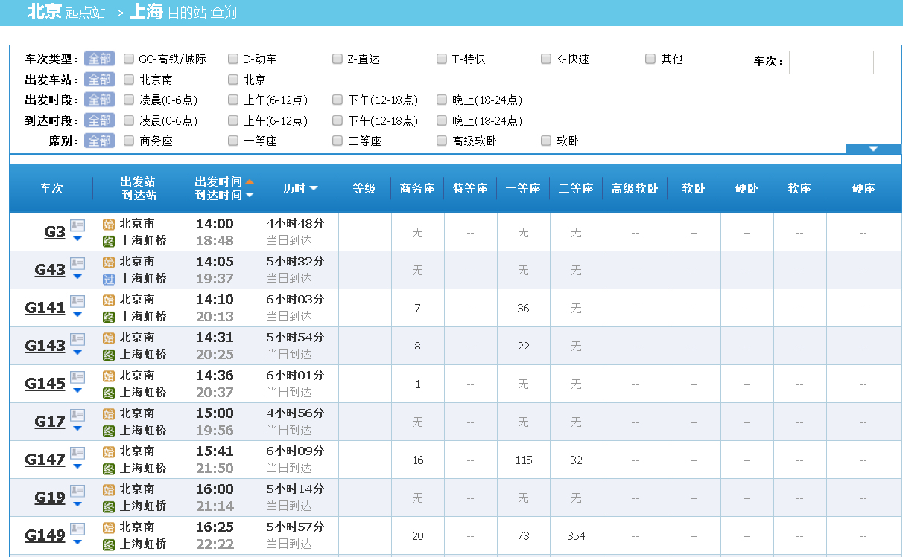
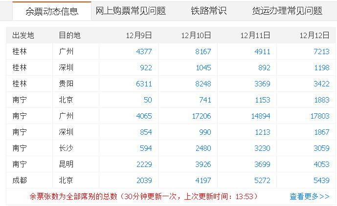
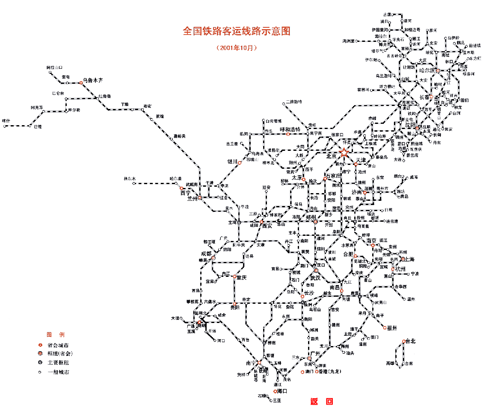

# PostgreSQL × 12306 搶火車票 — varbit / SKIP LOCKED / Array 架構設計

> 來源：[digoal - PostgreSQL 與 12306 搶火車票的思考 (2016-11-24)](https://github.com/digoal/blog/blob/master/201611/20161124_02.md)
>
> 相關：[門禁廣告銷售系統與 PostgreSQL 實現](https://github.com/digoal/blog/blob/master/201611/20161124_01.md)

---

這篇文章從 12306 的業務場景出發，剖析高併發購票系統的設計痛點，並用 PostgreSQL 的 10 個特性逐一對應解法。核心挑戰：**查詢餘票的高併發、購票的 row lock 衝突、座位空洞最小化、路徑規劃**。

---

## 1. 業務場景與設計痛點

### 1.1 核心功能

| 功能 | 類型 | 挑戰 |
|------|------|------|
| 查詢餘票 | 高併發 read + aggregate | CPU / IO 密集，幾億 user 同時查 |
| 購票 | 高併發 write（庫存遞減） | row lock 衝突，同一座位可能被多人搶 |
| 中途票 | 區段購買，避免空洞 | 同一座位不同區段可賣給不同人 |
| 路徑規劃 | 無直達時推薦中轉 | Graph traversal（pgrouting） |
| 對賬 / 退改簽 | 非同步 / 批量 | 一致性要求 |



### 1.2 核心矛盾

> 「眼見不一定為實」——高併發期間，用戶看到的餘票資訊可能在付款前就已失效。因此**餘票查詢可以是非同步統計結果**，允許一定延遲。




### 1.3 座位空洞問題

從北京到上海，途經天津、徐州、南京、蘇州。如果天津→南京被人買了，剩下的北京→天津、南京→上海**還能繼續賣**。目標是最大化利用率，減少「有票不能賣」的情況。

---

## 2. PostgreSQL 10 大法寶

### 法寶 1：varbit — 座位區段銷售狀態

每個座位用 varbit 表示途經站點的已售狀態。6 個站點 → 6-bit：

```
'000000'         -- 全程未售
'010000'         -- 天津→徐州已售（只設起點到終點-1 的 bit）
```

**餘票統計**：對 varbit 做 bitwise AND + count 即可。統計任意組合站點的餘票（北京→天津、北京→徐州...蘇州→上海）。

```sql
-- UDF：統計指定起始站餘票
udf_count(varbit, start_pos, end_pos) RETURNS record

-- 本質是：bitrange = 全 0 的座位數量
SELECT count(*) FROM train_sit
WHERE getbit(station_bit, start, end-1) = repeat('0', end-start)::varbit;
```

### 法寶 2：Array + GIN — 快速查詢可搭乘車次

```sql
CREATE TABLE train (
  id INT PRIMARY KEY,
  go_date DATE,
  train_num NAME,
  station TEXT[]  -- 途經站點陣列
);

-- GIN index 支援 @> (包含) 運算
CREATE INDEX ON train USING GIN (station);

-- 查詢從北京到南京的所有車次
SELECT train_num FROM train
WHERE station @> ARRAY['北京', '南京'];
```

每秒可處理數十萬次查詢。

> 補充（Senior Dev）：`@>` 只能確認「車次途經這兩個站」，不能確保「北京在南京之前」。需要再加 `array_pos(station, '北京') < array_pos(station, '南京')` 條件。實務中可將此邏輯預先計算為 generated column。

### 法寶 3：SKIP LOCKED — 避免購票 Lock 衝突

核心購票邏輯：同一車次同一座位可能被多人同時搶，傳統 `FOR UPDATE` 會讓其他人等待。用 `SKIP LOCKED` 跳過已被鎖定的 row：

```sql
SELECT * FROM train_sit
WHERE train_num = 'G1921'
  AND go_date = '2026-01-20'
  AND sit_level = '二等座'
  AND getbit(station_bit, from_pos, to_pos-1) = repeat('0', to_pos-from_pos)::varbit
ORDER BY station_bit DESC  -- 優先售賣已售中途票的座位（減少空洞）
FOR UPDATE SKIP LOCKED
LIMIT 1;
```

> 補充（Senior Dev）：
> - `SKIP LOCKED` 在 PG 9.5+ 可用，本質是 work queue pattern（跳過被其他 worker 正在處理的 item）
> - `ORDER BY station_bit DESC` 的設計意圖：`111000` 的座位比 `110000` 更優先售出（已售區段越多 → 剩餘區段越少 → 先清掉減少空洞），符合鐵路最大化利用率的目標
> - `NOWAIT` vs `SKIP LOCKED`：NOWAIT 遇到 locked row 直接報錯（需 application retry），SKIP LOCKED 透明跳過。購票場景 SKIP LOCKED 更合適
> - **熱點問題**：即使有 SKIP LOCKED，如果同一車次只剩少數座位，大量 connection 仍會競爭同一批 row。德哥原方案中有 `mod(pg_backend_pid(), 100) = mod(pk, 100)` 的 hash 分流技巧（將不同 PID 分流到不同 row range），但有「部分 PID 賣完後找不到票」的風險

### 法寶 4：CURSOR

大批量查詢使用 CURSOR 減少重複掃描。

### 法寶 5：路徑規劃（pgrouting）

當直達車無票時，自動計算中轉路線（時間最短 / 價格最低 / 中轉次數最少）。



```sql
-- pgrouting 支援 Dijkstra / A* / 多種路徑演算法
SELECT * FROM pgr_dijkstra(
  'SELECT id, source, target, cost FROM railway_edges',
  start_station_id, end_station_id
);
```

### 法寶 6-10

| # | 法寶 | 用途 |
|---|------|------|
| 6 | Parallel Query | 餘票統計時多核加速計算 |
| 7 | Resource Isolation (cgroups) | 尖峰時刻確保關鍵業務（購票）有足夠 CPU/IO/Memory |
| 8 | Sharding（plproxy / Citus / pg-xl） | 全國鐵路數據分庫儲存 |
| 9 | Recursive CTE | 查詢鐵路網中可達的所有站點 / 轉乘路徑 |
| 10 | MPP（Greenplum / PG-XL） | 春節運力預測、加開車次數據挖掘 |

---

## 3. 資料庫設計（偽代碼）

### 3.1 核心表結構

```sql
-- 列車資訊
CREATE TABLE train (
  id INT PRIMARY KEY,
  go_date DATE,
  train_num NAME,
  station TEXT[]     -- 途經站點陣列
);

-- 座位資訊（每個座位一條 row）
CREATE TABLE train_sit (
  id SERIAL8 PRIMARY KEY,
  tid INT REFERENCES train(id),
  bno INT,                -- 車廂號
  sit_level TEXT,         -- 席別
  sit_no INT,             -- 座位號
  station_bit VARBIT      -- 途經站點 BIT 位
);
```

### 3.2 購票函數

```sql
CREATE OR REPLACE FUNCTION buy(
  INOUT i_train_num NAME,
  INOUT i_fstation TEXT,
  INOUT i_tstation TEXT,
  INOUT i_go_date DATE,
  INOUT i_sits INT,          -- 購買張數
  OUT o_slevel TEXT,
  OUT o_bucket_no INT,
  OUT o_sit_no INT,
  OUT o_order_status BOOLEAN
) ...
```

核心步驟：
1. 從 `train` 表查詢站點陣列 + 起終點位置
2. 用 `FOR UPDATE SKIP LOCKED` 選取符合條件的座位
3. 用 `set_bit()` 更新 `station_bit`，標記已售站點範圍
4. `ORDER BY station_bit DESC` 優先清掉已售中途票的座位

### 3.3 `array_pos()` 輔助函數

```sql
CREATE OR REPLACE FUNCTION array_pos(a ANYARRAY, b ANYELEMENT) RETURNS INT AS $$
DECLARE
  i INT;
BEGIN
  FOR i IN 1..array_length(a, 1) LOOP
    IF b = a[i] THEN RETURN i; END IF;
  END LOOP;
  RETURN NULL;
END;
$$ LANGUAGE plpgsql;
```

> 補充（Senior Dev）：生產中建議用 C function 實作 array_pos（O(1) pointer arithmetic vs plpgsql 的 O(n) loop），或用 PG 內建的 `array_position()`（PG 9.5+）。

### 3.4 Partial Index 設計

```sql
-- 只索引還有空位（非全 1）的座位，減少掃描
CREATE INDEX idx_train_sit_station_bit
  ON train_sit (station_bit)
  WHERE station_bit <> repeat('1', 14)::varbit;
```

> 補充（Senior Dev）：partial index 的關鍵：`WHERE station_bit <> repeat('1', 14)::varbit` 確保只有未售完的座位在 index 中。在 10M row 只賣出 10% 的場景，index 只掃 1M row 而非 10M。

---

## 4. 效能基準（PL/pgSQL buy() 函數）

測試環境：1 趟車、14 個站點、196M 座位（200 萬車廂 × 98 座位）。

| 模式 | TPS | Latency |
|------|-----|---------|
| 不加 NOWAIT | 1,831 tps | 8.7 ms |
| 加 NOWAIT (`FOR UPDATE NOWAIT`) | **7,818 tps** | 2.0 ms |

NOWAIT 模式大幅降低鎖等待時間（失敗直接報錯 → application retry，而非在 DB 內排隊）。

### 原始 PL/pgSQL buy() 函數（完整版）

```sql
CREATE OR REPLACE FUNCTION buy(
  INOUT i_train_num NAME,
  INOUT i_fstation TEXT,
  INOUT i_tstation TEXT,
  INOUT i_go_date DATE,
  OUT o_slevel TEXT,
  OUT o_bucket_no INT,
  OUT o_sit_no INT,
  OUT o_order_status BOOLEAN
) RETURNS RECORD AS $$
DECLARE
  curs1 REFCURSOR;
  curs2 REFCURSOR;
  v_row INT;
  v_station TEXT[];
  v_train_id INT;
  v_train_bucket_id INT;
  v_train_sit_id INT;
  v_from_station_idx INT;
  v_to_station_idx INT;
  v_station_len INT;
BEGIN
  SET enable_seqscan = off;
  v_row := 0;
  o_order_status := false;

  -- 查詢列車資訊與站點位置
  SELECT array_length(station,1), station, id,
         array_pos(station, i_fstation),
         array_pos(station, i_tstation)
  INTO v_station_len, v_station, v_train_id,
       v_from_station_idx, v_to_station_idx
  FROM train
  WHERE train_num = i_train_num AND go_date = i_go_date;

  IF NOT found OR
     v_from_station_idx IS NULL OR
     v_to_station_idx IS NULL OR
     v_from_station_idx >= v_to_station_idx THEN
    RETURN;
  END IF;

  -- Cursor 1：優先找已有中途票的座位（station_bit 非全 0 也非全 1）
  OPEN curs2 FOR
    SELECT tid, tbid, sit_no FROM train_sit
    WHERE (station_bit &
           bitsetvarbit(repeat('0', v_station_len-1)::varbit,
             v_from_station_idx-1,
             v_to_station_idx - v_from_station_idx, 1))
          = repeat('0', v_station_len-1)::varbit
      AND station_bit <> repeat('1', v_station_len-1)::varbit
    LIMIT 1
    FOR UPDATE NOWAIT;

  LOOP
    FETCH curs2 INTO v_train_id, v_train_bucket_id, o_sit_no;
    IF found THEN
      UPDATE train_sit
      SET station_bit = bitsetvarbit(station_bit,
            v_from_station_idx-1,
            v_to_station_idx - v_from_station_idx, 1)
      WHERE CURRENT OF curs2;
      GET DIAGNOSTICS v_row = ROW_COUNT;
      IF v_row = 1 THEN
        SELECT sit_level, bno INTO o_slevel, o_bucket_no
        FROM train_bucket WHERE id = v_train_bucket_id;
        CLOSE curs2;
        o_order_status := true;
        RETURN;
      END IF;
    ELSE
      CLOSE curs2;
      EXIT;
    END IF;
  END LOOP;

  -- Cursor 2：找全新空座位
  OPEN curs1 FOR
    SELECT id, tid, strpos(sit_bit::text, '0'), sit_level, bno
    FROM train_bucket
    WHERE sit_remain > 0
    LIMIT 1
    FOR UPDATE NOWAIT;
  ...
END;
$$ LANGUAGE plpgsql;
```

> `pgrowlocks()` 用於解決熱點鎖等待的嘗試被放棄：德哥原文標註改用 pgrowlocks 查詢已鎖定 row 的成本約 300ms，不如 NOWAIT + application retry 划算。

> 補充（Senior Dev）：
>
> **現代改進方向**：
> 1. **Range Type + Exclusion Constraint**（PG 9.2+）：替代 varbit，`int4range(from_pos, to_pos, '[)')` + `EXCLUDE USING GIST (train_id WITH =, seat_range WITH &&)`，讓 DB kernel 層面保證同一座位區段不重複售出，而非 application-level 的 SKIP LOCKED
> 2. **Advisory Lock per Seat**：對於極熱門車次的最後幾個座位，SKIP LOCKED 也無能為力（所有 connection 都 SKIP 同一批 row → 沒 row 可搶）。此時可用 `pg_try_advisory_xact_lock(seat_id)` 做 per-seat 排隊
> 3. **Queue-based 購票**：由一個 producer 合併購票請求（`LISTEN/NOTIFY` + pg_background），將隨機競爭變成 FIFO 排隊（減少 DB lock contention）
> 4. **真正的 12306 技術路線**：12306 最終採用的不是傳統 RDBMS 的 row lock 方案，而是**記憶體庫存計算** + **排隊系統**（使用 GemFire / 自研分散式記憶體網格），只在最後扣庫存時寫 DB。PG 的方案是 demo 層面的架構探討，不應直接用於億級 concurrent 的生產環境

---

## 5. varbit 優先級策略：最大化利用率

座位選擇時的優先級規則：已售中途票越多的座位 → 優先選。

```
座位 A: 111000 (前 3 站已售)
座位 B: 110000 (前 2 站已售)
查詢:   最後 2 站 (000011)

座位 A: 111000 | 000011 = 111011 ← 選這個（剩前 4 站可賣）
座位 B: 110000 | 000011 = 110011 ← 留著（更多彈性）

ORDER BY station_bit DESC 實現此優先級
```

---

## 6. 阿里雲 RDS PG 客製化增強

| 功能 | 說明 |
|------|------|
| `bit_count_range_zero(varbit, start, end)` | 統計指定範圍內 bit=0 的數量（餘票統計） |
| `array_pos()` C 版本 | O(1) 效能 |
| `set_bit()` / `get_bit()` 的 varbit 批量操作 | 購票一次更新多位 |

---

## 參考

1. [setbitvarbit UDF](http://blog.163.com/digoal@126/blog/static/163877040201302192427651/)
2. [阿里雲 RDS PG 用戶畫像推薦系統](https://github.com/digoal/blog/blob/master/201610/20161021_01.md)
3. [pgrouting 動態路徑規劃](https://github.com/digoal/blog/blob/master/201607/20160710_01.md)
4. [門禁廣告銷售系統與 PG](https://github.com/digoal/blog/blob/master/201611/20161124_01.md)
