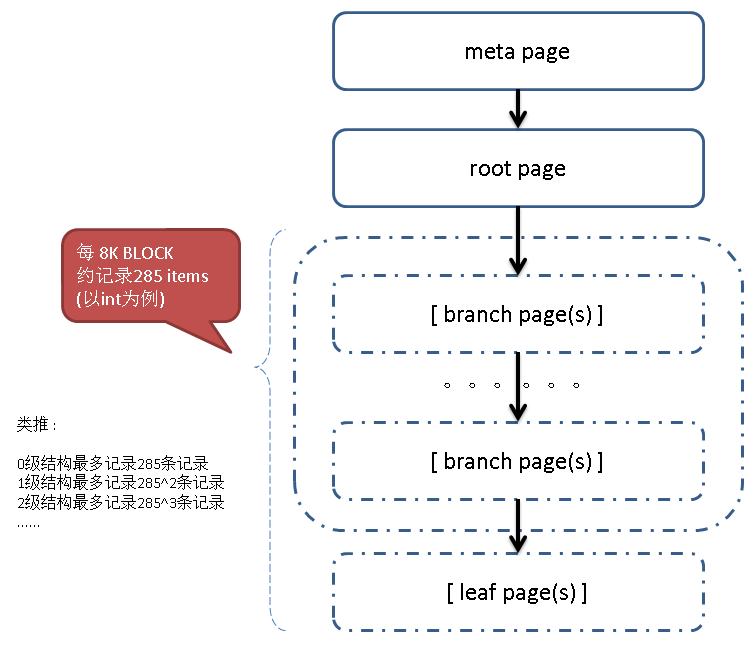
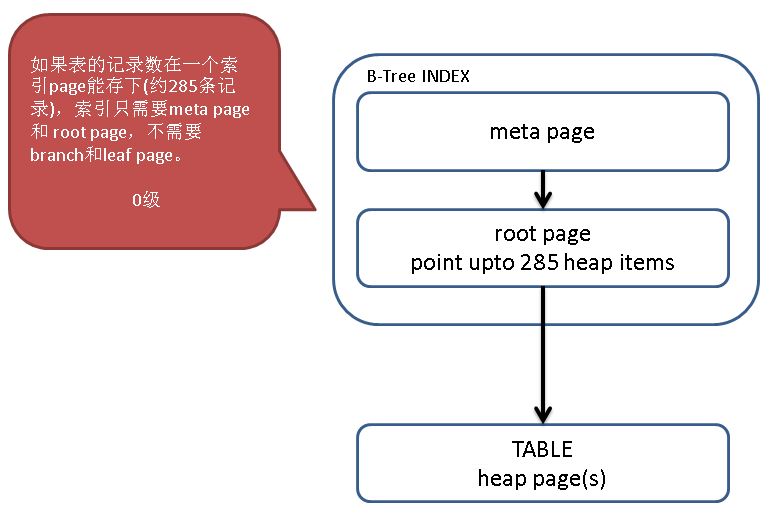
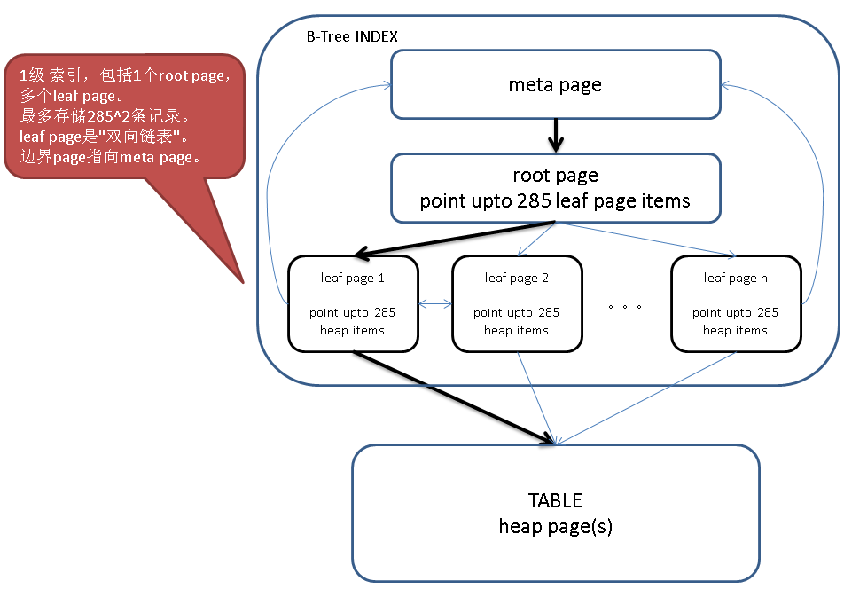
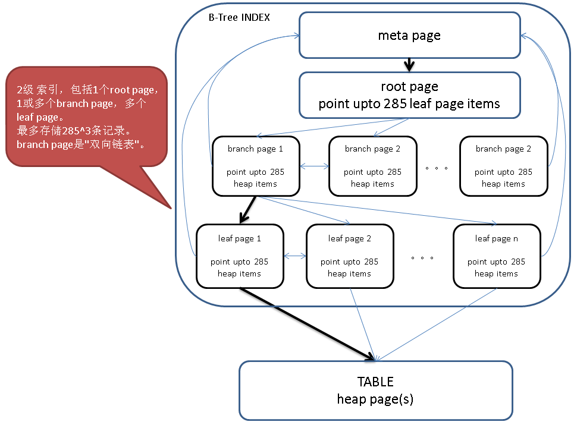
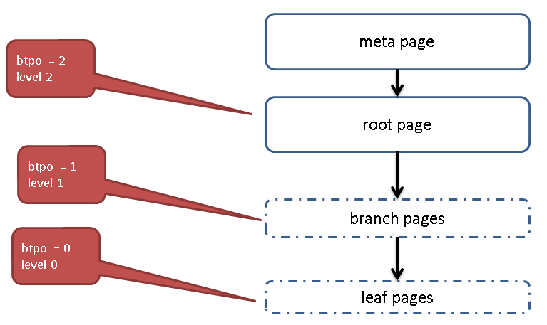

# PostgreSQL B-Tree Index 內部結構 — Pageinspect 深度剖析

> 來源：[digoal - 深入浅出PostgreSQL B-Tree索引结构 (2016-05-28)](https://github.com/digoal/blog/blob/master/201605/20160528_01.md)
>
> 2026 更新：補充 PG 14-17 B-Tree 內部改進（deduplication、bottom-up deletion、allelqualimage）、Production 結構估算公式。

---

## B-Tree Page 類型與 Flag 定義

PostgreSQL B-Tree 是 High-Concurrency B-Tree Management Algorithm 的變種（詳見 `src/backend/access/nbtree/README`）。Index page 分為四類：

| 類型 | `btpo_flags` | 說明 |
|------|-------------|------|
| meta page | `BTP_META (8)` | 紀錄 root page id、level 等全局 metadata，總是存在 |
| root page | `BTP_ROOT (2)` | B-Tree 根節點，level 隨數據量增長 |
| branch page | `0` | 內部節點，儲存指向下層 page 的 pointer |
| leaf page | `BTP_LEAF (1)` | 最底層，儲存指向 heap tuple 的 TID（ctid） |
| leaf + root | `BTP_LEAF \| BTP_ROOT (3)` | 數據量極小時，同一 page 身兼 leaf 與 root |

```c
// src/include/access/nbtree.h
#define BTP_LEAF                (1 << 0)  /* leaf page */
#define BTP_ROOT                (1 << 1)  /* root page */
#define BTP_DELETED             (1 << 2)  /* page has been deleted */
#define BTP_META                (1 << 3)  /* meta-page */
#define BTP_HALF_DEAD           (1 << 4)  /* empty, but still in tree */
#define BTP_SPLIT_END           (1 << 5)  /* rightmost page of split group */
#define BTP_HAS_GARBAGE         (1 << 6)  /* page has LP_DEAD tuples */
#define BTP_INCOMPLETE_SPLIT    (1 << 7)  /* right sibling's downlink is missing */
```

- meta page 和 root page 必須存在
- 只有 `btpo = 0`（第 0 層，最底層）的 leaf page 儲存的 ctid 才指向 heap page
- Branch page（`btpo > 0`）儲存的 ctid 指向同層級其他 index page（雙向鏈表）或下層 index page
- 層級用 `level` 表示：例如 `level = 2` 表示有 2 層 branch + 1 層 leaf（共 3 層非 meta page）



---

## Level 0：Meta + Root，無 Branch / Leaf

數據量極小（約 < 1 page 能容納的 row 數），只有 meta + root page，root 同時是 leaf。

```sql
CREATE EXTENSION pageinspect;

CREATE TABLE tab1(id int PRIMARY KEY, info text);
INSERT INTO tab1 SELECT generate_series(1, 100), md5(random()::text);
VACUUM ANALYZE tab1;
```

**Meta page：**

```sql
SELECT * FROM bt_metap('tab1_pkey');
--  magic  | version | root | level | fastroot | fastlevel
-- --------+---------+------+-------+----------+-----------
--  340322 |       2 |    1 |     0 |        1 |         0
```

- `root = 1`：root page 編號
- `level = 0`：無 branch / leaf，單層

**Root page stats（btpo = 0, btpo_flags = 3 = leaf + root）：**

```sql
SELECT * FROM bt_page_stats('tab1_pkey', 1);
--  blkno | type | live_items | dead_items | avg_item_size | page_size | free_size | btpo_prev | btpo_next | btpo | btpo_flags
-- -------+------+------------+------------+---------------+-----------+-----------+-----------+-----------+------+------------
--      1 | l    |        100 |          0 |            16 |      8192 |      6148 |         0 |         0 |    0 |          3
```

- `btpo_prev` / `btpo_next` = 0：單 page，無前後鄰居
- `live_items = 100`：本 page 存了 100 個 index entry

**Leaf items（ctid 指向 heap page）：**

```sql
SELECT * FROM bt_page_items('tab1_pkey', 1);
--  itemoffset |  ctid   | itemlen | nulls | vars |          data
-- ------------+---------+---------+-------+------+-------------------------
--           1 | (0,1)   |      16 | f     | f    | 01 00 00 00 00 00 00 00
--           2 | (0,2)   |      16 | f     | f    | 02 00 00 00 00 00 00 00
--  ...
--         100 | (0,100) |      16 | f     | f    | 64 00 00 00 00 00 00 00

-- 根據 ctid 查 heap record
SELECT * FROM tab1 WHERE ctid = '(0,100)';
```



---

## Level 1：Meta + Root + Leaf Page

數據量超過 1 page，root 分裂出 leaf page。

```sql
TRUNCATE tab1;
INSERT INTO tab1 SELECT generate_series(1, 1000), md5(random()::text);
VACUUM ANALYZE tab1;

SELECT * FROM bt_metap('tab1_pkey');
--  magic  | version | root | level | fastroot | fastlevel
-- --------+---------+------+-------+----------+-----------
--  340322 |       2 |    3 |     1 |        3 |         1
```

- `level = 1`：1 層 leaf（root 不再同時是 leaf）
- `root = 3`：root page 已移動到 page 3

**Root page（btpo = 1, btpo_flags = 2 = root）：**

```sql
SELECT * FROM bt_page_stats('tab1_pkey', 3);
--  blkno | type | live_items | ... | btpo | btpo_flags
-- -------+------+------------+-----+------+------------
--      3 | r    |          3 | ... |    1 |          2

SELECT * FROM bt_page_items('tab1_pkey', 3);
--  itemoffset | ctid  | itemlen | nulls | vars |          data
-- ------------+-------+---------+-------+------+-------------------------
--           1 | (1,1) |       8 | f     | f    |
--           2 | (2,1) |      16 | f     | f    | 6f 01 00 00 00 00 00 00
--           3 | (4,1) |      16 | f     | f    | dd 02 00 00 00 00 00 00
```

- Root page 的 item 指向 leaf page，`data` 是該 leaf page 儲存的**最小值**
- 最左 leaf page（ctid `(1,1)`）的 `data` 為空——慣例：最左 page 不儲存最小值
- 若有右 leaf page，leaf page 第一條 item 為右鏈路指標

**Leaf page 範例（page 1 = 最左）：**

```sql
SELECT * FROM bt_page_stats('tab1_pkey', 1);
--  blkno | type | live_items | ... | btpo_prev | btpo_next | btpo | btpo_flags
-- -------+------+------------+-----+-----------+-----------+------+------------
--      1 | l    |        367 | ... |         0 |         2 |    0 |          1
```

- `btpo = 0`：最底層
- `btpo_flags = 1`：leaf
- `btpo_prev = 0`：無左鄰（指向 meta page）
- `btpo_next = 2`：右鄰 leaf page = 2

Leaf page 第一條 item = 右鏈路的起始 item（`data` = 右鏈路最小值），第二條才開始是本 page 的實際 heap ctid：

```sql
SELECT * FROM bt_page_items('tab1_pkey', 1);
--  itemoffset |  ctid   | itemlen | nulls | vars |          data
-- ------------+---------+---------+-------+------+-------------------------
--           1 | (3,7)   |      16 | f     | f    | 6f 01 00 00 00 00 00 00  -- 右鏈指標
--           2 | (0,1)   |      16 | f     | f    | 01 00 00 00 00 00 00 00  -- 實際 heap ctid
```

最右 leaf page（page 4，無右鏈路）則第一條即為實際 heap ctid：

```sql
SELECT * FROM bt_page_items('tab1_pkey', 4);
--  itemoffset |  ctid   | itemlen | ... |          data
-- ------------+---------+---------+-----+-------------------------
--           1 | (6,13)  |      16 | ... | dd 02 00 00 00 00 00 00  -- 無右鏈，直接是 heap ctid
```



---

## Level 2：Meta + Root + Branch + Leaf

數據量再增大，root 下多了一層 branch page。

```sql
CREATE TABLE tab2(id int PRIMARY KEY, info text);
INSERT INTO tab2 SELECT trunc(random() * 10000000), md5(random()::text)
FROM generate_series(1, 1000000)
ON CONFLICT ON CONSTRAINT tab2_pkey DO NOTHING;
-- INSERT 0 951379
VACUUM ANALYZE tab2;

SELECT * FROM bt_metap('tab2_pkey');
--  magic  | version | root | level | fastroot | fastlevel
-- --------+---------+------+-------+----------+-----------
--  340322 |       2 |  412 |     2 |      412 |         2
```

- `level = 2`：1 層 branch + 1 層 leaf

**Root page（btpo = 2, btpo_flags = 2）：**

```sql
SELECT * FROM bt_page_items('tab2_pkey', 412);
--  itemoffset |   ctid   | itemlen | ... |          data
-- ------------+----------+---------+-----+-------------------------
--           1 | (3,1)    |       8 | ... |                          -- 最左 branch（空 data）
--           2 | (2577,1) |      16 | ... | e1 78 0b 00 00 00 00 00  -- branch 最小值
--           3 | (1210,1) |      16 | ... | ec 3a 18 00 00 00 00 00
--  ...
--          11 | (1392,1) |      16 | ... | df b0 8a 00 00 00 00 00
```

**Branch page（btpo = 1, btpo_flags = 0）：**

```sql
SELECT * FROM bt_page_stats('tab2_pkey', 3);
--  blkno | type | live_items | ... | btpo_prev | btpo_next | btpo | btpo_flags
-- -------+------+------------+-----+-----------+-----------+------+------------
--      3 | i    |        254 | ... |         0 |      2577 |    1 |          0

SELECT * FROM bt_page_items('tab2_pkey', 3);
--  itemoffset |   ctid   | itemlen | ... |          data
-- ------------+----------+---------+-----+-------------------------
--           1 | (735,1)  |      16 | ... | e1 78 0b 00 00 00 00 00  -- 右 branch 指標
--           2 | (1,1)    |       8 | ... |                          -- 起始（空 data）
--           3 | (2581,1) |      16 | ... | a8 09 00 00 00 00 00 00  -- leaf page 指標
```

- Branch page 第一條同樣是右鏈路指標
- Branch page 的 item 指向下層 leaf page（btpo = 0）

**Leaf page（btpo = 0, btpo_flags = 1）：**

```sql
SELECT * FROM bt_page_items('tab2_pkey', 1);
--  itemoffset |    ctid    | ... |          data
-- ------------+------------+-----+-------------------------
--           1 | (4985,16)  | ... | a8 09 00 00 00 00 00 00
--           2 | (7305,79)  | ... | 01 00 00 00 00 00 00 00
--  ...
--         242 | (1329,101) | ... | a0 09 00 00 00 00 00 00

-- 第一條為右鏈指標，(7305,79) 才是本 page 最小值
SELECT * FROM tab2 WHERE ctid = '(7305,79)';
--  id | info
-- ----+----------------------------------
--   1 | 18aaeb74c359355311ac825ae2aeb22a

SELECT min(id) FROM tab2;  -- 1，驗證
```



---

## Level 3+：多層結構（1 億行）

```sql
CREATE TABLE tab3(id int PRIMARY KEY, info text);
INSERT INTO tab3 SELECT generate_series(1, 100000000), md5(random()::text);

SELECT * FROM bt_metap('tab3_pkey');
--  magic  | version |  root  | level | fastroot | fastlevel
-- --------+---------+--------+-------+----------+-----------
--  340322 |       2 | 116816 |     3 |   116816 |         3
```

- `level = 3`：2 層 branch + 1 層 leaf

**遍歷路徑（以 level = 3 為例）：**

```
meta (level 資訊) → root (btpo = 3, btpo_flags = 2)
                  → branch L2 (btpo = 2, btpo_flags = 0)
                  → branch L1 (btpo = 1, btpo_flags = 0)
                  → leaf L0  (btpo = 0, btpo_flags = 1)
                  → heap tuple
```

每層 item 的第一條為右鏈路指標（最右 page 除外），`data` 為該 item 指向的下層 page 之最小值（最左 page 的起始 item `data` 為空）。


---

## EXPLAIN BUFFERS 解讀：為什麼 Hit Count 感覺不對？

### 基礎規則

以 `level = 2` 的 B-tree（meta + root + branch + leaf = 4 層 index page）為例：

```sql
SELECT * FROM bt_metap('tbl1_pkey');
-- root = 412, level = 2
```



**等值查詢，row 存在（Index Only Scan）：**

```sql
EXPLAIN (ANALYZE, VERBOSE, TIMING, COSTS, BUFFERS)
SELECT id FROM tbl1 WHERE id = 5;
--  Index Only Scan using tbl1_pkey ...
--    Index Cond: (tbl1.id = 5)
--    Heap Fetches: 0
--    Buffers: shared hit=4
--  Planning Time: 0.071 ms
--  Execution Time: 0.046 ms
```

讀了 4 個 page：**1 meta + 1 root + 1 branch + 1 leaf**。另加 1 個 visibility map page（見後續分析），但 `EXPLAIN BUFFERS` 對 vm page 的計數有特殊行為。

**等值查詢，row 不存在：**

```sql
EXPLAIN (ANALYZE, VERBOSE, TIMING, COSTS, BUFFERS)
SELECT id FROM tbl1 WHERE id = 1;  -- 1 不存在
--  Index Only Scan using tbl1_pkey ...
--    Index Cond: (tbl1.id = 1)
--    Heap Fetches: 0
--    Buffers: shared hit=3
--  Planning Time: 0.086 ms
--  Execution Time: 0.082 ms
```

讀了 3 個 page：**1 meta + 1 root + 1 branch + 1 leaf = 4，但顯示 3**。差異是：row 不存在時不需要查 visibility map（沒有 heap tuple 需要驗證可見性），explain 不計入 vm page。

**多個等值查詢（`IN (...)`）：**

```sql
EXPLAIN (ANALYZE, VERBOSE, TIMING, COSTS, BUFFERS)
SELECT id FROM tbl1 WHERE id IN (1, 2, 3, 4, 100, 1000, 10000);
--  Buffers: shared hit=22
--  1 meta + 7 × (1 root + 1 branch + 1 leaf) = 22
```

每個 value 都會獨立從 root 遍歷到 leaf（即使相鄰值在同一個 leaf page）。這是 Index Scan 的固有行為——每次 lookup 是獨立 operation。

**範圍查詢（`id > 0 AND id <= 7`）：**

```sql
EXPLAIN (ANALYZE, VERBOSE, TIMING, COSTS, BUFFERS)
SELECT id FROM tbl1 WHERE id > 0 AND id <= 7;
--  Buffers: shared hit=4
--  1 meta + 1 root + 1 branch + 1 leaf = 4
```

範圍查詢只遍歷一次，沿 leaf page 的雙向鏈表掃描後續 page，不重複讀 root/branch。比多次等值查詢高效得多。

> 補充（Senior Dev）：`id IN (1,2,3,4,5,6,7)` 讀了 22 個 page（7 次從 root 遍歷），而 `id > 0 AND id <= 7` 只讀了 4 個 page（1 次遍歷）。**這是 optimizer 未自動將 IN-list 合併為 range scan 的情況**，PG 14+ 部分場景已改善此行為。Production 中若 IN-list 的值連續或接近，手動改為 range 可顯著降低 buffer 讀取。

---

## Visibility Map 與 Buffer Hit 計數細節

Index Only Scan 需要驗證 heap tuple 對當前 transaction 是否可見，這通過 visibility map (VM) 完成。

```c
// src/include/common/relpath.h
typedef enum ForkNumber
{
    InvalidForkNumber = -1,
    MAIN_FORKNUM = 0,
    FSM_FORKNUM,          // Free Space Map
    VISIBILITYMAP_FORKNUM, // Visibility Map
    INIT_FORKNUM
} ForkNumber;
```

### 實際追蹤：`explain buffers` 的 VM page 計數

使用 `pageinspect` + `pg_buffercache` 驗證：

```sql
CREATE EXTENSION pageinspect;
CREATE EXTENSION pg_buffercache;

-- 輔助函數：將 hex data 反轉後轉 int（用於解讀 data column）
CREATE OR REPLACE FUNCTION idx2int(text) RETURNS int AS $$
DECLARE
  res text := '';
  res1 int8;
  x text := '';
BEGIN
  FOR x IN SELECT regexp_split_to_table($1, ' ')
  LOOP
    res := x || res;
  END LOOP;
  EXECUTE format($_$ SELECT x'%s'::int8 $_$, res) INTO res1;
  RETURN res1::int;
END;
$$ LANGUAGE plpgsql STRICT;
```

**追蹤 id = 5 的遍歷：**

```sql
-- meta: root=412, level=2
SELECT * FROM bt_metap('tbl1_pkey');

-- root page → 找到 target branch page 3
SELECT *, idx2int(data) FROM bt_page_items('tbl1_pkey', 412);

-- branch page 3 → 找到 target leaf page 1
SELECT *, idx2int(data) FROM bt_page_items('tbl1_pkey', 3);

-- leaf page 1 → 找到 ctid (19518, 66) = heap tuple
SELECT *, idx2int(data) FROM bt_page_items('tbl1_pkey', 1);

SELECT ctid, * FROM tbl1 WHERE ctid = '(19518,66)';
--     ctid    | id |               info
-- ------------+----+----------------------------------
--  (19518,66) |  5 | 01113e164911cf0eaf5db51b4c6e086b
```

**計算 VM page 位置：**

```sql
SHOW block_size;  -- 8192

-- 每個 VM bit 代表一個 heap page
-- heap page 19518 對應的 VM bit 位置：
SELECT 2 * 19518 / 8.0;  -- 4879.5 bytes → 在第 0 個 VM block 內

-- 驗證：tbl1 的 VM fork 只有 block 0 和 block 1，
-- heap page 19518 落在 block 0
SELECT * FROM pg_buffercache
WHERE relfilenode = pg_relation_filenode('tbl1'::regclass)
  AND relforknumber = 2;  -- 2 = VISIBILITYMAP_FORKNUM
--  bufferid | relblocknumber | ...
-- ----------+----------------+-----
--    402016 |              0 | ...   ← page 19518 的 VM bit 在此
--    402017 |              1 | ...
```

**總結 Buffer 命中規則：**

| 場景 | Buffer Count | 組成 |
|------|-------------|------|
| Row 存在 | 4 | meta + root + branch + leaf（vm 被計入但 meta 可能被排除，數字巧合） |
| Row 不存在 | 3 | meta + root + branch + leaf − vm（不需要查 vm） |
| 多個等值 (N values) | 1 + 3N | 1 meta + N × (root + branch + leaf) |
| 範圍查詢 | ≤ 4 + leaf pages | 1 次遍歷 root → leaf，沿鏈表掃描 |

> 補充（Senior Dev）：原文作者發現 `shared hit=4`（row 存在）vs `shared hit=3`（row 不存在）時質疑 meta page 是否未被計入。實際行為是：PG 的 Buffer 計數對 vm page 的處理在不同版本有微妙差異——row 存在時多出的那 1 個 hit 是 vm page。PG 14+ 的 Buffer 計數邏輯已標準化，建議在 PG 17 中重新驗證此行為。

---

## PG 14-17 B-Tree 演進

| 版本 | 改進 | 影響 |
|------|------|------|
| PG 13 | B-Tree **deduplication**（`deduplicate_items`） | 重複 key 只存一次 + posting list，index 體積大幅減少 |
| PG 14 | **Bottom-up index deletion** | 減少 B-Tree page split，降低 index bloat |
| PG 15 | `allelqualimage` 優化 | 相同 key 的多個 heap TID 可共用 index tuple |
| PG 16 | B-Tree parallel vacuum | 大 table 的 index vacuum 可並行 |
| PG 17 | B-Tree index 支援 `REINDEX CONCURRENTLY` 改進 | 減少重建 index 時的鎖競爭 |

### PG 13+ Deduplication 效果

```sql
-- 查看是否啟用 deduplication（PG 13+ 預設 on）
SELECT * FROM bt_metap('tab1_pkey');
--  allequalimage: t   ← 等值 key 共用 index tuple

-- 控制參數
SET deduplicate_items = off;  -- 僅對新寫入生效
```

> 補充（Senior Dev）：Deduplication 是 PG 13 對 B-Tree 最重要的改進。若有大量重複 key（如 status column 的 index），dedup 可將 index size 減少 30-70%。注意 `deduplicate_items` 是 storage parameter，需在 `CREATE INDEX` 時指定，或 `ALTER INDEX ... SET (deduplicate_items = off)`。

---

## Senior Dev：B-Tree Page 估算公式

**預估 index 層數（level）：**

```
fanout ≈ page_size / (avg_key_size + ctid_size)
         = 8192 / (avg_key_size + 6)

total_leaf_pages ≈ total_rows / (fanout * fillfactor)

level ≈ ceil(log_fanout(total_leaf_pages))
```

**範例**：1 億行 `int4` PK（avg_key_size = 8），fanout ≈ 8192 / 14 ≈ 585，total_leaf_pages ≈ 100M / (585 × 0.9) ≈ 190,000，level ≈ log_585(190000) ≈ 1.88 → **level = 2**（1 branch + 1 leaf）。

**範例**：10 億行，level ≈ log_585(1,900,000) ≈ 2.3 → **level = 3**（2 branch + 1 leaf）。

### Index Scan 最小 Buffer 讀取

```
point lookup = 1 meta + level (branch pages) + 1 leaf = 2 + level
range scan   = 1 meta + level (branch) + N leaf pages  = 1 + level + N
```
