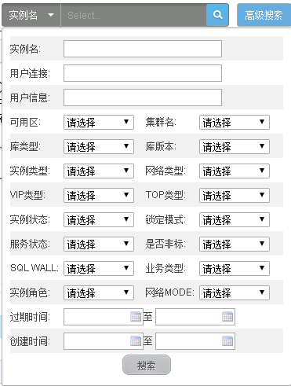
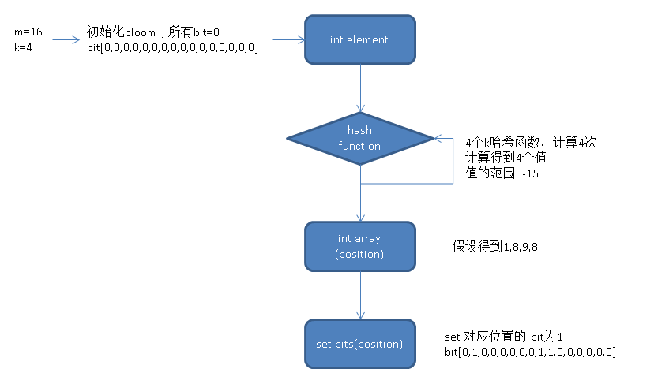
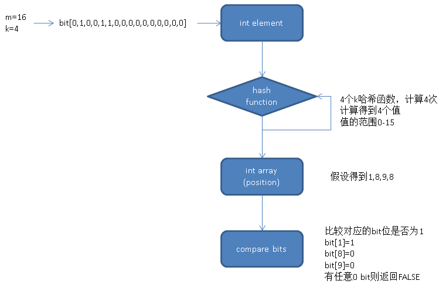

# PostgreSQL Bloom Index — 一個索引支撐任意 Column 組合查詢

> 來源：[digoal - PostgreSQL 9.6 黑科技 bloom 算法索引 (2016-05-23)](https://github.com/digoal/blog/blob/master/201605/20160523_01.md)

---

## 1. 問題背景：任意組合查詢的索引困境

在前端查詢頁面中，用戶往往可以在幾十個查詢條件中勾選任意組合：



傳統方法需要為「每種可能的 column 組合」建立一個 composite index。假設有 N 個可查詢 column，只用一個 composite index 覆蓋 `(c1, c2, ..., cN)` 的話，查詢若缺少前綴 column 就無法使用 index（B-tree 的左 prefix 限制）。這導致要麼建立 `2^N` 個 index（不現實），要麼放棄對某些組合的優化。

**PostgreSQL 9.6 的 Bloom Index 給出了答案：只需一個 index，即可支援任意 column 組合的等值查詢。**

> 補充（Senior Dev）：這個場景在實際業務中極常見——Data Catalog 瀏覽、BI 自助查詢、運營後台的多條件篩選、Log Search UI。傳統解法（如 Elasticsearch 的 query-time index）靠 inverted index 做任意組合，但其 overhead 遠大於 Bloom index。Bloom index 的優勢在於將 N 個 column 的資訊壓縮進固定大小的 bit array，查詢時只需要 bitwise AND/OR。

---

## 2. Bloom Filter 基礎原理

Bloom filter 是一種 **probabilistic data structure**（有損過濾器），核心特性：

- 使用 **m 個 bit** 和 **k 個 hash function**
- `false` 一定是假的，`true` 不一定是真的（存在 false positive）
- 用於快速判斷「某個值是否可能屬於某集合」

### 演算法

```
Add element:
  FOR i = 1..k:
    bit[ hash_i(element) % m ] = 1

Check element:
  FOR i = 1..k:
    IF bit[ hash_i(element) % m ] == 0:
      RETURN FALSE    ← 一定不在
  RETURN TRUE         ← 可能在（有 false positive 機率）
```

### 數學參數

| 參數 | 含義 | 公式 |
|------|------|------|
| `m` | bit array 長度 | `abs(ceil(n * ln(p) / (ln(2)^2)))` |
| `k` | hash function 數量 | `round(ln(2) * m / n)` |
| `n` | 預期唯一值個數 | 使用者指定 |
| `p` | 允許的 false positive rate | 使用者指定（如 0.02 = 2%） |

> 相比 B-tree：同一張 1 億行的表，15 個 B-tree index 可能需要 **數十 GB**（每個 index 存所有 key + TID），Bloom 只需 153 MB，差距超過 10 倍。

---

## 3. PL/pgSQL 實作（來自 PipelinedB）

以下是完整的 PL/pgSQL Bloom filter 實作，展示演算法細節（PipelinedB 原用 C 語言實作了聚合函數版本以支援 streaming computation）。

### 3.1 建立空 Bloom Filter

```sql
CREATE TYPE dumbloom AS (
    m    integer,      -- bit 位數
    k    integer,      -- hash function 數量
    bits integer[]     -- bit array（以 integer 為單位，每個 integer = 32 bit）
);

CREATE FUNCTION dumbloom_empty (
    p float8 DEFAULT 0.02,     -- 2% false positive probability
    n integer DEFAULT 100000   -- 預期 100k unique values
) RETURNS dumbloom AS $$
DECLARE
    m    integer;
    k    integer;
    i    integer;
    bits integer[];
BEGIN
    -- Getting m and k from n and p
    -- See: https://en.wikipedia.org/wiki/Bloom_filter#Optimal_number_of_hash_functions
    m := abs(ceil(n * ln(p) / (ln(2) ^ 2)))::integer;
    k := round(ln(2) * m / n)::integer;
    bits := NULL;

    FOR i IN 1 .. ceil(m / 32.0) LOOP
        bits := array_append(bits, 0);
    END LOOP;

    RETURN (m, k, bits)::dumbloom;
END;
$$ LANGUAGE plpgsql IMMUTABLE;
```

### 3.2 Fingerprint 產生（Double Hashing）

使用 **Kirsch-Mitzenmacher double hashing** 技巧，用 2 個 hash function 模擬 k 個（避免計算 k 個獨立 hash）：



```sql
CREATE FUNCTION dumbloom_fingerprint (
    b    dumbloom,
    item text
) RETURNS integer[] AS $$
DECLARE
    h1     bigint;
    h2     bigint;
    i      integer;
    fingerprint integer[];
BEGIN
    h1 := abs(hashtext(upper(item)));
    -- If lower(item) and upper(item) are the same,
    -- h1 and h2 will be identical too, add some salt:
    h2 := abs(hashtext(lower(item) || 'yo dawg!'));
    fingerprint := NULL;

    FOR i IN 1 .. b.k LOOP
        -- This combinatorial approach works just as well as using k independent
        -- hash functions, but is obviously much faster.
        -- See: https://www.eecs.harvard.edu/~michaelm/postscripts/tr-02-05.pdf
        fingerprint := array_append(fingerprint, ((h1 + i * h2) % b.m)::integer);
    END LOOP;

    RETURN fingerprint;
END;
$$ LANGUAGE plpgsql IMMUTABLE;
```

### 3.3 Add Element（設 bit 為 1）

```sql
CREATE FUNCTION dumbloom_add (
    b    dumbloom,
    item text
) RETURNS dumbloom AS $$
DECLARE
    i    integer;
    idx  integer;
BEGIN
    IF b IS NULL THEN
        b := dumbloom_empty();
    END IF;

    FOREACH i IN ARRAY dumbloom_fingerprint(b, item) LOOP
        idx := i / 32 + 1;               -- 定位到哪個 integer
        b.bits[idx] := b.bits[idx] | (1 << (i % 32));  -- 設對應 bit 為 1
    END LOOP;

    RETURN b;
END;
$$ LANGUAGE plpgsql IMMUTABLE;
```

### 3.4 Contain Check（檢查 bit 是否全為 1）



```sql
CREATE FUNCTION dumbloom_contains (
    b    dumbloom,
    item text
) RETURNS boolean AS $$
DECLARE
    i   integer;
    idx integer;
BEGIN
    IF b IS NULL THEN
        RETURN FALSE;
    END IF;

    FOREACH i IN ARRAY dumbloom_fingerprint(b, item) LOOP
        idx := i / 32 + 1;
        IF NOT (b.bits[idx] & (1 << (i % 32)))::boolean THEN
            RETURN FALSE;    -- 存在 0 bit → 元素一定不在
        END IF;
    END LOOP;

    RETURN TRUE;             -- 所有 bit 都是 1 → 元素可能在（需 Recheck）
END;
$$ LANGUAGE plpgsql IMMUTABLE;
```

### 3.5 測試

```sql
CREATE TABLE t (users dumbloom);
INSERT INTO t VALUES (dumbloom_empty());

UPDATE t SET users = dumbloom_add(users, 'usmanm');
UPDATE t SET users = dumbloom_add(users, 'billyg');
UPDATE t SET users = dumbloom_add(users, 'pipeline');

SELECT dumbloom_contains(users, 'usmanm') FROM t;   -- true
SELECT dumbloom_contains(users, 'billyg') FROM t;   -- true
SELECT dumbloom_contains(users, 'pipeline') FROM t; -- true
SELECT dumbloom_contains(users, 'unknown') FROM t;  -- false（一定不在）
```

---

## 4. PG 9.6 Bloom Index 實戰

### 4.1 安裝與建立

```sql
-- PG 9.6+: contrib 模組（PG 10+ 已內建為 extension）
CREATE EXTENSION bloom;

-- 建立 Bloom index
CREATE TABLE test (id int);
INSERT INTO test SELECT trunc(100000000 * random())
    FROM generate_series(1, 100000000);  -- 1 億 row

CREATE INDEX idx_test_id ON test USING bloom (id);
```

### 4.2 單 Column 查詢對比

**Bloom Index（Bitmap Heap Scan）：**

```
 Bitmap Heap Scan on test  (cost=946080.00..946082.03 rows=2 width=4)
   (actual time=524.545..561.168 rows=3 loops=1)
   Recheck Cond: (id = 16567697)
   Rows Removed by Index Recheck: 30870
   Heap Blocks: exact=29846
   Buffers: shared hit=225925
   ->  Bitmap Index Scan on idx_test_id
         (actual time=517.448..517.448 rows=30873 loops=1)
         Index Cond: (id = 16567697)
 Execution time: 561.535 ms
```

**Seq Scan（對照組）：**

```
 Seq Scan on test  (actual time=0.017..8270.536 rows=3 loops=1)
   Filter: (id = 16567697)
   Rows Removed by Filter: 99999997
   Buffers: shared hit=442478
 Execution time: 8270.564 ms
```

Bloom index 將 1 億 row 的等值查詢從 **8.3 秒降到 0.56 秒**（約 15x），但需付出 `Rows Removed by Index Recheck: 30870` 的代價——Bloom 回報了 30,873 個 candidate row，其中只有 3 個是真匹配（false positive rate = 30,870 / 1 億 ≈ 0.03%）。

### 4.3 多 Column 任意組合查詢

建立 16 column 表（1000 萬 row，888 MB），為前 15 個 column 建立一個 Bloom index（153 MB）：

```sql
CREATE TABLE test1 (
    c1 int, c2 int, c3 int, c4 int,
    c5 int, c6 int, c7 int, c8 int,
    c9 int, c10 int, c11 int, c12 int,
    c13 int, c14 int, c15 int, c16 int
);

INSERT INTO test1
    SELECT i, i+1, i-1, i+2, i-2, i+3, i-3, i+4, i-4,
           i+5, i-5, i+6, i-6, i+7, i-7, i+8
    FROM (SELECT trunc(100000000 * random()) i
          FROM generate_series(1, 10000000)) t;

CREATE INDEX idx_test1_1 ON test1
    USING bloom (c1, c2, c3, c4, c5, c6, c7, c8,
                 c9, c10, c11, c12, c13, c14, c15);
```

**5 column 組合查詢**（AND）：

```
 Bitmap Heap Scan on test1  (actual time=101.724..102.317 rows=1 loops=1)
   Recheck Cond: (c5=68747914 AND c7=68747913 AND c8=68747920 AND c10=68747921)
   Rows Removed by Index Recheck: 425
   Filter: (c16 = 68747924)
   Heap Blocks: exact=425
   ->  Bitmap Index Scan on idx_test1_1
         (actual time=101.636..101.636 rows=426 loops=1)
 Execution time: 102.364 ms
```

**6 column 組合查詢**（AND）：

```
 Bitmap Heap Scan on test1  (actual time=54.702..54.746 rows=1 loops=1)
   Recheck Cond: (c5=68747914 AND c7=68747913 AND c8=68747920
                   AND c10=68747921 AND c12=68747922)
   Rows Removed by Index Recheck: 27
   Filter: (c16 = 68747924)
   Heap Blocks: exact=28
   ->  Bitmap Index Scan on idx_test1_1
         (actual time=54.667..54.667 rows=28 loops=1)
 Execution time: 54.814 ms
```

關鍵觀察：**查詢條件越多 → Recheck 越少**。5 column → 425 Recheck row，6 column → 27 Recheck row。因為 AND 條件越多，Bloom filter 的交集越精確（多個 hash bit 都要同時為 1）。

> 補充（Senior Dev）：Bloom index 也支援 **OR 查詢**，但 OR 是透過 bitmap 的 bitwise OR 操作合併多個結果，沒有「條件越多越精確」的收斂效應——每個 OR 分支都可能引入 false positive。因此 OR 查詢的 Recheck overhead 通常更大，需謹慎評估。
>
> Bloom index **不支援 ORDER BY / MIN / MAX / BETWEEN**，因為它不保留任何排序資訊。如果你需要同時支援等值過濾和排序，可以考慮 B-tree + Bloom 雙 index 策略。

---

## 5. Bloom Index vs 其他方案

| 方案 | Index 數量 | 體積 | 支援 AND | 支援 OR | 支援排序 | Recheck Overhead |
|------|:--------:|------|:-------:|:------:|:------:|:---------------:|
| **Bloom** | 1 | 小（MB 級） | ✓ | ✓ | ✗ | 有損（false positive） |
| 多個 B-tree（每 column） | N | 大（GB 級） | ✓ (BitmapAnd) | ✓ (BitmapOr) | ✓ | 無（精確） |
| Composite B-tree | 多個 | 最大 | ✓（需前綴） | ✗ | ✓ | 無 |
| GIN（多 column） | 1 | 中 | ✓ | ✓ | ✗ | 較少 |
| BRIN | 1 | 極小（KB） | 有限 | 有限 | ✗ | 有損（page-level） |

> 補充（Senior Dev）：**決策指南**：
> - 已知查詢組合有限（如只有 3-4 種常見組合）→ 為每種建立 B-tree composite index
> - 任意組合、N 很大、主要是等值查詢 → Bloom index
> - 資料有 JSONB 欄位且查詢發生在 key-value → GIN index（`jsonb_path_ops`）
> - 數據量極大、查詢以大範圍為主 → BRIN
>
> Bloom index 的 `length` 參數（signature length，單位是 uint16 = 2 bytes，預設 80 = 160 bytes）直接決定 false positive rate。`length` 越大 → 更精確但 index 更大。可以在 `CREATE INDEX ... WITH (length = 160)` 中調整。PG 14 引入了 bloom extension 的 parallel index build 支援。
