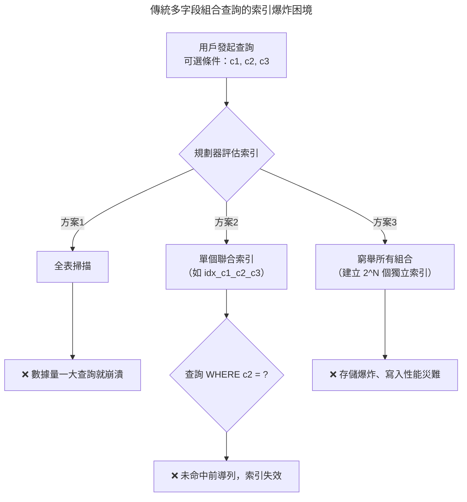
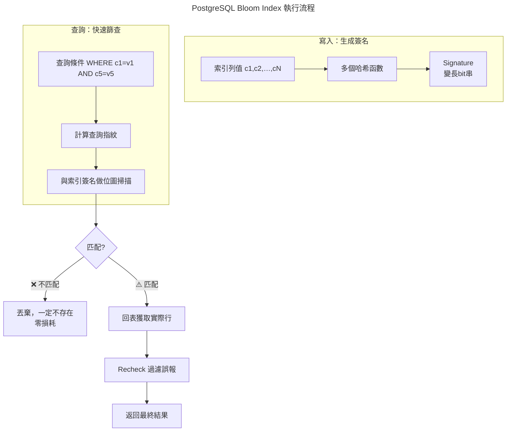

# PostgreSQL Bloom Index — 一個索引支撐任意 Column 組合查詢

作爲開發者，在設計數據訪問層（DAL）時，面對運營後臺那種幾十個字段任意組合的篩選需求，幾乎是一場索引噩夢。

爲了讓你更直觀地理解，下面是傳統 btree 索引方案在處理"多字段組合查詢"時面臨的窘境：



PostgreSQL 提供的 Bloom Index 是解決此場景的利器。它專爲 WHERE c1=v1 AND c5=v5 AND ... 這類等值組合查詢設計，用極小的存儲成本實現高效過濾。

💡 一句話原理：一個"有損壓縮"的黑名單

你可以把 Bloom 索引理解成給每一行數據生成一個"有損壓縮的指紋"（Signature）。查詢時，先用指紋快速排除絕對不相關的行，再去表中精確覈對。



⚠️ 核心特性：精準的"不在"和模糊的"在"

它的"有損"特性決定了兩個關鍵行爲：

- 絕對可靠 (False Negative = 0%)：如果指紋沒命中，數據庫中絕對不存在符合條件的行。
- 可能誤報 (False Positive > 0%)：如果指紋命中，數據可能存在，也可能不存在。這就是所謂的"假陽性"。

---

📝 實戰指南：在 PostgreSQL 16 中使用 Bloom

首先確認 bloom 擴展已啓用：

```sql
-- 作爲標準擴展，通常一句 SQL 即可啓用
CREATE EXTENSION IF NOT EXISTS bloom;
```

**1. 索引 DDL**

和創建普通索引類似，但必須在 WITH 子句中配置參數來控制精度和大小。

```sql
CREATE INDEX idx_user_bloom ON users
USING bloom (
    first_name, last_name, email, department, status
)
WITH (
    length = 100,         -- 總指紋長度（bit）
    col1 = 5,             -- first_name 用5位
    col2 = 5,             -- last_name 用5位
    col3 = 6,             -- email 用6位
    col4 = 3,             -- department 用3位
    col5 = 2              -- status 用2位
);
```

**2. 參數完全解析**

WITH (...) 子句裏可以配置的參數如下：

| 參數 | 默認值 | 最大值 | 說明 |
|------|--------|--------|------|
| `length` | 80 | 4096 | 每行數據的簽名長度（bit），會向上取整爲16的倍數。控制全局精度。 |
| `col1 ~ col32` | 2 | 4095 | 分別爲第1到第32個索引列分配的bit數。數值越大，該列的查詢越精確。 |

**3. 精度與空間成本**

- Signature Length（指紋長度）：全局精度調節旋鈕。`length` 越大，指紋碰撞概率越低，查詢越精確，索引體積越大。
- Column Bits（字段位數）：局部精度調節旋鈕。爲高區分度字段（如 email）分配更多位，低區分度字段（如 status）少分配些。

**4. 匹配驗證：用 EXPLAIN 確認命中**

務必通過 EXPLAIN (ANALYZE, BUFFERS) 確認查詢確實用上了索引。

```sql
-- PostgreSQL 16 下，當查詢條件匹配索引時，計劃會顯示 Bitmap Index Scan
EXPLAIN (ANALYZE, BUFFERS)
SELECT * FROM users
WHERE first_name = 'Bruce' AND department = 'Engineering';
```

- 重點觀察 `Rows Removed by Index Recheck`：此行數值代表被 Bloom 索引誤報（False Positive）的行數。數值越大，說明索引精度越低，需調整參數。
- `Filter` 行：如果查詢中有未包含在 Bloom 索引中的列，會顯示爲 `Filter` 步驟，此過濾在回表後進行。

---

🚀 開發者進階：調優與場景指南

僅僅"能用"還不夠，"用好"Bloom索引纔是區分普通開發者和資深工程師的分水嶺。

**1. 參數優化建議**

- 壓榨性能：如果磁盤空間充裕且查詢耗時非常敏感，可將 `length` 增至 200 甚至 400。將高基數字段的 `colN` 值設爲 4 或 8。
- 節省空間：如果磁盤資源緊張，可適當降低 `length`（如 40 或 60），並將低基數字段的 `colN` 保持默認或降低。不推薦的寫法：`length=100, col1=20`。應通過增加 `length` 來提高精度，而非讓個別字段擠壓其他字段的bit位。

**2. 調優實戰策略：應對複雜查詢**

對於帶一個非索引列的查詢：

```sql
EXPLAIN (ANALYZE)
SELECT * FROM users
WHERE first_name = 'Bruce' AND department = 'Engineering' AND signup_date > '2023-01-01';
```

查看 EXPLAIN 輸出中的 `Filter` 行。如果 `signup_date` 的過濾性不強，此計劃可以接受；如果它過濾掉了大量數據，應考慮爲其創建獨立索引或調整查詢邏輯。

**3. Bloom vs. 其他索引：如何選擇？**

| 索引類型 | 典型體積 | 等值查詢 (`=`) | 範圍查詢 (`>`, `<`) | ORDER BY / MIN / MAX | 任意組合查詢 |
|----------|----------|:---:|:---:|:---:|:---:|
| Bloom | 極小 (MB級) | ✔️ | ❌ | ❌ | ✔️ (極佳) |
| 多個 B-tree | 巨大 (GB級) | ✔️ | ✔️ | ✔️ | ✔️ (磁盤空間與寫入壓力巨大) |
| 聯合 B-tree | 大 (GB級) | ✔️ | ✔️ | ✔️ | ❌ (受限於最左前綴) |
| GIN | 大 | ✔️ | ❌ | ❌ | ✔️ |
| BRIN | 極小 (KB級) | ✔️ (弱) | ✔️ | ❌ | ❌ |

決策指南：

- 海量日誌/事件表 → BRIN 索引（如果數據與物理存儲順序相關）。
- JSONB、數組、全文搜索 → GIN 索引。
- 需要保證排序或唯一性 → B-tree 索引。
- ✅ 最適合Bloom的場景：
  - 表有大量字段，且查詢條件組合無法預測。
  - 僅需等值查詢（`=` 或 `IN`）。
  - 對存儲成本極其敏感。

**4. 實現細節與演進：從 PG 9.6 到 PG 16**

- PG 9.6：Bloom索引誕生，引入 `length` 參數。
- PG 10 - 12：增強了並行查詢能力，對Bloom索引的 Bitmap Heap Scan 階段有顯著提升。
- PG 13 - 14：支持 parallel index build，可以並行創建Bloom索引。
- PG 15 - 16：優化了優化器對Bloom索引的成本估算模型，使計劃選擇更準確。`length` 參數上限提升至 4096 bits。

---

💎 總結

PostgreSQL Bloom Index 是應對"多字段任意組合查詢"場景的利器，它以微小的磁盤空間和極高的寫入效率，換取了查詢性能的極大飛躍。Bloom Index 的定位是 B-tree 等傳統索引的強力補充，而非替代品。 在一個成熟的數據模型中，完全可以根據業務場景，將 Bloom 與其他索引類型組合使用，以達成空間與性能的完美平衡。

如果你對文中提到的 GIN 或 BRIN 索引的細節，或者如何在一個複雜項目中組合使用多種索引感興趣，我可以爲你展開講講。
