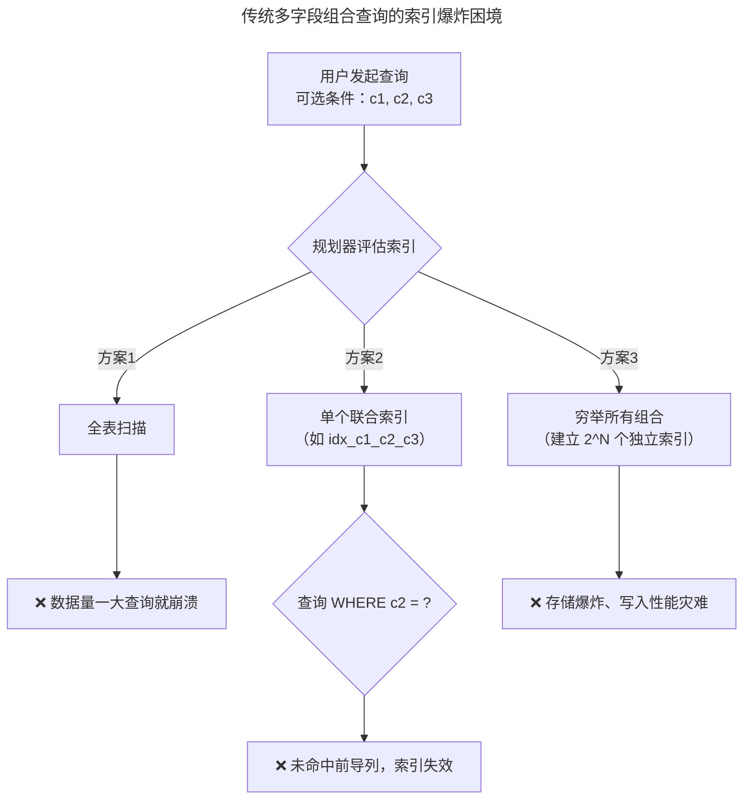

# PostgreSQL Bloom Index — 一個索引支撐任意 Column 組合查詢

作为开发者，在设计数据访问层（DAL）时，面对运营后台那种几十个字段任意组合的筛选需求，几乎是一场索引噩梦。

为了让你更直观地理解，下面是传统 btree 索引方案在处理“多字段组合查询”时面临的窘境：



PostgreSQL 提供的 Bloom Index 是解决此场景的利器。它专为 WHERE c1=v1 AND c5=v5 AND ... 这类等值组合查询设计，用极小的存储成本实现高效过滤。

💡 一句话原理：一个“有损压缩”的黑名单

你可以把 Bloom 索引理解成给每一行数据生成一个“有损压缩的指纹”（Signature）。查询时，先用指纹快速排除绝对不相关的行，再去表中精确核对。


⚠️ 核心特性：精准的“不在”和模糊的“在”

它的“有损”特性决定了两个关键行为：

· 绝对可靠 (False Negative = 0%)：如果指纹没命中，数据库中绝对不存在符合条件的行。
· 可能误报 (False Positive > 0%)：如果指纹命中，数据可能存在，也可能不存在。这就是所谓的“假阳性”。

---

📝 实战指南：在 PostgreSQL 16 中使用 Bloom

首先确认 bloom 扩展已启用：

```sql
-- 作为标准扩展，通常一句 SQL 即可启用
CREATE EXTENSION IF NOT EXISTS bloom;
```

1. 索引 DDL

和创建普通索引类似，但必须在 WITH 子句中配置参数来控制精度和大小。

```sql
CREATE INDEX idx_user_bloom ON users
USING bloom (
    first_name, last_name, email, department, status
)
WITH (
    length = 100,         -- 总指纹长度（bit）
    col1 = 5,             -- first_name 用5位
    col2 = 5,             -- last_name 用5位
    col3 = 6,             -- email 用6位
    col4 = 3,             -- department 用3位
    col5 = 2              -- status 用2位
);
```

2. 参数完全解析

WITH (...) 子句里可以配置的参数如下：

参数 默认值 最大值 说明
length 80 4096 每行数据的签名长度（bit），会向上取整为16的倍数。控制全局精度。
col1 ~ col32 2 4095 分别为第1到第32个索引列分配的bit数。数值越大，该列的查询越精确。

3. 精度与空间成本

· Signature Length（指纹长度）：全局精度调节旋钮。length 越大，指纹碰撞概率越低，查询越精确，索引体积越大。
· Column Bits（字段位数）：局部精度调节旋钮。为高区分度字段（如 email）分配更多位，低区分度字段（如 status）少分配些。

4. 匹配验证：用 EXPLAIN 确认命中

务必通过 EXPLAIN (ANALYZE, BUFFERS) 确认查询确实用上了索引。

```sql
-- PostgreSQL 16 下，当查询条件匹配索引时，计划会显示 Bitmap Index Scan
EXPLAIN (ANALYZE, BUFFERS)
SELECT * FROM users
WHERE first_name = 'Bruce' AND department = 'Engineering';
```

· 重点观察 Rows Removed by Index Recheck：此行数值代表被 Bloom 索引误报（False Positive）的行数。数值越大，说明索引精度越低，需调整参数。
· Filter 行：如果查询中有未包含在 Bloom 索引中的列，会显示为 Filter 步骤，此过滤在回表后进行。

---

🚀 开发者进阶：调优与场景指南

仅仅“能用”还不够，“用好”Bloom索引才是区分普通开发者和资深工程师的分水岭。

1. 参数优化建议

· 压榨性能：如果磁盘空间充裕且查询耗时非常敏感，可将 length 增至 200 甚至 400。将高基数字段的 colN 值设为 4 或 8。
· 节省空间：如果磁盘资源紧张，可适当降低 length（如 40 或 60），并将低基数字段的 colN 保持默认或降低。不推荐的写法：length=100, col1=20。应通过增加 length 来提高精度，而非让个别字段挤压其他字段的bit位。

2. 调优实战策略：应对复杂查询

对于带一个非索引列的查询：

```sql
EXPLAIN (ANALYZE)
SELECT * FROM users WHERE first_name = 'Bruce' AND department = 'Engineering' AND signup_date > '2023-01-01';
```

查看 EXPLAIN 输出中的 Filter 行。如果 signup_date 的过滤性不强，此计划可以接受；如果它过滤掉了大量数据，应考虑为其创建独立索引或调整查询逻辑。

3. Bloom vs. 其他索引：如何选择？

索引类型 典型体积 等值查询 (=) 范围查询 (>, <) ORDER BY / MIN / MAX 任意组合查询
Bloom 极小 (MB级) ✔️ ❌ ❌ ✔️ (极佳)
多个 B-tree 巨大 (GB级) ✔️ ✔️ ✔️ ✔️ (磁盘空间与写入压力巨大)
联合 B-tree 大 (GB级) ✔️ ✔️ ✔️ ❌ (受限于最左前缀)
GIN 大 ✔️ ❌ ❌ ✔️
BRIN 极小 (KB级) ✔️ (弱) ✔️ ❌ ❌

决策指南：

· 海量日志/事件表 -> BRIN 索引（如果数据与物理存储顺序相关）。
· JSONB、数组、全文搜索 -> GIN 索引。
· 需要保证排序或唯一性 -> B-tree 索引。
· ✅ 最适合Bloom的场景：
  · 表有大量字段，且查询条件组合无法预测。
  · 仅需等值查询（= 或 IN）。
  · 对存储成本极其敏感。

4. 实现细节与演进：从 PG 9.6 到 PG 16

· PG 9.6：Bloom索引诞生，引入 length 参数。
· PG 10 - 12：增强了并行查询能力，对Bloom索引的 Bitmap Heap Scan 阶段有显著提升。
· PG 13 - 14：支持 parallel index build，可以并行创建Bloom索引。
· PG 15 - 16：优化了优化器对Bloom索引的成本估算模型，使计划选择更准确。length 参数上限提升至 4096 bits。

---

💎 总结

PostgreSQL Bloom Index 是应对“多字段任意组合查询”场景的利器，它以微小的磁盘空间和极高的写入效率，换取了查询性能的极大飞跃。Bloom Index 的定位是 B-tree 等传统索引的强力补充，而非替代品。 在一个成熟的数据模型中，完全可以根据业务场景，将 Bloom 与其他索引类型组合使用，以达成空间与性能的完美平衡。

如果你对文中提到的 GIN 或 BRIN 索引的细节，或者如何在一个复杂项目中组合使用多种索引感兴趣，我可以为你展开讲讲。