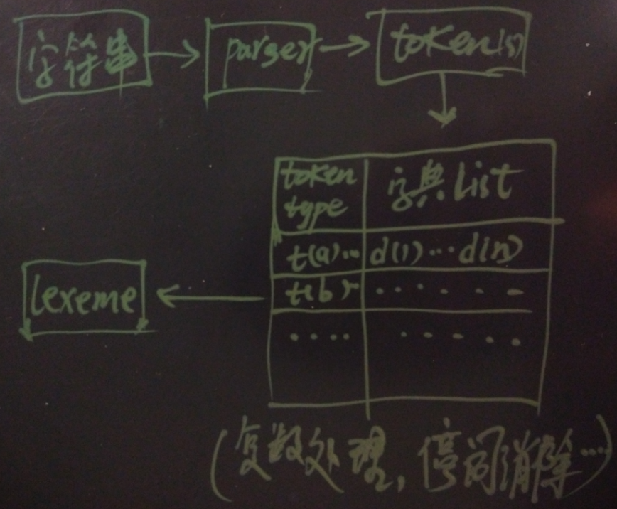

# PostgreSQL 全文檢索：整行多欄位分詞檢索 — record_out + SCWS 整合方案

> 來源：[digoal - PostgreSQL 如何高效解決按任意字段分詞檢索的問題 — case 1 (2016-07-25)](https://github.com/digoal/blog/blob/master/201607/20160725_05.md)

---

## 1. 問題場景

應用場景：一張表有多個 text column（歌手、曲目、專輯、作曲、歌詞），用戶輸入一個關鍵詞需要在**所有 column** 中以分詞方式匹配，任意 column 命中即返回。

### 傳統方案（per-column index + OR）

每個 column 建獨立的分詞 GIN index，查詢時 OR 串接：

```sql
-- 冗長且每個 column 都要重複 match
WHERE to_tsvector('scwscfg', singer) @@ to_tsquery('scwscfg', '劉德華')
   OR to_tsvector('scwscfg', track)  @@ to_tsquery('scwscfg', '劉德華')
   OR to_tsvector('scwscfg', album)  @@ to_tsquery('scwscfg', '劉德華')
   OR to_tsvector('scwscfg', lyric)  @@ to_tsquery('scwscfg', '劉德華');
```

問題：SQL 冗長、多個 OR 無法有效利用 BitmapOr 合併（多 index scan 的成本疊加）。

### 德哥方案：整行序列化為 text → 單一 GIN index

```sql
-- 將整條 row 轉成 text，建一個 GIN index 解決所有 column 的搜尋
CREATE INDEX idx ON t1
USING gin (to_tsvector('scwscfg', replace(rec_to_text(t1), ',', ' ')));
```

> 補充（Senior Dev）：這種「whole-row full-text index」的方法適合 **schema-less 查詢**（不關心 keyword 落在哪個 column）。如果需要知道 keyword 命中了哪個 column（如 highlight 特定欄位），則仍需 per-column index 或改用 `jsonb` + `jsonb_to_tsvector()`（PG 10+）逐欄位標記。

---

## 2. `record_out`：PostgreSQL Row 的 Text 序列化格式

```sql
CREATE TABLE t1 (id INT, c1 TEXT, c2 TEXT, c3 TEXT);
INSERT INTO t1 VALUES (1, '子远e5a1cbb8', '子远e5a1cbb8', 'abc');

SELECT t1::text FROM t1;
-- (1,子远e5a1cbb8,子远e5a1cbb8,abc)
```

輸出格式由 internal function `record_out` 定義（`src/backend/utils/adt/rowtypes.c`）：

- 首尾使用括號 `()`
- column 之間用逗號 `,` 分隔
- 若 column value 包含特殊字元（`"`, `\`, `(`, `)`, `,`, space），會加上雙引號 `""`
- 空字串強制加雙引號

> 補充（Senior Dev）：`record_out` 的輸出格式在 PG 版本間保持向後相容，但不應被視為穩定的序列化協議（它不是 SQL standard 定義的格式）。用於全文檢索場景無問題，但如果需要精確的結構化反序列化應使用 `row_to_json()` 或 `jsonb_build_object()`。

---

## 3. SCWS 分詞的逗號問題

### 3.1 問題發現

SCWS parser 將 `,` 解析為獨立 token（`tokid=117, alias='u', auxiliary`），這導致末尾帶逗號的文字被**錯誤切割**：

```sql
-- 無逗號：正常分詞
SELECT * FROM ts_debug('scwscfg', '子远e5a1cbb8');
-- token: 子(k), 远(a), e5a1cbb8(e)

-- 帶逗號：e5a1cbb8 被切成三截
SELECT * FROM ts_debug('scwscfg', '子远e5a1cbb8,');
-- token: 子(k), 远(a), e5a(e), 1cbb(e), 8(e), ,(u)
```

根因：SCWS 分詞器遇到 `,` 時將其視為 auxiliary token，截斷了前方連續的英數字符 `e5a1cbb8`。

### 3.2 PostgreSQL 全文檢索 Pipeline



```
String → Parser → [Token (type)] → Dictionary → Lexeme → tsvector
         ↓
    CREATE TEXT SEARCH PARSER
    (start / gettoken / end / lextypes)
         ↓
    Token Types: a(adjective), e(exclamation), u(auxiliary)...
         ↓
    CREATE TEXT SEARCH CONFIGURATION
    (PARSER + MAPPING token_type → dictionaries)
         ↓
    ts_debug() / ts_parse() / ts_token_type()
```

**查看 parser 支援的 token type（SCWS 26 種）**：

```sql
SELECT * FROM ts_token_type('scws');
```

```
 tokid | alias | description
-------+-------+-------------
    97 | a     | adjective
    98 | b     | difference
    99 | c     | conjunction
   100 | d     | adverb
   101 | e     | exclamation
   102 | f     | position
   103 | g     | word root
   104 | h     | head
   105 | i     | idiom
   106 | j     | abbreviation
   107 | k     | head
   108 | l     | temp
   109 | m     | numeral
   110 | n     | noun
   111 | o     | onomatopoeia
   112 | p     | prepositional
   113 | q     | quantity
   114 | r     | pronoun
   115 | s     | space
   116 | t     | time
   117 | u     | auxiliary        ← 逗號落入此類
   118 | v     | verb
   119 | w     | punctuation
   120 | x     | unknown
   121 | y     | modal
   122 | z     | status
```

**調試工具**：

| 函數 | 用途 |
|------|------|
| `ts_token_type(parser)` | 查 parser 支援的 token type |
| `ts_parse(parser, text)` | 用指定 parser 將 text 輸出為 token list |
| `ts_debug(config, text)` | 完整分詞流程（parser → token → dictionary → lexeme） |

```sql
SELECT * FROM ts_parse('scws', '子远e5a1cbb8,');
-- tokid=107(token=子), 97(远), 101(e5a), 101(1cbb), 101(8), 117(,)
```

> 補充（Senior Dev）：解析 token type 的關鍵意義在於 **MAPPING**——可以針對不同 token type 指定不同 dictionary。例如對 SCWS 的 `e`(exclamation) 類型（英文/數字符號）指定 `english_stem` 或 `simple` dictionary；對 `n`(noun) 指定自訂的 synonym dictionary。這使得整個 pipeline 高度可定製。

---

## 4. 解法：`replace(, → ' ')`

不修改 SCWS C 代碼的前提下，將 `record_out` 輸出中的逗號替換為空格（SCWS 忽略 space token）：

```sql
-- 替換後：原先的逗號位置變空格
SELECT replace(t1::text, ',', ' ') FROM t1;
-- (1 子远e5a1cbb8 子远e5a1cbb8 abc)

-- 分詞結果正確
SELECT to_tsvector('scwscfg', replace(t1::text, ',', ' ')) FROM t1;
-- '1':1 'abc':6 'e5a1cbb8':3,5 '远':2,4
```

`e5a1cbb8` 不再被截斷，`逗號` 消失不會汙染 token。

### 完整實作

```sql
-- 通用型轉換函數（接受 anyelement）
CREATE OR REPLACE FUNCTION rec_to_text(anyelement) RETURNS text AS $$
  SELECT $1::text;
$$ LANGUAGE sql STRICT IMMUTABLE;

-- 建 GIN index：對整行 text 做分詞
CREATE INDEX idx ON t1
USING gin (
  to_tsvector('scwscfg', replace(rec_to_text(t1), ',', ' '))
);

-- 查詢
EXPLAIN VERBOSE
SELECT * FROM t1
WHERE to_tsvector('scwscfg', replace(rec_to_text(t1), ',', ' '))
   @@ to_tsquery('scwscfg', '子远e5a1cbb8');

--                                        QUERY PLAN
-- Bitmap Heap Scan on t1
--   Recheck Cond: (to_tsvector(...) @@ '''远'' & ''e5a1cbb8'''::tsquery)
--   ->  Bitmap Index Scan on idx
```

> 補充（Senior Dev）：
>
> **`replace(, → ' ')` 的邊界情況**：
> - 如果 column value 本身包含逗號（如 `'hello, world'`），`record_out` 會給該 value 加雙引號 `"hello, world"`。但 `replace()` 是全局替換，**雙引號內的逗號也會被替換**。這對中文分詞通常無害（因為中文不依賴逗號斷詞），但在中英混排或多語言場景中可能改變原意。
> - **更精細的替代**：若需保留 column value 內逗號，可以用 PL/pgSQL 寫一個只替換 `record_out` 層級的括號+逗號（分隔符），而非 column value 內逗號的函數。但實務中這種需求少見，`replace(, → ' ')` 對中文場景足夠。
>
> **IMMUTABLE 標記的必要性**：GIN index on expression 要求 expression 是 IMMUTABLE。`rec_to_text()` 標為 IMMUTABLE 是因為 `$1::text` 的結果在同一 input 下永遠相同——這對 index 成立。但 `to_tsvector()` 的 `IMMUTABLE` 依賴於 dictionary 不變（若有人 `ALTER TEXT SEARCH DICTIONARY` 則 index 需 `REINDEX`）。

---

## 5. 分詞效能基準

SCWS + pg_scws extension，單 CPU core 約 **4.44 萬中文字/s**：

```sql
CREATE EXTENSION pg_scws;

ALTER FUNCTION to_tsvector(regconfig, text) VOLATILE;

-- 分詞 100,000 次，耗時 18 秒
EXPLAIN (buffers, timing, costs, verbose, analyze)
SELECT to_tsvector('scwscfg', '中华人民共和国万岁，如何加快PostgreSQL结巴分词加载速度')
FROM generate_series(1, 100000);

-- Function Scan ... actual time=11.431..17971.197, rows=100000
-- Execution time: 18000.344 ms

SELECT 8 * 100000 / 18.000344;
-- ≈ 44,443 chars/sec per core
```

測試環境：32-core Intel Xeon E5-2680 v3 @ 2.50GHz。

> 補充（Senior Dev）：
>
> **分詞效能的生產考量**：
> - 44K chars/s/core 對應中文分詞是中等水平。jieba（pg_jieba）的字典載入 memory 模式（`zhparser.dict_in_memory = t`）可達相近或更快速度
> - 寫入路徑上的瓶頸：GIN index 對 `tsvector` 的更新採用 pending list 機制（`gin_pending_list_limit`）。高吞吐寫入時若 pending list 過大，查詢需合併 pending list + 主 index，延遲上升
> - `to_tsvector()` 建 index 時只在 **INSERT/UPDATE** 執行。如果表大量寫入且需要即時搜尋，建議用 **generated column**（PG 12+）：
>   ```sql
>   ALTER TABLE t1 ADD COLUMN fts tsvector
>     GENERATED ALWAYS AS (
>       to_tsvector('scwscfg', replace(t1::text, ',', ' '))
>     ) STORED;
>   CREATE INDEX idx_fts ON t1 USING gin (fts);
>   ```
>   好處是 `tsvector` 預先計算並存儲（STORED），查詢不需每次重新計算 expression。
>
> **現代替代方案**：
> - PG 10+：`jsonb_to_tsvector('simple', json_col, '["string"]')` 可指定 JSON 中哪些 key 參與分詞
> - PG 13+：`jsonb_path_query` + `to_tsvector` 組合可動態選取欄位
> - 若需要跨多語言分詞（中英日混排），建議使用 `zhparser`（jieba）+ `pg_bigm`（2-gram for 日文/英文 substring）+ `unaccent` 的 multi-configuration 方案

---

## 參考

1. [SCWS 分詞屬性說明](http://www.xunsearch.com/scws/docs.php#attr)
2. [pg_scws GitHub](https://github.com/jaiminpan/pg_scws)
3. [pg_jieba GitHub](https://github.com/jaiminpan/pg_jieba)
4. [PostgreSQL Full-Text Search — Parsers](https://www.postgresql.org/docs/current/textsearch-parsers.html)
