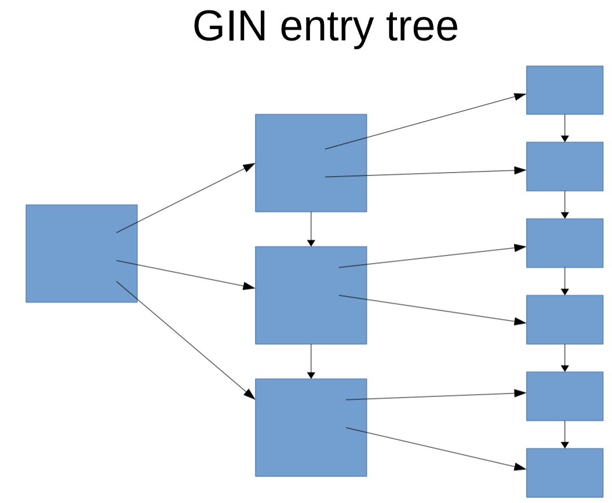
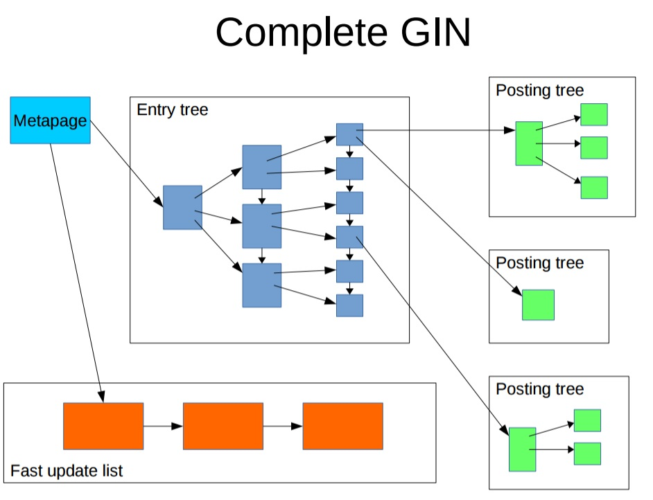
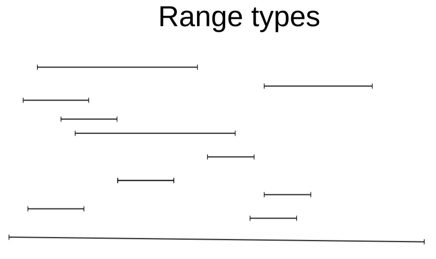
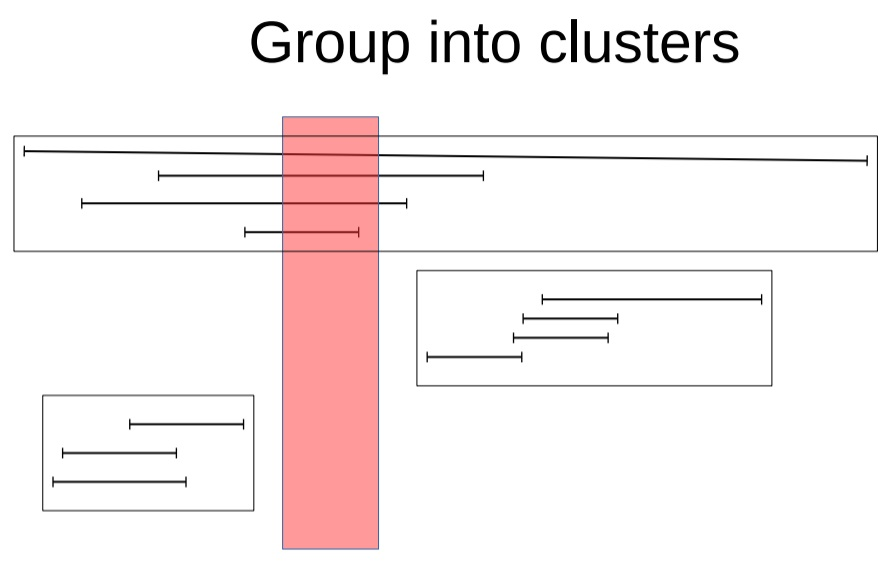
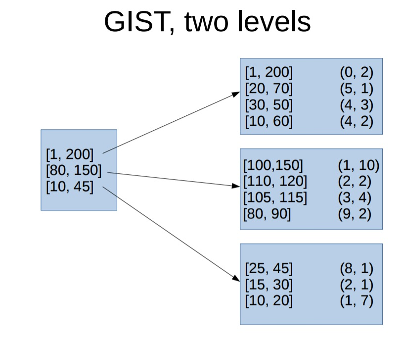
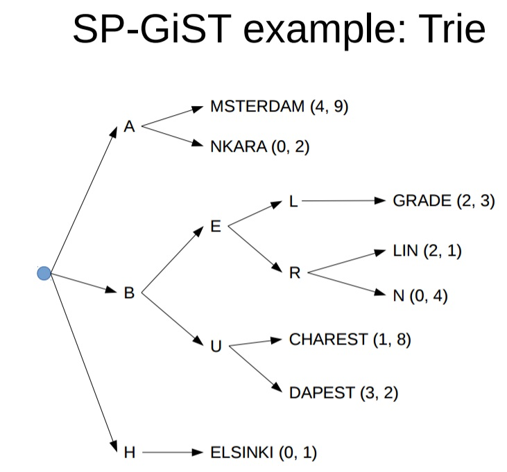
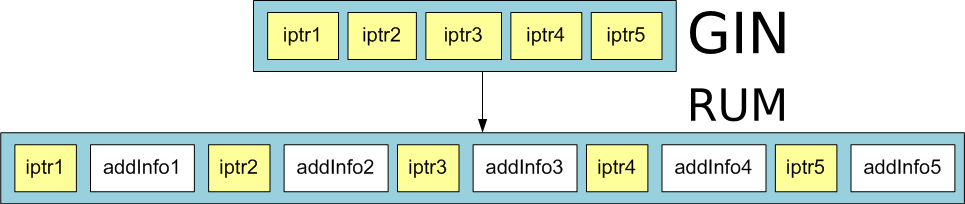

# PostgreSQL 模糊查詢索引全景：GIN / GiST / SP-GiST / RUM 原理與選擇

> 來源：[digoal - 从难缠的模糊查询聊开 - GIN , GiST , SP-GiST , RUM 索引原理与技术背景 (2016-12-31)](https://github.com/digoal/blog/blob/master/201612/20161231_01.md)
>
> 更新於 2026-05-17，補充 PG 12~18 索引 AM 演進

---

## 模糊查詢的索引困局

| 查詢模式 | B-tree | GIN (pg_trgm) | GiST (pg_trgm) | RUM |
|---------|--------|---------------|----------------|-----|
| `col = 'abc'` | ✅ | ❌ | ❌ | ❌ |
| `col LIKE 'abc%'`（後模糊） | ✅（Index Scan） | — | — | — |
| `col LIKE '%abc'`（前模糊） | ✅（reverse index） | — | — | — |
| `col LIKE '%abc%'`（前後模糊） | ❌ Seq Scan | ✅ Bitmap | ✅ Index Scan | ✅ Index Scan |
| `col ~ 'abc.*def'`（regex） | ❌ | ✅ | ✅ | ❌ |
| `col LIKE '%abc%' ORDER BY ts` | ❌ | ❌ | ❌ | ✅ |
| 短 pattern（1~2 字元） | ❌ | ⚠️ 大量 false match | ⚠️ 大量 false match | — |

---

## GIN Index（Generalized Inverted Index）

### 結構

將 column 中的每個 element（token / trigram / array element）取出，存入樹狀結構（類似 B+Tree：key + TID list）。高頻值的 TID list 存到獨立的 posting list page 中。



### Fast Update（GIN 寫入優化）

插入/更新時可能涉及大量 element 變更，GIN 使用 pending list buffer（類似 MySQL 索引組織表）先緩衝寫入，再定期合併到主樹：



查詢不會堵塞合併——可直接查詢 pending list + 主樹。buffer 大小由 `gin_pending_list_limit`（預設 4MB）控制。

### 核心限制

- **只支援 Bitmap Index Scan**：收集所有匹配 TID → 排序 → Heap Scan。即使 `LIMIT 1`，仍需排序全部 TID。
- **不存位置資訊**：無法支援 index-level ranking、phrase search（`'a' <-> 'b'`）、或複合欄位排序（tsvector + timestamp）。

### 適用場景

- 大量資料的 array / JSONB / tsvector 索引
- pg_trgm 模糊查詢（中間結果少時最佳）
- FTS 索引（不要求 ranking / phrase search）

---

## GiST Index（Generalized Search Tree）

### 結構：聚集（Clustering）為核心

以 range type 為例，每條記錄對應一個線段（範圍）：



GiST 將數據聚集到 group（類似 K-Means），每個 group 對應一個 index page：



二級結構：上級存下級 index page 的範圍 union，搜尋時先過濾上級再檢查下級：



### 關鍵抽象層：PickSplit / Choose

GiST 的性能取決於自定義 data type 的 `Picksplit` 和 `Choose` function 如何聚集 key。這是 PG 開放索引介面的核心價值——你定義 data type 時自己實作聚集演算法。

```
Performance depends on how well the user-defined
Picksplit and Choose functions can group keys
```

### GiST vs GIN 對比

| 維度 | GIN | GiST |
|------|-----|------|
| Index Scan | ❌（僅 Bitmap） | ✅（可 Index Scan） |
| 寫入 | 快（pending list） | 慢（即時 insert into tree） |
| 體積 | 小 | 大（~1.7x of GIN） |
| LIMIT 查詢 | 慢 | 快 |
| 支援 range / geometry | ❌ | ✅ |
| 支援 fuzzy search | ✅（pg_trgm） | ✅（pg_trgm） |

---

## SP-GiST（Space-Partitioned GiST）

### 結構

- **Nodes 無交叉**：不同 index page 的內容互不重疊（vs GiST 節點有重疊）
- **Index 深度可變**：根據數據分佈深度可深可淺
- **一個 physical page 可含多個 nodes**



### 支援檢索類型

- **Kd-tree**：點查（points only；shape 會重疊不適用）
- **Prefix tree（Trie）**：text preifx 搜尋

### 適用場景

- 地理點查詢（`point` type）
- 網絡路由（`inet` / `cidr`）
- Prefix 搜尋

---

## RUM Index（RUM Access Method）

### RUM 解決了 GIN 的哪些限制

GIN 不存 token 位置資訊，導致無法支援索引級的：

1. **Ranking**：需回 Heap 讀取完整 tsvector 計算 `ts_rank`，CPU 成本高
2. **Phrase search**：`'a' <-> 'b'`（a 和 b 相鄰出現）無法在 index 層判斷
3. **複合欄位排序**：如 `tsvector + timestamp` 雙欄位複合查詢，必須回表讀 timestamp

RUM 在 posting tree 中**存入附加資訊**（position / timestamp / 自訂 fields），解決以上三點：



### RUM trade-off

- Index 體積比 GIN 大（存更多資訊）
- Insert / update 比 GIN 慢（更多 WAL / 更多資料結構維護）
- **但查詢複雜度高的場景（phrase search / ranking / 雙欄位排序）是唯一選擇**

---

## Benchmark：GIN vs GiST vs RUM（100 萬 row，md5 string）

### 測試參數

```sql
CREATE TABLE test (id INT, info TEXT);
INSERT INTO test SELECT id, md5(random()::text) FROM generate_series(1, 1000000) t(id);

-- Index size comparison
-- GIN:  102 MB,  build 19s
-- GiST: 177 MB,  build 31s
-- RUM:  86 MB,   build 133s
```

String → tsvector / tsquery 轉換函數（給 RUM 用）：

```sql
-- string → tsvector（帶 position）
CREATE OR REPLACE FUNCTION string_to_tsvector(v TEXT) RETURNS tsvector AS $$
DECLARE
  x INT := 1;
  res TEXT := '';
  i TEXT;
BEGIN
  FOR i IN SELECT regexp_split_to_table(v, '')
  LOOP
    res := res || ' ' || chr(92) || i || ':' || x;
    x := x + 1;
  END LOOP;
  RETURN res::tsvector;
END;
$$ LANGUAGE plpgsql STRICT IMMUTABLE;

-- string → tsquery（帶 <-> adjacent）
CREATE OR REPLACE FUNCTION string_to_tsquery(v TEXT) RETURNS tsquery AS $$
DECLARE
  x INT := 1;
  res TEXT := '';
  i TEXT;
BEGIN
  FOR i IN SELECT regexp_split_to_table(v, '')
  LOOP
    IF x > 1 THEN
      res := res || ' <-> ' || chr(92) || i;
    ELSE
      res := chr(92) || i;
    END IF;
    x := x + 1;
  END LOOP;
  RETURN res::tsquery;
END;
$$ LANGUAGE plpgsql STRICT IMMUTABLE;
```

### Test Case 1：中間結果大（`~ 'a'`，873K row，無 LIMIT）

| Index | Plan | Time |
|-------|------|------|
| **GiST** | Index Scan using trgm_idx2 | **1,692 ms** |
| **RUM** | Index Scan using rum_idx1 | 624 ms |
| **GIN** | Bitmap Heap Scan on trgm_idx1 | 3,426 ms |

GiST Index Scan 比 GIN Bitmap Scan 快 2x。RUM 最快但需轉換 tsquery overhead。

### Test Case 2：中間結果大 + LIMIT 100

| Index | Plan | Time |
|-------|------|------|
| **GiST** | Index Scan using trgm_idx2 | **0.68 ms** |
| **RUM** | Index Scan using rum_idx1 | 303 ms |
| **GIN** | Bitmap Heap Scan | 2,404 ms |

GiST 碾壓 GIN（由於 GIN 必須排序全部 1M TID）。GiST 0.68ms vs GIN 2,404ms = **3,500x 差距**。RUM 慢於 GiST 因 tsquery overhead。

### Test Case 3：中間結果小（`~ '2e9a2c'`，2 row）

| Index | Plan | Time |
|-------|------|------|
| **GIN** | Bitmap Heap Scan | **2.54 ms** |
| **GiST** | Index Scan | 294 ms |
| **RUM** | Index Scan | 864 ms |

GIN 碾壓 GiST（TID 排序量極少（2 TID）→ Bitmap overhead 可忽略）。GIN 2.5ms vs GiST 294ms = **115x 差距**。

---

## 選擇決策：pg_hint_plan + Explain-Based

```sql
ALTER TABLE test ALTER COLUMN info SET STATISTICS 1000;
VACUUM ANALYZE test;

-- 使用 pg_hint_plan 分別強制三個 index，比較 estimated rows
EXPLAIN /*+ BitmapScan(test trgm_idx1) */ SELECT * FROM test WHERE info ~ '2e9';
--  Bitmap Heap Scan on test  (cost=59.30..5079.87 rows=7006 width=37)

EXPLAIN /*+ IndexScan(test trgm_idx2) */ SELECT * FROM test WHERE info ~ '2e9';
--  Index Scan using trgm_idx2  (cost=... rows=7006 width=37)
```

**決策規則**：

| 中間結果 rows（estimated） | 有 LIMIT / 游標？ | 選擇 |
|--------------------------|-------------------|------|
| < 數百 | — | **GIN** |
| 數百 ~ 數萬 | — | **GiST** |
| 任何 | 有 `LIMIT` 小值 | **GiST** |
| 需要 ranking / phrase / 雙欄位 | — | **RUM** |

---

## PG 索引方法全覽（截至 PG 18）

| Index Method | 簡述 | 支援 scan 模式 |
|-------------|------|---------------|
| **B-tree** | 通用首選、排序 | Index Scan / Bitmap Scan |
| **Hash** | 純等值 `=` | Index Scan |
| **GIN** | 倒排索引（array/JSONB/tsvector） | 僅 Bitmap Scan |
| **GiST** | 聚集樹（range/geometry/pg_trgm） | Index Scan / Bitmap Scan |
| **SP-GiST** | 空間分割（point/prefix） | Index Scan |
| **BRIN** | 塊範圍摘要 | Bitmap Scan |
| **RUM** | GIN + position/timestamp | Index Scan / Bitmap Scan |
| **Bloom** | 多列任意組合過濾 | Bitmap Scan |

PG 開放索引介面（Index Access Method API）允許自訂新的 index method，如上表所有非 B-tree 索引均透過此 API 實作。

---

## 版本演進

| 功能 | 版本 | 說明 |
|------|------|------|
| GIN fastupdate | PG 9.4 | pending list buffer 機制 |
| `gin_pending_list_limit` | PG 9.5 | 可控 pending list 大小 |
| pg_trgm GiST/GIN regex support | PG 9.3+ | 正則表達式索引加速 |
| RUM extension | PG 9.6+ | position-aware GIN |
| Bloom index | PG 9.6 | 多列組合過濾 |
| GIN parallel builds | PG 10+ | 多 CPU 並行建立 GIN |
| GiST/GIN covering (INCLUDE) | PG 11+ | covering index on GiST/GIN |
| `pg_trgm` strict_word_similarity | PG 11+ | 單詞級相似度 |
| BRIN multi-minmax | PG 14+ | 多列 BRIN |
| `btree_gin` / `btree_gist` improvements | PG 15+ | composite 效能提升 |
| GIN index cleanup tuning | PG 16+ | 更精細 vacuum 控制 |

## 參考

- [德哥: pg_trgm 模糊查詢](https://github.com/digoal/blog/blob/master/201605/20160506_02.md)
- [德哥: RUM 全文檢索加速](https://github.com/digoal/blog/blob/master/201610/20161019_01.md)
- [德哥: 正則與相似度](https://github.com/digoal/blog/blob/master/201611/20161118_01.md)
- [德哥: pg_hint_plan 用法](https://github.com/digoal/blog/blob/master/201604/20160401_01.md)
