# PostgreSQL Index 完全指南 — 從掃描類型到索引選型

> 本文是一份 PostgreSQL 索引的系統性筆記，涵蓋 EXPLAIN 六種掃描類型、Bitmap/B-tree/BRIN/Bloom/GiST/SP-GiST/GIN/RUM 八種索引機制、以及模糊查詢與全文檢索的實戰選型。
>
> **閱讀路徑**：新手建議從第一篇依序閱讀（§一 打掃描基礎 → §二 理解核心機制 → §三~五 學各類索引 → §六~七 深入全文檢索）。有特定場景需求的讀者可跳到對應章節。
>
> 原始來源：PostgreSQL 官方文件、德哥（digoal）blog 系列、Postgres Professional 技術文章，經整理、補充 Mermaid 圖解與 Senior Dev 實戰註解。

---

# 一、PostgreSQL EXPLAIN 計畫中的掃描類型全解析

## 1 為什麼讀懂掃描類型是效能的關鍵

Postgres 查詢效能的秘密不僅在於 *查什麼*，更在於 **如何找到資料**。`EXPLAIN` 是理解查詢行為的核心工具，而其中最關鍵的就是 **掃描類型（Scan Type）**——它決定了查詢是毫秒級還是秒級。

本文涵蓋六種主要掃描類型、Planner 選擇邏輯、以及 Production 調校策略。


---

## 2 Sequential Scan（循序掃描）


循序掃描是最基礎的資料存取方式：**從頭到尾逐行讀取整張表**，檢查每一行是否符合 `WHERE` 條件。

```sql
EXPLAIN SELECT * FROM accounts;

                            QUERY PLAN
-------------------------------------------------------------------
 Seq Scan on accounts  (cost=0.00..22.70 rows=1270 width=36)
(1 row)
```

### I. Planner 何時選擇 Seq Scan

Planner 並非「有索引就一定用」。選擇 Seq Scan 的典型場景：

| 條件 | 原因 |
|------|------|
| 小表（少於數百 rows） | 索引 lookup 的 random I/O overhead 比一次 sequential read 更貴 |
| 回傳大量 row（> ~5-10% 總 row 數） | 大量 random page fetch 累積成本超過一次性全表掃描 |
| 沒有合適索引 | Planner 別無選擇 |
| `WHERE` 條件 selectivity 極低 | 例如 `WHERE is_active = true` 且 99% rows 為 true |

### II. Senior Dev 補充：成本模型的直覺解讀

`cost=0.00..22.70` 中的兩個數字：
- **0.00** = startup cost（回傳第一行前消耗的 arbitrary unit）
- **22.70** = total cost（回傳所有行後的總成本）

Seq Scan 的 startup cost 通常是 0，因為不需要索引 lookup 就能直接產出第一行。total cost 與 page 數 + row 數成正比：

```
total_cost ≈ seq_page_cost * relpages + cpu_tuple_cost * reltuples
```

預設 `seq_page_cost = 1.0`、`cpu_tuple_cost = 0.01`，所以一個 1000 page 的表：
- page cost = 1000 * 1.0 = 1000
- row cost 相對微小

> **關鍵洞察**：`seq_page_cost` 設為 1.0 是基準值。`random_page_cost` 預設 4.0 的假設是「random read 比 sequential read 貴 4 倍」。但這只對 HDD 成立。SSD 或 cloud storage 中，許多 DBA 將 `random_page_cost` 降為 1.1-1.5，這會 **大幅改變 Planner 傾向 Index Scan 的意願**。

---

## 3 Index Scan（索引掃描）


索引掃描是 **兩階段** 操作：

1. **Index Lookup**：在 B-Tree 中快速定位符合條件的 index entry
2. **Heap Fetch**：用 index entry 中的 TID（ctid，即 page + offset）去 heap table 取完整 row

```sql
EXPLAIN SELECT * FROM accounts WHERE id = 5;

                                  QUERY PLAN
-------------------------------------------------------------------------------
 Index Scan using accounts_pkey on accounts  (cost=0.15..2.37 rows=1 width=36)
   Index Cond: (id = 5)
(2 rows)
```

Primary Key 自動建立 B-Tree 唯一索引，因此 PK 查詢幾乎總是用 Index Scan。

### I. Index Scan vs Seq Scan：Planner 的分界線

Planner 使用以下公式決定用 Index Scan 還是 Seq Scan：

```
random_page_cost * selectivity * relpages  vs  seq_page_cost * relpages
```

當 selectivity（選擇率）小於約 `seq_page_cost / random_page_cost` 時，Index Scan 勝出：
- HDD（random_page_cost=4.0）：門檻約 25%
- SSD（random_page_cost=1.1）：門檻約 90%

但 `effective_cache_size` 也影響決策：如果 Planner 認為大部分 index page 已在 shared buffer 中，random access 成本估算會降低。

---

## 4 Bitmap Index Scan + Bitmap Heap Scan（點陣圖掃描）


Bitmap Scan 是 Index Scan 與 Seq Scan 之間的 **混合策略**。當查詢返回的行數太多讓 Index Scan 不划算，但又不足以讓 Seq Scan 成為最佳選擇時，Planner 會選用 Bitmap Scan。

### I. 兩階段機制

1. **Bitmap Index Scan**：掃描一個或多個索引，建立一個 in-memory **點陣圖（bitmap）**，標記所有*可能*包含目標行的 data page
2. **Bitmap Heap Scan**：根據 bitmap 依序讀取 heap page，每個 page 只讀一次（不像 Index Scan 可能重複讀取同一 page），再逐行檢查 `Recheck Cond`

```sql
EXPLAIN (ANALYZE, BUFFERS)
SELECT customer_id, registration_date
FROM customer_records
WHERE gender = 'F'
  AND state_code = 'KS';

                                                               QUERY PLAN
----------------------------------------------------------------------------------------------------------------------------------------
 Bitmap Heap Scan on customer_records  (cost=835.78..8669.29 rows=49226 width=12) (actual time=5.717..38.642 rows=50184.00 loops=1)
   Recheck Cond: (state_code = 'KS'::bpchar)
   Filter: (gender = 'F'::bpchar)
   Rows Removed by Filter: 49682
   Heap Blocks: exact=6370
   ->  Bitmap Index Scan on idx_customer_state  (cost=0.00..823.48 rows=97567 width=0) (actual time=4.377..4.378 rows=99866.00 loops=1)
         Index Cond: (state_code = 'KS'::bpchar)
(10 rows)
```

### II. Recheck Cond 的必要性

Bitmap 以 page 為粒度標記（page 級別，而非 row 級別），所以 Bitmap Heap Scan 讀取的每個 page 中，**所有 row 都要重新檢查條件**（`Recheck Cond`）。這是因為一個 page 可能包含不符合條件的 row——bitmap 只知道「這個 page 可能有目標 row」，但不確定哪幾行是目標。

### III. Senior Dev 補充：多索引 Bitmap 組合（AND / OR）

Bitmap Scan 最強大的場景是多個 `WHERE` 條件各有獨立索引且用 `AND` / `OR` 連接：

```
WHERE state_code = 'KS' AND gender = 'F'
```

Planner 會：
1. 對 `idx_customer_state` 做 Bitmap Index Scan → bitmap A
2. 對 `idx_customer_gender` 做 Bitmap Index Scan → bitmap B
3. `AND` → bitmap A **AND** bitmap B（intersection）
4. `OR` → bitmap A **OR** bitmap B（union）
5. 用最終 bitmap 做 Bitmap Heap Scan，一次讀取 heap page

這在單一 Index Scan 無法同時利用兩個獨立索引時極為有用。EXPLAIN 中會看到多個 `BitmapOr` / `BitmapAnd` 節點：

```sql
-- 組合示例
EXPLAIN SELECT * FROM t WHERE a = 1 OR b = 2;

                          QUERY PLAN
---------------------------------------------------------------
 Bitmap Heap Scan on t
   Recheck Cond: ((a = 1) OR (b = 2))
   ->  BitmapOr
         ->  Bitmap Index Scan on idx_a
               Index Cond: (a = 1)
         ->  Bitmap Index Scan on idx_b
               Index Cond: (b = 2)
```

> **關鍵參數 `work_mem`**：bitmap 是存在記憶體中的。如果 `work_mem` 不夠容納完整 bitmap（或 heap page 超過 `effective_cache_size` 預估），Planner 可能放棄 Bitmap Scan 改用 Seq Scan。增大 `work_mem` 有助於讓 Bitmap Scan 出現在更合適的場景中。

#### a 實戰範例：電商訂單查詢（BitmapOr / BitmapAnd）

營運人員常用以下條件篩選訂單：

```sql
-- 查詢 1：布魯克林區已出貨的訂單（AND）
WHERE district = 'Brooklyn' AND status = 'shipped'

-- 查詢 2：布魯克林區「或」已出貨的訂單（OR）
WHERE district = 'Brooklyn' OR status = 'shipped'
```

`district` 和 `status` 各有獨立索引，但沒有聯合索引。

**建立測試表與索引：**

```sql
CREATE TABLE orders (
    id          SERIAL PRIMARY KEY,
    customer    TEXT NOT NULL,
    district    TEXT NOT NULL,   -- 行政區（50 個不同值）
    status      TEXT NOT NULL,   -- pending / processing / shipped / cancelled（4 個值）
    amount      NUMERIC(10,2),
    created_at  TIMESTAMP DEFAULT now()
);

CREATE INDEX idx_orders_district ON orders (district);
CREATE INDEX idx_orders_status   ON orders (status);
```

**查詢範例：OR 組合（聯集）**

```sql
EXPLAIN (ANALYZE, BUFFERS)
SELECT *
FROM orders
WHERE district = 'District_5' OR status = 'cancelled';
```

預期執行計畫（關鍵部分）：

```
Bitmap Heap Scan on orders  (cost=... rows=...)
  Recheck Cond: ((district = 'District_5'::text) OR (status = 'cancelled'::text))
  Heap Blocks: exact=N
  Buffers: shared hit=...
  ->  BitmapOr                            ← 兩個 bitmap 取聯集
        ->  Bitmap Index Scan on idx_orders_district
              Index Cond: (district = 'District_5'::text)
        ->  Bitmap Index Scan on idx_orders_status
              Index Cond: (status = 'cancelled'::text)
```

**發生了什麼事？**

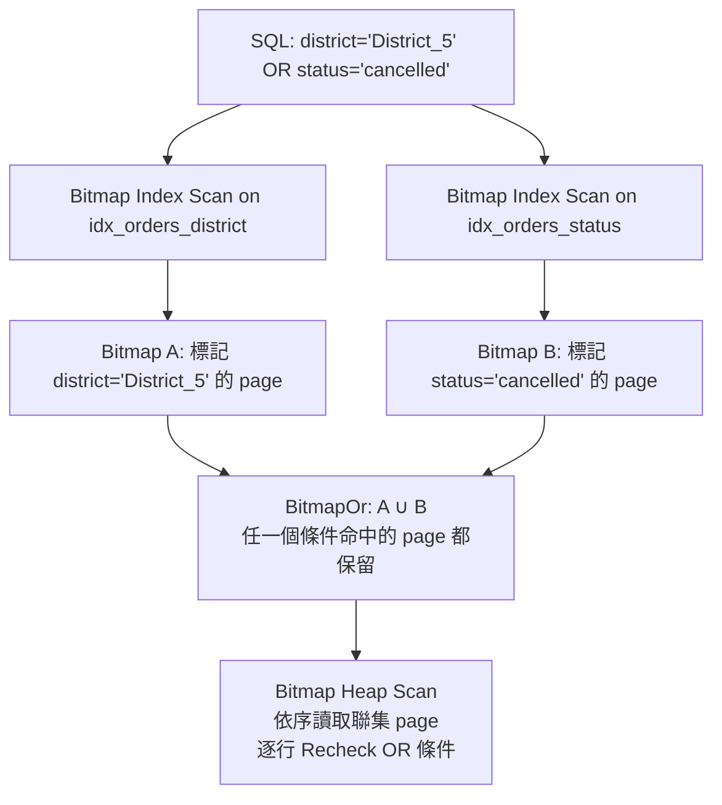
```mermaid
flowchart TD
    A["SQL: district='District_5' OR status='cancelled'"] --> B["Bitmap Index Scan on idx_orders_district"]
    A --> C["Bitmap Index Scan on idx_orders_status"]
    B --> D["Bitmap A: 標記 district='District_5' 的 page"]
    C --> E["Bitmap B: 標記 status='cancelled' 的 page"]
    D --> F["BitmapOr: A ∪ B<br>任一個條件命中的 page 都保留"]
    E --> F
    F --> G["Bitmap Heap Scan<br>依序讀取聯集 page<br>逐行 Recheck OR 條件"]
```

**關鍵解讀：**
- `BitmapOr` 取聯集，page 在任意一個 bitmap 中出現就保留
- `status='cancelled'` 假設只有 5% 的 row、`district='District_5'` 只有 2% 的 row，即便加起來掃描量也遠小於全表掃描
- **每個 page 只讀一次**，避免了 Index Scan 重複 fetch 同一 page 的問題

> 這種方式讓你**不需要為 `(district, status)` 建立聯合索引**，卻依然能用兩個獨立索引高效查詢——這就是 Bitmap Scan 的威力。同理，`AND` 條件會使用 `BitmapAnd` 取交集：只有兩個 bitmap 都標記為 1 的 page 才會被保留。

---

## 5 Parallel Sequential Scan（平行循序掃描）


當表非常大時，Postgres 可以啟動多個 **background worker**，每個 worker 掃描表的不同區塊，最後透過 `Gather` 或 `Gather Merge` 節點合併結果。

```sql
EXPLAIN (ANALYZE, VERBOSE, BUFFERS)
SELECT id, data_value
FROM parallel_test
WHERE data_value < 100000
ORDER BY data_value DESC
LIMIT 1000;

                                                                         QUERY PLAN
------------------------------------------------------------------------------------------------------------------------------------------------------------
 Limit  (cost=161310.11..161431.04 rows=1000 width=16)
   ->  Gather Merge  (cost=161310.11..220311.14 rows=487915 width=16)
         Workers Planned: 5
         Workers Launched: 5
         ->  Sort
               Sort Key: parallel_test.data_value DESC
               Sort Method: top-N heapsort  Memory: 163kB
               ->  Parallel Seq Scan on public.parallel_test
                     Filter: (parallel_test.data_value < '100000'::numeric)
                     Rows Removed by Filter: 750082
```

### I. 平行查詢的觸發條件

Planner 只在滿足以下條件時考慮 Parallel Scan：

| 條件 | 說明 |
|------|------|
| `max_parallel_workers_per_gather > 0` | 預設 2，控制單個 Gather 節點的 worker 數 |
| 表大小 > `min_parallel_table_scan_size` | 預設 8MB，太小的表不值得平行化 |
| `parallel_tuple_cost` 和 `parallel_setup_cost` 的估算 | 啟動 worker 和傳遞 tuple 的 overhead 能被規模效益抵消 |

### II. Senior Dev 補充：Gather vs Gather Merge

- **Gather**：各 worker 結果任意順序匯集，不對結果排序。適合無 `ORDER BY` 或 `ORDER BY` 由聚合函數處理的場景
- **Gather Merge**：每個 worker 先對自己區塊排序，Gather Merge 再合併 N 個有序流（類似 merge sort 的合併階段）。適合帶 `ORDER BY` + `LIMIT` 的查詢

> **Production 建議**：`max_parallel_workers_per_gather` 不是越大越好。每個 worker 消耗一個 connection slot 和 memory。典型配置為 2-4。`max_parallel_workers`（全局上限）通常設為 CPU core 數的一半。

---

## 6 Parallel Index Scan（平行索引掃描）


平行索引掃描的邏輯與 Parallel Seq Scan 類似，但 worker 們掃描的是 **索引的不同區段**（B-Tree 的 leaf page 是雙向鏈表，worker 可以各自負責一段）。

```sql
EXPLAIN (ANALYZE, VERBOSE, BUFFERS)
SELECT data_id, filler_text
FROM parallel_index_test
WHERE data_id BETWEEN 1000000 AND 2000000;

                                                                                QUERY PLAN
---------------------------------------------------------------------------------------------------------------------------------------------------------------------------
 Gather  (cost=0.43..34560.34 rows=995971 width=109)
   Workers Planned: 4
   Workers Launched: 4
   ->  Parallel Index Scan using idx_data_id on public.parallel_index_test
         Index Cond: ((data_id >= 1000000) AND (data_id <= 2000000))
         Index Searches: 1
```

### I. Senior Dev 補充：B-Tree Parallel Scan 的內部機制

Postgres 使用 **Parallel B-Tree Scan** 的流程如下：

1. Leader process 先讀取 index meta page，計算 index 的 page 範圍
2. 將 B-Tree leaf page 鏈表按 page 數平均分配給 N 個 worker
3. 每個 worker 從分配的起始 leaf page 開始，沿著雙向鏈表掃描
4. 每個 index entry 指向 heap tuple，worker 各自 fetch 對應的 heap data

關鍵限制：B-Tree 的平行掃描僅在 **leaf page 層級** 平行化。Root 到 leaf 的 traversal（descend）仍由每個 worker 獨立進行。

> **注意**：查看 `EXPLAIN (ANALYZE, BUFFERS)` 輸出時，留意 `Buffers` 的分佈。如果某個 worker 的 `Buffers` 明顯高於其他 worker（資料分佈偏斜），代表平行掃描的效益被不均衡的數據分佈削弱。這是 partition table 或重新設計索引策略的信號。

---

## 7 Index-Only Scan（純索引掃描）


Index-Only Scan 是效能之星：**所有查詢所需的欄位都存在索引中**，完全不需要存取 heap table。

```sql
EXPLAIN (ANALYZE, VERBOSE, BUFFERS)
SELECT code, status
FROM index_only_test
WHERE code > 'CODE_050000'
ORDER BY code
LIMIT 100;

                                                                           QUERY PLAN
----------------------------------------------------------------------------------------------------------------------------------------------------------------
 Limit  (cost=0.42..2.60 rows=100 width=13)
   ->  Index Only Scan using idx_code_status on public.index_only_test
         Index Cond: (index_only_test.code > 'CODE_050000'::text)
         Heap Fetches: 0
         Index Searches: 1
```

關鍵指標 `Heap Fetches: 0`——代表完全沒碰 heap，純讀索引。這是 **最高效能** 的訊號。

### I. 何時該建立 Covering Index

適合建 covering index 的場景：

| 信號 | 說明 |
|------|------|
| 查詢頻率極高 | 大量重複查詢的微小改善會累積成顯著收益 |
| 只 SELECT 少數欄位 | 例如 20 欄的表只查 3 個，把這 3 個欄位放進索引 |
| `EXPLAIN` 顯示大量 Heap Fetch | 表示現有 Index Scan 耗費大量 random I/O 做 heap fetch |
| 寫入頻率低 | 每個索引都需在寫入時維護，高寫入表的 covering index 會造成寫入放大 |

### II. Senior Dev 補充：Visibility Map、MVCC 與 VACUUM — 為什麼 VACUUM 是 Index-Only Scan 的幕後功臣

> **實戰法則**：如果你建了 covering index 但 `Heap Fetches` 仍然很大，**問題不是索引設計，而是 VACUUM 策略**。增加 `autovacuum` 頻率或在大量寫入後手動 `VACUUM` 可以恢復 Index-Only Scan 的效能。

要理解為何 VACUUM 是 Index-Only Scan 的「幕後功臣」，得先從 PostgreSQL 的 MVCC（多版本並行控制）和 Visibility Map（可見性地圖）說起。

#### a 為什麼一行資料會變成「看不見」？

在 PostgreSQL 中，`UPDATE` 或 `DELETE` 並不會立刻移除舊資料，而是在原地留下一個 **死元組（dead tuple）**。這樣設計是為了讓其他正在執行的事務還能看見他們「應該看見」的版本。

- 當你執行 `UPDATE` 時，Postgres 會插入一個新版本的 row，並把舊版本標記為無效。
- 這些舊版本依然佔用磁碟空間，而且 heap page 上會同時存在「對某些事務可見」和「對某些事務不可見」的 tuple。

只有當沒有任何事務還需要這些舊版本時，它們才會被 `VACUUM` 清理，空間才能被回收重用。

#### b Visibility Map：Index-Only Scan 的「免檢金牌」

每個 heap table 都有一張對應的 **Visibility Map（VM）**，它記錄每一個 data page 的兩個重要狀態：

- **all-visible**：這個 page 裡的所有 tuple 對所有事務都已經是可見的（沒有未提交的插入、沒有死元組需要遮擋）。
- **all-frozen**：這個 page 已被凍結，防止事務 ID 回捲（進階主題）。

當查詢進行 Index-Only Scan 時，會發生以下流程：

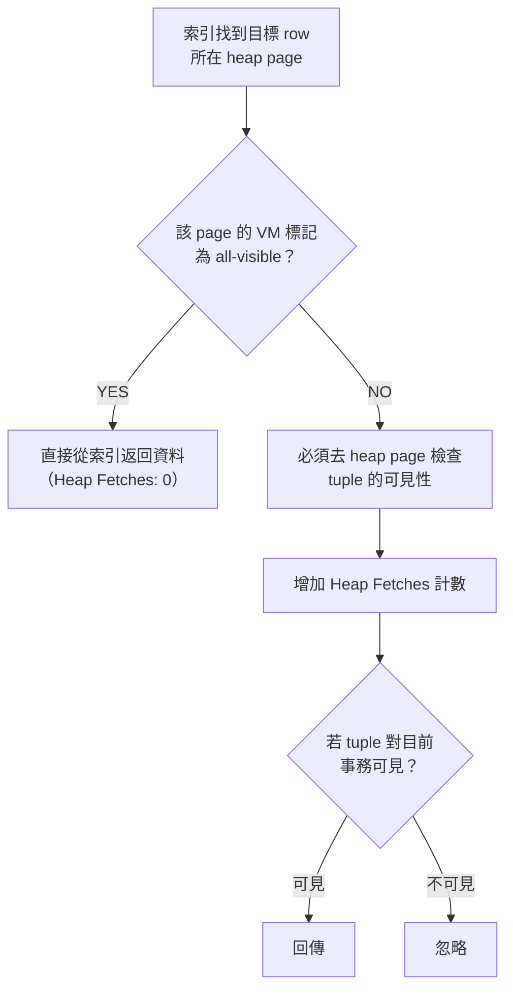
```mermaid
flowchart TD
    A["索引找到目標 row<br>所在 heap page"] --> B{"該 page 的 VM 標記<br>為 all-visible？"}
    B -->|"YES"| C["直接從索引返回資料<br>（Heap Fetches: 0）"]
    B -->|"NO"| D["必須去 heap page 檢查<br>tuple 的可見性"]
    D --> E["增加 Heap Fetches 計數"]
    E --> F{"若 tuple 對目前<br>事務可見？"}
    F -->|"可見"| G["回傳"]
    F -->|"不可見"| H["忽略"]
```

- 如果 VM 說 page 是 `all-visible`，Postgres 就完全信任它，連碰都不碰 heap，直接從 index 輸出結果。這就是 `Heap Fetches: 0` 的最高境界。
- 只要 page 不滿足 `all-visible` 條件（例如曾發生過 `UPDATE` 但尚未被 `VACUUM`），就必須實際讀取 heap page，逐一檢查每一行的可見性，產生 `Heap Fetches`。

#### c VACUUM 如何讓 VM 變成 all-visible？

`VACUUM` 會做兩件關鍵事：

1. **清理死元組**：將不再被任何事務需要的舊版本 tuple 標記為可用空間。
2. **更新 Visibility Map**：清完 dead tuple 後，該 page 上剩下的全部都是「對所有人可見」的 live tuple，此時 `VACUUM` 就會把這個 page 在 VM 中的 `all-visible` bit 設為 1。

之後的 Index-Only Scan 再碰到這個 page，就能直接跳過 heap fetch，因為 VM 已經保證「不用檢查了，全部可見」。

這就是那條實戰法則背後的原理：因為即使索引裡包含了所有需要的欄位，只要那些 heap page 還沒被 `VACUUM` 更新過 VM，Postgres 就不敢直接用索引的內容，被迫一次又一次地去 heap 確認，導致大量的 `Heap Fetches`。

#### d 實際監控與調整策略

**4.1 檢查死元組與 VACUUM 狀態**

```sql
SELECT relname,
       n_live_tup,
       n_dead_tup,
       round(100.0 * n_dead_tup / NULLIF(n_live_tup + n_dead_tup, 0), 2) AS dead_pct,
       last_autovacuum,
       last_vacuum
FROM pg_stat_user_tables
WHERE relname = 'your_table_name';
```

- 如果 `dead_pct` 超過 5%~10%，且你的查詢經常使用 Index-Only Scan，就表示 VACUUM 的頻率需要提高。
- 觀察 `last_autovacuum` 和 `last_vacuum` 的時間，若太久沒執行，就是警訊。

**4.2 手動觸發 VACUUM 進行測試**

```sql
VACUUM (VERBOSE) your_table_name;
```

然後再執行一次你的查詢，查看 `EXPLAIN (ANALYZE, BUFFERS)` 中 `Heap Fetches` 是否大幅下降。通常立刻就能看到改善。

**4.3 調整 autovacuum 參數（單表級別）**

如果手動 `VACUUM` 有效，就代表 autovacuum 的預設設定對這張表來說太「寬鬆」。可以在單表上調整 storage parameter：

```sql
ALTER TABLE your_table_name SET (
    autovacuum_vacuum_scale_factor = 0.01,   -- 原本預設 0.2（20%），改成 1%
    autovacuum_vacuum_threshold = 1000       -- 死元組超過 1000 就觸發
);
```

- `autovacuum_vacuum_scale_factor`：表中有多大比例的 dead tuple 才觸發 autovacuum。對於大型表（上百萬行），`0.2` 可能會累積數十萬死元組才動作，改為 `0.01`~`0.05` 會讓 VACUUM 更頻繁。
- `autovacuum_vacuum_threshold`：絕對死元組數量門檻，避免極小表頻繁 vacuum。

**4.4 加快 Index-Only Scan 的輔助：VACUUM FREEZE**

如果你的表有大量寫入，也可以考慮稍微積極的凍結策略（讓 VM 也標記為 `all-frozen`），不過一般情況調高 autovacuum 頻率就足夠。

#### e 總結：VACUUM 是 Index-Only Scan 效能的真正守門員

- 沒有 `VACUUM`，Visibility Map 就不會更新，Index-Only Scan 永遠無法信任索引中的資料，必須頻繁回表檢查。
- 即使你精心設計了 covering index，只要寫入多、VACUUM 少，`Heap Fetches` 就會居高不下，索引效益大打折扣。
- 在生產環境中，監控 dead tuple 比例 + 調校 autovacuum 參數，和設計索引本身一樣重要。

### III. 包含欄位的索引（INCLUDE Index）

PG 11+ 支援 `INCLUDE` 子句，可以在不影響索引鍵（key column）排序的前提下，在 leaf page 中攜帶額外欄位：

```sql
CREATE INDEX idx_code_status ON index_only_test (code) INCLUDE (status);
```

優勢：
- `code` 決定 B-Tree 排序和搜尋路徑
- `status` 只存在 leaf page，不參與 branch page 的分叉決策
- 索引體積比把 `status` 也當成 key column 小，且不會影響唯一性約束

`INCLUDE` 索引特別適合：按 A 排序但只需要 A + B 兩個欄位的查詢。

---

## 8 掃描類型總覽與決策流程圖


### I. 六種掃描類型速查

| 掃描類型 | EXPLAIN 關鍵字 | 運作方式 | 最佳場景 |
|----------|---------------|---------|---------|
| Sequential Scan | `Seq Scan` | 讀取整表，逐行檢查 | 小表、回傳 > ~10% rows |
| Index Scan | `Index Scan` | B-Tree lookup → heap fetch | 精準查詢（PK / unique），回傳少量行 |
| Bitmap Scan | `Bitmap Index Scan` + `Bitmap Heap Scan` | 建立 page-level bitmap → 依序讀 heap | 中等選擇率、多條件 `AND`/`OR` |
| Parallel Seq Scan | `Parallel Seq Scan` + `Gather` | 多 worker 分塊掃表 | 大型全表掃描 |
| Parallel Index Scan | `Parallel Index Scan` + `Gather` | 多 worker 分區段掃描索引 | 大型索引範圍掃描 |
| Index-Only Scan | `Index Only Scan` | 純讀索引，不碰 heap | 所有查詢欄位都在索引中 + VM clean |

### II. Senior Dev 補充：掃描選擇的實戰除錯策略

當查詢效能不佳時，按以下步驟診斷：

**1. 先確認掃描類型**

```sql
EXPLAIN (ANALYZE, BUFFERS, TIMING) SELECT ...
```

重點觀察：
- `actual time` vs `estimated cost` 的差距（統計資訊是否過時）
- `Buffers` 的 `shared hit` vs `shared read`（cache hit ratio）
- `Heap Fetches`（Index-Only Scan 是否有效）

**2. 判斷 Planner 是否選錯掃描**

如果是 Seq Scan 但直覺該用 Index Scan：
```sql
-- 檢查 planner 參數
SHOW random_page_cost;     -- SSD 建議 1.1 - 1.5
SHOW effective_cache_size; -- 建議設為 RAM 的 50-75%
SHOW seq_page_cost;        -- 基準值 1.0

-- 更新統計資訊
ANALYZE table_name;

-- 查看 column 的 n_distinct 和 correlation
SELECT attname, n_distinct, correlation
FROM pg_stats
WHERE tablename = 'table_name' AND attname IN ('col1', 'col2');
```

 **3. 臨時性測試（只在 Session 層級）**

```sql
SET enable_seqscan = off;    -- 強制跳過 Seq Scan，驗證 Index Scan 成本
EXPLAIN (ANALYZE) SELECT ...;
-- 確認 Index Scan 是否真的更快，然後決定是否調整參數
```

> **警告**：**絕對不要在 production 全局關閉 `enable_seqscan`**。這只是一個診斷手段。如果 Index Scan 真的更優，問題是參數設定（`random_page_cost` 或 `effective_cache_size` 不準），應調整參數而非關閉 seq scan。

**4. 如果 Heap Fetches 過高**

```sql
-- 手動 VACUUM 更新 visibility map
VACUUM (VERBOSE) table_name;

-- 再次檢查 Index-Only Scan 是否達到 Heap Fetches: 0
EXPLAIN (ANALYZE, BUFFERS) SELECT ...;
```

### III. 影響 Planner 掃描選擇的關鍵 GUC 參數

| 參數 | 預設值 | 影響 | 建議 |
|------|--------|------|------|
| `random_page_cost` | 4.0 | 降低會讓 Index Scan 更容易勝出 | SSD 設 1.1-1.5 |
| `seq_page_cost` | 1.0 | 基準值，一般不需調整 | 保持 1.0 |
| `effective_cache_size` | 4GB | 影響 Planner 對 index page 在 cache 中的假設 | 設為 OS cached + shared_buffers 的 50-75% |
| `work_mem` | 4MB | 影響 Bitmap Scan 是否被選用 | 視 query 類型設 16MB-256MB |
| `min_parallel_table_scan_size` | 8MB | 低於此的表不做 Parallel Scan | 預設合理 |
| `max_parallel_workers_per_gather` | 2 | 單個 Gather 的最大 worker 數 | 2-4，不超過 CPU core 的一半 |

---

## 9 延伸閱讀與工具

- [PostgreSQL EXPLAIN 官方文件](https://www.postgresql.org/docs/current/using-explain.html)
- [explain.depesz.com](https://explain.depesz.com/) — 貼上 EXPLAIN 輸出，自動解析和上色顯示 cost/actual time 差異
- [explain.dalibo.com](https://explain.dalibo.com/) — 另一款 EXPLAIN 視覺化工具，支援多語系
- [CrunchyData - Parallel Queries in Postgres](https://www.crunchydata.com/blog/parallel-queries-in-postgres)
- [PG 17 新特性：B-Tree Index Deduplication 對掃描的影響](https://www.postgresql.org/docs/17/btree-implementation.html)


# 二、PostgreSQL Index 核心機制

## 1 Bitmap Heap Scan

### I. Block = Page（8KB）

Block 與 Page 在 PostgreSQL 中是完全同義詞，指向磁盤上最小的存儲與 I/O 單元，預設大小 8KB。

- **物理層面**：一張表（或 index）在磁盤上由一個或多個固定大小的 page 組成，每個 page 8KB。當 PostgreSQL 需要讀取數據時，不會一次只讀一行，而是以 page 為最小單位讀入 shared_buffers。

**圖解補充：**

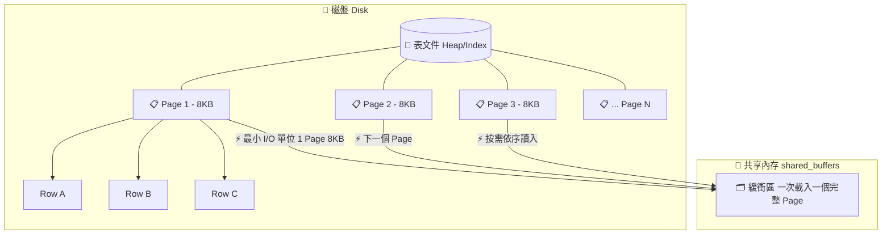
```mermaid
flowchart TD
    subgraph Disk["💾 磁盤 Disk"]
        direction TB
        Table[("📄 表文件 Heap/Index")]
        Page1["📋 Page 1 - 8KB"]
        Page2["📋 Page 2 - 8KB"]
        Page3["📋 Page 3 - 8KB"]
        PageX["📋 ... Page N"]

        Table --- Page1
        Table --- Page2
        Table --- Page3
        Table --- PageX

        Page1 --> Row1["Row A"]
        Page1 --> Row2["Row B"]
        Page1 --> Row3["Row C"]
    end

    subgraph Memory["🧠 共享內存 shared_buffers"]
        Buffer["🗂️ 緩衝區 一次載入一個完整 Page"]
    end

    Page1 -->|"⚡ 最小 I/O 單位 1 Page 8KB"| Buffer
    Page2 -->|"⚡ 下一個 Page"| Buffer
    Page3 -->|"⚡ 按需依序讀入"| Buffer
```

> **圖解說明：**
> 
> 1. **表由多個固定大小的 Page 組成**：左邊的「表文件」物理上是一連串的 8KB Page（Page 1, Page 2, Page 3 ...）。無論是 Heap 表還是 Index，底層存儲都用相同的 Page 結構。
> 2. **Page 是磁盤 I/O 的最小單位**：PostgreSQL 絕對不會「只讀一行」。即使查詢只要求一行數據（例如 `SELECT * FROM t WHERE id=100`），數據庫也會把 **包含那一行的整個 Page（8KB）** 從磁盤讀進記憶體。圖中箭頭標示了「最小 I/O 單位：1 個 Page (8KB)」。
> 3. **讀入 shared_buffers**：右側的 `shared_buffers` 是 PostgreSQL 的緩衝池（記憶體中的一塊區域）。讀取時 Page 會先被載入這裡，後續查詢若命中相同 Page 就可以直接從記憶體拿，不再讀磁盤。圖中每個 Page 按順序移進 shared_buffers，這也是 Bitmap Heap Scan 能實現「物理順序讀取」的基礎：先排好要讀哪些 Page，再一口氣批量載入，減少磁頭跳動。
> 4. **Page 裡面含有多行**：從 `Page 1` 中放大可以看到 Row A、Row B、Row C，表示一個 Page 通常會儲存數十到上百行（視行寬而定）。所以「以 Page 為單位讀取」也自然解釋了為何 Bitmap Heap Scan 的效能瓶頸在 Page 讀取量，而不只是行數。
> 
> 💡 **簡單記法**：
> - **磁盤上**：表 → 多個 8KB Page。
> - **讀取時**：一次一個 8KB Page 進 shared_buffers。
> - **行**：只是 Page 裡的內容，隨著 Page 一起上來。
> 
> 如果圖無法渲染，可以想像一本書：整本書是「表」，每頁是「Page」（固定大小），你想看某一行字，必須翻開整頁，不可能只把那一行單獨抽出來看。PostgreSQL 的 I/O 行為正是如此。

- **稱呼習慣**：核心代碼和文檔中經常混用。Page 偏重邏輯結構（內有 row、page header），Block 偏重物理存儲、I/O 操作（如 blkno）。在 execution plan 和日常討論中完全可以互換。

### II. B-tree 的 Bitmap Index Scan：預設 Row-Level，但可退化為 Lossy

- **預設情況（memory 充足）**：B-tree 構建的位圖是 row-level（TID bit array），每一位對應一個具體的 `(page, item)`，可以精確到 row。
- **memory 不足時**：如果 result set 很大，超出 `work_mem` 的限制，PostgreSQL 會把 bitmap 退化為 lossy bitmap（page-level），此時每個位對應一個 page，整個 page 要被讀出來逐行 Recheck。

從 `EXPLAIN (ANALYZE, BUFFERS)` 的輸出中，看 Bitmap Heap Scan 的 `Heap Blocks: exact=xxx lossy=yyy` 來判斷是否退化。lossy 不為零就說明退化發生了。

> 補充（Senior Dev）：預設 `work_mem = 4MB` 對於現代伺服器極度保守。一個 query 可能用到 `work_mem * number_of_parallel_workers` 的 memory（例如 Hash Join），而不是 `work_mem` 上限。在 OLAP 場景建議 `work_mem = 256MB ~ 1GB`，但 OLTP 場景保持較低以避免單個 connection 耗盡 memory。

### III. Bitmap 結構：1 bit = 1 page（非 1 row）

這是理解 Bitmap Heap Scan 的關鍵。Bitmap 不是按 row 構建的，而是按 page 構建。

假設一張表有 100 萬 row，存儲在 10,000 個 8KB 的 page 裡。Bitmap 就是一個長度為 10,000 的 bit array：第 i 位對應表文件中的第 i 個 data page（page number i）。

**標記過程（Bitmap Index Scan）**：掃描 index（如 BRIN 或 B-tree）時，並不是馬上回 Heap 讀取 row。Index Scan 會找出哪些 page 可能包含符合條件的 row，然後把對應的 bit 設為 1。

- 對於 B-tree：每個 index entry 都包含 row 所在的 page 號。掃描時，會把所有匹配 entry 引用的 page 號對應的 bit 設為 1。
- 對於 BRIN：每個 index summary 覆蓋一個 page range（預設 128 個 page）。如果 summary 滿足條件（例如時間範圍重疊），就會把那 128 個 page 對應的 bit 全部設為 1。

**讀取過程（Bitmap Heap Scan）**：Bitmap 建好後，PostgreSQL 會遍歷這個 bitmap，找到所有被標記為 1 的 page，然後按物理順序（page 號遞增）依次把它們讀入 shared_buffers。這一步才真正從 Heap 中讀取 row。因為是順序讀取 page，磁頭或 SSD 不需要隨機跳轉，I/O 效率極高——這正是 Bitmap Heap Scan 優於普通 Index Scan 的核心原因。

### IV. 為什麼用 page 作為 Bitmap 粒度，而不是 row？

- **I/O 單位決定**：無論如何，讀取數據最後都要落到 page。即使 index 能找到具體 row，最終讀取的還是包含該 row 的整個 page。所以用 page 作為 bitmap 粒度，能直接映射到物理讀取。
- **memory 和 CPU 效率**：1000 萬 row 如果用 row-level bitmap 需要 10M bit（~1.25MB），而用 page-level bitmap（假設每 page 100 row）只需要 100K bit（~12.5KB），體積小一個數量級，構建和遍歷都快得多。
- **與 BRIN 天然契合**：BRIN 本身就是 page-level summary index，它返回的就是 page range，直接填充 bitmap 特別自然。

### V. 為什麼時間花在 Bitmap Heap Scan 上，而不是 Index Scan？

很多人的直覺是：「既然 index 幫我定位了 row，為什麼大頭時間還在 Heap Scan？」原因在於：

1. **I/O 繞不開，最終數據要從 Heap 讀取**：Index 裡只存了 index key 和 row pointer（TID），並沒有存完整的 row 數據。無論 bitmap 是 row-level 還是 page-level，Bitmap Heap Scan 必須拿著這些 pointer 去 Heap 中取出整行數據。這個步驟就是慢的主要來源，尤其是：
   - 需要訪問的 data page 數量很大（即使每個 page 只取一行）。
   - 這些 page 大多不在 memory（shared_buffers 或 filesystem cache），需要物理 disk read。
2. **雖然避免了 random I/O，但讀取的 page 數可能依然很多**：Bitmap Heap Scan 會把需要訪問的 page 號排序，然後按物理順序批量讀取，這比普通 Index Scan 的隨機單 page 跳轉要快得多。但是，如果 query 本身需要讀取 10000 個不同的 data page，這 10000 次 read 仍然是實打實的 I/O 消耗。時間自然就堆在這個階段。
3. **Recheck Cond 帶來的 CPU 開銷（尤其在退化時）**：如果 bitmap 退化成了 page-level，或者使用了 BRIN 這類有損 index，那麼整個 page 內的所有 row 都要被重新檢查條件，這會產生可觀的 CPU 時間。對於 B-tree，如果 lossy 發生，同樣會因 page-level 讀取而多出大量無用的 row 檢查。
4. **Bitmap Heap Scan 是「真正幹重活」的節點**：在 plan 裡，Bitmap Index Scan 只負責掃 index、填 bitmap，幾乎純 CPU，速度很快，所以 actual time 非常小。而接下來 Bitmap Heap Scan 負責實際的表訪問和過濾輸出，是整個 query 的體力活，時間自然全部集中在這裡。

> 總結：B-tree 預設構建的是 row-level 的 bitmap（精確到 row），不是 page-level，除非 memory 不夠退化為 lossy。慢的主要原因是 Bitmap Heap Scan 要真正去讀 Heap data page，這一步驟集中了絕大多數的 I/O 和大量的 CPU 過濾。row-level bitmap 只幫你避免了「整 page Recheck」的 CPU 浪費，但無法避免「讀 page」這個動作本身。看到時間都在 Bitmap Heap Scan 上是正常的，關鍵在於判斷它是 I/O bound 還是 CPU bound，然後對症優化。
>
> #### I/O Bound vs CPU Bound（效能診斷基礎）
>
> 這對概念是效能診斷的基礎，直接決定你的優化方向。
>
> **什麼是 I/O Bound 與 CPU Bound？**
>
> 繼續用 `EXPLAIN (ANALYZE, BUFFERS)` 輸出為例：
>
> ```text
> Bitmap Heap Scan on orders  (actual time=0.123..10.456 rows=4800 loops=1)
>    Recheck Cond: ...
>    Rows Removed by Index Recheck: 12000
>    Heap Blocks: exact=800 lossy=200
>    Buffers: shared hit=200 read=800    -- 這裡是關鍵
> ```
>
> **1. 判斷為 I/O Bound**
>
> 當 `Buffers: read` 的數值很大時，代表絕大多數的 page 不在記憶體中，需要**物理磁盤讀取**。這就是典型的 I/O Bound。
>
> - **特徵**：查詢大部分時間花在等磁盤。
> - **解法**：
>   - 加大記憶體（`shared_buffers` 或伺服器本身記憶體），讓更多資料能留在快取中。
>   - 使用更快的磁盤（SSD）。
>   - 減少需讀取的資料量，例如改用能更快過濾的索引（B-tree 而非 BRIN），或是使用 Covering Index 達成 Index Only Scan，根本避免去讀 Heap Page。
>
> **2. 判斷為 CPU Bound**
>
> 當 `Buffers: shared hit` 佔絕大多數，但查詢依然很慢時，問題就在 CPU 計算上。此時瓶頸可能是：
>
> - **Recheck 開銷大**：`Rows Removed by Index Recheck` 數值遠大於最終回傳行數（例如 12000 vs 4800），表示 CPU 花費大量時間在過濾那些最後被丟棄的誤報行。
> - **資料處理複雜**：WHERE 條件本身計算複雜（如正則表達式），或回傳行數極多，需要大量運算。
>
> - **特徵**：資料都在記憶體了，但 CPU 使用率飆高，查詢還是慢。
> - **解法**：
>   - 升級更快的 CPU。
>   - 如果是 Recheck 導致，就對症下藥：加大 `work_mem` 避免精確點陣圖退化為 Lossy Page-Level 點陣圖（針對 B-tree）；或是調整 BRIN 的 `pages_per_range` 來降低誤報率。
>
> **一句話總結**
>
> > 看 `Buffers` 來判斷：`read` 多、等待久，就是 **I/O Bound**；`hit` 多、但 CPU 使用率飆高，就是 **CPU Bound**。這個判斷會直接告訴你該花錢買記憶體/SSD，還是該花時間優化 SQL 與索引。

### VI. Recheck Cond 詳解

Recheck Cond 是 PostgreSQL execution plan 中 Bitmap Heap Scan 節點上的一個關鍵步驟。其核心任務是：從 data page 中取出每一行後，再次用 index 條件核實它真的符合要求，把誤傷的 row 丟棄。

#### a 為什麼需要 Recheck？——有損性的根源

Index Scan 構建 bitmap 時，不一定能精確到「具體哪一行滿足條件」，有時只能告訴你「哪些 page 裡可能有」。這種不精確就叫有損。Recheck 就是為此而生，確保最終結果絕對正確。

有損主要來自兩種情況：

1. **Index 本身有損**：
   - **BRIN**：只記錄每個 page range 的 min / max。如果查詢 `create_time >= '2026-05-10'`，一個範圍 `min='2026-05-09', max='2026-05-11'` 的 page block 就會被標記。但這個 page block 裡很可能存在 `2026-05-09` 的 row，它們不滿足條件，必須 Recheck 過濾。
   - **GIN**：Inverted index 存儲了 key 和對應的 page 號列表，但一個 page 裡可能有多 row，有的符合全文查詢，有的不符合。
   - **GiST**：取決於 operator class。例如地理位置的 `&&`（bounding box overlap）是有損的，因為 bounding box 重疊不代表幾何體真正相交。

2. **Bitmap 本身精度降低（Lossy Bitmap）**：即使 index 是精確的（如 B-tree），bitmap 本身也可能變有損。PostgreSQL 首先構建 row-level bitmap（每個 bit 對應一個 TID），但這會消耗 memory（work_mem）。如果 result set 巨大，memory 不足，系統會把 bitmap 退化為 page-level bitmap——只記錄哪些 page 包含匹配 row，丟掉了具體 row 位置。退化的 page-level bitmap 也是有損的，導致掃描時必須把整個 page 讀出來逐行 Recheck。

> 補充（Senior Dev）：Lossy bitmap 發生時，不只 Recheck 成本增加，還可能導致原本可通過 BitmapAnd 精確合併的多 index 條件被迫在 page 層面做合併，進一步放大誤報。例如 `WHERE status = 'active' AND create_time > '...'` 兩個 Bitmap Index Scan 若都退化，BitmapAnd 後每個 page 內仍需逐 row 驗證兩個條件。

#### b Recheck Cond 在不同 Index 類型下的表現

| Index 類型 | Bitmap 精確度 | 是否需要 Recheck | 說明 |
|-----------|-------------|----------------|------|
| B-tree | 預設構建精確 row-level bitmap | 通常不需要（plan 可能不顯示 Recheck Cond） | 如果 work_mem 不足導致 bitmap 退化（lossy），會顯示 Recheck Cond |
| BRIN | 永遠是 page-level，有損 | 一定需要，plan 中總是出現 Recheck Cond | Index 只提供 page range，本來就不精確到 row |
| GIN | 總是 page-level，有損 | 一定需要 | Inverted index 只指向 page，page 內可能有多 row |
| GiST | 可能精確也可能有損，視 operator 而定 | 視情況而定 | 例如 `btree_gist` 的 `=` 可精確，但 `range @> elem` 通常有損 |

#### c Recheck 的具體機制

舉例查詢：

```sql
SELECT * FROM orders WHERE create_time >= '2026-05-10';
```

1. **構建 bitmap**：BRIN Scan 返回 page 號 100~200 等，構建 page-level bitmap。
2. **Bitmap Heap Scan 開始**：從 page 100 開始，把整個 8KB page 讀入 memory。
3. **Recheck 每一行**：遍歷 page 內所有 row（可能幾十到上百行），對每一行評估 `create_time >= '2026-05-10'`。
   - 符合條件 → 返回給上層。
   - 不符合 → 丟棄（在 EXPLAIN ANALYZE 中可能看到 `Rows Removed by Index Recheck`）。
4. 處理完 page 100，接著處理 page 101，按 page 號順序直到結束。

**關鍵點**：Recheck 的 CPU 開銷取決於候選 page 的總 row 數，而非最終結果 row 數。如果 BRIN index 定位的 page range 很寬，但實際符合條件的數據很少，就可能出現「讀了大量 page，Recheck 後丟棄絕大部分 row」的情況，這是性能不佳的徵兆。

> 補充（Senior Dev）：可以用以下 SQL 模擬 BRIN Recheck 的健康度，在自己表上測量「命中率」：
> ```sql
> SELECT
>   (SELECT count(*) FROM big_table WHERE ts BETWEEN '...' AND '...') AS actual_rows,
>   (SELECT reltuples::bigint * (pages_in_range::float / relpages)
>    FROM pg_class WHERE relname = 'big_table') AS estimated_scanned_rows;
> ```
> 若 `estimated_scanned_rows >> actual_rows`，BRIN 誤報嚴重，考慮調小 `pages_per_range`。

#### d Recheck Cond vs Filter

| 謂詞 | 所在節點 | 用途 |
|------|----------|------|
| Recheck Cond | 只在 Bitmap Heap Scan 中 | 重新驗證 index 條件，是對「可疑」row 的第二次篩查，確保 index 的有損性不影響最終正確性 |
| Filter | 幾乎任何節點都可以有 | Execution plan 中無法使用 index 的其他條件，或者 index 條件以外的過濾。例如 `WHERE create_time > ... AND status = 'done'`，status 的過濾可能就是 Filter |

在 plan 中你可能會同時看到兩者：index 負責時間範圍（Recheck Cond），然後對其他列進行 Filter。

#### e 小結 Recheck

- Recheck Cond 是「有損 index / 有損 bitmap」的糾錯機制，必須執行以保證結果正確。
- BRIN index 必然導致 Recheck Cond，因為 index 只能標記 page range。
- 它的開銷取決於誤報 page 中的總 row 數，通過 `Rows Removed by Index Recheck` 可以量化。
- 優化思路：讓 index 更精準（調整 BRIN 參數）或避免 bitmap 退化（加大 work_mem，但對 BRIN 先天 page-level 無效）。

---

## 2 EXPLAIN 分析與效能優化

### I. 重點觀察指標

```sql
EXPLAIN (ANALYZE, BUFFERS)
SELECT * FROM orders
WHERE create_time BETWEEN '2026-05-01' AND '2026-05-07';
```

| 指標 | 含義 | 判斷 |
|------|------|------|
| `Buffers: shared hit=... read=...` | hit = 已在 memory，read = 物理 disk I/O | read 很大說明大量 data page 不在 memory，是最常見的主因 |
| `Heap Blocks: exact=xxx lossy=yyy` | exact = 精確 page 數（來自 index，無退化），lossy = 退化為 page-level bitmap 的 page 數 | lossy 很大 → 需要增加 work_mem（如 `SET work_mem = '256MB'`） |
| `Rows Removed by Index Recheck` | Recheck 丟棄了多少 row | 遠大於最終返回 row 數 → index 誤報率高，CPU 浪費嚴重，要麼 bitmap 退化嚴重，要麼有損 index |
| `actual time` | Bitmap Index Scan 的 actual time 很小（純 CPU），Bitmap Heap Scan 的 actual time 大 | 正常現象 |

範例 EXPLAIN 輸出：

```
Bitmap Heap Scan on orders  (actual time=0.123..10.456 rows=4800 loops=1)
   Recheck Cond: (create_time >= '2026-05-01'::date AND create_time <= '2026-05-07'::date)
   Rows Removed by Index Recheck: 12000
   Heap Blocks: exact=800 lossy=200
   Buffers: shared hit=1000
   ->  Bitmap Index Scan on idx_brin_orders_time  ...
```

解讀：`Rows Removed by Index Recheck: 12000` 遠大於實際返回的 4800 row，大量 row 被 Recheck 後丟棄。`Heap Blocks: lossy=200` 說明有 200 page 的 bitmap 退化了。`Buffers: shared hit=1000` 表示這些 page 都從 buffer cache 讀取——如果這裡的 read 很大，那說明物理 I/O 才是主因。

> 補充（Senior Dev）：`EXPLAIN (ANALYZE, BUFFERS, TIMING, COSTS, VERBOSE, SETTINGS)` 是所有參數的全開組合，建議寫成 alias。`SETTINGS` 會輸出當時的 GUC 參數（work_mem / random_page_cost 等），對跨環境比對 plan 差異極有用。另外，`auto_explain` extension 可以自動記錄慢查詢的 plan，比手動 `EXPLAIN ANALYZE` 更適合 production。

### II. 優化策略

| 問題 | 方案 |
|------|------|
| 位圖退化（lossy 很大） | 增加 `work_mem`，讓 bitmap 保持 row-level 精度，減少 page-level Recheck 開銷 |
| I/O read 很大（data page 不在 memory） | 加大 shared_buffers 和 OS memory，讓常用 data page 常駐 memory |
| 回表 I/O 過多 | 使用 Covering Index：`CREATE INDEX idx_orders_time_cover ON orders (create_time) INCLUDE (col1, col2)`，讓 query 變成 Index Only Scan，直接避開 Bitmap Heap Scan |
| 大範圍查詢、表極大、順序寫入 | 考慮 BRIN：極大減少 index 大小和 I/O，但必須接受一定比例的誤報 page Recheck |
| 單表數據量巨大 | Partition + Partition Pruning：按時間 partition，讓 query 只掃一個或幾個 partition，極大減少需要 bitmap 化的 page 數 |

> 補充（Senior Dev）：Covering Index（INCLUDE）與普通 composite index 的差異：INCLUDE column 不參與 index key 的排序和唯一性約束，只在 leaf page 存儲值。這意味著 INCLUDE 方式寫入成本更低、index 更小（因為 page split 只需按 key column 決定），但無法加速對 INCLUDE column 的 WHERE 過濾。真正需要加速過濾的 column 還是要放在 key 部分。
>
> Partition 與 BRIN 的組合應用：若按時間 partition 後，每個 partition 內數據按插入順序高度相關，BRIN 的效果會更好（因為 BRIN 依賴物理順序與邏輯順序的 correlation）。先分區、再 BRIN，是物聯網場景的黃金組合。

---

## 3 B+ Tree Leaf Page 與 Covering Index

### I. 什麼是 Leaf Page？

Leaf Page（葉子頁）是 B+ 樹索引中最底層的節點，也是實際存放「索引條目」的地方。

在 B+ 樹索引結構中：

- **根節點 / 內部節點**：只存鍵值 + 子頁指針，用來導航。
- **葉子頁（Leaf Page）**：位於最底層，存放完整的索引條目。
  - 若為聚簇索引（PostgreSQL 中不存在，但概念上等同於 table 本身），葉子頁本身就是數據頁。
  - 若為非聚簇索引，葉子頁存「索引鍵 + 指向數據行的指針（TID）」。
  - 所有葉子頁之間通常有雙向鏈結，支援範圍掃描。

#### a 圖解：B+ Tree 結構

下圖是一個簡化的 B+ 樹，索引鍵為 `user_id`：

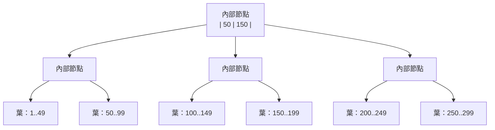
```mermaid
flowchart TD
    Root["內部節點<br/>| 50 | 150 |"]
    Root --> N1["內部節點"]
    Root --> N2["內部節點"]
    Root --> N3["內部節點"]
    N1 --> L1["葉：1..49"]
    N1 --> L2["葉：50..99"]
    N2 --> L3["葉：100..149"]
    N2 --> L4["葉：150..199"]
    N3 --> L5["葉：200..249"]
    N3 --> L6["葉：250..299"]
```

放大其中一個葉子頁（假設非聚簇索引，並帶有 INCLUDE 欄位）：

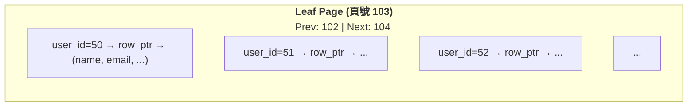
```mermaid
flowchart TB
    subgraph LP["<b>Leaf Page (頁號 103)</b><br/>Prev: 102 | Next: 104"]
        direction TB
        R1["user_id=50 → row_ptr → (name, email, ...)"]
        R2["user_id=51 → row_ptr → ..."]
        R3["user_id=52 → row_ptr → ..."]
        R4["..."]
    end
```

#### b 如果有 Covering Index with INCLUDE

例如：

```sql
CREATE INDEX idx_cover ON orders (order_date) INCLUDE (amount, status);
```

則葉子頁內的條目會是：

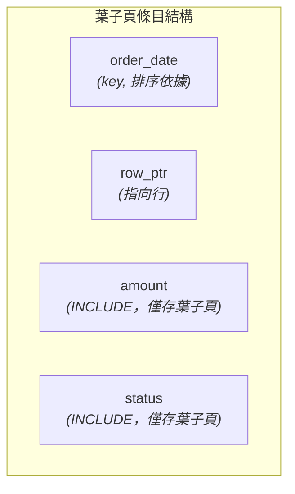
```mermaid
flowchart LR
    subgraph entry["葉子頁條目結構"]
        direction LR
        A["order_date<br/><i>(key, 排序依據)</i>"]
        B["row_ptr<br/><i>(指向行)</i>"]
        C["amount<br/><i>(INCLUDE，僅存葉子頁)</i>"]
        D["status<br/><i>(INCLUDE，僅存葉子頁)</i>"]
    end
```

`amount`、`status` 的值直接嵌在葉子頁裡，查詢時若只需這些欄位，就不必回表。

### II. Covering Index（INCLUDE）與普通 Composite Index 的差異

核心差異在於**葉子頁儲存什麼**，以及**鍵的排序行為**。

| 特性 | 普通複合索引 (Composite Index) | 包含欄位索引 (INCLUDE) |
|------|-------------------------------|------------------------|
| 索引鍵定義 | `INDEX (A, B)` —— A、B 都在 key 中 | `INDEX (A) INCLUDE (B)` —— 只有 A 在 key |
| 排序與唯一性 | A、B 共同決定排序，參與唯一性約束 | 只有 A 決定排序，B 不參與 |
| 葉子頁內容 | `(A, B, row_ptr)` | `(A, row_ptr, B)` |
| WHERE 過濾 B 時 | 可以用索引快速定位 | 無法加速，B 僅在葉子頁中，無法當作導航鍵 |
| 寫入成本 & Page Split | 任何 key 欄位變動都可能觸發分裂，較重 | 僅依 A 決定分裂，成本更低 |
| 索引大小 | 通常較大（B 也影響樹結構） | 較小，樹結構只按 A 建立 |

**使用 INCLUDE 的時機**：

- 你想讓查詢變成覆蓋索引（Covering Index），但某些欄位不需要用於過濾或排序，只需輸出。
- 典型的例子：`WHERE order_date = ...`，但 `SELECT order_date, amount`，此時用 `INCLUDE (amount)` 即可，不用把 `amount` 放入 key。

### III. Partition + BRIN 的組合應用（IoT 黃金組合）

這跟 Leaf Page 沒有直接關係，但指向了另一個層面的儲存結構優化。

- **BRIN（Block Range INdex）** 依賴「物理儲存順序」與「邏輯值順序」的高度相關性。
- 當我們按 `time` 做 partition（例如每天一個分區），每個分區內的資料都是按時間順序插入，物理上極度有序。
- 此時在每個分區上建 BRIN（例如 `BRIN ON timestamp`），只需極小的索引就能快速跳過大量不相關的 block range，實現類似時序數據庫的效果。

流程圖：

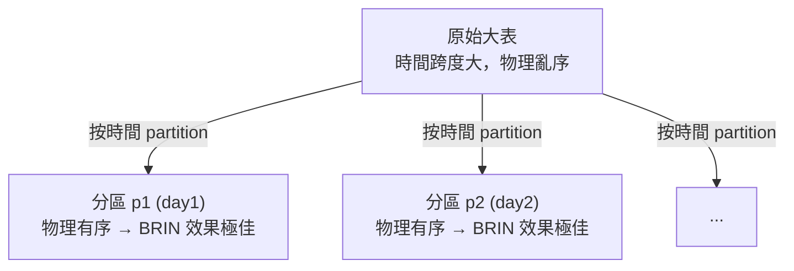
```mermaid
flowchart TD
    A["原始大表<br/>時間跨度大，物理亂序"]
    A -->|"按時間 partition"| P1["分區 p1 (day1)<br/>物理有序 → BRIN 效果極佳"]
    A -->|"按時間 partition"| P2["分區 p2 (day2)<br/>物理有序 → BRIN 效果極佳"]
    A -->|"按時間 partition"| PX["..."]
```

這樣既能利用 partition 做資料管理與淘汰，又能用 BRIN 在分區內高效過濾，是物聯網、日誌、監控等場景的經典設計。

**總結**：Leaf Page 是索引真正存放「數據與指標」的地方，理解它才能明白覆蓋索引、INCLUDE 的效益；而 Partition + BRIN 則是另一種繞開 B+ 樹、為時序數據極致壓縮索引大小的策略。

# 三、PostgreSQL BRIN 索引（Block Range INdex）

## 1 BRIN Index（Block Range INdex）

BRIN 是 page-level summary index。不 index 每行數據，而是按 data page 的物理存儲範圍（page range）來記錄，體積比 B-tree 小幾百甚至上千倍（可能從 GB 級降到 MB 甚至 KB 級）。每個 summary 存儲連續相鄰 page 的統計信息：`min(val), max(val), has null?, all null?`。

### I. 為什麼 BRIN 比 B-tree 更省空間？（圖解）

假設一張表，按時間順序插入，共 1 億行，每個 page 存 200 行，共 **500,000 個 data pages**。為 `time` 欄位分別建 B-tree 和 BRIN 索引來對比。

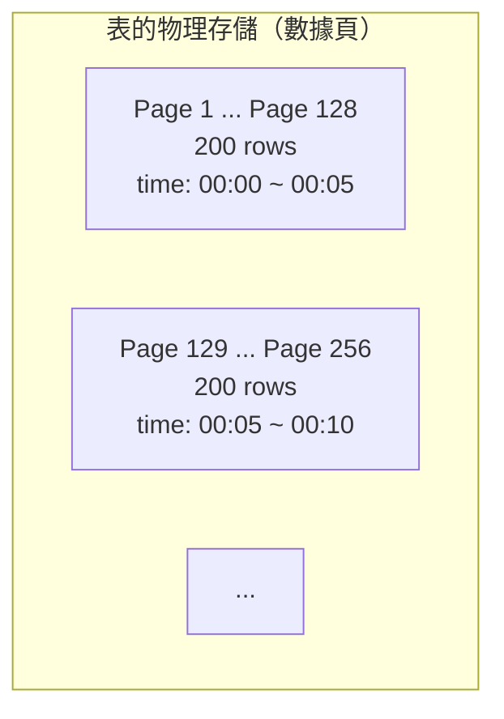
```mermaid
flowchart LR
    subgraph Table["表的物理存儲（數據頁）"]
        direction LR
        A["Page 1 ... Page 128<br/>200 rows<br/>time: 00:00 ~ 00:05"]
        B["Page 129 ... Page 256<br/>200 rows<br/>time: 00:05 ~ 00:10"]
        C["..."]
    end
```

**B-tree 索引（為每一行建一個索引條目）**

B-tree 的每個 leaf page 會塞滿許多 (time, 行指針) 的條目，結構分多層（根、內部、葉子）。

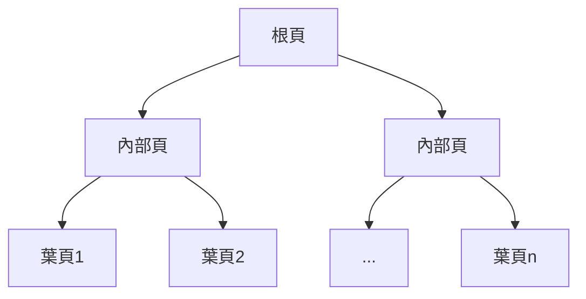
```mermaid
flowchart TD
    Root["根頁"]
    Root --> I1["內部頁"]
    Root --> I2["內部頁"]
    I1 --> L1["葉頁1"]
    I1 --> L2["葉頁2"]
    I2 --> L3["..."]
    I2 --> Ln["葉頁n"]
```

每個葉子頁內：

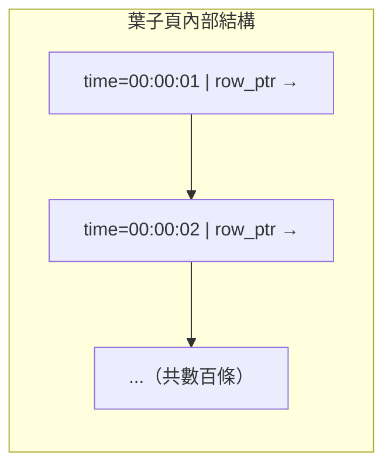
```mermaid
flowchart TB
    subgraph LP["葉子頁內部結構"]
        direction TB
        R1["time=00:00:01 | row_ptr →"]
        R2["time=00:00:02 | row_ptr →"]
        Rx["...（共數百條）"]
        R1 --> R2 --> Rx
    end
```

總條目數 = 1 億條（因為一行一條）
索引大小 ≈ 1 億 × (鍵值 + 指針 + 頁開銷) → 數 GB 級

**BRIN 索引（為每「一組連續頁」建一條摘要）**

BRIN 不關心每一行，只把連續的 page range（例如每 128 個頁）做一次統計。每個 range 只存一行摘要。

BRIN 索引結構（類似一個極小的列表）：

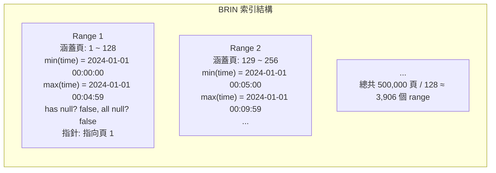
```mermaid
flowchart TB
    subgraph BRIN["BRIN 索引結構"]
        direction TB
        R1["Range 1<br/>涵蓋頁: 1 ~ 128<br/>min(time) = 2024-01-01 00:00:00<br/>max(time) = 2024-01-01 00:04:59<br/>has null? false, all null? false<br/>指針: 指向頁 1"]
        R2["Range 2<br/>涵蓋頁: 129 ~ 256<br/>min(time) = 2024-01-01 00:05:00<br/>max(time) = 2024-01-01 00:09:59<br/>..."]
        R3["...<br/>總共 500,000 頁 / 128 ≈ 3,906 個 range"]
    end
```

總摘要數 ≈ 3,906 條（每條約幾十字節）
索引大小 ≈ 3,906 × 幾十字節 → 數百 KB，甚至更小

**直觀對比（放大看同一個頁範圍）**

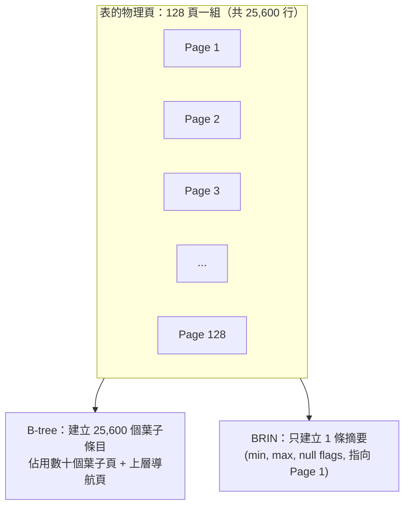
```mermaid
flowchart TD
    subgraph Pages["表的物理頁：128 頁一組（共 25,600 行）"]
        direction LR
        P1["Page 1"]
        P2["Page 2"]
        P3["Page 3"]
        P4["..."]
        P128["Page 128"]
    end
    Pages --> BTree["B-tree：建立 25,600 個葉子條目<br/>佔用數十個葉子頁 + 上層導航頁"]
    Pages --> BRIN["BRIN：只建立 1 條摘要<br/>(min, max, null flags, 指向 Page 1)"]
```

BRIN 就是用 **1 條摘要** 代替 **2.5 萬條索引條目**，這就是體積縮小幾百倍甚至上千倍的根本原因。

**為什麼可以這樣？條件是什麼？**

- 物理順序必須和邏輯順序高度相關（即 `time` 相近的行在硬盤上也是連續存放的）。
- 查詢 `WHERE time = '某值'` 時，BRIN 只能告訴你「這個範圍的 min～max 有沒有包含該值」，無法像 B-tree 那樣精確定位到某一行。若命中了，還是要掃描整個範圍的頁（但可以跳過完全不符的範圍，這就是 lossy index）。
- 因此 BRIN 主要適合 **順序性好、數據量巨大、查詢多為範圍掃描** 的場景（如 IoT、日誌），正是「先分區再 BRIN」的完美舞臺。

**總結一句話**

> B-tree = 為每一行存一個指路牌（精確但體積大）  
> BRIN = 為每一大片連續頁存一張「統計小紙條」（粗糙但極小）

當數據物理上本身就是有序的，這種「小紙條」就足以快速跳過不需要的區塊，同時索引大小從 GB 級直接摔到 MB 甚至 KB 級。

- **適用場景**：海量、順序增長的時間序列數據（如 log 表）。
- **不適用場景**：頻繁的隨機點查。因為 BRIN 是有損 index，精確定位能力不如 B-tree。

BRIN 查詢 plan 中始終是 Bitmap Index Scan + Bitmap Heap Scan 的組合——因為 BRIN 本身返回 page range，直接填充 bitmap，天然對應 page-level 粒度。

---

> 來源：[digoal - PostgreSQL 物联网黑科技 — 瘦身几百倍的索引(BRIN index) (2016-04-14)](https://github.com/digoal/blog/blob/master/201604/20160414_01.md)

---

## 2 背景：BTREE 為何不適合 IoT 場景

IoT 場景特徵：海量數據流式寫入、查詢以範圍掃描為主（FIFO）。在此場景下 BTREE 有兩個致命問題：

**1. Index size 過大**

BTREE 逐 row 存儲 indexed column value + TID（row pointer），導致 index size 與 table size 接近甚至更大：

```
postgres=# \dt+ tab
                    List of relations
 Schema | Name | Type  |  Owner   |  Size   | Description
--------+------+-------+----------+---------+-------------
 public | tab  | table | postgres | 3438 MB |
(1 row)

postgres=# \di+ idx_tab_id
                           List of relations
 Schema |    Name    | Type  |  Owner   | Table |  Size   | Description
--------+------------+-------+----------+-------+---------+-------------
 public | idx_tab_id | index | postgres | tab   | 2125 MB |
(1 row)
```

4.1 GB 的 table，index 就佔了 2.5 GB。

**2. 寫入效能大幅下降**

```sql
CREATE UNLOGGED TABLE tab(id serial8, info text, crt_time timestamp);
CREATE INDEX idx_tab_id ON tab(id);
```

```sql
-- test.sql
INSERT INTO tab (info) SELECT '' FROM generate_series(1, 10000);
```

有 BTREE index，每秒入庫 **28.45 萬行**：

```
pgbench -M prepared -n -r -P 1 -f ./test.sql -c 48 -j 48 -T 100
tps = 28.453983 (excluding connections establishing)
```

無 index，每秒入庫 **66.88 萬行**：

```
postgres=# DROP INDEX idx_tab_id;
```

```
pgbench -M prepared -n -r -P 1 -f ./test.sql -c 48 -j 48 -T 100
tps = 66.880260 (excluding connections establishing)
```

BTREE index 讓寫入效能腰斬（28.5 vs 66.9 萬/s）。對流式入庫場景來說，這意味著需要 2 倍以上的硬體資源才能跟上寫入速度。

> 補充（Senior Dev）：這是 BTREE 的結構性代價。每次 INSERT 不僅要寫 table heap page，還要寫 index page，且 BTREE 是平衡樹結構，資料若非完全遞增插入會觸發 page split，進一步加劇 write amplification。在 NVMe SSD 上，BTREE 的 random write 仍是瓶頸，相比順序寫入（append-only heap）有數量級的差距。BRIN 正是針對這兩點設計的替代方案。

**什麼是 Page Split？**

B+ Tree 的每個 leaf page 有固定容量（8KB），當一個已滿的 page 需要插入新 key 時，它必須分裂為兩個 page，並將中間值「提升」到父節點：

> 以下用簡化的 3 層 B+Tree 示範：假設 leaf page 最多容納 3 個 key，當 INSERT 25 到一個已滿的 leaf page 時會發生什麼。
>
> 圖中的數字（20、30、40 等）代表**索引鍵值（index key）**，即被索引欄位的實際值。例如對 `order_id` 建了索引，這些數字就是各筆訂單的 `order_id`。Leaf page 按 key 大小排序存放。

**分裂前：**

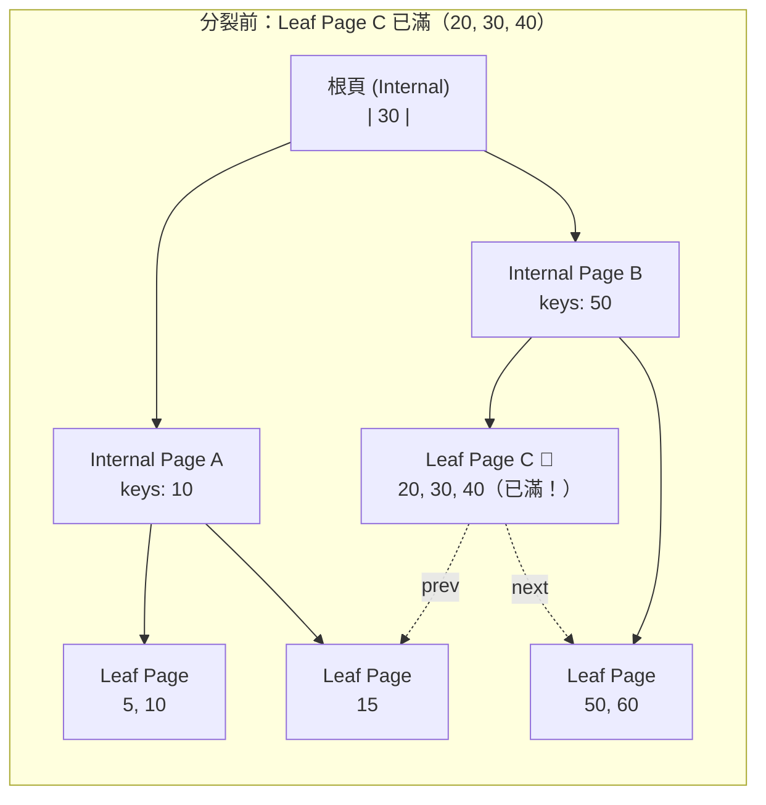
```mermaid
flowchart TD
    subgraph Before["分裂前：Leaf Page C 已滿（20, 30, 40）"]
        direction TB
        Root1["根頁 (Internal)<br/>| 30 |"]
        Root1 --> IA1["Internal Page A<br/>keys: 10"]
        Root1 --> IB1["Internal Page B<br/>keys: 50"]
        IA1 --> L1["Leaf Page<br/>5, 10"]
        IA1 --> L2["Leaf Page<br/>15"]
        IB1 --> L3["Leaf Page C 🔴<br/>20, 30, 40（已滿！）"]
        IB1 --> L4["Leaf Page<br/>50, 60"]
        L3 -.->|"prev"| L2
        L3 -.->|"next"| L4
    end
```

**INSERT 25 觸發 Page Split：**

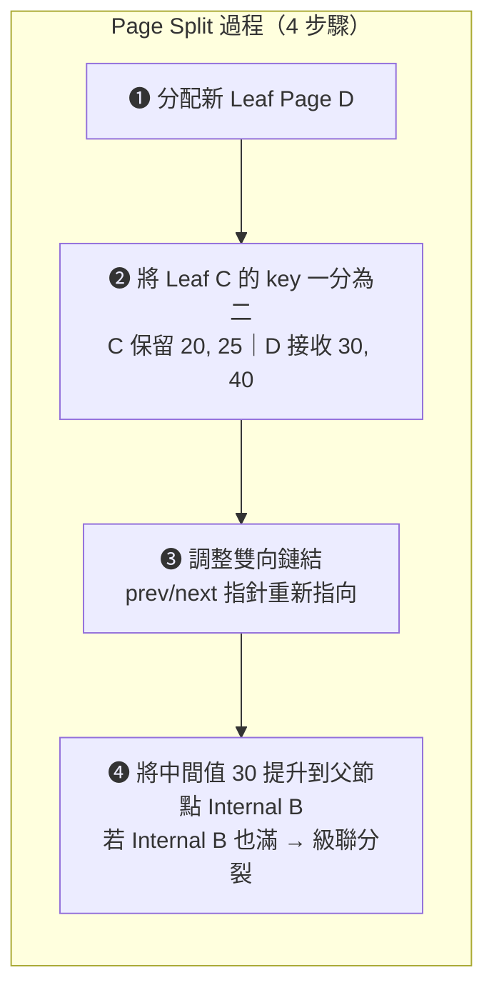
```mermaid
flowchart TD
    subgraph Split["Page Split 過程（4 步驟）"]
        direction TB
        S1["❶ 分配新 Leaf Page D"]
        S2["❷ 將 Leaf C 的 key 一分為二<br/>C 保留 20, 25｜D 接收 30, 40"]
        S3["❸ 調整雙向鏈結<br/>prev/next 指針重新指向"]
        S4["❹ 將中間值 30 提升到父節點 Internal B<br/>若 Internal B 也滿 → 級聯分裂"]
        S1 --> S2 --> S3 --> S4
    end
```

**分裂後：**

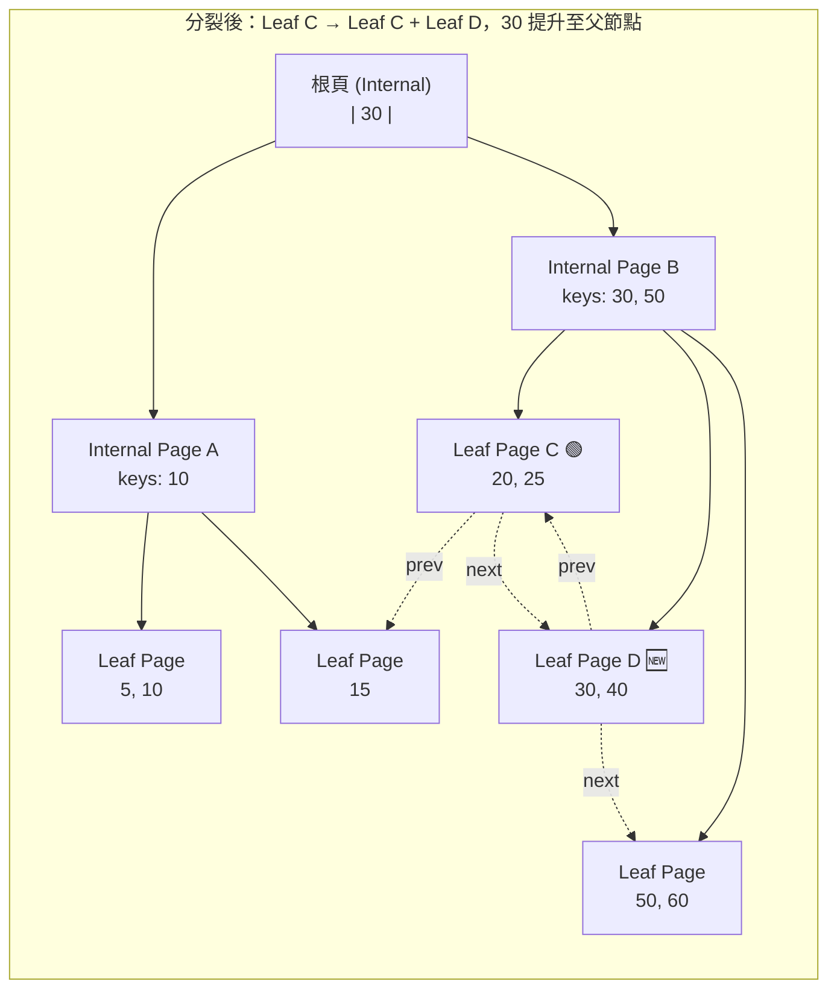
```mermaid
flowchart TD
    subgraph After["分裂後：Leaf C → Leaf C + Leaf D，30 提升至父節點"]
        direction TB
        Root2["根頁 (Internal)<br/>| 30 |"]
        Root2 --> IA2["Internal Page A<br/>keys: 10"]
        Root2 --> IB2["Internal Page B<br/>keys: 30, 50"]
        IA2 --> L1a["Leaf Page<br/>5, 10"]
        IA2 --> L2a["Leaf Page<br/>15"]
        IB2 --> L3a["Leaf Page C 🟢<br/>20, 25"]
        IB2 --> LDa["Leaf Page D 🆕<br/>30, 40"]
        IB2 --> L4a["Leaf Page<br/>50, 60"]
        L3a -.->|"prev"| L2a
        L3a -.->|"next"| LDa
        LDa -.->|"prev"| L3a
        LDa -.->|"next"| L4a
    end
```

**總結：1 次 INSERT 的代價**

| 步驟 | 操作 | I/O 類型 |
|------|------|----------|
| 分配新 page | 在磁盤上分配 8KB | Random |
| 搬移半數 key | 原 page 一半 entry 複製到新 page | Random |
| 更新鏈結 | 修改 prev/next leaf page 指針（2~4 個 page） | Random |
| 提升至父節點 | 將中間 key 插入 internal node，可能級聯到根 | Random（每次一層） |
| WAL 寫入 | 以上每步都寫 WAL log，保證 crash-safe | Sequential（但多次） |

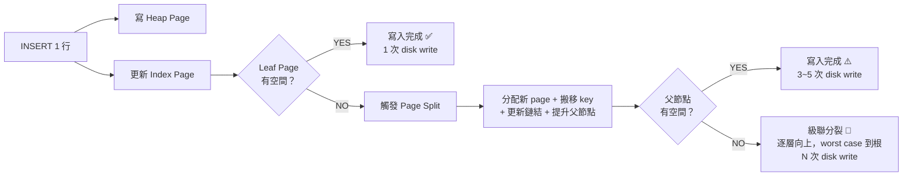
```mermaid
flowchart LR
    A["INSERT 1 行"] --> B["寫 Heap Page"]
    A --> C["更新 Index Page"]
    C --> D{"Leaf Page<br/>有空間？"}
    D -->|"YES"| E["寫入完成 ✅<br/>1 次 disk write"]
    D -->|"NO"| F["觸發 Page Split"]
    F --> G["分配新 page + 搬移 key<br/>+ 更新鏈結 + 提升父節點"]
    G --> H{"父節點<br/>有空間？"}
    H -->|"YES"| I["寫入完成 ⚠️<br/>3~5 次 disk write"]
    H -->|"NO"| J["級聯分裂 🔴<br/>逐層向上，worst case 到根<br/>N 次 disk write"]
```

> 這就是 write amplification 的本質：**1 次 INSERT 在最壞情況下可能觸發多次隨機磁盤寫入**。如果表有 N 個 BTREE 索引，每個索引都可能獨立觸發 page split——寫入放大倍數會乘以 N。

> BRIN 完全避免了 page split：每個 range 的摘要只更新 min/max，不涉及 page 搬移。新 range 只是單純在 BRIN index 尾部追加一條摘要，屬於 append-only 寫入。

---

## 3 BRIN 原理

BRIN 不逐 row 存 index entry。它將 table 中連續的 N 個 data page 視為一個 block range（預設 `pages_per_range = 128`），對每個 block range 僅存一份統計摘要：

```
min(val), max(val), has null?, all null?, left block id, right block id
```


若 table 有 10,000 個 page、`pages_per_range = 128`，BRIN 只需存 **79 份摘要**，而非逐 row 構建數百萬個 index entry。這解釋了為什麼 BRIN size 可從 GB 降到 MB/KB 級別。

查詢時的行為：
1. BRIN 掃描摘要，找到 min-max 與查詢條件重疊的 block range
2. 標記對應 page 到位圖（Bitmap Index Scan）
3. 按物理順序讀取 page，逐 row Recheck Cond（Bitmap Heap Scan）

BRIN 的有損性（只知哪個 page range 可能滿足，不知具體 row）決定了它**一定需要 Recheck**，也說明它不適合精確點查。

> [PG 14+] **multi-minmax**：原文時期每個 block range 只存一組 `(min, max)`。自 PG 14 起，`WITH (n_distinct_per_range = N)` 可在一個 block range 內存儲多組 min/max 值，大幅降低 value cluster 分散時的 false positive。例如 data 在 128 個 page 中出現多個不相鄰的 value cluster 時，舊版 BRIN 會用全域 min/max 涵蓋整個 range（包含大量不匹配的 gap），PG 14+ 則用多組 min/max 精確定位每個 cluster。
>
> ```sql
> CREATE INDEX idx_brin_mm ON tab USING BRIN (col)
>     WITH (pages_per_range = 128, n_distinct_per_range = 8);
> ```
>
> [PG 11+] **bloom operator class**：BRIN 預設只支援 min/max 運算（`<`, `<=`, `=`, `>=`, `>`），不支援多列複合條件中的精確等值。PG 11 引入 `brin_bloom` opclass，在每個 block range 存儲 bloom filter，使 BRIN 能處理 `=`、`IN` 查詢，且支援多列複合（`idx ON t USING brin (col1 bloom_ops, col2 bloom_ops)`）。bloom opclass 參數 `n_distinct_per_range`（與 multi-minmax 語法相同但語義不同）控制 bloom filter 大小，值越大 false positive 越低但 index 越大。
>
> ```sql
> CREATE INDEX idx_brin_bloom ON tab USING BRIN (status int4_bloom_ops)
>     WITH (pages_per_range = 128);
> ```

---

## 4 效能實測

### I. 寫入效能

BRIN index：

```sql
CREATE INDEX idx_tab_id ON tab USING BRIN (id) WITH (pages_per_range = 1);
```

```
pgbench -M prepared -n -r -P 1 -f ./test.sql -c 48 -j 48 -T 100
tps = 62.838701 (excluding connections establishing)
```

| 場景 | Insert TPS | 相對無 Index |
|------|-----------|-------------|
| No Index | **66.88 萬/s** | 100% |
| BRIN | **62.84 萬/s** | 94% |
| BTREE | 28.45 萬/s | 43% |

BRIN 寫入效能僅比無 index 低 6%，而 BTREE 損失 57%。


### II. Index Size

Table 大小：4,163 MB

```
postgres=# \di+ idx_tab_btree_id
                              List of relations
 Schema |       Name       | Type  |  Owner   | Table |  Size   | Description
--------+------------------+-------+----------+-------+---------+-------------
 public | idx_tab_btree_id | index | postgres | tab   | 2491 MB |
(1 row)

postgres=# \di+ idx_tab_id
                           List of relations
 Schema |    Name    | Type  |  Owner   | Table |  Size   | Description
--------+------------+-------+----------+-------+---------+-------------
 public | idx_tab_id | index | postgres | tab   | 4608 kB |
(1 row)

postgres=# \dt+ tab
                    List of relations
 Schema | Name | Type  |  Owner   |  Size   | Description
--------+------+-------+----------+---------+-------------
 public | tab  | table | postgres | 4163 MB |
(1 row)
```

| Index Type | Size | 與 Table 比例 |
|-----------|------|--------------|
| BTREE | **2,491 MB** | 59.8% |
| BRIN | **4,608 KB** (4.6 MB) | 0.11% |

BRIN 比 BTREE 小 **540 倍**。4.6 MB 的 index 幾乎可以全部載入 L3 cache，scan 時幾乎零 disk I/O。

### III. 範圍查詢效能

> 註：原文中 `/*+ seqscan(tab) */` / `/*+ bitmapscan(...) */` / `/*+ indexscan(...) */` 為 `pg_hint_plan` extension 的 hint 語法，非 PG 內建。原生 PG 使用 `SET enable_seqscan = off` 等 GUC 控制 plan choice。

全表掃描（force Seq Scan）：

```
postgres=# /*+ seqscan(tab) */ EXPLAIN (ANALYZE, BUFFERS, TIMING, COSTS, VERBOSE)
SELECT count(*) FROM tab WHERE id BETWEEN 1 AND 100000;
                                                           QUERY PLAN
--------------------------------------------------------------------------------------------------------------------------------
 Aggregate  (cost=1891578.12..1891578.13 rows=1 width=0) (actual time=11353.057..11353.058 rows=1 loops=1)
   Output: count(*)
   Buffers: shared hit=133202
   ->  Seq Scan on public.tab  (cost=0.00..1891352.00 rows=90447 width=0) (actual time=1660.445..11345.123 rows=100000 loops=1)
         Output: id, info, crt_time
         Filter: ((tab.id >= 1) AND (tab.id <= 100000))
         Rows Removed by Filter: 117110000
         Buffers: shared hit=133202
 Planning time: 0.048 ms
 Execution time: 11353.080 ms
(10 rows)
```

BRIN index（Bitmap Heap Scan）：

```
postgres=# /*+ bitmapscan(tab idx_tab_id) */ EXPLAIN (ANALYZE, BUFFERS, TIMING, COSTS, VERBOSE)
SELECT count(*) FROM tab WHERE id BETWEEN 1 AND 100000;
                                                             QUERY PLAN
-------------------------------------------------------------------------------------------------------------------------------------
 Aggregate  (cost=70172.91..70172.92 rows=1 width=0) (actual time=63.735..63.735 rows=1 loops=1)
   Output: count(*)
   Buffers: shared hit=298
   ->  Bitmap Heap Scan on public.tab  (cost=1067.08..69946.79 rows=90447 width=0) (actual time=40.700..55.868 rows=100000 loops=1)
         Output: id, info, crt_time
         Recheck Cond: ((tab.id >= 1) AND (tab.id <= 100000))
         Rows Removed by Index Recheck: 893
         Heap Blocks: lossy=111
         Buffers: shared hit=298
         ->  Bitmap Index Scan on idx_tab_id  (cost=0.00..1044.47 rows=90447 width=0) (actual time=40.675..40.675 rows=1110 loops=1)
               Index Cond: ((tab.id >= 1) AND (tab.id <= 100000))
               Buffers: shared hit=187
 Planning time: 0.049 ms
 Execution time: 63.755 ms
(14 rows)
```

BTREE index：

```
postgres=# /*+ bitmapscan(tab idx_tab_btree_id) */ EXPLAIN (ANALYZE, BUFFERS, TIMING, COSTS, VERBOSE)
SELECT count(*) FROM tab WHERE id BETWEEN 1 AND 100000;
                                                                 QUERY PLAN
--------------------------------------------------------------------------------------------------------------------------------------------
 Aggregate  (cost=76817.88..76817.89 rows=1 width=0) (actual time=23.780..23.780 rows=1 loops=1)
   Output: count(*)
   Buffers: shared hit=181
   ->  Bitmap Heap Scan on public.tab  (cost=1118.87..76562.16 rows=102286 width=0) (actual time=6.569..15.950 rows=100000 loops=1)
         Output: id, info, crt_time
         Recheck Cond: ((tab.id >= 1) AND (tab.id <= 100000))
         Heap Blocks: exact=111
         Buffers: shared hit=181
         ->  Bitmap Index Scan on idx_tab_btree_id  (cost=0.00..1093.30 rows=102286 width=0) (actual time=6.530..6.530 rows=100000 loops=1)
               Index Cond: ((tab.id >= 1) AND (tab.id <= 100000))
               Buffers: shared hit=70
 Planning time: 0.099 ms
 Execution time: 23.798 ms
(13 rows)
```

| 策略 | Execution Time | Buffers |
|------|---------------|---------|
| Seq Scan | **11,353 ms** | 133,202 |
| BRIN | **64 ms** | 298 |
| BTREE | **24 ms** | 181 |

範圍查詢下 BRIN 與 BTREE 差距 40 ms（64 vs 24），但 Buffers 閱讀量僅差 117 個 page。在 disk I/O 場景（非 shared hit）中，BRIN 的 index 體積優勢更能體現，因為 BRIN 的摘要 page 幾乎一定在 cache 中。

關鍵觀察：BRIN plan 中 `Heap Blocks: lossy=111`，表示所有 page 都退化了。原因在此測試中 `pages_per_range = 1` 且 scan 結果跨多個 block range，Bitmap Index Scan 返回的是 block range 級別（有損），因此沒有 `exact=`。

### IV. 精確點查效能

全表掃描（force Seq Scan）：

```
postgres=# /*+ seqscan(tab) */ EXPLAIN (ANALYZE, BUFFERS, TIMING, COSTS, VERBOSE)
SELECT count(*) FROM tab WHERE id = 100000;
                                                      QUERY PLAN
-----------------------------------------------------------------------------------------------------------------------
 Aggregate  (cost=1598327.00..1598327.01 rows=1 width=0) (actual time=8297.589..8297.589 rows=1 loops=1)
   Output: count(*)
   Buffers: shared hit=133202
   ->  Seq Scan on public.tab  (cost=0.00..1598327.00 rows=2 width=0) (actual time=1221.359..8297.582 rows=1 loops=1)
         Output: id, info, crt_time
         Filter: (tab.id = 100000)
         Rows Removed by Filter: 117209999
         Buffers: shared hit=133202
 Planning time: 0.113 ms
 Execution time: 8297.619 ms
(10 rows)
```

BRIN index：

```
postgres=# /*+ bitmapscan(tab idx_tab_id) */ EXPLAIN (ANALYZE, BUFFERS, TIMING, COSTS, VERBOSE)
SELECT count(*) FROM tab WHERE id = 100000;
                                                          QUERY PLAN
-------------------------------------------------------------------------------------------------------------------------------
 Aggregate  (cost=142.04..142.05 rows=1 width=0) (actual time=38.498..38.498 rows=1 loops=1)
   Output: count(*)
   Buffers: shared hit=189
   ->  Bitmap Heap Scan on public.tab  (cost=140.01..142.04 rows=2 width=0) (actual time=38.432..38.495 rows=1 loops=1)
         Output: id, info, crt_time
         Recheck Cond: (tab.id = 100000)
         Rows Removed by Index Recheck: 1811
         Heap Blocks: lossy=2
         Buffers: shared hit=189
         ->  Bitmap Index Scan on idx_tab_id  (cost=0.00..140.01 rows=2 width=0) (actual time=38.321..38.321 rows=20 loops=1)
               Index Cond: (tab.id = 100000)
               Buffers: shared hit=187
 Planning time: 0.102 ms
 Execution time: 38.531 ms
(14 rows)
```

BTREE index（force Index Scan）：

```
postgres=# /*+ indexscan(tab idx_tab_btree_id) */ EXPLAIN (ANALYZE, BUFFERS, TIMING, COSTS, VERBOSE)
SELECT count(*) FROM tab WHERE id = 100000;
                                                            QUERY PLAN
-----------------------------------------------------------------------------------------------------------------------------------
 Aggregate  (cost=2.76..2.77 rows=1 width=0) (actual time=0.018..0.018 rows=1 loops=1)
   Output: count(*)
   Buffers: shared hit=4
   ->  Index Scan using idx_tab_btree_id on public.tab  (cost=0.44..2.76 rows=2 width=0) (actual time=0.015..0.016 rows=1 loops=1)
         Output: id, info, crt_time
         Index Cond: (tab.id = 100000)
         Buffers: shared hit=4
 Planning time: 0.049 ms
 Execution time: 0.036 ms
(9 rows)
```

| 策略 | Execution Time | Buffers |
|------|---------------|---------|
| Seq Scan | **8,297 ms** | 133,202 |
| BRIN | **39 ms** | 189 |
| BTREE | **0.036 ms** | 4 |

精確點查是 BRIN 的弱項。BTREE 直接定位到具體 row（Index Scan 只需 4 個 buffer），BRIN 需要掃完整個對應 block range 的所有 row（`Rows Removed by Index Recheck: 1811`），然後 Recheck 過濾。

> 補充（Senior Dev）：`pages_per_range = 1` 是極端配置（每個 page 一個摘要）。生產環境建議預設 `128`，此時 BRIN size 會進一步縮小（4.6 MB / 128 ≈ 36 KB），但精確點查的 Recheck 開銷也會等比放大。如果業務混雜少量點查 + 大量範圍掃描，可考慮 BRIN + 少量 partial BTREE index 的混合策略。

### V. 綜合性能對比圖


---

## 5 適用場景與限制

| 適合 | 不適合 |
|------|--------|
| 海量、順序寫入的時序數據（IoT sensor、log、metrics） | 頻繁隨機點查（`WHERE id = X`） |
| 大範圍掃描（`BETWEEN`、`>=`、time range aggregation） | 資料物理順序與索引列不相關（如隨機 UUID） |
| Storage 受限環境（index size 是 BTREE 的 1/500+） | 頻繁 UPDATE / DELETE 導致 row 位置與 min/max 脫節 |

> 補充（Senior Dev）：BRIN 效能依賴資料的 **physical correlation**（索引列的值與物理存儲順序一致）。若資料按 `create_time` 順序插入，BRIN 效果極佳。但對於 `UPDATE` 頻繁的表，MVCC 產生的 new tuple 可能寫到不同 page，逐漸破壞 physical correlation。可通過 `CLUSTER` 或 `pg_repack` 定期重整，或搭配 Partition 來維持 locality。

---

## 6 小結

1. BRIN 針對 IoT 場景：流式寫入、範圍查詢。對寫入影響微乎其微，index size 比 BTREE 小數百倍
2. 範圍查詢效能與 BTREE 差距在毫秒級，但 index 體積節省巨大
3. 精確點查不如 BTREE（差距 1000x），不應用作 point-lookup 的主 index
4. 結合 JSON / GiST 等功能，適合 IoT 混合分析場景

# 四、PostgreSQL Bloom Index — 一個索引支撐任意 Column 組合查詢

## 1 Bloom Index 原理與執行流程

作爲開發者，在設計數據訪問層（DAL）時，面對運營後臺那種幾十個字段任意組合的篩選需求，幾乎是一場索引噩夢。

爲了讓你更直觀地理解，下面是傳統 btree 索引方案在處理"多字段組合查詢"時面臨的窘境：

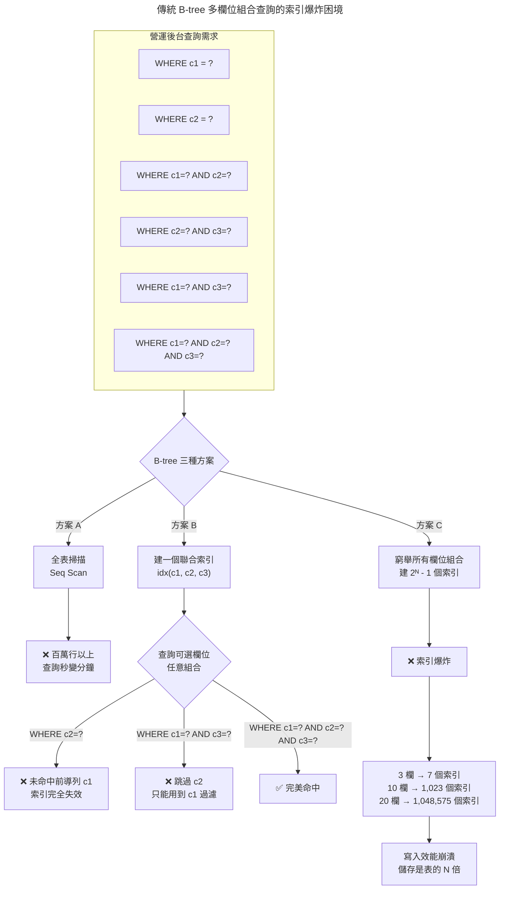
```mermaid
---
title: 傳統 B-tree 多欄位組合查詢的索引爆炸困境
---
flowchart TD
    subgraph demand["營運後台查詢需求"]
        direction LR
        Q1["WHERE c1 = ?"]
        Q2["WHERE c2 = ?"]
        Q3["WHERE c1=? AND c2=?"]
        Q4["WHERE c2=? AND c3=?"]
        Q5["WHERE c1=? AND c3=?"]
        Q6["WHERE c1=? AND c2=? AND c3=?"]
    end

    demand --> choices{"B-tree 三種方案"}

    choices -->|"方案 A"| seq["全表掃描<br/>Seq Scan"]
    seq --> bad1["❌ 百萬行以上<br/>查詢秒變分鐘"]

    choices -->|"方案 B"| comp["建一個聯合索引<br/>idx(c1, c2, c3)"]
    comp --> trap{"查詢可選欄位<br/>任意組合"}
    trap -->|"WHERE c2=?"| fail1["❌ 未命中前導列 c1<br/>索引完全失效"]
    trap -->|"WHERE c1=? AND c3=?"| fail2["❌ 跳過 c2<br/>只能用到 c1 過濾"]
    trap -->|"WHERE c1=? AND c2=? AND c3=?"| ok["✅ 完美命中"]

    choices -->|"方案 C"| exhaust["窮舉所有欄位組合<br/>建 2ᴺ - 1 個索引"]
    exhaust --> bomb["❌ 索引爆炸"]
    bomb --> detail["3 欄 → 7 個索引<br/>10 欄 → 1,023 個索引<br/>20 欄 → 1,048,575 個索引"]
    detail --> cost["寫入效能崩潰<br/>儲存是表的 N 倍"]
```

**三種方案全軍覆沒：**

| 方案 | 困境 | 結果 |
|------|------|------|
| 全表掃描 | 數據量大時 I/O 爆炸 | 毫秒 → 分鐘 |
| 單個聯合索引 | 前導列缺失即失效 | 只有一種組合能命中 |
| 窮舉組合索引 | (2ᴺ − 1) 個索引 | 儲存爆炸、寫入崩潰 |

PostgreSQL 提供的 Bloom Index 是解決此場景的利器。它專爲 WHERE c1=v1 AND c5=v5 AND ... 這類等值組合查詢設計，用極小的存儲成本實現高效過濾。

💡 一句話原理：一個"有損壓縮"的黑名單

你可以把 Bloom 索引理解成給每一行數據生成一個"有損壓縮的指紋"（Signature）。查詢時，先用指紋快速排除絕對不相關的行，再去表中精確覈對。

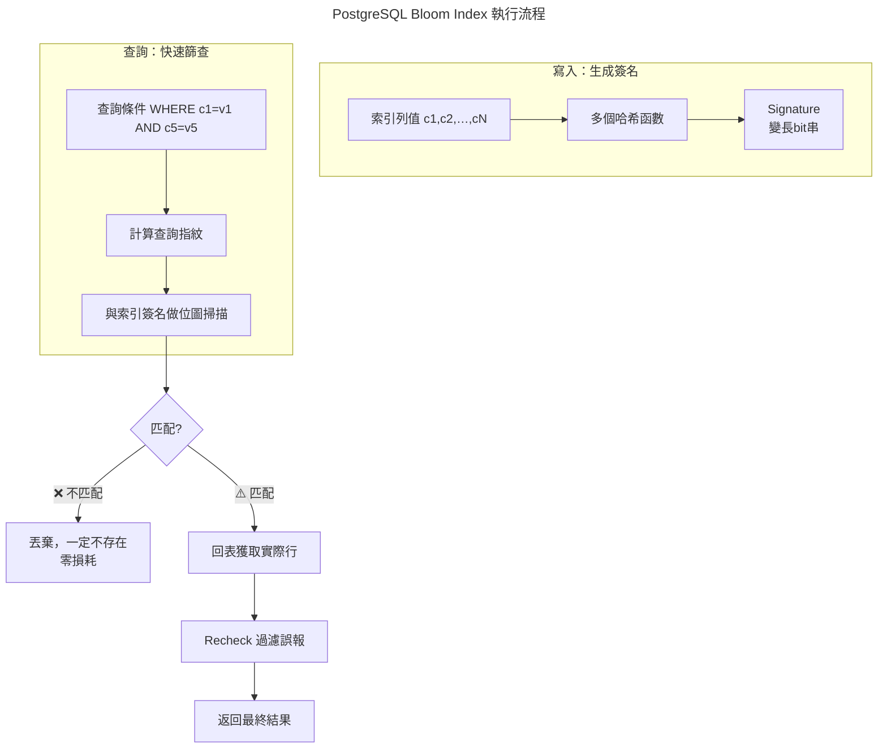
```mermaid
---
title: PostgreSQL Bloom Index 執行流程
---
flowchart TD
    subgraph A[寫入：生成簽名]
        direction LR
        A1[索引列值 c1,c2,…,cN] --> A2[多個哈希函數] --> A3[Signature<br>變長bit串]
    end

    subgraph B[查詢：快速篩查]
        direction LR
        B1[查詢條件 WHERE c1=v1 AND c5=v5] --> B2[計算查詢指紋] --> B3[與索引簽名做位圖掃描]
    end

    B3 --> C{匹配?}
    C -->|❌ 不匹配| D[丟棄，一定不存在<br>零損耗]
    C -->|⚠️ 匹配| E[回表獲取實際行]
    E --> F[Recheck 過濾誤報]
    F --> G[返回最終結果]
```

⚠️ 核心特性：精準的"不在"和模糊的"在"

它的"有損"特性決定了兩個關鍵行爲：

- 絕對可靠 (False Negative = 0%)：如果指紋沒命中，數據庫中絕對不存在符合條件的行。
- 可能誤報 (False Positive > 0%)：如果指紋命中，數據可能存在，也可能不存在。這就是所謂的"假陽性"。

---

## 2 實戰指南：DDL 與參數配置

首先確認 bloom 擴展已啓用：

```sql
-- 作爲標準擴展，通常一句 SQL 即可啓用
CREATE EXTENSION IF NOT EXISTS bloom;
```

**1. 索引 DDL**

和創建普通索引類似，但必須在 WITH 子句中配置參數來控制精度和大小。

```sql
CREATE INDEX idx_user_bloom ON users
USING bloom (
    first_name, last_name, email, department, status
)
WITH (
    length = 100,         -- 總指紋長度（bit）
    col1 = 5,             -- first_name 用5位
    col2 = 5,             -- last_name 用5位
    col3 = 6,             -- email 用6位
    col4 = 3,             -- department 用3位
    col5 = 2              -- status 用2位
);
```

**2. 參數完全解析**

WITH (...) 子句裏可以配置的參數如下：

| 參數 | 默認值 | 最大值 | 說明 |
|------|--------|--------|------|
| `length` | 80 | 4096 | 每行數據的簽名長度（bit），會向上取整爲16的倍數。控制全局精度。 |
| `col1 ~ col32` | 2 | 4095 | 分別爲第1到第32個索引列分配的bit數。數值越大，該列的查詢越精確。 |

**3. 精度與空間成本**

- Signature Length（指紋長度）：全局精度調節旋鈕。`length` 越大，指紋碰撞概率越低，查詢越精確，索引體積越大。
- Column Bits（字段位數）：局部精度調節旋鈕。爲高區分度字段（如 email）分配更多位，低區分度字段（如 status）少分配些。

**4. 匹配驗證：用 EXPLAIN 確認命中**

務必通過 EXPLAIN (ANALYZE, BUFFERS) 確認查詢確實用上了索引。

```sql
-- PostgreSQL 16 下，當查詢條件匹配索引時，計劃會顯示 Bitmap Index Scan
EXPLAIN (ANALYZE, BUFFERS)
SELECT * FROM users
WHERE first_name = 'Bruce' AND department = 'Engineering';
```

- 重點觀察 `Rows Removed by Index Recheck`：此行數值代表被 Bloom 索引誤報（False Positive）的行數。數值越大，說明索引精度越低，需調整參數。
- `Filter` 行：如果查詢中有未包含在 Bloom 索引中的列，會顯示爲 `Filter` 步驟，此過濾在回表後進行。

---

## 3 調優與場景選擇

僅僅"能用"還不夠，"用好"Bloom索引纔是區分普通開發者和資深工程師的分水嶺。

**1. 參數優化建議**

- 壓榨性能：如果磁盤空間充裕且查詢耗時非常敏感，可將 `length` 增至 200 甚至 400。將高基數字段的 `colN` 值設爲 4 或 8。
- 節省空間：如果磁盤資源緊張，可適當降低 `length`（如 40 或 60），並將低基數字段的 `colN` 保持默認或降低。不推薦的寫法：`length=100, col1=20`。應通過增加 `length` 來提高精度，而非讓個別字段擠壓其他字段的bit位。

**2. 調優實戰策略：應對複雜查詢**

對於帶一個非索引列的查詢：

```sql
EXPLAIN (ANALYZE)
SELECT * FROM users
WHERE first_name = 'Bruce' AND department = 'Engineering' AND signup_date > '2023-01-01';
```

查看 EXPLAIN 輸出中的 `Filter` 行。如果 `signup_date` 的過濾性不強，此計劃可以接受；如果它過濾掉了大量數據，應考慮爲其創建獨立索引或調整查詢邏輯。

**3. Bloom vs. 其他索引：如何選擇？**

| 索引類型 | 典型體積 | 等值查詢 (`=`) | 範圍查詢 (`>`, `<`) | ORDER BY / MIN / MAX | 任意組合查詢 |
|----------|----------|:---:|:---:|:---:|:---:|
| Bloom | 極小 (MB級) | ✔️ | ❌ | ❌ | ✔️ (極佳) |
| 多個 B-tree | 巨大 (GB級) | ✔️ | ✔️ | ✔️ | ✔️ (磁盤空間與寫入壓力巨大) |
| 聯合 B-tree | 大 (GB級) | ✔️ | ✔️ | ✔️ | ❌ (受限於最左前綴) |
| GIN | 大 | ✔️ | ❌ | ❌ | ✔️ |
| BRIN | 極小 (KB級) | ✔️ (弱) | ✔️ | ❌ | ❌ |

決策指南：

- 海量日誌/事件表 → BRIN 索引（如果數據與物理存儲順序相關）。
- JSONB、數組、全文搜索 → GIN 索引。
- 需要保證排序或唯一性 → B-tree 索引。
- ✅ 最適合Bloom的場景：
  - 表有大量字段，且查詢條件組合無法預測。
  - 僅需等值查詢（`=` 或 `IN`）。
  - 對存儲成本極其敏感。

**4. 實現細節與演進：從 PG 9.6 到 PG 16**

- PG 9.6：Bloom索引誕生，引入 `length` 參數。
- PG 10 - 12：增強了並行查詢能力，對Bloom索引的 Bitmap Heap Scan 階段有顯著提升。
- PG 13 - 14：支持 parallel index build，可以並行創建Bloom索引。
- PG 15 - 16：優化了優化器對Bloom索引的成本估算模型，使計劃選擇更準確。`length` 參數上限提升至 4096 bits。

---

## 4 總結

PostgreSQL Bloom Index 是應對"多字段任意組合查詢"場景的利器，它以微小的磁盤空間和極高的寫入效率，換取了查詢性能的極大飛躍。Bloom Index 的定位是 B-tree 等傳統索引的強力補充，而非替代品。 在一個成熟的數據模型中，完全可以根據業務場景，將 Bloom 與其他索引類型組合使用，以達成空間與性能的完美平衡。

如果你對文中提到的 GIN 或 BRIN 索引的細節，或者如何在一個複雜項目中組合使用多種索引感興趣，我可以爲你展開講講。


# 五、PostgreSQL 模糊查詢索引全景：GIN / GiST / SP-GiST / RUM 原理與選擇

## 1 模糊查詢的索引困局

| 查詢模式 | B-tree | GIN (pg_trgm) | GiST (pg_trgm) | RUM |
|---------|--------|---------------|----------------|-----|
| `col = 'abc'` | ✅ | ❌ | ❌ | ❌ |
| `col LIKE 'abc%'`（後模糊） | ✅（Index Scan） | — | — | — |
| `col LIKE '%abc'`（前模糊） | ✅（reverse index） | — | — | — |
| `col LIKE '%abc%'`（前後模糊） | ❌ Seq Scan | ✅ Bitmap | ✅ Index Scan | ✅ Index Scan |
| `col ~ 'abc.*def'`（regex） | ❌ | ✅ | ✅ | ❌ |
| `col LIKE '%abc%' ORDER BY ts` | ❌ | ❌ | ❌ | ✅ |
| 短 pattern（1~2 字元） | ❌ | ⚠️ 大量 false match | ⚠️ 大量 false match | — |

---

## 2 GIN Index（Generalized Inverted Index）

### I. 結構

將 column 中的每個 element（token / trigram / array element）取出，存入樹狀結構（類似 B+Tree：key + TID list）。高頻值的 TID list 存到獨立的 posting list page 中。

**GIN 的核心思想：倒排**

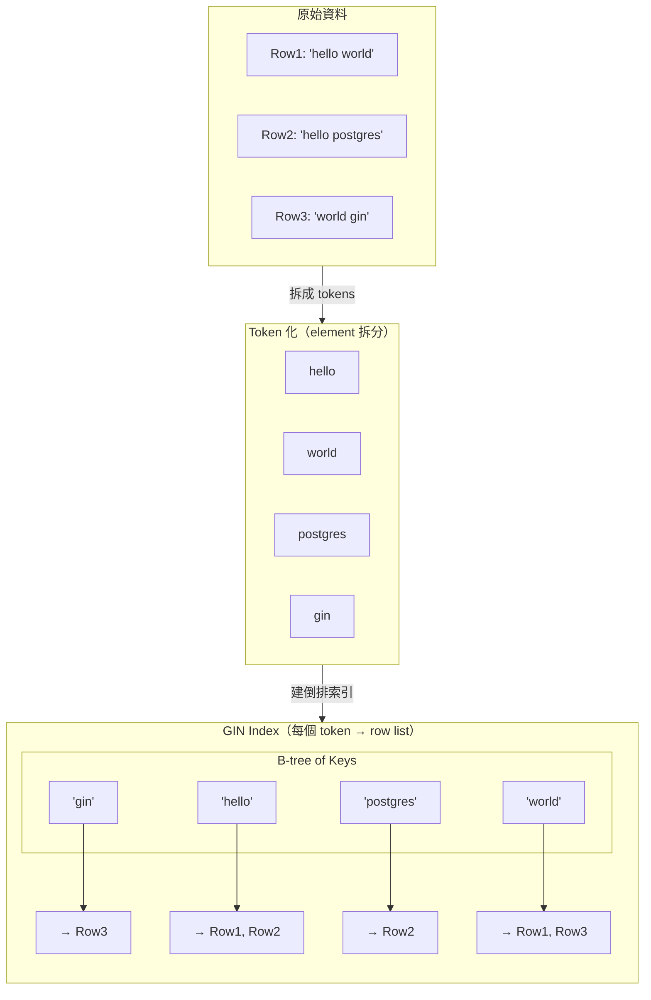
```mermaid
flowchart TB
    subgraph origin["原始資料"]
        direction LR
        D1["Row1: 'hello world'"]
        D2["Row2: 'hello postgres'"]
        D3["Row3: 'world gin'"]
    end

    origin -->|"拆成 tokens"| tokens

    subgraph tokens["Token 化（element 拆分）"]
        direction LR
        T1["hello"]
        T2["world"]
        T3["postgres"]
        T4["gin"]
    end

    tokens -->|"建倒排索引"| index

    subgraph index["GIN Index（每個 token → row list）"]
        direction TB
        subgraph btree["B-tree of Keys"]
            direction TB
            K1["'gin'"]
            K2["'hello'"]
            K3["'postgres'"]
            K4["'world'"]
        end
        K1 --> L1["→ Row3"]
        K2 --> L2["→ Row1, Row2"]
        K3 --> L3["→ Row2"]
        K4 --> L4["→ Row1, Row3"]
    end
```

**GIN 內部兩類 Page Node：**

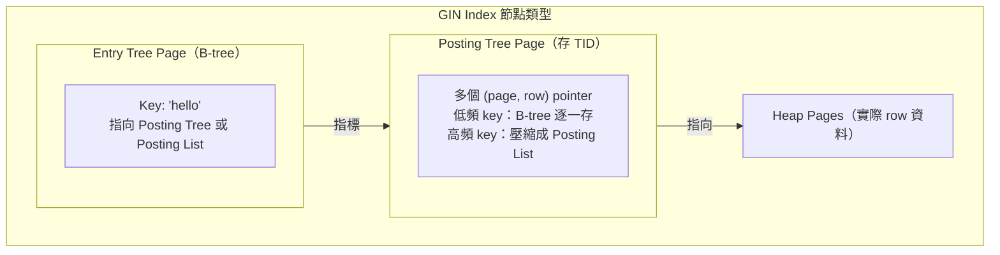
```mermaid
flowchart TD
    subgraph nodes["GIN Index 節點類型"]
        direction LR
        subgraph entry["Entry Tree Page（B-tree）"]
            ET["Key: 'hello'<br/>指向 Posting Tree 或 Posting List"]
        end
        subgraph posting["Posting Tree Page（存 TID）"]
            PT["多個 (page, row) pointer<br/>低頻 key：B-tree 逐一存<br/>高頻 key：壓縮成 Posting List"]
        end
        entry -->|"指標"| posting
        posting -->|"指向"| heap["Heap Pages（實際 row 資料）"]
    end
```

### II. Fast Update（GIN 寫入優化）

插入/更新時可能涉及大量 element 變更，GIN 使用 pending list buffer 先緩衝寫入，再定期合併到主樹：

```mermaid
flowchart TD
    subgraph write["INSERT / UPDATE 寫入流程"]
        direction TB
        INSERT["INSERT INTO articles<br/>VALUES ('hello world index')"]
        INSERT --> SPLIT["拆成 tokens：<br/>'hello', 'world', 'index'"]
        SPLIT --> PENDING{"寫入 pending list<br/>（記憶體緩衝區）"}
        PENDING -->|"累積超過<br/>gin_pending_list_limit (4MB)"| MERGE["自動合併到主樹"]
        MERGE --> MAIN["更新 Entry Tree<br/>更新 Posting Tree/List"]
        PENDING -->|"未達上限"| STAY["留在 pending list<br/>等待下次合併"]
    end

    subgraph query["查詢時同時讀兩邊"]
        direction LR
        Q["SELECT * FROM articles<br/>WHERE to_tsvector(...) @@ 'hello'"]
        Q --> PL["掃描 pending list"]
        Q --> MT["掃描主樹"]
        PL --> UNION_RESULT["合併結果（不重複）"]
        MT --> UNION_RESULT
    end
```

查詢不會堵塞合併——可直接查詢 pending list + 主樹。buffer 大小由 `gin_pending_list_limit`（預設 4MB）控制。

### III. 核心限制

- **只支援 Bitmap Index Scan**：收集所有匹配 TID → 排序 → Heap Scan。即使 `LIMIT 1`，仍需排序全部 TID。
- **不存位置資訊**：無法支援 index-level ranking、phrase search（`'a' <-> 'b'`）、或複合欄位排序（tsvector + timestamp）。

### IV. 適用場景

- 大量資料的 array / JSONB / tsvector 索引
- pg_trgm 模糊查詢（中間結果少時最佳）
- FTS 索引（不要求 ranking / phrase search）

---

## 3 GiST Index（Generalized Search Tree）

### I. 先搞懂：B-tree 為什麼搞不定 Range 查詢？

B-tree 擅長「等於」和「大於/小於」查詢，但遇到「範圍重疊」查詢就無能為力。舉個例子：

```sql
CREATE TABLE events (
    id INT,
    duration INT4RANGE  -- 活動持續時間，如 [10, 15) 代表從 10 點到 15 點
);
```

表裡有這些資料：

| id | duration | 圖示 |
|----|----------|------|
| E1 | [1, 5] | ████ |
| E2 | [3, 8] | ...█████ |
| E3 | [10, 15] | ..........█████ |
| E4 | [12, 18] | ............██████ |
| E5 | [20, 25] | ....................█████ |

```mermaid
flowchart LR
    subgraph timeline["時間軸 0 ───────────────────── 25"]
        direction LR
        E1["E1 ████"]
        E2["E2 ..█████"]
        E3["E3 ..........█████"]
        E4["E4 ............██████"]
        E5["E5 ....................█████"]
    end
```

現在要查「**哪些活動在 7 點正在進行？**」→ `WHERE duration @> 7`（range 包含 7 這個值）。

- **B-tree 無法處理**：B-tree 只支援 `=` `<` `>` `BETWEEN`，不支援「範圍重疊」這種二維判斷——你必須掃全表。
- **GiST 可以**：它就是為了這種「空間/範圍重疊」查詢設計的。

### II. GiST 怎麼做？三步驟理解

**第 1 步：把每個 row 看作一個線段（range），在數線上標出來**

到這裡你已經懂了——每一行就是一個長度不等的區間。

**第 2 步：把「靠得近」的 range 聚在一起，蓋一個「大框」**

```mermaid
flowchart TD
    subgraph before["聚類前：5 個獨立的 range"]
        direction LR
        r1["[1,5] ████"]
        r2["[3,8] ...█████"]
        r3["[10,15] ..........█████"]
        r4["[12,18] ............██████"]
        r5["[20,25] ....................█████"]
    end

    before -->|"PickSplit：靠得近的放一起"| after

    subgraph after["聚類後：3 個 Group + 各自的「覆蓋框」"]
        direction LR
        subgraph G1["Group 1<br/>覆蓋框: [1, 8]"]
            direction LR
            r1a["[1,5]"]
            r2a["[3,8]"]
        end
        subgraph G2["Group 2<br/>覆蓋框: [10, 18]"]
            direction LR
            r3a["[10,15]"]
            r4a["[12,18]"]
        end
        subgraph G3["Group 3<br/>覆蓋框: [20, 25]"]
            direction LR
            r5a["[20,25]"]
        end
    end
```

> **「覆蓋框」就是一個 Group 裡面所有 range 的最小公約範圍**（min ~ max）。Group 1 的 range 是 [1,5] 和 [3,8]，所以覆蓋框就是 [1, 8]。這跟你用橡皮筋把兩個區間捆在一起一樣——橡皮筋的兩端就是 min 和 max。

**第 3 步：用「覆蓋框」建樹，查詢時先看框、再看內容**

```mermaid
flowchart TD
    Q["查詢：duration @> 7<br/>（哪些活動在 7 點進行中？）"] --> ROOT

    ROOT["Root Page：存各 Group 的覆蓋框<br/>G1: [1, 8]  G2: [10, 18]  G3: [20, 25]"]

    ROOT -->|"7 在 [1,8] 內 ✅<br/>可能包含目標 row"| G1_READ["讀 Group 1<br/>檢查裡面每個 range<br/>[1,5] 不含 7 → ❌<br/>[3,8] 含 7 → ✅"]
    ROOT -->|"7 不在 [10,18] ❌<br/>整組跳過"| G2_SKIP["⏭ 跳過 Group 2<br/>I/O: 0"]
    ROOT -->|"7 不在 [20,25] ❌<br/>整組跳過"| G3_SKIP["⏭ 跳過 Group 3<br/>I/O: 0"]

    G1_READ --> RESULT["返回 E2: [3,8]"]

    style G2_SKIP fill:#f0f0f0,stroke-dasharray: 5 5
    style G3_SKIP fill:#f0f0f0,stroke-dasharray: 5 5
```

### III. 樹變大了會怎樣？多層結構

上面只有 Root → Leaf 兩層，但資料多時會變多層：

```mermaid
flowchart TD
    R["Root Page<br/>覆蓋框: [1, 50]"] --> I1["Internal Page<br/>Group A+B union: [1, 30]"]
    R --> I2["Internal Page<br/>Group C+D union: [35, 50]"]

    I1 --> L1["Leaf Page: Group A<br/>[1, 5] [3, 8]"]
    I1 --> L2["Leaf Page: Group B<br/>[10, 15] [12, 18] [20, 25]"]
    I2 --> L3["Leaf Page: Group C<br/>[35, 42] [38, 45]"]
    I2 --> L4["Leaf Page: Group D<br/>[44, 48] [46, 50]"]

    subgraph query_ex["查詢 duration @> 7 時"]
        direction TB
        Q2["Root: 7 在 [1,50] → 往下"]
        Q2 --> Q3["Internal A+B: 7 在 [1,30] → 往下<br/>Internal C+D: 7 不在 [35,50] → 跳過"]
        Q3 --> Q4["Leaf A: 讀 → 找到 [3,8]<br/>Leaf B: 讀 → 都不含 7"]
    end
```

> **核心智慧**：每一層都只看「覆蓋框」就能決定要不要往下讀——整棵樹從上到下都在做同樣一件事。資料越多、層數越多，跳過的頁就越多，效能反而越穩定（O(log N)）。

### IV. GiST 的萬能性：不只 range，什麼都能做

GiST 的關鍵抽象是：**你只要告訴它「你的資料類型怎麼算覆蓋框、怎麼分群」，它就能幫你建樹、查詢。**

| 資料類型 | 「覆蓋框」是什麼 | 應用場景 |
|----------|----------------|---------|
| Range (int4range) | min ~ max | 會議室預約、時段衝突檢查 |
| Geometry (point/polygon) | bounding box | 地圖「這個區域內有哪些餐廳」 |
| Text (pg_trgm) | trigram 集合的簽名 | 模糊搜尋 `LIKE '%abc%'` |
| 全文檢索 (tsvector) | lexeme 集合 | `to_tsvector(...) @@ 'keyword'` |

```mermaid
flowchart TD
    subgraph universal["GiST 萬能框架"]
        direction TB
        API["同一個 GiST 索引引擎"]
        API -->|"掛上 range op class"| RANGE["→ 支援 range 重疊查詢"]
        API -->|"掛上 geometry op class"| GEO["→ 支援空間查詢（PostGIS）"]
        API -->|"掛上 pg_trgm op class"| TRGM["→ 支援模糊 LIKE 查詢"]
        API -->|"掛上 tsvector op class"| FTS["→ 支援全文檢索"]
    end
```

### V. PickSplit 和 Choose 是做什麼的？（簡單理解）

當一個 index page 塞滿了，需要分裂（split）成兩個 page 時，就要決定「哪些 range 放左邊、哪些放右邊」。

- **PickSplit**：決定分裂策略。比如把 range 按中間值切兩半、或是用更複雜的 clustering 演算法盡量讓兩邊不重疊。
- **Choose**：新資料進來時，決定它應該插入哪一個 index page。

```
簡單比喻：
┌─────────────────────────────────────────┐
│  PickSplit = 搬家時怎麼分裝箱            │
│  Choose    = 新買的東西放哪個箱子        │
│  目標      = 每個箱子裡的東西盡量相關    │
│            = 箱子之間的覆蓋框盡量不重疊  │
└─────────────────────────────────────────┘
```

> **對新手來說**：你不需要自己實作 PickSplit 和 Choose——PostgreSQL 的內建 op class（如 `gist_trgm_ops`、PostGIS 的 `gist_geometry_ops`）已經幫你做好了。你只需要知道 GiST 的效能取決於「分群分得好不好」。

### VI. GIN vs GiST：什麼情況該用哪個？

| 維度 | GIN | GiST |
|------|-----|------|
| Index Scan | ❌（僅 Bitmap） | ✅（可 Index Scan） |
| 寫入 | 快（pending list） | 慢（即時 insert into tree） |
| 體積 | 小 | 大（~1.7x of GIN） |
| LIMIT 查詢 | 慢 | 快 |
| 支援 range / geometry | ❌ | ✅ |
| 支援 fuzzy search | ✅（pg_trgm） | ✅（pg_trgm） |

---

## 4 SP-GiST（Space-Partitioned GiST）

### I. 一句話：GiST 是「捆一起」，SP-GiST 是「切開來」

回顧 GiST：把靠得近的資料用一個「覆蓋框」包起來。**不同的 Group 之間的覆蓋框可能重疊**——這是 GiST 的天生特性。

SP-GiST 反其道而行：**把整個空間切成互不重疊的區塊**，每個區塊各自獨立。

```mermaid
flowchart LR
    subgraph gist["GiST：覆蓋框可能重疊"]
        direction LR
        subgraph G1["Group 1 [1, 8]"]
            r1["[1,5]"]
            r2["[3,8]"]
        end
        subgraph G2["Group 2 [5, 12]"]
            r3["[5,9]"]
            r4["[9,12]"]
        end
    end

    subgraph spgist["SP-GiST：區塊絕不重疊"]
        direction LR
        subgraph S1["區域 A: x < 5"]
            p1["點(1,2)"]
            p2["點(3,4)"]
        end
        subgraph S2["區域 B: x >= 5"]
            p3["點(6,1)"]
            p4["點(8,3)"]
        end
    end

    G1 -.->|"重疊！"| G2
    S1 -.- S2
```

> **GiST**：先有資料 → 分群 → 蓋一個大框 → 框之間可能重疊
> **SP-GiST**：先把空間切好（一刀兩斷）→ 資料按照位置掉進對應的區塊 → 區塊之間永不重疊

### II. 用二維地圖來理解：Quad-Tree（四叉樹）

這是最直覺的例子。假設你有一張地圖，上面散落著很多餐廳座標（point），你要快速找到「某個區域內有哪些餐廳」。

SP-GiST 的做法是把地圖**反覆切成四等分**，直到每個小格子裡的餐廳數量夠少：

```mermaid
flowchart TD
    subgraph step1["第 1 次切割：全圖切成 4 塊"]
        direction LR
        subgraph Q1["NW 象限"]
            A["(1,8)"]
            A2["(2,9)"]
        end
        subgraph Q2["NE 象限"]
            B["(6,7)"]
        end
        subgraph Q3["SW 象限"]
            C["(3,2)"]
            C2["(1,3)"]
            C3["(4,1)"]
        end
        subgraph Q4["SE 象限"]
            D["(8,3)"]
            D2["(9,1)"]
        end
    end

    Q3 -->|"點太多（3 個），再切！"| step2

    subgraph step2["第 2 次切割：SW 象限再切成 4 塊"]
        direction LR
        subgraph Q3a["SW-NW"]
            C3a["(1,3)"]
        end
        subgraph Q3b["SW-NE"]
            Cb["(3,2)"]
        end
        subgraph Q3c["SW-SW"]
            Cc["..."]
        end
        subgraph Q3d["SW-SE"]
            Cd["(4,1)"]
        end
    end
```

**查詢時**：你要找座標 (2, 3) 附近的餐廳 → 判斷它在哪個象限 → 只讀那個象限的 index page → 不相關的象限全部跳過。這就是 **space partitioning**（空間分割）。

```mermaid
flowchart TD
    Q["查詢：找 (2, 3) 附近的點"] --> ROOT

    ROOT["Root：切成 NW / NE / SW / SE"] -->|"(2,3) 在 SW"| SW["讀 SW 象限"]
    ROOT -->|"不匹配"| SKIP1["⏭ 跳過 NW"]
    ROOT -->|"不匹配"| SKIP2["⏭ 跳過 NE"]
    ROOT -->|"不匹配"| SKIP3["⏭ 跳過 SE"]

    SW -->|"SW 再細分<br/>(2,3) 在 SW-NW"| LEAF["讀 SW-NW 子象限<br/>回傳 (1,3)"]

    style SKIP1 fill:#f0f0f0,stroke-dasharray: 5 5
    style SKIP2 fill:#f0f0f0,stroke-dasharray: 5 5
    style SKIP3 fill:#f0f0f0,stroke-dasharray: 5 5
```

### III. 第二個例子：IP 位址路由（Radix Tree / Patricia Trie）

IP 位址（如 `192.168.1.1`）本質是一個 32-bit 的二進位數字。路由器需要快速判斷「這個 IP 屬於哪個子網段」。

SP-GiST 把 IP 位址按 **bit-by-bit** 切分：

```mermaid
flowchart TD
    ROOT_IP["Root: 只看第 1 bit"] -->|"0"| BIT0["0xxxx...<br/>範圍: 0.0.0.0 ~ 127.255.255.255"]
    ROOT_IP -->|"1"| BIT1["1xxxx...<br/>範圍: 128.0.0.0 ~ 255.255.255.255"]

    BIT1 -->|"bit 2 = 1"| BIT11["11xxxx...<br/>192.0.0.0 ~ 255.255.255.255"]
    BIT1 -->|"bit 2 = 0"| BIT10["10xxxx...<br/>128.0.0.0 ~ 191.255.255.255"]

    BIT11 -->|"bit 3 = 0"| BIT110["110xxxx...<br/>192.0.0.0 ~ 223.255.255.255"]

    BIT110 -->|"...繼續往下"| LEAF_IP["最終到達 leaf page<br/>存該網段的所有 IP 或路由規則"]

    subgraph search["查詢 IP 192.168.1.1"]
        direction TB
        S["192 → 二進位: 11000000..."]
        S --> S1["bit1=1 → 走右邊"]
        S1 --> S2["bit2=1 → 再走右邊"]
        S2 --> S3["bit3=0 → 走左邊"]
        S3 --> S4["...逐 bit 導航到 leaf"]
    end
```

> 查詢一個 IP 只需要走 32 步（32 bit），**每步只判斷 0 或 1**，每一步排除一半的搜尋空間。這就是 O(log N) ——且與資料總量無關，只跟 bit 數有關。

### IV. SP-GiST vs GiST 一句話總結

```mermaid
flowchart TD
    subgraph gist_summary["GiST：分群 + 覆蓋框"]
        direction TB
        G1["資料先存在<br/>→ 把靠得近的聚一群<br/>→ 蓋一個大框"]
        G2["框之間可能重疊<br/>查詢時可能要多讀幾頁"]
        G3["適用：range、geometry、全文"]
        G1 --> G2 --> G3
    end

    subgraph spgist_summary["SP-GiST：預先切空間"]
        direction TB
        S1["空間先切好<br/>→ 資料按位置掉入<br/>→ 區塊永不重疊"]
        S2["查詢只走一條路徑<br/>每個節點只判斷 YES/NO"]
        S3["適用：點座標、IP 路由、prefix 搜尋"]
        S1 --> S2 --> S3
    end
```

| 維度 | GiST | SP-GiST |
|------|------|---------|
| 節點關係 | 可重疊（overlap） | 永不重疊（disjoint） |
| 搜尋路徑 | 可能多條（所有重疊的都要查） | 只有一條（二分決策） |
| 樹深度 | 相對均勻（平衡樹） | 可深可淺（資料密的地方深） |
| 適合資料 | 有「範圍」概念的（range/geom） | 可被空間切分的（點/IP/prefix） |
| 典型場景 | PostGIS、range type、pg_trgm | Quad-Tree、Kd-Tree、Radix Tree |

---

## 5 RUM Index（RUM Access Method）

### I. 先看問題：GIN 為什麼不夠用？

假設你有一張文章表，內建全文檢索：

```sql
CREATE TABLE articles (
    id INT,
    title TEXT,
    body TEXT,
    created_at TIMESTAMP,
    tsv TSVECTOR  -- 預先計算的全文檢索向量
);
CREATE INDEX idx_gin ON articles USING GIN (tsv);
```

**GIN 能做什麼？** 快速找到「哪些文章包含關鍵字 `database`」→ `tsv @@ 'database'`。

**GIN 做不了什麼？** 以下三種查詢 GIN 必須回 Heap（讀完整 row）才能處理：

```mermaid
flowchart TD
    subgraph problem["GIN 的三個盲點"]
        direction TB
        P1["❌ 排序問題<br/>「包含 database 的文章，<br/>按相關度排名」<br/><br/>GIN 不存詞的位置<br/>→ 必須回表讀完整文本<br/>→ 計算 ts_rank()"]
        P2["❌ 相鄰問題<br/>「database 和 postgres<br/>相鄰出現的文章」<br/><br/>GIN 只知詞存在<br/>不知詞和詞的距離<br/>→ 無法在 index 層判斷"]
        P3["❌ 混合排序問題<br/>「包含 database 的文章，<br/>按發布時間排序」<br/><br/>GIN 不存 timestamp<br/>→ 必須回表讀 create_at<br/>→ 才能排序"]
    end
```

### II. RUM 的解法：在 Posting List 裡多存一筆「小紙條」

回顧 GIN 的 Posting List：`(page, row)` — 只記錄「這個詞出現在哪一行」。

RUM 的 Posting List 升級版：`(page, row) + 附加資訊` — 多記錄「出現在第幾個位置」以及「使用者自訂的額外欄位值」。

```mermaid
flowchart LR
    subgraph gin["GIN Posting List"]
        direction TB
        G1["key: 'database'"]
        G1 --> GL["→ Row1<br/>→ Row5<br/>→ Row9"]
    end

    subgraph rum["RUM Posting List"]
        direction TB
        R1["key: 'database'"]
        R1 --> RL["→ Row1 (pos: 3, ts: 2024-01-01)<br/>→ Row5 (pos: 7, ts: 2024-03-15)<br/>→ Row9 (pos: 1, ts: 2024-06-20)"]
    end
```

> RUM = **GIN + 附加資訊**。附加資訊存在 Posting List 中，查詢時不需要回 Heap 就能直接用。

### III. 具體例子：三個查詢分別怎麼解決？

**例子資料：**

| id | body | tsv |
|----|------|-----|
| 1 | "postgres database" | 'postgres':1 'database':2 |
| 2 | "database is great" | 'database':1 'great':3 |
| 3 | "postgres and database" | 'postgres':1 'database':3 |

**查詢 1：Phrase Search —「postgres」和「database」相鄰出現**

```sql
-- RUM 專用語法：<-> 代表「相鄰」
SELECT * FROM articles
WHERE tsv @@ 'postgres <-> database';
```

```mermaid
flowchart TD
    Q1["查詢：postgres <-> database<br/>（詞1和詞2必須相鄰）"] --> S1

    subgraph S1["RUM Index 內部"]
        direction TB
        S1A["找到 key: 'postgres' → Row1(pos=1), Row3(pos=1)"]
        S1B["找到 key: 'database' → Row1(pos=2), Row2(pos=1), Row3(pos=3)"]
        S1C["比對：同一個 row 中<br/>pos 相差 = 1？"]
        S1A --> S1C
        S1B --> S1C
        S1C -->|"Row1: pos 1 和 2 → 相鄰 ✅"| R1["返回 Row1"]
        S1C -->|"Row3: pos 1 和 3 → 不相鄰 ❌"| R3["排除 Row3"]
    end

    style R3 fill:#f0f0f0,stroke-dasharray: 5 5
```

> **GIN 做不到**：GIN 只知道 Row1 和 Row3 都有這兩個詞，但不知道位置 → 全部都要回 Heap 檢查。

**查詢 2：Ranking — 相關度排序**

```sql
SELECT *, ts_rank(tsv, query) AS rank
FROM articles, to_tsquery('database') query
WHERE tsv @@ query
ORDER BY rank DESC
LIMIT 10;
```

```mermaid
flowchart TD
    subgraph gin_rank["GIN：回表算 rank"]
        direction TB
        GA["GIN 找到 10,000 個匹配 row"]
        GA --> GB["回 Heap 讀取 10,000 個 row<br/>的完整 tsvector"]
        GB --> GC["逐一計算 ts_rank()"]
        GC --> GD["排序 → 取 top 10<br/>❌ 讀了 10,000 行只為 10 行"]
    end

    subgraph rum_rank["RUM：index 內直接算 rank"]
        direction TB
        RA["RUM 找到 10,000 個匹配 row"]
        RA --> RB["每個 Posting List entry<br/>已有 position 資訊"]
        RB --> RC["Index 層直接算 ts_rank()<br/>（不需要回 Heap）"]
        RC --> RD["排序 → 取 top 10<br/>✅ 只在 index 內完成"]
    end
```

**查詢 3：混合排序 — 全文 + 時間排序**

```sql
SELECT * FROM articles
WHERE tsv @@ 'database'
ORDER BY created_at DESC
LIMIT 10;
```

```mermaid
flowchart TD
    subgraph gin_mix["GIN：必須回表"]
        direction TB
        GM1["GIN 找到匹配 row"]
        GM1 --> GM2["回 Heap 讀每行的 create_at"]
        GM2 --> GM3["排序 → ❌ 全表讀取"]
    end

    subgraph rum_mix["RUM：Posting List 自帶 timestamp"]
        direction TB
        RM1["找到 key: 'database'"]
        RM1 --> RM2["Posting List 內含 create_at<br/>→ Row1 (ts: 2024-01-01)<br/>→ Row5 (ts: 2024-03-15)<br/>→ Row9 (ts: 2024-06-20)"]
        RM2 --> RM3["直接按 ts 排序<br/>→ 取 top 10<br/>✅ 不需要回 Heap"]
    end
```

### IV. RUM 的 trade-off：用空間和寫入換查詢

```mermaid
flowchart TB
    subgraph compare["GIN vs RUM 權衡"]
        direction LR
        subgraph gin_side["GIN"]
            G_READ["讀取：⭐⭐⭐<br/>簡單查詢很快"]
            G_WRITE["寫入：⭐⭐⭐<br/>pending list 緩衝"]
            G_SIZE["體積：⭐⭐⭐<br/>最小"]
            G_COMPLEX["複雜查詢：⭐<br/>phrase/rank/混合排序 → 回表"]
        end
        subgraph rum_side["RUM"]
            R_READ["讀取：⭐⭐⭐⭐⭐<br/>複雜查詢 index 內解決"]
            R_WRITE["寫入：⭐<br/>每筆多寫 position + extra"]
            R_SIZE["體積：⭐⭐<br/>比 GIN 約大 1.5~2x"]
            R_COMPLEX["複雜查詢：⭐⭐⭐⭐⭐<br/>phrase/rank/混合排序 → 純 index"]
        end
    end
```

| 維度 | GIN | RUM |
|------|-----|-----|
| Posting List 內容 | 只有 TID（page, row） | TID + position + 自訂欄位 |
| Phrase search | ❌ 必須回 Heap | ✅ Index 層比對位置 |
| Ranking（ts_rank） | ❌ 回 Heap 算 | ✅ Index 層算 |
| 混合排序（+timestamp） | ❌ 回 Heap 取欄位 | ✅ Posting List 自帶 |
| 寫入速度 | 快（pending list） | 慢（資料多） |
| Index 體積 | 小 | 大（多存位置 + extra） |
| 建 Index 時間 | 短 | 長（GIN 的 5~7 倍） |

> **一句話選 RUM**：當你的查詢需要 **phrase search、全文相關度排序、或全文+其他欄位混合排序** 時，RUM 是唯一能在 index 層解決的方案。如果只需要簡單的「包含關鍵字」查詢，GIN 就夠了。

---

## 6 Benchmark：GIN vs GiST vs RUM（100 萬 row，md5 string）

### I. 測試參數

```sql
CREATE TABLE test (id INT, info TEXT);
INSERT INTO test SELECT id, md5(random()::text) FROM generate_series(1, 1000000) t(id);

-- Index size comparison
-- GIN:  102 MB,  build 19s
-- GiST: 177 MB,  build 31s
-- RUM:  86 MB,   build 133s
```

String → tsvector / tsquery 轉換函數（給 RUM 用）：

```sql
-- string → tsvector（帶 position）
CREATE OR REPLACE FUNCTION string_to_tsvector(v TEXT) RETURNS tsvector AS $$
DECLARE
  x INT := 1;
  res TEXT := '';
  i TEXT;
BEGIN
  FOR i IN SELECT regexp_split_to_table(v, '')
  LOOP
    res := res || ' ' || chr(92) || i || ':' || x;
    x := x + 1;
  END LOOP;
  RETURN res::tsvector;
END;
$$ LANGUAGE plpgsql STRICT IMMUTABLE;

-- string → tsquery（帶 <-> adjacent）
CREATE OR REPLACE FUNCTION string_to_tsquery(v TEXT) RETURNS tsquery AS $$
DECLARE
  x INT := 1;
  res TEXT := '';
  i TEXT;
BEGIN
  FOR i IN SELECT regexp_split_to_table(v, '')
  LOOP
    IF x > 1 THEN
      res := res || ' <-> ' || chr(92) || i;
    ELSE
      res := chr(92) || i;
    END IF;
    x := x + 1;
  END LOOP;
  RETURN res::tsquery;
END;
$$ LANGUAGE plpgsql STRICT IMMUTABLE;
```

### II. Test Case 1：中間結果大（`~ 'a'`，873K row，無 LIMIT）

| Index | Plan | Time |
|-------|------|------|
| **GiST** | Index Scan using trgm_idx2 | **1,692 ms** |
| **RUM** | Index Scan using rum_idx1 | 624 ms |
| **GIN** | Bitmap Heap Scan on trgm_idx1 | 3,426 ms |

GiST Index Scan 比 GIN Bitmap Scan 快 2x。RUM 最快但需轉換 tsquery overhead。

### III. Test Case 2：中間結果大 + LIMIT 100

| Index | Plan | Time |
|-------|------|------|
| **GiST** | Index Scan using trgm_idx2 | **0.68 ms** |
| **RUM** | Index Scan using rum_idx1 | 303 ms |
| **GIN** | Bitmap Heap Scan | 2,404 ms |

GiST 碾壓 GIN（由於 GIN 必須排序全部 1M TID）。GiST 0.68ms vs GIN 2,404ms = **3,500x 差距**。RUM 慢於 GiST 因 tsquery overhead。

### IV. Test Case 3：中間結果小（`~ '2e9a2c'`，2 row）

| Index | Plan | Time |
|-------|------|------|
| **GIN** | Bitmap Heap Scan | **2.54 ms** |
| **GiST** | Index Scan | 294 ms |
| **RUM** | Index Scan | 864 ms |

GIN 碾壓 GiST（TID 排序量極少（2 TID）→ Bitmap overhead 可忽略）。GIN 2.5ms vs GiST 294ms = **115x 差距**。

---

## 7 選擇決策：pg_hint_plan + Explain-Based

```sql
ALTER TABLE test ALTER COLUMN info SET STATISTICS 1000;
VACUUM ANALYZE test;

-- 使用 pg_hint_plan 分別強制三個 index，比較 estimated rows
EXPLAIN /*+ BitmapScan(test trgm_idx1) */ SELECT * FROM test WHERE info ~ '2e9';
--  Bitmap Heap Scan on test  (cost=59.30..5079.87 rows=7006 width=37)

EXPLAIN /*+ IndexScan(test trgm_idx2) */ SELECT * FROM test WHERE info ~ '2e9';
--  Index Scan using trgm_idx2  (cost=... rows=7006 width=37)
```

**決策規則**：

| 中間結果 rows（estimated） | 有 LIMIT / 游標？ | 選擇 |
|--------------------------|-------------------|------|
| < 數百 | — | **GIN** |
| 數百 ~ 數萬 | — | **GiST** |
| 任何 | 有 `LIMIT` 小值 | **GiST** |
| 需要 ranking / phrase / 雙欄位 | — | **RUM** |

---

## 8 PG 索引方法全覽（截至 PG 18）

| Index Method | 簡述 | 支援 scan 模式 |
|-------------|------|---------------|
| **B-tree** | 通用首選、排序 | Index Scan / Bitmap Scan |
| **Hash** | 純等值 `=` | Index Scan |
| **GIN** | 倒排索引（array/JSONB/tsvector） | 僅 Bitmap Scan |
| **GiST** | 聚集樹（range/geometry/pg_trgm） | Index Scan / Bitmap Scan |
| **SP-GiST** | 空間分割（point/prefix） | Index Scan |
| **BRIN** | 塊範圍摘要 | Bitmap Scan |
| **RUM** | GIN + position/timestamp | Index Scan / Bitmap Scan |
| **Bloom** | 多列任意組合過濾 | Bitmap Scan |

PG 開放索引介面（Index Access Method API）允許自訂新的 index method，如上表所有非 B-tree 索引均透過此 API 實作。

---

## 9 版本演進

| 功能 | 版本 | 說明 |
|------|------|------|
| GIN fastupdate | PG 9.4 | pending list buffer 機制 |
| `gin_pending_list_limit` | PG 9.5 | 可控 pending list 大小 |
| pg_trgm GiST/GIN regex support | PG 9.3+ | 正則表達式索引加速 |
| RUM extension | PG 9.6+ | position-aware GIN |
| Bloom index | PG 9.6 | 多列組合過濾 |
| GIN parallel builds | PG 10+ | 多 CPU 並行建立 GIN |
| GiST/GIN covering (INCLUDE) | PG 11+ | covering index on GiST/GIN |
| `pg_trgm` strict_word_similarity | PG 11+ | 單詞級相似度 |
| BRIN multi-minmax | PG 14+ | 多列 BRIN |
| `btree_gin` / `btree_gist` improvements | PG 15+ | composite 效能提升 |
| GIN index cleanup tuning | PG 16+ | 更精細 vacuum 控制 |

## 10 參考

- [德哥: pg_trgm 模糊查詢](https://github.com/digoal/blog/blob/master/201605/20160506_02.md)
- [德哥: RUM 全文檢索加速](https://github.com/digoal/blog/blob/master/201610/20161019_01.md)
- [德哥: 正則與相似度](https://github.com/digoal/blog/blob/master/201611/20161118_01.md)
- [德哥: pg_hint_plan 用法](https://github.com/digoal/blog/blob/master/201604/20160401_01.md)


# 六、PostgreSQL GIN Index + LIMIT 慢的原因與因應策略

## 1 GIN Index 結構回顧

GIN（Generalized Inverted Index）是倒排索引：每個 element（陣列元素 / tsvector lexeme / JSONB key）對應一組 row number（TID list），而非 B-tree 那樣一行一個 index entry。

**先搞懂：B-tree vs GIN 的根本差異**

B-tree 是「把 row 映射到 value」：一行 → 一個 index entry → 一個 value。
GIN 是「把 value 映射到 row」：一個 value → 多個 row（倒排）。

> **例子**：假設一張 `articles` 表，有欄位 `tags INTEGER[]`（文章標籤），資料如下：
>
> | id | tags |
> |----|------|
> | Row1 | {1, 3, 5} |
> | Row2 | {1, 2} |
> | Row3 | {1, 2, 4} |
>
> 圖中的 1, 2, 3, 4, 5 就是 **tags 陣列中的個別元素值**（element）。對 `tags` 建 GIN index 時，Postgres 會把每個陣列元素拆開，當成獨立的 index key。

```mermaid
flowchart TB
    subgraph btree_side["B-tree Index（正排）：一行 → 多個 entry"]
        direction LR
        BR1["Row1<br/>(1,3,5)"]
        BR2["Row2<br/>(1,2)"]
        BR3["Row3<br/>(1,2,4)"]
        BR1 --> BR1e["entries: 1, 3, 5"]
        BR2 --> BR2e["entries: 1, 2"]
        BR3 --> BR3e["entries: 1, 2, 4"]
        BR1e --> BAD["❌ 8 個 index entries<br/>等於所有元素總數"]
        BR2e --> BAD
        BR3e --> BAD
    end

    btree_side --> VS["⬇ 對比"]

    VS --> gin_side

    subgraph gin_side["GIN Index（倒排）：一個值 → 多個 row"]
        direction LR
        GE1["element: 1"] --> GL1["→ Row1, Row2, Row3"]
        GE2["element: 2"] --> GL2["→ Row2, Row3"]
        GE3["element: 3"] --> GL3["→ Row1"]
        GE4["element: 4"] --> GL4["→ Row3"]
        GE5["element: 5"] --> GL5["→ Row1"]
        GL1 --> GOOD["✅ 5 個 index entries<br/>等於唯一值個數"]
        GL2 --> GOOD
        GL3 --> GOOD
        GL4 --> GOOD
        GL5 --> GOOD
    end
```

**GIN Index 的內部三層結構：**

```mermaid
flowchart TD
    subgraph L1["第 1 層：Meta Page"]
        META["版本號 / root 位置 / pending list 指標"]
    end

    subgraph L2["第 2 層：B-tree over Elements"]
        direction TB
        BT_ROOT["B-tree Root"]
        BT_ROOT --> BT_I1["Internal 範圍 a~m"]
        BT_ROOT --> BT_I2["Internal 範圍 n~z"]
        BT_I1 --> BT_L1["Leaf: 'hello'"]
        BT_I1 --> BT_L2["Leaf: 'index'"]
        BT_I2 --> BT_L3["Leaf: 'postgres'"]
        BT_I2 --> BT_L4["Leaf: 'world'"]
    end

    META --> BT_ROOT

    subgraph L3["第 3 層：Posting Structure"]
        direction LR
        PT1["Posting Tree（低頻）<br/>B-tree 存 TID，支援二分查找"]
        PL1["Posting List（高頻）<br/>壓縮 TID 列表<br/>(page1,row3)→(page1,row9)→..."]
    end

    BT_L1 --> PT1
    BT_L2 --> PT1
    BT_L3 --> PL1
    BT_L4 --> PT1

    L3 -.-> HEAP["Heap Table（散落不同 data page）"]
```

**一個具體查詢走一遍：`WHERE tags @> ARRAY[1]`**

```mermaid
flowchart TB
    Q["SELECT * FROM articles<br/>WHERE tags @> ARRAY[1]"] --> S1

    subgraph S1["步驟 1：查 B-tree 找到 element '1'"]
        direction LR
        A1["GIN Index 的 B-tree 掃到 element = 1"]
    end

    S1 --> S2

    subgraph S2["步驟 2：讀取 Posting List"]
        direction LR
        A2["拿到 TID 鏈：(page1,row1)→(page1,row2)→(page3,row5)→(page7,row2)→..."]
    end

    S2 --> S3

    subgraph S3["步驟 3：建 Bitmap（page 粒度）"]
        direction LR
        A3["標記 page1:■ page3:■ page7:■ 其餘:□"]
    end

    S3 --> S4

    subgraph S4["步驟 4：Bitmap Heap Scan"]
        direction LR
        A4["依序讀取 page1 → page3 → page7，逐行 Recheck"]
    end

    S4 --> R["返回結果"]

    style S2 fill:#fff3cd
    style S3 fill:#d4edda
```

> **關鍵理解**：步驟 2 中的 Posting List 已經排好序。但步驟 3 的 Bitmap 是按 page 號重新排序——這就是 GIN 必須走 Bitmap Scan 的原因。在步驟 2 你已經知道所有 row 位置了，但 GIN 硬性只支援 Bitmap Heap Scan，所以必須先建 bitmap 再讀 heap，無法跳過這個排序步驟。

---

## 2 核心問題：為什麼 GIN + LIMIT 慢？

GIN Index **只支援 Bitmap Index Scan**（不支援 plain Index Scan）。Bitmap Index Scan 的流程：

```
BitMap Index Scan → 收集所有匹配 TID → 排序 TID（按 page 順序）
  → BitMap Heap Scan → 依序訪問對應 data page → Recheck → 返回 row
```

**關鍵**：排序所有匹配 TID 是無法跳過的步驟。即使你寫了 `LIMIT 1`，GIN Index Scan 仍然會收集**所有**匹配該條件的 TID，全部排序後才去 Heap 取資料。

**為什麼 LIMIT 不能提前結束？**

對比 B-tree Index Scan 和 GIN Bitmap Scan 的差異：

```mermaid
flowchart TB
    subgraph btree["B-tree Index Scan（支援 LIMIT 提前結束）"]
        direction LR
        B1["掃描 B-tree<br/>依 key 順序取 row"] --> B2["每拿到一個 TID<br/>立即去 Heap 取該 row"]
        B2 --> B3["滿足 LIMIT 1<br/>→ 立刻停止 ✅"]
    end

    subgraph gin["GIN Bitmap Scan（LIMIT 無法提前結束）"]
        direction LR
        G1["掃描 Posting List<br/>收集所有匹配 TID"] --> G2["全部 TID 按 page 號重排<br/>（避免 random I/O）"]
        G2 --> G3["依 page 順序讀 Heap<br/>逐 row Recheck"]
        G3 --> G4["滿足 LIMIT 1<br/>→ 但所有 page 已讀 ❌"]
    end

    btree --> VS["⬇"]
    VS --> gin
```

**根本原因**：GIN 的 Posting List 中 TID 的排列順序是「同一個 page 的多個 row 可能散在 list 各處」，如果直接按 Posting List 順序去 Heap 取 row，會產生大量 random I/O（同一 page 被反覆讀取）。所以 GIN 強制走 Bitmap Scan：必須先收集所有 TID → 按 page 號排序 → 再依序讀 heap。但這也意味著 **LIMIT 無法在排序完成前生效**——你必須等所有 TID 收集完畢、排好序，才能開始返回結果。

### I. 實驗

```sql
CREATE TABLE t3 (id INT, info INT[]);
INSERT INTO t3 SELECT generate_series(1, 10000), ARRAY[1,2,3,4,5];
CREATE INDEX idx_t3_info ON t3 USING GIN (info);
SET enable_seqscan = off;
```

**無 LIMIT — 10,000 row 全部匹配：**

```sql
EXPLAIN ANALYZE SELECT * FROM t3 WHERE info && ARRAY[1];

-- Bitmap Heap Scan on t3  (actual time=1.156..3.565 rows=10000 loops=1)
--   Recheck Cond: (info && '{1}'::integer[])
--   Heap Blocks: exact=94
--   ->  Bitmap Index Scan on idx_t3_info
--         (actual time=1.129..1.129 rows=10000 loops=1)
--         Index Cond: (info && '{1}'::integer[])
-- Execution time: 5.272 ms
```

**LIMIT 1 — 時間沒省多少：**

```sql
EXPLAIN ANALYZE SELECT * FROM t3 WHERE info && ARRAY[1] LIMIT 1;

-- Limit  (actual time=1.121..1.121 rows=1 loops=1)
--   ->  Bitmap Heap Scan on t3  (actual time=1.119..1.119 rows=1 loops=1)
--         Heap Blocks: exact=1
--         ->  Bitmap Index Scan on idx_t3_info
--               (actual time=1.095..1.095 rows=10000 loops=1)
--               Index Cond: (info && '{1}'::integer[])
-- Execution time: 1.175 ms
```

`LIMIT 1` 只省了 Heap Scan（Heap Blocks 94 → 1），但 **Bitmap Index Scan 仍然掃了全部 10,000 row 的 TID 並排序**（`rows=10000 loops=1` 沒變）。節省的比例很低：5.2ms → 1.2ms，遠不如 B-tree 的 `LIMIT 1` 能從百毫秒降到 0.03ms。

---

## 3 為什麼 GIN 只支援 Bitmap Scan — 設計取捨

GIN 的場景本質是**多對多**：一個 element 對應多行多 page，一個查詢可能匹配成千上萬個 page。若不用 Bitmap Scan 逐行跳轉，會產生恐怖的 random I/O。

Bitmap Scan 收集所有 TID → 排序的設計，反而是為了：

1. **Page deduplication**：同一 page 內有多行匹配 → 只讀一次，不重複讀取
2. **Sequential page reading**：TID 按 page 排序後順序讀取 → 最大化 sequential I/O

但當 `LIMIT` 很小（如 `LIMIT 1` 或 `LIMIT 10`）且 matched row 很多時，Bitmap Scan 的排序成本成為主導，而非 I/O 節省。

> 補充（Senior Dev）：這是一個經典的 **optimizer blind spot**：GIN 的 cost model 假設「matched row 不多」或「最昂貴的是 I/O 而非排序」。當 matched row 極多但只取少量時（如 `&& ARRAY[1] LIMIT 1`，但 `1` 出現在 90% 的 row 中），排序成本遠超實際需要。PG 至今（18）未引入 GIN Index Scan，社群討論過但實作複雜度極高（需保證返回順序與 Bitmap dedup 的正確性）。

---

## 4 btree_gin：多列 GIN 複合索引

`btree_gin` extension 讓標準 scalar type（INT / TEXT / TIMESTAMP 等）支援 GIN，可用來建複合 GIN index。適合「單列選擇性差，但多列組合選擇性好」的場景：

```sql
CREATE EXTENSION btree_gin;

CREATE TABLE t4 (id INT, info INT[]);
INSERT INTO t4
SELECT trunc(random() * 1000),
       ARRAY_APPEND(ARRAY[1,2,3], trunc(random() * 1000)::INT)
FROM generate_series(1, 100000);

CREATE INDEX idx_t4 ON t4 USING GIN (id, info);

EXPLAIN (ANALYZE, VERBOSE, COSTS, TIMING, BUFFERS)
SELECT * FROM t4 WHERE id = 10 AND info && ARRAY[1,2,3];

-- Bitmap Heap Scan on public.t4  (actual time=1.572..1.737 rows=97 loops=1)
--   Recheck Cond: ((t4.id = 10) AND (t4.info && '{1,2,3}'::integer[]))
--   Heap Blocks: exact=92
--   Buffers: shared hit=179
--   ->  Bitmap Index Scan on idx_t4  (actual time=1.554..1.554 rows=97 loops=1)
--         Index Cond: ((t4.id = 10) AND (t4.info && '{1,2,3}'::integer[]))
--         Buffers: shared hit=87
```

此例中 `id = 10` 將結果縮小到 97 row，Bitmap Index Scan 的 TID 排序量可控（97 個 TID vs 若只用 `info && ...` 可能上萬），效能良好。

> 補充（Senior Dev）：btree_gin 複合索引的 trade-off：
> - 若 `id = 10` 已能縮小結果到**幾十 row**，GIN Bitmap Scan overhead 可忽略
> - 若 `id = 10` 無法有效過濾（id 基數太低），GIN 仍會收集大量 TID 並排序
> - 若查詢有 `ORDER BY id LIMIT N` 且 id 在 GIN index 第一列，PG 16+ 可部分優化（先按 id 過濾 TID，減少排序量）
> - 一般建議：如果 B-tree 已經能有效縮小範圍，優先使用 B-tree，GIN 的場景是「必須用 array / JSONB / tsvector 條件」，不是「替代 B-tree」

---

## 5 解法矩陣

### I. gin_fuzzy_search_limit — 隨機採樣軟上限

```sql
SET gin_fuzzy_search_limit = 5000;

SELECT * FROM t3 WHERE info && ARRAY[1] LIMIT 10;
```

| 行為 | 說明 |
|------|------|
| 預設 | `0`（無限制） |
| 設定非 0 值 | GIN Index Scan 只掃描前 N 個隨機 TID，不回表取全部 |
| 結果特性 | 隨機子集（非精確排序、非全部結果） |
| 適用場景 | primary goal 是**快速返回「一些」結果**，不需全部也不需精確排序（如搜尋建議、無限滾動 feed） |
| 來源 | [PostgreSQL GIN tips](https://www.postgresql.org/docs/devel/static/gin-tips.html) |

從經驗，5000–20000 效果最好。注意：結果數量可能略偏離設定值（依賴 random generator 品質）。

### II. 改用 B-tree（若條件不依賴陣列）

```sql
-- 若 info 能標準化為單值 → 用 B-tree
CREATE INDEX idx_t3_info_btree ON t3 (info_element);
SELECT * FROM t3 WHERE info_element = 1 LIMIT 1;  -- Index Scan, 極快
```

### III. 改用 GiST（某些場景）

GiST 索引支援 plain Index Scan（非只有 Bitmap Scan）。對陣列、全文檢索、幾何等場景可選 GiST。但 GiST 體積比 GIN 大，寫入比 GIN 慢。取捨：

| 維度 | GIN | GiST |
|------|-----|------|
| Index Scan | ❌（僅 Bitmap） | ✅ |
| 寫入速度 | 快（pending list 機制） | 慢 |
| 查詢速度（大量匹配） | 快（Bitmap dedup） | 較慢 |
| Index 體積 | 小 | 大 |
| LIMIT 小結果 | 慢 | 快（可走 Index Scan） |

### IV. 改寫查詢（限制輸入規模）

```sql
-- 原寫法（BAD）：10,000 row 全排序
SELECT * FROM t3 WHERE info && ARRAY[1] LIMIT 1;

-- 改寫：先限制到最小可能的 pool
SELECT * FROM t3
WHERE id IN (SELECT unnest(info) FROM ...)  -- 先縮範圍
  AND info && ARRAY[1]
LIMIT 1;
```

### V. ORDER BY 配合 GIN Index（PG 16+）

```sql
-- 若 GIN index 包含排序列，且查詢有 ORDER BY + LIMIT
-- PG 16+ optimizer 可能先按順序取 TID，減少 Bitmap 排序量
CREATE INDEX idx_t3_gin_id_info ON t3 USING GIN (id, info);

SELECT * FROM t3
WHERE info && ARRAY[1]
ORDER BY id LIMIT 5;
```

> 補充（Senior Dev）：PG 10+ 支援 GIN index 的 parallel scan，對大量 TID 排序有加速（多 CPU core 並行排序）。但**不解決根本問題**——仍要掃全部 TID。真正的解法是未來版本可能支援 GIN Index Scan + LIMIT early cutoff（社群討論了多年，實作挑戰在於 GIN posting list 的物理順序 ≠ TID 順序，需要重新設計內部結構）。PG 18 尚未實現。

---

## 6 版本演進

| 功能 | 版本 | 說明 |
|------|------|------|
| `gin_fuzzy_search_limit` | PG 9.4+ | 軟上限隨機採樣 |
| `gin_pending_list_limit` | PG 9.5+ | 寫入優化（控制 pending list 大小） |
| Parallel GIN Index Scan | PG 10 | 多 CPU 並行排序 TID |
| GIN fastupdate 改善 | PG 12 | 降低 pending list 合併頻率 |
| btree_gin 改善 | PG 14 | 複合 index 效能提升 |
| GIN scan memory optimization | PG 16 | 降低大結果集的排序 memory 壓力 |

## 7 參考

- [PostgreSQL Bitmap Scan IO 放大原理與優化](https://github.com/digoal/blog/blob/master/201801/20180119_03.md)
- [PostgreSQL GIN Tips](https://www.postgresql.org/docs/devel/static/gin-tips.html)


# 七、PostgreSQL RUM Index — 全文檢索的非 Bitmap Index Scan 與相似度排序

GIN 是 PostgreSQL 全文檢索的主力 index type，但它有兩個瓶頸：
1. 查詢使用 Bitmap Heap Scan，結果集需要 SORT（尤其是 `ORDER BY` + `OFFSET` 場景）
2. 不支援文本相似度排序 (`ORDER BY relevance`)

RUM（**R**UM access method，比 GIN 多存 **U**niversal **M**etadata）解決了這兩個問題。

---

## 1 問題場景：逗號分隔字串的全文檢索反模式

### I. 新手最常犯的錯：把多值塞進一個 TEXT 欄位

很多開發者會這樣設計：把多個標籤、ID、或關鍵字用逗號串成一個字串存進單一欄位。

```sql
-- ❌ 反模式
CREATE TABLE products (
    id INT,
    name TEXT,
    tag_ids TEXT  -- 存 "1,100,502,2331,344"
);
INSERT INTO products VALUES (1, '商品A', '1,100,2331,344,502');

-- 查詢時用 LIKE
SELECT * FROM products WHERE tag_ids LIKE '%1%' OR tag_ids LIKE '%502%';
```

**為什麼這是個災難？**

```mermaid
flowchart TD
    subgraph problem["LIKE '%value%' 的三大問題"]
        direction TB
        P1["❌ 全表掃描<br/>LIKE '%1%' 前有萬用字元<br/>→ B-tree 索引完全失效<br/>→ 每筆查詢都要讀完整張表"]
        P2["❌ 誤匹配<br/>LIKE '%1%' 會匹配到 '1'<br/>也會匹配到 '100', '2331', '341'<br/>→ 結果不準確"]
        P3["❌ 不可維護<br/>如果 tag 數量變多<br/>OR LIKE 條件會暴增<br/>SQL 語句失控"]
    end
```

### II. 三種正確做法

**做法 1：Array + GIN Index**

把多值資料存成 PostgreSQL 原生的陣列型別，搭配 GIN 索引。

```sql
-- ✅ 正確：用陣列存多值
CREATE TABLE arr_products (
    id INT,
    name TEXT,
    tag_ids INT[]  -- 原生陣列型別
);
INSERT INTO arr_products VALUES (1, '商品A', ARRAY[1, 100, 502, 2331, 344]);

CREATE INDEX idx_arr_tags ON arr_products USING GIN (tag_ids);

-- 查詢：用 &&（重疊運算子）取代 LIKE
SELECT * FROM arr_products WHERE tag_ids && ARRAY[1, 502];
```

**做法 2：tsvector + GIN Index**

把多值轉成全文檢索的 `tsvector` 型別。

```sql
-- ✅ 用 tsvector
CREATE TABLE gin_products (
    id INT,
    name TEXT,
    tags TSVECTOR
);
INSERT INTO gin_products VALUES (1, '商品A', to_tsvector('english', '1 100 502 2331 344'));

CREATE INDEX idx_gin_tags ON gin_products USING GIN (tags);

-- 查詢：用 @@（全文匹配）
SELECT * FROM gin_products WHERE tags @@ to_tsquery('english', '1 | 502');
```

**做法 3：tsvector + RUM Index**

和做法 2 一樣用 tsvector，但換成 RUM 索引（支援排序和排名）。

```sql
-- ✅ 用 RUM（需要 CREATE EXTENSION rum;）
CREATE TABLE rum_products (
    id INT,
    name TEXT,
    tags TSVECTOR
);
INSERT INTO rum_products VALUES (1, '商品A', to_tsvector('english', '1 100 502 2331 344'));

CREATE INDEX idx_rum_tags ON rum_products USING rum (tags rum_tsvector_ops);

SELECT * FROM rum_products WHERE tags @@ to_tsquery('english', '1 | 502');
```

### III. 三種做法一張圖看懂

```mermaid
flowchart TD
    subgraph anti["❌ 反模式：逗號字串 + LIKE"]
        direction TB
        AN1["資料: '1,100,502,2331,344' (TEXT)"]
        AN2["查詢: LIKE '%1%'"]
        AN3["結果: 全表掃描<br/>誤匹配 100, 2331"]
        AN1 --> AN2 --> AN3
    end

    subgraph correct["✅ 正確做法"]
        direction LR
        subgraph arr["Array + GIN"]
            A1["資料: {1,100,502,2331,344}"]
            A2["查詢: && ARRAY[1, 502]"]
            A3["結果: Bitmap Scan<br/>精準匹配"]
            A1 --> A2 --> A3
        end
        subgraph gin["tsvector + GIN"]
            G1["資料: '1' '100' '502'..."]
            G2["查詢: @@ '1 | 502'"]
            G3["結果: Bitmap Scan<br/>精準匹配 + 全文語法"]
            G1 --> G2 --> G3
        end
        subgraph rum["tsvector + RUM"]
            R1["資料: '1' '100' '502'..."]
            R2["查詢: @@ '1 | 502'<br/>+ ORDER BY 相似度"]
            R3["結果: Index Scan<br/>精準匹配 + 排序"]
            R1 --> R2 --> R3
        end
    end

    anti -->|"改寫"| correct
```

| 方案 | 資料型別 | 索引 | 掃描方式 | 支援排序 | 適用場景 |
|------|---------|------|---------|---------|---------|
| LIKE '%x%' | TEXT | ❌ 無法用 | Seq Scan | ❌ | —（應避免） |
| Array + GIN | INT[] | GIN | Bitmap Scan | ❌ | 簡單標籤過濾 |
| tsvector + GIN | TSVECTOR | GIN | Bitmap Scan | ❌ | 全文檢索（不排序） |
| tsvector + RUM | TSVECTOR | RUM | **Index Scan** | ✅ | 全文檢索 + 排序/排名 |

---

## 2 效能基準（10M row / 每 row 100 element = 1B total token）

### I. 先搞懂測試環境：1,000 萬行 × 每行 100 個 token = 10 億筆索引條目

測試資料有多大？用一個比喻來理解：

```mermaid
flowchart TD
    subgraph scale["測試資料規模"]
        direction TB
        ROWS["1,000 萬行 (10M rows)<br/>每行 100 個 token<br/>───────────────<br/>總 token 數 = 10 億<br/>(1 billion)"]
        GIN["GIN Index 大小: ~102 MB<br/>建索引時間: ~19 秒"]
        RUM["RUM Index 大小: ~86 MB<br/>建索引時間: ~133 秒"]
        ROWS --> GIN
        ROWS --> RUM
    end
```

> 10 億個 token 是什麼概念？如果每個 token 是一個字，這大約是 **300 本《哈利波特》** 的文字量。查詢要在這 10 億個 token 中找出匹配的 ~19,900 行。

測試查詢：`WHERE c1 @@ to_tsquery('english', '1 | 2')` — 找出包含 token `1` **或** `2` 的所有行（命中約 2 萬行 / 1,000 萬行）。

### II. 場景 1：無 ORDER BY（純過濾查詢）

```sql
SELECT * FROM test_table WHERE c1 @@ to_tsquery('english', '1 | 2');
```

```mermaid
flowchart TD
    subgraph rum_flow["RUM：Index Scan（26 ms）"]
        direction TB
        R1["RUM Index 掃描<br/>逐個 entry 取 row"]
        R1 --> R2["直接返回 row<br/>無 Bitmap 轉換<br/>無排序"]
        R2 --> R3["✅ 26 ms"]
    end

    subgraph gin_flow["GIN：Bitmap Heap Scan（35 ms）"]
        direction TB
        G1["GIN Index 掃描<br/>收集所有匹配 TID"]
        G1 --> G2["建 Bitmap（page 粒度）<br/>按 page 號排序"]
        G2 --> G3["Bitmap Heap Scan<br/>依序讀 page → Recheck"]
        G3 --> G4["✅ 35 ms<br/>（多花 35% 時間在 Bitmap 轉換）"]
    end
```

| Index | 掃描方式 | 耗時 | 瓶頸 |
|-------|---------|------|------|
| **RUM** | Index Scan | **26.1 ms** | — |
| GIN (tsvector) | Bitmap Heap Scan | 35.3 ms | Bitmap 建構 + Recheck |
| GIN (int[]) | Bitmap Heap Scan | 32.8 ms | Bitmap 建構 + Recheck |

> 無 ORDER BY 時差距不大（RUM 快 1.2~1.35x）。真正的差距在下一個場景。

### III. 場景 2：有 ORDER BY + OFFSET（這才是 RUM 的主場）

```sql
SELECT * FROM test_table
WHERE c1 @@ to_tsquery('english', '1 | 2')
ORDER BY c1 <=> to_tsquery('english', '1 | 2')
OFFSET 19000 LIMIT 100;
```

這是在做什麼？「找包含 token 1 或 2 的文章，**按相關度排序**，跳過前 19,000 筆，取 100 筆」（典型的分頁 + 排序場景）。

```mermaid
flowchart TD
    subgraph rum_sort["RUM：Index Scan 自帶排序（59 ms）"]
        direction TB
        RS1["RUM Index Entry 結構"]
        RS1 --> RS2["每個 entry 已存附加資訊<br/>（token 位置權重）"]
        RS2 --> RS3["Index Scan 按相似度<br/>順序走訪 entry"]
        RS3 --> RS4["跳過前 19,000 筆<br/>取 100 筆返回"]
        RS4 --> RS5["✅ 59 ms<br/>無 Sort 節點<br/>無 Disk I/O"]
    end

    subgraph gin_sort["GIN：Bitmap → Sort → Limit（126 ms）"]
        direction TB
        GS1["Bitmap Heap Scan<br/>返回 19,900 個 row"]
        GS1 --> GS2["❌ 返回的 row 未排序<br/>必須全部 SORT"]
        GS2 --> GS3{"19,900 行<br/>塞得進<br/>work_mem？"}
        GS3 -->|"塞不下"| GS4["寫入 Disk 排序<br/>external merge<br/>Disk: 26,968 kB"]
        GS4 --> GS5["排序完 → 取前 100 筆"]
        GS5 --> GS6["⏱ 126 ms<br/>2 倍於 RUM"]
        GS3 -->|"塞得下"| GS7["記憶體排序<br/>（小資料才成立）"]
    end

    style GS4 fill:#fff3cd
```

| Index | 掃描方式 | 排序方式 | 耗時 | RUM 倍數 |
|-------|---------|---------|------|---------|
| **RUM** | Index Scan | **無需排序**（Index 自帶順序） | **59.2 ms** | 1x |
| GIN (tsvector) | Bitmap Heap Scan | external merge Disk: 26,968 kB | 126.1 ms | 2.1x |
| GIN (int[]) | Bitmap Heap Scan | external merge Disk: 8,440 kB | 93.1 ms | 1.6x |

### IV. 為什麼 GIN 一定要排序？一張圖看懂

```mermaid
flowchart LR
    subgraph why["GIN 返回的 row 為什麼是亂序的？"]
        direction TB
        W1["GIN Posting List<br/>TID 順序是按 token 排列的"]
        W1 --> W2["token='1' 的 row: ... Row5, Row100, Row5000 ...<br/>token='2' 的 row: ... Row3, Row88, Row3000 ..."]
        W2 --> W3["Bitmap Heap Scan<br/>把兩個 list 的 page 合併<br/>按 page 號讀取"]
        W3 --> W4["返回的 row 順序 = page 號順序<br/>≠ 相似度順序<br/>≠ 任何有意義的順序"]
        W4 --> W5["→ 必須 SORT 才有用"]
    end

    subgraph rum_why["RUM 為什麼不需要排序？"]
        direction TB
        RW1["RUM Posting List<br/>每個 entry 帶 token 位置"]
        RW1 --> RW2["Index 結構本身<br/>已按相似度權重排列"]
        RW2 --> RW3["Index Scan 直接按<br/>這個順序返回 row"]
        RW3 --> RW4["→ 不需要 SORT"]
    end
```

> **一句話記住**：GIN 返回的 row 順序 = 亂序（page 號順序），查詢後必須排序。RUM 返回的 row 順序 = 相似度順序，查詢後直接可用。

---

## 3 RUM 的相似度排序（`<=>` operator）

### I. 先搞懂：什麼是「相似度」？

全文檢索中的相似度 = 文件（document）和查詢（query）有多「匹配」。用一個具體例子理解：

**文件**：`'小明硕士毕业于中国科学院计算所，后在日本京都大学深造'`

經過中文分詞（jieba）後，變成一個 `tsvector`（帶位置的 token 列表）：

| token（詞） | 位置 (position) |
|------------|----------------|
| 小明 | 1 |
| 硕士 | 2 |
| 毕业 | 3 |
| 中国科学院 | 5 |
| 计算所 | 6 |
| 日本京都大学 | 10 |
| 深造 | 11 |

```mermaid
flowchart LR
    subgraph doc["Document → tsvector"]
        direction LR
        TEXT["原始文字<br/>'小明硕士毕业于中国科学院<br/>计算所，后在日本京都大学深造'"]
        TEXT -->|"分詞 (jieba)"| TSV["tsvector<br/>'小明':1 '硕士':2 '毕业':3<br/>'中国科学院':5 '计算所':6<br/>'日本京都大学':10 '深造':11"]
    end
```

### II. `<=>` 運算子算的是什麼？

`<=>` 返回一個 **距離分數（distance score）**：值越小 → 文件與查詢越匹配 → 越「相似」。

```mermaid
flowchart LR
    subgraph case1["'计算所 | 硕士'（OR）⭐⭐⭐"]
        direction TB
        C1A["文件有 '计算所'(p6)<br/>也有 '硕士'(p2)"]
        C1A --> C1B["位置差 = 4"]
        C1B --> C1C["distance = 8.22<br/>比較相似"]
    end

    subgraph case2["'计算所 & 硕士'（AND）⭐⭐"]
        direction TB
        C2A["強制兩詞都出現<br/>比 OR 更嚴格"]
        C2A --> C2B["distance = 32.90<br/>較不相似"]
    end

    subgraph case3["'计算'（不存在）☆"]
        direction TB
        C3A["文件中無此詞"]
        C3A --> C3B["distance = ∞<br/>完全不相關"]
    end

    style case3 fill:#f0f0f0
```

> **簡單記法**：`<=>` 像是一個「反相關度」分數。兩詞距離越近 → 分數越小 → 越相關。找不到詞 → Infinity。

### III. 實際查詢：用 `<=>` 做相似度排序

三筆文件，查詢「哪些文件和 postgresql 最相關」：

| Row | 文件內容 |
|-----|---------|
| 1 | "hello china, i'm digoal" |
| 2 | "hello world, i'm postgresql" |
| 3 | "how are you, i'm digoal" |

```sql
SELECT *, c1 <=> to_tsquery('postgresql') AS distance
FROM test15
ORDER BY c1 <=> to_tsquery('postgresql');
```

```mermaid
flowchart TD
    Q["查詢：找和 'postgresql' 相關的文件<br/>按相似度排序"] --> CALC

    subgraph CALC["RUM Index 內部計算"]
        direction TB
        C1["Row1: 不含 'postgresql'<br/>→ distance = Infinity"]
        C2["Row2: 含 'postgresql' (pos=5)<br/>→ distance = 小數值（最相關）"]
        C3["Row3: 不含 'postgresql'<br/>→ distance = Infinity"]
    end

    CALC --> RESULT["Index Scan 直接依 distance 排序返回：<br/>1. Row2 (最相關) ← distance 最小<br/>2. Row1 (不相關)<br/>3. Row3 (不相關)"]
```

### IV. RUM `<=>` vs GIN `ts_rank()`：一張圖看懂差距

```mermaid
flowchart TD
    subgraph gin_rank["GIN + ts_rank()"]
        direction TB
        GR1["GIN Index 找到 50,000 個匹配 row"]
        GR1 --> GR2["所有 row 回 Heap<br/>讀取完整 tsvector"]
        GR2 --> GR3["CPU 逐一計算 ts_rank()<br/>（50,000 次計算）"]
        GR3 --> GR4["全部 rank 完 → SORT"]
        GR4 --> GR5["取前 10 筆"]
        GR5 --> GR6["❌ 讀了 50,000 行<br/>算了 50,000 次<br/>只為取 10 行"]
    end

    subgraph rum_dist["RUM + <=>"]
        direction TB
        RD1["RUM Index entry<br/>自帶 position 資訊"]
        RD1 --> RD2["Index Scan 按 distance<br/>由小到大遍歷"]
        RD2 --> RD3["取到前 10 筆就停<br/>（top-N stop key）"]
        RD3 --> RD4["✅ 只讀了 10 行<br/>只算了 10 次<br/>不需要 SORT"]
    end

    style GR3 fill:#fff3cd
    style GR4 fill:#fff3cd
```

| 維度 | GIN + ts_rank() | RUM + `<=>` |
|------|----------------|-------------|
| 計算發生在哪 | Heap（須回表） | Index 層（Posting List 自帶） |
| 需要 SORT 嗎 | ✅ 必須 Sort（可能落 Disk） | ❌ Index 已排序 |
| 讀取行數 | 全部匹配行（例如 50,000 行） | 只讀前 N 行 |
| LIMIT 10 的耗時 | 與資料量成正比 | 幾乎恆定 |
| 支援複雜 ranking 模型 | ✅（自訂 ts_rank 權重） | ⚠️ 公式固定 |

> **一句話**：`ts_rank()` = 事後算分（先拿全部 → 算 → 排）。`<=>` = 事前排好（Index 自帶分數 → 直接取 top N）。

### V. 補充（Senior Dev）

**RUM index 的寫入成本**：每次 INSERT/UPDATE 需更新 index entry 中的 metadata（position info），寫入成本約為 GIN 的 **1.5~3x**。高吞吐 append-only 場景建議：寫入端用 GIN + 查詢端用 RUM（或在 standby 上重建 RUM index）。

**兩個 op class 的區別**：

| Op Class | 儲存內容 | 支援 `<=>` | Index 體積 |
|----------|---------|-----------|-----------|
| `rum_tsvector_ops` | TID + position + weight | ✅ | 較大 |
| `rum_tsvector_addon_ops` | 只有 TID | ❌ | 較小（接近 GIN） |

> 如果不需要相似度排序（只用 `@@` 過濾），用 `addon_ops` 即可節省空間。

---

## 4 方案選擇矩陣

| 場景 | 推薦方案 | 理由 |
|------|---------|------|
| 純 filter（無 ORDER BY） | GIN | 寫入成本低，查詢效能僅略慢於 RUM |
| `ORDER BY relevance LIMIT N` | **RUM** | Index Scan + 相似度排序，無 SORT |
| `ORDER BY column OFFSET N LIMIT M` | **RUM** | 無 external sort，深頁仍快 |
| 高吞吐 append-only 寫入 | GIN（寫入端）+ RUM（查詢端或 standby） | 平衡寫入與查詢 |
| 全文搜尋引擎替代 | RUM + 分詞插件（jieba / zhparser） | PG native solution，無數據同步延遲 |
| 需要複雜 ranking model（BM25 / TF-IDF 自訂） | 外部搜索引擎（ES / Solr） | RUM 的 ranking 較簡單，不及專業搜索引擎 |

> 補充（Senior Dev）：
> - `rum_tsvector_ops` vs `rum_tsvector_addon_ops`：前者存 position + weight 資訊，支援 `<=>` 距離查詢；後者是輕量版，不存 metadata，體積更小。若不需相似度排序，用 `addon_ops` 減少 index 體積
> - RUM 在 PostgreSQL 雲端 RDS 的可用性取決於廠商——阿里雲 RDS PG 支援 RUM extension，AWS RDS 不支援（需用 Aurora PG 或自建）

---

## 5 參考

1. [RUM GitHub — Postgres Professional](https://github.com/postgrespro/rum)
2. [德哥：RUM 索引測試詳細](https://yq.aliyun.com/articles/59212)
3. [pg_jieba](https://github.com/jaiminpan/pg_jieba) / [zhparser](https://github.com/amutu/zhparser)


# 八、PostgreSQL 索引失效的 20 個場景與解法

> 以下 20 個場景來自生產環境實戰，每個場景都附有 EXPLAIN ANALYZE 輸出對比與具體解法。理解這些場景可以幫助你在設計索引時避開常見陷阱，並在排查慢查詢時快速判斷索引是否被正確使用。

## 1 索引列存在多個 or 連接

當查詢條件中存在多個 OR 連接時， PostgreSQL 需要將所有條件的結果集進行合並，而這個合並操作可能會導致索引失效。

**模擬環境**

```sql
postgres=# create table idxidx as select * from pg_class;
SELECT 445
postgres=# create index idx_11 on idxidx(oid);
CREATE INDEX
```

**測試情況**

一個 or 連接兩個索引列 （走索引）

```sql
postgres=# explain analyze select oid,relname,relnamespace  from idxidx where oid =17726 or oid=17743;
                                                    QUERY PLAN                                                      
---------------------------------------------------------------------------------------------------------------------
Bitmap Heap Scan on idxidx  (cost=8.56..14.14 rows=2 width=72) (actual time=0.018..0.019 rows=1 loops=1)
  Recheck Cond: ((oid = '17726'::oid) OR (oid = '17743'::oid))
  Heap Blocks: exact=1
  ->  BitmapOr  (cost=8.56..8.56 rows=2 width=0) (actual time=0.012..0.013 rows=0 loops=1)
        ->  Bitmap Index Scan on idx_11  (cost=0.00..4.28 rows=1 width=0) (actual time=0.011..0.011 rows=1 loops=1)
              Index Cond: (oid = '17726'::oid)
        ->  Bitmap Index Scan on idx_11  (cost=0.00..4.28 rows=1 width=0) (actual time=0.001..0.001 rows=0 loops=1)
              Index Cond: (oid = '17743'::oid)
Planning Time: 0.061 ms
Execution Time: 0.038 ms
(10 rows)
```
  
兩個 or 連接三個索引列（走全表掃描）

```sql
postgres=# explain analyze select oid,relname,relnamespace  from idxidx where oid = 17726 or oid = 17765 or oid = 17743;
                                           QUERY PLAN                                            
--------------------------------------------------------------------------------------------------
Seq Scan on idxidx  (cost=0.00..19.79 rows=3 width=72) (actual time=0.012..0.064 rows=1 loops=1)
  Filter: ((oid = '17726'::oid) OR (oid = '17765'::oid) OR (oid = '17743'::oid))
  Rows Removed by Filter: 444
Planning Time: 0.059 ms
Execution Time: 0.079 ms
(5 rows)
 
```
  
要避免這種情況，可以嘗試對查詢條件進行重寫，例如使用 UNION ALL 連接多個查詢條件 , 例如如如下這種方式

```sql
postgres=# explain analyze select oid,relname,relnamespace from idxidx where oid = 17726 union all  select oid,relname,relnamespace  from idxidx where oid=17765 union all  select oid,relname,relnamespace  from idxidx where oid=17743;
                                                         QUERY PLAN                                                          
-------------------------------------------------------------------------------------------------------------------------------
Append  (cost=0.27..24.92 rows=3 width=72) (actual time=0.041..0.046 rows=1 loops=1)
  ->  Index Scan using idx_11 on idxidx  (cost=0.27..8.29 rows=1 width=72) (actual time=0.041..0.042 rows=1 loops=1)
        Index Cond: (oid = '17726'::oid)
  ->  Index Scan using idx_11 on idxidx idxidx_1  (cost=0.27..8.29 rows=1 width=72) (actual time=0.002..0.002 rows=0 loops=1)
        Index Cond: (oid = '17765'::oid)
  ->  Index Scan using idx_11 on idxidx idxidx_2  (cost=0.27..8.29 rows=1 width=72) (actual time=0.001..0.001 rows=0 loops=1)
        Index Cond: (oid = '17743'::oid)
Planning Time: 0.169 ms
Execution Time: 0.082 ms
(9 rows)
```

## 2 數據量太小

對於非常小的表或者索引，使用索引可能會比全表掃描更慢。這是因為使用索引需要進行額外的 I/O 操作，而這些操作可能比直接掃描表更慢。

**模擬環境**

```sql
postgres=# create table tn(id int,name varchar);
CREATE TABLE
postgres=# insert into tn values(1,'ysl');
INSERT 0 1
postgres=# insert into tn values(2,'ysl');
INSERT 0 1
postgres=# insert into tn values(2,'ysll');
INSERT 0 1
postgres=# insert into tn values(2,'ysll');
INSERT 0 1
 
postgres=# create index idx_tn on tn(id);
CREATE INDEX
postgres=# \d tn
                     Table "public.tn"
Column |       Type        | Collation | Nullable | Default
--------+-------------------+-----------+----------+---------
id     | integer           |           |          |
name   | character varying |           |          |
Indexes:
   "idx_tn" btree (id)
 
postgres=# select * from tn;
id | name
----+------
 1 | ysl
 2 | ysl
 2 | ysll
 2 | ysll
(4 rows)
```

**測試**

```sql
postgres=# explain analyze select * from tn where id=2;
                                        QUERY PLAN                                          
---------------------------------------------------------------------------------------------
Seq Scan on tn  (cost=0.00..1.05 rows=1 width=36) (actual time=0.007..0.007 rows=3 loops=1)
  Filter: (id = 2)
  Rows Removed by Filter: 1
Planning Time: 0.053 ms
Execution Time: 0.021 ms
(5 rows)
 
postgres=# explain analyze select * from tn where id=1;
                                        QUERY PLAN                                          
---------------------------------------------------------------------------------------------
Seq Scan on tn  (cost=0.00..1.05 rows=1 width=36) (actual time=0.011..0.012 rows=1 loops=1)
  Filter: (id = 1)
  Rows Removed by Filter: 3
Planning Time: 0.057 ms
Execution Time: 0.026 ms
(5 rows
```

## 3 選擇性不好
  
如果索引列中有大量重複的數據，或者一個字段全是一個值，這個時候，索引可能並不能發揮它的作用，起到加快檢索的作用，因為這個索引並不能顯著地減少需要掃描的行數，所以計算的代價可能遠遠大於走別的執行計劃的代價。

基數：數據庫基數是指數據庫中不同值的數量

```sql
select count(distinct column_name) from table_name;
```

選擇性：基數和總行數的比值再乘以 100% 就是某個列的選擇性。  

```sql
select count(distinct column_name) /count（ column_name）* 100% from table_name;
```

**模擬環境**

```sql
postgres=# create table tb_t1 as select * from pg_class;
SELECT 465
postgres=# create index idx_tb_t1 on tb_t1(oid);
CREATE INDEX
```

**測試**
  
可以看到，原本 oid 這一列，選擇性較好，分布較均勻的時候，可以正常使用到索引。而選擇性不好的情況下，則

```sql
postgres=# explain analyze select * from tb_t1 where oid=17726;
                                                   QUERY PLAN                                                    
------------------------------------------------------------------------------------------------------------------
Bitmap Heap Scan on tb_t1  (cost=4.29..9.86 rows=2 width=236) (actual time=0.024..0.025 rows=1 loops=1)
  Recheck Cond: (oid = '17726'::oid)
  Heap Blocks: exact=1
  ->  Bitmap Index Scan on idx_tb_t1  (cost=0.00..4.29 rows=2 width=0) (actual time=0.021..0.021 rows=1 loops=1)
        Index Cond: (oid = '17726'::oid)
Planning Time: 0.220 ms
Execution Time: 0.059 ms
(7 rows)
 
postgres=# update tb_t1 set oid=1;
UPDATE 465
postgres=# reindex  index idx_tb_t1;
REINDEX
 
postgres=# explain analyze select * from tb_t1 where oid=1;
                                             QUERY PLAN                                              
------------------------------------------------------------------------------------------------------
Seq Scan on tb_t1  (cost=0.00..29.81 rows=465 width=274) (actual time=0.013..0.080 rows=465 loops=1)
  Filter: (oid = '1'::oid)
Planning Time: 0.344 ms
Execution Time: 0.111 ms
(4 rows)
```
  
上邊的這個例子，在我做完 update 後，列的基數是 select count(distinct oid)  from tb\_t1; 也就是 1 。而選擇性是 select count(distinct oid)/count(oid) 100%  from tb\_t1; 也就是 1/465 100%  選擇性特別低。索引不能起到減少掃描的行數，反而在原本的基礎上多了回表的動作，代價就增多了。因此 CBO 沒有選擇走這個索引的執行計劃。

## 4 查詢條件模糊
  
如果查詢條件模糊，例如使用了不等於（<>）、 LIKE 等運算符或者使用了函數等，那麽索引可能無法被使用。

因為正常情況下，等於（=）操作符可以直接利用 B-tree 或哈希索引進行查找。這是因為，這些操作符只需要在索引樹中查找與給定值相等的項，就可以快速地定位到符合條件的記錄。

而不等於（<>）操作符則需要查找所有不符合條件的記錄，這會導致需要遍歷整個索引樹來找到匹配的記錄，因此使用索引的成本比全表掃描更高。  
LIKE 操作符也可能導致不使用索引。這是因為， LIKE 操作符通常需要執行模糊匹配，即查找包含你給的關鍵字的記錄。雖然可以使用 B-tree 索引進行模糊匹配，但是如果模式以通配符開頭（例如’%abc’），則索引將不會被使用，因為這種情況下需要遍歷整個索引樹來查找符合條件的記錄。

這兩種方式在列上有索引的時候，都是不能顯著地減少需要掃描的行數。甚至加大 SQL 執行的代價，因此可能上邊的索引不會被 CBO 選擇為最後最優的執行計劃。

**模擬環境**

```sql
postgres=# create table tb_l1 as select * from pg_class;
SELECT 465
postgres=# create index idx_tb_l1 on tb_l1(oid);
CREATE INDEX
```

**測試**

```sql
postgres=# explain analyze select * from tb_l1 where oid=17726;
                                                   QUERY PLAN                                                    
-------------------------------------------------------------------------------------------------------------------
Index Scan using idx_tb_l1 on tb_l1  (cost=0.27..8.29 rows=1 width=274) (actual time=0.029..0.030 rows=1 loops=1)
  Index Cond: (oid = '17726'::oid)
Planning Time: 0.473 ms
Execution Time: 0.083 ms
(4 rows)
 
postgres=# explain analyze select * from tb_l1 where oid<>17726;
                                             QUERY PLAN                                              
------------------------------------------------------------------------------------------------------
Seq Scan on tb_l1  (cost=0.00..17.81 rows=464 width=274) (actual time=0.007..0.103 rows=464 loops=1)
  Filter: (oid <> '17726'::oid)
  Rows Removed by Filter: 1
Planning Time: 0.069 ms
Execution Time: 0.132 ms
(5 rows)
```

## 5 表的一個列上有重複索引
  
在 PostgreSQL 裡，是允許在一列上建立多個索引的，也就是如下這種方式，是不會報錯說索引重複的，這也就導致了，使用過程中表上可能存在多餘的重複索引，索引不會全部被使用到，而且可能引起性能問題。

```sql
postgres=# create index idx_tb_l1 on tb_l1(oid);
CREATE INDEX
postgres=# create index idx_tb_l2 on tb_l1(oid);
CREATE INDEX
```

**模擬環境**

```sql
postgres=# create table tb_l1 as select * from pg_class;
SELECT 465
postgres=# create index idx_tb_l1 on tb_l1(oid);
CREATE INDEX
postgres=# create index idx_tb_l2 on tb_l1(oid);
CREATE INDEX
postgres=# \d tb_l1
                       Table "public.tb_l1"
      Column        |     Type     | Collation | Nullable | Default
---------------------+--------------+-----------+----------+---------
oid                 | oid          |           |          |
relname             | name         |           |          |
relnamespace        | oid          |           |          |
reltype             | oid          |           |          |
reloftype           | oid          |           |          |
relowner            | oid          |           |          |
... ...
... ...
Indexes:
   "idx_tb_l1" btree (oid)
   "idx_tb_l2" btree (oid)
```

**測試**

```sql
postgres=# explain analyze select * from tb_l1 where oid=17726;                                                    QUERY PLAN                                                    
-------------------------------------------------------------------------------------------------------------------
Index Scan using idx_tb_l2 on tb_l1  (cost=0.27..8.29 rows=1 width=274) (actual time=0.025..0.025 rows=1 loops=1)
  Index Cond: (oid = '17726'::oid)
Planning Time: 0.364 ms
Execution Time: 0.043 ms
(4 rows)
```
  
測試可以看到，在一個表的同一列上的兩個索引其實作用是一樣的，僅僅名字不一樣，屬於重複索引，這種情況下，就算用到索引，同一時刻也就會使用到一個索引。

使用如下的 SQL 可以找到數據庫裡的重複索引，可以定期巡檢的時候進行檢查，並在確認後合理優化掉重複的索引

```sql
SELECT
 indrelid :: regclass              AS table_name,
 array_agg(indexrelid :: regclass) AS indexes
FROM pg_index
GROUP BY
 indrelid, indkey
HAVING COUNT(*) > 1;


-- 一个執行的結果如下所示：
postgres=# SELECT
 indrelid :: regclass              AS table_name,
 array_agg(indexrelid :: regclass) AS indexes
FROM pg_index
GROUP BY
 indrelid, indkey
HAVING COUNT(*) > 1;
table_name |        indexes        
------------+-----------------------
tb_l1      | {idx_tb_l1,idx_tb_l2}
t1         | {ind1,idx2}
(2 rows)
 
postgres=# \di+ idx_tb_l1
                                       List of relations
Schema |   Name    | Type  |  Owner  | Table | Persistence | Access method | Size  | Description
--------+-----------+-------+---------+-------+-------------+---------------+-------+-------------
public | idx_tb_l1 | index | xmaster | tb_l1 | permanent   | btree         | 32 kB |
(1 row)
 
postgres=# \di+ idx_tb_l2
                                       List of relations
Schema |   Name    | Type  |  Owner  | Table | Persistence | Access method | Size  | Description
--------+-----------+-------+---------+-------+-------------+---------------+-------+-------------
public | idx_tb_l2 | index | xmaster | tb_l1 | permanent   | btree         | 32 kB |
(1 row）
```

## 6 優化器選項關閉了索引掃描

PostgreSQL 裡有著很多的可以影響優化器的參數，例如 enable\_indexscan, enable\_bitmapscan, enable\_hashjoin, enable\_sort 等等，這些參數可以在 session，用戶，數據庫級別進行設置。可以通過設置這些參數的值，來改變相關 SQL 執行時的執行計劃。但是需要注意的是，為了個別的 SQL，去盲目改變這些參數的值，往往是得不償失的，操作的時候需要嚴謹並且仔細考慮，否則，這些類型的參數的改變，對於數據庫的性能影響可能是巨大的。

**模擬環境**

```sql
postgres=# create table tb_l1 as select * from pg_class;
SELECT 465
postgres=# create index idx_tb_l1 on tb_l1(oid);
CREATE INDEX
```

**測試**

```sql
-- 開啟了對應優化器選項
postgres=# show enable_indexscan ;
enable_indexscan
------------------
on
(1 row)
 
postgres=# show enable_bitmapscan ;
enable_bitmapscan
-------------------
on
(1 row)
 
postgres=# explain analyze select * from tb_l1 where oid=17721;
                                                   QUERY PLAN                                                    
-------------------------------------------------------------------------------------------------------------------
Index Scan using idx_tb_l2 on tb_l1  (cost=0.27..8.29 rows=1 width=274) (actual time=0.017..0.018 rows=1 loops=1)
  Index Cond: (oid = '17721'::oid)
Planning Time: 0.088 ms
Execution Time: 0.038 ms
(4 rows)
```
  
關閉對應的優化器選項，可以看到 CBO 受到設置的參數的影響，選擇了 seq scan 的執行計劃，而沒有用到字段上的索引。

```sql
postgres=# set enable_indexscan=off;
SET
postgres=# set enable_bitmapscan=off;
SET
postgres=# explain analyze select * from tb_l1 where oid=17721;
                                           QUERY PLAN                                            
--------------------------------------------------------------------------------------------------
Seq Scan on tb_l1  (cost=0.00..17.81 rows=1 width=274) (actual time=0.024..0.137 rows=1 loops=1)
  Filter: (oid = '17721'::oid)
  Rows Removed by Filter: 464
Planning Time: 0.079 ms
Execution Time: 0.192 ms
(5 rows)
```

## 7 統計信息不準確
  
因為 CBO 本身是基於代價的優化器，而計算代價要根據統計信息去做計算，統計信息不準確，得到的執行計劃可能不是最優，這一點不做具體的舉例。

## 8  Hints 影響執行計劃
  
[PostgreSQL 數據庫 ](https://so.csdn.net/so/search?q=PostgreSQL%E6%95%B0%E6%8D%AE%E5%BA%93&spm=1001.2101.3001.7020) 裡有著像 ORACLE 裡類似的 Hints 功能，即 pg\_hint\_plan 工具，用 Hints 能夠改變 sql 語句的執行計劃， hint 就是優化器的一種指示。雖然功能上和效果是類似的，但是 PostgreSQL 和 ORACLE 的 Hints 並不完全一致的，例如全表掃描等的關鍵字是不同的，需要進行區分。

**準備環境**

數據庫需安裝 pg\_hint\_plan 插件

```sql
create table test_hint(id int,c varchar(100));

insert into test_hint select i,'test'||i from generate_series(1,10000) i;

create index idx_test_hint_id on test_hint(id);
```

**測試**

默認會走索引掃描，但是使用了 hint，讓其走了 seqscan，沒有使用到對應的字段上的索引。

```sql
postgres=# explain analyze select * from test_hint where id=10;
                                                        QUERY PLAN                                                          
-----------------------------------------------------------------------------------------------------------------------------
Index Scan using idx_test_hint_id on test_hint  (cost=0.29..8.30 rows=1 width=12) (actual time=0.008..0.008 rows=1 loops=1)
  Index Cond: (id = 10)
Planning Time: 0.111 ms
Execution Time: 0.024 ms
(4 rows)
 
postgres=# explain analyze select /*+seqscan(t) */ * from test_hint t where id=10;
                                              QUERY PLAN                                              
--------------------------------------------------------------------------------------------------------
Seq Scan on test_hint t  (cost=0.00..180.00 rows=1 width=12) (actual time=0.022..2.691 rows=1 loops=1)
  Filter: (id = 10)
  Rows Removed by Filter: 9999
Planning Time: 0.311 ms
Execution Time: 2.712 ms
(5 rows)
```

## 9 查詢條件中使用函數

當查詢條件中包含函數調用時， PostgreSQL 裡可能無法使用索引，因為它需要對所有數據進行計算，而不是只計算索引值。

**準備環境**

```sql
CREATE TABLE test_table (
    id SERIAL PRIMARY KEY,
    name TEXT,
    age INTEGER
);

CREATE INDEX age_index ON test_table(age);

INSERT INTO test_table (name, age) VALUES
    ('Alice', 25),
    ('Bob', 30),
    ('Charlie', 35),
    ('David', 40),
    ('Eve', 45),
    ('Frank', 50);

CREATE OR REPLACE FUNCTION search_age(p_age INTEGER) 
RETURNS SETOF test_table AS $$
BEGIN
    RETURN QUERY SELECT * FROM test_table WHERE age > p_age;
END;
$$ LANGUAGE plpgsql;
```

**測試**

可以看到，當查詢條件中包含函數調用時，沒有使用到索引，而是使用了一個 Function Scan。這個 Function Scan 也是一種特殊的掃描方式，是從函數中獲取數據。 PostgreSQL 會調用指定的函數來處理查詢結果，並且會為函數的輸出結果創建一個虛擬的關係表，以便後續的節點可以使用這個關係表繼續執行查詢。

```sql
postgres=# EXPLAIN ANALYZE SELECT * FROM test_table WHERE age > 35;
                                                    QUERY PLAN                                                    
--------------------------------------------------------------------------------------------------------------------
Bitmap Heap Scan on test_table  (cost=7.25..22.25 rows=400 width=40) (actual time=0.008..0.009 rows=3 loops=1)
  Recheck Cond: (age > 35)
  Heap Blocks: exact=1
  ->  Bitmap Index Scan on age_index  (cost=0.00..7.15 rows=400 width=0) (actual time=0.004..0.004 rows=3 loops=1)
        Index Cond: (age > 35)
Planning Time: 0.075 ms
Execution Time: 0.027 ms
(7 rows)
 
postgres=# EXPLAIN ANALYZE SELECT * FROM search_age(35);
                                                 QUERY PLAN                                                  
--------------------------------------------------------------------------------------------------------------
Function Scan on search_age  (cost=0.25..10.25 rows=1000 width=40) (actual time=0.147..0.147 rows=3 loops=1)
Planning Time: 0.027 ms
Execution Time: 0.162 ms
(3 rows)
```

## 10 查詢條件中有不等於運算符

因為在索引掃描期間，不等於運算符會導致索引中的每一行都需要進行比較，因此需要走全表掃描，不會走索引。

**環境準備**

```sql
postgres=# create table tb_l1 as select * from pg_class;
SELECT 465
postgres=# create index idx_tb_l1 on tb_l1(oid);
CREATE INDEX
```

**測試**

```sql
postgres=# explain analyze select * from tb_l1 where oid<>17721;
                                             QUERY PLAN                                              
------------------------------------------------------------------------------------------------------
Seq Scan on tb_l1  (cost=0.00..17.81 rows=464 width=274) (actual time=0.007..0.063 rows=464 loops=1)
  Filter: (oid <> '17721'::oid)
  Rows Removed by Filter: 1
Planning Time: 0.064 ms
Execution Time: 0.091 ms
(5 rows)
 
postgres=# explain analyze select * from tb_l1 where oid =17721;
                                                   QUERY PLAN                                                    
-------------------------------------------------------------------------------------------------------------------
Index Scan using idx_tb_l2 on tb_l1  (cost=0.27..8.29 rows=1 width=274) (actual time=0.019..0.021 rows=1 loops=1)
  Index Cond: (oid = '17721'::oid)
Planning Time: 0.107 ms
Execution Time: 0.051 ms
(4 rows)
 
postgres=# explain analyze select * from tb_l1 where oid !=17721;
                                             QUERY PLAN                                              
------------------------------------------------------------------------------------------------------
Seq Scan on tb_l1  (cost=0.00..17.81 rows=464 width=274) (actual time=0.012..0.072 rows=464 loops=1)
  Filter: (oid <> '17721'::oid)
  Rows Removed by Filter: 1
Planning Time: 0.071 ms
Execution Time: 0.102 ms
(5 rows)
```


## 11 數據類型不匹配

當查詢條件中的值與索引列的數據類型不一致時， PostgreSQL 可能無法使用索引。例如，索引是 integer 類型，但查詢時使用了字符串，導致隱式類型轉換：

```sql
-- 假設 id 是整數類型，但查詢時傳遞字符串
EXPLAIN ANALYZE SELECT * FROM test_table WHERE id = '100';  -- 隱式轉換
```

解決方案：確保查詢條件的數據類型與索引列完全一致。

## 12 部分索引的限制

如果索引是部分索引（ Partial Index），僅包含滿足特定條件的行，而查詢條件不匹配該條件時，索引不會被使用：

```sql
-- 創建僅包含 age > 30 的索引
CREATE INDEX partial_age_index ON test_table(age) WHERE age > 30;

-- 查詢 age <= 30 的語句不會使用該索引
EXPLAIN ANALYZE SELECT * FROM test_table WHERE age = 25;
```

解決方案：確保查詢條件與部分索引的定義匹配，或創建完整索引。

## 13 索引損壞

索引文件損壞可能導致無法使用索引（罕見但可能發生）：

```sql
-- 檢查索引是否損壞
REINDEX INDEX index_name;

-- 強制使用索引（即使優化器認為代價高）
SET enable_seqscan = off;
EXPLAIN ANALYZE SELECT * FROM table_name WHERE column = value;
```

解決方案：定期維護索引，使用 REINDEX 修覆損壞的索引。

## 14 覆合索引列順序
覆合索引的列順序影響索引使用。若查詢未使用前綴列，索引可能失效：

```sql
-- 創建覆合索引 (a, b)
CREATE INDEX idx_a_b ON table_name(a, b);

-- 僅查詢 b 時，索引無法使用
EXPLAIN ANALYZE SELECT * FROM table_name WHERE b = 10;
```

解決方案：
1. 調整索引列順序，將高頻查詢列放在前面。
2. 創建覆蓋索引： CREATE INDEX idx_b ON table_name(b)。

## 15  IS NULL 或 IS NOT NULL 條件

如果索引列包含大量 NULL 值，且查詢使用 IS NULL 或 IS NOT NULL，索引可能失效：

```sql
-- 索引列允許 NULL，但大多數值為 NULL
CREATE INDEX idx_nullable ON table_name(nullable_column);

-- 查詢 IS NULL 可能走全表掃描
EXPLAIN ANALYZE SELECT * FROM table_name WHERE nullable_column IS NULL;
```

解決方案：
1. 使用部分索引： CREATE INDEX idx_null ON table_name(nullable_column) WHERE nullable_column IS NULL。
2. 調整表設計，減少 NULL 值。

## 16 並行查詢影響

PostgreSQL 的並行查詢可能優先選擇全表掃描而非索引：

```sql
-- 強制關閉並行查詢
SET max_parallel_workers_per_gather = 0;
EXPLAIN ANALYZE SELECT * FROM large_table WHERE column = value;
```

解決方案：根據數據分布調整並行查詢參數（如 max_parallel_workers_per_gather）。

## 17 索引類型不匹配
索引類型與查詢操作不兼容。例如， B-tree 索引無法加速 LIKE '%abc%，但 Gin 索引可以：

```sql
-- 創建 Gin 索引支持模糊查詢
CREATE EXTENSION pg_trgm;
CREATE INDEX gin_name_idx ON test_table USING gin (name gin_trgm_ops);

-- 使用 Gin 索引加速模糊查詢
EXPLAIN ANALYZE SELECT * FROM test_table WHERE name LIKE '%abc%';
```

解決方案：根據查詢模式選擇合適的索引類型（如 Gin、 Gist、 BRIN 等）。

## 18 臨時表或未提交事務
臨時表或未提交事務中的索引可能未被統計信息識別：

```sql
-- 在事務中插入大量數據但未提交
BEGIN;
INSERT INTO test_table (name, age) VALUES (...);
-- 查詢可能不使用新數據的索引
EXPLAIN ANALYZE SELECT * FROM test_table WHERE age = 30;
COMMIT;
```

解決方案：提交事務後執行 ANALYZE 更新統計信息。

## 19 表達式索引與查詢條件不匹配

如果索引基於表達式（如函數或計算），但查詢條件未使用相同的表達式，索引將無法被使用。

示例：

```sql
-- 創建表達式索引
CREATE INDEX idx_lower_name ON test_table (LOWER(name));

-- 查詢未使用相同表達式，索引失效
EXPLAIN ANALYZE SELECT * FROM test_table WHERE name = 'Alice';  -- 不走索引
```

解決方案：

確保查詢條件與表達式索引定義完全一致：

```sql
SELECT * FROM test_table WHERE LOWER(name) = 'alice';  -- 走索引
```


## 20 分區表未命中分區條件
如果表是分區表（ Partitioned Table），但查詢未包含分區鍵條件，優化器可能掃描所有分區，導致索引失效。

示例：

```sql
-- 創建分區表
CREATE TABLE sales (id INT, sale_date DATE, amount NUMERIC) 
    PARTITION BY RANGE (sale_date);

CREATE TABLE sales_2023 PARTITION OF sales 
    FOR VALUES FROM ('2023-01-01') TO ('2024-01-01');

CREATE INDEX idx_sales_date ON sales(sale_date);

-- 未指定分區鍵的查詢會掃描所有分區
EXPLAIN ANALYZE SELECT * FROM sales WHERE amount > 1000;  -- 全表掃描
```

解決方案：

查詢時始終包含分區鍵條件：
1. 
```sql
SELECT * FROM sales 
WHERE sale_date BETWEEN '2023-01-01' AND '2023-12-31' 
AND amount > 1000;
```
2. 對每個分區單獨創建索引。


# 附錄、索引選擇速查表

> 以下為 PostgreSQL 各索引類型的場景對照與 SQL Server 對應概念，適合作為快速查閱。

### I. 針對 create_time 類型字段的選擇

| Index | 適用場景 | 優勢 | 劣勢 |
|-------|----------|------|------|
| **B-tree** | 通用最普適、最穩妥 | 支援所有比較運算、排序 | 體積大（大表可達 GB） |
| **BRIN** | 海量順序數據 + 大範圍掃描 | 體積極小（MB/KB），寫入效能接近無 index | 有損，不適合精確點查 |
| **Hash** | 純等值查詢 `WHERE col = X` | 結構精煉，理論比 B-tree 更輕更快 | 完全不支援範圍查詢（`>`, `<`, `BETWEEN`）和排序 |
| **GIN** | 多列複合場景（搭配 `btree_gin` extension） | 可在 GIN 中混用 JSONB 等複雜列和時間列 | 不直接加速單列時間查詢 |
| **GiST** | 多列複合場景（搭配 `btree_gist` extension） | 可同時包含全文檢索或空間列與時間列的複合 index | 不直接加速單列時間查詢 |

SP-GiST 不推薦作為普通單列時間字段的首選。

> 補充（Senior Dev）：Hash index 在 PG 10 之前不寫 WAL，crash 後需要 REINDEX，因此在 PG 10+ 才算生產可用。另外 Hash index 不支援 UNIQUE constraint，如果需要唯一約束只能用 B-tree。
>
> GIN index 的 `fastupdate` 參數（預設 on）：pending list 用於緩衝寫入（類似 buffer pool），達到 `gin_pending_list_limit` 時才合併到主 index。寫入頻繁時 pending list 過大會拖慢查詢（查詢需要掃 pending list + 主 index），此時可調小 `gin_pending_list_limit` 或手動 `VACUUM`。

### II. SQL Server 對照

SQL Server 裡沒有叫 "Bitmap Heap Scan" 的 operator，但查詢引擎中有一個完全對應的概念：**Bitmap Filter**，通常在 execution plan 中看到 `Bitmap Create` + `Bitmap Probe`。

> 補充（Senior Dev）：SQL Server 的 bitmap 是 hash-based（基於 row hash 值映射到 bitmap），與 PostgreSQL 的 page-based bitmap 不同。PG 的 bitmap 直接對應物理 page 號，所以天然支援物理順序讀取；SQL Server 的 hash bitmap 需要額外的 sort/merge 步驟才能達到類似效果。

| PostgreSQL | SQL Server | 說明 |
|------------|------------|------|
| Bitmap Index Scan | Index Scan + Bitmap Create | 掃描 index，構建 bitmap |
| BitmapAnd / BitmapOr | 位圖合併（內部） | 支援多 index 掃描結果的 bitmap 邏輯合併 |
| Bitmap Heap Scan | Bitmap Probe + Clustered Index Scan / Heap Scan | 用 bitmap 探測數據 row，按物理順序讀取 |
| Recheck Cond | 顯式 Filter | 讀取 page 後再次應用過濾條件，確保準確性 |

SQL Server 的 Bitmap Filter 還常出現在 parallel Hash Join 中：Probe side 生成一個 bitmap 傳給 Build side，用來快速排除不可能匹配的 row，減少數據傳輸。這是 PostgreSQL 沒有的用法。

無論 PostgreSQL 還是 SQL Server，引入 bitmap scan 都是為了解決同一個矛盾：
- 普通 Index Scan：直接從 index 跳轉到對應的 row（Random Access），跳躍次數一多，random I/O 會拖垮性能。
- Seq Scan（全表掃描）：順序讀取很快，但如果只需要 5% 的 row，讀全部又太浪費。

Bitmap scan 折中了兩者：用 index 快速找到「哪些 page 可能有用」（減少讀取量），然後按物理順序讀取這些 page（保證 I/O 效率）。對 SSD 和 HDD 都很友好。