# PostgreSQL Lock 機制完全指南

> 本文由 8 篇 PostgreSQL Lock 主題筆記合併整理而成，加上新增的「行鎖 vs 表鎖深度解析」章節，涵蓋從鎖的基礎概念、內部機制、監控除錯，到 Advisory Lock 的 4 個實戰應用場景（高並發更新、秒殺、排隊控制、無縫 ID），以及 PG 與 DB2/MSSQL 在鎖升級上的根本架構差異。
>
> **閱讀路徑**：新手建議從頭依序閱讀（第一篇 §1~§5 打基礎 → 第二篇 §1~§5 學應用）。有 DB2/MSSQL 背景的讀者可直接跳到**第三篇**理解行鎖機制與無鎖升級原理。有經驗的 PG 讀者可跳到需要的場景。
>
> 原始來源：[digoal（德哥）blog](https://github.com/digoal/blog) 系列文章，補充 PG 9.6~18 現代化演進與 Senior Dev 實戰註解。

---

# 一、PostgreSQL Lock 機制全景

## 1. Lock 基礎概念

### I. Lock Mode 等級與衝突矩陣

PostgreSQL 定義了 8 個鎖等級，數字越大鎖越強。每個等級與哪些操作對應、以及彼此之間的衝突關係如下：

| Level | Lock Mode | 常見觸發 | 衝突對象 |
|:-----:|------|------|------|
| 1 | AccessShareLock | `SELECT` | AccessExclusiveLock (8) |
| 2 | RowShareLock | `SELECT ... FOR UPDATE/SHARE` | ExclusiveLock, AccessExclusiveLock |
| 3 | RowExclusiveLock | `INSERT` / `UPDATE` / `DELETE` | ShareLock, ShareRowExclusiveLock, ExclusiveLock, AccessExclusiveLock |
| 4 | ShareUpdateExclusiveLock | `VACUUM`（不含 FULL）, `ANALYZE`, `CREATE INDEX CONCURRENTLY` | ShareLock, ShareRowExclusiveLock, ExclusiveLock, AccessExclusiveLock |
| 5 | ShareLock | `CREATE INDEX`（不含 CONCURRENTLY） | RowExclusive, ShareUpdateExclusive, ShareRowExclusive, Exclusive, AccessExclusive |
| 6 | ShareRowExclusiveLock | `CREATE TRIGGER` | RowExclusive, ShareUpdateExclusive, Share, ShareRowExclusive, Exclusive, AccessExclusive |
| 7 | ExclusiveLock | `REFRESH MATERIALIZED VIEW CONCURRENTLY` | RowShare, RowExclusive, ShareUpdateExclusive, Share, ShareRowExclusive, Exclusive, AccessExclusive |
| 8 | AccessExclusiveLock | `ALTER TABLE`, `DROP TABLE`, `TRUNCATE`, `VACUUM FULL` | **所有** lock level |

> **新手白話理解**：可以把 PG 的鎖想像成一個「權限分級制度」：Level 1（SELECT）是最輕的鎖，就像在圖書館**看書**——很多人可以同時看。Level 8（ALTER TABLE）是最重的鎖，就像要把圖書館**拆掉重建**——必須等所有人都離開才能動工。數字越大，鎖越重，跟它衝突的操作就越多。

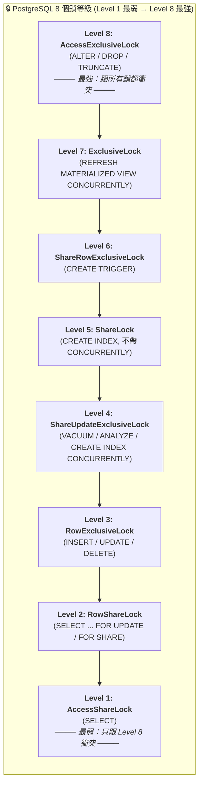
```mermaid
flowchart TD
    subgraph "🔒 PostgreSQL 8 個鎖等級 (Level 1 最弱 → Level 8 最強)"
        direction TB
        L8["<b>Level 8: AccessExclusiveLock</b><br/>(ALTER / DROP / TRUNCATE)<br/><i>──── 最強：跟所有鎖都衝突 ────</i>"]
        L7["<b>Level 7: ExclusiveLock</b><br/>(REFRESH MATERIALIZED VIEW CONCURRENTLY)"]
        L6["<b>Level 6: ShareRowExclusiveLock</b><br/>(CREATE TRIGGER)"]
        L5["<b>Level 5: ShareLock</b><br/>(CREATE INDEX, 不帶 CONCURRENTLY)"]
        L4["<b>Level 4: ShareUpdateExclusiveLock</b><br/>(VACUUM / ANALYZE / CREATE INDEX CONCURRENTLY)"]
        L3["<b>Level 3: RowExclusiveLock</b><br/>(INSERT / UPDATE / DELETE)"]
        L2["<b>Level 2: RowShareLock</b><br/>(SELECT ... FOR UPDATE / FOR SHARE)"]
        L1["<b>Level 1: AccessShareLock</b><br/>(SELECT)<br/><i>──── 最弱：只跟 Level 8 衝突 ────</i>"]
    end

    L8 --> L7 --> L6 --> L5 --> L4 --> L3 --> L2 --> L1
```

> **衝突規則**：每個鎖等級的「衝突對象」列中列出的鎖，都不能跟它**同時**被持有。例如：一個 `SELECT`（Level 1）正在執行時，`ALTER TABLE`（Level 8）必須排隊等待；反過來也一樣，`ALTER TABLE` 執行時，所有 `SELECT` 也都進不來。

在原始碼中，鎖等級定義在 `src/include/storage/lock.h` 的 `LockModes` 枚舉裡，衝突矩陣則存在 `lockConflicts[]` 陣列中。當 PG 需要判斷兩個鎖是否衝突時，會呼叫 `LockCheckConflicts()`（在 `src/backend/storage/lmgr/lock.c`）來查表比對。

### II. Lock Queue 排隊機制

PG 的 lock queue 有一個關鍵特性：即使 session 尚未持有鎖，只要進入 lock queue 就會產生鎖衝突。鎖鏈範例：

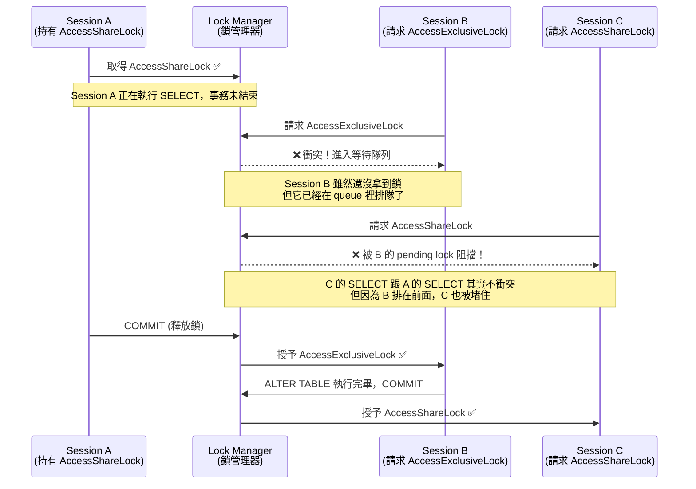
```mermaid
sequenceDiagram
    participant A as Session A<br/>(持有 AccessShareLock)
    participant LM as Lock Manager<br/>(鎖管理器)
    participant B as Session B<br/>(請求 AccessExclusiveLock)
    participant C as Session C<br/>(請求 AccessShareLock)

    A->>LM: 取得 AccessShareLock ✅
    Note over A,LM: Session A 正在執行 SELECT，事務未結束

    B->>LM: 請求 AccessExclusiveLock
    LM-->>B: ❌ 衝突！進入等待隊列
    Note over B,LM: Session B 雖然還沒拿到鎖<br/>但它已經在 queue 裡排隊了

    C->>LM: 請求 AccessShareLock
    LM-->>C: ❌ 被 B 的 pending lock 阻擋！
    Note over C,LM: C 的 SELECT 跟 A 的 SELECT 其實不衝突<br/>但因為 B 排在前面，C 也被堵住

    A->>LM: COMMIT (釋放鎖)
    LM->>B: 授予 AccessExclusiveLock ✅
    B->>LM: ALTER TABLE 執行完畢，COMMIT
    LM->>C: 授予 AccessShareLock ✅
```

> **新手白話**：這就像銀行櫃檯排隊。Session A 正在辦理業務，Session B 來了說「我要辦一個需要獨佔櫃檯很久的大事」，櫃檯說「好，你排隊等」。接著 Session C 來說「我只是要快速問個問題」，但櫃檯說「前面那位要辦大事的還在排，你也要等」。C 明明跟 A 不衝突，但因為 B 排在前面，C 就被 B 間接堵死了——這就是 PG lock queue 的關鍵特性。

> PG 對未獲得、但在等待中的鎖也在衝突列表中。這意味著一個 pending 的高級別鎖（如 AccessExclusiveLock）可以堵死後續所有低級別鎖請求。

### III. Object-Level Lock 在 Transaction 結束才釋放

即使是 `SELECT`，只要在 transaction 內（`BEGIN` 之後未 `COMMIT`），對 table 持有的 `AccessShareLock` 直到 transaction 結束才釋放。這意味著一個「閒置的 long transaction」可以長時間持有 shared lock。

> **為什麼 `SELECT` 拿的是表級鎖、不是行鎖？**
>
> `AccessShareLock` **只有表級版本，沒有行級版本**。純 `SELECT`（不帶 `FOR UPDATE` / `FOR SHARE`）完全不會碰行鎖——tuple header 的 `xmax` 保持不動：
>
> ```
> SELECT * FROM users WHERE id = 1;
> 
> 拿的鎖：
>   表級：AccessShareLock ✅     ← 只擋 AccessExclusiveLock（DDL），不擋任何 DML
>   行級：無                     ← MVCC snapshot 保證讀取一致性，根本不需要行鎖
> ```
>
> 行鎖（`xmax`）是寫操作（`UPDATE` / `DELETE` / `SELECT FOR UPDATE`）才會碰的東西。純讀取的安全性完全由 **MVCC snapshot** 保障——交易開始時拍一張快照，並行寫入自動不可見，不需要靠鎖來保護讀取。這也是 PostgreSQL 跟 DB2/MSSQL 的根本差異之一：讀取在 PG 中是零鎖開銷的。

> **補充：裸 SELECT 不寫 BEGIN 就沒事了嗎？**  
> PostgreSQL 預設 `AUTOCOMMIT = ON`——當你直接在 psql 輸入 `SELECT * FROM users;` 時，PG 在背後自動幫你包一層隱式 transaction：`自動 BEGIN → SELECT → 自動 COMMIT`。整個過程通常不到 1ms，所以「跑完就釋放」和「COMMIT 才釋放」**在這種情況下根本是同一件事**。  
>   
> 真正會出事的，是以下兩種場景：  
> 1. **你手動寫了 `BEGIN`**，跑完 `SELECT` 後忘了 `COMMIT`——鎖從此懸掛  
> 2. **ORM / 連線工具關掉了 autocommit**——每條看似裸的 SQL 背後其實是一座沒關門的 transaction  
>   
> ```mermaid
> sequenceDiagram
>     participant Auto as 裸 SELECT<br/>(AUTOCOMMIT=ON)
>     participant Manual as 顯式 BEGIN<br/>(AUTOCOMMIT=OFF 或手動)
>     participant LM as Lock Manager
> 
>     Note over Auto: PG 自動 BEGIN（隱式）
>     Auto->>LM: AccessShareLock
>     Note over Auto: SELECT 執行中...（0.1ms）
>     Note over Auto: PG 自動 COMMIT（隱式）
>     Auto->>LM: 釋放 AccessShareLock ✅
>     Note over Auto,LM: 全程不到 1ms<br/>鎖幾乎瞬間釋放，沒問題
> 
>     Manual->>Manual: BEGIN（手動）
>     Manual->>LM: AccessShareLock
>     Note over Manual: SELECT 執行中...（0.1ms）
>     Note over Manual: SELECT 跑完了，但沒 COMMIT
>     Note over LM: 🔴 鎖還是掛著！
>     Note over Manual: 程式跑去處理別的事...
>     Note over LM: 10 分鐘後，鎖還在 💀
>     Manual->>Manual: COMMIT（終於）
>     Manual->>LM: 釋放 AccessShareLock
> ```
> 
> **一句話**：裸 `SELECT`（autocommit）很安全；但一旦進入顯式 transaction，鎖的生命週期就從「SQL 執行時間」變成了「你忘記 COMMIT 的時間」。

常見觸發源：
- **ORM 框架**自動開啟 implicit transaction，開發者忘記 commit
- **pgAdmin / DBeaver 查詢後未 commit**，而 auto-commit 被關閉
- **Stored procedure** 內有 `BEGIN` 但異常路徑未 `ROLLBACK`
- **idle in transaction** 狀態是頭號嫌疑犯

檢測 idle in transaction：

```sql
SELECT pid, usename, datname, state,
       now() - xact_start AS xact_duration,
       query
FROM pg_stat_activity
WHERE state = 'idle in transaction'
  AND now() - xact_start > interval '5 minutes';
```

建議在 production 設定 `idle_in_transaction_session_timeout`（PG 9.6+），預設值為 `0`（**關閉，不限時**）。設為 `10min` 後，任何 transaction 在 `idle in transaction` 狀態超過 10 分鐘，PG 會自動發送 `SIGTERM` 終止該 session 並 `ROLLBACK`，釋放其持有的所有鎖。

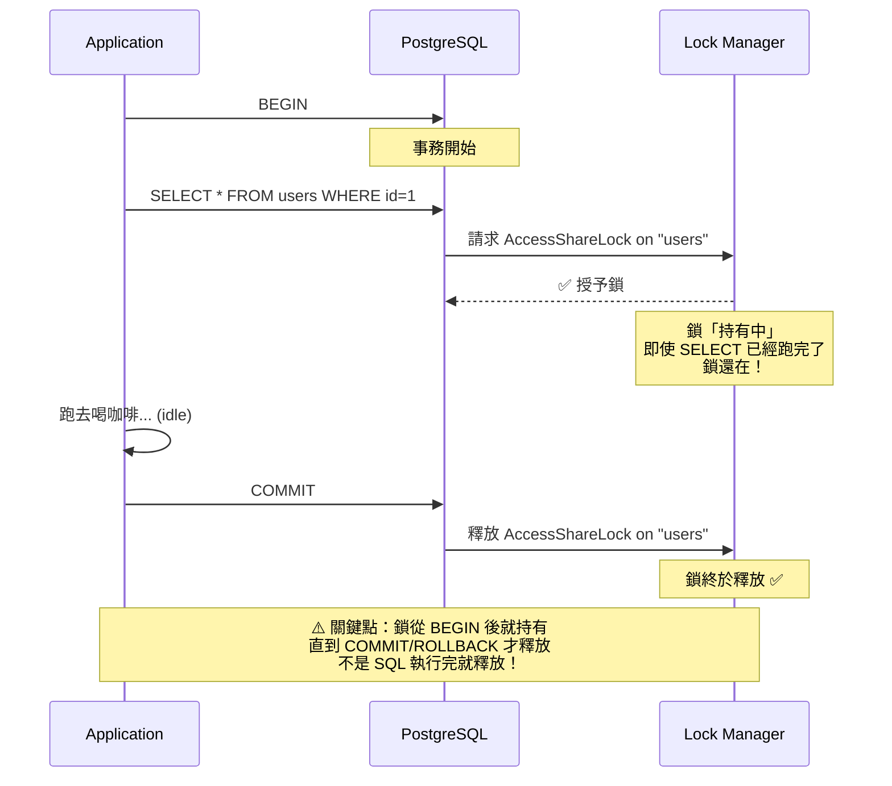
```mermaid
sequenceDiagram
    participant App as Application
    participant PG as PostgreSQL
    participant LM as Lock Manager

    App->>PG: BEGIN
    Note over PG: 事務開始

    App->>PG: SELECT * FROM users WHERE id=1
    PG->>LM: 請求 AccessShareLock on "users"
    LM-->>PG: ✅ 授予鎖
    Note over LM: 鎖「持有中」<br/>即使 SELECT 已經跑完了<br/>鎖還在！

    App->>App: 跑去喝咖啡... (idle)

    App->>PG: COMMIT
    PG->>LM: 釋放 AccessShareLock on "users"
    Note over LM: 鎖終於釋放 ✅

    Note over App,LM: ⚠️ 關鍵點：鎖從 BEGIN 後就持有<br/>直到 COMMIT/ROLLBACK 才釋放<br/>不是 SQL 執行完就釋放！
```

> **新手常見誤解**：很多人以為 `SELECT` 跑完鎖就釋放了，但實際上 PG 的 object-level lock（表級鎖）是在 **transaction 結束**（`COMMIT` 或 `ROLLBACK`）時才統一釋放。在原始碼中，這個釋放動作由 `LockReleaseAll()` 函數處理（在 `lock.c` 中），它會在 transaction 結束時被 `ResourceOwnerRelease()` 觸發，一次性釋放該事務持有的所有鎖。

> **原始碼關鍵函數速查**：
>   - 8 個鎖等級定義在 `src/include/storage/lock.h` 的 `enum LockMode`
>   - 鎖獲取：`LockAcquire()` → 找或創建鎖物件，檢查衝突，授予或排隊
>   - 鎖釋放：`LockRelease()` → 釋放單個鎖，喚醒等待者
>   - 衝突檢查：`LockCheckConflicts()` → 遍歷 lock queue，用 `lockConflicts[]` 查衝突矩陣
>   - 喚醒等待者：`ProcLockWakeup()` → 當鎖被釋放後，叫醒 queue 中下一個能拿到鎖的人
>   - 事務結束清理：`LockReleaseAll()` → 釋放該事務所有鎖，在 COMMIT/ROLLBACK 時觸發

---

## 2. 隱式鎖請求（Implicit Lock Request）

> 來源：[digoal - 注意PostgreSQL "隐式"锁请求 (2015-11-05)](https://github.com/digoal/blog/blob/master/201511/20151105_01.md)

### I. 核心發現：pg_get_indexdef 請求的是 Table Lock，非 Index Lock

當你對一個表執行 DDL（如 `ALTER TABLE ... ADD COLUMN`）時，該表被加上 `AccessExclusiveLock`。此時你可能覺得只讀 index 定義不受影響——**但實際上 `pg_get_indexdef()` 會請求該 index 的父表 `AccessShareLock`**，因此被 DDL 阻塞。

> **補充：ADD COLUMN 到底多快？會不會把整張表卡死？**
>
> `AccessExclusiveLock` 跟所有鎖衝突，所以 **ADD COLUMN 期間確實連 SELECT 都會被擋**。但實際影響取決於寫法：
>
> | 寫法 | 底層行為 | 耗時 |
> |------|---------|------|
> | `ADD COLUMN x INT;`（nullable，無 default） | 只改 catalog，不碰資料行 | **毫秒級**，表再大都一樣 |
> | `ADD COLUMN x INT DEFAULT 42;`（PG 11+） | default 存在 catalog，不 rewrite 表 | **毫秒級** |
> | `ADD COLUMN x INT NOT NULL;` | 需全表掃描檢查每行是否 NULL | **取決於表大小**，可能很久 |
>
> 也就是說，nullable + 無 default 的 ADD COLUMN 是瞬間完成的——即使 1TB 的表，SELECT 也只被卡幾毫秒。真正危險的是 `ADD COLUMN ... NOT NULL`（全表掃描期間表級鎖全程持有）以及舊版 PostgreSQL 的 volatile default。
>
> **至於查 table schema（`\d table`、`information_schema.columns` 等）**，底層拿的是 `AccessShareLock`——跟 `SELECT` 同一級。所以查 schema **不會阻塞任何 DML**，只會被正在跑的 DDL 阻塞；反過來，查 schema 本身也不會卡住別人。

**複現：**

Session A — DDL 持有 AccessExclusiveLock：

```sql
BEGIN;
ALTER TABLE test ADD COLUMN c1 INT;
```

Session B — 讀取 index 定義被阻塞：

```sql
SELECT * FROM pg_get_indexdef('test_pkey'::regclass);
```

> **新手白話**：`pg_get_indexdef` 想讀取索引 "test_pkey" 的定義，但索引的定義儲存在 **父表** 的 catalog（系統目錄）裡，所以它需要先取得父表的 `AccessShareLock`。此時父表已經被 Session A 用 `AccessExclusiveLock` 鎖住了，B 就被堵死。這就像你想看一本書的目錄（index），但目錄跟書本身（table）綁在一起，有人正在改書的結構（ALTER），你連目錄都翻不了。

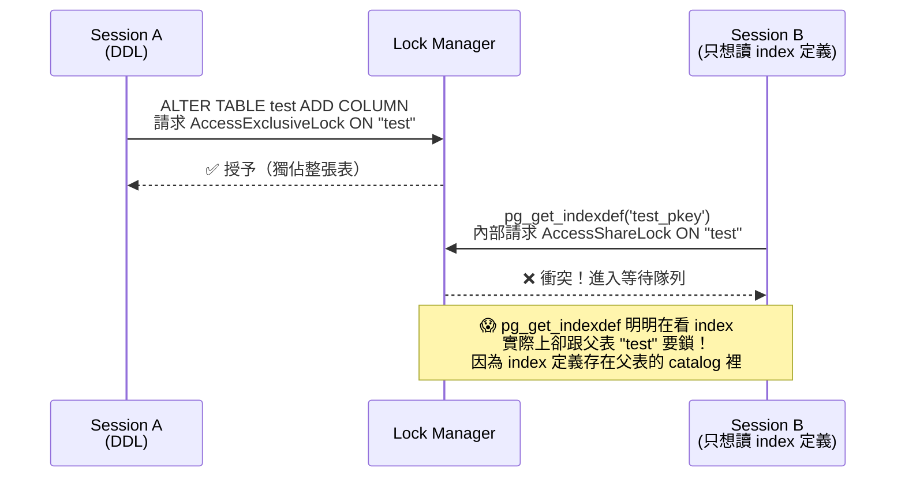
```mermaid
sequenceDiagram
    participant A as Session A<br/>(DDL)
    participant LM as Lock Manager
    participant B as Session B<br/>(只想讀 index 定義)

    A->>LM: ALTER TABLE test ADD COLUMN<br/>請求 AccessExclusiveLock ON "test"
    LM-->>A: ✅ 授予（獨佔整張表）

    B->>LM: pg_get_indexdef('test_pkey')<br/>內部請求 AccessShareLock ON "test"
    LM-->>B: ❌ 衝突！進入等待隊列

    Note over B,LM: 😱 pg_get_indexdef 明明在看 index<br/>實際上卻跟父表 "test" 要鎖！<br/>因為 index 定義存在父表的 catalog 裡
```

**在原始碼中**：`pg_get_indexdef()` 函數（在 `src/backend/utils/adt/ruleutils.c`）內部會呼叫 `relation_open()`（在 `src/backend/access/common/relation.c`），這個函數會觸發 `LockRelationOid()` → `LockAcquire()`，對父表請求 `AccessShareLock`。這就是「隱式鎖」的來源——開發者沒有手寫 `LOCK TABLE`，但 PG 內部為了保證一致性，自動幫你拿了鎖。

### II. 受影響函數列表

所有 `pg_get_*def()` 系列函數都會向**父表/父物件**請求 `AccessShareLock`（而非子物件），因此都會被 DDL 阻塞：

| 函數 | 請求 Lock 的對象 |
|------|-----------------|
| `pg_get_indexdef(oid)` | 父表 |
| `pg_get_constraintdef(oid)` | 父表 |
| `pg_get_functiondef(oid)` | 函數本身 |
| `pg_get_ruledef(oid)` | 父表 |
| `pg_get_triggerdef(oid)` | 父表 |
| `pg_get_viewdef(oid)` | 檢視本身及其引用的所有基礎表 |

> `pg_dump` 內部大量使用這些函數。當你對生產庫執行 `pg_dump --schema-only` 時，這些隱式鎖會請求所有表的 `AccessShareLock`。如果此時有任何 DDL 在執行，pg_dump 會被阻塞——更危險的是，pg_dump 本身也會阻塞後續的 DDL（見下文 lock queue pileup 機制）。

### III. Lock Queue Pileup（鎖隊列堆積）

最危險的場景：**一個 pending DDL 堵死整張表**。

實際場景：
1. Session A 運行一個大型 `SELECT`（無鎖，但事務未結束）
2. Session B 想對同表執行 DDL → 請求 `AccessExclusiveLock` → 因為 A 的事務未結束，B 進入 waiting queue
3. Session C 想讀取該表（`SELECT`，需要 `AccessShareLock`）→ **也被 B 阻塞**，因為 B 在 waiting queue 中
4. Session D 同樣執行 `SELECT`（需要 `AccessShareLock`）→ **下場與 C 完全一樣**，明明跟 A 不衝突，卻被 pending 的 B 卡在門外

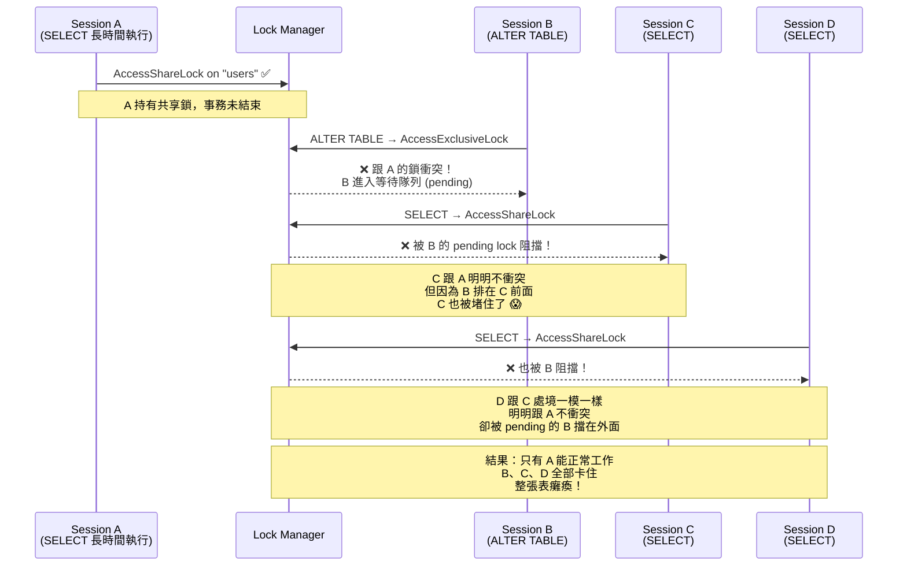
```mermaid
sequenceDiagram
    participant A as Session A<br/>(SELECT 長時間執行)
    participant LM as Lock Manager
    participant B as Session B<br/>(ALTER TABLE)
    participant C as Session C<br/>(SELECT)
    participant D as Session D<br/>(SELECT)

    A->>LM: AccessShareLock on "users" ✅
    Note over A,LM: A 持有共享鎖，事務未結束

    B->>LM: ALTER TABLE → AccessExclusiveLock
    LM-->>B: ❌ 跟 A 的鎖衝突！<br/>B 進入等待隊列 (pending)

    C->>LM: SELECT → AccessShareLock
    LM-->>C: ❌ 被 B 的 pending lock 阻擋！
    Note over C,LM: C 跟 A 明明不衝突<br/>但因為 B 排在 C 前面<br/>C 也被堵住了 😱

    D->>LM: SELECT → AccessShareLock
    LM-->>D: ❌ 也被 B 阻擋！
    Note over D,LM: D 跟 C 處境一模一樣<br/>明明跟 A 不衝突<br/>卻被 pending 的 B 擋在外面

    Note over LM,D: 結果：只有 A 能正常工作<br/>B、C、D 全部卡住<br/>整張表癱瘓！
```

> 這個問題在 PostgreSQL 社群被稱為 "lock queue pileup"。核心矛盾在於 lock manager 嚴格按 FIFO 排隊——pending 的 AccessExclusiveLock 會阻擋後續所有 AccessShareLock 請求，即使這些 SELECT 與 Session A 的 SELECT 互不衝突。這是 PG lock manager 設計權衡：避免 AccessExclusiveLock 永遠拿不到（starvation prevention），代價是偶發性 pileup。

### IV. 防護措施

**1. DDL 加 lock_timeout：**

```sql
SET lock_timeout = '1s';
ALTER TABLE test ADD COLUMN c1 INT;  -- 若 1s 內拿不到鎖→直接 fail，不進 waiting queue
```

**2. 監控前置：定期檢查 pending lock：**

```sql
SELECT pid, wait_event_type, wait_event,
       pg_blocking_pids(pid) blocked_by,
       now() - query_start AS wait_duration,
       query
FROM pg_stat_activity
WHERE wait_event_type = 'Lock'
  AND state <> 'idle'
ORDER BY query_start;
```

**3. 避免 Long Transaction：** 消除 long transaction 從根源絕殺 pileup。

**4. 使用 CONCURRENTLY 替代傳統 DDL：**

```sql
-- 傳統寫法：拿 ShareLock (Level 5)，會阻塞所有 INSERT / UPDATE / DELETE
CREATE INDEX idx_test ON test (col);

-- CONCURRENTLY 寫法：拿 ShareUpdateExclusiveLock (Level 4)，不阻塞 DML
CREATE INDEX CONCURRENTLY idx_test ON test (col);
```

**CONCURRENTLY 內部機制（三步驟建索引）：**

傳統 `CREATE INDEX` 一次全表掃描就收工，但全程持有 `ShareLock`——期間所有 `INSERT` / `UPDATE` / `DELETE`（需要 `RowExclusiveLock`，Level 3）全部被擋。`CONCURRENTLY` 則把建立索引拆成**三次掃描**，付出的代價雖然是稍慢（三次掃碼自然比一次久），但換來的是它只拿 `ShareUpdateExclusiveLock`（Level 4），**完全不跟 `RowExclusiveLock` 衝突**——DML 照跑，線上交易不受影響。

> **實例對比：哪些操作從「被卡死」變成「可以跑」？**
>
> **例 1：INSERT**——傳統 `CREATE INDEX` 期間，任何 `INSERT` 都被 `ShareLock` 擋住，App 端直接積壓。改用 `CONCURRENTLY` 後，`INSERT` 拿的 `RowExclusiveLock`（Level 3）與 `ShareUpdateExclusiveLock`（Level 4）完全不衝突，**App 端的寫入請求照常執行，用戶無感**。
>
> **例 2：UPDATE / DELETE**——情境同上。傳統寫法下，即使只 `UPDATE` 一行，也要等整個索引建完（大表可能數分鐘到數小時）。`CONCURRENTLY` 下 `UPDATE` / `DELETE` 拿的 `RowExclusiveLock` 照樣可以跟索引建構並行，**線上交易零中斷**。
>
> ```mermaid
> sequenceDiagram
>     participant CI as CREATE INDEX<br/>(ShareLock)
>     participant CIC as CREATE INDEX CONCURRENTLY<br/>(ShareUpdateExclusiveLock)
>     participant DML as INSERT / UPDATE / DELETE<br/>(RowExclusiveLock)
> 
>     Note over CI,DML: 傳統方式——衝突！
>     CI->>CI: ShareLock 🔒
>     DML->>CI: 請求 RowExclusiveLock
>     CI-->>DML: ❌ 衝突！等索引建完
>     Note over DML: App 端寫入卡死 💀
> 
>     Note over CIC,DML: CONCURRENTLY 方式——互不干擾
>     CIC->>CIC: ShareUpdateExclusiveLock 🔒
>     DML->>CIC: 請求 RowExclusiveLock
>     CIC-->>DML: ✅ 不衝突！同時執行
>     Note over CIC,DML: 索引一邊建、DML 一邊跑 ✅
> ```
>
> 簡言之，`CREATE INDEX CONCURRENTLY` 讓原本會被傳統 `CREATE INDEX` 長時間堵死的**所有寫入操作（INSERT / UPDATE / DELETE）全部解鎖**——代價只是索引建構時間變長（2~3 倍）。對需要 24x7 運行的 OLTP 系統來說，這筆交易非常划算。

| 步驟 | 動作 | 持有的鎖 |
|:----:|------|---------|
| **Step 1** | 掃描全表，建立索引條目（不含正在進行中的 transaction 的變更） | `ShareUpdateExclusiveLock` |
| **Step 2** | 再次掃描，補上 Step 1 期間新提交的 row（等 pending transaction 完成） | `ShareUpdateExclusiveLock` |
| **Step 3** | 最後一次掃描，確認無遺漏 → 將索引標記為 valid → 啟用 | `ShareUpdateExclusiveLock` |

> **新手白話**：傳統索引建立就像「圖書館閉館一天，一個人進去把所有書上架」。CONCURRENTLY 就像「圖書館照常營業，館員趁沒人注意時分批上架」——慢了一點，但讀者從頭到尾都可以進出。

**CONCURRENTLY 支援的操作：**

| 操作 | 語法 | 替代的傳統寫法 |
|------|------|-------------|
| 建索引 | `CREATE INDEX CONCURRENTLY` | `CREATE INDEX`（拿 ShareLock） |
| 重建索引 | `REINDEX INDEX CONCURRENTLY`（PG 12+） | `REINDEX INDEX`（拿 AccessExclusiveLock） |
| 刪索引 | `DROP INDEX CONCURRENTLY` | `DROP INDEX`（拿 AccessExclusiveLock） |

**代價與注意事項：**

- **效能**：三次全表掃描，總耗時約為傳統寫法的 2~3 倍
- **交易隔離**：必須在 `AUTOCOMMIT = ON` 的環境下執行（不能包在 `BEGIN ... COMMIT` 裡）
- **中途異常**：如果 Step 2 或 Step 3 期間有 unique violation（別人的寫入造成索引鍵重複），整個操作會失敗，留下一個 `INVALID` 狀態的索引——需要手動 `DROP INDEX CONCURRENTLY` 清理後重試
- **暫存磁碟空間**：建構期間持續寫入尚未標記為 valid 的索引頁，需要額外磁碟空間

> **限制與實戰對策**：`ALTER TABLE ADD COLUMN` 沒有 CONCURRENTLY 版本，至今仍需 `AccessExclusiveLock`（PG 18 仍如此），無法繞過。這是 PG 最頑固的 DDL 瓶頸，但可以透過**分段策略**把傷害降到最低：
>
> **核心思路**：nullable + 不給 default = 瞬間完成。後續的 non-null / default 需求用批次 DML 補上，避免讓 DDL 本身成為瓶頸。
>
> **標準三步策略：**
>
> ```sql
> -- Step 1：瞬間完成，只鎖幾毫秒（只改 catalog，不碰資料行）
> ALTER TABLE users ADD COLUMN age INT;  -- nullable, 無 default
>
> -- Step 2：批次回填（分批 UPDATE，每批只鎖少數行，不影響並行寫入）
> -- 使用 SKIP LOCKED 或 advisory lock 分片類似二篇 §2 的策略
> UPDATE users SET age = 0 WHERE age IS NULL AND id BETWEEN 1 AND 1000;
> UPDATE users SET age = 0 WHERE age IS NULL AND id BETWEEN 1001 AND 2000;
> -- ... 重複直到全表填完
>
> -- Step 3：最後才加 NOT NULL（如果業務需要）
> ALTER TABLE users ALTER COLUMN age SET NOT NULL;  -- 全表掃描驗證無 NULL，但此時表裡已經沒 NULL 了
> ```
>
> | 做法 | AccessExclusiveLock 持鎖時間 | 風險 |
> |------|:--:|------|
> | `ADD COLUMN x INT DEFAULT 0 NOT NULL` 一步到位 | **全表 rewrite 時間** | 鎖全程持有，大表直接癱瘓 |
> | `ADD COLUMN x INT`（nullable 無 default）→ 批次 UPDATE → `SET NOT NULL` | Step1 幾 ms / Step3 僅掃描不 rewrite | 每個階段都極短，可控可中斷 |
>
> **為什麼連 DEFAULT 都不建議放在 ADD COLUMN 裡？** 即使 PG 11+ 的 volatile default 已最佳化為 catalog-only（不 rewrite），但一旦同時加 `NOT NULL`，PG 仍需要驗證全表沒有 NULL——這一步拿的還是 `AccessExclusiveLock`，鎖全程。拆開執行讓 nullable ADD 瞬間跑完、確認沒有 NULL 後再 `SET NOT NULL`，把風險降到最低。

> **原始碼關鍵函數速查**：
>   - `relation_open()`（`relation.c`）→ 打開 relation 時自動拿鎖，是「隱式鎖」的根源
>   - `pg_get_indexdef()`（`ruleutils.c`）→ 內部呼叫 `relation_open`，對父表要 AccessShareLock
>   - `LockQueuePileup` 的形成機制：`LockAcquire()` → `LockCheckConflicts()` 檢查時，pending lock 也會阻擋後續請求
>   - `lock_timeout` 的實現：`LockAcquire()` 在等待迴圈中檢查 timeout，超時會觸發 `StatementCancelHandler()`

---

## 3. Lock Flooding — 大鎖與 Long Transaction 的蝴蝶效應

> 來源：[digoal - PostgreSQL 大锁与long sql/xact的蝴蝶效应 (2016-03-16)](https://github.com/digoal/blog/blob/master/201603/20160316_02.md)

### I. 蝴蝶效應的四個因素

當以下四個因素疊加時，可能引發資料庫效能瞬間崩潰：

**因素 1：Lock Queue 排隊機制**（見 §2.III）

**因素 2：Response 變慢 → Application 增加連線數**

當 SQL 因鎖等待變慢，Application 層的典型反應是建立更多 connection 來處理積壓請求，試圖「補償」效能下降——這反而加劇問題。

**因素 3：超過 Connection 閾值後效能遞減**

PG 的 TPS 在 connection 數量超過 CPU core 數的 **3 倍**後開始顯著下降。原因包括 context switch 增加、shared_buffers contention、lock manager 的 internal spinlock 競爭。

**因素 4：Object-Level Lock 在 Transaction 結束才釋放**（見 §1.III）

> **新手白話**：蝴蝶效應的意思是「一隻蝴蝶在巴西拍翅膀，可能引發德州龍捲風」。在這裡，一個 developer 忘記 COMMIT 的 `SELECT` 語句（看似無害），最後可以把整個資料庫的 TPS 打到零。四個因素互相餵養、惡性循環——就像雪崩一樣。

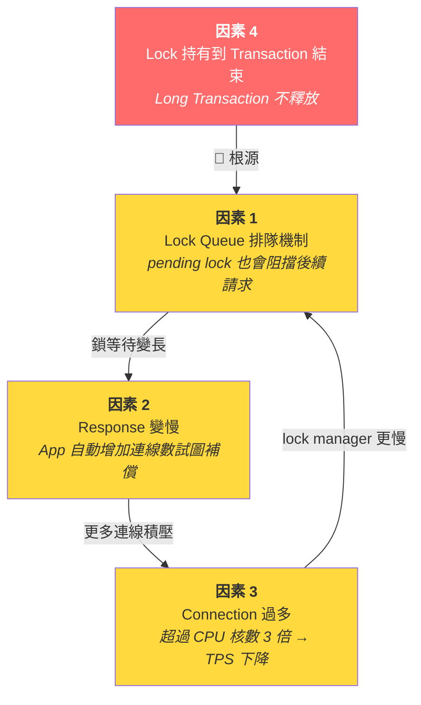
```mermaid
flowchart TD
    F1["<b>因素 1</b><br/>Lock Queue 排隊機制<br/><i>pending lock 也會阻擋後續請求</i>"]
    F2["<b>因素 2</b><br/>Response 變慢<br/><i>App 自動增加連線數試圖補償</i>"]
    F3["<b>因素 3</b><br/>Connection 過多<br/><i>超過 CPU 核數 3 倍 → TPS 下降</i>"]
    F4["<b>因素 4</b><br/>Lock 持有到 Transaction 結束<br/><i>Long Transaction 不釋放</i>"]

    F4 -->|"🔑 根源"| F1
    F1 -->|"鎖等待變長"| F2
    F2 -->|"更多連線積壓"| F3
    F3 -->|"lock manager 更慢"| F1

    style F4 fill:#ff6b6b,color:#fff
    style F1 fill:#ffd93d
    style F2 fill:#ffd93d
    style F3 fill:#ffd93d
```

### II. 模擬實驗：從正常到崩潰再到恢復

環境：1000 萬 row 表，10 connections baseline TPS ≈ 75,000。

**Phase 1 — 正常狀態（10 connections）：** TPS ≈ 75,000，延遲 < 0.15ms。

**Phase 2 — 觸發 Long Transaction：**

```sql
BEGIN;
SELECT * FROM test LIMIT 1;
-- 不 COMMIT - 繼續持有 AccessShareLock
```

**Phase 3 — DDL 請求觸發鎖鏈：**

```sql
ALTER TABLE test ADD COLUMN c1 int;
-- 等待 AccessExclusiveLock → 但 long transaction 持有 AccessShareLock
```

此 DDL 進入 lock queue 最前端，瞬間堵塞所有後續 DML。

**Phase 4 — TPS 歸零：**

```
progress: 53.0s, 0.0 tps
progress: 54.0s, 0.0 tps
progress: 55.0s, 0.0 tps
...
```

**Phase 5 — Application 擴張 Connections（加劇災難）：**

Application 新增 500 connections 來「緩解」——全部進入 lock queue。

> Lock queue 長度達到數百時，lock manager 的內部檢查（conflict detection）成本是 O(queue_length²)，因為每個新鎖請求都要與 queue 中所有等待者比對衝突。不只是 DB 被阻塞——DB process 本身也在消耗 CPU 做鎖衝突檢查。

**Phase 6 — Lock 釋放後的 Recovery（效能減半）：**

結束 long transaction 後，DDL 執行完畢。所有 510 connections 同時開始執行積壓的 UPDATE — **TPS 只恢復到 ~36,000**（原來 75,000 的一半），因為 510 個 connections 超出了 CPU 的承載能力。

**Phase 7 — 釋放多餘 Connections 後完全恢復：**

終止額外的 500 connections 後，TPS 回到 ~75,000。

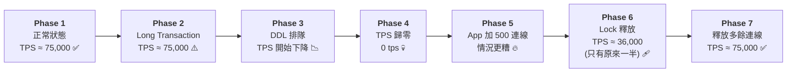
```mermaid
flowchart LR
    P1["<b>Phase 1</b><br/>正常狀態<br/>TPS ≈ 75,000 ✅"]
    P2["<b>Phase 2</b><br/>Long Transaction<br/>TPS ≈ 75,000 ⚠️"]
    P3["<b>Phase 3</b><br/>DDL 排隊<br/>TPS 開始下降 📉"]
    P4["<b>Phase 4</b><br/>TPS 歸零<br/>0 tps 💀"]
    P5["<b>Phase 5</b><br/>App 加 500 連線<br/>情況更糟 🔥"]
    P6["<b>Phase 6</b><br/>Lock 釋放<br/>TPS ≈ 36,000<br/>(只有原來一半) 🩹"]
    P7["<b>Phase 7</b><br/>釋放多餘連線<br/>TPS ≈ 75,000 ✅"]

    P1 --> P2 --> P3 --> P4 --> P5 --> P6 --> P7
```

> **關鍵教訓**：Phase 6 即使鎖釋放了，TPS 也只有原來一半——因為 App 建立了太多連線。這告訴我們：**即使解決了鎖的根源，過多的 connection 本身就是另一個效能殺手**。lock manager 的內部衝突檢查（`LockCheckConflicts()`）複雜度是 O(queue_length²)，queue 越長，檢查越慢，CPU 被吃掉越多。

### III. Lock 等待鏈查詢

使用以下 SQL 找出鎖等待鏈（誰阻塞了誰）：

```sql
-- 方法一：列出所有正在等待鎖的 session，以及誰擋住了它
SELECT
    blocked.pid              AS blocked_pid,
    blocked.usename          AS blocked_user,
    blocked.query            AS blocked_query,
    now() - blocked.wait_start AS blocked_wait_duration,
    blocking.pid             AS blocking_pid,
    blocking.usename         AS blocking_user,
    blocking.query           AS blocking_query,
    now() - blocking.xact_start AS blocking_xact_duration,
    blocking.state           AS blocking_state
FROM pg_stat_activity blocked
JOIN pg_stat_activity blocking
    ON blocking.pid = ANY(pg_blocking_pids(blocked.pid))
WHERE blocked.wait_event_type = 'Lock'
  AND blocked.state <> 'idle'
ORDER BY blocked.wait_start;
```

```sql
-- 方法二：遞迴展開整條等待鏈（A ← B ← C ← ...）
WITH RECURSIVE lock_chain AS (
    -- 起點：所有正在等待鎖的 session
    SELECT
        pid,
        wait_start,
        array[pid] AS chain_pids,
        1 AS depth
    FROM pg_stat_activity
    WHERE wait_event_type = 'Lock'
      AND state <> 'idle'

    UNION ALL

    -- 往上找：誰在擋這個 session
    SELECT
        blk.pid,
        lc.wait_start,
        lc.chain_pids || blk.pid,
        lc.depth + 1
    FROM lock_chain lc
    JOIN pg_stat_activity blk
        ON blk.pid = ANY(pg_blocking_pids(lc.pid))
    WHERE NOT blk.pid = ANY(lc.chain_pids)  -- 防止死循環
)
SELECT DISTINCT ON (chain_pids[1])
    chain_pids[1]                       AS blocked_pid,
    now() - wait_start                  AS blocked_wait,
    chain_pids[array_length(chain_pids, 1)] AS root_blocker_pid,
    array_to_string(chain_pids, ' ← ')  AS wait_chain,
    depth
FROM lock_chain
ORDER BY chain_pids[1], depth DESC;
```

| 欄位 | 含義 |
|------|------|
| `blocked_pid` | 被卡住的 session PID |
| `blocked_wait_duration` | 等了多久 |
| `blocking_pid` / `root_blocker_pid` | 誰在擋（方法一查直接阻擋者，方法二查根源） |
| `wait_chain` | 完整等待鏈，如 `12345 ← 12367 ← 12389` |
| `blocking_state` | 阻擋者目前狀態——若是 `idle in transaction` 代表忘了 COMMIT |

> 方法一適合日常排查（一鍵找阻塞者）。方法二適合複雜死鎖場景——當 A 等 B、B 等 C、C 等 D 時，`wait_chain` 會顯示完整的 `pid1 ← pid2 ← pid3 ← pid4` 鏈，直接定位鏈尾根源。

### IV. 根治方案

| 方案 | 做法 |
|------|------|
| **強制 Lock Timeout** | `SET lock_timeout = '5s';` — 等待超時自動 cancel。適用任何 SQL，但**實務上最常用在 DDL**：DDL 拿 `AccessExclusiveLock`，最容易卡在 lock queue 等不到、卡住後又引發 pileup（見 §2.III）。DDL 等不到鎖就直接 cancel 是正確行為——排隊等下去只會癱瘓整張表。DML 也可用但謹慎：正常寫入衝突本來就該排隊，設太短反而誤傷 |
| **Connection Pool 管理** | PgBouncer 設定 idle connection timeout |
| **idle_in_transaction_session_timeout** | PG 9.6+，自動 terminate idle-in-transaction，預設 `0`（關閉） |
| **監控 Lock Chain 與告警** | 定時執行上述 lock chain SQL，queue 過長 → alert |
| **DDL 執行規範** | DDL 前檢查 `pg_stat_activity` + `lock_timeout` 保護 + 考慮 online tooling |

> **DDL 在 Production 的執行規範**：
> 1. 所有 DDL 在執行前應檢查是否有 idle-in-transaction
> 2. DDL 加 `lock_timeout` 保護（如 `SET lock_timeout = '2s'; ALTER TABLE ...;`）
> 3. 可使用 `LOCK TABLE ... NOWAIT` 測試鎖是否可立即取得
> 4. 大表的 DDL 考慮用 online tooling：`pg_repack`（詳見下方 §5）、`CREATE INDEX CONCURRENTLY`（詳見 §2.IV）

> **原始碼關鍵函數速查**：
>   - `pg_blocking_pids()` → PG 9.6+ 內建函數，直接查誰在擋你，底層調用 `GetBlockerPidsData()`
>   - `LockCheckConflicts()` 的 O(n²) 行為：每個新鎖請求都要遍歷 queue 中所有 pending lock 做衝突比對
>   - `idle_in_transaction_session_timeout` 的實現：檢查 `xact_start` 和 `state`，超時的 session 會被發送 SIGTERM
>   - spinlock 競爭：當大量 backend 同時搶 lock，lock manager 的內部 spinlock (`LWLock` 系列) 競爭急劇上升

### V. pg_repack：不停機的表空間重組

> 雖然 `pg_repack` 不是 PostgreSQL 內建功能（PG 17 仍需手動安裝），但它是 **OLTP 環境最實用的 online DDL 工具之一**，與鎖機制深度相關，值得獨立一節說明。

#### A. 問題：為什麼 `VACUUM FULL` 和 `CLUSTER` 不適合生產環境

當一張大表頻繁 `UPDATE` / `DELETE` 後，dead tuple 堆積、實體儲存不連續，查詢效能下降。PG 內建有兩個解決方案：

> **什麼是 dead tuple 與 bloat？**
>
> PostgreSQL 的 `UPDATE` **不是在原位置修改資料**——它是「標記舊版本為無效、插入一個新版本」。`DELETE` 也不是真的刪除，只是標記 `xmax = 當前 txid`。這些被標記但尚未被 `VACUUM` 清理的舊版本就是 **dead tuple（死元組）**。
>
> 當一張表被反覆 UPDATE 後，dead tuple 會像垃圾一樣塞在原本的資料頁中。Seq Scan 掃表時，PG 還是要讀過這些 dead tuple 再跳過（因為 MVCC 要判斷可見性）——表檔案越來越大、但「有效資料」其實沒那麼多。這就是 **bloat（膨脹）**。
>
> 同時，「實體儲存不連續」指的是：行的邏輯順序(主鍵順序)和磁碟上的實體順序不一致——例如 `id=1` 在頁面 100、`id=2` 卻在頁面 3。範圍查詢 `WHERE id BETWEEN 1 AND 100` 本來只該讀一兩頁，結果因為資料四散，變成要隨機讀幾十頁。
>
> ```mermaid
> flowchart TD
>     subgraph initial["初期：compact（緊密且有序）"]
>         P1A["page 1<br/>⬛ id=1 | ⬛ id=2 | ⬛ id=3 | __"]
>         P2A["page 2<br/>⬛ id=4 | ⬛ id=5 | ⬛ id=6 | __"]
>         P3A["page 3<br/>⬛ id=7 | ⬛ id=8 | ⬛ id=9 | __"]
>     end
>
>     subgraph after_blast["經過大量 UPDATE / DELETE 後：bloat + 離散"]
>         P1B["page 1<br/>💀 dead(id=1) | ⬛ id=2(v2) | 💀 dead(id=2v1) | __"]
>         P2B["page 2<br/>💀 dead(id=4) | 💀 dead(id=5) | ⬛ id=10(new) | __"]
>         P3B["page 3<br/>⬛ id=7(v2) | 💀 dead(id=7v1) | 💀 dead(id=8) | ⬛ id=99(new)"]
>     end
>
>     subgraph after_repack["VACUUM FULL / pg_repack 後：重新 compact"]
>         P1C["page 1<br/>⬛ id=2 | ⬛ id=7 | ⬛ id=10 | ⬛ id=99"]
>         P2C["page 2<br/>__ | __ | __ | __"]
>         P3C["page 3<br/>__ | __ | __ | __"]
>     end
>
>     initial -->|"大量 UPDATE"| after_blast
>     after_blast -->|"pg_repack"| after_repack
> ```
>
> 上圖範例：原本 3 頁存 9 行。經過大量 UPDATE 後 dead tuple 佔了大半空間（有效行只剩 4 行卻散在 3 頁裡），`id=10` 和 `id=99` 的新版本四散在不同的頁——這就是「不連續」。重整後變回 1 頁內有 4 行，空間回收、順序統一。
>
> **兩種「膨脹」的區別：**
>
> | | 空間膨脹（Dead Tuple Bloat） | 邏輯離散（Physical Scatter） |
> |---|---|---|
> | 成因 | UPDATE / DELETE 留下舊版本 | 新資料寫入時找不到原位，四散在別頁 |
> | 影響 | Seq Scan 要讀大量無用頁 → IO 浪費 | 範圍查詢需要隨機讀多個頁面 → 快取命中率下降 |
> | `VACUUM` 可解？ | 普通 `VACUUM` 可標記空間重用，但不還給 OS | ❌ 無法 |
> | `VACUUM FULL` 可解？ | ✅ 可，但全程鎖表 | ✅ 可，但全程鎖表 |
> | `pg_repack` 可解？ | ✅ 可，且不鎖表 | ✅ 可，且不鎖表 |
>
> **MSSQL 對照：VACUUM、REBUILD INDEX，傻傻分不清？**
>
> `VACUUM` 是 MVCC 引擎特有的垃圾回收機制，**MSSQL 沒有對等的東西**——因為 MSSQL 採用原地更新（in-place update），不產生 dead tuple。但這不代表 MSSQL 沒有碎片問題：
>
> | 概念 | PostgreSQL | MSSQL |
> |------|-----------|-------|
> | 舊版 row 清理 | `VACUUM`（autovacuum 自動觸發） | 無。只有 snapshot isolation 時在 tempdb version store 暫存舊版，由 background cleaner 自動清理 |
> | 碎片整理 | `VACUUM FULL` / `CLUSTER` / `pg_repack` | `ALTER INDEX ... REORGANIZE`（線上，不鎖）或 `ALTER INDEX ... REBUILD`（可選 `ONLINE = ON`，Enterprise 限定） |
> | 重建索引 | `REINDEX` / `REINDEX CONCURRENTLY` | `ALTER INDEX ... REBUILD` |
>
> **MSSQL REBUILD INDEX 該每天跑嗎？** 不建議。MSSQL 的維護策略是依碎片率決定：
>
> | 碎片率 | 建議 |
> |--------|------|
> | < 5% | 不動 |
> | 5~30% | `ALTER INDEX ... REORGANIZE`（線上、不鎖、log 增長可控） |
> | > 30% | `ALTER INDEX ... REBUILD`（可選 `ONLINE = ON`） |
>
> 每天無差別 REBUILD 的問題：log 暴增（等於重寫整個 index）、即使 `ONLINE` 最後切換仍需短暫 schema stability lock、低碎片 index 重建後效能提升為零。
>
> 實務上通常用 Ola Hallengren 之類的維護腳本，只在碎片超標時才動，頻率通常是**每週**而非每天。這跟 PG 的 `VACUUM` 定位完全不同——`VACUUM` 是防止表無限膨脹的**必需背景維護**，不是效能調優。

| 操作 | 作用 | 鎖 | 大表執行時的後果 |
|------|------|---|------|
| `VACUUM FULL` | 回收 dead tuple 空間，壓縮表 | `AccessExclusiveLock` 全程持有 | 幾百 GB 的表可能鎖數小時，SELECT/DML 全部癱瘓 |
| `CLUSTER` | 按 index 重排實體儲存順序 | `AccessExclusiveLock` 全程持有 | 同上，等同整張表下線 |

`AccessExclusiveLock`（Level 8）跟所有鎖衝突——這就是蝴蝶效應（見 §3.II）的完美觸發器。

#### B. pg_repack 五步驟原理

`pg_repack` 把重組拆成五步，透過影子表（shadow table）和 trigger 機制，只在最後瞬間拿 `AccessExclusiveLock`：

| 步驟 | 動作 | 持有的鎖 |
|:----:|------|------|
| 1 | 建立一張空的「影子表」（結構與原表相同 + 目標 index） | 無鎖 |
| 2 | 全量複製原表資料到影子表（按指定 index 順序寫入，類似 CLUSTER 效果） | `AccessShareLock`（與 SELECT 同級，不擋 DML） |
| 3 | 在影子表上建立索引 | `AccessShareLock` |
| 4 | 在原表上建立 trigger → 追蹤 Step 2~3 期間的增量 DML → 同步寫入影子表 | `AccessShareLock` |
| 5 | 短暫拿 `AccessExclusiveLock` → 將影子表與原表交換 → 刪除舊表 → 釋放鎖 | **只鎖幾毫秒** |

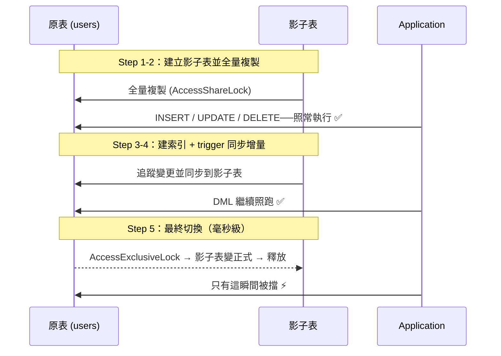
```mermaid
sequenceDiagram
    participant Orig as 原表 (users)
    participant Shadow as 影子表
    participant App as Application

    Note over Orig,Shadow: Step 1-2：建立影子表並全量複製
    Shadow->>Orig: 全量複製 (AccessShareLock)
    App->>Orig: INSERT / UPDATE / DELETE──照常執行 ✅

    Note over Orig,Shadow: Step 3-4：建索引 + trigger 同步增量
    Shadow->>Orig: 追蹤變更並同步到影子表
    App->>Orig: DML 繼續照跑 ✅

    Note over Orig,Shadow: Step 5：最終切換（毫秒級）
    Orig-->>Shadow: AccessExclusiveLock → 影子表變正式 → 釋放
    App->>Orig: 只有這瞬間被擋 ⚡
```

#### C. 常用命令

```bash
# 重整單表（回收 dead tuple 空間 + 重建索引）
pg_repack -t users -d mydb

# 只重整特定索引（索引肥大時不用重整全表）
pg_repack -i idx_users_email -d mydb

# 按指定 index 順序重排實體儲存（等同 CLUSTER 但不鎖表，範圍查詢效能大幅提升）
pg_repack -t users --order-by=users_pkey -d mydb
```

#### D. 與內建操作對比

| | `VACUUM FULL` | `CLUSTER` | `pg_repack` |
|---|---|---|---|
| 內建 | ✅ | ✅ | ❌（需 `CREATE EXTENSION pg_repack`） |
| 鎖等級 | `AccessExclusiveLock`（全程） | `AccessExclusiveLock`（全程） | 只在最後切換拿 `AccessExclusiveLock`（毫秒級） |
| SELECT 中斷 | 全程堵死 | 全程堵死 | 不堵（只在最後瞬間） |
| INSERT/UPDATE/DELETE 中斷 | 全程堵死 | 全程堵死 | 不堵（只在最後瞬間） |
| 回收空間 | ✅ | ✅ | ✅ |
| 重排實體順序 | ❌ | ✅ | ✅ |

#### E. 限制與注意事項

- **需要額外磁碟空間**：影子表等於原表大小（步驟 2~5 期間原表 + 影子表同時存在）
- **不能放在 transaction 內**：`pg_repack` 是一個獨立的 CLI 工具，不走 SQL
- **Superuser 權限**：需要建立 trigger、交換表名，必須 superuser
- **不支援某些表類型**：partitioned table 的個別 partition 可以，但不能對整個 partitioned table 操作

> 一句話：`pg_repack` = 不停機版的 `VACUUM FULL` + `CLUSTER`。它是 OLTP 環境中大表維護的標配工具，雖然需要額外安裝（`CREATE EXTENSION pg_repack`），但換來的是業務零中斷。

---

## 4. Lock Wait 追蹤與監控

> 來源：[digoal - PostgreSQL 锁等待跟踪 (2016-03-18)](https://github.com/digoal/blog/blob/master/201603/20160318_02.md)
> 更新於 2026-05-30，聚焦 PG 14+ 現代化監控技術棧

### I. 核心問題：lock wait time 被計入 total duration 但無拆分

`auto_explain` 記錄的 total duration 包含了 lock wait time，但未單獨拆分：

```
duration: 32038.420 ms  plan:
Update on test2 (actual time=32038.418..32038.418 rows=0 loops=1)
  ->  Seq Scan on test2 (actual time=0.014..0.015 rows=1 loops=1)
```

Seq Scan 本身只花了 0.015ms，但 total duration 高達 32 秒——全數為 lock wait 耗時。

> **新手白話**：`auto_explain` 就像一個計時器，但它只記錄「整個 SQL 從開始到結束花了多久」，不告訴你「其中有 99.99% 是在排隊等鎖」。這就像 Uber Eats 只告訴你「餐點 32 分鐘後送到」，但沒說「餐廳 1 分鐘就做好，外送員卡在紅綠燈 31 分鐘」——你只看到總時間 32 分鐘，根本不知道問題在哪。

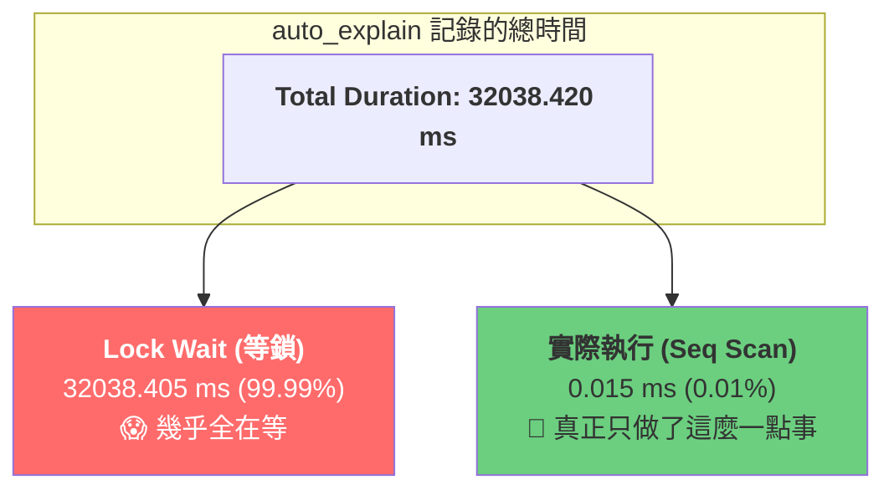
```mermaid
flowchart TD
    subgraph total["auto_explain 記錄的總時間"]
        T["<b>Total Duration: 32038.420 ms</b>"]
    end
    T --> LW["<b>Lock Wait (等鎖)</b><br/>32038.405 ms (99.99%)<br/>😱 幾乎全在等"]
    T --> CPU["<b>實際執行 (Seq Scan)</b><br/>0.015 ms (0.01%)<br/>📌 真正只做了這麼一點事"]

    style LW fill:#ff6b6b,color:#fff
    style CPU fill:#6bcf7f
```

### II. 方法一：log_lock_waits（事後分析，無需重編譯）

```ini
# postgresql.conf
log_lock_waits = on
deadlock_timeout = 1s
```

當 session 等待 lock 超過 `deadlock_timeout` 時，log 輸出：

```
LOG:  process 10220 still waiting for ShareLock on transaction 574614690 after 1000.036 ms
DETAIL:  Process holding the lock: 9725. Wait queue: 10220.
```

取得鎖之後：

```
LOG:  process 10220 acquired ShareLock on transaction 574614690 after 100194.020 ms
```

結合 auto_explain + log_lock_waits，可精確推算：總耗時 = lock wait + 實際運算。

> 搭配 `log_line_prefix = '%m [%p] %q%a '` 中的 `%p`（PID），可以在單條 log 中完成 PID → query → wait duration 的全鏈路追蹤。

### III. 方法二：pg_stat_activity 即時監控（現代推薦，PG 14+）

```sql
-- 找出所有正在等待 lock 的 session 及其等待時間
SELECT pid, usename, application_name,
       wait_event_type, wait_event,
       now() - wait_start AS wait_duration,
       pg_blocking_pids(pid) AS blocked_by,
       query
FROM pg_stat_activity
WHERE wait_event_type = 'Lock'
  AND state <> 'idle'
ORDER BY wait_start;
```

`pg_stat_activity` 在 PG 14 引入 `wait_start` 欄位後成為最強的即時排查工具——不再需要從 log 反推等待時間，直接就能看到「誰卡了多久」以及「誰在擋他」。

### IV. 兩種方法選擇

| 方法 | 適用場景 | 優勢 |
|------|---------|------|
| `log_lock_waits` | 日常監控、事後分析、告警基礎 | 自動寫入 PG log，不佔 CPU，適合 24x7 常駐；搭配 `deadlock_timeout` 控制記錄粒度 |
| `pg_stat_activity` | 即時排查、正在發生的問題 | 一鍵查出當前所有等待者、等待時間、blocking chain，零配置 |

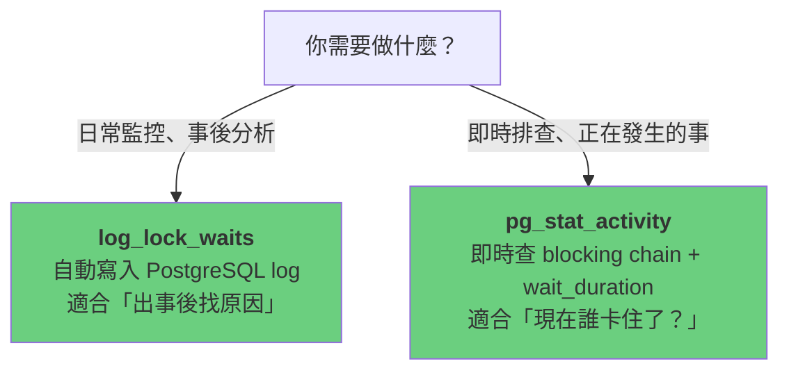
```mermaid
flowchart TD
    Q["你需要做什麼？"]
    Q -->|"日常監控、事後分析"| L1["<b>log_lock_waits</b><br/>自動寫入 PostgreSQL log<br/>適合「出事後找原因」"]
    Q -->|"即時排查、正在發生的事"| L2["<b>pg_stat_activity</b><br/>即時查 blocking chain + wait_duration<br/>適合「現在誰卡住了？」"]

    style L1 fill:#6bcf7f
    style L2 fill:#6bcf7f
```

### V. 生產環境配置

```ini
# postgresql.conf
log_lock_waits = on
deadlock_timeout = 1s
log_line_prefix = '%m [%p] %d %u '
```

```sql
-- 定期執行監控 query（cron / pg_cron）
SELECT pid, wait_event_type, wait_event,
       now() - wait_start AS wait_duration,
       pg_blocking_pids(pid) AS blocked_by,
       query
FROM pg_stat_activity
WHERE wait_event_type = 'Lock'
  AND now() - wait_start > '5s'::interval;
```

| 功能 | 引入版本 |
|------|---------|
| `pg_blocking_pids(pid)` | PG 9.6 |
| `wait_event_type` / `wait_event` | PG 9.6 |
| `log_lock_waits` 輸出附加 wait_event | PG 13 |
| `wait_start` | PG 14 |
| `pg_stat_activity.wait_for` | PG 17 |

> PG 14+ 的 `pg_stat_activity` 已覆蓋絕大多數日常需求——`wait_start` 直接顯示等待多久、`pg_blocking_pids()` 直接找出誰在擋。加上 `log_lock_waits` 做為補強（事後分析 / 告警），不需要再重編譯 PG 或使用 LOCK_DEBUG。

---

## 5. max_locks_per_transaction 與物件數量對效能的影響

> 來源：[digoal - max_locks_per_transaction & pg_locks entrys limit (2014-10-17)](https://github.com/digoal/blog/blob/master/201410/20141017_01.md)

### I. 問題：資料庫中物件越多效能越差嗎？

核心問題：PostgreSQL 中 table / index / sequence 等物件數量越多，單表操作的效能是否會下降？

答案分兩層：對於**單表操作**（DML），效能幾乎不受影響；真正的隱患在於 **catalog metadata 的記憶體佔用**與 **shared lock table 的插槽上限**。

> **名詞解釋：catalog metadata 的記憶體佔用**
>
> PostgreSQL 把每張表的結構資訊（欄位名、型別、index、constraint）存在系統表 `pg_class` / `pg_attribute` 等 catalog table 中。每個 backend connection 第一次訪問某張表時，會把這些 metadata 載入自己的記憶體快取（relcache）。relcache 是 **per-connection、不跨連線共享**的——100 個連線意味著同一份 table metadata 可能在記憶體中被複製了 100 份。
>
> **名詞解釋：shared lock table 的插槽**
>
> Lock Manager 在 shared memory 中維護一張固定大小的 hash table，每個「強鎖」（Level 3+，或發生衝突的弱鎖）需要在其中佔一個 slot。slot 總數由兩個參數決定：`max_locks_per_transaction ×（max_connections + max_prepared_transactions）`。slot 耗盡時 PG 報錯 `out of shared memory`——這不是 OS 記憶體真的用光，而是 lock table 的預留空間被填滿、無法再發出新鎖。

> **新手白話**：想像一個圖書館有 50 萬本書 vs 只有 1 本書。你要拿一本書來看（單表 DML），找書的速度幾乎一樣——因為有索引目錄。但問題是：50 萬本書的「目錄卡片」本身就佔了 35GB 的空間，而且每個進來的人（每個 connection）都要複製一份目錄到自己的腦袋裡（per-backend relcache），這樣一下子記憶體就爆了。

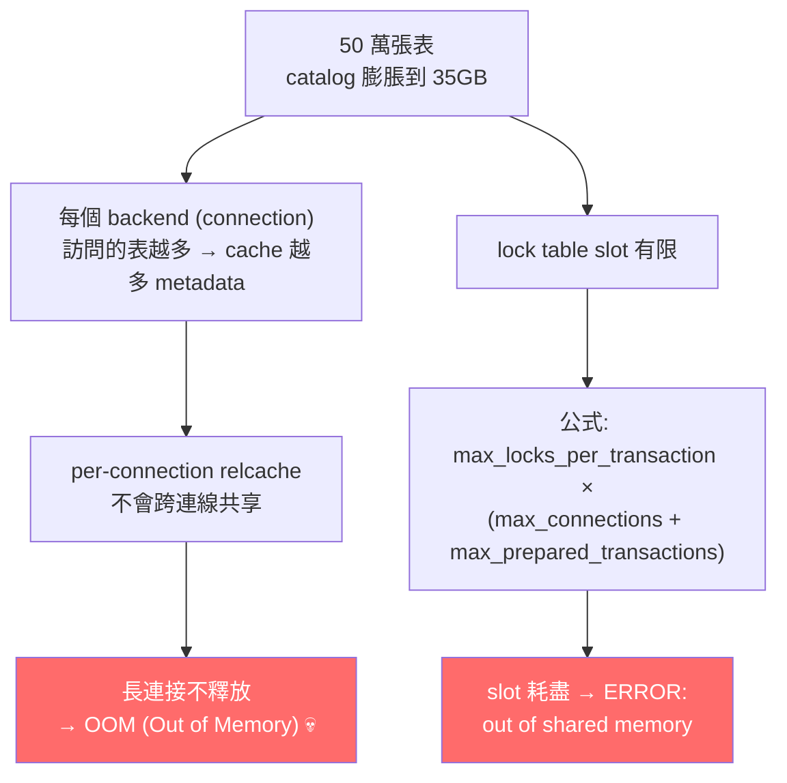
```mermaid
flowchart TD
    T["50 萬張表<br/>catalog 膨脹到 35GB"]
    T --> P1["每個 backend (connection)<br/>訪問的表越多 → cache 越多 metadata"]
    P1 --> P2["per-connection relcache<br/>不會跨連線共享"]
    P2 --> P3["長連接不釋放<br/>→ OOM (Out of Memory) 💀"]
    
    T --> S1["lock table slot 有限"]
    S1 --> S2["公式: max_locks_per_transaction ×<br/>(max_connections + max_prepared_transactions)"]
    S2 --> S3["slot 耗盡 → ERROR:<br/>out of shared memory"]
    
    style P3 fill:#ff6b6b,color:#fff
    style S3 fill:#ff6b6b,color:#fff
```

### II. 實驗：50 萬表 vs 1 張表的單表 DML

| 環境 | TPS | 差異 |
|------|-----|------|
| 50 萬表 | **39,231** | — |
| 1 張表 | **39,714** | +1.2% |

單表 DML 的效能差異幾乎在噪聲範圍內（~1.2%）。原因是 DML 執行時只會 lock 目標 table 對應的 catalog entry（已 cache 在 relcache 中），不會掃描整個 `pg_class`。

但建完 50 萬張表後，資料庫已達 **35 GB**（全為 catalog table 的 metadata）：

| Catalog Table | Row Count |
|--------------|-----------|
| `pg_class` | 2,000,322 |
| `pg_attribute` | 10,502,467 |

### III. 真正的隱患：Memory 與 Lock Slot 耗盡

**Catalog Cache（syscache + relcache）記憶體佔用：**

PostgreSQL 在 backend 啟動後首次訪問一個 relation 時，會將該 relation 的 catalog metadata 載入 `relcache`。cache 是 per-backend（per-connection）的，不會跨連接共享。

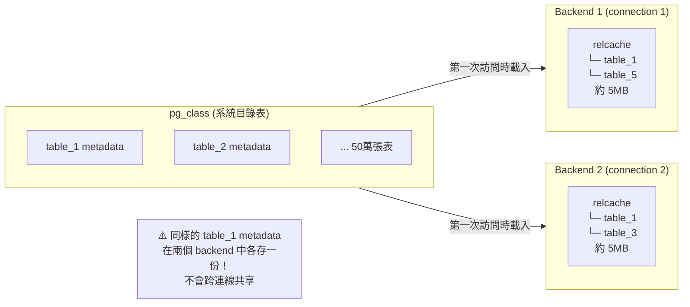
```mermaid
flowchart LR
    subgraph catalog["pg_class (系統目錄表)"]
        T1["table_1 metadata"]
        T2["table_2 metadata"]
        T3["... 50萬張表"]
    end

    subgraph backend1["Backend 1 (connection 1)"]
        C1["relcache<br/>└─ table_1<br/>└─ table_5<br/>約 5MB"]
    end

    subgraph backend2["Backend 2 (connection 2)"]
        C2["relcache<br/>└─ table_1<br/>└─ table_3<br/>約 5MB"]
    end

    catalog -->|"第一次訪問時載入"| backend1
    catalog -->|"第一次訪問時載入"| backend2

    Note1["⚠️ 同樣的 table_1 metadata<br/>在兩個 backend 中各存一份！<br/>不會跨連線共享"]
```

> **新手白話**：每個 connection (backend) 都有自己的「小抄」(relcache)，存著它訪問過的表的結構資訊。50 萬張表雖然存在資料庫裡，但只要你的連線只訪問其中幾張，就不會全部載入。但如果你用 `pg_dump` 或 ORM 初始化時的「全表掃描」，就會把目錄裡所有表的資訊都載入記憶體——每個連線一份！

**Application 層的放大效應：連線池讓 relcache 問題更嚴重**

如果你是 .NET 8 + Dapper + Npgsql 的開發者，這一點特別重要——因為你**幾乎一定在用連線池**：

| Client 寫法 | 底層 | PG 端 Backend 數量 | relcache 行為 |
|---|---|---|------|---|
| `new NpgsqlConnection()`（預設） | Npgsql Connection Pool，`Pooling=true`，預設 `MaxPoolSize=100` | 最多 100 個常駐 backend | 每個 backend 的 relcache 累積不釋放，100 份 metadata |
| `NpgsqlDataSource`（Npgsql 7.0+，.NET 8 推薦） | 同上，只是封裝更乾淨 | 同上 | 同上 |

連線池的核心問題：PG 端 backend 是 **長生命週期**（應用程式活著就不回收），每個 backend 的 relcache 只增不減。如果 ORM 初始化階段掃過所有表的 schema（Entity Framework Core 會，純 Dapper 不會），每個池連線都會載入全套 metadata。

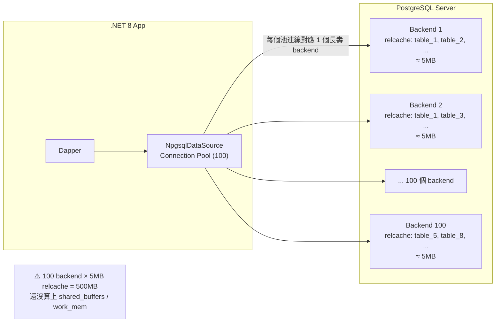
```mermaid
flowchart LR
    subgraph dotnet[".NET 8 App"]
        DAP["Dapper"]
        NP["NpgsqlDataSource<br/>Connection Pool (100)"]
        DAP --> NP
    end

    subgraph pg["PostgreSQL Server"]
        B1["Backend 1<br/>relcache: table_1, table_2, ...<br/>≈ 5MB"]
        B2["Backend 2<br/>relcache: table_1, table_3, ...<br/>≈ 5MB"]
        B3["... 100 個 backend"]
        B100["Backend 100<br/>relcache: table_5, table_8, ...<br/>≈ 5MB"]
    end

    NP -->|"每個池連線對應 1 個長壽 backend"| B1
    NP --> B2
    NP --> B3
    NP --> B100

    Note1["⚠️ 100 backend × 5MB relcache = 500MB<br/>還沒算上 shared_buffers / work_mem"]
```

> **NpgsqlDataSource vs PgBouncer 的差別：**
>
> Npgsql 的連線池是 **client 端池**——每個 client process 自己維護 100 條連線，直接通向 PG。如果有 5 個 app instance，PG 端就會有 500 個 backend。
>
> PgBouncer（transaction pooling 模式）是 **server 端池**——放在 PG 前面，把大量的 client connection 收斂到少量（例如 20 個）PG backend：

```
無 PgBouncer：
  .NET App × 5 → 各開 100 條連線 → PG Server 端 500 個 backend
  → 500 份 relcache → 記憶體爆炸

有 PgBouncer：
  .NET App × 5 → 各開 100 條連線 → PgBouncer (500 conns)
  → PgBouncer 只轉發到 PG 的 20 個 backend
  → 20 份 relcache → 記憶體安全
```

**對你的 stack 的具體建議：**

| 場景 | 建議 |
|------|------|
| 用 Dapper（純手寫 SQL，不掃 schema） | 連線池安全，relcache 只載入你實際訪問的表 |
| 用 EF Core（啟動時掃 `DbSet<>` 全部表） | 注意池大小，大量表時考慮 PgBouncer |
| 多 app instance 連同一個 PG | 必有 PgBouncer，否則 backend 數量 = 各 instance 池大小總和 |
| 表數量少（< 500 張） | 不需擔心，就算 100 backend 也吃不了多少記憶體 |

---

# 二、Advisory Lock 應用場景

## 1. Advisory Lock API 概述

PostgreSQL 的 Advisory Lock 是 application-level lock，不與 table/row 綁定，只認一個 `bigint key`（或兩個 `int key`）。適合跨多個 transaction 的協調、或需要自訂鎖語意的場景。

> **新手白話**：一般的鎖（前面介紹的那些）是 PG 自動幫你管理的——你執行 `UPDATE`，PG 自動拿 RowExclusiveLock。但 Advisory Lock（建議鎖）不一樣——它是你**手動控制的鎖**。你只需要決定一個「暗號」（一個數字 key），然後說「我要鎖住暗號 42」，PG 就幫你鎖住——跟表、跟 row 都沒關係，純粹是你自訂的協調機制。這就像去健身房用置物櫃：櫃子號碼是你自己選的，跟櫃子裡面放什麼無關。

### I. Session-Level Lock（會話鎖）

| 函數 | 說明 |
|------|------|
| `pg_advisory_lock(key)` | 獲取排他 session lock（blocking） |
| `pg_advisory_lock_shared(key)` | 獲取共享 session lock（blocking） |
| `pg_try_advisory_lock(key)` | 嘗試獲取排他 session lock（non-blocking） |
| `pg_try_advisory_lock_shared(key)` | 嘗試獲取共享 session lock（non-blocking） |
| `pg_advisory_unlock(key)` | 釋放排他 session lock |
| `pg_advisory_unlock_shared(key)` | 釋放共享 session lock |
| `pg_advisory_unlock_all()` | 釋放當前 session 的所有 advisory lock |

### II. Transaction-Level Lock（交易鎖）

| 函數 | 說明 |
|------|------|
| `pg_advisory_xact_lock(key)` | 獲取排他 transaction lock（blocking，transaction 結束自動釋放） |
| `pg_advisory_xact_lock_shared(key)` | 獲取共享 transaction lock（blocking） |
| `pg_try_advisory_xact_lock(key)` | 嘗試獲取排他 transaction lock（non-blocking） |
| `pg_try_advisory_xact_lock_shared(key)` | 嘗試獲取共享 transaction lock（non-blocking） |

關鍵區別：
- **Session lock**：需手動釋放，或 session 斷開時自動釋放。適合跨多個 transaction 的協調。
- **Transaction lock**：transaction commit/rollback 時自動釋放，不需手動管理。

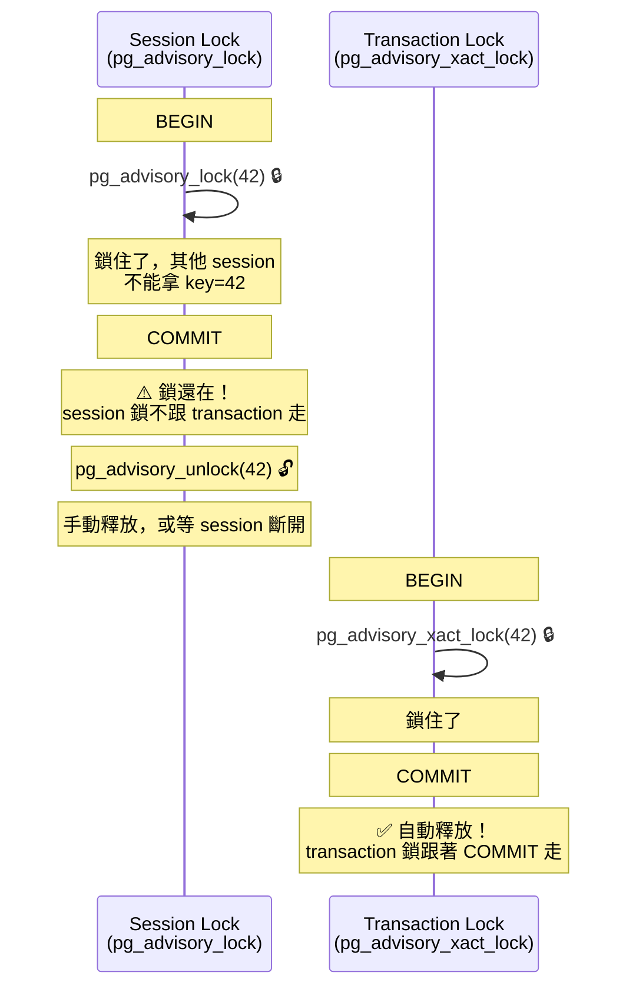
```mermaid
sequenceDiagram
    participant S as Session Lock<br/>(pg_advisory_lock)
    participant T as Transaction Lock<br/>(pg_advisory_xact_lock)

    Note over S: BEGIN
    S->>S: pg_advisory_lock(42) 🔒
    Note over S: 鎖住了，其他 session<br/>不能拿 key=42
    Note over S: COMMIT
    Note over S: ⚠️ 鎖還在！<br/>session 鎖不跟 transaction 走

    Note over S: pg_advisory_unlock(42) 🔓
    Note over S: 手動釋放，或等 session 斷開

    Note over T: BEGIN
    T->>T: pg_advisory_xact_lock(42) 🔒
    Note over T: 鎖住了
    Note over T: COMMIT
    Note over T: ✅ 自動釋放！<br/>transaction 鎖跟著 COMMIT 走
```

> **選擇建議**：如果你需要「一筆交易裡拿到鎖，交易結束自動釋放」→ 用 **Transaction lock**（`xact` 系列）。如果你需要「跨多筆交易保持鎖定」→ 用 **Session lock**，但要記得手動 `unlock`，不然會鎖到 session 斷開。

> **我什麼時候會真的用到 Advisory Lock？——四場景決策表**
>
> Advisory Lock 不是日常 CRUD 會碰到的東西——一般 `INSERT` / `UPDATE` / `DELETE` 的鎖都是 PG 自動管理。只有當你需要「**手動協調跨交易 / 跨 session 的互斥邏輯**」時才需要它。以下四個場景是實戰中最常見的：
>
> | 場景 | 核心問題 | Advisory Lock 的角色 | 有沒有更簡單的替代方案？ |
> |------|---------|---------------------|----------------------|
> | **高並發批次更新**（§2） | 100 個 session 同時更新 10,000 rows，如何不撞行？ | `pg_try_advisory_xact_lock(row_id)` 當作「這行我先搶了」的令牌 | `SKIP LOCKED`（PG 9.5+，更簡單，純 SQL） |
> | **秒殺 / 限量搶購**（§3） | 1000 人搶 10 件商品，沒搶到的人應立刻知道失敗 | `FOR UPDATE NOWAIT` 或 `SKIP LOCKED` 讓沒拿到鎖的 session 立刻失敗 | 無，這兩者就是標準解法 |
> | **OLTP 並發控管**（§4） | 8000 個連線同時搶 CPU，如何限制真正並行的數量？ | Advisory lock 當作「令牌」，只有拿到的人可以執行 SQL，其他人 sleep | PgBouncer transaction pooling（根本解，但需額外部署） |
> | **無縫自增 ID**（§5） | 需要沒有空洞的遞增流水號（如發票號碼），SEQUENCE 會有洞 | `pg_try_advisory_xact_lock(id)` 確保每個 ID 只被一個人寫入 | `SERIAL`（有空洞但效能好 10 倍，99% 場景用這個就夠） |
>
> **一句話決策**：如果你可以用 PG 內建的 `SKIP LOCKED` / `FOR UPDATE NOWAIT` / `SERIAL` 解決，就不要用 Advisory Lock。它能做到的事幾乎都有更簡單的替代方案——除非你需要的協調邏輯跨越多張表、或超出 row lock 能表達的範圍（如 §4 的令牌控管）。

> Lock 數量無上限（不佔 `max_locks_per_transaction` slot，advisory lock 使用獨立的 shared memory hash table）。PG 9.6+ 可透過 `pg_locks` 查看：`SELECT * FROM pg_locks WHERE locktype = 'advisory'`。

---

## 2. 高並發全表更新：SKIP LOCKED 實戰

> 來源：[digoal - PostgreSQL 使用advisory lock或skip locked消除行锁冲突 (2016-10-18)](https://github.com/digoal/blog/blob/master/201610/20161018_01.md)

### I. 場景

4GB 表，10,000 row，每 row 存大型 array。全表所有 row 需要週期性更新。單一 transaction 更新全表需 **80 秒**。目標：100 個 concurrent session 並行更新，每個 session 負責不同的 row subset，無 row lock conflict。

> **新手白話**：一個人更新 10,000 行要 80 秒。如果你開 100 個人同時更新，理論上只要 0.8 秒——但前提是每個人更新「不同」的行，避免互相搶同一行的鎖。核心問題是：如何確保 100 個 session 不會同時搶到同一行？

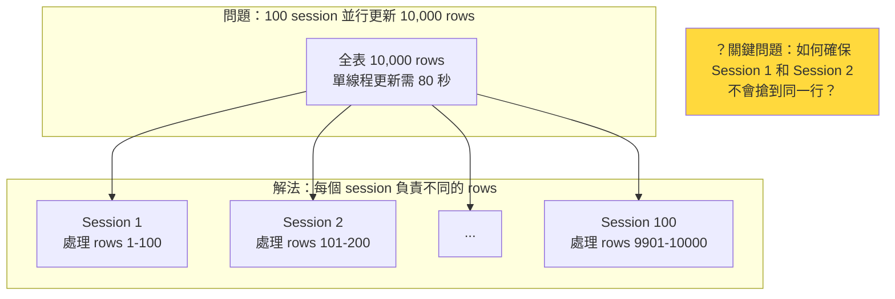
```mermaid
flowchart TD
    subgraph problem["問題：100 session 並行更新 10,000 rows"]
        T["全表 10,000 rows<br/>單線程更新需 80 秒"]
    end

    subgraph solution["解法：每個 session 負責不同的 rows"]
        S1["Session 1<br/>處理 rows 1-100"]
        S2["Session 2<br/>處理 rows 101-200"]
        S3["..."]
        S4["Session 100<br/>處理 rows 9901-10000"]
    end

    T --> S1
    T --> S2
    T --> S3
    T --> S4

    Q["？關鍵問題：如何確保<br/>Session 1 和 Session 2<br/>不會搶到同一行？"]
    
    style Q fill:#ffd93d
```

**解法**：`SKIP LOCKED`——PG 內建機制，自動跳過被鎖的行，純 SQL 不須額外管理。

### II. SKIP LOCKED 核心用法

每次拿一批未被鎖定的行來處理，被別人鎖住的直接跳過：

```sql
-- 拿 1 行來處理（queue / job 模式）
SELECT id INTO v_id FROM table
ORDER BY id LIMIT 1
FOR UPDATE SKIP LOCKED;

-- 拿 100 行批次處理（batch 模式）
WITH batch AS (
    SELECT id FROM table
    WHERE id > :last_id ORDER BY id LIMIT 100
    FOR UPDATE SKIP LOCKED
)
UPDATE table t SET info = array_append(info, 1)
FROM batch b WHERE t.id = b.id;
```

**實際演練：一張 10 行的小表，三個 session 並行**

```sql
-- 環境準備：
CREATE TABLE jobs (id INT PRIMARY KEY, status TEXT DEFAULT 'pending');
INSERT INTO jobs (id) VALUES (1),(2),(3),(4),(5),(6),(7),(8),(9),(10);
SELECT * FROM jobs ORDER BY id;

-- 輸出：
--  id | status
-- ----+---------
--   1 | pending
--   2 | pending
--   3 | pending
--   4 | pending
--   5 | pending
--   6 | pending
--   7 | pending
--   8 | pending
--   9 | pending
--  10 | pending
-- (10 rows)
```

接著 Session A 先拿 3 行，鎖定 id 1~3（尚未 COMMIT）：

```sql
-- Session A
BEGIN;
SELECT id FROM jobs ORDER BY id LIMIT 3 FOR UPDATE SKIP LOCKED;
-- 輸出：
--  id   ← Session A 拿到並鎖定了 id 1, 2, 3
-- ----
--   1
--   2
--   3
-- (3 rows)
```

Session B 也來要 5 行，但 id 1~3 被 Session A 鎖著，自動跳過：

```sql
-- Session B
BEGIN;
SELECT id FROM jobs ORDER BY id LIMIT 5 FOR UPDATE SKIP LOCKED;
-- 輸出：
--  id   ← 跳過了 1,2,3，從 4 開始拿，B 鎖定了 4,5,6,7,8
-- ----
--   4
--   5
--   6
--   7
--   8
-- (5 rows)
```

Session C 再來要 10 行，只剩 9, 10 還沒被鎖：

```sql
-- Session C
BEGIN;
SELECT id FROM jobs ORDER BY id LIMIT 10 FOR UPDATE SKIP LOCKED;
-- 輸出：
--  id   ← 1~8 都已鎖，只拿到 9, 10
-- ----
--   9
--  10
-- (2 rows)
```

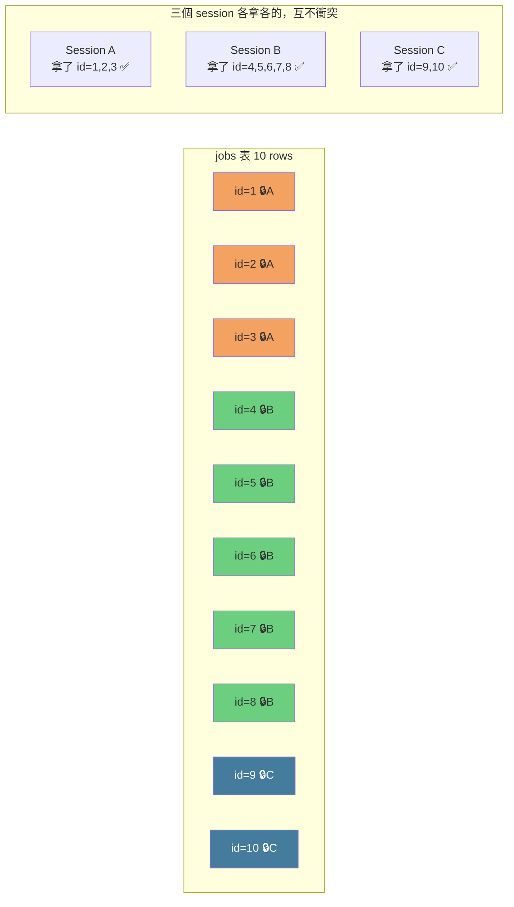
```mermaid
flowchart LR
    subgraph all["jobs 表 10 rows"]
        direction LR
        R1["id=1 🔒A"]
        R2["id=2 🔒A"]
        R3["id=3 🔒A"]
        R4["id=4 🔒B"]
        R5["id=5 🔒B"]
        R6["id=6 🔒B"]
        R7["id=7 🔒B"]
        R8["id=8 🔒B"]
        R9["id=9 🔒C"]
        R10["id=10 🔒C"]
    end

    subgraph sessions["三個 session 各拿各的，互不衝突"]
        SA["Session A<br/>拿了 id=1,2,3 ✅"]
        SB["Session B<br/>拿了 id=4,5,6,7,8 ✅"]
        SC["Session C<br/>拿了 id=9,10 ✅"]
    end

    style R1 fill:#f4a261
    style R2 fill:#f4a261
    style R3 fill:#f4a261
    style R4 fill:#6bcf7f
    style R5 fill:#6bcf7f
    style R6 fill:#6bcf7f
    style R7 fill:#6bcf7f
    style R8 fill:#6bcf7f
    style R9 fill:#457b9d,color:#fff
    style R10 fill:#457b9d,color:#fff
```

**關鍵觀察：**
- 三個 session 拿到的 row **完全不重疊**——沒有 row lock conflict，沒有等待
- Session B 拿 5 行只出了 5 行（跳過 3 行被鎖定的），Session C 拿 10 行只出了 2 行
- 如果你的 business 邏輯吃 `LIMIT` 拿不到足夠行數，有兩種應對：`LIMIT` 等於 0 代表全表處理完畢，可以結束；或者降低每個 session 的 `LIMIT`，讓更多 session 都有工作

**`FOR UPDATE` 拿到的鎖什麼時候釋放？**

取決於你有沒有包在 `BEGIN ... COMMIT` 裡：

| 情境 | 鎖釋放時機 | 典型用法 |
|------|-----------|---------|
| 顯式 Transaction（`BEGIN`） | `COMMIT` 或 `ROLLBACK` 時釋放 | Queue / Job 模式——拿行 → 處理 → 標記完成 → `COMMIT`，處理期間鎖全程持有，防止別人重複拿同一行 |
| Autocommit（裸 SQL，無 `BEGIN`） | 該條 SQL 執行完**立刻釋放** | 只讀不寫的查詢——拿完就放，下一條 SQL 再拿新的 |

上例中三個 session 都寫了 `BEGIN` 但沒 `COMMIT`——那些 `🔒` 標記的 row 鎖**還在持有中**。實戰中應在最前面例子之後立刻 `UPDATE ... SET status = 'done' WHERE id = :id`，然後 `COMMIT`——整個過程一氣呵成。

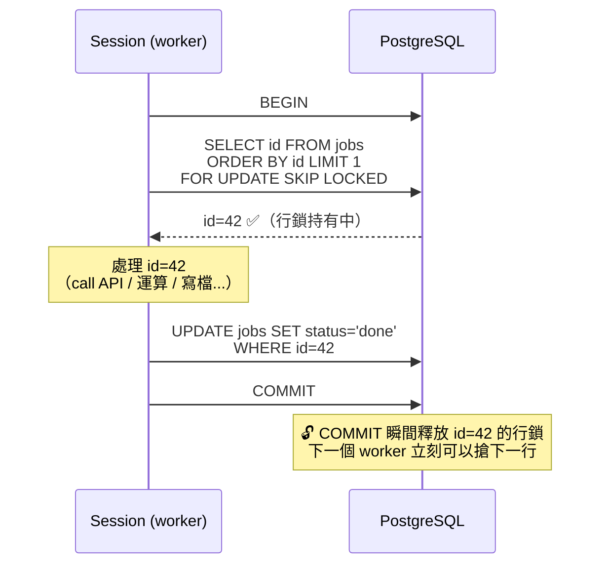
```mermaid
sequenceDiagram
    participant S as Session (worker)
    participant DB as PostgreSQL

    S->>DB: BEGIN
    S->>DB: SELECT id FROM jobs<br/>ORDER BY id LIMIT 1<br/>FOR UPDATE SKIP LOCKED
    DB-->>S: id=42 ✅（行鎖持有中）

    Note over S: 處理 id=42<br/>（call API / 運算 / 寫檔...）

    S->>DB: UPDATE jobs SET status='done'<br/>WHERE id=42
    S->>DB: COMMIT
    Note over DB: 🔓 COMMIT 瞬間釋放 id=42 的行鎖<br/>下一個 worker 立刻可以搶下一行
```

> **關鍵**：如果忘了 `COMMIT`（或處理過程中 crash），行鎖會懸掛直到 session 斷開或 `idle_in_transaction_session_timeout` 觸發。這也是為什麼前面的例子都寫了 `BEGIN` 沒寫 `COMMIT`——為了展示鎖的持有狀態。生產上務必在處理完後 `COMMIT`。

Benchmark（100 並行）：latency average = 4,204ms（vs 80s 單線程 → 18x 加速）。

### III. 分片 + SKIP LOCKED（大規模場景）

當 row 數量極大，每個 session 有固定責任範圍（`mod(id, N)`），不需掃描全表：

```sql
SELECT id FROM table
WHERE mod(id, 4) = :shard_id
ORDER BY id LIMIT 100
FOR UPDATE SKIP LOCKED;
```

每個 session 只掃它負責的分片，`SKIP LOCKED` 進一步保證即使分片內有行被別的 session 鎖住也不會卡住。

---

## 3. 秒殺場景優化：NOWAIT 與 SKIP LOCKED

> 來源：[digoal - PostgreSQL 秒杀场景优化 (2015-09-14)](https://github.com/digoal/blog/blob/master/201509/20150914_01.md)

### I. 核心問題

秒殺場景典型瓶頸：多個 concurrent session 同時更新同一條 record，獲得 row lock 的 session 處理期間，其他 session 全部等待——對於沒搶到鎖的用戶，等待毫無意義。

> **新手白話**：秒殺就像限量球鞋發售——1000 個人搶 10 雙鞋，但櫃檯一次只能服務一個人。
> - **傳統做法（無優化）**：所有人排成一條長隊，第 1 人買走第 1 雙（庫存 9）→ 第 2 人買走第 2 雙 → ... → 第 10 人買走最後一雙。**第 11~1000 人排了老半天，輪到櫃檯才被告知「賣完了」**——白排一場，DB 裡的 row lock queue 塞滿了 990 個無意義的等待。
> - **NOWAIT / SKIP LOCKED 做法**：跑到櫃檯看一眼，若櫃檯有人在辦就立刻回頭（不排隊），稍後再衝。櫃檯前永遠不卡人龍。

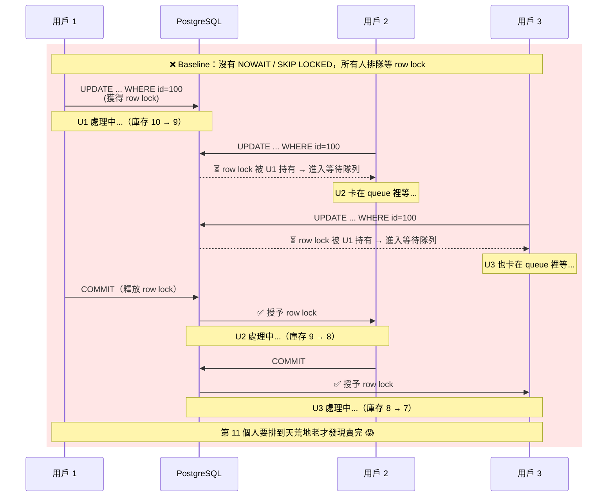
```mermaid
sequenceDiagram
    participant U1 as 用戶 1
    participant DB as PostgreSQL
    participant U2 as 用戶 2
    participant U3 as 用戶 3

    rect rgb(255, 230, 230)
    Note over U1,U3: ❌ Baseline：沒有 NOWAIT / SKIP LOCKED，所有人排隊等 row lock

    U1->>DB: UPDATE ... WHERE id=100<br/>(獲得 row lock)
    Note over U1,DB: U1 處理中...（庫存 10 → 9）

    U2->>DB: UPDATE ... WHERE id=100
    DB-->>U2: ⏳ row lock 被 U1 持有 → 進入等待隊列
    Note over U2: U2 卡在 queue 裡等...

    U3->>DB: UPDATE ... WHERE id=100
    DB-->>U3: ⏳ row lock 被 U1 持有 → 進入等待隊列
    Note over U3: U3 也卡在 queue 裡等...

    U1->>DB: COMMIT（釋放 row lock）
    DB->>U2: ✅ 授予 row lock
    Note over U2,DB: U2 處理中...（庫存 9 → 8）
    U2->>DB: COMMIT
    DB->>U3: ✅ 授予 row lock
    Note over U3,DB: U3 處理中...（庫存 8 → 7）

    Note over U1,U3: 第 11 個人要排到天荒地老才發現賣完 😱
    end
```

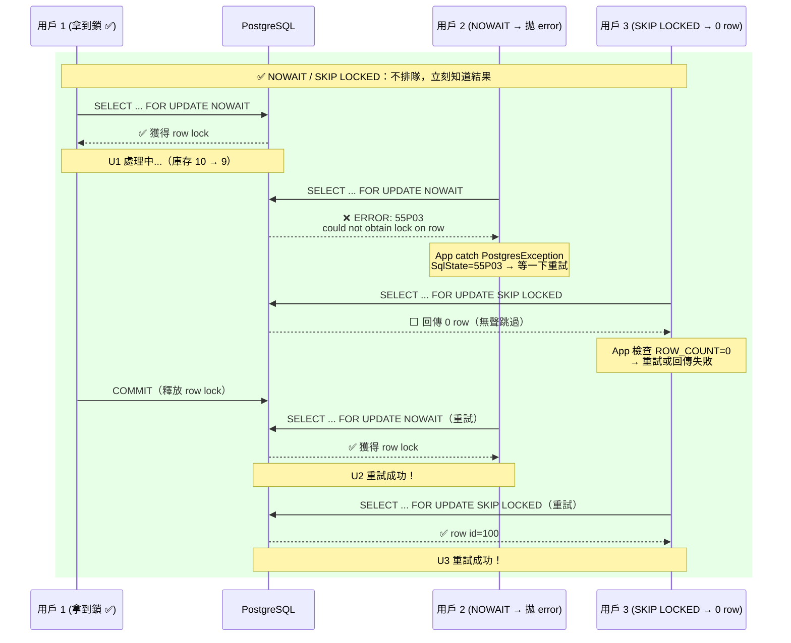
```mermaid
sequenceDiagram
    participant U1 as 用戶 1 (拿到鎖 ✅)
    participant DB as PostgreSQL
    participant U2 as 用戶 2 (NOWAIT → 拋 error)
    participant U3 as 用戶 3 (SKIP LOCKED → 0 row)

    rect rgb(230, 255, 230)
    Note over U1,U3: ✅ NOWAIT / SKIP LOCKED：不排隊，立刻知道結果

    U1->>DB: SELECT ... FOR UPDATE NOWAIT
    DB-->>U1: ✅ 獲得 row lock
    Note over U1,DB: U1 處理中...（庫存 10 → 9）

    U2->>DB: SELECT ... FOR UPDATE NOWAIT
    DB-->>U2: ❌ ERROR: 55P03<br/>could not obtain lock on row
    Note over U2: App catch PostgresException<br/>SqlState=55P03 → 等一下重試

    U3->>DB: SELECT ... FOR UPDATE SKIP LOCKED
    DB-->>U3: ⬜ 回傳 0 row（無聲跳過）
    Note over U3: App 檢查 ROW_COUNT=0<br/>→ 重試或回傳失敗

    U1->>DB: COMMIT（釋放 row lock）

    U2->>DB: SELECT ... FOR UPDATE NOWAIT（重試）
    DB-->>U2: ✅ 獲得 row lock
    Note over U2,DB: U2 重試成功！

    U3->>DB: SELECT ... FOR UPDATE SKIP LOCKED（重試）
    DB-->>U3: ✅ row id=100
    Note over U3,DB: U3 重試成功！
    end
```

### II. 方案一：FOR UPDATE NOWAIT（拋例外、App 重試）

拿到鎖就處理，拿不到鎖 PG 直接拋 error，不進等待隊列：

```sql
BEGIN;
SELECT * FROM t1 WHERE id = :id FOR UPDATE NOWAIT;
-- 拿到鎖 → 更新庫存
UPDATE t1 SET stock = stock - 1 WHERE id = :id AND stock > 0;
COMMIT;
```

拿不到鎖時 PG 回傳：
```
ERROR:  could not obtain lock on row in relation "t1"
```

App 端處理：
```csharp
// C# / Dapper 範例
while (retries < maxRetries)
{
    try
    {
        await using var tx = await conn.BeginTransactionAsync();
        var row = await conn.QuerySingleOrDefaultAsync<Product>(
            "SELECT * FROM t1 WHERE id = @id FOR UPDATE NOWAIT", new { id });
        if (row?.Stock <= 0) break;
        await conn.ExecuteAsync(
            "UPDATE t1 SET stock = stock - 1 WHERE id = @id AND stock > 0", new { id });
        await tx.CommitAsync();
        return "搶購成功";
    }
    catch (PostgresException ex) when (ex.SqlState == "55P03")
    {
        // 55P03 = lock_not_available → 等一下重試
        await Task.Delay(Random.Shared.Next(10, 50));
    }
}
return "搶購失敗";
```

> PG 內部對應的 error code 是 `55P03`（`lock_not_available`）。App 用這個 code 判斷是 lock 衝突（重試）還是其他錯誤（log 告警）。

### III. 方案二：FOR UPDATE SKIP LOCKED（拋 0 row、App 判斷）

同樣的邏輯，但拿不到鎖時不拋 error，而是回傳 0 row——App 端用 row count 判斷：

```sql
WITH locked AS (
    SELECT id FROM t1
    WHERE id = :id AND stock > 0
    LIMIT 1
    FOR UPDATE SKIP LOCKED
)
UPDATE t1 SET stock = stock - 1
FROM locked WHERE t1.id = locked.id
RETURNING t1.id;
```

如果 `RETURNING` 沒回傳任何 row = 有人正在處理這行，App 端重試或回傳失敗。

### IV. 選擇對比

| | `FOR UPDATE NOWAIT` | `FOR UPDATE SKIP LOCKED` |
|---|---|---|
| 拿不到鎖時 | 拋 `ERROR: could not obtain lock`（`SqlState: 55P03`） | 回傳 0 row（靜默跳過） |
| App 端判斷 | `try-catch`，檢查 `SqlState == "55P03"` | 檢查 `ROW_COUNT == 0` 或 `RETURNING` 是否為空 |
| 語意 | 「有人在處理，你等一下再來」 | 「有人在處理，你沒搶到」 |
| 適用場景 | 秒殺（必須拿到才繼續），需要明確 error 做 log / 告警 | 秒殺（同上），Queue 批次處理（見 §2） |
| Benchmark（128 並行） | TPS = 66,623（提升 23x vs baseline 2,855） | 與 NOWAIT 相當 |

> **現代建議**：秒殺場景 `NOWAIT` 和 `SKIP LOCKED` 都可用，效能相當。選 NOWAIT 的時機是你需要明確的 error log / 監控告警；選 SKIP LOCKED 的時機是你偏好用 row count 做流程控制、不想寫 try-catch。99% 的秒殺場景這兩者擇一即可，不需 Advisory Lock。

### V. 分段庫存（提高並發上限）

如果全部庫存存在單一 row，row lock 本身就是瓶頸（同一秒只有一個人能鎖那行）。生產上常見的解法是**把庫存打散成 N 條 record**，每個 session 隨機選一條來扣：

```sql
-- 1000 雙鞋拆成 100 條 record，每條存 10 雙
UPDATE t1 SET stock = stock - 1
WHERE id = (SELECT id FROM t1 WHERE stock > 0
            ORDER BY random() LIMIT 1
            FOR UPDATE SKIP LOCKED)
  AND stock > 0
RETURNING id;
```

N 條 record = N 倍的並發吞吐量。代價是總庫存管理變複雜（需要 SUM 才能知道總量），但對秒殺場景來說這個 trade-off 通常值得。

---

## 4. OLTP 高並發排隊：Advisory Lock Admission Control

> 來源：[digoal - PostgreSQL OLTP 高並發請求性能優化 (2015-10-08)](https://github.com/digoal/blog/blob/master/201510/20151008_01.md)

### I. 核心問題：並發數超過 CPU 核數後 TPS 急降

在多核系統中，當 concurrent 數超過 CPU 核數的 2~3 倍後，效能開始下降。原因疊加：
1. Context switching 開銷：backend process 數量遠超 CPU 核數
2. Snapshot 管理成本：每個 active backend 都需建立 snapshot（ProcArrayLock contention）
3. Lock contention：大量 backend 同時競爭 row-level lock
4. Memory 壓力：每個 backend 消耗 ~5-10 MB

> **新手白話**：想像一個廚房有 4 個爐子（=CPU 核數）。如果有 4 個廚師同時做菜，效率最高。但如果你塞 400 個廚師進去，大家搶爐子、撞來撞去（context switch）、每個人都要排隊拿鍋鏟（lock contention）——反而一道菜都做不出來。這就是「並發數超過 CPU 後 TPS 反而下降」的原因。

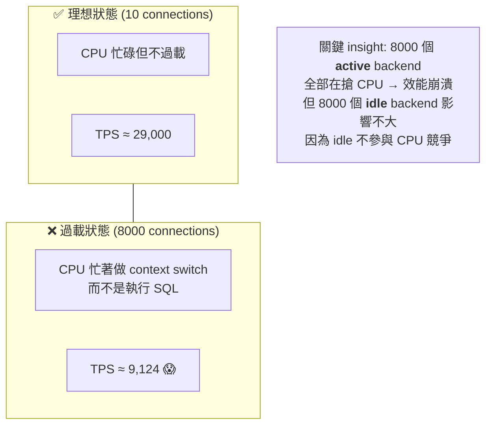
```mermaid
flowchart TD
    subgraph good["✅ 理想狀態 (10 connections)"]
        CPU_G["CPU 忙碌但不過載"]
        TPS_G["TPS ≈ 29,000"]
    end

    subgraph bad["❌ 過載狀態 (8000 connections)"]
        CPU_B["CPU 忙著做 context switch<br/>而不是執行 SQL"]
        TPS_B["TPS ≈ 9,124 😱"]
    end

    good --- bad
    note["關鍵 insight: 8000 個 <b>active</b> backend<br/>全部在搶 CPU → 效能崩潰<br/>但 8000 個 <b>idle</b> backend 影響不大<br/>因為 idle 不參與 CPU 競爭"]
```

### II. 實驗：8000 active vs idle

**8000 active backend 全部執行 UPDATE：** TPS ≈ **9,124**（大部分時間消耗在 CPU scheduling）

**10 active + 7990 idle backend：** TPS ≈ **29,000**（idle connection 對效能幾乎無影響）

> 關鍵結論：只有真正執行 SQL 的 backend 才會參與 CPU 競爭。8000 idle 連接只佔用 memory（每個 backend 約 2~5MB，8,000 個 ≈ 16~40GB，若 catalog 膨脹則更高），不參與 ProcArray lock / snapshot 競爭。

### III. .NET 8 + NpgsqlDataSource：為什麼會有 7990 個 idle backend

這是每個 .NET 開發者都該理解的核心機制：**你的 app 有幾條連線，PG 端就有幾個 backend**——而且它們不會自動回收。

#### A. 連線池的本質

NpgsqlDataSource（Npgsql 7.0+）在底層就是一個**連線池**（connection pool）。預設行為：你的 app 有幾條池內連線，PG 端就有幾個 backend——而且它們不會自動回收。

> **為什麼「不會自動回收」？兩層原因疊加：**
>
> 1. **Npgsql 端**：`Dispose()` 是歸還到池，不是關閉 TCP。連線會一直活著直到 `Connection Idle Lifetime`（預設 300 秒）過期後，Npgsql 才會在下一次 `Pruning Interval`（每 10 秒）檢查時真正關閉它。300 秒內如果 app 又發請求，同一條連線繼續復用——對 PG 來說那條 backend 從頭到尾沒斷過。
>
> 2. **PG 端**：`idle_session_timeout` 預設值是 `0`（**關閉**）。意思是 PG 不會主動 kill 任何 idle 連線——就算它從尖峰過後閒置了 3 小時也一樣。只有當 Npgsql 端主動關閉 TCP（或因 app crash 導致 TCP RST），PG 才會回收那條 backend。
>
> 兩層都沒設回收閾值 → backend 活到天荒地老。

```csharp
// 建立 DataSource（全 app 共用一個 singleton）
var dataSource = NpgsqlDataSource.Create(builder.ConnectionString);

// 每次拿連線都是從池裡取（或新建）
await using var conn = await dataSource.OpenConnectionAsync();
// ... 執行 SQL ...
await using var cmd = new NpgsqlCommand("SELECT 1", conn);
await cmd.ExecuteScalarAsync();
// Dispose 時連線「歸還」到池，不真正關閉
```

關鍵參數（在 connection string 裡）：

| 參數 | 預設值 | 含義 |
|------|:--:|------|
| `Pooling` | `true` | 開啟連線池 |
| `Max Pool Size` | `100` | 每個 DataSource 最多 100 條實體 TCP 連線 |
| `Min Pool Size` | `0` | 池裡最少保持幾條連線；0 = 閒置過久會斷開 |
| `Connection Idle Lifetime` | `300`（秒） | 池內閒置連線超過此時間會被清除 |
| `Connection Pruning Interval` | `10`（秒） | 每 10 秒檢查一次池內是否需要清除 |

#### B. 一條連線的一生（從 Open 到 Dispose）

```mermaid
sequenceDiagram
    participant CSharp as .NET 8 App
    participant Pool as Npgsql Connection Pool
    participant PG as PostgreSQL Server

    Note over CSharp,PG: 1. 建立 DataSource（singleton）
    CSharp->>Pool: new NpgsqlDataSource(...)
    Note over Pool: 池是空的（Min Pool Size = 0）

    Note over CSharp,PG: 2. 第一次 OpenConnection
    CSharp->>Pool: await OpenConnectionAsync()
    Pool->>PG: 建立 TCP 連線（3-way handshake）
    PG-->>Pool: ✅ Backend PID=12345 啟動
    Pool-->>CSharp: 交給你一條連線

    Note over CSharp,PG: 3. 執行 SQL
    CSharp->>PG: conn.ExecuteScalarAsync("SELECT 1")
    Note over PG: state = 'active'
    PG-->>CSharp: 1

    Note over CSharp,PG: 4. 跑完 SQL，還沒 Dispose
    Note over PG: state = 'idle' ← 連線活著但不做事
    Note over CSharp: C# 可能在處理 JSON、call API...

    Note over CSharp,PG: 5. Dispose Connection
    CSharp->>Pool: conn.DisposeAsync()
    Note over Pool: 連線歸還到池
    Note over PG: state = 'idle' ← 還是 idle！
    Note over Pool: 這條 TCP 連線還活著，等下次有人要

    Note over CSharp,PG: 6. 第二次 OpenConnection
    CSharp->>Pool: await OpenConnectionAsync()
    Note over Pool: 池裡有現成的連線 → 秒給
    Pool-->>CSharp: 同一條 TCP 連線（PID=12345）
    Note over PG: 沒新 backend 啟動
```

**關鍵洞察**：`Dispose()` 不是關閉 TCP 連線，是把連線「還給池」。PG 端那條 backend 仍然活著，`state = 'idle'`，直到 `Connection Idle Lifetime`（預設 300 秒）過後才被 Npgsql 真正關閉。

#### C. 7990 idle 是怎麼來的

```
一個 .NET 8 app instance
  → 1 個 NpgsqlDataSource（singleton）
  → 尖峰時 100 個 concurrent request 同時要連線
  → Npgsql 開了 100 條 TCP 連線到 PG
  → 尖峰過後，只剩下 10 個 request
  → 90 條連線還待在池裡（沒過 Idle Lifetime）
  → PG 端那 90 個 backend 全部 state = 'idle'

5 個 app instance × 每個 100 條池連線 = 500 個 backend 常駐 PG
20 個 app instance × 100 = 2000 個 backend
...
```

```mermaid
flowchart TD
    subgraph apps[".NET 8 App Instances"]
        A1["App 1<br/>Pool: 100 conns"]
        A2["App 2<br/>Pool: 100 conns"]
        A3["App 3<br/>Pool: 100 conns"]
        A4["..."]
    end

    subgraph pg["PostgreSQL Server"]
        B1["Backend 1..100 ← App1"]
        B2["Backend 101..200 ← App2"]
        B3["Backend 201..300 ← App3"]
        STATUS["尖峰過了，200 條連線 idle<br/>佔用記憶體但不吃 CPU"]
    end

    A1 --> B1
    A2 --> B2
    A3 --> B3
```

#### D. idle 與 idle in transaction 的天壤之別

```
state = 'idle'
  → 連線開著、連線池留著、TCP 沒斷
  → PG 端 backend 在等下一條 SQL
  → 不持鎖、不擋人、只佔記憶體
  → 「你沒在用但車子沒熄火」

state = 'idle in transaction'
  → 有未 COMMIT 的交易（你開了 DbTransaction 但忘了 Commit）
  → 所有拿過的鎖（AccessShareLock、RowExclusiveLock、xmax）還在
  → 會擋 DDL、可能引發 lock queue pileup
  → 「車子沒熄火而且橫停在馬路中間」
```

```csharp
// ❌ 最常見的 idle in transaction 製造機
await using var conn = await dataSource.OpenConnectionAsync();
await using var tx = await conn.BeginTransactionAsync();  // BEGIN

await conn.ExecuteAsync("UPDATE users SET name = @n WHERE id = @id", ...);

var result = await httpClient.GetAsync("https://slow-api/path");  // ← 3 秒！

await tx.CommitAsync();  // 這 3 秒內，整條 row lock 掛在 PG 上
```

> **鐵律**：`BeginTransactionAsync` 和 `CommitAsync` 之間不能有任何 IO（HTTP call、file read、Redis）、不能有任何非 SQL 的 CPU 運算。鎖的生命週期 = 這兩行之間的距離。

### IV. 解法：Advisory Lock Admission Control

**為什麼這個場景只能用 Advisory Lock？**

§2 和 §3 的解法（`SKIP LOCKED` / `FOR UPDATE NOWAIT`）都依賴一個前提：**你有一行可以鎖**。但 Admission Control 要限流的是「同時執行的 transaction 數量」——這是一個抽象概念，沒有具體的 row 可以讓你 `FOR UPDATE`。Advisory Lock 正是為這種場景設計的：用一個數字 key 代表「執行資格令牌」。

```sql
CREATE OR REPLACE FUNCTION upd(l INT, v_id INT) RETURNS void AS $$
BEGIN
    LOOP
        IF pg_try_advisory_xact_lock(l) THEN
            -- 拿到令牌，可以執行 SQL
            UPDATE test_8000 SET cnt = cnt + 1 WHERE id = v_id;
            UPDATE test_8000 SET cnt = cnt + 2 WHERE id = v_id;
            RETURN;  -- COMMIT 後自動釋放令牌
        ELSE
            -- 沒拿到令牌，隨機 sleep 後重試
            PERFORM pg_sleep(0.03 * random());
        END IF;
    END LOOP;
END;
$$ LANGUAGE plpgsql STRICT;
```

參數 `l` 是令牌範圍（例如 `l=10` 代表最多 10 個 concurrent），每個 transaction 嘗試 `pg_try_advisory_xact_lock(l)` 搶令牌——拿到就執行，拿不到就等。

Benchmark（8000 backend，最多 10 個同時執行）：TPS ≈ **26,774**，相比不排隊（9,124）提升約 **2.9 倍**。

```mermaid
flowchart TD
    subgraph without["❌ 沒有 Admission Control"]
        W1["8000 backend<br/>全部同時搶 CPU"]
        W2["TPS ≈ 9,124<br/>（大部分時間在 context switch）"]
        W1 --> W2
    end

    subgraph with["✅ 有 Admission Control（Advisory Lock）"]
        A1["Advisory Lock 當作「令牌」<br/>最多 10 個同時拿到"]
        A2["只有 10 個 backend 在執行 SQL"]
        A3["其他 7990 個在 pg_sleep() 等待"]
        A4["TPS ≈ 26,774<br/>（提升 2.9x）"]
        A1 --> A2 --> A4
        A1 --> A3
    end
```

> **新手白話**：Admission Control 就像夜店的「人數管制」——門口保鏢（advisory lock）只放 10 個人進去跳舞（執行 SQL），其他人（7990 人）在外面排隊喝飲料（pg_sleep）。這樣裡面不會擠爆（CPU 不超載），外面的人雖然在等，但不會消耗太多 CPU。

### V. 根本解 vs 補救解

Advisory Lock Admission Control 的核心弱點在於：**它只阻止了 backend 同時執行 SQL，但 8000 個 backend process 仍然活在 PG 裡**，佔用 memory（≈ 40-80GB）、參與 ProcArray lock 競爭。

| 解法 | 層級 | 記憶體 | Backend 數量 | 適用場景 |
|------|:--:|------|:--:|------|
| **PgBouncer transaction pooling** | 根本解 | 低（200 backend × 2~5MB ≈ 1GB） | PG 端只有 200 | ✅ 所有場景。從源頭限制 PG backend 數量 |
| **Advisory Lock Admission Control** | 補救解 | 高（8000 backend × 2~5MB ≈ 16~40GB） | PG 端仍有 8000 | ⚠️ 無法部署 PgBouncer 時的備案。解決了 CPU 過載，但沒解決記憶體 |

```mermaid
flowchart LR
    subgraph pgbouncer["✅ 根本解：PgBouncer"]
        PB_CL["10000 client conns"] -->|"收斂"| PB["PgBouncer"]
        PB -->|"轉發"| PG_PB["PG: 200 backend<br/>記憶體 ≈ 1GB ✅"]
    end

    subgraph advisory["⚠️ 補救解：Advisory Lock"]
        AL_CL["10000 client conns"] --> PG_AL["PG: 10000 backend<br/>但只有 10 個能同時跑 SQL<br/>記憶體 ≈ 20~50GB ⚠️"]
    end
```

> **現代建議**：PgBouncer 是根本解——如果 backend 數量不超載，根本不需要 admission control。Advisory Lock 是 PgBouncer 無法部署時的補救方案，它是這個特定場景下最合適的應用層工具（因為沒有 row 可以讓你 `SKIP LOCKED`）。

---

## 5. 無縫自增 ID：Advisory Lock Generator

> 來源：[digoal - PostgreSQL 无缝自增ID的实现 - by advisory lock (2016-10-20)](https://github.com/digoal/blog/blob/master/201610/20161020_02.md)

### I. SEQUENCE 的空洞問題

PostgreSQL 的 `SERIAL` / `SEQUENCE` 提供遞增數值，但 rollback 時序列值已被取走，產生空洞：

```sql
BEGIN;
INSERT INTO seq_test (info) VALUES ('test');  -- id=2
ROLLBACK;                                      -- id=2 永不復用
INSERT INTO seq_test (info) VALUES ('test');  -- id=3
```

這是 SEQUENCE 的設計取捨：為效能最大化（無 lock contention），犧牲連續性。

```mermaid
sequenceDiagram
    participant T1 as Transaction 1
    participant SEQ as SEQUENCE
    participant T2 as Transaction 2

    T1->>SEQ: nextval('seq') → 回傳 2
    Note over T1,SEQ: id=2 被取走<br/>但還沒 commit

    T1->>T1: ROLLBACK (失敗了)
    Note over T1: ❌ id=2 永遠消失了<br/>SEQUENCE 不會退回已發出的號碼

    T2->>SEQ: nextval('seq') → 回傳 3
    Note over T2: ⚠️ 跳過 2，直接拿到 3<br/>這就是 SEQUENCE 空洞！
```

> **新手白話**：SEQUENCE 的設計理念是「速度優先，犧牲連續」。`nextval` 是原子操作（atomic），多個 session 同時拿號碼不會互鎖。但如果一個 session 拿到號碼後 ROLLBACK 了，那個號碼就永遠消失了——SEQUENCE 不會記住「誰退回了號碼」。這就像排隊領號碼牌，你拿到 2 號但轉頭走了，3 號的人也不會回頭變成 2 號。

### II. 何時需要無縫 ID？

| 場景 | 是否需要無縫 | 原因 |
|------|------------|------|
| 發票號碼 (invoice number) | **是** | 法規 / 審計要求連續 |
| 銀行流水號 | **是** | 監管要求不可跳號 |
| PK (Primary Key) | 否 | 空洞不影響功能 |
| 對外 API 的 ID | 否 | 用 UUID 更好 |

> 即使業務需要無縫 ID，也應分離 PK 與業務 ID。PK 用 `SERIAL` / `BIGSERIAL` 確保寫入效能；業務 ID 用本文方案單獨生成。

### III. Advisory Lock Generator 實作

核心邏輯：以 `id` 值本身作為 advisory lock key——若 `pg_try_advisory_xact_lock(N)` 成功，表示當前 transaction 獨佔了 ID=N。

```sql
CREATE TABLE uniq_test (id int PRIMARY KEY, info text);

CREATE OR REPLACE FUNCTION f_uniq(i_info text) RETURNS int AS $$
DECLARE
    newid int;
    i int := 0;
    res int;
BEGIN
    LOOP
        IF i > 0 THEN
            PERFORM pg_sleep(0.2 * random());  -- 衝突時隨機退縮
        ELSE
            i := i + 1;
        END IF;

        SELECT max(id) + 1 INTO newid FROM uniq_test;

        IF newid IS NOT NULL THEN
            IF pg_try_advisory_xact_lock(newid) THEN
                INSERT INTO uniq_test (id, info) VALUES (newid, i_info);
                RETURN newid;
            ELSE
                CONTINUE;  -- 鎖被搶走，重試下一個 ID
            END IF;
        ELSE
            IF pg_try_advisory_xact_lock(1) THEN
                INSERT INTO uniq_test (id, info) VALUES (1, i_info);
                RETURN 1;
            END IF;
        END IF;
    END LOOP;

    EXCEPTION WHEN OTHERS THEN
        SELECT f_uniq(i_info) INTO res;
        RETURN res;
END;
$$ LANGUAGE plpgsql STRICT;
```

### IV. 效能實測

| 指標 | 數值 |
|------|------|
| 並發數 | 164 clients |
| TPS | **11,730** |
| Avg Latency | 13.79 ms |
| 結果 | count = max = 119,565（完美無空洞） |

```mermaid
flowchart TD
    START["開始 f_uniq()"]
    CALC["SELECT max(id) + 1 → newid<br/>(計算下一個 ID)"]
    TRY["pg_try_advisory_xact_lock(newid)<br/>(嘗試用 advisory lock 獨佔這個 ID)"]
    SUCCESS["✅ 拿到鎖 → INSERT id=newid<br/>COMMIT 時自動釋放鎖"]
    FAIL["❌ 沒拿到鎖 (被別人搶先)<br/>隨機 sleep → 重試下一個 ID"]
    RETRY["CONTINUE: 回到 LOOP 開頭"]

    START --> CALC
    CALC --> TRY
    TRY -->|"try_lock 成功"| SUCCESS
    TRY -->|"try_lock 失敗"| FAIL
    FAIL --> RETRY
    RETRY --> CALC
```

> **新手白話**：這個演算法的核心是「用 advisory lock 當樂透號碼」。假設目前最大 id=100，那下一個就是 101。session A 搶先用 `try_lock(101)` 鎖住 101 → 確認沒人用 → INSERT。如果 session B 也來搶 101，`try_lock(101)` 會失敗（因為 A 鎖住了）→ B 重試，這次 `max(id)+1` 變成 102 → 再 try_lock(102)。就這樣確保每個 ID 只被一個人拿到。

### V. 與原生 SEQUENCE 對比

| 維度 | SERIAL / SEQUENCE | Advisory Lock 方案 |
|------|-------------------|-------------------|
| TPS (單表) | ~50,000-100,000+ | ~12,000 |
| 空洞 | 有 | 無 |
| Lock contention | 極低 | 高（每個 ID 需 try lock） |
| `SELECT max(id)` | 不需要 | 每次都要（隨 table 增大而變慢） |
| 適用場景 | 99% 的 OLTP | 業務 ID（invoice no. 等） |

### VI. 優化方向

**`SELECT max(id)` 的瓶頸：** 隨著 table 增大，每次呼叫都需 Index Only Scan on PK。解法：用 counter table 替代：

```sql
CREATE TABLE id_counter (current_max int);
INSERT INTO id_counter VALUES (0);

CREATE OR REPLACE FUNCTION f_uniq_v2(i_info text) RETURNS int AS $$
DECLARE newid int;
BEGIN
    UPDATE id_counter SET current_max = current_max + 1
        RETURNING current_max INTO newid;
    INSERT INTO uniq_test (id, info) VALUES (newid, i_info);
    RETURN newid;
END;
$$ LANGUAGE plpgsql;
```

但 `UPDATE id_counter` 變成 single-row hotspot（所有 session 排隊等同一行 lock），TPS 會驟降到 ~2,000。需按場景取捨。

> **生產最佳實踐**：PK 用 SERIAL，業務 ID 用本文方案分開管理。替代方案：counter table、外部 ID service（Redis INCR、Snowflake）、UUID v7（sortable、no gap concern）。

> **原始碼關鍵函數速查**：
>   - SEQUENCE 的 `nextval` 實現：`nextval_internal()` → 原子性地遞增 `last_value`，不檢查 transaction 是否 commit，所以 rollback 會留空洞
>   - `pg_try_advisory_xact_lock()` 在這裡的角色：當作 CAS (Compare-And-Swap) 的鎖機制——誰先用 advisory lock 鎖住 ID=N，誰就擁有寫入 ID=N 的權利
>   - `SELECT max(id)` 的成本：隨著表增大，需要 PK index scan（Index Only Scan），O(log n)，但在高並發下每次都要等 I/O
>   - counter table 的 trade-off：省了 `SELECT max(id)` 的掃描，但 `UPDATE id_counter` 變成 single-row bottleneck，所有 session 排隊等同一行

---

# 三、Row Lock vs Table Lock — 行鎖與表鎖深度解析

> 本節專為有 DB2 / MSSQL 背景的讀者撰寫，系統性地釐清 PostgreSQL 在行鎖與表鎖上與傳統 RDBMS 的**根本性架構差異**。如果你只知道「鎖升級」這個概念，請務必讀完 §3.1 到 §3.3。

## 1. 雙層鎖架構：一條 UPDATE 同時拿了什麼鎖

每當 PostgreSQL 執行一條 `UPDATE`（或 `INSERT`、`DELETE`），它會**同時**取得兩層鎖。這兩層鎖儲存在完全不同的位置，服從完全不同的管理機制：

| 層級 | 鎖類型 | 儲存位置 | 生命週期 | 目的 |
|:----:|--------|---------|---------|------|
| **表級** | `RowExclusiveLock`（Level 3） | Lock Manager shared memory | Transaction 結束由 `LockReleaseAll()` 統一釋放 | 阻止 DDL（如 ALTER TABLE）與本操作同時執行 |
| **行級** | `xmax = 當前 transaction ID` | Tuple header（被修改的那一行的 `t_xmax` 欄位） | Transaction 結束時 xmax 變成已提交標記 | 阻止其他 transaction 同時修改同一行 |

> **新手白話**：可以把每條 DML 想像成「同時用兩種鎖捍衛自己」：表級鎖是「警衛站在大樓門口」——確保別人不會趁你在裡面工作時把大樓拆掉（DDL）。行級鎖是「你鎖上自己正在用的房間門」——確保別人不會同時進這間房跟你打架。兩個機制互補，但彼此獨立。

```mermaid
flowchart TD
    subgraph lock_mgr["Lock Manager（Shared Memory）"]
        TBL["🔒 RowExclusiveLock on 'users'<br/>→ 衝突對象：ShareLock / ExclusiveLock / AccessExclusiveLock<br/>→ 不衝突對象：AccessShareLock (SELECT)"]
    end

    subgraph heap["Heap Tuple（磁碟 / Buffer Pool）"]
        R1["Tuple row_1: xmax = 1234<br/>→ 其他 UPDATE 同一行 → xmax 衝突、進入等待"]
        R2["Tuple row_2: xmax = 0<br/>→ SELECT 可自由讀取（MVCC 看舊版本）"]
        R3["Tuple row_3: xmax = 0<br/>→ 其他 UPDATE row_3 也可立刻鎖定"]
    end

    TBL -.->|"同時持有，互不干涉"| R1

    style lock_mgr fill:#ffd93d
    style heap fill:#6bcf7f
```

---

## 2. PostgreSQL 無鎖升級（No Lock Escalation）

這是最關鍵的架構差異：**PostgreSQL 永遠不會把行鎖升級成表鎖**——無論一個 transaction 修改了多少行。

### I. 先回顧 DB2 / MSSQL 為什麼需要鎖升級

在 DB2 和 SQL Server 中，**行鎖本身就是 Lock Manager 中的獨立物件**：

```
UPDATE row_1 → Lock Manager 建立 lock object "row_1, X lock"（佔 ~64 bytes 記憶體）
UPDATE row_2 → Lock Manager 建立 lock object "row_2, X lock"（佔 ~64 bytes 記憶體）
...
UPDATE row_5000 → Lock Manager 已累積 5000 個 row lock objects
              → 達到記憶體閾值 → 觸發 Lock Escalation
              → 把 5000 個 row lock 合併成 1 個 table X lock
              → 整張表被鎖死：所有 SELECT 全部堵在門外
```

這不是 Bug，是 DB2/MSSQL 架構下的必然取捨——每個 row lock 都要吃記憶體，鎖管理器必須設上限。

> **新手白話**：DB2/MSSQL 的行鎖就像「每鎖一個房間就在警衛室掛一個牌子」，房間越多牌子越多，警衛室（Lock Manager）快被牌子淹沒時，就把所有牌子收掉、改掛一個「整棟樓禁止進入」——這就是鎖升級。SQL Server DBA 最怕 `sys.dm_tran_locks` 爆量，因為下一秒就可能整張表鎖死。

> **MSSQL 排查：當 `sys.dm_tran_locks` 爆量時怎麼處理？**
>
> **1. 先看誰在囤鎖：**
> ```sql
> -- 列出鎖數量最多的 session
> SELECT
>     request_session_id AS spid,
>     COUNT(*) AS lock_count,
>     resource_type,
>     request_mode,
>     DB_NAME(resource_database_id) AS db
> FROM sys.dm_tran_locks
> WHERE resource_type <> 'DATABASE'
> GROUP BY request_session_id, resource_type, resource_database_id, request_mode
> ORDER BY lock_count DESC;
> ```
> `lock_count > 5000` 是即將觸發鎖升級的危險信號。
>
> **2. 看這個 session 在跑什麼：**
> ```sql
> SELECT
>     r.session_id, r.blocking_session_id, r.wait_type,
>     t.text AS query
> FROM sys.dm_exec_requests r
> CROSS APPLY sys.dm_exec_sql_text(r.sql_handle) t
> WHERE r.session_id = <SPID>;
> ```
>
> **3. 是否已經鎖升級？**
> ```sql
> -- 有 OBJECT + X 鎖出現 → 整張表已被鎖死
> SELECT resource_type, request_mode, COUNT(*)
> FROM sys.dm_tran_locks
> WHERE resource_type = 'OBJECT' AND request_mode IN ('X', 'S')
> GROUP BY resource_type, request_mode;
> ```
>
> **4. 根源通常是沒 index 的 Table Scan：**
> ```csharp
> // ❌ age 沒 index → Table Scan → 5000 row lock → Escalation → Table X lock
> conn.Execute("UPDATE users SET status = 'done' WHERE age > 30");
> ```
> 修法：加 index 讓 `UPDATE` 走 Index Seek 而非 Table Scan。
>
> **5. 緊急處理（生產爆炸時）：** `SELECT session_id FROM sys.dm_exec_requests WHERE blocking_session_id > 0;` → `KILL <session_id>`
>
> 對比 PG 的好處：這整套流程在 PG 根本不存在，因為行鎖在 tuple header 不在 Lock Manager，永遠不會觸發鎖升級。

### II. PostgreSQL 為什麼不需要鎖升級

**因為 PostgreSQL 的行鎖根本不存在於 Lock Manager 中。** 它不掛牌子，而是直接在房間門上（tuple header）寫一行字：

```
UPDATE row_1 → 在 row_1 的 tuple header 寫入 xmax = 1234
UPDATE row_2 → 在 row_2 的 tuple header 寫入 xmax = 1234
UPDATE row_3 → 在 row_3 的 tuple header 寫入 xmax = 1234
...
UPDATE row_1000000 → 在 row_1000000 的 tuple header 寫入 xmax = 1234

Lock Manager 狀態：只有 1 個物件 → RowExclusiveLock on 'table_name'
```

| 對比維度 | DB2 / MSSQL | PostgreSQL |
|---------|------------|-----------|
| 行鎖儲存位置 | Lock Manager shared memory | Tuple header（`xmax` + `t_infomask`） |
| 行鎖的記憶體成本 | ~64 bytes / row | **0 bytes**（僅寫入 tuple 既有的 header 欄位） |
| 鎖定 100 萬行的記憶體壓力 | ~64MB+（可能觸發升級） | **0**（完全不會觸發任何事） |
| 鎖升級（Lock Escalation） | **會發生** | **永遠不會發生** |
| 大量行鎖後並行 SELECT | 升級後全部堵死 | **不受影響**（MVCC 讀舊版本） |

> **新手白話**：PG 的行鎖是 MVCC 內建的副產品，不是 Lock Manager 管理的物件。`xmax` 本來就在每行的 header 裡——它就是存這行的「死亡交易 ID」的欄位。PG 只是把它拿來順便當成鎖的標記，**零額外成本**。所以無論你鎖 1 行還是 1 億行，Lock Manager 根本不為所動——它只知道自己發過一個 `RowExclusiveLock`（表級），完全不清楚底下有多少行被鎖。

```mermaid
flowchart TD
    subgraph mssql["🔴 MSSQL / DB2：行鎖是獨立物件"]
        M1["每鎖一行 → Lock Manager 建立一個物件"]
        M2["鎖 5000 行 → 5000 個物件 → 記憶體達閾值"]
        M3["Lock Escalation：5000 row locks → 1 table X lock 🔥"]
        M4["所有 SELECT 被 table X lock 阻塞 💀"]
        M1 --> M2 --> M3 --> M4
    end

    mssql -->|"架構差異"| pg

    subgraph pg["🟢 PostgreSQL：行鎖是 tuple header 的附屬品"]
        P1["每鎖一行 → 只在 tuple header 寫 xmax"]
        P2["鎖 1000 萬行 → Lock Manager 仍是 1 個 RowExclusiveLock"]
        P3["SELECT 看 MVCC 舊版本 → 完全不受影響 ✅"]
        P1 --> P2 --> P3
    end

    style M4 fill:#ff6b6b,color:#fff
    style P3 fill:#6bcf7f
```

### III. 為什麼 DB2/MSSQL 在沒 Index 的 UPDATE 時特別容易鎖表

這也是你從 DB2/MSSQL 帶過來最關鍵的認知差異：**「沒有命中 index / PK 的 UPDATE 會鎖全表」**——這句話在 DB2/MSSQL 為真，在 PostgreSQL 為假。原因出在兩者的鎖獲取邏輯根本不同。

**DB2/MSSQL：每個讀取的行都要鎖。** 當執行一條 `UPDATE users SET name = 'A' WHERE age = 18` 且 `age` 沒有 index 時，引擎走 Table Scan。在掃描過程中，DB2/MSSQL 對每一行做的是：

```
讀取 row（檢查 age = 18?）
  → 檢查前先鎖定這一行（row-level X / U lock，放入 Lock Manager）
  → 檢查 WHERE 條件：如果是 → 留在鎖定狀態，準備 UPDATE；如果不是 → 釋放鎖
  → 繼續下一行...
```

這意味著掃描 1000 萬行的表、只匹配 100 行——Lock Manager 仍然**建立並釋放了 1000 萬個 row lock object**（MSSQL 對鎖有最佳化，不符合的行會釋放，但「先鎖後放」的過程本身就是巨大的 Lock Manager 壓力）。更致命的是，閾值通常只算「同一瞬間持有的鎖數量」——SQL Server 的鎖升級閾值預設約 5000 個同顆粒度的鎖，一張大表走到一半就觸發了，**直接升級成 Table X Lock，SELECT 全部堵死**。

> **那 `SELECT ... WITH (NOLOCK)` 能穿過 Table X Lock 嗎？**
>
> 答案是：**Data X Lock 可穿，但 dirty read；Sch-M Lock 仍然擋死。** `NOLOCK` 的本質是跳過 shared lock 獲取、也不尊重別人的 exclusive data lock。但它不免疫架構鎖：
>
> | MSSQL 鎖類型 | 來源 | `NOLOCK` 可讀？ |
> |---|---|---|
> | Data X Lock（Table Scan 或 Lock Escalation） | 資料層——某 transaction 鎖定了整張表的資料 | ✅ 可讀到（但拿到的是未提交的 dirty data：重複讀、漏讀、幽靈資料） |
> | Sch-M Lock（Schema Modification） | 架構層——`ALTER TABLE` 正在改表結構 | ❌ **仍然擋死**——NOLOCK 也穿不過 |
>
> DBA 普遍禁止 NOLOCK 不是因為它無效，而是 dirty read 的代價比等鎖更大——你讀到的可能是 rollback 前的幽靈資料。與其 NOLOCK 冒險，不如修根源：**加 index 讓 UPDATE 走 Index Seek 而非 Table Scan**。

| DB2/MSSQL 的 Seq Scan 行為 | PostgreSQL 的 Seq Scan 行為 |
|---|---|
| 每讀一行 → Lock Manager 建立 row lock object | 每讀一行 → 只是從 buffer/disk 讀取 tuple |
| 行鎖計入 Lock Manager 記憶體 | 行鎖寫在 tuple header（零記憶體成本） |
| 鎖數量到達 5000 → Lock Escalation → Table Lock | 永遠不會觸發任何升級 |
| 只有匹配的 row 保留鎖，其他釋放（但過程中已消耗大量 CPU） | 只有匹配的 row 才寫入 xmax，不匹配的完全不碰 |

> **新手白話**：DB2/MSSQL 的 Seq Scan 就像**逐家逐戶敲門檢查**——檢查完不是目標就放走，但「敲門」這個動作本身就是 Lock Manager 的開銷。敲了 5000 家門後，警衛室直接受不了，乾脆整條街封鎖（鎖升級）。PostgreSQL 的 Seq Scan 就像**拿著名單在街上走，眼睛掃過去，只在名單上的人家才敲門**——沒在名單上的連看都不看，警衛室完全無感。

**為什麼 PostgreSQL 的 Seq Scan 不需要「先鎖後放」？**

因為 MVCC snapshot 機制。Seq Scan 開始時，PG 會建立一個 transaction snapshot，定義「哪些行的哪些版本對此交易可見」。掃描過程中：
- 看到的每一行都已經被 snapshot 決定是可見或不可見，**不需行鎖就能安全讀取**
- 只有真正要 UPDATE 的行才在 tuple header 寫入 `xmax`（行鎖），而這個動作完全繞過 Lock Manager

這也是為什麼 §3.2.II 說「行鎖是 MVCC 的副產品」——Seq Scan 的安全性由 snapshot 保證，不是由鎖保證。鎖只用在寫入的那一瞬間。

---

## 3. 四種行級鎖模式與衝突矩陣（PG 9.3+）

PostgreSQL 9.3 開始把行鎖細分為四種模式，解決了 PG 9.2 之前一個經典問題：`SELECT ... FOR UPDATE` 會堵塞外鍵檢查（因為外鍵檢查也需要行鎖）。

### I. 四種模式速查

| 行鎖模式 | SQL 觸發方式 | 強度 | 典型場景 |
|---------|------------|:----:|------|
| **For Key Share** | `SELECT ... FOR KEY SHARE`，外鍵檢查自動使用 | 最弱 | 外鍵約束檢查：確認父表 row 存在，但不修改它 |
| **For Share** | `SELECT ... FOR SHARE` | 次弱 | 讀取 row 並確保不被修改，但允許其他人也 `FOR SHARE` |
| **For No Key Update** | `INSERT`、`UPDATE`（不碰 PK/UK）、`DELETE`、`SELECT ... FOR NO KEY UPDATE` | 次強 | 常規 DML——只改非鍵欄位 |
| **For Update** | `SELECT ... FOR UPDATE`、`UPDATE`（修改 PK/UK） | 最強 | 改主鍵或唯一鍵、或顯式要求獨佔整行 |

> **關鍵認知**：一般的 `UPDATE`（不改主鍵）預設拿的是 **For No Key Update**，不是 For Update！這就是 PG 9.3 的改進——讓外鍵檢查（For Key Share）和一般 UPDATE（For No Key Update）可以並行，不再互卡。

### II. 行鎖衝突矩陣

「持有 x 鎖時，請求 y 鎖會衝突嗎？」

| 持有 ↓ \ 請求 → | For Key Share | For Share | For No Key Update | For Update |
|:----:|:---:|:---:|:---:|:---:|
| **For Key Share** | ✅ 不衝突 | ✅ 不衝突 | ✅ 不衝突 | ❌ 衝突 |
| **For Share** | ✅ 不衝突 | ✅ 不衝突 | ❌ 衝突 | ❌ 衝突 |
| **For No Key Update** | ✅ 不衝突 | ❌ 衝突 | ❌ 衝突 | ❌ 衝突 |
| **For Update** | ❌ 衝突 | ❌ 衝突 | ❌ 衝突 | ❌ 衝突 |

> **新手白話**：記憶技巧——從上到下（從 For Key Share 到 For Update），鎖越來越強，容忍的鎖越來越少。For Update 是獨裁者——跟所有模式都衝突。For Key Share 最隨和——只不準 For Update 進來。

```mermaid
flowchart TD
    subgraph row_locks["四種行鎖模式 (弱 → 強)"]
        FKS["🔑 <b>For Key Share</b><br/>(外鍵檢查)"]
        FS["🔒 <b>For Share</b><br/>(SELECT FOR SHARE)"]
        FNKU["🔐 <b>For No Key Update</b><br/>(一般 UPDATE / INSERT / DELETE)"]
        FU["🔴 <b>For Update</b><br/>(UPDATE PK / SELECT FOR UPDATE)"]
    end

    FKS --> FS --> FNKU --> FU

    subgraph conflict_rule["衝突規則"]
        C1["For Key Share 只不讓 For Update"]
        C2["For Share 不讓 No Key Update / For Update"]
        C3["For No Key Update 不讓 For Share / No Key Update / For Update"]
        C4["For Update 跟所有人衝突"]
    end

    style FU fill:#ff6b6b,color:#fff
    style FKS fill:#6bcf7f
```

---

## 4. 實務陷阱與避免方法

### I. DDL 的 AccessExclusiveLock 可以無視行鎖堵死一切

**陷阱**：即使你只 `UPDATE` 了一行（行鎖很輕），`ALTER TABLE` 依然要拿 `AccessExclusiveLock`（Level 8，表級最強鎖），而 `RowExclusiveLock`（Level 3）正好與它衝突。結果是：

```
Session A: UPDATE users SET name = 'foo' WHERE id = 1;  -- 持有 RowExclusiveLock + xmax
Session B: ALTER TABLE users ADD COLUMN age INT;          -- 等 AccessExclusiveLock → 被 A 的 RowExclusiveLock 擋住
Session C: SELECT * FROM users WHERE id = 2;              -- 等 AccessShareLock → 被 B 的 pending lock 堵住（Lock Queue Pileup，見一篇 §2.III）
```

即使 Session A 只鎖了 1 行，Session C 讀取完全不同的行（id=2），仍然被 B 的 pending DDL 堵死。

**避免方法**：
- DDL 前加 `SET lock_timeout = '2s';`，拿不到鎖就直接失敗而非排隊
- 先檢查 `pg_stat_activity` 是否有 long transaction
- 大表的 DDL 考慮使用 `pg_repack`（外部擴展，見 §3.IV 詳解）、`CREATE INDEX CONCURRENTLY` 等 online 方案

### II. 多行更新不按順序 → 死鎖

```sql
-- Session A
BEGIN;
UPDATE users SET name = 'A' WHERE id = 1;
UPDATE users SET name = 'A' WHERE id = 2;  -- 等 Session B 釋放 id=2
COMMIT;

-- Session B
BEGIN;
UPDATE users SET name = 'B' WHERE id = 2;
UPDATE users SET name = 'B' WHERE id = 1;  -- 等 Session A 釋放 id=1
COMMIT;                                     -- 💀 DEADLOCK！
```

即使 PG 有死鎖檢測（`deadlock_timeout` 預設 1 秒），大量死鎖仍消耗 CPU。

**避免方法**：
- **固定更新順序**：所有 batch 都按相同順序（如 `ORDER BY id`）鎖定 row
- **使用 SKIP LOCKED**：批次處理 queue 模型時，跳過被鎖的行（見二篇 §2.II）
- **減少 transaction 持有行鎖的時間**：把跟鎖無關的邏輯（如外部 HTTP call）移到 transaction 外面

### III. 如何用 `pg_locks` 同時監控行鎖與表鎖

```sql
-- 查看目前所有鎖（含行鎖 tuple 級別）
SELECT locktype, mode, granted,
       relation::regclass AS table_name,
       page, tuple,
       pid, now() - wait_start AS wait_duration
FROM pg_locks
WHERE locktype IN ('relation', 'tuple')
ORDER BY granted, wait_start;
```

| `locktype` | 含義 | 何時出現 |
|-----------|------|------|
| `relation` | 表級鎖（8 種等級） | 幾乎每次操作都有 |
| `tuple` | 行級鎖（出現在 Lock Manager 中） | 僅在**多個 transaction 同時鎖定同一行且有人正在等待**時出現 |
| `transactionid` | 交易 ID 鎖 | 等待另一個 transaction 完成 |

> **新手白話**：`locktype = 'tuple'` 在 `pg_locks` 中**不常出現**，因為正常情況下行鎖只存在於 tuple header。唯有當「A 鎖了 row_1，B 也來鎖 row_1」時，B 的等待才會在 Lock Manager 中建立一個 `tuple` 類型的等待紀錄。所以 `pg_locks` 中看到 `tuple` 類型條目 = 有行鎖衝突正在排隊。

```mermaid
flowchart TD
    Q["如何判斷鎖瓶頸在哪？"]
    Q -->|"pg_locks 中 locktype = 'relation'<br/>且 mode 是 AccessExclusiveLock"| A1["表級鎖衝突<br/>檢查是否有人在等 DDL"]
    Q -->|"pg_locks 中 locktype = 'tuple'<br/>有人等待同一行"| A2["行級鎖衝突<br/>檢查 pg_blocking_pids 找阻塞者"]
    Q -->|"pg_locks 中 locktype = 'transactionid'"| A3["交易 ID 鎖<br/>有一個 transaction 持有鎖但未 COMMIT"]

    style A1 fill:#ff6b6b,color:#fff
    style A2 fill:#ffd93d
    style A3 fill:#ffd93d
```

---

## 參考來源

1. [digoal - 注意PostgreSQL "隐式"锁请求](https://github.com/digoal/blog/blob/master/201511/20151105_01.md)
2. [digoal - PostgreSQL 大锁与long sql/xact的蝴蝶效应](https://github.com/digoal/blog/blob/master/201603/20160316_02.md)
3. [digoal - PostgreSQL 锁等待跟踪](https://github.com/digoal/blog/blob/master/201603/20160318_02.md)
4. [digoal - max_locks_per_transaction & pg_locks entrys limit](https://github.com/digoal/blog/blob/master/201410/20141017_01.md)
5. [digoal - PostgreSQL 使用advisory lock或skip locked消除行锁冲突](https://github.com/digoal/blog/blob/master/201610/20161018_01.md)
6. [digoal - PostgreSQL 秒杀场景优化](https://github.com/digoal/blog/blob/master/201509/20150914_01.md)
7. [digoal - PostgreSQL OLTP 高並發請求性能優化](https://github.com/digoal/blog/blob/master/201510/20151008_01.md)
8. [digoal - PostgreSQL 无缝自增ID的实现 - by advisory lock](https://github.com/digoal/blog/blob/master/201610/20161020_02.md)
9. [PostgreSQL Advisory Lock 官方文檔](https://www.postgresql.org/docs/9.6/static/functions-admin.html#FUNCTIONS-ADVISORY-LOCKS)
10. [generate_report.sh](https://github.com/digoal/pgsql_admin_script/blob/master/generate_report.sh)
11. `src/include/storage/lock.h` — lock mode 定義與衝突矩陣
12. `src/backend/storage/lmgr/lock.c` — lock manager 實作
