# PostgreSQL 監控深度分析

> 本文合併自三篇 PostgreSQL 監控相關筆記，依由淺入深的閱讀順序編排：
>
> - **第一章「慢查詢追溯」**（實戰監控框架）：從 pg_stat_activity 監測慢查詢 → 採集 OS/DB 層級數據 → 內核自動記錄（auto_explain / log_lock_waits）→ 交叉分析定位瓶頸，建立一套完整的慢查詢事後追溯體系。
> - **第二章「track_commit_timestamp」**（內部機制深入）：深入 PG 內核的 commit timestamp 機制——儲存結構（SLRU）、啟用方式、實際用途（logical replication / snapshot too old / CDC）、效能影響與 production 取捨。
>
> 建議先掌握第一章的監控實務框架，再進入第二章理解內核機制如何支撐更高階的複製與審計場景。

---

# 一、 PostgreSQL 慢查詢追溯：事後還原當時狀態

> 來源：[digoal - 如何追溯 PostgreSQL 慢查询当时的状态 (2016-04-21)](https://github.com/digoal/blog/blob/master/201604/20160421_01.md)
>
> 更新於 2026-05-17，補充 PG 14 / 15 / 16 / 17 / 18 新增能力

---

## 1. 問題：慢查詢發生後如何追溯原因？

### I. 什麼是「慢查詢」？

所謂「慢查詢」，就是一條 SQL 語句執行的時間比你預期的還要久。舉個例子：正常情況下，用戶登入時查詢密碼對照表只需要 5ms，但某天突然變成 3 秒才回傳結果 — 這就是一條慢查詢。慢的定義是相對的：OLTP 系統（高並發交易）可能只要超過 100ms 就算慢；而 OLAP 系統（分析報表）可能 30 秒都算正常。

### II. 慢查詢的可能原因（白話版）

| 原因類型 | 白話解釋 | 日常例子 |
|---------|---------|---------|
| **I/O 等待** | 資料庫要從磁碟讀資料，但磁碟太慢或在忙別的事 | 就像你在圖書館找一本書，但書被別人先借走了，你得排隊等 |
| **CPU 繁忙** | 伺服器的 CPU 被吃滿，排隊等著被處理 | 結帳櫃檯只有兩個，但來了 100 個客人 |
| **執行計劃異常** | 資料庫「選錯路」去拿資料，走了遠路 | 導航帶你繞山路上班，而非走高速公路 |
| **Lock 等待** | 別人正在修改同一筆資料，你要等他改完 | 廁所有人，你在門外等 |
| **網路延遲** | 應用程式伺服器到資料庫伺服器之間的網路很慢 | 打電話給國外客服，聲音延遲 |

### III. 核心問題

關鍵問題是：**慢查詢發生之後，我們已經錯過了當下的狀態，要怎麼「回到過去」去還原案發現場？** 就像車禍發生後，行車記錄器能還原撞擊前後的畫面。在 PostgreSQL 中，我們需要一套機制來記錄當慢查詢發生時的各種數據。

### IV. 追查框架

整個追查流程可以濃縮成一個「偵探辦案」的過程：

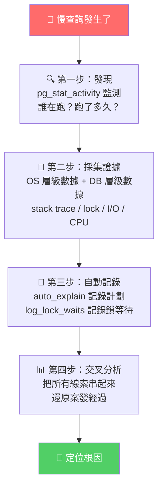
```mermaid
flowchart TD
    A["🚨 慢查詢發生了"] --> B["🔍 第一步：發現<br/>pg_stat_activity 監測<br/>誰在跑？跑了多久？"]
    B --> C["📸 第二步：採集證據<br/>OS 層級數據 + DB 層級數據<br/>stack trace / lock / I/O / CPU"]
    C --> D["🤖 第三步：自動記錄<br/>auto_explain 記錄計劃<br/>log_lock_waits 記錄鎖等待"]
    D --> E["📊 第四步：交叉分析<br/>把所有線索串起來<br/>還原案發經過"]
    E --> F["🎯 定位根因"]
    
    style A fill:#ff6b6b,color:#fff
    style F fill:#51cf66,color:#fff
```

框架的四個支柱：

1. **如何監測慢查詢** — 用什麼工具來發現「有人在慢」？
2. **需要採集哪些資訊** — 發現後要記錄哪些數據才能事後還原？
3. **資料庫內核層面能做什麼** — PostgreSQL 內建了哪些自動記錄機制？
4. **如何分析** — 把所有線索拼湊在一起，找到真正的兇手

---

## 2. 監測慢查詢：pg_stat_activity 生產環境實戰

### I. pg_stat_activity 基本概念

#### a. 它不是 real-time table，是 shared memory 的 view

`pg_stat_activity` 不是一張會被 `INSERT` / `UPDATE` 的實體表。它是 PostgreSQL 從 shared memory 中即時讀取每個 backend process 的狀態資訊、再拼裝出來的 view。這件事有兩個重要含義：

1. **「即時」有延遲**：`query` 欄位顯示的 SQL 是該 process 上一次更新 shared memory 時的內容。如果 process 正在忙（跑在 CPU 上），它可能還沒來得及更新 `pg_stat_activity` 中的 `query` 欄位，所以你可能看到的是「上一條 SQL」而不是「正在跑的 SQL」
2. **查詢本身幾乎無鎖**：因為是讀 shared memory，不需要鎖表，在多並發環境下不會造成阻塞

> 補充（Senior Dev）：正因 `pg_stat_activity` 來自 shared memory，「頻繁查詢」本身不會造成 lock contention。但極高頻率的查詢（例如每秒上百次）仍會消耗 CPU，建議 app 端做 caching（如 5-10 秒刷新一次）。

#### b. Session State 狀態機

每個 PostgreSQL session 的核心狀態由 `state` 欄位表示。三種狀態的轉換反映了 session 的生命週期：

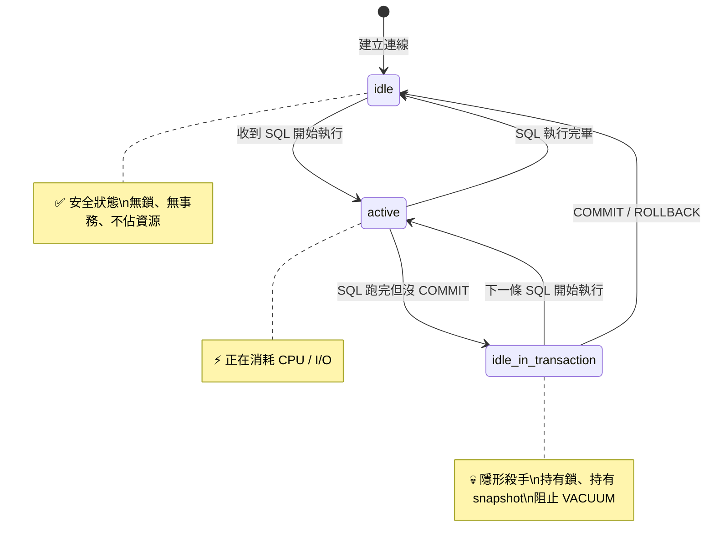
```mermaid
stateDiagram-v2
    [*] --> idle : 建立連線
    idle --> active : 收到 SQL 開始執行
    active --> idle : SQL 執行完畢
    active --> idle_in_transaction : SQL 跑完但沒 COMMIT
    idle_in_transaction --> active : 下一條 SQL 開始執行
    idle_in_transaction --> idle : COMMIT / ROLLBACK

    note right of idle : ✅ 安全狀態\n無鎖、無事務、不佔資源
    note right of active : ⚡ 正在消耗 CPU / I/O
    note right of idle_in_transaction : 💀 隱形殺手\n持有鎖、持有 snapshot\n阻止 VACUUM
```

| 狀態 | 含義 | 風險 |
|------|------|------|
| `idle` | 連線閒置，沒有正在執行的事務 | 無風險，連線池正常狀態 |
| `active` | 正在執行 SQL | 正常，但關注 `wait_event` |
| `idle in transaction` | 有事務開啟但閒置中（沒 COMMIT） | **高風險** — 持有鎖不釋放、持有 snapshot 阻止 VACUUM |
| `idle in transaction (aborted)` | 事務中發生錯誤但尚未 ROLLBACK | **極高風險** — 同上，且應用程式可能不知道已出錯 |

#### c. Slow Query 的根源只有 4 種

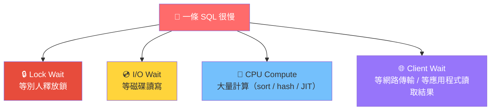
```mermaid
flowchart TB
    SLOW["🐌 一條 SQL 很慢"]
    SLOW --> LOCK["🔒 Lock Wait<br/>等別人釋放鎖"]
    SLOW --> IO["💿 I/O Wait<br/>等磁碟讀寫"]
    SLOW --> CPU["🧠 CPU Compute<br/>大量計算（sort / hash / JIT）"]
    SLOW --> CLIENT["🌐 Client Wait<br/>等網路傳輸 / 等應用程式讀取結果"]

    style SLOW fill:#ff6b6b,color:#fff
    style LOCK fill:#e74c3c,color:#fff
    style IO fill:#ffd43b
    style CPU fill:#74c0fc
    style CLIENT fill:#9775fa,color:#fff
```

這四種類型對應到 `wait_event_type` 的四個主要分類：`Lock`、`IO`、`CPU`、`Client`。`LWLock` 和 `BufferPin` 是更底層的內部鎖。

**Application Developer 的第一反應不是看 SQL 內容，而是看 `wait_event`**。因為 SQL 是你寫的，你已經知道它長什麼樣子；但瓶頸在哪裡，必須靠 `wait_event` 來判斷。

---

### II. 生產環境最關鍵的 5 個欄位

`pg_stat_activity` 有 30+ 個欄位，但現場排查時你只需要先看這 5 個：

| # | 欄位 | 問的問題 | 典型值 |
|---|------|---------|--------|
| 1 | `state` | 「它在做什麼？」 | `active` / `idle` / `idle in transaction` |
| 2 | `wait_event_type` + `wait_event` | 「它卡在哪裡？」 | `Lock` / `IO` / `Client` / `LWLock` / `CPU` |
| 3 | `query_start` | 「這條 SQL 跑了多久？」 | `now() - query_start` |
| 4 | `xact_start` | 「這個事務開了多久？」 | `now() - xact_start`（idle in transaction 時這個值會很大但 query_start 不變） |
| 5 | `query` | 「它正在跑什麼 SQL？」 | 可能被截斷（預設 1024 bytes），PG 14+ 可調 `track_activity_query_size` |

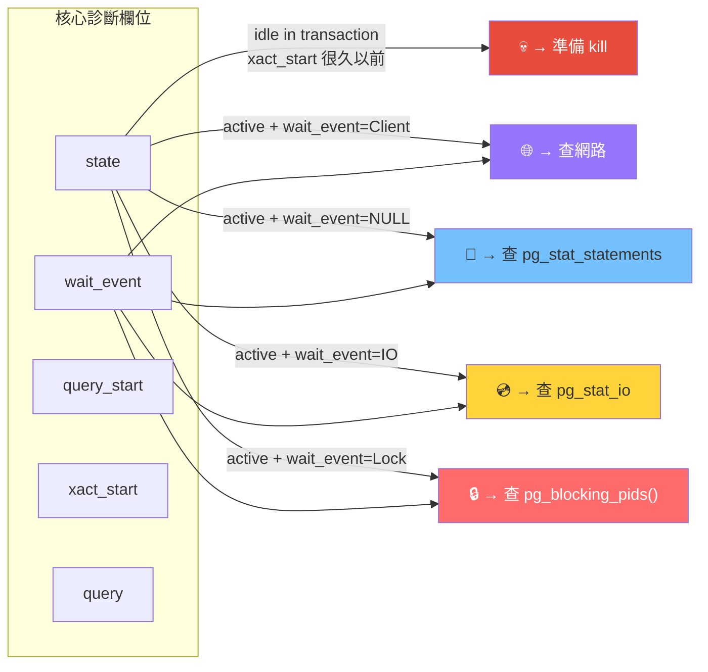
```mermaid
flowchart LR
    subgraph Core["核心診斷欄位"]
        S["state"]
        W["wait_event"]
        QS["query_start"]
        XS["xact_start"]
        Q["query"]
    end

    S --> |"active + wait_event=Lock"| LOCK["🔒 → 查 pg_blocking_pids()"]
    S --> |"active + wait_event=IO"| IO["💿 → 查 pg_stat_io"]
    S --> |"active + wait_event=NULL"| CPU["🧠 → 查 pg_stat_statements"]
    S --> |"idle in transaction<br/>xact_start 很久以前"| IDLE["💀 → 準備 kill"]
    S --> |"active + wait_event=Client"| CLIENT["🌐 → 查網路"]

    W --> LOCK
    W --> IO
    W --> CPU
    W --> CLIENT

    style LOCK fill:#ff6b6b,color:#fff
    style IO fill:#ffd43b
    style CPU fill:#74c0fc
    style IDLE fill:#e74c3c,color:#fff
    style CLIENT fill:#9775fa,color:#fff
```

---

### III. 場景 1：用戶說「網站很慢」— 30 秒初步判斷

#### a. 原理

慢查詢的診斷不需要從頭開始猜。你只需要問一個問題：「PostgreSQL 覺得自己在等什麼？」答案就在 `wait_event`。

#### b. 即用查詢：一眼看到誰在慢、在等什麼

```sql
-- 你唯一需要記住的一條查詢
SELECT
    pid,
    usename,
    application_name,
    state,
    wait_event_type || '/' || wait_event AS waiting_on,
    now() - query_start AS query_duration,
    now() - xact_start AS xact_duration,
    LEFT(query, 200) AS query_preview
FROM pg_stat_activity
WHERE state = 'active'
  AND backend_type = 'client backend'
ORDER BY query_start;
```

看懂這條結果：
- `waiting_on = NULL` → 正在跑，沒在等（CPU bound，查 SQL 本身）
- `waiting_on = Lock/transactionid` → 等著拿 row lock（被別的 transaction 卡住）
- `waiting_on = Lock/relation` → 等著拿 table lock（通常有人跑 DDL）
- `waiting_on = IO/DataFileRead` → 等磁碟讀取（shared buffer 不夠 / 索引不好）
- `waiting_on = Client/ClientRead` → 等 application 收結果（網路慢 / app 沒在讀）

#### c. 30 秒決策圖

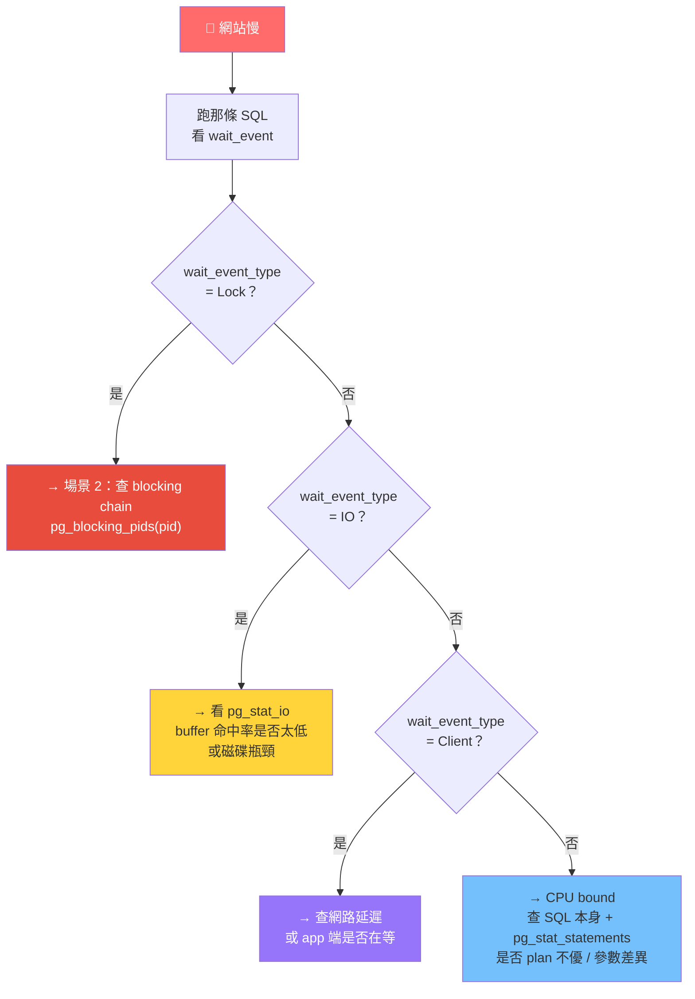
```mermaid
flowchart TD
    SLOW["🚨 網站慢"]
    SLOW --> Q["跑那條 SQL<br/>看 wait_event"]

    Q --> LOCK{"wait_event_type<br/>= Lock？"}
    LOCK -->|"是"| LOCK_ACT["→ 場景 2：查 blocking chain<br/>pg_blocking_pids(pid)"]
    LOCK -->|"否"| IO{"wait_event_type<br/>= IO？"}
    IO -->|"是"| IO_ACT["→ 看 pg_stat_io<br/>buffer 命中率是否太低<br/>或磁碟瓶頸"]
    IO -->|"否"| CLIENT{"wait_event_type<br/>= Client？"}
    CLIENT -->|"是"| CLIENT_ACT["→ 查網路延遲<br/>或 app 端是否在等"]
    CLIENT -->|"否"| CPU_ACT["→ CPU bound<br/>查 SQL 本身 + pg_stat_statements<br/>是否 plan 不優 / 參數差異"]

    style SLOW fill:#ff6b6b,color:#fff
    style LOCK_ACT fill:#e74c3c,color:#fff
    style IO_ACT fill:#ffd43b
    style CLIENT_ACT fill:#9775fa,color:#fff
    style CPU_ACT fill:#74c0fc
```

---

### IV. 場景 2：鎖住了 — 誰擋了誰？

#### a. 原理

PostgreSQL 使用 **MVCC + row-level lock**。關鍵認知：

1. **Row-level lock 存在 tuple header 中（xmax 欄位）**，不是獨立的 lock table。`UPDATE` 會在舊 tuple 的 `xmax` 寫入自己的 XID，讓其他 session 知道「這行我正在改」
2. **`pg_locks` 記錄的是「heavy-weight lock」** — 也就是 table-level lock。Row-level lock 不會出現在 `pg_locks` 中，除非等待超過一定時間（升級為 multi-xact）
3. **SELECT 通常不加鎖**。但 `SELECT ... FOR UPDATE` 會加 `RowShareLock`。如果你的純 SELECT 也被卡住，可能是讀的那行剛好被別人 UPDATE 了（此時等待的是 `Lock/transactionid`）

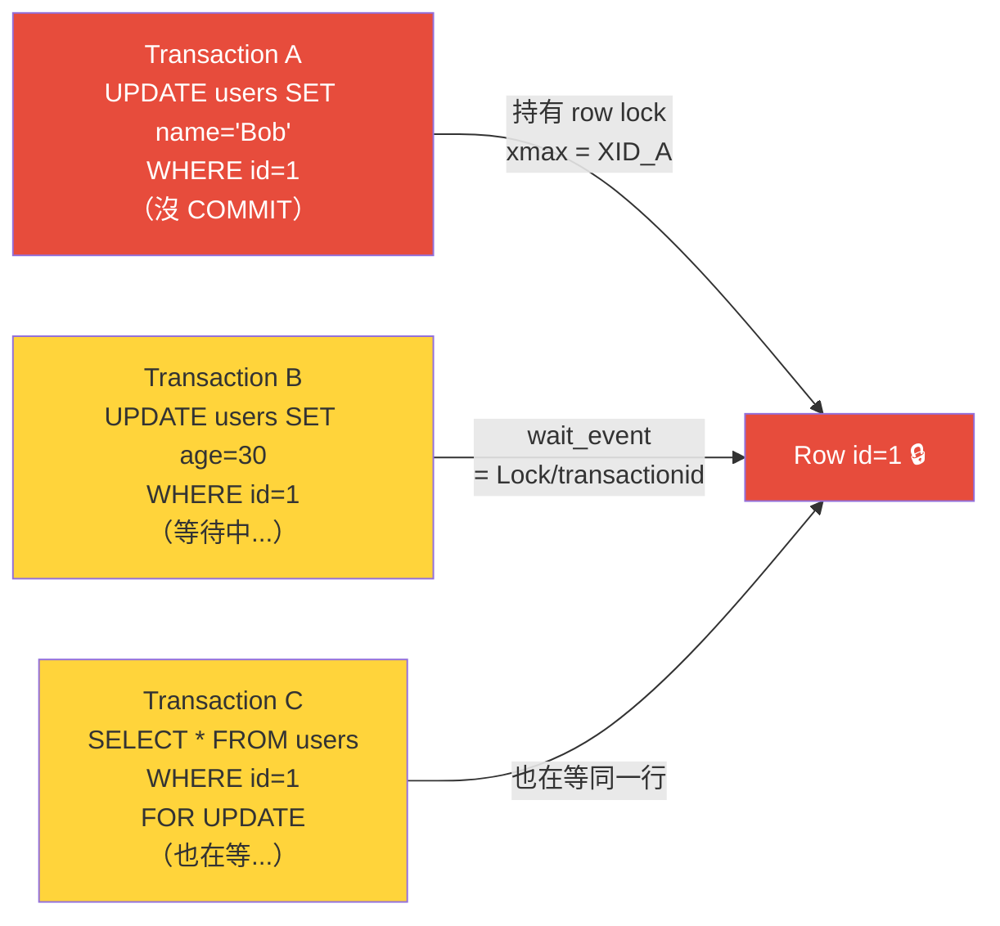
```mermaid
flowchart LR
    T1["Transaction A<br/>UPDATE users SET name='Bob'<br/>WHERE id=1<br/>（沒 COMMIT）"] --> |"持有 row lock<br/>xmax = XID_A"| ROW["Row id=1 🔒"]

    T2["Transaction B<br/>UPDATE users SET age=30<br/>WHERE id=1<br/>（等待中...）"] --> |"wait_event<br/>= Lock/transactionid"| ROW

    T3["Transaction C<br/>SELECT * FROM users<br/>WHERE id=1<br/>FOR UPDATE<br/>（也在等...）"] --> |"也在等同一行"| ROW

    style T1 fill:#e74c3c,color:#fff
    style T2 fill:#ffd43b
    style T3 fill:#ffd43b
    style ROW fill:#e74c3c,color:#fff
```

> **App Dev 視角**：最常見的鎖阻塞場景不是你寫的 SQL 有問題，而是**上一條 SQL 執行完後忘了 COMMIT**。例如：`using (var tx = conn.BeginTransaction())` 裡面跑了 UPDATE，但中間做了外部 API call，API call timeout 之後整個 method 拋 exception，`tx.Commit()` 沒跑到，`tx.Dispose()` 也沒跑（因為沒有 try-finally 或有 finally 但 Dispose 在 using 內）。結果就是一個 idle in transaction 的 session 持著 row lock 不放。

#### b. 即用查詢：一行查出阻塞樹

```sql
-- PG 9.6+：一行查出誰在等誰
SELECT
    blocked.pid AS blocked_pid,
    blocked.query AS blocked_query,
    blocked.wait_event_type || '/' || blocked.wait_event AS blocked_waiting_on,
    blocking.pid AS blocking_pid,
    blocking.query AS blocking_query,
    blocking.state AS blocking_state,
    now() - blocking.xact_start AS blocking_xact_duration,
    now() - blocking.query_start AS blocking_query_duration
FROM pg_stat_activity blocked
JOIN pg_stat_activity blocking
    ON blocking.pid = ANY(pg_blocking_pids(blocked.pid))
WHERE blocked.wait_event_type = 'Lock'
ORDER BY blocking_xact_duration DESC;
```

#### c. 鎖等待鏈的遞迴追查

`pg_blocking_pids()` 只回傳直接鎖住的 PID，但阻塞可能是多層的（A 等 B，B 等 C，C 才是 root cause）。用 recursive CTE 找出完整等待鏈：

```sql
WITH RECURSIVE lock_chain AS (
    -- 起點：所有正在等鎖的 session
    SELECT
        pid,
        pid AS blocked_by,
        wait_event,
        query,
        state,
        1 AS depth,
        ARRAY[pid] AS path
    FROM pg_stat_activity
    WHERE wait_event_type = 'Lock'

    UNION ALL

    -- 遞迴：追 blocking PID
    SELECT
        lc.pid,
        blk.pid AS blocked_by,
        blk.wait_event,
        blk.query,
        blk.state,
        lc.depth + 1,
        lc.path || blk.pid
    FROM lock_chain lc
    JOIN pg_stat_activity sa ON sa.pid = lc.blocked_by
    CROSS JOIN LATERAL unnest(pg_blocking_pids(lc.blocked_by)) AS blk(pid)
    JOIN pg_stat_activity blk2 ON blk2.pid = blk.pid
    WHERE NOT blk.pid = ANY(lc.path)  -- 防止循環
)
SELECT DISTINCT ON (pid) * FROM lock_chain
ORDER BY pid, depth DESC;
```

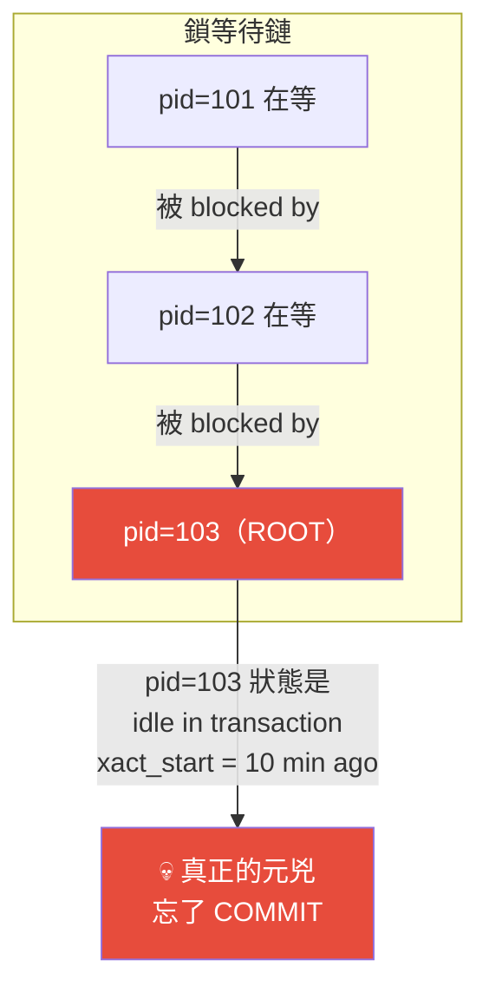
```mermaid
flowchart TD
    subgraph Chain["鎖等待鏈"]
        A["pid=101 在等"]
        B["pid=102 在等"]
        C["pid=103（ROOT）"]

        A -->|"被 blocked by"| B
        B -->|"被 blocked by"| C
    end

    C --> |"pid=103 狀態是<br/>idle in transaction<br/>xact_start = 10 min ago"| ROOT["💀 真正的元兇<br/>忘了 COMMIT"]

    style C fill:#e74c3c,color:#fff
    style ROOT fill:#e74c3c,color:#fff
```

#### d. 解法優先級

| 優先級 | 行動 | 說明 |
|--------|------|------|
| 1 | 通知 blocking session 的 owner | 如果它是自己團隊的 app，找出為什麼忘了 COMMIT |
| 2 | `SELECT pg_terminate_backend(pid)` | 應急：kill 掉 blocking session（注意：transaction 會 rollback） |
| 3 | `SET idle_in_transaction_session_timeout` | 長期解法：PG 10+ 自動殺掉閒置太久的事務 |

---

### V. 場景 3：同一條 SQL 平時很快，突然慢了

#### a. 原理：Execution Plan 為什麼會變？

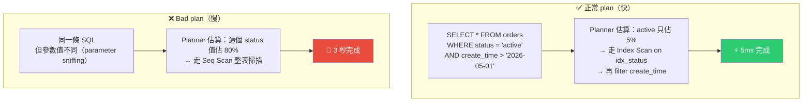
```mermaid
flowchart TB
    subgraph Normal["✅ 正常 plan（快）"]
        N1["SELECT * FROM orders<br/>WHERE status = 'active'<br/>AND create_time > '2026-05-01'"]
        N2["Planner 估算：active 只佔 5%<br/>→ 走 Index Scan on idx_status<br/>→ 再 filter create_time"]
        N3["⚡ 5ms 完成"]
    end

    subgraph Bad["❌ Bad plan（慢）"]
        B1["同一條 SQL<br/>但參數值不同（parameter sniffing）"]
        B2["Planner 估算：這個 status 值佔 80%<br/>→ 走 Seq Scan 整表掃描"]
        B3["🐌 3 秒完成"]
    end

    N1 --> N2 --> N3
    B1 --> B2 --> B3

    style N3 fill:#2ecc71,color:#fff
    style B3 fill:#e74c3c,color:#fff
```

Plan 變化的兩個主因：

1. **統計資訊過時**：`autoanalyze` 沒跟上寫入速度，`pg_statistic` 中的 `n_distinct` / `most_common_vals` 不準，planner 基於錯誤數據選擇了 bad plan
2. **Parameter Sniffing**：同一條 prepared statement，第一次 plan 時基於參數 `status='active'`（高選擇率）選擇了 Index Scan；之後參數變成 `status='archived'`（低選擇率）時仍使用相同的 cached plan（generic plan），導致全表掃描

#### b. 為什麼不能直接在 production 跑 EXPLAIN ANALYZE 找原因？

- `EXPLAIN ANALYZE` 會**真的執行**這條查詢，等於額外加重了資料庫負擔
- 你現在跑 `EXPLAIN ANALYZE` 看到的 plan 是**當下的 plan**，不一定是出事當時的 plan（如果 autoanalyze 在事後觸發了，統計資訊已經更新）
- 在 production 高負載時跑 `EXPLAIN ANALYZE` 可能讓情況更糟

#### c. 即用查詢：從 pg_stat_statements 找出不穩定的 SQL

```sql
-- 找出執行時間差異極大的 SQL（plan 可能不穩定）
SELECT
    queryid,
    LEFT(query, 150) AS query_preview,
    calls,
    mean_exec_time::numeric(18,2) AS avg_ms,
    stddev_exec_time::numeric(18,2) AS stddev_ms,
    CASE WHEN mean_exec_time > 0
         THEN (stddev_exec_time / mean_exec_time * 100)::numeric(18,1)
         ELSE 0
    END AS variability_pct,
    min_exec_time::numeric(18,2) AS min_ms,
    max_exec_time::numeric(18,2) AS max_ms,
    total_plan_time::numeric(18,2) AS total_plan_ms,
    total_exec_time::numeric(18,2) AS total_exec_ms
FROM pg_stat_statements
WHERE calls > 10
  AND mean_exec_time > 1
ORDER BY variability_pct DESC
LIMIT 20;
```

解讀：
- `variability_pct > 200%`（標準差是平均值的 2 倍以上）→ 這條 SQL 的效能很不穩定
- `max_ms >> mean_ms` → 存在 bad plan 的情況
- `total_plan_time` 很大 → planning 本身花了很多時間（可能是複雜查詢）

> **為什麼同一條 queryid 執行時間會差異極大？—— `pg_stat_statements` 的 Query Normalization 機制**
>
> `pg_stat_statements` 會對 SQL 做 **正規化（normalization）**：將 SQL 中的 literal constant（字串、數字、日期等）替換成 `$1, $2, ...` 再計算 hash，產生 `queryid`。也就是說，以下三條 SQL 會被歸類為**同一個 queryid**：
>
> ```sql
> SELECT * FROM orders WHERE status = 'active'   AND create_time > '2026-05-01';
> SELECT * FROM orders WHERE status = 'archived' AND create_time > '2026-05-15';
> SELECT * FROM orders WHERE status = 'pending'  AND create_time > '2026-05-30';
> ```
>
> 正規化後的 signature 都是：
> ```
> SELECT * FROM orders WHERE status = $1 AND create_time > $2
> ```
>
> 這正是 `variability_pct`（變異係數）能抓出 unstable plan 的關鍵前提：**同一條正規化 SQL，因為參數值不同，可能觸發完全不同的 execution plan**。例如：
>
> - 參數 `status = 'active'` → 這個值只佔表的 2% → Planner 選 Index Scan → 5ms
> - 參數 `status = 'archived'` → 這個值佔表的 70% → Planner 選 Seq Scan → 3s
>
> 兩個執行都累積到同一個 queryid 下，所以你會看到 `min_ms = 5`、`max_ms = 3000`、`stddev_ms` 暴增、`variability_pct` 高達數百%。這就是 **Parameter Sniffing** 在統計數字上的指紋。
>
> ```mermaid
> flowchart LR
>     Q1["WHERE status = 'active'<br/>（2% selectivity）"] --> NORM["正規化 → 同一個 queryid<br/>SELECT ... WHERE status = $1"]
>     Q2["WHERE status = 'archived'<br/>（70% selectivity）"] --> NORM
>     Q3["WHERE status = 'pending'<br/>（28% selectivity）"] --> NORM
>
>     NORM --> STATS["pg_stat_statements 統計"]
>     STATS --> RESULT["min=5ms, avg=150ms, max=3000ms<br/>stddev=1200ms, variability_pct=800%<br/>⚠️ Plan 極不穩定"]
>
>     style RESULT fill:#e74c3c,color:#fff
> ```
>
> **驗證方法**：如果你想確認是否真的是 Parameter Sniffing 導致，可以查看 `pg_stat_statements` 中該 queryid 的 `plans`（PG 14+，pg_stat_statements >= 1.9）欄位：
> ```sql
> SELECT queryid, plans, calls, mean_exec_time, stddev_exec_time
> FROM pg_stat_statements
> WHERE queryid = 12345;
> -- 如果 plans > 1 且 stddev_exec_time 很大 → 同一條 SQL 曾經用過不同 plan
> ```
>
> **注意事項**：`ORDER BY` 中的 literal 也會被正規化，但 `LIMIT` 的值不會（LIMIT 100 和 LIMIT 1 是不同 queryid）。`IN (...)` 列表中的值會被正規化。若你使用 Prepared Statement / parameterized query（如 Dapper 的 `@status`），PG 本身就使用 `$1, $2` 傳遞參數，正規化結果與 `pg_stat_statements` 一致。

#### d. App Dev 視角：你該問 DBA 的 3 個資訊

| 問什麼 | 為什麼 | DBA 會查的 SQL |
|--------|--------|---------------|
| 這張表的 autoanalyze 上次什麼時候跑的？ | 統計資訊可能過時 | `SELECT last_autoanalyze FROM pg_stat_user_tables WHERE relname = 'orders';` |
| 出事前有大量寫入嗎？ | 大量 INSERT/UPDATE 後 statistic 會失準 | `SELECT n_tup_ins, n_tup_upd FROM pg_stat_user_tables WHERE relname = 'orders';` |
| 這條 SQL 有幾種不同的 plan？ | Parameter sniffing 導致 plan 切換 | `EXPLAIN (ANALYZE, BUFFERS) SELECT ...`（在 staging 或低峰期執行） |

---

### VI. 場景 4：連線池滿了，新連線進不來

#### a. 原理

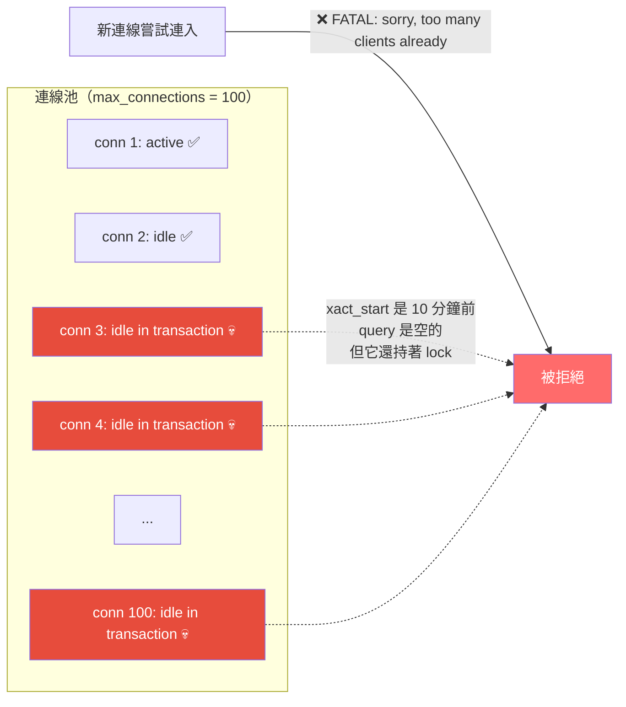
```mermaid
flowchart LR
    subgraph Pool["連線池（max_connections = 100）"]
        direction TB
        C1["conn 1: active ✅"]
        C2["conn 2: idle ✅"]
        C3["conn 3: idle in transaction 💀"]
        C4["conn 4: idle in transaction 💀"]
        CX["..."]
        C100["conn 100: idle in transaction 💀"]
    end

    NEW["新連線嘗試連入"] --> |"❌ FATAL: sorry, too many clients already"| REJECT["被拒絕"]

    C3 -.-> |"xact_start 是 10 分鐘前<br/>query 是空的<br/>但它還持著 lock"| REJECT
    C4 -.-> REJECT
    C100 -.-> REJECT

    style C3 fill:#e74c3c,color:#fff
    style C4 fill:#e74c3c,color:#fff
    style C100 fill:#e74c3c,color:#fff
    style REJECT fill:#ff6b6b,color:#fff
```

PostgreSQL 每個連線 = 一個 OS process（`fork()`）。連線數上限由 `max_connections` 控制（預設 100）。每個 idle connection 約佔 5-10MB memory。`idle in transaction` 更嚴重：它還持著 lock、snapshot，阻止 VACUUM 回收 dead tuple。

#### b. 即用查詢：找出佔著茅坑的 session

```sql
-- 找出 idle in transaction 超過 30 秒的 session
SELECT
    pid,
    usename,
    application_name,
    client_addr,
    state,
    now() - xact_start AS xact_duration,
    now() - state_change AS idle_duration,
    LEFT(query, 200) AS last_query,
    wait_event_type || '/' || wait_event AS waiting_on
FROM pg_stat_activity
WHERE state = 'idle in transaction'
  AND now() - state_change > interval '30 seconds'
ORDER BY xact_start;
```

#### c. 常見原因（App Dev 自己可以修的）

```csharp
// ❌ 錯誤寫法：transaction 開了但沒保證 close
using var conn = new NpgsqlConnection(connStr);
conn.Open();
var tx = conn.BeginTransaction();  // ← 事務開始
var cmd = new NpgsqlCommand("UPDATE users SET status = 'active'", conn, tx);
cmd.ExecuteNonQuery();
// ⚠️ 如果中間做 HTTP call 拋了 exception...
await httpClient.PostAsync(...);  // ← 可能 timeout
tx.Commit();  // ← 永遠跑不到這行
// Dispose 會 ROLLBACK，但如果 exception 在外層被 catch 吃掉...
```

```csharp
// ✅ 正確寫法：try-finally 確保 COMMIT/ROLLBACK
using var conn = new NpgsqlConnection(connStr);
conn.Open();
using var tx = conn.BeginTransaction();
try
{
    var cmd = new NpgsqlCommand("UPDATE users SET status = 'active'", conn, tx);
    cmd.ExecuteNonQuery();
    await httpClient.PostAsync(...);
    tx.Commit();  // ← 只有全部成功才 COMMIT
}
catch
{
    tx.Rollback();  // ← 任何失敗都 ROLLBACK
    throw;
}
```

#### d. 解法

| 方案 | 層級 | 說明 |
|------|------|------|
| `idle_in_transaction_session_timeout = '5min'` | PG 10+ server | 自動 terminate 超過 N 分鐘的 idle in transaction |
| `Connection Idle Lifetime` | 連線池（pgbouncer / Npgsql） | 連線池端設定最大 idle 時間 |
| `using` + try-finally | Application | 確保 transaction 一定被關閉 |

---

### VII. 場景 5：SQL 很快，但有些時候很慢 — 難抓

#### a. 原理：為什麼難抓？

`pg_stat_activity` 是 **snapshot**（像一張照片），不是 **time-series**（像一段影片）。你查的那一瞬間，可能正好是「不慢」的瞬間。一條 5 秒的查詢，可能前 3 秒在等鎖、後 2 秒在 I/O 讀取。如果你只在第 1 秒時查了一次，你會看到 `wait_event=Lock`；如果你在第 4 秒查，你會看到 `wait_event=IO`。


```mermaid
gantt
    title 一條 5 秒慢查詢的 wait_event 變化
    dateFormat ss
    axisFormat %S 秒
    tickInterval 1second

    section 查詢執行
    等待 Lock          :done, lock, 00, 3s
    I/O 讀取           :done, io, after lock, 2s
    CPU 計算           :active, cpu, after io, 1s

    section 如果你只取樣一次
    第 1 秒取樣        :milestone, m1, 01, 0s
    第 4 秒取樣        :milestone, m2, 04, 0s
```

- 第 1 秒取樣 → 看到 `Lock/transactionid` → 以為問題是鎖
- 第 4 秒取樣 → 看到 `IO/DataFileRead` → 以為問題是 I/O
- **真相：兩個都是瓶頸**。如果沒有持續取樣，你永遠只看到一部分

#### b. 即用查詢：每秒取樣 pg_stat_activity（簡單版）

```sql
-- 用 psql 每秒記錄一次 pg_stat_activity 到檔案中
-- psql -c "\watch 1" 每秒自動重複執行

SELECT
    now() AS snapshot_time,
    pid,
    state,
    wait_event_type || COALESCE('/' || wait_event, '') AS wait_event_full,
    now() - query_start AS query_duration
FROM pg_stat_activity
WHERE pid = :target_pid  -- 你要追蹤的 PID
\watch 1
```

事後分析取樣結果，看 `wait_event_full` 的變化模式：
- 全部是 `Lock/...` → 全程在等鎖
- 前端是 `Lock/...`，後端是 `IO/...` → 先等鎖釋放，再讀資料
- 全程是空的（無 wait）→ CPU bound，查 SQL 本身

#### c. App Dev 視角：在 application log 中記錄 pg_backend_pid()

```csharp
// 當查詢超過閾值時，記錄 PID 到 application log
var sw = Stopwatch.StartNew();
await using var cmd = new NpgsqlCommand(sql, conn);

// 拿到 PG 的 backend PID
var backendPid = conn.ProcessID;  // Npgsql 6.0+

await cmd.ExecuteNonQueryAsync();
sw.Stop();

if (sw.ElapsedMilliseconds > 3000)
{
    _logger.LogWarning(
        "Slow query detected: pid={Pid}, duration={Duration}ms, sql={Sql}",
        backendPid, sw.ElapsedMilliseconds, sql);
}
```

出事時，從 application log 拿到 PID → 去 PostgreSQL 查 `pg_stat_activity WHERE pid = xxx`（如果還活著）或去 PG log 找（如果已結束）。

---

### VIII. Wait Events 速查：生產環境 Top 10

`wait_event` 有 200+ 種，以下是生產環境最常見的 10 種：

| wait_event | 一句話原理 | 通常誰的鍋 | 下一步 |
|-----------|-----------|-----------|--------|
| `Lock/transactionid` | 等著拿別人 UPDATE 中的同一行 | **App**：有人忘了 COMMIT | 查 blocking chain → kill idle in tx |
| `Lock/relation` | 等著拿整張表的鎖（DDL 或 LOCK TABLE） | **DBA**：尖峰時段跑 DDL | 查誰在跑 ALTER TABLE |
| `Lock/tuple` | 等著拿已刪除/更新過的舊版 row | **App**：多個 session 同時 UPDATE + SELECT FOR UPDATE | 檢查是否有不必要的 FOR UPDATE |
| `IO/DataFileRead` | 等著從磁碟讀資料頁進 shared buffer | **DBA**：buffer 太小 / 統計過時導致 plan 走錯 | 查 pg_stat_io hits vs reads |
| `IO/WALWrite` | 等著 WAL 寫入磁碟（commit 時） | **DBA**：WAL disk 慢 / sync 設定 | 查 WAL disk IOPS |
| `LWLock/LockManager` | 內部鎖管理器的輕量鎖爭用 | **DB**：極高並發下正常現象 | 減少 table partition 數 / 降低並發 |
| `LWLock/WALWriteLock` | 多個 session 同時寫 WAL | **DB**：寫入量太大 | 減少 commit 頻率 / batch insert |
| `BufferPin` | 等著 buffer page 的 pin 被釋放 | **DBA**：vacuum 正在掃這個 page | 檢查 autovacuum 是否在尖峰執行 |
| `Client/ClientRead` | 等 client 傳送下一條 SQL（或讀取結果） | **App**：網路慢 / app 沒在讀 | 查網路 / app GC pause |
| `CPU` | PostgreSQL 在排隊等 OS CPU | **硬體**：CPU 不夠 / **DBA**：parallel workers 太多 | 查 CPU 使用率 / 調 `max_parallel_workers` |

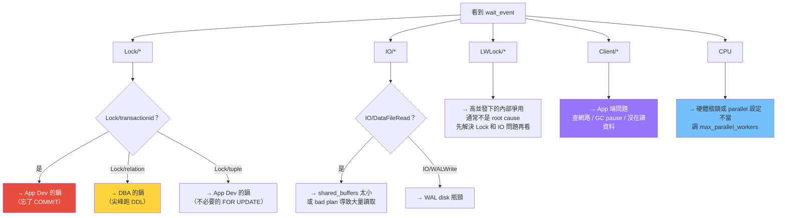
```mermaid
flowchart TD
    WE["看到 wait_event"] --> LOCK["Lock/*"]
    WE --> IO["IO/*"]
    WE --> LW["LWLock/*"]
    WE --> CLIENT["Client/*"]
    WE --> CPU2["CPU"]

    LOCK --> LOCK_DETAIL{"Lock/transactionid？"}
    LOCK_DETAIL -->|"是"| LOCK_TX["→ App Dev 的鍋<br/>（忘了 COMMIT）"]
    LOCK_DETAIL -->|"Lock/relation"| LOCK_REL["→ DBA 的鍋<br/>（尖峰跑 DDL）"]
    LOCK_DETAIL -->|"Lock/tuple"| LOCK_TUPLE["→ App Dev 的鍋<br/>（不必要的 FOR UPDATE）"]

    IO --> IO_DETAIL{"IO/DataFileRead？"}
    IO_DETAIL -->|"是"| IO_ACT["→ shared_buffers 太小<br/>或 bad plan 導致大量讀取"]
    IO_DETAIL -->|"IO/WALWrite"| IO_WAL["→ WAL disk 瓶頸"]

    LW --> LW_ACT["→ 高並發下的內部爭用<br/>通常不是 root cause<br/>先解決 Lock 和 IO 問題再看"]

    CLIENT --> CLIENT_ACT["→ App 端問題<br/>查網路 / GC pause / 沒在讀資料"]

    CPU2 --> CPU_ACT["→ 硬體瓶頸或 parallel 設定不當<br/>調 max_parallel_workers"]

    style LOCK_TX fill:#e74c3c,color:#fff
    style LOCK_REL fill:#ffd43b
    style CPU_ACT fill:#74c0fc
    style CLIENT_ACT fill:#9775fa,color:#fff
```

---

### IX. 生產環境 SOP 總結卡片

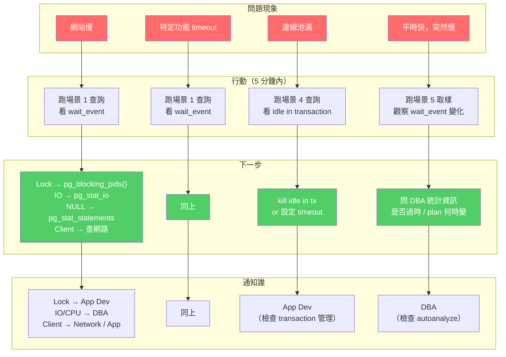
```mermaid
flowchart TD
    subgraph Problem["問題現象"]
        P1["網站慢"]
        P2["特定功能 timeout"]
        P3["連線池滿"]
        P4["平時快，突然慢"]
    end

    subgraph Action["行動（5 分鐘內）"]
        A1["跑場景 1 查詢<br/>看 wait_event"]
        A2["跑場景 1 查詢<br/>看 wait_event"]
        A3["跑場景 4 查詢<br/>看 idle in transaction"]
        A4["跑場景 5 取樣<br/>觀察 wait_event 變化"]
    end

    subgraph Next["下一步"]
        N1["Lock → pg_blocking_pids()<br/>IO → pg_stat_io<br/>NULL → pg_stat_statements<br/>Client → 查網路"]
        N2["同上"]
        N3["kill idle in tx<br/>or 設定 timeout"]
        N4["問 DBA 統計資訊<br/>是否過時 / plan 何時變"]
    end

    subgraph Who["通知誰"]
        W1["Lock → App Dev<br/>IO/CPU → DBA<br/>Client → Network / App"]
        W2["同上"]
        W3["App Dev<br/>（檢查 transaction 管理）"]
        W4["DBA<br/>（檢查 autoanalyze）"]
    end

    P1 --> A1 --> N1 --> W1
    P2 --> A2 --> N2 --> W2
    P3 --> A3 --> N3 --> W3
    P4 --> A4 --> N4 --> W4

    style P1 fill:#ff6b6b,color:#fff
    style P2 fill:#ff6b6b,color:#fff
    style P3 fill:#ff6b6b,color:#fff
    style P4 fill:#ff6b6b,color:#fff
    style N1 fill:#51cf66,color:#fff
    style N2 fill:#51cf66,color:#fff
    style N3 fill:#51cf66,color:#fff
    style N4 fill:#51cf66,color:#fff
```

> 補充（Senior Dev）：`pg_stat_activity` 查詢本身幾乎無鎖，頻繁查詢不會造成 lock contention。但若每秒查詢上百次會消耗 CPU，建議 app 端做 5-10 秒的快取。另外，PG 14+ 的 `query_id`（需啟用 `compute_query_id`）可以直接將 `pg_stat_activity` 中的 SQL 與 `pg_stat_statements` 的歷史統計關聯。
>
> 關於 Application Name 設定（.NET / Npgsql）：
> ```
> Host=xxx;Database=xxx;Username=xxx;Application Name=WebAPI-Instance01
> ```
> 這樣在 `pg_stat_activity.application_name` 就能追蹤是哪個 instance 發出的查詢。

---

## 3. 發現超閾值後，採集以下資訊（持續到 PID 結束）

### 觀念：為什麼要在發現後「持續採集」？

當你發現一條查詢已經跑了很久，你需要做的不是在那一瞬間看一眼，而是要**持續地把數據記錄下來**，直到這條查詢結束為止。這就像是警察調閱一整段監視器畫面，而不是只看一張截圖。原因是：一條查詢可能在等待鎖 3 秒、然後 I/O 5 秒、然後 CPU 運算 10 秒 — 如果你只看一瞬間，可能只看到它在等鎖，而忽略後面的瓶頸。

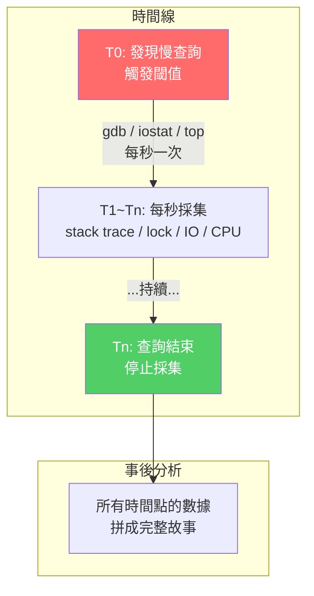
```mermaid
flowchart TD
    subgraph 時間線
        T0["T0: 發現慢查詢<br/>觸發閾值"]
        T1["T1~Tn: 每秒採集<br/>stack trace / lock / IO / CPU"]
        Tn["Tn: 查詢結束<br/>停止採集"]
    end
    
    T0 --> |"gdb / iostat / top<br/>每秒一次"| T1
    T1 --> |"...持續..."| Tn
    
    subgraph 事後分析
        A["所有時間點的數據<br/>拼成完整故事"]
    end
    
    Tn --> A
    
    style T0 fill:#ff6b6b,color:#fff
    style Tn fill:#51cf66,color:#fff
```

---

### I. Process Stack Trace：看程式卡在哪一行

**白話解釋：** Stack trace 就像給程式拍了一張 X 光片。當你把程式「凍結」的瞬間，stack trace 會告訴你它正在執行哪個內部的函數。如果一張 stack trace 不夠，你可以每秒拍一張，看它「在哪個函數卡最久」。

```bash
# 現代 Linux（pstack 在部分發行版已移除，改用 gdb）
gdb -p $PID -batch -ex 'thread apply all bt'

# 或傳統 pstack（如可用）
pstack $PID

# 採集間隔自訂，如每秒一次
```

**什麼時候用？** 當 `wait_event` 顯示是 `LWLock` 或 `BufferPin` 時，這些是 PostgreSQL 內部的輕量級鎖，透過 stack trace 可以看到卡在程式碼的哪個位置。

### II. Lock Wait 記錄：誰擋了誰？

**白話解釋：** 當好幾個人同時要修改同一筆資料時，PostgreSQL 會用「鎖」來確保資料不會被改壞。但鎖也可能造成「塞車」—— A 在等 B 釋放鎖、B 在等 C 釋放鎖，形成一條等待鏈。

參考德哥另一篇文章：[PostgreSQL 锁等待监控 珍藏级SQL - 谁堵塞了谁](https://github.com/digoal/blog/blob/master/201705/20170521_01.md)

透過 `pg_locks` + `pg_stat_activity` JOIN 查出 blocked / blocking chain。採集間隔自訂，直到 PID 結束。核心查詢思路：`pg_locks` JOIN `pg_stat_activity` 找出 blocked / blocking 關係。

**鎖等待鏈示意：**

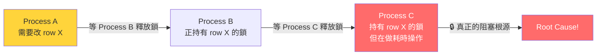
```mermaid
flowchart LR
    A["Process A<br/>需要改 row X"] --> |"等 Process B 釋放鎖"| B["Process B<br/>正持有 row X 的鎖"]
    B --> |"等 Process C 釋放鎖"| C["Process C<br/>持有 row X 的鎖<br/>但在做耗時操作"]
    
    C --> |"🔒 真正的阻塞根源"| D["Root Cause!"]
    
    style A fill:#ffd43b
    style C fill:#ff6b6b,color:#fff
    style D fill:#ff6b6b,color:#fff
```

> 補充（Senior Dev）：blocking chain 可能多於兩層（A 等 B，B 等 C）。如果只查一層 `JOIN` 可能遺漏根源。建議使用 recursive CTE 追蹤完整等待鏈，或直接用 `pg_blocking_pids(pid)`（PG 9.6+）一次取得完整 blocking tree。PG 16+ 結合 `pg_stat_activity.wait_event_type = 'Lock'` 可快速過濾。

> 補充（Senior Dev）：production 中 lock wait 是最常見的慢查詢原因之一（僅次於 bad plan）。關鍵 script 應同時擷取：
> - blocking chain（誰鎖了誰）
> - lock mode（`AccessShareLock` vs `AccessExclusiveLock`：前者通常是讀寫並發，後者是 DDL 或 `LOCK TABLE`）
> - `pg_locks.granted` 欄位（`false` = 正在等待）

**Lock Mode 速查（白話版）：**

| Lock Mode | 白話解釋 | 常見場景 |
|-----------|---------|---------|
| `AccessShareLock` | 「我在讀，不要刪掉這張表」 | SELECT 查詢自動取得 |
| `RowShareLock` | 「我可能會改這幾行，先登記一下」 | SELECT ... FOR UPDATE |
| `RowExclusiveLock` | 「我正在改這幾行資料」 | INSERT / UPDATE / DELETE |
| `ShareLock` | 「我正在建 index，不要改結構」 | CREATE INDEX CONCURRENTLY |
| `AccessExclusiveLock` | 「整張表歸我管，全部讓開」 | ALTER TABLE / DROP TABLE |

### III. System / Process IO：磁碟瓶頸

**白話解釋：** 資料庫的資料最終存在磁碟上。當查詢需要的資料不在記憶體（shared buffer）中時，就必須從磁碟讀取。如果磁碟很慢、或同時有太多人要讀取，就會形成 I/O 瓶頸。換句話說：「CPU 很快，但磁碟跟不上」，查詢就得乾等。

```bash
iostat -x 1              # system-level IO，每秒
iotop -p $PID            # process-level IO，針對 PID
```

**重點看的指標：**

| 指標 | 含義 | 什麼算異常 |
|------|------|-----------|
| `%util` | 磁碟忙碌百分比 | 接近 100% 表示磁碟已飽和 |
| `await` | 平均每次 I/O 的等待時間 | > 20ms 對 SSD 來說偏高 |
| `r/s` / `w/s` | 每秒讀/寫次數 | 對比硬體規格判斷是否達到極限 |
| `rkB/s` / `wkB/s` | 每秒讀/寫的資料量 | 判斷是大量資料還是大量小 I/O |

這些數據幫助你判斷瓶頸是 IOPS（每秒 I/O 次數不足）、throughput（頻寬不夠）、還是 await（磁碟響應延遲太高）。採集間隔：每秒一次。

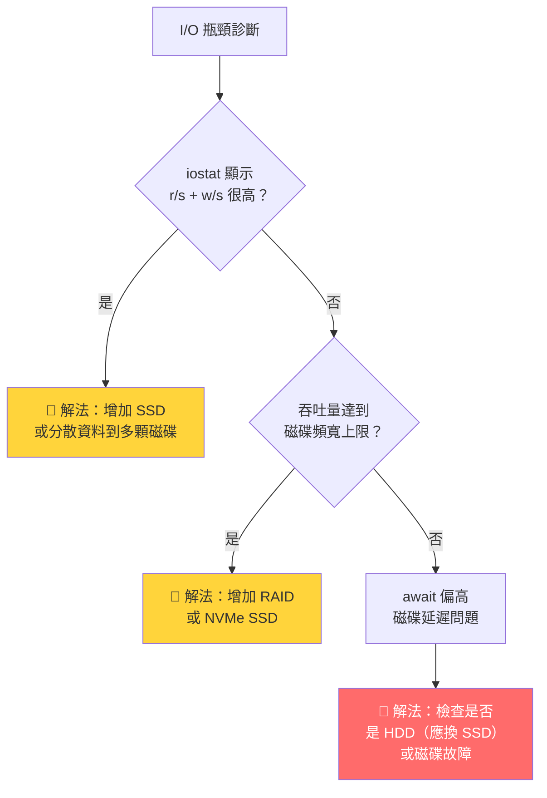
```mermaid
flowchart TD
    I["I/O 瓶頸診斷"] --> IOPS{"iostat 顯示<br/>r/s + w/s 很高？"}
    IOPS --> |"是"| IOPS_FIX["🔧 解法：增加 SSD<br/>或分散資料到多顆磁碟"]
    IOPS --> |"否"| THRUPUT{"吞吐量達到<br/>磁碟頻寬上限？"}
    THRUPUT --> |"是"| THRU_FIX["🔧 解法：增加 RAID<br/>或 NVMe SSD"]
    THRUPUT --> |"否"| AWAIT["await 偏高<br/>磁碟延遲問題"]
    AWAIT --> AW_FIX["🔧 解法：檢查是否<br/>是 HDD（應換 SSD）<br/>或磁碟故障"]
    
    style IOPS_FIX fill:#ffd43b
    style THRU_FIX fill:#ffd43b
    style AW_FIX fill:#ff6b6b,color:#fff
```

> 補充（Senior Dev）：PG 16+ 新增 **`pg_stat_io`** view，提供 cluster-wide I/O 統計（含 backend type / I/O object / context / read_time / write_time / fsync_time / extends），是資料庫層面的原生 I/O 透視。可取代部分 iostat 需求：

```sql
SELECT backend_type, object, context,
       reads, read_time, writes, write_time,
       extends, fsyncs, fsync_time, hits, evictions
FROM pg_stat_io
WHERE backend_type = 'client backend';
```

> PG 16+ 的 `pg_stat_io` 提供了更細粒度的 I/O context（`normal` / `vacuum` / `bulkread` / `bulkwrite`），可區分查詢產生的 I/O vs autovacuum 產生的 I/O，這在排查「慢查詢是否被 vacuum 拖慢」時很有用。詳細說明見下一節 [IV. pg_stat_io](#iv-pg_stat_io)。

### IV. pg_stat_io：資料庫層級 I/O 透視

**白話解釋：** PG 16 新增的 `pg_stat_io` 是 PostgreSQL 內建的「I/O 儀表板」。前面的 `iostat` / `iotop` 是從 OS 角度看整台機器的 I/O，但 `pg_stat_io` 直接告訴你**資料庫內部**每個 backend type（client backend、autovacuum、checkpointer、WAL writer 等）各自讀寫了多少、花多少時間、命中率如何。換句話說：OS 工具告訴你「磁碟很忙」，`pg_stat_io` 告訴你「是誰在忙、在忙什麼」。

#### a. 核心欄位

| 欄位 | 含義 | 為什麼重要 |
|------|------|-----------|
| `backend_type` | I/O 來源類型 | 區分是 client query、autovacuum、background writer、checkpointer 等 |
| `object` | 操作的物件 | `relation`（資料表/索引）、`temp relation`（暫存表）、`WAL` 等 |
| `context` | I/O 的操作情境 | `normal`（一般查詢）、`vacuum`、`bulkread`（Seq Scan / Bitmap Scan）、`bulkwrite`（大量寫入） |
| `reads` / `read_time` | 實際從磁碟讀取的次數/累計時間 | read_time 高 = 磁碟讀取慢 |
| `writes` / `write_time` | 寫入磁碟的次數/累計時間 | write_time 高 = 寫入瓶頸 |
| `extends` / `extend_time` | 擴展檔案（新增頁面）的次數/時間 | 反映資料表/索引增長速度 |
| `fsyncs` / `fsync_time` | fsync 呼叫次數/時間 | 檢查 WAL flush 或 checkpoint sync 是否拖慢整體 |
| `hits` | buffer cache 命中的次數 | 命中率高 = shared_buffer 夠用，不需要讀磁碟 |
| `evictions` | 從 buffer cache 踢出頁面的次數 | 頻繁 evict = shared_buffer 太小 |
| `reuses` | buffer 頁面被重複使用的次數（PG 17+） | 反映 buffer 空間使用效率 |

#### b. 實用查詢

```sql
-- 1. 按 backend_type 看誰是 I/O 大戶
SELECT backend_type,
       reads, read_time,
       writes, write_time,
       extends, extend_time,
       fsyncs, fsync_time,
       hits, evictions
FROM pg_stat_io
ORDER BY read_time + write_time DESC;

-- 2. 區分 normal vs vacuum 產生的 I/O（排查 vacuum 是否拖慢業務）
SELECT backend_type, context,
       reads, read_time,
       writes, write_time
FROM pg_stat_io
WHERE context IN ('normal', 'vacuum')
ORDER BY backend_type, context;

-- 3. 計算 buffer 命中率（PG 16 內建，不需要再從 pg_stat_bgwriter 推估）
SELECT backend_type,
       hits::numeric / NULLIF(reads + hits, 0) * 100 AS hit_ratio_pct
FROM pg_stat_io
WHERE backend_type = 'client backend';
```

> **注意：** `pg_stat_io` 是全 cluster 累計值（自上次 reset 或 server 啟動後），要用 snapshot 比對來觀察一段時間內的變化趨勢。

#### c. 與 OS 層工具的分工

| 場景 | 用什麼工具 |
|------|-----------|
| 磁碟是否飽和？ | `iostat`（OS 層，看整體） |
| 哪個 process 在吃 I/O？ | `iotop -p $PID`（OS 層，按 PID） |
| 哪個 backend_type 在吃 I/O？ | `pg_stat_io`（資料庫層） |
| 是否 vacuum 在拖慢業務？ | `pg_stat_io`（看 context='vacuum' 的 read_time） |
| buffer 命中率是否不足？ | `pg_stat_io`（看 hits vs reads） |

### V. Network：網路延遲

**白話解釋：** 應用程式（例如你的 web server）和資料庫通常在不同機器上，中間透過網路溝通。如果網路很慢或塞車，即使資料庫本身跑得很快，查詢回傳結果時也會卡住。

```bash
sar -n DEV 1 1           # system network throughput
iptraf                   # per-connection network（需知道 client IP + port）
```

根據 `pg_stat_activity` 中的 `client_addr` 和 `client_port` 定位連線。如果 `wait_event_type` = `Client` + `wait_event` = `ClientRead`，表示資料庫在等應用程式讀取結果 — 這通常暗示網路或應用程式端的問題。

### VI. CPU：計算資源瓶頸

**白話解釋：** 當查詢需要大量計算（如排序、hash join、型別轉換）時，CPU 可能成為瓶頸。這在 OLAP/分析型查詢中尤其常見。

```bash
top -p $PID              # per-process CPU, memory, state
```

採集間隔：每秒一次。觀察 CPU 使用率是否接近 100%，以及 process 狀態是否持續在 `R`（running）。

**注意：** PostgreSQL 是單一 process 處理一條查詢（除非使用 parallel query），所以如果看到某個 PID 的 CPU 固定在 ~100%，且其他 CPU core 很閒，這可能就是單線程運算瓶頸。

### VII. Wait Events：從資料庫視角看瓶頸

**白話解釋：** 這是前面 pg_stat_activity 最重要的欄位。Wait event 直接告訴你「資料庫覺得自己在等什麼」。把它和 OS 層的數據（I/O、CPU、network）交叉比對，就能精確定位。

PG 9.6+ 的 `pg_stat_activity` 包含 `wait_event_type` + `wait_event`。可透過 snapshot 對比時間段內的 wait event 分佈，定位瓶頸類型（Lock / IO / LWLock / BufferPin / Extension / Activity / Timeout / IPC 等）。

PG 14+ `pg_stat_activity` 新增 `wait_start` 欄位（timestamp），可直接計算**已經等了多久**，不再需要推估：

```sql
SELECT pid, wait_event_type, wait_event,
       now() - wait_start AS wait_duration
FROM pg_stat_activity
WHERE wait_event IS NOT NULL;
```

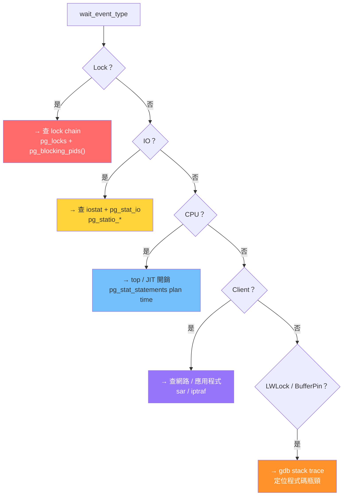
```mermaid
flowchart TD
    WE[wait_event_type] --> LOCK{"Lock？"}
    LOCK --> |"是"| LOCK_PATH["→ 查 lock chain<br/>pg_locks + pg_blocking_pids()"]
    LOCK --> |"否"| IO{"IO？"}
    IO --> |"是"| IO_PATH["→ 查 iostat + pg_stat_io<br/>pg_statio_*"]
    IO --> |"否"| CPU{"CPU？"}
    CPU --> |"是"| CPU_PATH["→ top / JIT 開銷<br/>pg_stat_statements plan time"]
    CPU --> |"否"| CLIENT{"Client？"}
    CLIENT --> |"是"| CLIENT_PATH["→ 查網路 / 應用程式<br/>sar / iptraf"]
    CLIENT --> |"否"| LW{"LWLock / BufferPin？"}
    LW --> |"是"| LW_PATH["→ gdb stack trace<br/>定位程式碼瓶頸"]
    
    style LOCK_PATH fill:#ff6b6b,color:#fff
    style IO_PATH fill:#ffd43b
    style CPU_PATH fill:#74c0fc
    style CLIENT_PATH fill:#9775fa,color:#fff
    style LW_PATH fill:#ff922b,color:#fff
```

原文亦提到可透過 HOOK 機制開發類似 `pg_stat_statements` 的 wait event 統計插件，持久化存儲供事後分析。PG 18 允許 extensions 透過自訂 wait event 註冊機制進一步擴展監控。

> 補充（Senior Dev）：PG 13 以後，可以搭配 `pg_wait_sampling` extension 來做更精確的 wait event sampling（類似 Oracle ASH）。它透過 background worker 定期取樣 wait event，存入專用檢視表，不需要頻繁 poll `pg_stat_activity`。
>
> ```sql
> CREATE EXTENSION pg_wait_sampling;
> SELECT * FROM pg_wait_sampling_profile;
> ```

### VIII. TOP SQL（pg_stat_statements）：找出最花時間的 SQL

**白話解釋：** `pg_stat_statements` 是 PostgreSQL 最重要的效能延伸模組之一。它會自動記錄每一條 SQL 的執行統計：跑了幾次、總共花了多少時間、平均多久、從磁碟讀了多少資料、產生多少 WAL 日誌。這就像是 Google Analytics 之於網站 — 你一眼就知道哪些 SQL 是「流量冠軍」（耗時最多或次數最多）。

對 `pg_stat_statements` 做 snapshot 比對（先記一次、等一段時間再記一次），取得時間段內的：

- 總耗時最高的 SQL
- 執行次數最多的 SQL
- 平均耗時和標準差異常的 SQL
- 命中 shared buffer 比例異常低的 SQL（大量資料要從磁碟讀）
- 產生 WAL 最多的 SQL（PG 13+，`wal_bytes`）
- Plan time vs Execute time 分佈（PG 13+，可拆分規劃時間和執行時間）

```sql
SELECT queryid, query,
       calls,
       total_plan_time, total_exec_time,
       mean_exec_time, stddev_exec_time,
       shared_blks_hit, shared_blks_read,
       blk_read_time, blk_write_time,
       wal_records, wal_bytes
FROM pg_stat_statements
ORDER BY total_exec_time DESC
LIMIT 20;
```

也可以透過 `pg_stat_statements` extension 做 snapshot diff：

```sql
CREATE EXTENSION pg_stat_statements;
-- snapshot 1
SELECT * FROM pg_stat_statements ORDER BY total_time DESC LIMIT 10;
-- wait N seconds
-- snapshot 2（diff = 時段內的 TOP SQL）
```

可以了解時段內的 TOP SQL 及其 `total_time`、`calls`、`shared_blks_read`、`temp_blks_read` 等開銷分佈。

**重點欄位速查：**

| 欄位 | 白話含義 | 異常暗示 |
|------|---------|---------|
| `calls` | 這條 SQL 被執行了幾次 | 次數暴增 → 可能有 N+1 問題 |
| `total_exec_time` | 總執行時間 | 找出最耗時的 SQL |
| `mean_exec_time` | 平均每次執行時間 | 太高 → 這條 SQL 本身就慢 |
| `stddev_exec_time` | 執行時間的標準差 | 很大 → 有時很快有時很慢（參數不同導致 plan 不同） |
| `shared_blks_hit` / `shared_blks_read` | 從記憶體讀 vs 從磁碟讀的資料塊數 | `read` 很高 → 緩存不夠，需要加大 `shared_buffers` |
| `blk_read_time` / `blk_write_time` | 實際讀寫磁碟的時間 | 佔執行時間比例高 → I/O 瓶頸 |
| `wal_bytes` | 這條 SQL 產生的 WAL 日誌量 | 很高 → 寫入密集型 SQL（大量 INSERT/UPDATE/DELETE） |

> 補充（Senior Dev）：PG 13 起 `pg_stat_statements.track_planning = on` 可拆分 plan / execute 時間，對排查 prepare statement plan cache 失效或 generic plan 選錯很有用。PG 14+ `compute_query_id` 讓 `query_id` 成為內建功能（不再強制依賴 `pg_stat_statements`），搭配 `log_line_prefix` 的 `%Q` 可在 log 中直接關聯。

> **重要觀念：`pg_stat_statements` 是累計值，無法按時間條件過濾**
>
> `pg_stat_statements` 的所有數據（`calls`、`total_exec_time` 等）都是**自上次 reset 或 server 啟動以來的持續累計值**，儲存在 shared memory 中，即時更新。你 SELECT 它不會觸發 refresh，查完也不會清空 — 它永遠是最新的累計值。無法直接下 `WHERE time BETWEEN ...` 來只看某一天。
>
> - `calls` 是**執行次數**（count），不是 call ID。同一個 queryid 每被執行一次，`calls` 就 +1。
> - 唯一清空方式：`SELECT pg_stat_statements_reset();` 或 server 重啟。
> - 想看特定時間段，只能做 **snapshot 比對**（兩點相減）。

**實戰：每天自動記錄 pgss snapshot，實現「每日報表」**

```sql
-- 1. 建立每日 snapshot 歷史表
CREATE TABLE pgss_daily (
    snapshot_time timestamptz DEFAULT now(),
    queryid bigint,
    query text,
    calls bigint,
    total_exec_time double precision,
    mean_exec_time double precision,
    shared_blks_read bigint,
    shared_blks_hit bigint,
    blk_read_time double precision,
    blk_write_time double precision,
    wal_bytes numeric,
    PRIMARY KEY (snapshot_time, queryid)
);

-- 2. 透過 pg_cron 每天午夜自動存一份
SELECT cron.schedule(
    'pgss-daily-snapshot',
    '0 0 * * *',
    $$INSERT INTO pgss_daily (queryid, query, calls, total_exec_time, mean_exec_time,
                               shared_blks_read, shared_blks_hit,
                               blk_read_time, blk_write_time, wal_bytes)
      SELECT queryid, query, calls, total_exec_time, mean_exec_time,
             shared_blks_read, shared_blks_hit,
             blk_read_time, blk_write_time, wal_bytes
      FROM pg_stat_statements$$
);

-- 3. 查某一天的增量（前後兩天 snapshot 相減）
SELECT a.query,
       b.calls - a.calls AS day_calls,
       b.total_exec_time - a.total_exec_time AS day_exec_time,
       b.shared_blks_read - a.shared_blks_read AS day_blks_read
FROM pgss_daily a
JOIN pgss_daily b ON a.queryid = b.queryid
WHERE a.snapshot_time::date = '2026-05-23'
  AND b.snapshot_time::date = '2026-05-24'
  AND b.calls > a.calls
ORDER BY day_exec_time DESC;
```

> 如果沒裝 `pg_cron`，也可以透過 OS cron（Linux）或 Task Scheduler（Windows）定時執行 `psql -c "INSERT INTO pgss_daily SELECT ..."`，效果相同。

### IX. Table / Index Stats & IO Stats：物件層級統計

**白話解釋：** 前面的工具告訴你「哪條 SQL」很慢、I/O 有沒有瓶頸。但還需要知道「哪張表、哪個索引」被大量讀寫，才能對症下藥（例如加索引、分區、調整查詢）。以下三張系統表提供物件層級的統計。

- **`pg_stat_user_tables`**（表層級操作統計）：記錄每張表的 `seq_scan`（全表掃描次數）、`idx_scan`（用索引的次數）、`n_tup_ins/upd/del`（寫入/更新/刪除的筆數）
- **`pg_statio_user_tables`**（表層級 I/O 統計）：記錄每張表的 `heap_blks_read`（實際從磁碟讀取的資料塊數）
- **`pg_statio_user_indexes`**（索引層級 I/O 統計）：記錄每個索引的 `idx_blks_read`（實際從磁碟讀取的索引塊數）

對這些 view 做 snapshot 比對，可以發現哪張表/哪個 index 在被大量 physical read，或是全表掃描次數突然飆升。Snapshot diff 也可以觀察時段內哪些 table 被大量 seq scan、哪些 index 被頻繁 block read。

**交叉比對思維：**

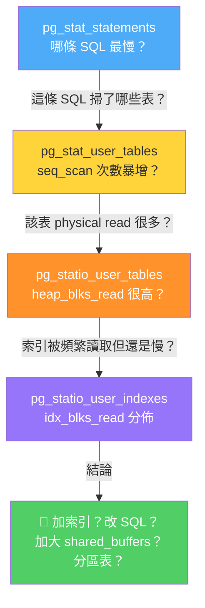
```mermaid
flowchart TD
    PGSS["pg_stat_statements<br/>哪條 SQL 最慢？"] --> |"這條 SQL 掃了哪些表？"| PGT["pg_stat_user_tables<br/>seq_scan 次數暴增？"]
    PGT --> |"該表 physical read 很多？"| PGIO["pg_statio_user_tables<br/>heap_blks_read 很高？"]
    PGIO --> |"索引被頻繁讀取但還是慢？"| PGIDX["pg_statio_user_indexes<br/>idx_blks_read 分佈"]
    PGIDX --> |"結論"| ACTION["🔧 加索引？改 SQL？<br/>加大 shared_buffers？<br/>分區表？"]
    
    style PGSS fill:#4dabf7,color:#fff
    style PGT fill:#ffd43b
    style PGIO fill:#ff922b,color:#fff
    style PGIDX fill:#9775fa,color:#fff
    style ACTION fill:#51cf66,color:#fff
```

> 補充（Senior Dev）：PG 16+ 的 `pg_stat_io` 提供了更細粒度的 I/O context（`normal` / `vacuum` / `bulkread` / `bulkwrite`），可區分查詢產生的 I/O vs autovacuum 產生的 I/O，這在排查「慢查詢是否被 vacuum 拖慢」時很有用。

---

## 4. 資料庫內核層面自動記錄

### 觀念：讓 PostgreSQL 自己當「行車記錄器」

前面第 3 節講的是「手動採集」——你自己拿著工具去收集數據。但更理想的方式是讓 PostgreSQL 自己自動記錄，就像行車記錄器一樣，事故發生後直接回放。PostgreSQL 提供了三套內建機制來實現這件事：

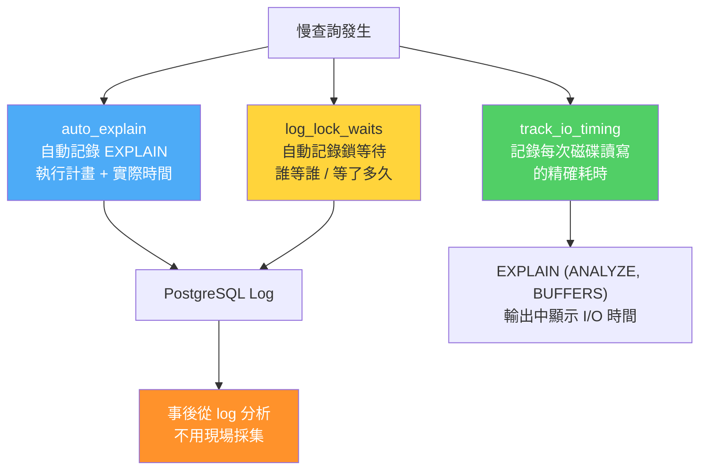
```mermaid
flowchart TD
    SLOW["慢查詢發生"] --> AE["auto_explain<br/>自動記錄 EXPLAIN<br/>執行計畫 + 實際時間"]
    SLOW --> LLW["log_lock_waits<br/>自動記錄鎖等待<br/>誰等誰 / 等了多久"]
    SLOW --> IO["track_io_timing<br/>記錄每次磁碟讀寫<br/>的精確耗時"]
    
    AE --> LOG["PostgreSQL Log"]
    LLW --> LOG
    IO --> EXPLAIN["EXPLAIN (ANALYZE, BUFFERS)<br/>輸出中顯示 I/O 時間"]
    
    LOG --> ANALYSIS["事後從 log 分析<br/>不用現場採集"]
    
    style AE fill:#4dabf7,color:#fff
    style LLW fill:#ffd43b
    style IO fill:#51cf66,color:#fff
    style ANALYSIS fill:#ff922b,color:#fff
```

---

### I. auto_explain：自動記錄慢 SQL 的 EXPLAIN

**白話解釋：** 正常情況下，你要看一條 SQL 的執行計畫，需要手動跑 `EXPLAIN (ANALYZE, BUFFERS)`。但慢查詢通常發生在凌晨 3 點，你不可能守在電腦前。`auto_explain` 會自動幫你：只要某條 SQL 跑超過你設定的時間閾值，它就把那條 SQL 的 EXPLAIN 結果記錄到 log 中。事後你翻 log 就能看到完整的執行計畫。

參考：[PostgreSQL 函数调试、诊断、优化 & auto_explain](https://github.com/digoal/blog/blob/master/201611/20161121_02.md)

```ini
# postgresql.conf（全域）
# 或 SET 語句（per-session，不需 restart）
shared_preload_libraries = 'auto_explain'      # 全域需 restart
# session_preload_libraries = 'auto_explain'   # PG 10+，per-session 不需 restart

auto_explain.log_min_duration = '1s'           # 超過此閾值才記錄
auto_explain.log_analyze = on                   # EXPLAIN ANALYZE（含 actual time）
auto_explain.log_buffers = on                   # buffer hit/read 統計
auto_explain.log_timing = on                    # per-node timing
auto_explain.log_verbose = on                   # extra plan info
auto_explain.log_nested_statements = on         # function 內 SQL 也記錄
auto_explain.log_settings = on                  # PG 12+，記錄當時 GUC 參數
auto_explain.log_parameter_max_length = 512     # PG 17+，記錄 bind parameter 值（截斷長度）
auto_explain.log_wal = on                       # PG 18+，記錄 WAL 產生量
auto_explain.log_format = json                  # PG 18+，可選 json 格式輸出
```

當 query 執行時間超過 `log_min_duration` 時，自動在 log 中輸出該 query 的 `EXPLAIN (ANALYZE, BUFFERS, TIMING, VERBOSE)` 結果，包括每個 plan node 的 actual time、buffer 用量。記錄超過閾值的 SQL 的 execution plan 及每個 node 的 actual time，事後可直接從 PostgreSQL log 看到完整的 EXPLAIN ANALYZE 輸出。

**各參數白話解釋：**

| 參數 | 白話含義 | 建議 |
|------|---------|------|
| `log_min_duration` | 查詢跑超過多久才記錄 | **預設 `-1`（完全停用）**，設 0 記錄所有查詢，設 `1s`~`5s` 只記錄慢查詢 |
| `log_analyze` | 是否真的執行 EXPLAIN ANALYZE | **開**，但注意會有額外開銷 |
| `log_buffers` | 記錄 buffer 命中率 | **開**，對診斷 I/O 瓶頸至關重要 |
| `log_nested_statements` | function/stored procedure 內的 SQL 也記錄 | **開**，很多慢查詢藏在 function 裡 |
| `log_settings` | 記錄當時的資料庫參數設定 | **開**（PG 12+），知道為什麼 optimizer 選了這個計畫 |
| `log_parameter_max_length` | 記錄 bind parameter 的實際值 | **開**（PG 17+），沒有這個你只能看到 `$1, $2` |
| `log_wal` | 記錄 WAL 產生量 | 看需求（PG 18+） |

> 補充（Senior Dev）：
> - `log_nested_statements = on` 對 function / stored procedure 內的 SQL 也生效，排查深層 SQL 至關重要。
> - `log_analyze = on` 會讓被記錄的 SQL 實際執行 EXPLAIN ANALYZE overhead，不建議在極高 QPS 環境設全域。可用 `auto_explain.log_min_duration` 設較高閾值僅捕獲真正慢的 SQL。`auto_explain.log_analyze = on` 會對被記錄的 query 實際執行 `EXPLAIN ANALYZE`，這意味著 query 本身會被執行兩次（一次正常，一次 ANALYZE）。在高吞吐 OLTP 場景下，建議只對 `log_min_duration` 較高的 query 啟用 full analyze，或使用 sampling（PG 17+ `auto_explain.log_sample_rate`）來降低 overhead。
> - PG 10+ 支援 `session_preload_libraries = 'auto_explain'`，可在 per-session 層級啟用（`SET`），不需重啟 instance。
> - PG 12+ 的 `log_settings` 記錄 optimizer 相關 GUC（`enable_seqscan`, `work_mem`, `random_page_cost` 等），對還原 execution plan 選擇原因極有幫助。
> - PG 17+ 的 `log_parameter_max_length` 解決了 `auto_explain` 長期痛點：無法知道 $1, $2 的實際值。PG 18+ 的 `log_wal` 記錄該次 query 產生的 WAL 量。

參考：
- [PostgreSQL 函數調試、診斷、優化 & auto_explain](https://github.com/digoal/blog/blob/master/201611/20161121_02.md)
- [PostgreSQL 加載動態庫詳解](https://github.com/digoal/blog/blob/master/201603/20160316_01.md)

> **啟用必要條件：** `auto_explain` 預設為 `off`，且 `log_min_duration` 預設為 `-1`（停用）。兩個條件**都要**同時滿足才會生效：
> 1. 載入模組：`shared_preload_libraries = 'auto_explain'`（需 restart）
> 2. 開啟閾值：`auto_explain.log_min_duration` 設為 `0`（記錄全部）或正數毫秒值，例如 `1000` = 只記錄超過 1 秒的查詢

### II. log_lock_waits：記錄 Lock Wait 耗時

**白話解釋：** 當一個 session 卡在等待鎖太久（超過 `deadlock_timeout`），PostgreSQL 會自動在 log 中寫下詳細資訊：誰在等、被誰卡住、鎖的類型、跑的 SQL 是什麼。這讓你不用手動去查 `pg_locks`。

```ini
# postgresql.conf
log_lock_waits = on
deadlock_timeout = 1s
```

當一個 session 等待 lock 超過 `deadlock_timeout` 時，PostgreSQL 會在 log 中寫入等待資訊（包括 blocked / blocking PID、lock type、被等待的 SQL）。PG 14+ log 中同時會打印 `wait_event` 資訊。

**注意：** `deadlock_timeout` 有雙重作用。它既是 deadlock detection（死鎖偵測）的檢查間隔（預設 1 秒），也是觸發 `log_lock_waits` 記錄的門檻。換句話說：如果一個鎖等待超過 1 秒，PostgreSQL 一方面會記錄 log，一方面也會啟動死鎖偵測（檢查是否有循環等待）。

> 補充（Senior Dev）：`deadlock_timeout` 的預設值是 1s，這是 deadlock detection 的檢查間隔。將它設為 1s 與 `log_lock_waits` 啟用搭配，可以在 lock wait > 1s 時自動記錄。注意：降低 `deadlock_timeout` 會增加 deadlock detector 的喚醒頻率（CPU 微幅上升），但對 multi-master / high concurrency 環境來說，1s 已足夠。

### III. IO Timing Trace：記錄每次磁碟操作的耗時

**白話解釋：** 正常 `EXPLAIN ANALYZE` 只告訴你每個節點的總耗時，不區分 CPU 時間和 I/O 時間。啟用 `track_io_timing` 後，資料庫會在每次讀寫磁碟時記錄耗時，讓你能在 EXPLAIN 輸出中看到「I/O 花了 X ms、CPU 花了 Y ms」。

PostgreSQL 可開啟 `track_io_timing = on` 來記錄每次 block read/write 的耗時。這會產生額外的系統時鐘查詢開銷。

```ini
track_io_timing = on
```

啟用 IO timing 追蹤後，讓 `EXPLAIN (ANALYZE, BUFFERS)` 和 `pg_stat_statements` 中的 IO 時間與 CPU 時間分開統計。

德哥另一篇文章有詳細討論：

[Linux 时钟精度 与 PostgreSQL auto_explain (explain timing 时钟开销估算)](https://github.com/digoal/blog/blob/master/201612/20161228_02.md)

> 補充（Senior Dev）：`track_io_timing = on` 在現代 Linux kernel（5.x+）和 SSD/NVMe 上的 overhead 已大幅降低（每次 I/O 約 0.5~1μs）。PG 16+ 的 `pg_stat_io` 即使不開啟此參數也能提供 I/O 呼叫次數（`reads` / `writes`），但精確的 `read_time` / `write_time` 仍需 `track_io_timing = on`。在 `EXPLAIN (ANALYZE, BUFFERS)` 輸出中可看到每個 node 的 `I/O Timings: read=X.XXX write=Y.YYY`。
>
> 注意：啟用 IO timing 會帶來微小的效能開銷（每次 I/O 操作前後讀取高精度時鐘）。在高頻率 small I/O 場景下（如 random index scan on NVMe），開銷可能達到 2-5%。參考：[Linux 時鐘精度與 PostgreSQL auto_explain](https://github.com/digoal/blog/blob/master/201612/20161228_02.md)

> [PG 13+] `track_io_timing` 預設從 `off` 改為 `on`，因為現代硬體的高精度時鐘開銷已降至可忽略。

### IV. 網絡耗時（內核層面缺失）

**白話解釋：** 不幸的是，PostgreSQL 到目前為止（PG 18）仍然沒有辦法在內核層面單獨統計網路傳輸的耗時。SQL 的總執行時間包含了「把結果傳回用戶端」的網路時間，但無法拆開。這是一個已知的缺憾。

PG 內核輸出的 SQL 總時間包含 network 傳輸到 client 的時間，但沒有單獨統計 network 耗時。原文提到可透過 HACK 內核來實現拆分。

> 補充（Senior Dev）：截至 PG 18，network time 仍無原生拆分。實務上可對比 `log_duration`（server side）與 client side round-trip time 來間接估算。若使用 `libpq` 的 trace 功能或 pgbouncer 的 `log_pooler_errors`，可在 middleware 層取得 network 耗時。

> [PG 14+] `pg_stat_statements` 新增 `wal_bytes` 欄位，可區分 WAL 寫入量；雖然仍無直接 network time，但可透過 client-side TCP 層級監控（`ss -tip` 或 `tcpdump`）來隔離網路延遲。

---

## 5. 分析流程總結

### I. 從發現到定位：完整追查流程

當慢查詢發生後，你需要像偵探辦案一樣，把所有線索串在一起。下面是「先做什麼、再做什麼」的標準作業程序：

**第一層：快速判斷（30 秒內）**

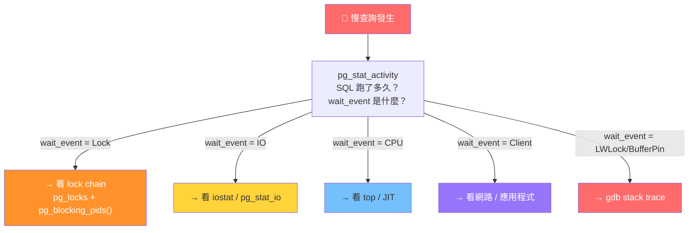
```mermaid
flowchart TD
    START["🚨 慢查詢發生"] --> Q1["pg_stat_activity<br/>SQL 跑了多久？<br/>wait_event 是什麼？"]
    Q1 --> |"wait_event = Lock"| LOCK_PATH["→ 看 lock chain<br/>pg_locks + pg_blocking_pids()"]
    Q1 --> |"wait_event = IO"| IO_PATH["→ 看 iostat / pg_stat_io"]
    Q1 --> |"wait_event = CPU"| CPU_PATH["→ 看 top / JIT"]
    Q1 --> |"wait_event = Client"| NET_PATH["→ 看網路 / 應用程式"]
    Q1 --> |"wait_event = LWLock/BufferPin"| LW_PATH["→ gdb stack trace"]
    
    style START fill:#ff6b6b,color:#fff
    style LOCK_PATH fill:#ff922b,color:#fff
    style IO_PATH fill:#ffd43b
    style CPU_PATH fill:#74c0fc
    style NET_PATH fill:#9775fa,color:#fff
    style LW_PATH fill:#ff6b6b,color:#fff
```

**第二層：深入分析（善用自動記錄）**

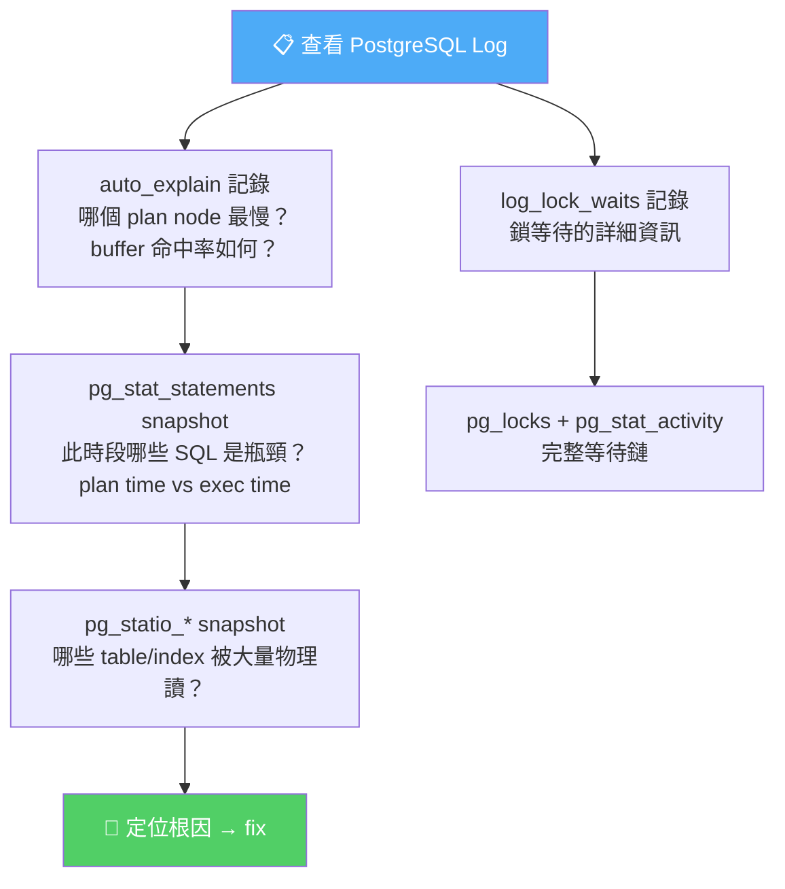
```mermaid
flowchart TD
    LOG["📋 查看 PostgreSQL Log"] --> AE["auto_explain 記錄<br/>哪個 plan node 最慢？<br/>buffer 命中率如何？"]
    LOG --> LLW["log_lock_waits 記錄<br/>鎖等待的詳細資訊"]
    AE --> PGSS["pg_stat_statements snapshot<br/>此時段哪些 SQL 是瓶頸？<br/>plan time vs exec time"]
    LLW --> LOCKS["pg_locks + pg_stat_activity<br/>完整等待鏈"]
    PGSS --> IO_OBJ["pg_statio_* snapshot<br/>哪些 table/index 被大量物理讀？"]
    IO_OBJ --> ROOT["🎯 定位根因 → fix"]
    
    style LOG fill:#4dabf7,color:#fff
    style ROOT fill:#51cf66,color:#fff
```

**完整決策樹：**

```
慢查詢觸發閾值
  → 記錄 pg_stat_activity snapshot（誰、什麼 SQL、wait_event、跑了多久）
  → 對 PID 啟動週期性採集：
      gdb stack / lock chain / iostat / iotop / top / sar
  → pg_stat_io snapshot（PG 16+，I/O context 細分）
  → auto_explain 自動記錄 EXPLAIN plan + per-node timing + GUC settings
  → log_lock_waits 記錄 lock 等待 + wait_event
  → 事後從 pg_stat_statements snapshot 對比：
      TOP SQL / plan-vs-execute 比例 / WAL 產生量
  → 從 pg_statio_* snapshot 對比 table/index physical read 變化
  → 交叉比對所有數據，依 wait_event_type 分類定位瓶頸類型：
      Lock → lock chain 分析
      IO → iostat + pg_stat_io + pg_statio_*
      LWLock / BufferPin → pstack / gdb
      CPU → top + pg_stat_statements JIT 欄位
      Activity → 檢查是否 idle-in-transaction 阻塞 vacuum
```

### II. 三大瓶頸類型速查總表

| 瓶頸類型 | wait_event | OS 層證據 | DB 層證據 | 常見解法 |
|---------|-----------|---------|---------|---------|
| **鎖等待** | Lock / transactionid | CPU 低、I/O 低 | pg_locks 有 waiting | 優化交易邏輯、縮短交易時間、避免 DDL 在尖峰時段 |
| **I/O 瓶頸** | DataFileRead / WALWrite | iostat %util 高 | pg_stat_io reads 高 | 加大 shared_buffers、升級 SSD、優化索引 |
| **CPU 瓶頸** | CPU（或無 wait） | top %CPU 高 | pg_stat_statements 執行時間高 | 優化 SQL、加索引減少運算、檢查 JIT overhead |
| **網路瓶頸** | ClientRead / ClientWrite | sar 網路高 | 無特殊記錄 | 減少回傳資料量、使用連線池、檢查網路設備 |
| **Vacuum 干擾** | BufferPin / LWLock | iostat 高 | pg_stat_io vacuum context | 調優 autovacuum 參數、避開尖峰時段 |

---

## 6. 現代化監測工具鏈（PG 17 視角）

### I. 觀念

PG 17 的內建功能已經大幅減少了對外部工具的依賴。以下按場景分類，優先使用 PG 內建能力，外部工具只作為補強。

### II. 內建核心（必備，零外部依賴）

```ini
shared_preload_libraries = 'pg_stat_statements, auto_explain'
track_io_timing = on
log_lock_waits = on
```

| 內建模組/參數 | 做什麼 | 適用場景 |
|--------------|--------|---------|
| `pg_stat_activity` | 即時檢視所有連線、SQL、wait_event | **第一線**：事發當下快速定位 |
| `pg_stat_statements` | SQL 累計統計（calls、total_exec_time、shared_blks_read、wal_bytes） | 找出 TOP SQL、計算 buffer 命中率 |
| `auto_explain` | 慢查詢自動輸出 EXPLAIN ANALYZE 到 log | 事後追溯，不用現場手動跑 EXPLAIN |
| `pg_stat_io`（PG 16+） | 按 backend_type / context / object 拆分的 I/O 統計 | 區分誰在吃 I/O、vacuum 是否拖慢業務 |
| `pg_wait_sampling`（PG 13+） | 背景定時取樣 wait event，存入 `pg_wait_sampling_profile` | 需要 wait event 歷史分佈（類似 Oracle ASH） |
| `pg_stat_progress_*`（PG 12+） | `ANALYZE`、`VACUUM`、`CLUSTER`、`CREATE INDEX`、`COPY`、`BASE_BACKUP` 的進度 | 長事務監控，知道還有多久跑完 |
| `log_parameter_max_length`（PG 17+） | auto_explain 記錄 bind parameter 的實際值 | 解決 `$1, $2` 不知道實際值的痛點 |
| `pg_stat_statements.track_planning`（PG 13+） | 拆分 plan time 和 execute time | 診斷 plan cache 失效 |

### III. 外部工具（按需導入）

| 工具 | 白話解釋 | 什麼時候用 |
|------|---------|-----------|
| **pgBadger** | 把 PG log 自動生成 HTML 報告，含慢查詢排行、wait event 分佈、timeline 圖 | 每天/每週自動產出效能報告 |
| **pg_activity** | CLI 即時 top 畫面，類似 `htop` 但專為 PG 設計 | 事發當下快速登入查看 |
| **Grafana + postgresql_exporter** | Prometheus 採集 PG metrics，Grafana 做儀表板和告警 | 需要長期趨勢圖和自動告警 |
| **pg_stat_monitor**（PG 16+） | 比 pg_stat_statements 更細的 bucket-based 統計（時間範圍、CPU/user time、plan 次數） | 需要更精細的 SQL 效能分佈 |

### IV. Production 推薦組合

**最小組合（零外部依賴）：**

```ini
shared_preload_libraries = 'pg_stat_statements, auto_explain'
track_io_timing = on
log_lock_waits = on
auto_explain.log_min_duration = '1s'
auto_explain.log_analyze = on
auto_explain.log_buffers = on
auto_explain.log_parameter_max_length = 512
```

定期將 log 餵給 `pgBadger` 生成 HTML report，即可覆蓋 80% 追溯需求。

**完整組合（含可視化 + 告警）：**

- PG 端：`pg_stat_statements` + `auto_explain` + `pg_wait_sampling` + `track_io_timing`
- 採集層：Grafana + postgresql_exporter（或 Prometheus）→ 長期趨勢儀表板 + 自動告警
- Log 層：pgBadger 每日 report
- 應急層：`pg_activity`（CLI 即時排查）

---

## 7. 版本變遷速查

### I. 監控相關功能的演進時間線

```mermaid
timeline
    title PostgreSQL 監控功能演進
    PG 9.6 : wait_event_type/wait_event 取代 waiting boolean
           : pg_blocking_pids() 一次取得 blocking tree
    PG 10  : pg_stat_activity.backend_type 區分 process 類型
           : session_preload_libraries（per-session auto_explain）
    PG 12  : auto_explain.log_settings 記錄 GUC 參數
    PG 13  : track_io_timing 預設 on
           : pg_stat_statements.wal_bytes / track_planning
           : pg_wait_sampling extension
    PG 14  : wait_start 精確計算等待時間
           : compute_query_id 內建 query identifier
    PG 15  : leader_pid 追溯 parallel worker 主 process
    PG 16  : pg_stat_io 原生 I/O 統計 view
    PG 17  : auto_explain.log_parameter_max_length（bind parameter 值）
           : auto_explain.log_sample_rate（sampling 降低 overhead）
    PG 18  : auto_explain.log_wal / log_format=json
```

---

| 功能 | 引入版本 | 說明 |
|------|---------|------|
| `wait_event_type` / `wait_event` | PG 9.6 | 取代 `waiting` boolean |
| `pg_blocking_pids(pid)` | PG 9.6 | 一次取得完整 blocking tree |
| `session_preload_libraries` | PG 10 | per-session 載入 `auto_explain`，不需 restart |
| `pg_stat_activity.backend_type` | PG 10 | 區分 backend 類型（client / autovacuum / walsender 等） |
| `auto_explain.log_settings` | PG 12 | 記錄 optimizer GUC |
| `pg_stat_statements.track_planning` | PG 13 | 拆分 plan time / execute time |
| `pg_stat_statements.wal_bytes` | PG 13 | WAL 產生量統計 |
| `pg_wait_sampling` extension | PG 13 | Wait event sampling（類似 Oracle ASH） |
| `track_io_timing` 預設 on | PG 13 | 現代硬體的時鐘開銷已可忽略 |
| `wait_start` in `pg_stat_activity` | PG 14 | 精確計算已等待時間 |
| `compute_query_id` | PG 14 | 內建 query_id，不強制依賴 `pg_stat_statements` |
| `leader_pid` in `pg_stat_activity` | PG 15 | parallel worker 追溯主 process |
| `pg_stat_io` | PG 16 | 原生 I/O 統計（取代部分 iostat 需求） |
| `auto_explain.log_parameter_max_length` | PG 17 | 記錄 bind parameter 實際值 |
| `auto_explain.log_sample_rate` | PG 17 | Sampling 降低 full analyze overhead |
| `auto_explain.log_wal` | PG 18 | 記錄 query WAL 產生量 |
| `auto_explain.log_format = json` | PG 18 | JSON 格式輸出 |

> [PG 版本註] 原文基於 PG 9.5（2016）。核心排查框架在最新版本（PG 17+）仍然有效，主要增強：
> - PG 9.6+：`wait_event_type` / `wait_event` 取代 `waiting` 布林值
> - PG 10+：`pg_stat_activity.backend_type` 區分 backend 類型（client / autovacuum / walsender 等）
> - PG 13+：`pg_stat_activity.leader_pid`、`pg_wait_sampling` extension、`track_io_timing` 預設 on
> - PG 14+：`pg_stat_activity.query_id`、`pg_stat_statements.wal_bytes`
> - PG 16+：`pg_stat_io` 系統 view（取代 `pg_statio_*` 的手動 snapshot，提供 cluster-wide I/O 統計）
>
> 特別注意：`pg_stat_io`（PG 16+）是一次重大改進——它提供了 cluster-level 的 I/O 統計（reads、writes、extends、fsyncs、hits），按 backend type 和 context 分類，無需再對 `pg_statio_*` 做手工 snapshot diff。

---

## 8. 參考與源碼

1. [PostgreSQL 锁等待监控 珍藏级SQL - 谁堵塞了谁](https://github.com/digoal/blog/blob/master/201705/20170521_01.md)
2. [PostgreSQL 函数调试、诊断、优化 & auto_explain](https://github.com/digoal/blog/blob/master/201611/20161121_02.md)
3. [PostgreSQL 加載動態庫詳解](https://github.com/digoal/blog/blob/master/201603/20160316_01.md)
4. [Linux 时钟精度 与 PostgreSQL auto_explain (explain timing 时钟开销估算)](https://github.com/digoal/blog/blob/master/201612/20161228_02.md)
5. [如何生成和阅读EnterpriseDB (PPAS)诊断报告](https://github.com/digoal/blog/blob/master/201606/20160628_01.md)
6. `pg_stat_activity` — PostgreSQL 原始碼中負責收集與維護後端 process 統計資訊的核心模組（位於 `src/backend/postmaster/` 目錄下的 process 統計收集器）
7. `pg_stat_statements` — PostgreSQL 標準擴充模組，負責追蹤與彙總所有 SQL 語句的執行統計（位於 `contrib/` 目錄）
8. `pg_wait_sampling` — PostgreSQL 標準擴充模組，負責定期取樣 wait event 資訊（位於 `contrib/` 目錄）

---

# 二、 PostgreSQL track_commit_timestamp：PG 17 視角

> 來源：[digoal - PostgreSQL 9.5 new feature - record transaction commit timestamp (2015-04-09)](https://github.com/digoal/blog/blob/master/201504/20150409_03.md)
>
> 本文基於原始 PG 9.5 文章，以 PG 17 (2026) 為基準更新：補足實際用途、效能影響、版本演進。

---

## 1. 功能概述

### I. 什麼是 commit timestamp？

`track_commit_timestamp` 自 PG 9.5 引入。簡單來說，每當一個事務（transaction）成功提交（commit）時，PostgreSQL 會在那個瞬間記錄下當時的時間戳。這就像是每一筆交易都會被蓋上一個「成交時間」的章。

> **重要觀念：**
> - `track_commit_timestamp` 預設是 **`off`**，必須手動設為 `on` 並 **restart** 才會生效。
> - 這個時間戳是記錄在 **transaction ID（xid）層級**，不是每張 table 自動多一個欄位。它不是 `created_at` 或 `updated_at` column — 不存在於任何 table 的 schema 中。
> - 查詢方式是 `pg_xact_commit_timestamp(xmin)`，透過 row 隱藏的 `xmin`（插入該 row 的事務 ID）去反查 commit 時間。
> 
> **限制：**
> - 只記錄設為 `on` 之後 commit 的事務，開啟前的歷史查不到。
> - xid wraparound 後，舊的事務 ID 會被回收，對應的 commit timestamp 會被截斷刪除，太久遠的資料可能查不到 `NULL`。
> - 每次 commit 都要寫入 SLRU，有輕微效能開銷。

### II. 為什麼需要這個功能？

在關閉此功能的情況下，你只能知道資料「被哪個事務寫入」（透過 `xmin`/`xmax` 這些隱藏欄位），但無法知道「何時被寫入」。你需要自己加 `updated_at` 欄位來記錄時間。開啟 `track_commit_timestamp` 後，PostgreSQL 會自動記錄每筆事務的提交時間，你可以事後查詢：

```sql
-- 查詢某筆資料是何時被寫入的（不需額外 timestamp 欄位）
SELECT xmin, pg_xact_commit_timestamp(xmin)
FROM some_table WHERE id = 1;
```

### III. 儲存結構（白話解釋）

commit timestamp 的數據儲存在 PostgreSQL 資料目錄（`PGDATA`）下的 `pg_commit_ts/` 子目錄中。它使用一種叫做 SLRU（Simple Least Recently Used，簡單最近最少使用）的機制來管理——你可以把它想像成一個自動分頁的筆記本，每頁固定大小，用完一頁就換下一頁，舊的頁面在不需要時會被清理掉。

**儲存細節：**

- 每個 page 大小 = `BLCKSZ`（預設 8KB，即 8192 bytes）
- 每筆 transaction 的 commit 記錄佔 12 bytes：時間戳（8 bytes）+ 節點 ID（4 bytes）。節點 ID 用於區分在 replication 場景下是哪個節點提交的。

PGDATA 目錄結構：

```
$ cd $PGDATA
drwx------  pg_commit_ts/
```

### IV. 事務 ID 循環與截斷

Transaction ID 是 32-bit 的整數，會不斷增加直到繞回（wrap around）。因此 `pg_commit_ts` 的 page/segment 編號也會對應 wraparound。PostgreSQL 會自動截斷（truncate）過舊的 commit timestamp 記錄以釋放空間，截斷邏輯由系統內部的截斷函數負責，它會判斷哪些舊頁面不再被需要。

**SLRU 儲存機制示意：**

```mermaid
flowchart TD
    subgraph "磁碟（PGDATA/pg_commit_ts/）"
        P1["Page 0<br/>XID 0~681"]
        P2["Page 1<br/>XID 682~1363"]
        P3["Page 2<br/>XID 1364~2045"]
        P4["..."]
        P5["Page N<br/>最新 txns"]
    end
    
    subgraph "記憶體（SLRU Buffer）"
        BUF["最近存取的 page<br/>暫存在記憶體中<br/>命中時幾乎零成本"]
    end
    
    P5 --> |"讀取時載入"| BUF
    BUF --> |"寫滿時寫回"| P1
    
    TRUNC["🗑️ Truncate<br/>過舊的 page 自動清理"]
    P1 -.-> |"非常舊的 page"| TRUNC
    
    style BUF fill:#74c0fc
    style TRUNC fill:#ffd43b
```

---

## 2. 啟用與確認

### I. 如何啟用

在 `postgresql.conf` 中加入以下設定：

```ini
# postgresql.conf
track_commit_timestamp = on
```

**必須 restart**（此參數為 `postmaster` 級別，無法用 `pg_ctl reload` 生效）：

```bash
pg_ctl restart -m fast
```

### II. 為什麼必須重啟？

有些參數只需要 reload（發送 SIGHUP 訊號）即可生效，但 `track_commit_timestamp` 涉及 PostgreSQL 核心的事務管理模組初始化——它在整個資料庫啟動時就需要決定要不要分配相關的記憶體和資料結構，所以必須重啟。用比喻來說：這不是「換個設定檔」，而是「整台機器要先關機再開機才能換零件」。

### III. 確認狀態

```bash
pg_controldata | grep track
# Current track_commit_timestamp setting: on
```

`pg_controldata` 會讀取 PostgreSQL 的控制檔（control file），裡面記錄了資料庫的關鍵設定。如果輸出顯示 `on`，表示目前已啟用。

### IV. 重置 WAL 時的注意事項

如果你需要使用 `pg_resetxlog`（PG 10+ 改名為 `pg_resetwal`）來重置 WAL（例如災難恢復），必須指定安全的 transaction ID 範圍，確保 commit timestamp 資料的一致性：

```bash
# -c xid,xid 指定最舊 / 最新可查 commit timestamp 的 xid 範圍
# 可從 pg_commit_ts/ 目錄中最小的 file name (hex) 推算
pg_resetwal -c 0x00000100,0x0000FF00
```

### V. 啟用與確認流程圖

```mermaid
flowchart TD
    A["決定開啟<br/>track_commit_timestamp"] --> B["修改 postgresql.conf<br/>track_commit_timestamp = on"]
    B --> C["重啟 PostgreSQL<br/>pg_ctl restart -m fast"]
    C --> D["確認狀態<br/>pg_controldata | grep track"]
    D --> |"顯示 on"| E["✅ 已啟用<br/>從此刻起所有 commit<br/>都會記錄時間戳"]
    D --> |"顯示 off"| F["❌ 未生效<br/>檢查 conf 是否正確<br/>是否真的重啟了"]
    
    E --> G["⚠️ 提醒：之前關閉時的<br/>transaction 沒有時間戳<br/>查詢時會回傳 NULL"]
    
    style E fill:#51cf66,color:#fff
    style F fill:#ff6b6b,color:#fff
    style G fill:#ffd43b
```

> 補充（Senior Dev）：如果 `track_commit_timestamp = off` 時資料庫曾運行過，之後再開啟，中間缺失的 transaction commit timestamp 會是 NULL。`pg_xact_commit_timestamp(xid)` 對這些 xid 回傳 NULL。

---

## 3. 實際用途（PG 9.5 → PG 17 演進）

### I. 2015 年（PG 9.5，原文時期）

當時 commit timestamp 剛被引入，作者推測它可能與 snapshot too old、logical replication 有關，但具體的使用場景尚未明確。

### II. 2026 年（PG 17）

經過多年演進，commit timestamp 已有以下明確用途：

**1. 查詢 commit timestamp：`pg_xact_commit_timestamp(xid)`**

最直接的用途。無需在表中額外添加 `updated_at` 欄位，就能知道任何一筆資料是何時被提交的。

```sql
SELECT pg_xact_commit_timestamp(txid_current());
-- 2026-05-17 15:30:45.123456+08

-- 查詢特定 transaction 的 commit time
SELECT xmin, pg_xact_commit_timestamp(xmin)
FROM some_table WHERE id = 1;
```

**2. Logical Replication（PG 10+）**

Logical replication（邏輯複製）是 PostgreSQL 內建的資料同步機制，可以將變更從一個資料庫即時傳送到另一個資料庫。其內部的變更解碼（logical decoding）模組依賴 commit timestamp 來決定事務的排序與可見性。

若未開啟 `track_commit_timestamp`，logical replication 仍可運作，但某些 replication slot 行為（如取得指定 LSN 範圍的變更）在跨節點一致性場景會有限制。建議使用 logical replication 的環境開啟此功能。

**3. Snapshot too old（PG 9.6+）**

`old_snapshot_threshold` 是 PG 9.6 引入的功能，用於防止長時間運行的查詢因為持有舊快照（snapshot）而阻止 vacuum 清理死資料。它依賴 commit timestamp 來判斷哪些資料版本已經過期可以回收。未開啟 `track_commit_timestamp` 時此功能無法使用。

**4. 審計 / CDC 場景**

可以直接透過 `xmin` / `xmax`（PostgreSQL 每筆資料隱含的事務 ID 欄位）加上 `pg_xact_commit_timestamp()` 還原 row-level 的變更時間線，無需在每張表額外維護 `updated_at` timestamp 欄位。

**5. Extension 生態**

- `pg_ivm`（Incremental View Maintenance，增量物化視圖維護）：依賴 commit timestamp 追蹤增量變更
- 部分 CDC tool（如 Debezium PG connector）在 snapshot 模式下查詢 commit timestamp 做 watermark（水位標記）

**用途全景圖：**

```mermaid
flowchart TD
    TRACK["track_commit_timestamp"] --> L1["查詢 commit 時間<br/>pg_xact_commit_timestamp()"]
    TRACK --> L2["Logical Replication<br/>（PG 10+）<br/>決定事務排序與可見性"]
    TRACK --> L3["Snapshot Too Old<br/>（PG 9.6+）<br/>判斷過期資料"]
    TRACK --> L4["審計 / CDC<br/>無需額外 timestamp 欄位<br/>還原 row-level 變更時間線"]
    TRACK --> L5["Extension 生態<br/>pg_ivm, Debezium 等"]
    
    style TRACK fill:#4dabf7,color:#fff
    style L2 fill:#ffd43b
    style L4 fill:#51cf66,color:#fff
```

| PG 版本 | 相關演進 |
|---------|---------|
| 9.5 | 引入 `track_commit_timestamp`、`pg_xact_commit_timestamp()` |
| 9.6 | `old_snapshot_threshold` 依賴 commit timestamp |
| 10 | Logical replication 正式 GA，重命名 `pg_resetxlog` → `pg_resetwal` |
| 14 | SLRU 效能改進，`pg_commit_ts` lookup 更快 |
| 15 | `pg_stat_reset_slru()` 可監控 `pg_commit_ts` SLRU 命中率 |

---

## 4. 效能影響與 Production 考量

### I. 天下沒有白吃的午餐

開啟 `track_commit_timestamp` 是有成本的。每當一個事務提交時，PostgreSQL 必須額外寫入 12 bytes 的 commit timestamp 到 SLRU 快取中（最終會寫回磁碟）。對於高並發的寫入密集型場景，這個額外的寫入操作會累積成可觀的 overhead。

> 補充（Senior Dev）：

| 面向 | 影響 | 白話解釋 |
|------|------|---------|
| **寫入效能** | 每次 commit 多一次 SLRU write（~12 bytes），OLTP 場景 overhead 約 1-3%（視 workload，write-heavy 時更明顯） | 每筆交易多寫 12 bytes，少量交易無感，每秒幾千筆交易時就有感了 |
| **儲存空間** | 每百萬 transaction 約 12MB；需關注 SLRU truncation 是否及時（與 `vacuum_freeze_min_age` 等參數相關） | 一百萬筆約 12MB，一般不算多，但要確保舊資料有被清理 |
| **讀取效能** | `pg_xact_commit_timestamp(xid)` 查詢走 SLRU buffer，hit 時幾乎零成本，miss 時觸發 page read | 查詢時如果資料已經在記憶體中，幾乎無開銷；否則要從磁碟讀一個 page |
| **Replication** | Logical replication 場景建議開啟，避免 corner case | 做邏輯複製就開，避免奇怪的邊界情況 |

### II. 開啟與否的決策樹

```mermaid
flowchart TD
    Q1{"你需要 Logical<br/>Replication 嗎？"} --> |"是"| ON1["✅ 開啟"]
    Q1 --> |"否"| Q2{"你需要 Snapshot<br/>Too Old 嗎？"}
    Q2 --> |"是"| ON2["✅ 開啟"]
    Q2 --> |"否"| Q3{"你需要無需額外欄位<br/>的 row-level 時間<br/>追蹤（審計）嗎？"}
    Q3 --> |"是"| Q4{"你的寫入 QPS<br/>非常高嗎？<br/>（ex: > 5000 tps）"}
    Q3 --> |"否"| OFF1["❌ 可關閉<br/>用 updated_at DEFAULT now()<br/>更輕量"]
    Q4 --> |"是"| OFF2["❌ 建議關閉<br/>用 updated_at 更輕量<br/>節省 1~3% write overhead"]
    Q4 --> |"否"| ON3["✅ 可開啟<br/>overhead 可接受"]
    
    style ON1 fill:#51cf66,color:#fff
    style ON2 fill:#51cf66,color:#fff
    style ON3 fill:#51cf66,color:#fff
    style OFF1 fill:#ff922b,color:#fff
    style OFF2 fill:#ff6b6b,color:#fff
```

**建議總結：**

- **OLTP 核心庫**：若不需要審計 / logical replication / snapshot too old，關閉可節省 1-3% write overhead
- **需要 logical replication**：開啟，這是 PG 內部依賴
- **需要 row-level 時間追蹤但不想開全域**：使用傳統的 `updated_at timestamp DEFAULT now()` 欄位來記錄最後修改時間，別開 `track_commit_timestamp`（更輕量、更可控、更直覺）

### III. SLRU 效能監控（PG 15+）

PG 15 新增了 `pg_stat_reset_slru()` 函數，可以監控 `pg_commit_ts` 的 SLRU 緩存命中率，幫助你判斷是否因為頻繁的 page miss 影響效能。這在排查 commit timestamp 相關效能問題時很有用。

---

## 5. 原始碼參考（2015 年原文 + PG 17 對應）

| 原始碼模組 | 說明 |
|---------|------|
| Commit timestamp 核心模組 | PostgreSQL 原始碼中負責 commit timestamp 記錄、查詢、截斷的核心程式碼（位於 `src/backend/access/transam/` 目錄下的 commit_ts 相關檔案）。此模組於 PG 9.5 引入，PG 17 仍位於相同路徑。 |
| Commit timestamp WAL 記錄描述 | 負責描述 commit timestamp 相關 WAL 記錄格式的模組。用於 WAL replay 時理解和重現 commit timestamp 的變更。 |
| `pg_resetwal` 手冊 | PG 10+ 改名自 `pg_resetxlog`。當需要重置 WAL 時，此工具需指定 commit timestamp 的安全範圍（`-c` 參數）。
