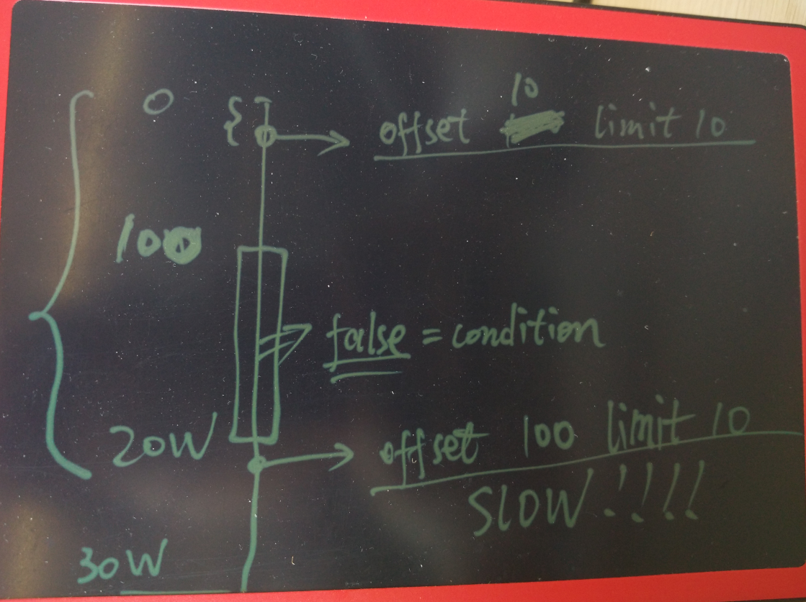

# PostgreSQL OFFSET 質變 — 數據分佈斷層引發的掃描放大

> 來源：[digoal - PostgreSQL 数据访问 offset 的质变 case (2016-07-15)](https://github.com/digoal/blog/blob/master/201607/20160715_02.md)

---

## 1. 問題本質：OFFSET 不是從偏移點開始掃描

OFFSET 不是「跳過 N 行後再開始讀取」，而是**前面的 N 行仍然需要被完整掃描、過濾、丟棄**。當數據分佈存在斷層時，性能會出現劇烈的「質變」。



如上圖：一個 node 有 30 萬 row，前 100 row 滿足條件，100 到 20 萬 row 都不滿足，之後才再次出現滿足條件的 row。

- `OFFSET 10 LIMIT 10`：掃描前 20 row → 極快
- `OFFSET 100 LIMIT 10`：必須掃描 100 到 20 萬之間的 **199,900 row 全部不滿足的 row**，才能找到下一個滿足條件的結果

OFFSET + LIMIT 的成本取決於 **條件匹配的第一條滿足 row 之前的總 row 數**，而非 OFFSET 的數值本身。這就是「質變」的來源——在數據斷層處，OFFSET 加 1 可能導致掃描量跳升數萬倍。

> 補充（Senior Dev）：這與之前討論的「OFFSET 導致 function call 放大」是兩個獨立的性能問題：
> | 問題 | 成因 | 放大對象 |
> |------|------|---------|
> | **Function call 放大** | OFFSET 在 SELECT list 計算之後過濾 | VOLATILE function / expensive expression |
> | **掃描放大（本文）** | OFFSET 需要遍歷所有前置 tuple | Index/Seq Scan 的 row 處理量 |
> 兩個問題會疊加：一個查詢中既有 OFFSET 又有 `f()` → 前置 tuple 全都執行 `f()` 再掃描再丟棄。

---

## 2. 模擬實驗：數據斷層觸發質變

### 建立 1000 萬 row 表

```sql
CREATE TABLE tbl (id int PRIMARY KEY, info text);
INSERT INTO tbl SELECT generate_series(1, 10000000), '';

-- 將 info='test' 散佈在兩個區間：
--   id < 1000（前 1000 row）
--   和 id BETWEEN 5000000 AND 5000100（中間有 500 萬的空窗）
UPDATE tbl SET info = 'test'
    WHERE id < 1000 OR id BETWEEN 5000000 AND 5000100;
-- 總共 1100 row 被更新
```

### Phase 1：OFFSET 100 LIMIT 10（匹配 row 在附近，極快）

```sql
EXPLAIN (ANALYZE, BUFFERS)
SELECT * FROM tbl WHERE info = 'test' ORDER BY id OFFSET 100 LIMIT 10;
```

```
 Limit  (actual time=0.154..0.343 rows=10 loops=1)
   Buffers: shared hit=603
   ->  Index Scan using tbl_pkey on tbl
         (actual time=0.019..0.293 rows=110 loops=1)
         Filter: (info = 'test')
         Rows Removed by Filter: 0        ← 無浪費
         Buffers: shared hit=603
 Execution time: 0.386 ms                 ← 極快
```

這裡 OFFSET 100 只跳過了前面緊湊分佈的匹配 row，Index Scan 總共只處理了 110 row（前 110 row 全部滿足 `info='test'`）。

### Phase 2：OFFSET 1000 LIMIT 100（跨越斷層，性能崩潰）

```sql
EXPLAIN (ANALYZE, BUFFERS)
SELECT * FROM tbl WHERE info = 'test' ORDER BY id OFFSET 1000 LIMIT 100;
```

**Planner 選擇 Seq Scan 的版本：**

```
 Limit  (actual time=952.266..952.330 rows=100 loops=1)
   Buffers: shared hit=44260
   ->  Sort  (actual time=951.892..952.102 rows=1100 loops=1)
         Sort Key: id
         Sort Method: quicksort  Memory: 100kB
         ->  Seq Scan on tbl
               (actual time=951.167..951.496 rows=1100 loops=1)
               Filter: (info = 'test')
               Rows Removed by Filter: 9998900   ← 幾乎整個表都掃完
               Buffers: shared hit=44260
 Execution time: 952.375 ms              ← 從 0.39ms 暴增到 952ms（2440x）
```

**強制 Index Scan 的版本**（`SET enable_seqscan = off`）：

```
 Limit  (actual time=888.400..888.519 rows=100 loops=1)
   Buffers: shared hit=38991
   ->  Index Scan using tbl_pkey on tbl
         (actual time=0.033..888.267 rows=1100 loops=1)
         Filter: (info = 'test')
         Rows Removed by Filter: 4999000    ← 掃了 500 萬 row 都是不匹配的！
         Buffers: shared hit=38991
 Execution time: 888.632 ms
```

Index Scan 按 `id` 順序掃描。前 1000 row 匹配後，`id` 繼續遞增但 `info` 不再匹配——必須掃過 500 萬 row 才再次找到匹配。`Rows Removed by Filter: 4999000` 清楚展示了這 500 萬 row 都是白掃的。

### Phase 3：LIMIT 超過總匹配數（強制掃完全表）

```sql
EXPLAIN (ANALYZE, BUFFERS)
SELECT * FROM tbl WHERE info = 'test' ORDER BY id OFFSET 1000 LIMIT 10000;
```

```
 Limit  (actual time=898.675..1786.476 rows=100 loops=1)
   Buffers: shared hit=74776
   ->  Index Scan using tbl_pkey on tbl
         (actual time=0.030..1786.240 rows=1100 loops=1)
         Filter: (info = 'test')
         Rows Removed by Filter: 9998900    ← 全表 1000 萬 row 都掃了
         Buffers: shared hit=74776
 Execution time: 1786.536 ms
```

因為 LIMIT 10000 但總匹配只有 1100 row，OFFSET 1000 後只剩 100 row。Planner 無法預先知道總匹配數（除非統計資訊極度精準），所以需要掃完整個 index 直到 EOF 才能確認「沒有更多 matching row 了」。

> 補充（Senior Dev）：三階段的成本數據對比：
>
> | Phase | OFFSET | Buffers | Rows Removed by Filter | Runtime | 放大器 |
> |-------|:------:|--------|:----------------------:|--------:|:------:|
> | 1 | 100 | 603 | 0 | 0.39 ms | 1x |
> | 2 (Seq) | 1000 | 44,260 | 9,998,900 | 952 ms | 2440x |
> | 2 (Idx) | 1000 | 38,991 | 4,999,000 | 889 ms | 2280x |
> | 3 | 1000 | 74,776 | 9,998,900 | 1786 ms | 4580x |
>
> 注意 Phase 2 中 Seq Scan 和 Index Scan 的 buffers 差異（44K vs 39K）。Index Scan 的 buffers 較少因為它只讀 index page + heap page（含 visibility map check），Seq Scan 則必讀完整的 heap pages。但在 I/O 層面，如果 data 不在 cache 中，Index Scan 的 39K random read 可能比 Seq Scan 的 44K sequential read 更慢——這與前一篇關於 correlation 的結論一致。

---

## 3. Production 真實案例：OFFSET 10 觸發 140 萬行掃描

一位開發同事的 SQL，只改了 OFFSET 值，查詢速度從毫秒暴增到幾十秒。

### 快速版本（OFFSET 0）：

```sql
SELECT *
FROM tbl
WHERE create_time >= '2014-02-08' AND create_time < '2014-02-11'
  AND x = 3
  AND id != '123'
  AND id != '321'
  AND y > 0
ORDER BY create_time LIMIT 1 OFFSET 0;
-- 100ms
```

### 慢速版本（OFFSET 10）：

```sql
SELECT *
FROM tbl
WHERE create_time >= '2014-02-08' AND create_time < '2014-02-11'
  AND x = 3
  AND id != '123'
  AND id != '321'
  AND y > 0
ORDER BY create_time LIMIT 1 OFFSET 10;
-- 幾十秒
```

兩個 SQL 的 execution plan 幾乎一樣（都用 `create_time` index scan + Filter），但前者 `OFFSET 0` 很快就碰到滿足條件的 row，後者 `OFFSET 10` 需要跳過前 10 row，而在這 10 row 之後存在大量不滿足 Filter 條件的 row。

### 量化掃描量

取到 OFFSET 10 的 `create_time` 值後，可以估算掃描量：

```sql
SELECT COUNT(*)
FROM tbl
WHERE create_time <= '2014-02-08 18:38:35.79'
  AND create_time >= '2014-02-08';
-- count: 1,448,081
```

僅僅 OFFSET 10，就需要掃描約 **144 萬 row**，其中絕大多數都被 Filter 丟棄。這就是「質變」的具體數字。

---

## 4. 解決方案：Keyset Pagination（Seek Method）

根本方案是**不使用 OFFSET**，改用 keyset-based pagination：

### 原理

每次查詢記錄「最後一條結果」的排序鍵值 + 唯一鍵，下一頁用 `WHERE` 從該位置之後繼續：

```sql
-- 第 1 頁（OFFSET 0）
SELECT * FROM tbl
WHERE create_time >= '2014-02-08' AND create_time < '2014-02-11'
  AND x = 3 AND id != '123' AND id != '321' AND y > 0
ORDER BY create_time, pk
LIMIT 10;

-- 得到最後一條的 create_time = '2014-02-08 10:30:00', pk = 5678

-- 第 2 頁（代替 OFFSET 10）
SELECT * FROM tbl
WHERE create_time >= '2014-02-08' AND create_time < '2014-02-11'
  AND x = 3 AND id != '123' AND id != '321' AND y > 0
  AND (create_time, pk) > ('2014-02-08 10:30:00', 5678)  -- ← 從這裡開始
ORDER BY create_time, pk
LIMIT 10;
```

### 關鍵細節

```sql
-- 如果 ORDER BY 的 column 非 unique（如 create_time 可能重複）
-- 必須加 PK 作為 tie-breaker，用 row value comparison：
AND (create_time, pk) > (last_time, last_pk)

-- 等價的傳統寫法（PG 9.4- 無 row comparison）：
AND (
    create_time > last_time
    OR (create_time = last_time AND pk > last_pk)
)
-- 或：
AND create_time >= last_time
AND pk NOT IN (last_page_matching_pks)
```

| 方案 | 優點 | 缺點 |
|------|------|------|
| **Keyset Pagination** | O(1) per page，無論 offset 多大 | 無法直接跳到第 N 頁，只能逐頁翻 |
| **OFFSET + LIMIT** | 可任意跳頁 | O(offset+N) 掃描量，大 offset 性能崩潰 |
| **CURSOR**（`DECLARE c CURSOR ... FETCH`） | server-side state，適合 streaming | 需 hold transaction or `WITH HOLD`，占用 server resource |

> 補充（Senior Dev）：**Row value comparison** `(a, b) > (c, d)` 是 PG 特有的語法糖，Planner 會將它轉換為等價的 AND/OR 條件，**並且可以使用 (a, b) 上的 composite index**。如果不使用 row comparison，手寫 `a >= last_a AND (a > last_a OR b > last_b)` 的 planner 可能無法正確利用 composite index 的排序特性。
>
> **Tie-breaker 的必要性**：如果 `ORDER BY` 的 column 不是 unique 的（如僅 `ORDER BY create_time`），同一個 `create_time` 值可能對應多 row。OFFSET 10 可能跳過 10 row，但另一筆同 `create_time` 的 row 可能因為 query plan 的 non-determinism 出現在不同批次的結果中，導致重複或漏頁。`ORDER BY create_time, pk` 保證了 deterministic ordering。
>
> **Web/API 層的實作**：API response 中回傳 `next_cursor`（base64 encoded last sort keys），client 下次請求帶 `?cursor=xxx`。這在 GraphQL Relay spec、Twitter API、Stripe API 中都是標準 pagination 模式。

---

## 5. Index Scan 中的 Filter 成本：`Rows Removed by Filter` 解讀

當 Index Scan 中包含非 index column 的 Filter 條件時，每個 index entry 指向的 heap row 都要被回表檢查：

```
Index Scan using idx on tbl
   Index Cond: (create_time >= '...' AND create_time < '...')
   Filter: (id != '123' AND id != '321' AND y > 0 AND x = 3)
   Rows Removed by Filter: 1440000   ← 這裡就是質變的量化指標
```

`Rows Removed by Filter` = index 找到的 row 中被 Filter 條件篩掉的數量。這個值越大，說明 index 的選擇性越差（index column 覆蓋度不足）。

| 指標 | 說明 |
|------|------|
| `Index Cond` | 真正用來縮小 index scan range 的條件（走 index B-tree 結構） |
| `Filter` | index scan 後逐 row 檢查的附加條件（不做 index 定位，只是 heap tuple 回表後的 CPU 過濾） |
| `Rows Removed by Filter` | 被 Filter 篩掉的 row 數 = 白掃的量 |

> 補充（Senior Dev）：**優化方向**：
> 1. **讓 Filter 條件變成 Index Cond**：把 `x` 或 `y` 加入 composite index。但代價是 index 變大、寫入變慢。需要在「查詢加速」和「寫入成本」之間權衡。
> 2. **Partial Index**：如果 `x = 3` 是少數情況，可以 `CREATE INDEX ... WHERE x = 3` 讓 index 只包含這些 row，大幅減小 index size 和 scan range。
> 3. **Covering Index（INCLUDE）**：讓回表變 Index Only Scan，省掉 heap page read。
> 4. **`pg_stat_statements` 監控**：query 中的 `shared_blks_hit + shared_blks_read` 過大但 `rows` 很小 → 幾乎肯定是 OFFSET 掃描放大。
