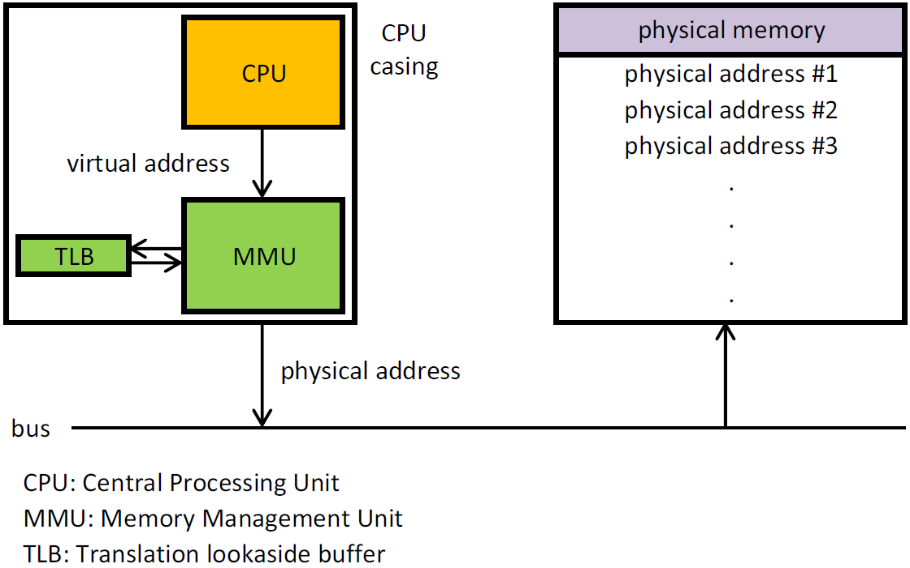

# Linux Page Fault 對 PostgreSQL 的性能影響

> 來源：[digoal - page fault带来的性能问题 (2016-07-25)](https://github.com/digoal/blog/blob/master/201607/20160725_06.md)
>
> 更新於 2026-05-17，補充 huge_pages、NUMA、THP 與現代 Kernel 演進

---

## 記憶體定址基礎

### MMU（Memory Management Unit）

Linux 程序不直接存取物理記憶體，而是透過 MMU 管理虛擬地址 → 物理地址的映射。每個程序有獨立的虛擬地址空間。MMU 將物理記憶體分割成 page（通常是 4KB），管理兩者之間的映射關係。



因為是映射，同一虛擬 page 在不同時間點可能出現在物理記憶體中的不同位置（發生 page swap 時）。這種間接層讓 OS 可以：
- 給每個程序獨立的地址空間（隔離、安全）
- 實作 swap（物理記憶體不足時將 page 暫存磁盤）
- 實作 shared memory（多程序共享同一物理 page）

### 為什麼需要虛擬地址？

假設程序需要 4MB，但物理記憶體只有 1MB。若直接使用物理地址，程序無法啟動。虛擬地址讓 OS 只需將當前 work set 保留在物理記憶體中，其他 page 可暫時不在物理記憶體。

---

## Page Fault 類型

當程序訪問虛擬地址中的 page 但該 page 不在物理記憶體中時，CPU 無法執行，Linux 產生 page fault interrupt。

| 類型 | 別名 | 觸發條件 | 處理方式 |
|------|------|---------|---------|
| **Major (Hard)** | Hard Page Fault | page 既不在虛擬地址空間，也不在物理記憶體 | 從慢速設備（磁盤/swap）讀入，建立映射 |
| **Minor (Soft)** | Soft Page Fault | page 在物理記憶體中，但程序尚未建立映射 | 只需 MMU 建立映射關係（純 CPU，無 I/O） |
| **Invalid** | Segmentation Fault | 訪問的地址超出程序虛擬地址空間範圍 | `SIGSEGV`，程序 crash |

常見 Minor Page Fault 場景：多程序訪問同一塊 shared memory（如 PostgreSQL `shared_buffers`），新 fork 的 worker process 尚未建立與該物理 page 的映射。

常見 Major Page Fault 場景：data page 被 swap out 後程序再次訪問（→ 從 swap 讀回物理記憶體）。

---

## Working Set & Swap & OOM

### Working Set

程序當前在物理記憶體中的 page 集合。隨系統運行可擴大或縮小：
- **擴大**：程序訪問更多記憶體
- **縮小**：其他程序需要記憶體且物理記憶體不足 → OS 將 clean page 標記為 free，dirty page swap 到交換分區

Shrink 遵循 LRU（內核 memory aging）演算法。

### Swap

Clean page（讀入後未修改）直接 free，不寫盤。
Dirty page（修改過）需寫回 disk 或 swap 到交換分區。

```bash
# 查看 swap 使用
sar -S 1
```

### 何時需要加 RAM

若 `sar -B` 顯示頻繁 swap in/out（`pgpgin/s` / `pgpgout/s` 持續高 → dirty page 被 swap out，緊接又被程序訪問 → hard page fault），即物理記憶體真的不夠用。

### OOM（Out of Memory）

當所有 page 已 free、所有可 swap 的已 swap out，仍無法滿足記憶體需求時 → Linux OOM Killer 挑選並 kill 程序。

---

## Linux Page 統計指標（sar -B）

| 指標 | 說明 |
|------|------|
| `pgpgin/s` | 每秒從 disk paged in 的 KB |
| `pgpgout/s` | 每秒 paged out 到 disk 的 KB |
| `fault/s` | 每秒 page fault 次數（major + minor） |
| `majflt/s` | 每秒 major fault（需要 disk I/O） |
| `pgfree/s` | 每秒放到 free list 的 page 數 |
| `pgscank/s` | kswapd daemon 每秒掃描的 page 數 |
| `pgscand/s` | 程序直接觸發掃描的 page 數 |
| `pgsteal/s` | 每秒從 cache 回收的 page 數 |
| `%vmeff` | `pgsteal / pgscan` — page reclaim 效率（接近 100% = 良好，<30% = VM 壓力大） |

---

## PostgreSQL 案例：大 shared_buffers 的啟動低潮

### 現象

PostgreSQL `shared_buffers` 設定極大時（如 240GB），剛啟動的高並發 COPY 壓測會有一段性能低谷。

原因：shared_buffers 對應的程序虛擬地址空間在剛 allocate 時尚未映射到物理 page。程序 write 到這些地址時觸發大量 **minor page fault**（非 disk I/O——shared_buffers page 是 OS 分配的匿名頁，不需從 disk 讀），中斷頻率高，CPU 花在 page fault handler 上。

### 實測數據

**shared_buffers 填滿前（~2.8 GB/s import）：**

```
fault/s: 40058, majflt/s: 0.00    ← 大量 minor fault
%vmeff: 99.95
pgfree/s: 142064                  ← 大量 page 分配
import speed: 2.8 GB/s
```

**shared_buffers 填滿後（~4.7 GB/s import）：**

```
fault/s: 823 → 743 → 326           ← minor fault 驟降
import speed: 4.7 GB/s             ← 性能提升 ~68%
```

`majflt/s` 始終為 0（因為 shared_buffers 的 page 是 anonymous page，不涉及 disk I/O），瓶頸是 minor fault 的 interrupt 開銷。

---

## 現代化解方

### 1. huge_pages（PG 9.4+）

使用 2MB 或 1GB huge page 取代 4KB 標準 page：

```ini
# postgresql.conf
huge_pages = on          # PG 9.4+，使用 huge page（若 OS 配置了）
# huge_pages = try       # PG 14+ 預設，有則用，無則 fallback 4KB
```

| Page Size | TLB entries for 240GB | TLB Miss Reduction |
|-----------|----------------------|-------------------|
| 4KB | 62,914,560 | baseline |
| 2MB | 122,880 | 512x fewer entries |
| 1GB | 240 | 262,144x fewer entries |

Huge page 降低 TLB miss + page table walk overhead，equivalent to reducing page fault count（minor fault 時 MMU 查 page table 的成本更少）。

OS 配置（Linux）：

```bash
# 計算所需 huge page 數（以 2MB huge page 為例）
# shared_buffers(GB) * 1024 / 2  = 240 * 512 = 122,880
sysctl -w vm.nr_hugepages=122880

# 持久化
echo "vm.nr_hugepages=122880" >> /etc/sysctl.conf
```

> 補充（Senior Dev）：**Transparent Huge Pages (THP)** 與 PostgreSQL 是已知的不相容組合。THP 的 compaction 會導致 sudden latency spike，建議關閉：

```bash
echo never > /sys/kernel/mm/transparent_hugepage/enabled
echo never > /sys/kernel/mm/transparent_hugepage/defrag
```

PG 15+ 在啟動時會檢查 THP 狀態並在 log 中提示（若啟用 THP）。

### 2. 預熱 shared_buffers（PG 10+）

```sql
-- PG 10+ pg_prewarm extension
CREATE EXTENSION pg_prewarm;
SELECT pg_prewarm('table_name');                    -- 預熱特定表
SELECT pg_prewarm(relation::regclass) FROM pg_class; -- 預熱全部
```

`pg_prewarm` 將 table/index page 載入 shared_buffers（或 OS page cache），避免 startup 時的 page fault 風暴。

### 3. NUMA Awareness

大 shared_buffers 在 NUMA 架構上若分配不均衡，部分 CPU 訪問 remote memory node 會導致 latency 上升。

```bash
# 關閉 NUMA zone reclaim（讓 OS 在分配 page 時不過度考量 local node）
sysctl -w vm.zone_reclaim_mode=0

# postgresql.conf：強制 shared_buffers 使用 interleave 分配（分散到各 NUMA node）
# 搭配 numactl --interleave=all 啟動 PostgreSQL
```

> 補充（Senior Dev）：Linux kernel 5.x+ 對 NUMA balancing 有大幅改善。若使用 PG 16+ 搭配 kernel 5.15+，一般不需手動 interleave。監控 `numastat -p <pg_pid>` 確認各 node 分配均勻即可。

### 4. vm.overcommit 設定

```bash
# 允許 overcommit（PG 分配 shared_buffers 時為匿名 page，需 overcommit 空間）
sysctl -w vm.overcommit_memory=2
sysctl -w vm.overcommit_ratio=90    # 90% 物理記憶體為 commit limit
```

---

## 版本演進

| 功能 | 版本 | 說明 |
|------|------|------|
| `huge_pages = on` | PG 9.4 | 靜態 huge page 支援 |
| `pg_prewarm` | PG 10 | 預熱 shared_buffers |
| `huge_pages = try` | PG 14 | 預設自動嘗試 huge page |
| THP 相容性提示 | PG 15 | 啟動時 log THP 狀態 |
| `vm.nr_hugepages` 動態調整 | Kernel 5.x+ | huge page 可在運行時增加 |

## 參考

- [Red Hat: Virtual Memory Details](https://access.redhat.com/documentation/en-US/Red_Hat_Enterprise_Linux/3/html/Introduction_to_System_Administration/s1-memory-virt-details.html)
- [Wikipedia: Page fault](https://en.wikipedia.org/wiki/Page_fault)
- [Wikipedia: MMU](https://en.wikipedia.org/wiki/Memory_management_unit)
- [德哥: 大 shared_buffers COPY 性能 case](https://yq.aliyun.com/articles/8528)
