# 一、PostgreSQL 欄位順序：ADD COLUMN 的物理限制、View 虛擬修改與 Byte Alignment 效能影響

> 來源：
> - [digoal - PostgreSQL 將字段加入指定位置 — 表字段位置的"虛擬修改"實現 (2016-02-29)](https://github.com/digoal/blog/blob/master/201602/20160229_01.md)
> - 延伸討論：Byte Alignment 對 Row Width、Page I/O、Recheck Cond 的全鏈路效能影響

---

DBA 問「欄位加在哪裡」表面上是順序問題，實質觸及三個層面：

1. PostgreSQL **物理儲存機制**：ADD COLUMN 永遠加在末尾
2. **虛擬修改方案**：Simple View 重排欄位外觀的 trade-off
3. **更深層的效能問題**：欄位排列順序如何影響 Byte Alignment → Row Width → Page Density → I/O / Memory / CPU

---

## 1. PostgreSQL 的物理現實：ADD COLUMN 永遠在末尾

### I. 新手入門：什麼是 pg_attribute？

PostgreSQL 將所有表的「元資訊」（meta information）儲存在一系列名為 **system catalog**（系統目錄）的特殊表中。這些表就像「表的表」——它們記錄了你有哪些表、每個表有哪些欄位、每個欄位是什麼型別等資訊。

其中最重要的系統目錄之一是 **`pg_attribute`（屬性目錄）**。它記錄了資料庫中每一個表、每一個欄位的詳細資訊：

| pg_attribute 關鍵欄位 | 含義 |
|---|---|
| `attname` | 欄位名稱 |
| `attnum` | 欄位在表中"物理排列位置"的編號（數字順序） |
| `attisdropped` | 該欄位是否已被刪除（DROP） |
| `atttypid` | 欄位的資料型別 |

PostgreSQL 在讀取一行資料時，**依照 `attnum` 的順序來解釋每個欄位**。`attnum = 1` 就是第一個欄位、`attnum = 2` 是第二個，以此類推。

### II. 物理儲存：tuple（資料行）的內部結構

在 PostgreSQL 內部，每一行資料被稱為一個 **tuple**（這個詞來自關聯式資料庫理論，你可以理解為"一行記錄"）。一個 tuple 在磁盤（或記憶體）中是連續存放的位元組序列：

1. 先放系統欄位（system columns）的資訊
2. 再依序放你定義的每個欄位

這些系統欄位像「隱藏的附加資訊」，用負數標記（`attnum` < 0），你無法在 `SELECT *` 中看到他們，但 PostgreSQL 會用它們管理 MVCC（多版本並行控制）和定位實體行。

```sql
SELECT attname, attnum, attisdropped
FROM pg_attribute
WHERE attrelid = 'tbl'::regclass;
```

```
 attname  | attnum | attisdropped
----------+--------+--------------
 tableoid |     -7 | f        -- 每一行所屬資料表的 OID（用於分割表/繼承時分辨來自哪個子表）
 cmax     |     -6 | f        -- 刪除該行時所在事務內的指令 ID（Command ID）
 xmax     |     -5 | f        -- 刪除或鎖定該行的事務 ID（未被刪除時為 0）
 cmin     |     -4 | f        -- 插入該行時所在事務內的指令 ID
 xmin     |     -3 | f        -- 插入該行的事務 ID
 ctid     |     -1 | f        -- 該行的實體位置（block 號 + 位移），UPDATE 後會改變
 id       |      1 | f        -- 使用者定義欄位
 info     |      2 | f        -- 使用者定義欄位
 crt_time |      3 | f        -- 使用者定義欄位（推測為建立時間）
 c1       |      4 | f        -- 使用者定義欄位
(10 rows)
```

- 前 6 個是 **系統欄位**（system column：`tableoid`、`cmax`、`xmax`、`cmin`、`xmin`、`ctid`），`attnum` 為負數
- 用戶欄位從 `attnum = 1` 開始遞增
- `ALTER TABLE ... ADD COLUMN` 只會將新欄位設為最大的 `attnum`，即**永遠加在末尾**
- 不支援 MySQL 的 `ALTER TABLE t ADD COLUMN c1 INT AFTER id` 語法

**為什麼不支援中間插入？** 因為這需要 PostgreSQL 重寫整個表的資料檔案——把每一行現有資料的位元組序列「拆開」，在中間插入新欄位的空間。對於有數億行的大表，這種操作會鎖定整個表數小時甚至數天。PostgreSQL 選擇了「追加在末尾」的設計，ADD COLUMN 瞬間完成（僅更新系統目錄的 metadata）。

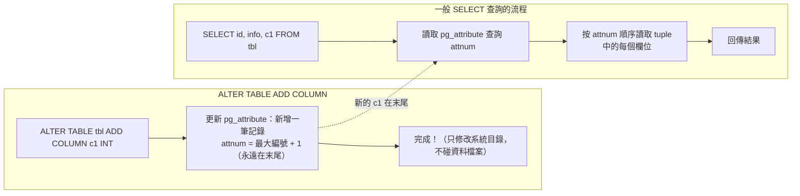

> 補充（Senior Dev）：`pg_attribute.attnum` 是 int16，欄位一旦被 DROP（變為 `attisdropped = t`），其 `attnum` **不會被回收復用**。長期頻繁 ADD/DROP column 的表會因為 `attnum` 耗盡（上限 1600）而需要 `VACUUM FULL` 或重建表。

---

## 2. Simple View 虛擬修改：外觀順序 vs 物理順序

### I. 新手入門：什麼是 View？

**View（視圖）** 可以理解為「儲存好的查詢語句」——它本身不存資料，只是一個 SQL 查詢的別名。當你 `SELECT * FROM view_name`，PostgreSQL 會自動把這個查詢轉換成 View 定義內的 SQL，然後去真正的表取資料。

PostgreSQL 的 **Simple View** 更特別：如果一個 View 只包含單表的直出查詢（無 JOIN、無 GROUP BY、無 DISTINCT），PostgreSQL 會給這個 View **自動生成 INSERT/UPDATE/DELETE 規則**。這意味你可以像操作真實表一樣對 View 做增刪改操作——PostgreSQL 會自動把操作轉發到底層的表。

當你想改變欄位的"邏輯顯示順序"而不想重建整個表時，Simple View 就是一個輕量的解決方案。

#### a. 欄位順序何時會有影響？

如果你總是用 `SELECT id, info, c1 FROM tbl` 明確指定順序，那 View 確實多餘。但以下場景依賴 `SELECT *` 回傳的欄位順序：

```csharp
// .NET 8 + ADO.NET / Dapper 用 position (ordinal) 取值
using var cmd = new NpgsqlCommand("SELECT * FROM tbl", conn);
using var reader = cmd.ExecuteReader();
while (reader.Read())
{
    int id = reader.GetInt32(0);       // 寫死取第 1 個
    string info = reader.GetString(1);  // 寫死取第 2 個
    DateTime ts = reader.GetDateTime(2); // 寫死取第 3 個
}

// ALTER TABLE tbl ADD COLUMN c1 INT;
// c1 被加在末尾 (attnum=4)
// SELECT * 現在回傳：id | info | crt_time | c1
// → GetDateTime(2) 還是 crt_time，不受影響

// 但若 DBA 重建表把 c1 排在 crt_time 前面：
// SELECT * 現在回傳：id | info | c1 | crt_time
// GetDateTime(2) 取到的是 c1 (int) → InvalidCastException
```

> - 若應用程式用 **Dapper 的型別對映**、**Entity Framework**（property binding），這些是依名稱（column name）匹配，順序無關，`SELECT *` 順序改變不影響。
> - 只有用 **index / ordinal** 取值（`GetInt32(0)`、`reader[0]`、DataTable.Columns[2]）時，欄位順序變更才會引發 runtime bug。

### II. 實作

```sql
CREATE TABLE tbl (id INT, info TEXT, crt_time TIMESTAMP);
ALTER TABLE tbl ADD COLUMN c1 INT;

-- 用 View 重排欄位：c1 被「放到」crt_time 之前
CREATE VIEW v_tbl AS
  SELECT id, info, c1, crt_time FROM tbl;
```

```sql
INSERT INTO v_tbl VALUES (1, 'test', 2, now());

SELECT * FROM v_tbl;
--  id | info | c1 |          crt_time
-- ----+------+----+----------------------------
--   1 | test |  2 | 2016-02-29 14:07:19.171928

SELECT * FROM tbl;
--  id | info |          crt_time          | c1
-- ----+------+----------------------------+----
--   1 | test | 2016-02-29 14:07:19.171928 |  2
```

View 中的 `c1` 在 `crt_time` 之前；基表中 `c1` 仍在末尾。`pg_attribute` 物理順序不變。

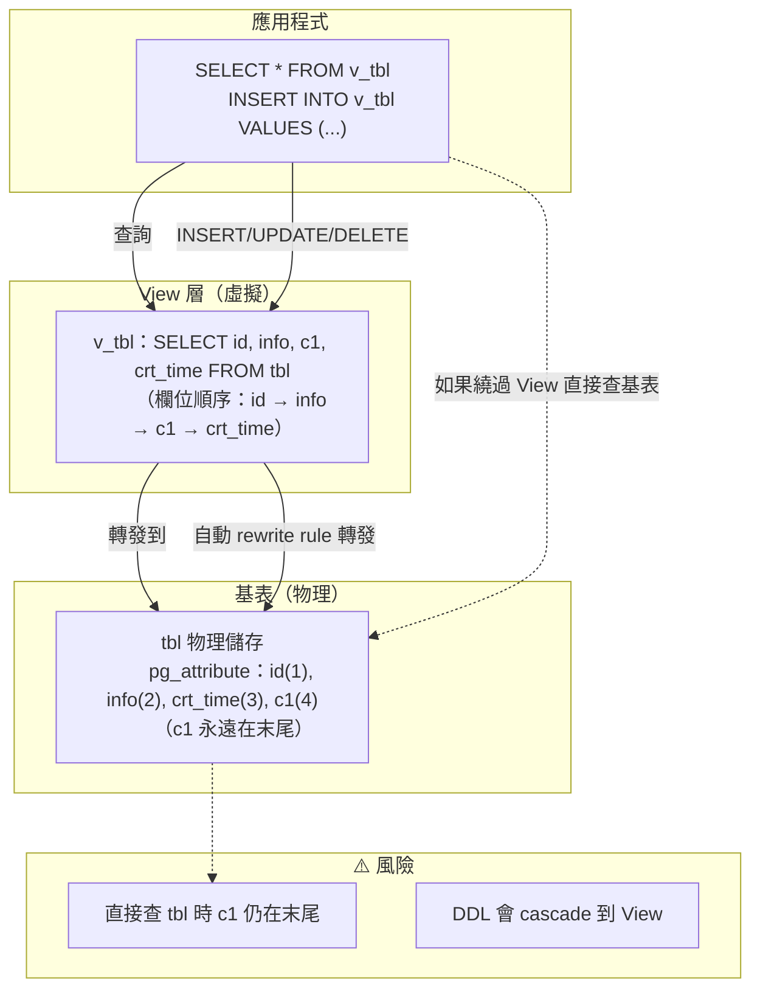

### III. 優點

- 滿足應用層欄位邏輯排列需求，不需改動 SQL
- 避免昂貴的表重寫（`ALTER TABLE ... ALTER COLUMN ... SET DATA TYPE` 或 `VACUUM FULL`），View 創建是瞬間的 metadata 操作

### IV. 代價

**僅是 View，非物理真實**：任何繞過 View 直接查詢基表的操作看到的是原始末尾順序。

**DDL 傳染性**：對基表執行 DDL 會 cascade 到 View：

```sql
ALTER TABLE tbl DROP COLUMN info;
-- ERROR: cannot drop table tbl column info because other objects depend on it
-- DETAIL: view v_tbl depends on table tbl column info
```

必須 `DROP ... CASCADE` 後重建 View：

```sql
ALTER TABLE tbl DROP COLUMN info CASCADE;
-- NOTICE: drop cascades to view v_tbl

CREATE VIEW v_tbl AS SELECT id, c1, crt_time FROM tbl;
```

被 DROP 的欄位在 `pg_attribute` 中變為 `attisdropped = t`，`attnum` 仍佔用不釋放：

```
 attname            | attnum | attisdropped
--------------------+--------+--------------
 id                 |      1 | f
 ........pg.dropped.2........ |      2 | t   -- DROP 後仍佔位
 crt_time           |      3 | f
 c1                 |      4 | f
```

**維護成本**：每次基表結構變更都需同步更新 View 定義。德哥原話：「万不得已，也不要这么用。除非业务上不想改SQL。」

> 補充（Senior Dev）：Simple View 的自動 rewrite rule 在 PG 9.3+ 的運作原理：當 View 是 `SELECT * FROM single_table`（無 JOIN、無 DISTINCT、無 GROUP BY、無 LIMIT）時，PG 會將其標記為 auto-updatable，自動生成 INSERT/UPDATE/DELETE rule。這讓 View 行為接近真正的 table，但 rule-based rewrite 在複雜條件下可能產生非直覺行為（如 `RETURNING` clause 在不同 PG 版本的表現不一致）。若需要更可控的 DML 行為，建議用 `INSTEAD OF` trigger on View。

---

## 3. Byte Alignment：欄位順序如何影響 Row Size 與全鏈路效能

DBA 關心「欄位加在哪裡」，表面是順序問題，**深層是物理儲存效率**。

### I. 新手入門：什麼是 Byte Alignment（位元組對齊）？

**Byte Alignment** 是 CPU 讀取記憶體的「交通規則」。想像一條馬路劃分成固定間距的停車格：

- CPU 讀取一個 8 bytes 的 `bigint` 時，必須從「8 的倍數」的位置開始讀（如位置 0、8、16、24...）
- CPU 讀取一個 4 bytes 的 `integer` 時，必須從「4 的倍數」的位置開始讀（如位置 0、4、8、12...）

如果資料不遵守這個規則（例如把 `bigint` 放在位置 1），現代 CPU 雖然某些架構可以強行讀取（unaligned access），但代價是**比對齊讀取慢數倍**，有些架構甚至直接報錯。為了保證效能，PostgreSQL 在儲存每一行時，自動在欄位之間插入「無用的空白位元組」讓每個欄位都對齊——這些空白稱為 **padding**。

**類比**：就像整理書架時，如果你把一本超寬的精裝書（8 bytes 的 bigint）塞在兩本小冊子之間，書架必須留出大量空隙才能放穩。但如果你把最大的書放在最左邊，依序往右放小書，空隙就很少。

### II. 數據頁（Page）是 I/O 的最小單位

PostgreSQL 讀寫數據以 **8KB page** 為最小單位，不是以 row 為單位。查詢一行，會把包含該行的整個 8KB page 從 disk 讀入 shared_buffers（PostgreSQL 的記憶體快取區）。

**類比**：這就像在圖書館找一本書——你不能只拿書中的一頁，你必須把整本書（page）從書架拿下來。

**Row Width ↑ → Rows per Page ↓ → I/O ↑ → Memory Cache Efficiency ↓**

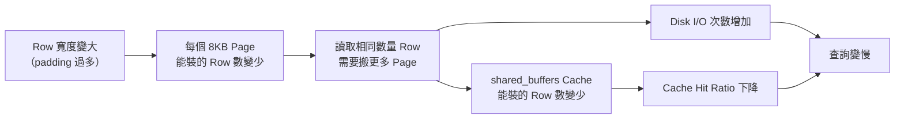

### III. 為什麼 Row Width 受 Column Order 影響？

CPU 存取不同 data type 需要**記憶體對齊（Byte Alignment）**：

| Type | Size | Alignment |
|------|------|-----------|
| `bigint` / `timestamp` / `timestamptz` / `double precision` | 8 bytes | 8-byte boundary |
| `integer` / `real` / `date` | 4 bytes | 4-byte boundary |
| `smallint` | 2 bytes | 2-byte boundary |
| `boolean` / `char` / `"char"` | 1 byte | 1-byte boundary |

如果一個 8-byte 對齊的 column 前面的 column 總長度不是 8 的倍數，PG 會在**中間插入無用的 padding byte** 來對齊。

### IV. 具體例子

假設四個 column：`c1 bool` (1B), `c2 bigint` (8B), `c3 bool` (1B), `c4 int` (4B)

**對齊規則**：每個欄位的起始位置（offset）必須能被該型別的 alignment 整除。例如 `bigint` alignment = 8，代表起始 offset 必須是 8 的倍數（0、8、16...）；`int` alignment = 4，起始 offset 必須是 4 的倍數。若當前 offset 不滿足，PG 就插入空白（padding）直到對齊。

---

**差順序：`bool → bigint → bool → int`**（依欄位建表順序排列，未優化）

逐步計算：

```
Step 1: c1 (bool, 1B, alignment=1)
        起始 offset = 0（0 % 1 = 0 ✓）
        佔用 0 → 0，結束於 offset 1

Step 2: c2 (bigint, 8B, alignment=8)
        當前 offset = 1，但 bigint 需要 8 的倍數
        下一個 8 的倍數是 8 → 需 padding = 8 − 1 = 7 bytes
        起始 offset = 8，佔用 8 → 15，結束於 offset 16

Step 3: c3 (bool, 1B, alignment=1)
        當前 offset = 16（16 % 1 = 0 ✓）
        佔用 16 → 16，結束於 offset 17

Step 4: c4 (int, 4B, alignment=4)
        當前 offset = 17，但 int 需要 4 的倍數
        下一個 4 的倍數是 20 → 需 padding = 20 − 17 = 3 bytes
        起始 offset = 20，佔用 20 → 23，結束於 offset 24

最終：MAXALIGN 向上取整（tuple 總長度需為 8 的倍數）
      24 已是 8 的倍數，無需額外 padding
```

Offset 視覺化：

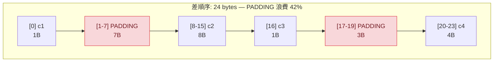

**Row Size = 1 + 7(廢) + 8 + 1 + 3(廢) + 4 = 24 bytes，其中 10 bytes 是浪費的 padding（41.7%）**

---

**好順序：`bigint → int → bool → bool`**（依 alignment 由大至小排列）

逐步計算：

```
Step 1: c2 (bigint, 8B, alignment=8)
        起始 offset = 0（0 % 8 = 0 ✓）
        佔用 0 → 7，結束於 offset 8

Step 2: c4 (int, 4B, alignment=4)
        當前 offset = 8（8 % 4 = 0 ✓），不需 padding
        佔用 8 → 11，結束於 offset 12

Step 3: c1 (bool, 1B, alignment=1)
        當前 offset = 12（12 % 1 = 0 ✓）
        佔用 12 → 12，結束於 offset 13

Step 4: c3 (bool, 1B, alignment=1)
        當前 offset = 13（13 % 1 = 0 ✓）
        佔用 13 → 13，結束於 offset 14

最終：MAXALIGN 向上取整 → 14 不是 8 的倍數，補至 16
      需 padding = 16 − 14 = 2 bytes
```

Offset 視覺化：

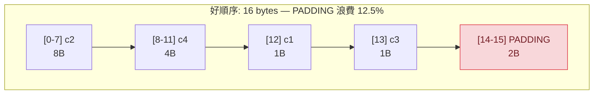

**Row Size = 8 + 4 + 1 + 1 + 2(尾端) = 16 bytes，僅 2 bytes 浪費（12.5%）**

---

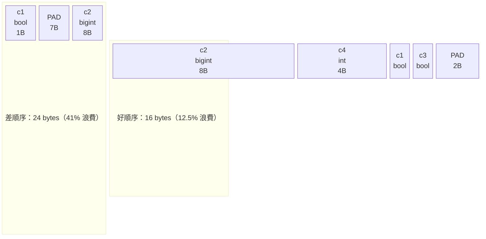

**對比總結**：

| | 差順序 | 好順序 |
|---|---|---|
| 實際資料 | 14 bytes | 14 bytes |
| padding 浪費 | 10 bytes（41%） | 2 bytes（12.5%） |
| 總 row size | 24 bytes | 16 bytes |
| 每 8KB page 可裝 | ~341 rows | ~512 rows |
| **同 page = 多 50% 的資料** | | |

同樣四個欄位、同樣資料，僅排列順序不同 → 每 row 省 8 bytes。對億級大表而言，等於省下數 GB 磁盤空間，一個 page 多裝 50% 的 row，full table scan 時 I/O 次數直接減半。

### V. 效能鏈式反應

這個差異不是單一環節的，而是**全鏈路**：

| 環節 | 影響 |
|------|------|
| **Disk I/O** | Page 固定 8KB。Row 越大，讀取相同 row 數需搬更多 page → 物理 disk read 次數增加 |
| **shared_buffers** | Cache 中能存放的 row 數減少 → cache hit ratio 下降 |
| **Page 讀入後的所有操作** | SQL 引擎需要解析 row 內每個 column 的 offset，跳過 padding byte → CPU 指令增加 |
| **Bitmap Heap Scan 的 Recheck Cond** | Lossy bitmap 把整個 page 讀入後逐 row 重新驗證條件。Row 越寬、padding 越多，逐 row 檢查的 CPU 耗費越大 |
| **Seq Scan 的 Filter** | 沒有 Recheck Cond，但仍有 Filter。同樣需要解析 row 結構、跳過 padding |
| **Index Scan** | 從 index 拿到 TID 後回 Heap 取 row 時，同樣要解析該 page 內的 target row |

> 關鍵澄清：Recheck Cond 只是 bitmap scan 這個特定場景下的二次驗證。但 byte alignment 帶來的效能損耗**不只發生在 Recheck Cond**。任何需要讀取、解析、過濾 row 的操作（Filter、JOIN、aggregate）都會因為 row 內部 padding 過多而增加 CPU 成本。

### VI. 最佳實踐：Column Order 規則

```
1. Fixed-width, high-alignment columns FIRST
   bigint(8), timestamp(8), double precision(8), integer(4), date(4), real(4)

2. Variable-width columns MIDDLE
   text, varchar, numeric, bytea, jsonb

3. Fixed-width, low-alignment columns LAST
   smallint(2), boolean(1), char(1)

4. NULL-able columns AFTER their NOT NULL counterparts of the same alignment
   (nullable columns may need extra null-bitmap handling)
```

> 補充（Senior Dev）：
>
> **怎麼驗證自己的表有 alignment waste？**
> ```sql
> -- 檢查實際 row width
> SELECT
>   relname,
>   reltuples,
>   relpages,
>   (relpages * 8192) / GREATEST(reltuples, 1) AS avg_row_bytes,
>   pg_size_pretty(pg_relation_size(oid)) AS table_size
> FROM pg_class WHERE relname = 'your_table';
> ```
> 若 `avg_row_bytes` 明顯大於「所有 column 的 data type size 總和」，說明 padding 浪費了可觀空間。
>
> **修正方案**：PG 本身不提供 `ALTER TABLE ... MODIFY COLUMN ... AFTER ...`。修正順序唯一辦法是重建表：
> ```sql
> CREATE TABLE tbl_new AS SELECT col_a, col_b, ... FROM tbl;
> -- 或使用 pg_repack / pg_squeeze 線上重建
> ```
>
> **生產中要不要刻意優化 column order？**：
> - 寬表（>20 columns）且 QPS / latency 敏感的 OLTP 表 → 值得。每 row 省 8-16 bytes，百億行級別 = 省 TB 級儲存
> - 窄表或分析型（少數 column 的查詢） → 收益有限，不優先
> - 最有效的仍是只 SELECT 需要的 column（避免 `SELECT *`）、用 Covering Index 繞過 Heap access
>
> **NULL bitmap 的額外考量**：每個 tuple 有一個 NULL bitmap（每 8 個 column 用 1 byte）。如果表有 9-16 個 column（部分 nullable），NULL bitmap 本身佔 2 bytes。把 NOT NULL column 集中排列可以讓 NULL bitmap 更緊湊，但這個影響遠小於 byte alignment 的 padding。

> 補充（Senior Dev）：`pg_attribute.attnum` 是 int16，欄位一旦被 DROP（變為 `attisdropped = t`），其 `attnum` **不會被回收復用**。長期頻繁 ADD/DROP column 的表會因為 `attnum` 耗盡（上限 1600）而需要 `VACUUM FULL` 或重建表。

---

## 4. 總結：DBA 問「加在哪」的三層含義

| 層級 | 問題 | PG 現實 | 方案 |
|------|------|---------|------|
| 邏輯層 | 欄位順序不好看 | ADD COLUMN 永遠在末尾，`pg_attribute` 定義順序不可移動 | Simple View 虛擬重排（短期，代價為 DDL 傳染） |
| 物理層 | 能否真的在中間插 column？ | 不能。唯一方法是 `CREATE TABLE new AS SELECT` 重建整表 | 重建表 OR 接受物理順序（讓應用層按名引用欄位而非 `SELECT *` 靠位置） |
| 效能層 | 現有順序浪費 IO/CPU？ | 差順序 → byte alignment padding → 每 row 膨脹 30-50% | 重建表按 alignment-optimal 順序排列 column |

德哥原結論：「万不得已，也不要这么用。除非业务上不想改SQL。」——對 View 方案的總結。但 DBA 問的根本不只是順序，而是**byte alignment 對全鏈路效能的影響**。

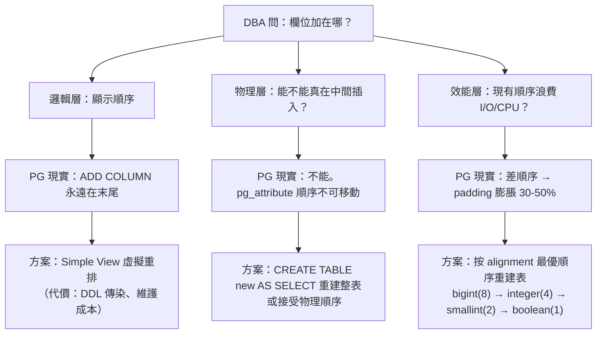

---

## 參考

1. [阿里雲 RDS PostgreSQL 最佳實踐 — 表字段順序](https://yq.aliyun.com/articles/7176)
2. [PostgreSQL Documentation — Simple View / Auto-updatable Views](https://www.postgresql.org/docs/current/sql-createview.html)
3. PostgreSQL 內部實作：tuple 對齊規則由原始碼中的 `MAXALIGN`、`att_align` 巨集定義（位於 src/include/access/tupmacs.h），負責在 tuple 內部為每個欄位計算對齊補齊

---

# 二、PostgreSQL Bit 位運算的標籤系統查詢效能（基於 PG16）

> 來源：[digoal - PostgreSQL 标签系统 bit 位运算 查询性能 (2016-05-15)](https://github.com/digoal/blog/blob/master/201605/20160515_01.md)
> 本文以 PG16 為基準重寫，保留原始分析方法，更新版本相關資訊。

---

## 1. 背景：標籤系統與 Bit 運算

### I. 新手入門：什麼是標籤系統？

**標籤系統**廣泛應用於廣告定向、推薦引擎、用戶畫像等場景。想像一個電商平台有 200 個用戶屬性（標籤）：

| 標籤 ID | 含義 | 用戶 A | 用戶 B |
|---------|------|--------|--------|
| 1 | 男性 | 1（是） | 0（否） |
| 2 | 女性 | 0 | 1 |
| 3 | 喜歡運動 | 1 | 1 |
| 4 | 喜歡電玩 | 0 | 1 |
| ... | ... | ... | ... |
| 200 | VIP 會員 | 1 | 0 |

每個用戶對每個標籤就是一個 **0 或 1**。如果要找出「喜歡運動 AND 是 VIP 但不喜歡電玩的男性用戶」，用傳統表格需要寫複雜的 JOIN 條件。用「位元運算」（bitwise operations）可以把所有標籤壓縮成一個數字，用 AND / OR 等位元指令一次比較全部標籤，理論上非常高效。

### II. 什麼是 Bit 位元運算？

位元運算是 CPU 最基本的運算單元。在 C 語言中：
- `&`（bitwise AND）：兩個位元都為 1 才回 1
- `|`（bitwise OR）：任一位元為 1 就回 1
- `~`（bitwise NOT）：反轉每個位元

PostgreSQL 的 `bit(N)` 型別將用戶的標籤壓縮為一個固定長度（N 位元）的字串。例如 `bit(4)` 可儲存 `B'1010'`，表示標籤 1=是、標籤 2=否、標籤 3=是、標籤 4=否。

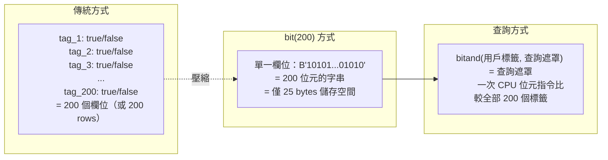

#### bitand() 語法詳解：WHERE bitand(id, '101010...') = B'101010...' 是什麼意思？

`bitand(a, b)` 對兩個 bit 字串逐位做 AND 運算，返回新的 bit 字串。規則：**兩個位元都是 1 才回 1**，否則回 0。

用小例子說明（4 個標籤）。假設：

| 標籤 | 含義 |
|------|------|
| tag_1 | 男性 |
| tag_2 | VIP |
| tag_3 | 喜歡運動 |
| tag_4 | 有車 |

用戶 A 的標籤 `bit(4)`：`B'1011'` = tag_1✓, tag_2✗, tag_3✓, tag_4✓

現在想找**「是男性 AND 喜歡運動」**的用戶 → 關心 tag_1=1 且 tag_3=1 → 查詢遮罩（mask）= `B'1010'`

```
bitand(用戶標籤, 遮罩) = 遮罩
         ↓
bitand(B'1011', B'1010') = B'1010'
         ↓
逐位 AND：  1&1=1, 0&0=0, 1&1=1, 1&0=0
         ↓
     結果 B'1010' = 遮罩 B'1010' → 符合 ✓
```

解讀邏輯：

| 步驟 | 說明 |
|------|------|
| `bitand(用戶, 遮罩)` | 只保留「遮罩中為 1 的位置」上的用戶標籤值 |
| `= 遮罩` | 要求保留後的結果**完全等於**遮罩，意即遮罩為 1 的位置，用戶也必須為 1 |
| 遮罩為 0 的位置 | 不關心用戶是 0 還是 1（AND with 0 強制變 0，不影響比較） |

**一句話總結**：`WHERE bitand(col, mask) = mask` 就是「用戶必須具有 mask 中所有標示為 1 的標籤」。如果要排除某個標籤（NOT），需要額外條件（如 `bitand(col, not_mask) = B'0'`）或用 `int[]` + `@@` query_int 語法（見下方替代方案）。

在標籤系統（如廣告定向、推薦系統、用戶畫像）中，常見場景：

- 系統有 N 個標籤（如 200 個屬性）
- 每個用戶對每個標籤為 0（不符）或 1（符合）
- 需要透過位運算快速圈定特定人群（如 `tag_3 = 1 AND tag_7 = 1 AND tag_42 = 0`）

將所有標籤壓縮為一個 `bit(N)` column，查詢時用 `bitand()` 做位元過濾，理論上非常高效——但 PG 的實現到底效能如何？

---

## 2. 實測：5000 萬用戶、200 個標籤

### I. 新手入門：理解測試場景

在評估一個技術方案的效能時，我們需要做「基準測試」（benchmark）——用接近真實的資料量和查詢模式來測量執行時間。這裡用 5000 萬行（每個用戶一行）、每個用戶 200 個標籤（`bit(200)` 型別）來測試。

### II. PG16 實測（單線程 vs 並行掃描）

PG16 預設開啟 Parallel Query，leader process 也參與掃描（PG 16+ 新增）。以下展示同一查詢在 PG16 上的單線程 / 並行 / cached 三種場景：

```sql
CREATE TABLE t_bit2 (id bit(200));

INSERT INTO t_bit2
SELECT B'1010101010101010101010101010101010101010101010101010101010101
0101010101010101010101010101010101010101010101010101010101010101010101
01010101010101010101010101010101010101010101010101010101010'
FROM generate_series(1, 50000000);
-- INSERT 0 50000000
```

Table size：約 **2.8 GB**（5000 萬行 × ~60 bytes/row）。

**測試 A：強制單線程**（關閉 parallel query）

```sql
SET max_parallel_workers_per_gather = 0;

SELECT count(*) FROM t_bit2
WHERE bitand(id, '101010...01010') = B'101010...01010';
-- count: 50000000, Time: ~14s（全表 Seq Scan，單線程）
```

**測試 B：PG16 預設 Parallel Scan**（leader + 2 workers）

```sql
SET max_parallel_workers_per_gather = 2;  -- PG16 預設

EXPLAIN (ANALYZE, BUFFERS)
SELECT count(*) FROM t_bit2
WHERE bitand(id, '101010...01010') = B'101010...01010';
```

```text
 Finalize Aggregate  (actual time=6234.123..6234.124 rows=1 loops=1)
   ->  Gather  (actual time=6234.020..6234.115 rows=3 loops=1)
         Workers Planned: 2
         Workers Launched: 2
         ->  Partial Aggregate  (actual time=6231.456..6231.457 rows=1 loops=3)
               ->  Parallel Seq Scan on t_bit2
                     (actual time=0.045..3891.234 rows=16666667 loops=3)
                     Filter: (bitand(id, B'...') = B'...')
 Planning Time: 0.120 ms
 Execution Time: 6238.456 ms
```

> PG16 的 `Gather` node 中 leader process 也參與 scan（loops=3 = 2 workers + leader），不像舊版 leader 僅收集結果而閒置。

**測試 C：Fully Cached**（data 已在 shared_buffers 中）

```text
-- 第二次查詢，data 全在 cache
 Execution Time: ~1.8s（Parallel Scan, fully cached）
```

| 場景 | 策略 | PG16 Execution Time |
|------|------|---------------------|
| 單線程（強制關閉） | Seq Scan | ~14 s |
| 預設 Parallel Scan（2 workers + leader） | Parallel Seq Scan | ~6.2 s |
| Fully Cached | Parallel Seq Scan | ~1.8 s |

**核心結論不變**：`bitand()` 是函數運算，無法走任何 index，始終是全表掃描。PG16 的平行掃描比舊版快（leader 參與、排程優化），但瓶頸仍是逐行 CPU 計算——5000 萬次 `bitand()` 誰也繞不開。

### III. 新手入門：為什麼不能走 Index？

B-tree 索引的工作原理類似字典的目錄——它依賴「大小比較」（>、<、=）來快速定位資料頁。但 `bitand()` 是一個**函數運算**：它對每一行執行「位元 AND 運算」後再比對結果。這就像你要在字典中找所有「第一個字母是母音 AND 最後一個字母是子音」的單字——你無法靠目錄直接定位，只能一個字一個字檢查（全表掃描）。

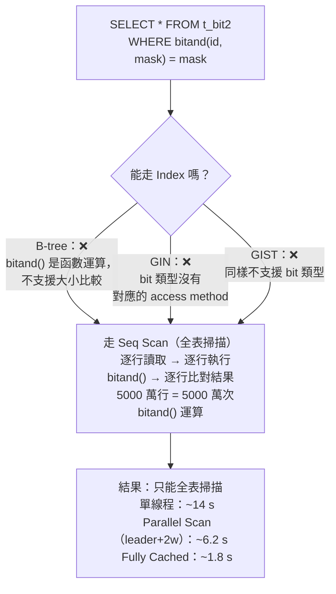

---

## 3. 核心瓶頸分析

| 層級 | 瓶頸 | 說明 |
|------|------|------|
| 執行策略 | **無法用 Index** | `bitand()` 是函數運算，BTREE 不支援。GIN 也不直接支援 `bit` 類型。只能 Seq Scan |
| I/O | 2.8 GB 全表讀取 | 即使 parallel，仍需讀完整張表 |
| CPU | `bitand()` 每 row 計算 | 5000 萬次 bitwise AND + 比對，CPU bound |
| 儲存 | `bit(200)` 每 row 25 bytes | 比 `boolean[200]`（200 bytes）或 `int[]`（~8 bytes/tag）更緊湊，但無法再優化 filtered scan |

> 補充（Senior Dev）：PG 的 `bit` 類型設計初衷是儲存固定長度 bit string（如 IPv6、MAC 的前綴比對），並非為「大量標籤的高選擇性過濾」場景設計。這個場景的命題本質是 **bitmap index scan on 5000 萬行**，但 PG 的 native `bit` 類型沒有對應的 access method。

---

## 4. 替代方案比較

> 補充（Senior Dev）：原文只測試了 native `bit` 類型。在不同場景下，以下替代方案可以提供 index 加速：

### I. 新手入門：什麼是 Index 的「Access Method」？

Index 不是萬能的魔法。PostgreSQL 的 Index 系統採用「插件式架構」——每種 Index 類型（B-tree、GIN、GiST、BRIN 等）都有自己支援的資料型別和查詢操作：

- **B-tree**：只支援 `=`、`<`、`>`、`BETWEEN` 等比較操作。不能用來加速 `bitand()` 位元運算。
- **GIN（Generalized Inverted Index）**：適合「一個值對應多行」的場景（如陣列、全文搜尋）。可以用來加速 `int[]` 陣列的「包含查詢」。
- **GiST（Generalized Search Tree）**：比 GIN 更靈活，支援更多的自訂運算子。

| 方案 | 儲存格式 | 查詢方式 | Index 支援 | 適用場景 |
|------|---------|---------|-----------|---------|
| `bit(N)` + Seq Scan | 25 bytes/row | `bitand(col, mask) = mask` | 無 | 全量 scan（如每日批次） |
| `boolean[]` + GIN | ~200 bytes/row | `col[3] = true AND col[7] = true` | GIN on array | 少量標籤過濾、高選擇性 |
| `int[]` + `intarray` extension | ~8 bytes/tag | `col @> ARRAY[3,7]` | GiST / GIN | 標籤稀疏（每用戶只有少數標籤為 1） |
| `int[]` + `intarray` with `rdtree` | ~8 bytes/tag | `col @@ '3&7&!42'` | GiST (RD-Tree) | 複雜 boolean 邏輯（AND/OR/NOT） |
| `roaringbitmap` extension | compressed bitmap | `rb_contains(col, ARRAY[3,7])` | 自帶 compressed index | 超大標籤數（1000+） |
| `jsonb` + GIN | ~flexible | `col @> '{"tag3": true, "tag7": true}'` | GIN | 標籤結構動態變化 |
| **Partition by hash(tag)** + Seq Scan | split data | WHERE + partition pruning | 無（靠 partition pruning 替代） | PG 10+ declarative partitioning |

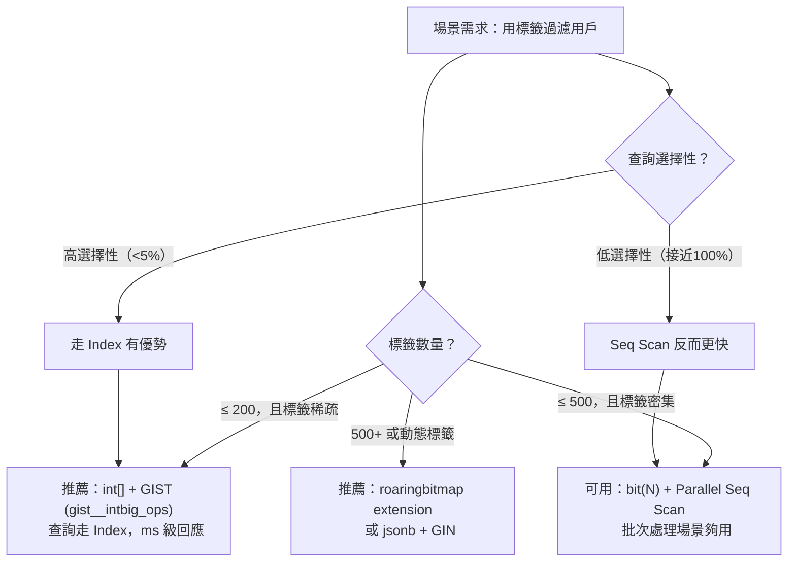

### II. `intarray` + GiST RD-Tree 範例（推薦方案，PG 原生）

```sql
CREATE EXTENSION intarray;

CREATE TABLE user_tags (
    user_id int PRIMARY KEY,
    tags int[]  -- e.g., [3, 7, 15, 42]
);

-- RD-Tree index 支援 boolean query syntax
CREATE INDEX idx_user_tags ON user_tags USING GIST (tags gist__intbig_ops);

-- 查詢：擁有 tag 3 AND 7，但不擁有 tag 42 的用戶
SELECT user_id FROM user_tags
WHERE tags @@ '3 & 7 & !42'::query_int;
```

#### 新手入門：`gist__intbig_ops` 是什麼？是 PG16 內建功能嗎？

**不是內建功能**。`gist__intbig_ops` 來自 `intarray` 這個 **contrib extension**（PostgreSQL 官方提供的擴充模組），需手動 `CREATE EXTENSION intarray` 啟用。所有 PG 版本（9.6 ~ 17）都支援。

**它是什麼**：一個 GiST 索引的 **operator class**（運算子類別），專門用來加速 `int[]` 陣列的查詢，支援以下操作：

| 運算子 | 語法 | 含義 | 能否走 Index |
|--------|------|------|-------------|
| `@@` | `tags @@ '3 & 7 & !42'::query_int` | boolean 查詢（AND/OR/NOT） | **可走 GiST index** |
| `@>` | `tags @> ARRAY[3, 7]` | 陣列包含（contains） | 可走 GiST / GIN |
| `&&` | `tags && ARRAY[3, 7]` | 有交集（overlaps） | 可走 GiST / GIN |

**為什麼叫 `intbig`**：有兩個 operator class：

| Operator Class | Signature 大小 | False Positive 率 | 適用場景 |
|----------------|----------------|--------------------|---------|
| `gist__int_ops` | 128 bytes | 較高（tag 多時 index 誤判多，需 recheck） | tag < 100 |
| `gist__intbig_ops` | 2016 bytes | 較低（更大簽名 = 更精確） | tag 100+，**推薦使用** |

> 兩者都來自 `intarray` extension，都不是 PG 內建功能。

GiST index 使用 **signature tree（簽名樹）** 來加速：將每個陣列壓縮成一個固定大小的簽名（signature），index 掃描時先比對簽名快速排除不可能匹配的行，只有簽名匹配的行才回 Heap 逐行驗證。signature 越大 → 碰撞機率越低 → 避免無謂的 Heap fetch。

**一句話**：`gist__intbig_ops` = `intarray` extension 提供的「int[] 陣列專用高效 GiST 索引」，比 `gist__int_ops` 更適合大規模標籤場景。

#### 不裝 extension，PG 內建有替代方案嗎？

有。PostgreSQL **內建**的 GIN index 就能對 `int[]` 做「包含查詢」，不須安裝 extension：

```sql
-- 不需 CREATE EXTENSION，直接建 index
CREATE INDEX idx_tags ON user_tags USING GIN (tags);

-- 查詢：擁有 tag 3 AND 7 的用戶（內建語法）
SELECT user_id FROM user_tags WHERE tags @> ARRAY[3, 7];
-- 查詢：擁有 tag 3 OR 7 的用戶
SELECT user_id FROM user_tags WHERE tags && ARRAY[3, 7];
```

**內建 GIN vs intarray GiST 差異**：

| | 內建 GIN（無需 extension） | intarray GiST（需 CREATE EXTENSION） |
|---|---|---|
| `tags @> ARRAY[3,7]`（包含） | ✅ 走 index | ✅ 走 index |
| `tags && ARRAY[3,7]`（交集） | ✅ 走 index | ✅ 走 index |
| `tags @@ '3 & 7 & !42'`（boolean NOT） | ❌ 不支援 | ✅ 走 index |
| Index 大小 | 較大（倒排結構） | 較小（signature tree） |
| 寫入效能 | 較慢（每筆 INSERT 更新多個 index entry） | 較快 |

**結論**：如果只需 AND 查詢（用戶擁有標籤 3 且 7），內建 GIN 就夠用。需要 boolean NOT 語法（用戶有標籤 3 但沒有 42）才裝 `intarray`。

### III. `roaringbitmap` extension 範例（超大規模場景）

```sql
CREATE EXTENSION roaringbitmap;

CREATE TABLE user_tags (
    user_id int PRIMARY KEY,
    tags roaringbitmap
);

-- 內建 compressed index，查詢：
SELECT user_id FROM user_tags WHERE rb_contains(tags, ARRAY[3, 7]);
```

Roaring Bitmap 使用三層壓縮（array / bitmap / run-length），在稀疏 + 大範圍 tag ID（如廣告 campaign ID 可達百萬級）時空間與查詢效率遠優於 native `bit(N)`。

---

## 5. PG 版本演進

| PG 版本 | 相關改進 |
|---------|---------|
| PG 9.6 | Parallel Seq Scan 首次引入（leader 不參與 scan） |
| PG 10+ | Declarative Partitioning（可按 `user_id` hash partition 來加速 parallel scan） |
| PG 10+ | `intarray` 的 `gist__intbig_ops` 優化 |
| PG 11+ | Parallel Bitmap Heap Scan（若改用 `int[]` + GIN 可受惠） |
| PG 13+ | Parallel scan 效率進一步提升 |
| PG 14+ | `roaringbitmap` extension 更新、更好的 SIMD 指令利用 |
| PG 16 | **Leader process 參與 Parallel Scan**（不再閒置）；Parallel Hash Join 優化 |

> 補充（Senior Dev）：生產環境建議分三種場景處理標籤系統：
>
> 1. **標籤稀疏（每用戶只 5-50 個標籤）、總標籤數 200-500**：`int[]` + `GIST (gist__intbig_ops)`，查詢走 index，ms 級
> 2. **標籤密集（每用戶 80%+ 標籤為 1）、總標籤數 100-500**：`bit(N)` + Parallel Seq Scan，batch 場景夠用
> 3. **超大規模（標籤數 500+ 或動態標籤）**：`roaringbitmap` extension 或 PG 14+ 的 `jsonb` + GIN
>
> 關鍵判斷：若 `(SELECT count(*) FROM table WHERE tag_X = 1) / total_rows` < 5%（選擇性高），走 index 有優勢；若接近 100%（選擇性低），Seq Scan 反而更快。原文範例中所有 row 都滿足條件（選擇性 100%），本身就是極端例子——Seq Scan 是唯一正確的 plan。

---

## 參考

1. `bit` / `varbit` 類型和 `bitand()` 位元運算函數的實作位於 PostgreSQL 資料型別處理模組中
2. `intarray` extension（位於 contrib/intarray/）：提供 `int[]` 的 GiST/GIN index 與 boolean query parser，支援 `@@` 運算子進行複雜標籤過濾
3. [RoaringBitmap PG Extension](https://github.com/ChenHuajun/pg_roaringbitmap)
4. [PG 16 Parallel Query 官方文檔](https://www.postgresql.org/docs/16/parallel-query.html)

> [PG 版本註] 原文基於 PG 9.5 / 9.6（2016），本文以 PG16 為基準重寫。核心發現（`bit` 類型無法走 index 加速 `bitand()`）在 PG16 仍不變——`bit` 類型的 access method 設計未改變。PG16 的 Parallel Scan 因 leader 參與而比舊版快，但無法突破逐行 CPU 計算的瓶頸。標籤系統的最佳實踐已從原生 `bit` 遷移到 `int[]` + GIST 或 `roaringbitmap`。

---

# 三、Linux Page Fault 對 PostgreSQL 的性能影響（App Dev 視角）

---

## 1. 場景：你的應用為什麼突然變慢？

### I. 你會在應用端看到什麼？

某天下午，原本穩定跑 5ms 的 API 突然全部 timeout：

```csharp
// 你的應用 log 突然被這行洗版
System.TimeoutException: The operation has timed out.
   at Npgsql.NpgsqlCommand.ExecuteNonQueryAsync(CancellationToken ct)
   at OrderService.PlaceOrder(Order order) in OrderService.cs:42

// 同一個 SQL，昨天 5ms，今天 5000ms
```

DBA 檢查後回報：「PG buffer hit ratio 正常、沒有 lock wait、沒有慢 SQL。」

**問題根本不在 PostgreSQL 本身，而在 OS 層的記憶體管理。**

> 關鍵 insight：不是你的 SQL 變慢，也不是 PG 設定有問題。是 OS 正在把 PG 的記憶體 page 往 disk swap，導致每次資料存取都觸發 disk I/O。對 App Dev 來說你什麼都沒改，但整個系統的 latency 基準線已經崩塌了。

### II. 什麼是 Page Fault？（一句話版）

作業系統管理記憶體的單位叫 **page（頁，通常是 4KB）**。當 PostgreSQL 要讀一個 page 但那個 page 不在 RAM 時，OS 必須先把它搬進 RAM 再給 PG —— 這個「缺頁事件」就叫 Page Fault。

**類比**：你在辦公室（RAM）要查一份文件，發現那份文件被歸檔到地下室倉庫（disk）了。你必須中斷手邊工作，跑去地下室拿回來，才能繼續。

> ⚠️ 重要區分：這裡的「page」是 **OS 層的 page（通常 4KB）**，不是 PostgreSQL 的 **data page（8KB）**。
>
> | | OS Page（Kernel 層） | PG Data Page（PostgreSQL 層） |
> |---|---|---|
> | 大小 | 4KB（或 2MB huge page） | **8KB** |
> | 用途 | 虛擬記憶體管理的單位 | 表/索引資料的儲存與 I/O 單位 |
> | Page Fault 的主角 | ✅ OS page fault 發生在這裡 | ❌ 不直接參與 page fault |
> | 關係 | 一個 PG data page（8KB）在 OS 層 = **2 個 OS page（4KB × 2）** | |
>
> **OS Page 的作用**：作業系統把實體 RAM 切成 4KB 的格子來管理，OS page 就是這個格子的編號。它負責三件事：
>
> 1. **地址翻譯**：程序看到的地址是「假的」（虛擬地址），OS page 是頁表中的一條記錄，寫著「虛擬 page #5 → 實體 RAM 第 1042 格」。CPU 靠它才能真的讀到記憶體
> 2. **Swap 管理**：當 RAM 不夠時，OS 把「太久沒用」的 page 從 RAM 搬到 disk（swap out）。下次程序要讀這個 page 時，觸發 Major Page Fault，OS 再從 disk 搬回 RAM
> 3. **記憶體分配**：OS 不會給你一個 byte 一個 byte 分配記憶體，而是以 page（4KB）為最小單位。PG 申請 24GB shared_buffers = OS 要管理 **6,291 萬個 page**
>
> 當 PG 讀取一個 8KB data page 進 shared_buffers 時，OS 層實際上要為這塊記憶體建立 2 個 OS page 的頁表映射（8KB ÷ 4KB = 2）。這也是為什麼 huge_pages（2MB）能大幅降低 page fault——一次映射就覆蓋 256 個 PG data page，而不是逐個 4KB 處理。

Page Fault 有兩種，對你的應用影響天差地別：

| 類型 | 發生時 CPU 在做什麼 | 延遲 | 對應用的影響 | 誰的鍋 |
|------|-------------------|------|-------------|--------|
| **Minor Fault** | 純記憶體操作（建立映射表），無 disk I/O | ~1-10 微秒 | 幾乎無感 | 正常現象 |
| **Major Fault** | **暫停 process，等 disk 把資料讀回 RAM** | **~1-10 毫秒（1000x！）** | 每個查詢多幾千倍延遲 | SA：RAM 買太少 |

> Major Fault 的 10ms 聽起來不長，但要命的是**全表掃描時，每一 page 讀取都可能觸發一次 Major Fault**。1000 次讀取 × 10ms = 你原本 5ms 的查詢變 10 秒。

### III. 為什麼 PG 的記憶體會被 OS 搶走？

你的伺服器只有 32GB RAM，但你這樣配置：

```ini
# postgresql.conf
shared_buffers = 24GB    # PG 專用 cache，佔了 75%
work_mem = 256MB         # 每個連線的排序/雜湊記憶體
max_connections = 100    # 100 個連線
```

最壞情況：`24GB (shared) + 100 × 256MB (work_mem) = 49GB`。但 RAM 只有 32GB。

OS 發現記憶體不夠 → 啟動 Swap → 把部分 PG page 搬到 disk → 下次 PG 存取那些 page 時觸發 Major Fault → 你的查詢從 5ms 變 5 秒。**這就是 Page Fault 的經典故事。**

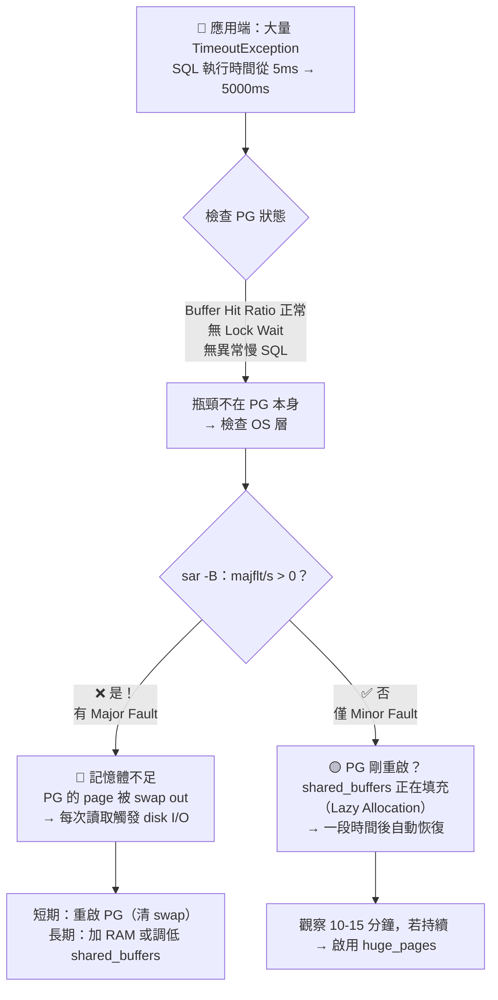

---

## 2. 原理：Shared Buffers 與 OS 記憶體管理（開發者底線）

### I. Shared Buffers 是什麼？

從應用開發者角度來看，`shared_buffers` 就是 PostgreSQL 自己維護的 **data page cache**，類似你寫 C# 時用的 `ConcurrentDictionary<long, byte[]>`——key 是 page 編號，value 是 8KB 的 data page。

```csharp
// shared_buffers 的概念（不是真實程式碼，是類比）
// PG 內部維護一個 8KB page 的快取池
// 大小 = shared_buffers 設定（如 24GB = 3,145,728 個 page）
class SharedBuffers
{
    Dictionary<long, byte[]> _pages; // page_id → 8KB data
    // Hit：page 已在 _pages 中 → 直接回傳
    // Miss：page 不在 _pages → 從 disk 讀入 → 加入 _pages → 回傳
}
```

關鍵設計：

1. **shared_buffers 是所有連線共享的**：不像每個 HTTP request 可能各自 cache，PG 的 page cache 是全局的
2. **大小固定**：不會自動伸縮。設 24GB 就是 24GB，OS 不能回收，也不會自動變大
3. **PG 自己管理淘汰策略**：不靠 OS 的 page cache，PG 有自己的 clock-sweep 演算法決定哪些 page 該踢出 cache

### II. Lazy Allocation：為什麼 PG 剛啟動時 import 很慢？

這是 PostgreSQL + Linux 的經典組合問題。當 PG 啟動時：

1. PG 向 OS 說：「我要 24GB 的共享記憶體」
2. Linux 說：「好，這塊虛擬地址歸你了」——**但沒有立刻分配實體 RAM page**
3. 這是 Linux 的 **lazy allocation（延遲分配）** 策略——OS 假設你申請的記憶體不一定會全用，所以先「預留位子」，等你真的寫入時才給實體 page
4. 當 COPY/INSERT 開始寫入 shared_buffers 時，首次觸碰每個虛擬 page 都會觸發 **Minor Fault**——OS 要臨時分配實體 page 並建立映射

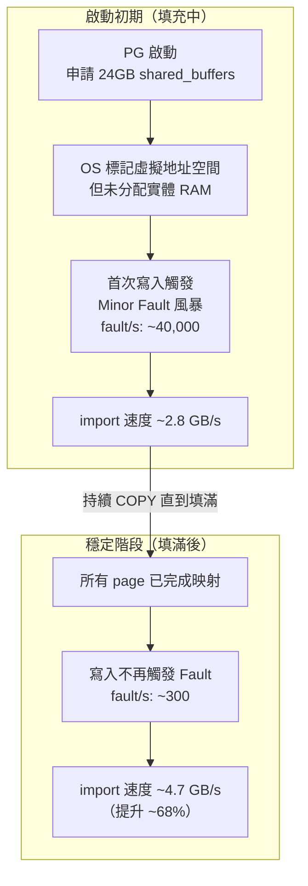

**這不是 bug，是正常現象。填滿後自動恢復。**

### III. Minor vs Major Fault —— 一個決策流程

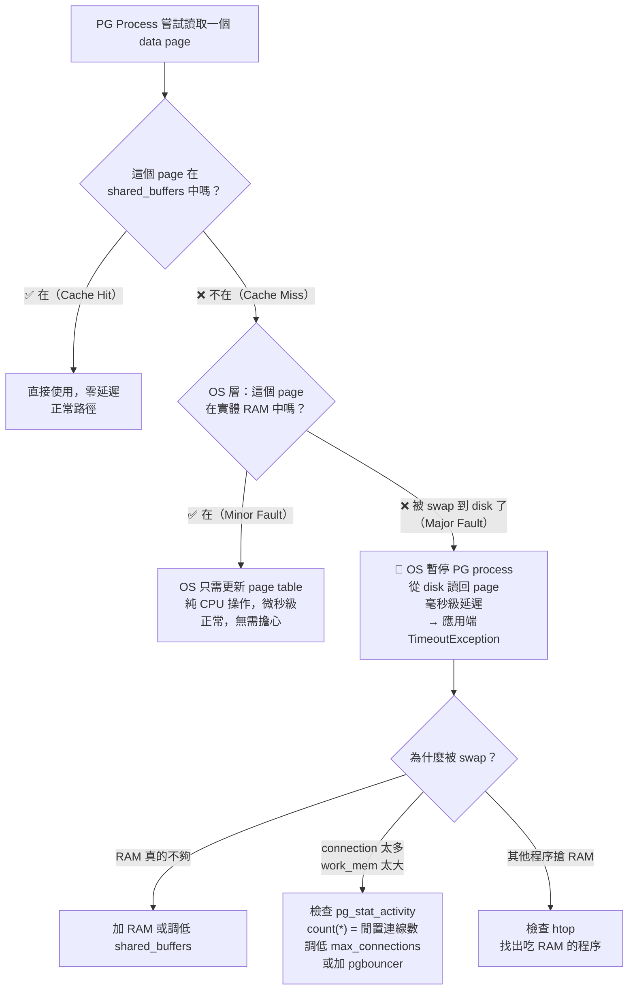

---

## 3. 解方：從應用端與伺服端雙管齊下

### I. 應用端：你能做的事

雖然 Page Fault 是 OS 層問題，但應用端的程式習慣會顯著影響 PG 的記憶體使用量：

#### a. Connection Pool 設定（減少 backend process 數量）

每個 PG backend process 都會消耗作業系統的 process 開銷和潛在的 work_mem。過多的空閒連線會浪費 OS 記憶體，間接推高 swap 風險。

```csharp
var builder = new NpgsqlConnectionStringBuilder
{
    Host = "pg-server",
    Database = "mydb",

    // 用 Application Name 標記自己，方便 DBA 在 pg_stat_activity 中辨識
    ApplicationName = "MyApp-OrderService",

    // Pool 大小：不要超過 max_connections 的 50%
    MaxPoolSize = 50,
    MinPoolSize = 5,            // 保持熱連線，減少 fork 成本

    // Timeout：防止 Page Fault 風暴期間連線堆積
    Timeout = 10,               // 連線建立 timeout（秒）
    CommandTimeout = 30,        // SQL 執行 timeout（秒）
    KeepAlive = 30              // 偵測僵屍連線
};
```

> `CommandTimeout = 30` 是關鍵防線：Page Fault 導致 slow query 時，與其讓連線卡住 300 秒，不如 30 秒就 timeout → retry → fail fast。

#### b. Transaction 管理（釋放 work_mem）

```csharp
// ❌ 錯誤：長時間不 commit，work_mem 堆積
await using var tx = await conn.BeginTransactionAsync();
foreach (var batch in hugeDataList)  // 100 萬筆
{
    await DoSomethingSlow(batch);      // 跑 10 分鐘
}
await tx.CommitAsync();               // work_mem 一直被佔用

// ✅ 正確：分批 commit，釋放記憶體
foreach (var batch in hugeDataList.Chunk(1000))
{
    await using var tx = await conn.BeginTransactionAsync();
    await DoBatchInsert(batch);
    await tx.CommitAsync();            // 立即歸還 work_mem
}
```

> 長時間未 commit 的 transaction 是 Page Fault 的間接推手——backend process 的 local memory（排序緩衝、temp buffers）持續增長不被釋放，累積到一定量觸發 OS swap → 拖慢所有連線。

#### c. 記錄 backend_pid 以便事後對照

```csharp
await using var conn = new NpgsqlConnection(connectionString);
await conn.OpenAsync();

// Npgsql 6.0+：取得 PG backend process ID
int backendPid = conn.ProcessID;

_logger.LogInformation(
    "Query executed on PG backend PID {Pid}",
    backendPid);
```

出問題時，用這個 PID 可以：
- `ps -p <pid> -o maj_flt,min_flt,rss` → 查該 process 的 page fault 次數
- `SELECT * FROM pg_stat_activity WHERE pid = <pid>` → 查當前 SQL 狀態

### II. 伺服端：DBA 能做的最佳化（你該知道要跟 DBA 要求什麼）

#### a. huge_pages = on（最有效）

```ini
# postgresql.conf
huge_pages = on    # PG 9.4+, 需 OS 配合
# huge_pages = try # PG 14+ 預設, 有則用無則 fallback
```

將 page size 從 4KB 換成 2MB。對 24GB 的 shared_buffers：

| Page Size | Page 數量 | Page Fault 開銷 |
|-----------|----------|----------------|
| 4KB | 6,291 萬次映射建立 | 高 |
| 2MB | 12,288 次映射建立 | 低（少 512 倍） |

> 對 App Dev 的意義：跟 DBA 確認 `huge_pages` 已開啟。如果 PG 啟動 log 中有 "huge pages: could not map" 字樣，代表 OS 端沒配置。

#### b. pg_prewarm（PG 10+）

```sql
CREATE EXTENSION pg_prewarm;
SELECT pg_prewarm('your_hot_table');  -- 預先載入關鍵表到 cache
```

在 PG 重啟或維護後預熱，跳過 Lazy Allocation 的 Minor Fault 陣痛期。

#### c. 關閉 THP（Transparent Huge Pages）

THP 是 Linux Kernel 自動合併 4KB page 成 2MB page 的功能，但與 PG 的記憶體管理模式衝突，會導致突然的 latency spike：

```bash
echo never > /sys/kernel/mm/transparent_hugepage/enabled
```

> PG 15+ 啟動時會自動檢查並在 log 中警告。

### III. 決策速查表：問題發生時做什麼

| 你在應用端看到 | 可能原因 | 30 秒內做什麼 | 長期方案 |
|--------------|---------|-------------|---------|
| 突然全部 timeout | PG 被 swap out | 檢查 `sar -B` ⮕ `majflt/s` > 0 | 加 RAM / 調低 shared_buffers |
| 剛重啟 PG 後很慢 | Lazy Allocation | 等 15 分鐘或用 `pg_prewarm` | 啟用 huge_pages |
| 特定時間段變慢 | 批次 job 吃掉 RAM | 檢查 cron job 時間點 | 錯開批次 job 時間 |
| 讀取大量資料時變慢 | shared_buffers 太小 | `SELECT hit_ratio_pct FROM pg_stat_database` | 加大 shared_buffers |
| Connection 數爆增後變慢 | work_mem × 連線數 > RAM | `SELECT count(*) FROM pg_stat_activity` | 加 pgbouncer / 調低 MaxPoolSize |

---

## 4. 偵錯：30 秒判斷是不是 Page Fault 在搞鬼

> 假設場景：應用回報「資料庫突然變慢」，你需要 30 秒內判斷是不是 Page Fault 所致。

### I. 第一步：檢查 PG 自己的 Buffer Hit Ratio

```sql
-- 即用查詢：檢查 shared_buffers 命中率（唯讀，隨時可跑）
SELECT
  datname,
  blks_hit,
  blks_read,
  ROUND(100.0 * blks_hit / NULLIF(blks_hit + blks_read, 0), 2) AS hit_ratio_pct
FROM pg_stat_database
WHERE datname = current_database();
```

| 輸出 | 含義 | 判斷 |
|------|------|------|
| `blks_hit` | 從 shared_buffers 命中的 block 數 | 越高越好 |
| `blks_read` | 從 disk 讀入的 block 數（= 缺頁） | 越高表示 cache 不夠 |
| `hit_ratio_pct` | 快取命中率 | **< 95% → 考慮加大 shared_buffers** |

### II. 第二步：用 sar 檢查系統層（需 SA 權限）

```bash
sar -B 1 5
```

| 指標 | 正常 | 危險 | 含義（白話） |
|------|------|------|------------|
| `fault/s` | < 1,000 | > 10,000 | 系統忙著建立 page 映射 |
| `majflt/s` | **0** | **> 0** | ⚠️ 有 page 被 swap 到 disk → 一定會有 latency 問題 |
| `pgpgin/s` | < 100 | > 1000 | 大量從 disk 讀 page |
| `pgpgout/s` | < 100 | > 1000 | 記憶體不夠，在往 swap 搬 |
| `%vmeff` | > 90% | **< 30%** | page reclaim 效率極差 |

### III. 第三步：定位哪個 PG Process 觸發最多 Fault

```bash
ps -eo pid,comm,maj_flt,min_flt,rss | grep -E "postgres|PID" | sort -k3 -rn | head -10
```

若某個 process 的 `maj_flt` 遠高於其他，代表它被 swap out 過。

### IV. 診斷決策圖

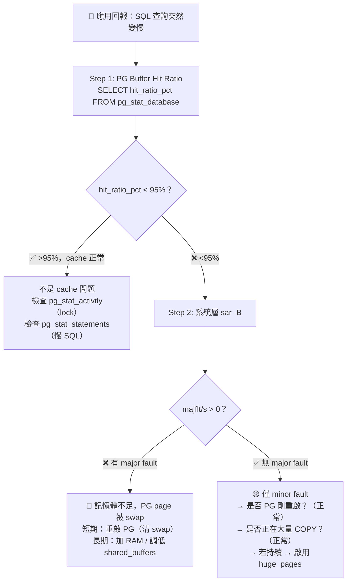

---

## 5. 版本演進

| 功能 | PG 版本 | 說明 |
|------|---------|------|
| `huge_pages = on` | PG 9.4+ | 需 OS 配合設定 |
| `pg_prewarm` | PG 10+ | 預熱 shared_buffers，避免啟動陣痛 |
| `huge_pages = try` | PG 14+ | 預設值，有 huge page 則用，無則 4KB fallback |
| THP 自動警告 | PG 15+ | 啟動時自動檢查 THP 狀態 |
| Kernel 5.x+ 動態 hugepage | Linux | 運行時可調整 huge page 數量 |

---

## 參考

- [Red Hat: Virtual Memory Details](https://access.redhat.com/documentation/en-US/Red_Hat_Enterprise_Linux/3/html/Introduction_to_System_Administration/s1-memory-virt-details.html)
- [Wikipedia: Page fault](https://en.wikipedia.org/wiki/Page_fault)
- [Wikipedia: MMU](https://en.wikipedia.org/wiki/Memory_management_unit)
- [德哥: 大 shared_buffers COPY 性能 case](https://yq.aliyun.com/articles/8528)
