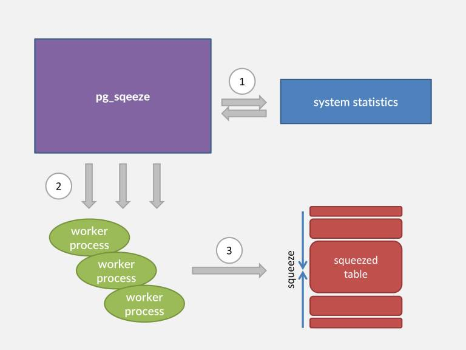

# PostgreSQL 收縮膨脹表/索引 — VACUUM FULL vs pg_repack vs pg_squeeze

> 來源：[digoal - PostgreSQL 收縮膨脹表或索引 — pg_squeeze or pg_repack (2016-10-30)](https://github.com/digoal/blog/blob/master/201610/20161030_02.md)
>
> 相關：
> - [pg_repack](https://github.com/reorg/pg_repack)
> - [pg_squeeze (Cybertec)](http://www.cybertec.at/en/products/pg_squeeze-postgresql-extension-to-auto-rebuild-bloated-tables/)

---

## 1. 表膨脹（Bloat）的成因與後果

PostgreSQL 的 MVCC 機制下，UPDATE / DELETE 不直接覆蓋或刪除舊 row，而是標記為 dead tuple。`VACUUM` 負責回收 dead tuple 佔用的空間。但當以下情況發生時，dead tuple 無法被回收：

- 長時間未提交的 transaction（holding old snapshot → xmin horizon stuck）
- 閒置的 replication slot（WAL 保留過多導致 VACUUM 無法推進）
- `autovacuum` 未及時觸發（觸發閾值 `autovacuum_vacuum_scale_factor` 預設 20%、舊 PG 版本在超大表上效率不足）
- HOT update 無法生效（indexed column 被更新 → 產生新的 index entry → page 內的 dead tuple 累積）

後果：表佔用空間不斷增長 → page density 下降 → 相同查詢需讀更多 page → I/O 增加、cache hit ratio 下降。

---

## 2. 三種重建方案對比

### 2.1 VACUUM FULL / CLUSTER

```sql
VACUUM FULL table_name;
CLUSTER table_name USING index_name;
```

- **鎖**：ACCESS EXCLUSIVE（排他鎖），整個重建期間阻塞所有讀/寫
- **機制**：完整重寫表（new FILENODE），複製 live row → 刪除舊檔案
- **優點**：內建、不需 extension、回收最徹底（包括 index bloat）
- **缺點**：鎖表時間長（取決於表大小），對線上系統不可接受

### 2.2 pg_repack（源自 pg_reorg）

```bash
pg_repack -t table_name -d database
```

- **鎖**：只在最終 FILENODE 切換時短暫持有 ACCESS EXCLUSIVE（毫秒級）
- **機制**：
  1. 建立一張新的 target table（複製原始結構）
  2. **建立 AFTER INSERT / UPDATE / DELETE trigger** 在原始表上，記錄增量 delta
  3. 批次複製原始數據到 target table
  4. 在 target table 上應用增量 delta（replay trigger 記錄的變更）
  5. 切換 FILENODE（鎖定極短）
- **優點**：生產驗證最成熟、支援 index 重建/重排
- **缺點**：**trigger 帶來的 DML 效能開銷**（每個 INSERT/UPDATE/DELETE 都要寫入 delta log table）

### 2.3 pg_squeeze

- **鎖**：與 pg_repack 相同，僅 FILENODE 切換時短暫鎖定
- **機制**：
  1. 建立 target table
  2. 建立 **logical replication slot**，通過 logical decoding 從 WAL（XLOG）中讀取重建期間的增量變更
  3. 批次複製原始數據到 target table
  4. 應用 WAL 中解碼的增量（不需 trigger）
  5. 切換 FILENODE
- **必要條件**：表必須有 **PRIMARY KEY 或 UNIQUE KEY**（logical decoding 需要 replica identity）
- **優點**：不需 trigger → 重建期間對原表 DML **幾乎無效能影響**；支援**自動觸發**（設定 bloat 閾值，background worker 定時檢查並自動重建）
- **缺點**：消耗 replication slot（需預留足夠 `max_replication_slots`）；WAL 產生量增加（logical decoding 需要 WAL level ≥ `replica`）



> 補充（Senior Dev）：
>
> **pg_squeeze 的 replication slot 風險**：logical decoding 依賴 replication slot 保持 WAL 不被回收。如果 pg_squeeze background worker 故障或重建時間過長，slot 可能堆積大量 WAL → disk 爆滿。務必監控 `pg_replication_slots` 的 `restart_lsn` 與當前 WAL LSN 的差距，設置 alert。
>
> pg_squeeze 原為 Cybertec 開發，但社群活躍度不如 pg_repack（2016 年後更新少）。**生產建議**：
> - 通用場景 → **pg_repack**（最成熟、最廣泛使用）
> - 需要自動化 + trigger overhead 不可接受 → pg_squeeze（但需監控 slot）
> - 僅 index bloat → **REINDEX CONCURRENTLY**（PG 12+），完全不需要重建表

---

## 3. 三方案全面對比

| 維度 | VACUUM FULL | pg_repack | pg_squeeze |
|------|------------|-----------|------------|
| Concurrent DML 支援 | ✗（全程排他鎖） | ✓ | ✓ |
| Exclusive Lock 時長 | 全程（數分鐘~數小時） | 僅 FILENODE 切換（毫秒） | 僅 FILENODE 切換（毫秒） |
| Delta 捕捉機制 | N/A | Trigger | Logical Decoding (WAL) |
| 對原表 DML 效能影響 | N/A（鎖住無法 DML） | Trigger overhead（~5-20%） | 極小（僅 WAL 增加） |
| 需要 PK/UK | 不需要 | 不需要 | **必須** |
| 需要 replication slot | 不需要 | 不需要 | **必須**（max_replication_slots +1） |
| WAL 開銷 | 正常 | 正常 + trigger delta | **較大**（logical decoding 需 WAL ≥ replica） |
| 自動重建 | ✗ | ✗ | ✓（background worker + bloat 閾值） |
| 支援 index 重排 | CLUSTER 支援 | ✓ | ✓ |
| PG 版本支援 | All | PG 9.4+ | PG 9.4+ |
| 成熟度 / 社群活躍 | ★★★★★（內建） | ★★★★★（生產驗證） | ★★★（2016 後更新少） |

---

## 4. 使用 pg_squeeze 的注意事項

1. **Replication Slot 數量**：`max_replication_slots` 需預留足夠數量。每個 pg_squeeze worker 消耗 1 個 slot；若有 streaming replication standby，也需各自的 slot。建議 `max_replication_slots = standby_count + concurrent_squeeze_workers + 5`

2. **高峰期風險**：不建議對繁忙資料庫開啟自動收縮。自動觸發可能在高峰期啟動，帶來額外的 I/O / WAL / CPU 負擔。可設定 `squeeze.schedule` 限制只在離峰時段執行

3. **Bloat 閾值設定**：基於 Free Space Map（FSM）和 `pgstattuple` extension 的 dead tuple ratio 計算。可設定 `squeeze.min_size`（最小表大小）、`squeeze.bloat_threshold`（空間浪費百分比）來忽略小表或輕度膨脹的表

4. **Cybertec 官方說明**（原文節錄）：

> pg_squeeze is implemented as a background worker process that periodically monitors user-defined tables. When it detects that a table exceeded the "bloat threshold", it kicks in and rebuilds that table automatically. Rebuilding happens concurrently in the background with minimal storage and computational overhead due to use of Postgres' built-in replication slots together with logical decoding to extract possible table changes during the rebuild from XLOG.

---

## 5. 現代最佳實踐

> 補充（Senior Dev）：
>
> **2016 年到今天的方案演進**：
>
> | 工具 | 當前狀態 | 建議 |
> |------|---------|------|
> | VACUUM FULL | PG 內建 | 緊急情況、維護窗口可用時 |
> | pg_repack | 社群最活躍的 online rebuild 方案 | **生產第一選擇** |
> | pg_squeeze | 2016 beta，更新停滯 | 僅在需自動 + trigger-free 場景 |
> | REINDEX CONCURRENTLY | PG 12+ 內建 | 僅 index bloat 時用，不需重建表 |
> | pgcompacttable | 減少 dead tuple 但不重建 FILENODE | 輕度膨脹的過渡方案 |
>
> **避免膨脹的預防措施**：
> 1. 調低 `autovacuum_vacuum_scale_factor` → 提高觸發頻率（大表建議 0.01-0.05）
> 2. 設置 `idle_in_transaction_session_timeout`（PG 9.6+）→ 防止長 transaction 阻擋 VACUUM
> 3. 設置 `old_snapshot_threshold`（PG 9.6+）→ 讓長時間 snapshot 過期
> 4. 監控 `pg_stat_user_tables.n_dead_tup` / `n_live_tup` → 計算 bloat ratio
> 5. 使用 `pgstattuple` extension 精確診斷：
> ```sql
> CREATE EXTENSION pgstattuple;
> SELECT * FROM pgstattuple('your_table');
> -- dead_tuple_percent 超過 20-30% 建議處理
> ```
> 6. **Partition**：按時間 partition 的表可以 `DROP PARTITION` 直接釋放空間，完全不需要 VACUUM / repack
> 7. PG 13+ `autovacuum_vacuum_insert_scale_factor` 獨立控制 INSERT-only 表的 VACUUM 觸發
> 8. 使用 **HOT UPDATE**（更新 non-indexed column）減少 index bloat

---

## 參考

1. [pg_repack](https://github.com/reorg/pg_repack)
2. [pg_squeeze Official (Cybertec)](http://www.cybertec.at/en/products/pg_squeeze-postgresql-extension-to-auto-rebuild-bloated-tables/)
3. [pg_squeeze Download](http://www.cybertec.at/download/pg_squeeze-1.0beta1.tar.gz)
