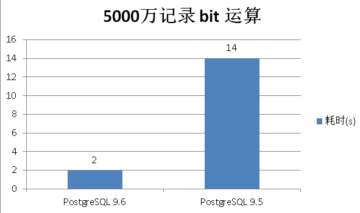

# PostgreSQL Bit 位運算的標籤系統查詢效能

> 來源：[digoal - PostgreSQL 标签系统 bit 位运算 查询性能 (2016-05-15)](https://github.com/digoal/blog/blob/master/201605/20160515_01.md)

---

## 背景：標籤系統與 Bit 運算

在標籤系統（如廣告定向、推薦系統、用戶畫像）中，常見場景：

- 系統有 N 個標籤（如 200 個屬性）
- 每個用戶對每個標籤為 0（不符）或 1（符合）
- 需要透過位運算快速圈定特定人群（如 `tag_3 = 1 AND tag_7 = 1 AND tag_42 = 0`）

將所有標籤壓縮為一個 `bit(N)` column，查詢時用 `bitand()` 做位元過濾，理論上非常高效——但 PG 的實現到底效能如何？

---

## 實測：5000 萬用戶、200 個標籤

### PG 9.5（單線程）

```sql
CREATE TABLE t_bit2 (id bit(200));

INSERT INTO t_bit2
SELECT B'1010101010101010101010101010101010101010101010101010101010101
0101010101010101010101010101010101010101010101010101010101010101010101
01010101010101010101010101010101010101010101010101010101010'
FROM generate_series(1, 50000000);
-- INSERT 0 50000000
-- Time: 47203.497 ms (47s)
```

Table size：

```
postgres=# \dt+ t_bit2
                     List of relations
 Schema |  Name  | Type  |  Owner   |  Size   | Description
--------+--------+-------+----------+---------+-------------
 public | t_bit2 | table | postgres | 2873 MB |
(1 row)
```

5000 萬行、200-bit 的 table 約 **2.8 GB**。每 row 佔約 60 bytes（200 bits = 25 bytes + tuple header + MVCC overhead）。

```
SELECT count(*) FROM t_bit2
WHERE bitand(id, '101010101010101010101010101010101010101010101010101010
1010101010101010101010101010101010101010101010101010101010101010101010
10101010101010101010101010101010101010101010101010101010101010101010')
  = B'10101010101010101010101010101010101010101010101010101010101010101
0101010101010101010101010101010101010101010101010101010101010101010101
01010101010101010101010101010101010101010101010101010101010';

--  count
-- ----------
--  50000000
-- (1 row)
-- Time: 14216.286 ms (14.2s)
```

**結論**：5000 萬行的 `bitand()` 條件走 **Parallel Seq Scan 不可用**（PG 9.5 無 parallel query），耗時 14.2 秒。`bit` 類型上無法建 BTREE index 來加速 `bitand()` 過濾（BTREE 只支援等值與範圍，不支援 bitwise 運算），因此只能全表掃描。

### PG 9.6（Parallel Query）

```sql
CREATE TABLE t_bit2 (id bit(200));
INSERT INTO t_bit2 SELECT ... FROM generate_series(1, 50000000);
-- Time: 51485.962 ms (51s)
```

```sql
EXPLAIN (ANALYZE, VERBOSE, TIMING, COSTS, BUFFERS)
SELECT count(*) FROM t_bit2
WHERE bitand(id, '101010...01010')
    = B'101010...01010';
```

完整 EXPLAIN 輸出：

```
 Finalize Aggregate  (cost=471554.70..471554.71 rows=1 width=8)
                     (actual time=9667.464..9667.465 rows=1 loops=1)
   Output: count(*)
   Buffers: shared hit=368140 dirtied=145199
   ->  Gather  (cost=471554.07..471554.68 rows=6 width=8)
               (actual time=9667.433..9667.454 rows=7 loops=1)
         Output: (PARTIAL count(*))
         Workers Planned: 6
         Workers Launched: 6
         Buffers: shared hit=368140 dirtied=145199
         ->  Partial Aggregate  (cost=470554.07..470554.08 rows=1 width=8)
                                (actual time=9663.423..9663.424 rows=1 loops=7)
               Output: PARTIAL count(*)
               Buffers: shared hit=367648 dirtied=145199
               Worker 0: actual time=9662.545..9662.546 rows=1 loops=1
                 Buffers: shared hit=49944 dirtied=19645
               Worker 1: actual time=9661.922..9661.922 rows=1 loops=1
                 Buffers: shared hit=49405 dirtied=19198
               Worker 2: actual time=9662.924..9662.925 rows=1 loops=1
                 Buffers: shared hit=49968 dirtied=19641
               Worker 3: actual time=9662.483..9662.484 rows=1 loops=1
                 Buffers: shared hit=49301 dirtied=19403
               Worker 4: actual time=9663.341..9663.342 rows=1 loops=1
                 Buffers: shared hit=49825 dirtied=19814
               Worker 5: actual time=9663.605..9663.605 rows=1 loops=1
                 Buffers: shared hit=49791 dirtied=19586
               ->  Parallel Seq Scan on public.t_bit2
                     (cost=0.00..470468.39 rows=34274 width=0)
                     (actual time=0.039..5724.642 rows=7142857 loops=7)
                     Output: id
                     Filter: (bitand(t_bit2.id, B'...') = B'...')
                     Buffers: shared hit=367648 dirtied=145199
 Planning time: 0.100 ms
 Execution time: 9772.925 ms
```

| 版本 | 策略 | Execution Time | 備註 |
|------|------|---------------|------|
| PG 9.5 | Seq Scan | **14,216 ms** | 單線程 |
| PG 9.6 | Parallel Seq Scan（6 workers） | **9,773 ms** | Shared hit（all in buffer） |
| PG 9.6（第二次） | Parallel Seq Scan（cached） | **2,327 ms** | Fully cached in shared_buffers |

6 個 parallel worker 將 scan 從 14.2s 降到 9.7s（~1.5x，受 CPU bound 限制）。第二次查詢因 data 已在 `shared_buffers` 中，降到 2.3s（~6x）。



---

## 核心瓶頸分析

| 層級 | 瓶頸 | 說明 |
|------|------|------|
| 執行策略 | **無法用 Index** | `bitand()` 是函數運算，BTREE 不支援。GIN 也不直接支援 `bit` 類型。只能 Seq Scan |
| I/O | 2.8 GB 全表讀取 | 即使 parallel，仍需讀完整張表 |
| CPU | `bitand()` 每 row 計算 | 5000 萬次 bitwise AND + 比對，CPU bound |
| 儲存 | `bit(200)` 每 row 25 bytes | 比 `boolean[200]`（200 bytes）或 `int[]`（~8 bytes/tag）更緊湊，但無法再優化 filtered scan |

> 補充（Senior Dev）：PG 的 `bit` 類型設計初衷是儲存固定長度 bit string（如 IPv6、MAC 的前綴比對），並非為「大量標籤的高選擇性過濾」場景設計。這個場景的命題本質是 **bitmap index scan on 5000 萬行**，但 PG 的 native `bit` 類型沒有對應的 access method。

---

## 替代方案比較

> 補充（Senior Dev）：原文只測試了 native `bit` 類型。在不同場景下，以下替代方案可以提供 index 加速：

| 方案 | 儲存格式 | 查詢方式 | Index 支援 | 適用場景 |
|------|---------|---------|-----------|---------|
| `bit(N)` + Seq Scan | 25 bytes/row | `bitand(col, mask) = mask` | 無 | 全量 scan（如每日批次） |
| `boolean[]` + GIN | ~200 bytes/row | `col[3] = true AND col[7] = true` | GIN on array | 少量標籤過濾、高選擇性 |
| `int[]` + `intarray` extension | ~8 bytes/tag | `col @> ARRAY[3,7]` | GiST / GIN | 標籤稀疏（每用戶只有少數標籤為 1） |
| `int[]` + `intarray` with `rdtree` | ~8 bytes/tag | `col @@ '3&7&!42'` | GiST (RD-Tree) | 複雜 boolean 邏輯（AND/OR/NOT） |
| `roaringbitmap` extension | compressed bitmap | `rb_contains(col, ARRAY[3,7])` | 自帶 compressed index | 超大標籤數（1000+） |
| `jsonb` + GIN | ~flexible | `col @> '{"tag3": true, "tag7": true}'` | GIN | 標籤結構動態變化 |
| **Partition by hash(tag)** + Seq Scan | split data | WHERE + partition pruning | 無（靠 partition pruning 替代） | PG 10+ declarative partitioning |

### `intarray` + GiST RD-Tree 範例（推薦方案，PG 原生）

```sql
CREATE EXTENSION intarray;

CREATE TABLE user_tags (
    user_id int PRIMARY KEY,
    tags int[]  -- e.g., [3, 7, 15, 42]
);

-- RD-Tree index 支援 boolean query syntax
CREATE INDEX idx_user_tags ON user_tags USING GIST (tags gist__intbig_ops);

-- 查詢：擁有 tag 3 AND 7，但不擁有 tag 42 的用戶
SELECT user_id FROM user_tags
WHERE tags @@ '3 & 7 & !42'::query_int;
```

`gist__intbig_ops` 支援高基數場景（每個 tag value 可達 `int` 範圍），查詢時走 Index Scan 而非 Seq Scan。

> 補充（Senior Dev）：PG 10+ 新增 `gist__int_ops` 與 `gist__intbig_ops` 的效能改進。`gist__intbig_ops` 使用 larger signature（2016 bytes vs 128 bytes），在高 tag 數量時 false positive 更低。

### `roaringbitmap` extension 範例（超大規模場景）

```sql
CREATE EXTENSION roaringbitmap;

CREATE TABLE user_tags (
    user_id int PRIMARY KEY,
    tags roaringbitmap
);

-- 內建 compressed index，查詢：
SELECT user_id FROM user_tags WHERE rb_contains(tags, ARRAY[3, 7]);
```

Roaring Bitmap 使用三層壓縮（array / bitmap / run-length），在稀疏 + 大範圍 tag ID（如廣告 campaign ID 可達百萬級）時空間與查詢效率遠優於 native `bit(N)`。

---

## 版本演進與現代建議

| PG 版本 | 相關改進 |
|---------|---------|
| PG 9.6 | Parallel Seq Scan（原文已測試，6 workers → 1.5x） |
| PG 10+ | Declarative Partitioning（可按 `user_id` hash partition 來加速 parallel scan） |
| PG 10+ | `intarray` 的 `gist__intbig_ops` 優化 |
| PG 11+ | Parallel Bitmap Heap Scan（若改用 `int[]` + GIN 可受惠） |
| PG 13+ | Parallel scan 效率進一步提升 |
| PG 14+ | `roaringbitmap` extension 更新、更好的 SIMD 指令利用 |
| PG 16+ | Parallel query 的 leader process 也可以參與 scan（不再閒置） |

> 補充（Senior Dev）：生產環境建議分三種場景處理標籤系統：
>
> 1. **標籤稀疏（每用戶只 5-50 個標籤）、總標籤數 200-500**：`int[]` + `GIST (gist__intbig_ops)`，查詢走 index，ms 級
> 2. **標籤密集（每用戶 80%+ 標籤為 1）、總標籤數 100-500**：`bit(N)` + Parallel Seq Scan，batch 場景夠用
> 3. **超大規模（標籤數 500+ 或動態標籤）**：`roaringbitmap` extension 或 PG 14+ 的 `jsonb` + GIN
>
> 關鍵判斷：若 `(SELECT count(*) FROM table WHERE tag_X = 1) / total_rows` < 5%（選擇性高），走 index 有優勢；若接近 100%（選擇性低），Seq Scan 反而更快。原文範例中所有 row 都滿足條件（選擇性 100%），本身就是極端例子——Seq Scan 是唯一正確的 plan。

---

## 源碼與參考

1. `src/backend/utils/adt/varbit.c` — `bit` / `varbit` 類型實作與 `bitand()` 函數
2. `contrib/intarray/` — `intarray` extension，提供 `int[]` 的 GiST/GIN index 與 boolean query parser
3. [RoaringBitmap PG Extension](https://github.com/ChenHuajun/pg_roaringbitmap)
4. [PG 9.6 Parallel Query 官方文檔](https://www.postgresql.org/docs/9.6/parallel-query.html)
5. `src/backend/access/gin/` — GIN index 實作

> [PG 版本註] 原文基於 PG 9.5 / 9.6（2016）。核心發現（`bit` 類型無法走 index 加速 `bitand()`）在最新版本（PG 17+）仍不變。`bit` 類型的 access method 設計未改變。標籤系統的最佳實踐已從原生 `bit` 遷移到 `int[]` + GIST or `roaringbitmap`。
