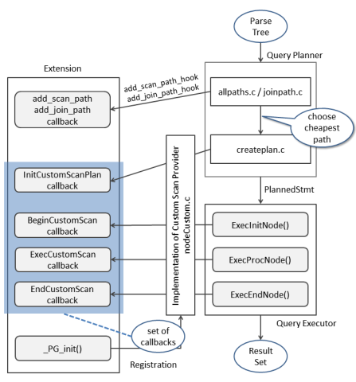
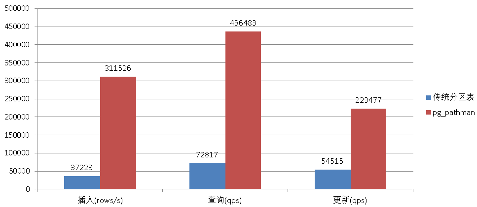

# PostgreSQL pg_pathman — 高效分區表 Plugin（Custom Scan API）

> 來源：[digoal - PostgreSQL 9.5+ 高效分区表实现 - pg_pathman (2016-10-24)](https://github.com/digoal/blog/blob/master/201610/20161024_01.md)

---

## 1. 背景與架構

### 傳統分區表的問題

PG 社區版的分區功能長期依賴 **inheritance + CHECK constraint + trigger/rule**：

- **Insert**：trigger 或 rule 重寫 → 逐行判斷分區 → 效能差
- **Select/Update/Delete**：依賴 `constraint_exclusion = partition`，走 constraint check 逐區過濾（非 binary search）→ 分區越多越慢
- **Subquery 過濾分區不受支援**

商業版 EDB 和 Greenplum 有較好的分區支援。2015 年 GP 開源後，阿里雲 RDS PG 曾將 GP 的分區功能 port 到 PG 9.4（需改動 catalog，效能提升近百倍）。但 pg_pathman 走的是另一條路——**不改 catalog，用 Custom Scan API + HOOK 實作**。

### pg_pathman 設計原理

pg_pathman 由 PostgreSQL 核心貢獻者 Oleg Bartunov 所在的 **postgrespro** 公司開發。

| 技術 | 實作方式 |
|------|---------|
| 分區定義存儲 | `pathman_config` table + memory cache（不走 catalog 改動） |
| Range 分區定位 | **Binary search**（O(log N)） |
| Hash 分區定位 | **Hash search**（O(1)） |
| Plan node 替換 | `RuntimeAppend` → 取代 `Append`，runtime 才決定掃哪些分區 |
| Merge plan | `RuntimeMergeAppend` → 取代 `MergeAppend` |
| Insert 優化 | `PartitionFilter` HOOK → 取代 trigger/rule，in-place insert |
| COPY 優化 | `ProcessUtility_hook` → 直接寫入目標分區 |
| 並發遷移 | background worker，鎖競爭時 retry（sleep + retry loop） |



> 補充（Senior Dev）：Custom Scan API（PG 9.5+）是 pg_pathman 能繞過繼承+約束方案的關鍵。它允許 extension 註冊自訂的 plan node，在 planner 和 executor 層取代標準的 `Append` / `MergeAppend` node。`RuntimeAppend` 的核心優勢是 **runtime partition pruning**：planner 階段不決定掃哪些 partition，executor 階段根據實際查詢參數值（包括 subquery 的結果）動態選擇——這是傳統 `constraint_exclusion` 做不到的。
>
> 關於 shared_preload_libraries 順序：由於 pg_pathman 使用了 PG 內部的多個 HOOK（`ProcessUtility_hook`、`planner_hook`、`ExecutorStart_hook`），如果其他 extension（如 `pg_stat_statements`、`auto_explain`）也使用相同 HOOK，pg_pathman **必須排在最後**註冊，否則 HOOK chain 可能斷裂。

---

## 2. 核心特性

| # | 特性 | 說明 |
|:-:|------|------|
| 1 | Range & Hash 分區 | 兩種分區模式，支援自動/手動管理 |
| 2 | 自動分區擴展 | Insert 新值超出既有分區範圍 → 自動建立新分區（僅 range） |
| 3 | 分區 column type | int, float, date, timestamp, 以及自訂 domain |
| 4 | Custom Scan | `RuntimeAppend` + `RuntimeMergeAppend` 動態分區選擇 |
| 5 | PartitionFilter HOOK | Insert 直接寫入目標分區，不用 trigger |
| 6 | Subquery 分區過濾 | `WHERE col = (SELECT ...)` 也能正確 pruning |
| 7 | COPY 直接寫分區 | `COPY FROM/TO` 不走主表觸發器 |
| 8 | 非阻塞式資料遷移 | `partition_table_concurrently()` 後台遷移，不鎖表 |
| 9 | FDW 支援 | 分區可放在 remote server（`postgres_fdw` 或任意 FDW） |
| 10 | Custom callback | `set_init_callback()` 設定分區建立時的回呼函數 |
| 11 | Split/Merge 分區 | range 分區支援分裂與合併 |
| 12 | Append/Prepend 分區 | 向前向後動態新增分區 |
| 13 | 分區 column 更新 | 支援更新分區鍵（觸發自動遷移到正確分區） |

---

## 3. 安裝與配置

```bash
git clone https://github.com/postgrespro/pg_pathman
cd pg_pathman
make USE_PGXS=1
make USE_PGXS=1 install
```

```ini
# postgresql.conf（pg_pathman 必須排在最後）
shared_preload_libraries = 'pg_stat_statements, pg_pathman'
```

```sql
CREATE EXTENSION pg_pathman;
```

### GUC 參數

| GUC | 預設 | 說明 |
|-----|:----:|------|
| `pg_pathman.enable` | on | 全域開關 |
| `pg_pathman.enable_runtimeappend` | on | RuntimeAppend custom node |
| `pg_pathman.enable_runtimemergeappend` | on | RuntimeMergeAppend custom node |
| `pg_pathman.enable_partitionfilter` | on | PartitionFilter insert hook |
| `pg_pathman.enable_auto_partition` | on | 自動擴展分區（per session） |
| `pg_pathman.insert_into_fdw` | postgres | FDW insert 支援：`disabled` / `postgres` / `any_fdw` |
| `pg_pathman.override_copy` | on | COPY hook |

---

## 4. 內部結構：Catalog Tables & Views

### pathman_config（分區定義主表）

```sql
CREATE TABLE pathman_config (
    partrel        REGCLASS NOT NULL PRIMARY KEY,  -- 主表 OID
    attname        TEXT NOT NULL,                  -- 分區 column
    parttype       INTEGER NOT NULL,               -- 1=hash, 2=range
    range_interval TEXT                            -- range 分區的 interval
);
```

### pathman_config_params（可選覆蓋參數）

```sql
CREATE TABLE pathman_config_params (
    partrel        REGCLASS NOT NULL PRIMARY KEY,
    enable_parent  BOOLEAN NOT NULL DEFAULT TRUE,  -- planner 是否包含主表
    auto           BOOLEAN NOT NULL DEFAULT TRUE,  -- 是否自動擴展分區
    init_callback  REGPROCEDURE NOT NULL DEFAULT 0 -- 分區建立時回呼
);
```

### 管理 Views

| View | 用途 |
|------|------|
| `pathman_partition_list` | 列出所有分區、parent、range boundary（hash partition 為 NULL） |
| `pathman_concurrent_part_tasks` | 列出正在執行的背景遷移任務（user, pid, db, rel, processed rows, status） |

```sql
SELECT * FROM pathman_partition_list;
--  parent | partition | parttype | partattr | range_min | range_max

SELECT * FROM pathman_concurrent_part_tasks;
--  userid | pid | dbid | relid | processed | status
```

---

## 5. Range 分區管理 API

### 5.1 建立 Range 分區

**方式一：指定起始值 + interval + 分區數**

```sql
create_range_partitions(
    relation       REGCLASS,     -- 主表 OID
    attribute      TEXT,         -- 分區 column 名
    start_value    ANYELEMENT,   -- 起始值
    p_interval     ANYELEMENT,   -- interval（任意 type）
    p_count        INTEGER DEFAULT NULL,
    partition_data BOOLEAN DEFAULT TRUE  -- 是否立即遷移資料
);

-- 時間類型專用多態版本（p_interval 為 INTERVAL type）
create_range_partitions(
    relation       REGCLASS, 
    attribute      TEXT,
    start_value    ANYELEMENT,
    p_interval     INTERVAL,     -- 用 PostgreSQL INTERVAL type（'1 month'）
    p_count        INTEGER DEFAULT NULL,
    partition_data BOOLEAN DEFAULT TRUE
);
```

**方式二：指定起始值 + 終值 + interval**

```sql
create_partitions_from_range(
    relation       REGCLASS,
    attribute      TEXT,
    start_value    ANYELEMENT,
    end_value      ANYELEMENT,
    p_interval     ANYELEMENT,   -- 或 INTERVAL
    partition_data BOOLEAN DEFAULT TRUE
);
```

### 5.2 Range 分區完整示例

```sql
-- Step 1: 建立主表（分區 column 必須 NOT NULL）
CREATE TABLE part_test (
    id int,
    info text,
    crt_time timestamp NOT NULL
);

-- Step 2: 插入已有資料
INSERT INTO part_test
    SELECT id, md5(random()::text),
           clock_timestamp() + (id || ' hour')::interval
    FROM generate_series(1, 10000) t(id);

-- Step 3: 建立分區（24 個，每月一個；不立即遷移資料）
SELECT create_range_partitions(
    'part_test'::regclass,
    'crt_time',
    '2016-10-25 00:00:00'::timestamp,
    interval '1 month',
    24,
    false  -- 不遷移資料
);

-- Step 4: 非阻塞式遷移
SELECT partition_table_concurrently(
    'part_test'::regclass,
    10000,  -- batch_size
    1.0     -- sleep_time
);
-- 停止遷移：SELECT stop_concurrent_part_task('part_test');

-- Step 5: 遷移完成後禁用主表（planner 不再考慮主表）
SELECT set_enable_parent('part_test'::regclass, false);
```

遷移後查詢只有目標分區被掃描：

```sql
EXPLAIN SELECT * FROM part_test
WHERE crt_time = '2016-10-25 00:00:00'::timestamp;
--  Append
--    ->  Seq Scan on part_test_1
--          Filter: (crt_time = '2016-10-25 ...')
```

**強制建議：**
1. 分區 column 必須有 NOT NULL constraint
2. 分區個數必須能覆蓋所有已存在記錄
3. 使用非阻塞式遷移（`partition_table_concurrently`）
4. 遷移完成後調用 `set_enable_parent(rel, false)` 禁用主表

### 5.3 Split / Merge / Append / Prepend

```sql
-- 分裂範圍分區：在 split_value 處切成兩半
SELECT split_range_partition(
    'part_test_1'::regclass,        -- 分區 OID
    '2016-11-10 00:00:00'::timestamp, -- 分裂值
    'part_test_1_2'                 -- 新分區名
);
-- 分裂後：part_test_1  [2016-10-25, 2016-11-10)
--         part_test_1_2 [2016-11-10, 2016-11-25)
-- 資料自動遷移

-- 合併相鄰分區（必須相鄰）
SELECT merge_range_partitions(
    'part_test_1'::regclass,
    'part_test_1_2'::regclass
);

-- 向後新增分區（按原始 interval）
SELECT append_range_partition('part_test'::regclass);
-- 返回: public.part_test_25

-- 向前新增分區
SELECT prepend_range_partition('part_test'::regclass);
-- 返回: public.part_test_26
```

> 補充（Senior Dev）：`append_range_partition` 和 `prepend_range_partition` 使用 `pathman_config.range_interval` 中儲存的原始 interval。如果你需要在特定 tablespace 中建立分區，可以在 session 層面預先 `SET local default_tablespace = 'tbs_cold'`。冷熱分離是分區表的常見場景——近期分區放 SSD tablespace、歷史分區放 HDD。

---

## 6. Hash 分區管理 API

```sql
create_hash_partitions(
    relation         REGCLASS,   -- 主表 OID
    attribute        TEXT,       -- 分區 column（不限 int，自動 hash）
    partitions_count INTEGER,    -- 分區數
    partition_data   BOOLEAN DEFAULT TRUE
);
```

### Hash 分區完整示例

```sql
CREATE TABLE part_test (id int, info text, crt_time timestamp NOT NULL);

INSERT INTO part_test
    SELECT id, md5(random()::text),
           clock_timestamp() + (id || ' hour')::interval
    FROM generate_series(1, 10000) t(id);

-- 建立 128 個 hash 分區
SELECT create_hash_partitions(
    'part_test'::regclass, 'crt_time', 128, false);

-- 非阻塞遷移 + 禁用主表
SELECT partition_table_concurrently('part_test'::regclass, 10000, 1.0);
SELECT set_enable_parent('part_test'::regclass, false);
```

Hash 分區的特點：
- pg_pathman **不需要在 WHERE 中使用 hash 表達式**（`SELECT * FROM part_test WHERE crt_time = '...'::timestamp` 也能正確 pruning）——內部自動計算 hash 值對應的分區
- CHECK constraint 是 `get_hash_part_idx(timestamp_hash(crt_time), 128) = N`
- 分區 column 不限 int type，會自動用 hash 函數轉換

---

## 7. 效能對比數據

### Insert 效能（2000 萬 row 表，64 connections）

| 方案 | TPS | 說明 |
|------|------|------|
| Traditional (trigger) | 54,517 | 每個 insert 觸發 trigger 判斷分區 |
| **pg_pathman (PartitionFilter)** | **223,484** | HOOK 直接寫入目標分區 |

pg_pathman 的寫入效能是傳統方案的 **4.1 倍**。

### 查詢效能：Subquery 過濾

傳統 inheritance + constraint 方案 **不支援 subquery partition pruning**。pg_pathman 的 `RuntimeAppend` 在 executor 階段根據 subquery 結果動態選擇分區：

```sql
CREATE TABLE partitioned_table (id INT NOT NULL, payload REAL);
INSERT INTO partitioned_table
    SELECT generate_series(1, 1000), random();
SELECT create_hash_partitions('partitioned_table', 'id', 100);
SELECT set_enable_parent('partitioned_table', false);
```

```sql
-- Subquery in WHERE：只掃相關分區
EXPLAIN (COSTS OFF, ANALYZE)
SELECT * FROM partitioned_table
WHERE id = (SELECT * FROM some_table LIMIT 1);

--  Custom Scan (RuntimeAppend) (actual time=0.051..0.053 rows=1 loops=1)
--    InitPlan 1 (returns $0)
--      ->  Limit (actual time=0.017..0.017 rows=1 loops=1)
--            ->  Seq Scan on some_table
--    ->  Seq Scan on partitioned_table_70  ← 只掃一個分區！
--          Filter: (id = $0)
```

```sql
-- ANY (subquery)：對每個 hash value 只掃對應分區
EXPLAIN (COSTS OFF, ANALYZE)
SELECT * FROM partitioned_table
WHERE id = ANY (SELECT * FROM some_table LIMIT 10);

--  Nested Loop (rows=10 loops=1)
--    ->  HashAggregate (rows=10)
--    ->  Custom Scan (RuntimeAppend) (rows=1 loops=10)
--          ->  Seq Scan on partitioned_table_88 (loops=2)   ← 只掃 8 個分區（非 100 個）
--          ->  Seq Scan on partitioned_table_72 (loops=1)
--          ...
```



> 補充（Senior Dev）：Prepared statement 與 simple query 在 pg_pathman 下的行為差異：prepared statement 時，custom scan 的 pruning 在 `EXPLAIN` 中不可見（顯示為掃描所有分區），但 `EXPLAIN ANALYZE` 中顯示實際只掃了一個分區。這是因為 prepared statement 的 plan 在 bind 階段才獲得參數值，planner 的 static plan 保守地包含所有分區，executor 的 RuntimeAppend 在執行時才做 pruning。從 perf top 來看，prepared statement 下的 LWLock 競爭更高（尤其 `LWLockAcquire`），與 `LockReleaseAll` 在每個 bind 週期都觸發有關。

---

## 8. Callback 機制

可在分區建立時自動觸發自訂 function（如自動建立 index、設定 table storage parameter）：

```sql
-- 註冊 callback
SELECT set_init_callback('part_test'::regclass, 'my_partition_init');

-- callback function signature
CREATE FUNCTION my_partition_init(args JSONB) RETURNS VOID AS $$
BEGIN
    -- args for range partition:
    -- {"parent": "part_test", "parttype": "2",
    --  "partition": "part_test_4", "range_max": "401", "range_min": "301"}

    -- args for hash partition:
    -- {"parent": "part_test", "parttype": "1", "partition": "part_test_0"}

    EXECUTE format('CREATE INDEX ON %I (id)', args->>'partition');
END;
$$ LANGUAGE plpgsql;
```

---

## 9. 注意事項與限制

| 事項 | 說明 |
|------|------|
| **PG 版本** | 僅支援 9.5+（需要 Custom Scan API） |
| **prepared statement** | `EXPLAIN` 靜態 plan 顯示掃所有分區（誤導），`EXPLAIN ANALYZE` 才顯示實際 pruning 結果。此與 LWLock 競爭有關（已提 issue） |
| **shared_preload_libraries 順序** | pg_pathman 必須排最後 |
| **分區 column** | 必須有 NOT NULL constraint |
| **分區數上限** | range 分區的自動擴展若無上限可能產生極多 partition，建議定期合併 |
| **tablespace** | 可用 `SET local default_tablespace = 'tbs_name'` 在建立分區前指定 |
| **disable_pathman_for** | 無 session 級別關閉，需用 `SET pg_pathman.enable = off` |
| **資料遷移** | 建議使用 `partition_table_concurrently()`，避免 `partition_data = true` 時的 blocking 遷移 |
| **FDW partition** | 支援透過 `pg_pathman.insert_into_fdw` 控制 write routing |
| **PG 10+ 原生分區** | PG 10 引入 declarative partitioning，pg_pathman 仍可在 PG 10 使用。PG 11+ 的原生分區逐步補強（hash partition PG 11、default partition PG 11、partition pruning improvement PG 12） |

---

## 參考

1. [pg_pathman GitHub](https://github.com/postgrespro/pg_pathman)
2. [Oleg Bartunov - pg_pathman RuntimeAppend Blog](http://akorotkov.github.io/blog/2016/06/15/pg_pathman-runtime-append/)
3. [PostgreSQL Custom Scan API Wiki](https://wiki.postgresql.org/wiki/CustomScanAPI)
4. [PG 9.6 FDW docs](https://www.postgresql.org/docs/9.6/static/postgres-fdw.html)
5. `\sf` 查看 pg_pathman 內部 function 原始碼
