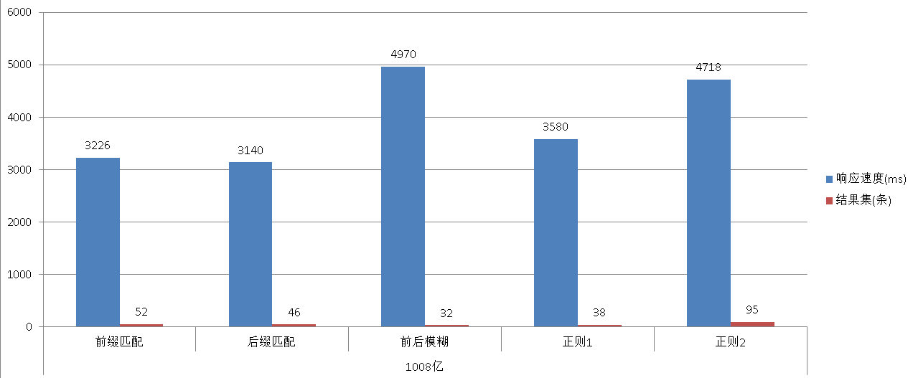

# PostgreSQL 千億級 Regex / 模糊查詢 — pg_trgm + GIN 效能實測

> 來源：[digoal - PostgreSQL 1000亿数据量 正则匹配 速度与激情 (2016-03-07)](https://github.com/digoal/blog/blob/master/201603/20160307_01.md)
>
> 2026 更新：補充 pg_trgm 內部機制、PG 14-17 演進、pg_bigm 替代方案、Production 層級建議。

---

## 測試規模

| 項目 | 數值 |
|------|------|
| Cluster | 8 台實體主機（16 core / host），共 **240 個 data node** |
| Total rows | **1,008 億** (100.8 billion) |
| Table size | **4,158 GB** (~4.1 TB) |
| Data characteristic | 12-char hex string（`md5(random()::text)` 前 48-bit），83.7% 唯一值 |
| B-tree index (info) | **2,961 GB** |
| B-tree index (reverse(info)) | **2,961 GB** |
| GIN index (gin_trgm_ops) | **2,300 GB** |



---

## 數據生成

```bash
# 創建 distributed table（基於 PG 的 MPP 架構）
psql -c "CREATE TABLE t_regexp_100billion DISTRIBUTED RANDOMLY"

# 分批生成 1008 億行，每批 1 億行
for ((i=1; i<=1008; i++)); do
  psql -c "COPY (
    SELECT substring(md5(random()::text), 1, 12)
    FROM generate_series(1, 100000000)
  ) TO stdout" \
  | psql -c "COPY t_regexp_100billion FROM stdin"
done

# 創建三組索引
psql -c "SET maintenance_work_mem = '4GB';
         CREATE INDEX idx_t_regexp_100billion_1
         ON t_regexp_100billion(info)"

psql -c "SET maintenance_work_mem = '4GB';
         CREATE INDEX idx_t_regexp_100billion_2
         ON t_regexp_100billion(reverse(info))"

psql -c "SET maintenance_work_mem = '4GB';
         CREATE INDEX idx_t_regexp_100billion_gin
         ON t_regexp_100billion USING gin (info gin_trgm_ops)"
```

### 數據特徵

```sql
SELECT count(*) FROM t_regexp_100billion;
-- 100800000000 (1,008 億)
-- Time: 228,721 ms (~3.8 min for COUNT(*))

-- 抽樣驗證唯一性（隨機 offset 100 萬行中僅 250 個重複）
SELECT count(DISTINCT info)
FROM (SELECT * FROM t_regexp_100billion
      OFFSET 1299422811 LIMIT 1000000) t;
-- count: 999750

-- psql 統計資訊
ALTER TABLE t_regexp_100billion ALTER COLUMN info SET STATISTICS 10000;
ANALYZE t_regexp_100billion;

-- n_distinct: -0.836834   → 約 83.68% 唯一值
-- most_common_freqs: 最高頻值佔比 1e-06（每值約 10 萬次出現）

-- 實際驗證「最高頻值」7f68d12d2205
SELECT count(*) FROM t_regexp_100billion WHERE info = '7f68d12d2205';
-- count: 54（而非統計預估的 10 萬次 — 採樣偏差）
```

> 補充（Senior Dev）：`n_distinct = -0.837` 是柱狀圖估算值，負值表示「比例」而非「絕對數」。此處由於 random MD5 分佈極均勻，GIN index 每個 trigram 的 posting list 長度非常接近理論值（1008 億 ÷ 16^3 ≈ 2460 萬 / trigram），selectivity 可精確預測。

---

## 內部機制：pg_trgm 如何讓 Regex 變快

### Trigram 原理

`pg_trgm` 將每個字串拆成長度為 3 的連續子串（trigram）。例如 `'80ebcdd47006'`：

```
Trigrams: 80e, 0eb, ebc, bcd, cdd, dd4, d47, 470, 700, 006
```

GIN index 的 key = trigram，value = 包含該 trigram 的所有 row 的 posting list。

### 查詢流程（以 `info ~ 'e7add04871'` 為例）

```
1. PG 將 regex 轉換為 trigram 集合：
   'e7add04871' → {e7a, 7ad, add, dd0, d04, 048, 487, 871}

2. GIN scan 對每個 trigram 取出 posting list，取交集：
   ∩ {rows with 'e7a', '7ad', 'add', ...}

3. Bitmap Heap Scan：將交集結果中的 page 全部讀出

4. Recheck：用原始 regex 對候選 row 進行精確匹配
   （GIN + pg_trgm 是 lossy，trigram 交集只保證候選集包含答案）
```

> 補充（Senior Dev）：pg_trgm 的最小有效 pattern 長度取決於 `pg_trgm.word_similarity_threshold` 和 GIN 的 selectivity。單個字符或兩個字符的 regex（如 `~ 'a.'`）無法產生足夠的 trigram 過濾，會退化成 Seq Scan。實務上 pattern ≥ 3 characters 才能有效利用 GIN 過濾。

---

## 四種查詢模式效能實測

### 1. Prefix 匹配（前綴查詢 `^`）

```sql
SELECT ctid, tableoid, info
FROM t_regexp_100billion
WHERE info ~ '^80ebcdd47';
-- 返回 52 rows，3,226 ms
```

實際使用 B-tree index（`info` column），`~ '^...'` 被 optimizer 轉換為 B-tree range scan（`>= '80ebcdd47' AND < '80ebcdd48'`）。

```
EXPLAIN (ANALYZE, VERBOSE, BUFFERS, COSTS, TIMING)
SELECT ... WHERE info ~ '^80ebcdd47';
-- 240 個 node 並行執行
-- Planning time: 0.061 ms
-- Execution time: 3,112 ms
```

| 指標 | 數值 |
|------|------|
| 模式 | B-tree index scan（prefix → range） |
| 時間 | **3.1 秒** |
| 結果數 | 52 rows（1,008 億中） |

---

### 2. Suffix 匹配（後綴查詢 `reverse()` 技巧）

```sql
-- 查詢以 'f42d12089b' 結尾的 row
-- 做法：反轉字串後做 prefix 查詢
SELECT ctid, tableoid, info
FROM t_regexp_100billion
WHERE reverse(info) ~ '^f42d12089b';
-- 返回 46 rows，3,141 ms
```

> 補充（Senior Dev）：這是 PG 中處理 suffix matching 的經典技巧。原理是把 `LIKE '%abc'` 轉為 `reverse(col) LIKE 'cba%'`，再用 B-tree index 加速。**不需要 pg_trgm**，只需一個 `reverse()` B-tree index。在 PG 17 中，若 `reverse()` 被標記為 IMMUTABLE（確實如此），expression index 直接可用。此技巧對任意長度的後綴都有效，不像 pg_trgm 受 trigram 最小長度限制。

```
EXPLAIN (ANALYZE, VERBOSE, BUFFERS, COSTS, TIMING)
SELECT ... WHERE reverse(info) ~ '^f42d12089b';
-- 240 個 node 並行執行
-- Execution time: 3,112 ms
```

| 指標 | 數值 |
|------|------|
| 模式 | `reverse()` B-tree index |
| 時間 | **3.1 秒** |
| 結果數 | 46 rows |

---

### 3. 中間包含匹配（任意位置 substring）

無法用 B-tree prefix trick，必須依賴 GIN + pg_trgm：

```sql
SELECT ctid, tableoid, info
FROM t_regexp_100billion
WHERE info ~ 'e7add04871';
-- 返回 32 rows，4,971 ms
```

```
EXPLAIN (ANALYZE, VERBOSE, BUFFERS, COSTS, TIMING)
SELECT ... WHERE info ~ 'e7add04871';
-- 240 個 node 並行執行
-- Execution time: 4,898 ms
```

| 指標 | 數值 |
|------|------|
| 模式 | GIN (gin_trgm_ops) → Bitmap Index Scan |
| 時間 | **4.9 秒** |
| 結果數 | 32 rows |

> 補充（Senior Dev）：4.9 秒中有相當一部分花在 Recheck 上。因為 pattern 長度僅 10 字符（8 個 trigram），candidate set 較大。若 pattern 更長，trigram 更多，交集更精確，速度會更快。此例最慢是因為需要從 1,008 億行中搜尋任意位置 substring——沒有 prefix/suffix 的 shortcut。

---

### 4. 正則表達式匹配（通用 regex）

```sql
-- . 匹配任意字符
SELECT ctid, tableoid, info
FROM t_regexp_100billion
WHERE info ~ '.3918.209f';
-- 返回 38 rows，3,581 ms
```

```
EXPLAIN (ANALYZE, VERBOSE, BUFFERS, COSTS, TIMING)
SELECT ... WHERE info ~ '.3918.209f';
-- 240 個 node 並行執行
-- Execution time: 3,622 ms
```

```sql
-- 複雜 regex：字符類 + 選擇 + 量詞
SELECT ctid, tableoid, info
FROM t_regexp_100billion
WHERE info ~ 'ab2..d[1|f]3c8';
-- 返回 95 rows，4,718 ms
```

```
EXPLAIN (ANALYZE, VERBOSE, BUFFERS, COSTS, TIMING)
SELECT ... WHERE info ~ 'ab2..d[1|f]3c8';
-- 240 個 node 並行執行
-- Execution time: 4,649 ms
```

| Pattern | 匹配數 | 時間 |
|---------|--------|------|
| `.3918.209f` | 38 rows | **3.6 秒** |
| `ab2..d[1|f]3c8` | 95 rows | **4.6 秒** |

> 補充（Senior Dev）：pg_trgm 會從 regex pattern 中提取所有「確定性字符序列」生成 trigram。例如 `ab2..d[1|f]3c8` → trigram 包括 `ab2`, `b2d`, `2d1`, `d13`, `13c`, `3c8` 等（`.` 和 `[]` 視為不可確定符號，不貢獻 trigram）。Regex 越具體 / 確定性字符越多，trigram 越多 → 候選集越小 → 越快。

---

## 效能總結

| 查詢模式 | 索引類型 | 時間 | 千億中命中 |
|----------|----------|------|-----------|
| Prefix `^` | B-tree (info) | 3.1s | 52 rows |
| Suffix (reverse) | B-tree (reverse(info)) | 3.1s | 46 rows |
| 中間包含 | GIN (gin_trgm_ops) | 4.9s | 32 rows |
| 簡單 regex `.3918.209f` | GIN (gin_trgm_ops) | 3.6s | 38 rows |
| 複雜 regex `ab2..d[1` | GIN (gin_trgm_ops) | 4.6s | 95 rows |

> 補充（Senior Dev）：三種索引總體積 = 2,961 + 2,961 + 2,300 = **8,222 GB**（約 table 體積的 2x）。若只需 regex / 模糊查詢，GIN 一個索引就涵蓋 prefix、suffix、中間匹配三種場景（pg_trgm 自動處理 prefix/suffix），不需額外 B-tree。原文章建三個索引是為了對比測試。

---

## PG 14-17 pg_trgm 演進

| 版本 | 改進 |
|------|------|
| PG 14 | GIN index 的 `gin_clean_pending_list` 效能提升；`pg_trgm.word_similarity_threshold` 更靈活 |
| PG 15 | `pg_trgm` 支援 ICU collation 下的 trigram 提取；regex engine 內部改寫提升 `~` operator 效能 |
| PG 16 | `pg_trgm.strict_word_similarity` 支援 multi-byte encoding 優化 |
| PG 17 | GIN parallel index build 支援 `pg_trgm`，大規模建索引更快 |

---

## Senior Dev：Production 設計建議

### 1. Index 選擇決策

| 場景 | 推薦 | 原因 |
|------|------|------|
| 只需 prefix 查詢 | B-tree `(info text_pattern_ops)` | 最輕量，不需 pg_trgm |
| 只需 suffix 查詢 | B-tree `(reverse(info))` | 比 GIN 小、更快（無 Recheck） |
| Regex / 模糊 / 任意位置 | GIN `gin_trgm_ops` | 唯一的 regex 加速方案 |
| 中日韓文本混合 regex | GIN `pg_bigm`（2-gram） | 比 pg_trgm 更適合 CJK，不需辭典 |

### 2. GIN + pg_trgm 的參數調優（PG 14+）

```sql
-- 控制 GIN fast update pending list 大小（預設 4MB）
-- 寫入密集型：減小以降低查詢時 pending list scan 開銷
-- 查詢密集型：增大以減少 index 寫入次數
SET gin_pending_list_limit = '2MB';

-- pg_trgm 相似度門檻（預設 0.3）
-- 用於 similarity() / word_similarity() 函數，不影響 ~ operator
SET pg_trgm.similarity_threshold = 0.5;
```

### 3. Regex 查詢優化技巧

```sql
-- 壞寫法：LIKE '%abc%'（無法用 B-tree，退化成 Seq Scan）
-- 好寫法：用 pg_trgm GIN index
SELECT * FROM t WHERE info ~ 'abc';

-- 壞寫法：regex 太短（< 3 characters），trigram 過濾無效
-- SELECT * FROM t WHERE info ~ 'a.';  -- 退化成 Seq Scan

-- 好寫法：regex pattern 確保 ≥ 3 個確定性字符
SELECT * FROM t WHERE info ~ 'abc.*xyz';
```

### 4. 大規模部署考量

**分佈式查詢（MPP / Citus / Greenplum）：**
- GIN index 在每個 shard 上獨立運作，查詢效能線性擴展
- 瓶頸在「最慢的 shard」，而非總數據量
- Recheck 是 shard-local 操作，不受跨節點 network 影響

**Single-node PG 17 + Parallel Query：**
- 若數據量在 TB 級（非千億），single-node PG 17 的 parallel bitmap heap scan 可有效利用 multi-core
- `max_parallel_workers_per_gather` 建議設為 CPU core 數的 50-75%

### 5. `pg_bigm` vs `pg_trgm`（PG 17 對比）

| 面向 | pg_trgm | pg_bigm |
|------|---------|---------|
| 最小 token | 3-gram | 2-gram |
| CJK 支援 | 需配合 ICU collation | 原生支援 |
| Regex `~` 加速 | ✓ | ✓ |
| LIKE `%abc%` 加速 | ✓ | ✓ |
| Index 大小 | 較大（3-gram） | 更大（2-gram，更多 token） |
| 查詢速度 | 較快（token 少） | 較慢（token 多，但 selectivity 更高） |

選擇：純英文/數字 → pg_trgm；CJK/多語言混合 → pg_bigm。
