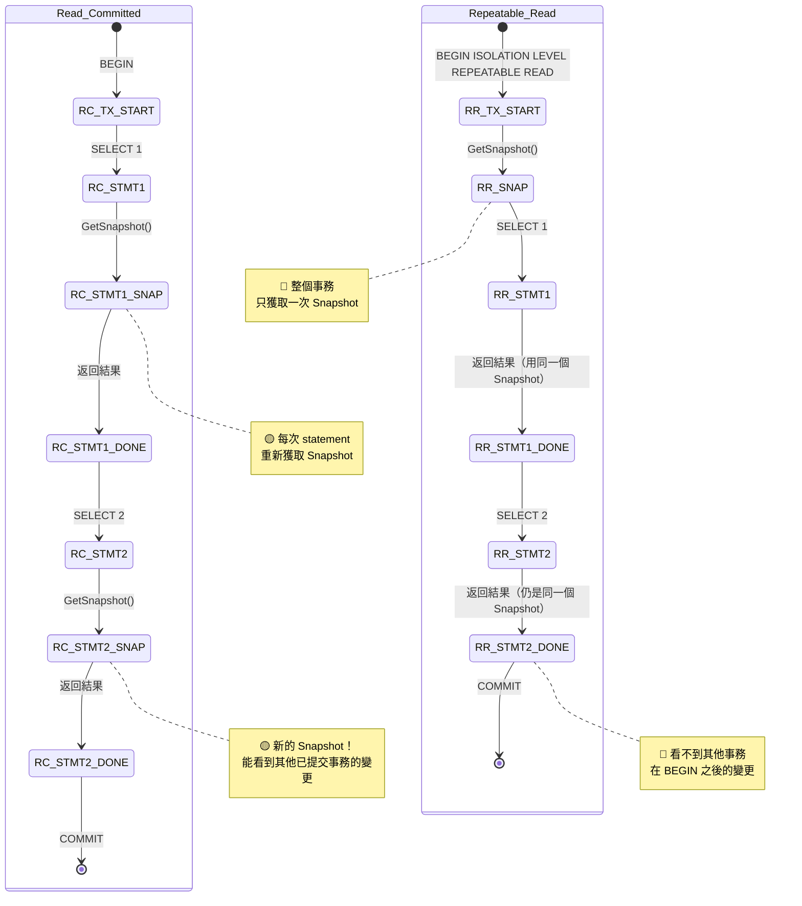
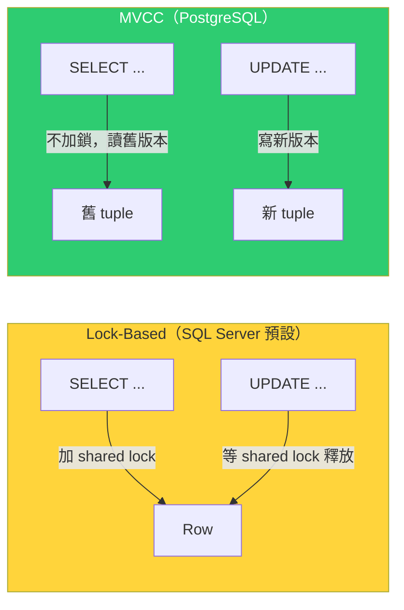
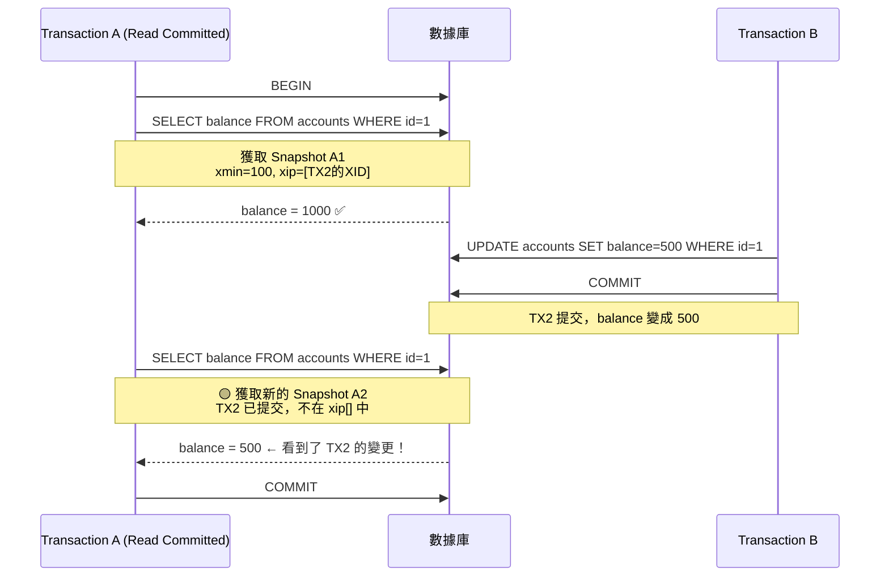
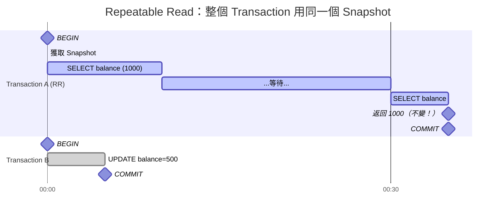
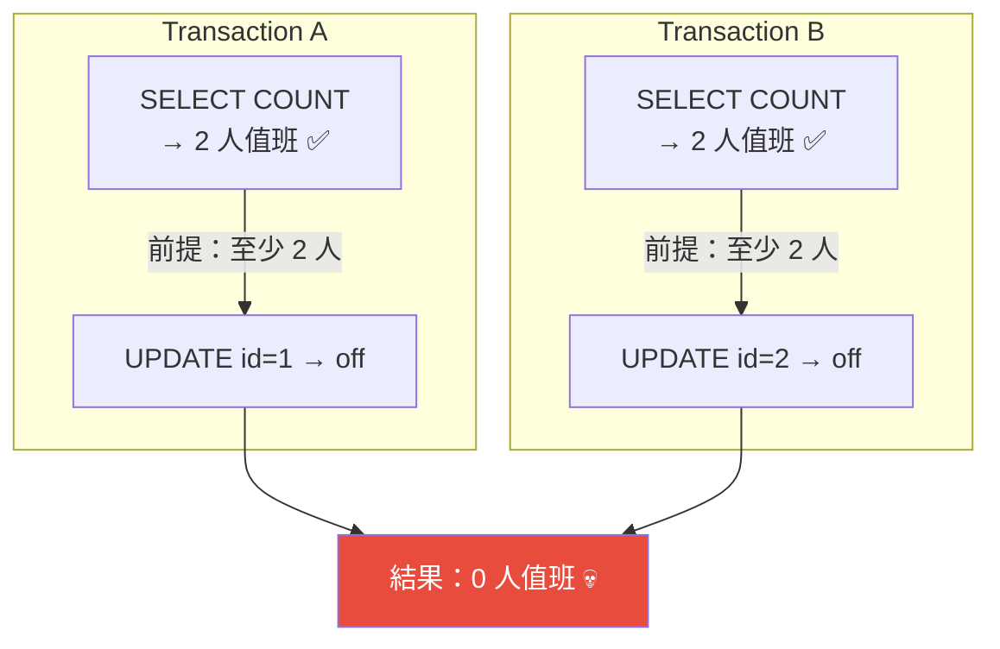
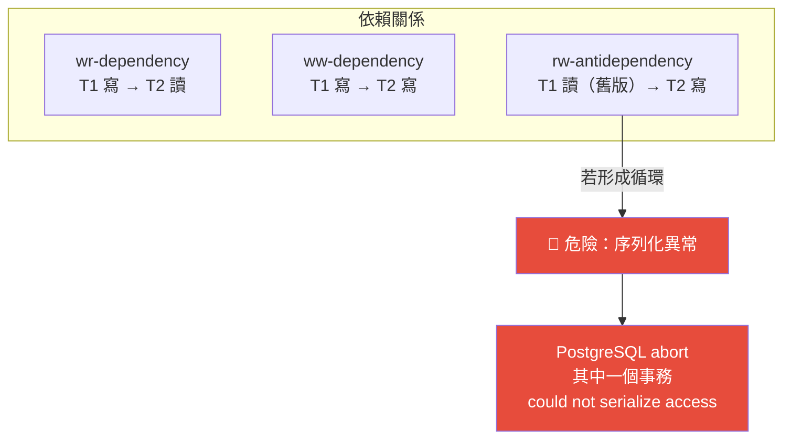
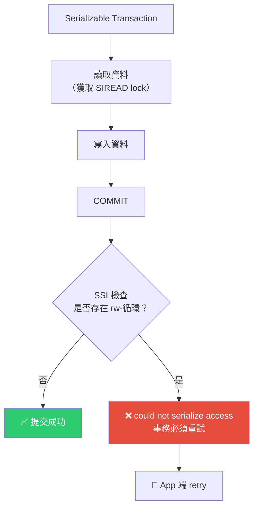
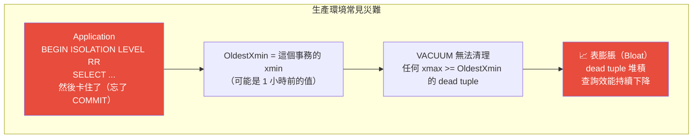
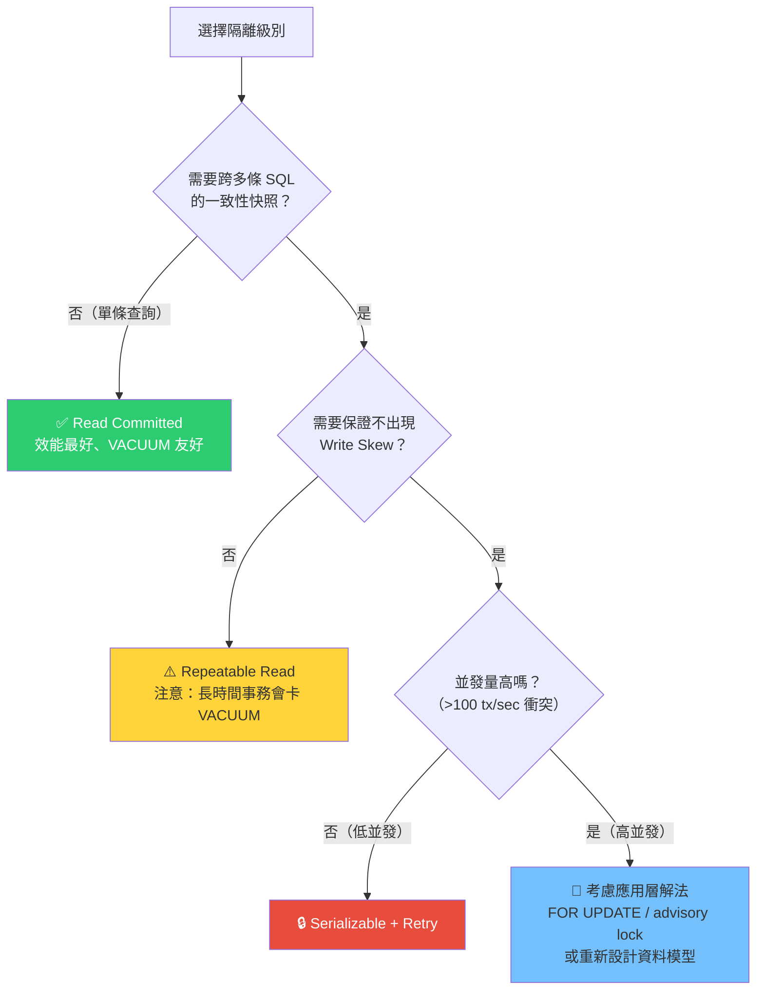

# PostgreSQL Transaction 隔離級別 — 從 MVCC 到生產環境實戰

> 本文系統性解析 PostgreSQL 四種 Transaction 隔離級別的底層實現、行為差異、生產環境陷阱，以及作為 .NET Application Developer 該如何正確選擇和使用。

---

# 一、Transaction 隔離級別的底層：MVCC 與 Snapshot

## 1. Snapshot 獲取時機 —— 隔離級別的唯一定義方式

### I. 先決知識：Snapshot 結構

在深入隔離級別之前，必須理解 PostgreSQL 如何表示「某一時刻的數據庫狀態」。這個機制的核心是 **Snapshot**：

```
Snapshot = {
    xmin: 42,           // 最早仍在活躍的事務 XID。所有 < 42 的事務肯定已 COMMIT 或 ABORT
    xmax: 50,           // 下一個將被分配的 XID。所有 ≥ 50 的事務尚未開始
    xip:  [44, 46, 47], // 當前活躍的事務 XID 列表（在 xmin 到 xmax 之間的進行中事務）
    curcid: 0            // 當前事務內的 command ID（用於同一事務內的多條 statement 可見性）
}
```

Snapshot 決定了**你能看到哪些 row**：
- xmin < snapshot.xmin → **肯定已提交**，可見（除非 xmax 也 < snapshot.xmin，表示被刪除了）
- xmin ≥ snapshot.xmax → **未來的事務**，不可見
- xmin 在 xip[] 中 → **仍在進行中**，不可見
- xmin 不在 xip[] 中且 < snapshot.xmax → 已結束（已提交），可見

> 補充（Senior Dev）：Snapshot 的獲取成本不是免費的。`GetSnapshotData()` 需要掃描 PG 內部的 ProcArray（所有 active backend 的 XID 列表），在數千個 connection 的環境中，這個掃描需要 hold ProcArrayLock（shared lock），高並發下可能成為瓶頸。這就是為什麼 PG 用 snapshot 而非 lock-based concurrency 的代價之一。

### II. 隔離級別的唯一定義：Snapshot 何時獲取



**一句話總結**：Read Committed 和 Repeatable Read 的**唯一差別**在於——Snapshot 是每個 statement 獲取一次，還是整個 transaction 獲取一次。這一個差別，衍生出所有行為差異。

> 補充（Senior Dev）：PostgreSQL 在內部用 `GetTransactionSnapshot()` 獲取 snapshot。對於 Read Committed，每次 statement 開始時都會呼叫 `GetSnapshotData()` 重新構建 snapshot。對於 Repeatable Read 和 Serializable，snapshot 在 transaction 的第一條 statement 時獲取，之後整個 transaction 重用同一個 snapshot。這也解釋了為什麼「BEGIN 後立刻 COMMIT」的空事務不會觸發任何 snapshot 獲取。

### III. 為什麼 PostgreSQL 用 Snapshot 而非 Lock？

傳統資料庫（如 SQL Server 的預設 READ COMMITTED）使用 **shared lock** 來保證一致性：SELECT 時對讀取的行加 shared lock，防止其他人修改。這會導致「讀者阻塞寫者、寫者阻塞讀者」。

PostgreSQL 選擇了完全不同的路徑——**MVCC + Snapshot**：
- SELECT **永遠不加鎖**（除非 `FOR UPDATE`）
- 每個 row 保留多個版本（舊版本存放於 dead tuple）
- Snapshot 決定你能看到哪個版本

這帶來的好處：
1. **讀不阻塞寫、寫不阻塞讀** — 高並發吞吐量的基礎
2. **不需要 READ UNCOMMITTED** — 因為讀取不會被阻塞，所以不需要 dirty read
3. **Rollback 是即時的** — 不需要 undo log，直接把 tuple 標記為不可見

代價是：
1. **需要 VACUUM** — 清理 dead tuple 的後勤成本
2. **OldestXmin** — 長時間未關閉的 transaction 會阻止 VACUUM



---

## 2. Read Uncommitted（PG 中等於 Read Committed）

### I. 為什麼 PostgreSQL 沒有 Dirty Read？

**原理**：在 lock-based 資料庫中，Read Uncommitted 的用途是「不拿 shared lock 直接讀，即使資料可能被 rollback 掉」。但在 PostgreSQL 的 MVCC 模型中，SELECT **本來就不加鎖**，所以你不需要一個特殊的隔離級別來繞過鎖。PostgreSQL 把 `READ UNCOMMITTED` 映射到 `READ COMMITTED`，因為後者已經提供了你期望的所有行為。

**為什麼 PostgreSQL 連 dirty read 都不允許？** 因為 dirty read 的前提是「讀取未提交事務寫入的資料」，但在 PostgreSQL 中：
- 每個事務的寫入只對**自己**可見（自己的 xmin 寫入的 tuple，對自己永遠可見）
- 其他事務的 snapshot 中的 xip[] 包含了未提交事務的 XID，對應的 tuple 被判定為不可見

所以 PostgreSQL **物理上就無法發生 dirty read**——不是靠鎖禁止，而是 snapshot 機制天生就排除了未提交版本的 visible range。

> 補充（Senior Dev）：SQL Server 的 `NOLOCK` hint 或 `READ UNCOMMITTED` 允許 dirty read（可能讀到 rollback 後的資料，導致邏輯錯誤）。PG 完全沒有這個問題，這是一個被低估的架構優勢。

### II. 與 SQL Server 的對比

| 特性 | PostgreSQL | SQL Server |
|------|-----------|------------|
| Read Uncommitted 的真實行為 | 等同 Read Committed | 允許 dirty read |
| SELECT 是否加鎖 | 永不（除非 FOR UPDATE） | 預設加 shared lock（除非 NOLOCK） |
| 是否可能讀到未提交數據 | ❌ 不可能（MVCC 天生杜絕） | ✅ NOLOCK 下可能 |

---

## 3. Read Committed — 生產環境最常用的級別

### I. 每個 Statement 拿新 Snapshot

這是 PostgreSQL 的**預設隔離級別**。核心行為：



關鍵：同一事務內的**兩次 SELECT 會看到不同的數據**——這就是幻讀的根源。

### II. 幻讀 (Phantom Read)

PostgreSQL 的 Read Committed **無法防止幻讀**。但這裡需要澄清一個容易混淆的概念：

- **Non-repeatable Read**：同一行讀兩次，值不同（因為有人 UPDATE 了）→ RC 無法防止
- **Phantom Read**：同一個條件讀兩次，出現新的行（因為有人 INSERT 了）→ RC 也無法防止

兩者在 PG 的 RC 下都會發生，因為都是「兩次 statement 之間有其他事務提交了」。

```sql
-- Session A (Read Committed)
BEGIN;
SELECT COUNT(*) FROM orders WHERE status = 'pending';
-- 返回 100

-- Session B (同時進行)
INSERT INTO orders (status) VALUES ('pending');
COMMIT;

-- Session A (繼續)
SELECT COUNT(*) FROM orders WHERE status = 'pending';
-- 返回 101 ← 幻讀！看到了 Session B 新插入的行
COMMIT;
```

### III. 為什麼生產環境大多數場景用 RC 就夠了？

| 場景 | 是否適合 RC | 原因 |
|------|:---:|------|
| 使用者登入/查詢 profile | ✅ | 一次 SELECT 就完成，沒有「同一事務多次查詢」的需求 |
| 報表查詢 | ✅ | 報表通常一條 SQL 搞定，不需要跨 statement 的一致性 |
| 簡單的 CRUD | ✅ | 每次操作獨立，不需要看到同一時刻的全局快照 |
| 轉帳（扣 A 加 B） | ⚠️ 需要 `FOR UPDATE` | 用 row lock 保證一致性，不依賴 snapshot |
| 複雜報表（多步驟彙總） | ❌ 考慮 RR | 如果中間有人改了資料，多個數字加起來對不上 |

> 補充（Senior Dev）：很多開發者誤以為「交易一定要 Serializable」。實際上，PostgreSQL 的 Read Committed + 正確的 row lock（`SELECT ... FOR UPDATE`）已經能處理絕大多數轉帳、扣庫存場景。關鍵不是隔離級別，而是**你對要修改的行加了適當的鎖**。

---

## 4. Repeatable Read — PG 比 SQL Standard 更強

### I. 整個 Transaction 用同一個 Snapshot



Transaction B 在 Transaction A 開始之後才提交，但 Transaction A 用的是自己開始時的 snapshot，所以**看不到** Transaction B 的變更。即使過了 30 秒再查，`balance` 仍然是 1000。

### II. PostgreSQL 的 RR 比 SQL Standard 更強 —— 也防止 Phantom Read

SQL Standard 定義的 Repeatable Read 只保證 **Non-repeatable Read** 不會發生（同一行讀兩次值不變），但**允許 Phantom Read**。

PostgreSQL 的 RR 則更進一步：因為整個 transaction 用同一個 snapshot，這個 snapshot 中的 xip[] 包含了所有在 BEGIN 時活躍的事務。任何後來才開始的事務（XID > snapshot.xmax）寫入的資料，在這個 snapshot 中都不可見。

因此 PostgreSQL 的 Repeatable Read **也防止了 Phantom Read**：

```sql
-- Session A (Repeatable Read)
BEGIN ISOLATION LEVEL REPEATABLE READ;
SELECT COUNT(*) FROM orders WHERE status = 'pending';
-- 返回 100

-- Session B
INSERT INTO orders (status) VALUES ('pending');
COMMIT;

-- Session A (繼續)
SELECT COUNT(*) FROM orders WHERE status = 'pending';
-- 返回 100 ← 仍然是 100！Phantom Read 被防止了
COMMIT;
```

> 補充（Senior Dev）：PostgreSQL 的 RR 之所以能做到這一點，不是靠 predicate lock，而是**靠 snapshot 的時間邊界**。Session B 的 XID > Session A 的 snapshot.xmax，因此 Session B 寫入的所有 tuple，Session A 都看不到。這比 SQL Server 的 REPEATABLE READ（使用 shared lock 不釋放的方式，但無法防止 phantom）更乾淨。

### III. Write Skew —— RR 仍無法防止的異常

即使 PostgreSQL 的 RR 防止了 Phantom Read，仍存在一個經典的異常——**Write Skew**。

**場景：值班醫生制度**

```sql
-- 規則：任何時刻至少要有一位醫生 on-call

-- Session A (Repeatable Read)
BEGIN ISOLATION LEVEL REPEATABLE READ;
SELECT COUNT(*) FROM doctors WHERE on_call = true;
-- 返回 2 — 至少有兩人值班，我可以請假
UPDATE doctors SET on_call = false WHERE id = 1;
-- 預期：剩下 1 人值班，合法
COMMIT;

-- Session B (同時進行，Repeatable Read)
BEGIN ISOLATION LEVEL REPEATABLE READ;
SELECT COUNT(*) FROM doctors WHERE on_call = true;
-- 返回 2 — 也是看到 2 人（因為看不到 Session A 的未提交變更）
UPDATE doctors SET on_call = false WHERE id = 2;
-- 預期：剩下 1 人值班，合法
COMMIT;
```

兩邊都提交後：`COUNT(*)` = 0，**沒有人值班了**！這就是 Write Skew——兩個事務各自讀了一個「前提條件」，然後基於這個前提做出修改，但雙方的前提都被對方的修改打破了。



**為什麼 RR 無法防止？** 因為 RR 的 snapshot 讓 Session A 看不到 Session B 的修改（反之亦然），但 snapshot **不阻止你基於「過時的數據」做出修改**。兩個事務讀的是各自的 snapshot（都是 2 人），但 UPDATE 實際改變了真實的 row。

**解法**：使用 Serializable，或使用 `SELECT ... FOR UPDATE` 對所有相關行加鎖。

---

## 5. Serializable — 最高隔離級別

### I. SSI（Serializable Snapshot Isolation）原理

PostgreSQL 從 9.1 開始使用 **SSI（Serializable Snapshot Isolation）** 實現 Serializable，而非傳統的兩階段鎖定（2PL）或嚴格兩階段鎖定（S2PL）。

SSI 的核心思想是：**在不阻塞讀寫的前提下，追蹤事務之間的依賴關係。如果偵測到可能導致序列化異常的依賴循環，就 abort 其中一個事務**。

SSI 追蹤三種依賴：

| 依賴類型 | 符號 | 含義 | 舉例 |
|---------|------|------|------|
| **wr-dependency**（寫-讀） | T1 → T2 | T1 寫了某行，T2 讀了該行 | T1 UPDATE，T2 SELECT 看到 T1 的結果 |
| **ww-dependency**（寫-寫） | T1 → T2 | T1 寫了某行，T2 覆寫了該行 | T1 UPDATE x=1，T2 UPDATE x=2 |
| **rw-antidependency**（讀-寫） | T1 → T2 | T1 讀了某行（的舊版本），T2 後來寫了該行 | **這是 Write Skew 的根源** |



### II. SIREAD Lock — 讀操作的隱形鎖

在 Serializable 級別下，每個 SELECT 都會隱式地獲取 **SIREAD lock**（讀取謂詞鎖）。它不像普通鎖那樣阻塞其他人，而是記錄「我讀了哪些資料」，用於後續的依賴偵測。

```sql
-- Session A (Serializable)
BEGIN ISOLATION LEVEL SERIALIZABLE;
SELECT * FROM doctors WHERE on_call = true;
-- ↑ 獲取 SIREAD lock: 記錄「我讀了 WHERE on_call=true 的所有行」
```

SIREAD lock 的粒度不是 row-level，而是 **page-level**。這意味著：
- 如果你讀了 page 1 中的某行，整個 page 1 被標記為「被讀取」
- 如果其他事務修改了這個 page 中的**任何行**（即使不是你讀的那一行），就可能觸發 rw-antidependency
- 在高並發場景下，page-level granularity 可能導致 **false positive serialization failure**

> 補充（Senior Dev）：page-level SIREAD lock 是 PostgreSQL SSI 的一個已知 trade-off。在某些場景下（例如多個不相關的 row 恰好在同一個 page 中），可能會導致不必要的 serialization failure。PG 9.2 引入了 `predicate_lock_consistency` 參數（PG 10 移除），並持續改進 false positive 率。但核心局限仍存在：SIREAD 是 page 級別，不是 row 級別。

### III. Serialization Failure 的觸發條件

SSI 會在你 COMMIT 時檢查依賴圖中是否存在**包含 rw-antidependency 的循環**。如果存在，PostgreSQL 會 abort 其中一個事務並回傳 error：

```
ERROR: could not serialize access due to read/write dependencies among transactions
DETAIL: Reason code: Canceled on identification as a pivot, during commit attempt.
HINT: The transaction might succeed if retried.
```

**關鍵認知**：Serializable 不保證你的事務一定成功，而是保證**要嘛成功（且結果等價於某種序列執行順序）、要嘛報錯讓你重試**。



### IV. 效能 Overhead 與 Production 取捨

| 面向 | Read Committed | Repeatable Read | Serializable |
|------|:---:|:---:|:---:|
| Snapshot 獲取 | 每個 statement 一次 | 整個事務一次 | 整個事務一次 |
| SIREAD lock | ❌ | ❌ | ✅（page-level） |
| 記憶體額外開銷 | 無 | 無 | 每個事務需要 SIREAD lock 追蹤 |
| 衝突偵測 | 無 | 無 | COMMIT 時進行 |
| False positive | 無 | 無 | 可能（page-level granularity） |
| 適合場景 | 90% 的 OLTP | 報表/一致性讀取 | 關鍵金融操作 |

**效能影響的量化理解**：
- SIREAD lock 儲存在 shared memory 中（由 `max_pred_locks_per_transaction` 控制，預設 64）
- 每個 transaction 最多可有 64 個 predicate lock（page 級），超過時會升級為 relation 級別 lock
- relation 級別的 SIREAD lock 會導致大量 false positive，應避免（透過調高 `max_pred_locks_per_transaction`）
- Serializable 的 overhead 主要不是 CPU，而是**abort rate**：高並發下可能頻繁觸發 serialization failure

```sql
-- 查看 predicate lock 使用情況
SELECT mode, count(*) FROM pg_locks
WHERE locktype = 'SIReadLock'
GROUP BY mode;
```

---

## 6. 隔離級別如何影響 VACUUM

### I. OldestXmin 的計算

VACUUM 只能清理「所有活躍事務都不再需要看到」的 dead tuple。這個邊界值就是 **OldestXmin**——資料庫中所有活躍事務的 snapshot.xmin 的最小值。

```
OldestXmin = MIN(所有活躍事務的 backend_xmin)
```

一個 dead tuple 的 `xmax < OldestXmin` 才能被 VACUUM 回收。

### II. Repeatable Read 對 VACUUM 的殺傷力



**為什麼 RR 特別危險？** Read Committed 的事務每次 statement 會更新 snapshot，但後續的 statement 可能拿到更新的 snapshot（xmin 前進）。而 RR 從頭到尾持著最老的 snapshot，**OldestXmin 永遠不會前進**。

```sql
-- 找出正在阻止 VACUUM 的事務（通常是 RR 或 idle-in-transaction）
SELECT pid, datname, usename, application_name,
       state, backend_xmin,
       age(backend_xmin) AS xmin_age,
       now() - xact_start AS xact_duration,
       LEFT(query, 200) AS last_query
FROM pg_stat_activity
WHERE backend_xmin IS NOT NULL
  AND state = 'idle in transaction'
ORDER BY age(backend_xmin) DESC;
```

- `age(backend_xmin)` = 這個 transaction 的 snapshot 年資（以 transaction 數計算）
- 如果超過數百萬（大量寫入後），大量 dead tuple 被這個 snapshot 保護，無法回收

> 補充（Senior Dev）：生產環境中，**長時間的 Repeatable Read transaction 是 Bloat 的第一大元兇**，排名比大規模 DELETE 更高。一個忘了關閉的 RR transaction 可以讓你一個週末回來發現表膨脹了 3 倍。解法：
> - `idle_in_transaction_session_timeout = '5min'`（PG 10+，直接 kill）
> - `old_snapshot_threshold = '1h'`（PG 9.6+，強制 snapshot 過期，但查詢可能報 "snapshot too old" error）
> - 盡量用 Read Committed，只在需要一致性快照的場景才用 RR

---

# 二、生產環境場景

## 1. 場景：Read Committed 下的轉帳 Phantom

### I. 原理重現

```sql
-- 準備
CREATE TABLE accounts (id INT PRIMARY KEY, balance INT);
INSERT INTO accounts VALUES (1, 1000), (2, 1000);

-- Session A (Read Committed) — 轉帳驗證
BEGIN;
SELECT SUM(balance) FROM accounts;           -- 返回 2000
SELECT balance FROM accounts WHERE id = 1;    -- 返回 1000
-- 準備扣款...但 Session B 在這個時候插入了

-- Session B (同時)
UPDATE accounts SET balance = 500 WHERE id = 1;
COMMIT;

-- Session A (繼續)
SELECT balance FROM accounts WHERE id = 2;    -- 返回 1000
SELECT SUM(balance) FROM accounts;           -- 返回 1500 ← 總額變了！
-- 基於「總額 2000」做的後續判斷全部失效
COMMIT;
```

### II. 解法矩陣

| 解法 | 適用場景 | 限制 |
|------|---------|------|
| `SELECT ... FOR UPDATE` | 需要鎖定特定行進行後續修改 | 僅鎖定被 SELECT 的行，不鎖定新插入的行 |
| 改用 Repeatable Read | 需要多個 SELECT 之間的一致性快照 | 長時間事務會卡 VACUUM |
| Serializable | 最嚴格的一致性要求 | 需要 retry logic |
| 應用層重試 | 所有場景 | 增加開發複雜度 |

## 2. 場景：Repeatable Read 導致 VACUUM 積壓

### I. 原理

前面 6.II 已經說明了 OldestXmin 的影響。這是生產環境最常見的 Bloat 成因——比大規模 DELETE 更難排查，因為**表面上看起來沒有問題**：查詢正常、沒有 error、沒有 lock wait，但表的大小在偷偷增長。

### II. 即用查詢

```sql
-- 找出每個 database 中最老的 xmin（決定 VACUUM 能回收多老的 dead tuple）
SELECT datname,
       age(datfrozenxid) AS frozen_xid_age,
       datfrozenxid,
       (SELECT age(backend_xmin) FROM pg_stat_activity
        WHERE datname = d.datname AND backend_xmin IS NOT NULL
        ORDER BY age(backend_xmin) DESC LIMIT 1) AS oldest_active_xmin
FROM pg_database d
WHERE datname = current_database();
```

### III. 應急解法

| 優先級 | 行動 |
|--------|------|
| 1 | 找出 RR idle-in-transaction session → kill |
| 2 | `SET idle_in_transaction_session_timeout = '5min'` |
| 3 | 改用 Read Committed（90% 場景不需要 RR） |
| 4 | 手動 `VACUUM FREEZE` 標記老 tuple 為 frozen（繞過 xmin 限制） |

## 3. 場景：Serializable Write Skew — 實際案例

```sql
-- 值班醫生表
CREATE TABLE doctors (id INT PRIMARY KEY, on_call BOOLEAN);
INSERT INTO doctors VALUES (1, true), (2, true);

-- Session A (Serializable)
BEGIN ISOLATION LEVEL SERIALIZABLE;
SELECT COUNT(*) FROM doctors WHERE on_call;  -- 2
UPDATE doctors SET on_call = false WHERE id = 1;

-- Session B (Serializable，同時）
BEGIN ISOLATION LEVEL SERIALIZABLE;
SELECT COUNT(*) FROM doctors WHERE on_call;  -- 2
UPDATE doctors SET on_call = false WHERE id = 2;

-- Session A COMMIT → 成功
-- Session B COMMIT → ❌ ERROR: could not serialize access
```

SSI 偵測到了 rw-antidependency 循環（A 讀了 B 後來寫的 row，B 讀了 A 後來寫的 row），abort 了 B。

### III. App Dev Retry Pattern

```csharp
// See Section 三 for full retry pattern
```

## 4. 隔離級別選擇決策矩陣



| 級別 | 防止 Dirty Read | 防止 Non-Repeatable Read | 防止 Phantom Read | 防止 Write Skew | VACUUM 友好 |
|------|:---:|:---:|:---:|:---:|:---:|
| Read Committed | ✅ | ❌ | ❌ | ❌ | ✅✅✅ |
| Repeatable Read | ✅ | ✅ | ✅ (PG 獨有) | ❌ | ❌ |
| Serializable | ✅ | ✅ | ✅ | ✅ | ❌ |

---

# 三、App Dev 視角：.NET / Dapper 實戰

## 1. Npgsql 中的 IsolationLevel 設定

### I. NpgsqlTransaction 的 IsolationLevel Enum

Npgsql 支援以下五個 enum 值：

```csharp
using var tx = conn.BeginTransaction(IsolationLevel.ReadCommitted);
```

| Npgsql Enum | PG 對應 | 注意 |
|-------------|---------|------|
| `ReadUncommitted` | Read Committed | PG 中等同 RC |
| `ReadCommitted` | Read Committed | **預設值** |
| `RepeatableRead` | Repeatable Read | 整個事務同一個 Snapshot |
| `Serializable` | Serializable | 需要 retry logic |
| `Snapshot` | Repeatable Read | PG 中等同 RR |
| `Chaos` | — | PG 不支援，會報錯 |

### II. Dapper 的正確 Transaction 管理

```csharp
// ✅ 正確寫法：明確指定隔離級別
using var conn = new NpgsqlConnection(connectionString);
conn.Open();
using var tx = conn.BeginTransaction(IsolationLevel.ReadCommitted);
try
{
    var balance = conn.QuerySingle<int>(
        "SELECT balance FROM accounts WHERE id = @id FOR UPDATE",
        new { id = 1 }, tx);  // ← 傳入 transaction！

    if (balance >= amount)
    {
        conn.Execute(
            "UPDATE accounts SET balance = balance - @amount WHERE id = @id",
            new { amount, id = 1 }, tx);
        conn.Execute(
            "UPDATE accounts SET balance = balance + @amount WHERE id = @id",
            new { amount, id = 2 }, tx);
    }

    tx.Commit();
}
catch (PostgresException ex) when (ex.SqlState == "40001")
{
    // 40001 = serialization_failure
    // 只有 Serializable 會觸發這個 error
    tx.Rollback();
    throw new TransientException("Serialization failure, retry", ex);
}
catch
{
    tx.Rollback();
    throw;
}
```

```csharp
// ❌ 錯誤寫法 1：沒傳 transaction 給 Dapper
var balance = conn.QuerySingle<int>(
    "SELECT balance FROM accounts WHERE id = 1 FOR UPDATE");
// ← FOR UPDATE 需要 transaction！沒傳 tx 會報錯或行為不正確

// ❌ 錯誤寫法 2：用了 Repeatable Read 但沒意識到 VACUUM 風險
using var tx = conn.BeginTransaction(IsolationLevel.RepeatableRead);
// ...處理業務邏輯（可能含外部 API call，耗時不確定）
await httpClient.PostAsync(...);  // ← 如果 timeout，transaction 卡住
tx.Commit();
// → OldestXmin 被鎖住 5 分鐘，VACUUM 無法清理
```

### III. Dapper 參數化查詢與 pg_stat_statements Query Normalization

```csharp
// Dapper 的參數化會產生 $1, $2 佔位符
var orders = conn.Query<Order>(
    "SELECT * FROM orders WHERE status = @status AND create_time > @since",
    new { status = "active", since = DateTime.UtcNow.AddDays(-7) });

// PG 內部實際執行：
// SELECT * FROM orders WHERE status = $1 AND create_time > $2
// pg_stat_statements 的 query normalization 與此一致
// queryid 對應的是「參數化後的 SQL 模板」
```

> 補充（Senior Dev）：Dapper 的參數化預設使用 positional parameters（`$1, $2`），與 Npgsql 的原生行為一致。確保不要在 SQL 中拼接字串（如 `$"WHERE status = '{status}'"`），否則每種參數值會產生不同的 queryid，導致 pg_stat_statements 無法正確彙總統計。如果有動態 WHERE 條件（如 optional filters），使用 Dapper 的 `DynamicParameters` 或 `SqlBuilder`。

## 2. Serializable Retry Pattern

### I. 為什麼 Serializable 需要 Retry？

Serializable 的 serialization failure 不是 bug，是**設計行為**。SSI 在 COMMIT 時才檢查依賴，所以你的 transaction 可能會：
1. 執行所有 SQL 都成功
2. 到 `tx.Commit()` 時才拋 `40001 serialization_failure`
3. 你必須重試整個 transaction

### II. C# Retry Pattern（Polly）

```csharp
using Polly;

var retryPolicy = Policy
    .Handle<PostgresException>(ex => ex.SqlState == "40001")
    .WaitAndRetry(
        retryCount: 3,
        sleepDurationProvider: retryAttempt =>
            TimeSpan.FromMilliseconds(Math.Pow(2, retryAttempt) * 100),
        onRetry: (exception, timeSpan, retryCount, context) =>
        {
            _logger.LogWarning(
                "Serialization failure on retry {RetryCount}, " +
                "waiting {WaitMs}ms before retry",
                retryCount, timeSpan.TotalMilliseconds);
        });

retryPolicy.Execute(() =>
{
    using var conn = new NpgsqlConnection(connectionString);
    conn.Open();
    using var tx = conn.BeginTransaction(IsolationLevel.Serializable);
    try
    {
        // 你的 business logic
        var count = conn.QuerySingle<int>(
            "SELECT COUNT(*) FROM doctors WHERE on_call",
            transaction: tx);
        if (count >= 2)
        {
            conn.Execute(
                "UPDATE doctors SET on_call = false WHERE id = @id",
                new { id = 1 }, tx);
        }
        tx.Commit();
    }
    catch
    {
        tx.Rollback();
        throw;
    }
});
```

### III. 什麼時候該降級而非重試？

| 情況 | 建議 |
|------|------|
| 高並發、高衝突率（>5% abort rate） | 不要用 Serializable，改用 `SELECT FOR UPDATE` + Read Committed |
| 外部 API call 在 transaction 內 | 不要用 Serializable，transaction 時間太長會放大衝突 |
| 偶爾的 write skew 可容忍 | 用 Repeatable Read + 業務邏輯補償（比 retry overhead 小） |
| 金流、庫存扣減 | Serializable + retry（不能容忍一致性錯誤） |

---

# 附錄、SQL Standard vs PostgreSQL 隔離級別對照

| 異常現象 | SQL Standard 定義 | PG Read Committed | PG Repeatable Read | PG Serializable |
|----------|:---:|:---:|:---:|:---:|
| **Dirty Read** | RC 防止 | ✅ 防止 | ✅ 防止 | ✅ 防止 |
| **Non-Repeatable Read** | RR 防止 | ❌ 不防止 | ✅ 防止 | ✅ 防止 |
| **Phantom Read** | Serializable 防止 | ❌ 不防止 | ✅ 防止 (PG 獨有) | ✅ 防止 |
| **Serialization Anomaly** | Serializable 防止 | ❌ 不防止 | ❌ 不防止 | ✅ 防止 |
| **Write Skew** | （無明確定義） | ❌ | ❌ | ✅ |

> PostgreSQL 的 Repeatable Read 實際上達到了 SQL Standard 中 Serializable 的大部分保證（防止 Phantom Read），但不能防止所有序列化異常（Write Skew 仍可能發生）。真正的 Serializable 使用 SSI 來偵測並拒絕這些異常。

## 版本演進

| 功能 | 版本 | 說明 |
|------|------|------|
| SSI (Serializable Snapshot Isolation) | PG 9.1 | 取代傳統 S2PL 鎖定，效能大幅提升 |
| `predicate_lock_consistency` | PG 9.2-9.x | 控制 SIREAD lock 的 false positive（PG 10 移除） |
| `old_snapshot_threshold` | PG 9.6 | 限制 RR 事務的 snapshot 壽命 |
| `idle_in_transaction_session_timeout` | PG 10 | 自動 kill 忘了 COMMIT 的 session |
| `default_transaction_isolation` 支援 enum | PG 10+ | 不再需要用字串設定 |
| `pg_stat_activity.backend_xmin` | 內建 | 直接查看每個 session 的 snapshot xmin |

## 參考

- [PostgreSQL Official — Transaction Isolation](https://www.postgresql.org/docs/current/transaction-iso.html)
- [PostgreSQL SSI Paper (Ports & Grittner, 2012)](https://drkp.net/papers/ssi-vldb12.pdf)
- [PostgreSQL Concurrency Control — MVCC Deep Dive](https://www.interdb.jp/pg/pgsql05.html)
