# PostgreSQL 資料型別深度探討

本文由淺入深，依序探討三個 PostgreSQL 資料型別相關主題：

1. **第一章「Float vs Numeric 性能對比」**：從實戰角度出發，比較兩種數值型別的效能差異、底層原因與選型建議。適合快速了解何時該用哪種型別。
2. **第二章「AT TIME ZONE 語法解析」**：深入 parser 內部（gram.y）、型別系統與函數 overload 選擇邏輯，用一個違反直覺的案例逐步拆解 `EXTRACT epoch` 在不同時區下的行為。適合想理解 PostgreSQL 型別系統底層運作的讀者。
3. **第三章「timestamptz vs timestamp — .NET 8 Dapper / EF Core 實戰」**：從 Npgsql 6.0 的 breaking change 出發，解釋 `DateTimeKind` 錯誤的底層原理、Dapper 與 EF Core 的具體寫法、以及正確的型別選擇策略。適合 .NET 開發者在實際專案中避坑。

建議依序閱讀：先建立對數值型別的實戰認識，再進入時間型別的 parser 層級分析，最後落腳到應用層的 .NET 實踐。

---

# 一、Float vs Numeric 性能對比

> 來源：[digoal - float和numeric性能对比 (2015-10-20)](https://github.com/digoal/blog/blob/master/201510/20151020_02.md)
>
> 更新於 2026-05-17，補充 JIT / SIMD 演進

> **初學者先知道**：在程式語言中，"型別（data type）"決定了資料在記憶體中的存儲方式和 CPU 如何處理它。`FLOAT`（浮點數）就像 CPU 的母語——硬體直接支援，運算極快但有小數點後幾位的誤差（約 15 位精度）。`NUMERIC` 則是軟體模擬的任意精度運算——可以精確到數千位小數，但代價是運算速度慢。這兩者的選擇本質上是「速度 vs 精度」的取捨。

---

## 1. 測試環境

> **本節說明**：在開始 benchmark 之前，需要先了解測試是如何設定的。這裡建立了兩張結構幾乎相同的表——一張用 NUMERIC，一張用 FLOAT——來進行公平的效能比較。

```sql
CREATE TABLE tt (c1 NUMERIC, c2 NUMERIC);
ALTER TABLE tt ALTER COLUMN c1 SET STORAGE PLAIN;  -- 避免 TOAST overhead
ALTER TABLE tt ALTER COLUMN c2 SET STORAGE PLAIN;
INSERT INTO tt VALUES (1.1111, 1.1111);

CREATE TABLE tf (c1 FLOAT, c2 FLOAT);
INSERT INTO tf VALUES (1.1111, 1.1111);
```

### 為什麼要 `SET STORAGE PLAIN`？—— 深入 TOAST 機制

> **新手提示**：這段會從最基礎的 PostgreSQL 存儲原理講起。如果你對名詞不熟沒關係，把它想像成「書本的頁面」和「太長的段落要移到附錄」就很好理解了。

#### 第一步：PostgreSQL 的 "頁面" (Page) 概念

PostgreSQL 把資料存在硬碟上時，是以一個固定大小的 **頁面（Page）** 為單位來讀寫的。每個頁面預設 **8KB**（8192 bytes），不可改變。

```
硬碟上的資料檔:
┌────────────┬────────────┬────────────┬────────────┐
│  Page 0    │  Page 1    │  Page 2    │  Page 3    │  ...
│  8 KB      │  8 KB      │  8 KB      │  8 KB      │
│  ┌──────┐  │  ┌──────┐  │  ┌──────┐  │  ┌──────┐  │
│  │Row 1 │  │  │Row 3 │  │  │Row 5 │  │  │Row 7 │  │
│  │Row 2 │  │  │Row 4 │  │  │Row 6 │  │  │ ...  │  │
│  └──────┘  │  └──────┘  │  └──────┘  │  └──────┘  │
└────────────┴────────────┴────────────┴────────────┘
```

一條資料列（Row）的總大小受這 8KB 限制——**一條 row 不能跨越多個 page**。這就是 PG 的基本規則。

#### 第二步：問題——當欄位太大，塞不進一個 Page？

考慮這張表：

```sql
CREATE TABLE blog_post (
    id      INT,
    title   TEXT,
    content TEXT    -- 這篇文章可能有 100KB！
);
```

100KB 的文章內容 `content`，遠超過一個 page 的 8KB 限制。如果 PG 硬要把整條 row 塞進去，它做不到。那怎麼辦？

答案就是 **TOAST**。

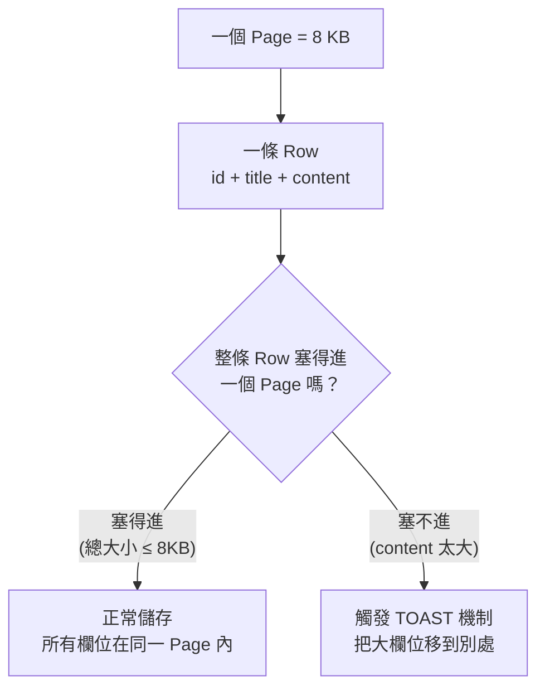

#### 第三步：TOAST 是什麼？

**TOAST** = **T**he **O**versized-**A**ttribute **S**torage **T**echnique（超大衣櫃儲存技術，中文有人戲稱「烤吐司」）。

TOAST 的核心思想：**把太大的欄位值從主表中「切出來」，放到另一張獨立的附属表中儲存，主表中只留一個指標指向它。**

```
┌─────────── 主表 (blog_post) ───────────┐
│ id │ title        │ content           │
├────┼──────────────┼───────────────────┤
│ 1  │ "Hello"      │ ➜ TOAST pointer   │  ← 主表只存一個指標
│ 2  │ "TOAST 詳解" │ ➜ TOAST pointer   │
└────┴──────────────┴───────────────────┘
                      │
                      ▼
┌──── TOAST 附属表 (pg_toast_xxxxx) ────┐
│ chunk_id │ chunk_seq │ chunk_data     │
├──────────┼───────────┼────────────────┤
│ 1001     │ 0         │ "PostgreSQL... │  ← 真實資料切成多個
│ 1001     │ 1         │ "是一種強大..." │    2KB 的小塊存放
│ 1001     │ 2         │ "...的資料庫"  │
│ 1002     │ 0         │ "TOAST 的作用" │
│ 1002     │ 1         │ "是解決超大..." │
└──────────┴───────────┴────────────────┘
```

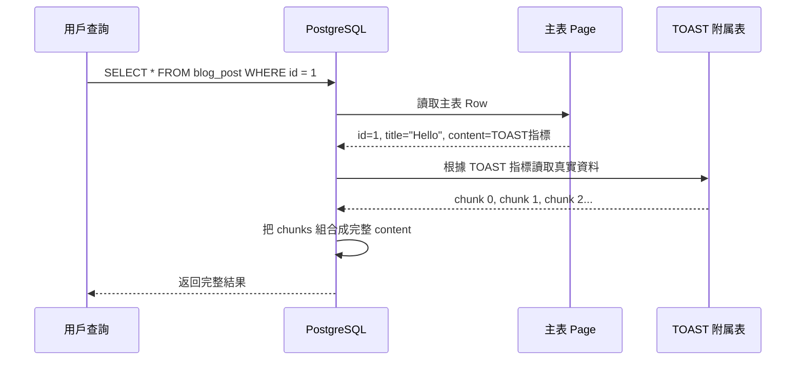

> **關鍵效能影響**：TOAST 指標指向的值存在另一個物理位置。因此每次要讀取這個欄位時，PG 需要「**額外的硬碟 I/O**」去 TOAST 附属表中把資料找回來。這就好比你讀一本書，大部分內容在正文裡，但某一段被移到附錄——你必須翻到附錄才能讀到它。對於 benchmark 而言，這些額外的 I/O 會**汙染效能數據**，讓你看不清數值運算本身的真實速度。

#### 第四步：四種 Storage 策略

PostgreSQL 為每個欄位提供四種 TOAST 策略，你可以用 `ALTER COLUMN ... SET STORAGE` 來選擇：

| 策略 | 行為 | 觸發條件 | 適合場景 |
|------|------|---------|---------|
| `PLAIN` | **禁止 TOAST**。不壓縮、不移到外部。 | 永不觸發。值太大就報錯（row too big）。 | Benchmark、已知很小的欄位 |
| `EXTENDED` | **先壓縮，還太大就移到外部** | 值 > 2KB 時嘗試壓縮，壓縮後仍 > 2KB 則 TOAST | **PG 的預設策略**，適合 TEXT / BYTEA |
| `EXTERNAL` | **不壓縮，直接移到外部** | 值 > 2KB 時直接 TOAST，不嘗試壓縮 | 已壓縮的資料（如 JPEG），壓了也白壓 |
| `MAIN` | **先壓縮，壓完盡量留在主表** | 值 > 2KB 時先壓縮，除非壓縮後仍然塞不進 page 才 TOAST | 需要頻繁讀取的大欄位 |

```mermaid
flowchart TD
    S["一個欄位的值"] --> QSZ{"值有多大？"}

    QSZ -->|"≤ 2KB"| NORMAL["所有策略都一樣<br/>直接存在主表中<br/>不觸發 TOAST"]

    QSZ -->|"> 2KB"| STGY{"當前 STORAGE<br/>策略是？"}

    STGY -->|PLAIN| PERR["❌ 報錯<br/>row too big"]
    STGY -->|EXTERNAL| EXT["直接移到 TOAST 表<br/>不壓縮"]
    STGY -->|EXTENDED| EXD["先嘗試壓縮"]
    STGY -->|MAIN| MAI["先嘗試壓縮"]

    EXD --> EXD2{"壓縮後仍 > 2KB？"}
    EXD2 -->|是| TOAST1["移到 TOAST 表"]
    EXD2 -->|否| STAY1["留在主表中"]

    MAI --> MAI2{"壓縮後<br/>Row 總大小<br/>仍塞不進 Page？"}
    MAI2 -->|是| TOAST2["移到 TOAST 表"]
    MAI2 -->|否| STAY2["留在主表中"]

    style PERR fill:#ff6b6b,color:#fff
    style STAY1 fill:#4ecdc4,color:#fff
    style STAY2 fill:#4ecdc4,color:#fff
```

#### 第五步：回到「為什麼 Benchmark 要 SET STORAGE PLAIN」

```sql
-- 原始 Benchmark 設定：
CREATE TABLE tt (c1 NUMERIC, c2 NUMERIC);
ALTER TABLE tt ALTER COLUMN c1 SET STORAGE PLAIN;
ALTER TABLE tt ALTER COLUMN c2 SET STORAGE PLAIN;
```

- **NUMERIC 預設的 storage 策略是 `MAIN`** —— PG 可能會壓縮、甚至 TOAST 化大數值。
- `NUMERIC(1000, 500)` 這類高精度數字的內部 digit 陣列可以很長（超過 2KB），此時 PG **會觸發 TOAST**，讀寫時產生額外的附屬表 I/O。
- Benchmark 中雖然用的是 `NUMERIC(1.1111)`（只有 4 位小數，內部結構很小，根本不會觸發 TOAST），但 `SET STORAGE PLAIN` 是一個**防禦性措施**——確保即使未來測試大數值，也不會被 TOAST 開銷汙染結果。
- `FLOAT` 永遠是固定 8 bytes，絕對不可能超過 2KB，因此不需要這一步。

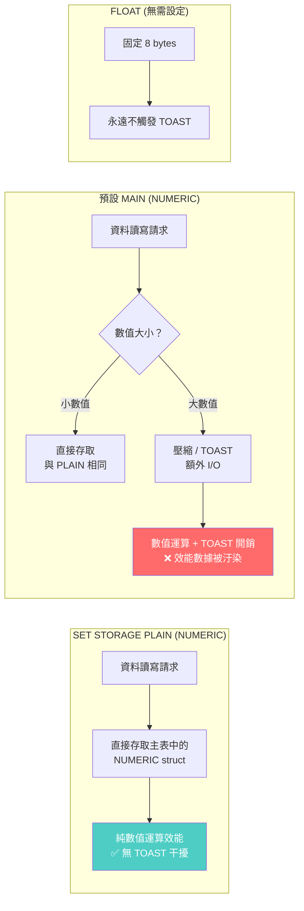

#### 一句話總結

| 概念 | 比喻 |
|------|------|
| **Page** | 一本書的每一頁，固定大小 8KB |
| **TOAST** | 文章太長寫不下，把冗餘段落移到書末「附錄」 |
| **TOAST 指標** | 正文中留一句「詳見附錄第 X 頁」 |
| **STORAGE PLAIN** | 「不准移到附錄，寫不下就報錯」——測效能時用它排除附錄翻頁的干擾 |
| **STORAGE EXTENDED（預設）** | 「寫不下先縮小字體（壓縮），再不行就移到附錄」——這是 PG 對 TEXT 欄位的預設策略 |

---

## 2. Benchmark 結果

> **本節說明**：這裡用三種場景測試兩者的效能——基本加減乘除、數學函數（開根號）、以及高精度 Pi 計算。TPS（Transactions Per Second，每秒能處理的交易數）越高代表效能越好。Latency（延遲）越低代表回應越快。

### I. 基本算術運算（+, *, /, -）

這是日常使用中最常見的操作——加減乘除。測試使用 8 個並行連線（concurrent clients），持續 10 秒。

**NUMERIC（8 concurrent, 10 秒）：**

```
tps: ~35,028  (latency 0.227ms)
```

**FLOAT（8 concurrent, 10 秒）：**

```
tps: ~34,729  (latency 0.229ms)
```

小數值（4 位小數）的 basic arithmetic 兩者近乎持平，numeric 甚至略快。

> **為什麼 NUMERIC 反而略快？** 這聽起來違反直覺，但原因是：當數字很小時（只有 4 位小數），NUMERIC 的內部結構也非常小，幾乎不產生額外負擔。甚至 NUMERIC 的簡單運算路徑（少數幾個 digit）經過了 PG 的高度優化，可能比透過 CPU 浮點指令再轉回來的路徑還短。這就是為什麼在 OLTP（線上交易處理）場景中兩者差異不明顯的底層原因。

### II. 數學函數（sqrt + cbrt + arithmetic）

引入 `sqrt`（平方根）和 `cbrt`（立方根）後，情況開始改變。

**NUMERIC（8 concurrent, 6 秒）：**

```
tps: ~29,667  (latency 0.268ms)
```

**FLOAT（8 concurrent, 6 秒）：**

```
tps: ~30,528  (latency 0.261ms)
```

引入 `sqrt` / `cbrt`（在 PG 中寫法分別為 `|/c1` 和 `||/c1`）後，float 開始輕微領先。

> **為什麼 sqrt 會拉開差距？** 計算平方根不像加減乘除那樣簡單——它需要反覆逼近（迭代），逐步收斂到正確值。CPU 有專門的硬體指令來做浮點數的 sqrt（一條指令就能完成，硬體內建），但對於 NUMERIC，PG 必須用 C 語言寫好幾層迴圈，一個 digit 一個 digit 地手算，導致效能開始出現差距。

### III. Pi 計算（遞歸逼近，70 次迭代）

這是「終極壓力測試」——使用迭代逼近法計算圓周率 Pi，重複 70 次逼近，每次迭代都涉及大量的 sqrt 和乘法運算。

```sql
-- NUMERIC: 完整精度
WITH RECURSIVE pi(lv, c) AS (
  SELECT 1::NUMERIC lv, 1::NUMERIC c
  UNION ALL
  SELECT lv + 1,
         SQRT((c/2)*(c/2) + (1-SQRT(1-(c/2)*(c/2)))*(1-SQRT(1-(c/2)*(c/2)))) c
  FROM pi WHERE lv < 70
)
SELECT 3 * POWER(2, lv) * c / 2 p FROM pi WHERE lv = 70;

-- Result: 3.14159265358979323846264338327950288419717321...
--          ...(數千位精度，完整展開)
-- Time: 513.449 ms
```

```sql
-- FLOAT: 僅 double precision
WITH RECURSIVE pi(lv, c) AS (
  SELECT 1::FLOAT lv, 1::FLOAT c
  UNION ALL
  SELECT lv + 1,
         SQRT((c/2)*(c/2) + (1-SQRT(1-(c/2)*(c/2)))*(1-SQRT(1-(c/2)*(c/2)))) c
  FROM pi WHERE lv < 70
)
SELECT 3 * POWER(2, lv) * c / 2 p FROM pi WHERE lv = 70;

-- Result: 3.14159265358979
-- Time: 1.431 ms
```

**NUMERIC 513ms vs FLOAT 1.4ms = ~360x 差距。**

> **一句話總結**：當運算很簡單（加減乘除），兩者差不多；但當運算變複雜（sqrt、迭代），NUMERIC 的軟體計算劣勢會被極度放大，因為它不像 FLOAT 有硬體加持。

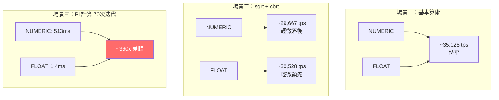

---

## 3. 性能差異的根本原因

> **本節說明**：為什麼 NUMERIC 和 FLOAT 的效能差這麼多？核心答案只有一句話——FLOAT 是 CPU 硬體直接認識的格式，NUMERIC 是軟體「手算」的。以下從存儲結構、運算方式、和硬體支援三個角度來解說。

| 維度 | FLOAT (float8) | NUMERIC |
|------|---------------|---------|
| 存儲 | 固定 8 bytes（IEEE 754） | 變長（每 4 digits 佔 2 bytes + overhead） |
| 精度 | 15-17 decimal digits | 任意精度（受 memory 限制） |
| 範圍 | ~1e-308 ~ 1e+308 | 不限（可達 131072 digits before decimal, 16383 after） |

### FLOAT 的工作原理（硬體原生）

FLOAT（又稱 float8 或 double precision）使用 IEEE 754 標準——這是全球統一的浮點數表示法。8 個 bytes 中，1 bit 存正負號、11 bits 存指數（exponent）、52 bits 存小數部分（mantissa）。

```
FLOAT 運算路徑：
SQL 查詢 → PG 解析 → 將 8 bytes 交給 CPU 的 FPU（浮點運算單元）→ 硬體直接計算 → 回傳結果
```

### NUMERIC 的工作原理（軟體模擬）

NUMERIC 則是完全不同的故事。PG 將 NUMERIC 儲存為一個變長結構（struct），內部是一個 digit 陣列——就像小學時用手算多位數乘法一樣，一個 digit 一個 digit 地計算。

```
NUMERIC 結構示意（簡化）：
┌─────────────┬──────┬─────┬──────┬──────┬─────┐
│ ndigits(位數) │ weight │ sign │ d1 │ d2 │ ... │
└─────────────┴──────┴─────┴──────┴──────┴─────┘
```

每當執行 `a + b`，PG 內部的 C 函數需要：
1. 比對兩個數字的 decimal point 位置（對齊位數）
2. 從最低位開始逐 digit 相加（可能需要進位）
3. 調整最終結果的 ndigits 和 weight

**核心差異**：float 是 CPU native type，硬體直接運算。numeric 是軟體模擬的任意精度運算——每次 arithmetic 都要遍歷 struct 中的 digit array，無硬體加速。

小數值（4 位）時 numeric struct overhead 很小，arithmetic 與 float 持平。一旦涉及 `sqrt` 等迭代逼近函數，軟體實現的代價急劇放大（360x）。

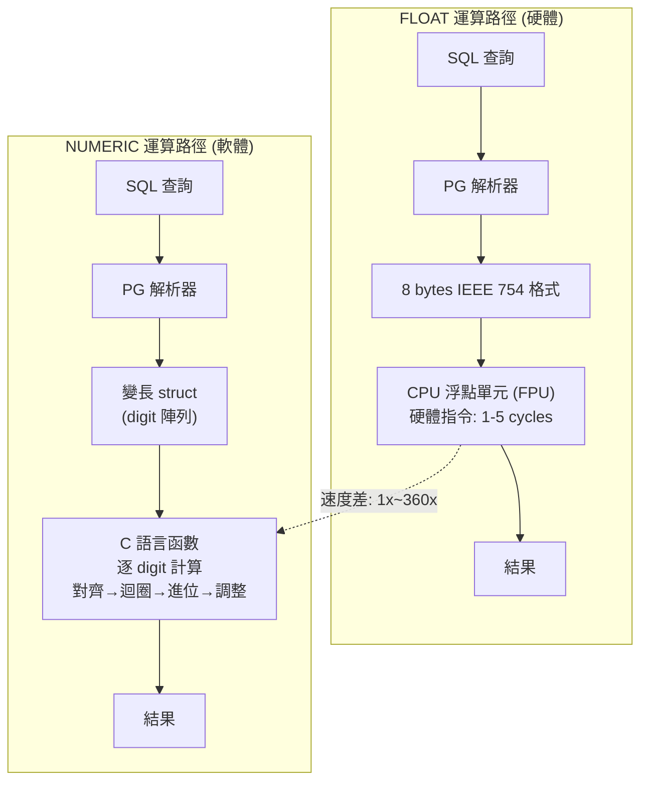

---

## 4. 選擇建議

> **本節說明**：綜合以上分析，幫你畫一個「決策樹」——根據你的應用場景，應該選 NUMERIC 還是 FLOAT。

| 場景 | 推薦 | 原因 |
|------|------|------|
| 金融、會計（需精確小數） | NUMERIC | 任意精度，無 rounding error |
| 科學計算、統計 | FLOAT | 硬體加速，效能碾壓 |
| 高 TPS OLTP（精度 < 10 digits） | NUMERIC / FLOAT 均可 | 差異可忽略 |
| OLAP / 大規模聚合 | FLOAT | SIMD 向量化優勢 |
| 需要精準等值比對 | NUMERIC | float rounding error 會導致 `WHERE a = b` 誤判 |

> `double precision` 存錢是技術債，遲早要還。`decimal` 和 `numeric` 是同一個東西，選 `numeric` 就對了。

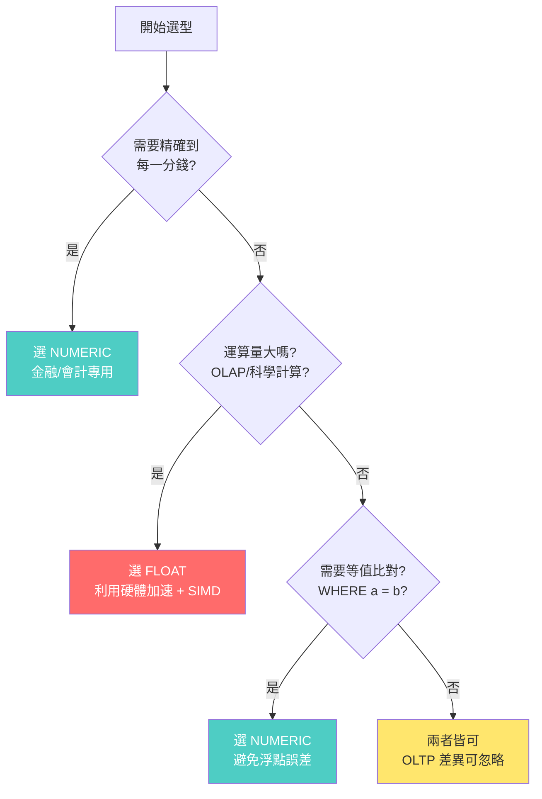

### 關鍵陷阱：浮點數的等值比對

即使兩個數看起來一樣，FLOAT 的 binary 表示可能稍有不同：

```sql
-- 這可能不會回傳你預期的結果！
SELECT * FROM orders WHERE amount = 0.1;  -- FLOAT 下可能找不到

-- 應該這樣寫：
SELECT * FROM orders WHERE ABS(amount - 0.1) < 0.00001;  -- 容許微小誤差
```

這是因為十進制的小數（如 0.1）在二進制 IEEE 754 中是一個無限循環小數（就像 1/3 = 0.333... 在十進制中是無限的一樣），無法精確表示。

---

# 二、AT TIME ZONE 與 EXTRACT 的語法解析

> 來源：[digoal - PostgreSQL timestamp parse in gram.y (' ' AT TIME ZONE ' ') (2015-04-30)](https://github.com/digoal/blog/blob/master/201504/20150430_01.md)

> **初學者先知道**：這章比第一章更深，會涉及 PostgreSQL 內部如何解析 SQL 語法、如何選擇函數 overloading。如果你剛開始學 PG，可以先建立一個心態：這裡的關鍵概念是——同樣一個 SQL 關鍵字（如 `AT TIME ZONE`），根據它前面那個欄位的型別不同，PG 會自動選擇不同的底層函數來執行。這就像「同一個開關，但接在不同機器上，效果完全不同」。

---

## 1. 問題：EXTRACT epoch 在不同時區下的意外行為

> **本節說明**：「epoch」是一個電腦中常用的時間表示法——它代表從 1970 年 1 月 1 日 00:00:00 UTC 到某個時刻經過的秒數。epoch 是沒有時區概念的（純數字），因此取一個時間的 epoch 值時，「這個時間是哪個時區的」至關重要。以下案例展示了一個違反直覺的現象。

### 什麼是 epoch？

Epoch 是 Unix 時間的起點：`1970-01-01 00:00:00 UTC`。任何時刻都可以表示為「距離 epoch 過了多少秒」。例如：
- `1970-01-01 00:00:01 UTC` → epoch = 1
- `1970-01-01 08:00:00 +08` → epoch = 0（因為這個時刻就是 UTC 的 1970-01-01 00:00:00）

因為 epoch 是從 UTC 的零點起算的，所以「同一個物理時刻」無論用什麼時區表示，epoch 都相同。

### timestamptz 的 "tz" 不是存時區

> **常見誤解**：`timestamptz` 的 `tz` 是 "time zone" 的縮寫，很容易讓人誤以為「它儲存了時區資訊」或「它記住了當前的時區」。
>
> **實際情況**：`timestamptz` 內部**只存一個 UTC 值**，**不保存任何時區資訊**。名字裡有 "time zone" 只是告訴 PG：「幫我在輸入時轉 UTC、輸出時轉 session timezone」。

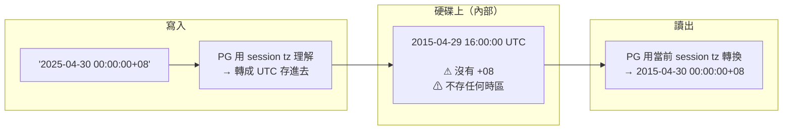

| 你的誤解 | 實際情況 |
|---------|---------|
| ❌ 存了「當前時區」(+08) | 內部只有一個 UTC 值，不存時區 |
| ❌ 讀出來一定是當初寫入的那個時區 | 用**當前 session timezone** 轉換。換機器 / 改 tz，顯示就變 |
| ❌ 叫 timestamptz 所以有存時區 | 叫 timestamptz 只是因為它有**時區感知**（寫入/讀出時會轉換） |

> 換句話說：`timestamptz` = 一個 UTC 時間戳 + 讀寫時自動轉換的約定。不是「時間 + 時區」的組合包。

### 意外現象

當前 session timezone 為 `PRC`（即 `Asia/Shanghai`，UTC+8）：

```
postgres=# show timezone;
 TimeZone
----------
 PRC
(1 row)
```

以下兩個 epoch 結果完全相同，違反直覺：

```
postgres=# select extract(epoch from 'today'::timestamptz);
 date_part
------------
 1430323200
(1 row)

postgres=# select extract(epoch from 'today' at time zone '0');
 date_part
------------
 1430323200
(1 row)
```

直覺上 `AT TIME ZONE '0'` 應該把時間轉換到 UTC+0 再取 epoch，結果應該不同，但這裡卻一樣。而指定 UTC+8 反而結果不同：

```
postgres=# select extract(epoch from 'today' at time zone '8');
 date_part
------------
 1430294400
(1 row)
```

### 直覺 vs 實際結果

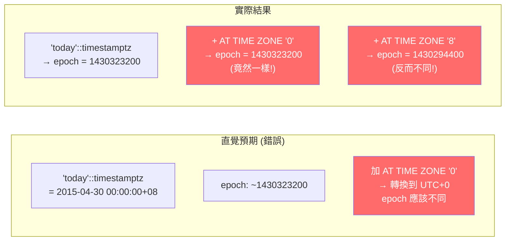

> **核心矛盾一句話**：`AT TIME ZONE '0'` 你以為是「把時間轉換到 UTC+0 再取 epoch」，但實際上它改變的是數值的**型別**，而型別改變導致了 PG 選擇了不同的 epoch 計算路徑。真正影響 epoch 結果的是型別，不是時區轉換本身。

---

## 2. timestamptz 最佳實踐 — .NET 8 + PG 17

> **本節說明**：前面講了 `timestamptz` 在 PG 內部的行為，這節直接告訴你在實際專案中該怎麼建表、怎麼寫 C#、以及各層職責怎麼劃分。

### 核心原則：分層職責

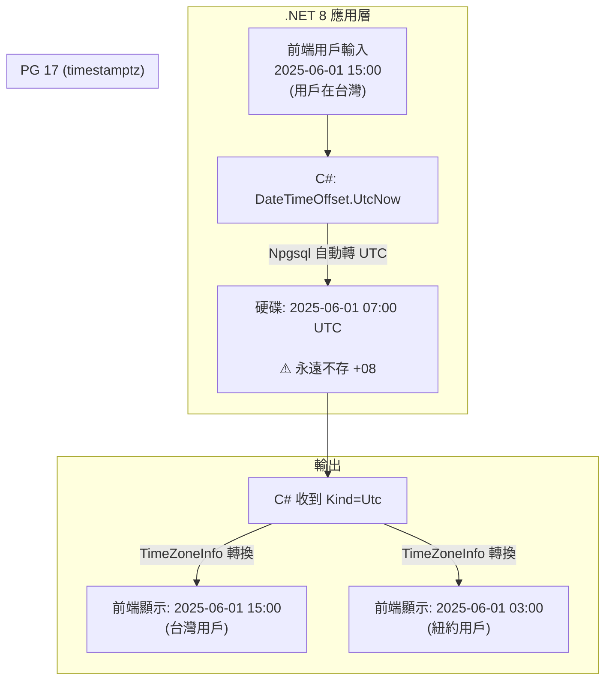

| 層級 | 職責 | 存什麼 |
|------|------|--------|
| **DB (PG 17)** | 只負責正確儲存物理瞬間 | 永遠是 UTC，不存時區 |
| **Npgsql** | DateTime Kind → UTC 轉換 | 寫入前轉 UTC，讀出後設 Kind=Utc |
| **C# 應用層** | 在前端顯示時轉用戶時區 | 用 `TimeZoneInfo.ConvertTimeFromUtc()` |

### 建表：只用 timestamptz

```sql
CREATE TABLE events (
    id          BIGINT GENERATED ALWAYS AS IDENTITY PRIMARY KEY,
    title       TEXT NOT NULL,
    happened_at TIMESTAMPTZ NOT NULL   -- 就這一行，不需要指定任何時區
);
```

> `timestamptz` 欄位不需要 `AT TIME ZONE`、不需要 `+08`、不需要任何時區標記。PG 自動把所有寫入轉成 UTC 儲存。

### C# 寫入：三種寫法都可以

```csharp
// ✅ 推薦: DateTimeOffset（零歧義，Npgsql 直接對應 timestamptz）
conn.Execute("INSERT INTO events (title, happened_at) VALUES (@t, @h)",
    new { t = "會議", h = DateTimeOffset.UtcNow });

// ✅ 也可以: DateTime.UtcNow（Kind=Utc，Npgsql 直接送）
conn.Execute("INSERT INTO events (title, happened_at) VALUES (@t, @h)",
    new { t = "會議", h = DateTime.UtcNow });

// ✅ 也可以: 用戶輸入的 Local 時間（Kind=Local，Npgsql 自動轉 UTC 再送）
var userInput = new DateTime(2025, 6, 1, 15, 0, 0, DateTimeKind.Local);
conn.Execute("INSERT INTO events (title, happened_at) VALUES (@t, @h)",
    new { t = "會議", h = userInput });
```

> 三種寫入方式最終在 PG 硬碟上存的都是 **UTC**。Npgsql 根據 DateTime.Kind 自動做轉換。

### C# 讀取 + 前端顯示

```csharp
// 讀出來是 UTC
var ev = conn.QueryFirst<Event>("SELECT * FROM events WHERE id = 1");
Console.WriteLine(ev.HappenedAt); // Kind = Utc

// 在 C# 端轉換為用戶時區（台灣）
var tpe = TimeZoneInfo.FindSystemTimeZoneById("Asia/Taipei");
var localTime = TimeZoneInfo.ConvertTimeFromUtc(ev.HappenedAt, tpe);
Console.WriteLine(localTime); // 2025-06-01 15:00

// 同樣的值，轉成紐約時區
var nyc = TimeZoneInfo.FindSystemTimeZoneById("Eastern Standard Time");
var nycTime = TimeZoneInfo.ConvertTimeFromUtc(ev.HappenedAt, nyc);
Console.WriteLine(nycTime); // 2025-06-01 03:00
```

### PG 端 session timezone 的影響

Session timezone 只影響 `psql` / PG 端顯示，**不影響 C# Npgsql 讀取的值**（Npgsql 讀出永遠是 UTC）：

```sql
-- 設為台灣時區，psql 中顯示 +08
SET timezone = 'Asia/Taipei';
SELECT happened_at FROM events;
-- 2025-06-01 15:00:00+08

-- 設為 UTC，psql 中顯示不同（但物理瞬間相同）
SET timezone = 'UTC';
SELECT happened_at FROM events;
-- 2025-06-01 07:00:00+00

-- C# Npgsql 讀出來永遠是 Kind=Utc，不受 session timezone 影響
```

### 總結：正確做法 vs 錯誤做法

| | ✅ 正確 | ❌ 錯誤 |
|---|--------|--------|
| **Schema** | `happened_at TIMESTAMPTZ` | `timestamp` / 加 `+08` / `AT TIME ZONE` |
| **寫入** | `DateTimeOffset.UtcNow` 或 `DateTime.UtcNow` | 在 SQL 裡寫 `+08` 字串 |
| **讀取** | C# 收到 UTC，前端用 `TimeZoneInfo` 轉 | 依賴 DB session tz 做業務轉換 |
| **DB 存什麼** | 永遠是 UTC | 存 +08 |
| **時區轉換** | 應用層的事 | DB 的事 |

> **一句話**：DB 存 UTC（物理瞬間），C# 用 `DateTimeOffset.UtcNow` 寫入，前端渲染時 C# 端轉換用戶時區。`timestamptz` 名字裡有 "tz" 只是說 PG 會幫你做讀寫轉換，不是說它存了時區。

---

## 3. 逐步分解

> **本節說明**：現在用三種實際執行情況逐步追蹤，看看到底 PG 在每一步做了什麼。關鍵是追蹤**型別的變化**——每一步的輸入型別是什麼、輸出型別是什麼、以及這決定了哪個底層函數被調用。

### 先理解型別轉換鏈

在追蹤之前，先建立一個核心心法：

- `timestamptz`（timestamp with time zone）= 存的是 UTC 時間 + 顯示時依 session timezone 轉換
- `timestamp`（timestamp without time zone）= 只存一個「牆上時鐘時間」，沒有時區上下文
- `AT TIME ZONE` 的行為 = 輸入是 `timestamptz` 輸出就是 `timestamp`；輸入是 `timestamp` 輸出就是 `timestamptz`
- `EXTRACT(epoch FROM timestamptz)` = 先轉 UTC 再算 epoch（依賴 session timezone → stable）
- `EXTRACT(epoch FROM timestamp)` = 直接當成 UTC 算 epoch（不依賴 timezone → immutable）

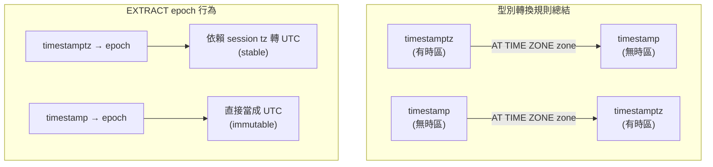

### 這條規則什麼意思？舉例說明

`AT TIME ZONE` 的中文翻譯是「在 XX 時區，現在牆上時鐘顯示幾點？」。根據你給它的輸入不同，它做兩件相反的事：

**情境一：你給它 `timestamptz`（一個有時區的物理時刻）**

你已經知道「某個物理瞬間發生了」，你想知道「在那個時區，牆上顯示幾點？」。這是一個**時區轉換 + 去掉時區標記**的過程——結果是一個純牆上時間。

```sql
-- Session tz = PRC (UTC+8)

-- 已知: 一個物理時刻（timestamptz，內部存 UTC）
SELECT '2025-04-30 00:00:00+08'::timestamptz;
-- 顯示: 2025-04-30 00:00:00+08

-- 問：同樣這個物理瞬間，在 UTC+0 的牆上時鐘顯示幾點？
SELECT '2025-04-30 00:00:00+08'::timestamptz AT TIME ZONE '0';
-- 結果: 2025-04-29 16:00:00   ← 型別變成了 timestamp!
-- 解讀: 北京 4/30 凌晨 0 點 = 倫敦 4/29 下午 4 點
```

```
timestamptz                     AT TIME ZONE '0'        timestamp
2025-04-30 00:00:00+08    →    時區轉換 + 去標記    →   2015-04-29 16:00:00
(有 +08，是「瞬間」)                                    (純數字，是「牆上時間」)
```

**情境二：你給它 `timestamp`（一個沒有時區的牆上時間）**

你只知道「牆上時鐘顯示幾點」，你需要知道「這個牆上時間，在某個時區中，對應哪個物理瞬間？」。這是一個**附上時區解釋 + 轉 UTC**的過程——結果是一個有時區的時刻。

```sql
-- 已知: 一個牆上時間（timestamp，沒有時區）
SELECT '2025-04-30 00:00:00'::timestamp;
-- 顯示: 2025-04-30 00:00:00

-- 問：如果這個牆上時間出現在 UTC+8（北京），對應哪個物理瞬間？
SELECT '2025-04-30 00:00:00'::timestamp AT TIME ZONE '8';
-- 結果: 2025-04-30 00:00:00+08   ← 型別變成了 timestamptz!
-- 解讀: 北京 4/30 凌晨 0 點 = UTC 4/29 下午 4 點
```

```
timestamp                       AT TIME ZONE '8'        timestamptz
2025-04-30 00:00:00        →    附上時區 + 轉UTC    →   2025-04-30 00:00:00+08
(純數字，沒有時區)                                        (有 +08，是「瞬間」)
```

### 為什麼這樣設計？有什麼意義？

一句話：**AT TIME ZONE 永遠在「物理瞬間」和「牆上時間」之間做轉換。**

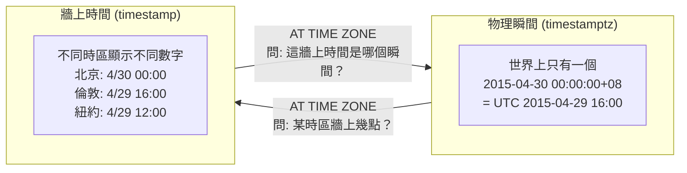

| 輸入 → 輸出 | 語意 | 生活例子 |
|------------|------|---------|
| `timestamptz` → `timestamp` | 「這個瞬間，在那個時區，牆上顯示幾點？」 | 「紐約現在 3PM，台灣牆上幾點？」→ 換算後去掉時區 |
| `timestamp` → `timestamptz` | 「這牆上時間，在那個時區，對應哪個瞬間？」 | 「票上寫 3PM，這是哪個城市的時間？」→ 標上時區 |

> **寫程式的意義**：假設你從 DB 讀出一個 `timestamptz` 存的事件時間，你想在前端顯示「這個事件在用戶當地時區是幾點」→ `AT TIME ZONE 'Asia/Taipei'` 把 UTC 瞬間轉成台灣牆上時間（timestamp），直接顯示即可。反過來，用戶在表單輸入「2025-06-01 15:00」（一個 timestamp，沒有時區），你要存入 DB → `AT TIME ZONE 'Asia/Taipei'` 把它變成 timestamptz，PG 內部就會正確存成 UTC。

### I. Case 1：EXTRACT epoch FROM 'today'::timestamptz

```
postgres=# select
    extract(epoch from 'today'::timestamptz),
    date_part('epoch', 'today'::timestamptz),
    'today'::timestamptz;

 date_part  | date_part  |      timestamptz
------------+------------+------------------------
 1430323200 | 1430323200 | 2015-04-30 00:00:00+08
```

**逐步追蹤**：

1. `'today'::timestamptz` → PG 將字串 `'today'` 強制轉為 timestamptz 型別。在 PRC（UTC+8）時區下，`today` 等於 `2015-04-30 00:00:00+08`。注意：timestamptz 內部存的是 UTC，所以實際儲存的值是 `2015-04-29 16:00:00 UTC`。

2. `EXTRACT(epoch FROM ...)` → PG 解析為 `date_part('epoch', ...)`。

3. 參數型別是 `timestamptz` → PG 的函數 overload 選擇機制找到 `date_part(text, timestamptz)` 這個版本。

4. PG 內部負責計算 timestamptz epoch 的函數會：
   - 讀取當前的 session timezone 設定（PRC = UTC+8）
   - 將內部儲存的 UTC 時間轉換為 UTC epoch 秒數
   - 結果：`2015-04-30 00:00:00+08` 對應的 epoch = `1430323200`

5. `date_part('epoch', 'today'::timestamptz)` 返回相同結果——再次證明 EXTRACT 和 date_part 完全等價。

```
postgres=# select pg_typeof('today'::timestamptz);
        pg_typeof
--------------------------
 timestamp with time zone
```

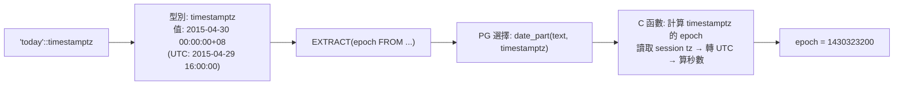

### II. Case 2：EXTRACT epoch FROM 'today' AT TIME ZONE '0'

```
postgres=# select
    extract(epoch from 'today' at time zone '0'),
    date_part('epoch', timezone('0', 'today'::timestamptz)),
    timezone('0', 'today'::timestamptz),
    timezone('0', 'today');

 date_part  | date_part  |      timezone       |      timezone
------------+------------+---------------------+---------------------
 1430323200 | 1430323200 | 2015-04-29 16:00:00 | 2015-04-29 16:00:00
(1 row)
```

**關鍵：這裡發生了型別轉換！**

步驟：
1. `timezone('0', 'today'::timestamptz)` 將 `2015-04-30 00:00:00+08` 轉換為 UTC+0 → `2015-04-29 16:00:00`
2. 返回類型是 `timestamp without time zone`（注意：返回的 `2015-04-29 16:00:00` 不再帶有 `+08` 標記）：

```
postgres=# select pg_typeof(timezone('0', 'today'));
          pg_typeof
-----------------------------
 timestamp without time zone
```

3. 此時調用的是 PG 內部負責計算 timestamp（無時區）epoch 的函數（immutable 版本），直接把 `2015-04-29 16:00:00` 視為 UTC 時間計算 epoch
4. `2015-04-29 16:00:00 UTC` 的 epoch 等於 `2015-04-30 00:00:00+08` 的 epoch——兩者描述的是**同一個物理時刻**，所以結果一致

**為什麼 epoch 相同？一句話：** `timezone('0', timestamptz)` 做的是時區轉換（物理時刻保持不變，只是換了時區表示法），而 `date_part('epoch', timestamp)` 把沒有 timezone 的 timestamp 當成 UTC 計算。因為物理時刻本身沒變（還是同一個瞬間），所以算出來的 epoch 自然相同。

> **類比說明**：這就像把一個溫度從「攝氏 0 度」轉成「華氏 32 度」——數字變了，但描述的物理溫度沒有變。epoch 計算的是「物理時刻」，而不是「顯示的數字」。

```
物理時刻:  ────────────────────────────────●──────────────────────────
                                         2015-04-29 16:00 UTC
                                         2015-04-30 00:00 +08 (PRC)
                                         epoch = 1430323200

timestamptz: 2015-04-30 00:00:00+08  ──AT TIME ZONE '0'──→  timestamp: 2015-04-29 16:00:00
     epoch (stable fn, 讀取 tz): 1430323200                    epoch (immutable fn, 視為 UTC): 1430323200
                                                               ▲ 結果相同！因為描寫的是同一時刻
```

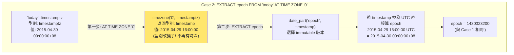

**結果一致的根源**：`timezone('0', timestamptz)` 做的是時區轉換（物理時刻不變），而 `date_part('epoch', timestamp)` 把沒有 timezone 的 timestamp 當成 UTC 計算。物理時刻相同 → epoch 相同。

### III. Case 3：EXTRACT epoch FROM 'today' AT TIME ZONE '8'

```
postgres=# select
    date_part('epoch', timezone('8', 'today')),
    timezone('8', 'today');

 date_part  |      timezone
------------+---------------------
 1430294400 | 2015-04-29 08:00:00
(1 row)
```

**逐步追蹤**：

1. 首先需要理解 `'today'`（沒有 `::timestamptz` 強制轉型）的行為。在 `timezone('8', 'today')` 中，PG 需要決定 `'today'` 的型別：
   - PG 查看 `timezone` 函數的 overload 列表
   - 有 `timezone(text, timestamptz)` 和 `timezone(text, timestamp)` 兩個版本都接受 text 作為第一個參數
   - `'today'` 字面量可以被隱式轉換為多種時間型別。在解析過程中，PG 會根據上下文進行型別推斷
   - 當 PG 看到 `timezone('8', 'today')` 時，第二個參數 'today' 的型別決定了選擇哪個 `timezone` 版本

2. `timezone('8', 'today')` 的具體行為取決於型別推斷結果：
   - 如果 `'today'` 被推斷為 `timestamptz`（在 PRC 時區下為 `2015-04-30 00:00:00+08`），則 `timezone('8', timestamptz)` 會轉換時區 → 得到 `2015-04-29 08:00:00`
   - 這個結果是 `timestamp` 型別（無時區）

3. `date_part('epoch', timestamp)` 再將 `2015-04-29 08:00:00` 當成 UTC 時間計算 epoch → 得到 `1430294400`

4. 這個 epoch 與前面不同，因為 `2015-04-29 08:00:00 UTC` 描述的**不是**原本 `2015-04-30 00:00:00+08` 對應的那個物理時刻——這裡的 `08:00:00` 被當成了 UTC 時間，而 UTC+8 的零點實際上對應 UTC 的 16:00，不是 08:00。

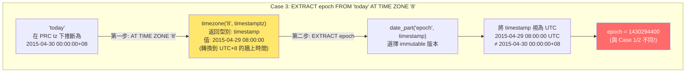

> 補充（Senior Dev）：整個混淆的本質是 **timestamp with time zone 和 timestamp without time zone 之間的型別轉換鏈**。`AT TIME ZONE` operator 的行為取決於輸入類型——輸入是 `timestamptz` 則返回 `timestamp`（去掉 timezone，表示該時區的 wall-clock time）；輸入是 `timestamp` 則返回 `timestamptz`（將該 wall-clock time 解釋為指定時區，轉成 UTC）。而 `EXTRACT(epoch FROM ...)` 對 `timestamp` 的處理是「將該值視為 UTC」，對 `timestamptz` 則是「先轉 UTC 再計算」。所以當 `AT TIME ZONE '0'` 把 `timestamptz` 轉成 `timestamp` 後，兩者描述的是同一 UTC 時刻，epoch 自然相同。這不是 bug，而是型別系統的精確行為，但極易踩坑。

---

## 4. 底層函數對照

> **本節說明**：這是一張「速查表」，幫助你快速對應 SQL 語法和底層行為。

| 語法 | 行為說明 |
|------|---------|
| `EXTRACT(epoch FROM timestamptz)` | 依賴 session timezone — 讀取當前時區設定後將時間轉為 UTC 再計算秒數（stable） |
| `EXTRACT(epoch FROM timestamp)` | 直接將輸入值視為 UTC 計算（immutable），無時區轉換步驟 |
| `timestamptz AT TIME ZONE zone` | 將 timestamptz 轉換到指定時區 — 返回 `timestamp`（去掉時區標記，輸出牆上時鐘時間） |
| `timestamp AT TIME ZONE zone` | 將 timestamp 附上指定時區 — 返回 `timestamptz`（將牆上時間解釋為指定時區並轉為 UTC 儲存） |

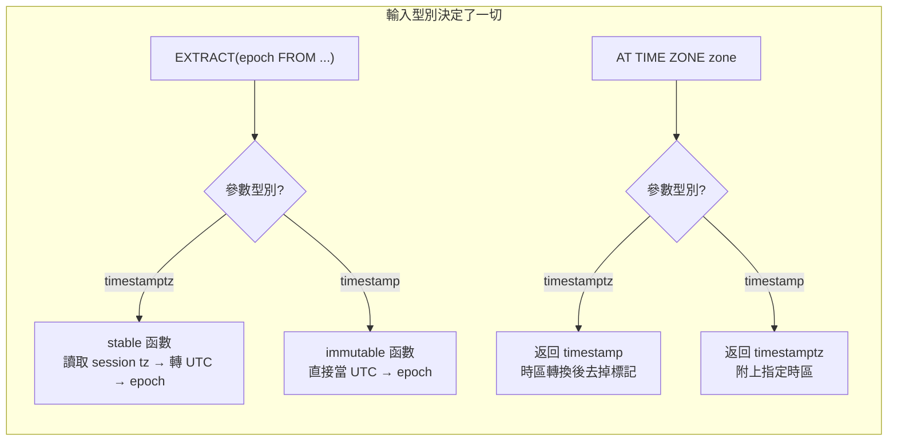

---

# 三、timestamptz vs timestamp — .NET 8 Dapper / EF Core 實戰

> **初學者先知道**：在第二章我們看到了 PG 內部 `timestamptz` 和 `timestamp` 的區別——一個有時區語意（存 UTC，顯示時依 session tz 轉換），一個沒有（我寫什麼就存什麼）。到了 .NET 應用層，問題變成：**當你的 C# 程式透過 Npgsql 把資料寫入 PG 時，Npgsql 如何對應這兩種型別？** Npgsql 6.0（配合 .NET 6 發布）做了一個關鍵的 breaking change，導致很多既有程式碼開始拋出 `DateTimeKind` 錯誤。本章從底層映射原理到 Dapper / EF Core 寫法，完整拆解。

---

## 1. 問題背景：Npgsql 6.0 的 Breaking Change

### 先理解 .NET 的 DateTime.Kind

.NET 的 `DateTime` 有一個 `Kind` 屬性（枚舉），它告訴你這個日期時間值**帶有什麼樣的時區含義**：

| DateTimeKind | 意義 | 範例 |
|-------------|------|------|
| `Unspecified` | 只是一個日期時間值，不附帶任何時區資訊 | `2025-01-01 12:00:00`（不知道是哪個時區的 12:00） |
| `Utc` | 明確表示這個值是 UTC 時間 | `2025-01-01 04:00:00 UTC` |
| `Local` | 明確表示這個值是執行中電腦的本地時區時間 | `2025-01-01 12:00:00 +08`（在台灣的機器上） |

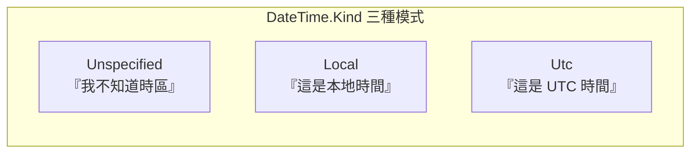

> **核心矛盾**：PG 的 `timestamp` 是「無時區語意」的型別，而 .NET 的 `DateTime` 卻可能攜帶 `Kind=Utc` 或 `Kind=Local` 的時區資訊。如果 Npgsql 允許你把一個明確標記為 UTC 的 DateTime 寫入無時區的 `timestamp` 欄位，**時區資訊就被悄悄丟棄了**——這就是 bug 的根源。

### Npgsql 5.x 的行為（寬容模式）

| PG 型別 | 寫入規則 | 讀出規則 |
|---------|---------|---------|
| `timestamp` | 接受任何 Kind，原樣寫入 | 返回 `Kind=Unspecified` |
| `timestamptz` | 接受任何 Kind，寫入前先轉 UTC | 返回 `Kind=Local`（根據執行機器時區） |

舊行為的問題：
1. **寫入 `timestamp` 時資訊丟失**：`DateTime(2025-01-01 12:00, Kind=Utc)` 寫入 `timestamp` 欄位後，讀出來變成 `Kind=Unspecified`，12:00 是哪個時區的？不知道了。
2. **讀出 `timestamptz` 時依賴機器時區**：在台灣（UTC+8）的機器上讀出來的 `Kind=Local` 是台灣時間，但部署到 AWS us-east-1（UTC-5）就完全不一樣。容器化環境中這更容易出錯。

### Npgsql 6.0+ 的行為（嚴格模式，預設）

| PG 型別 | 寫入規則 | 讀出規則 |
|---------|---------|---------|
| `timestamp` | **只接受** `Kind=Unspecified`，其他 throw | 返回 `Kind=Unspecified` |
| `timestamptz` | 接受任意 Kind（Utc 直接存，Local 轉 Utc 後存，Unspecified 視為 Utc） | 返回 `Kind=Utc` |

這就是你看到的錯誤：

```
System.InvalidCastException:
  Cannot write DateTime with Kind=Local to PostgreSQL type 'timestamp without time zone'
  Cannot write DateTime with Kind=Utc to PostgreSQL type 'timestamp without time zone'
```

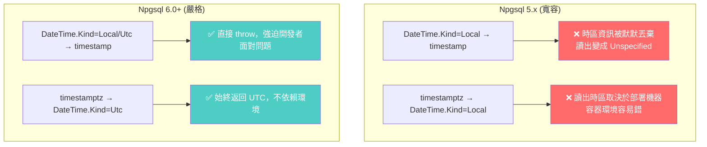

> **設計哲學一句話**：Npgsql 6.0 的態度是——「我不允許你犯糊塗。如果你要寫 `timestamp`，你必須明確表示你的 DateTime 沒有時區資訊（Kind=Unspecified）。如果你有時區資訊，就應該寫入 `timestamptz`。」

---

## 2. 底層原理：Npgsql 型別映射機制

### 為什麼 Npgsql 要這樣設計？

在 Npgsql 內部，每當讀寫一個 PG 欄位時，都會調用對應的 **TypeHandler**。`timestamp` 和 `timestamptz` 各有自己的 handler：

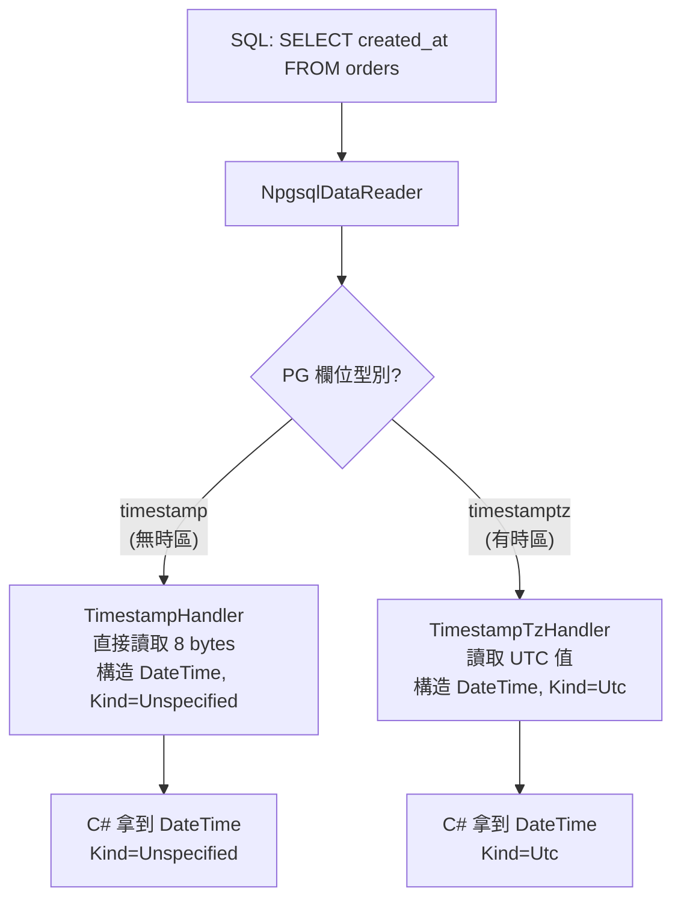

寫入時的檢查邏輯（簡化版）：

```
寫入路徑 (timestamp 欄位):
  NpgsqlParameter.Value = DateTime
  
  → TimestampHandler.ValidateAndGetLength():
      if (DateTime.Kind != Unspecified)
          throw InvalidCastException("Cannot write DateTime with Kind=...")
      // 通過檢查後才進行寫入
  
寫入路徑 (timestamptz 欄位):
  NpgsqlParameter.Value = DateTime
  
  → TimestampTzHandler.ValidateAndGetLength():
      if (DateTime.Kind == Local)
          value = value.ToUniversalTime()  // Local → UTC
      else if (Kind == Unspecified)
          value = DateTime.SpecifyKind(value, Utc)  // Unspecified → 視為 UTC
      // 寫入轉換後的 UTC 值
```

> **為什麼 `timestamptz` 對 Kind 比較寬容？** 因為 `timestamptz` 的語意是「這是一個物理瞬間」，無論你給的是哪個時區的時間，只要你能告訴 Npgsql 這是什麼時區（透過 Kind 屬性），它就能正確轉成 UTC 儲存。而 `timestamp` 沒有這個轉換能力——它只是一個牆上時鐘值，因此 Npgsql 強制要求你給出 `Unspecified` 以避免歧義。

---

## 3. Dapper 實戰

Dapper 底層走原生 ADO.NET (`NpgsqlDataReader` + reflection 映射)，行為完全由 Npgsql 的 TypeHandler 決定，**Dapper 不做任何額外的型別轉換**。

### 讀取：timestamp 與 timestamptz

```csharp
using var conn = new NpgsqlConnection(connectionString);

// === 讀取 timestamp (without time zone) ===
public class Order
{
    // 從 DB 讀出時 Kind = Unspecified
    public DateTime CreatedAt { get; set; }
}

var orders = await conn.QueryAsync<Order>(
    "SELECT created_at FROM orders LIMIT 1"
);
Console.WriteLine(orders.First().CreatedAt.Kind); // Unspecified


// === 讀取 timestamptz ===
public class Event
{
    // 從 DB 讀出時 Kind = Utc (Npgsql 6.0+ 預設)
    public DateTime OccurredAt { get; set; }
}

var events = await conn.QueryAsync<Event>(
    "SELECT occurred_at FROM events LIMIT 1"
);
Console.WriteLine(events.First().OccurredAt.Kind); // Utc
```

### 寫入：正確寫法與錯誤示範

```csharp
// ✅ OK: 寫入 timestamp — 必須用 Kind=Unspecified
await conn.ExecuteAsync(
    "INSERT INTO orders (created_at) VALUES (@CreatedAt)",
    new { CreatedAt = new DateTime(2025, 1, 1, 12, 0, 0, DateTimeKind.Unspecified) }
);

// ✅ OK: 寫入 timestamp — 另一種等價寫法 (DateTime 預設 Kind=Unspecified)
await conn.ExecuteAsync(
    "INSERT INTO orders (created_at) VALUES (@CreatedAt)",
    new { CreatedAt = new DateTime(2025, 1, 1, 12, 0, 0) }
);


// ❌ THROWS: DateTime.Now 的 Kind=Local
await conn.ExecuteAsync(
    "INSERT INTO orders (created_at) VALUES (@CreatedAt)",
    new { CreatedAt = DateTime.Now }  // Kind=Local → InvalidCastException
);

// ❌ THROWS: DateTime.UtcNow 的 Kind=Utc
await conn.ExecuteAsync(
    "INSERT INTO orders (created_at) VALUES (@CreatedAt)",
    new { CreatedAt = DateTime.UtcNow }  // Kind=Utc → InvalidCastException
);


// ✅ OK: 寫入 timestamptz — UtcNow 直接存
await conn.ExecuteAsync(
    "INSERT INTO events (occurred_at) VALUES (@OccurredAt)",
    new { OccurredAt = DateTime.UtcNow }
);

// ✅ OK: 寫入 timestamptz — Now (Local) → Npgsql 自動轉 UTC
await conn.ExecuteAsync(
    "INSERT INTO events (occurred_at) VALUES (@OccurredAt)",
    new { OccurredAt = DateTime.Now }
);
```

### Dapper 的 DateTimeOffset 寫法（推薦對應 timestamptz）

```csharp
// ✅ 最佳實踐: timestamptz 用 DateTimeOffset，完全消除歧義
public class EventWithOffset
{
    public DateTimeOffset OccurredAt { get; set; }
}

await conn.ExecuteAsync(
    "INSERT INTO events (occurred_at) VALUES (@OccurredAt)",
    new { OccurredAt = DateTimeOffset.UtcNow }
);

var events = await conn.QueryAsync<EventWithOffset>(
    "SELECT occurred_at FROM events"
);
// OccurredAt 自帶 offset，零歧義
```

---

## 4. EF Core 實戰

EF Core 透過 `Npgsql.EntityFrameworkCore.PostgreSQL` provider 運作。provider 在 6.0+ 同樣跟隨 Npgsql 的嚴格模式。

### 預設映射關係

EF Core 在生成 Migration 時，會根據 C# 型別選擇 PG 欄位型別：

| C# 型別 | 預設 PG 對應 | 行為 |
|---------|-------------|------|
| `DateTime` | `timestamp with time zone` | EF Core 預設走 timestamptz |
| `DateTimeOffset` | `timestamp with time zone` | 完全映射 |
| `DateOnly` (.NET 6+) | `date` | 只存日期 |
| `TimeOnly` (.NET 6+) | `time without time zone` | 只存時間 |

> **注意**：EF Core 預設把 `DateTime` 映射為 `timestamptz`，而不是 `timestamp`。如果你需要 `timestamp without time zone`，必須在 `OnModelCreating` 中明確指定（見下方）。

### 模型定義與 Migration

```csharp
public class AppDbContext : DbContext
{
    public DbSet<Order> Orders { get; set; }
    public DbSet<EventLog> EventLogs { get; set; }

    protected override void OnConfiguring(DbContextOptionsBuilder options)
        => options.UseNpgsql("Host=localhost;Database=mydb");

    protected override void OnModelCreating(ModelBuilder builder)
    {
        // 明確指定 order 的 created_at 為 timestamp without time zone
        builder.Entity<Order>()
            .Property(o => o.CreatedAt)
            .HasColumnType("timestamp without time zone");

        // event_log 的 occurred_at 保持預設 (timestamptz)
        // 不需要特別指定
    }
}

public class Order
{
    public int Id { get; set; }
    public DateTime CreatedAt { get; set; }  // → PG: timestamp without time zone
}

public class EventLog
{
    public int Id { get; set; }
    public DateTime OccurredAt { get; set; }  // → PG: timestamp with time zone (預設)
}
```

### 寫入操作——正確與錯誤示範

```csharp
var db = new AppDbContext();

// ❌ THROWS: CreatedAt 對應 PG timestamp, 但 DateTime.Now 的 Kind=Local
var order1 = new Order { CreatedAt = DateTime.Now };
db.Orders.Add(order1);
await db.SaveChangesAsync();  // Npgsql 6.0+: InvalidCastException


// ✅ OK: 使用 Kind=Unspecified 寫入 timestamp
var order2 = new Order
{
    CreatedAt = DateTime.SpecifyKind(DateTime.Now, DateTimeKind.Unspecified)
};
db.Orders.Add(order2);
await db.SaveChangesAsync();


// ✅ OK: EventLog 對應 timestamptz, 接受任意 Kind
var log = new EventLog { OccurredAt = DateTime.UtcNow };
db.EventLogs.Add(log);
await db.SaveChangesAsync();
```

### 三種處理 EF Core timestamp 的實用模式

**模式一：手動 SpecifyKind**

```csharp
// 每次寫入前手動轉換
order.CreatedAt = DateTime.SpecifyKind(DateTime.Now, DateTimeKind.Unspecified);
```

**模式二：ValueConverter（推薦，一勞永逸）**

```csharp
protected override void OnModelCreating(ModelBuilder builder)
{
    builder.Entity<Order>()
        .Property(o => o.CreatedAt)
        .HasColumnType("timestamp without time zone")
        .HasConversion(
            v => DateTime.SpecifyKind(v, DateTimeKind.Unspecified),  // 寫入 DB 前
            v => DateTime.SpecifyKind(v, DateTimeKind.Unspecified)   // 從 DB 讀出後
        );
}

// 之後程式碼中可以直接用 DateTime.Now，ValueConverter 會自動處理:
var order = new Order { CreatedAt = DateTime.Now };
db.Orders.Add(order);
await db.SaveChangesAsync();  // ✅ OK
```

**模式三：改用 DateTimeOffset 對應 timestamptz（最推薦）**

```csharp
public class EventLog
{
    public int Id { get; set; }
    public DateTimeOffset OccurredAt { get; set; }  // 零歧義
}

// 寫入時:
db.EventLogs.Add(new EventLog { OccurredAt = DateTimeOffset.UtcNow });
```

---

## 5. 型別選擇決策

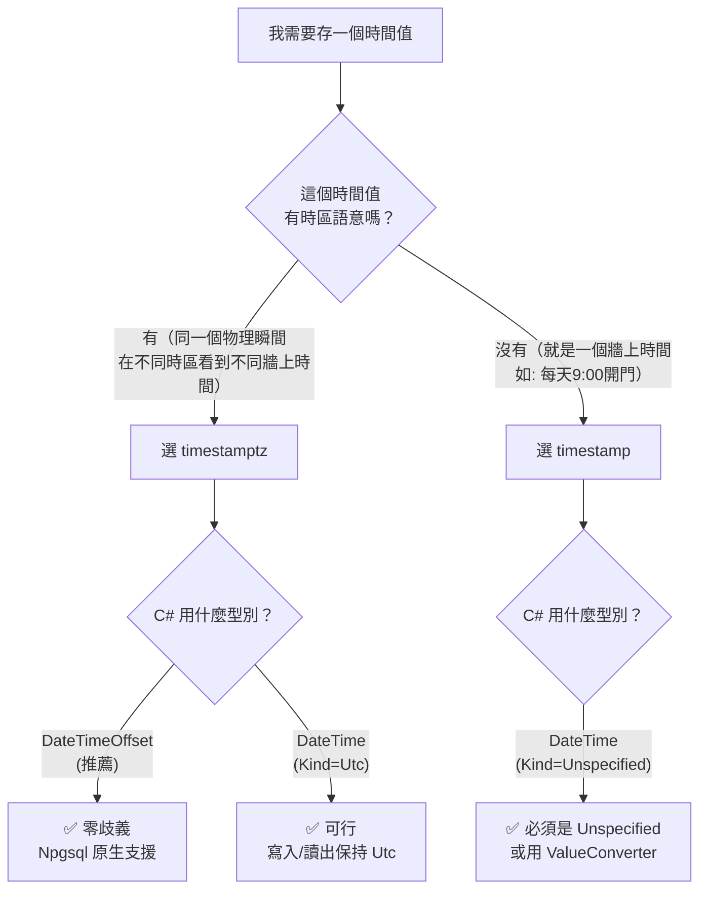

| 場景 | PG 型別 | C# 型別 | 典型範例 |
|------|--------|---------|---------|
| 訂單建立時間（全球用戶） | `timestamptz` | `DateTimeOffset` | `2025-01-01T12:00:00+08:00` |
| 每日開店時間（固定） | `timestamp` | `DateTime (Unspecified)` | 每天 `09:00:00` |
| 活動開始時間（跨時區） | `timestamptz` | `DateTime (Utc)` | 全球同步直播 |
| 班表時間（本地含義） | `timestamp` | `DateTime (Unspecified)` | 台北門市 10:00 上班 |

---

## 6. 過渡方案：EnableLegacyTimestampBehavior

如果專案中已有大量既有程式碼無法一次性修改，Npgsql 提供了回到舊行為的開關。**這只是過渡手段，不建議長期使用。**

```csharp
// 方式 1: NpgsqlDataSourceBuilder (Npgsql 7.0+)
var dataSourceBuilder = new NpgsqlDataSourceBuilder(connectionString);
dataSourceBuilder.EnableLegacyTimestampBehavior = true;
var dataSource = dataSourceBuilder.Build();

// 方式 2: Connection String 參數
// "Host=localhost;Database=mydb;EnableLegacyTimestampBehavior=true"

// 方式 3: AppContext switch（全域）
AppContext.SetSwitch("Npgsql.EnableLegacyTimestampBehavior", true);
```

> **啟用後的還原行為**：`timestamptz` 讀出變回 `Kind=Local`（依賴機器時區）、寫入 `timestamp` 不再檢查 Kind。但注意：Npgsql 團隊已表示未來版本可能完全移除這個開關。

---

## 7. 總結對照表

| 維度 | `timestamp` (without tz) | `timestamptz` (with tz) |
|------|--------------------------|-------------------------|
| **PG 內部儲存** | 牆上時鐘值，原樣儲存 | 內部一律存 UTC |
| **輸入轉換** | 無轉換 | session tz → UTC |
| **輸出轉換** | 無轉換 | UTC → session tz |
| **Npgsql 寫入規則** | 只接受 `Kind=Unspecified` | 接受任意 Kind，轉 UTC 後儲存 |
| **Npgsql 讀出規則** | 返回 `Kind=Unspecified` | 返回 `Kind=Utc` |
| **推薦 C# 型別** | `DateTime` (Kind=Unspecified) | `DateTimeOffset` 或 `DateTime` (Kind=Utc) |
| **EF Core 預設映射** | 需手動 `.HasColumnType("timestamp without time zone")` | `DateTime` 預設就對應 timestamptz |
| **典型用途** | 固定時程（開店/關店/班表） | 有跨時區需求的時間點（訂單/事件/log） |

```mermaid
flowchart LR
    subgraph PG["PostgreSQL"]
        TS["timestamp<br/>(無時區)"]
        TSTZ["timestamptz<br/>(有時區)"]
    end

    subgraph NPGSQL["Npgsql 6.0+ TypeHandler"]
        TH_TS["TimestampHandler<br/>只接受 Unspecified"]
        TH_TSTZ["TimestampTzHandler<br/>接受任意 Kind → 轉 UTC"]
    end

    subgraph DOTNET[".NET 應用層"]
        DT_U["DateTime<br/>Kind=Unspecified"]
        DTO["DateTimeOffset<br/>(推薦)"]
        DT_UTC["DateTime<br/>Kind=Utc"]
    end

    TS --> TH_TS --> DT_U
    TSTZ --> TH_TSTZ --> DTO
    TSTZ --> TH_TSTZ --> DT_UTC
```

> **心法一句話**：Npgsql 6.0 的 breaking change 不是在找你麻煩，而是強迫你在「無時區語意」和「有時區語意」之間做一個清醒的選擇。跟第二章的 `AT TIME ZONE` 一樣，本質上都是 PG 型別系統的精確行為在應用層的體現——型別決定了行為。
