# PostgreSQL 資料型別深度探討

本文由淺入深，依序探討兩個 PostgreSQL 資料型別相關主題：

1. **第一章「Float vs Numeric 性能對比」**：從實戰角度出發，比較兩種數值型別的效能差異、底層原因與選型建議。適合快速了解何時該用哪種型別。
2. **第二章「AT TIME ZONE 語法解析」**：深入 parser 內部（gram.y）、型別系統與函數 overload 選擇邏輯，用一個違反直覺的案例逐步拆解 `EXTRACT epoch` 在不同時區下的行為。適合想理解 PostgreSQL 型別系統底層運作的讀者。

建議依序閱讀：先建立對數值型別的實戰認識，再進入時間型別的 parser 層級分析。

---

# 一、Float vs Numeric 性能對比

> 來源：[digoal - float和numeric性能对比 (2015-10-20)](https://github.com/digoal/blog/blob/master/201510/20151020_02.md)
>
> 更新於 2026-05-17，補充 JIT / SIMD 演進

> **初學者先知道**：在程式語言中，"型別（data type）"決定了資料在記憶體中的存儲方式和 CPU 如何處理它。`FLOAT`（浮點數）就像 CPU 的母語——硬體直接支援，運算極快但有小數點後幾位的誤差（約 15 位精度）。`NUMERIC` 則是軟體模擬的任意精度運算——可以精確到數千位小數，但代價是運算速度慢。這兩者的選擇本質上是「速度 vs 精度」的取捨。

---

## 1. 測試環境

> **本節說明**：在開始 benchmark 之前，需要先了解測試是如何設定的。這裡建立了兩張結構幾乎相同的表——一張用 NUMERIC，一張用 FLOAT——來進行公平的效能比較。

```sql
CREATE TABLE tt (c1 NUMERIC, c2 NUMERIC);
ALTER TABLE tt ALTER COLUMN c1 SET STORAGE PLAIN;  -- 避免 TOAST overhead
ALTER TABLE tt ALTER COLUMN c2 SET STORAGE PLAIN;
INSERT INTO tt VALUES (1.1111, 1.1111);

CREATE TABLE tf (c1 FLOAT, c2 FLOAT);
INSERT INTO tf VALUES (1.1111, 1.1111);
```

### 為什麼要 `SET STORAGE PLAIN`？

PostgreSQL 有一個名為 TOAST 的機制：當一個欄位的值太大時（通常是超過約 2KB），PG 會自動將它壓縮或移到獨立的存儲區域。這對日常使用是好事，但在 benchmark 時會引入額外的壓縮/解壓縮開銷，干擾效能測量。

- `STORAGE PLAIN`：告訴 PG「不要對這個欄位做任何 TOAST 處理」，確保我們測量的是純粹的數值運算速度，而不是存儲機制的速度。
- 注意 FLOAT 本身是固定 8 bytes，永遠不會觸發 TOAST，所以不需要這一步。

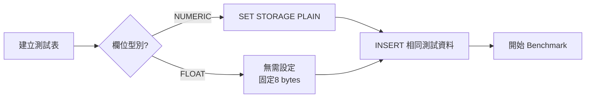

---

## 2. Benchmark 結果

> **本節說明**：這裡用三種場景測試兩者的效能——基本加減乘除、數學函數（開根號）、以及高精度 Pi 計算。TPS（Transactions Per Second，每秒能處理的交易數）越高代表效能越好。Latency（延遲）越低代表回應越快。

### I. 基本算術運算（+, *, /, -）

這是日常使用中最常見的操作——加減乘除。測試使用 8 個並行連線（concurrent clients），持續 10 秒。

**NUMERIC（8 concurrent, 10 秒）：**

```
tps: ~35,028  (latency 0.227ms)
```

**FLOAT（8 concurrent, 10 秒）：**

```
tps: ~34,729  (latency 0.229ms)
```

小數值（4 位小數）的 basic arithmetic 兩者近乎持平，numeric 甚至略快。

> **為什麼 NUMERIC 反而略快？** 這聽起來違反直覺，但原因是：當數字很小時（只有 4 位小數），NUMERIC 的內部結構也非常小，幾乎不產生額外負擔。甚至 NUMERIC 的簡單運算路徑（少數幾個 digit）經過了 PG 的高度優化，可能比透過 CPU 浮點指令再轉回來的路徑還短。這就是為什麼在 OLTP（線上交易處理）場景中兩者差異不明顯的底層原因。

### II. 數學函數（sqrt + cbrt + arithmetic）

引入 `sqrt`（平方根）和 `cbrt`（立方根）後，情況開始改變。

**NUMERIC（8 concurrent, 6 秒）：**

```
tps: ~29,667  (latency 0.268ms)
```

**FLOAT（8 concurrent, 6 秒）：**

```
tps: ~30,528  (latency 0.261ms)
```

引入 `sqrt` / `cbrt`（在 PG 中寫法分別為 `|/c1` 和 `||/c1`）後，float 開始輕微領先。

> **為什麼 sqrt 會拉開差距？** 計算平方根不像加減乘除那樣簡單——它需要反覆逼近（迭代），逐步收斂到正確值。CPU 有專門的硬體指令來做浮點數的 sqrt（一條指令就能完成，硬體內建），但對於 NUMERIC，PG 必須用 C 語言寫好幾層迴圈，一個 digit 一個 digit 地手算，導致效能開始出現差距。

### III. Pi 計算（遞歸逼近，70 次迭代）

這是「終極壓力測試」——使用迭代逼近法計算圓周率 Pi，重複 70 次逼近，每次迭代都涉及大量的 sqrt 和乘法運算。

```sql
-- NUMERIC: 完整精度
WITH RECURSIVE pi(lv, c) AS (
  SELECT 1::NUMERIC lv, 1::NUMERIC c
  UNION ALL
  SELECT lv + 1,
         SQRT((c/2)*(c/2) + (1-SQRT(1-(c/2)*(c/2)))*(1-SQRT(1-(c/2)*(c/2)))) c
  FROM pi WHERE lv < 70
)
SELECT 3 * POWER(2, lv) * c / 2 p FROM pi WHERE lv = 70;

-- Result: 3.14159265358979323846264338327950288419717321...
--          ...(數千位精度，完整展開)
-- Time: 513.449 ms
```

```sql
-- FLOAT: 僅 double precision
WITH RECURSIVE pi(lv, c) AS (
  SELECT 1::FLOAT lv, 1::FLOAT c
  UNION ALL
  SELECT lv + 1,
         SQRT((c/2)*(c/2) + (1-SQRT(1-(c/2)*(c/2)))*(1-SQRT(1-(c/2)*(c/2)))) c
  FROM pi WHERE lv < 70
)
SELECT 3 * POWER(2, lv) * c / 2 p FROM pi WHERE lv = 70;

-- Result: 3.14159265358979
-- Time: 1.431 ms
```

**NUMERIC 513ms vs FLOAT 1.4ms = ~360x 差距。**

> **一句話總結**：當運算很簡單（加減乘除），兩者差不多；但當運算變複雜（sqrt、迭代），NUMERIC 的軟體計算劣勢會被極度放大，因為它不像 FLOAT 有硬體加持。

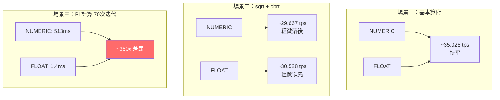

---

## 3. 性能差異的根本原因

> **本節說明**：為什麼 NUMERIC 和 FLOAT 的效能差這麼多？核心答案只有一句話——FLOAT 是 CPU 硬體直接認識的格式，NUMERIC 是軟體「手算」的。以下從存儲結構、運算方式、和硬體支援三個角度來解說。

| 維度 | FLOAT (float8) | NUMERIC |
|------|---------------|---------|
| 存儲 | 固定 8 bytes（IEEE 754） | 變長（每 4 digits 佔 2 bytes + overhead） |
| CPU 指令 | 直接用 FPU / SSE / AVX 指令 | 軟體實現（C 函數逐 digit 運算） |
| CPU 向量化 | 支援 SIMD（MMX/SSE/AVX/AVX-512） | 不支援 |
| 精度 | 15-17 decimal digits | 任意精度（受 memory 限制） |
| 範圍 | ~1e-308 ~ 1e+308 | 不限（可達 131072 digits before decimal, 16383 after） |

### FLOAT 的工作原理（硬體原生）

FLOAT（又稱 float8 或 double precision）使用 IEEE 754 標準——這是全球統一的浮點數表示法。8 個 bytes 中，1 bit 存正負號、11 bits 存指數（exponent）、52 bits 存小數部分（mantissa）。

關鍵是：**現代 CPU 出廠時就內建了處理 IEEE 754 數字的電路**。當你寫 `a + b`，CPU 不需要跑任何軟體程式——它直接用硬體電路在 1~5 個 CPU 時脈週期內完成加法。乘法和除法也一樣快。

```
FLOAT 運算路徑：
SQL 查詢 → PG 解析 → 將 8 bytes 交給 CPU 的 FPU（浮點運算單元）→ 硬體直接計算 → 回傳結果
```

### NUMERIC 的工作原理（軟體模擬）

NUMERIC 則是完全不同的故事。PG 將 NUMERIC 儲存為一個變長結構（struct），內部是一個 digit 陣列——就像小學時用手算多位數乘法一樣，一個 digit 一個 digit 地計算。

```
NUMERIC 結構示意（簡化）：
┌─────────────┬──────┬─────┬──────┬──────┬─────┐
│ ndigits(位數) │ weight │ sign │ d1 │ d2 │ ... │
└─────────────┴──────┴─────┴──────┴──────┴─────┘
```

每當執行 `a + b`，PG 內部的 C 函數需要：
1. 比對兩個數字的 decimal point 位置（對齊位數）
2. 從最低位開始逐 digit 相加（可能需要進位）
3. 調整最終結果的 ndigits 和 weight

**核心差異**：float 是 CPU native type，硬體直接運算。numeric 是軟體模擬的任意精度運算——每次 arithmetic 都要遍歷 struct 中的 digit array，無硬體加速。

小數值（4 位）時 numeric struct overhead 很小，arithmetic 與 float 持平。一旦涉及 `sqrt` 等迭代逼近函數，軟體實現的代價急劇放大（360x）。

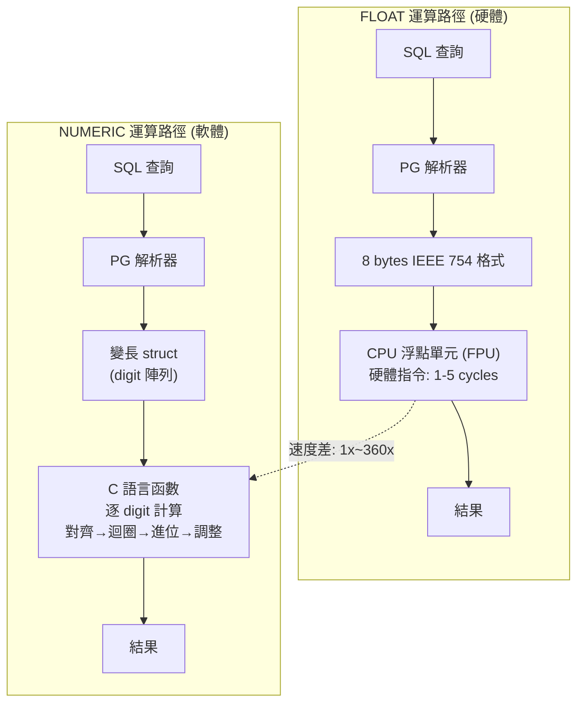

> 補充（Senior Dev）：PG 16+ 的實測中，`double precision` 在 `pgbench` 單行 benchmark 下 numeric vs float 差距取決於 digit 數量。當 numeric precision > 20 digits 時，差距開始顯著。典型 OLTP 場景（金額計算，精度 < 10 digits）兩者差異可忽略。PG 11+ LLVM JIT compilation 對兩者都有提速，但對 numeric 的 `sqrt` 等內部迴圈加速有限（因核心在 C library 層，非 JIT 範圍）。

---

## 4. Float 的額外優勢：SIMD 向量化

> **本節說明**：SIMD（Single Instruction, Multiple Data，單指令多資料）是現代 CPU 的一項「作弊級」加速技術。簡單來說，它允許你在一條 CPU 指令中同時對多個數字做同樣的運算——例如一次就算完 4 個或 8 個數字的加法。這對於大規模數據分析（如一次計算數百萬行的平均值）是巨大的效能提升。

### 什麼是 SIMD？用小學作業來比喻

想像你要批改 8 份數學作業，每份都有一道「3 + 5 = ?」的題目：
- **SISD（單指令單資料，傳統方式）**：拿起第一份 → 計算 → 放下 → 拿起第二份 → 計算 → 放下 → ...（重複 8 次）
- **SIMD（單指令多資料）**：把所有 8 份攤在桌上 → 一眼掃過去 → 同時批改 8 份（1 次搞定）

這就是 SIMD 的核心思想——「一條指令，同時處理多筆資料」。

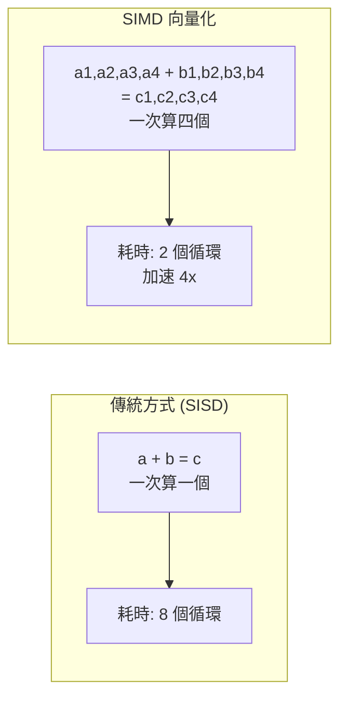

### 為什麼 NUMERIC 不能用 SIMD？

SIMD 的前提是：**所有資料的長度相同**，這樣才能整齊地排列在 CPU 暫存器中。FLOAT 每個值固定 8 bytes，完美符合。NUMERIC 每個值的長度不同（取決於精度），無法對齊，因此無法受益於 SIMD。

固定長度類型（`float4`, `float8`, `int4`, `int8`）支援 CPU SIMD 指令（SSE / AVX / AVX-512），可在一條 CPU 指令中同時處理多個數值。在海量數據分析（OLAP）場景中，這是巨量加速的來源。NUMERIC 因變長結構無法受益於 SIMD。

> **SIMD 的世代演進**：SSE（一次 128 bits = 2 個 float8）→ AVX（256 bits = 4 個）→ AVX-512（512 bits = 8 個）。PG 17+ 版本已經在內部逐步引入 SIMD 優化，例如在 pg_lzcompress 等模塊中使用。

---

## 5. 選擇建議

> **本節說明**：綜合以上分析，幫你畫一個「決策樹」——根據你的應用場景，應該選 NUMERIC 還是 FLOAT。

| 場景 | 推薦 | 原因 |
|------|------|------|
| 金融、會計（需精確小數） | NUMERIC | 任意精度，無 rounding error |
| 科學計算、統計 | FLOAT | 硬體加速，效能碾壓 |
| 高 TPS OLTP（精度 < 10 digits） | NUMERIC / FLOAT 均可 | 差異可忽略 |
| OLAP / 大規模聚合 | FLOAT | SIMD 向量化優勢 |
| 需要精準等值比對 | NUMERIC | float rounding error 會導致 `WHERE a = b` 誤判 |

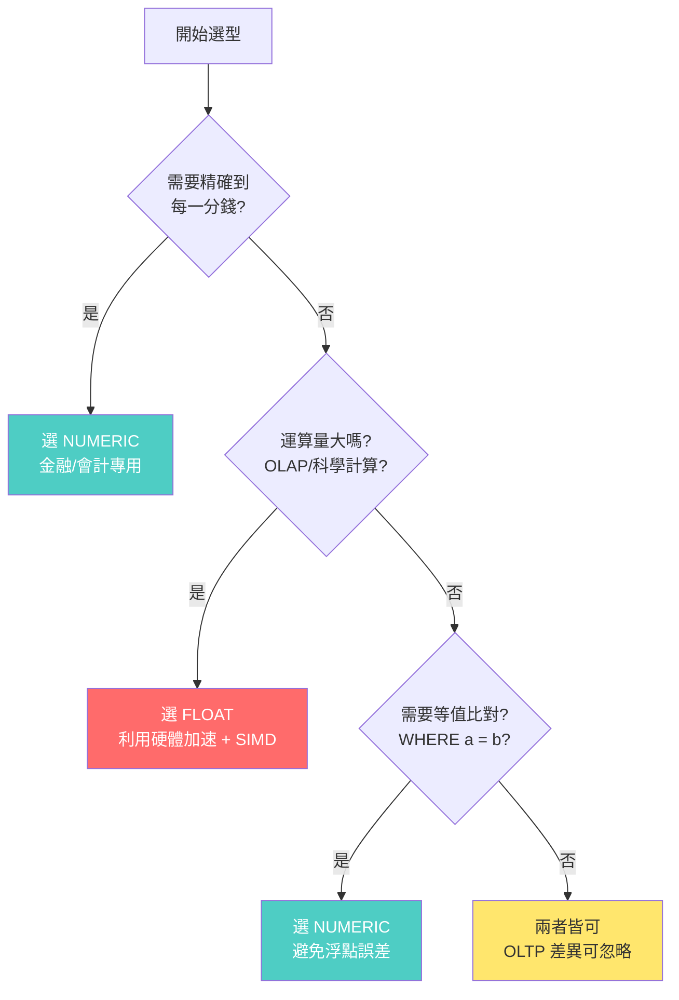

### 關鍵陷阱：浮點數的等值比對

即使兩個數看起來一樣，FLOAT 的 binary 表示可能稍有不同：

```sql
-- 這可能不會回傳你預期的結果！
SELECT * FROM orders WHERE amount = 0.1;  -- FLOAT 下可能找不到

-- 應該這樣寫：
SELECT * FROM orders WHERE ABS(amount - 0.1) < 0.00001;  -- 容許微小誤差
```

這是因為十進制的小數（如 0.1）在二進制 IEEE 754 中是一個無限循環小數（就像 1/3 = 0.333... 在十進制中是無限的一樣），無法精確表示。

---

## 6. 版本演進

> **本節說明**：PostgreSQL 的每次大版本更新都在逐步改善數值計算的效能。以下是與本主題相關的關鍵演進。

| 功能 | 版本 | 說明 |
|------|------|------|
| LLVM JIT compilation | PG 11 | 加速 WHERE / expression evaluation，float/numeric 均受益 |
| JIT for tuple deforming | PG 14 | 加速 column value 提取 |
| SIMD 優化（pg_lzcompress 等） | PG 16+ | PostgreSQL 逐步引入 SIMD 加速內部模塊 |

> **什麼是 JIT（Just-In-Time 編譯）？** 一般而言，PG 執行 SQL 時是在「解讀」查詢計畫——就像一個翻譯官，邊看邊執行。JIT 則是直接把查詢計畫中重複執行的部分（如 WHERE 條件判斷）編譯成機器碼，讓 CPU 直接執行，跳過解讀的開銷。這對涉及大量計算的查詢（如 WHERE 中有複雜的數學運算）效果顯著。但注意：JIT 主要加速的是「查詢執行框架」本身（如表達式求值），而不是加速單個 sqrt 或加法運算。對於 float，sqrt 本來就是一條硬體指令，JIT 幫助不大；對於 numeric，sqrt 的核心計算在 C 函數庫中，JIT 也無法加速。

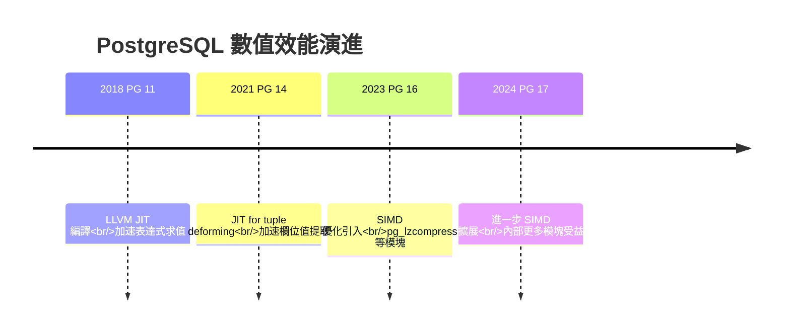

---

# 二、AT TIME ZONE 與 EXTRACT 的語法解析

> 來源：[digoal - PostgreSQL timestamp parse in gram.y (' ' AT TIME ZONE ' ') (2015-04-30)](https://github.com/digoal/blog/blob/master/201504/20150430_01.md)

> **初學者先知道**：這章比第一章更深，會涉及 PostgreSQL 內部如何解析 SQL 語法、如何選擇函數 overloading。如果你剛開始學 PG，可以先建立一個心態：這裡的關鍵概念是——同樣一個 SQL 關鍵字（如 `AT TIME ZONE`），根據它前面那個欄位的型別不同，PG 會自動選擇不同的底層函數來執行。這就像「同一個開關，但接在不同機器上，效果完全不同」。

---

## 1. 問題：EXTRACT epoch 在不同時區下的意外行為

> **本節說明**：「epoch」是一個電腦中常用的時間表示法——它代表從 1970 年 1 月 1 日 00:00:00 UTC 到某個時刻經過的秒數。epoch 是沒有時區概念的（純數字），因此取一個時間的 epoch 值時，「這個時間是哪個時區的」至關重要。以下案例展示了一個違反直覺的現象。

### 什麼是 epoch？

Epoch 是 Unix 時間的起點：`1970-01-01 00:00:00 UTC`。任何時刻都可以表示為「距離 epoch 過了多少秒」。例如：
- `1970-01-01 00:00:01 UTC` → epoch = 1
- `1970-01-01 08:00:00 +08` → epoch = 0（因為這個時刻就是 UTC 的 1970-01-01 00:00:00）

因為 epoch 是從 UTC 的零點起算的，所以「同一個物理時刻」無論用什麼時區表示，epoch 都相同。

### 意外現象

當前 session timezone 為 `PRC`（即 `Asia/Shanghai`，UTC+8）：

```
postgres=# show timezone;
 TimeZone
----------
 PRC
(1 row)
```

以下兩個 epoch 結果完全相同，違反直覺：

```
postgres=# select extract(epoch from 'today'::timestamptz);
 date_part
------------
 1430323200
(1 row)

postgres=# select extract(epoch from 'today' at time zone '0');
 date_part
------------
 1430323200
(1 row)
```

直覺上 `AT TIME ZONE '0'` 應該把時間轉換到 UTC+0 再取 epoch，結果應該不同，但這裡卻一樣。而指定 UTC+8 反而結果不同：

```
postgres=# select extract(epoch from 'today' at time zone '8');
 date_part
------------
 1430294400
(1 row)
```

### 直覺 vs 實際結果

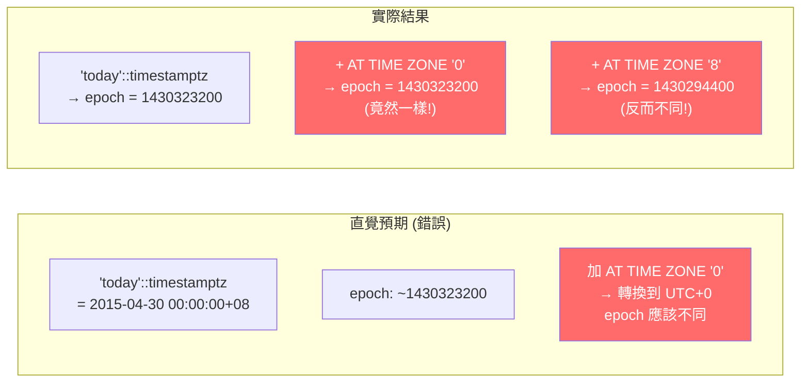

> **核心矛盾一句話**：`AT TIME ZONE '0'` 你以為是「把時間轉換到 UTC+0 再取 epoch」，但實際上它改變的是數值的**型別**，而型別改變導致了 PG 選擇了不同的 epoch 計算路徑。真正影響 epoch 結果的是型別，不是時區轉換本身。

---

## 2. 語法解析：EXTRACT 和 AT TIME ZONE 的底層函數

> **本節說明**：要理解這個奇怪的行為，必須先了解 PG 內部如何處理 `EXTRACT` 和 `AT TIME ZONE`。在 PG 眼中，這些 SQL 語法只是「語法糖」（syntactic sugar）——它們最終都會被轉換成普通的函數調用。理解這個轉換過程，就能看懂後面的所有分析。

### 什麼是 Parser（語法解析器）？

當你發送一條 SQL 給 PG 時，處理流程是：

```
SQL 字串 → Parser（語法解析）→ Parse Tree（語法樹）→ Analyzer（語意分析）→ Query Tree → Planner → Executor
```

Parser（位於 `src/backend/parser/gram.y`）負責把 SQL 字串拆解成一個樹狀結構（Parse Tree），這個階段只關心「語法是否正確」，還不管「這些表和欄位是否存在」。

### I. EXTRACT → date_part

`EXTRACT(field FROM expr)` 在 parser（`src/backend/parser/gram.y`）中解析為 `date_part` 函數調用：

```
| EXTRACT '(' extract_list ')'
    {
        $$ = (Node *) makeFuncCall(SystemFuncName("date_part"), $3, @1);
    }
```

這段 C 代碼的意思是：當 parser 在 SQL 中看到 `EXTRACT(...)` 時，它會建立一個對 `date_part` 函數的調用。也就是說，**`EXTRACT(epoch FROM x)` 和 `date_part('epoch', x)` 是完全等價的**，只是寫法不同。

`date_part` 的 overload 列表（`\df+ date_part`）：

| Argument Type | Volatility |
|---------------|------------|
| `text, timestamp with time zone` | stable |
| `text, timestamp without time zone` | immutable |
| `text, date` | immutable |
| `text, time with time zone` | immutable |
| `text, time without time zone` | immutable |
| `text, interval` | immutable |
| `text, abstime` | stable |
| `text, reltime` | stable |

### 什麼是 Volatility（波動性）？

這是 PG 中的一個重要概念，決定了優化器如何處理這個函數：

- **immutable（不變的）**：相同的輸入永遠產出相同的輸出。例如 `1 + 1` 永遠等於 `2`。PG 可以在 query planning 階段就預先算出結果（常數折疊），也可以在 index 中使用。
- **stable（穩定的）**：在**同一個 SQL 語句的執行期間**，相同的輸入產出相同的輸出。但跨 SQL 語句時可能不同。例如 `now()` 在一個查詢中不會變，但下次查詢就不同了。依賴 session timezone 的函數都是 stable。
- **volatile（揮發的）**：每次調用都可能返回不同結果。例如 `random()`。

關鍵區別：`date_part(text, timestamptz)` 是 **stable**（依賴 session timezone），`date_part(text, timestamp)` 是 **immutable**（純數學計算，不依賴 timezone）。

> **為什麼這很重要？** 因為 `timestamptz` 版本的 epoch 計算需要知道 session 的 timezone 設定才能算出正確的 UTC 時間，所以是 stable。而 `timestamp` 版本沒有時區資訊，PG 就直接把它當成 UTC 計算——不需要參考任何外部設定，所以是 immutable。正是這個差異導致了前面看到的「違反直覺」的結果。

### II. AT TIME ZONE → timezone

`expr AT TIME ZONE zone` 在 parser 中解析為 `timezone` 函數調用：

```
| a_expr AT TIME ZONE a_expr %prec AT
    {
        $$ = (Node *) makeFuncCall(SystemFuncName("timezone"),
                                    list_make2($5, $1), @2);
    }
```

注意參數順序：`timezone(zone, expr)` —— `AT TIME ZONE` 右側的 zone 在第一個參數位置，左側的表達式在第二個參數位置。這不是隨意的設計——PG 的函數 overloading 系統會根據第二個參數的型別來選擇具體的實現。

`timezone` 的 overload 列表（`\df+ timezone`）：

| Result Type | Argument Types |
|-------------|---------------|
| `timestamp without time zone` | `interval, timestamp with time zone` |
| `timestamp with time zone` | `interval, timestamp without time zone` |
| `timestamp without time zone` | `text, timestamp with time zone` |
| `timestamp with time zone` | `text, timestamp without time zone` |
| `time with time zone` | `interval, time with time zone` |
| `time with time zone` | `text, time with time zone` |

> **關鍵規律**：`AT TIME ZONE` 的返回型別恰好與輸入型別的「時區特性」**相反**：
> - 輸入 `timestamptz`（有時區）→ 輸出 `timestamp`（無時區）
> - 輸入 `timestamp`（無時區）→ 輸出 `timestamptz`（有時區）
>
> 這是故意設計的：`AT TIME ZONE` 的語意是「告訴我這個時刻在那個時區的牆上時鐘顯示幾點」。如果你給的是一個有時區的時刻，它就把時區轉換後去掉時區標記（返回純日期時間）；如果你給的是一個沒有時區的時刻，它就為這個時刻附上指定時區（返回有時區的時刻）。

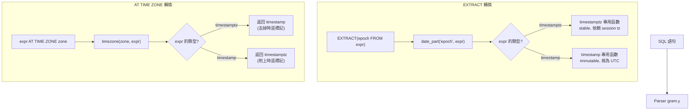

---

## 3. 逐步分解

> **本節說明**：現在用三種實際執行情況逐步追蹤，看看到底 PG 在每一步做了什麼。關鍵是追蹤**型別的變化**——每一步的輸入型別是什麼、輸出型別是什麼、以及這決定了哪個底層函數被調用。

### 先理解型別轉換鏈

在追蹤之前，先建立一個核心心法：

- `timestamptz`（timestamp with time zone）= 存的是 UTC 時間 + 顯示時依 session timezone 轉換
- `timestamp`（timestamp without time zone）= 只存一個「牆上時鐘時間」，沒有時區上下文
- `AT TIME ZONE` 的行為 = 輸入是 `timestamptz` 輸出就是 `timestamp`；輸入是 `timestamp` 輸出就是 `timestamptz`
- `EXTRACT(epoch FROM timestamptz)` = 先轉 UTC 再算 epoch（依賴 session timezone → stable）
- `EXTRACT(epoch FROM timestamp)` = 直接當成 UTC 算 epoch（不依賴 timezone → immutable）

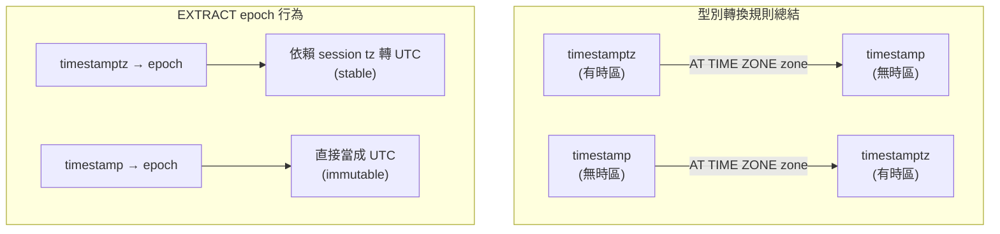

### I. Case 1：EXTRACT epoch FROM 'today'::timestamptz

```
postgres=# select
    extract(epoch from 'today'::timestamptz),
    date_part('epoch', 'today'::timestamptz),
    'today'::timestamptz;

 date_part  | date_part  |      timestamptz
------------+------------+------------------------
 1430323200 | 1430323200 | 2015-04-30 00:00:00+08
```

**逐步追蹤**：

1. `'today'::timestamptz` → PG 將字串 `'today'` 強制轉為 timestamptz 型別。在 PRC（UTC+8）時區下，`today` 等於 `2015-04-30 00:00:00+08`。注意：timestamptz 內部存的是 UTC，所以實際儲存的值是 `2015-04-29 16:00:00 UTC`。

2. `EXTRACT(epoch FROM ...)` → PG 解析為 `date_part('epoch', ...)`。

3. 參數型別是 `timestamptz` → PG 的函數 overload 選擇機制找到 `date_part(text, timestamptz)` 這個版本。

4. 調用 PG 內部負責計算 timestamptz epoch 的 C 函數（在 `src/backend/utils/adt/timestamp.c` 中）。這個函數會：
   - 讀取當前的 session timezone 設定（PRC = UTC+8）
   - 將內部儲存的 UTC 時間轉換為 UTC epoch 秒數
   - 結果：`2015-04-30 00:00:00+08` 對應的 epoch = `1430323200`

5. `date_part('epoch', 'today'::timestamptz)` 返回相同結果——再次證明 EXTRACT 和 date_part 完全等價。

```
postgres=# select pg_typeof('today'::timestamptz);
        pg_typeof
--------------------------
 timestamp with time zone
```

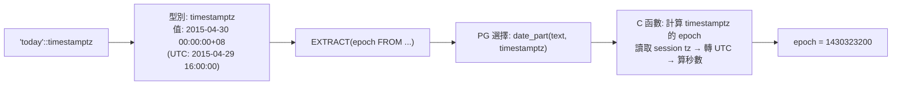

### II. Case 2：EXTRACT epoch FROM 'today' AT TIME ZONE '0'

```
postgres=# select
    extract(epoch from 'today' at time zone '0'),
    date_part('epoch', timezone('0', 'today'::timestamptz)),
    timezone('0', 'today'::timestamptz),
    timezone('0', 'today');

 date_part  | date_part  |      timezone       |      timezone
------------+------------+---------------------+---------------------
 1430323200 | 1430323200 | 2015-04-29 16:00:00 | 2015-04-29 16:00:00
(1 row)
```

**關鍵：這裡發生了型別轉換！**

步驟：
1. `timezone('0', 'today'::timestamptz)` 將 `2015-04-30 00:00:00+08` 轉換為 UTC+0 → `2015-04-29 16:00:00`
2. 返回類型是 `timestamp without time zone`（注意：返回的 `2015-04-29 16:00:00` 不再帶有 `+08` 標記）：

```
postgres=# select pg_typeof(timezone('0', 'today'));
          pg_typeof
-----------------------------
 timestamp without time zone
```

3. 此時調用的是 PG 內部負責計算 timestamp（無時區）epoch 的 C 函數（immutable 版本），直接把 `2015-04-29 16:00:00` 視為 UTC 時間計算 epoch
4. `2015-04-29 16:00:00 UTC` 的 epoch 等於 `2015-04-30 00:00:00+08` 的 epoch——兩者描述的是**同一個物理時刻**，所以結果一致

**為什麼 epoch 相同？一句話：** `timezone('0', timestamptz)` 做的是時區轉換（物理時刻保持不變，只是換了時區表示法），而 `date_part('epoch', timestamp)` 把沒有 timezone 的 timestamp 當成 UTC 計算。因為物理時刻本身沒變（還是同一個瞬間），所以算出來的 epoch 自然相同。

> **類比說明**：這就像把一個溫度從「攝氏 0 度」轉成「華氏 32 度」——數字變了，但描述的物理溫度沒有變。epoch 計算的是「物理時刻」，而不是「顯示的數字」。

```
物理時刻:  ────────────────────────────────●──────────────────────────
                                         2015-04-29 16:00 UTC
                                         2015-04-30 00:00 +08 (PRC)
                                         epoch = 1430323200

timestamptz: 2015-04-30 00:00:00+08  ──AT TIME ZONE '0'──→  timestamp: 2015-04-29 16:00:00
     epoch (stable fn, 讀取 tz): 1430323200                    epoch (immutable fn, 視為 UTC): 1430323200
                                                               ▲ 結果相同！因為描寫的是同一時刻
```

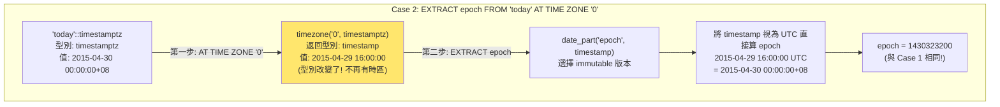

**結果一致的根源**：`timezone('0', timestamptz)` 做的是時區轉換（物理時刻不變），而 `date_part('epoch', timestamp)` 把沒有 timezone 的 timestamp 當成 UTC 計算。物理時刻相同 → epoch 相同。

### III. Case 3：EXTRACT epoch FROM 'today' AT TIME ZONE '8'

```
postgres=# select
    date_part('epoch', timezone('8', 'today')),
    timezone('8', 'today');

 date_part  |      timezone
------------+---------------------
 1430294400 | 2015-04-29 08:00:00
(1 row)
```

**逐步追蹤**：

1. 首先需要理解 `'today'`（沒有 `::timestamptz` 強制轉型）的行為。在 `timezone('8', 'today')` 中，PG 需要決定 `'today'` 的型別：
   - PG 查看 `timezone` 函數的 overload 列表
   - 有 `timezone(text, timestamptz)` 和 `timezone(text, timestamp)` 兩個版本都接受 text 作為第一個參數
   - `'today'` 字面量可以被隱式轉換為多種時間型別。在解析過程中，PG 會根據上下文進行型別推斷
   - 當 PG 看到 `timezone('8', 'today')` 時，第二個參數 'today' 的型別決定了選擇哪個 `timezone` 版本

2. `timezone('8', 'today')` 的具體行為取決於型別推斷結果：
   - 如果 `'today'` 被推斷為 `timestamptz`（在 PRC 時區下為 `2015-04-30 00:00:00+08`），則 `timezone('8', timestamptz)` 會轉換時區 → 得到 `2015-04-29 08:00:00`
   - 這個結果是 `timestamp` 型別（無時區）

3. `date_part('epoch', timestamp)` 再將 `2015-04-29 08:00:00` 當成 UTC 時間計算 epoch → 得到 `1430294400`

4. 這個 epoch 與前面不同，因為 `2015-04-29 08:00:00 UTC` 描述的**不是**原本 `2015-04-30 00:00:00+08` 對應的那個物理時刻——這裡的 `08:00:00` 被當成了 UTC 時間，而 UTC+8 的零點實際上對應 UTC 的 16:00，不是 08:00。

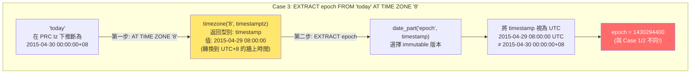

> 補充（Senior Dev）：整個混淆的本質是 **timestamp with time zone 和 timestamp without time zone 之間的型別轉換鏈**。`AT TIME ZONE` operator 的行為取決於輸入類型——輸入是 `timestamptz` 則返回 `timestamp`（去掉 timezone，表示該時區的 wall-clock time）；輸入是 `timestamp` 則返回 `timestamptz`（將該 wall-clock time 解釋為指定時區，轉成 UTC）。而 `EXTRACT(epoch FROM ...)` 對 `timestamp` 的處理是「將該值視為 UTC」，對 `timestamptz` 則是「先轉 UTC 再計算」。所以當 `AT TIME ZONE '0'` 把 `timestamptz` 轉成 `timestamp` 後，兩者描述的是同一 UTC 時刻，epoch 自然相同。這不是 bug，而是型別系統的精確行為，但極易踩坑。

---

## 4. 底層函數對照

> **本節說明**：這是一張「速查表」，幫助你快速對應 SQL 語法、解析後的函數名稱、以及實際負責計算的 C 函數位置。當你未來需要深入閱讀 PG 源碼時，這張表可以作為導航。

| 語法 | 解析結果 | 底層 C 函數與行為說明 |
|------|---------|----------------------------------------------|
| `EXTRACT(epoch FROM timestamptz)` | `date_part('epoch', timestamptz)` | PG 內部計算 timestamptz epoch 的函數 — stable，依賴 session timezone（讀取當前時區設定後將時間轉為 UTC 再計算秒數） |
| `EXTRACT(epoch FROM timestamp)` | `date_part('epoch', timestamp)` | PG 內部計算 timestamp epoch 的函數 — immutable，直接將輸入值視為 UTC 計算（無時區轉換步驟） |
| `timestamptz AT TIME ZONE zone` | `timezone(zone, timestamptz)` | PG 內部將 timestamptz 轉換到指定時區的函數 — 返回 `timestamp`（去掉時區標記，輸出牆上時鐘時間） |
| `timestamp AT TIME ZONE zone` | `timezone(zone, timestamp)` | PG 內部將 timestamp 附上指定時區的函數 — 返回 `timestamptz`（將牆上時間解釋為指定時區並轉為 UTC 儲存） |

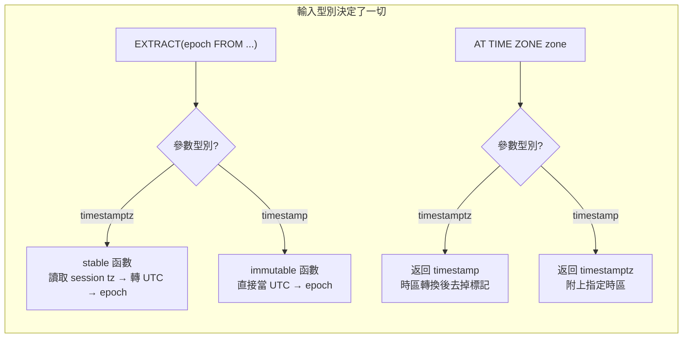

---

## 5. 源碼參考

> **本節說明**：如果你想要親自閱讀 PG 源碼來驗證上述行為，以下是相關的檔案和位置。不需要一次讀完——可以從你感興趣的部分開始。

- `src/backend/parser/gram.y` — 包含 `EXTRACT` 語法規則與 `AT TIME ZONE` 語法規則。這是 parser 的核心檔案，定義了所有 SQL 語法的解析規則。如果你的 editor 支援跳轉到定義，可以用 `EXTRACT` 或 `AT TIME ZONE` 作為關鍵字搜尋。
- `src/backend/utils/adt/timestamp.c` — 包含時間相關的所有核心 C 函數，包括計算 timestamptz epoch、計算 timestamp epoch、以及 timestamptz 的時區轉換函數。這個檔案很長（數千行），建議先用函數名搜尋再閱讀。

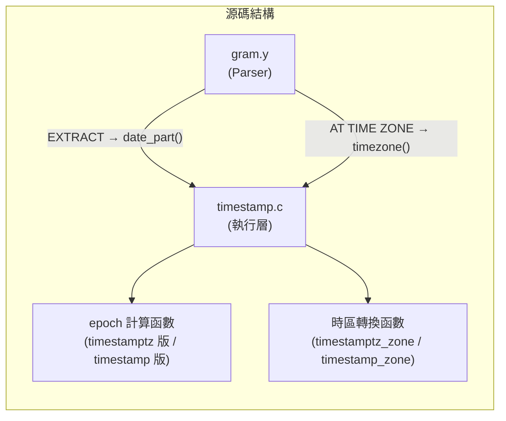

> [PG 版本註] 原文基於 PG 9.x（2015）。核心行為（`AT TIME ZONE` 的型別轉換、`date_part` 的 overload 選擇邏輯）在最新版本（PG 17+）完全一致，未變更。唯一變化：PG 12+ 新增 `date_trunc` 的 timezone 參數支援（`date_trunc('day', timestamptz, 'Asia/Shanghai')`），但與 `EXTRACT` / `AT TIME ZONE` 無直接關聯。
