# PostgreSQL 全文檢索深度解析

> 本文合併三篇文章，按由淺入深的順序編排：
>
> **一、** 中文全文檢索基礎（zhparser + SCWS 分詞）— 理解如何讓 PostgreSQL 正確處理中文分詞
> **二、** 行級全文檢索（Whole-Row FTS，PG 17 視角）— 用 generated column 將整行轉為單一 tsvector，一鍵搜所有欄位
> **三、** 整行多欄位分詞檢索深度剖析（record_out + SCWS 逗號問題）— 深入 PG 內部實作，探討 `record_out` 格式、SCWS comma bug 及解法
>
> 建議依序閱讀。第一章建立對中文 FTS 的基本理解；第二章引入 whole-row FTS 的現代做法；第三章則進入 PG internal 層面，展示真實生產環境中的坑與解法。

---

# 一、 PostgreSQL 中文全文檢索（zhparser + FTS）

> 來源：[digoal - PostgreSQL chinese full text search 中文全文检索 (2014-03-24)](https://github.com/digoal/blog/blob/master/201403/20140324_01.md)
>
> 更新於 2026-05-17，補充現代化分詞方案、GIN 優化、效能調校

---

## 1. 背景：為什麼需要獨立的中文分詞？

PostgreSQL 內建 `default` text search parser 按空白與標點切詞，對英文 OK，對中文無效——中文詞與詞之間無空格，長度不固定，同一個字串在不同語境可拆分為不同詞（「發展中國家」→「發展/中國/家」vs「發展中/國家」）。

### 給初學者的核心概念

全文檢索（Full-Text Search，簡稱 FTS）和一般的 `LIKE '%keyword%'` 查詢完全不同：

- **LIKE 查詢**只能做「字串子串匹配」，不知道什麼是「詞」，搜「發展」不會命中「發展中」的紀錄（如果沒有完全包含）。
- **全文檢索**則會先將文本「分詞」，再對分出來的詞建立索引。搜「發展」可以命中任何包含「發展」這個詞的紀錄，不論該詞在文本中的位置。

中文的特殊性在於：英文單字之間有空格分隔（`I love PostgreSQL` → `I` / `love` / `PostgreSQL`），PostgreSQL 內建的 parser 直接用空格切分即可。但中文詞與詞之間沒有空格（`我愛PostgreSQL`），內建 parser 會把整句當成一個 token，完全無法進行有效搜尋。

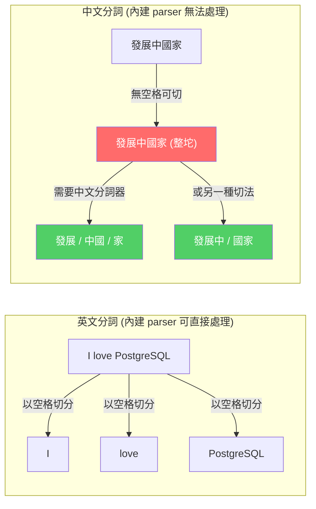

**zhparser** 是 PostgreSQL C extension，實作了 PostgreSQL 要求的 text search parser 介面。這些介面包括四個核心回調函數（callback functions）：

| 介面函數 | 作用（初學者白話解釋） |
|----------|----------------------|
| 初始化函數（`zhprs_start`） | 當 PostgreSQL 需要對一段文字進行分詞時，先呼叫此函數初始化分詞器的內部狀態（例如載入字典、配置記憶體） |
| 取詞函數（`zhprs_getlexeme`） | 每次呼叫返回「下一個詞」，類似迭代器（iterator）的 `next()` 方法，直到沒詞可回傳 |
| 結束函數（`zhprs_end`） | 分詞完成後清理資源（釋放記憶體、關閉字典檔案等） |
| 詞性查詢函數（`zhprs_lextype`） | 讓外部查詢這個 parser 支援哪些詞性標注（名詞、動詞、形容詞...），供 `ts_token_type()` 使用 |

zhparser 底層呼叫 **SCWS**（Simple Chinese Word Segmentation）引擎進行分詞。SCWS 是一套基於字典的中文分詞庫，它使用詞頻（term frequency）和隱馬可夫模型（HMM）來決定最佳切分方式。

### PostgreSQL FTS 完整 Pipeline

從使用者輸入一段文字到最終產出可搜尋的 tsvector，PostgreSQL 的全文檢索管線如下：

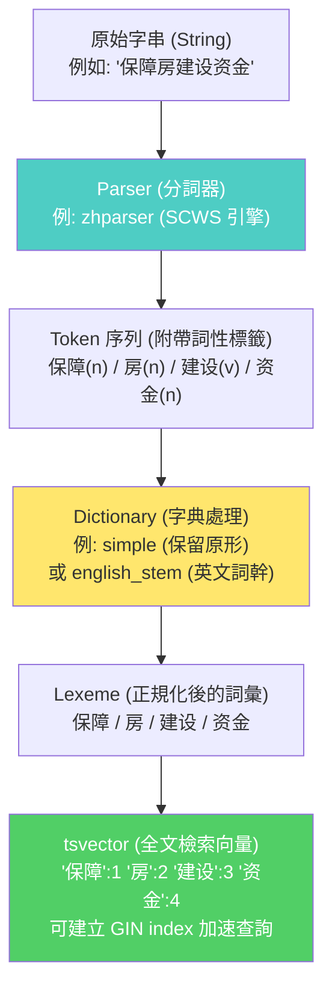

> 補充（Senior Dev）：除了 zhparser + SCWS，現代 PostgreSQL 生態中還有其他選擇：

### I. 其他分詞方案

| 方案 | 底層引擎 | 特點 |
|------|---------|------|
| **zhparser** | SCWS | 字典分詞，支援自訂詞典，生態最成熟 |
| **pg_jieba** | Jieba (結巴分詞) | Trie tree + HMM，支援新詞發現 |
| **pg_bigm** | 2-gram | 純 bigram 切分（如「全文檢索」→「全文」「文檢」「檢索」），不需詞典，召回率高但 precision 較低 |
| **pg_trgm** | Trigram | PG 內建，支援 `ILIKE '%keyword%'` 加速，非真正 FTS 但可做模糊 substring 搜尋 |

RDS PostgreSQL / 阿里雲 PolarDB / Supabase 等雲端服務均已內建 zhparser，不需自行編譯。

---

## 2. 安裝（CentOS + PG 9.3 原文步驟）

```bash
# SCWS 分詞庫
wget http://www.xunsearch.com/scws/down/scws-1.2.2.tar.bz2
tar -jxvf scws-1.2.2.tar.bz2
cd scws-1.2.2
./configure --prefix=/opt/scws-1.2.2
make && make install

# zhparser extension
git clone https://github.com/amutu/zhparser.git
cd zhparser
export PATH=/home/pg93/pgsql/bin:$PATH
which pg_config                          # 確認指向正確 PG 安裝
SCWS_HOME=/opt/scws-1.2.2 make
make install
```

### 給初學者的安裝解說

安裝分成兩個階段，依賴關係如下：

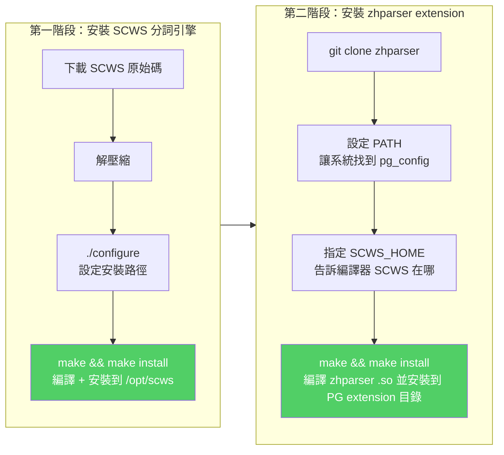

- `./configure` 是 Linux 下常見的編譯前置步驟，它會檢測你的系統、產生 Makefile
- `pg_config` 是 PostgreSQL 自帶的工具，告訴你 PG 安裝在哪、extension 目錄在哪
- `SCWS_HOME` 環境變數讓 zhparser 的 Makefile 知道 SCWS 的安裝位置

在 PostgreSQL 中執行 `CREATE EXTENSION zhparser` 後，PostgreSQL 會載入編譯好的 `.so` 檔案（在 macOS 上是 `.dylib`），並註冊 parser 到 `pg_ts_parser` 系統表中。

> 補充（Senior Dev）：現代環境（PG 14+ / PG 16+ / PG 18）zhparser 已更新支援。SCWS 最新版本為 1.2.3+，zhparser GitHub repo 持續維護。若使用 Docker，可直接 `apt install postgresql-16-zhparser`（或對應 PG 版本）。Mac 上可用 `brew install scws` + 手動編譯 zhparser。

---

## 3. 建立全文檢索配置

```sql
CREATE EXTENSION zhparser;

-- 查詢已註冊的 parser（確認 zhparser 載入成功）
SELECT * FROM pg_ts_parser;
--  prsname  | prsnamespace |  prsstart   |    prstoken     |  prsend   |  prsheadline  |  prslextype
-- ----------+--------------+-------------+-----------------+-----------+---------------+---------------
--  default  |           11 | prsd_start  | prsd_nexttoken  | prsd_end  | prsd_headline | prsd_lextype
--  zhparser |        25956 | zhprs_start | zhprs_getlexeme | zhprs_end | prsd_headline | zhprs_lextype

-- 建立使用 zhparser 的 text search configuration
CREATE TEXT SEARCH CONFIGURATION testzhcfg (PARSER = zhparser);

-- 配置 token type → dictionary mapping
ALTER TEXT SEARCH CONFIGURATION testzhcfg
  ADD MAPPING FOR n, v, a, i, e, l WITH simple;

-- 檢視 mapping
SELECT * FROM pg_ts_config_map
WHERE mapcfg = (SELECT oid FROM pg_ts_config WHERE cfgname = 'testzhcfg');
```

### 給初學者的配置解說

PostgreSQL 全文檢索的設定分為三層，初學者需要理解它們的關係：

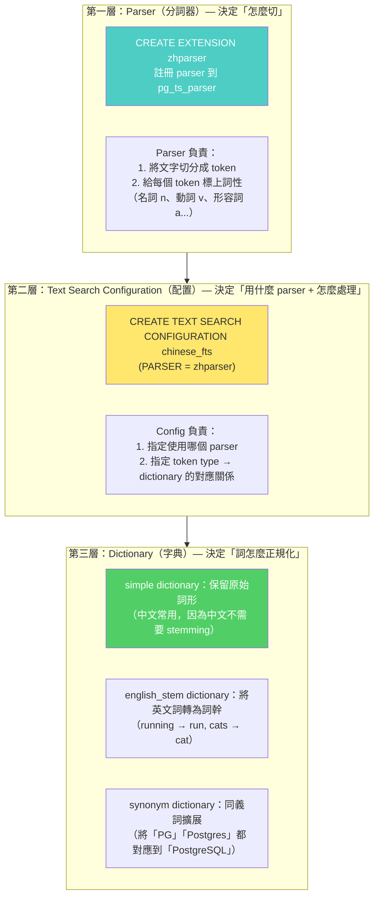

- **Parser** 是底層引擎，zhparser 用 SCWS 做實際分詞工作
- **Configuration** 是「套裝設定」，把 parser 和 dictionary 綁在一起，方便重複使用
- **Dictionary** 決定每個 token 如何正規化（normalize）— 例如把英文大寫轉小寫、移除停用詞（stop words）

`pg_ts_config_map` 顯示 token type → dictionary 的對應關係。zhparser 支援的 token type（對應 SCWS 詞性標注）：

### I. Token Type 對照表

| Token Type | 含義 | 常用 mapping |
|-----------|------|-------------|
| `a` | adjective（形容詞） | `simple` |
| `b` | other（其他） | `simple` |
| `c` | conjunction（連詞） | 可忽略 |
| `d` | adverb（副詞） | `simple` |
| `e` | exclamation（嘆詞） | 可忽略 |
| `g` | root（詞根） | `simple` |
| `h` | prefix（前綴） | `simple` |
| `i` | idiom（成語） | `simple` |
| `j` | abbreviation（縮寫） | `simple` |
| `k` | tail（後綴） | `simple` |
| `l` | temp（暫用） | `simple` |
| `m` | numeral（數詞） | `simple` |
| `n` | noun（名詞） | `simple` |
| `o` | onomatopoeia（擬聲詞） | 可忽略 |
| `p` | preposition（介詞） | 可忽略 |
| `q` | quantifier（量詞） | `simple` |
| `r` | pronoun（代詞） | 可忽略 |
| `s` | space（空格） | 可忽略 |
| `t` | time（時間詞） | `simple` |
| `u` | auxiliary（助詞） | 可忽略 |
| `v` | verb（動詞） | `simple` |
| `w` | punctuation（標點） | 可忽略 |
| `x` | unknown（未知） | `simple` |
| `y` | modal（語氣詞） | 可忽略 |
| `z` | state（狀態詞） | `simple` |

### 給初學者的 MAPPING 決策指南

「為什麼要選擇哪些 token type 加入 mapping？」這是初學者最常見的疑問。核心思路是：

- **加入 mapping 的 token** → 會進入 dictionary 處理，最終存進 tsvector，可以被搜尋到
- **不加入 mapping 的 token** → 直接被丟棄，不佔據 index 空間，也不會被搜尋到

例如：中文的「的」、「了」、「是」等虛詞對搜尋沒有幫助，把它們丟棄可以讓 GIN index 更小、搜尋更快。

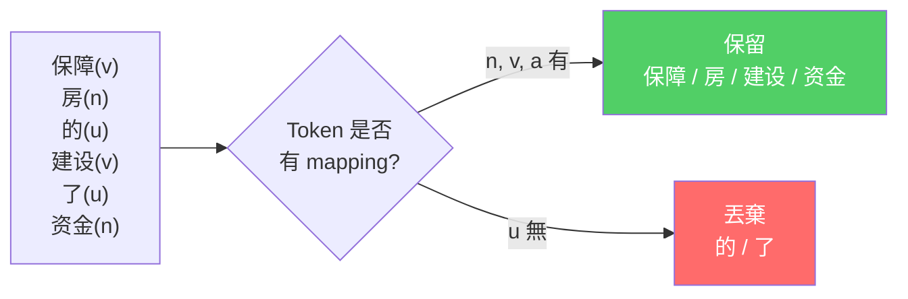

> 補充（Senior Dev）：實務上建議 mapping 規則分三層：
> 1. **實詞**（n,v,a,i,l,m,t,z,j）→ `simple` dictionary（保留原始詞形）
> 2. **虛詞**（c,d,p,r,u,y,w,s,e,o）→ 不 mapping（直接丟棄，減少 tsvector 體積）
> 3. **自訂義**：特定行業術語用 `synonym` dictionary 或 `thesaurus` dictionary 做同義詞擴展

---

## 4. 分詞效果測試

```sql
-- ts_parse：查看 parser 如何切分 token
SELECT * FROM ts_parse('zhparser',
  'hello world! 2010年保障房建设在全国范围内获全面启动，从中央到地方纷纷加大保障房建设投入力度。'
);
--  tokid |  token
-- -------+----------
--    101 | hello
--    101 | world
--    117 | !
--    101 | 2010
--    113 | 年
--    118 | 保障
--    110 | 房建      -- ※ 注意：分詞器可能將「保障房建設」拆成「保障」+「房建」，不如預期
--    118 | 设在
--    110 | 全国
--    ...

-- to_tsvector：生成全文檢索向量
SELECT to_tsvector('testzhcfg',
  '“今年保障房新开工数量虽然有所下调，但实际的年度在建规模以及竣工规模会超以往年份”'
);
--  '下调':7 '保障':1,30 '历史':21 '年度':9 '规模':11,13 '竣工':12 ...
```

### 給初學者的測試工具說明

理解分詞結果是否正確是部署 FTS 的第一步。PostgreSQL 提供了三個層級的測試工具：

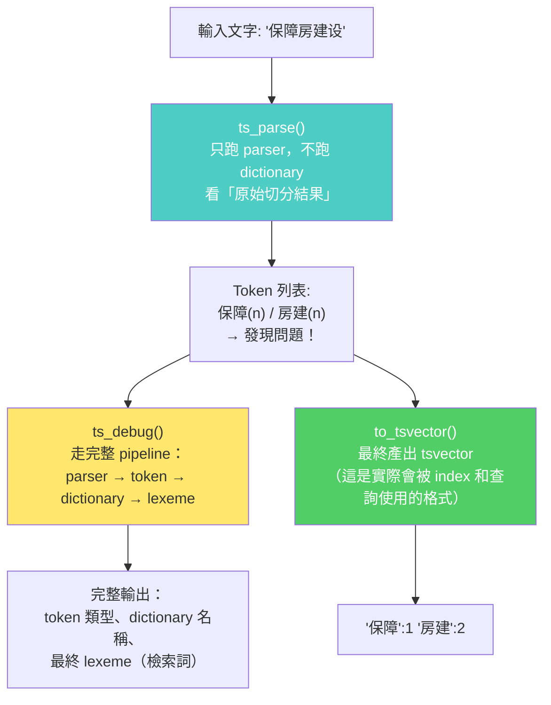

- **`ts_parse`** 用來快速查看 parser 的切分結果，不經過 dictionary 處理。適合用來判斷「分詞器本身有沒有切錯」。
- **`ts_debug`** 走完整 pipeline，包含 dictionary 處理和最終 lexeme 輸出。適合調試「為什麼某個詞搜不到」。
- **`to_tsvector`** 是最終產物格式的函數。`'保障':1,30` 的意思是：詞「保障」出現在第 1 和第 30 個位置。

> 補充（Senior Dev）：分詞品質是 FTS 的上限。上例中「保障房建設」被拆成「保障」+「房建」而非「保障房」+「建設」，這是通用詞典的侷限。解決方案：
> 1. **自訂詞典**：zhparser 支援 `zhparser.extra_dicts` 參數載入自訂詞典（`/opt/scws/etc/dict.utf8.xdb`），加入領域詞彙如「保障房、區塊鏈、微服務」
> 2. **自訂規則**：SCWS 支援 `rules.ini` 自訂分詞優先級
> 3. **詞典格式**：`word<TAB>tf<TAB>attr`（tf=詞頻，attr=詞性），例如 `保障房   14  n`

```sql
-- to_tsquery：將查詢字串轉為 tsquery
SELECT to_tsquery('testzhcfg', '保障房资金压力');
--  '保障' & '房' & '资金' & '压力'

-- 一般查詢寫法
SELECT * FROM articles
WHERE to_tsvector('testzhcfg', content) @@ to_tsquery('testzhcfg', '保障房');
```

### `to_tsquery` 的行為解釋

`to_tsquery` 先把查詢字串也做分詞，然後用 `&`（AND）運算子串接所有詞。因為預設字典中沒有「保障房」這個複合詞，所以 `to_tsquery` 會把它拆成 `'保障' & '房'`——這表示搜尋時要求文件中**同時包含**「保障」和「房」兩個詞。

`@@` 是 PostgreSQL 的「全文匹配」運算子（match operator），它檢查 tsvector 是否滿足 tsquery 的布林條件。

---

## 5. 完整部署流程（推薦）

```sql
-- Step 1: 建立 extension
CREATE EXTENSION zhparser;

-- Step 2: 建立 parser → config
CREATE TEXT SEARCH CONFIGURATION chinese_fts (PARSER = zhparser);

-- Step 3: 只 mapping 實詞（名詞、動詞、形容詞等）
ALTER TEXT SEARCH CONFIGURATION chinese_fts
  ADD MAPPING FOR n, v, a, i, l, j, t, m, z, g, h, k
  WITH simple;

-- Step 4: 可選：加入 synonym dictionary 做同義詞擴展
-- CREATE TEXT SEARCH DICTIONARY chinese_syn (
--   TEMPLATE = synonym,
--   SYNONYMS = chinese_synonyms
-- );
-- ALTER TEXT SEARCH CONFIGURATION chinese_fts
--   ALTER MAPPING FOR n, v, a WITH chinese_syn, simple;

-- Step 5: 建立 GIN index（加速全文檢索）
CREATE INDEX idx_articles_content_fts ON articles
  USING GIN (to_tsvector('chinese_fts', content));

-- Step 6: 查詢
SELECT title, ts_headline('chinese_fts', content,
  to_tsquery('chinese_fts', 'PostgreSQL & 全文检索'),
  'StartSel=<mark>, StopSel=</mark>, MaxWords=50, MinWords=20'
) AS headline
FROM articles
WHERE to_tsvector('chinese_fts', content) @@ to_tsquery('chinese_fts', 'PostgreSQL & 全文检索')
ORDER BY ts_rank(to_tsvector('chinese_fts', content),
                 to_tsquery('chinese_fts', 'PostgreSQL & 全文检索')) DESC
LIMIT 20;
```

### 給初學者的部署流程圖解

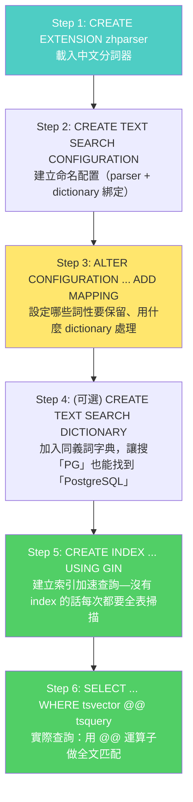

### 查詢語句的關鍵函數說明

| 函數 | 作用（初學者白話解釋） |
|------|----------------------|
| `to_tsvector('config', text)` | 將文字轉成 tsvector（全文檢索向量），內部會先分詞、再查字典、最後標注每個詞在文字中的位置 |
| `to_tsquery('config', text)` | 將查詢字串轉成 tsquery（查詢條件），用 `&`（AND）、`\|`（OR）、`!`（NOT）組合 |
| `@@` | 全文匹配運算子，判斷 tsvector 是否滿足 tsquery |
| `ts_headline('config', text, query, options)` | 產生搜尋結果摘要，自動在匹配的詞前後加上高亮標記（`<mark>...</mark>`），`MaxWords`/`MinWords` 控制摘要長度 |
| `ts_rank(vector, query)` | 計算相關性分數（ranking score），分數越高表示文件與查詢越相關。用於 `ORDER BY` 排序 |

---

## 6. 效能調校

### I. GIN Index 選擇

| Index 類型 | 優勢 | 劣勢 |
|-----------|------|------|
| `GIN` | FTS 查詢極快、支援多欄位 composite tsvector | 寫入稍慢（shared buffer hit 時可忽略） |
| `GiST` | 寫入比 GIN 快、比 GIN 省空間 | 查詢比 GIN 慢 |
| `RUM`（需 extension） | 支援 ranking + phrase search + KNN 排序 | 體積最大 |

### 給初學者的 Index 選擇決策樹

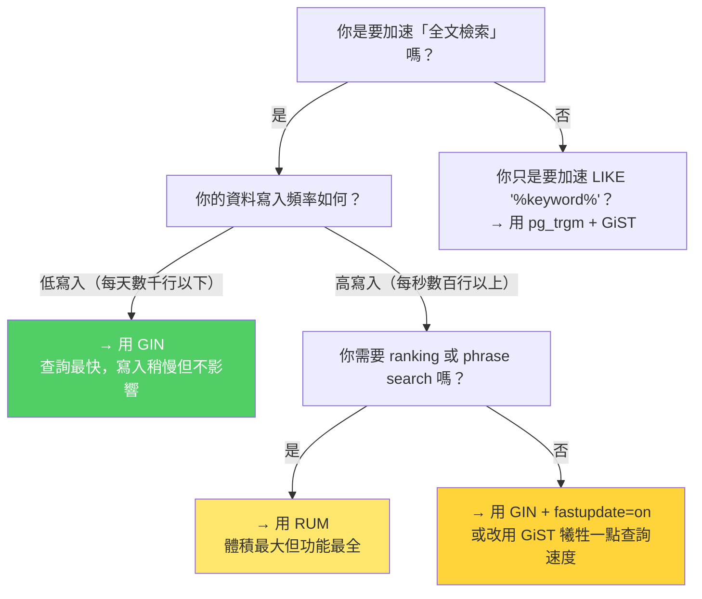

> 補充（Senior Dev）：PG 10+ GIN 支援 `fastupdate = on`（預設），將 pending list 中的 index entries 定期合併入主 index tree，大幅降低寫入 overhead。`gin_pending_list_limit`（預設 4MB）可在高寫入場景調高。

```sql
-- 若 content 欄位很長，只索引前 N 個字元可減少 index 體積
CREATE INDEX idx_articles_content_fts ON articles
  USING GIN (to_tsvector('chinese_fts', substring(content, 1, 1024)));
```

### GIN fastupdate 機制解釋

GIN index 寫入時不是直接修改 index tree（那樣很慢），而是先把新的 index entries 放到一個 **pending list**（待處理清單）。當 pending list 累積到一定大小（由 `gin_pending_list_limit` 控制，預設 4MB），PostgreSQL 會自動將 pending list 的內容合併進主 index tree。這就是 fastupdate 的核心原理。

### II. zhparser 專屬參數

| 參數 | 預設 | 說明 |
|------|------|------|
| `zhparser.punctuation_ignore` | on | 忽略標點符號 |
| `zhparser.seg_with_duality` | on | 二元分詞（將長詞再次二元切分，增加召回率） |
| `zhparser.dict_in_memory` | off | 詞典載入記憶體（加快分詞但吃記憶體） |
| `zhparser.extra_dicts` | — | 載入額外自訂詞典路徑 |
| `zhparser.multi_short` | on | 短詞複合 |
| `zhparser.multi_duality` | on | 雙字詞複合 |
| `zhparser.multi_zmain` | off | 單字切分 |
| `zhparser.multi_zall` | off | 所有詞二次切分 |

### 關鍵參數調校建議

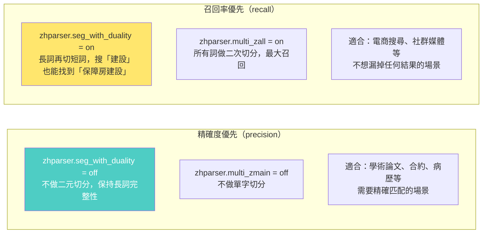

```sql
-- 範例：開啟詞典記憶體快取 + 關閉二元分詞（精確度優先）
SET zhparser.dict_in_memory = on;
SET zhparser.seg_with_duality = off;
```

---

## 7. 與其他 FTS 查詢模式的互動

```sql
-- websearch_to_tsquery（PG 11+，Google 式查詢語法）
SELECT websearch_to_tsquery('chinese_fts', 'PostgreSQL 全文检索 -旧版本');

-- phraseto_tsquery（PG 9.6+，精確詞組匹配）
SELECT phraseto_tsquery('chinese_fts', '保障房建设');

-- plainto_tsquery（全 AND）
SELECT plainto_tsquery('chinese_fts', '保障房建设资金');  -- → '保障' & '房' & '建设' & '资金'

-- ts_rank_cd (cover density ranking, 比 ts_rank 更精準)
SELECT ts_rank_cd(to_tsvector('chinese_fts', content),
                  to_tsquery('chinese_fts', '保障房')) FROM articles;
```

### 三種 tsquery 產生函數的行為對比

```mermaid
flowchart TB
    A["使用者輸入查詢字串: '保障房建设 -旧版本'"] --> B1["plainto_tsquery()<br/>最簡單：整個字串先分詞，再用 & (AND) 全部串接"]
    A --> B2["phraseto_tsquery()<br/>精確詞組：分詞後用 <-> (FOLLOWED BY) 串接，<br/>詞必須按順序相鄰出現才算匹配"]
    A --> B3["websearch_to_tsquery()<br/>Google 風格：支援引號 \"精確詞組\"、<br/>減號 -排除、OR 等自然語法"]
    A --> B4["to_tsquery()<br/>原始格式：手動用 & | ! 組合，<br/>最靈活但需要自己構造查詢語法"]

    B1 --> R1["結果: '保障' & '房' & '建设' & '旧版本'<br/>(連 '旧版本' 也變成 AND 條件)"]
    B2 --> R2["結果: '保障' <-> '房' <-> '建设'<br/>(必須出現 '保障房建设' 這個連續詞組)"]
    B3 --> R3["結果: '保障' & '房' & '建设' & !'旧版本'<br/>('旧版本' 變成 NOT 條件，排除含此詞的文檔)"]
    B4 --> R4["結果: 由開發者手動指定<br/>例: '保障 & (房 | 建设) & !旧版本'"]

    style B3 fill:#51cf66,color:#fff
    style R3 fill:#51cf66,color:#fff
```

- **`plainto_tsquery`**：適合「不想要使用者學查詢語法」的場景，直接把整段文字轉成 AND 查詢。
- **`phraseto_tsquery`**：適合需要精確詞組匹配的場景，例如搜「New York」不想匹配到「New Jersey」和「York City」分開的情況。
- **`websearch_to_tsquery`**：最接近 Google 搜尋體驗，支援 `-`排除詞、`"`精確詞組`"`、`OR` 等語法，推薦用於面向終端使用者的搜尋框。
- **`ts_rank_cd`**（cover density ranking）：比 `ts_rank` 更進階的相關性評分，考慮匹配詞在文檔中的覆蓋密度（詞與詞之間的距離越近，分數越高）。

---

## 8. 雲端 PostgreSQL 相容性

| 平台 | zhparser 支援 |
|------|-------------|
| 阿里雲 RDS PG | 內建（`CREATE EXTENSION zhparser`） |
| 阿里雲 PolarDB PG | 內建 |
| AWS RDS PG | 不支援外掛 C extension（可用 pg_bigm / pg_trgm 替代） |
| Supabase | 需自行編譯（managed service 不開放 C extension） |
| Google Cloud SQL PG | 不支援 C extension |
| 自建 PostgreSQL | 完全支援 |

### 給初學者的雲端環境中文 FTS 決策指南

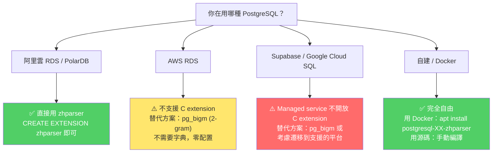

**Cloud 平台的核心限制**：大多數雲端託管 PostgreSQL 不允許安裝第三方 C extension（出於安全隔離考量）。阿里雲是少數內建 zhparser 的平台。AWS/GCP 用戶可退而求其次，使用 `pg_bigm`（純 SQL extension，不需 C 編譯）或 `pg_trgm`（內建）。

---

## 9. 版本演進

| 功能 | 版本 | 說明 |
|------|------|------|
| `phraseto_tsquery` | PG 9.6 | 精確詞組匹配 |
| GIN fastupdate | PG 10 | 寫入優化，pending list 機制 |
| `websearch_to_tsquery` | PG 12 | Google 式查詢語法（支援 `-` 排除和 `"` 精確`"`） |
| `pg_bigm` extension | PG 13+ | 2-gram CJK 分詞（不需 SCWS，純 SQL 可實作） |
| GIN index parallel builds | PG 15+ | 大型 GIN index 加速建立（多 worker 並行） |
| `tsvector` merge optimizations | PG 16+ | `tsvector` 的 `\|\|` 合併效能提升 |
| GIN incremental build | PG 17+ | 支援增量構建 concurrent index |

### PostgreSQL FTS 功能演進時間線

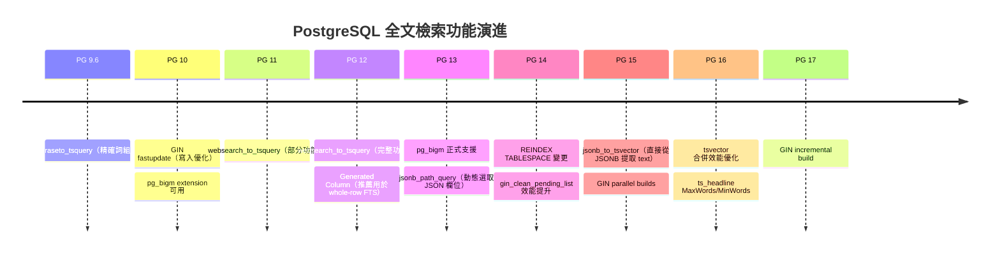

## 10. 參考

1. [zhparser GitHub](https://github.com/amutu/zhparser)
2. [SCWS 分詞引擎](https://github.com/hightman/scws)
3. [zhparser 使用文檔](http://amutu.com/blog/zhparser/)
4. [amutu 部落格](http://amutu.com/blog/zhparser/)
5. [PGXN zhparser](http://pgxn.org/dist/zhparser/)
6. [德哥早期 nlpbamboo 分詞方案](https://github.com/digoal/blog/blob/master/201206/20120621_01.md)

---

# 二、 PostgreSQL 行級全文檢索 (Whole-Row Full-Text Search) — PG 17 視角

> 來源：[digoal - PostgreSQL 行級全文檢索 (2016-04-19)](https://github.com/digoal/blog/blob/master/201604/20160419_01.md)
>
> 本文基於原始文章，以 PG 17 (2026) 為基準更新：generated column 為首要推薦方案，IMMUTABLE hack 僅保留作為 legacy PG < 12 的參考。

---

## 1. 場景：任意欄位全文檢索的痛點

當需要對 table 中所有 column 做全文檢索——例如前端搜尋框「在全部欄位中匹配關鍵字」——傳統寫法需要逐個 column 疊加 OR 條件，既繁瑣又難以維護：

```sql
-- 每個 column 都要寫一組條件，精準匹配 + 模糊匹配混雜
SELECT * FROM t
WHERE phonenum = 'digoal'
   OR info ~ 'digoal'
   OR c1::text = 'digoal'
   OR ...;  -- N 個 column 就要 N 個 OR
```

若 column 數量多、型別混雜（text / int / timestamp），寫 SQL 非常痛苦，且每個 OR 條件都會在 query planner 中產生額外的 filter clause。

### 給初學者的問題視覺化

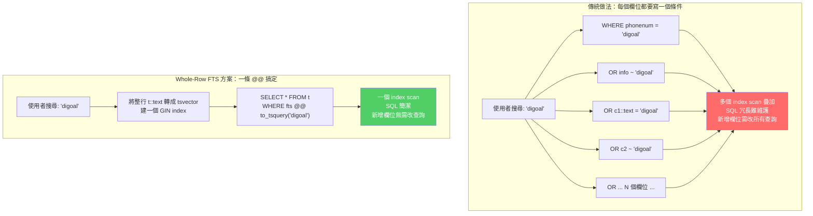

解決方案：**將整個 row 轉成單一 text，對其建立 GIN full-text search index**，一條 `@@` 搞定所有 column 的全文檢索。

---

## 2. 現代推薦方案：Generated Column + GIN (PG 12+)

自 PG 12 起，generated column 是最簡潔的方案，不需手動標記 IMMUTABLE，不需包裝 function：

```sql
ALTER TABLE t ADD COLUMN fts tsvector
    GENERATED ALWAYS AS (to_tsvector('jiebacfg', t::text)) STORED;

CREATE INDEX idx_t_fts ON t USING GIN (fts);
```

### Generated Column 的工作原理（初學者版）

Generated Column（生成欄位）是 PostgreSQL 12 引入的功能。它像一個「自動計算的欄位」——你定義好計算公式，PostgreSQL 會在 INSERT 或 UPDATE 時自動計算並儲存結果：

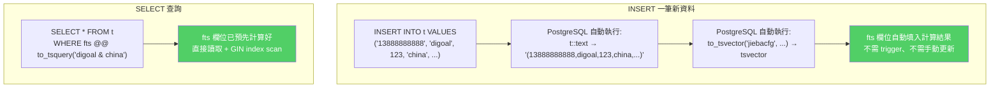

查詢直接使用該 column，`@@` operator 自動走 index：

```sql
SELECT * FROM t WHERE fts @@ to_tsquery('digoal & 阿里巴巴');
-- EXPLAIN 會顯示 Bitmap Index Scan on idx_t_fts
```

**優點：**
- expression 不需 IMMUTABLE，`to_tsvector` + `::text` 直接可用
- INSERT / UPDATE 時自動重算 `fts` 值，無額外 trigger
- 查詢 SQL 簡潔，不需呼叫包裝 function

> 補充（Senior Dev）：若 table 已存在且數據量大，建議用 background migration 逐步新增 column + index，避免長時間鎖表。`ALTER TABLE ... ADD COLUMN ... GENERATED ALWAYS AS ... STORED` 對既有 row 會觸發全表重寫（PG 17 起支援 incremental build，但首次仍需 full scan）。

---

## 3. 原始實作步驟（PG < 12 或需完全手控場景）

以下是 2016 年的原始做法，步驟較多但對沒有 generated column 的舊版 PG 是唯一方案。

測試 table：

```sql
CREATE TABLE t (
    phonenum text,
    info     text,
    c1       int,
    c2       text,
    c3       text,
    c4       timestamp
);

INSERT INTO t VALUES (
    '13888888888',
    'i am digoal, a postgresqler',
    123,
    'china',
    '中华人民共和国，阿里巴巴，阿',
    now()
);
```

### 給初學者的流程總覽

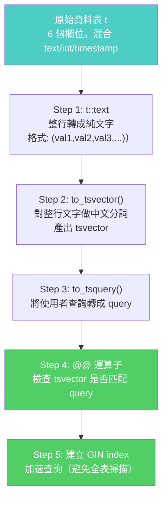

### I. row 轉 text —— `t::text`

PostgreSQL 的 composite type 支援 `::text` cast，輸出格式為 `(col1_val, col2_val, col3_val, ...)`：

```sql
SELECT t::text FROM t;
-- (13888888888,"i am digoal, a postgresqler",123,china,中华人民共和国，阿里巴巴，阿,"2016-04-19 11:15:55.208658")
```

**給初學者的解釋：** `t::text` 中的 `::` 是 PostgreSQL 的型別轉換（type cast）語法。`t` 是一整行（composite type），把它轉成 `text` 型別時，PostgreSQL 內部呼叫了兩個系統函數來完成轉換：
- 先將整行的結構轉成字串表示（透過內部函數 `record_out`——負責把一筆紀錄輸出成文字格式）
- 再將這個字串解析為 PostgreSQL 的 text 型別（透過內部函數 `textin`——負責把外部文字輸入轉成內部 text 型別）

最終結果是一個以逗號分隔、用括號包圍的字串。

### II. 對 row text 做 tsvector 分詞

使用中文分詞 extension（此例為 jieba / pg_jieba）：

- [pg_jieba (GitHub)](https://github.com/jaiminpan/pg_jieba)
- [pg_scws (GitHub)](https://github.com/jaiminpan/pg_scws)

兩者均支援自訂辭典。

```sql
SELECT to_tsvector('jiebacfg', t::text) FROM t;
-- ' ':6,8,11,13,33 '04':30 '11':34 '123':17 '13888888888':2 ...
-- 'digoal':9 'postgresqler':14 'china':19 '中华人民共和国':21 '阿里巴巴':23 ...
```

整個 row 的所有 column 值被合併成一個 tsvector，各詞條標記了在整段 text 中的位置。

**給初學者的解釋：** tsvector 中的每個條目格式為 `'詞':位置`。例如 `'digoal':9` 表示詞 `digoal` 出現在整段文字的 position 9。如果同一個詞出現在多個位置，會顯示為 `'保障':1,30`。

### III. 全文檢索查詢

```sql
-- digoal AND china（命中）
SELECT to_tsvector('jiebacfg', t::text) @@ to_tsquery('digoal & china') FROM t;
-- t

-- digoal AND post（不命中）
SELECT to_tsvector('jiebacfg', t::text) @@ to_tsquery('digoal & post') FROM t;
-- f
```

實際查詢：

```sql
SELECT * FROM t
WHERE to_tsvector('jiebacfg', t::text) @@ to_tsquery('digoal & china');
--  phonenum   |            info             | c1  |  c2   |              c3              |             c4
-- -------------+-----------------------------+-----+-------+------------------------------+----------------------------
--  13888888888 | i am digoal, a postgresqler | 123 | china | 中华人民共和国，阿里巴巴，阿 | 2016-04-19 11:15:55.208658

SELECT * FROM t
WHERE to_tsvector('jiebacfg', t::text) @@ to_tsquery('digoal & 阿里巴巴');
-- 同上，命中
```

---

## 4. 建立 GIN Index：繞過 IMMUTABLE 限制（Legacy：PG < 12）

直接對 `to_tsvector('jiebacfg', t::text)` 建立 index 會失敗，因為 `t::text` 背後依賴兩個系統函數——一個負責把紀錄轉成文字輸出格式，另一個負責把文字輸入轉成內部 text 型別——它們預設是 **STABLE**（非 IMMUTABLE），而 expression index 要求 expression 必須是 IMMUTABLE。

### 初學者必讀：IMMUTABLE、STABLE、VOLATILE 是什麼？

PostgreSQL 將函數分為三種「穩定性」等級，這影響函數是否能用於 index：

| 等級 | 含義 | 相同輸入是否始終相同輸出？ | 能否用於 index？ |
|------|------|--------------------------|-----------------|
| **IMMUTABLE** | 結果永遠不變 | 是（在任何 session、任何時間） | 可 |
| **STABLE** | 同一 SQL 語句中結果一致 | 是（同一語句內） | 不可直接用 |
| **VOLATILE** | 每次呼叫結果可能不同 | 否（如 `random()`、`now()`） | 不可 |

`t::text` 依賴的系統函數預設為 STABLE，因為在某些 locale/collation 設定下，同一筆資料的輸出格式可能因 session 不同而異。

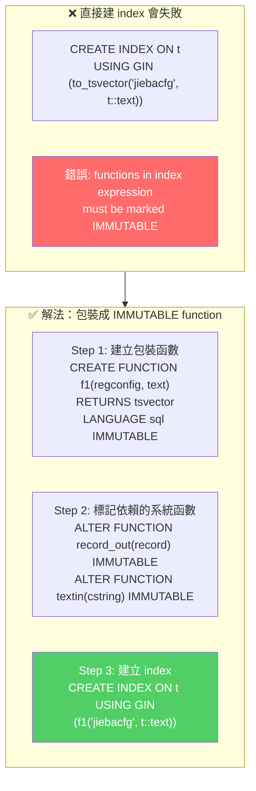

### I. 包裝 IMMUTABLE function

```sql
CREATE OR REPLACE FUNCTION f1(regconfig, text) RETURNS tsvector AS $$
  SELECT to_tsvector($1, $2);
$$ LANGUAGE sql IMMUTABLE STRICT;

CREATE OR REPLACE FUNCTION f1(text) RETURNS tsvector AS $$
  SELECT to_tsvector($1);
$$ LANGUAGE sql IMMUTABLE STRICT;
```

**給初學者的解釋：** 這裡的 `$1`、`$2` 是 PostgreSQL 函數中的參數佔位符（placeholder）。`LANGUAGE sql` 表示這個函數用純 SQL 實作（不需要 PL/pgSQL）。`STRICT` 表示如果任何參數為 NULL，則直接返回 NULL 而不執行函數主體。

第一個 `f1` 接受兩個參數（config 名稱 + 要分詞的文字），第二個 `f1` 只接受一個參數（使用預設 config）。這叫**函數重載（overloading）**。

### II. 將依賴的 system function 標記為 IMMUTABLE

```sql
ALTER FUNCTION record_out(record) IMMUTABLE;
ALTER FUNCTION textin(cstring) IMMUTABLE;
```

> 補充（Senior Dev）：這兩個系統函數預設為 STABLE 是有原因的——某些 locale / encoding 設定下輸出行為可能因 session 環境而異。如果確認你的 DB 環境一致（固定 collation、encoding），標記為 IMMUTABLE 是安全的。但注意：若後續改動這些設定，需重建 index。PG 12+ 可改用 generated column 避開此問題（見末尾補充）。

### III. 建立 GIN index

```sql
CREATE INDEX idx_t_1 ON t USING GIN (f1('jiebacfg'::regconfig, t::text));
```

### IV. 驗證 index 生效

```sql
-- 少量 row 時 PG 可能選擇 Seq Scan，可強制關閉確認 index 被使用：
SET enable_seqscan = off;

EXPLAIN SELECT * FROM t
WHERE f1('jiebacfg'::regconfig, t::text) @@ to_tsquery('digoal & 阿里巴巴');

--                                                    QUERY PLAN
-- ----------------------------------------------------------------------------------------------------------------
--  Bitmap Heap Scan on t  (cost=12.25..16.77 rows=1 width=140)
--    Recheck Cond: (to_tsvector('jiebacfg'::regconfig, (t.*)::text) @@ to_tsquery('digoal & 阿里巴巴'::text))
--    ->  Bitmap Index Scan on idx_t_1  (cost=0.00..12.25 rows=1 width=0)
--          Index Cond: (to_tsvector('jiebacfg'::regconfig, (t.*)::text) @@ to_tsquery('digoal & 阿里巴巴'::text))
```

**給初學者的 EXPLAIN 輸出解讀：**
- `Bitmap Index Scan on idx_t_1` 表示 PostgreSQL 確實使用了你的 GIN index
- `Bitmap Heap Scan` 表示先透過 index 找到符合的行位置（bitmap），再回表讀取完整資料
- `Recheck Cond` 是用來確認 index 回傳的結果是否真的滿足條件（因為 GIN index 可能產生 false positive）

```sql
-- 恢復預設行為
SET enable_seqscan = on;
```

> 補充（Senior Dev）：`SET enable_seqscan = off` 僅用於測試 small table 的 index 行為。Production 中若 row 數正常，planner 會自然選擇 index。不要永久關閉 seqscan。

---

## 5. Senior Dev 實戰注意事項（PG 17 更新）

### I. `t::text` 格式的局限

`t::text` 輸出格式為 `(val1, val2, ...)`，其中 text column 的值以雙引號包裹、逗號分隔。這意味著：
- 逗號本身會被當作 token 分隔符，不影響分詞
- 但若 column 值內含特殊字符（如括號、引號），可能產生意外 token。建議先對 sample data 用 `to_tsvector()` 檢查 token 列表

> 補充（Senior Dev）：PG 14+ 中 `(table_alias.*)::text` 在某些 edge case 下的 escaping 行為有微調，建議升級後重新驗證 token 輸出。

### II. 不能做加權檢索（Weighted Search）

row-level tsvector 將所有 column 合為一體，無法區分「title 匹配權重 A、body 匹配權重 B」。如需加權，應使用 `setweight()` 對各 column 分別指定權重再合併：

```sql
SELECT setweight(to_tsvector('english', coalesce(title, '')), 'A') ||
       setweight(to_tsvector('english', coalesce(body, '')),  'B');
```

**給初學者的加權概念解釋：**

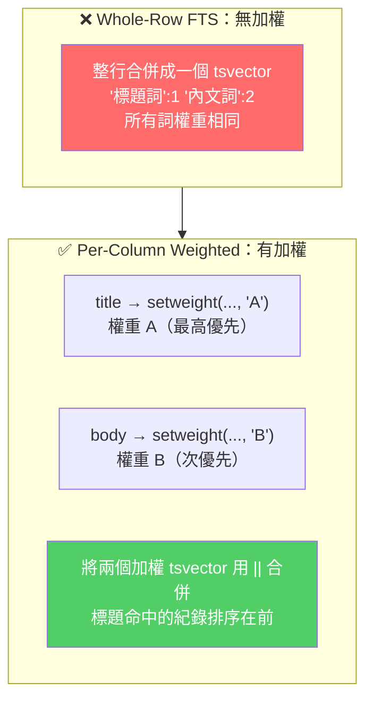

PostgreSQL 支援四種權重：`A`（最高）、`B`、`C`、`D`（最低）。`ts_rank()` 在計算相關性分數時會考慮權重。

### III. UPDATE 成本

任何 column 的 UPDATE 都會觸發整行 tsvector 重建 + GIN index 更新。對高寫入頻率的 table 需評估 overhead。使用 generated column 時同樣會觸發重算。

### 寫入成本的完整說明


> 補充（Senior Dev）：GIN index 的 `fastupdate` 參數（預設 on）可將多個 pending insert 合併寫入，減少 UPDATE-heavy workload 的 index 維護成本。但 pending list 過大會增加查詢時的 scan overhead，可透過 `gin_pending_list_limit` 調整閾值（PG 9.5+，預設 4MB）。

### IV. PG 14~17 新特性

| 版本 | 相關改進 |
|------|---------|
| PG 14 | `REINDEX` 支援 `TABLESPACE` 變更；GIN index 的 `gin_clean_pending_list` 效能提升 |
| PG 15 | `jsonb_to_tsvector` 可以直接從 JSONB column 提取 text 做 FTS（不需先 `::text`） |
| PG 16 | `tsvector` 的 `\|\|` operator 效能優化；支援 `ts_headline` 的 `MaxWords` / `MinWords` options |
| PG 17 | GIN index 支援 incremental build（`CREATE INDEX ... WITH (fastupdate = on)` 可用於 concurrent build） |

### V. 中文分詞 extension 選擇（2026 現狀）

| Extension | 引擎 | 適合場景 | 維護狀態 (2026) |
|-----------|------|---------|----------------|
| **zhparser** | SCWS | 簡體中文 | 社群最活躍，Alibaba RDS PG 內建支援 |
| pg_jieba | jieba（結巴） | 簡體中文 | 原文章示例，更新較慢 |
| pg_scws | SCWS | 簡體中文 | 詞典較豐富 |
| pg_bigm | 2-gram | 中日韓混合文本 | 無需辭典，適合多語言混合場景 |
| pgroonga | Groonga | 中日韓全文檢索 | 效能極佳，支援 N-gram + tokenizer |
| 內建 default | snowball stemmer | 英文 / 歐洲語言 | PG 原生 |

### Extension 選擇決策樹

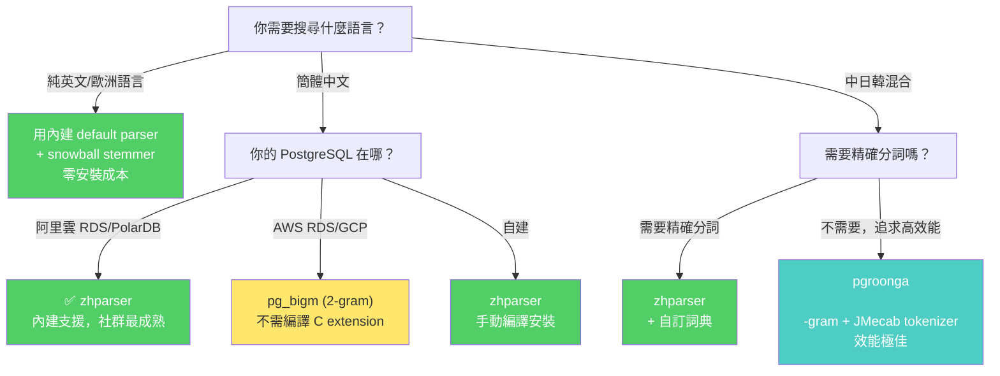

> 補充（Senior Dev）：2026 年中文 PG 場景中 **zhparser** 是事實標準，Alibaba Cloud RDS PG 直接內建`zhparser` extension，`pgroonga` 則適合需要高效 CJK 全文檢索 + JSON 混用的 OLTP 場景。如果不需要精確分詞且追求零配置，`pg_bigm` 的 2-gram 是開箱即選。

---

# 三、 PostgreSQL 全文檢索：整行多欄位分詞檢索 — record_out + SCWS 整合方案

> 來源：[digoal - PostgreSQL 如何高效解決按任意字段分詞檢索的問題 — case 1 (2016-07-25)](https://github.com/digoal/blog/blob/master/201607/20160725_05.md)

---

## 1. 問題場景

應用場景：一張表有多個 text column（歌手、曲目、專輯、作曲、歌詞），用戶輸入一個關鍵詞需要在**所有 column** 中以分詞方式匹配，任意 column 命中即返回。

### 給初學者的場景可視化

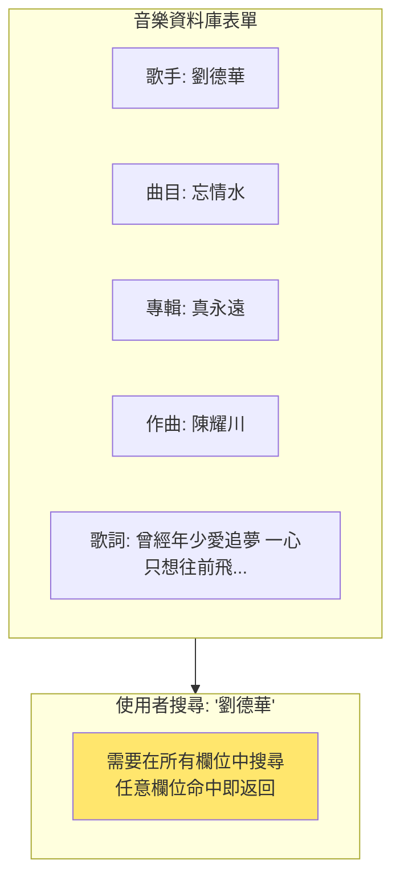

### I. 傳統方案（per-column index + OR）

每個 column 建獨立的分詞 GIN index，查詢時 OR 串接：

```sql
-- 冗長且每個 column 都要重複 match
WHERE to_tsvector('scwscfg', singer) @@ to_tsquery('scwscfg', '劉德華')
   OR to_tsvector('scwscfg', track)  @@ to_tsquery('scwscfg', '劉德華')
   OR to_tsvector('scwscfg', album)  @@ to_tsquery('scwscfg', '劉德華')
   OR to_tsvector('scwscfg', lyric)  @@ to_tsquery('scwscfg', '劉德華');
```

問題：SQL 冗長、多個 OR 無法有效利用 BitmapOr 合併（多 index scan 的成本疊加）。

### 兩種方案的架構對比

```mermaid
flowchart LR
    subgraph Traditional["方案 A：Per-Column Index + OR"]
        T_A["Index on singer"] --> T_Scan["4 次 Index Scan"]
        T_B["Index on track"] --> T_Scan
        T_C["Index on album"] --> T_Scan
        T_D["Index on lyric"] --> T_Scan
        T_Scan --> T_OR["BitmapOr 合併"]
        T_OR --> T_Result["回傳結果<br/>⚠️ 成本疊加"]
    end

    subgraph WholeRow["方案 B：Whole-Row Single Index"]
        W_A["一行序列化為 text<br/>t1::text → replace(..., ',', ' ')"] --> W_Vec["to_tsvector()"]
        W_Vec --> W_Idx["單一 GIN index"]
        W_Idx --> W_Scan["1 次 Index Scan"]
        W_Scan --> W_Result["回傳結果<br/>✅ 高效簡潔"]
    end

    style T_Result fill:#ff6b6b,color:#fff
    style W_Result fill:#51cf66,color:#fff
```

### II. 德哥方案：整行序列化為 text → 單一 GIN index

```sql
-- 將整條 row 轉成 text，建一個 GIN index 解決所有 column 的搜尋
CREATE INDEX idx ON t1
USING gin (to_tsvector('scwscfg', replace(rec_to_text(t1), ',', ' ')));
```

> 補充（Senior Dev）：這種「whole-row full-text index」的方法適合 **schema-less 查詢**（不關心 keyword 落在哪個 column）。如果需要知道 keyword 命中了哪個 column（如 highlight 特定欄位），則仍需 per-column index 或改用 `jsonb` + `jsonb_to_tsvector()`（PG 10+）逐欄位標記。

---

## 2. `record_out`：PostgreSQL Row 的 Text 序列化格式

```sql
CREATE TABLE t1 (id INT, c1 TEXT, c2 TEXT, c3 TEXT);
INSERT INTO t1 VALUES (1, '子远e5a1cbb8', '子远e5a1cbb8', 'abc');

SELECT t1::text FROM t1;
-- (1,子远e5a1cbb8,子远e5a1cbb8,abc)
```

輸出格式由 PostgreSQL 內部的行序列化函數定義（位於 `src/backend/utils/adt/rowtypes.c`），這個內部函數負責將一筆複合型別的紀錄轉換為人類可讀的文字表示：

- 首尾使用括號 `()`
- column 之間用逗號 `,` 分隔
- 若 column value 包含特殊字元（`"`, `\`, `(`, `)`, `,`, space），會加上雙引號 `""`
- 空字串強制加雙引號

### record_out 輸出格式規則圖解

```mermaid
flowchart TB
    subgraph Row["原始 Row 資料"]
        R1["id=1 (integer)"]
        R2["c1='子远e5a1cbb8' (text, 無特殊字元)"]
        R3["c2='hello, world' (text, 含逗號→需加雙引號)"]
        R4["c3='' (text, 空字串→強制雙引號)"]
    end

    subgraph Format["record_out 轉換規則"]
        F1["規則 1: 以括號 ( ) 包圍整個輸出"]
        F2["規則 2: 欄位之間用逗號分隔"]
        F3["規則 3: 含特殊字元的值加雙引號"]
        F4["規則 4: 空字串強制加雙引號"]
    end

    subgraph Output["最終輸出"]
        O1["(1,子远e5a1cbb8,\"hello, world\",\"\")"]
    end

    Row --> Format --> Output

    style O1 fill:#4ecdc4,color:#fff
```

> 補充（Senior Dev）：這個行序列化函數的輸出格式在 PG 版本間保持向後相容，但不應被視為穩定的序列化協議（它不是 SQL standard 定義的格式）。用於全文檢索場景無問題，但如果需要精確的結構化反序列化應使用 `row_to_json()` 或 `jsonb_build_object()`。

---

## 3. SCWS 分詞的逗號問題

### I. 問題發現

SCWS parser 將 `,` 解析為獨立 token（`tokid=117, alias='u', auxiliary`），這導致末尾帶逗號的文字被**錯誤切割**：

```sql
-- 無逗號：正常分詞
SELECT * FROM ts_debug('scwscfg', '子远e5a1cbb8');
-- token: 子(k), 远(a), e5a1cbb8(e)

-- 帶逗號：e5a1cbb8 被切成三截
SELECT * FROM ts_debug('scwscfg', '子远e5a1cbb8,');
-- token: 子(k), 远(a), e5a(e), 1cbb(e), 8(e), ,(u)
```

根因：SCWS 分詞器遇到 `,` 時將其視為 auxiliary token，截斷了前方連續的英數字符 `e5a1cbb8`。

### 給初學者的問題重現

```mermaid
flowchart TB
    subgraph Normal["正常情況：文字後沒有逗號"]
        N1["輸入: '子远e5a1cbb8'"] --> N2["SCWS Parser"]
        N2 --> N3["Token: 子(k) 远(a) e5a1cbb8(e)<br/>✅ e5a1cbb8 保持完整"]
    end

    subgraph Bug["Bug 情況：文字後有逗號"]
        B1["輸入: '子远e5a1cbb8,'"] --> B2["SCWS Parser<br/>遇到逗號 → 視為 auxiliary token"]
        B2 --> B3["Token: 子(k) 远(a) e5a(e) 1cbb(e) 8(e) ,(u)<br/>❌ e5a1cbb8 被截斷為 3 段！"]
    end

    style N3 fill:#51cf66,color:#fff
    style B3 fill:#ff6b6b,color:#fff
```

這意味著：使用 whole-row FTS 時，`record_out` 輸出中的每個逗號都會觸發這個 bug，任何被逗號分隔的英文/數字混合字串都可能被錯誤切碎。

### II. PostgreSQL 全文檢索 Pipeline

以下是 PostgreSQL 全文檢索的完整處理管線，從原始字串到最終的 tsvector：

```mermaid
flowchart TB
    A["原始字串 (String)"] --> B["Parser (分詞器)<br/>由 CREATE TEXT SEARCH PARSER 定義<br/>包含四個核心函數：<br/>初始化、取詞、結束、詞性查詢"]
    B --> C["Token 序列 (附帶類型標籤)<br/>例: 子(k) 远(a) e5a(e) 1cbb(e) 8(e) ,(u)"]
    C --> D["Dictionary (字典處理)<br/>依 token type 查詢對應 dictionary"]
    D --> E["Lexeme (正規化後的詞彙)<br/>例: '子' '远' 'e5a' '1cbb' '8'"]
    E --> F["tsvector (全文檢索向量)<br/>'8':5 '1cbb':4 'e5a':3 '子':1 '远':2"]

    subgraph Debug["調試工具"]
        G1["ts_token_type('parser')<br/>→ 列出 parser 支援的所有 token type"]
        G2["ts_parse('parser', 'text')<br/>→ 只跑 parser，看原始切分"]
        G3["ts_debug('config', 'text')<br/>→ 跑完整 pipeline，看所有步驟"]
    end

    C -.-> G2
    E -.-> G3
    F -.-> G1

    style B fill:#4ecdc4,color:#fff
    style D fill:#ffe66d
    style F fill:#51cf66,color:#fff
```

**查看 parser 支援的 token type（SCWS 26 種）**：

```sql
SELECT * FROM ts_token_type('scws');
```

```
 tokid | alias | description
-------+-------+-------------
    97 | a     | adjective
    98 | b     | difference
    99 | c     | conjunction
   100 | d     | adverb
   101 | e     | exclamation
   102 | f     | position
   103 | g     | word root
   104 | h     | head
   105 | i     | idiom
   106 | j     | abbreviation
   107 | k     | head
   108 | l     | temp
   109 | m     | numeral
   110 | n     | noun
   111 | o     | onomatopoeia
   112 | p     | prepositional
   113 | q     | quantity
   114 | r     | pronoun
   115 | s     | space
   116 | t     | time
   117 | u     | auxiliary        ← 逗號落入此類
   118 | v     | verb
   119 | w     | punctuation
   120 | x     | unknown
   121 | y     | modal
   122 | z     | status
```

> 補充（Senior Dev）：解析 token type 的關鍵意義在於 **MAPPING**——可以針對不同 token type 指定不同 dictionary。例如對 SCWS 的 `e`(exclamation) 類型（英文/數字符號）指定 `english_stem` 或 `simple` dictionary；對 `n`(noun) 指定自訂的 synonym dictionary。這使得整個 pipeline 高度可定製。

### III. 調試工具

| 函數 | 用途 |
|------|------|
| `ts_token_type(parser)` | 查 parser 支援的 token type |
| `ts_parse(parser, text)` | 用指定 parser 將 text 輸出為 token list |
| `ts_debug(config, text)` | 完整分詞流程（parser → token → dictionary → lexeme） |

```sql
SELECT * FROM ts_parse('scws', '子远e5a1cbb8,');
-- tokid=107(token=子), 97(远), 101(e5a), 101(1cbb), 101(8), 117(,)
```

**給初學者的調試策略：** 遇到分詞不如預期時，先用 `ts_parse` 隔離 parser 的行為，確認問題出在 parser 還是 dictionary。如果 `ts_parse` 的 token 輸出就已經錯了（如此處逗號截斷問題），那問題在 parser 層，需要從輸入資料或 parser 設定著手。如果 token 正確但 lexeme 不對，問題在 dictionary 層。

---

## 4. 解法：`replace(, → ' ')`

不修改 SCWS C 代碼的前提下，將 `record_out` 輸出中的逗號替換為空格（SCWS 忽略 space token）：

```sql
-- 替換後：原先的逗號位置變空格
SELECT replace(t1::text, ',', ' ') FROM t1;
-- (1 子远e5a1cbb8 子远e5a1cbb8 abc)

-- 分詞結果正確
SELECT to_tsvector('scwscfg', replace(t1::text, ',', ' ')) FROM t1;
-- '1':1 'abc':6 'e5a1cbb8':3,5 '远':2,4
```

`e5a1cbb8` 不再被截斷，`逗號` 消失不會汙染 token。

### 解法原理圖解

```mermaid
flowchart TB
    subgraph Before["修復前：逗號截斷問題"]
        B1["t1::text 輸出:<br/>(1,子远e5a1cbb8,子远e5a1cbb8,abc)"] --> B2["to_tsvector() 分詞<br/>遇到逗號 → e5a1cbb8 被切碎"]
        B2 --> B3["'1':1 'abc':6 'e5a':3 '1cbb':4 '8':5 '远':2<br/>❌ e5a1cbb8 消失，切成 3 個碎片"]
    end

    subgraph After["修復後：逗號 → 空格"]
        A1["replace(t1::text, ',', ' '):<br/>(1 子远e5a1cbb8 子远e5a1cbb8 abc)"] --> A2["to_tsvector() 分詞<br/>空格被 SCWS 忽略（space token）"]
        A2 --> A3["'1':1 'abc':6 'e5a1cbb8':3,5 '远':2,4<br/>✅ e5a1cbb8 保持完整"]
    end

    Before --> After

    style B3 fill:#ff6b6b,color:#fff
    style A3 fill:#51cf66,color:#fff
```

### I. 完整實作

```sql
-- 通用型轉換函數（接受 anyelement）
CREATE OR REPLACE FUNCTION rec_to_text(anyelement) RETURNS text AS $$
  SELECT $1::text;
$$ LANGUAGE sql STRICT IMMUTABLE;

-- 建 GIN index：對整行 text 做分詞
CREATE INDEX idx ON t1
USING gin (
  to_tsvector('scwscfg', replace(rec_to_text(t1), ',', ' '))
);

-- 查詢
EXPLAIN VERBOSE
SELECT * FROM t1
WHERE to_tsvector('scwscfg', replace(rec_to_text(t1), ',', ' '))
   @@ to_tsquery('scwscfg', '子远e5a1cbb8');

--                                        QUERY PLAN
-- Bitmap Heap Scan on t1
--   Recheck Cond: (to_tsvector(...) @@ '''远'' & ''e5a1cbb8'''::tsquery)
--   ->  Bitmap Index Scan on idx
```

### 實作步驟總結

```mermaid
flowchart TB
    S1["Step 1: 建立 rec_to_text() 函數<br/>接受任意型別，回傳 ::text 結果"] --> S2["Step 2: CREATE INDEX<br/>USING GIN (to_tsvector('scwscfg',<br/>replace(rec_to_text(t1), ',', ' ')))"]
    S2 --> S3["Step 3: 查詢時使用相同 expression<br/>WHERE to_tsvector(...) @@ to_tsquery(...)"]
    S3 --> S4["✅ QUERY PLAN 顯示<br/>Bitmap Index Scan on idx<br/>index 有效命中！"]

    style S1 fill:#4ecdc4,color:#fff
    style S2 fill:#ffe66d
    style S4 fill:#51cf66,color:#fff
```

> 補充（Senior Dev）：
>
> **`replace(, → ' ')` 的邊界情況**：
> - 如果 column value 本身包含逗號（如 `'hello, world'`），`record_out` 會給該 value 加雙引號 `"hello, world"`。但 `replace()` 是全局替換，**雙引號內的逗號也會被替換**。這對中文分詞通常無害（因為中文不依賴逗號斷詞），但在中英混排或多語言場景中可能改變原意。
> - **更精細的替代**：若需保留 column value 內逗號，可以用 PL/pgSQL 寫一個只替換 `record_out` 層級的括號+逗號（分隔符），而非 column value 內逗號的函數。但實務中這種需求少見，`replace(, → ' ')` 對中文場景足夠。
>
> **IMMUTABLE 標記的必要性**：GIN index on expression 要求 expression 是 IMMUTABLE。`rec_to_text()` 標為 IMMUTABLE 是因為 `$1::text` 的結果在同一 input 下永遠相同——這對 index 成立。但 `to_tsvector()` 的 `IMMUTABLE` 依賴於 dictionary 不變（若有人 `ALTER TEXT SEARCH DICTIONARY` 則 index 需 `REINDEX`）。

---

## 5. 分詞效能基準

SCWS + pg_scws extension，單 CPU core 約 **4.44 萬中文字/s**：

```sql
CREATE EXTENSION pg_scws;

ALTER FUNCTION to_tsvector(regconfig, text) VOLATILE;

-- 分詞 100,000 次，耗時 18 秒
EXPLAIN (buffers, timing, costs, verbose, analyze)
SELECT to_tsvector('scwscfg', '中华人民共和国万岁，如何加快PostgreSQL结巴分词加载速度')
FROM generate_series(1, 100000);

-- Function Scan ... actual time=11.431..17971.197, rows=100000
-- Execution time: 18000.344 ms

SELECT 8 * 100000 / 18.000344;
-- ≈ 44,443 chars/sec per core
```

測試環境：32-core Intel Xeon E5-2680 v3 @ 2.50GHz。

### 效能數字的實際意義

```mermaid
flowchart LR
    subgraph Perf["分詞效能: 44K chars/sec/core"]
        P1["每秒處理約 4.4 萬中文字"]
        P2["約等於每分鐘處理 264 萬字<br/>（約 5 本小說）"]
        P3["32-core 機器理論峰值:<br/>140 萬 chars/sec"]
    end

    subgraph Real["真實場景估算"]
        R1["一篇部落格文章: ~2000 字<br/>分詞耗時: ~45ms"]
        R2["100 萬筆紀錄全表重建 index:<br/>100萬 × 2000字 ÷ 44000 ≈ 12.6 小時"]
        R3["日常查詢: tsvector 已建在 index<br/>查詢時不需重新分詞<br/>（除非 expression index 的運算式變更）"]
    end

    Perf --> Real

    style R3 fill:#51cf66,color:#fff
```

> 補充（Senior Dev）：
>
> **分詞效能的生產考量**：
> - 44K chars/s/core 對應中文分詞是中等水平。jieba（pg_jieba）的字典載入 memory 模式（`zhparser.dict_in_memory = t`）可達相近或更快速度
> - 寫入路徑上的瓶頸：GIN index 對 `tsvector` 的更新採用 pending list 機制（`gin_pending_list_limit`）。高吞吐寫入時若 pending list 過大，查詢需合併 pending list + 主 index，延遲上升
> - `to_tsvector()` 建 index 時只在 **INSERT/UPDATE** 執行。如果表大量寫入且需要即時搜尋，建議用 **generated column**（PG 12+）：
>   ```sql
>   ALTER TABLE t1 ADD COLUMN fts tsvector
>     GENERATED ALWAYS AS (
>       to_tsvector('scwscfg', replace(t1::text, ',', ' '))
>     ) STORED;
>   CREATE INDEX idx_fts ON t1 USING gin (fts);
>   ```
>   好處是 `tsvector` 預先計算並存儲（STORED），查詢不需每次重新計算 expression。
>
> **現代替代方案**：
> - PG 10+：`jsonb_to_tsvector('simple', json_col, '["string"]')` 可指定 JSON 中哪些 key 參與分詞
> - PG 13+：`jsonb_path_query` + `to_tsvector` 組合可動態選取欄位
> - 若需要跨多語言分詞（中英日混排），建議使用 `zhparser`（jieba）+ `pg_bigm`（2-gram for 日文/英文 substring）+ `unaccent` 的 multi-configuration 方案

---

## 6. 參考

1. [SCWS 分詞屬性說明](http://www.xunsearch.com/scws/docs.php#attr)
2. [pg_scws GitHub](https://github.com/jaiminpan/pg_scws)
3. [pg_jieba GitHub](https://github.com/jaiminpan/pg_jieba)
4. [PostgreSQL Full-Text Search — Parsers](https://www.postgresql.org/docs/current/textsearch-parsers.html)
