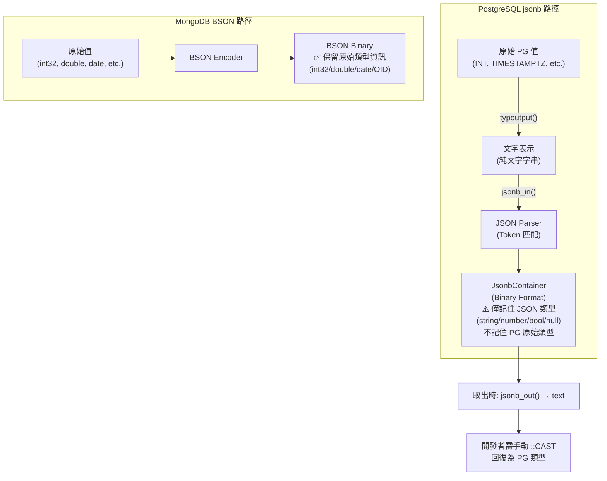
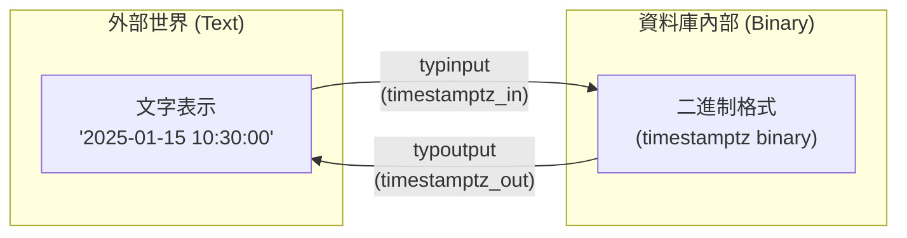
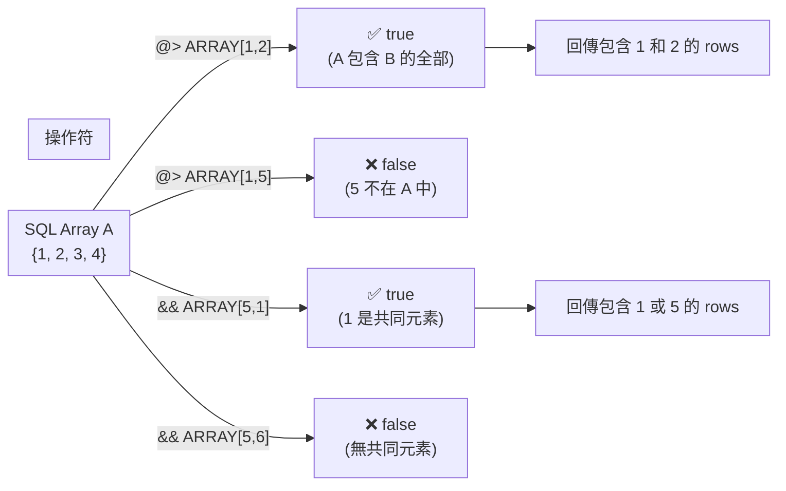
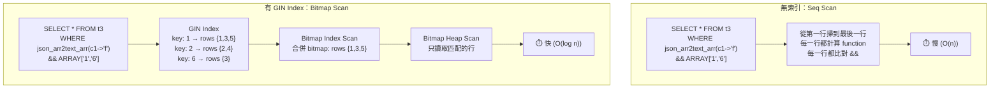
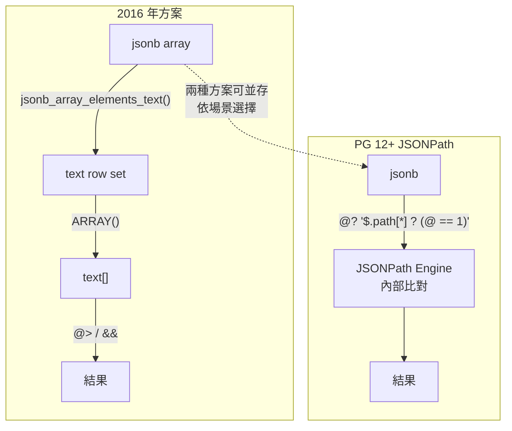
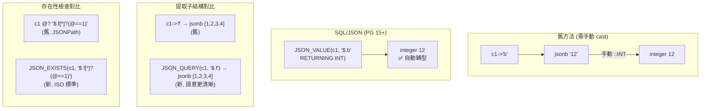
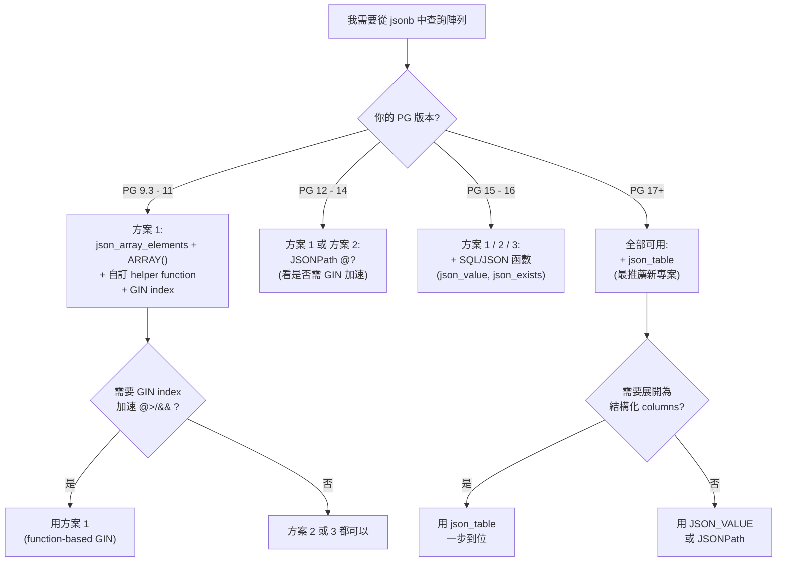
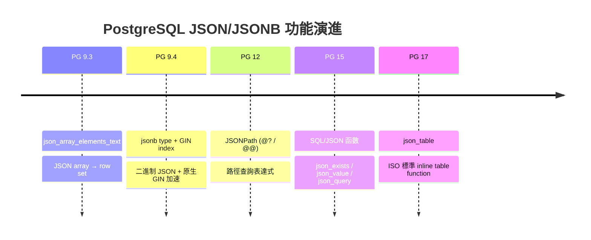

# PostgreSQL JSON/JSONB Deep Dive: 類型構造到陣列查詢

> 本文合併兩篇 PostgreSQL JSON/JSONB 技術筆記，按照從基礎到應用的順序組織：
>
> - **第一章**（JSON Type Construction）：從 JSONB 的 scalar type 規範開始，深入 parser 內部源碼（`parse_scalar`、`json_lex`、escape handler），再到 type I/O function 機制、`format() + jsonb_in()` 構造法、BYTEA escape 限制等。這是理解 JSONB 在 PostgreSQL 內部如何運作的基礎。
> - **第二章**（Array Extraction & Querying）：從 `->` / `->>` 操作符開始，覆蓋 2016 年經典的 `json_array_elements + ARRAY()` 方案、function-based GIN index 加速、以及 PG 12–17 的現代化方案（JSONPath、SQL/JSON `json_value`/`json_table`），最後給出三種方案的選擇矩陣與版本演進總表。
>
> 建議按順序閱讀——第一章的 parser 知識能幫助你在遇到第二章的查詢錯誤時理解底層原因。

---

# 一、JSON/JSONB Value Types 與構造方法

> 來源：[digoal - PostgreSQL json jsonb 支持的value数据类型，如何构造一个jsonb (2015-09-24)](https://github.com/digoal/blog/blob/master/201509/20150924_03.md)

---

## 1. JSON 支援的 Scalar Types（區分大小寫）

### 新手入門：什麼是 Scalar Type？

在 JSON 的世界裡，一個 JSON 值可以是**物件（object）**、**陣列（array）**、或者**純量（scalar）**──純量就是無法再拆分的單一值，例如一個數字 `42`、一個字串 `"hello"`、一個布林值 `true`。這就像程式語言的「基本型別」，是最底層的資料單元。

PostgreSQL JSON 的 value 支援以下 5 種 scalar types，**嚴格區分大小寫**：

| Scalar Type | 合法寫法 | 非法寫法 | 白話說明 |
|-------------|---------|---------|----------|
| string | `"abc"` | — | 必須用雙引號包起來 |
| number | `10.001` | — | 整數或小數，不加引號 |
| boolean true | `true` | `TRUE`、`True` | 只能全小寫 |
| boolean false | `false` | `FALSE`、`False` | 只能全小寫 |
| null | `null` | `NULL`、`Null` | 只能全小寫 |

> **為什麼大小寫這麼嚴格？** 因為 JSON 是一個獨立標準（RFC 7159），不是 SQL。SQL 不區分大小寫（`SELECT` = `select`），但 JSON 區分。PostgreSQL 的 JSON parser 忠實遵循 JSON 標準，所以在這裡 `TRUE` 和 `true` 是兩個完全不同的東西──前者不合法。

### 解析過程視覺化

```mermaid
flowchart LR
    A["輸入: {\"a\": true}"] --> B["json_lex()\n掃描 bytes"]
    B --> C{"遇到字母 t"}
    C --> D["收集連續字母\n→ \"true\" (4 bytes)"]
    D --> E{"memcmp(s, \"true\", 4)\n== 0?"}
    E -->|是| F["✅ JSON_TOKEN_TRUE"]
    E -->|否| G["❌ report_invalid_token"]

    A2["輸入: {\"a\": TRUE}"] --> B2["json_lex()\n掃描 bytes"]
    B2 --> C2{"遇到字母 T"}
    C2 --> D2["收集連續字母\n→ \"TRUE\" (4 bytes)"]
    D2 --> E2{"memcmp(s, \"true\", 4)\n== 0?"}
    E2 -->|否| G2["❌ report_invalid_token\n→ ERROR!"]
```

### 實測：

```sql
SELECT jsonb '{"a": true}';       -- OK
SELECT jsonb '{"a": TRUE}';       -- ERROR: Token "TRUE" is invalid
SELECT jsonb '{"a": false}';      -- OK
SELECT jsonb '{"a": NULL}';       -- ERROR: Token "NULL" is invalid
SELECT jsonb '{"a": null}';       -- OK
SELECT jsonb '{"a": 10.001}';     -- OK
SELECT jsonb '{"a": "10.001"}';   -- OK (string, not number)
```

這源於 `src/backend/utils/adt/json.c` 中 `parse_scalar()` 的實作。Parser 對每個 token 做精確的 byte-level 匹配，`true` 必須是 4 bytes、`false` 必須是 5 bytes、`null` 必須是 4 bytes，且大小寫敏感。

### 原始碼解讀：parse_scalar()

這個函數是 JSON parser 中負責「讀取並驗證單一純量值」的核心。它的工作流程很直覺：先偷看下一個 token 是什麼類型，然後根據類型分支處理。

```c
static inline void
parse_scalar(JsonLexContext *lex, JsonSemAction *sem)
{
    char       *val = NULL;
    json_scalar_action sfunc = sem->scalar;
    char      **valaddr;
    JsonTokenType tok = lex_peek(lex);

    valaddr = sfunc == NULL ? NULL : &val;

    /* a scalar must be a string, a number, true, false, or null */
    switch (tok)
    {
        case JSON_TOKEN_TRUE:
            lex_accept(lex, JSON_TOKEN_TRUE, valaddr);
            break;
        case JSON_TOKEN_FALSE:
            lex_accept(lex, JSON_TOKEN_FALSE, valaddr);
            break;
        case JSON_TOKEN_NULL:
            lex_accept(lex, JSON_TOKEN_NULL, valaddr);
            break;
        case JSON_TOKEN_NUMBER:
            lex_accept(lex, JSON_TOKEN_NUMBER, valaddr);
            break;
        case JSON_TOKEN_STRING:
            lex_accept(lex, JSON_TOKEN_STRING, valaddr);
            break;
        default:
            report_parse_error(JSON_PARSE_VALUE, lex);
    }
    if (sfunc != NULL)
        (*sfunc) (sem->semstate, val, tok);
}
```

**白話翻譯：**
1. `lex_peek(lex)` → 「偷看一下，下一個 token 是啥類型？」（不消耗輸入）
2. `switch (tok)` → 如果是 `true`/`false`/`null`/數字/字串 → 呼叫 `lex_accept()` 正式讀取這個 token
3. 如果都不是 → 「報錯！這不是合法的 JSON 純量值」
4. 如果註冊了 callback (`sfunc`) → 把讀到的值和類型傳給上層處理

Parser context 的 enum（只用於 parser 狀態管理，與 JSONB 內部存儲無關）：

```c
typedef enum  /* contexts of JSON parser */
{
    JSON_PARSE_VALUE,
    JSON_PARSE_STRING,
    JSON_PARSE_ARRAY_START,
    JSON_PARSE_ARRAY_NEXT,
    JSON_PARSE_OBJECT_START,
    JSON_PARSE_OBJECT_LABEL,
    JSON_PARSE_OBJECT_NEXT,
    JSON_PARSE_OBJECT_COMMA,
    JSON_PARSE_END
} JsonParseContext;
```

這個 enum 描述的是 parser 在解析過程中所處的「上下文」（類似於「我現在在讀物件的第一個 key」、「我現在在期待一個逗號或結束符」），它只是 parser 內部的狀態機標記，與最終存入磁碟的 jsonb 二進制格式無關。

> 補充（Senior Dev）：JSONB 內部實際上是 binary format（`JsonbContainer` / `JsonbValue`），並非真正的純字串。文章說「JSONB 內部就是一個有一定規則的字串」是指 **從 text 解析為 jsonb 時** Postgres 只做 token 匹配，不保留原始 type metadata。例如 `10` 和 `10.0` 存入 jsonb 後都是 numeric scalar，無法區分原始是 integer 還是 float。這與 MongoDB BSON 保留 `int32` / `int64` / `double` 的設計不同。

---

## 2. jsonb 的內部類型本質

jsonb 內部**沒有**類型概念。Parser 看到的 TOKEN 只是字串匹配。關鍵理解：

- `JSON_TOKEN_TRUE` / `JSON_TOKEN_FALSE` / `JSON_TOKEN_NULL` / `JSON_TOKEN_NUMBER` / `JSON_TOKEN_STRING` 是 **parser token type**，不是 JSONB 的內部 type
- JSONB 存儲的是 binary representation，但在 text↔jsonb 轉換過程中，Postgres 不保留原始 PG type 信息
- 如果你需要把 `int8range`、`geometry`、`timestamptz` 等 PG 內部 type 塞進 jsonb 並**能原樣取回**，必須透過 type I/O function 做 text 橋接

### 新手視角：為什麼 jsonb 不記類型？

想像你在寫一個筆記本。JSON 格式就像你用**文字**寫下來的筆記：
```json
{"age": 30, "name": "Alice"}
```
這裡 `30` 是一個數字，`"Alice"` 是一個字串。但你把它們存進 jsonb 後，PostgreSQL 記住的是「這裡有一個數字」而非「這裡有一個 Integer」──它不知道這個數字在存入前是 Postgres 的 `INT`、`BIGINT`、還是 `NUMERIC`。

這和 MongoDB 不同。MongoDB 的 BSON 格式會記住：「這個欄位是 `int32`，值為 30」，所以取出來你還能知道它是 32-bit 整數。PostgreSQL 的 jsonb 則說：「就是個數字，你自己決定要 cast 成什麼類型。」



> **一句話總結**：jsonb 是「用 JSON 標準描述資料」的容器。它只保證 JSON 層面的類型（string/number/bool/null/object/array），不保證 PostgreSQL 層面的類型。想要保留 PG 類型 → 走 text 轉換（見下一節）。

> 補充（Senior Dev）：MongoDB BSON 有 `$type` operator 可查 field 的 binary type（string / int / double / date / objectid 等）。Postgres jsonb 沒有對等機制——`jsonb_typeof()` 只返回 `string` / `number` / `boolean` / `null` / `object` / `array`，無法區分 `number` 是 int 還是 float。這在跨系統數據交換時是需要注意的精度風險點。

---

## 3. Type I/O Function 機制

### 新手入門：資料庫裡的值是怎麼「變來變去」的？

在 PostgreSQL 中，每一個資料型別都有**兩道門**：
1. **輸入門（typinput）**：把人類可讀的文字轉換成資料庫內部的二進制格式。例如把字串 `"2025-01-15"` 變成機器內部的日期表示法。
2. **輸出門（typoutput）**：把內部的二進制格式轉回人類可讀的文字。例如把日期還原成 `"2025-01-15"`。

這就像翻譯官：typinput 把「中文」翻成「內部密碼」，typoutput 把「內部密碼」翻回「中文」。jsonb 就是利用這兩道門，把任何 PG 型別的文字表示塞進 JSON 結構中。



Postgres 每個 type 都有 `typinput` 和 `typoutput` function（定義在 `pg_type` catalog），負責 text ↔ binary 的轉換：

```sql
SELECT oid, typname, typinput, typoutput
FROM pg_type WHERE typname = 'timestamptz';
```

| 屬性 | 值 | 作用 | 白話 |
|------|-----|------|------|
| `oid` | 1184 | type OID | 這個型別的內部位 ID |
| `typinput` | `timestamptz_in` | text → binary | 文字讀入轉二進制 |
| `typoutput` | `timestamptz_out` | binary → text | 二進制輸出轉文字 |

### 實際演練：typmod 的作用

`typmod` 是 PostgreSQL 中控制型別「精度或長度」的參數。對於 `timestamptz`，它控制小數秒的位數；對於 `varchar`，它控制最大長度；對於 `numeric`，它控制總位數和小數位數。

```sql
SELECT timestamptz_out(now());
-- 2015-09-24 19:44:16.076233+08

SELECT timestamptz_in('2015-09-24 19:44:16.076233+08', 1184, 1);
-- 2015-09-24 19:44:16.1+08      (typmod=1, 精度被截斷到1位小數秒)

SELECT timestamptz_in('2015-09-24 19:44:16.076233+08', 1184, 6);
-- 2015-09-24 19:44:16.076233+08 (typmod=6, 保留完整精度)
```

`typmod`（第三個參數）控制精度/長度（如 `varchar(N)` 的 N、`numeric(P,S)` 的 P,S、`timestamptz(P)` 的 P）。對 `jsonb_in()` 來說，typmod 固定為 -1（無限制）。

來自 `src/backend/utils/adt/varlena.c` 中的 `text_format()`（PostgreSQL 的格式化引擎，類似 C 語言的 `sprintf`）：

```c
/*
 * Returns a formatted string
 */
Datum
text_format(PG_FUNCTION_ARGS)
{
    ...
}
```

> **理解關鍵**：這個 I/O 機制提供了「可逆性」──用 typoutput 輸出文字，再用 typinput 讀回來，得到的值和原始值一模一樣（只要 typmod 一致）。這是我們能把任何類型塞進 jsonb 的理論基礎：因為 jsonb 可以存文字，而任何 PG 型別都能變成文字（typoutput），也能從文字還原（typinput）。

> 補充（Senior Dev）：這個 I/O function 機制是 Postgres type system 的核心——每個 type 的 text ↔ binary 轉換都是 reversible（`typoutput ∘ typinput = identity`）。因此你可以把任何 type **經由 text** 塞進 jsonb 再取出，只要 text representation 沒變。這也是為什麼 jsonb 不存內部 type：它依賴 text 的 self-describing 特性。

---

## 4. format() + jsonb_in() 構造法

### 新手入門：為什麼需要 format() + jsonb_in()？

假設你想要把一個 `int8range(1,10)`（一個從 1 到 10 的整數範圍）存入 jsonb。直接放？不行──`int8range` 是一個 PostgreSQL 專屬的複合型別，JSON 標準裡根本沒有「範圍」這個概念。

`format()` + `jsonb_in()` 的思路是：
1. 先用 `format()` 把 PG 值變成文字，手動組裝成一個合法的 JSON 字串
2. 再用 `jsonb_in()` 把這個 JSON 字串解析為 jsonb 二進制格式

這就像「自己寫一封 JSON 格式的信，然後交給郵局（jsonb_in）確認格式正確後寄出」。

```mermaid
flowchart TD
    subgraph STEP1["Step 1: format() 產生 JSON 文字"]
        V1["int8range(1,10)"] -->|"typoutput"| T1["'[1,10)'"]
        T1 -->|"format() 組裝"| J1["'{\"K\": \"[1,10)\"}'"]
    end

    subgraph STEP2["Step 2: jsonb_in() 解析"]
        J1 -->|"jsonb_in()"| JB["jsonb 二進制"]
    end

    subgraph STEP3["Step 3: 取出"]
        JB -->|"->>'K'"| T2["'[1,10)' (text)"]
        T2 -->|"::int8range"| V2["int8range(1,10)\n✅ 成功還原!"]
    end
```

### I. 基本模式

```sql
-- Step 1: 用 format 產生 json 字串
SELECT format('{"K": "%s"}', int8range(1,10));
-- {"K": "[1,10)"}

-- Step 2: jsonb_in 解析
SELECT jsonb_in(format('{"K": "%s"}', int8range(1,10))::cstring);
-- {"K": "[1,10)"}

-- Step 3: 取出 element
SELECT jsonb_in(format('{"K": "%s"}', int8range(1,10))::cstring) ->> 'K';
-- [1,10)

-- Step 4: 轉回原 type
SELECT (jsonb_in(format('{"K": "%s"}', int8range(1,10))::cstring) ->> 'K')::int8range;
-- [1,10)
```

### II. 完整建構 / 提取 / 還原 demo

```sql
-- 存入：同時塞入時間戳和範圍型別
SELECT jsonb_in(format('{"ts": "%s", "rng": "%s"}',
    now(),
    int8range(1,10)
)::cstring);
-- {"ts": "2015-09-24 19:44:16.076233+08", "rng": "[1,10)"}

-- 取出並還原
WITH src AS (
    SELECT jsonb_in(format('{"ts": "%s", "rng": "%s"}',
        now()::timestamptz,
        int8range(1,10)
    )::cstring) AS data
)
SELECT
    (data ->> 'ts')::timestamptz AS ts,
    (data ->> 'rng')::int8range AS rng
FROM src;
```

> 補充（Senior Dev）：現代 PG（9.4+）提供了更簡潔的 native 構造方式，在多數場景下應優先使用：
> ```sql
> -- PG 9.4+: jsonb_build_object（直接建構，自動處理 escape）
> SELECT jsonb_build_object('ts', now(), 'rng', int8range(1,10));
>
> -- PG 9.5+: 直接 concatenation（合併兩個 jsonb）
> SELECT jsonb_build_object('a', 1) || jsonb_build_object('b', 2);
>
> -- PG 11+: jsonb 支援 TRANSFORM FOR TYPE（plpgsql 中自動轉換）
> ```
> `format() + jsonb_in()` 模式的優勢在於：你**完全控制 text representation**（如 timestamp 格式、range 邊界符號），這在需要自訂序列化格式時有用。但劣勢是性能較差（多一次 text ↔ binary 轉換）且要處理 escape。

---

## 5. BYTEA 的 Escape 限制

### 新手入門：什麼是 BYTEA？為什麼它和 JSON 會衝突？

`bytea` 是 PostgreSQL 儲存「原始二進位資料」的型別──圖片、加密後的資料、任何無法用文字表示的位元組序列。當你試著把 `bytea` 塞進 jsonb 時，會遇到一個經典的**轉義衝突**：

- `bytea` 的 hex 輸出格式以 `\x` 開頭（例如 `\xe4bda0e5a5bd` 表示「你好」的 UTF-8 編碼）
- JSON parser 看到反斜線 `\` 時，會期待它後面跟著合法的 JSON escape 字元（如 `\"`, `\\`, `\n` 等）
- `\x` 不在 JSON 標準的合法 escape 清單中 → **直接報錯**

```mermaid
flowchart TD
    A["'你好'::bytea\n(中文的二進制表示)"] -->|"bytea_out()\nhex 模式"| B["\xe4bda0e5a5bd"]
    B -->|"format() 組裝"| C["{\"K\": \"\\xe4bda0e5a5bd\"}"]
    C -->|"jsonb_in()"| PARSER["JSON Parser\n(json_lex_string)"]

    PARSER -->|"讀到 \\"| CHECK{"下一個字元是?"}
    CHECK -->|"\" / \\ / /"| OK["✅ 合法 escape"]
    CHECK -->|"b / f / n / r / t"| OK
    CHECK -->|"x"| ERR["❌ ERROR:\nEscape sequence \"\\x\" is invalid."]
```

試圖將 `bytea` 塞進 jsonb 時，會遇到 escape 衝突：

```sql
SELECT format('{"K": "%s"}', '你好'::bytea);
-- {"K": "\xe4bda0e5a5bd"}
```

`bytea_out()` 輸出的 hex format 使用 `\x` prefix，但 JSON parser 的 escape handler 不認得 `\x`：

```sql
\set VERBOSITY verbose
SELECT jsonb_in(format('{"K": "%s"}', '你好'::bytea)::cstring);
-- ERROR: 22P02: invalid input syntax for type json
-- DETAIL: Escape sequence "\x" is invalid.
```

Source code 中的 escape handler（`json_lex_string()`）── 這個函數負責在遇到雙引號內部時，逐字元掃描並處理轉義序列：

```c
static inline void
json_lex_string(JsonLexContext *lex)
{
    ...
    switch (*s)
    {
        case '"':
        case '\\':
        case '/':
            appendStringInfoChar(lex->strval, *s);
            break;
        case 'b':
            appendStringInfoChar(lex->strval, '\b');
            break;
        case 'f':
            appendStringInfoChar(lex->strval, '\f');
            break;
        case 'n':
            appendStringInfoChar(lex->strval, '\n');
            break;
        case 'r':
            appendStringInfoChar(lex->strval, '\r');
            break;
        case 't':
            appendStringInfoChar(lex->strval, '\t');
            break;
        default:
            /* Not a valid string escape, so error out. */
            lex->token_terminator = s + pg_mblen(s);
            ereport(ERROR,
                (errcode(ERRCODE_INVALID_TEXT_REPRESENTATION),
                 errmsg("invalid input syntax for type json"),
                 errdetail("Escape sequence \"\\%s\" is invalid.",
                           extract_mb_char(s)),
                 report_json_context(lex)));
    }
```

Parser 只處理 JSON standard 的 escape：`"` `\\` `/` `\b` `\f` `\n` `\r` `\t`。任何其他 escape 都會報錯。

### I. Workaround：Output Escape 模式

修改 `json_lex_string()` 後（或使用 native 函數跳過 escape），可達成存入 bytea 並提取還原：

```sql
-- 取出為 hex string（無 \x prefix）
SELECT jsonb_in(format('{"K": "%s"}', '你好'::bytea)::cstring) ->> 'K';
-- e4bda0e5a5bd

-- 還原：手動補回 \x prefix
SELECT convert_from(
    byteain(('\x' || (
        jsonb_in(format('{"K": "%s"}', '你好'::bytea)::cstring) ->> 'K'
    ))::cstring),
    'utf8'::name
);
-- 你好
```

> 補充（Senior Dev）：PG 9.5+ 有更好的方案。`bytea` 的 output 可設定為 `escape` 格式（`SET bytea_output = 'escape'`），此時 `\x` 變為 `\` octet 表示法。PG 9.6+ 可以直接用 `encode()` / `decode()` 配合 `base64` 來避免 escape 衝突：
> ```sql
> -- PG 9.6+: 使用 base64 encode 避開 JSON escape
> SELECT jsonb_build_object('data', encode('你好'::bytea, 'base64'));
> -- {"data": "5L2g5aW9"}
>
> SELECT decode(('{"data": "5L2g5aW9"}'::jsonb ->> 'data'), 'base64');
> -- \xe4bda0e5a5bd
> ```
> 如果你的場景是將 binary data 存進 jsonb，`base64` encode 是通用且安全的做法，跨資料庫兼容性也好。
>
> 關於 `format()` 的另一個陷阱：`%s` 會呼叫類型的 `typoutput` function，而某些類型的 output 包含 control character 或 backslash（如 `point` 類型的 `(1,2)`、`box` 類型的 `(1,2),(3,4)`），這些括號/逗號不會被 JSON parser 誤解因為它們在 quoted string 內。但若類型的 output 本身帶 `"` 字元，format 產出的 JSON 就會損壞——這是一個邊際案例，建議在 production 中優先使用 `jsonb_build_object()` 來避免手動組裝 JSON string 的風險。

---

## 6. json_lex() 完整 Tokenizer 邏輯

### 新手入門：什麼是 Tokenizer？

Tokenizer（分詞器）是 parser 的第一道關卡。它的工作就是把一串字元流（`{"a": 1}`）切成一個個有意義的「詞彙（token）」：

```
輸入: { " a " :   1   }
      ↓  ↓  ↓  ↓  ↓   ↓
Token: {  "a" :  1  }
       ↑  ↑   ↑  ↑  ↑   ↑
       物件  字串  冒號  數字  物件
       開始           結束
```

就像你讀英文句子時會自然地把字和標點分開一樣，Tokenizer 把 JSON 字串拆成 token，後面的 parser 才知道該如何處理。

```mermaid
flowchart TD
    START["輸入字串: {\"key\": 123, \"flag\": true}"] --> SKIP["1️⃣ 跳過空白字元\n(space, tab, newline, CR)"]
    SKIP --> FIRST{"2️⃣ 讀取第一個\n非空白字元"}

    FIRST -->|"{"| OBJ_S["OBJECT_START"]
    FIRST -->|"}"| OBJ_E["OBJECT_END"]
    FIRST -->|"["| ARR_S["ARRAY_START"]
    FIRST -->|"]"| ARR_E["ARRAY_END"]
    FIRST -->|","| COMMA["COMMA"]
    FIRST -->|":"| COLON["COLON"]
    FIRST -->|"引號\""| STRING_FN["3️⃣ json_lex_string()\n→ STRING token\n處理 escape、unicode"]
    FIRST -->|"-" 或 "0-9"| NUM_FN["3️⃣ json_lex_number()\n→ NUMBER token\n處理整數/小數/科學記號"]
    FIRST -->|"其他字母"| ALPHA{"4️⃣ 收集連續\n英數字元"}

    ALPHA -->|"4 bytes: \"true\""| TRUE_T["TRUE token"]
    ALPHA -->|"4 bytes: \"null\""| NULL_T["NULL token"]
    ALPHA -->|"5 bytes: \"false\""| FALSE_T["FALSE token"]
    ALPHA -->|"其他"| ERR["❌ invalid token error"]

    OBJ_S --> NEXT["5️⃣ 回到步驟1\n繼續掃描下一個 token"]
    OBJ_E --> NEXT
    ARR_S --> NEXT
    ARR_E --> NEXT
    COMMA --> NEXT
    COLON --> NEXT
    STRING_FN --> NEXT
    NUM_FN --> NEXT
    TRUE_T --> NEXT
    FALSE_T --> NEXT
    NULL_T --> NEXT
```

### 關鍵細節：`true`/`null` vs `false` 的分支邏輯

原始碼中有一個值得注意的實現細節：`true`（4 bytes）和 `null`（4 bytes）共用同一個 `if` 分支，而 `false`（5 bytes）獨佔另一個分支。這意味著：
- 輸入 `tree` → 4 bytes → 先比對 `"true"`（失敗）→ 再比對 `"null"`（失敗）→ 報錯
- 輸入 `falsy` → 5 bytes → 比對 `"false"`（失敗）→ 報錯
- 輸入 `tru` → 3 bytes → 直接報錯（因為 `JSON_ALPHANUMERIC_CHAR` 循環只收集了 3 個字元後就遇到非字母字元，檢查 `p - s == 4` 和 `p - s == 5` 都失敗）

`json_lex()` 是 JSON parser 的 tokenizer，負責將輸入 stream 切分為 token（跳過 whitespace `' '` `'\t'` `'\n'` `'\r'`）。其 switch-case 完整覆蓋：

- `{` `}` → `JSON_TOKEN_OBJECT_START` / `END`
- `[` `]` → `JSON_TOKEN_ARRAY_START` / `END`
- `,` `:` → `JSON_TOKEN_COMMA` / `COLON`
- `"` → `json_lex_string()` → `JSON_TOKEN_STRING`
- `-` → `json_lex_number()` with leading minus → `JSON_TOKEN_NUMBER`
- `0-9` → `json_lex_number()` → `JSON_TOKEN_NUMBER`
- 其他 alpha token：匹配 `true`(4) / `false`(5) / `null`(4)，否則報錯

```c
static inline void
json_lex(JsonLexContext *lex)
{
    char       *s;
    int         len;

    /* Skip leading whitespace. */
    s = lex->token_terminator;
    len = s - lex->input;
    while (len < lex->input_length &&
           (*s == ' ' || *s == '\t' || *s == '\n' || *s == '\r'))
    {
        if (*s == '\n')
            ++lex->line_number;
        ++s;
        ++len;
    }
    lex->token_start = s;

    /* Determine token type. */
    if (len >= lex->input_length)
    {
        lex->token_start = NULL;
        lex->prev_token_terminator = lex->token_terminator;
        lex->token_terminator = s;
        lex->token_type = JSON_TOKEN_END;
    }
    else
        switch (*s)
        {
            case '{': lex->token_type = JSON_TOKEN_OBJECT_START;  break;
            case '}': lex->token_type = JSON_TOKEN_OBJECT_END;    break;
            case '[': lex->token_type = JSON_TOKEN_ARRAY_START;   break;
            case ']': lex->token_type = JSON_TOKEN_ARRAY_END;     break;
            case ',': lex->token_type = JSON_TOKEN_COMMA;         break;
            case ':': lex->token_type = JSON_TOKEN_COLON;         break;
            case '"': json_lex_string(lex);
                      lex->token_type = JSON_TOKEN_STRING;         break;
            case '-': json_lex_number(lex, s + 1, NULL);
                      lex->token_type = JSON_TOKEN_NUMBER;         break;
            case '0' ... '9':
                      json_lex_number(lex, s, NULL);
                      lex->token_type = JSON_TOKEN_NUMBER;         break;
            default:
            {
                char *p;
                for (p = s; p - s < lex->input_length - len
                     && JSON_ALPHANUMERIC_CHAR(*p); p++) /* skip */;
                if (p == s)
                    report_invalid_token(lex);
                lex->prev_token_terminator = lex->token_terminator;
                lex->token_terminator = p;
                if (p - s == 4)
                {
                    if (memcmp(s, "true", 4) == 0)
                        lex->token_type = JSON_TOKEN_TRUE;
                    else if (memcmp(s, "null", 4) == 0)
                        lex->token_type = JSON_TOKEN_NULL;
                    else
                        report_invalid_token(lex);
                }
                else if (p - s == 5 && memcmp(s, "false", 5) == 0)
                    lex->token_type = JSON_TOKEN_FALSE;
                else
                    report_invalid_token(lex);
            }
        }
}
```

**白話翻譯**：
1. 前面那塊是「跳空格」──把 `\s`, `\t`, `\n`, `\r` 全部跳過
2. 中間 `switch(*s)` 是「看第一個字元決定是什麼 token」──`{` → 物件開始、`"` → 字串、`-` 或數字 → 數字
3. 最後的 `default` 分支處理 `true`/`false`/`null`──透過比對 byte 長度和內容來判斷

> 補充（Senior Dev）：注意 `true` 和 `null` 共用 4-byte 分支、`false` 獨佔 5-byte 分支。這意味著 `tree`、`nullx` 等 4-byte 非標準 token 會進入 `true`/`null` 的 `memcmp` 檢查後才報錯（而非直接被 `JSON_ALPHANUMERIC_CHAR` 循環找到的長度觸發），`falsy` 同理。這不會影響正確性但對 custom JSON extension（如 pg_cron 的 JSON config parser）是值得注意的實現細節。

---

# 二、JSON/JSONB 陣列提取與查詢

> 來源：[digoal - 如何从PostgreSQL json中提取数组 (2016-09-10)](https://github.com/digoal/blog/blob/master/201609/20160910_01.md)
>
> 更新於 2026-05-17，補充 JSONPath / SQL/JSON 標準函數 / json_table 演進

---

## 1. JSON Value Type 與提取基礎

### 新手入門：jsonb 裡的值是什麼類型？

當你把資料存進 jsonb 欄位後，PostgreSQL 提供了兩個工具來檢查和提取這些值：

- **`jsonb_typeof()`**：告訴你某個 jsonb 值在 JSON 標準中是什麼類型（object/array/string/number/boolean/null）
- **`->` / `->>`**：從 jsonb 結構中提取（extract）某個 key 的值或陣列的某個元素

這就像在 JavaScript 中操作 JSON 物件：`obj.key` 取出值，`typeof obj.key` 檢查類型。但 PostgreSQL 的規則是：`->` 返回的**仍然是 jsonb**（不是 SQL 原生型別），這點新手很容易搞混。

```mermaid
flowchart LR
    subgraph JSONB["jsonb column: c1"]
        J["{\"a\":\"v\", \"b\":12, \"f\":[1,2,3,4]}"]
    end

    J -->|"c1->'a'"| A["\"v\" (jsonb)\njsonb_typeof: string"]
    J -->|"c1->>'a'"| A2["v (text)"]
    J -->|"c1->'b'"| B["12 (jsonb)\njsonb_typeof: number"]
    J -->|"c1->'f'"| C["[1,2,3,4] (jsonb)\njsonb_typeof: array"]
    J -->|"c1->'f'->0"| D["1 (jsonb)\njsonb_typeof: number"]

    C -->|"⚠️ 不是 SQL array!\n不能直接用在\nWHERE col IN (...)"| WARN["必須先轉換\n為 SQL array"]
```

### I. json_typeof / jsonb_typeof

```sql
SELECT jsonb_typeof(c1), c1 FROM t3;
```

支援 type：`object`, `array`, `string`, `number`, `boolean`, `null`。

### II. -> 與 ->> 操作符

| 操作符 | 返回 type | 範例 | 白話說明 |
|--------|----------|------|----------|
| `->'key'` | json/jsonb（保留原始類型） | `c1->'f'` → `[1,2,3,4]` (jsonb) | 「取出 key，保持 jsonb 格式」 |
| `->>'key'` | text | `c1->>'f'` → `[1,2,3,4]` (text) | 「取出 key，轉成純文字」 |
| `->N` | json/jsonb（陣列索引，從0開始） | `c1->'f'->0` → `1` | 「取出陣列第 N 個元素」 |

> **記憶技巧**：`->` 有「箭頭」→ 返回的還是 jsonb（保持結構），`->>` 多一個 `>`→ 更進一步變成 text（攤平）。

完整演示（jsonb）：

```sql
CREATE TABLE t3 (c1 JSONB);
INSERT INTO t3 VALUES ('{
  "a":"v", "b":12, "c":{"ab":"hello"}, "d":12.3,
  "e":true, "f":[1,2,3,4], "g":["a","b"]
}');

SELECT pg_typeof(col), jsonb_typeof(col), col
FROM (SELECT c1->'a' col FROM t3) t;
--  pg_typeof | jsonb_typeof | col
-- -----------+--------------+-----
--  jsonb     | string       | "v"

SELECT pg_typeof(col), jsonb_typeof(col), col
FROM (SELECT c1->'f' col FROM t3) t;
--  pg_typeof | jsonb_typeof | col
-- -----------+--------------+--------------
--  jsonb     | array        | [1,2,3,4]
```

關鍵認知：`->` 返回的仍是 json/jsonb type（不是 native SQL type），即使 `jsonb_typeof` 判斷為 array，PG 仍視為 jsonb。**這是你不能用 `WHERE col IN (1,2,3)` 來查詢 jsonb 陣列的根本原因**──你必須先把它轉換成 SQL 陣列（`int[]` 或 `text[]`）。

---

## 2. 2016 年方案：json_array_elements + ARRAY 構造器

### 新手入門：為什麼需要把 JSON 陣列轉成 SQL 陣列？

這是本章最核心的問題。假設你有一個 jsonb 欄位 `c1`，裡面存了 `{"f": [1, 2, 3, 4, 5, 6]}`。你想查「哪些 row 的 `f` 陣列包含數字 3？」

直覺寫法：
```sql
SELECT * FROM t3 WHERE c1->'f' @> 3;  -- ❌ 不行！c1->'f' 是 jsonb，不是 int[]
```

因為 `c1->'f'` 返回的是 jsonb（型別是 `jsonb`，值是 `[1,2,3,4,5,6]`），PostgreSQL 的陣列操作符（`@>` 包含、`&&` 重疊）只能用在 SQL 原生陣列（`int[]`、`text[]`）上，不能用在 jsonb 上。

**解決方案**：把 jsonb 陣列 → 展開成 row set → 重新打包成 SQL 陣列。這是一個三步驟的轉換流程。

```mermaid
flowchart TD
    subgraph INPUT["輸入"]
        JB["jsonb column\n{\"a\":\"B\", \"b\":[1,2,3,4,5,6]}"]
    end

    JB -->|"->'b'"| ARR["jsonb array value\n[1,2,3,4,5,6]\n(pg_typeof: jsonb)"]

    ARR -->|"jsonb_array_elements_text()\n展開為 row set"| RS["Row Set (6 rows)\n1\n2\n3\n4\n5\n6\n(pg_typeof: text)"]

    RS -->|"ARRAY()\n建構子"| SQL_ARR["SQL Array\ntext[]: {1,2,3,4,5,6}"]

    SQL_ARR -->|"::INT[]"| INT_ARR["SQL Array\nint[]: {1,2,3,4,5,6}"]

    INT_ARR -->|"@> ARRAY[3]\n&& ARRAY[1,6]"| QUERY["可用原生陣列操作符\n進行查詢!"]
```

### I. Step 1：JSON array → row set

將 jsonb 中的陣列「爆開」成一行一行的資料：

```sql
SELECT jsonb_array_elements_text('{"a":"B","b":[1,2,3,4,5,6]}'::jsonb->'b');
--  col
-- -----
--  1
--  2
--  3
--  4
--  5
--  6
-- pg_typeof: text
```

`jsonb_array_elements_text()` 將 JSON array 展開為 text row set。對應 json 版為 `json_array_elements_text()`。

> **注意**：`jsonb_array_elements_text()` 回傳的是 text，不是 jsonb！如果你需要保留 jsonb 型別，用 `jsonb_array_elements()`（無 `_text` 後綴）。

### II. Step 2：row set → SQL array

用 `ARRAY()` 建構子把 row set 包回 SQL 陣列：

```sql
SELECT ARRAY(
  SELECT jsonb_array_elements_text('{"a":"B","b":[1,2,3,4,5,6]}'::jsonb->'b')
);
--  {1,2,3,4,5,6}
-- pg_typeof: text[]

SELECT ARRAY(
  SELECT (jsonb_array_elements_text('{"a":"B","b":[1,2,3,4,5,6]}'::jsonb->'b'))::INT
);
--  {1,2,3,4,5,6}
-- pg_typeof: integer[]
```

### III. Step 3：封裝為可重複使用的 Helper Function

每次都寫這麼長的 SQL 很麻煩，所以包成 function：

```sql
-- JSONB → text[]
CREATE OR REPLACE FUNCTION json_arr2text_arr(_js JSONB)
  RETURNS TEXT[] AS $$
  SELECT ARRAY(SELECT jsonb_array_elements_text(_js))
$$ LANGUAGE SQL IMMUTABLE;

-- JSON → text[]
CREATE OR REPLACE FUNCTION json_arr2text_arr(_js JSON)
  RETURNS TEXT[] AS $$
  SELECT ARRAY(SELECT json_array_elements_text(_js))
$$ LANGUAGE SQL IMMUTABLE;

-- JSONB → int[]
CREATE OR REPLACE FUNCTION json_arr2int_arr(_js JSONB)
  RETURNS INT[] AS $$
  SELECT ARRAY(SELECT (jsonb_array_elements_text(_js))::INT)
$$ LANGUAGE SQL IMMUTABLE;
```

使用：

```sql
SELECT json_arr2text_arr(c1->'g') FROM t3;  -- {a,b}
SELECT json_arr2int_arr(c1->'f') FROM t3;   -- {1,2,3,4}
```

> **為什麼要標記 `IMMUTABLE`？** 這是為了讓 PostgreSQL 可以在 expression index 中使用這個 function（見第 4 節）。IMMUTABLE 代表「相同輸入永遠產出相同輸出」，這對索引是必需的。

---

## 3. 陣列查詢：@> / && 等操作符

### 新手入門：陣列操作符是做什麼的？

一旦 jsonb 陣列被轉換成 SQL 原生陣列（`int[]`、`text[]`），你就可以使用 PostgreSQL 內建的陣列操作符進行高效查詢。最常用的兩個：

- **`@>`（contains，包含）**：「陣列 A 是否**完全包含**陣列 B 的所有元素？」（A 是 B 的超集）
- **`&&`（overlaps，重疊）**：「陣列 A 和陣列 B 是否**有任何共同元素**？」



一旦 JSON array 轉為 native SQL array，即可使用 PostgreSQL 的陣列操作符：

```sql
-- @>  全包含（contains）——「陣列必須包含這些元素」
SELECT * FROM t3 WHERE json_arr2text_arr(c1->'g') @> ARRAY['a'];        -- 包含 a
SELECT * FROM t3 WHERE json_arr2int_arr(c1->'f') @> ARRAY[1,2];         -- 同時包含 1 和 2

-- &&  相交（overlaps）——「陣列只要包含其中任何一個元素」
SELECT * FROM t3 WHERE json_arr2int_arr(c1->'f') && ARRAY[1,6];         -- 包含 1 或 6

-- NOT &&  不相交——「陣列和這些元素沒有任何交集」
SELECT * FROM t3 WHERE NOT(json_arr2int_arr(c1->'f') && ARRAY[6]);      -- 不包含 6

-- 注意 type 一致：text 陣列 vs text value / int 陣列 vs int value
SELECT * FROM t3 WHERE NOT(json_arr2text_arr(c1->'f') && ARRAY['6']);   -- 對 text[] 用 '6'
```

> **常見錯誤**：`ARRAY[1]` 是 `int[]`，`ARRAY['1']` 是 `text[]`。它們不能互相匹配！如果你的 helper function 返回 `text[]`，就必須用 `ARRAY['1','6']`（帶引號）。

---

## 4. Index：GIN on Expression

### 新手入門：為什麼需要索引？什麼是 GIN？

當你對一個表執行 `WHERE` 查詢時，PostgreSQL 預設會從頭到尾掃描每一行（Seq Scan）。對於大表來說，這非常慢。

**索引**就像是書末的關鍵字索引：與其翻遍整本書找「索引」這個詞，不如直接翻到索引頁，找到第 4 章第 1 節。

**GIN（Generalized Inverted Index，通用倒排索引）**是專為「複合值」設計的索引類型。它不是為每一行建一個索引條目，而是為值中的**每個元素**建條目。例如 `{1,2,3,4}` 會被拆分為 4 個條目：`1`, `2`, `3`, `4`。這樣查「包含 `2` 的陣列」時，只需要查找 `2` 這個條目，瞬間找到所有相關的 rows。



```sql
-- 建立 function-based GIN index（將 JSON array 轉換結果索引化）
CREATE INDEX idx_t3_1 ON t3 USING GIN (json_arr2text_arr(c1->'f'));

SET enable_seqscan = off;

EXPLAIN SELECT * FROM t3 WHERE json_arr2text_arr(c1->'f') && ARRAY['1','6'];
--  Bitmap Heap Scan on t3  (cost=12.25..16.52 rows=1 width=32)
--    Recheck Cond: (json_arr2text_arr((c1 -> 'f'::text)) && '{1,6}'::text[])
--    ->  Bitmap Index Scan on idx_t3_1

EXPLAIN SELECT * FROM t3 WHERE json_arr2text_arr(c1->'f') @> ARRAY['1','6'];
--  Bitmap Heap Scan on t3
--    Recheck Cond: (json_arr2text_arr((c1 -> 'f'::text)) @> '{1,6}'::text[])
--    ->  Bitmap Index Scan on idx_t3_1
```

> **Bitmap Scan 是什麼？** GIN index 可能回傳多個符合條件的 row 位置。Bitmap Scan 先用 bitmap（點陣圖）整理這些位置，再一次性去 heap（資料頁）讀取實際資料，避免重複讀取同一頁。

> 補充（Senior Dev）：function-based GIN index 要求 function 標記為 `IMMUTABLE`。若 function 不是 IMMUTABLE（如依賴 GUC），index 將無法建立。上面 `json_arr2text_arr` 確實是 IMMUTABLE（純 JSONB → text[] 轉換，無外部依賴）。另外注意 `json_arr2text_arr(c1->'f')` 是一個 expression（表達式），不是單純的 column，所以這個 index 稱為 "expression index"。

---

## 5. 現代化方案：JSONPath（PG 12+）

### 新手入門：什麼是 JSONPath？

JSONPath 是一種**專門用來查詢 JSON 資料的路徑語言**，類似於 XPath 之於 XML、jq 之於命令列 JSON 處理。

語法舉例：
- `$.key` → 取出根物件的 `key` 屬性（`.` 相當於 `->`）
- `$.arr[*]` → 取出 `arr` 陣列中的所有元素（`*` 是萬用字元）
- `$.arr[*] ? (@ > 2)` → 取出 `arr` 陣列中大於 2 的元素（`?()` 是過濾條件，`@` 代表當前元素）

2016 年的方案需要手動把 jsonb 轉成 text[] 才能用 `@>` / `&&` 查詢。JSONPath 讓你直接在 jsonb 上寫查詢條件，省去轉換步驟。



2016 年的方案仍有效，但 PG 12 引入的 JSONPath 提供更強大的表達能力：

```sql
-- 查詢條件：JSON array 中是否包含數字 1？
SELECT * FROM t3
WHERE c1 @? '$.f[*] ? (@ == 1)';

-- 提取所有匹配的元素（返回 row set）
SELECT * FROM jsonb_path_query(
  c1,
  '$.f[*] ? (@ > 2)'
) FROM t3;

-- 返回原生 SQL 型別（自動處理）
SELECT * FROM t3
WHERE c1 @? '$.b ? (@ > 10)';
```

> **`@?` vs `@@`**：`@?` 檢查 JSONPath 表達式是否有匹配（返回 boolean），`@@` 用於更複雜的 predicate check，可以返回匹配結果。新手通常用 `@?` 就足夠。

> 補充（Senior Dev）：JSONPath 的 query 在 GIN index 上的加速方式有別於手動轉換：
> - `c1 @? '$.f[*] ? (@ == 1)'` 可以使用 default `jsonb_ops` GIN index（因為 `@?` 內部轉為 `jsonb_path_match`）
> - 但 JSONPath 的 `@?` 不會自動利用「提取 array → text[] → GIN index」的路徑，需手動建立。對於大量陣列包含查詢，2016 年的 function-based GIN 方案可能仍有性能優勢。

---

## 6. SQL/JSON 標準函數（PG 15+）

### 新手入門：SQL/JSON 是什麼？

SQL/JSON 是 ISO SQL 標準的一部分（SQL:2016 起），定義了一套統一的、跨資料庫的 JSON 操作函數。PostgreSQL 從版本 15 開始實作這個標準。

這代表：你用 `JSON_VALUE(col, '$.key' RETURNING INT)` 的寫法，理論上也能在 Oracle、MySQL、SQL Server 等支援 SQL/JSON 標準的資料庫上執行──**可移植性**是標準化最大的好處。

對比舊寫法：

| 舊寫法 (PG 9.3+) | 新寫法 (PG 15+) | 好處 |
|------------------|-----------------|------|
| `(c1->>'b')::INT` | `JSON_VALUE(c1, '$.b' RETURNING INT)` | 自動轉型，不需手動 `::INT` |
| `c1->'f'` | `JSON_QUERY(c1, '$.f')` | 語意更清楚：我要「查詢(query)」一個 JSON 片段 |
| `c1 @? '$.f[*]?(@==1)'` | `JSON_EXISTS(c1, '$.f[*]?(@==1)')` | 語意明確：我要判斷「是否存在(exists)」 |



PG 15 引入 ISO SQL/JSON 標準函數，替代部分手動處理：

```sql
-- json_exists — 判斷值是否存在
SELECT * FROM t3 WHERE JSON_EXISTS(c1, '$.f[*] ? (@ == 1)');

-- json_value — 提取單一 scalar value（自動轉型為原生 SQL 型別）
SELECT JSON_VALUE(c1, '$.b' RETURNING INT) FROM t3;  -- → 12 (int)

-- json_query — 提取整個 object/array（返回 jsonb）
SELECT JSON_QUERY(c1, '$.f') FROM t3;  -- → [1,2,3,4] (jsonb)
```

> **什麼時候用 `JSON_VALUE` vs `JSON_QUERY`？**
> - `JSON_VALUE`：你要取**一個純量值**（一個數字、一個字串、一個布林值）
> - `JSON_QUERY`：你要取**一個結構**（一個物件 `{}` 或一個陣列 `[]`）

> 補充（Senior Dev）：`json_value` 解決了 2016 年的核心痛點——`->` 返回 jsonb 而非 native type。現在 `json_value(c1->'b' RETURNING INT)` 直接拿到 PostgreSQL integer，不需要額外 `::INT` cast。

---

## 7. json_table（PG 17+）

### 新手入門：json_table 是什麼？為什麼是 Game Changer？

`json_table` 是 SQL/JSON 標準中最強大的功能。它把一個 JSON 文件（或文件中的陣列）**當作一張 SQL 表來查詢**。

想像你有一行 jsonb：
```json
{"items": [
  {"product_id": 1, "product_name": "Apple", "price": 5.5},
  {"product_id": 2, "product_name": "Banana", "price": 3.0}
]}
```

在 2016 年，你要這樣查：
```sql
-- Step 1: 展開陣列
SELECT jsonb_array_elements(c1->'items') FROM orders;
-- Step 2: 提取每個欄位
SELECT (elem->>'product_id')::INT, elem->>'product_name', (elem->>'price')::NUMERIC, ...
```
繁瑣、易出錯、效能差（每層都要展開）。

PG 17 的 `json_table` 讓你一步到位，直接在 FROM 子句中把 JSON 展開為結構化欄位：

```mermaid
flowchart TD
    subgraph JSON_DOC["JSON Document (一行)"]
        DOC["{\"items\": [\n  {\"product_id\":1, \"name\":\"Apple\", \"price\":5.5},\n  {\"product_id\":2, \"name\":\"Banana\", \"price\":3.0}\n]}"]
    end

    subgraph JSON_TABLE["JSON_TABLE() 展開"]
        DOC --> JT["JSON_TABLE(doc, '$.items[*]'\n  COLUMNS (\n    id    INT  PATH '$.product_id',\n    name  TEXT PATH '$.product_name',\n    price NUM  PATH '$.price'\n  )\n)"]
    end

    subgraph RESULT["產出: 結構化 Table"]
        JT --> R["id | name   | price\n---+--------+------\n1  | Apple  | 5.5\n2  | Banana | 3.0"]
    end

    R --> FINAL["直接可用 SQL 查詢:\nWHERE price < 100\nORDER BY name\nJOIN 其他表..."]
```

PG 17 引入 `json_table`（又是 ISO SQL/JSON 標準），直接在 FROM 子句中將 JSON 陣列展開為 structured column：

```sql
SELECT jt.*
FROM t3,
     JSON_TABLE(
       c1, '$.f[*]'
       COLUMNS (
         val INT PATH '$'
       )
     ) AS jt;

-- 支持多層嵌套、多 column、type coercion
SELECT jt.id, jt.name, jt.price
FROM orders,
     JSON_TABLE(
       doc, '$.items[*]'
       COLUMNS (
         id    INT     PATH '$.product_id',
         name  TEXT    PATH '$.product_name',
         price NUMERIC PATH '$.price'
       )
     ) AS jt
WHERE jt.price < 100;
```

> **語法解析**：
> - `'$.items[*]'` → 對 `items` 陣列的每個元素（`*`）執行後續操作
> - `COLUMNS (...)` → 定義每個元素要提取哪些欄位、轉成什麼 SQL 型別
> - `PATH '$.product_id'` → 在元素內部找到 `product_id` 這個 key 的值
> - `AS jt` → 給這張虛擬表一個別名，後面才能引用

> 補充（Senior Dev）：`json_table` 將 JSON 陣列的 row-expansion 從「select-list subquery + array constructor」的兩步操作變成單一步驟，plan execution 更高效（無需 intermediate array materialization）。對大量 JSON 集的 OLAP 場景是 game changer。

---

## 8. 三種方案的選擇矩陣



| 方案 | 適用 PG 版本 | 適用場景 | 優勢 | Trade-off |
|------|-------------|---------|------|-----------|
| `json_array_elements` + `ARRAY()` | 9.3+ | 需要為陣列建立 GIN index 進行 `@>` / `&&` 查詢 | 指標成熟、性能可靠 | 需自定義 function，維護成本較高 |
| JSONPath `@?` / `*.?()` | 12+ | 條件查詢（不需要轉 SQL array） | 語法簡潔、無需 helper function | 對 `@>` 語義支援弱於 native array operators |
| SQL/JSON (`json_value` / `json_table`) | 15+ / 17+ | 結構化提取、返回 native SQL type | ISO 標準、可移植、一步展開 | 最新方案（尤其 json_table），生態文檔較少 |

---

## 9. 版本演進總表



| 功能 | 版本 | 說明 |
|------|------|------|
| `json_array_elements_text` | PG 9.3 | JSON array → row set（將 JSON 陣列展開為逐行資料） |
| `jsonb` type + GIN index | PG 9.4 | 二進制 JSON（高效存儲與查詢） + 原生 GIN 加速 |
| `jsonb_path_query` / `@?` / `@@` | PG 12 | JSONPath 表達式（無需手動轉換即可查詢 jsonb） |
| SQL/JSON `json_exists` / `json_value` / `json_query` | PG 15 | ISO 標準函數（跨資料庫可移植） |
| SQL/JSON `json_table` | PG 17 | ISO 標準 inline table function（一步展開 JSON 為結構化表格） |

---

## 10. 參考

- [How to turn JSON array into Postgres array (DBA.SE)](http://dba.stackexchange.com/questions/54283/how-to-turn-json-array-into-postgres-array)
- [PostgreSQL JSON Functions](https://www.postgresql.org/docs/9.6/static/functions-json.html)
- [PostgreSQL Array Functions](https://www.postgresql.org/docs/9.6/static/functions-array.html)
- [PostgreSQL JSONPath Documentation](https://www.postgresql.org/docs/current/functions-json.html#FUNCTIONS-SQLJSON-PATH)
- [ISO SQL/JSON Standard (SQL:2016)](https://www.iso.org/standard/63555.html)
