# PostgreSQL JSON/JSONB Deep Dive: 類型構造到陣列查詢

> 本文合併兩篇 PostgreSQL JSON/JSONB 技術筆記，按照從基礎到應用的順序組織：
>
> - **第一章**（JSON Type Construction）：從 JSONB 的 scalar type 規範開始，深入 parser 內部源碼（`parse_scalar`、`json_lex`、escape handler），再到 type I/O function 機制、`format() + jsonb_in()` 構造法、BYTEA escape 限制等。這是理解 JSONB 在 PostgreSQL 內部如何運作的基礎。
> - **第二章**（Array Extraction & Querying）：從 `->` / `->>` 操作符開始，覆蓋 2016 年經典的 `json_array_elements + ARRAY()` 方案、function-based GIN index 加速、以及 PG 12–17 的現代化方案（JSONPath、SQL/JSON `json_value`/`json_table`），最後給出三種方案的選擇矩陣與版本演進總表。
>
> 建議按順序閱讀——第一章的 parser 知識能幫助你在遇到第二章的查詢錯誤時理解底層原因。

---

# 一、JSON/JSONB Value Types 與構造方法

> 來源：[digoal - PostgreSQL json jsonb 支持的value数据类型，如何构造一个jsonb (2015-09-24)](https://github.com/digoal/blog/blob/master/201509/20150924_03.md)

---

## 1. JSON 支援的 Scalar Types（區分大小寫）

### I. 概念說明

在 JSON 的世界裡，一個 JSON 值可以是**物件（object）**、**陣列（array）**、或者**純量（scalar）**──純量就是無法再拆分的單一值，例如一個數字 `42`、一個字串 `"hello"`、一個布林值 `true`。這就像程式語言的「基本型別」，是最底層的資料單元。

PostgreSQL JSON 的 value 支援以下 5 種 scalar types，**嚴格區分大小寫**：

| Scalar Type | 合法寫法 | 非法寫法 | 白話說明 |
|-------------|---------|---------|----------|
| string | `"abc"` | — | 必須用雙引號包起來 |
| number | `10.001` | — | 整數或小數，不加引號 |
| boolean true | `true` | `TRUE`、`True` | 只能全小寫 |
| boolean false | `false` | `FALSE`、`False` | 只能全小寫 |
| null | `null` | `NULL`、`Null` | 只能全小寫 |

> **為什麼大小寫這麼嚴格？** 因為 JSON 是一個獨立標準（RFC 7159），不是 SQL。SQL 不區分大小寫（`SELECT` = `select`），但 JSON 區分。PostgreSQL 的 JSON parser 忠實遵循 JSON 標準，所以在這裡 `TRUE` 和 `true` 是兩個完全不同的東西──前者不合法。

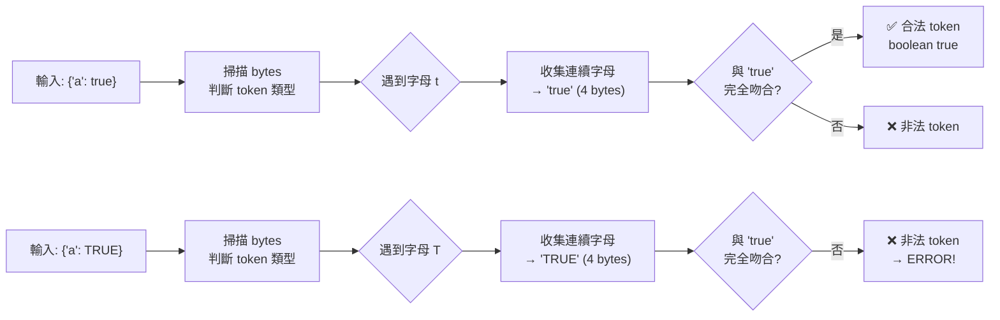

### II. 實測

```sql
SELECT jsonb '{"a": true}';       -- OK
SELECT jsonb '{"a": TRUE}';       -- ERROR: Token "TRUE" is invalid
SELECT jsonb '{"a": false}';      -- OK
SELECT jsonb '{"a": NULL}';       -- ERROR: Token "NULL" is invalid
SELECT jsonb '{"a": null}';       -- OK
SELECT jsonb '{"a": 10.001}';     -- OK
SELECT jsonb '{"a": "10.001"}';   -- OK (string, not number)
```

Parser 對每個 token 做精確的 byte-level 匹配，`true` / `false` / `null` 必須全小寫，且長度必須完全吻合（4 / 5 / 4 bytes），任何不符合 JSON 標準（RFC 7159）的字面量都會在解析階段被拒絕。

### III. 生產環境排查

```sql
-- 檢查 jsonb column 是否有非標準 boolean / null 大小寫
-- 這類資料通常來自手工拼接 JSON 字串的應用程式
SELECT id, c1
FROM t3
WHERE c1::text ~ '"TRUE"|"FALSE"|"Null"|"NULL"';

-- 使用 pg_input_is_valid() 預先驗證（PG 16+）
-- 避免 insert 時才發現 JSON 格式錯誤
SELECT pg_input_is_valid('{"a":TRUE}', 'jsonb');   -- false
SELECT pg_input_is_valid('{"a":true}', 'jsonb');    -- true
SELECT pg_input_is_valid('{"a":NULL}', 'jsonb');    -- false
SELECT pg_input_is_valid('{"a":null}', 'jsonb');    -- true
```

### IV. App Dev 視角

C# / .NET 中 `System.Text.Json` 序列化時，bool 和 null 會自動輸出為小寫 `true` / `false` / `null`，符合 JSON 標準：

```csharp
// ✅ 正確：C# 內建序列化自動產生合法 JSON
var data = new { IsActive = true, Name = (string)null };
var json = System.Text.Json.JsonSerializer.Serialize(data);
// → {"IsActive":true,"Name":null}

await using var cmd = new NpgsqlCommand(
    "INSERT INTO t3 (c1) VALUES (@p::jsonb)", conn);
cmd.Parameters.AddWithValue("p", NpgsqlTypes.NpgsqlDbType.Jsonb, json);
await cmd.ExecuteNonQueryAsync();

// ❌ 錯誤：手動拼接 JSON 字串時大小寫錯誤
var badJson = "{\"a\": TRUE, \"b\": NULL}";
// → Npgsql.PostgresException: 22P02: invalid input syntax for type json
//   Detail: Token "TRUE" is invalid.

// ✅ 正確的手動拼接：嚴格使用 JSON 標準的大小寫
var goodJson = "{\"a\": true, \"b\": null}";
```

> **實務建議**：永遠讓 JSON serializer 處理序列化，避免手動拼接 JSON 字串。如果必須手動組裝，務必對 bool/null 使用小寫。

---

## 2. jsonb 的內部類型本質

jsonb 內部**沒有**類型概念。Parser 看到的 TOKEN 只是字串匹配。關鍵理解：

- `JSON_TOKEN_TRUE` / `JSON_TOKEN_FALSE` / `JSON_TOKEN_NULL` / `JSON_TOKEN_NUMBER` / `JSON_TOKEN_STRING` 是 **parser token type**，不是 JSONB 的內部 type
- JSONB 存儲的是 binary representation，但在 text↔jsonb 轉換過程中，Postgres 不保留原始 PG type 信息
- 如果你需要把 `int8range`、`geometry`、`timestamptz` 等 PG 內部 type 塞進 jsonb 並**能原樣取回**，必須透過 type I/O function 做 text 橋接

### I. 為什麼 jsonb 不記類型？

想像你在寫一個筆記本。JSON 格式就像你用**文字**寫下來的筆記：
```json
{"age": 30, "name": "Alice"}
```
這裡 `30` 是一個數字，`"Alice"` 是一個字串。但你把它們存進 jsonb 後，PostgreSQL 記住的是「這裡有一個數字」而非「這裡有一個 Integer」──它不知道這個數字在存入前是 Postgres 的 `INT`、`BIGINT`、還是 `NUMERIC`。

這和 MongoDB 不同。MongoDB 的 BSON 格式會記住：「這個欄位是 `int32`，值為 30」，所以取出來你還能知道它是 32-bit 整數。PostgreSQL 的 jsonb 則說：「就是個數字，你自己決定要 cast 成什麼類型。」

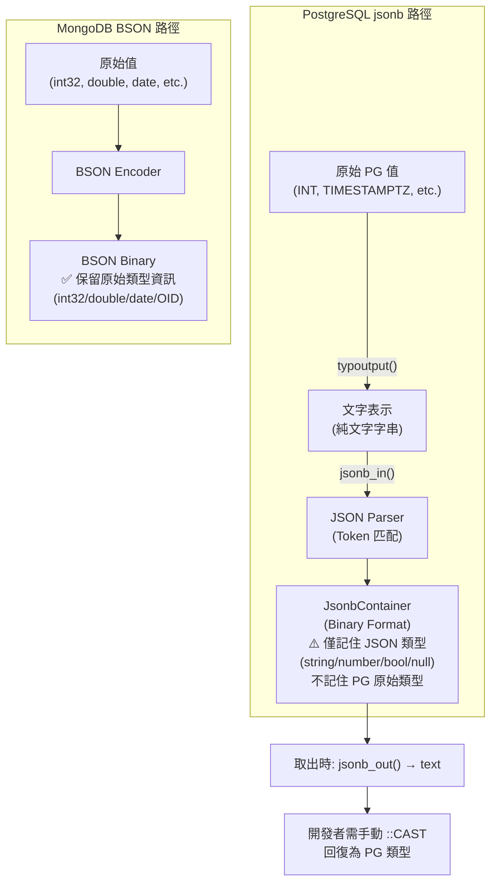

> **一句話總結**：jsonb 是「用 JSON 標準描述資料」的容器。它只保證 JSON 層面的類型（string/number/bool/null/object/array），不保證 PostgreSQL 層面的類型。想要保留 PG 類型 → 走 text 轉換（見下一節）。

> 補充（Senior Dev）：MongoDB BSON 有 `$type` operator 可查 field 的 binary type（string / int / double / date / objectid 等）。Postgres jsonb 沒有對等機制——`jsonb_typeof()` 只返回 `string` / `number` / `boolean` / `null` / `object` / `array`，無法區分 `number` 是 int 還是 float。這在跨系統數據交換時是需要注意的精度風險點。

---

## 3. Type I/O Function 機制

### I. 概念說明

在 PostgreSQL 中，每一個資料型別都有**兩道門**：
1. **輸入門（typinput）**：把人類可讀的文字轉換成資料庫內部的二進制格式。例如把字串 `"2025-01-15"` 變成機器內部的日期表示法。
2. **輸出門（typoutput）**：把內部的二進制格式轉回人類可讀的文字。例如把日期還原成 `"2025-01-15"`。

這就像翻譯官：typinput 把「中文」翻成「內部密碼」，typoutput 把「內部密碼」翻回「中文」。jsonb 就是利用這兩道門，把任何 PG 型別的文字表示塞進 JSON 結構中。

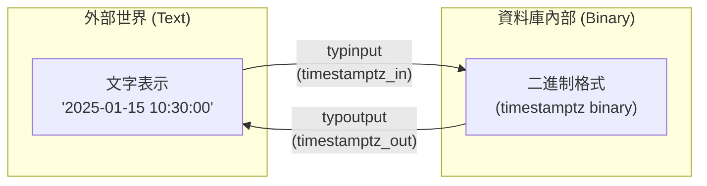

Postgres 每個 type 都有 `typinput` 和 `typoutput` function（定義在 `pg_type` catalog），負責 text ↔ binary 的轉換：

```sql
SELECT oid, typname, typinput, typoutput
FROM pg_type WHERE typname = 'timestamptz';
```

| 屬性 | 值 | 作用 | 白話 |
|------|-----|------|------|
| `oid` | 1184 | type OID | 這個型別的內部位 ID |
| `typinput` | `timestamptz_in` | text → binary | 文字讀入轉二進制 |
| `typoutput` | `timestamptz_out` | binary → text | 二進制輸出轉文字 |


> **理解關鍵**：這個 I/O 機制提供了「可逆性」──用 typoutput 輸出文字，再用 typinput 讀回來，得到的值和原始值一模一樣（只要 typmod 一致）。這是我們能把任何類型塞進 jsonb 的理論基礎：因為 jsonb 可以存文字，而任何 PG 型別都能變成文字（typoutput），也能從文字還原（typinput）。

> 補充（Senior Dev）：這個 I/O function 機制是 Postgres type system 的核心——每個 type 的 text ↔ binary 轉換都是 reversible（`typoutput ∘ typinput = identity`）。因此你可以把任何 type **經由 text** 塞進 jsonb 再取出，只要 text representation 沒變。這也是為什麼 jsonb 不存內部 type：它依賴 text 的 self-describing 特性。


## 4. BYTEA 的 Escape 限制

### I. 概念說明

`bytea` 是 PostgreSQL 儲存「原始二進位資料」的型別──圖片、加密後的資料、任何無法用文字表示的位元組序列。當你試著把 `bytea` 塞進 jsonb 時，會遇到一個經典的**轉義衝突**：

- `bytea` 的 hex 輸出格式以 `\x` 開頭（例如 `\xe4bda0e5a5bd` 表示「你好」的 UTF-8 編碼）
- JSON parser 看到反斜線 `\` 時，會期待它後面跟著合法的 JSON escape 字元（如 `\"`, `\\`, `\n` 等）
- `\x` 不在 JSON 標準的合法 escape 清單中 → **直接報錯**

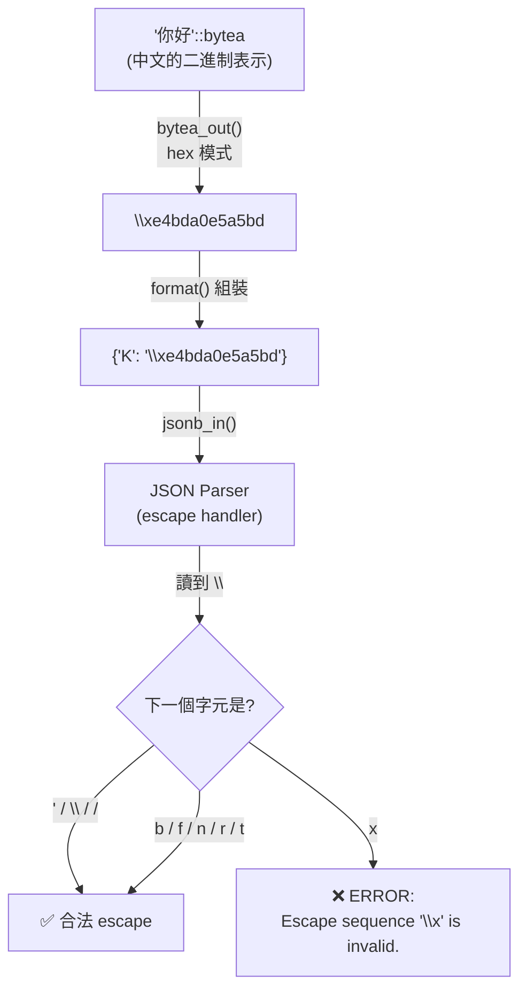

試圖將 `bytea` 塞進 jsonb 時，會遇到 escape 衝突：

```sql
SELECT format('{"K": "%s"}', '你好'::bytea);
-- {"K": "\xe4bda0e5a5bd"}
```

`bytea_out()` 輸出的 hex format 使用 `\x` prefix，但 JSON parser 的 escape handler 不認得 `\x`：

```sql
\set VERBOSITY verbose
SELECT jsonb_in(format('{"K": "%s"}', '你好'::bytea)::cstring);
-- ERROR: 22P02: invalid input syntax for type json
-- DETAIL: Escape sequence "\x" is invalid.
```

JSON parser 的 escape handler 只認得 JSON 標準規定的 8 種轉義序列：`\"`、`\\`、`\/`、`\b`、`\f`、`\n`、`\r`、`\t`。`\x` 不在這個清單中，因此 `bytea_out()` 輸出的 hex prefix 會觸發解析錯誤。


### II. 現代方案：base64 encode（PG 9.6+）

```sql
-- 存入：直接用 encode() + jsonb_build_object()
SELECT jsonb_build_object('data', encode('你好'::bytea, 'base64'));
-- {"data": "5L2g5aW9"}

-- 取出並還原
SELECT decode(('{"data": "5L2g5aW9"}'::jsonb ->> 'data'), 'base64');
-- \xe4bda0e5a5bd      \xe4bda0e5a5bd 就是「你好」的 UTF-8 編碼，只是以 hex 格式顯示。

SELECT convert_from(
    decode(('{"data": "5L2g5aW9"}'::jsonb ->> 'data'), 'base64'),
    'utf8'
);
-- 你好
```

| 方法 | PG 版本 | 優點 | 缺點 |
|------|---------|------|------|
| `encode(..., 'base64')` | 9.6+ | 無 escape 衝突，跨資料庫兼容 | 儲存體積增加約 33% |
| `SET bytea_output = 'escape'` | 9.0+ | 不使用 `\x` prefix | escape 格式仍可能與 JSON 衝突 |

### III. 生產環境排查

```sql
-- 找出使用了 bytea → jsonb 但可能發生 escape 衝突的語句
-- 若 log 中出現 "Escape sequence" 關鍵字，通常就是這個問題
SELECT queryid, query, calls
FROM pg_stat_statements
WHERE query LIKE '%bytea%' AND query LIKE '%jsonb%'
ORDER BY calls DESC
LIMIT 10;

-- 檢查特定 table 中 jsonb 欄位是否有 hex-like 的異常字串
SELECT id, c1
FROM t3
WHERE c1::text LIKE '%\\x%';
```

### IV. App Dev 視角

```csharp
// ✅ 正確：使用 base64 編碼，避免 JSON escape 衝突
byte[] imageBytes = File.ReadAllBytes("photo.png");
string base64 = Convert.ToBase64String(imageBytes);
var json = System.Text.Json.JsonSerializer.Serialize(
    new { image = base64 }
);
// → {"image":"iVBORw0KGgo..."}  ← 純 base64，無 backslash

await using var cmd = new NpgsqlCommand(@"
    INSERT INTO t3 (c1) VALUES (@p::jsonb)
", conn);
cmd.Parameters.AddWithValue("p", NpgsqlTypes.NpgsqlDbType.Jsonb, json);
await cmd.ExecuteNonQueryAsync();

// ❌ 錯誤：直接把 byte[] 輸出 hex 塞入 JSON
// hex string 的 \x prefix 會與 JSON escape 機制衝突
var hex = Convert.ToHexString(imageBytes);
var badJson = $"{{\"image\": \"\\x{hex}\"}}";
// → 寫入時可能觸發 invalid escape sequence 錯誤
```

> **實務建議**：任何 binary data 要存入 jsonb，一律使用 base64 編碼。不要依賴 PostgreSQL 的 `bytea_output` 設定（escape 模式仍可能在邊際案例中與 JSON 衝突）。

---

## 5. JSON Tokenizer 運作原理

### I. 概念說明

Tokenizer（分詞器）是 parser 的第一道關卡。它的工作就是把一串字元流（`{"a": 1}`）切成一個個有意義的「詞彙（token）」：

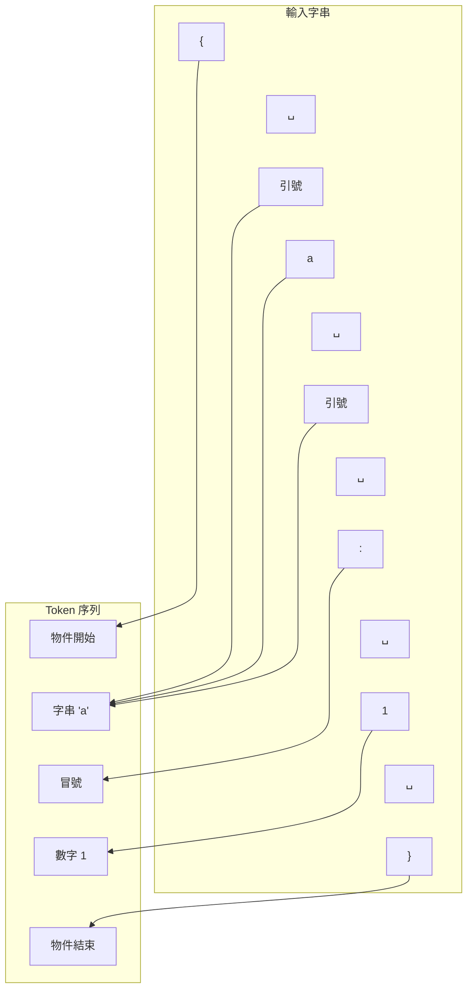

就像你讀英文句子時會自然地把字和標點分開一樣，Tokenizer 把 JSON 字串拆成 token，後面的 parser 才知道該如何處理。

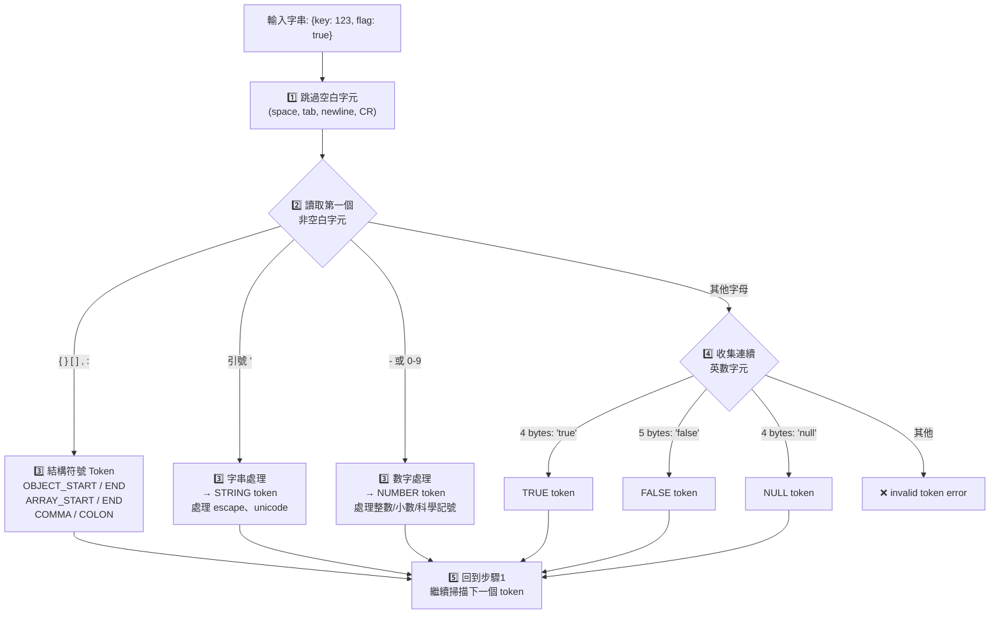

### II. 解析細節

Tokenizer 的運作分三個階段：

**階段 1：跳過空白字元**
Space、Tab、換行（`\n`）、回車（`\r`）全部被忽略，這使得 JSON 可以自由排版而不影響解析結果。

**階段 2：看第一個字元決定 token 類型**

| 首字元 | Token 類型 | 後續處理 |
|--------|-----------|---------|
| `{` / `}` | 物件開始 / 結束 | 繼續掃描 |
| `[` / `]` | 陣列開始 / 結束 | 繼續掃描 |
| `,` / `:` | 逗號 / 冒號 | 繼續掃描 |
| `"` | 字串開始 | 進入字串解析（處理 escape、unicode） |
| `-` 或 `0-9` | 數字 | 進入數字解析（整數/小數/科學記號） |
| 其他字母 | 可能是 `true`/`false`/`null` | 收集連續字母後比對 |

**階段 3：字母 token 比對**
收集連續英數字元後，根據 byte 長度比對：
- 4 bytes → 比對 `true`（成功 = boolean true）、再比對 `null`（成功 = null）、都失敗 → 報錯
- 5 bytes → 比對 `false`（成功 = boolean false）、失敗 → 報錯
- 其他長度 → 直接報錯（invalid token）

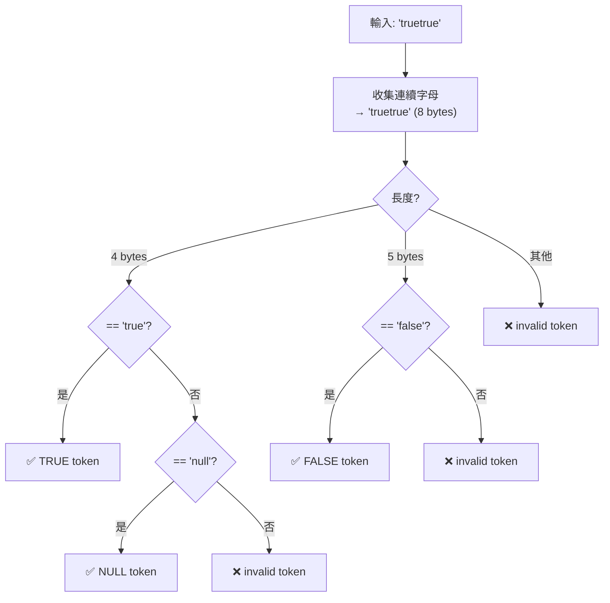

> **核心理解**：Tokenizer 是純粹的字元比對引擎──不涉及 SQL 類型系統，不記住 JSON 值的來源型別。它只回答一個問題：「這個 byte 序列是合法 JSON 嗎？」這也是為什麼大小寫區分嚴格、為什麼 `\x` escape 會報錯。

### III. 生產環境排查

JSON parser 層級的錯誤通常表現為 `invalid input syntax for type json`。排查方向：

```sql
-- 1. 找出所有 jsonb 轉換相關的錯誤（從 pg_stat_statements）
--    若某條語句頻繁觸發 22P02 錯誤，檢查傳入的 JSON 字串
SELECT queryid, query, calls
FROM pg_stat_statements
WHERE query LIKE '%jsonb_in%'
   OR query LIKE '%::jsonb%'
ORDER BY calls DESC
LIMIT 10;

-- 2. 手動驗證可疑 JSON 字串（PG 16+）
SELECT pg_input_is_valid('{"a": TRUE}', 'jsonb');     -- f （大小寫錯誤）
SELECT pg_input_is_valid('{"a":\x00}', 'jsonb');       -- f （非法 escape）
SELECT pg_input_is_valid('{"a": true}', 'jsonb');       -- t
```

### IV. App Dev 視角

對 Application Developer 而言，Tokenizer 的知識最大價值在於：**理解錯誤訊息的根本原因**。

```csharp
// 常見場景：使用者輸入被直接拼入 JSON 字串
var userInput = "hello \"world\"";  // 包含雙引號
// ❌ 手動拼接 → JSON 結構被破壞
var badJson = $"{{\"msg\": \"{userInput}\"}}";
// → {"msg": "hello "world""}  ← 非法 JSON

// ✅ 正確：用 JSON serializer，自動處理 escape
var goodJson = System.Text.Json.JsonSerializer.Serialize(
    new { msg = userInput }
);
// → {"msg":"hello \"world\""}  ← 雙引號被正確轉義為 \"

// ⚠️ Npgsql 的 jsonb 參數傳遞
// Npgsql 會自動處理序列化，但如果傳的是 string 而非 object：
await using var cmd = new NpgsqlCommand(
    "SELECT @p::jsonb", conn);
// ❌ 直接傳 C# string，若內容非法 JSON → PostgresException
cmd.Parameters.AddWithValue("p", "{invalid json}");
// ✅ 先驗證或傳遞強型別物件
cmd.Parameters.AddWithValue("p", NpgsqlTypes.NpgsqlDbType.Jsonb, 
    JsonSerializer.Serialize(new { key = "value" }));
```

> **實務建議**：永遠在 C# 端用 `JsonSerializer.Serialize()` 產生 JSON 字串，再傳給 Npgsql。這樣可以避免 99% 的 Tokenizer 層級錯誤。若必須手動構造 JSON string，先用 `pg_input_is_valid()` 或 C# 端的 `JsonDocument.Parse()` 驗證。

---

# 二、JSON/JSONB 陣列提取與查詢

> 來源：[digoal - 如何从PostgreSQL json中提取数组 (2016-09-10)](https://github.com/digoal/blog/blob/master/201609/20160910_01.md)
>
> 更新於 2026-05-17，補充 JSONPath / SQL/JSON 標準函數 / json_table 演進

---

## 1. JSON Value Type 與提取基礎

### I. 概念說明

當你把資料存進 jsonb 欄位後，PostgreSQL 提供了兩個工具來檢查和提取這些值：

- **`jsonb_typeof()`**：告訴你某個 jsonb 值在 JSON 標準中是什麼類型（object/array/string/number/boolean/null）
- **`->` / `->>`**：從 jsonb 結構中提取（extract）某個 key 的值或陣列的某個元素

這就像在 JavaScript 中操作 JSON 物件：`obj.key` 取出值，`typeof obj.key` 檢查類型。但 PostgreSQL 的規則是：`->` 返回的**仍然是 jsonb**（不是 SQL 原生型別），這點新手很容易搞混。

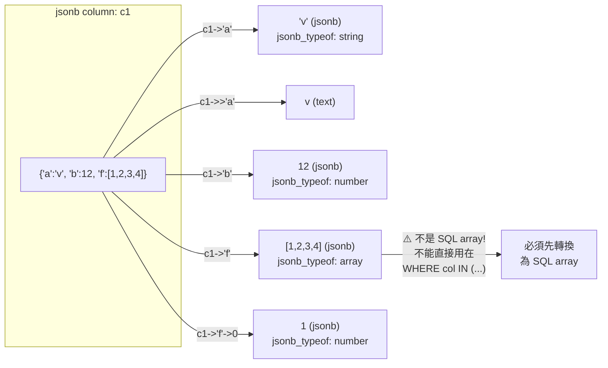

### II. json_typeof / jsonb_typeof

```sql
SELECT jsonb_typeof(c1), c1 FROM t3;
```

支援 type：`object`, `array`, `string`, `number`, `boolean`, `null`。

### III. -> 與 ->> 操作符

| 操作符 | 返回 type | 範例 | 白話說明 |
|--------|----------|------|----------|
| `->'key'` | json/jsonb（保留原始類型） | `c1->'f'` → `[1,2,3,4]` (jsonb) | 「取出 key，保持 jsonb 格式」 |
| `->>'key'` | text | `c1->>'f'` → `[1,2,3,4]` (text) | 「取出 key，轉成純文字」 |
| `->N` | json/jsonb（陣列索引，從0開始） | `c1->'f'->0` → `1` | 「取出陣列第 N 個元素」 |

> **記憶技巧**：`->` 有「箭頭」→ 返回的還是 jsonb（保持結構），`->>` 多一個 `>`→ 更進一步變成 text（攤平）。

完整演示（jsonb）：

```sql
CREATE TABLE t3 (c1 JSONB);
INSERT INTO t3 VALUES ('{
  "a":"v", "b":12, "c":{"ab":"hello"}, "d":12.3,
  "e":true, "f":[1,2,3,4], "g":["a","b"]
}');

SELECT pg_typeof(col), jsonb_typeof(col), col
FROM (SELECT c1->'a' col FROM t3) t;
--  pg_typeof | jsonb_typeof | col
-- -----------+--------------+-----
--  jsonb     | string       | "v"

SELECT pg_typeof(col), jsonb_typeof(col), col
FROM (SELECT c1->'f' col FROM t3) t;
--  pg_typeof | jsonb_typeof | col
-- -----------+--------------+--------------
--  jsonb     | array        | [1,2,3,4]
```

關鍵認知：`->` 返回的仍是 json/jsonb type（不是 native SQL type），即使 `jsonb_typeof` 判斷為 array，PG 仍視為 jsonb。**這是你不能用 `WHERE col IN (1,2,3)` 來查詢 jsonb 陣列的根本原因**──你必須先把它轉換成 SQL 陣列（`int[]` 或 `text[]`）。

---

## 2. 2016 年方案：json_array_elements + ARRAY 構造器

### I. 概念說明

這是本章最核心的問題。假設你有一個 jsonb 欄位 `c1`，裡面存了 `{"f": [1, 2, 3, 4, 5, 6]}`。你想查「哪些 row 的 `f` 陣列包含數字 3？」

直覺寫法：
```sql
SELECT * FROM t3 WHERE c1->'f' @> 3;  -- ❌ 不行！c1->'f' 是 jsonb，不是 int[]
```

因為 `c1->'f'` 返回的是 jsonb（型別是 `jsonb`，值是 `[1,2,3,4,5,6]`），PostgreSQL 的陣列操作符（`@>` 包含、`&&` 重疊）只能用在 SQL 原生陣列（`int[]`、`text[]`）上，不能用在 jsonb 上。

**解決方案**：把 jsonb 陣列 → 展開成 row set → 重新打包成 SQL 陣列。這是一個三步驟的轉換流程。

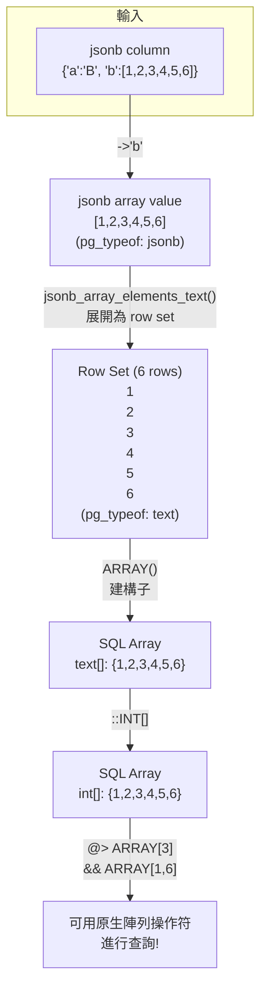

### II. Step 1：JSON array → row set

將 jsonb 中的陣列「爆開」成一行一行的資料：

```sql
SELECT jsonb_array_elements_text('{"a":"B","b":[1,2,3,4,5,6]}'::jsonb->'b');
--  col
-- -----
--  1
--  2
--  3
--  4
--  5
--  6
-- pg_typeof: text
```

`jsonb_array_elements_text()` 將 JSON array 展開為 text row set。對應 json 版為 `json_array_elements_text()`。

> **注意**：`jsonb_array_elements_text()` 回傳的是 text，不是 jsonb！如果你需要保留 jsonb 型別，用 `jsonb_array_elements()`（無 `_text` 後綴）。

### III. Step 2：row set → SQL array

用 `ARRAY()` 建構子把 row set 包回 SQL 陣列：

```sql
SELECT ARRAY(
  SELECT jsonb_array_elements_text('{"a":"B","b":[1,2,3,4,5,6]}'::jsonb->'b')
);
--  {1,2,3,4,5,6}
-- pg_typeof: text[]

SELECT ARRAY(
  SELECT (jsonb_array_elements_text('{"a":"B","b":[1,2,3,4,5,6]}'::jsonb->'b'))::INT
);
--  {1,2,3,4,5,6}
-- pg_typeof: integer[]
```

### IV. Step 3：封裝為可重複使用的 Helper Function

每次都寫這麼長的 SQL 很麻煩，所以包成 function：

```sql
-- JSONB → text[]
CREATE OR REPLACE FUNCTION json_arr2text_arr(_js JSONB)
  RETURNS TEXT[] AS $$
  SELECT ARRAY(SELECT jsonb_array_elements_text(_js))
$$ LANGUAGE SQL IMMUTABLE;

-- JSON → text[]
CREATE OR REPLACE FUNCTION json_arr2text_arr(_js JSON)
  RETURNS TEXT[] AS $$
  SELECT ARRAY(SELECT json_array_elements_text(_js))
$$ LANGUAGE SQL IMMUTABLE;

-- JSONB → int[]
CREATE OR REPLACE FUNCTION json_arr2int_arr(_js JSONB)
  RETURNS INT[] AS $$
  SELECT ARRAY(SELECT (jsonb_array_elements_text(_js))::INT)
$$ LANGUAGE SQL IMMUTABLE;
```

使用：

```sql
SELECT json_arr2text_arr(c1->'g') FROM t3;  -- {a,b}
SELECT json_arr2int_arr(c1->'f') FROM t3;   -- {1,2,3,4}
```

> **為什麼要標記 `IMMUTABLE`？** 這是為了讓 PostgreSQL 可以在 expression index 中使用這個 function（見第 4 節）。IMMUTABLE 代表「相同輸入永遠產出相同輸出」，這對索引是必需的。

---

## 3. 陣列查詢：@> / && 等操作符

### I. 概念說明

一旦 jsonb 陣列被轉換成 SQL 原生陣列（`int[]`、`text[]`），你就可以使用 PostgreSQL 內建的陣列操作符進行高效查詢。最常用的兩個：

- **`@>`（contains，包含）**：「陣列 A 是否**完全包含**陣列 B 的所有元素？」（A 是 B 的超集）
- **`&&`（overlaps，重疊）**：「陣列 A 和陣列 B 是否**有任何共同元素**？」

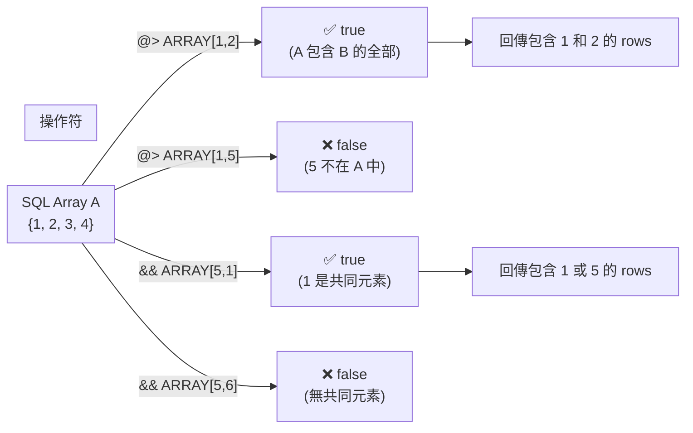

一旦 JSON array 轉為 native SQL array，即可使用 PostgreSQL 的陣列操作符：

```sql
-- @>  全包含（contains）——「陣列必須包含這些元素」
SELECT * FROM t3 WHERE json_arr2text_arr(c1->'g') @> ARRAY['a'];        -- 包含 a
SELECT * FROM t3 WHERE json_arr2int_arr(c1->'f') @> ARRAY[1,2];         -- 同時包含 1 和 2

-- &&  相交（overlaps）——「陣列只要包含其中任何一個元素」
SELECT * FROM t3 WHERE json_arr2int_arr(c1->'f') && ARRAY[1,6];         -- 包含 1 或 6

-- NOT &&  不相交——「陣列和這些元素沒有任何交集」
SELECT * FROM t3 WHERE NOT(json_arr2int_arr(c1->'f') && ARRAY[6]);      -- 不包含 6

-- 注意 type 一致：text 陣列 vs text value / int 陣列 vs int value
SELECT * FROM t3 WHERE NOT(json_arr2text_arr(c1->'f') && ARRAY['6']);   -- 對 text[] 用 '6'
```

> **常見錯誤**：`ARRAY[1]` 是 `int[]`，`ARRAY['1']` 是 `text[]`。它們不能互相匹配！如果你的 helper function 返回 `text[]`，就必須用 `ARRAY['1','6']`（帶引號）。

---

## 4. Index：GIN on Expression

### I. 概念說明

當你對一個表執行 `WHERE` 查詢時，PostgreSQL 預設會從頭到尾掃描每一行（Seq Scan）。對於大表來說，這非常慢。

**索引**就像是書末的關鍵字索引：與其翻遍整本書找「索引」這個詞，不如直接翻到索引頁，找到第 4 章第 1 節。

**GIN（Generalized Inverted Index，通用倒排索引）**是專為「複合值」設計的索引類型。它不是為每一行建一個索引條目，而是為值中的**每個元素**建條目。例如 `{1,2,3,4}` 會被拆分為 4 個條目：`1`, `2`, `3`, `4`。這樣查「包含 `2` 的陣列」時，只需要查找 `2` 這個條目，瞬間找到所有相關的 rows。

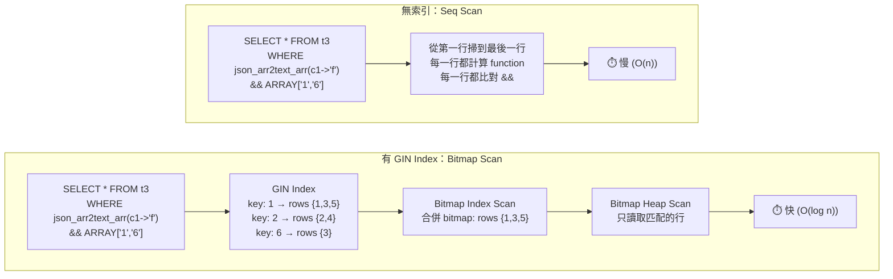

```sql
-- 建立 function-based GIN index（將 JSON array 轉換結果索引化）
CREATE INDEX idx_t3_1 ON t3 USING GIN (json_arr2text_arr(c1->'f'));

SET enable_seqscan = off;

EXPLAIN SELECT * FROM t3 WHERE json_arr2text_arr(c1->'f') && ARRAY['1','6'];
--  Bitmap Heap Scan on t3  (cost=12.25..16.52 rows=1 width=32)
--    Recheck Cond: (json_arr2text_arr((c1 -> 'f'::text)) && '{1,6}'::text[])
--    ->  Bitmap Index Scan on idx_t3_1

EXPLAIN SELECT * FROM t3 WHERE json_arr2text_arr(c1->'f') @> ARRAY['1','6'];
--  Bitmap Heap Scan on t3
--    Recheck Cond: (json_arr2text_arr((c1 -> 'f'::text)) @> '{1,6}'::text[])
--    ->  Bitmap Index Scan on idx_t3_1
```

> **Bitmap Scan 是什麼？** GIN index 可能回傳多個符合條件的 row 位置。Bitmap Scan 先用 bitmap（點陣圖）整理這些位置，再一次性去 heap（資料頁）讀取實際資料，避免重複讀取同一頁。

---

## 5. 現代化方案：JSONPath（PG 12+）

### I. 概念說明

JSONPath 是一種**專門用來查詢 JSON 資料的路徑語言**，類似於 XPath 之於 XML、jq 之於命令列 JSON 處理。

語法舉例：
- `$.key` → 取出根物件的 `key` 屬性（`.` 相當於 `->`）
- `$.arr[*]` → 取出 `arr` 陣列中的所有元素（`*` 是萬用字元）
- `$.arr[*] ? (@ > 2)` → 取出 `arr` 陣列中大於 2 的元素（`?()` 是過濾條件，`@` 代表當前元素）

2016 年的方案需要手動把 jsonb 轉成 text[] 才能用 `@>` / `&&` 查詢。JSONPath 讓你直接在 jsonb 上寫查詢條件，省去轉換步驟。

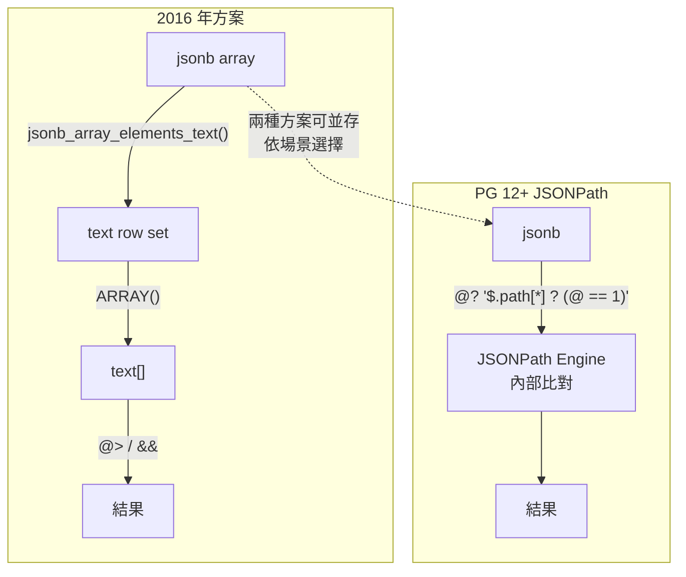

2016 年的方案仍有效，但 PG 12 引入的 JSONPath 提供更強大的表達能力：

```sql
-- 查詢條件：JSON array 中是否包含數字 1？
SELECT * FROM t3
WHERE c1 @? '$.f[*] ? (@ == 1)';

-- 提取所有匹配的元素（返回 row set）
SELECT * FROM jsonb_path_query(
  c1,
  '$.f[*] ? (@ > 2)'
) FROM t3;

-- 返回原生 SQL 型別（自動處理）
SELECT * FROM t3
WHERE c1 @? '$.b ? (@ > 10)';
```

> **`@?` vs `@@`**：`@?` 檢查 JSONPath 表達式是否有匹配（返回 boolean），`@@` 用於更複雜的 predicate check，可以返回匹配結果。新手通常用 `@?` 就足夠。


## 6. json_table（PG 17+）

### I. 概念說明

`json_table` 是 SQL/JSON 標準中最強大的功能。它把一個 JSON 文件（或文件中的陣列）**當作一張 SQL 表來查詢**。

想像你有一行 jsonb：
```json
{"items": [
  {"product_id": 1, "product_name": "Apple", "price": 5.5},
  {"product_id": 2, "product_name": "Banana", "price": 3.0}
]}
```

在 2016 年，你要這樣查：
```sql
-- Step 1: 展開陣列
SELECT jsonb_array_elements(c1->'items') FROM orders;
-- Step 2: 提取每個欄位
SELECT (elem->>'product_id')::INT, elem->>'product_name', (elem->>'price')::NUMERIC, ...
```
繁瑣、易出錯、效能差（每層都要展開）。

PG 17 的 `json_table` 讓你一步到位，直接在 FROM 子句中把 JSON 展開為結構化欄位：

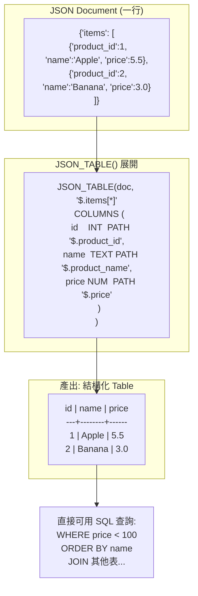

PG 17 引入 `json_table`（又是 ISO SQL/JSON 標準），直接在 FROM 子句中將 JSON 陣列展開為 structured column：

```sql
SELECT jt.*
FROM t3,
     JSON_TABLE(
       c1, '$.f[*]'
       COLUMNS (
         val INT PATH '$'
       )
     ) AS jt;

-- 支持多層嵌套、多 column、type coercion
SELECT jt.id, jt.name, jt.price
FROM orders,
     JSON_TABLE(
       doc, '$.items[*]'
       COLUMNS (
         id    INT     PATH '$.product_id',
         name  TEXT    PATH '$.product_name',
         price NUMERIC PATH '$.price'
       )
     ) AS jt
WHERE jt.price < 100;
```

> **語法解析**：
> - `'$.items[*]'` → 對 `items` 陣列的每個元素（`*`）執行後續操作
> - `COLUMNS (...)` → 定義每個元素要提取哪些欄位、轉成什麼 SQL 型別
> - `PATH '$.product_id'` → 在元素內部找到 `product_id` 這個 key 的值
> - `AS jt` → 給這張虛擬表一個別名，後面才能引用

> 補充（Senior Dev）：`json_table` 將 JSON 陣列的 row-expansion 從「select-list subquery + array constructor」的兩步操作變成單一步驟，plan execution 更高效（無需 intermediate array materialization）。對大量 JSON 集的 OLAP 場景是 game changer。

---

## 7. 三種方案的選擇矩陣

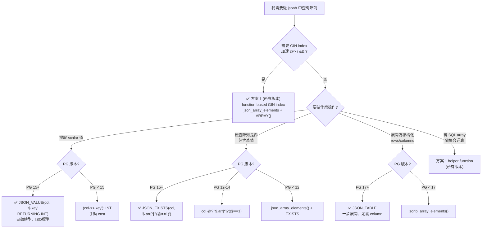

| 方案 | 適用 PG | 最佳場景 | Trade-off |
|------|--------|---------|-----------|
| function-based GIN index | 9.3+ | **唯一方案**：需要 GIN 加速 `@>` / `&&` 查陣列包含 | 需自訂 helper function（標記 IMMUTABLE） |
| JSONPath `@?` | 12+ | 陣列條件判斷（`@?` / `@@`），無需轉 SQL array | 無 GIN 加速路徑，`@>` 語義弱於 native array operator |
| SQL/JSON `JSON_VALUE` | 15+ | 提取 scalar 值，自動轉 native type，免手動 `::cast` | `@>` / `&&` 不適用 |
| SQL/JSON `JSON_EXISTS` | 15+ | 檢查陣列/路徑是否包含某值，ISO 標準 | 同上，無 GIN 直通 |
| SQL/JSON `JSON_TABLE` | 17+ | 展開陣列為結構化 table，一步定義 columns | PG16 無法使用 |

> **PG16 Best Practice 總結**：GIN index 場景仍是 2016 方案為首選（無替代品）。提取 scalar 和存在性檢查改用 `JSON_VALUE` / `JSON_EXISTS`。展開陣列仍用 `jsonb_array_elements()`，等升 PG17 再切 `JSON_TABLE`。

---

## 8. 版本演進總表

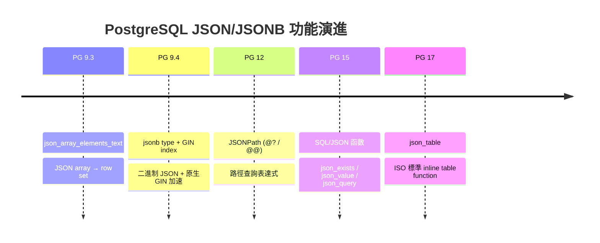

| 功能 | 版本 | 說明 |
|------|------|------|
| `json_array_elements_text` | PG 9.3 | JSON array → row set（將 JSON 陣列展開為逐行資料） |
| `jsonb` type + GIN index | PG 9.4 | 二進制 JSON（高效存儲與查詢） + 原生 GIN 加速 |
| `jsonb_path_query` / `@?` / `@@` | PG 12 | JSONPath 表達式（無需手動轉換即可查詢 jsonb） |
| SQL/JSON `json_exists` / `json_value` / `json_query` | PG 15 | ISO 標準函數（跨資料庫可移植） |
| SQL/JSON `json_table` | PG 17 | ISO 標準 inline table function（一步展開 JSON 為結構化表格） |

---

## 9. 參考

- [How to turn JSON array into Postgres array (DBA.SE)](http://dba.stackexchange.com/questions/54283/how-to-turn-json-array-into-postgres-array)
- [PostgreSQL JSON Functions](https://www.postgresql.org/docs/9.6/static/functions-json.html)
- [PostgreSQL Array Functions](https://www.postgresql.org/docs/9.6/static/functions-array.html)
- [PostgreSQL JSONPath Documentation](https://www.postgresql.org/docs/current/functions-json.html#FUNCTIONS-SQLJSON-PATH)
- [ISO SQL/JSON Standard (SQL:2016)](https://www.iso.org/standard/63555.html)
