# PostgreSQL Lock 機制完全指南

> 本文由 8 篇 PostgreSQL Lock 主題筆記合併整理而成，涵蓋從鎖的基礎概念、內部機制、監控除錯，到 Advisory Lock 的 4 個實戰應用場景（高並發更新、秒殺、排隊控制、無縫 ID）。
>
> **閱讀路徑**：新手建議從頭依序閱讀（第一篇 §1~§5 打基礎 → 第二篇 §1~§5 學應用）。有經驗的讀者可直接跳到需要的場景。
>
> 原始來源：[digoal（德哥）blog](https://github.com/digoal/blog) 系列文章，補充 PG 9.6~18 現代化演進與 Senior Dev 實戰註解。

---

# 一、PostgreSQL Lock 機制全景

## 1. Lock 基礎概念

### I. Lock Mode 等級與衝突矩陣

PostgreSQL 定義了 8 個鎖等級，數字越大鎖越強。每個等級與哪些操作對應、以及彼此之間的衝突關係如下：

| Level | Lock Mode | 常見觸發 | 衝突對象 |
|:-----:|------|------|------|
| 1 | AccessShareLock | `SELECT` | AccessExclusiveLock (8) |
| 2 | RowShareLock | `SELECT ... FOR UPDATE/SHARE` | ExclusiveLock, AccessExclusiveLock |
| 3 | RowExclusiveLock | `INSERT` / `UPDATE` / `DELETE` | ShareLock, ShareRowExclusiveLock, ExclusiveLock, AccessExclusiveLock |
| 4 | ShareUpdateExclusiveLock | `VACUUM`（不含 FULL）, `ANALYZE`, `CREATE INDEX CONCURRENTLY` | ShareLock, ShareRowExclusiveLock, ExclusiveLock, AccessExclusiveLock |
| 5 | ShareLock | `CREATE INDEX`（不含 CONCURRENTLY） | RowExclusive, ShareUpdateExclusive, ShareRowExclusive, Exclusive, AccessExclusive |
| 6 | ShareRowExclusiveLock | `CREATE TRIGGER` | RowExclusive, ShareUpdateExclusive, Share, ShareRowExclusive, Exclusive, AccessExclusive |
| 7 | ExclusiveLock | `REFRESH MATERIALIZED VIEW CONCURRENTLY` | RowShare, RowExclusive, ShareUpdateExclusive, Share, ShareRowExclusive, Exclusive, AccessExclusive |
| 8 | AccessExclusiveLock | `ALTER TABLE`, `DROP TABLE`, `TRUNCATE`, `VACUUM FULL` | **所有** lock level |

> **新手白話理解**：可以把 PG 的鎖想像成一個「權限分級制度」：Level 1（SELECT）是最輕的鎖，就像在圖書館**看書**——很多人可以同時看。Level 8（ALTER TABLE）是最重的鎖，就像要把圖書館**拆掉重建**——必須等所有人都離開才能動工。數字越大，鎖越重，跟它衝突的操作就越多。

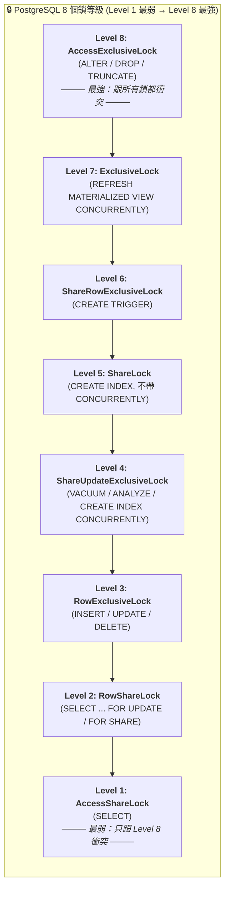
```mermaid
flowchart TD
    subgraph "🔒 PostgreSQL 8 個鎖等級 (Level 1 最弱 → Level 8 最強)"
        direction TB
        L8["<b>Level 8: AccessExclusiveLock</b><br/>(ALTER / DROP / TRUNCATE)<br/><i>──── 最強：跟所有鎖都衝突 ────</i>"]
        L7["<b>Level 7: ExclusiveLock</b><br/>(REFRESH MATERIALIZED VIEW CONCURRENTLY)"]
        L6["<b>Level 6: ShareRowExclusiveLock</b><br/>(CREATE TRIGGER)"]
        L5["<b>Level 5: ShareLock</b><br/>(CREATE INDEX, 不帶 CONCURRENTLY)"]
        L4["<b>Level 4: ShareUpdateExclusiveLock</b><br/>(VACUUM / ANALYZE / CREATE INDEX CONCURRENTLY)"]
        L3["<b>Level 3: RowExclusiveLock</b><br/>(INSERT / UPDATE / DELETE)"]
        L2["<b>Level 2: RowShareLock</b><br/>(SELECT ... FOR UPDATE / FOR SHARE)"]
        L1["<b>Level 1: AccessShareLock</b><br/>(SELECT)<br/><i>──── 最弱：只跟 Level 8 衝突 ────</i>"]
    end

    L8 --> L7 --> L6 --> L5 --> L4 --> L3 --> L2 --> L1
```

> **衝突規則**：每個鎖等級的「衝突對象」列中列出的鎖，都不能跟它**同時**被持有。例如：一個 `SELECT`（Level 1）正在執行時，`ALTER TABLE`（Level 8）必須排隊等待；反過來也一樣，`ALTER TABLE` 執行時，所有 `SELECT` 也都進不來。

在原始碼中，鎖等級定義在 `src/include/storage/lock.h` 的 `LockModes` 枚舉裡，衝突矩陣則存在 `lockConflicts[]` 陣列中。當 PG 需要判斷兩個鎖是否衝突時，會呼叫 `LockCheckConflicts()`（在 `src/backend/storage/lmgr/lock.c`）來查表比對。

### II. Lock Queue 排隊機制

PG 的 lock queue 有一個關鍵特性：即使 session 尚未持有鎖，只要進入 lock queue 就會產生鎖衝突。鎖鏈範例：

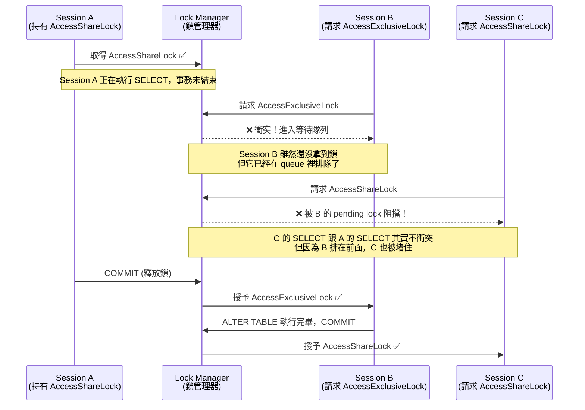
```mermaid
sequenceDiagram
    participant A as Session A<br/>(持有 AccessShareLock)
    participant LM as Lock Manager<br/>(鎖管理器)
    participant B as Session B<br/>(請求 AccessExclusiveLock)
    participant C as Session C<br/>(請求 AccessShareLock)

    A->>LM: 取得 AccessShareLock ✅
    Note over A,LM: Session A 正在執行 SELECT，事務未結束

    B->>LM: 請求 AccessExclusiveLock
    LM-->>B: ❌ 衝突！進入等待隊列
    Note over B,LM: Session B 雖然還沒拿到鎖<br/>但它已經在 queue 裡排隊了

    C->>LM: 請求 AccessShareLock
    LM-->>C: ❌ 被 B 的 pending lock 阻擋！
    Note over C,LM: C 的 SELECT 跟 A 的 SELECT 其實不衝突<br/>但因為 B 排在前面，C 也被堵住

    A->>LM: COMMIT (釋放鎖)
    LM->>B: 授予 AccessExclusiveLock ✅
    B->>LM: ALTER TABLE 執行完畢，COMMIT
    LM->>C: 授予 AccessShareLock ✅
```

> **新手白話**：這就像銀行櫃檯排隊。Session A 正在辦理業務，Session B 來了說「我要辦一個需要獨佔櫃檯很久的大事」，櫃檯說「好，你排隊等」。接著 Session C 來說「我只是要快速問個問題」，但櫃檯說「前面那位要辦大事的還在排，你也要等」。C 明明跟 A 不衝突，但因為 B 排在前面，C 就被 B 間接堵死了——這就是 PG lock queue 的關鍵特性。

> PG 對未獲得、但在等待中的鎖也在衝突列表中。這意味著一個 pending 的高級別鎖（如 AccessExclusiveLock）可以堵死後續所有低級別鎖請求。

### III. Object-Level Lock 在 Transaction 結束才釋放

即使是 `SELECT`，只要在 transaction 內（`BEGIN` 之後未 `COMMIT`），對 table 持有的 `AccessShareLock` 直到 transaction 結束才釋放。這意味著一個「閒置的 long transaction」可以長時間持有 shared lock。

常見觸發源：
- **ORM 框架**自動開啟 implicit transaction，開發者忘記 commit
- **pgAdmin / DBeaver 查詢後未 commit**，而 auto-commit 被關閉
- **Stored procedure** 內有 `BEGIN` 但異常路徑未 `ROLLBACK`
- **idle in transaction** 狀態是頭號嫌疑犯

檢測 idle in transaction：

```sql
SELECT pid, usename, datname, state,
       now() - xact_start AS xact_duration,
       query
FROM pg_stat_activity
WHERE state = 'idle in transaction'
  AND now() - xact_start > interval '5 minutes';
```

建議在 production 設定 `idle_in_transaction_session_timeout`（PG 9.6+），例如 10min，自動 kill 這些 zombie transaction。

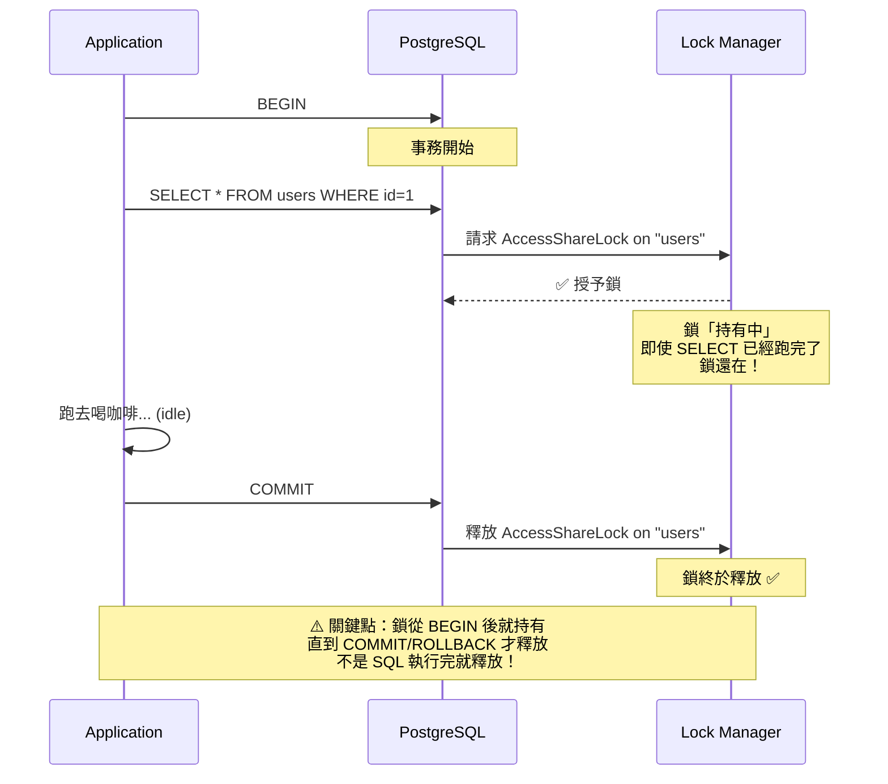
```mermaid
sequenceDiagram
    participant App as Application
    participant PG as PostgreSQL
    participant LM as Lock Manager

    App->>PG: BEGIN
    Note over PG: 事務開始

    App->>PG: SELECT * FROM users WHERE id=1
    PG->>LM: 請求 AccessShareLock on "users"
    LM-->>PG: ✅ 授予鎖
    Note over LM: 鎖「持有中」<br/>即使 SELECT 已經跑完了<br/>鎖還在！

    App->>App: 跑去喝咖啡... (idle)

    App->>PG: COMMIT
    PG->>LM: 釋放 AccessShareLock on "users"
    Note over LM: 鎖終於釋放 ✅

    Note over App,LM: ⚠️ 關鍵點：鎖從 BEGIN 後就持有<br/>直到 COMMIT/ROLLBACK 才釋放<br/>不是 SQL 執行完就釋放！
```

> **新手常見誤解**：很多人以為 `SELECT` 跑完鎖就釋放了，但實際上 PG 的 object-level lock（表級鎖）是在 **transaction 結束**（`COMMIT` 或 `ROLLBACK`）時才統一釋放。在原始碼中，這個釋放動作由 `LockReleaseAll()` 函數處理（在 `lock.c` 中），它會在 transaction 結束時被 `ResourceOwnerRelease()` 觸發，一次性釋放該事務持有的所有鎖。

> **原始碼關鍵函數速查**：
>   - 8 個鎖等級定義在 `src/include/storage/lock.h` 的 `enum LockMode`
>   - 鎖獲取：`LockAcquire()` → 找或創建鎖物件，檢查衝突，授予或排隊
>   - 鎖釋放：`LockRelease()` → 釋放單個鎖，喚醒等待者
>   - 衝突檢查：`LockCheckConflicts()` → 遍歷 lock queue，用 `lockConflicts[]` 查衝突矩陣
>   - 喚醒等待者：`ProcLockWakeup()` → 當鎖被釋放後，叫醒 queue 中下一個能拿到鎖的人
>   - 事務結束清理：`LockReleaseAll()` → 釋放該事務所有鎖，在 COMMIT/ROLLBACK 時觸發

---

## 2. 隱式鎖請求（Implicit Lock Request）

> 來源：[digoal - 注意PostgreSQL "隐式"锁请求 (2015-11-05)](https://github.com/digoal/blog/blob/master/201511/20151105_01.md)

### I. 核心發現：pg_get_indexdef 請求的是 Table Lock，非 Index Lock

當你對一個表執行 DDL（如 `ALTER TABLE ... ADD COLUMN`）時，該表被加上 `AccessExclusiveLock`。此時你可能覺得只讀 index 定義不受影響——**但實際上 `pg_get_indexdef()` 會請求該 index 的父表 `AccessShareLock`**，因此被 DDL 阻塞。

**複現：**

Session A — DDL 持有 AccessExclusiveLock：

```sql
BEGIN;
ALTER TABLE test ADD COLUMN c1 INT;
```

Session B — 讀取 index 定義被阻塞：

```sql
SELECT * FROM pg_get_indexdef('test_pkey'::regclass);
```

> **新手白話**：`pg_get_indexdef` 想讀取索引 "test_pkey" 的定義，但索引的定義儲存在 **父表** 的 catalog（系統目錄）裡，所以它需要先取得父表的 `AccessShareLock`。此時父表已經被 Session A 用 `AccessExclusiveLock` 鎖住了，B 就被堵死。這就像你想看一本書的目錄（index），但目錄跟書本身（table）綁在一起，有人正在改書的結構（ALTER），你連目錄都翻不了。

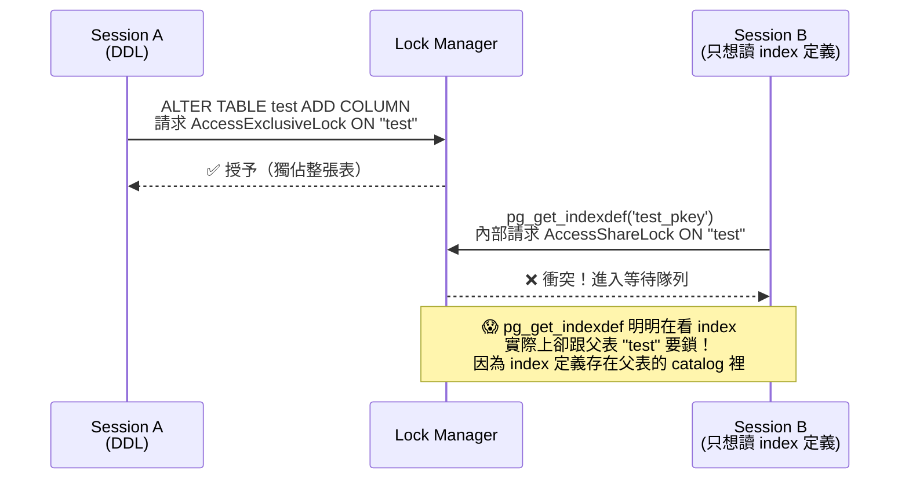
```mermaid
sequenceDiagram
    participant A as Session A<br/>(DDL)
    participant LM as Lock Manager
    participant B as Session B<br/>(只想讀 index 定義)

    A->>LM: ALTER TABLE test ADD COLUMN<br/>請求 AccessExclusiveLock ON "test"
    LM-->>A: ✅ 授予（獨佔整張表）

    B->>LM: pg_get_indexdef('test_pkey')<br/>內部請求 AccessShareLock ON "test"
    LM-->>B: ❌ 衝突！進入等待隊列

    Note over B,LM: 😱 pg_get_indexdef 明明在看 index<br/>實際上卻跟父表 "test" 要鎖！<br/>因為 index 定義存在父表的 catalog 裡
```

**在原始碼中**：`pg_get_indexdef()` 函數（在 `src/backend/utils/adt/ruleutils.c`）內部會呼叫 `relation_open()`（在 `src/backend/access/common/relation.c`），這個函數會觸發 `LockRelationOid()` → `LockAcquire()`，對父表請求 `AccessShareLock`。這就是「隱式鎖」的來源——開發者沒有手寫 `LOCK TABLE`，但 PG 內部為了保證一致性，自動幫你拿了鎖。

### II. 受影響函數列表

所有 `pg_get_*def()` 系列函數都會向**父表/父物件**請求 `AccessShareLock`（而非子物件），因此都會被 DDL 阻塞：

| 函數 | 請求 Lock 的對象 |
|------|-----------------|
| `pg_get_indexdef(oid)` | 父表 |
| `pg_get_constraintdef(oid)` | 父表 |
| `pg_get_functiondef(oid)` | 函數本身 |
| `pg_get_ruledef(oid)` | 父表 |
| `pg_get_triggerdef(oid)` | 父表 |
| `pg_get_viewdef(oid)` | 檢視本身及其引用的所有基礎表 |

> `pg_dump` 內部大量使用這些函數。當你對生產庫執行 `pg_dump --schema-only` 時，這些隱式鎖會請求所有表的 `AccessShareLock`。如果此時有任何 DDL 在執行，pg_dump 會被阻塞——更危險的是，pg_dump 本身也會阻塞後續的 DDL（見下文 lock queue pileup 機制）。

### III. Lock Queue Pileup（鎖隊列堆積）

最危險的場景：**一個 pending DDL 堵死整張表**。

實際場景：
1. Session A 運行一個大型 `SELECT`（無鎖，但事務未結束）
2. Session B 想對同表執行 DDL → 請求 `AccessExclusiveLock` → 因為 A 的事務未結束，B 進入 waiting queue
3. Session C 想讀取該表（`SELECT`，需要 `AccessShareLock`）→ **也被 B 阻塞**，因為 B 在 waiting queue 中

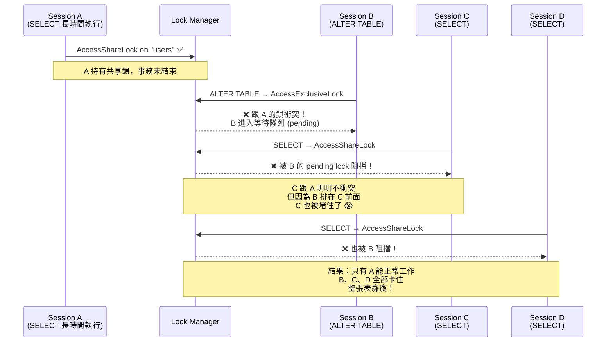
```mermaid
sequenceDiagram
    participant A as Session A<br/>(SELECT 長時間執行)
    participant LM as Lock Manager
    participant B as Session B<br/>(ALTER TABLE)
    participant C as Session C<br/>(SELECT)
    participant D as Session D<br/>(SELECT)

    A->>LM: AccessShareLock on "users" ✅
    Note over A,LM: A 持有共享鎖，事務未結束

    B->>LM: ALTER TABLE → AccessExclusiveLock
    LM-->>B: ❌ 跟 A 的鎖衝突！<br/>B 進入等待隊列 (pending)

    C->>LM: SELECT → AccessShareLock
    LM-->>C: ❌ 被 B 的 pending lock 阻擋！
    Note over C,LM: C 跟 A 明明不衝突<br/>但因為 B 排在 C 前面<br/>C 也被堵住了 😱

    D->>LM: SELECT → AccessShareLock
    LM-->>D: ❌ 也被 B 阻擋！

    Note over LM,D: 結果：只有 A 能正常工作<br/>B、C、D 全部卡住<br/>整張表癱瘓！
```

> 這個問題在 PostgreSQL 社群被稱為 "lock queue pileup"。核心矛盾在於 lock manager 嚴格按 FIFO 排隊——pending 的 AccessExclusiveLock 會阻擋後續所有 AccessShareLock 請求，即使這些 SELECT 與 Session A 的 SELECT 互不衝突。這是 PG lock manager 設計權衡：避免 AccessExclusiveLock 永遠拿不到（starvation prevention），代價是偶發性 pileup。

### IV. 防護措施

**1. DDL 加 lock_timeout：**

```sql
SET lock_timeout = '1s';
ALTER TABLE test ADD COLUMN c1 INT;  -- 若 1s 內拿不到鎖→直接 fail，不進 waiting queue
```

**2. 監控前置：定期檢查 pending lock：**

```sql
SELECT pid, wait_event_type, wait_event,
       pg_blocking_pids(pid) blocked_by,
       now() - query_start AS wait_duration,
       query
FROM pg_stat_activity
WHERE wait_event_type = 'Lock'
  AND state <> 'idle'
ORDER BY query_start;
```

**3. 避免 Long Transaction：** 消除 long transaction 從根源絕殺 pileup。

**4. 使用 CONCURRENTLY 替代傳統 DDL：**

```sql
CREATE INDEX CONCURRENTLY idx_test ON test (col);  -- ShareUpdateExclusiveLock
```

注意：`ALTER TABLE ADD COLUMN` 至今仍需 `AccessExclusiveLock`（PG 18 仍如此），無法繞過。

> **原始碼關鍵函數速查**：
>   - `relation_open()`（`relation.c`）→ 打開 relation 時自動拿鎖，是「隱式鎖」的根源
>   - `pg_get_indexdef()`（`ruleutils.c`）→ 內部呼叫 `relation_open`，對父表要 AccessShareLock
>   - `LockQueuePileup` 的形成機制：`LockAcquire()` → `LockCheckConflicts()` 檢查時，pending lock 也會阻擋後續請求
>   - `lock_timeout` 的實現：`LockAcquire()` 在等待迴圈中檢查 timeout，超時會觸發 `StatementCancelHandler()`

---

## 3. Lock Flooding — 大鎖與 Long Transaction 的蝴蝶效應

> 來源：[digoal - PostgreSQL 大锁与long sql/xact的蝴蝶效应 (2016-03-16)](https://github.com/digoal/blog/blob/master/201603/20160316_02.md)

### I. 蝴蝶效應的四個因素

當以下四個因素疊加時，可能引發資料庫效能瞬間崩潰：

**因素 1：Lock Queue 排隊機制**（見 §2.III）

**因素 2：Response 變慢 → Application 增加連線數**

當 SQL 因鎖等待變慢，Application 層的典型反應是建立更多 connection 來處理積壓請求，試圖「補償」效能下降——這反而加劇問題。

**因素 3：超過 Connection 閾值後效能遞減**

PG 的 TPS 在 connection 數量超過 CPU core 數的 **3 倍**後開始顯著下降。原因包括 context switch 增加、shared_buffers contention、lock manager 的 internal spinlock 競爭。

**因素 4：Object-Level Lock 在 Transaction 結束才釋放**（見 §1.III）

> **新手白話**：蝴蝶效應的意思是「一隻蝴蝶在巴西拍翅膀，可能引發德州龍捲風」。在這裡，一個 developer 忘記 COMMIT 的 `SELECT` 語句（看似無害），最後可以把整個資料庫的 TPS 打到零。四個因素互相餵養、惡性循環——就像雪崩一樣。

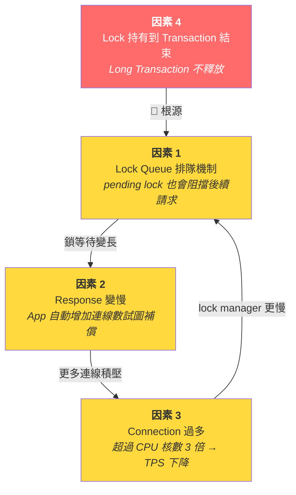
```mermaid
flowchart TD
    F1["<b>因素 1</b><br/>Lock Queue 排隊機制<br/><i>pending lock 也會阻擋後續請求</i>"]
    F2["<b>因素 2</b><br/>Response 變慢<br/><i>App 自動增加連線數試圖補償</i>"]
    F3["<b>因素 3</b><br/>Connection 過多<br/><i>超過 CPU 核數 3 倍 → TPS 下降</i>"]
    F4["<b>因素 4</b><br/>Lock 持有到 Transaction 結束<br/><i>Long Transaction 不釋放</i>"]

    F4 -->|"🔑 根源"| F1
    F1 -->|"鎖等待變長"| F2
    F2 -->|"更多連線積壓"| F3
    F3 -->|"lock manager 更慢"| F1

    style F4 fill:#ff6b6b,color:#fff
    style F1 fill:#ffd93d
    style F2 fill:#ffd93d
    style F3 fill:#ffd93d
```

### II. 模擬實驗：從正常到崩潰再到恢復

環境：1000 萬 row 表，10 connections baseline TPS ≈ 75,000。

**Phase 1 — 正常狀態（10 connections）：** TPS ≈ 75,000，延遲 < 0.15ms。

**Phase 2 — 觸發 Long Transaction：**

```sql
BEGIN;
SELECT * FROM test LIMIT 1;
-- 不 COMMIT - 繼續持有 AccessShareLock
```

**Phase 3 — DDL 請求觸發鎖鏈：**

```sql
ALTER TABLE test ADD COLUMN c1 int;
-- 等待 AccessExclusiveLock → 但 long transaction 持有 AccessShareLock
```

此 DDL 進入 lock queue 最前端，瞬間堵塞所有後續 DML。

**Phase 4 — TPS 歸零：**

```
progress: 53.0s, 0.0 tps
progress: 54.0s, 0.0 tps
progress: 55.0s, 0.0 tps
...
```

**Phase 5 — Application 擴張 Connections（加劇災難）：**

Application 新增 500 connections 來「緩解」——全部進入 lock queue。

> Lock queue 長度達到數百時，lock manager 的內部檢查（conflict detection）成本是 O(queue_length²)，因為每個新鎖請求都要與 queue 中所有等待者比對衝突。不只是 DB 被阻塞——DB process 本身也在消耗 CPU 做鎖衝突檢查。

**Phase 6 — Lock 釋放後的 Recovery（效能減半）：**

結束 long transaction 後，DDL 執行完畢。所有 510 connections 同時開始執行積壓的 UPDATE — **TPS 只恢復到 ~36,000**（原來 75,000 的一半），因為 510 個 connections 超出了 CPU 的承載能力。

**Phase 7 — 釋放多餘 Connections 後完全恢復：**

終止額外的 500 connections 後，TPS 回到 ~75,000。

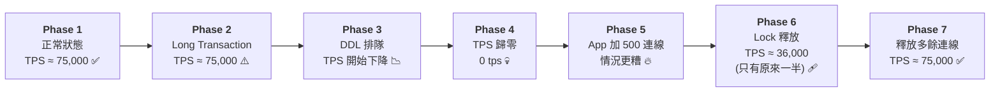
```mermaid
flowchart LR
    P1["<b>Phase 1</b><br/>正常狀態<br/>TPS ≈ 75,000 ✅"]
    P2["<b>Phase 2</b><br/>Long Transaction<br/>TPS ≈ 75,000 ⚠️"]
    P3["<b>Phase 3</b><br/>DDL 排隊<br/>TPS 開始下降 📉"]
    P4["<b>Phase 4</b><br/>TPS 歸零<br/>0 tps 💀"]
    P5["<b>Phase 5</b><br/>App 加 500 連線<br/>情況更糟 🔥"]
    P6["<b>Phase 6</b><br/>Lock 釋放<br/>TPS ≈ 36,000<br/>(只有原來一半) 🩹"]
    P7["<b>Phase 7</b><br/>釋放多餘連線<br/>TPS ≈ 75,000 ✅"]

    P1 --> P2 --> P3 --> P4 --> P5 --> P6 --> P7
```

> **關鍵教訓**：Phase 6 即使鎖釋放了，TPS 也只有原來一半——因為 App 建立了太多連線。這告訴我們：**即使解決了鎖的根源，過多的 connection 本身就是另一個效能殺手**。lock manager 的內部衝突檢查（`LockCheckConflicts()`）複雜度是 O(queue_length²)，queue 越長，檢查越慢，CPU 被吃掉越多。

### III. Lock 等待鏈查詢

使用以下 SQL 找出鎖等待鏈（誰阻塞了誰）：

```sql
WITH t_wait AS (
    SELECT a.mode, a.locktype, a.database, a.relation,
           a.page, a.tuple, a.classid,
           a.objid, a.objsubid, a.pid, a.virtualtransaction,
           a.virtualxid, a.transactionid,
           b.query, b.xact_start, b.query_start,
           b.usename, b.datname
    FROM pg_locks a, pg_stat_activity b
    WHERE a.pid = b.pid AND NOT a.granted
),
t_run AS (
    SELECT a.mode, a.locktype, a.database, a.relation,
           a.page, a.tuple,
           a.classid, a.objid, a.objsubid, a.pid,
           a.virtualtransaction, a.virtualxid,
           a.transactionid, b.query, b.xact_start,
           b.query_start, b.usename, b.datname
    FROM pg_locks a, pg_stat_activity b
    WHERE a.pid = b.pid AND a.granted
)
SELECT
    r.locktype, r.mode AS r_mode,
    r.usename AS r_user, r.datname AS r_db,
    r.relation::regclass, r.pid AS r_pid,
    r.xact_start AS r_xact_start,
    now() - r.query_start AS r_locktime,
    r.query AS r_query,
    w.mode AS w_mode,
    w.pid AS w_pid,
    now() - w.query_start AS w_locktime,
    w.query AS w_query
FROM t_wait w, t_run r
WHERE r.locktype IS NOT DISTINCT FROM w.locktype
  AND r.database IS NOT DISTINCT FROM w.database
  AND r.relation IS NOT DISTINCT FROM w.relation
  AND r.page IS NOT DISTINCT FROM w.page
  AND r.tuple IS NOT DISTINCT FROM w.tuple
  AND r.classid IS NOT DISTINCT FROM w.classid
  AND r.objid IS NOT DISTINCT FROM w.objid
  AND r.objsubid IS NOT DISTINCT FROM w.objsubid
  AND r.transactionid IS NOT DISTINCT FROM w.transactionid
  AND r.pid <> w.pid
ORDER BY (
    (CASE w.mode WHEN 'AccessShareLock' THEN 1 WHEN 'RowShareLock' THEN 2
     WHEN 'RowExclusiveLock' THEN 3 WHEN 'ShareUpdateExclusiveLock' THEN 4
     WHEN 'ShareLock' THEN 5 WHEN 'ShareRowExclusiveLock' THEN 6
     WHEN 'ExclusiveLock' THEN 7 WHEN 'AccessExclusiveLock' THEN 8 ELSE 0 END) +
    (CASE r.mode WHEN 'AccessShareLock' THEN 1 WHEN 'RowShareLock' THEN 2
     WHEN 'RowExclusiveLock' THEN 3 WHEN 'ShareUpdateExclusiveLock' THEN 4
     WHEN 'ShareLock' THEN 5 WHEN 'ShareRowExclusiveLock' THEN 6
     WHEN 'ExclusiveLock' THEN 7 WHEN 'AccessExclusiveLock' THEN 8 ELSE 0 END)
) DESC, r.xact_start;
```

> PG 9.6+ 簡化版：`SELECT * FROM pg_stat_activity WHERE pid = ANY(pg_blocking_pids(<blocked_pid>))`

### IV. 根治方案

| 方案 | 做法 |
|------|------|
| **強制 Lock Timeout** | `SET lock_timeout = '5s';` — 等待超時自動 cancel |
| **Connection Pool 管理** | PgBouncer 設定 idle connection timeout |
| **idle_in_transaction_session_timeout** | PG 9.6+，自動 terminate idle-in-transaction |
| **監控 Lock Chain 與告警** | 定時執行上述 lock chain SQL，queue 過長 → alert |
| **DDL 執行規範** | DDL 前檢查 `pg_stat_activity` + `lock_timeout` 保護 + 考慮 online tooling |

> **DDL 在 Production 的執行規範**：
> 1. 所有 DDL 在執行前應檢查是否有 idle-in-transaction
> 2. DDL 加 `lock_timeout` 保護（如 `SET lock_timeout = '2s'; ALTER TABLE ...;`）
> 3. 可使用 `LOCK TABLE ... NOWAIT` 測試鎖是否可立即取得
> 4. 大表的 DDL 考慮用 online tooling：`pg_repack`、`CREATE INDEX CONCURRENTLY`

> **原始碼關鍵函數速查**：
>   - `pg_blocking_pids()` → PG 9.6+ 內建函數，直接查誰在擋你，底層調用 `GetBlockerPidsData()`
>   - `LockCheckConflicts()` 的 O(n²) 行為：每個新鎖請求都要遍歷 queue 中所有 pending lock 做衝突比對
>   - `idle_in_transaction_session_timeout` 的實現：檢查 `xact_start` 和 `state`，超時的 session 會被發送 SIGTERM
>   - spinlock 競爭：當大量 backend 同時搶 lock，lock manager 的內部 spinlock (`LWLock` 系列) 競爭急劇上升

---

## 4. Lock Wait 追蹤與監控

> 來源：[digoal - PostgreSQL 锁等待跟踪 (2016-03-18)](https://github.com/digoal/blog/blob/master/201603/20160318_02.md)
> 更新於 2026-05-17，補充 PG 9.6~18 現代化監控技術棧

### I. 核心問題：lock wait time 被計入 total duration 但無拆分

`auto_explain` 記錄的 total duration 包含了 lock wait time，但未單獨拆分：

```
duration: 32038.420 ms  plan:
Update on test2 (actual time=32038.418..32038.418 rows=0 loops=1)
  ->  Seq Scan on test2 (actual time=0.014..0.015 rows=1 loops=1)
```

Seq Scan 本身只花了 0.015ms，但 total duration 高達 32 秒——全數為 lock wait 耗時。

> **新手白話**：`auto_explain` 就像一個計時器，但它只記錄「整個 SQL 從開始到結束花了多久」，不告訴你「其中有 99.99% 是在排隊等鎖」。這就像 Uber Eats 只告訴你「餐點 32 分鐘後送到」，但沒說「餐廳 1 分鐘就做好，外送員卡在紅綠燈 31 分鐘」——你只看到總時間 32 分鐘，根本不知道問題在哪。

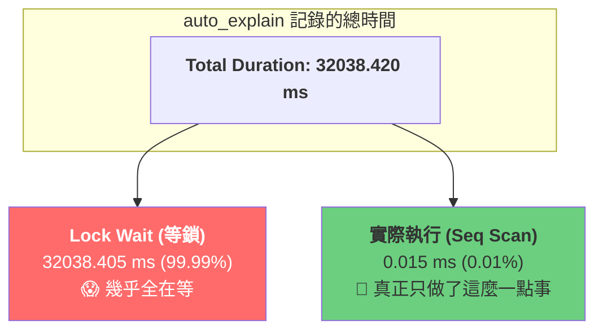
```mermaid
flowchart TD
    subgraph total["auto_explain 記錄的總時間"]
        T["<b>Total Duration: 32038.420 ms</b>"]
    end
    T --> LW["<b>Lock Wait (等鎖)</b><br/>32038.405 ms (99.99%)<br/>😱 幾乎全在等"]
    T --> CPU["<b>實際執行 (Seq Scan)</b><br/>0.015 ms (0.01%)<br/>📌 真正只做了這麼一點事"]

    style LW fill:#ff6b6b,color:#fff
    style CPU fill:#6bcf7f
```

### II. 方法一：log_lock_waits（無需重編譯）

```ini
# postgresql.conf
log_lock_waits = on
deadlock_timeout = 1s
```

當 session 等待 lock 超過 `deadlock_timeout` 時，log 輸出：

```
LOG:  process 10220 still waiting for ShareLock on transaction 574614690 after 1000.036 ms
DETAIL:  Process holding the lock: 9725. Wait queue: 10220.
```

取得鎖之後：

```
LOG:  process 10220 acquired ShareLock on transaction 574614690 after 100194.020 ms
```

結合 auto_explain + log_lock_waits，可精確推算：總耗時 = lock wait + 實際運算。

> PG 13 起 `log_lock_waits` 輸出還包含 wait_event 資訊。搭配 `log_line_prefix = '%m [%p] %q%a '` 中的 `%p`（PID），可以在單條 log 中完成 PID → query → wait duration 的全鏈路追蹤。

### III. 方法二：pg_stat_activity 實時監控（現代推薦）

```sql
-- 找出所有正在等待 lock 的 session 及其等待時間
SELECT pid, usename, application_name,
       wait_event_type, wait_event,
       now() - wait_start AS wait_duration,
       pg_blocking_pids(pid) AS blocked_by,
       query
FROM pg_stat_activity
WHERE wait_event_type = 'Lock'
  AND state <> 'idle'
ORDER BY wait_start;
```

### IV. 方法三：LOCK_DEBUG 重編譯（最深粒度）

修改 `src/include/pg_config_manual.h` → `#define LOCK_DEBUG` → 重編譯 PG → 配置 `trace_locks = true`。輸出每個 lock acquire/release/grant/conflict check 的內部細節。

Lock ID 解碼格式 `id(db_oid, rel_oid, 0, block, tuple, 1)`：

| Lock Mode | Bitmask | 說明 |
|-----------|---------|------|
| AccessShareLock | `1<<0` | SELECT |
| RowShareLock | `1<<1` | SELECT FOR UPDATE / FOR SHARE |
| RowExclusiveLock | `1<<2` | INSERT / UPDATE / DELETE |
| ShareUpdateExclusiveLock | `1<<3` | VACUUM / ANALYZE / CREATE INDEX CONCURRENTLY |
| ShareLock | `1<<4` | CREATE INDEX (non-concurrent) |
| ShareRowExclusiveLock | `1<<5` | Triggers, some DDL |
| ExclusiveLock | `1<<6` | REFRESH MATERIALIZED VIEW CONCURRENTLY |
| AccessExclusiveLock | `1<<7` | ALTER TABLE / DROP TABLE / TRUNCATE |

### V. 三種方法選擇矩陣

| 方法 | 需要重編譯 | 適用場景 | 粒度 |
|------|-----------|---------|------|
| `log_lock_waits` | **否** | 生產環境常駐，日常 lock monitoring | lock type + waiting PID + duration |
| `pg_stat_activity` | **否** | 即時排查，整合 wait_event + blocking chain | 實時 snapshot |
| `LOCK_DEBUG` + `trace_locks` | **是** | 極端深度除錯、lock manager 內部行為分析 | 每個 lock acquire/release/grant/conflict check |

> 現代 PG（14+）的 `pg_stat_activity.wait_event` 已覆蓋 80% 日常需求，再加上 `log_lock_waits` 和 `pg_blocking_pids()`，幾乎不需要再重編譯。

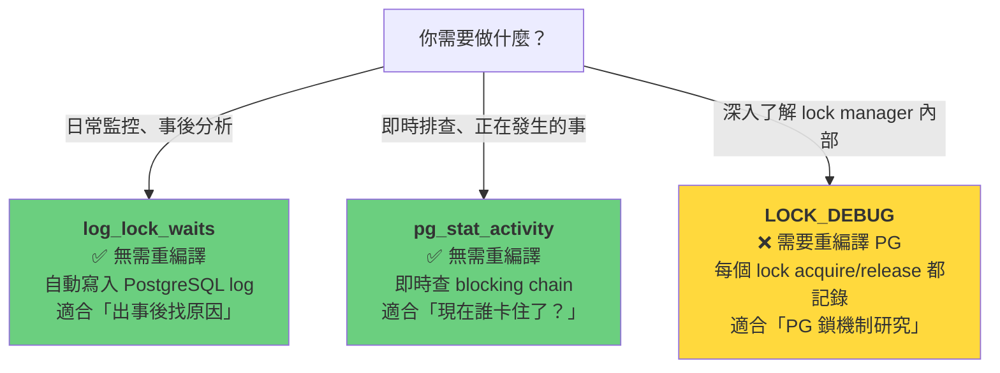
```mermaid
flowchart TD
    Q["你需要做什麼？"]
    Q -->|"日常監控、事後分析"| L1["<b>log_lock_waits</b><br/>✅ 無需重編譯<br/>自動寫入 PostgreSQL log<br/>適合「出事後找原因」"]
    Q -->|"即時排查、正在發生的事"| L2["<b>pg_stat_activity</b><br/>✅ 無需重編譯<br/>即時查 blocking chain<br/>適合「現在誰卡住了？」"]
    Q -->|"深入了解 lock manager 內部"| L3["<b>LOCK_DEBUG</b><br/>❌ 需要重編譯 PG<br/>每個 lock acquire/release 都記錄<br/>適合「PG 鎖機制研究」"]

    style L1 fill:#6bcf7f
    style L2 fill:#6bcf7f
    style L3 fill:#ffd93d
```

### VI. 生產環境配置（無需重編譯）

```ini
# postgresql.conf
log_lock_waits = on
deadlock_timeout = 1s
log_line_prefix = '%m [%p] %d %u '
```

```sql
-- 定期執行監控 query（cron / pg_cron）
SELECT pid, wait_event_type, wait_event,
       now() - wait_start AS wait_duration,
       pg_blocking_pids(pid) AS blocked_by,
       query
FROM pg_stat_activity
WHERE wait_event_type = 'Lock'
  AND now() - wait_start > '5s'::interval;
```

| 功能 | 引入版本 |
|------|---------|
| `wait_event_type` / `wait_event` | PG 9.6 |
| `pg_blocking_pids(pid)` | PG 9.6 |
| `log_lock_waits` 增強（附加 wait_event） | PG 13 |
| `wait_start` | PG 14 |
| `pg_stat_activity.wait_for` | PG 17 |

> **原始碼關鍵函數速查**：
>   - `log_lock_waits` 的觸發路徑：`ProcSleep()` 中進入等待時記錄開始時間 → `deadlock_timeout` 觸發 `CheckDeadLock()` → 如仍在等則輸出一條 `LOG` 記錄
>   - `wait_event` 的實現：`pgstat_report_wait_start()` / `pgstat_report_wait_end()`，在進入/退出 lock 等待時更新 `pg_stat_activity.wait_event`
>   - `pg_blocking_pids()` → 底層函數 `GetBlockerPidsData()` 掃描 `pg_locks` 找到阻塞者
>   - `LOCK_DEBUG` 機制：編譯時定義巨集 → `trace_locks` GUC 參數控制輸出 → 每個 lock 操作都呼叫 `elog(DEBUG3, ...)`

---

## 5. max_locks_per_transaction 與物件數量對效能的影響

> 來源：[digoal - max_locks_per_transaction & pg_locks entrys limit (2014-10-17)](https://github.com/digoal/blog/blob/master/201410/20141017_01.md)

### I. 問題：資料庫中物件越多效能越差嗎？

核心問題：PostgreSQL 中 table / index / sequence 等物件數量越多，單表操作的效能是否會下降？

答案分兩層：對於**單表操作**（DML），效能幾乎不受影響；真正的隱患在於 **catalog metadata 的記憶體佔用**與 **shared lock table 的插槽上限**。

> **新手白話**：想像一個圖書館有 50 萬本書 vs 只有 1 本書。你要拿一本書來看（單表 DML），找書的速度幾乎一樣——因為有索引目錄。但問題是：50 萬本書的「目錄卡片」本身就佔了 35GB 的空間，而且每個進來的人（每個 connection）都要複製一份目錄到自己的腦袋裡（per-backend relcache），這樣一下子記憶體就爆了。

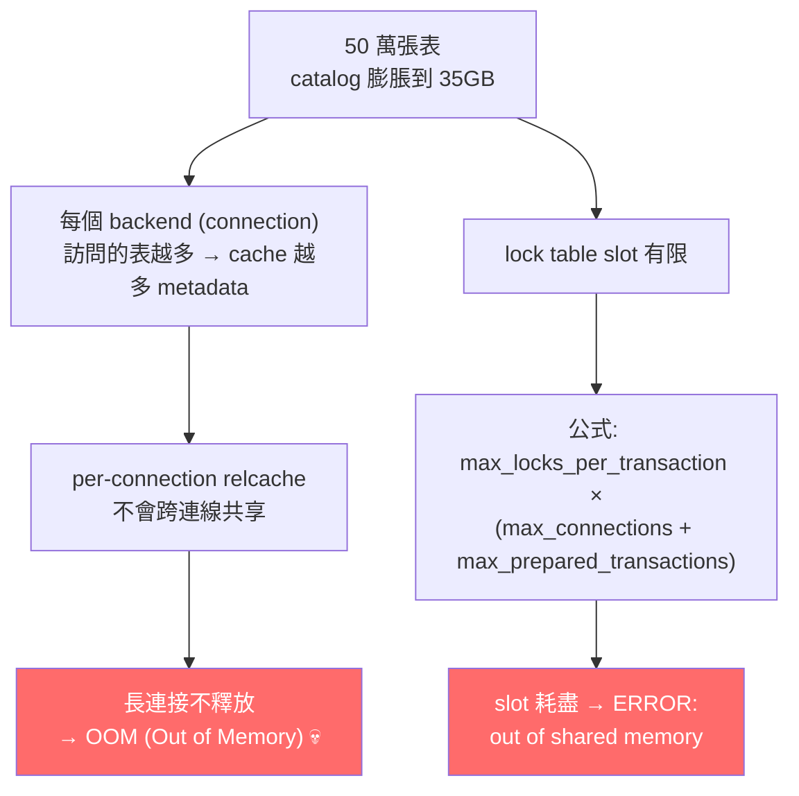
```mermaid
flowchart TD
    T["50 萬張表<br/>catalog 膨脹到 35GB"]
    T --> P1["每個 backend (connection)<br/>訪問的表越多 → cache 越多 metadata"]
    P1 --> P2["per-connection relcache<br/>不會跨連線共享"]
    P2 --> P3["長連接不釋放<br/>→ OOM (Out of Memory) 💀"]
    
    T --> S1["lock table slot 有限"]
    S1 --> S2["公式: max_locks_per_transaction ×<br/>(max_connections + max_prepared_transactions)"]
    S2 --> S3["slot 耗盡 → ERROR:<br/>out of shared memory"]
    
    style P3 fill:#ff6b6b,color:#fff
    style S3 fill:#ff6b6b,color:#fff
```

### II. 實驗：50 萬表 vs 1 張表的單表 DML

| 環境 | TPS | 差異 |
|------|-----|------|
| 50 萬表 | **39,231** | — |
| 1 張表 | **39,714** | +1.2% |

單表 DML 的效能差異幾乎在噪聲範圍內（~1.2%）。原因是 DML 執行時只會 lock 目標 table 對應的 catalog entry（已 cache 在 relcache 中），不會掃描整個 `pg_class`。

但建完 50 萬張表後，資料庫已達 **35 GB**（全為 catalog table 的 metadata）：

| Catalog Table | Row Count |
|--------------|-----------|
| `pg_class` | 2,000,322 |
| `pg_attribute` | 10,502,467 |

### III. 真正的隱患：Memory 與 Lock Slot 耗盡

**Catalog Cache（syscache + relcache）記憶體佔用：**

PostgreSQL 在 backend 啟動後首次訪問一個 relation 時，會將該 relation 的 catalog metadata 載入 `relcache`。cache 是 per-backend（per-connection）的，不會跨連接共享。

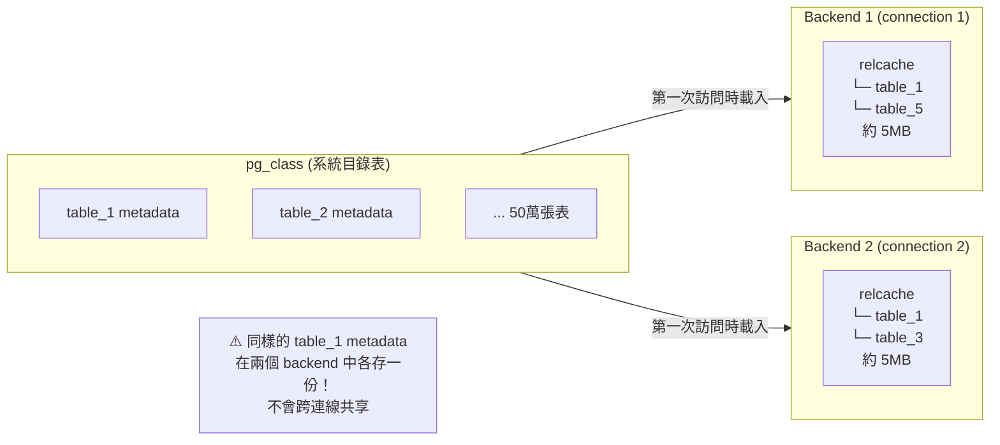
```mermaid
flowchart LR
    subgraph catalog["pg_class (系統目錄表)"]
        T1["table_1 metadata"]
        T2["table_2 metadata"]
        T3["... 50萬張表"]
    end

    subgraph backend1["Backend 1 (connection 1)"]
        C1["relcache<br/>└─ table_1<br/>└─ table_5<br/>約 5MB"]
    end

    subgraph backend2["Backend 2 (connection 2)"]
        C2["relcache<br/>└─ table_1<br/>└─ table_3<br/>約 5MB"]
    end

    catalog -->|"第一次訪問時載入"| backend1
    catalog -->|"第一次訪問時載入"| backend2

    Note1["⚠️ 同樣的 table_1 metadata<br/>在兩個 backend 中各存一份！<br/>不會跨連線共享"]
```

> **新手白話**：每個 connection (backend) 都有自己的「小抄」(relcache)，存著它訪問過的表的結構資訊。50 萬張表雖然存在資料庫裡，但只要你的連線只訪問其中幾張，就不會全部載入。但如果你用 `pg_dump` 或 ORM 初始化時的「全表掃描」，就會把目錄裡所有表的資訊都載入記憶體——每個連線一份！

**Lock Slot 耗盡機制：**

`max_locks_per_transaction` 控制 shared memory 中的 lock table slot 數量。公式：

```
shared lock table size = max_locks_per_transaction * (max_connections + max_prepared_transactions)
```

若不足，報錯：`ERROR: out of shared memory` / `HINT: You might need to increase max_locks_per_transaction.`

> PG 為常見的 weak lock（AccessShareLock、RowShareLock 等）提供了 fast-path 機制，這些 lock 不佔用 shared lock table slot，直到發生衝突時才遷移到 main table。因此 `max_locks_per_transaction = 64` 在大多數場景足夠。真正需要調大的情況：大批次 DDL、大量 concurrent transaction 同時對大量不同 table 取強鎖、pg_dump 並行模式。

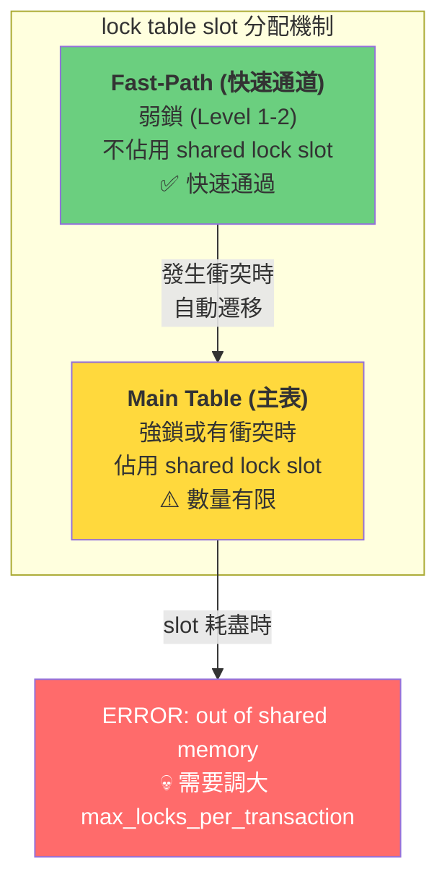
```mermaid
flowchart TD
    subgraph "lock table slot 分配機制"
        FP["<b>Fast-Path (快速通道)</b><br/>弱鎖 (Level 1-2)<br/>不佔用 shared lock slot<br/>✅ 快速通過"]
        MP["<b>Main Table (主表)</b><br/>強鎖或有衝突時<br/>佔用 shared lock slot<br/>⚠️ 數量有限"]
    end

    FP -->|"發生衝突時<br/>自動遷移"| MP
    MP -->|"slot 耗盡時"| ERR["ERROR: out of shared memory<br/>💀 需要調大 max_locks_per_transaction"]
    
    style FP fill:#6bcf7f
    style MP fill:#ffd93d
    style ERR fill:#ff6b6b,color:#fff
```

> **新手白話**：PG 對於常見的弱鎖（像 SELECT 的 AccessShareLock）走「快速通道」，不佔用共享記憶體的 slot 配額。只有強鎖（Level 3+）或發生衝突時，才搬到主表佔用 slot。這是為什麼預設 64 個 slot 看起來很少，但大部分場景夠用的原因——弱鎖都走快速通道了。

### IV. Catalog 掃描影響

| 操作 | Catalog 掃描方式 | 大量 table 的影響 |
|------|-----------------|------------------|
| 單表 DML | Index lookup（OID / relname） | 幾乎無影響 |
| autovacuum launcher cycle | 掃 `pg_class` 找候選 | 線性增長 |
| pg_dump | 掃多張 catalog table | 線性增長 |
| `\dt` / `\d` | 掃 `pg_class` + join | 線性增長 |
| ORM / framework startup | 可能全掃 catalog | 易成為瓶頸 |
| Logical replication startup | 逐表檢查 | 線性增長 |

> 實務建議：盡量避免單一 database 中有數十萬張獨立 table。如需隔離資料，優先考慮 Partition（PG 10+ declarative partitioning）或 schema-per-tenant。

> **原始碼關鍵函數速查**：
>   - `max_locks_per_transaction` 的初始化：`LockShmemSize()` 計算共享記憶體大小 → `InitLocks()` 分配 lock hash table
>   - fast-path 的實現：`FastPathGrantRelationLock()` 在 `lock.c` 中，弱鎖走 fast-path；`FastPathUnGrantRelationLock()` 釋放
>   - fast-path → main table 的遷移：`FastPathTransferRelationLocks()` — 當強鎖請求來時，把衝突的 fast-path lock 遷移到 main table
>   - relcache (relation cache) 的初始化：`RelationCacheInitialize()` → `RelationBuildDesc()` → 從 `pg_class`/`pg_attribute` 讀取並建立 cache 條目
>   - catalog 掃描成本：`systable_beginscan()` / `systable_endscan()` → 對系統表做 sequential scan 時成本隨 row 數線性增長

---

# 二、Advisory Lock 應用場景

## 1. Advisory Lock API 概述

PostgreSQL 的 Advisory Lock 是 application-level lock，不與 table/row 綁定，只認一個 `bigint key`（或兩個 `int key`）。適合跨多個 transaction 的協調、或需要自訂鎖語意的場景。

> **新手白話**：一般的鎖（前面介紹的那些）是 PG 自動幫你管理的——你執行 `UPDATE`，PG 自動拿 RowExclusiveLock。但 Advisory Lock（建議鎖）不一樣——它是你**手動控制的鎖**。你只需要決定一個「暗號」（一個數字 key），然後說「我要鎖住暗號 42」，PG 就幫你鎖住——跟表、跟 row 都沒關係，純粹是你自訂的協調機制。這就像去健身房用置物櫃：櫃子號碼是你自己選的，跟櫃子裡面放什麼無關。

### I. Session-Level Lock（會話鎖）

| 函數 | 說明 |
|------|------|
| `pg_advisory_lock(key)` | 獲取排他 session lock（blocking） |
| `pg_advisory_lock_shared(key)` | 獲取共享 session lock（blocking） |
| `pg_try_advisory_lock(key)` | 嘗試獲取排他 session lock（non-blocking） |
| `pg_try_advisory_lock_shared(key)` | 嘗試獲取共享 session lock（non-blocking） |
| `pg_advisory_unlock(key)` | 釋放排他 session lock |
| `pg_advisory_unlock_shared(key)` | 釋放共享 session lock |
| `pg_advisory_unlock_all()` | 釋放當前 session 的所有 advisory lock |

### II. Transaction-Level Lock（交易鎖）

| 函數 | 說明 |
|------|------|
| `pg_advisory_xact_lock(key)` | 獲取排他 transaction lock（blocking，transaction 結束自動釋放） |
| `pg_advisory_xact_lock_shared(key)` | 獲取共享 transaction lock（blocking） |
| `pg_try_advisory_xact_lock(key)` | 嘗試獲取排他 transaction lock（non-blocking） |
| `pg_try_advisory_xact_lock_shared(key)` | 嘗試獲取共享 transaction lock（non-blocking） |

關鍵區別：
- **Session lock**：需手動釋放，或 session 斷開時自動釋放。適合跨多個 transaction 的協調。
- **Transaction lock**：transaction commit/rollback 時自動釋放，不需手動管理。

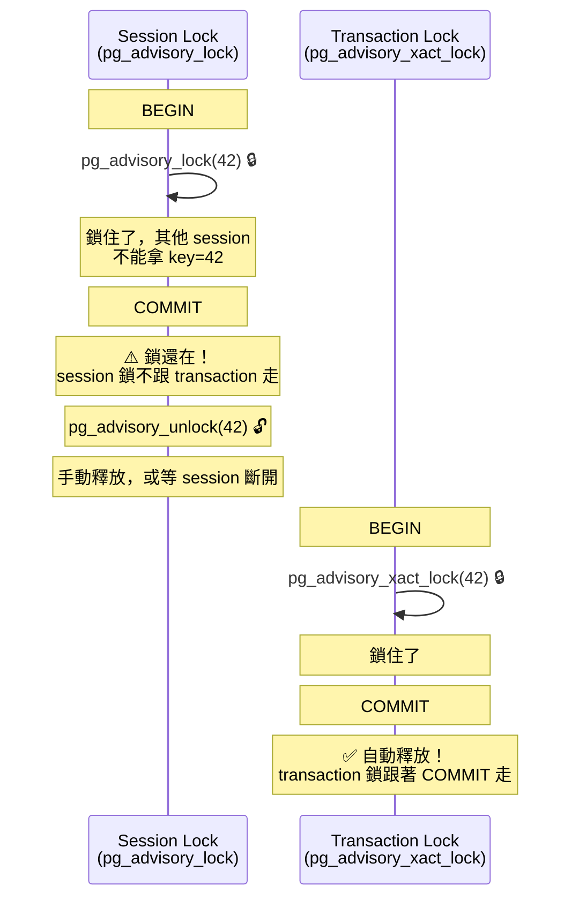
```mermaid
sequenceDiagram
    participant S as Session Lock<br/>(pg_advisory_lock)
    participant T as Transaction Lock<br/>(pg_advisory_xact_lock)

    Note over S: BEGIN
    S->>S: pg_advisory_lock(42) 🔒
    Note over S: 鎖住了，其他 session<br/>不能拿 key=42
    Note over S: COMMIT
    Note over S: ⚠️ 鎖還在！<br/>session 鎖不跟 transaction 走

    Note over S: pg_advisory_unlock(42) 🔓
    Note over S: 手動釋放，或等 session 斷開

    Note over T: BEGIN
    T->>T: pg_advisory_xact_lock(42) 🔒
    Note over T: 鎖住了
    Note over T: COMMIT
    Note over T: ✅ 自動釋放！<br/>transaction 鎖跟著 COMMIT 走
```

> **選擇建議**：如果你需要「一筆交易裡拿到鎖，交易結束自動釋放」→ 用 **Transaction lock**（`xact` 系列）。如果你需要「跨多筆交易保持鎖定」→ 用 **Session lock**，但要記得手動 `unlock`，不然會鎖到 session 斷開。

> Lock 數量無上限（不佔 `max_locks_per_transaction` slot，advisory lock 使用獨立的 shared memory hash table）。PG 9.6+ 可透過 `pg_locks` 查看：`SELECT * FROM pg_locks WHERE locktype = 'advisory'`。

> **原始碼關鍵函數速查**：
>   - advisory lock 的儲存：使用獨立的 shared memory hash table（`AdvisoryLockHash`），不跟 table-level lock 共用 slot
>   - Session lock 實現：`pg_advisory_lock()` → `LockAcquire()` with `locktag_type = LOCKTAG_ADVISORY`
>   - Transaction lock 實現：`pg_advisory_xact_lock()` → lock 自動註冊到當前 transaction 的 `ResourceOwner`，COMMIT 時 `LockReleaseAll()` 一併釋放
>   - `try` 版本：`pg_try_advisory_lock()` → 呼叫 `LockAcquire()` 但設置 `dontWait = true`，拿不到就立刻返回 false

---

## 2. 高並發全表更新：Advisory Lock vs SKIP LOCKED

> 來源：[digoal - PostgreSQL 使用advisory lock或skip locked消除行锁冲突 (2016-10-18)](https://github.com/digoal/blog/blob/master/201610/20161018_01.md)

### I. 場景

4GB 表，10,000 row，每 row 存大型 array。全表所有 row 需要週期性更新。單一 transaction 更新全表需 **80 秒**。目標：100 個 concurrent session 並行更新，每個 session 負責不同的 row subset，無 row lock conflict。

> **新手白話**：一個人更新 10,000 行要 80 秒。如果你開 100 個人同時更新，理論上只要 0.8 秒——但前提是每個人更新「不同」的行，避免互相搶同一行的鎖。核心問題是：如何確保 100 個 session 不會同時搶到同一行？

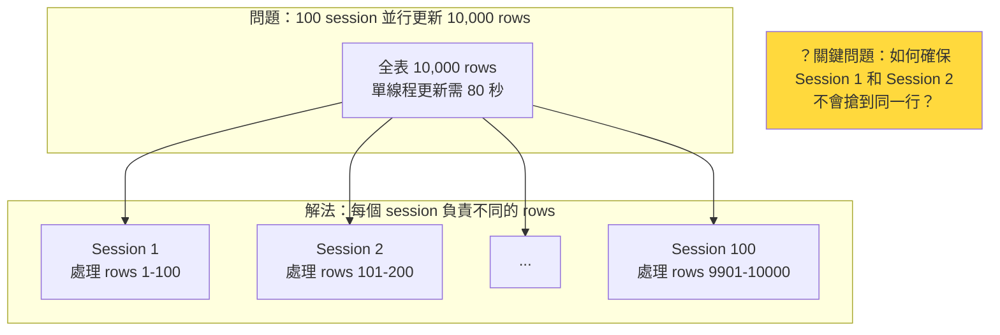
```mermaid
flowchart TD
    subgraph problem["問題：100 session 並行更新 10,000 rows"]
        T["全表 10,000 rows<br/>單線程更新需 80 秒"]
    end

    subgraph solution["解法：每個 session 負責不同的 rows"]
        S1["Session 1<br/>處理 rows 1-100"]
        S2["Session 2<br/>處理 rows 101-200"]
        S3["..."]
        S4["Session 100<br/>處理 rows 9901-10000"]
    end

    T --> S1
    T --> S2
    T --> S3
    T --> S4

    Q["？關鍵問題：如何確保<br/>Session 1 和 Session 2<br/>不會搶到同一行？"]
    
    style Q fill:#ffd93d
```

**兩種解法**：Advisory Lock（用自訂暗號標記「這行我在處理」）vs SKIP LOCKED（PG 內建機制，自動跳過被鎖的行）。

### II. 方法一：Advisory Lock

每次更新前嘗試取得該 row 對應的 advisory lock，拿到鎖才更新：

```sql
FOR v_id IN SELECT id FROM table LOOP
    IF pg_try_advisory_xact_lock(v_id) THEN
        UPDATE ... WHERE id = v_id;
    END IF;
END LOOP;
```

Benchmark（100 並行）：latency average = 4,407ms（vs 80s 單線程 → 18x 加速）。

### III. 方法二：SKIP LOCKED（PG 9.5+）

```sql
SELECT id INTO v_id FROM table
ORDER BY id LIMIT 1
FOR UPDATE SKIP LOCKED;
```

Benchmark（100 並行）：latency average = 4,204ms（與 advisory lock 相當）。

### IV. 兩種方法對比

| 維度 | Advisory Lock | SKIP LOCKED |
|------|--------------|-------------|
| PG 最低版本 | 9.4 | 9.5 |
| 實現難度 | 中（需管理 lock ID 全域唯一性） | 低（純 SQL） |
| 全域 ID 衝突風險 | 有 | 無 |
| Transaction 要求 | Transaction-level | Statement 結束釋放 |
| Connection Pool | 需 transaction pooling | 無此限制 |

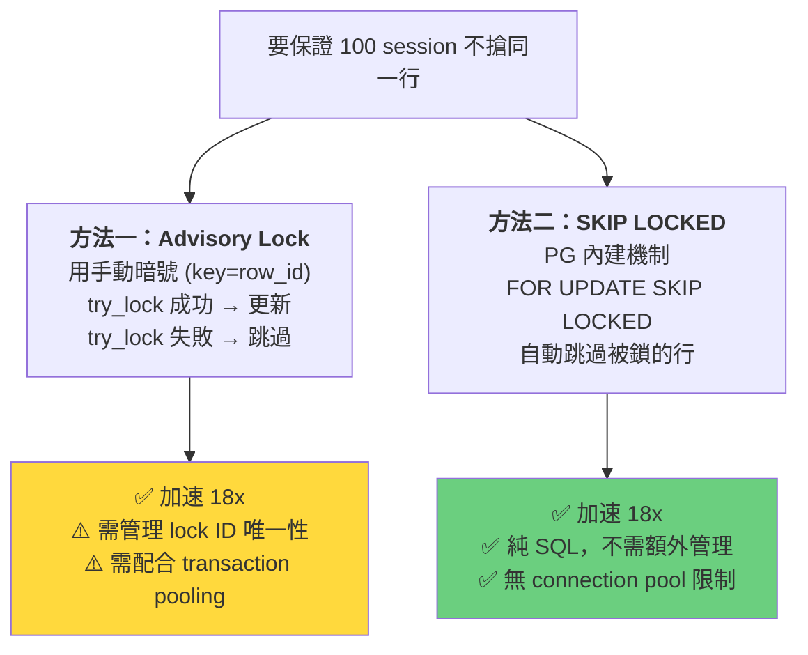
```mermaid
flowchart TD
    Q["要保證 100 session 不搶同一行"]
    Q --> AL["<b>方法一：Advisory Lock</b><br/>用手動暗號 (key=row_id)<br/>try_lock 成功 → 更新<br/>try_lock 失敗 → 跳過"]
    Q --> SK["<b>方法二：SKIP LOCKED</b><br/>PG 內建機制<br/>FOR UPDATE SKIP LOCKED<br/>自動跳過被鎖的行"]
    
    AL --> AL_RESULT["✅ 加速 18x<br/>⚠️ 需管理 lock ID 唯一性<br/>⚠️ 需配合 transaction pooling"]
    SK --> SK_RESULT["✅ 加速 18x<br/>✅ 純 SQL，不需額外管理<br/>✅ 無 connection pool 限制"]
    
    style SK_RESULT fill:#6bcf7f
    style AL_RESULT fill:#ffd93d
```

> **現代建議**：PG 9.5+ 環境優先用 **SKIP LOCKED**——純 SQL、不需管理 ID、沒有 pool 限制。只有在需要跨多個 table 的複雜協調時，才考慮 Advisory Lock。

### V. 現代化方案

**PG 15+ MERGE 批次處理：**

```sql
WITH batch AS (
    SELECT id FROM table
    WHERE id > :last_id ORDER BY id LIMIT 100
    FOR UPDATE SKIP LOCKED
)
UPDATE table t SET info = array_append(info, 1)
FROM batch b WHERE t.id = b.id;
```

**分片方案（無需 advisory lock 也不需 SKIP LOCKED）：**

```sql
SELECT id FROM table
WHERE mod(id, 4) = :shard_id
ORDER BY id LIMIT 100
FOR UPDATE SKIP LOCKED;
```

每個 session 有固定責任範圍（`mod(id, N)`），不需掃描全表。

> **原始碼關鍵函數速查**：
>   - `SKIP LOCKED` 的實現：`ExecLockRows()` 中，當 `heap_lock_tuple()` 回傳 `HeapTupleWouldBlock` 時，如果設了 `SKIP LOCKED`，則跳過該行繼續下一行
>   - `pg_try_advisory_xact_lock()` → lock 在 COMMIT 時自動釋放，保證「拿到鎖 → 更新 → COMMIT → 釋放」的原子性
>   - `FOR UPDATE` + `SKIP LOCKED`：row-level lock 在 statement 結束就釋放（除非在 explicit transaction 中），比 advisory lock 更短命

---

## 3. 秒殺場景優化：Advisory Lock vs FOR UPDATE NOWAIT

> 來源：[digoal - PostgreSQL 秒杀场景优化 (2015-09-14)](https://github.com/digoal/blog/blob/master/201509/20150914_01.md)

### I. 核心問題

秒殺場景典型瓶頸：多個 concurrent session 同時更新同一條 record，獲得 row lock 的 session 處理期間，其他 session 全部等待——對於沒搶到鎖的用戶，等待毫無意義。

> **新手白話**：秒殺就像限量球鞋發售——1000 個人搶 10 雙鞋。只有一個人能拿到庫存的那一行 lock，其他 999 人應該立刻看到「已售罄」，而不是排隊等。但 PG 預設的行為是「排隊等」，這 999 個人全卡在資料庫裡，CPU 都被等待消耗掉了。

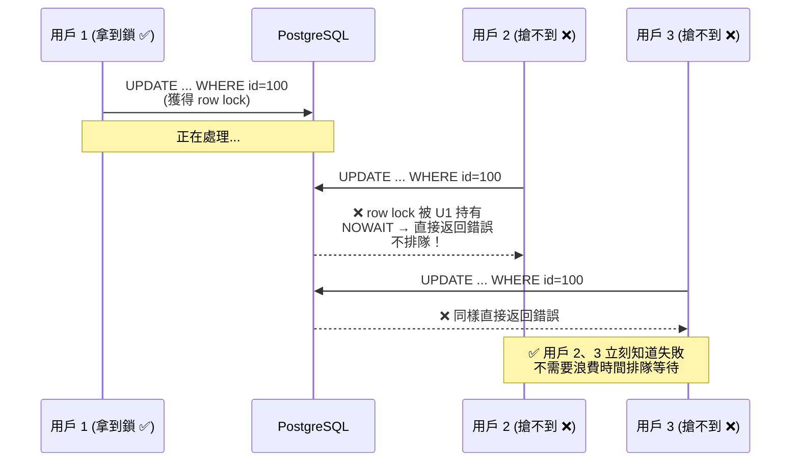
```mermaid
sequenceDiagram
    participant U1 as 用戶 1 (拿到鎖 ✅)
    participant DB as PostgreSQL
    participant U2 as 用戶 2 (搶不到 ❌)
    participant U3 as 用戶 3 (搶不到 ❌)

    U1->>DB: UPDATE ... WHERE id=100<br/>(獲得 row lock)
    Note over U1,DB: 正在處理...

    U2->>DB: UPDATE ... WHERE id=100
    DB-->>U2: ❌ row lock 被 U1 持有<br/>NOWAIT → 直接返回錯誤<br/>不排隊！

    U3->>DB: UPDATE ... WHERE id=100
    DB-->>U3: ❌ 同樣直接返回錯誤

    Note over U2,U3: ✅ 用戶 2、3 立刻知道失敗<br/>不需要浪費時間排隊等待
```

> **核心思路**：「拿不到就立刻失敗」比「等看看」更適合秒殺場景。四種方案的核心區別在於：**如何讓拿不到鎖的 session 最快認輸？**

### II. 四種方案 Benchmark

**方案 A：無優化 Baseline**

```sql
UPDATE t1 SET info = now()::text WHERE id = :id;
```

128 concurrent, 100s: TPS = **2,855**。

**方案 B：FOR UPDATE NOWAIT**

```sql
PERFORM 1 FROM t1 WHERE id = i_id FOR UPDATE NOWAIT;
UPDATE t1 SET info = now()::text WHERE id = i_id;
```

128 concurrent, 100s: TPS = **66,623**（提升 ~23 倍）。無法即刻獲得 row lock 的 session 直接返回 error，不等待。

**方案 C：pg_try_advisory_xact_lock（Direct UPDATE）**

```sql
UPDATE t1 SET info = now()::text
WHERE id = :id AND pg_try_advisory_xact_lock(:id);
```

20 concurrent, 60s: TPS = **23,194**（比 FOR UPDATE NOWAIT 提升 ~75%）。

**方案 D：Advisory Lock + Function 包裝（消除無用掃描）**

先純 CPU 判斷 advisory lock 是否取得，拿到才做 UPDATE：

80 concurrent, 60s: TPS = **231,197**（對比 baseline 提升 ~81 倍）。

### III. 總結對比

| 方案 | TPS (20C) | TPS (128C/80C) | 無用掃描 | 說明 |
|------|-----------|----------------|---------|------|
| 無優化 | — | 2,855 | — | row lock 排隊等待 |
| FOR UPDATE NOWAIT | 13,196 | 66,623 | 大量 | 即刻失敗不等待 |
| Advisory Lock (direct) | 23,194 | — | 大量 | TPS 高但大量無用 scan |
| Advisory Lock + 先判斷 | 20,283 | 231,197 | 極少 | 消除無用 scan |

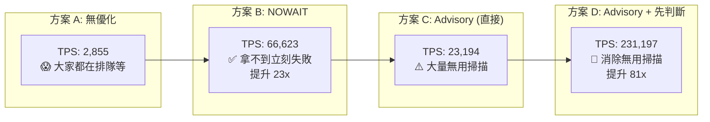
```mermaid
flowchart LR
    subgraph baseline["方案 A: 無優化"]
        A["TPS: 2,855<br/>😱 大家都在排隊等"]
    end
    subgraph nowait["方案 B: NOWAIT"]
        B["TPS: 66,623<br/>✅ 拿不到立刻失敗<br/>提升 23x"]
    end
    subgraph adv["方案 C: Advisory (直接)"]
        C["TPS: 23,194<br/>⚠️ 大量無用掃描"]
    end
    subgraph adv2["方案 D: Advisory + 先判斷"]
        D["TPS: 231,197<br/>🚀 消除無用掃描<br/>提升 81x"]
    end

    A --> B --> C --> D
```

### IV. SKIP LOCKED 現代模式（PG 9.5+）

```sql
WITH locked AS (
    SELECT id FROM tbl
    WHERE upd_cnt + 1 <= 5
    ORDER BY id LIMIT 1
    FOR UPDATE SKIP LOCKED
)
UPDATE tbl SET info = now(), upd_cnt = upd_cnt + 1
FROM locked WHERE tbl.id = locked.id;
```

既消除了 advisory lock 的全局 ID 管理問題，又做到了不等待、不無用掃描。

> 實戰注意：Advisory lock ID 必須全局唯一（不同業務可能共用同一 lock namespace）；分段秒殺：庫存打散成多條 record 進一步提高並發；Pool 模式：必須用 transaction pooling（非 session pooling）。

> **原始碼關鍵函數速查**：
>   - `FOR UPDATE NOWAIT`：`heap_lock_tuple()` 中當 `nowait = true` 且 lock 拿不到時，直接回傳 `HeapTupleWouldBlock`，不進入等待佇列
>   - `pg_try_advisory_xact_lock()` vs `pg_advisory_xact_lock()`：差別在 `LockAcquire()` 的 `dontWait` 參數設為 true → 拿不到就回傳 false，不 block
>   - 方案 D 為什麼最快：先用純 CPU 的 `try_lock` 判斷（不走 disk I/O），只有拿到鎖才做 UPDATE（才會有 disk I/O），大幅減少無用的磁碟讀寫

---

## 4. OLTP 高並發排隊：Advisory Lock Admission Control

> 來源：[digoal - PostgreSQL OLTP 高並發請求性能優化 (2015-10-08)](https://github.com/digoal/blog/blob/master/201510/20151008_01.md)

### I. 核心問題：並發數超過 CPU 核數後 TPS 急降

在多核系統中，當 concurrent 數超過 CPU 核數的 2~3 倍後，效能開始下降。原因疊加：
1. Context switching 開銷：backend process 數量遠超 CPU 核數
2. Snapshot 管理成本：每個 active backend 都需建立 snapshot（ProcArrayLock contention）
3. Lock contention：大量 backend 同時競爭 row-level lock
4. Memory 壓力：每個 backend 消耗 ~5-10 MB

> **新手白話**：想像一個廚房有 4 個爐子（=CPU 核數）。如果有 4 個廚師同時做菜，效率最高。但如果你塞 400 個廚師進去，大家搶爐子、撞來撞去（context switch）、每個人都要排隊拿鍋鏟（lock contention）——反而一道菜都做不出來。這就是「並發數超過 CPU 後 TPS 反而下降」的原因。

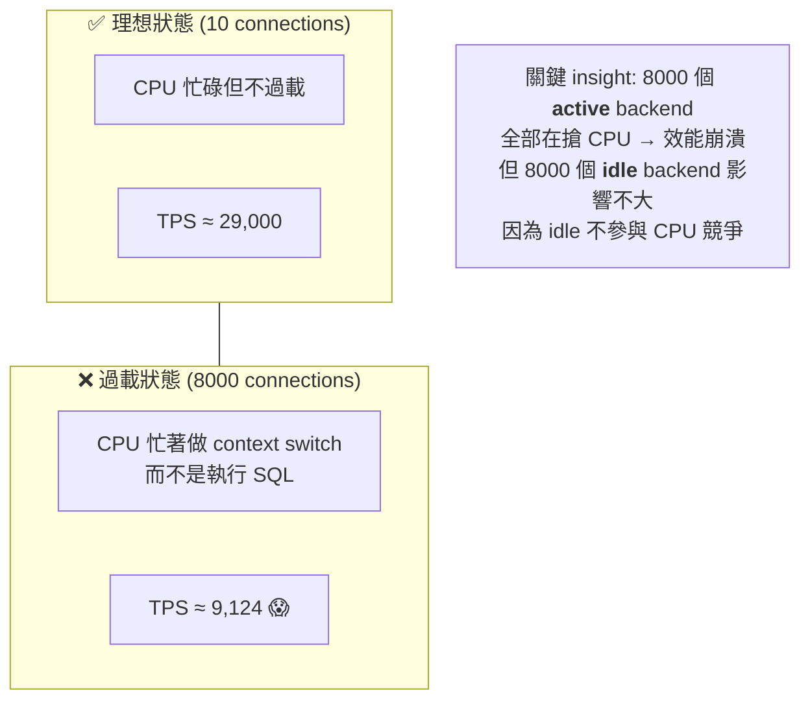
```mermaid
flowchart TD
    subgraph good["✅ 理想狀態 (10 connections)"]
        CPU_G["CPU 忙碌但不過載"]
        TPS_G["TPS ≈ 29,000"]
    end

    subgraph bad["❌ 過載狀態 (8000 connections)"]
        CPU_B["CPU 忙著做 context switch<br/>而不是執行 SQL"]
        TPS_B["TPS ≈ 9,124 😱"]
    end

    good --- bad
    note["關鍵 insight: 8000 個 <b>active</b> backend<br/>全部在搶 CPU → 效能崩潰<br/>但 8000 個 <b>idle</b> backend 影響不大<br/>因為 idle 不參與 CPU 競爭"]
```

### II. 實驗：8000 active vs idle

**8000 active backend 全部執行 UPDATE：** TPS ≈ **9,124**（大部分時間消耗在 CPU scheduling）

**10 active + 7990 idle backend：** TPS ≈ **29,000**（idle connection 對效能幾乎無影響）

> 關鍵結論：只有真正執行 SQL 的 backend 才會參與 CPU 競爭。8000 idle 連接只佔用 memory（約 40-80GB），不參與 ProcArray lock / snapshot 競爭。

### III. Advisory Lock 排隊方案（Admission Control）

限制真正並行處理的 backend 數量，多出限制的連線等待：

```sql
CREATE OR REPLACE FUNCTION upd(l INT, v_id INT) RETURNS void AS $$
BEGIN
    LOOP
        IF pg_try_advisory_xact_lock(l) THEN
            UPDATE test_8000 SET cnt = cnt + 1 WHERE id = v_id;
            UPDATE test_8000 SET cnt = cnt + 2 WHERE id = v_id;
            RETURN;
        ELSE
            PERFORM pg_sleep(30 * random());
        END IF;
    END LOOP;
END;
$$ LANGUAGE plpgsql STRICT;
```

**實驗三：Advisory Lock 排隊（8000 backend，最多 10 個同時執行）**

TPS ≈ **26,774**，相比不排隊（9,124）提升約 **2.9 倍**。CPU idle 仍高達 93.9%——大部分 backend 處於 `pg_sleep()` 狀態。

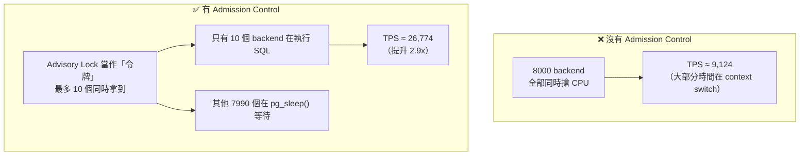
```mermaid
flowchart TD
    subgraph without["❌ 沒有 Admission Control"]
        W1["8000 backend<br/>全部同時搶 CPU"]
        W2["TPS ≈ 9,124<br/>（大部分時間在 context switch）"]
        W1 --> W2
    end

    subgraph with["✅ 有 Admission Control"]
        A1["Advisory Lock 當作「令牌」<br/>最多 10 個同時拿到"]
        A2["只有 10 個 backend 在執行 SQL"]
        A3["其他 7990 個在 pg_sleep() 等待"]
        A4["TPS ≈ 26,774<br/>（提升 2.9x）"]
        A1 --> A2 --> A4
        A1 --> A3
    end
```

> **新手白話**：Admission Control 就像夜店的「人數管制」——門口保鏢（advisory lock）只放 10 個人進去跳舞（執行 SQL），其他人（7990 人）在外面排隊喝飲料（pg_sleep）。這樣裡面不會擠爆（CPU 不超載），外面的人雖然在等，但不會消耗太多 CPU。缺點是：還是佔用了 8000 個 backend process 的記憶體空間。

### IV. 現代解決方案對比

| 方案 | 優點 | 缺點 |
|------|------|------|
| Advisory Lock 排隊 | 應用層可控、不需外部組件 | 仍佔用 8000 backend process（memory） |
| pgbouncer transaction pooling | 成熟穩定、極低 overhead | 不支援 prepared statement 跨 transaction |
| PG 14+ `idle_session_timeout` | 無需外部組件 | 不如 pgbouncer 精細 |
| `SKIP LOCKED`（PG 9.5+） | 天然支援工作佇列模式 | 僅適用於 queue-like table design |

> **現代最佳實踐**：pgbouncer transaction pooling + `max_client_conn = 10000` / `default_pool_size = 200` + PG 端 `max_connections = 200`。把 10,000 個 client 連線收斂到 200 個真正的 PG backend。

> **原始碼關鍵函數速查**：
>   - Context switch 的成本來源：PG 的 backend 是 OS process（不是 thread），每個 process 切換都需要完整的 context switch（register save/restore、TLB flush 等）
>   - Admission Control 的核心：`pg_try_advisory_xact_lock(l)` 限制同時執行的 backend 數 → 多餘的用 `pg_sleep()` 讓出 CPU
>   - `ProcArrayLock` 競爭：每個 active backend 在建立 snapshot 時都要獲取這個輕量級鎖（LWLock），backend 越多競爭越激烈
>   - PgBouncer transaction pooling：client 連到 pgbouncer（10000 conns）→ pgbouncer 轉發到 PG（只有 200 conns），從根本上減少 PG backend 數量

---

## 5. 無縫自增 ID：Advisory Lock Generator

> 來源：[digoal - PostgreSQL 无缝自增ID的实现 - by advisory lock (2016-10-20)](https://github.com/digoal/blog/blob/master/201610/20161020_02.md)

### I. SEQUENCE 的空洞問題

PostgreSQL 的 `SERIAL` / `SEQUENCE` 提供遞增數值，但 rollback 時序列值已被取走，產生空洞：

```sql
BEGIN;
INSERT INTO seq_test (info) VALUES ('test');  -- id=2
ROLLBACK;                                      -- id=2 永不復用
INSERT INTO seq_test (info) VALUES ('test');  -- id=3
```

這是 SEQUENCE 的設計取捨：為效能最大化（無 lock contention），犧牲連續性。

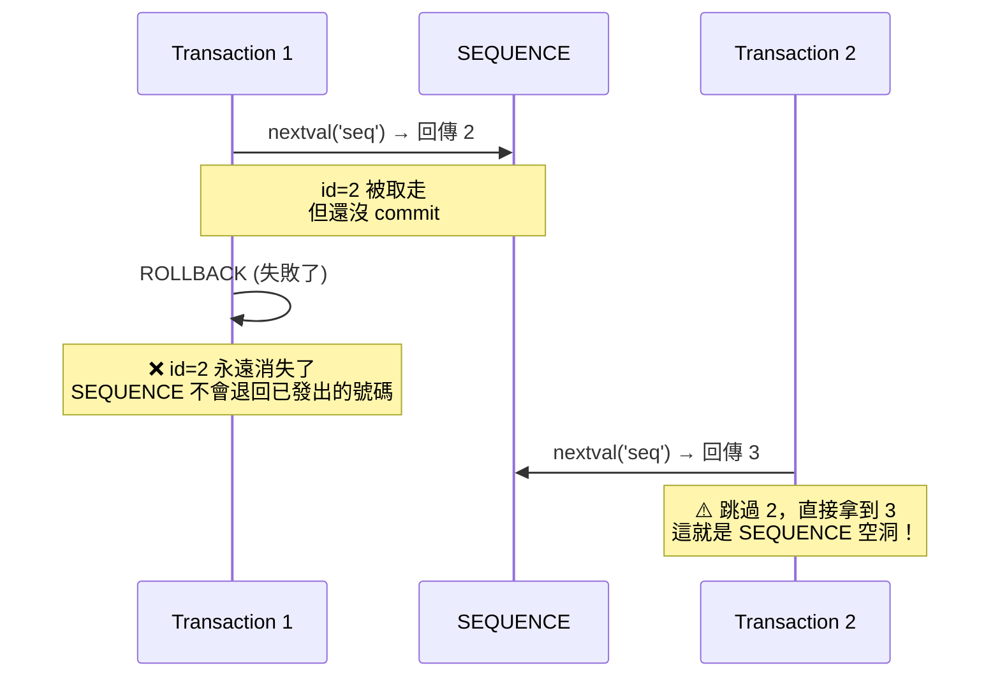
```mermaid
sequenceDiagram
    participant T1 as Transaction 1
    participant SEQ as SEQUENCE
    participant T2 as Transaction 2

    T1->>SEQ: nextval('seq') → 回傳 2
    Note over T1,SEQ: id=2 被取走<br/>但還沒 commit

    T1->>T1: ROLLBACK (失敗了)
    Note over T1: ❌ id=2 永遠消失了<br/>SEQUENCE 不會退回已發出的號碼

    T2->>SEQ: nextval('seq') → 回傳 3
    Note over T2: ⚠️ 跳過 2，直接拿到 3<br/>這就是 SEQUENCE 空洞！
```

> **新手白話**：SEQUENCE 的設計理念是「速度優先，犧牲連續」。`nextval` 是原子操作（atomic），多個 session 同時拿號碼不會互鎖。但如果一個 session 拿到號碼後 ROLLBACK 了，那個號碼就永遠消失了——SEQUENCE 不會記住「誰退回了號碼」。這就像排隊領號碼牌，你拿到 2 號但轉頭走了，3 號的人也不會回頭變成 2 號。

### II. 何時需要無縫 ID？

| 場景 | 是否需要無縫 | 原因 |
|------|------------|------|
| 發票號碼 (invoice number) | **是** | 法規 / 審計要求連續 |
| 銀行流水號 | **是** | 監管要求不可跳號 |
| PK (Primary Key) | 否 | 空洞不影響功能 |
| 對外 API 的 ID | 否 | 用 UUID 更好 |

> 即使業務需要無縫 ID，也應分離 PK 與業務 ID。PK 用 `SERIAL` / `BIGSERIAL` 確保寫入效能；業務 ID 用本文方案單獨生成。

### III. Advisory Lock Generator 實作

核心邏輯：以 `id` 值本身作為 advisory lock key——若 `pg_try_advisory_xact_lock(N)` 成功，表示當前 transaction 獨佔了 ID=N。

```sql
CREATE TABLE uniq_test (id int PRIMARY KEY, info text);

CREATE OR REPLACE FUNCTION f_uniq(i_info text) RETURNS int AS $$
DECLARE
    newid int;
    i int := 0;
    res int;
BEGIN
    LOOP
        IF i > 0 THEN
            PERFORM pg_sleep(0.2 * random());  -- 衝突時隨機退縮
        ELSE
            i := i + 1;
        END IF;

        SELECT max(id) + 1 INTO newid FROM uniq_test;

        IF newid IS NOT NULL THEN
            IF pg_try_advisory_xact_lock(newid) THEN
                INSERT INTO uniq_test (id, info) VALUES (newid, i_info);
                RETURN newid;
            ELSE
                CONTINUE;  -- 鎖被搶走，重試下一個 ID
            END IF;
        ELSE
            IF pg_try_advisory_xact_lock(1) THEN
                INSERT INTO uniq_test (id, info) VALUES (1, i_info);
                RETURN 1;
            END IF;
        END IF;
    END LOOP;

    EXCEPTION WHEN OTHERS THEN
        SELECT f_uniq(i_info) INTO res;
        RETURN res;
END;
$$ LANGUAGE plpgsql STRICT;
```

### IV. 效能實測

| 指標 | 數值 |
|------|------|
| 並發數 | 164 clients |
| TPS | **11,730** |
| Avg Latency | 13.79 ms |
| 結果 | count = max = 119,565（完美無空洞） |

```mermaid
flowchart TD
    START["開始 f_uniq()"]
    CALC["SELECT max(id) + 1 → newid<br/>(計算下一個 ID)"]
    TRY["pg_try_advisory_xact_lock(newid)<br/>(嘗試用 advisory lock 獨佔這個 ID)"]
    SUCCESS["✅ 拿到鎖 → INSERT id=newid<br/>COMMIT 時自動釋放鎖"]
    FAIL["❌ 沒拿到鎖 (被別人搶先)<br/>隨機 sleep → 重試下一個 ID"]
    RETRY["CONTINUE: 回到 LOOP 開頭"]

    START --> CALC
    CALC --> TRY
    TRY -->|"try_lock 成功"| SUCCESS
    TRY -->|"try_lock 失敗"| FAIL
    FAIL --> RETRY
    RETRY --> CALC
```

> **新手白話**：這個演算法的核心是「用 advisory lock 當樂透號碼」。假設目前最大 id=100，那下一個就是 101。session A 搶先用 `try_lock(101)` 鎖住 101 → 確認沒人用 → INSERT。如果 session B 也來搶 101，`try_lock(101)` 會失敗（因為 A 鎖住了）→ B 重試，這次 `max(id)+1` 變成 102 → 再 try_lock(102)。就這樣確保每個 ID 只被一個人拿到。

### V. 與原生 SEQUENCE 對比

| 維度 | SERIAL / SEQUENCE | Advisory Lock 方案 |
|------|-------------------|-------------------|
| TPS (單表) | ~50,000-100,000+ | ~12,000 |
| 空洞 | 有 | 無 |
| Lock contention | 極低 | 高（每個 ID 需 try lock） |
| `SELECT max(id)` | 不需要 | 每次都要（隨 table 增大而變慢） |
| 適用場景 | 99% 的 OLTP | 業務 ID（invoice no. 等） |

### VI. 優化方向

**`SELECT max(id)` 的瓶頸：** 隨著 table 增大，每次呼叫都需 Index Only Scan on PK。解法：用 counter table 替代：

```sql
CREATE TABLE id_counter (current_max int);
INSERT INTO id_counter VALUES (0);

CREATE OR REPLACE FUNCTION f_uniq_v2(i_info text) RETURNS int AS $$
DECLARE newid int;
BEGIN
    UPDATE id_counter SET current_max = current_max + 1
        RETURNING current_max INTO newid;
    INSERT INTO uniq_test (id, info) VALUES (newid, i_info);
    RETURN newid;
END;
$$ LANGUAGE plpgsql;
```

但 `UPDATE id_counter` 變成 single-row hotspot（所有 session 排隊等同一行 lock），TPS 會驟降到 ~2,000。需按場景取捨。

> **生產最佳實踐**：PK 用 SERIAL，業務 ID 用本文方案分開管理。替代方案：counter table、外部 ID service（Redis INCR、Snowflake）、UUID v7（sortable、no gap concern）。

> **原始碼關鍵函數速查**：
>   - SEQUENCE 的 `nextval` 實現：`nextval_internal()` → 原子性地遞增 `last_value`，不檢查 transaction 是否 commit，所以 rollback 會留空洞
>   - `pg_try_advisory_xact_lock()` 在這裡的角色：當作 CAS (Compare-And-Swap) 的鎖機制——誰先用 advisory lock 鎖住 ID=N，誰就擁有寫入 ID=N 的權利
>   - `SELECT max(id)` 的成本：隨著表增大，需要 PK index scan（Index Only Scan），O(log n)，但在高並發下每次都要等 I/O
>   - counter table 的 trade-off：省了 `SELECT max(id)` 的掃描，但 `UPDATE id_counter` 變成 single-row bottleneck，所有 session 排隊等同一行

---

## 參考來源

1. [digoal - 注意PostgreSQL "隐式"锁请求](https://github.com/digoal/blog/blob/master/201511/20151105_01.md)
2. [digoal - PostgreSQL 大锁与long sql/xact的蝴蝶效应](https://github.com/digoal/blog/blob/master/201603/20160316_02.md)
3. [digoal - PostgreSQL 锁等待跟踪](https://github.com/digoal/blog/blob/master/201603/20160318_02.md)
4. [digoal - max_locks_per_transaction & pg_locks entrys limit](https://github.com/digoal/blog/blob/master/201410/20141017_01.md)
5. [digoal - PostgreSQL 使用advisory lock或skip locked消除行锁冲突](https://github.com/digoal/blog/blob/master/201610/20161018_01.md)
6. [digoal - PostgreSQL 秒杀场景优化](https://github.com/digoal/blog/blob/master/201509/20150914_01.md)
7. [digoal - PostgreSQL OLTP 高並發請求性能優化](https://github.com/digoal/blog/blob/master/201510/20151008_01.md)
8. [digoal - PostgreSQL 无缝自增ID的实现 - by advisory lock](https://github.com/digoal/blog/blob/master/201610/20161020_02.md)
9. [PostgreSQL Advisory Lock 官方文檔](https://www.postgresql.org/docs/9.6/static/functions-admin.html#FUNCTIONS-ADVISORY-LOCKS)
10. [generate_report.sh](https://github.com/digoal/pgsql_admin_script/blob/master/generate_report.sh)
11. `src/include/storage/lock.h` — lock mode 定義與衝突矩陣
12. `src/backend/storage/lmgr/lock.c` — lock manager 實作
