# PostgreSQL 監控深度分析

> 本文合併自三篇 PostgreSQL 監控相關筆記，依由淺入深的閱讀順序編排：
>
> - **第一章「慢查詢追溯」**（實戰監控框架）：從 pg_stat_activity 監測慢查詢 → 採集 OS/DB 層級數據 → 內核自動記錄（auto_explain / log_lock_waits）→ 交叉分析定位瓶頸，建立一套完整的慢查詢事後追溯體系。
> - **第二章「track_commit_timestamp」**（內部機制深入）：深入 PG 內核的 commit timestamp 機制——儲存結構（SLRU）、啟用方式、實際用途（logical replication / snapshot too old / CDC）、效能影響與 production 取捨。
>
> 建議先掌握第一章的監控實務框架，再進入第二章理解內核機制如何支撐更高階的複製與審計場景。

---

# 一、 PostgreSQL 慢查詢追溯：事後還原當時狀態

> 來源：[digoal - 如何追溯 PostgreSQL 慢查询当时的状态 (2016-04-21)](https://github.com/digoal/blog/blob/master/201604/20160421_01.md)
>
> 更新於 2026-05-17，補充 PG 14 / 15 / 16 / 17 / 18 新增能力

---

## 1. 問題：慢查詢發生後如何追溯原因？

### 什麼是「慢查詢」？

所謂「慢查詢」，就是一條 SQL 語句執行的時間比你預期的還要久。舉個例子：正常情況下，用戶登入時查詢密碼對照表只需要 5ms，但某天突然變成 3 秒才回傳結果 — 這就是一條慢查詢。慢的定義是相對的：OLTP 系統（高並發交易）可能只要超過 100ms 就算慢；而 OLAP 系統（分析報表）可能 30 秒都算正常。

### 慢查詢的可能原因（白話版）

| 原因類型 | 白話解釋 | 日常例子 |
|---------|---------|---------|
| **I/O 等待** | 資料庫要從磁碟讀資料，但磁碟太慢或在忙別的事 | 就像你在圖書館找一本書，但書被別人先借走了，你得排隊等 |
| **CPU 繁忙** | 伺服器的 CPU 被吃滿，排隊等著被處理 | 結帳櫃檯只有兩個，但來了 100 個客人 |
| **執行計劃異常** | 資料庫「選錯路」去拿資料，走了遠路 | 導航帶你繞山路上班，而非走高速公路 |
| **Lock 等待** | 別人正在修改同一筆資料，你要等他改完 | 廁所有人，你在門外等 |
| **網路延遲** | 應用程式伺服器到資料庫伺服器之間的網路很慢 | 打電話給國外客服，聲音延遲 |

### 核心問題

關鍵問題是：**慢查詢發生之後，我們已經錯過了當下的狀態，要怎麼「回到過去」去還原案發現場？** 就像車禍發生後，行車記錄器能還原撞擊前後的畫面。在 PostgreSQL 中，我們需要一套機制來記錄當慢查詢發生時的各種數據。

### 追查框架

整個追查流程可以濃縮成一個「偵探辦案」的過程：

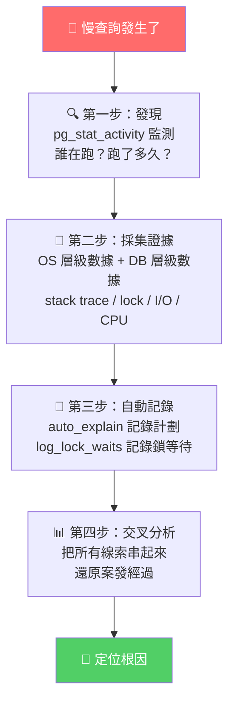

框架的四個支柱：

1. **如何監測慢查詢** — 用什麼工具來發現「有人在慢」？
2. **需要採集哪些資訊** — 發現後要記錄哪些數據才能事後還原？
3. **資料庫內核層面能做什麼** — PostgreSQL 內建了哪些自動記錄機制？
4. **如何分析** — 把所有線索拼湊在一起，找到真正的兇手

---

## 2. 監測慢查詢：pg_stat_activity

### 什麼是 pg_stat_activity？

`pg_stat_activity` 是 PostgreSQL 內建的一張系統檢視表（view）。想像它是資料庫的「即時監視器畫面」— 你一眼就能看到現在有多少人在連線、每個人正在跑什麼 SQL、已經跑了多久、有沒有卡住。這是追查慢查詢的「第一線工具」，也是最重要的一張表。

### 監測查詢

```sql
SELECT
  datname, pid, leader_pid, usename, application_name,
  client_addr, client_port, backend_type,
  xact_start, query_start, state_change,
  wait_event_type, wait_event,
  state, backend_xid, backend_xmin,
  query_id, query,
  now() - xact_start AS xact_duration,
  now() - query_start AS query_duration
FROM pg_stat_activity
WHERE state <> 'idle'
  AND (backend_xid IS NOT NULL OR backend_xmin IS NOT NULL)
ORDER BY now() - xact_start;
```

### 重點欄位白話解釋

| 欄位 | 白話含義 | 為什麼重要 |
|------|---------|-----------|
| `pid` | 該連線的作業系統 process ID | 你可以用這個 ID 在 OS 層做更深入的分析（如看 stack trace） |
| `datname` | 正在操作的資料庫名稱 | 確認問題發生在哪個資料庫 |
| `usename` | 登入的用戶名稱 | 確認是誰觸發的 |
| `application_name` | 應用程式的名稱 | 確認是從哪個服務發出的 |
| `client_addr` / `client_port` | 用戶端的 IP 和 port | 追蹤來源機器 |
| `state` | 當前狀態：`active`（正在執行）/ `idle`（空閒）/ `idle in transaction`（有事務但放著不動） | **idle in transaction 是隱形殺手** — 看起來沒在做事，但持有鎖不放 |
| `xact_start` | 事務開始的時間 | 用 `now() - xact_start` 就知道事務已經跑了多久 |
| `query_start` | 當前這條 SQL 開始執行的時間 | 用 `now() - query_start` 就知道這條 SQL 已經跑了多久 |
| `query` | 正在執行的 SQL 語句 | 讓你看到「兇手長什麼樣子」 |
| `wait_event_type` / `wait_event` | 正在等待什麼（PG 9.6+） | **最關鍵的欄位** — 直接告訴你瓶頸在哪裡，是等鎖、等 I/O、還是等 CPU |
| `backend_type` | process 的類型 | 區分是一般用戶查詢、還是 autovacuum、還是 WAL sender |
| `backend_xid` / `backend_xmin` | 事務 ID 和最小的活躍事務 ID | 非 NULL 表示有事務在進行中，也可能正在阻止 vacuum 清理死資料 |
| `query_id` | SQL 指紋識別碼（PG 14+） | 可以和 `pg_stat_statements` 關聯，看到這條 SQL 的歷史統計 |
| `leader_pid` | parallel worker 所屬的主 process（PG 15+） | 當一條查詢用了多個 CPU 平行處理時，可以追溯到主控 process |

### 為什麼過濾條件很重要？

過濾條件 `state <> 'idle'` 加上 `backend_xid IS NOT NULL OR backend_xmin IS NOT NULL` 確保只抓仍在 active transaction 中的 session。

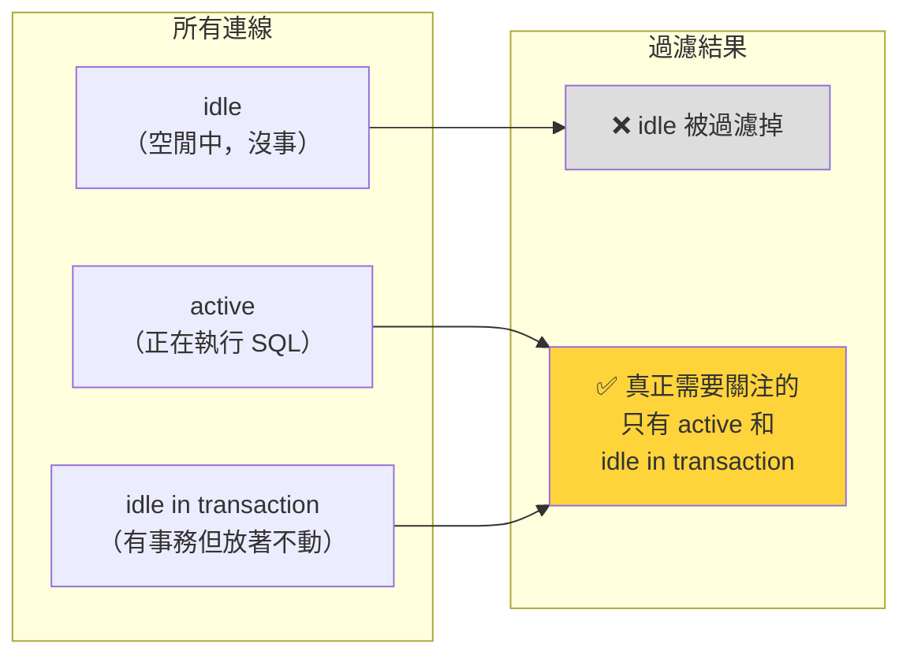

> 補充（Senior Dev）：`backend_xmin` 非 NULL 代表該 session 持有 snapshot 正在阻止 vacuum 清理 dead tuple，即使 query 本身是 idle 狀態。在排查慢查詢時，這類 session 可能不是「慢」而是「卡住別人」，應一起納入監控。PG 14+ 可用 `wait_event` 欄位直接區分 `Lock` / `LWLock` / `BufferPin` / `IO` 等等待類型，不必再猜測瓶頸方向。

### Wait Events：從「猜測瓶頸」到「直接知道瓶頸」

在 PG 9.6 之前，只有一個 `waiting` 欄位（true/false），你只知道「有人在等」，但不知道在等什麼。PG 9.6 之後，`wait_event_type` 和 `wait_event` 直接告訴你答案：

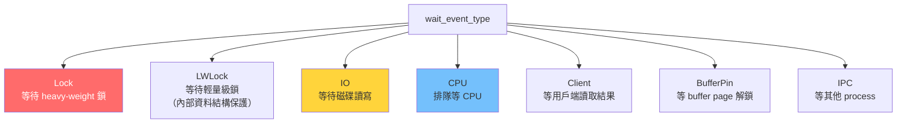

> [PG 9.6+] `waiting` 欄位在 PG 9.6 被 `wait_event_type` 和 `wait_event` 取代，提供更精細的等待分類（如 `LWLock`、`Lock`、`IO`、`Client`、`CPU` 等）。
>
> [PG 13+] 新增 `leader_pid` 欄位，標識 parallel worker 所屬的 leader process，方便追蹤 parallel query 的等待鏈。
>
> [PG 14+] 新增 `query_id` 欄位（需啟用 `compute_query_id`），可直接將 `pg_stat_activity` 的 query 與 `pg_stat_statements` 的統計關聯。

---

## 3. 發現超閾值後，採集以下資訊（持續到 PID 結束）

### 觀念：為什麼要在發現後「持續採集」？

當你發現一條查詢已經跑了很久，你需要做的不是在那一瞬間看一眼，而是要**持續地把數據記錄下來**，直到這條查詢結束為止。這就像是警察調閱一整段監視器畫面，而不是只看一張截圖。原因是：一條查詢可能在等待鎖 3 秒、然後 I/O 5 秒、然後 CPU 運算 10 秒 — 如果你只看一瞬間，可能只看到它在等鎖，而忽略後面的瓶頸。

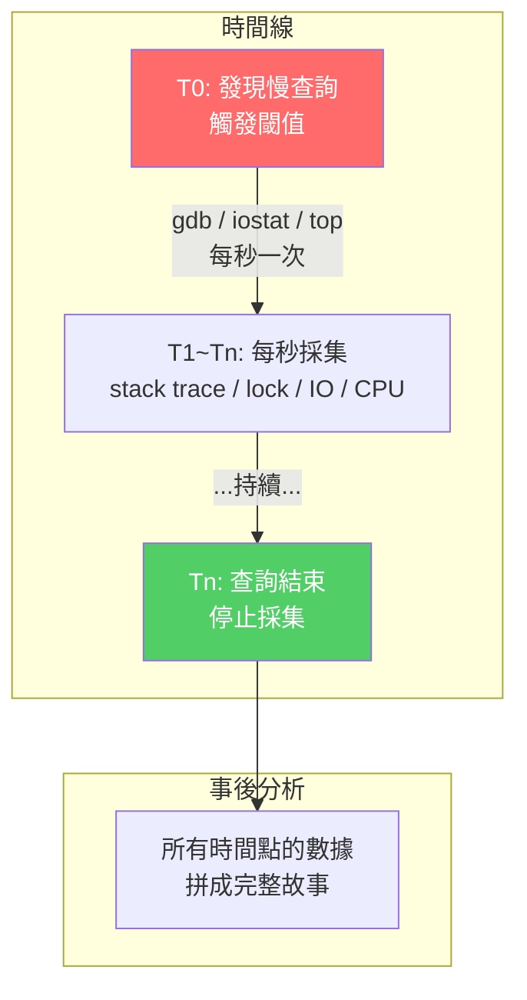

---

### I. Process Stack Trace：看程式卡在哪一行

**白話解釋：** Stack trace 就像給程式拍了一張 X 光片。當你把程式「凍結」的瞬間，stack trace 會告訴你它正在執行哪個內部的函數。如果一張 stack trace 不夠，你可以每秒拍一張，看它「在哪個函數卡最久」。

```bash
# 現代 Linux（pstack 在部分發行版已移除，改用 gdb）
gdb -p $PID -batch -ex 'thread apply all bt'

# 或傳統 pstack（如可用）
pstack $PID

# 採集間隔自訂，如每秒一次
```

**什麼時候用？** 當 `wait_event` 顯示是 `LWLock` 或 `BufferPin` 時，這些是 PostgreSQL 內部的輕量級鎖，透過 stack trace 可以看到卡在程式碼的哪個位置。

**注意：** 需要安裝 debuginfo package 才能看到函數名稱而非十六進位地址。透過 call stack 可以判斷 process 卡在哪個階段的函數（I/O、lock、CPU 計算、network send/recv）。

### II. Lock Wait 記錄：誰擋了誰？

**白話解釋：** 當好幾個人同時要修改同一筆資料時，PostgreSQL 會用「鎖」來確保資料不會被改壞。但鎖也可能造成「塞車」—— A 在等 B 釋放鎖、B 在等 C 釋放鎖，形成一條等待鏈。

參考德哥另一篇文章：[PostgreSQL 锁等待监控 珍藏级SQL - 谁堵塞了谁](https://github.com/digoal/blog/blob/master/201705/20170521_01.md)

透過 `pg_locks` + `pg_stat_activity` JOIN 查出 blocked / blocking chain。採集間隔自訂，直到 PID 結束。核心查詢思路：`pg_locks` JOIN `pg_stat_activity` 找出 blocked / blocking 關係。

**鎖等待鏈示意：**

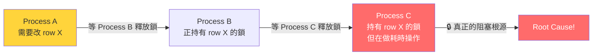

> 補充（Senior Dev）：blocking chain 可能多於兩層（A 等 B，B 等 C）。如果只查一層 `JOIN` 可能遺漏根源。建議使用 recursive CTE 追蹤完整等待鏈，或直接用 `pg_blocking_pids(pid)`（PG 9.6+）一次取得完整 blocking tree。PG 16+ 結合 `pg_stat_activity.wait_event_type = 'Lock'` 可快速過濾。

> 補充（Senior Dev）：production 中 lock wait 是最常見的慢查詢原因之一（僅次於 bad plan）。關鍵 script 應同時擷取：
> - blocking chain（誰鎖了誰）
> - lock mode（`AccessShareLock` vs `AccessExclusiveLock`：前者通常是讀寫並發，後者是 DDL 或 `LOCK TABLE`）
> - `pg_locks.granted` 欄位（`false` = 正在等待）

**Lock Mode 速查（白話版）：**

| Lock Mode | 白話解釋 | 常見場景 |
|-----------|---------|---------|
| `AccessShareLock` | 「我在讀，不要刪掉這張表」 | SELECT 查詢自動取得 |
| `RowShareLock` | 「我可能會改這幾行，先登記一下」 | SELECT ... FOR UPDATE |
| `RowExclusiveLock` | 「我正在改這幾行資料」 | INSERT / UPDATE / DELETE |
| `ShareLock` | 「我正在建 index，不要改結構」 | CREATE INDEX CONCURRENTLY |
| `AccessExclusiveLock` | 「整張表歸我管，全部讓開」 | ALTER TABLE / DROP TABLE |

### III. System / Process IO：磁碟瓶頸

**白話解釋：** 資料庫的資料最終存在磁碟上。當查詢需要的資料不在記憶體（shared buffer）中時，就必須從磁碟讀取。如果磁碟很慢、或同時有太多人要讀取，就會形成 I/O 瓶頸。換句話說：「CPU 很快，但磁碟跟不上」，查詢就得乾等。

```bash
iostat -x 1              # system-level IO，每秒
iotop -p $PID            # process-level IO，針對 PID
```

**重點看的指標：**

| 指標 | 含義 | 什麼算異常 |
|------|------|-----------|
| `%util` | 磁碟忙碌百分比 | 接近 100% 表示磁碟已飽和 |
| `await` | 平均每次 I/O 的等待時間 | > 20ms 對 SSD 來說偏高 |
| `r/s` / `w/s` | 每秒讀/寫次數 | 對比硬體規格判斷是否達到極限 |
| `rkB/s` / `wkB/s` | 每秒讀/寫的資料量 | 判斷是大量資料還是大量小 I/O |

這些數據幫助你判斷瓶頸是 IOPS（每秒 I/O 次數不足）、throughput（頻寬不夠）、還是 await（磁碟響應延遲太高）。採集間隔：每秒一次。

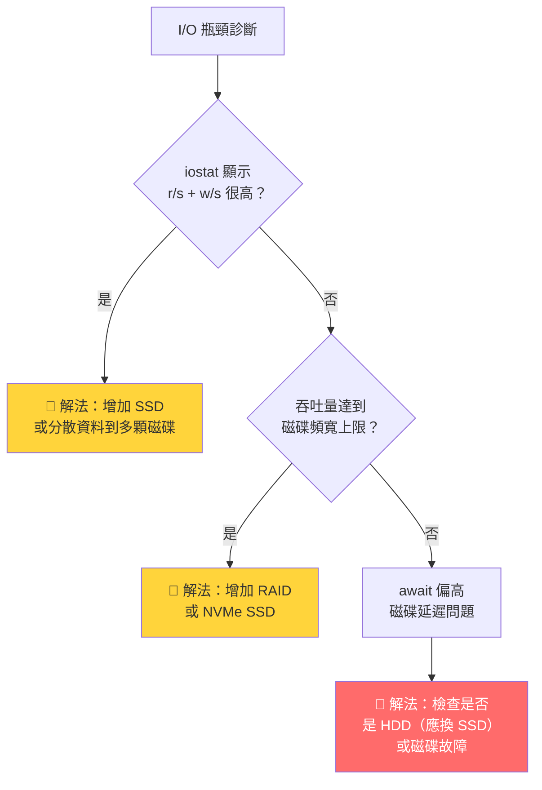

> 補充（Senior Dev）：PG 16+ 新增 **`pg_stat_io`** view，提供 cluster-wide I/O 統計（含 backend type / I/O object / context / read_time / write_time / fsync_time / extends），是資料庫層面的原生 I/O 透視。可取代部分 iostat 需求：

```sql
SELECT backend_type, object, context,
       reads, read_time, writes, write_time,
       extends, fsyncs, fsync_time, hits, evictions
FROM pg_stat_io
WHERE backend_type = 'client backend';
```

> PG 16+ 的 `pg_stat_io` 提供了更細粒度的 I/O context（`normal` / `vacuum` / `bulkread` / `bulkwrite`），可區分查詢產生的 I/O vs autovacuum 產生的 I/O，這在排查「慢查詢是否被 vacuum 拖慢」時很有用。

### IV. Network：網路延遲

**白話解釋：** 應用程式（例如你的 web server）和資料庫通常在不同機器上，中間透過網路溝通。如果網路很慢或塞車，即使資料庫本身跑得很快，查詢回傳結果時也會卡住。

```bash
sar -n DEV 1 1           # system network throughput
iptraf                   # per-connection network（需知道 client IP + port）
```

根據 `pg_stat_activity` 中的 `client_addr` 和 `client_port` 定位連線。如果 `wait_event_type` = `Client` + `wait_event` = `ClientRead`，表示資料庫在等應用程式讀取結果 — 這通常暗示網路或應用程式端的問題。

### V. CPU：計算資源瓶頸

**白話解釋：** 當查詢需要大量計算（如排序、hash join、型別轉換）時，CPU 可能成為瓶頸。這在 OLAP/分析型查詢中尤其常見。

```bash
top -p $PID              # per-process CPU, memory, state
```

採集間隔：每秒一次。觀察 CPU 使用率是否接近 100%，以及 process 狀態是否持續在 `R`（running）。

**注意：** PostgreSQL 是單一 process 處理一條查詢（除非使用 parallel query），所以如果看到某個 PID 的 CPU 固定在 ~100%，且其他 CPU core 很閒，這可能就是單線程運算瓶頸。

### VI. Wait Events：從資料庫視角看瓶頸

**白話解釋：** 這是前面 pg_stat_activity 最重要的欄位。Wait event 直接告訴你「資料庫覺得自己在等什麼」。把它和 OS 層的數據（I/O、CPU、network）交叉比對，就能精確定位。

PG 9.6+ 的 `pg_stat_activity` 包含 `wait_event_type` + `wait_event`。可透過 snapshot 對比時間段內的 wait event 分佈，定位瓶頸類型（Lock / IO / LWLock / BufferPin / Extension / Activity / Timeout / IPC 等）。

PG 14+ `pg_stat_activity` 新增 `wait_start` 欄位（timestamp），可直接計算**已經等了多久**，不再需要推估：

```sql
SELECT pid, wait_event_type, wait_event,
       now() - wait_start AS wait_duration
FROM pg_stat_activity
WHERE wait_event IS NOT NULL;
```

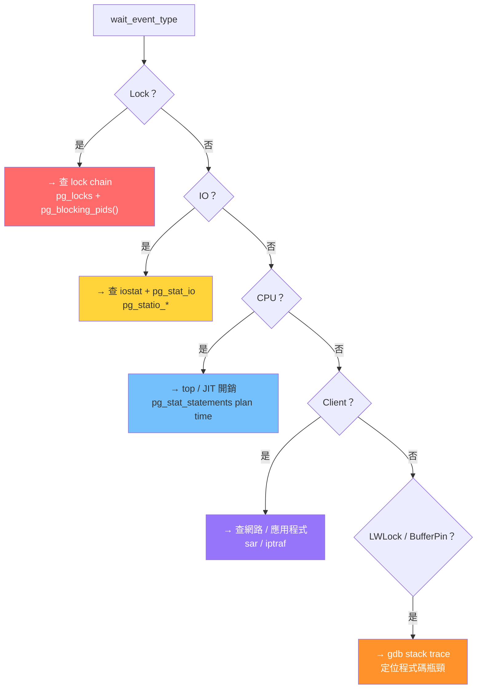

原文亦提到可透過 HOOK 機制開發類似 `pg_stat_statements` 的 wait event 統計插件，持久化存儲供事後分析。PG 18 允許 extensions 透過自訂 wait event 註冊機制進一步擴展監控。

> 補充（Senior Dev）：PG 13 以後，可以搭配 `pg_wait_sampling` extension 來做更精確的 wait event sampling（類似 Oracle ASH）。它透過 background worker 定期取樣 wait event，存入專用檢視表，不需要頻繁 poll `pg_stat_activity`。
>
> ```sql
> CREATE EXTENSION pg_wait_sampling;
> SELECT * FROM pg_wait_sampling_profile;
> ```

### VII. TOP SQL（pg_stat_statements）：找出最花時間的 SQL

**白話解釋：** `pg_stat_statements` 是 PostgreSQL 最重要的效能延伸模組之一。它會自動記錄每一條 SQL 的執行統計：跑了幾次、總共花了多少時間、平均多久、從磁碟讀了多少資料、產生多少 WAL 日誌。這就像是 Google Analytics 之於網站 — 你一眼就知道哪些 SQL 是「流量冠軍」（耗時最多或次數最多）。

對 `pg_stat_statements` 做 snapshot 比對（先記一次、等一段時間再記一次），取得時間段內的：

- 總耗時最高的 SQL
- 執行次數最多的 SQL
- 平均耗時和標準差異常的 SQL
- 命中 shared buffer 比例異常低的 SQL（大量資料要從磁碟讀）
- 產生 WAL 最多的 SQL（PG 13+，`wal_bytes`）
- Plan time vs Execute time 分佈（PG 13+，可拆分規劃時間和執行時間）

```sql
SELECT queryid, query,
       calls,
       total_plan_time, total_exec_time,
       mean_exec_time, stddev_exec_time,
       shared_blks_hit, shared_blks_read,
       blk_read_time, blk_write_time,
       wal_records, wal_bytes
FROM pg_stat_statements
ORDER BY total_exec_time DESC
LIMIT 20;
```

也可以透過 `pg_stat_statements` extension 做 snapshot diff：

```sql
CREATE EXTENSION pg_stat_statements;
-- snapshot 1
SELECT * FROM pg_stat_statements ORDER BY total_time DESC LIMIT 10;
-- wait N seconds
-- snapshot 2（diff = 時段內的 TOP SQL）
```

可以了解時段內的 TOP SQL 及其 `total_time`、`calls`、`shared_blks_read`、`temp_blks_read` 等開銷分佈。

**重點欄位速查：**

| 欄位 | 白話含義 | 異常暗示 |
|------|---------|---------|
| `calls` | 這條 SQL 被執行了幾次 | 次數暴增 → 可能有 N+1 問題 |
| `total_exec_time` | 總執行時間 | 找出最耗時的 SQL |
| `mean_exec_time` | 平均每次執行時間 | 太高 → 這條 SQL 本身就慢 |
| `stddev_exec_time` | 執行時間的標準差 | 很大 → 有時很快有時很慢（參數不同導致 plan 不同） |
| `shared_blks_hit` / `shared_blks_read` | 從記憶體讀 vs 從磁碟讀的資料塊數 | `read` 很高 → 緩存不夠，需要加大 `shared_buffers` |
| `blk_read_time` / `blk_write_time` | 實際讀寫磁碟的時間 | 佔執行時間比例高 → I/O 瓶頸 |
| `wal_bytes` | 這條 SQL 產生的 WAL 日誌量 | 很高 → 寫入密集型 SQL（大量 INSERT/UPDATE/DELETE） |

> 補充（Senior Dev）：PG 13 起 `pg_stat_statements.track_planning = on` 可拆分 plan / execute 時間，對排查 prepare statement plan cache 失效或 generic plan 選錯很有用。PG 14+ `compute_query_id` 讓 `query_id` 成為內建功能（不再強制依賴 `pg_stat_statements`），搭配 `log_line_prefix` 的 `%Q` 可在 log 中直接關聯。

### VIII. Table / Index Stats & IO Stats：物件層級統計

**白話解釋：** 前面的工具告訴你「哪條 SQL」很慢、I/O 有沒有瓶頸。但還需要知道「哪張表、哪個索引」被大量讀寫，才能對症下藥（例如加索引、分區、調整查詢）。以下三張系統表提供物件層級的統計。

- **`pg_stat_user_tables`**（表層級操作統計）：記錄每張表的 `seq_scan`（全表掃描次數）、`idx_scan`（用索引的次數）、`n_tup_ins/upd/del`（寫入/更新/刪除的筆數）
- **`pg_statio_user_tables`**（表層級 I/O 統計）：記錄每張表的 `heap_blks_read`（實際從磁碟讀取的資料塊數）
- **`pg_statio_user_indexes`**（索引層級 I/O 統計）：記錄每個索引的 `idx_blks_read`（實際從磁碟讀取的索引塊數）

對這些 view 做 snapshot 比對，可以發現哪張表/哪個 index 在被大量 physical read，或是全表掃描次數突然飆升。Snapshot diff 也可以觀察時段內哪些 table 被大量 seq scan、哪些 index 被頻繁 block read。

**交叉比對思維：**

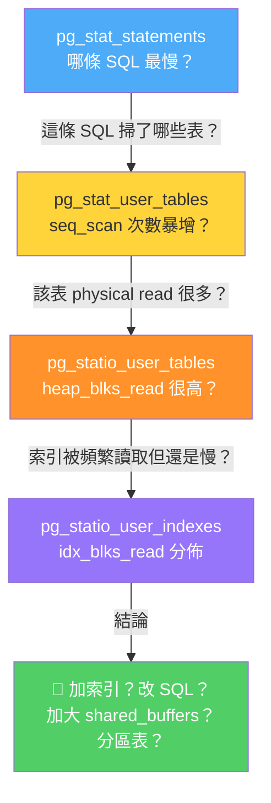

> 補充（Senior Dev）：PG 16+ 的 `pg_stat_io` 提供了更細粒度的 I/O context（`normal` / `vacuum` / `bulkread` / `bulkwrite`），可區分查詢產生的 I/O vs autovacuum 產生的 I/O，這在排查「慢查詢是否被 vacuum 拖慢」時很有用。

---

## 4. 資料庫內核層面自動記錄

### 觀念：讓 PostgreSQL 自己當「行車記錄器」

前面第 3 節講的是「手動採集」——你自己拿著工具去收集數據。但更理想的方式是讓 PostgreSQL 自己自動記錄，就像行車記錄器一樣，事故發生後直接回放。PostgreSQL 提供了三套內建機制來實現這件事：

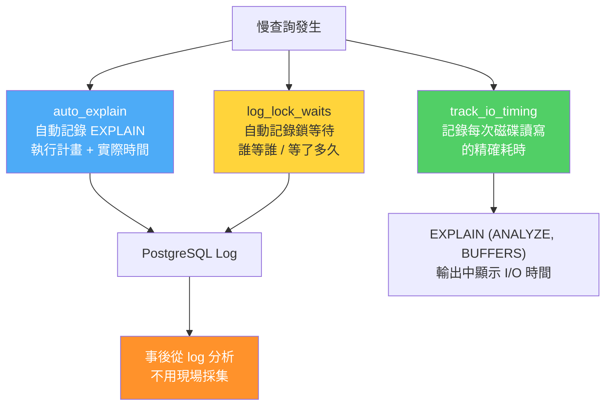

---

### I. auto_explain：自動記錄慢 SQL 的 EXPLAIN

**白話解釋：** 正常情況下，你要看一條 SQL 的執行計畫，需要手動跑 `EXPLAIN (ANALYZE, BUFFERS)`。但慢查詢通常發生在凌晨 3 點，你不可能守在電腦前。`auto_explain` 會自動幫你：只要某條 SQL 跑超過你設定的時間閾值，它就把那條 SQL 的 EXPLAIN 結果記錄到 log 中。事後你翻 log 就能看到完整的執行計畫。

參考：[PostgreSQL 函数调试、诊断、优化 & auto_explain](https://github.com/digoal/blog/blob/master/201611/20161121_02.md)

```ini
# postgresql.conf（全域）
# 或 SET 語句（per-session，不需 restart）
shared_preload_libraries = 'auto_explain'      # 全域需 restart
# session_preload_libraries = 'auto_explain'   # PG 10+，per-session 不需 restart

auto_explain.log_min_duration = '1s'           # 超過此閾值才記錄
auto_explain.log_analyze = on                   # EXPLAIN ANALYZE（含 actual time）
auto_explain.log_buffers = on                   # buffer hit/read 統計
auto_explain.log_timing = on                    # per-node timing
auto_explain.log_verbose = on                   # extra plan info
auto_explain.log_nested_statements = on         # function 內 SQL 也記錄
auto_explain.log_settings = on                  # PG 12+，記錄當時 GUC 參數
auto_explain.log_parameter_max_length = 512     # PG 17+，記錄 bind parameter 值（截斷長度）
auto_explain.log_wal = on                       # PG 18+，記錄 WAL 產生量
auto_explain.log_format = json                  # PG 18+，可選 json 格式輸出
```

當 query 執行時間超過 `log_min_duration` 時，自動在 log 中輸出該 query 的 `EXPLAIN (ANALYZE, BUFFERS, TIMING, VERBOSE)` 結果，包括每個 plan node 的 actual time、buffer 用量。記錄超過閾值的 SQL 的 execution plan 及每個 node 的 actual time，事後可直接從 PostgreSQL log 看到完整的 EXPLAIN ANALYZE 輸出。

**各參數白話解釋：**

| 參數 | 白話含義 | 建議 |
|------|---------|------|
| `log_min_duration` | 查詢跑超過多久才記錄 | 設 1s~5s，視業務 SLA 而定 |
| `log_analyze` | 是否真的執行 EXPLAIN ANALYZE | **開**，但注意會有額外開銷 |
| `log_buffers` | 記錄 buffer 命中率 | **開**，對診斷 I/O 瓶頸至關重要 |
| `log_nested_statements` | function/stored procedure 內的 SQL 也記錄 | **開**，很多慢查詢藏在 function 裡 |
| `log_settings` | 記錄當時的資料庫參數設定 | **開**（PG 12+），知道為什麼 optimizer 選了這個計畫 |
| `log_parameter_max_length` | 記錄 bind parameter 的實際值 | **開**（PG 17+），沒有這個你只能看到 `$1, $2` |
| `log_wal` | 記錄 WAL 產生量 | 看需求（PG 18+） |

> 補充（Senior Dev）：
> - `log_nested_statements = on` 對 function / stored procedure 內的 SQL 也生效，排查深層 SQL 至關重要。
> - `log_analyze = on` 會讓被記錄的 SQL 實際執行 EXPLAIN ANALYZE overhead，不建議在極高 QPS 環境設全域。可用 `auto_explain.log_min_duration` 設較高閾值僅捕獲真正慢的 SQL。`auto_explain.log_analyze = on` 會對被記錄的 query 實際執行 `EXPLAIN ANALYZE`，這意味著 query 本身會被執行兩次（一次正常，一次 ANALYZE）。在高吞吐 OLTP 場景下，建議只對 `log_min_duration` 較高的 query 啟用 full analyze，或使用 sampling（PG 17+ `auto_explain.log_sample_rate`）來降低 overhead。
> - PG 10+ 支援 `session_preload_libraries = 'auto_explain'`，可在 per-session 層級啟用（`SET`），不需重啟 instance。
> - PG 12+ 的 `log_settings` 記錄 optimizer 相關 GUC（`enable_seqscan`, `work_mem`, `random_page_cost` 等），對還原 execution plan 選擇原因極有幫助。
> - PG 17+ 的 `log_parameter_max_length` 解決了 `auto_explain` 長期痛點：無法知道 $1, $2 的實際值。PG 18+ 的 `log_wal` 記錄該次 query 產生的 WAL 量。

參考：
- [PostgreSQL 函數調試、診斷、優化 & auto_explain](https://github.com/digoal/blog/blob/master/201611/20161121_02.md)
- [PostgreSQL 加載動態庫詳解](https://github.com/digoal/blog/blob/master/201603/20160316_01.md)

### II. log_lock_waits：記錄 Lock Wait 耗時

**白話解釋：** 當一個 session 卡在等待鎖太久（超過 `deadlock_timeout`），PostgreSQL 會自動在 log 中寫下詳細資訊：誰在等、被誰卡住、鎖的類型、跑的 SQL 是什麼。這讓你不用手動去查 `pg_locks`。

```ini
# postgresql.conf
log_lock_waits = on
deadlock_timeout = 1s
```

當一個 session 等待 lock 超過 `deadlock_timeout` 時，PostgreSQL 會在 log 中寫入等待資訊（包括 blocked / blocking PID、lock type、被等待的 SQL）。PG 14+ log 中同時會打印 `wait_event` 資訊。

**注意：** `deadlock_timeout` 有雙重作用。它既是 deadlock detection（死鎖偵測）的檢查間隔（預設 1 秒），也是觸發 `log_lock_waits` 記錄的門檻。換句話說：如果一個鎖等待超過 1 秒，PostgreSQL 一方面會記錄 log，一方面也會啟動死鎖偵測（檢查是否有循環等待）。

> 補充（Senior Dev）：`deadlock_timeout` 的預設值是 1s，這是 deadlock detection 的檢查間隔。將它設為 1s 與 `log_lock_waits` 啟用搭配，可以在 lock wait > 1s 時自動記錄。注意：降低 `deadlock_timeout` 會增加 deadlock detector 的喚醒頻率（CPU 微幅上升），但對 multi-master / high concurrency 環境來說，1s 已足夠。

### III. IO Timing Trace：記錄每次磁碟操作的耗時

**白話解釋：** 正常 `EXPLAIN ANALYZE` 只告訴你每個節點的總耗時，不區分 CPU 時間和 I/O 時間。啟用 `track_io_timing` 後，資料庫會在每次讀寫磁碟時記錄耗時，讓你能在 EXPLAIN 輸出中看到「I/O 花了 X ms、CPU 花了 Y ms」。

PostgreSQL 可開啟 `track_io_timing = on` 來記錄每次 block read/write 的耗時。這會產生額外的系統時鐘查詢開銷。

```ini
track_io_timing = on
```

啟用 IO timing 追蹤後，讓 `EXPLAIN (ANALYZE, BUFFERS)` 和 `pg_stat_statements` 中的 IO 時間與 CPU 時間分開統計。

德哥另一篇文章有詳細討論：

[Linux 时钟精度 与 PostgreSQL auto_explain (explain timing 时钟开销估算)](https://github.com/digoal/blog/blob/master/201612/20161228_02.md)

> 補充（Senior Dev）：`track_io_timing = on` 在現代 Linux kernel（5.x+）和 SSD/NVMe 上的 overhead 已大幅降低（每次 I/O 約 0.5~1μs）。PG 16+ 的 `pg_stat_io` 即使不開啟此參數也能提供 I/O 呼叫次數（`reads` / `writes`），但精確的 `read_time` / `write_time` 仍需 `track_io_timing = on`。在 `EXPLAIN (ANALYZE, BUFFERS)` 輸出中可看到每個 node 的 `I/O Timings: read=X.XXX write=Y.YYY`。
>
> 注意：啟用 IO timing 會帶來微小的效能開銷（每次 I/O 操作前後讀取高精度時鐘）。在高頻率 small I/O 場景下（如 random index scan on NVMe），開銷可能達到 2-5%。參考：[Linux 時鐘精度與 PostgreSQL auto_explain](https://github.com/digoal/blog/blob/master/201612/20161228_02.md)

> [PG 13+] `track_io_timing` 預設從 `off` 改為 `on`，因為現代硬體的高精度時鐘開銷已降至可忽略。

### IV. 網絡耗時（內核層面缺失）

**白話解釋：** 不幸的是，PostgreSQL 到目前為止（PG 18）仍然沒有辦法在內核層面單獨統計網路傳輸的耗時。SQL 的總執行時間包含了「把結果傳回用戶端」的網路時間，但無法拆開。這是一個已知的缺憾。

PG 內核輸出的 SQL 總時間包含 network 傳輸到 client 的時間，但沒有單獨統計 network 耗時。原文提到可透過 HACK 內核來實現拆分。

> 補充（Senior Dev）：截至 PG 18，network time 仍無原生拆分。實務上可對比 `log_duration`（server side）與 client side round-trip time 來間接估算。若使用 `libpq` 的 trace 功能或 pgbouncer 的 `log_pooler_errors`，可在 middleware 層取得 network 耗時。

> [PG 14+] `pg_stat_statements` 新增 `wal_bytes` 欄位，可區分 WAL 寫入量；雖然仍無直接 network time，但可透過 client-side TCP 層級監控（`ss -tip` 或 `tcpdump`）來隔離網路延遲。

---

## 5. 分析流程總結

### 從發現到定位：完整追查流程

當慢查詢發生後，你需要像偵探辦案一樣，把所有線索串在一起。下面是「先做什麼、再做什麼」的標準作業程序：

**第一層：快速判斷（30 秒內）**

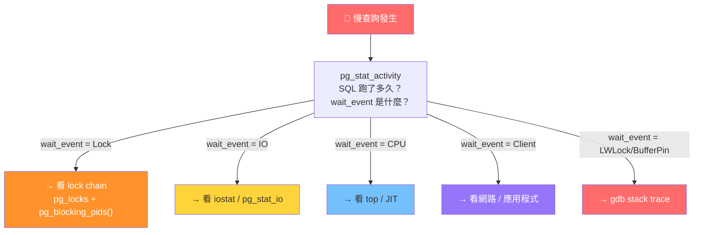

**第二層：深入分析（善用自動記錄）**

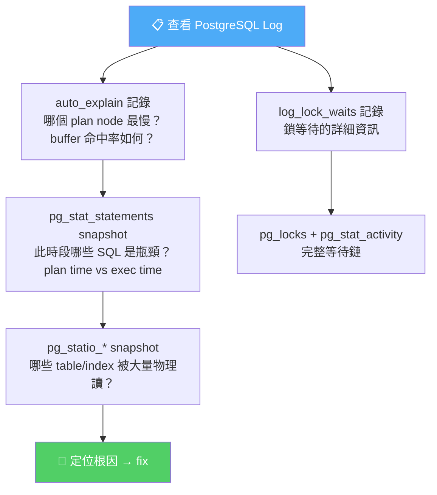

**完整決策樹：**

```
慢查詢觸發閾值
  → 記錄 pg_stat_activity snapshot（誰、什麼 SQL、wait_event、跑了多久）
  → 對 PID 啟動週期性採集：
      gdb stack / lock chain / iostat / iotop / top / sar
  → pg_stat_io snapshot（PG 16+，I/O context 細分）
  → auto_explain 自動記錄 EXPLAIN plan + per-node timing + GUC settings
  → log_lock_waits 記錄 lock 等待 + wait_event
  → 事後從 pg_stat_statements snapshot 對比：
      TOP SQL / plan-vs-execute 比例 / WAL 產生量
  → 從 pg_statio_* snapshot 對比 table/index physical read 變化
  → 交叉比對所有數據，依 wait_event_type 分類定位瓶頸類型：
      Lock → lock chain 分析
      IO → iostat + pg_stat_io + pg_statio_*
      LWLock / BufferPin → pstack / gdb
      CPU → top + pg_stat_statements JIT 欄位
      Activity → 檢查是否 idle-in-transaction 阻塞 vacuum
```

### 三大瓶頸類型速查總表

| 瓶頸類型 | wait_event | OS 層證據 | DB 層證據 | 常見解法 |
|---------|-----------|---------|---------|---------|
| **鎖等待** | Lock / transactionid | CPU 低、I/O 低 | pg_locks 有 waiting | 優化交易邏輯、縮短交易時間、避免 DDL 在尖峰時段 |
| **I/O 瓶頸** | DataFileRead / WALWrite | iostat %util 高 | pg_stat_io reads 高 | 加大 shared_buffers、升級 SSD、優化索引 |
| **CPU 瓶頸** | CPU（或無 wait） | top %CPU 高 | pg_stat_statements 執行時間高 | 優化 SQL、加索引減少運算、檢查 JIT overhead |
| **網路瓶頸** | ClientRead / ClientWrite | sar 網路高 | 無特殊記錄 | 減少回傳資料量、使用連線池、檢查網路設備 |
| **Vacuum 干擾** | BufferPin / LWLock | iostat 高 | pg_stat_io vacuum context | 調優 autovacuum 參數、避開尖峰時段 |

---

## 6. 現代化監測工具鏈補充

### 觀念：從「手工採集」到「自動化工具鏈」

原文（2016 年）的採集方式偏手動 script——你需要登入伺服器，手動跑 `iostat`、`pstack`、查 `pg_locks`。現代 PostgreSQL 生態中已有一整套工具可以自動化這些工作：

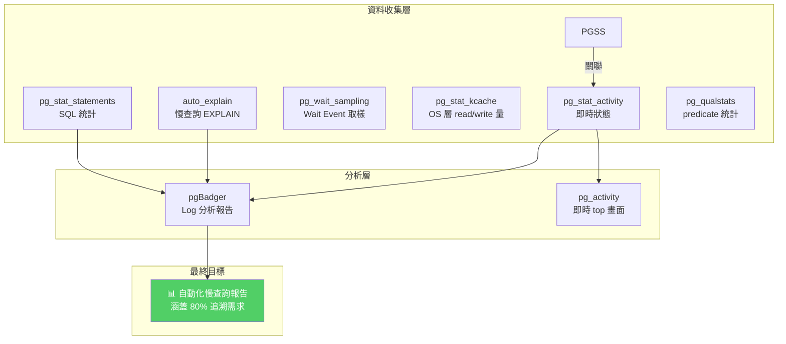

> 補充（Senior Dev）：原文（2016）的採集方式偏手動 script，現代 PG 生態中已有一整套工具可自動化：
>
> | 工具 | 用途 | 對應原文環節 |
> |------|------|-------------|
> | `pg_stat_statements` | TOP SQL、calls、IO time | 3.VII |
> | `auto_explain` | 慢查詢 plan 自動記錄 | 4.I |
> | `pg_wait_sampling` (PG 13+) | Wait event sampling（類似 Oracle ASH） | 3.VI |
> | `pg_stat_kcache` (PoWA) | 每個 query 的 OS 層 read/write 量 | 3.III / 3.VIII |
> | `pgBadger` | Log 分析，自動生成慢查詢報告（含 wait event、plan、timeline） | 全環節 |
> | `pg_qualstats` (PoWA) | 追蹤 predicate 使用頻率，輔助 index 設計 | 分析環節 |
> | `pg_activity` (CLI) | `top` 風格的即時 PG activity viewer | 3.V（即時替代 pstack/top） |
> | `pgsentinel` / `pg_top` | Sampling-based activity monitoring | 3.VI |
>
> Production 建議最小組合：
> ```ini
> shared_preload_libraries = 'pg_stat_statements, auto_explain'
> track_io_timing = on
> log_lock_waits = on
> ```
> 定期將 log 餵給 `pgBadger` 生成 HTML report，即可覆蓋原文 80% 的追溯需求。

**工具詳解（白話版）：**

| 工具 | 白話解釋 | 什麼時候用 |
|------|---------|-----------|
| **pgBadger** | 把 PostgreSQL log 自動生成漂亮的 HTML 報告，包含圖表、慢查詢排行、wait event 分佈 | 每週或每天跑一次，自動產出效能報告 |
| **pg_activity** | 類似 Linux `top` 指令，但專為 PostgreSQL 設計。即時看到所有連線、SQL、等待事件 | 事發當下快速登入查看，不用手寫 SQL |
| **pg_stat_kcache** | 把每一條 SQL 實際用了多少 OS 層的磁碟讀寫量都記錄下來 | 需要知道 SQL 層面和 OS 層面 I/O 的落差時 |
| **pg_qualstats** | 記錄查詢中 WHERE 條件用到的欄位，幫你判斷哪些欄位需要建索引 | 不知道要幫哪個欄位建索引時 |
| **pg_wait_sampling** | 像監視器一樣定期拍照，記錄當時的 wait event，之後可以看歷史分佈 | 需要回顧過去一段時間的等待事件分佈時 |

---

## 7. 版本變遷速查

### 監控相關功能的演進時間線

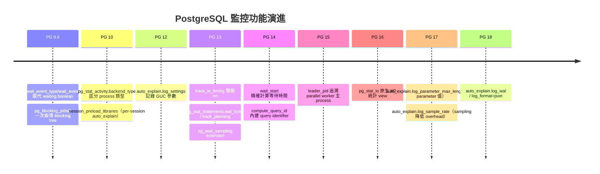

---

| 功能 | 引入版本 | 說明 |
|------|---------|------|
| `wait_event_type` / `wait_event` | PG 9.6 | 取代 `waiting` boolean |
| `pg_blocking_pids(pid)` | PG 9.6 | 一次取得完整 blocking tree |
| `session_preload_libraries` | PG 10 | per-session 載入 `auto_explain`，不需 restart |
| `pg_stat_activity.backend_type` | PG 10 | 區分 backend 類型（client / autovacuum / walsender 等） |
| `auto_explain.log_settings` | PG 12 | 記錄 optimizer GUC |
| `pg_stat_statements.track_planning` | PG 13 | 拆分 plan time / execute time |
| `pg_stat_statements.wal_bytes` | PG 13 | WAL 產生量統計 |
| `pg_wait_sampling` extension | PG 13 | Wait event sampling（類似 Oracle ASH） |
| `track_io_timing` 預設 on | PG 13 | 現代硬體的時鐘開銷已可忽略 |
| `wait_start` in `pg_stat_activity` | PG 14 | 精確計算已等待時間 |
| `compute_query_id` | PG 14 | 內建 query_id，不強制依賴 `pg_stat_statements` |
| `leader_pid` in `pg_stat_activity` | PG 15 | parallel worker 追溯主 process |
| `pg_stat_io` | PG 16 | 原生 I/O 統計（取代部分 iostat 需求） |
| `auto_explain.log_parameter_max_length` | PG 17 | 記錄 bind parameter 實際值 |
| `auto_explain.log_sample_rate` | PG 17 | Sampling 降低 full analyze overhead |
| `auto_explain.log_wal` | PG 18 | 記錄 query WAL 產生量 |
| `auto_explain.log_format = json` | PG 18 | JSON 格式輸出 |

> [PG 版本註] 原文基於 PG 9.5（2016）。核心排查框架在最新版本（PG 17+）仍然有效，主要增強：
> - PG 9.6+：`wait_event_type` / `wait_event` 取代 `waiting` 布林值
> - PG 10+：`pg_stat_activity.backend_type` 區分 backend 類型（client / autovacuum / walsender 等）
> - PG 13+：`pg_stat_activity.leader_pid`、`pg_wait_sampling` extension、`track_io_timing` 預設 on
> - PG 14+：`pg_stat_activity.query_id`、`pg_stat_statements.wal_bytes`
> - PG 16+：`pg_stat_io` 系統 view（取代 `pg_statio_*` 的手動 snapshot，提供 cluster-wide I/O 統計）
>
> 特別注意：`pg_stat_io`（PG 16+）是一次重大改進——它提供了 cluster-level 的 I/O 統計（reads、writes、extends、fsyncs、hits），按 backend type 和 context 分類，無需再對 `pg_statio_*` 做手工 snapshot diff。

---

## 8. 參考與源碼

1. [PostgreSQL 锁等待监控 珍藏级SQL - 谁堵塞了谁](https://github.com/digoal/blog/blob/master/201705/20170521_01.md)
2. [PostgreSQL 函数调试、诊断、优化 & auto_explain](https://github.com/digoal/blog/blob/master/201611/20161121_02.md)
3. [PostgreSQL 加載動態庫詳解](https://github.com/digoal/blog/blob/master/201603/20160316_01.md)
4. [Linux 时钟精度 与 PostgreSQL auto_explain (explain timing 时钟开销估算)](https://github.com/digoal/blog/blob/master/201612/20161228_02.md)
5. [如何生成和阅读EnterpriseDB (PPAS)诊断报告](https://github.com/digoal/blog/blob/master/201606/20160628_01.md)
6. `pg_stat_activity` — PostgreSQL 原始碼中負責收集與維護後端 process 統計資訊的核心模組（位於 `src/backend/postmaster/` 目錄下的 process 統計收集器）
7. `pg_stat_statements` — PostgreSQL 標準擴充模組，負責追蹤與彙總所有 SQL 語句的執行統計（位於 `contrib/` 目錄）
8. `pg_wait_sampling` — PostgreSQL 標準擴充模組，負責定期取樣 wait event 資訊（位於 `contrib/` 目錄）

---

# 二、 PostgreSQL track_commit_timestamp：PG 17 視角

> 來源：[digoal - PostgreSQL 9.5 new feature - record transaction commit timestamp (2015-04-09)](https://github.com/digoal/blog/blob/master/201504/20150409_03.md)
>
> 本文基於原始 PG 9.5 文章，以 PG 17 (2026) 為基準更新：補足實際用途、效能影響、版本演進。

---

## 1. 功能概述

### 什麼是 commit timestamp？

`track_commit_timestamp` 自 PG 9.5 引入。簡單來說，每當一個事務（transaction）成功提交（commit）時，PostgreSQL 會在那個瞬間記錄下當時的時間戳。這就像是每一筆交易都會被蓋上一個「成交時間」的章。

### 為什麼需要這個功能？

在關閉此功能的情況下，你只能知道資料「被哪個事務寫入」（透過 `xmin`/`xmax` 這些隱藏欄位），但無法知道「何時被寫入」。你需要自己加 `updated_at` 欄位來記錄時間。開啟 `track_commit_timestamp` 後，PostgreSQL 會自動記錄每筆事務的提交時間，你可以事後查詢：

```sql
-- 查詢某筆資料是何時被寫入的（不需額外 timestamp 欄位）
SELECT xmin, pg_xact_commit_timestamp(xmin)
FROM some_table WHERE id = 1;
```

### I. 儲存結構（白話解釋）

commit timestamp 的數據儲存在 PostgreSQL 資料目錄（`PGDATA`）下的 `pg_commit_ts/` 子目錄中。它使用一種叫做 SLRU（Simple Least Recently Used，簡單最近最少使用）的機制來管理——你可以把它想像成一個自動分頁的筆記本，每頁固定大小，用完一頁就換下一頁，舊的頁面在不需要時會被清理掉。

**儲存細節：**

- 每個 page 大小 = `BLCKSZ`（預設 8KB，即 8192 bytes）
- 每筆 transaction 的 commit 記錄佔 12 bytes：時間戳（8 bytes）+ 節點 ID（4 bytes）。節點 ID 用於區分在 replication 場景下是哪個節點提交的。

以下原始碼展示了 commit timestamp 的記憶體結構定義：

```c
// PostgreSQL 原始碼中定義 commit timestamp 記錄的結構
// 位於 src/backend/access/transam/commit_ts.c
typedef struct CommitTimestampEntry
{
    TimestampTz   time;      // 提交時間戳（8 bytes）
    CommitTsNodeId nodeid;   // 提交節點 ID（4 bytes）
} CommitTimestampEntry;

// 計算每筆記錄佔用的實際 bytes 數
#define SizeOfCommitTimestampEntry \
    (offsetof(CommitTimestampEntry, nodeid) + sizeof(CommitTsNodeId))

// 計算每頁（8KB）可以存放多少筆 transaction 記錄
// 以預設 BLCKSZ=8192 為例：8192 / 12 ≈ 682 筆/頁
#define COMMIT_TS_XACTS_PER_PAGE \
    (BLCKSZ / SizeOfCommitTimestampEntry)
```

PGDATA 目錄結構：

```
$ cd $PGDATA
drwx------  pg_commit_ts/
```

### 事務 ID 循環與截斷

Transaction ID 是 32-bit 的整數，會不斷增加直到繞回（wrap around）。因此 `pg_commit_ts` 的 page/segment 編號也會對應 wraparound。PostgreSQL 會自動截斷（truncate）過舊的 commit timestamp 記錄以釋放空間，截斷邏輯由系統內部的截斷函數負責，它會判斷哪些舊頁面不再被需要。

**SLRU 儲存機制示意：**

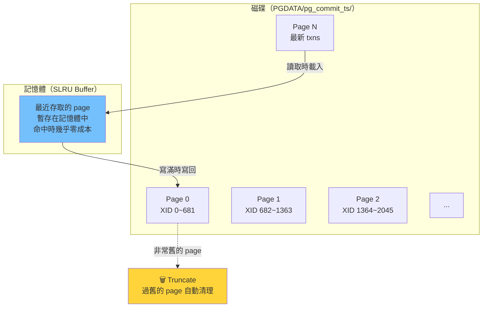

---

## 2. 啟用與確認

### 如何啟用

在 `postgresql.conf` 中加入以下設定：

```ini
# postgresql.conf
track_commit_timestamp = on
```

**必須 restart**（此參數為 `postmaster` 級別，無法用 `pg_ctl reload` 生效）：

```bash
pg_ctl restart -m fast
```

### 為什麼必須重啟？

有些參數只需要 reload（發送 SIGHUP 訊號）即可生效，但 `track_commit_timestamp` 涉及 PostgreSQL 核心的事務管理模組初始化——它在整個資料庫啟動時就需要決定要不要分配相關的記憶體和資料結構，所以必須重啟。用比喻來說：這不是「換個設定檔」，而是「整台機器要先關機再開機才能換零件」。

### 確認狀態

```bash
pg_controldata | grep track
# Current track_commit_timestamp setting: on
```

`pg_controldata` 會讀取 PostgreSQL 的控制檔（control file），裡面記錄了資料庫的關鍵設定。如果輸出顯示 `on`，表示目前已啟用。

### 重置 WAL 時的注意事項

如果你需要使用 `pg_resetxlog`（PG 10+ 改名為 `pg_resetwal`）來重置 WAL（例如災難恢復），必須指定安全的 transaction ID 範圍，確保 commit timestamp 資料的一致性：

```bash
# -c xid,xid 指定最舊 / 最新可查 commit timestamp 的 xid 範圍
# 可從 pg_commit_ts/ 目錄中最小的 file name (hex) 推算
pg_resetwal -c 0x00000100,0x0000FF00
```

### 啟用與確認流程圖

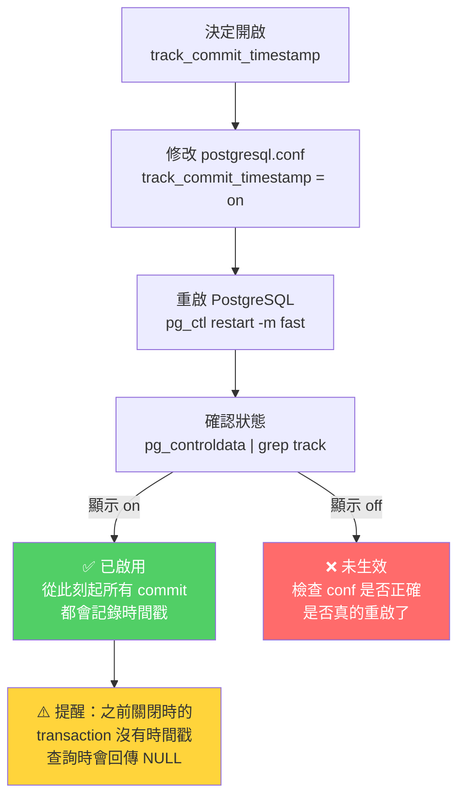

> 補充（Senior Dev）：如果 `track_commit_timestamp = off` 時資料庫曾運行過，之後再開啟，中間缺失的 transaction commit timestamp 會是 NULL。`pg_xact_commit_timestamp(xid)` 對這些 xid 回傳 NULL。

---

## 3. 實際用途（PG 9.5 → PG 17 演進）

### I. 2015 年（PG 9.5，原文時期）

當時 commit timestamp 剛被引入，作者推測它可能與 snapshot too old、logical replication 有關，但具體的使用場景尚未明確。

### II. 2026 年（PG 17）

經過多年演進，commit timestamp 已有以下明確用途：

**1. 查詢 commit timestamp：`pg_xact_commit_timestamp(xid)`**

最直接的用途。無需在表中額外添加 `updated_at` 欄位，就能知道任何一筆資料是何時被提交的。

```sql
SELECT pg_xact_commit_timestamp(txid_current());
-- 2026-05-17 15:30:45.123456+08

-- 查詢特定 transaction 的 commit time
SELECT xmin, pg_xact_commit_timestamp(xmin)
FROM some_table WHERE id = 1;
```

**2. Logical Replication（PG 10+）**

Logical replication（邏輯複製）是 PostgreSQL 內建的資料同步機制，可以將變更從一個資料庫即時傳送到另一個資料庫。其內部的變更解碼（logical decoding）模組依賴 commit timestamp 來決定事務的排序與可見性。

若未開啟 `track_commit_timestamp`，logical replication 仍可運作，但某些 replication slot 行為（如取得指定 LSN 範圍的變更）在跨節點一致性場景會有限制。建議使用 logical replication 的環境開啟此功能。

**3. Snapshot too old（PG 9.6+）**

`old_snapshot_threshold` 是 PG 9.6 引入的功能，用於防止長時間運行的查詢因為持有舊快照（snapshot）而阻止 vacuum 清理死資料。它依賴 commit timestamp 來判斷哪些資料版本已經過期可以回收。未開啟 `track_commit_timestamp` 時此功能無法使用。

**4. 審計 / CDC 場景**

可以直接透過 `xmin` / `xmax`（PostgreSQL 每筆資料隱含的事務 ID 欄位）加上 `pg_xact_commit_timestamp()` 還原 row-level 的變更時間線，無需在每張表額外維護 `updated_at` timestamp 欄位。

**5. Extension 生態**

- `pg_ivm`（Incremental View Maintenance，增量物化視圖維護）：依賴 commit timestamp 追蹤增量變更
- 部分 CDC tool（如 Debezium PG connector）在 snapshot 模式下查詢 commit timestamp 做 watermark（水位標記）

**用途全景圖：**

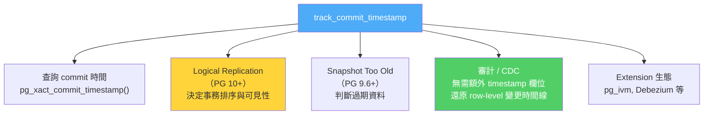

| PG 版本 | 相關演進 |
|---------|---------|
| 9.5 | 引入 `track_commit_timestamp`、`pg_xact_commit_timestamp()` |
| 9.6 | `old_snapshot_threshold` 依賴 commit timestamp |
| 10 | Logical replication 正式 GA，重命名 `pg_resetxlog` → `pg_resetwal` |
| 14 | SLRU 效能改進，`pg_commit_ts` lookup 更快 |
| 15 | `pg_stat_reset_slru()` 可監控 `pg_commit_ts` SLRU 命中率 |

---

## 4. 效能影響與 Production 考量

### 天下沒有白吃的午餐

開啟 `track_commit_timestamp` 是有成本的。每當一個事務提交時，PostgreSQL 必須額外寫入 12 bytes 的 commit timestamp 到 SLRU 快取中（最終會寫回磁碟）。對於高並發的寫入密集型場景，這個額外的寫入操作會累積成可觀的 overhead。

> 補充（Senior Dev）：

| 面向 | 影響 | 白話解釋 |
|------|------|---------|
| **寫入效能** | 每次 commit 多一次 SLRU write（~12 bytes），OLTP 場景 overhead 約 1-3%（視 workload，write-heavy 時更明顯） | 每筆交易多寫 12 bytes，少量交易無感，每秒幾千筆交易時就有感了 |
| **儲存空間** | 每百萬 transaction 約 12MB；需關注 SLRU truncation 是否及時（與 `vacuum_freeze_min_age` 等參數相關） | 一百萬筆約 12MB，一般不算多，但要確保舊資料有被清理 |
| **讀取效能** | `pg_xact_commit_timestamp(xid)` 查詢走 SLRU buffer，hit 時幾乎零成本，miss 時觸發 page read | 查詢時如果資料已經在記憶體中，幾乎無開銷；否則要從磁碟讀一個 page |
| **Replication** | Logical replication 場景建議開啟，避免 corner case | 做邏輯複製就開，避免奇怪的邊界情況 |

### 開啟與否的決策樹

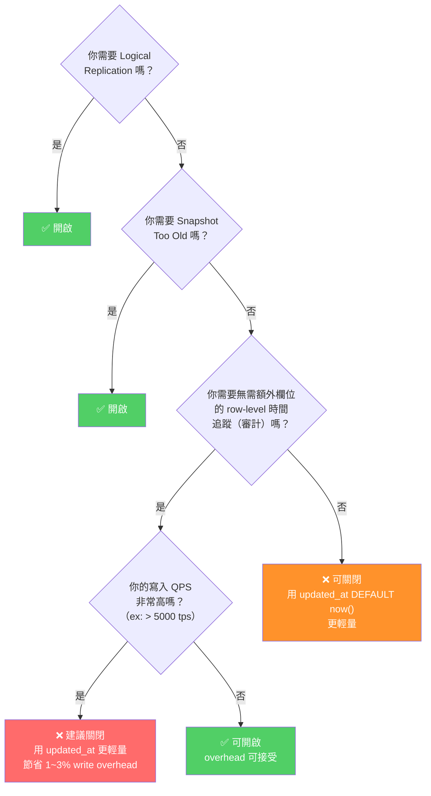

**建議總結：**

- **OLTP 核心庫**：若不需要審計 / logical replication / snapshot too old，關閉可節省 1-3% write overhead
- **需要 logical replication**：開啟，這是 PG 內部依賴
- **需要 row-level 時間追蹤但不想開全域**：使用傳統的 `updated_at timestamp DEFAULT now()` 欄位來記錄最後修改時間，別開 `track_commit_timestamp`（更輕量、更可控、更直覺）

### SLRU 效能監控（PG 15+）

PG 15 新增了 `pg_stat_reset_slru()` 函數，可以監控 `pg_commit_ts` 的 SLRU 緩存命中率，幫助你判斷是否因為頻繁的 page miss 影響效能。這在排查 commit timestamp 相關效能問題時很有用。

---

## 5. 原始碼參考（2015 年原文 + PG 17 對應）

| 原始碼模組 | 說明 |
|---------|------|
| Commit timestamp 核心模組 | PostgreSQL 原始碼中負責 commit timestamp 記錄、查詢、截斷的核心程式碼（位於 `src/backend/access/transam/` 目錄下的 commit_ts 相關檔案）。此模組於 PG 9.5 引入，PG 17 仍位於相同路徑。 |
| Commit timestamp WAL 記錄描述 | 負責描述 commit timestamp 相關 WAL 記錄格式的模組。用於 WAL replay 時理解和重現 commit timestamp 的變更。 |
| `pg_resetwal` 手冊 | PG 10+ 改名自 `pg_resetxlog`。當需要重置 WAL 時，此工具需指定 commit timestamp 的安全範圍（`-c` 參數）。
