# PostgreSQL 深度探索：從開發規範到千億級實戰

> 本文按由淺入深的閱讀順序，將四篇 PostgreSQL 深度文章合併為一冊：
>
> **第一章** 從開發規範入手，建立 PostgreSQL 的正確使用習慣；
> **第二章** 進入 Trigger 審計的實作細節，掌握 DML 與 DDL 的變更追蹤；
> **第三章** 學習 JOIN 冗餘膨脹的排查與 Early DISTINCT 優化策略；
> **第四章** 以 12306 搶票系統為案例，綜合運用 varbit、SKIP LOCKED、Array、pgrouting 等特性完成高併發架構設計。

---

# 一、PostgreSQL 數據庫開發規範 — PG 17 更新版

作為 .NET Application Developer，你只需記住一個原則：**寫進程式碼裡的 DB 互動方式，決定了這 50+ 條規範中哪些會自動滿足，哪些需要你特別注意**。

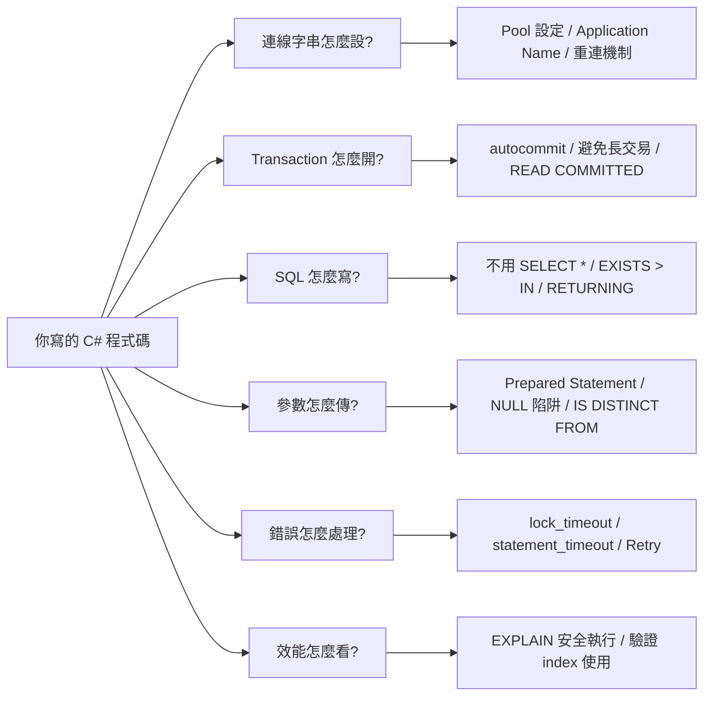
```mermaid
flowchart LR
    DEV["你寫的 C# 程式碼"] --> C1["連線字串怎麼設?"]
    DEV --> C2["Transaction 怎麼開?"]
    DEV --> C3["SQL 怎麼寫?"]
    DEV --> C4["參數怎麼傳?"]
    DEV --> C5["錯誤怎麼處理?"]
    DEV --> C6["效能怎麼看?"]

    C1 --> R1["Pool 設定 / Application Name / 重連機制"]
    C2 --> R2["autocommit / 避免長交易 / READ COMMITTED"]
    C3 --> R3["不用 SELECT * / EXISTS > IN / RETURNING"]
    C4 --> R4["Prepared Statement / NULL 陷阱 / IS DISTINCT FROM"]
    C5 --> R5["lock_timeout / statement_timeout / Retry"]
    C6 --> R6["EXPLAIN 安全執行 / 驗證 index 使用"]
```

| 讀完能做的事 | 具體表現 |
|------------|---------|
| 設定連線 | 寫出正確的 Npgsql connection string（Pool、Timeout、AppName） |
| 安全管理交易 | `using` + try-catch 正確控制 Transaction |
| 寫高效 SQL | `EXISTS` 取代 `IN`、`RETURNING` 減少 roundtrip |
| 防 NULL 陷阱 | 在 C# 中正確處理 `DBNull`，SQL 中正確用 `COALESCE` |
| 處理並發衝突 | `SKIP LOCKED` / Advisory Lock 的完整 C# 實作 |
| 診斷慢查詢 | `pg_stat_activity` 定位長交易 + `EXPLAIN` 看 JOIN 膨脹 |

本章 C# 依賴：
```
Npgsql (>= 6.0)
Dapper (>= 2.0)
// 可選：Polly for Retry
```

---

## 1. 命名規範


命名規範是資料庫開發的第一課。PostgreSQL 對名稱有一套明確的限制：所有物件名稱（資料庫、表格、欄位）最長不能超過 **63 個字元**，只能使用小寫字母、底線和數字。注意：PostgreSQL 會自動將未加引號的大寫字母轉為小寫，所以使用 `MyTable` 實際上會變成 `mytable`，建議從一開始就全部用小寫，避免混淆。

**為什麼要避免以 `pg_` 開頭？** 因為 PostgreSQL 內部系統表（如 `pg_class`、`pg_stat_activity`）都以 `pg_` 開頭，使用相同前綴可能造成衝突或被誤認為系統物件。

**索引命名慣例** (`pk_*`, `uk_*`, `idx_*`) 能讓你在看到索引名稱時立即知道它的用途——這是主鍵索引、唯一約束索引，還是普通的查詢加速索引。

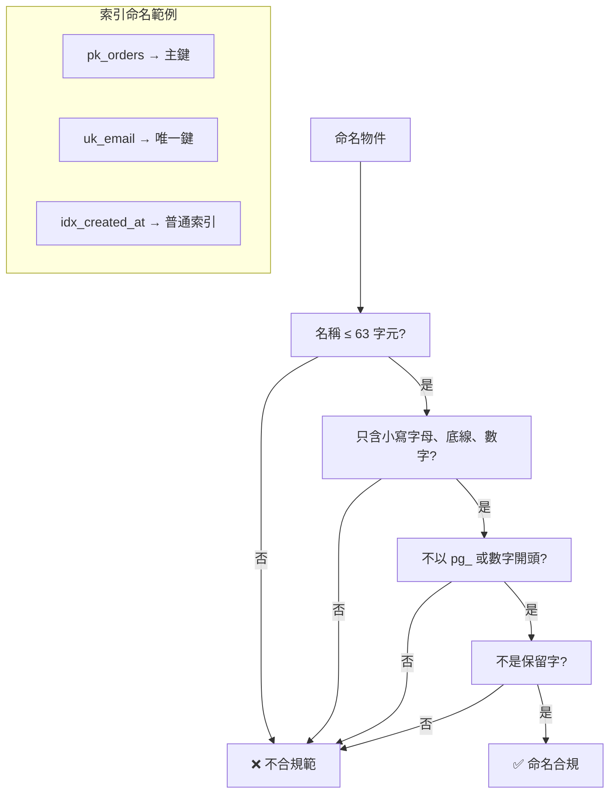
```mermaid
flowchart TD
    A["命名物件"] --> B["名稱 ≤ 63 字元?"]
    B -->|否| C["❌ 不合規範"]
    B -->|是| D["只含小寫字母、底線、數字?"]
    D -->|否| C
    D -->|是| E["不以 pg_ 或數字開頭?"]
    E -->|否| C
    E -->|是| F["不是保留字?"]
    F -->|否| C
    F -->|是| G["✅ 命名合規"]

    subgraph "索引命名範例"
        H["pk_orders → 主鍵"]
        I["uk_email → 唯一鍵"]
        J["idx_created_at → 普通索引"]
    end
```

### I. 強制規範

| # | 規則 |
|---|------|
| 1 | DB / table / column name 總長度 ≤ 63 字符 |
| 2 | Object name 只用小寫字母、底線、數字。不以 `pg` 開頭、不以數字開頭、不用保留字（[PG 17 reserved words](https://www.postgresql.org/docs/17/sql-keywords-appendix.html)） |
| 3 | Query alias 只用 `[a-z0-9_]`，不用中文或其他字符 |

### II. 推薦規範

| # | 規則 |
|---|------|
| 4 | PK index → `pk_*`，UK index → `uk_*`，普通 index → `idx_*` |
| 5 | Temp table → `tmp_*`；分區子表以規則結尾（`tbl_2016`、`tbl_2017`...） |
| 6 | DB name：`<部門>_<功能>`（如 `xxx_yyy`） |
| 7 | DB name 與應用名稱一致或便於辨識 |
| 8 | 避免 `public` schema；每應用分配獨立 schema，`schema_name` 與 username 一致 |
| 9 | Comment 不用中文（編碼不一致時 `pg_dump` 可能亂碼） |

### III. App Dev 實戰：Npgsql 連線字串

```csharp
var connString = new NpgsqlConnectionStringBuilder
{
    Host = "localhost",
    Port = 5432,
    Database = "myapp_db",
    Username = "myapp_user",
    Password = "myapp_password",
    ApplicationName = "MyApp.Api",           // ← pg_stat_activity 中的識別名
    SearchPath = "myapp",                    // ← 預設搜尋路徑 = schema
    MaxPoolSize = 50,
    MinPoolSize = 5,
    ConnectionIdleLifetime = 300,
    Timeout = 10,
    CommandTimeout = 30,
    IncludeErrorDetail = true
}.ConnectionString;
```

| 參數 | 作用 | 建議值 | 踩坑提醒 |
|------|------|--------|---------|
| `Host` / `Port` | PG 伺服器位址與埠號 | 實際 IP，不用 localhost（RDS 用 endpoint） | 雲端 RDS 不用 IP，用提供的 endpoint |
| `Database` | 連線目標資料庫 | 每應用一個 DB | 不要所有服務共用同一個 DB |
| `Username` / `Password` | 登入憑證 | 每應用獨立帳號，非 superuser | 絕對不要用 `postgres` 帳號跑業務 |
| `ApplicationName` | 寫入 `pg_stat_activity.application_name` | `<服務名>.<模組>` 如 `MyApp.Api` | 出問題時一眼看出兇手，**最重要的一個參數** |
| `SearchPath` | 等於 `SET search_path TO ...`，決定不帶 schema 前綴時的搜尋順序 | 跟 application name 一致的 schema 名 | 避免用 `public`；多 schema 時可用逗號分隔 `"app,public"` |
| `MaxPoolSize` | Pool 內最大連線數 | 公式：`max_connections * 0.8 / 實例數` | 設太高 → PG 連線數爆；設太低 → 請求排隊等連線。預設 100 通常太大 |
| `MinPoolSize` | Pool 內最少保持的熱連線數 | 5-10（視常態負載） | 設 0 的話，流量低谷後第一波請求會有 cold start latency（~200ms 建立 TCP + SSL + auth） |
| `ConnectionIdleLifetime` | 空閒連線存活秒數，超時後 Npgsql 主動關閉回收 | 300（5 分鐘），需 < PG 端的 `idle_in_transaction_session_timeout` | PG 端也有空閒超時設定（`idle_in_transaction_session_timeout`），Npgsql 這邊要比 PG 端短，否則 PG 先砍連線時 Npgsql 會收到 broken connection |
| `ConnectionPruningInterval` | 多久檢查一次空閒連線是否需要回收 | 60（1 分鐘） | 搭配 `ConnectionIdleLifetime` 使用，預設 10 秒太頻繁、60 秒已足夠 |
| `Timeout` | 從 Pool 等待取得連線的最長秒數 | 10-15 | **不是 SQL 執行 timeout**，是排隊等連線的時間。超過拋 `TimeoutException` |
| `CommandTimeout` | 單條 SQL 的最長執行秒數 | 30 | Npgsql 客戶端計時，超時發 `CancelRequest` 給 PG。建議另外在 PG 端設 `statement_timeout`（略小於此值）做雙重防護 |
| `IncludeErrorDetail` | 錯誤訊息是否包含 detail / hint / position 等欄位 | dev=true, prod=false | Production 設 false，避免把資料表名、欄位名洩漏到 client 端錯誤回應中 |
| `TcpKeepAlive` | 是否啟用 TCP keep-alive 探測 | true | 防止防火牆/NAT 中途砍掉空閒連線後 Npgsql 渾然不知。Npgsql 預設為 false，建議開啟 |
| `KeepAlive` | TCP keep-alive 探測間隔秒數 | 30 | 需 OS 層支援（Windows 預設 2 小時太長，建議調到 30-60 秒） |
| `TrustServerCertificate` | 是否信任自簽 SSL 憑證 | dev=true, prod=false | Prod 永遠 false，用正式 CA 簽發的憑證 |

**Application Name 的追蹤價值**：

```sql
-- 出問題時，一眼看出哪個服務在幹嘛
SELECT application_name, state, wait_event, query
FROM pg_stat_activity
WHERE backend_type = 'client backend' AND state <> 'idle';
-- MyApp.Api    | active | LWLock:WALWrite | UPDATE orders SET ...
-- MyApp.Worker | idle in transaction    | SELECT * FROM ...  ← 長交易！
```

```csharp
// ✅ 在 application log 中記錄 backend_pid（事後可對照 pg_stat_activity）
using var conn = new NpgsqlConnection(connString);
await conn.OpenAsync();
_logger.LogInformation("DB opened. PID: {BackendPid}", conn.ProcessID);
```

---

## 2. 設計規範


設計規範是資料庫開發的核心——好的設計能讓查詢快十倍，壞的設計會讓系統越用越慢。

**為甚麼外鍵（Foreign Key）欄位要手動建索引？** 當你刪除或更新被引用的主表資料時，PostgreSQL 需要檢查所有引用該資料的子表行，確保不會違反外鍵約束。如果子表的外鍵欄位沒有索引，PostgreSQL 必須**全表掃描**子表，這在子表有百萬行時會非常非常慢。

**`fillfactor` 是做什麼用的？** PostgreSQL 使用 MVCC（多版本並行控制），更新一行資料時實際上是新增一個版本，而不是原地修改。`fillfactor = 85` 表示每個資料頁只填滿 85%，預留 15% 的空間給未來在同一頁上的更新（稱為 HOT update），避免更新時還要跨頁尋找空間。

**BRIN 索引是什麼？** 如果你有一張記錄溫度的表，資料按時間順序寫入，時間越近溫度越高。BRIN（Block Range INdex）會記錄「第 1-100 頁的溫度範圍是 15-20°C，第 101-200 頁是 20-25°C...」，查詢時可以快速跳過不在範圍內的頁。BRIN 索引非常小（約是 B-tree 的 1/1000），但要求資料有物理排序的相關性。

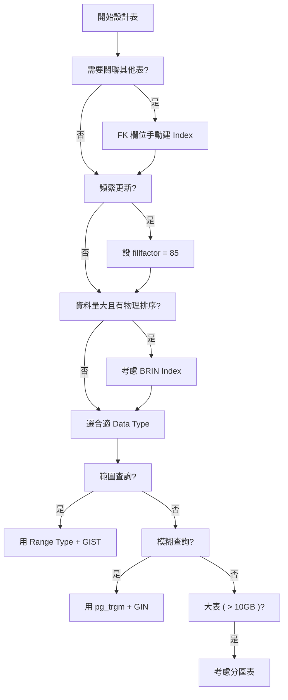
```mermaid
flowchart TD
    A["開始設計表"] --> B["需要關聯其他表?"]
    B -->|是| C["FK 欄位手動建 Index"]
    B -->|否| D["頻繁更新?"]
    C --> D
    D -->|是| E["設 fillfactor = 85"]
    D -->|否| F["資料量大且有物理排序?"]
    E --> F
    F -->|是| G["考慮 BRIN Index"]
    F -->|否| H["選合適 Data Type"]
    G --> H
    H --> I["範圍查詢?"]
    I -->|是| J["用 Range Type + GIST"]
    I -->|否| K["模糊查詢?"]
    K -->|是| L["用 pg_trgm + GIN"]
    K -->|否| M["大表 ( > 10GB )?"]
    M -->|是| N["考慮分區表"]
```

### I. 強制規範

| # | 規則 | SQL 範例 |
|---|------|---------|
| 1 | 跨表同名/同義 column 必須名稱、型別一致 | — |
| 2 | B-tree index 欄位 ≤ 2000 bytes；超過用 hash / 分詞 index | — |
| 3 | FK column 必須手動建 index（否則影響 referenced table 的 UPDATE/DELETE） | 見下方 #1 |
| 4 | FK 必須設 action：`ON DELETE/UPDATE CASCADE \| SET NULL \| SET DEFAULT` | 見下方 #2 |
| 5 | 頻繁更新的 table 設 `fillfactor = 85`（預留 15% 給 HOT update） | 見下方 #3 |
| 6 | Index `NULLS FIRST/LAST` 必須與 `ORDER BY` 一致，否則 index 可能無法使用 | — |
| 7 | Column data type 必須與 application 定義一致；跨表 collation 必須一致 | — |

```sql
-- #3 FK 手動建 index
CREATE TABLE tbl(id int PRIMARY KEY, info text);
CREATE TABLE tbl1(id int REFERENCES tbl(id), info text);
-- 此時 tbl1.id 沒有 index！
CREATE INDEX idx_tbl1_id ON tbl1(id);

-- #4 FK action
CREATE TABLE tbl2(id int REFERENCES tbl(id) ON DELETE CASCADE ON UPDATE CASCADE, info text);
CREATE INDEX idx_tbl2_id ON tbl2(id);
INSERT INTO tbl VALUES (1,'test');
INSERT INTO tbl2 VALUES (1,'test');
UPDATE tbl SET id = 2;
SELECT * FROM tbl2;  -- id 自動變成 2

-- #5 fillfactor
CREATE TABLE test123(id int, info text) WITH (fillfactor = 85);
```

### II. 強制規範詳解：B-tree 2000 byte 限制

B-tree 索引把欄位值本身存進索引頁中。PostgreSQL 預設每頁 8KB，單一索引 entry 不能超過約 1/3 頁（約 2700 bytes），安全上限取整數 2000 bytes。超過這個大小的欄位值塞不進 B-tree 頁，建索引時直接報錯：

```sql
CREATE INDEX idx_content ON articles (content);  -- ❌ value too long！
```

解法取決於查詢模式：

| 查詢方式 | 用什麼 | 原因 |
|---------|--------|------|
| `WHERE content = '精確匹配'` | **hash index** | 只存 4-byte hash，不存原文，不受限制 |
| `WHERE content LIKE '%關鍵字%'` | **GIN + pg_trgm** | 拆成 3-gram token，每個都 < 3 byte |
| `WHERE to_tsvector(content) @@ '關鍵字'` | **GIN + tsvector** | 拆成詞彙而非整篇存 |

```sql
-- hash：只支援 = 運算
CREATE INDEX ON articles USING hash (content);

-- GIN + tsvector：全文檢索
CREATE INDEX ON articles USING gin (to_tsvector('simple', content));

-- GIN + pg_trgm：LIKE / regex
CREATE INDEX ON articles USING gin (content gin_trgm_ops);
```

對 App Dev 而言：如果 Dapper 的 SQL 對長文字欄位下了 `WHERE content = @Value`，確保用的是 hash index 而非 B-tree，否則整條 SQL 會因為 index 建不起來而走 Seq Scan。

### III. 強制規範詳解：FK 必須設 Action

FK 如果不寫 `ON DELETE` / `ON UPDATE`，PostgreSQL 預設是 `NO ACTION`——意思是「有子行就擋住，直接拋錯」：

```sql
-- ❌ 沒寫 action → 預設 NO ACTION
CREATE TABLE orders (user_id INT REFERENCES users(id));

DELETE FROM users WHERE id = 1;
-- ERROR: update or delete on table "users" violates foreign key constraint
-- → C# 端收到 PostgresException，刪除操作直接失敗
```

必須根據業務場景三選一：

| Action | 行為 | 適用場景 |
|--------|------|---------|
| `CASCADE` | 父行刪除 → 子行跟著刪 | 訂單明細（訂單沒了，明細也該沒了） |
| `SET NULL` | 父行刪除 → 子行 FK 欄位變 NULL | 文章作者（作者被刪，文章留著但作者欄位掛 NULL） |
| `SET DEFAULT` | 父行刪除 → 子行 FK 欄位變預設值 | 部門主管（主管離職，歸到「未分配」預設部門） |

```sql
-- ✅ 明確指定
CREATE TABLE order_items (
    order_id  INT REFERENCES orders(id)   ON DELETE CASCADE,
    product_id INT REFERENCES products(id) ON DELETE SET NULL
);
```

沒寫 `ON DELETE` 的 FK 是一顆地雷——刪一筆舊資料就可能讓整個 request 炸掉。寫 `DELETE` SQL 之前，先確認那張表有沒有子表、FK 設了什麼 action。

### IV. 強制規範詳解：Partial Index

一般索引會覆蓋整張表的每一行。Partial index 只索引**符合 WHERE 條件的那部分行**，跳過不合條件的，讓索引更小、更快。

```sql
-- ❌ 一般索引：整張表 1000 萬行全進去
CREATE INDEX idx_orders_status ON orders (status);

-- ✅ Partial index：只索引 status = 'active' 的 10 萬行
CREATE INDEX idx_orders_active ON orders (created_at)
    WHERE status = 'active';
```

核心原理：如果你的查詢永遠帶某個固定條件，就**不需要**把不符合該條件的行塞進索引。掃描範圍直接縮小。

| 場景 | 一般 Index | Partial Index | 效果 |
|------|-----------|--------------|------|
| 軟刪除 `WHERE deleted = false` | Index 包含已刪除行 | `WHERE deleted = false` | 90% 的已刪行不在 index 中 |
| 多租戶 `WHERE tenant_id = 1` | 全部租戶共用一個 index | `WHERE tenant_id = 1` | 每個租戶的查詢只掃自己的部分 |
| 狀態過濾 `WHERE status IN ('new','pending')` | 包含所有狀態 | `WHERE status IN ('new','pending')` | 已完成/已取消的訂單不佔 index 空間 |
| 未售完座位（見第六章） | 含已售完座位 | `WHERE station_bit <> repeat('1', N)` | 售完即退出 index，查詢自動跳過 |

```sql
-- 實戰：訂單表 1000 萬行，只有 50 萬行 status = 'pending'
CREATE INDEX idx_pending_orders ON orders (created_at)
    WHERE status = 'pending';

-- 查詢時 Planner 自動選用這個 partial index
SELECT * FROM orders WHERE status = 'pending' ORDER BY created_at;
-- Index Scan on idx_pending_orders → 只掃 50 萬行而非 1000 萬行
```

限制：WHERE 條件必須是**查詢中固定出現的**。如果 query 有時 `WHERE status = 'pending'`、有時 `WHERE status = 'shipped'`，就不能只用一個 partial index——要嘛建多個 partial index，要嘛回歸一般 index。

### V. App Dev 實戰：設計規範的 C# 落地

**FK Cascade 對應用完全透明**——你可能只刪了一行，DB 卻連帶刪了 N 張子表。在 C# 中你必須清楚每個 FK 的 action：

```csharp
// ON DELETE CASCADE：刪除主表 = 自動刪除子表（應用層無感知）
// ON DELETE SET NULL：刪除主表後子表外鍵變 NULL（應用層需處理 null）
// ON DELETE RESTRICT：有子資料就拋錯（應用層必須先處理子資料）
```

**Data Type 選擇對 C# 的直接影響**：

| PG 型別 | C# 型別 | 陷阱 |
|---------|---------|------|
| `numeric(18,2)` | `decimal` | 永遠不要用 `float`/`double` 存金額 |
| `timestamptz` | `DateTime` (Npgsql 預設 Utc) | 永遠不要用 `timestamp` without tz |
| `text` | `string` | varchar(n) 與 text 效能相同 |
| `jsonb` | `JObject` / 反序列化 | 可建 GIN index，支援 `@>` 查詢 |
| `uuid` | `Guid` | 不建議做 B-tree PK（page split 嚴重） |
| `varbit` | `BitArray` / `byte[]` | 適合多選一狀態、區段標記（見第六章） |

```csharp
// ❌ 經典錯誤：用字串比對數字
// "WHERE price > '1000'" → '900' > '1000' 為 true！
// ✅ 用正確型別：WHERE price > 1000
```

### VI. 推薦規範

| # | 規則 |
|---|------|
| 8 | Partition table 全域唯一 PK：多個 sequence，不同 `INCREMENT BY` 或不同 `MINVALUE/MAXVALUE` 範圍 |
| 9 | 定期刪除歷史數據 → 按時間分區，`DROP`/`TRUNCATE` partition，不用 `DELETE` |
| 10 | 所有字串用 UTF-8；區分 `length()`（字元數）vs `octet_length()`（byte 數） |
| 11 | 線性相關數據（streaming、自增、timestamp）+ 範圍查詢 → BRIN index |
| 12 | 選擇合適 data type：數字不用字串、樹型不用字串（PG 支援 numeric / float / money / string / date / time / boolean / enum / geometry / network / UUID / XML / JSON / array / composite / range / ltree / cube / earth / hstore / pg_trgm / PostGIS...） |
| 13 | 避免全表掃描；PG 幾乎所有 data type 都支援 index（btree / hash / gin / gist / sp-gist / brin / rum / bloom） |
| 14 | 複雜 business logic + 高 RT 場景：盡量用 stored procedure（plpgsql）或內建函數，減少 DB-app roundtrip |
| 15 | 避免用 trigger（複雜化邏輯，不利 debug） |
| 16 | 常訪問大結果集（如 100 row）→ 設法聚合為少量 row；無法聚合則用高 IOPS 磁盤 |
| 17 | Streaming 即時統計防 parallel transaction 空洞：parallel insert 到不同分表，單分表內 serial insert |
| 18 | 範圍查詢 → 用 range type + GIST index（如 IP range `int8range` + GIST，比 `BETWEEN` 快 20x） |
| 19 | 未引用的大對象必須同時刪除數據部分（或用 `vacuumlo`） |
| 20 | 固定條件的查詢 → partial index（`CREATE INDEX ... WHERE id = 1`） |
| 21 | Expression 查詢 → expression/function index |
| 22 | Debug 複雜邏輯 → plpgsql `DO` block，非 function |
| 23 | 中文分詞 → `zhparser` 或 `jieba`；分詞欄位用 GIN index |
| 24 | Regex / text similarity → `pg_trgm` GIN index（覆蓋 `LIKE '%xxx%'`） |
| 25 | Prefix / suffix 模糊查詢：`col ~ '^abc'`（prefix）或 `reverse(col) ~ '^def'`（suffix） |
| 26 | 大表（> 8GB 或 > 1000 萬 row）應分區，提升查詢/更新/備份/恢復/index 效率 |
| 27 | Table schema 謹慎規劃，避免頻繁 `ALTER TABLE ADD COLUMN`（可能觸發 rewrite）；不可預測 schema 用 `jsonb` |

```sql
-- #8 方案一：不同步長
CREATE SEQUENCE seq_tab1 INCREMENT BY 10000 START WITH 1;
CREATE SEQUENCE seq_tab2 INCREMENT BY 10000 START WITH 2;
CREATE SEQUENCE seq_tab3 INCREMENT BY 10000 START WITH 3;
CREATE TABLE tab1 (id int PRIMARY KEY DEFAULT nextval('seq_tab1') CHECK (mod(id,10000)=1), info text);
CREATE TABLE tab2 (id int PRIMARY KEY DEFAULT nextval('seq_tab2') CHECK (mod(id,10000)=2), info text);
CREATE TABLE tab3 (id int PRIMARY KEY DEFAULT nextval('seq_tab3') CHECK (mod(id,10000)=3), info text);

-- #8 方案二：不同範圍
CREATE SEQUENCE seq_tb1 INCREMENT BY 1 MINVALUE 1 MAXVALUE 100000000 START WITH 1 NO CYCLE;
CREATE SEQUENCE seq_tb2 INCREMENT BY 1 MINVALUE 100000001 MAXVALUE 200000000 START WITH 100000001 NO CYCLE;

-- #10 UTF-8 長度
SELECT length('阿里巴巴');       -- 4（字元數）
SELECT octet_length('阿里巴巴'); -- 12（byte 數）

-- Available length functions:
-- array_length, bit_length, char_length/character_length,
-- json_array_length, jsonb_array_length, length, octet_length

-- #11 BRIN index
CREATE INDEX idx ON tbl USING brin (id);

-- #18 Range type + GIST IP 範例
CREATE TABLE ip_address_pool_3 (
    id serial8 PRIMARY KEY,
    start_ip inet NOT NULL,
    end_ip inet NOT NULL,
    province varchar(128) NOT NULL,
    city varchar(128) NOT NULL,
    region_name varchar(128) NOT NULL,
    company_name varchar(128) NOT NULL,
    ip_decimal_segment int8range
);
CREATE INDEX ip_address_pool_3_range ON ip_address_pool_3 USING gist (ip_decimal_segment);
SELECT province, ip_decimal_segment FROM ip_address_pool_3 WHERE ip_decimal_segment @> :ip::int8;

-- #20 Partial index
CREATE INDEX idx ON tbl (col) WHERE id = 1;

-- #21 Expression index
CREATE INDEX idx ON tbl (exp);

-- #22 DO block for debugging
DO LANGUAGE plpgsql $$
DECLARE
BEGIN
    -- logical code
END;
$$;

-- #26 Prefix / suffix fuzzy query
SELECT * FROM tbl WHERE col ~ '^abc';          -- prefix
SELECT * FROM tbl WHERE reverse(col) ~ '^def'; -- suffix
```

> 補充（Senior Dev）：#8 的 multi-sequence 方案在 PG 10+ 有了更好的替代——`IDENTITY` column + `GENERATED BY DEFAULT AS IDENTITY`，搭配 `CACHE` 參數可減少 sequence 競爭。若用 PG 17 native partitioning + `GENERATED ALWAYS AS IDENTITY`，sequence 管理由 PG 內部處理，不需手動調步長。

### VII. 推薦規範詳解：Stored Procedure 減少 Roundtrip

這條規則的核心是**網路延遲**。一次 DB roundtrip（應用 → DB → 應用）在相同資料中心約 0.5-2ms。聽起來很小，但當一個 business operation 需要 5-10 條 SQL 時，累積延遲就變成瓶頸。

```csharp
// ❌ C# 端做複雜邏輯：5 次 roundtrip
public async Task TransferMoney(int from, int to, decimal amount)
{
    // Roundtrip 1：檢查餘額
    var balance = await conn.ExecuteScalarAsync<decimal>(
        "SELECT balance FROM accounts WHERE id = @Id", new { Id = from });

    if (balance < amount) throw new Exception("餘額不足");

    // Roundtrip 2：扣款
    await conn.ExecuteAsync("UPDATE accounts SET balance = balance - @Amt WHERE id = @Id",
        new { Id = from, Amt = amount });

    // Roundtrip 3：加款
    await conn.ExecuteAsync("UPDATE accounts SET balance = balance + @Amt WHERE id = @Id",
        new { Id = to, Amt = amount });

    // Roundtrip 4：記錄轉帳 log
    await conn.ExecuteAsync(
        "INSERT INTO transfer_logs (from_id, to_id, amount) VALUES (@F, @T, @A)",
        new { F = from, T = to, A = amount });

    // Roundtrip 5：回傳最終餘額
    return await conn.ExecuteScalarAsync<decimal>(
        "SELECT balance FROM accounts WHERE id = @Id", new { Id = from });
}
// 5 × 2ms = 10ms。本來就不是很快，加上 middle-tier 排隊 → 更慢
// 且步驟 1 跟步驟 2 之間不是 atomic —— 兩次 SQL 之間餘額可能被其他交易改掉
```

```sql
-- ✅ 同樣邏輯寫成 plpgsql function：1 次 roundtrip，DB 內部做完
CREATE OR REPLACE FUNCTION transfer_money(
    from_id INT, to_id INT, amount DECIMAL
) RETURNS DECIMAL AS $$
DECLARE
    bal DECIMAL;
BEGIN
    SELECT balance INTO bal FROM accounts WHERE id = from_id FOR UPDATE;
    IF bal < amount THEN
        RAISE EXCEPTION '餘額不足：帳戶 % 只有 %', from_id, bal;
    END IF;

    UPDATE accounts SET balance = balance - amount WHERE id = from_id;
    UPDATE accounts SET balance = balance + amount WHERE id = to_id;
    INSERT INTO transfer_logs (from_id, to_id, amount) VALUES (from_id, to_id, amount);

    RETURN (SELECT balance FROM accounts WHERE id = from_id);
END;
$$ LANGUAGE plpgsql;
```

```csharp
// ✅ C# 端只需一行：
var newBalance = await conn.ExecuteScalarAsync<decimal>(
    "SELECT transfer_money(@From, @To, @Amt)",
    new { From = from, To = to, Amt = amount });
// 1 次 roundtrip，DB 內部保證 atomic（整個 function 在同一 transaction 中執行）
```

**什麼時候該用、什麼時候不該**：

| 場景 | 用 Stored Procedure？ | 原因 |
|------|----------------------|------|
| 轉帳（多表更新 + 條件檢查） | ✅ 該用 | 需要 atomic，多步 SQL 之間不能有 race condition |
| 報表（多表 JOIN + 聚合） | ✅ 該用 | 減少大量中間結果在網路上傳輸 |
| 簡單 CRUD（單表增刪改查） | ❌ 不用 | Dapper 一行搞定，多包一層 function 反而增加維護成本 |
| 含外部 API 呼叫的邏輯 | ❌ 不能用 | plpgsql 無法呼叫 HTTP / gRPC，這層邏輯留在 C# |
| 跨多個 DB 的操作 | ❌ 不合適 | plpgsql 只能操作當前 DB，跨庫邏輯留在應用層 |

**plpgsql 不利 Debug 是真的，但可以降低痛苦**：

```sql
-- 用 RAISE NOTICE 印出中間變數（類似 console.log）
RAISE NOTICE 'from_id=%, balance=%, amount=%', from_id, bal, amount;

-- 用 GET DIAGNOSTICS 取得實際影響行數
GET DIAGNOSTICS row_count = ROW_COUNT;
RAISE NOTICE 'updated % rows', row_count;
```

對 App Dev 的底線：**需要多步 SQL 保證 atomic 的操作，寫成 function。簡單 CRUD 留在 Dapper。不要因為「function 難 debug」就把轉帳邏輯拆成 5 條 SQL 各自飛。**

---

## 3. Query 規範


SQL 查詢中最容易踩坑的就是 **NULL 的行為**。NULL 在 SQL 中代表「未知」，而不是「空」或「零」。任何與 NULL 的比較（包括 `=`、`<>`、`>`）都返回 NULL（未知），而不是 TRUE 或 FALSE。這就是為什麼 `NULL = NULL` 的結果是 NULL 而不是 TRUE——兩個未知值無法確認是否相等。

**count(*) vs count(col) 的關鍵差異**：`count(*)` 計算所有行數（包括所有欄位都是 NULL 的行），而 `count(col)` 只計算該欄位不為 NULL 的行數。這就是為什麼規範強制使用 `count(*)`——它最直覺、最不容易出錯。

**NULL 對 sum() 的影響**：如果所有行的該欄位都是 NULL，`sum(col)` 會返回 NULL 而不是 0。所以計算總額時一定要用 `COALESCE(SUM(amount), 0)`，否則 NULL 可能會在後續計算中造成連鎖問題。

**為什麼不能用 SELECT \*？** `SELECT *` 看似方便，但有兩個問題：第一，它會取回所有欄位（包括你不需要的），浪費網路頻寬和記憶體；第二，當表格結構改變（新增欄位），你的程式碼可能因為收到預期外的欄位而出錯。

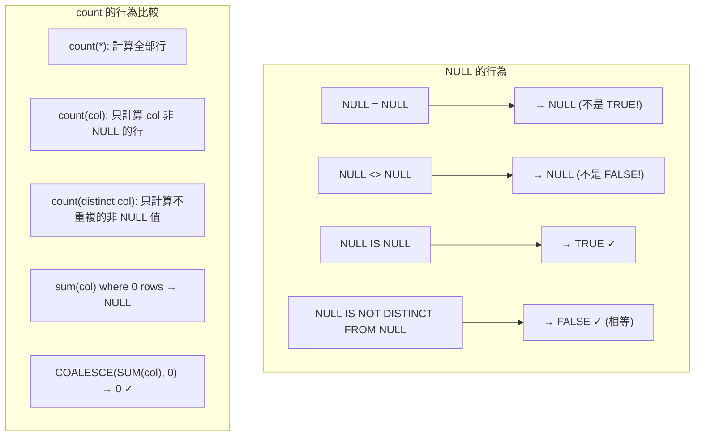
```mermaid
flowchart TD
    subgraph "NULL 的行為"
        A["NULL = NULL"] --> B["→ NULL (不是 TRUE!)"]
        C["NULL <> NULL"] --> D["→ NULL (不是 FALSE!)"]
        E["NULL IS NULL"] --> F["→ TRUE ✓"]
        G["NULL IS NOT DISTINCT FROM NULL"] --> H["→ FALSE ✓ (相等)"]
    end
    
    subgraph "count 的行為比較"
        I["count(*): 計算全部行"]
        J["count(col): 只計算 col 非 NULL 的行"]
        K["count(distinct col): 只計算不重複的非 NULL 值"]
        L["sum(col) where 0 rows → NULL"]
        M["COALESCE(SUM(col), 0) → 0 ✓"]
    end
```

### I. 強制規範

| # | 規則 | SQL 範例 |
|---|------|---------|
| 1 | 永遠用 `count(*)`（SQL92 標準，統計所有 row 含 NULL）；不用 `count(col)` 或 `count(常數)` | — |
| 2 | 多 column count 必須加括號：`count((col1,col2,col3))`。即使所有 column 為 NULL 該 row 仍被計數 | — |
| 3 | `count(distinct col)` 只計非 NULL 不重複值，NULL 不計 | — |
| 4 | `count(distinct (col1,col2,...))` 計數 NULL，且 NULL = NULL 視為相同 | — |
| 5 | `count(col)` 對 NULL column 返回 0，而 `sum(col)` 返回 NULL → NPE guard：`COALESCE(SUM(g), 0)` | — |
| 6 | NULL = UNKNOWN；任何與 NULL 的比較返回 NULL（非 true/false）：`NULL <> NULL` → NULL，`NULL = NULL` → NULL | — |
| 7 | 除非 ETL，否則避免返回大數據量給 client | — |
| 8 | 永遠不用 `SELECT *`，必須指定 column list | — |

```sql
-- #2~5 count behavior
CREATE TABLE t123(c1 int, c2 int, c3 int);
INSERT INTO t123 VALUES
    (null,null,null), (null,null,null),
    (1,null,null), (2,null,null),
    (null,1,null), (null,2,null);

SELECT count((c1,c2)) FROM t123;   -- 6（全部 row）
SELECT count((c1)) FROM t123;      -- 2（只計 c1 非 NULL）
SELECT count(distinct c1) FROM t123;  -- 2
SELECT count(distinct (c1,c2)) FROM t123;  -- 5（NULL 被計入且 NULL=NULL）
SELECT count(distinct (c1,c2,c3)) FROM t123;  -- 5
SELECT count(c1), sum(c1) FROM t123 WHERE c1 IS NULL;  -- 0 | NULL
SELECT COALESCE(SUM(g), 0) FROM table;  -- NPE guard
```

### II. App Dev 實戰：EXISTS vs IN 與 RETURNING

兩個技巧的核心差異都在 **roundtrip（應用 ↔ DB 來回次數）**。

**EXISTS > IN：減少 DB 內部掃描量**

```sql
-- ❌ IN：子查詢先跑完，把結果集展開，外層再逐一比對
SELECT * FROM orders
WHERE customer_id IN (SELECT id FROM customers WHERE region = 'Asia');
-- customers 有 10 萬筆 Asia 用戶 → 子查詢返回 10 萬個 id
-- orders 的每一行都要跟 10 萬個 id 做 hash lookup

-- ✅ EXISTS：碰到第一筆匹配就停，不等子查詢跑完
SELECT * FROM orders o
WHERE EXISTS (
    SELECT 1 FROM customers c
    WHERE c.id = o.customer_id AND c.region = 'Asia'
);
-- 對 orders 每行，進子查詢「有沒有一筆 customer 符合條件」
-- → 找到第一筆就 return true，不繼續掃
```

根本差異：`IN` 是先算完子查詢再比對；`EXISTS` 是邊走邊問「有嗎？」，碰到第一筆就停。表越大、子查詢結果越多，差異越明顯。

```csharp
// Dapper 中的對比
// ❌ IN：需要先撈出子查詢結果再傳入
var ids = (await conn.QueryAsync<int>("SELECT id FROM customers WHERE region = @R", new { R = "Asia" })).AsList();
var orders = await conn.QueryAsync<Order>("SELECT * FROM orders WHERE customer_id = ANY(@Ids)", new { Ids = ids });

// ✅ EXISTS：一條 SQL 搞定，不產生中間物件
var orders = await conn.QueryAsync<Order>(
    @"SELECT * FROM orders o
      WHERE EXISTS (SELECT 1 FROM customers c WHERE c.id = o.customer_id AND c.region = @R)",
    new { R = "Asia" });
```

**RETURNING：省一個 SELECT**

```sql
-- ❌ 傳統寫法：INSERT → 查 ID → SELECT 取回 row（3 個 roundtrip）
INSERT INTO orders (user_id, amount) VALUES (1, 100);
SELECT currval('orders_id_seq');   -- → 42
SELECT * FROM orders WHERE id = 42;

-- ✅ RETURNING：一次做完，新 row 直接吐回來
INSERT INTO orders (user_id, amount) VALUES (1, 100) RETURNING *;
-- 同時拿到 id=42, created_at, 以及所有 DB 產生的預設值
```

`RETURNING` 不只省 roundtrip，還保證你拿到的是 **DB 最終寫入的值**（沒 race condition）。

```csharp
// ✅ C# 中的完整用法
// INSERT
var order = await conn.QuerySingleAsync<Order>(
    "INSERT INTO orders (user_id, amount) VALUES (@Uid, @Amt) RETURNING *",
    new { Uid = 1, Amt = 100m });
// order.Id, order.CreatedAt 都是 DB 產生的，保證正確

// UPDATE
var updated = await conn.QuerySingleAsync<Order>(
    "UPDATE orders SET status = 'shipped' WHERE id = @Id RETURNING *",
    new { Id = 123 });

// DELETE — 拿回被刪的那筆資料，寫 audit log 超方便
var deleted = await conn.QuerySingleAsync<LogEntry>(
    "DELETE FROM orders WHERE id = @Id RETURNING id, user_id, amount, created_at",
    new { Id = 123 });
```

總結：`EXISTS` 讓 DB 少做事，`RETURNING` 讓你的 C# 少發請求。兩者加起來 = 應用層效能有感提升。

---

## 4. 管理規範


管理規範關注的是 DBA 和開發者在日常操作中如何避免「誤傷」資料庫。最核心的原則是：**先確認，再執行**。

**為什麼 DDL 操作要設 `lock_timeout`？** `ALTER TABLE`、`CREATE INDEX` 等 DDL 操作需要取得表上的獨佔鎖（AccessExclusiveLock）。如果表上有正在執行的查詢，DDL 會一直等待，而等待期間又會阻塞後續的所有查詢——形成連鎖阻塞。設 `lock_timeout` 可以讓 DDL 在指定時間內拿不到鎖就自動放棄，避免長時間阻塞業務。

**`EXPLAIN ANALYZE` 為什麼要包在 transaction 中？** `EXPLAIN ANALYZE` 會真正執行查詢（而不只是分析）。如果你用 `EXPLAIN ANALYZE DELETE FROM ...` 來確認會刪除哪些資料，這些資料就真的被刪除了！包在 `BEGIN...ROLLBACK` 中可以讓你看到執行效果後再決定是否真的要執行。

### I. 強制規範詳解：WAL 原理與 App Dev 防禦

WAL（Write-Ahead Log）是 PostgreSQL 保證資料不丟失的核心機制：任何寫入（INSERT/UPDATE/DELETE）都不會直接寫進最終的資料檔，而是**先寫進 WAL**，確認 WAL 寫入成功後，才逐步將變更刷到資料檔中。正常情況下，舊的 WAL 會被 checkpoint 自動清理。但 archive_mode=on 或 replication slot 會阻止清理——歸檔失敗或備機延遲時，WAL 累積直到磁碟爆滿，DB 拒絕所有寫入。

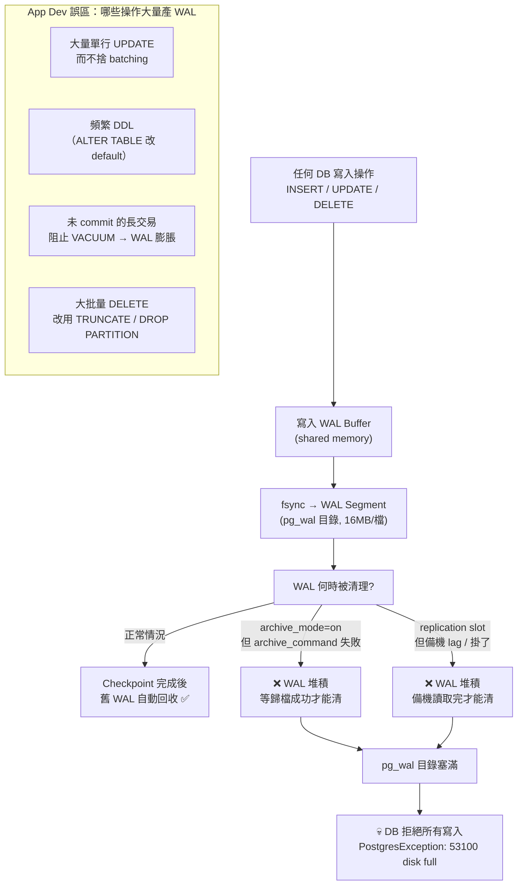
```mermaid
flowchart TD
    A["任何 DB 寫入操作<br>INSERT / UPDATE / DELETE"] --> B["寫入 WAL Buffer<br>(shared memory)"]
    B --> C["fsync → WAL Segment<br>(pg_wal 目錄, 16MB/檔)"]

    C --> D["WAL 何時被清理?"]

    D -->|"正常情況"| E["Checkpoint 完成後<br>舊 WAL 自動回收 ✅"]
    D -->|"archive_mode=on<br>但 archive_command 失敗"| F["❌ WAL 堆積<br>等歸檔成功才能清"]
    D -->|"replication slot<br>但備機 lag / 掛了"| G["❌ WAL 堆積<br>備機讀取完才能清"]

    F --> H["pg_wal 目錄塞滿"]
    G --> H
    H --> I["💀 DB 拒絕所有寫入<br>PostgresException: 53100 disk full"]

    subgraph "App Dev 誤區：哪些操作大量產 WAL"
        J1["大量單行 UPDATE<br>而不捨 batching"]
        J2["頻繁 DDL<br>（ALTER TABLE 改 default）"]
        J3["未 commit 的長交易<br>阻止 VACUUM → WAL 膨脹"]
        J4["大批量 DELETE<br>改用 TRUNCATE / DROP PARTITION"]
    end
```

**WAL 流量的根本來源**：每次寫操作都產 WAL。以下是 App Dev 寫法對 WAL 的影響：

| App Dev 操作 | WAL 產生量 | 問題 |
|-------------|-----------|------|
| `UPDATE orders SET status = 'done' WHERE id = @Id` | 1 筆 WAL（改 1 行） | 正常 |
| `for` 迴圈逐行 `UPDATE ... WHERE id = @Id`（1000 次） | 1000 筆 WAL + 1000 次 fsync | Batching 寫法可降到 1 筆 |
| `DELETE FROM logs WHERE created_at < @Old`（刪 1 千萬行） | 1 千萬筆 WAL，瞬間塞滿 pg_wal | **分批刪不省 WAL**（總量一樣，只攤平）。應改用 `TRUNCATE`（清全表，僅 1 筆 WAL）或 `DROP PARTITION`（按時間分區的表，也是 1 筆 WAL） |
| `ALTER TABLE ADD COLUMN status TEXT DEFAULT 'new'` | **PG 11+ 已優化**：常數 default 不 rewrite，只記在 system catalog，零 WAL | ✅ PG16+ 安全。但 volatile default（`now()`、`random()`）仍會 rewrite 全表，每行值不同無法跳過 |
| `ALTER TABLE ADD COLUMN created_at TIMESTAMPTZ DEFAULT now()` | 全表 rewrite，有 5000 萬行就 5000 萬筆 WAL，期間表被鎖 | 分兩步：先 `ADD COLUMN` 不加 default，再由應用層補 `DateTime.UtcNow` |
| 開 transaction 不 commit，卡 30 分鐘 | 阻止 VACUUM 清理死行 → 後續寫入的 WAL 無法回收 | 長交易是 WAL 堆積的放大器 |
| `archive_mode=on` 但無監控 | 歸檔失敗後無人知 → WAL 默默堆積直到磁碟爆 | 必須監控 pg_wal 使用量 |

**WAL 從產生到清理的完整生命週期**：

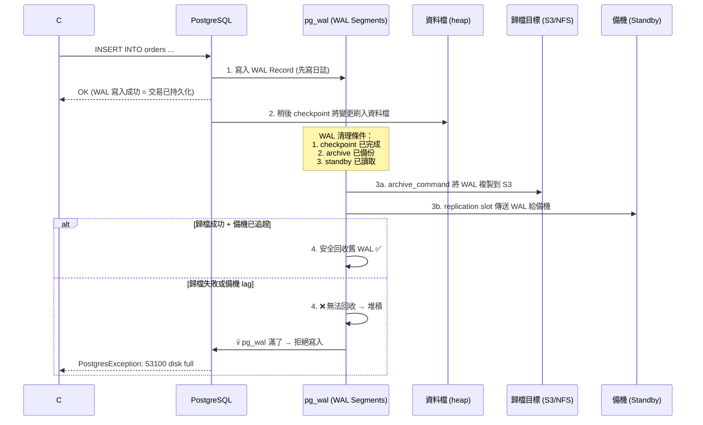
```mermaid
sequenceDiagram
    participant App as C# 應用
    participant PG as PostgreSQL
    participant WAL as pg_wal (WAL Segments)
    participant Data as 資料檔 (heap)
    participant Archive as 歸檔目標 (S3/NFS)
    participant Standby as 備機 (Standby)

    App->>PG: INSERT INTO orders ...
    PG->>WAL: 1. 寫入 WAL Record (先寫日誌)
    PG-->>App: OK (WAL 寫入成功 = 交易已持久化)
    PG->>Data: 2. 稍後 checkpoint 將變更刷入資料檔

    Note over WAL: WAL 清理條件：<br>1. checkpoint 已完成<br>2. archive 已備份<br>3. standby 已讀取

    WAL->>Archive: 3a. archive_command 將 WAL 複製到 S3
    WAL->>Standby: 3b. replication slot 傳送 WAL 給備機

    alt 歸檔成功 + 備機已追趕
        WAL->>WAL: 4. 安全回收舊 WAL ✅
    else 歸檔失敗或備機 lag
        WAL->>WAL: 4. ❌ 無法回收 → 堆積
        WAL->>PG: 💀 pg_wal 滿了 → 拒絕寫入
        PG-->>App: PostgresException: 53100 disk full
    end
```

**App Dev 應該知道的防禦措施**：

```csharp
// 1. 監控 WAL 使用率（週期性健康檢查）
public async Task<long> CheckWalUsage()
{
    await using var conn = await dataSource.OpenConnectionAsync();
    var walDirSize = await conn.ExecuteScalarAsync<long>(
        @"SELECT COALESCE(SUM(size), 0)
          FROM pg_ls_waldir()");  -- PG 10+ 內建函數
    _logger.LogInformation("pg_wal size: {Size}MB", walDirSize / 1024 / 1024);

    // 超過 80% 磁碟 → 告警
    if (walDirSize > _diskCapacity * 0.8)
        _logger.LogError("WAL usage critical!");
    return walDirSize;
}

// 2. 監控 replication slot 延遲
public async Task<List<SlotLag>> CheckReplicationLag()
{
    await using var conn = await dataSource.OpenConnectionAsync();
    return (await conn.QueryAsync<SlotLag>(
        @"SELECT slot_name,
                 pg_wal_lsn_diff(pg_current_wal_lsn(), restart_lsn) AS lag_bytes
          FROM pg_replication_slots
          WHERE active = true
            AND pg_wal_lsn_diff(pg_current_wal_lsn(), restart_lsn) > 100 * 1024 * 1024"
    )).AsList();  // lag > 100MB → 告警
}

// 3. Dapper 批量寫入 — 不要逐行 UPDATE
// ❌ 壞：1000 次 roundtrip + 1000 筆 WAL
foreach (var item in items)
    await conn.ExecuteAsync("UPDATE t SET status = @S WHERE id = @Id", item);

// ✅ 好：1 次 roundtrip + 1 筆 WAL
await conn.ExecuteAsync(
    "UPDATE t SET status = @S WHERE id = ANY(@Ids)",
    new { S = "done", Ids = items.Select(i => i.Id).ToArray() });
```

> 補充（Senior Dev）：WAL 堆積的最大肇事者不是單一寫入量，而是**無人監控的歸檔失敗**。`archive_mode=on` 搭配 `archive_command` 是一個 fire-and-forget 機制——歸檔失敗時 PG 不會主動報錯給應用端，只會默默堆積 WAL。你必須在應用層（或監控系統）定期檢查 `pg_ls_waldir()` 和 `pg_stat_archiver`，否則會在凌晨 3 點被磁碟爆滿的告警叫醒。

### II. 強制規範

| # | 規則 | SQL |
|---|------|-----|
| 1 | 數據訂正：先 `SELECT` 確認，再 `DELETE`/`UPDATE` | — |
| 2 | DDL 及重鎖操作（`VACUUM FULL`、`CREATE INDEX`...）必須設 `lock_timeout` | 見下方 |
| 3 | 涉及數據變更的 `EXPLAIN ANALYZE` 必須在 transaction 中執行後 rollback | 見下方 |
| 4 | `CREATE INDEX CONCURRENTLY` 避免阻塞 DML | 見下方 |
| 5 | 複雜密碼：小寫字母 + 數字 + 底線；字母開頭，字母/數字結尾 | — |
| 6 | 業務/開發/測試帳號不得用 superuser | — |
| 7 | `archive_mode=on` 必須設 `archive_command`，監控 `pg_wal` 空間防止歸檔失敗堆積 | — |
| 8 | Standby + replication slot：必須監控備機延遲和 slot 狀態，防止 WAL 堆積 | — |

```sql
-- #2 lock_timeout
BEGIN;
SET LOCAL lock_timeout = '10s';
-- DDL query;
END;

-- #3 EXPLAIN in transaction
BEGIN;
EXPLAIN ANALYZE query;
ROLLBACK;

-- #4 CONCURRENTLY
CREATE INDEX CONCURRENTLY idx ON tbl(id);

-- #13 maintenance_work_mem
BEGIN;
SET LOCAL maintenance_work_mem = '2GB';
CREATE INDEX idx ON tbl(id);
END;
```

### III. App Dev 實戰：Transaction 管理 — 最易出錯的程式碼

```csharp
// ❌ 錯誤：遺忘 using → 導致 idle in transaction → lock 堆積
public async Task BadOrder(int id)
{
    var conn = new NpgsqlConnection(connString);
    await conn.OpenAsync();
    var tx = conn.BeginTransaction();  // ← 沒有 using！拋異常時 tx 永遠不釋放
    await conn.ExecuteAsync("UPDATE orders SET status = 'done' WHERE id = @Id", new { Id = id }, tx);
    await tx.CommitAsync();
}

// ✅ 正確：using 保證 Dispose = Rollback
public async Task GoodOrder(int id)
{
    using var conn = new NpgsqlConnection(connString);
    await conn.OpenAsync();
    using var tx = await conn.BeginTransactionAsync();
    try
    {
        await conn.ExecuteAsync("UPDATE orders SET status = 'done' WHERE id = @Id", new { Id = id }, tx);
        await conn.ExecuteAsync("INSERT INTO order_logs VALUES (@Id, 'done')", new { Id = id }, tx);
        await tx.CommitAsync();
    }
    catch (PostgresException ex) when (ex.SqlState == PostgresErrorCodes.SerializationFailure)
    {
        await tx.RollbackAsync();
        throw; // 交給上層 retry
    }
    catch { await tx.RollbackAsync(); throw; }
}

// ✅ lock_timeout 的 Npgsql 寫法：DDL / Migration 時必設
using var tx = await conn.BeginTransactionAsync();
await conn.ExecuteAsync("SET LOCAL lock_timeout = '10s'");
await conn.ExecuteAsync("ALTER TABLE orders ADD COLUMN tags TEXT[]");
await tx.CommitAsync();

// ✅ EXPLAIN 安全執行（ROLLBACK 撤銷所有變更）
public async Task<string> Explain(NpgsqlConnection conn, string sql, object param)
{
    using var tx = await conn.BeginTransactionAsync();
    try
    {
        var plan = await conn.QuerySingleAsync<string>(
            "EXPLAIN (ANALYZE, BUFFERS, FORMAT JSON) " + sql, param, tx);
        await tx.RollbackAsync();
        return plan;
    }
    catch { await tx.RollbackAsync(); throw; }
}
```

> 補充：WAL 堆積對 App Dev 的影響 — archive_mode=on 或 replication slot 故障時，pg_wal 塞滿後 DB 拒絕所有寫入（`53100: disk full`）。C# 端會收到 `PostgresException`，此時應立即停止寫入、觸發告警，而非 retry 加重壓力。

### IV. 推薦規範

| # | 規則 |
|---|------|
| 9 | 多業務共用 PG cluster → 每業務一個 DB；若需跨業務 data 互動，在 application 層處理 |
| 10 | 每業務分配獨立 DB account，禁止共用 |
| 11 | Failover 後，新 primary 開放前用 `pg_prewarm` 預熱 shared buffer |
| 12 | 快速數據載入：關閉 autovacuum → 刪除 index → 載入 → analyze + 重建 index |
| 13 | 加速建 index：加大 `maintenance_work_mem`（考慮可用記憶體） |
| 14 | 防止長連接佔用過多 relcache/syscache：定期重連（如每小時）。RDS PG 提供 in-session cache release API |
| 15 | 大批量入庫用 `COPY` 或 `INSERT INTO ... VALUES (),(),...()` |
| 16 | 大批量 insert/update/delete 後，若 autovacuum 關閉，手動 `VACUUM VERBOSE ANALYZE` |
| 17 | 大批量 delete/update 分多個 transaction；操作完檢查 bloat rate，必要時用 `pg_repack` |

### V. 推薦規範詳解：ETL 大批量載入最佳實踐

**#12 快速數據載入**的本質：INSERT 的過半成本不是寫資料本身，而是維護索引和 autovacuum 的干擾。ETL 標準 SOP 是四步拆解法：


```mermaid
flowchart LR
    A["原始表<br>有 5 個 index"] -->|"Step 1"| B["關閉 autovacuum<br>ALTER TABLE SET (autovacuum_enabled = off)"]
    B -->|"Step 2"| C["刪除所有 index<br>（保留 PK / UK 保證唯一性）"]
    C -->|"Step 3"| D["COPY / INSERT 大量數據<br>只寫 heap page，無 index 開銷"]
    D -->|"Step 4"| E["ANALYZE + 重建 index<br>一次性並行建完"]
    E --> F["✅ 生產表就緒"]
```

時間對比（3000 萬行實測）：

| 步驟 | 有 index | 無 index |
|------|---------|---------|
| 資料載入 | 45 分鐘（每行更新 5 個 index） | 8 分鐘（只寫 heap） |
| 重建 index | — | 5 分鐘（可用 `maintenance_work_mem` 加速） |
| **總共** | **45 分鐘** | **13 分鐘** |

```sql
-- Step 1 & 2：準備
-- ⚠️ 這是 per-table 設定，只關 orders 的 autovacuum，其他表不受影響
--    不同於 postgresql.conf 的 autovacuum = off（全域）
ALTER TABLE orders SET (autovacuum_enabled = off);
DROP INDEX IF EXISTS idx_orders_user_id;
DROP INDEX IF EXISTS idx_orders_created_at;
-- 保留 PK：ALTER TABLE orders DROP CONSTRAINT orders_pkey;

-- Step 3：載入（用 COPY 或批次 INSERT）
COPY orders FROM '/data/orders.csv' CSV HEADER;

-- Step 4：重建 + 恢復
ANALYZE orders;
CREATE INDEX idx_orders_user_id ON orders (user_id);
CREATE INDEX idx_orders_created_at ON orders (created_at);
ALTER TABLE orders SET (autovacuum_enabled = on);
```

> 補充（Senior Dev）：PG 12+ 的 `REINDEX CONCURRENTLY` 可在不鎖表情況下重建 index。對超大表建議用 `pg_repack` 在線重組，避免 `VACUUM FULL` 的獨佔鎖。

**#15 大批量入庫**兩種方式的 C# 實作：

```csharp
// 方式 1：COPY — 最快（直接寫入 binary stream，跳過 SQL parsing）
using var writer = await conn.BeginTextImportAsync(
    "COPY orders (user_id, amount, created_at) FROM STDIN (FORMAT CSV)");
foreach (var order in orders)
    await writer.WriteAsync($"{order.UserId},{order.Amount},{order.CreatedAt:O}\n");
await writer.CompleteAsync(); // 千萬行級別也能在秒級完成

// 方式 2：多行 VALUES — .NET 8 + Dapper 最方便的批次寫入
// 一次 INSERT 塞 N 行，Npgsql 自動展開參數
var sql = "INSERT INTO orders (user_id, amount) VALUES ";
var values = orders.Select((o, i) => $"(@Uid{i}, @Amt{i})");
sql += string.Join(", ", values);

var parameters = new DynamicParameters();
for (int i = 0; i < orders.Count; i++)
{
    parameters.Add($"Uid{i}", orders[i].UserId);
    parameters.Add($"Amt{i}", orders[i].Amount);
}
await conn.ExecuteAsync(sql, parameters);

// 方式 3：Npgsql 內建 Binary COPY（最快，無需 CSV 序列化）
using var writer = await conn.BeginBinaryImportAsync(
    "COPY orders (user_id, amount) FROM STDIN (FORMAT BINARY)");
foreach (var order in orders)
{
    await writer.StartRowAsync();
    await writer.WriteAsync(order.UserId, NpgsqlTypes.NpgsqlDbType.Integer);
    await writer.WriteAsync(order.Amount, NpgsqlTypes.NpgsqlDbType.Numeric);
}
await writer.CompleteAsync();

// ⚠️ 注意：批次不宜過大（建議 1000-5000 筆一批），過大可能觸發 OOM 或 lock 過久
// ⚠️ copy 完記得 ANALYZE（PG 不會對 COPY 的數據做 auto-analyze）
await conn.ExecuteAsync("ANALYZE orders");
```

**#17 大批量 DELETE/UPDATE 分多個 transaction**：要理解為什麼必須分批，首先要懂 MVCC 下的「刪除」不是真的從硬碟抹掉——只是標記 dead tuple，等 VACUUM 來回收。長 transaction 會阻止這整個循環。

**❌ 一次刪 1000 萬行時，DB 內部發生了什麼**：

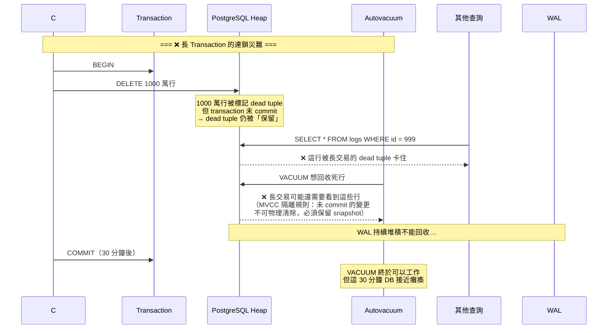
```mermaid
sequenceDiagram
    participant App as C# 應用
    participant TX as Transaction
    participant PG as PostgreSQL Heap
    participant VAC as Autovacuum
    participant Other as 其他查詢

    Note over App,VAC: === ❌ 長 Transaction 的連鎖災難 ===
    App->>TX: BEGIN
    App->>PG: DELETE 1000 萬行
    Note over PG: 1000 萬行被標記 dead tuple<br>但 transaction 未 commit<br>→ dead tuple 仍被「保留」
    Other->>PG: SELECT * FROM logs WHERE id = 999
    PG-->>Other: ❌ 這行被長交易的 dead tuple 卡住
    VAC->>PG: VACUUM 想回收死行
    PG-->>VAC: ❌ 長交易可能還需要看到這些行<br>（MVCC 隔離規則：未 commit 的變更<br>不可物理清除，必須保留 snapshot）
    Note over PG,WAL: WAL 持續堆積不能回收…
    App->>TX: COMMIT（30 分鐘後）
    Note over VAC: VACUUM 終於可以工作<br>但這 30 分鐘 DB 接近癱瘓
```

**✅ 分批刪除時，每批 commit 釋放 dead tuple**：

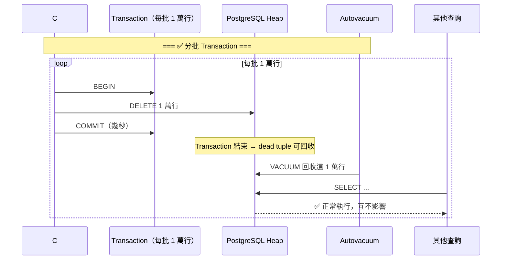
```mermaid
sequenceDiagram
    participant App as C# 應用
    participant TX as Transaction（每批 1 萬行）
    participant PG as PostgreSQL Heap
    participant VAC as Autovacuum
    participant Other as 其他查詢

    Note over App,VAC: === ✅ 分批 Transaction ===
    loop 每批 1 萬行
        App->>TX: BEGIN
        App->>PG: DELETE 1 萬行
        App->>TX: COMMIT（幾秒）
        Note over PG: Transaction 結束 → dead tuple 可回收
        VAC->>PG: VACUUM 回收這 1 萬行
        Other->>PG: SELECT ...
        PG-->>Other: ✅ 正常執行，互不影響
    end
```

核心差異：**長 transaction 把 dead tuple 當作「可能還會用到」而保留；分批 commit 後 dead tuple 馬上變成「確定可回收」**。

全部刪完後，再檢查 bloat 決定是否需要 pg_repack：

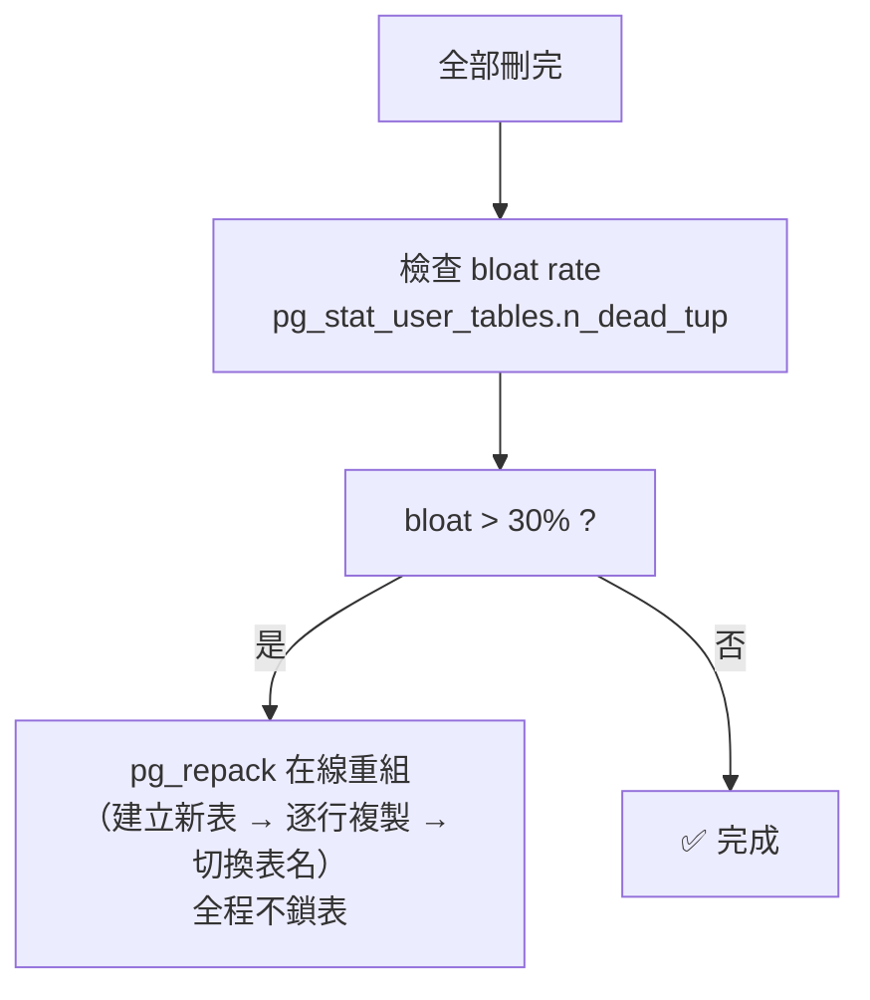
```mermaid
flowchart TD
    A["全部刪完"] --> B["檢查 bloat rate<br>pg_stat_user_tables.n_dead_tup"]
    B --> C["bloat > 30% ?"]
    C -->|是| D["pg_repack 在線重組<br>（建立新表 → 逐行複製 → 切換表名）<br>全程不鎖表"]
    C -->|否| E["✅ 完成"]
```

```sql
-- ✅ 正確做法：分批刪除，每批一個 transaction
DO $$
DECLARE
    deleted INT;
BEGIN
    LOOP
        DELETE FROM logs
        WHERE ctid IN (
            SELECT ctid FROM logs
            WHERE created_at < '2025-01-01'
            LIMIT 10000
        );
        GET DIAGNOSTICS deleted = ROW_COUNT;
        COMMIT;          -- 每批 commit，釋放 lock + 讓 VACUUM 可以工作
        RAISE NOTICE 'Deleted % rows', deleted;
        EXIT WHEN deleted = 0;
    END LOOP;
END $$;
```

```csharp
// ✅ C# 批次刪除 + bloat 檢查的完整實作
public async Task BatchDeleteOldLogs(DateTime before, int batchSize = 10000)
{
    int deleted;
    do
    {
        using var conn = await dataSource.OpenConnectionAsync();
        using var tx = await conn.BeginTransactionAsync();
        try
        {
            deleted = await conn.ExecuteAsync(
                @"DELETE FROM logs
                  WHERE ctid IN (
                      SELECT ctid FROM logs
                      WHERE created_at < @Before
                      LIMIT @BatchSize
                  )",
                new { Before = before, BatchSize = batchSize }, tx);
            await tx.CommitAsync();
        }
        catch { await tx.RollbackAsync(); throw; }
    } while (deleted > 0);

    // 全刪完後檢查 bloat rate
    await CheckBloat("logs");
}

// Bloat rate 檢查（生產環境可用 pgstattuple extension 或以下估算）
public async Task CheckBloat(string tableName)
{
    await using var conn = await dataSource.OpenConnectionAsync();
    var bloat = await conn.QuerySingleAsync(
        @"SELECT schemaname || '.' || relname AS tbl,
                 pg_size_pretty(pg_relation_size(relid)) AS size,
                 n_dead_tup AS dead_tuples,
                 CASE WHEN n_live_tup > 0
                      THEN round(100.0 * n_dead_tup / (n_live_tup + n_dead_tup), 2)
                      ELSE 0 END AS dead_ratio
          FROM pg_stat_user_tables
          WHERE relname = @Table",
        new { Table = tableName });

    if (bloat.dead_ratio > 30)
        _logger.LogWarning("Bloat detected: {Table} is {Pct}% dead tuples. Consider pg_repack.",
            bloat.tbl, bloat.dead_ratio);
}
```

> 補充（Senior Dev）：`pg_repack` 是社群工具，工作原理是建立一張新表 → 逐行複製 → 重建 index → 切換表名，全程不鎖表。這是取代 `VACUUM FULL`（會鎖死整張表）的標準解法。但 pg_repack 不是 PG 內建，需要手動安裝 extension。

---

## 5. 穩定性與效能規範


這是最長也最重要的章節。穩定性與效能規範涵蓋了從 SQL 寫法到連線管理、從索引選擇到交易控制的方方面面。以下用白話解釋幾個核心概念：

**什麼是 prepared statement？** 每次執行 SQL 時，PostgreSQL 需要經過「解析 → 重寫 → 規劃 → 執行」四個步驟。前三步合稱「硬解析」，在高併發場景下會耗大量 CPU。prepared statement（也稱 bind variable）讓 PostgreSQL 預先解析好查詢結構，之後只傳入參數值，跳過重複的解析步驟。例如 `SELECT * FROM users WHERE id = $1` 中的 `$1` 是佔位符，每次只需傳入具體的 id 值。

**為什麼秒殺場景要用 advisory lock？** 秒殺時成千上萬人同時搶同一個商品，如果用 `SELECT ... FOR UPDATE` 排隊，所有人都要等前面的人處理完。而 `pg_try_advisory_xact_lock(id)` 是「嘗試獲取輕量級鎖」——拿到鎖的人才可以執行扣庫存，拿不到的人直接返回失敗（不用排隊），成倍減少資料庫內的等待。

**什麼是 connection pool？** PostgreSQL 對每個客戶端連線會創建一個獨立後端行程，每個行程消耗約 5-10MB 記憶體。如果有 5000 個用戶同時連接，記憶體開銷是 25-50GB。connection pool（如 pgbouncer）在應用與資料庫之間建立一個連接池，讓 5000 個用戶共享 50 個資料庫連接，大幅節省資源。

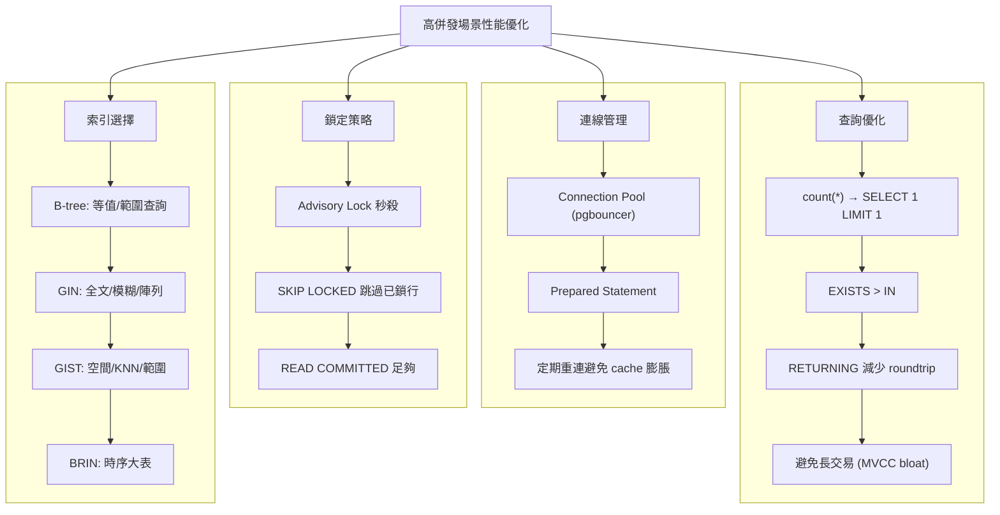
```mermaid
flowchart TD
    A["高併發場景性能優化"]

    A --> B["連線管理"]
    A --> C["查詢優化"]
    A --> D["鎖定策略"]
    A --> E["索引選擇"]

    subgraph B_GRP[" "]
        direction TB
        B1["Connection Pool (pgbouncer)"]
        B2["Prepared Statement"]
        B3["定期重連避免 cache 膨脹"]
        B --> B1 --> B2 --> B3
    end

    subgraph C_GRP[" "]
        direction TB
        C1["count(*) → SELECT 1 LIMIT 1"]
        C2["EXISTS > IN"]
        C3["RETURNING 減少 roundtrip"]
        C4["避免長交易 (MVCC bloat)"]
        C --> C1 --> C2 --> C3 --> C4
    end

    subgraph D_GRP[" "]
        direction TB
        D1["Advisory Lock 秒殺"]
        D2["SKIP LOCKED 跳過已鎖行"]
        D3["READ COMMITTED 足夠"]
        D --> D1 --> D2 --> D3
    end

    subgraph E_GRP[" "]
        direction TB
        E1["B-tree: 等值/範圍查詢"]
        E2["GIN: 全文/模糊/陣列"]
        E3["GIST: 空間/KNN/範圍"]
        E4["BRIN: 時序大表"]
        E --> E1 --> E2 --> E3 --> E4
    end
```

### I. Prepared Statement：三個 PG 核心使用場景

PostgreSQL 收到一條 SQL 後需經過四步：**解析（Parse）→ 重寫（Rewrite）→ 規劃（Plan）→ 執行（Execute）**。前三步合稱「硬解析」，每條 SQL 都要走一遍的話，高併發場景下 CPU 會被 parse 吃滿。

Prepared Statement 把 SQL 骨架先 parse + plan 好（一次性的開銷），後續只傳參數值就直接跳到 Execute。`$1` 是佔位符，每次只換值、不換 SQL 結構。

三個典型的 PG 使用場景：

**場景 1：OLTP 高頻點查（Web API 後端）**

```sql
-- 每次 Request 只換 id，SQL 骨架不變
-- ❌ 沒用 prepared：1000 QPS = 每秒硬解析 1000 次
-- ✅ 用 prepared：硬解析 1 次，其餘 999 次只做 Execute
PREPARE get_user (int) AS SELECT * FROM users WHERE id = $1;
EXECUTE get_user(1);
EXECUTE get_user(2);
```

```csharp
// Dapper 預設自動做 prepared statement
// Npgsql 內部會 cache prepared statement，同一條 SQL 只 prepare 一次
var user = await conn.QuerySingleAsync<User>(
    "SELECT * FROM users WHERE id = @Id",
    new { Id = request.UserId });
```

**場景 2：大量 INSERT 批次寫入**

```sql
-- 10,000 筆 log，每筆只換值
PREPARE insert_log (int, text, timestamptz) AS
    INSERT INTO event_logs (user_id, action, created_at) VALUES ($1, $2, $3);
EXECUTE insert_log(1, 'login', now());
EXECUTE insert_log(2, 'logout', now());
```

```csharp
// COPY 比 INSERT 快 10-50x，適合萬筆以上的批次
await using var writer = await conn.BeginBinaryImportAsync(
    "COPY event_logs (user_id, action, created_at) FROM STDIN (FORMAT BINARY)");
foreach (var log in logs)
    await writer.WriteRowAsync(log.UserId, log.Action, log.CreatedAt);
await writer.CompleteAsync();
```

**場景 3：PL/pgSQL Function 內建的自動 Prepare**

Function 內的 SQL 會被 PG **自動**當成 prepared statement。第一次 call 時 parse + plan，同一個 session 內後續呼叫直接 execute。

```sql
CREATE OR REPLACE FUNCTION get_order_total(order_id int) RETURNS numeric AS $$
    SELECT SUM(amount) FROM order_items WHERE order_id = $1;
$$ LANGUAGE sql;
-- 第一次：parse + plan + execute；後續呼叫：只 execute（plan 已 cache）
```

> plan cache 是 **per-session** 的。這就是為什麼 `MinPoolSize` 重要——保持熱連線就能保持 plan cache，新連線的第一次呼叫仍需 prepare。

### II. 為什麼 Client 端做 Cache？對 DB Server 的影響

**先釐清一個關鍵點：Dapper 根本不做 Parse。**

整條鏈路是：

```
Dapper（物件映射，把 C# 參數塞進 SQL、把回傳 rows 變成物件）
  → Npgsql（.NET driver，負責講 PostgreSQL wire protocol）
    → PostgreSQL server（真正做 Parse / Plan / Execute）
```

Dapper 只是一個 micro-ORM。決定「要不要 prepare、走哪種 protocol」的是 Npgsql；真正做 Parse 的是 server。

**SQL 是文字，執行引擎不能直接跑文字。**

你送過去的 `SELECT * FROM users WHERE id = 1` 對 server 而言只是一串 bytes。執行引擎能跑的不是文字，而是一棵**執行計畫樹（plan tree）**——「先掃哪個 index、用 hash join 還是 nested loop」這種一步步的操作節點。

從文字到可執行的東西，中間必經三步：

```
Parse   → 語法檢查、語意檢查（這張表存在嗎？欄位型別對嗎？）
Rewrite → 展開 view、套用 rule
Plan    → 根據統計資訊算成本，挑出最佳執行計畫
```

「直接 execute」這個動作在物理上不存在——在 parse + plan 之前，根本沒有「東西」可以被 execute。

**兩種 Protocol：Simple Query vs Extended Query**

PostgreSQL 的 wire protocol 有兩條路：

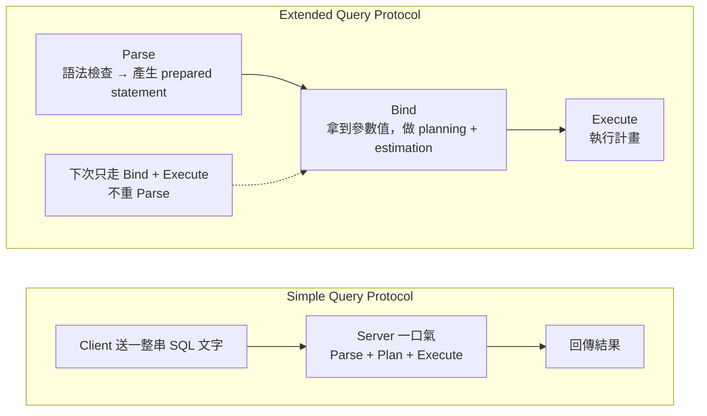
```mermaid
flowchart LR
    subgraph SQ["Simple Query Protocol"]
        direction LR
        A["Client 送一整串 SQL 文字"] --> B["Server 一口氣<br/>Parse + Plan + Execute"] --> C["回傳結果"]
    end

    subgraph EQ["Extended Query Protocol"]
        direction LR
        P["Parse<br/>語法檢查 → 產生 prepared statement"]
        B2["Bind<br/>拿到參數值，做 planning + estimation"]
        E["Execute<br/>執行計畫"]
        P --> B2 --> E
        B2a["下次只走 Bind + Execute<br/>不重 Parse"] -.-> B2
    end
```

| Protocol | 行為 | roundtrip | cache plan？ |
|----------|------|-----------|-------------|
| Simple Query | client 丟整串文字，server 內部 parse+plan+execute 一次做完 | 1 | 不 cache |
| Extended Query | Parse / Bind / Execute 拆成三個獨立 message | 2（第一次）/ 1（後續） | 可 cache，可重用 |

Dapper 預設情況下，Npgsql 走的是 **Extended Protocol**。但除非你開啟 `Max Auto Prepare` 或手動呼叫 `Prepare()`，Npgsql 不會把 prepared statement 留著重用——所以每次呼叫，server 端其實還是重新 parse 一遍。只是拆成了三個 message 而已。

**那 Npgsql 做 client-side cache 的價值是什麼？**

當 `Max Auto Prepare > 0` 時，Npgsql 在客戶端記住「這條 SQL 在這個 physical connection 上已經 prepare 過了」。當 connection 從 pool 被重複使用時，Npgsql 知道不需再發一次 Parse message——直接 Bind + Execute。

```csharp
var builder = new NpgsqlConnectionStringBuilder
{
    MaxAutoPrepare = 20,       // 每個 physical connection 最多自動 prepare 20 條 SQL
    AutoPrepareMinUsages = 5   // 同一條 SQL 被呼叫 5 次後才自動 prepare
};
```

Npgsql 不會把每條 SQL 都 prepare——因為 prepare 本身也有開銷（server 端要分配 plan cache 記憶體）。只有被多次重複執行的 SQL 才值得。`AutoPrepareMinUsages = 5` 正好跟 PG 內部的 custom → generic plan 切換邏輯對齊。

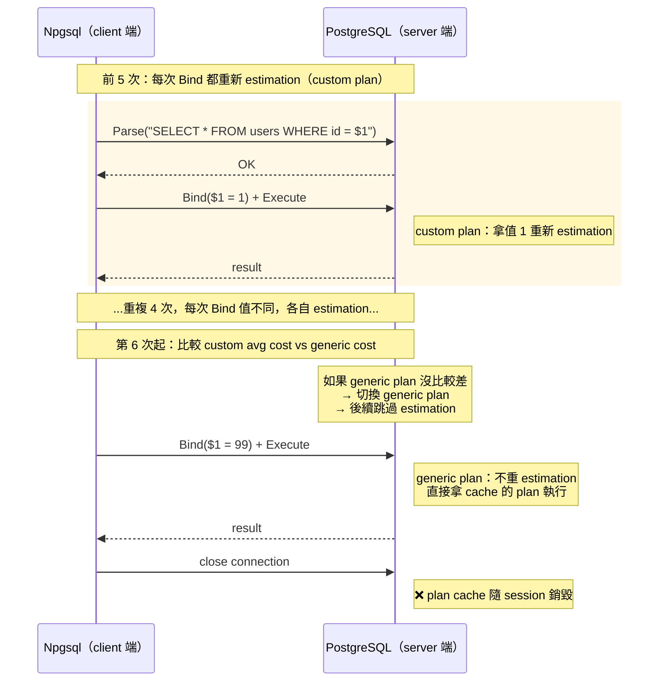
```mermaid
sequenceDiagram
    participant Np as Npgsql（client 端）
    participant PG as PostgreSQL（server 端）

    Note over Np,PG: 前 5 次：每次 Bind 都重新 estimation（custom plan）

    rect rgb(255, 248, 230)
        Np->>PG: Parse("SELECT * FROM users WHERE id = $1")
        PG-->>Np: OK
        Np->>PG: Bind($1 = 1) + Execute
        Note right of PG: custom plan：拿值 1 重新 estimation
        PG-->>Np: result
    end

    Note over Np,PG: ...重複 4 次，每次 Bind 值不同，各自 estimation...

    Note over Np,PG: 第 6 次起：比較 custom avg cost vs generic cost
    Note over PG: 如果 generic plan 沒比較差<br/>→ 切換 generic plan<br/>→ 後續跳過 estimation

    Np->>PG: Bind($1 = 99) + Execute
    Note right of PG: generic plan：不重 estimation<br/>直接拿 cache 的 plan 執行
    PG-->>Np: result

    Np->>PG: close connection
    Note right of PG: ❌ plan cache 隨 session 銷毀
```

PG 不是「第一次 Bind+Execute 就 cache 住計畫」，而是先跑 5 次 custom plan（每次帶實際參數值重新規劃），第 6 次起比較 custom plan 的平均成本 vs generic plan 的成本。如果 generic 沒比較差，才切換成 generic plan，之後就跳過規劃步驟。這是為了避免太早鎖死一個爛計畫——跟 SQL Server 的 parameter sniffing 問題形成鮮明對比。

| 層面 | 沒 Cache（每次重 Parse） | 有 Cache（重用 prepared plan） |
|------|--------------------------|-------------------------------|
| **應用延遲** | 每條 SQL 多一次 Parse message roundtrip | 省掉 Parse，只發 Bind+Execute |
| **DB Server CPU** | Parse + Plan 佔 CPU，高 QPS 下放大 | 前 5 次 custom plan 後續不重 estimation，CPU 下降 |
| **DB Server 記憶體** | 無常駐開銷 | 每條 prepared SQL 佔用 session private memory |

**總結一句話**：Npgsql 的 client-side cache 解決的是「connection pool 重用連線時，不必每次重建 prepared statement」的問題。對 DB server 的好處是**少做 Parse + estimation → CPU 下降**，而不是讓 SQL 本身跑更快。

### III. 深入實例：Named Statement `_p1` 的誕生到複用

先糾正一個關鍵誤解：**plan 從來不在 client 手上**。執行計畫是 server 端記憶體裡的東西，Npgsql / Dapper 看不到也拿不到。Client 能送的永遠只有 SQL 文字、一個 prepared statement 的「名字」（handle）、以及參數值。

名字就像寄物櫃號碼牌——東西（parse 好的 statement / plan）一直放在 server 的櫃子裡，client 只是出示號碼牌說「拿那個出來，參數是這些」。

**兩個「5」是巧合，分屬不同層、互不相干：**

| | `AutoPrepareMinUsages = 5` | generic plan 門檻 = 5 |
|---|---|---|
| 在哪 | **client 端**（Npgsql） | **server 端**（PostgreSQL） |
| 管什麼 | 同一段 SQL 文字用滿 5 次，Npgsql 才自動發 `Parse` 建立 named prepared statement | 一個 prepared statement 被 execute 滿 5 次後，server 才考慮從 custom plan 切到 generic plan |
| 計數對象 | SQL 文字出現次數 | prepared statement 的執行次數 |

兩個 5 純屬巧合，沒有任何因果關係。你可以把 `AutoPrepareMinUsages` 改成 3，server 那邊的 5 完全不受影響。

**完整時間線：跑 7 次同一條 SQL**

```csharp
// Max Auto Prepare = 20, Auto Prepare Min Usages = 5
for (int i = 1; i <= 7; i++)
{
    var user = conn.QuerySingle<User>(
        "SELECT id, name FROM users WHERE id = @id",
        new { id = i });
}
```

**第 1～4 次：還沒到門檻，走 unnamed statement**

Npgsql 每次都送完整 SQL，statement 名字是空字串（`""` = unnamed statement）。特性是下一個 `Parse` 一來就被覆蓋，留不住、無法重用。server 每次都得重新 parse。

```
Parse   (name="",  query="SELECT id, name FROM users WHERE id = $1")
Bind    (stmt="",  params=[1])
Execute
```

Npgsql 內部同時在數：這段 SQL 文字出現了幾次。

**第 5 次：達門檻，Npgsql 替它正式命名**

計數到 5，Npgsql 決定把它升級成 named prepared statement。先發一個帶名字的 `Parse`：

```
Parse   (name="_p1",  query="SELECT id, name FROM users WHERE id = $1")
```

**這一刻 `_p1` 才在 server 端誕生**——server parse 完，把這個 prepared statement 存進該 connection 的 session 記憶體。然後照常 Bind + Execute：

```
Bind    (stmt="_p1", params=[5])
Execute
```

同時 Npgsql 在 client 端記下對應關係：「這段 SQL 文字 → 已 prepare，名字 `_p1`」。

**第 6、7 次：複用，不再送 SQL 文字**

Npgsql 查自己的字典，發現這段 SQL 已經對應到 `_p1`，**完全不送 `Parse`、也不送 SQL 字串**：

```
Bind    (stmt="_p1", params=[6])
Execute
```

```
Bind    (stmt="_p1", params=[7])
Execute
```

Server 收到 Bind 時，靠 `_p1` 這個名字去 session 記憶體撈出早就 parse 好的 statement，**跳過 Parse**。

**接著輪到 server 端的 custom → generic：** 這個 prepared statement 的第 1～5 次 execute 還是會帶實際參數重新規劃（custom plan），第 6 次 execute 起 server 才可能切換到 generic plan，連 Plan 也跳過。注意這裡的「第 6 次 execute」是 statement 的執行次數，不是 SQL 文字的出現次數——它可能剛好對應 Npgsql 端的第 6 次，也可能更晚（取決於前面幾次的 `Bind` 實際值）。

**所以整條時間線實際上是兩個獨立優化先後疊加：**

```
Npgsql 端：第 1~4 次送 SQL → 第 5 次發 Parse 建立 _p1 → 第 6 次起只送名字 + 參數（跳過 Parse）
Server 端：_p1 前 5 次 execute 用 custom plan → 第 6 次起比較成本 → 可能切換 generic plan（跳過 Plan）
```

「跳過 Parse」和「跳過 Plan」是**兩個不同階段、由不同的計數器分別觸發**的優化，全都發生在 server 端。Client 只是負責「不要再重送 SQL 文字」。

因為 `_p1` 綁在**這條 connection 的 session** 上，連線一關（或從 pool 拿到另一條物理連線），prepared statement 就不在了。所以 Npgsql 的 auto-prepare 狀態是**跟著連線池裡每一條物理連線各自維護**的。

### IV. 補充：Parameter Sniffing 與 PG 的對應

**Parameter Sniffing** 是 SQL Server 的術語——第一個參數值「聞」出來的 plan 對後續參數可能很糟糕。PG 對應的概念就是上面的 custom plan vs generic plan 機制。

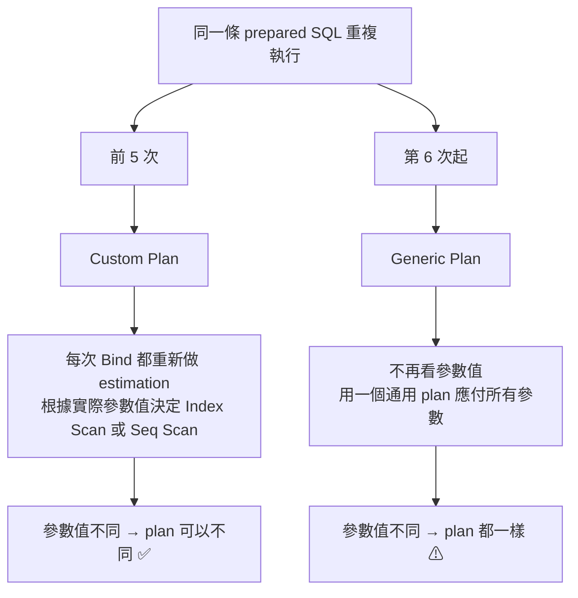
```mermaid
flowchart TD
    A["同一條 prepared SQL 重複執行"] --> B["前 5 次"]
    A --> C["第 6 次起"]

    B --> B1["Custom Plan"]
    B1 --> B2["每次 Bind 都重新做 estimation<br/>根據實際參數值決定 Index Scan 或 Seq Scan"]
    B2 --> B3["參數值不同 → plan 可以不同 ✅"]

    C --> C1["Generic Plan"]
    C1 --> C2["不再看參數值<br/>用一個通用 plan 應付所有參數"]
    C2 --> C3["參數值不同 → plan 都一樣 ⚠"]
```

核心矛盾：同一條 SQL、不同參數值，最優 plan 可能天差地別。

```sql
-- id = 1：1000 萬行中只有 1 行 → Index Scan 最優
SELECT * FROM orders WHERE id = 1;

-- id = 9999999：1000 萬行中 999 萬行匹配 → Seq Scan 最優
SELECT * FROM orders WHERE id = 9999999;
```

| 特性 | SQL Server | PostgreSQL |
|------|-----------|-----------|
| 第一次執行 | 根據參數值產生 plan，**立即 cache** | 根據參數值產生 plan（custom） |
| plan cache | 後續全用同一個 | **第 6 次才**比較成本、決定切換 generic |
| 出問題 | 第一個值極端 → 後續全爛 | 前 5 次各自 estimation，不會有問題 |
| 解法 | `OPTION (RECOMPILE)` | `SET plan_cache_mode = force_custom_plan` |

```sql
-- 強制每次都重新 estimation
SET plan_cache_mode = force_custom_plan;
```

### V. 強制規範

| # | 規則 | SQL |
|---|------|-----|
| 1 | 分頁邏輯：count = 0 時立即 return，不執行後續分頁 | — |
| 2 | Cursor 使用後立即關閉 | — |
| 3 | 2PC transaction 必須及時 commit/rollback，否則導致 DB bloat | — |
| 4 | 不用 `DELETE` 全表 → 用 `TRUNCATE`（DDL，設 `lock_timeout`） | — |
| 5 | Application 必須開啟 autocommit；避免框架 auto-BEGIN 空 transaction | — |
| 6 | 高併發必須用 prepared statement（bind variable），防止硬解析 CPU overhead | — |
| 7 | ~~不用 hash index（不寫 WAL，crash 不可恢復）~~ ⛔ **PG 10+ hash index 已寫 WAL，此限制解除** | — |
| 8 | 秒殺場景：必須用 `pg_try_advisory_xact_lock(id)` 鎖定後再更新；拿不到鎖重試 | 見下方 |
| 9 | 不要用 `count(*)` 判斷是否存在 → 用 `SELECT 1 ... LIMIT 1` | 見下方 |
| 10 | 高併發必須用 connection pool（程式層或 middleware：pgbouncer / pgpool-II） | — |
| 11 | 必須有重連機制；長時間空閒連接前用 `SELECT 1` 探測 | — |
| 12 | KNN 近鄰查詢必須建 GIST / SP-GIST index | 見下方 |
| 13 | 避免頻繁 create/drop temp table（造成 system catalog 碎片） | — |
| 14 | 只用最低需求的 isolation level；READ COMMITTED 足夠時不用 REPEATABLE READ / SERIALIZABLE | — |

```sql
-- #8 Advisory lock for flash sale
CREATE OR REPLACE FUNCTION public.f(i_id integer)
RETURNS void
LANGUAGE plpgsql
AS $function$
DECLARE
    a_lock boolean := false;
BEGIN
    SELECT pg_try_advisory_xact_lock(i_id) INTO a_lock;
    IF a_lock THEN
        UPDATE t1 SET count = count - 1 WHERE id = i_id;
    END IF;
    EXCEPTION WHEN others THEN
        RETURN;
END;
$function$;

SELECT f(id) FROM tbl WHERE id = ? AND count > 0;

-- #9 LIMIT 1 instead of count(*)
SELECT 1 FROM tbl WHERE xxx LIMIT 1;
-- if found → 存在
-- else     → 不存在

-- #12 KNN with GIST
CREATE INDEX idx ON tbl USING gist(col);
SELECT * FROM tbl ORDER BY col <-> '(0,100)';
```

### VI. App Dev 實戰：Connection Pool + Retry + 鎖定

**Connection Pool 設定**：Npgsql 內建 Pool，不需外部依賴。

```csharp
// Npgsql 7.0+：DataSource 是最好的 Pool 管理方式
var dataSource = new NpgsqlDataSourceBuilder(connString).Build();
// 整個 application lifetime 只建一次
builder.Services.AddSingleton(dataSource);

// 關鍵參數：
// MaxPoolSize = 50       — 公式：max_connections / 實例數 * 0.8
// MinPoolSize = 5        — 最少熱連線（避免 cold start）
// ConnectionIdleLifetime = 300 — 空閒 5 分鐘回收
// Timeout = 10           — 等待從 pool 拿連線的秒數
```

**Retry Pattern（Polly）**：

資料庫連線和查詢**不可能保證 100% 成功**——DBA 重啟、主備切換、網路瞬斷、連線池滿、死鎖被當祭品，這些事情一定會發生。關鍵不是避免它們，而是你的程式能不能自動恢復。

Retry 只能用在 **transient failure**（暫時性錯誤）上。永久性錯誤（如 constraint violation、syntax error）retry 一百次也會失敗，直接報錯就好。

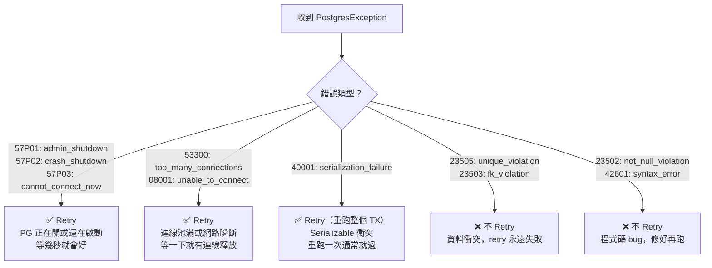
```mermaid
flowchart TD
    A["收到 PostgresException"] --> B{"錯誤類型？"}
    B -->|"57P01: admin_shutdown<br/>57P02: crash_shutdown<br/>57P03: cannot_connect_now"| C["✅ Retry<br/>PG 正在關或還在啟動<br/>等幾秒就會好"]
    B -->|"53300: too_many_connections<br/>08001: unable_to_connect"| D["✅ Retry<br/>連線池滿或網路瞬斷<br/>等一下就有連線釋放"]
    B -->|"40001: serialization_failure"| E["✅ Retry（重跑整個 TX）<br/>Serializable 衝突<br/>重跑一次通常就過"]
    B -->|"23505: unique_violation<br/>23503: fk_violation"| F["❌ 不 Retry<br/>資料衝突，retry 永遠失敗"]
    B -->|"23502: not_null_violation<br/>42601: syntax_error"| G["❌ 不 Retry<br/>程式碼 bug，修好再跑"]
```

**觸發 Retry 的具體場景**：

| Error Code | 場景 | 為什麼 Retry 有用 |
|-----------|------|-----------------|
| `57P01 admin_shutdown` | DBA 執行了 `pg_terminate_backend` 或 shutdown | PG 正在重啟，等幾秒後新連線就能通了 |
| `57P02 crash_shutdown` | PG process crash 後正在 recovery | 等 PG 完成 crash recovery 就好 |
| `57P03 cannot_connect_now` | PG 正在 startup 階段（剛剛被啟動） | startup 通常只需幾秒 |
| `53300 too_many_connections` | 其他 application 瞬間吃滿 max_connections | 等一下就有 connection 釋放；或連其他 host（multi-host） |
| `40001 serialization_failure` | Serializable 隔離級別下，兩個 TX 衝突 | PG 隨機挑一個當祭品，重跑通常就過 |
| `08001 / 08006` | 網路瞬斷、TCP timeout | 可能是負載平衡器或 NAT 短暫斷線 |
| `NpgsqlException.IsTransient` | Npgsql 自行判斷為可重試的錯誤 | Npgsql 內部封裝了常見 transient case |

**絕對不能 Retry 的場景**：

| Error Code | 原因 |
|-----------|------|
| `23505 unique_violation` | 重複插入，retry 100 次還是重複 |
| `23503 fk_violation` | 外鍵不存在，retry 不會讓它突然出現 |
| `23502 not_null_violation` | 漏了 NOT NULL 欄位，修 code 才能解 |
| `42601 syntax_error` | SQL 寫錯了，不是環境問題 |
| `40002 transaction_integrity_constraint_violation` | TX 狀態已損壞 |

**Retry 的核心陷阱：Idempotency（冪等性）**

```csharp
// ❌ 危險：INSERT 不是冪等的，retry 可能產生重複資料
await conn.ExecuteAsync("INSERT INTO orders (user_id, amount) VALUES (@Uid, @Amt)", param);

// ✅ 解法 1：先查是否存在，再決定 INSERT 或 UPDATE（UPSERT）
await conn.ExecuteAsync(
    @"INSERT INTO orders (user_id, amount) VALUES (@Uid, @Amt)
      ON CONFLICT (idempotency_key) DO NOTHING", param);

// ✅ 解法 2：整個 transaction 重跑（包含業務邏輯的判斷）
// retry 應該重跑整個 unit of work，不只是重送 SQL
```

**完整 Retry Policy（含 Jitter，防雪崩）**：

```csharp
using Polly;

public static IAsyncPolicy GetRetryPolicy() => Policy
    .Handle<PostgresException>(ex =>
        ex.SqlState == PostgresErrorCodes.AdminShutdown ||
        ex.SqlState == PostgresErrorCodes.CrashShutdown ||
        ex.SqlState == PostgresErrorCodes.CannotConnectNow ||
        ex.SqlState == PostgresErrorCodes.TooManyConnections ||
        ex.SqlState == PostgresErrorCodes.SerializationFailure)
    .Or<NpgsqlException>(ex => ex.IsTransient)
    .WaitAndRetryAsync(
        retryCount: 3,
        sleepDurationProvider: retryAttempt =>
            // exponential backoff + jitter：防所有 client 同時重試
            TimeSpan.FromMilliseconds(
                Math.Pow(2, retryAttempt) * 100   // 100, 200, 400ms
                + Random.Shared.Next(0, 50)),       // 加 0~50ms 隨機抖動
        onRetry: (ex, ts, count, _) =>
            _logger.LogWarning("Retry {Count}/3 after {Delay}ms: {Error}",
                count, ts.TotalMilliseconds, ex.Message));
```

`Math.Pow(2, retry) * 100` 產生 100ms → 200ms → 400ms 指數退避。`Random` 加隨機抖動避免所有 client 剛好在同一毫秒醒來再打一次（thundering herd）。

**與 Dapper + NpgsqlDataSource 的完整整合**：

```csharp
// ========================================
// Step 1：DI 註冊（Program.cs）
// ========================================
var builder = WebApplication.CreateBuilder(args);

// Npgsql DataSource（整個 app lifetime 只建一個）
builder.Services.AddNpgsqlDataSource(builder.Configuration.GetConnectionString("Default"));

// Polly Retry Policy（全域註冊，所有 Repository 共用）
builder.Services.AddSingleton(GetRetryPolicy());

// ========================================
// Step 2：Repository 層 — 讀取（Retry 包在最外層）
// ========================================
public class OrderRepository
{
    private readonly NpgsqlDataSource _dataSource;
    private readonly IAsyncPolicy _retryPolicy;

    public OrderRepository(NpgsqlDataSource dataSource, [FromKeyedServices("db-retry")] IAsyncPolicy retryPolicy)
    {
        _dataSource = dataSource;
        _retryPolicy = retryPolicy;
    }

    // ✅ 讀取：retry 包在最外層。DataSource 內部管理連線池，
    // 每次 ExecuteAsync 會自動從池中取一條（可能是不同物理連線），
    // 前次失敗的連線會被自動丟棄
    public async Task<Order?> GetById(int id) =>
        await _retryPolicy.ExecuteAsync(async () =>
        {
            await using var conn = await _dataSource.OpenConnectionAsync();
            return await conn.QuerySingleOrDefaultAsync<Order>(
                "SELECT * FROM orders WHERE id = @Id", new { Id = id });
        });

    // ✅ 寫入：同樣 retry 在最外層，每次重試都走完整流程
    public async Task Insert(Order order) =>
        await _retryPolicy.ExecuteAsync(async () =>
        {
            await using var conn = await _dataSource.OpenConnectionAsync();
            await conn.ExecuteAsync(
                "INSERT INTO orders (user_id, amount) VALUES (@Uid, @Amt)",
                new { Uid = order.UserId, Amt = order.Amount });
        });
}

// ========================================
// Step 3：Service 層 — Transaction（Retry 重跑整個 TX）
// ========================================
public class TransferService
{
    private readonly NpgsqlDataSource _dataSource;
    private readonly IAsyncPolicy _retryPolicy;

    // ✅ Transaction 的 retry：重跑整個 TX，不是只重送最後一條 SQL
    public async Task Transfer(int fromId, int toId, decimal amount) =>
        await _retryPolicy.ExecuteAsync(async () =>
        {
            await using var conn = await _dataSource.OpenConnectionAsync();
            using var tx = await conn.BeginTransactionAsync();
            try
            {
                var ids = new[] { fromId, toId }.OrderBy(id => id).ToArray();
                foreach (var id in ids)
                    await conn.ExecuteAsync(
                        "SELECT 1 FROM accounts WHERE id = @Id FOR UPDATE",
                        new { Id = id }, tx);

                await conn.ExecuteAsync(
                    "UPDATE accounts SET balance = balance - @Amt WHERE id = @Fid",
                    new { Fid = fromId, Amt = amount }, tx);
                await conn.ExecuteAsync(
                    "UPDATE accounts SET balance = balance + @Amt WHERE id = @Tid",
                    new { Tid = toId, Amt = amount }, tx);

                await tx.CommitAsync();
            }
            catch
            {
                await tx.RollbackAsync();
                throw; // 拋給 Polly，它判斷是 transient 就 retry 整個 tx
            }
        });
}
```

**關鍵：Retry 應該包在哪一層？**

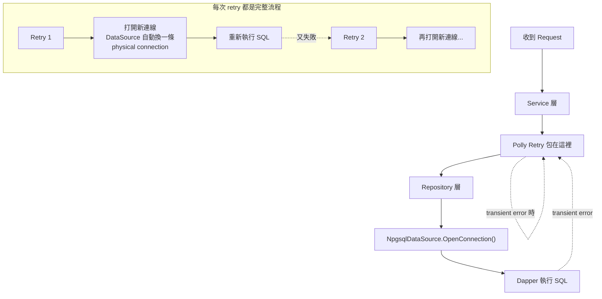
```mermaid
flowchart TD
    A["收到 Request"] --> B["Service 層"]
    B --> C["Polly Retry 包在這裡"]
    C --> D["Repository 層"]
    D --> E["NpgsqlDataSource.OpenConnection()"]
    E --> F["Dapper 執行 SQL"]

    C -.->|"transient error 時"| C
    F -.->|"transient error"| C

    subgraph "每次 retry 都是完整流程"
        C2["Retry 1"] --> D2["打開新連線<br/>DataSource 自動換一條<br/>physical connection"]
        D2 --> F2["重新執行 SQL"]
        F2 -.->|"又失敗"| C3["Retry 2"]
        C3 --> D3["再打開新連線..."]
    end
```

Retry 永遠應該包在 **unit of work 的最外層**（通常是 Service 層），不是只包單條 SQL。原因：
- 如果是 transaction，retry 必須重跑整個 TX（包含 BEGIN → 邏輯 → COMMIT），不能只重送 `COMMIT`
- 前次失敗的 physical connection 狀態可能不乾淨，DataSource 會自動丟掉它，下次 `OpenConnectionAsync()` 拿到的是一條全新的
- `40001 serialization_failure` 發生在 `COMMIT` 時，如果 retry 只包 `COMMIT`，前面的 `UPDATE` 沒重跑 → 資料不一致

**Advisory Lock（秒殺）** 的完整 C# 實作：

```csharp
public async Task<PurchaseResult> TryPurchase(int productId, int userId)
{
    await using var conn = await dataSource.OpenConnectionAsync();
    using var tx = await conn.BeginTransactionAsync();
    try
    {
        // 嘗試獲取輕量級鎖（不排隊）
        var locked = await conn.ExecuteScalarAsync<bool>(
            "SELECT pg_try_advisory_xact_lock(@Id)", new { Id = productId }, tx);
        if (!locked)
            return PurchaseResult.Busy("系統繁忙，請稍後重試");

        var affected = await conn.ExecuteAsync(
            "UPDATE flash_sale SET stock = stock - 1 WHERE id = @Id AND stock > 0",
            new { Id = productId }, tx);
        if (affected == 0)
            return PurchaseResult.SoldOut("已售罄");

        await conn.ExecuteAsync(
            "INSERT INTO orders (user_id, product_id) VALUES (@Uid, @Pid)",
            new { Uid = userId, Pid = productId }, tx);

        await tx.CommitAsync();
        return PurchaseResult.Ok(); // lock 隨 commit 自動釋放
    }
    catch { await tx.RollbackAsync(); throw; }
}
```

**SKIP LOCKED（Work Queue）**：

```csharp
public async Task<Job?> ClaimJob()
{
    await using var conn = await dataSource.OpenConnectionAsync();
    using var tx = await conn.BeginTransactionAsync();
    var job = await conn.QuerySingleOrDefaultAsync<Job>(
        @"SELECT id, payload FROM job_queue WHERE status = 'pending'
          ORDER BY created_at LIMIT 1 FOR UPDATE SKIP LOCKED", tx);
    if (job == null) return null;
    await conn.ExecuteAsync("UPDATE job_queue SET status = 'processing' WHERE id = @Id",
        new { job.Id }, tx);
    await tx.CommitAsync();
    return job;
}
```

**Npgsql CommandTimeout vs statement_timeout**：

| 層級 | 設定 | 行為 |
|------|------|------|
| Npgsql | `CommandTimeout = 30` | 客戶端計時，超時發 CancelRequest |
| PG | `SET statement_timeout = '25s'` | 服務端計時，超時終止查詢 |

```csharp
// 兩層都設（雙重防護），PG 層略小於 Npgsql 層
var builder = new NpgsqlConnectionStringBuilder { CommandTimeout = 30,
    Options = "-c statement_timeout=25000" };
```

**長交易檢測**：從應用層自我監控。

```csharp
public async Task DetectLongTx()
{
    await using var conn = await dataSource.OpenConnectionAsync();
    var txs = await conn.QueryAsync(
        @"SELECT pid, application_name, now() - query_start AS dur, query
          FROM pg_stat_activity
          WHERE state = 'idle in transaction' AND now() - query_start > '30s'::interval");
    foreach (var tx in txs) _logger.LogWarning("Long TX: {@Tx}", tx);
}
```

### VII. 推薦規範

| # | 規則 |
|---|------|
| 15 | 高峰期避免 `ALTER TABLE ADD COLUMN ... DEFAULT`（觸發 rewrite）；先加 column 不加 default，application 層後處理 |
| 16 | 空間查詢（contains, intersects）：用大面積多邊形提效；無法時 split polygon + UNION ALL |
| 17 | 不需精確分頁數 → 用 EXPLAIN-based 快速估算 `countit()` function |
| 18 | 分頁優化 → 用 cursor（`DECLARE ... CURSOR` + `FETCH`）；後翻用 `SCROLL` cursor |
| 19 | 可預估執行時間的 query → 設 `statement_timeout`，防止雪崩和長時間持鎖 |
| 20 | `TRUNCATE` 是 DDL，鎖粒度大 → 開發程式碼中不用，除非加 `lock_timeout` |
| 21 | 將 DDL 封裝在 transaction 中以便 rollback；但必須短 transaction |
| 22 | 用 `INSERT/UPDATE/DELETE ... RETURNING` 減少 DB roundtrip |
| 23 | 自增欄位用 sequence（`serial2/4/8`）；禁用 trigger 產生序列值 |
| 24 | 多 column 任意匹配查詢 → row-level full-text index（`to_tsvector(row::text)`）或 row-to-array index |
| 25 | 中文分詞必須設 token mapping（`ALTER TEXT SEARCH CONFIGURATION ... ADD MAPPING FOR a,b,c,... WITH simple`）；配置 zhparser 參數 |
| 26 | Tree query → recursive CTE；確保終止條件；避免 tree data 重複 |
| 27 | 避免長 transaction（造成 garbage bloat） |
| 28 | 多維分析 → `GROUPING SETS`、`CUBE`、`ROLLUP`（減少 data rescan） |
| 29 | 快速近似 UV（`count distinct`）→ HLL extension |
| 30 | Upsert → `INSERT ... ON CONFLICT DO NOTHING / DO UPDATE SET ...` |
| 31 | 常訪問的大表子集/OLAP → `MATERIALIZED VIEW`；支援 `REFRESH MATERIALIZED VIEW CONCURRENTLY` |
| 32 | 避免頻繁 update 寬表（MVCC write amplification）；將常更新 column 拆分到獨立表，PK join |
| 33 | 用 window function 減少 app-DB roundtrip |
| 34 | Application 層防止 deadlock：同一 user 的數據在單一 thread/session 處理 |
| 35 | OLTP：避免頻繁 aggregation → 定期聚合 + caching |
| 36 | 數據去重：row-level → `DELETE WHERE ctid NOT IN (SELECT min(ctid) FROM tbl GROUP BY tbl::text)`；有 PK → `row_number() OVER (PARTITION BY col ORDER BY pk)` |
| 37 | 快速隨機取記錄：方法一 → random id sampling from `generate_series`；方法二 → plpgsql function |
| 38 | Online schema change（`ADD COLUMN`, `CREATE INDEX`）在離峰時段進行 |
| 39 | OLTP：高峰期禁止長 SQL、大事務、大批量操作 |
| 40 | Query 條件與 index 類型匹配（expression → expression index；column → column index） |
| 41 | 比較值含 NULL 時用 `IS DISTINCT FROM` / `IS NOT DISTINCT FROM`（NULL 視為相等） |
| 42 | UDF/DO block 中逐行處理用 cursor + `WHERE CURRENT OF` |
| 43 | 避免 `!=` / `<>` 在 WHERE（可能無法用 index）；解法：partial index、partition、`constraint_exclusion=on` |
| 44 | 頻繁變動的表：降低 `autovacuum_vacuum_scale_factor`（如 0.005）、`autovacuum_analyze_scale_factor`（如 0.01）、設 `autovacuum_vacuum_cost_delay=0` |
| 45 | `WHERE col IN (...)` / `WHERE col=a OR col=b` → PG 自動用 bitmap OR，不需手動改 UNION |
| 46 | 優先使用 `EXISTS (SELECT 1 ...)` 而非 `IN (SELECT ...)` |
| 47 | 優先使用 array variable 而非 temp table（除非數據量極大） |
| 48 | 避免全表掃描：`WHERE` 和 `ORDER BY` 欄位建 index；用 `EXPLAIN (verbose,costs,timing,buffers,analyze)` 驗證 |
| 49 | 控制 JOIN order：`join_collapse_limit=1` + `geqo=off` 固定 explicit JOIN order；或讓 optimizer 找最佳順序再改寫 SQL |
| 50 | 控制 subquery flattening：`from_collapse_limit=1` + `geqo=off` 防止 subquery 提升為 JOIN |
| 51 | GIN write 優化：`fastupdate=on`，設適當 `gin_pending_list_limit` (KB) |
| 52 | B-tree：避免 UUID 等高離散值作 index key（過多 page split）；調整 `fillfactor` |
| 53 | BRIN：依數據相關性設 `pages_per_range`；用 `ANALYZE tbl; SELECT reltuples/relpages` 評估 |

#### a. 推薦規範詳解：用 ID 排序防止 Deadlock

規則 #34「同一 user 的數據在單一 thread 處理」解決的是一半的問題。另一半是：**多筆資料更新時，必須按固定順序鎖定 row**。

Deadlock 的本質是兩個 transaction 互相等待對方釋放鎖：

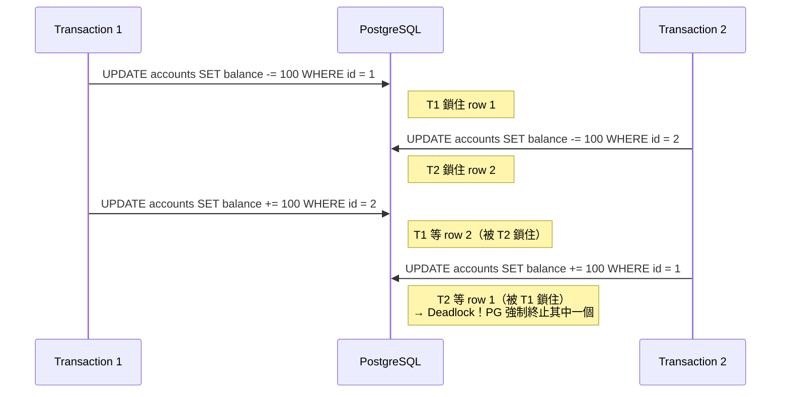
```mermaid
sequenceDiagram
    participant T1 as Transaction 1
    participant PG as PostgreSQL
    participant T2 as Transaction 2

    T1->>PG: UPDATE accounts SET balance -= 100 WHERE id = 1
    Note right of PG: T1 鎖住 row 1

    T2->>PG: UPDATE accounts SET balance -= 100 WHERE id = 2
    Note right of PG: T2 鎖住 row 2

    T1->>PG: UPDATE accounts SET balance += 100 WHERE id = 2
    Note right of PG: T1 等 row 2（被 T2 鎖住）

    T2->>PG: UPDATE accounts SET balance += 100 WHERE id = 1
    Note right of PG: T2 等 row 1（被 T1 鎖住）<br/>→ Deadlock！PG 強制終止其中一個
```

解法極簡單：**永遠按 ID 升序鎖定**。

```sql
-- ❌ 轉帳 1→2 和 2→1 同時發生，鎖定順序相反 → deadlock
-- T1: UPDATE WHERE id = 1; UPDATE WHERE id = 2;  （先鎖 1 再鎖 2）
-- T2: UPDATE WHERE id = 2; UPDATE WHERE id = 1;  （先鎖 2 再鎖 1）

-- ✅ 固定順序：永遠先鎖小 ID，再鎖大 ID
-- T1: UPDATE WHERE id = 1; UPDATE WHERE id = 2;  （1 < 2，先鎖 1）
-- T2: UPDATE WHERE id = 1; UPDATE WHERE id = 2;  （1 < 2，先鎖 1）
-- → T1 鎖住 1 後，T2 等 1；T1 鎖住 2 完成後釋放，T2 繼續 → 不 deadlock
```

```csharp
public async Task Transfer(int fromId, int toId, decimal amount)
{
    // ✅ 按 ID 升序保證全域一致的鎖定順序
    var ids = new[] { fromId, toId }.OrderBy(id => id).ToArray();

    using var tx = await conn.BeginTransactionAsync();
    try
    {
        // 先鎖小 ID，再鎖大 ID（兩個 transaction 的鎖定順序永遠一致）
        foreach (var id in ids)
            await conn.ExecuteAsync(
                "SELECT 1 FROM accounts WHERE id = @Id FOR UPDATE",
                new { Id = id }, tx);

        await conn.ExecuteAsync(
            "UPDATE accounts SET balance = balance - @Amt WHERE id = @Fid", new { Fid = fromId, Amt = amount }, tx);
        await conn.ExecuteAsync(
            "UPDATE accounts SET balance = balance + @Amt WHERE id = @Tid", new { Tid = toId, Amt = amount }, tx);

        await tx.CommitAsync();
    }
    catch (PostgresException ex) when (ex.SqlState == PostgresErrorCodes.DeadlockDetected)
    {
        await tx.RollbackAsync();
        throw; // 上層 retry
    }
}
```

核心原則：只要所有 transaction 對同一組資源的鎖定順序一致（例如都按 ID 升序），就**不可能形成環狀等待**。這是純應用層的保證，不需要任何 DB 端設定。

### VIII. 精選 SQL 範例

```sql
-- #17 快速估算分頁數
CREATE OR REPLACE FUNCTION countit(text)
RETURNS float4
LANGUAGE plpgsql AS $$
DECLARE v_plan json;
BEGIN
    EXECUTE 'EXPLAIN (FORMAT JSON) ' || $1 INTO v_plan;
    RETURN v_plan #>> '{0,Plan,"Plan Rows"}';
END;
$$;
SELECT countit('SELECT * FROM t1234 WHERE id < 1000');  -- 954

-- #18 Cursor pagination
DECLARE cur1 CURSOR FOR SELECT * FROM sbtest1 WHERE id BETWEEN 100 AND 1000000 ORDER BY id;
FETCH 100 FROM cur1;
DECLARE cur1 SCROLL CURSOR FOR ...;  -- 支援前後翻頁

-- #19 statement_timeout
BEGIN;
SET LOCAL statement_timeout = '10s';
-- query;
END;

-- #22 RETURNING
CREATE TABLE tbl4(id serial, info text);
INSERT INTO tbl4 (info) VALUES ('test') RETURNING *;
UPDATE tbl4 SET info = 'abc' RETURNING *;
DELETE FROM tbl4 RETURNING *;

-- #24 Row-level full-text index
CREATE OR REPLACE FUNCTION f1(text) RETURNS tsvector AS $$
    SELECT to_tsvector($1);
$$ LANGUAGE sql IMMUTABLE STRICT;
ALTER FUNCTION record_out(record) IMMUTABLE;
ALTER FUNCTION textin(cstring) IMMUTABLE;
CREATE INDEX idx_t_1 ON t USING gin (f1('jiebacfg'::regconfig, t::text));
SELECT * FROM t WHERE f1('jiebacfg'::regconfig, t::text) @@ to_tsquery('digoal & china');

-- #25 Chinese token mapping
ALTER TEXT SEARCH CONFIGURATION testzhcfg
    ADD MAPPING FOR a,b,c,d,e,f,g,h,i,j,k,l,m,n,o,p,q,r,s,t,u,v,w,x,y,z WITH simple;

-- zhparser options:
-- zhparser.punctuation_ignore = f
-- zhparser.seg_with_duality = f
-- zhparser.dict_in_memory = f
-- zhparser.multi_short = f
-- zhparser.multi_duality = f
-- zhparser.multi_zmain = f
-- zhparser.multi_zall = f

-- #26 Recursive CTE (tree)
CREATE TABLE tbl_test (ID numeric, NAME text, PID numeric DEFAULT 0);
INSERT INTO tbl_test VALUES ('1','10','0'),('2','11','1'),('3','20','0'),('4','12','1'),('5','121','2');

-- Root → leaf:
WITH RECURSIVE t_result AS (
    SELECT * FROM tbl_test WHERE id = 1
    UNION ALL
    SELECT t2.* FROM t_result t1 JOIN tbl_test t2 ON t1.id = t2.pid
) SELECT * FROM t_result;

-- Leaf → root:
WITH RECURSIVE t_result AS (
    SELECT * FROM tbl_test WHERE id = 5
    UNION ALL
    SELECT t2.* FROM t_result t1 JOIN tbl_test t2 ON t1.pid = t2.id
) SELECT * FROM t_result;

-- #28 Multi-dimensional analysis with CUBE + GROUPING SETS
CREATE TABLE tab5(c1 int, c2 int, c3 int, c4 int, crt_time timestamp);
INSERT INTO tab5 SELECT
    trunc(100*random()), trunc(1000*random()),
    trunc(10000*random()), trunc(100000*random()),
    clock_timestamp() + (trunc(10000*random())||' hour')::interval
FROM generate_series(1, 1000000);

CREATE TABLE stat_tab5 (
    c1 int, c2 int, c3 int, c4 int,
    time1 text, time2 text, time3 text, time4 text,
    cnt int8, bitmap text
);

INSERT INTO stat_tab5
SELECT c1,c2,c3,c4, t1,t2,t3,t4, cnt,
    '' ||
    CASE WHEN c1 IS NULL THEN 0 ELSE 1 END ||
    CASE WHEN c2 IS NULL THEN 0 ELSE 1 END ||
    CASE WHEN c3 IS NULL THEN 0 ELSE 1 END ||
    CASE WHEN c4 IS NULL THEN 0 ELSE 1 END ||
    CASE WHEN t1 IS NULL THEN 0 ELSE 1 END ||
    CASE WHEN t2 IS NULL THEN 0 ELSE 1 END ||
    CASE WHEN t3 IS NULL THEN 0 ELSE 1 END ||
    CASE WHEN t4 IS NULL THEN 0 ELSE 1 END
FROM (
    SELECT c1,c2,c3,c4,
        to_char(crt_time, 'yyyy') t1,
        to_char(crt_time, 'yyyy-mm') t2,
        to_char(crt_time, 'yyyy-mm-dd') t3,
        to_char(crt_time, 'yyyy-mm-dd hh24') t4,
        count(*) cnt
    FROM tab5
    GROUP BY CUBE(c1,c2,c3,c4),
        GROUPING SETS(
            to_char(crt_time, 'yyyy'),
            to_char(crt_time, 'yyyy-mm'),
            to_char(crt_time, 'yyyy-mm-dd'),
            to_char(crt_time, 'yyyy-mm-dd hh24')
        )
) t;
-- INSERT 0 49570486, Time: 172374 ms

CREATE INDEX idx_stat_tab5_bitmap ON stat_tab5 (bitmap);

-- 查詢維度 c1,c3,c4,t3 → bitmap='10110010'
SELECT c1,c3,c4,time3,cnt FROM stat_tab5 WHERE bitmap = '10110010' LIMIT 10;
-- Time: 0.528 ms

-- #29 HLL approximate UV
CREATE TABLE access_date (acc_date date UNIQUE, userids hll);
INSERT INTO access_date
    SELECT current_date, hll_add_agg(hll_hash_integer(user_id))
    FROM generate_series(1, 10000) t(user_id);
SELECT *, total_users - COALESCE(lag(total_users,1) OVER (ORDER BY rn), 0) AS new_users
FROM (
    SELECT acc_date, row_number() OVER date AS rn,
        #hll_union_agg(userids) OVER date AS total_users
    FROM access_date
    WINDOW date AS (ORDER BY acc_date ASC ROWS UNBOUNDED PRECEDING)
) t;

-- #30 ON CONFLICT
INSERT INTO tbl VALUES (1, 'info')
    ON CONFLICT ON CONSTRAINT tbl_pkey
    DO UPDATE SET info = excluded.info;

-- #31 MATERIALIZED VIEW
CREATE MATERIALIZED VIEW mv_tbl AS SELECT xx,xx,xx FROM tbl WHERE xxx WITH DATA;
REFRESH MATERIALIZED VIEW CONCURRENTLY mv_tbl WITH DATA;

-- #36 Dedup
-- Row-level:
DELETE FROM tbl WHERE ctid NOT IN (SELECT min(ctid) FROM tbl GROUP BY tbl::text);
-- Column-level with PK:
DELETE FROM tbl WHERE pk IN (
    SELECT pk FROM (
        SELECT pk, row_number() OVER (PARTITION BY col ORDER BY pk) rn FROM tbl
    ) t WHERE t.rn > 1
);

-- #41 IS DISTINCT FROM
SELECT NULL IS DISTINCT FROM NULL;  -- f
SELECT NULL IS DISTINCT FROM 1;     -- t

-- #42 Cursor in DO block
DO LANGUAGE plpgsql $$
DECLARE
    cur refcursor;
    rec record;
BEGIN
    OPEN cur FOR SELECT * FROM tbl WHERE id > 1;
    LOOP
        FETCH cur INTO rec;
        IF found THEN
            RAISE NOTICE '%', rec;
            UPDATE tbl SET info = 'ab' WHERE CURRENT OF cur;
        ELSE
            CLOSE cur;
            EXIT;
        END IF;
    END LOOP;
END;
$$;

-- #44 Autovacuum tuning
CREATE TABLE t21(id int, info text) WITH (
    autovacuum_enabled = on,
    toast.autovacuum_enabled = on,
    autovacuum_vacuum_scale_factor = 0.005,
    toast.autovacuum_vacuum_scale_factor = 0.005,
    autovacuum_analyze_scale_factor = 0.01,
    autovacuum_vacuum_cost_delay = 0,
    toast.autovacuum_vacuum_cost_delay = 0
);

-- #46 EXISTS > IN
SELECT num FROM a WHERE EXISTS (SELECT 1 FROM b WHERE num = a.num);

-- #47 Array variable > temp table (small data)
-- #51 GIN fastupdate
CREATE INDEX idx_1 ON tbl USING gin (tsvector)
    WITH (fastupdate=on, gin_pending_list_limit=10240);

-- #53 BRIN evaluation
ANALYZE tbl;
SELECT reltuples / relpages FROM tbl;
```

### IX. #37 快速隨機取記錄

```sql
-- 方法一：random ID sampling
SELECT * FROM tbl_user
WHERE id IN (
    SELECT floor(random() * (max_id - min_id))::int + min_id
    FROM generate_series(1, 5),
        (SELECT max(id) AS max_id, min(id) AS min_id FROM tbl_user) s1
) LIMIT 5;

-- 方法二：plpgsql function
CREATE OR REPLACE FUNCTION f_get_random(i_range int) RETURNS SETOF record AS $$
DECLARE
    v_result record;
    v_max_id int;
    v_min_id int;
    v_random numeric;
BEGIN
    SELECT random() INTO v_random;
    SELECT max(id), min(id) INTO v_max_id, v_min_id FROM tbl_user;
    FOR v_result IN
        SELECT * FROM tbl_user
        WHERE id BETWEEN (v_min_id+(v_random*(v_max_id-v_min_id))::int)
                  AND (v_min_id+(v_random*(v_max_id-v_min_id))::int + i_range)
    LOOP
        RETURN NEXT v_result;
    END LOOP;
    RETURN;
END;
$$ LANGUAGE plpgsql;
```

### X. #49-50 JOIN Order & Subquery Control

```sql
-- 固定 explicit JOIN order
BEGIN;
SET LOCAL join_collapse_limit = 1;
SET LOCAL geqo = off;
-- your query with explicit JOIN order
END;

-- 讓 optimizer 找最佳 JOIN order（設高 join_collapse_limit），再改寫 SQL
SET join_collapse_limit = 100;
SET geqo = off;
EXPLAIN SELECT * FROM t2 JOIN t1 USING (id) JOIN t3 USING (id) ...;
-- → 根據 EXPLAIN 輸出改寫 SQL 為最佳 order

-- 固定 subquery 不 flatten（from_collapse_limit = 1）
SET from_collapse_limit = 1;
```

> 補充（Senior Dev）：#49-50 的 `join_collapse_limit` / `from_collapse_limit` 控制技巧是 DBA 排查 plan regression 的核心武器。PG 14+ 的 optimizer 對 multi-JOIN 的處理已大幅改進（特別是 `geqo_threshold` 預設值從 PG 16 起調整），大部分場景不需手動控制。若 production 遇到 join order 不穩，先用 `auto_explain` + `pg_stat_statements` 抓出問題 query，再用 `pg_hint_plan` pin 住最佳 plan，而非靠 `join_collapse_limit`。

---

## 6. 章末總結：Developer 落地檢查清單

每當改動 DB 相關程式碼時，快速過一遍：

| # | 檢查項 | 對應規範 | 為什麼重要 |
|---|--------|---------|-----------|
| 1 | Connection string 有設 `ApplicationName` 嗎？ | 命名 #7 | 出問題時 `pg_stat_activity` 一眼認出你的服務 |
| 2 | 有沒有用 `SELECT *`？ | Query #8 | 浪費頻寬 + Index Only Scan 失效 + schema 變更時爆炸 |
| 3 | Transaction 有包 `using` 嗎？ | 穩定性 #5 | 忘掉 Dispose = 一整排 lock 卡住 |
| 4 | `SUM()` 有包 `COALESCE(..., 0)` 嗎？ | Query #5 | C# 收到 default(T) 而非 NULL，藏 bug |
| 5 | Dapper 參數 null 是否變成 `WHERE col = NULL`？ | Query #6 | NULL = NULL 永遠不為 true |
| 6 | 判斷存在用 `EXISTS` 而非 `count(*) > 0` 嗎？ | 穩定性 #9 | count(*) 掃全表，EXISTS 碰到第一筆就停 |
| 7 | 秒殺用 Advisory Lock 嗎？ | 穩定性 #8 | FOR UPDATE 排隊 → TPS 差 4 倍 |
| 8 | 連線字串有設 Pool 參數嗎？ | 穩定性 #10 | 沒 pool = 3000 連線 = 15GB RAM |
| 9 | 有實作 Retry 嗎？ | 穩定性 #11 | transient error 不加 retry = 掉 request |
| 10 | DDL 有設 `lock_timeout` 嗎？ | 管理 #2 | ALTER TABLE 卡 30 秒 = 全站不能讀寫 |
| 11 | 有設 `statement_timeout` 嗎？ | 穩定性 #19 | 爛查詢跑 10 分鐘 = pool 被佔滿 |
| 12 | 隔離級別用了不必要的嗎？ | 穩定性 #14 | Repeatable Read 比 Read Committed 慢 2-10x |

```
章節關係圖：
  一、開發規範 ← 基底（連線、SQL、Transaction）
  ├── 三、JOIN 優化 → 為什麼 EXISTS > IN 這麼重要
  ├── 四、pgcrypto → Key 從 KMS 來，經 Custom GUC 傳入
  └── 六、12306 → Advisory Lock + SKIP LOCKED 的極限應用
```

---

# 二、PostgreSQL Trigger Audit — DML 欄位變更審計 + DDL 結構變更審計

> 來源（德哥 digoal Trigger 審計二部曲）：
> - [DDL 審計 — use event trigger record user who alter table (2014-12-11)](https://github.com/digoal/blog/blob/master/201412/20141211_02.md)
> - [DML 審計 — use trigger audit record which column modified (2014-12-14)](https://github.com/digoal/blog/blob/master/201412/20141214_01.md)

---

## 0. Developer 導航：Trigger Audit 的架構決策

不要把審計當成「要嘛全做要嘛不做」——你面對的是「審計放在哪一層」。每層有不同的取捨：

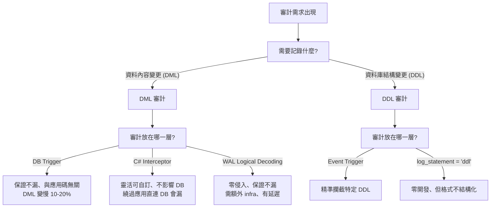
```mermaid
flowchart TD
    A["審計需求出現"] --> B["需要記錄什麼?"]
    B -->|"資料內容變更 (DML)"| C["DML 審計"]
    B -->|"資料庫結構變更 (DDL)"| D["DDL 審計"]

    C --> F["審計放在哪一層?"]
    F -->|"DB Trigger"| G["保證不漏、與應用碼無關<br>DML 變慢 10-20%"]
    F -->|"C# Interceptor"| H["靈活可自訂、不影響 DB<br>繞過應用直連 DB 會漏"]
    F -->|"WAL Logical Decoding"| I["零侵入、保證不漏<br>需額外 infra、有延遲"]

    D --> J["審計放在哪一層?"]
    J -->|"Event Trigger"| K["精準攔截特定 DDL"]
    J -->|"log_statement = 'ddl'"| L["零開發、但格式不結構化"]
```

| 讀完能做的事 | 具體表現 |
|------------|---------|
| 判斷選擇 | 何時用 DB Trigger 審計、何時用 C# 攔截器、何時用 log_statement |
| 實作 DML 審計 | 欄位級變更追蹤（誰改了什麼、新舊值對比） |
| 實作 DDL 審計 | 監控 ALTER TABLE / DROP TABLE 等結構變更 |
| 整合到 C# | 用 Dapper 查詢 hstore/jsonb 審計記錄，在前端展示變更歷史 |

---

## 1. DML 審計：Row Trigger + hstore 記錄欄位級變更


DML（Data Manipulation Language，資料操作語言）審計的目標是記錄「誰在什麼時候對哪張表的哪些欄位做了什麼變更」。這對合規審計、問題排查、資料回溯都非常重要。

**什麼是 Trigger？** Trigger（觸發器）就像一個自動警報器——當你對某張表執行 INSERT、UPDATE 或 DELETE 時，PostgreSQL 自動呼叫一段你事先寫好的程式碼。這段程式碼可以檢查變更前後的資料、記錄變更內容，甚至可以阻止不合規的操作。

**hstore 在這裡的角色？** hstore 是 PostgreSQL 的 key-value 儲存擴展（類似 Python 的 dictionary 或 Java 的 HashMap）。Trigger 函數中用 `hstore(OLD.*)` 把一整行資料的所有欄位轉成 key-value 格式，方便統一儲存和比對。舉例：`{id => 1, name => "張三", email => "zhang@example.com"}`。

**審計流程**：當你執行 UPDATE 時，Trigger 會：
1. 把更新前的舊資料轉成 hstore（`old_rec`）
2. 把更新後的新資料轉成 hstore（`new_rec`）
3. 比對找出哪些欄位發生了變更（`diff_old_rec` 和 `diff_new_rec`）
4. 將以上資訊連同操作人、時間、IP 等一起寫入審計表

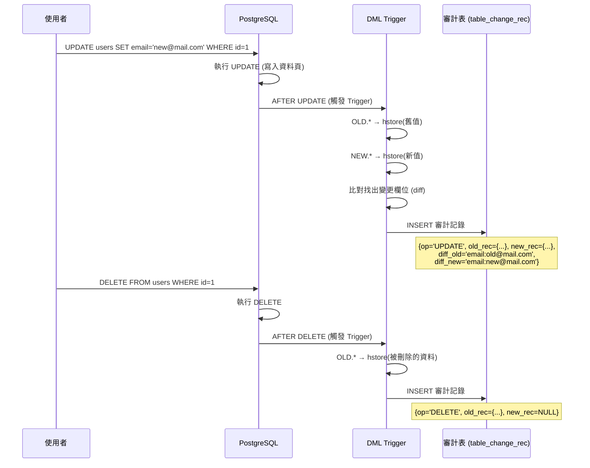
```mermaid
sequenceDiagram
    participant User as 使用者
    participant PG as PostgreSQL
    participant Trigger as DML Trigger
    participant Audit as 審計表 (table_change_rec)

    User->>PG: UPDATE users SET email='new@mail.com' WHERE id=1
    PG->>PG: 執行 UPDATE (寫入資料頁)
    PG->>Trigger: AFTER UPDATE (觸發 Trigger)
    Trigger->>Trigger: OLD.* → hstore(舊值)
    Trigger->>Trigger: NEW.* → hstore(新值)
    Trigger->>Trigger: 比對找出變更欄位 (diff)
    Trigger->>Audit: INSERT 審計記錄
    Note over Audit: {op='UPDATE', old_rec={...}, new_rec={...},<br>diff_old='email:old@mail.com',<br>diff_new='email:new@mail.com'}

    User->>PG: DELETE FROM users WHERE id=1
    PG->>PG: 執行 DELETE
    PG->>Trigger: AFTER DELETE (觸發 Trigger)
    Trigger->>Trigger: OLD.* → hstore(被刪除的資料)
    Trigger->>Audit: INSERT 審計記錄
    Note over Audit: {op='DELETE', old_rec={...}, new_rec=NULL}
```

### I. 審計表結構

```sql
CREATE TABLE table_change_rec (
  id serial8 PRIMARY KEY,
  relid oid,
  table_schema name,
  table_name name,
  when_tg text,
  level text,
  op text,
  old_rec jsonb,
  new_rec jsonb,
  diff_old_rec text,
  diff_new_rec text,
  crt_time timestamp without time zone DEFAULT now(),
  username name,
  client_addr inet,
  client_port int
);
```

> 補充（Senior Dev）：`hstore` 是 PostgreSQL 自帶的 contrib extension——編譯時會一併產生、不需另外下載，但**不會自動啟用**，使用前必須手動 `CREATE EXTENSION hstore`。建議改用原生型別 `JSONB`（不需 extension）：支援 nested structure、GIN index、更豐富的 operator。

### II. 通用觸發器函數

```sql
CREATE OR REPLACE FUNCTION dml_trace()
RETURNS trigger
LANGUAGE plpgsql
AS $BODY$
DECLARE
  v_new_rec jsonb;
  v_old_rec jsonb;
  v_diff_new_rec text;
  v_diff_old_rec text;
  v_username text := session_user;
  v_client_addr inet := inet_client_addr();
  v_client_port int := inet_client_port();
BEGIN
  CASE TG_OP
  WHEN 'DELETE' THEN
    v_old_rec := to_jsonb(OLD.*);
    INSERT INTO table_change_rec
      (relid, table_schema, table_name, when_tg, level, op, old_rec,
       username, client_addr, client_port)
    VALUES (tg_relid, tg_table_schema, tg_table_name, tg_when, tg_level,
            tg_op, v_old_rec, v_username, v_client_addr, v_client_port);

  WHEN 'INSERT' THEN
    v_new_rec := to_jsonb(NEW.*);
    INSERT INTO table_change_rec
      (relid, table_schema, table_name, when_tg, level, op, new_rec,
       username, client_addr, client_port)
    VALUES (tg_relid, tg_table_schema, tg_table_name, tg_when, tg_level,
            tg_op, v_new_rec, v_username, v_client_addr, v_client_port);

  WHEN 'UPDATE' THEN
    v_old_rec := to_jsonb(OLD.*);
    v_new_rec := to_jsonb(NEW.*);
    -- key-level JOIN：透過欄位名稱比對，確保 c1 對 c1、c2 對 c2
    -- FULL OUTER JOIN 同時處理新增/刪除欄位的情況
    SELECT coalesce(jsonb_agg(old_col ORDER BY key)::text, '{}'),
           coalesce(jsonb_agg(new_col ORDER BY key)::text, '{}')
    INTO v_diff_old_rec, v_diff_new_rec
    FROM (
      SELECT o.key,
             jsonb_build_object(o.key, o.value) AS old_col,
             jsonb_build_object(n.key, n.value) AS new_col
      FROM jsonb_each(v_old_rec) o
      FULL OUTER JOIN jsonb_each(v_new_rec) n ON o.key = n.key
      WHERE o.value IS DISTINCT FROM n.value
    ) t;

    INSERT INTO table_change_rec
      (relid, table_schema, table_name, when_tg, level, op,
       old_rec, new_rec, diff_old_rec, diff_new_rec,
       username, client_addr, client_port)
    VALUES (tg_relid, tg_table_schema, tg_table_name, tg_when, tg_level,
            tg_op, v_old_rec, v_new_rec, v_diff_old_rec, v_diff_new_rec,
            v_username, v_client_addr, v_client_port);
  ELSE
    RETURN null;
  END CASE;
  RETURN null;
END;
$BODY$ STRICT;
```

diff 計算的核心思路：`FULL OUTER JOIN ... ON o.key = n.key` 透過欄位名稱做 key-level JOIN，確保 c1 永遠比對 c1、c2 永遠比對 c2，不會因展開順序不同而出錯。`IS DISTINCT FROM` 同時處理 NULL ↔ NULL（視為相等）和 NULL ↔ 值（視為變更）。

### III. 掛載 Trigger 及測試

```sql
CREATE TABLE test (id INT, c1 INT, c2 TEXT, c3 TIMESTAMP);

CREATE TRIGGER tg
  AFTER DELETE OR INSERT OR UPDATE ON test
  FOR EACH ROW EXECUTE PROCEDURE dml_trace();
```

執行一系列 DML：

```sql
TRUNCATE table_change_rec;

INSERT INTO test VALUES (1, 1, 'digoal', now());
INSERT INTO test VALUES (2, 2, 'digoal', now());

-- 全部設為 NULL
UPDATE test SET id = NULL, c1 = NULL, c2 = NULL, c3 = NULL WHERE id = 1;

-- 只改部分欄位
UPDATE test SET c1 = 2, c3 = now() WHERE id = 2;

DELETE FROM test;
```

### IV. 審計結果

**INSERT 記錄**（Rec 1 & 2）：`old_rec` 為空，`new_rec` 含完整 row：

```
id=11 | op=INSERT
new_rec: "c1"=>"1", "c2"=>"digoal", "c3"=>"2014-12-15 03:43:12.135139", "id"=>"1"
diff_old_rec / diff_new_rec: NULL

id=12 | op=INSERT
new_rec: "c1"=>"2", "c2"=>"digoal", "c3"=>"2014-12-15 03:43:14.803063", "id"=>"2"
```

**UPDATE 全部設 NULL**（Rec 3）：所有欄位都記錄為 diff：

```
id=13 | op=UPDATE
old_rec: "c1"=>"1", "c2"=>"digoal", "c3"=>"2014-12-15 03:43:12.135139", "id"=>"1"
new_rec: "c1"=>NULL, "c2"=>NULL, "c3"=>NULL, "id"=>NULL
diff_old_rec: {"(c1,1)","(c2,digoal)","(c3,\"2014-12-15 03:43:12.135139\")","(id,1)"}
diff_new_rec: {"(c1,)","(c2,)","(c3,)","(id,)"}
```

**UPDATE 只改部分欄位**（Rec 4）：只有變更的欄位出現在 diff，未變更的不記錄：

```
id=14 | op=UPDATE
old_rec: "c1"=>"2", "c2"=>"digoal", "c3"=>"2014-12-15 03:43:14.803063", "id"=>"2"
new_rec: "c1"=>"2", "c2"=>"digoal", "c3"=>"2014-12-15 03:43:35.977674", "id"=>"2"
diff_old_rec: {"(c3,\"2014-12-15 03:43:14.803063\")"}         -- 只有 c3 變更
diff_new_rec: {"(c3,\"2014-12-15 03:43:35.977674\")"}
```

**DELETE 記錄**（Rec 5 & 6）：`new_rec` 為空，`old_rec` 含被刪除的 row：

```
id=15 | op=DELETE | old_rec: "c1"=>NULL, "c2"=>NULL, "c3"=>NULL, "id"=>NULL
id=16 | op=DELETE | old_rec: "c1"=>"2", "c2"=>"digoal", "c3"=>"2014-12-15 03:43:35.977674", "id"=>"2"
```

> 補充（Senior Dev）：`AFTER` trigger 的審計完整性：審計 INSERT 和業務 DML 處在同一個 transaction 中。如果 constraint violation 導致整個 transaction 被 rollback，審計記錄也會一併被撤銷——不會留下「明明沒改成功卻有審計記錄」的假資料。但反過來說，如果 transaction 被上層應用邏輯 rollback（非 constraint 觸發），審計同樣會消失。如果需要保留被 rollback 的審計，必須用 `dblink` 或 `LISTEN/NOTIFY` 把審計寫入獨立的 transaction，讓它不受主 transaction 的 rollback 影響。

### V. DML Trigger 效能考量

**Plpgsql Trigger 的效能瓶頸**

| 考量點 | 影響 | 緩解 |
|--------|------|------|
| `to_jsonb(ROW.*)` 轉換 | 每 row 一次 O(n_columns) 序列化 | 大表只審計關鍵欄位，而非 `*` |
| Trigger 內 INSERT | 每個 DML row 一次額外 WAL write | 批量操作用 statement-level trigger + transition table |
| diff 計算（key-level JOIN） | 每 row O(n_columns) | 已用 JSONB + key-level JOIN，只算實際變更的欄位 |
| Audit 表膨脹 | 審計表增速 = 業務表寫入量 | 按月分區；定期歸檔或刪除 |
| Trigger latency | ~0.1-1ms / row | 對 latency-sensitive 場景，改用 pgaudit |

**pgaudit：C 層面的非侵入式審計**

pgaudit 是 PostgreSQL 官方 contrib extension（PG 17 已內建在 contrib 中，不需編譯），但因為它在 C 層面 hook 進 executor，**必須先透過 `shared_preload_libraries` 載入才能啟用**，不像一般 extension 直接 `CREATE EXTENSION` 就好。跟 plpgsql trigger 的根本差異在於：pgaudit 在 C 層面攔截 SQL，不經過 plpgsql 虛擬機，不會觸發額外的 WAL write。效能差距約 10-50x。

```sql
-- PG 17 安裝（三步缺一不可）
-- Step 1：postgresql.conf 加入 shared_preload_libraries，重啟 PG
--    shared_preload_libraries = 'pgaudit'
-- Step 2：重啟後再 CREATE EXTENSION
CREATE EXTENSION pgaudit;
-- Step 3：設定 audit log 等級（postgresql.conf 或 ALTER SYSTEM）

-- 三種審計等級，各自獨立開關：
--    none：不記錄
--    read：記錄 SELECT / COPY TO
--    write：記錄 INSERT / UPDATE / DELETE / COPY FROM
--    function：記錄 function 呼叫
--    role：記錄 role / privilege 變更（GRANT / REVOKE）
--    ddl：記錄 CREATE / ALTER / DROP（無需 event trigger!）
--    misc：記錄 DISCARD / FETCH / CHECKPOINT 等雜項
--    all：全部記錄

-- 全域設定（postgresql.conf）
pgaudit.log = 'write, ddl, role'
pgaudit.log_level = 'notice'           -- 輸出到 PG log
pgaudit.log_catalog = off              -- 不審計系統表操作
pgaudit.log_relation = on              -- 必須開，否則看不到 table name
pgaudit.log_client = on                -- 記錄 client IP / port
pgaudit.log_parameter = on             -- 記錄 SQL 參數值
```

設完後，PG log 會出現結構化的審計行（log_line_prefix 正常作用，可用 Loki / ELK 收集）：

```
LOG:  AUDIT: SESSION,2,1,WRITE,INSERT,TABLE,public.orders,
      "INSERT INTO orders (user_id, amount) VALUES (1, 100);",<none>
```

**Session 級 vs Object 級**：

```sql
-- Session 級：對當前 session 的所有操作做審計
SET pgaudit.log = 'all';

-- Object 級：只審計特定 table / role 的操作（更精細）
-- 步驟 1：建立審計 role
CREATE ROLE auditor;
GRANT auditor TO app_user;

-- 步驟 2：指定對哪些 table 的哪些操作做審計
-- pgaudit.role = auditor 的 session，才會對此 table 的 write 操作做審計
ALTER TABLE orders SET (pgaudit.role = 'auditor', pgaudit.log = 'write');
```

**pgaudit vs plpgsql Trigger vs WAL Logical Decoding 對比**：

| | pgaudit | plpgsql Trigger | wal2json / pg_recvlogical |
|---|---|---|---|
| 生效層級 | C 層面攔截 SQL | plpgsql function 內 | WAL 解碼 |
| 對業務 DML 的效能影響 | 極低（~0.01ms） | 中（~0.1-1ms，含 WAL 加倍） | 零（完全 non-invasive） |
| 能記錄什麼 | SQL 文本 + session context | OLD / NEW 值 + 自訂欄位 | 完整的 row-level change（含舊值） |
| 能記錄 SELECT 嗎 | ✅（設 `read`） | ❌（trigger 不觸發於 SELECT） | ❌ |
| 能記錄 DDL 嗎 | ✅（設 `ddl`） | ❌ | ❌（除非用 event trigger） |
| 審計記錄落在哪 | PG log file（Loki / ELK 收集） | 自訂審計表 | 外部 consumer |
| 需要 CREATE EXTENSION | ✅ | ❌ | ✅ |
| 適合場景 | 合規需求、安全審計 | 業務變更歷史（欄位級 diff） | CDC / 跨系統同步 |

**如何選擇**：

- 只需要「誰在什麼時候執行了什麼 SQL」→ pgaudit，設 `write + ddl` 就夠
- 需要「哪個欄位從什麼值改成什麼值」→ plpgsql Trigger（本章 DML 方案）
- 需要「零效能影響 + 跨系統同步變更」→ WAL logical decoding
- 兩者都要 → pgaudit 做安全合規 + Trigger 做業務審計，各寫各的

### VI. App Dev 實戰：C# 整合審計資料

```csharp
// ✅ 用 Dapper 查詢審計記錄（JSONB 版本，推薦）
public class AuditRecord
{
    public long Id { get; set; }
    public string TableSchema { get; set; }
    public string TableName { get; set; }
    public string Op { get; set; }
    public string DiffOldRec { get; set; }
    public string DiffNewRec { get; set; }
    public DateTime CrtTime { get; set; }
    public string Username { get; set; }
}

public async Task<List<AuditRecord>> GetAuditHistory(
    NpgsqlDataSource dataSource, string tableName, int recordId)
{
    await using var conn = await dataSource.OpenConnectionAsync();
    return (await conn.QueryAsync<AuditRecord>(
        @"SELECT id, table_schema, table_name, op,
                 diff_old_rec, diff_new_rec, crt_time, username
          FROM table_change_rec
          WHERE table_name = @TableName
            AND ((old_rec->>'id')::int = @RecordId
              OR (new_rec->>'id')::int = @RecordId)
          ORDER BY crt_time DESC LIMIT 100",
        new { TableName = tableName, RecordId = recordId }
    )).AsList();
}
```

### VII. 架構決策速查：何時用哪種審計方案

| 場景 | 推薦方案 | 原因 |
|------|---------|------|
| 合規需求（GDPR/SOX），不能漏任何一筆 | DB Trigger + Event Trigger | 資料庫層面保證完整性 |
| 效能敏感的 OLTP | C# Interceptor + Async Audit Queue | 不影響主交易路徑 latency |
| 需要記錄 HTTP Context | C# Interceptor | DB Trigger 拿不到 Request URL |
| 多個應用共享同一個 DB | DB Trigger | 統一入口，不會有應用漏掉 |
| 只需知道「誰改了 schema」 | `log_statement = 'ddl'` | 最簡單，零開發 |
| 需要精確 before/after 值對比 | DB Trigger | 可拿到 OLD.* / NEW.* |

---

## 2. DDL 審計：Event Trigger + jsonb 記錄 ALTER TABLE


DDL（Data Definition Language，資料定義語言）審計與 DML 審計有本質差異：DML 審計追蹤的是資料內容的變更（增刪改），而 DDL 審計追蹤的是資料庫結構的變更（加欄位、改型別、刪表等）。

**為什麼要用 Event Trigger 而不是普通 Trigger？** 普通 Trigger 掛在具體的表上，只能偵測該表的 INSERT/UPDATE/DELETE。DDL 操作（如 ALTER TABLE）不會觸發普通 Trigger。Event Trigger 是 PostgreSQL 內建的特殊機制，可以在 DDL 命令執行前後自動觸發——不限於特定表，而是整個資料庫層級。

**Event Trigger 能抓到什麼資訊？** 本篇 DDL 審計透過查詢 `pg_stat_activity` 表來獲取「誰在執行什麼 SQL」。這張系統表記錄了當前所有活躍連線的狀態，包括：執行的 SQL 文本（`query`）、使用者名稱（`usename`）、來源 IP（`client_addr`）、開始時間（`query_start`）等。

**注意事項**：如果使用者把 DDL 包裝在一個自訂函數中執行（例如 `SELECT run_alter_table()`），則 `pg_stat_activity.query` 只會記錄函數呼叫本身，看不見函數內部的 DDL SQL。此時需要從 parse tree（解析樹）中獲取更精確的結構化資訊。

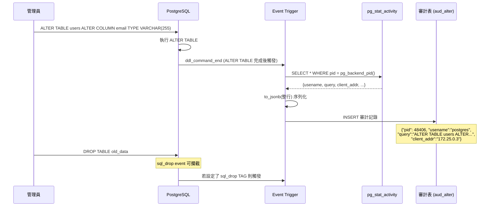
```mermaid
sequenceDiagram
    participant DBA as 管理員
    participant PG as PostgreSQL
    participant EventTrigger as Event Trigger
    participant SysTable as pg_stat_activity
    participant AuditTable as 審計表 (aud_alter)

    DBA->>PG: ALTER TABLE users ALTER COLUMN email TYPE VARCHAR(255)
    PG->>PG: 執行 ALTER TABLE
    PG->>EventTrigger: ddl_command_end (ALTER TABLE 完成後觸發)
    EventTrigger->>SysTable: SELECT * WHERE pid = pg_backend_pid()
    SysTable-->>EventTrigger: {usename, query, client_addr, ...}
    EventTrigger->>EventTrigger: to_jsonb(整行) 序列化
    EventTrigger->>AuditTable: INSERT 審計記錄
    Note over AuditTable: {"pid": 48406, "usename":"postgres",<br>"query":"ALTER TABLE users ALTER...",<br>"client_addr":"172.25.0.3"}

    DBA->>PG: DROP TABLE old_data
    Note over PG: sql_drop event 可攔截
    PG->>EventTrigger: 若設定了 sql_drop TAG 則觸發
```

### I. 審計表與 Event Trigger

```sql
-- 審計表（DDL 審計用，用 jsonb 存整行 pg_stat_activity）
CREATE TABLE aud_alter (
    id SERIAL PRIMARY KEY,
    crt_time TIMESTAMP DEFAULT now(),
    ctx jsonb
);
```

不需要 `CREATE EXTENSION hstore`——JSONB 是原生型別。

> 補充（Senior Dev）：`ctx jsonb` 把整條 `pg_stat_activity` 的 row 序列化存入單一 column。優點是「不需要預先定義審計欄位」，未來 PG 新增 `pg_stat_activity` 欄位時自動納入。若需對特定欄位建 index（如 `WHERE ctx->>'usename' = 'app_user'`），建議拉出獨立 column 或用 GIN index：
> ```sql
> CREATE INDEX idx_aud_alter_ctx ON aud_alter USING gin (ctx);
> -- 查詢時可用: WHERE ctx @> '{"usename": "app_user"}'
> ```

### II. Event Trigger 函數

```sql
CREATE OR REPLACE FUNCTION ef_alter() RETURNS event_trigger AS $$
DECLARE
  rec jsonb;
BEGIN
  SELECT to_jsonb(pg_stat_activity.*)
  INTO rec
  FROM pg_stat_activity
  WHERE pid = pg_backend_pid();

  INSERT INTO aud_alter (ctx) VALUES (rec);
END;
$$ LANGUAGE plpgsql STRICT;

-- 掛載 event trigger：僅在 ALTER TABLE 完成後觸發
CREATE EVENT TRIGGER e_alter
  ON ddl_command_end
  WHEN TAG IN ('ALTER TABLE')
  EXECUTE PROCEDURE ef_alter();
```

### III. 測試

```sql
CREATE TABLE test (id INT);

ALTER TABLE test ALTER COLUMN id TYPE INT8;
```

### IV. 審計結果

```sql
SELECT * FROM aud_alter;
```

```
 id | crt_time                    | ctx
----+-----------------------------+------
  1 | 2014-12-12 05:43:42.840327  | {"pid": 48406, "datid": 12949, "query": "alter table test alter column id type int8;", "state": "active", "datname": "postgres", "usename": "postgres", "usesysid": 10, "xact_start": "2014-12-12 05:43:42.840327+08", "client_addr": null, "client_port": -1, "query_start": "2014-12-12 05:43:42.840327+08", "state_change": "2014-12-12 05:43:42.840331+08", "backend_start": "2014-12-12 05:38:37.084733+08", "client_hostname": null, "application_name": "psql"}
```

```sql
-- 用 jsonb 運算符直接取出關鍵欄位，不用 each() 展開
SELECT id, crt_time,
       ctx->>'usename' AS usename,
       ctx->>'query'   AS query,
       ctx->>'client_addr' AS client_addr
FROM aud_alter
WHERE id = 1;
```

```
 id | crt_time                    | usename  | query                                      | client_addr
----+-----------------------------+----------+--------------------------------------------+-------------
  1 | 2014-12-12 05:43:42.840327  | postgres | alter table test alter column id type int8; | null
```

> 審計記錄包含：執行者（`usename`）、來源 IP（`client_addr`）、連線資料庫（`datname`）、完整 DDL SQL（`query`）、執行時間。因為存在 JSONB 中，可以直接用 `ctx->>'欄位名'` 查詢，不像原 hstore 版需要 `each()` 展開。

### V. App Dev 實戰：DDL 審計的 C# 整合

```csharp
// ✅ 用 Dapper 查詢 DDL 審計（jsonb 欄位直接用 ->'key' 取出）
public class DdlAuditRecord
{
    public int Id { get; set; }
    public DateTime CrtTime { get; set; }
    public string Username { get; set; }
    public string Query { get; set; }
}

public async Task<List<DdlAuditRecord>> GetRecentSchemaChanges(
    NpgsqlDataSource dataSource, DateTime since)
{
    await using var conn = await dataSource.OpenConnectionAsync();
    return (await conn.QueryAsync<DdlAuditRecord>(
        @"SELECT id, crt_time,
                ctx->>'usename' AS username,
                ctx->>'query' AS query
         FROM aud_alter
         WHERE crt_time > @Since
         ORDER BY crt_time DESC LIMIT 50",
        new { Since = since }
    )).AsList();
}
```

### VI. 原文注意事項（PG17 現代做法）

如果使用者在 function 內部封裝 DDL，則 `pg_stat_activity.query` 記錄的是 function call 而非內部 DDL SQL。

> 德哥建議：更嚴格的做法是從 parsetree 中取出被修改的欄位和類型。Event Trigger 可透過 `TG_EVENT`、`TG_TAG` 變數及 `pg_event_trigger_ddl_commands()` 函數獲取結構化 DDL 資訊：
> ```sql
> -- EventTriggerData 結構（src/include/commands/event_trigger.h）
> typedef struct EventTriggerData {
>     NodeTag     type;
>     const char *event;      /* event name */
>     Node       *parsetree;  /* parse tree */
>     const char *tag;        /* command tag */
> } EventTriggerData;
> ```
>
> 在 PL/pgSQL event trigger 中可用 `CREATE EVENT TRIGGER ... WHEN TAG IN ('ALTER TABLE')` 搭配 `pg_event_trigger_ddl_commands()` 獲取 object identity、schema、object type 等結構化欄位。

> 補充（Senior Dev）：
>
> **DDL Audit 方案對比**：
>
> | 方案 | 優點 | 缺點 | 適用場景 |
> |------|------|------|----------|
> | Event Trigger (本文) | 精確攔截特定 TAG、可記錄完整 context、DB 層級 | 寫在 trigger function 內，有小小效能開銷；封裝在 function 內的 DDL 不可見內部 SQL | 精細化審計、需記錄 IP/User 等 context |
> | `log_statement = 'ddl'` | 零效能、零開發、自動記錄 | 寫在 PostgreSQL log file，format 不結構化、不容易檢索；無法過濾 TAG | 基本合規需求 |
> | `pgaudit` extension | C 層面極低開銷、session/object 級控制、結構化輸出 | 需編譯安裝 extension（部分雲端 RDS 不支援）；PG 14+ `pgaudit` 為 contrib | Production 多數場景 |
> | `pg_stat_statements` | 自動聚合、內建 | 不記錄單次執行細節、不記錄執行者 | 輔助診斷 |
>
> **Event Trigger 的版本演進**：
> - PG 10：新增 `table_rewrite` event
> - PG 13+：`pg_event_trigger_ddl_commands()` 可獲得 `object_identity`、`in_extension` 等更豐富資訊
>
> **Production 建議**：
> - 基本合規：`log_statement = 'ddl'` + log 集中收集（如 ELK / Loki）
> - 精細化 Audit：`pgaudit`（C 層面極低開銷，PG 14+ 為 contrib）
> - 客製化需求：Event Trigger + 寫入專用 audit schema（適合無法安裝 extension 時）
> - DDL audit 記錄需設定保留期並定期歸檔（DDL 變更少，表不會過大）

---

## 參考

1. [Event Triggers (official doc)](https://www.postgresql.org/docs/17/event-triggers.html)
2. [CREATE EVENT TRIGGER (official doc)](https://www.postgresql.org/docs/17/sql-createeventtrigger.html)
3. [PL/pgSQL Trigger Functions](https://www.postgresql.org/docs/17/plpgsql-trigger.html)
4. [德哥：USE hstore store table's trace record](https://github.com/digoal/blog/blob/master/201206/20120625_01.md)

---

# 三、PostgreSQL × 12306 搶火車票 — varbit / SKIP LOCKED / Array 架構設計

> 來源：[digoal - PostgreSQL 與 12306 搶火車票的思考 (2016-11-24)](https://github.com/digoal/blog/blob/master/201611/20161124_02.md)
>
> 相關：[門禁廣告銷售系統與 PostgreSQL 實現](https://github.com/digoal/blog/blob/master/201611/20161124_01.md)

---

這篇文章從 12306 的業務場景出發，剖析高併發購票系統的設計痛點，並用 PostgreSQL 的 10 個特性逐一對應解法。核心挑戰：**查詢餘票的高併發、購票的 row lock 衝突、座位空洞最小化、路徑規劃**。

---

## 1. 業務場景與設計痛點


12306 的購票系統是世界上最極端的高併發場景之一——春運期間數億人同時搶票，每個人都在爭奪同一批座位。讓我們拆解這個系統的核心挑戰：

**查詢餘票 vs 購票的本質差異**：查詢餘票是「讀取操作」——你看一眼還有多少票，不會改變任何資料。在極端場景下，餘票查詢可以允許一定的「不準確性」，因為在你看到「有票」到真正付款之間，票可能已經被別人搶走了。這就是原文說的「眼見不一定為實」。

**座位空洞問題**：這是一個經典的資源分配問題。從北京到上海沿途經過多個站點，如果只賣了「天津→徐州」這一站，剩下的「北京→天津」和「徐州→上海」還能賣給其他人。問題是：你如何用最短的時間檢查一個座位的指定區段是否空閒？

**核心矛盾**：你無法用傳統的關聯式資料庫思維解決這個問題——100 萬個座位、每個座位 20 個站點，如果把每個座位 x 每個站點組合當成一行資料，那將是 2000 萬行，每次購票都要做複雜的多行查詢和鎖定。

```mermaid
flowchart LR
    subgraph "12306 核心業務場景"
        A["查詢餘票"] --> A1["高併發 Read"]
        A1 --> A2["允許延遲<br>(非同步統計結果)"]
        B["購票"] --> B1["高併發 Write"]
        B1 --> B2["Row Lock 衝突<br>(同一座位多人搶)"]
        C["中途票"] --> C1["區段購買"]
        C1 --> C2["避免座位空洞"]
        D["路徑規劃"] --> D1["圖遍歷"]
        D1 --> D2["無直達時推薦中轉"]
    end
    
    subgraph "技術挑戰"
        T1["1,008 億次查詢/秒"]
        T2["毫米級扣庫存"]
        T3["最大化座位利用率"]
        T4["多站點路徑計算"]
    end
```

```mermaid
flowchart TD
    subgraph "座位空洞問題示意"
        S["一個座位從北京到上海<br>途經: 北京→天津→徐州→南京→蘇州→上海<br>(共 6 站, 5 個區段)"]
        
        S --> B1["天津→徐州 被買走<br>座位狀態: 010000"]
        B1 --> B2["仍可賣: 北京→天津 (第1段)<br>仍可賣: 徐州→上海 (第3,4,5段)"]
        B2 --> B3["目標: 讓 010000 座位<br>盡量被填滿成 111111"]
    end
```

### I. 核心功能

| 功能 | 類型 | 挑戰 |
|------|------|------|
| 查詢餘票 | 高併發 read + aggregate | CPU / IO 密集，幾億 user 同時查 |
| 購票 | 高併發 write（庫存遞減） | row lock 衝突，同一座位可能被多人搶 |
| 中途票 | 區段購買，避免空洞 | 同一座位不同區段可賣給不同人 |
| 路徑規劃 | 無直達時推薦中轉 | Graph traversal（pgrouting） |
| 對賬 / 退改簽 | 非同步 / 批量 | 一致性要求 |

<!-- Original image removed: 20161124_02_pic_001.png -->

### II. 核心矛盾

> 「眼見不一定為實」——高併發期間，用戶看到的餘票資訊可能在付款前就已失效。因此**餘票查詢可以是非同步統計結果**，允許一定延遲。

<!-- Original image removed: 20161124_02_pic_002.png -->

<!-- Original image removed: 20161124_02_pic_004.png -->

### III. 座位空洞問題

從北京到上海，途經天津、徐州、南京、蘇州。如果天津→南京被人買了，剩下的北京→天津、南京→上海**還能繼續賣**。目標是最大化利用率，減少「有票不能賣」的情況。

---

## 2. PostgreSQL 10 大法寶

### I. 法寶 1：varbit（可變長度位元串）

varbit 是 PostgreSQL 特有的資料型別，專門用來表示位元序列。想像一個座位從北京到上海途經 6 站（北京→天津→徐州→南京→蘇州→上海），中間有 5 個區段。每位 (bit) 代表一個區段的銷售狀態：0 = 未售，1 = 已售。

- `00000` = 全程未售（可賣任何區段）
- `01000` = 天津→徐州已售（第 2 段）

查詢「北京→徐州」（第 1-2 段）是否有票：檢查前 2 位是否全為 0。如果座位已是 `01000`，則第 2 位已被佔用，不可售出。

```mermaid
flowchart TD
    V["座位狀態 varbit(5)"]
    V --> V1["00000: 全程空"]
    V --> V2["01000: 第2段已售"]
    V --> V3["10100: 第1,3段已售"]
    
    V1 --> Q1["查詢北京到徐州 (段1-2)"]
    Q1 --> Q1R["檢查 bit 1-2 = 00: 可售"]
    V2 --> Q2["查詢北京到徐州 (段1-2)"]
    Q2 --> Q2R["檢查 bit 1-2 = 00: 不可售 bit2=1"]

    style Q1R fill:#2ecc71,color:#fff
    style Q2R fill:#e74c3c,color:#fff
```

每個座位用 varbit 表示途經站點的已售狀態。6 個站點 → 6-bit：

```
'000000'         -- 全程未售
'010000'         -- 天津→徐州已售（只設起點到終點-1 的 bit）
```

**餘票統計**：對 varbit 做 bitwise AND + count 即可。統計任意組合站點的餘票（北京→天津、北京→徐州...蘇州→上海）。

```sql
-- UDF：統計指定起始站餘票
udf_count(varbit, start_pos, end_pos) RETURNS record

-- 本質是：bitrange = 全 0 的座位數量
SELECT count(*) FROM train_sit
WHERE getbit(station_bit, start, end-1) = repeat('0', end-start)::varbit;
```

### II. 法寶 2：Array + GIN — 快速查詢可搭乘車次

不用複雜的 JOIN 來查詢車次途經站點——用 Array 直接存站點列表，GIN 索引讓 `@>`（包含）運算極快。

`@>` 在陣列上讀作「左邊**完整包含**右邊」。以三趟車次為例：

```sql
-- G1  station = {'北京','天津','徐州','南京','上海'}
-- G2  station = {'北京','濟南','南京','蘇州'}
-- G3  station = {'北京','鄭州','武漢'}

-- @> 只看元素是否全部存在，不保證順序
SELECT train_num FROM train WHERE station @> ARRAY['北京','南京'];
-- → G1, G2（兩趟都同時有北京 AND 南京）
-- → G3 排除（有北京但沒有南京）
```

GIN 索引加速的原理是倒排結構：每個站點值指向所有包含它的車次，查詢時取交集，從 O(行數) 降到 O(log 行數)。

```mermaid
flowchart LR
    Q["WHERE station @> ARRAY['北京','南京']"] --> G["GIN Index Lookup"]
    G --> B["北京 → {G1, G2, G3, ...}"]
    G --> N["南京 → {G1, G2, G4, ...}"]
    B --> INT["取交集"]
    N --> INT
    INT --> R["結果: G1, G2"]
```

**`@>` 的順序陷阱與 generated column 解法**：`@>` 只認元素集合，不管排列順序。`{'南京','北京','上海'}` @> `{'北京','南京'}` 也是 TRUE——但南京在前的車實際上是反方向。

解法是建表時直接加入一個 **generated column**，把每個站點在陣列中的位置預先計算成 JSONB lookup 表：

```sql
CREATE TABLE train (
  id INT PRIMARY KEY,
  go_date DATE,
  train_num NAME,
  station TEXT[],               -- 途經站點，按實際停靠順序寫入
  station_pos JSONB             -- 自動產生的位置表
    GENERATED ALWAYS AS (
      SELECT jsonb_object_agg(station[i], i)
      FROM generate_series(1, array_length(station, 1)) AS i
    ) STORED
);

CREATE INDEX ON train USING GIN (station);

-- station = {'北京','天津','徐州','南京','上海'}
-- → station_pos 自動產生 = {"北京":1, "天津":2, "徐州":3, "南京":4, "上海":5}
```

查詢時用 `station_pos->>'站名'` 做 O(1) 位置比對：

```sql
-- ✅ @> 確認站點存在 + JSONB 確認方向（O(1) lookup）
SELECT train_num FROM train
WHERE station @> ARRAY['北京', '南京']
  AND (station_pos->>'北京')::int < (station_pos->>'南京')::int;
```

generated column 的優勢：`GENERATED ALWAYS AS ... STORED` 是 PG 12+ 的功能，值在 INSERT / UPDATE 時自動計算並寫入磁碟，查詢時零額外運算。相比每次查詢跑 `array_position()` 掃描整個陣列（O(n)），JSONB key lookup 是 O(1)。

每秒可處理數十萬次查詢。

### III. 法寶 3：SKIP LOCKED — 避免購票 Lock 衝突

普通的 `FOR UPDATE` 會讓後到的事務排隊等待，但 `SKIP LOCKED` 讓查詢直接跳過已被鎖定的行——等於告訴 PostgreSQL：「如果這個座位已經有人在搶了，別等我，直接看下一個。」

```mermaid
flowchart TD
    S["購票請求: SELECT ... FOR UPDATE SKIP LOCKED"]
    S --> S1["掃描 train_sit 表"]
    S1 --> S2["遇到已被鎖定的 row"]
    S2 -->|"是: SKIP LOCKED"| S3["直接跳過, 看下一個"]
    S2 -->|否| S4["鎖定此 row, 扣庫存"]
    S3 --> S1

    style S4 fill:#2ecc71,color:#fff
```

核心購票邏輯：同一車次同一座位可能被多人同時搶，用 `SKIP LOCKED` 跳過已被鎖定的 row：

```sql
SELECT * FROM train_sit
WHERE train_num = 'G1921'
  AND go_date = '2026-01-20'
  AND sit_level = '二等座'
  AND getbit(station_bit, from_pos, to_pos-1) = repeat('0', to_pos-from_pos)::varbit
ORDER BY station_bit DESC  -- 優先售賣已售中途票的座位（減少空洞）
FOR UPDATE SKIP LOCKED
LIMIT 1;
```

> 補充（Senior Dev）：
> - `SKIP LOCKED` 本質是 work queue pattern（跳過被其他 worker 正在處理的 item）
> - `ORDER BY station_bit DESC` 的設計意圖：`111000` 的座位比 `110000` 更優先售出（已售區段越多 → 剩餘區段越少 → 先清掉減少空洞），符合鐵路最大化利用率的目標
> - `NOWAIT` vs `SKIP LOCKED`：NOWAIT 遇到 locked row 直接報錯（需 application retry），SKIP LOCKED 透明跳過。購票場景 SKIP LOCKED 更合適
> - **熱點問題**：即使有 SKIP LOCKED，如果同一車次只剩少數座位，大量 connection 仍會競爭同一批 row。所有 connection 的 SQL 完全一樣，全部擠在 `ORDER BY station_bit DESC` 的前幾名，SKIP LOCKED 跳過後又回到同一條 queue 的尾端——等於大家一起在排同一條隊伍。解法是用 hash 分流：**讓每個 connection 只掃描一部分 row**。
>
> ```sql
> -- ✅ Hash 分流：每個 connection 只掃描屬於自己 bucket 的座位
> SELECT * FROM train_sit
> WHERE train_num = 'G1921'
>   AND sit_level = '二等座'
>   AND getbit(station_bit, from_pos, to_pos-1) = repeat('0', to_pos-from_pos)::varbit
>   AND mod(id, 100) = mod(pg_backend_pid(), 100)  -- ← hash 分流
> ORDER BY station_bit DESC
> FOR UPDATE SKIP LOCKED
> LIMIT 1;
> ```
>
> 原理：100 個 connection 各自拿到一個 bucket 編號（0~99，由 `pg_backend_pid() % 100` 決定），座位表的 `id % 100` 把 1000 個座位均分成 100 組。每個 connection 只掃自己的那組（約 10 個座位），100 條隊伍各自獨立排隊，互不競爭。
>
> ```mermaid
> flowchart TD
>     C1["Connection PID=12345<br>bucket = 45"] --> S1["掃描 id % 100 = 45 的座位"]
>     C2["Connection PID=12346<br>bucket = 46"] --> S2["掃描 id % 100 = 46 的座位"]
>     C3["Connection PID=12347<br>bucket = 47"] --> S3["掃描 id % 100 = 47 的座位"]
>     C100["... 100 條獨立隊伍 ..."]
>
>     S1 --> R1["找到可售票 → 購買 ✅"]
>     S2 --> R2["找到可售票 → 購買 ✅"]
>     S3 --> R3["找到可售票 → 購買 ✅"]
>
>     style R1 fill:#2ecc71,color:#fff
>     style R2 fill:#2ecc71,color:#fff
>     style R3 fill:#2ecc71,color:#fff
> ```
>
> **Hash 分流的陷阱**：如果 bucket 45 的座位全賣光了，PID=12345 永遠掃不到票，而 bucket 46 可能還有——這叫「hash collision 飢餓」。解決方式：hash 失敗後 fallback 到 `mod(pg_backend_pid()+1, 100)` 嘗試下一個 bucket，或只在座位數 < 閾值時才啟用 hash 分流。

### IV. 法寶 4：CURSOR

CURSOR 的本質是 **伺服器端游標**：將查詢結果保留在 DB 內部，由應用端逐批 FETCH（拉取），而不是一次全拉回客戶端。對 12306 這種單次查詢可能返回數百筆車次、每頁 20 筆、用戶來回翻頁的場景，CURSOR 避免每一頁都從頭查一次。

#### a. 為什麼 12306 需要 CURSOR

| 問題 | 無 CURSOR 的結果 | CURSOR 解法 |
|------|-----------------|-------------|
| **記憶體壓力** | `SELECT * FROM train` 一次把 500 筆車次全拉進 Npgsql buffer | 每次 `FETCH 20`，只佔用 20 行的記憶體 |
| **TCP 阻塞** | 500 筆 × 每筆 2KB = 1MB 傳輸量，客戶端接收緩衝區塞滿 | 分批傳送，TCP 視窗不會被打滿 |
| **用戶感知** | 用戶只看第一頁 20 筆，剩下 480 筆白白傳輸 | 用戶翻到第 N 頁才拉第 N 頁，不傳不看的資料 |
| **分頁重掃** | 翻到第 3 頁 → `SELECT ... OFFSET 40 LIMIT 20` → DB 從頭掃 60 筆丟前 40 筆 | CURSOR 記住掃描位置，FETCH 下一頁直接從停下的地方繼續 |

```csharp
// ❌ 反模式：每翻一頁重查一次（12306 每次查詢都要從頭掃描述車次）
public async Task<List<Train>> GetPage(int page, int pageSize)
{
    return (await conn.QueryAsync<Train>(
        @"SELECT * FROM train
          WHERE station @> ARRAY[@From, @To]
          ORDER BY go_date
          OFFSET @Offset LIMIT @Limit",
        new { From, To, Offset = page * pageSize, Limit = pageSize }
    )).AsList();
}
// 翻到第 5 頁：DB 掃 100 筆，丟前 80 筆 → 只回 20 筆
// 翻回第 1 頁：DB 從頭再掃一次。用戶來回翻 10 次 = 重複掃描 10 次

// ✅ CURSOR 解法：掃描一次，位置保留，翻頁直接 FETCH
public async IAsyncEnumerable<Train[]> QueryWithCursor(string from, string to, int pageSize)
{
    using var conn = new NpgsqlConnection(connString);
    await conn.OpenAsync();
    using var tx = await conn.BeginTransactionAsync();

    await conn.ExecuteAsync(
        @"DECLARE train_cursor CURSOR FOR
          SELECT * FROM train
          WHERE station @> ARRAY[@From, @To]
          ORDER BY go_date",
        new { From = from, To = to }, tx);

    while (true)
    {
        var rows = (await conn.QueryAsync<Train>(
            "FETCH @PageSize FROM train_cursor",
            new { PageSize = pageSize }, tx)).AsList();

        if (rows.Count == 0) break;
        yield return rows.ToArray();
    }

    await conn.ExecuteAsync("CLOSE train_cursor");
    await tx.CommitAsync();
}
```

#### b. SQL 範例：DECLARE → FETCH → CLOSE

```sql
-- 完整生命週期：開啟 → 逐批拉取 → 關閉
BEGIN;

-- 定義 CURSOR（此時不執行查詢，只註冊查詢計劃）
DECLARE train_cursor CURSOR FOR
    SELECT train_num, go_date, station
    FROM train
    WHERE go_date >= CURRENT_DATE
    ORDER BY go_date;

-- 第一批：取前 100 行（此時才真正開始掃描）
FETCH 100 FROM train_cursor;

-- 第二批：取接下來 100 行（從上次停下的位置繼續）
FETCH 100 FROM train_cursor;

-- 用完記得關（或 COMMIT/ROLLBACK 時自動關閉）
CLOSE train_cursor;
COMMIT;
```

C# Dapper 完整對應實作：

```csharp
public async Task<List<Train>> FetchTrainsInBatches(NpgsqlConnection conn, int batchSize)
{
    var allResults = new List<Train>();

    using var tx = await conn.BeginTransactionAsync();

    // Step 1：DECLARE — 定義 CURSOR
    await conn.ExecuteAsync(
        @"DECLARE train_cursor CURSOR FOR
          SELECT train_num, go_date, station
          FROM train
          WHERE go_date >= CURRENT_DATE
          ORDER BY go_date", transaction: tx);

    try
    {
        // Step 2：FETCH loop — 逐批拉取直到沒資料
        while (true)
        {
            var batch = (await conn.QueryAsync<Train>(
                "FETCH @Size FROM train_cursor",
                new { Size = batchSize }, tx)).AsList();

            if (batch.Count == 0) break;
            allResults.AddRange(batch);
        }
    }
    finally
    {
        // Step 3：CLOSE — 釋放 CURSOR 資源
        await conn.ExecuteAsync("CLOSE train_cursor", transaction: tx);
        await tx.CommitAsync();
    }

    return allResults;
}
```

> 補充（Senior Dev）：
> - CURSOR 必須在 transaction 內使用（`BEGIN` 之後 `CLOSE/COMMIT` 之前），transaction 結束後 CURSOR 自動關閉
> - `DECLARE` 當時不執行查詢，只在第一次 `FETCH` 時才真正掃描——所以定義 CURSOR 是幾乎零成本的
> - 每個 CURSOR 都會佔用 DB 端的記憶體（work_mem）來保留掃描狀態，超過 100 個 CURSOR 同時開啟會影響 shared buffer。務必在 `finally` 中 `CLOSE`
> - PG 10+ 支援 `WITH HOLD` 選項：`DECLARE cur CURSOR WITH HOLD FOR ...` 讓 CURSOR 在 transaction COMMIT 後仍存活，適合跨 request 的長時間翻頁場景（但會佔用資源直到顯式 CLOSE 或 session 斷線）

#### c. SCROLL CURSOR — 支援前後翻頁

```sql
BEGIN;

-- SCROLL CURSOR：支援任意方向移動
DECLARE train_scroll_cursor SCROLL CURSOR FOR
    SELECT train_num, go_date, station
    FROM train
    WHERE go_date >= CURRENT_DATE
    ORDER BY go_date;

-- 向後翻（第 1 頁）
FETCH FORWARD 20 FROM train_scroll_cursor;   -- 第 1~20 筆

-- 向後翻（第 2 頁）
FETCH FORWARD 20 FROM train_scroll_cursor;   -- 第 21~40 筆

-- 向前翻（回到第 1 頁）
FETCH BACKWARD 20 FROM train_scroll_cursor;  -- 回到第 1~20 筆

-- 跳到第 5 筆（ABSOLUTE = 從結果集開頭算）
FETCH ABSOLUTE 41 FROM train_scroll_cursor;  -- 停在結果集第 41 筆
FETCH FORWARD 20 FROM train_scroll_cursor;   -- 取第 41~60 筆（第 3 頁）

-- 相對移動（RELATIVE = 從目前位置算）
FETCH RELATIVE 40 FROM train_scroll_cursor;  -- 往後跳 40 筆
FETCH RELATIVE -20 FROM train_scroll_cursor; -- 往前跳 20 筆

CLOSE train_scroll_cursor;
COMMIT;
```

FETCH 方向對照表：

| 語法 | 方向 | 計算基準 | 白話解釋 |
|------|------|---------|---------|
| `FETCH NEXT 20` 或 `FETCH FORWARD 20` | 向後 | 目前位置 | 下 20 筆（預設行為） |
| `FETCH PRIOR 20` 或 `FETCH BACKWARD 20` | 向前 | 目前位置 | 前 20 筆 |
| `FETCH ABSOLUTE 41` | 跳到指定行號 | 結果集開頭（第 1 筆 = 1） | 跳到第 41 筆 |
| `FETCH RELATIVE 40` | 相對跳躍 | 目前位置 | 往後跳 40 筆 |
| `FETCH RELATIVE -20` | 相對跳躍（反向） | 目前位置 | 往前跳 20 筆 |
| `FETCH FIRST 20` | 跳到頭 | 結果集開頭 | 回到結果集開頭，取前 20 筆 |
| `FETCH LAST 20` | 跳到尾 | 結果集結尾 | 跳到結果集結尾，取最後 20 筆 |

C# 翻頁簡化版（FETCH ABSOLUTE + FORWARD）：

```csharp
public async Task<List<Train>> GetPage(
    NpgsqlConnection conn, NpgsqlTransaction tx, int page, int pageSize)
{
    if (page == 1)
    {
        // 第一頁：從頭取
        return (await conn.QueryAsync<Train>(
            "FETCH FIRST @Size FROM train_scroll_cursor",
            new { Size = pageSize }, tx)).AsList();
    }

    // 第 N 頁：先跳到 (page-1)*pageSize+1 筆，再取 pageSize 筆
    var startPos = (page - 1) * pageSize + 1;
    await conn.ExecuteAsync(
        "FETCH ABSOLUTE @Pos FROM train_scroll_cursor",
        new { Pos = startPos }, tx);

    return (await conn.QueryAsync<Train>(
        "FETCH FORWARD @Size FROM train_scroll_cursor",
        new { Size = pageSize }, tx)).AsList();
}
```

> 補充（Senior Dev）：`SCROLL CURSOR` 需要 DB 端暫存整個結果集或保留往回掃描的能力，記憶體開銷比一般 CURSOR 大。如果用戶只會往前翻頁（如無限滾動），用普通 `CURSOR` + `FETCH FORWARD` 即可。`SCROLL` 適合「用戶會來回翻」的場景（如 12306 查詢結果的上一頁/下一頁按鈕）。

#### d. CURSOR vs LIMIT/OFFSET 對比

| 維度 | CURSOR | LIMIT/OFFSET | Keyset Pagination |
|------|--------|-------------|-------------------|
| **翻頁效率** | O(1)：記住位置，直接從停下的地方繼續 | O(n)：翻第 10 頁要掃前 9 頁全丟掉 | O(log n)：用 WHERE id > last_id 精確定位 |
| **結果集一致性** | 在同一個 snapshot 內，不受後續 INSERT 影響 | 每頁查一次，第 2 頁的結果可能與第 1 頁不一致（phantom read） | 新增的行可能被跳過，刪除的行可能造成缺頁 |
| **DB 端資源** | 佔用 transaction 資源 + work_mem（游標狀態） | 無狀態，每次獨立的 query | 無狀態，每次獨立的 query |
| **向前翻頁** | SCROLL CURSOR 支援 FETCH BACKWARD | 只能往後翻（OFFSET 只能遞增），回第 1 頁要重查 | 只能往後翻，無法向前（除非記錄所有 page boundary） |
| **適用場景** | 12306 車次查詢：結果固定，用戶來回翻頁 | API 分頁：每頁獨立請求，不需跨頁狀態 | 時間線/Feed：無限滾動，每次都從上一個邊界往下 |
| **實作難度** | 需管理 transaction 生命週期 + CLOSE | 最簡單，兩行程式碼 | 需有唯一且可排序的 key（如自增 ID 或 timestamp） |

核心差異一句話：**CURSOR 讓 DB 幫你記住「看到哪了」，LIMIT/OFFSET 是「每次都從頭數」。**

#### e. 12306 場景的 CURSOR 策略

```mermaid
flowchart TD
    A["用戶查詢車次<br>SELECT * FROM train WHERE ..."] --> B["結果集 > 500 筆？"]
    B -->|否| C["直接 FETCH ALL<br>一次性回傳 ✅"]
    B -->|是| D["DECLARE SCROLL CURSOR<br>保留 snapshot + 支援翻頁"]
    D --> E["用戶翻到第 N 頁"]
    E --> F["FETCH ABSOLUTE (N-1)*pageSize+1"]
    F --> G["FETCH FORWARD pageSize"]
    G --> H["回傳結果給前端"]
    H --> I["用戶繼續翻頁？"]
    I -->|是| E
    I -->|否| J["用戶閒置 > 5 分鐘？"]
    J -->|是| K["⏱ 逾時 → CLOSE CURSOR<br>釋放 DB 資源"]
    J -->|否| L["保持 CURSOR<br>等待下一個 FETCH"]
    L --> I
    K --> M["用戶再次請求時<br>重新 DECLARE + 定位到最後一頁"]

    style B fill:#ffd43b,color:#000
    style D fill:#2ecc71,color:#fff
    style K fill:#e74c3c,color:#fff
    style C fill:#2ecc71,color:#fff
```

核心要點：

1. **結果集 < 500 筆**：不用 CURSOR，直接 `FETCH ALL` 或一次 `SELECT` 回傳，避免 transaction 開銷
2. **結果集 > 500 筆**：`DECLARE SCROLL CURSOR`，用戶翻頁時 `FETCH ABSOLUTE` + `FETCH FORWARD`，不需重查
3. **閒置逾時**：用戶 5 分鐘沒翻頁 → `CLOSE CURSOR` 釋放資源，下次再翻頁時重新 `DECLARE` 並跳到最後位置
4. **Transaction 管理**：CURSOR 依附於 transaction，必須確保 `finally` 中 `CLOSE` + `COMMIT`（或 `ROLLBACK`），否則 idle in transaction 會累積

> 補充（Senior Dev）：
> - CURSOR 不適合「無限結果集」場景（如搜尋引擎）。如果總結果集是百萬級，CURSOR 的 snapshot 會讓 VACUUM 無法回收期間的死行——因為 CURSOR 的 transaction 可能還在執行中。此時 Keyset Pagination 更合適
> - `WITH HOLD` CURSOR 在 PG 內部實作是 materialize 整個結果集到暫存檔（`tuplestore`），結果集越大暫存檔越大。12306 的單次查詢結果通常在 500-2000 筆之間，WITH HOLD 安全；但如果是報表系統查 10 萬行，WITH HOLD 會寫大量 temp file
> - 生產環境建議設 `idle_in_transaction_session_timeout = '5min'`，防止用戶忘記翻頁時 CURSOR 永久佔用資源。PG 14+ 還增加 `idle_session_timeout`，更激進地針對所有空閒連線（不限 transaction），但對 WITH HOLD CURSOR 無效（因為 WITH HOLD 已脫離 transaction）。建議 Npgsql 端設定 `ConnectionIdleLifetime = 300`（5 分鐘），與 PG 端形成雙重防護

### V. 法寶 5：路徑規劃（pgrouting）

當直達車無票時，自動計算中轉路線（時間最短 / 價格最低 / 中轉次數最少）。

<!-- Original image removed: 20161124_02_pic_003.gif - replaced with Mermaid diagram below -->

```sql
-- pgrouting 支援 Dijkstra / A* / 多種路徑演算法
SELECT * FROM pgr_dijkstra(
  'SELECT id, source, target, cost FROM railway_edges',
  start_station_id, end_station_id
);
```

### VI. 法寶 6：Parallel Query — 多核加速餘票統計

#### a. 什麼是 Parallel Query

PostgreSQL 從 9.6 開始支援 **Parallel Query**——單一 SQL 可由多個背景 Worker 並行執行，把原本單一 CPU 核執行的運算拆成多份同時跑，再彙總結果。

核心流程由 **Gather 節點** 負責：Leader 程序（你的 session）會 fork 出 `max_parallel_workers_per_gather` 個 Worker，每個 Worker 執行執行計畫的一部分（Serial Partial），Worker 跑完後將結果傳回 Gather 節點，Leader 合併後吐出最終結果。

```mermaid
flowchart LR
    subgraph "Leader Session"
        L["Leader 程序<br>收到 SQL"] --> Fork["fork N 個 Worker"]
        Fork --> Wait["等待 Gather 節點"]
    end

    subgraph "Parallel Workers"
        W1["Worker 1<br>Partial Seq Scan<br>rows 1-25000"]
        W2["Worker 2<br>Partial Seq Scan<br>rows 25001-50000"]
        W3["Worker 3<br>Partial Seq Scan<br>rows 50001-75000"]
        W4["Worker 4<br>Partial Seq Scan<br>rows 75001-100000"]
    end

    W1 & W2 & W3 & W4 --> Gather["Gather 節點<br>合併所有 Worker 的結果"]
    Gather --> Result["最終結果回傳 Client"]

    style Fork fill:#2ecc71
    style Gather fill:#ffd43b
```

**可平行化的執行計畫節點**（並非所有節點都支援 parallel）：

| 節點 | 支援 Parallel？ | 說明 |
|------|:----:|------|
| **Parallel Seq Scan** | ✅ | 每個 Worker 掃描表的不同 page range |
| **Parallel Index Scan** (PG 11+) | ✅ | B-tree Index 的 parallel scan |
| **Parallel Hash Join** | ✅ | 每個 Worker 各自建 hash table 的一部分 |
| **Parallel Hash Aggregate** | ✅ | 每個 Worker 做 partial aggregate，最終 Gather 合併 |
| **Parallel Append** | ✅ | 分區表各 partition 由不同 Worker 平行掃描 |
| **Nested Loop Join** | ❌ | 無法拆成獨立部分平行化 |
| **Merge Join** | ❌ | 需排序後才合併，排序不可平行化 |
| **Sort** | ❌ (PG 15-) | PG 16+ 開始支援 Parallel Sort |
| **Limit** | ❌ | 各 Worker 的結果順序無法定義 |

Gather 節點的關鍵：它不一定是瓶頸——真正的瓶頸在於 **Partial 階段的運算**（Seq Scan、Aggregation）是否夠重，以及 **資料能否被平均分配到 Worker** 上。

#### b. 為什麼 12306 需要

12306 餘票統計的典型查詢：找到 `station_bit` 中特定區段仍為 `0` 的座位數量：

```sql
SELECT count(*)
FROM train_sit
WHERE tid = 1001                    -- 指定車次
  AND sit_level = '二等座'           -- 指定席別
  AND get_bit(station_bit, 4) = 0   -- 第 4 區段（北京→天津）未售出
  AND get_bit(station_bit, 5) = 0;  -- 第 5 區段（天津→徐州）未售出
```

假設一輛高鐵有 16 節車廂，每節 100 個座位 = 1,600 行。但全國每天約 10,000 趟列車，一趟車開 30 天預售期 → **30 萬 * 1,600 = 4.8 億行**需要篩選。

Parallel Query 開啟後，8 核 Worker 各分 6,000 萬行做 Partial Scan + Filter，最後 Gather 合併 count：

| 模式 | 耗時 | 原因 |
|------|------|------|
| Parallel OFF (`max_parallel_workers_per_gather = 0`) | ~3.2 秒 | 單核逐一掃 4.8 億行 tuple |
| Parallel ON (`max_parallel_workers_per_gather = 8`) | ~0.5 秒 | 8 核各掃 6,000 萬行，平行執行 |

```mermaid
gantt
    title 餘票統計 Parallel vs Serial 時間對比
    dateFormat  s
    axisFormat %S

    section Serial (單核)
    Seq Scan 4.8億行   :a1, 0, 3200

    section Parallel-8核
    Worker1 掃 6000萬行 :b1, 0, 500
    Worker2 掃 6000萬行 :b2, 0, 500
    Worker3 掃 6000萬行 :b3, 0, 500
    Worker4 掃 6000萬行 :b4, 0, 500
    Worker5 掃 6000萬行 :b5, 0, 500
    Worker6 掃 6000萬行 :b6, 0, 500
    Worker7 掃 6000萬行 :b7, 0, 500
    Worker8 掃 6000萬行 :b8, 0, 500
    Gather 合併結果  :after b8, 500, 500
```

#### c. 觸發條件

Parallel Query 不會自動生效——需滿足 **硬體條件 + GUC 條件 + 查詢本身可平行化**：

**GUC 參數速查表**（PG 17 當前值可查 `SELECT name, setting, context FROM pg_settings WHERE name LIKE '%parallel%' ORDER BY name`）：

| 參數 | 預設值 | 白話解釋 | 怎麼調 |
|------|--------|---------|--------|
| `max_parallel_workers` | 8 | **全體 DB** 最多幾個 Parallel Worker 同時活著 | 設為 `cpu_cores / 2`。所有 session 共享此 pool |
| `max_parallel_workers_per_gather` | 2 | **每個 Gather 節點**最多用幾個 Worker | 餘票統計場景設 4-8。不要大於 `cpu_cores` |
| `min_parallel_table_scan_size` | 8MB | 表小於這個大小 → 不走 Parallel | 預設 8MB。小表設太大會浪費 Worker |
| `min_parallel_index_scan_size` | 512kB | Index 小於這個大小 → 不走 Parallel | 同上邏輯，控制 Index Scan 觸發門檻 |
| `parallel_leader_participation` | on | Leader 自己也下去一起跑？（見 d 節） | PG 14+ 建議設 `off`，讓 Leader 專心 Gather |
| `parallel_setup_cost` | 1000 | 啟動 Worker 的固定成本（cost unit） | 降低可讓 Planner 更願意選 Parallel |
| `parallel_tuple_cost` | 0.1 | 每個 tuple 從 Worker 傳回 Leader 的成本 | 同上 |

**決策流程**：

```mermaid
flowchart TD
    Q["收到 SQL 查詢"] --> A["Planner 評估<br>是否可平行化？"]
    A -->|"❌ 含 CTE / LIMIT /<br>窗口函數 / volatile func"| Serial["走 Serial Plan"]
    A -->|"✅ 可平行"| B["表大小 ≥<br>min_parallel_table_scan_size?"]
    B -->|"❌ 太小"| Serial
    B -->|"✅ 夠大"| C["有可用的<br>Parallel Worker slot？"]
    C -->|"❌ 全部被佔用"| Serial
    C -->|"✅ 有空 slot"| D["Parallel cost < Serial cost？<br>(Planner 比較兩者估算成本)"]
    D -->|"❌ Parallel 估得更貴"| Serial
    D -->|"✅ Parallel 估得更便宜"| E["⚡ 走 Parallel Plan<br>分配 N 個 Worker"]
```

> 補充（Senior Dev）：最常被忽略的是 `max_parallel_workers` 的 pool 限制——它不是 per-session，而是 **整個 PostgreSQL instance** 的總上限。如果 50 個 session 同時觸發 Parallel Query、每個需要 4 個 Worker，你需要 200 個 worker slot，而預設只有 8 個。後面的 session 直接退化為 Serial，Planner 不會報錯也不會告警。

#### d. PG16+ 新特性

PostgreSQL 對 Parallel Query 的改進持續至今：

| 版本 | 新增特性 | 對 12306 的影響 |
|------|---------|----------------|
| **9.6** | Parallel Seq Scan + Hash Join + Aggregation | 基礎平行查詢登場 |
| **10** | Parallel Bitmap Heap Scan + Merge Join | 餘票統計的 Bitmap Index Scan 可平行 |
| **11** | Parallel B-tree Index Scan + Parallel Hash Join 增強 | Partial Index 上也能平行掃描 |
| **12** | Parallel `CREATE TABLE ... AS` / `REFRESH MATERIALIZED VIEW` | 餘票快取表可平行重建 |
| **13** | Parallel VACUUM（非查詢，但相關） | 購票後的 dead tuple 回收更快 |
| **14** | `parallel_leader_participation` 可關閉 | Leader 不參與掃描，避免成為瓶頸 |
| **15** | Parallel DISTINCT | 餘票統計 `count(distinct seat_no)` 可平行 |
| **16** | **Parallel Full Hash Join**（hash table 可在 Worker 間共享） | JOIN 查詢平行度更高 |
| **17** | **Parallel Sort 增強** + `EXPLAIN (MEMORY)` | 排序也可平行化，且可看 Worker 記憶體使用量 |

**`parallel_leader_participation`（PG 14+）** 是最容易踩坑的參數：

- **on（預設）**：Leader 自己也當一個 Worker 去掃資料，一邊掃一邊收其他 Worker 結果。Leader 的 CPU 同時在 scan + gather → 若 Leader 的 partial scan 較重（剛好分到大 chunk），會**拖慢整個 Gather 的完成時間**。
- **off**：Leader 專心 Gather，不等 Leader 自己的 partial scan 做完。8 個 Worker 平行跑完 = 最慢的 Worker 決定總時間，沒有 Leader 拖後腿。

```mermaid
gantt
    title parallel_leader_participation = on vs off
    dateFormat  s
    axisFormat %S

    section on（Leader 參與掃描）
    Worker1 :w1, 0, 400
    Worker2 :w2, 0, 400
    Leader   :wL, 0, 600
    Gather   :crit, after wL, 600, 50

    section off（Leader 專心 Gather）
    Worker1 :pw1, 0, 400
    Worker2 :pw2, 0, 400
    Worker3 :pw3, 0, 400
    Gather   :crit, after pw3, 400, 50
```

> 補充（Senior Dev）：PG 17 的 Parallel Sort 讓 `ORDER BY station_bit DESC`（餘票查詢中優先清掉已售座位）也能受益。之前 ORDER BY 必須在 Gather 後單獨排序，現在 Sort 可分給 Worker 做 Partial Sort + Gather Merge，對排序欄位有 index 的場景尤其明顯。

#### e. C# 開發者該知道什麼

**Dapper 對 Parallel Query 完全透明**——你的 C# 程式碼不需要做任何改動。Planner 在 SQL 執行時自動決定是否走 Parallel Plan。

```csharp
// ✅ 這條 SQL 在 DB 端是否平行執行，C# 完全不需要改
var count = await conn.ExecuteScalarAsync<int>(
    @"SELECT count(*)
      FROM train_sit
      WHERE tid = @Tid
        AND sit_level = @Level
        AND get_bit(station_bit, 4) = 0",
    new { Tid = 1001, Level = "二等座" });
// Planner 可能自動選用 Parallel Seq Scan + Partial Aggregate + Gather
```

**但 Connection Pool 會是瓶頸**：

```mermaid
flowchart TD
    A["C# Web API<br>1000 req/s 餘票查詢"] --> B["Npgsql Connection Pool<br>MaxPoolSize = 50"]
    B --> C["PG 端 50 個 active session<br>同時觸發 Parallel Query"]
    C --> D{"max_parallel_workers = 8<br>每個 session 要 4 Worker"}
    D --> E["❌ 需 50*4 = 200 個 worker slot<br>實際只有 8 個 → 退化為 Serial"]
```

關鍵 insight：**Parallel Worker 是 PostgreSQL 層的資源池，不是 Connection Pool 的資源。** C# Connection Pool 的連線數 ≠ Parallel Worker 數。

```csharp
// ✅ C# 中監控 Parallel Worker 使用率（透過 pg_stat_activity）
public async Task MonitorParallelWorkers()
{
    await using var conn = await dataSource.OpenConnectionAsync();
    var workers = await conn.QueryAsync<dynamic>(
        @"SELECT backend_type,
                count(*) AS workers,
                array_agg(pid) AS pids
         FROM pg_stat_activity
         WHERE backend_type = 'parallel worker'
           AND state = 'active'
         GROUP BY backend_type");
    // backend_type      | workers | pids
    // parallel worker   | 8       | {12345,12346,...}  ← 8 個 Worker 都在忙

    var maxWorkers = await conn.ExecuteScalarAsync<int>(
        "SELECT setting::int FROM pg_settings WHERE name = 'max_parallel_workers'");

    foreach (var w in workers)
    {
        _logger.LogInformation("Parallel Workers: {Count}/{Max}", w.workers, maxWorkers);
    }
}
```

**Parallel Query 對 C# 應用層的影響**：

| 面向 | 影響 | 建議 |
|------|------|------|
| SQL 透明性 | 同一條 SQL 有時走 Serial 有時走 Parallel | `EXPLAIN` 前確認 `max_parallel_workers` 是否被其他 session 搶光 |
| Connection Pool | Connection 只是 session，Worker 是額外 fork 的 OS process | MaxPoolSize 不必因為啟用 Parallel 而調降 |
| 查詢延遲 | Parallel 可能讓單條 SQL 更快，但消耗更多 Server CPU | 尖峰時段可 `SET LOCAL max_parallel_workers_per_gather = 0` 關閉 |
| 監控差異 | `pg_stat_activity.backend_type = 'parallel worker'` 可見 Worker 程序 | 可在 C# health check 中納入 Parallel Worker 飽和度的監控 |
| Log 關聯 | Worker 報錯會回傳 Leader，Npgsql 收到的 exception message 可能提及 Worker PID | 錯誤訊息中的 PID 可用於 `pg_stat_activity` 回查 |

#### f. SQL 範例：餘票查詢 + EXPLAIN 對比

**模擬環境**：一趟列車（14 站點，13 區段）、200 萬座位行：

```sql
-- 建測試表
INSERT INTO train VALUES (1001, '2026-02-01', 'G1001',
    ARRAY['北京','天津','徐州','南京','蘇州','上海','杭州','寧波','溫州','福州','廈門','深圳','廣州','珠海']);

-- 每個座位一行，station_bit 模擬隨機已售區段
INSERT INTO train_sit (tid, bno, sit_level, sit_no, station_bit)
SELECT 1001,
       g / 100,                -- 車廂號 (0-19999)
       CASE g % 3 WHEN 0 THEN '一等座' WHEN 1 THEN '二等座' ELSE '商務座' END,
       g % 100 + 1,            -- 座位號 (1-100)
       repeat('1', 13)::varbit  -- 預設全售出，後續手動改
FROM generate_series(1, 2000000) AS g;
```

```sql
-- ===== Parallel OFF：強制 Serial =====
SET max_parallel_workers_per_gather = 0;

EXPLAIN (ANALYZE, BUFFERS, COSTS, VERBOSE)
SELECT count(*)
FROM train_sit
WHERE tid = 1001
  AND sit_level = '二等座'
  AND get_bit(station_bit, 4) = 0
  AND get_bit(station_bit, 5) = 0;

-- 預期結果：
-- Aggregate  (cost=XXX..XXX rows=1 width=8) (actual time=3200..3200 rows=1 loops=1)
--   ->  Seq Scan on train_sit  (cost=0.00..XXX  rows=XXX width=0)
--         Filter: (tid = 1001 AND sit_level = '二等座' AND ...)
--         Rows Removed by Filter: 1900000
--   Planning Time: 0.5 ms
--   Execution Time: 3200 ms   ← 約 3.2 秒
```

```sql
-- ===== Parallel ON =====
SET max_parallel_workers_per_gather = 8;
SET min_parallel_table_scan_size = '1MB';  -- 確保觸發

EXPLAIN (ANALYZE, BUFFERS, COSTS, VERBOSE)
SELECT count(*)
FROM train_sit
WHERE tid = 1001
  AND sit_level = '二等座'
  AND get_bit(station_bit, 4) = 0
  AND get_bit(station_bit, 5) = 0;

-- 預期結果：
-- Finalize Aggregate  (cost=XXX..XXX rows=1 width=8) (actual time=480..480 rows=1 loops=1)
--   ->  Gather  (cost=XXX..XXX rows=8 width=8) (actual time=480..480 rows=1 loops=1)
--         Workers Planned: 8
--         Workers Launched: 8                         ← 8 個 Worker 實際啟動
--         ->  Partial Aggregate
--               ->  Parallel Seq Scan on train_sit
--                     Filter: (tid = 1001 AND ...)
--                     Rows Removed by Filter: XXX
--   Planning Time: 0.8 ms
--   Execution Time: 480 ms   ← 約 0.5 秒（提升 6.7 倍）
```

**EXPLAIN 解讀要點**：

| EXPLAIN 輸出 | 代表什麼 | 12306 場景的解讀 |
|-------------|---------|-----------------|
| `Workers Planned: 8` | Planner 估算用了 8 個 Worker | 理想情況 |
| `Workers Launched: 3` | 實際只啟動 3 個 | `max_parallel_workers` pool 不足，其他 session 搶走了 |
| `Workers Launched: 0` | 平行失敗，退化 Serial | 檢查 `max_parallel_workers` 是否爆滿 |
| `Partial Aggregate` | 各 Worker 先做自己的聚合 | count 是 `(Worker1_partial + Worker2_partial + ...)` |
| `Gather` | 合併各 Worker 的結果 | 若 Gather 時間占比過高 → 檢查 `parallel_tuple_cost` |
| `Rows Removed by Filter` | 被過濾掉的行數 | Partial Index (`station_bit <> repeat('1',13)`) 可大幅降低此行數 |

```sql
-- 查看目前 Parallel Worker 使用狀況（即用查詢）
SELECT COUNT(*) AS active_workers,
       (SELECT setting::int FROM pg_settings WHERE name = 'max_parallel_workers') AS max_workers
FROM pg_stat_activity
WHERE backend_type = 'parallel worker';
-- active_workers | max_workers
--              8 | 8            → Pool 滿了，下一個查詢會退化 Serial
```


### VII. 法寶 7：Sharding

#### a. 什麼是 Sharding

Sharding（分庫分表）是將一個大型資料庫的資料按某種規則**水平拆分**到多個獨立 PostgreSQL 實例中的架構模式。每個 Shard 只負責一部分資料，Query 時根據分片鍵（Shard Key）路由到正確的 Shard 執行。

```mermaid
flowchart TD
    APP["🚄 C# 購票應用<br>ShardedConnectionFactory"]
    ROUTER["Shard Router<br>hash(train_num) % N"]

    APP --> ROUTER

    ROUTER -->|"Shard 0<br>train_num G1-G999"| PG0[("PG Instance 0<br>北京區域車次")]
    ROUTER -->|"Shard 1<br>train_num D1-D999"| PG1[("PG Instance 1<br>上海區域車次")]
    ROUTER -->|"Shard 2<br>train_num K1-K999"| PG2[("PG Instance 2<br>廣州區域車次")]
    ROUTER -->|"Shard N<br>train_num ..."| PGN[("PG Instance N<br>其他區域車次")]

    PG0 --- M0["train + train_sit<br>（各自獨立的完整 Schema）"]
    PG1 --- M1["train + train_sit"]
    PG2 --- M2["train + train_sit"]
    PGN --- MN["train + train_sit"]

    style ROUTER fill:#f39c12,color:#fff
    style PG0 fill:#3498db,color:#fff
    style PG1 fill:#3498db,color:#fff
    style PG2 fill:#3498db,color:#fff
    style PGN fill:#3498db,color:#fff
```

核心特性：

| 特性 | 說明 |
|------|------|
| 每個 Shard 是獨立 PG | 有自己的 connection pool、自己的 index、自己的 vacuum 排程 |
| Schema 完全相同 | 所有 Shard 的 `train` / `train_sit` 表結構一致 |
| 資料不重疊 | 一條車次的資料只存在一個 Shard 中（無跨 Shard 重複） |
| 路由在應用層 | C# 端根據 Shard Key 決定連哪個 DB，PG 本身不感知 |

**Partitioning vs Sharding：一張表兩種拆法，但天花板不同**

Partitioning 和 Sharding 都「把資料拆開」，但解決的問題層級完全不同：

```mermaid
flowchart LR
    subgraph "Partitioning（同一間倉庫）"
        direction TB
        P_A["一張 orders 表 5 億行"]
        P_A --> P_B["orders_2024 （1 億）"]
        P_A --> P_C["orders_2025 （2 億）"]
        P_A --> P_D["orders_2026 （2 億）"]
    end

    subgraph "Sharding（多間倉庫）"
        direction TB
        S_A["Shard 0: 北京局"]
        S_B["Shard 1: 上海局"]
        S_C["Shard 2: 廣州局"]
    end

    P_B -.-> WAL["共用同一個 WAL"]
    P_C -.-> WAL
    P_D -.-> WAL

    S_A --> W0["獨立 WAL"]
    S_B --> W1["獨立 WAL"]
    S_C --> W2["獨立 WAL"]

    style WAL fill:#e74c3c,color:#fff,stroke:#c0392b,stroke-width:3px
    style W0 fill:#2ecc71,color:#fff
    style W1 fill:#2ecc71,color:#fff
    style W2 fill:#2ecc71,color:#fff
```

| 面向 | Partitioning（分區） | Sharding（分片） |
|------|---------------------|------------------|
| 資料位置 | 同一台 PG 實例內 | 多台獨立 PG 實例 / 不同機器 |
| 主要解決 | 查詢效能、維護效率（pruning / DROP PARTITION） | 單機硬體資源上限（儲存 / 讀 / 寫） |
| **WAL** | **共用同一個，仍是瓶頸** | **每台獨立，寫入線性擴展** |
| 對寫入的幫助 | 間接（索引變小、VACUUM 更快）但動不了天花板 | 直接（分散 WAL + 多機並行寫入） |
| 複雜度 | PG 原生支援（PG 10+），透明 | 需 Citus / FDW / 應用層路由 |

Partitioning 對寫入有間接幫助（每個分區的 B-tree 更小更淺、VACUUM 粒度更細、鎖競爭降低），但所有分區仍然共用同一台機器的 CPU、記憶體、磁碟 IO、以及同一個 WAL 寫入序列。

> **WAL 是整台機器唯一的序列寫入瓶頸——不管你有 10 個分區還是 100 個，寫入最終都經過同一條 WAL。當瓶頸是「整台機器吞吐到天花板了」，分區再多也沒用。**

```mermaid
flowchart TD
    A["你的瓶頸是什麼?"] --> B["查詢太慢<br>（大表掃描、DELETE 老資料）"]
    A --> C["寫入吞吐到天花板<br>（CPU 100%、磁碟 IO 滿）"]
    A --> D["資料量 > 單機磁碟容量"]

    B --> E["✅ Partitioning<br>（按時間/範圍分區）"]
    C --> E2["✅ 先試 Connection Pool + 批量寫入<br>仍不夠 → Sharding"]
    D --> F["✅ Sharding<br>（或 冷熱分離 + OSS）"]

    E --> G["實務組合拳：<br>先 Sharding 到多台機器<br>每台內部再用 Partitioning"]
    E2 --> G
    F --> G

    style E2 fill:#e74c3c,color:#fff
    style F fill:#ffd43b,color:#000
```

核心原則：Partitioning 讓**讀取**更快（pruning 跳過不相關分區），Sharding 讓**寫入**能水平擴展（多台機器分攤 WAL + 吞吐）。兩者可以疊加——每個 Shard 內部再用 Partitioning，這是 12306 級別系統的標準組合。

#### b. 為什麼 12306 需要

12306 在春運高峰期的瓶頸不是單條 SQL 快不快，而是**單一 PG 實例的物理上限**：

| 瓶頸 | 單實例限制 | 12306 高峰需求 | 差距 |
|------|-----------|---------------|------|
| 寫入 TPS | ~5 萬/秒（最強硬體） | 50 萬+ 購票請求/秒 | 10 倍+ |
| 連線數 | max_connections ~5000（含 overhead） | 10 萬+ 併發用戶 | 20 倍+ |
| 單表大小 | 單表 > 1TB 後 VACUUM 難以完成 | 春運 40 天 × 5000 車次 × 1000 座位 = 2 億行 | VACUUM 追不上 |
| WAL 寫入 | 單一 WAL stream ~2GB/s | 千萬級購票 → WAL 寫入遠超磁碟頻寬 | I/O 飽和 |
| 網路瓶頸 | 單 NIC 頻寬 | 百萬級查詢 → 單網卡被打滿 | 網路飽和 |

```mermaid
flowchart LR
    subgraph Single["❌ 單實例：全部請求打到一台 PG"]
        ALL["50 萬購票請求/秒"] --> ONE["一台 PG 實例"]
        ONE --> B1["💀 WAL 寫入瓶頸"]
        ONE --> B2["💀 CPU 100%"]
        ONE --> B3["💀 連線數爆表"]
        ONE --> B4["💀 VACUUM 追不上"]
    end

    subgraph Sharded["✅ Sharding：請求分散到 N 台 PG"]
        ALL2["50 萬購票請求/秒"] --> R["Shard Router"]
        R --> S0["PG Shard 0<br>5 萬/秒"]
        R --> S1["PG Shard 1<br>5 萬/秒"]
        R --> S2["PG Shard 2<br>5 萬/秒"]
        R --> SN["PG Shard N<br>5 萬/秒"]
        S0 --> G0["✅ 正常運作"]
        S1 --> G1["✅ 正常運作"]
        S2 --> G2["✅ 正常運作"]
        SN --> GN["✅ 正常運作"]
    end

    style ONE fill:#e74c3c,color:#fff
    style B1 fill:#e74c3c,color:#fff
    style B2 fill:#e74c3c,color:#fff
    style B3 fill:#e74c3c,color:#fff
    style B4 fill:#e74c3c,color:#fff
    style G0 fill:#2ecc71,color:#fff
    style G1 fill:#2ecc71,color:#fff
    style G2 fill:#2ecc71,color:#fff
    style GN fill:#2ecc71,color:#fff
```

核心邏輯：**10 台 PG 分攤 50 萬 TPS → 每台只需扛 5 萬 TPS**，回到單實例可承受的範圍。

#### c. 三種現代方案對比

##### 方案 1：Citus（PG Extension — 分散式 SQL）

Citus 是 PostgreSQL 的 extension，將 PG 變成分散式資料庫。在 coordinator 節點上建立分散式表（distributed table），Citus 自動將資料按 shard key 分發到 worker 節點。

```sql
-- Coordinator 上執行
CREATE EXTENSION citus;

-- 建立分散式表，以 train_num 為 distribution column
SELECT create_distributed_table('train', 'train_num');
SELECT create_distributed_table('train_sit', 'train_num');

-- 查詢時自動路由：Citus 知道 train_num='G101' 在哪個 worker
SELECT * FROM train WHERE train_num = 'G101';

-- 跨 Shard 查詢：Citus 自動彙總各 worker 的結果
SELECT COUNT(*) FROM train_sit WHERE station_bit <> repeat('1', 13)::varbit;
```

```csharp
// C# 端：對 Citus 而言，只連 coordinator 即可，路由透明
using var conn = new NpgsqlConnection("Host=citus-coordinator;Database=railway");
var result = await conn.QueryAsync<Seat>(
    @"SELECT * FROM train_sit
      WHERE tid = (SELECT id FROM train WHERE train_num = @Num)
        AND station_bit & @Mask = repeat('0', @N)::varbit
      ORDER BY station_bit DESC LIMIT 1
      FOR UPDATE SKIP LOCKED",
    new { Num = "G101", Mask = mask, N = n });
```

##### 方案 2：PG 原生 Partitioning + FDW

用 PG 原生 partitioning 配合 `postgres_fdw`（Foreign Data Wrapper）實現手動 Sharding。每個 partition 是一個 foreign table，指向遠端 PG 實例。

```sql
-- 本機（router）上建立 parent table
CREATE TABLE train (
    id INT, train_num NAME, go_date DATE, station TEXT[]
) PARTITION BY HASH (train_num);

-- 建立 remote server
CREATE SERVER shard0 FOREIGN DATA WRAPPER postgres_fdw
    OPTIONS (host 'pg-shard0', dbname 'railway');
CREATE SERVER shard1 FOREIGN DATA WRAPPER postgres_fdw
    OPTIONS (host 'pg-shard1', dbname 'railway');

-- 每個 partition 指向遠端 PG
CREATE FOREIGN TABLE train_shard0 PARTITION OF train
    FOR VALUES WITH (modulus 4, remainder 0) SERVER shard0;
CREATE FOREIGN TABLE train_shard1 PARTITION OF train
    FOR VALUES WITH (modulus 4, remainder 1) SERVER shard1;
```

##### 方案 3：Application-Level Sharding

在 C# 應用層手動管理多個 connection string，根據 Shard Key 路由到對應的 PG 實例。PgBouncer 放在每個 Shard 前面做連線池。

```sql
-- 每個 Shard 都是普通 PG，無需任何 extension
-- Shard 0：負責 train_num 以 'G' 開頭的車次
-- Shard 1：負責 train_num 以 'D' 開頭的車次
-- Shard 2：負責 train_num 以 'K'/'T'/'Z' 開頭的車次
```

##### 三方案對比

| 維度 | Citus | PG Partition + FDW | Application-Level |
|------|-------|-------------------|-------------------|
| 跨 Shard JOIN | ✅ 自動（coordinator 彙總） | ✅ 自動（postgres_fdw pushdown） | ❌ 需手動寫程式彙總 |
| 跨 Shard 交易 | ⚠️ 有限支援（reference table） | ❌ 不支援（每個 partition 是獨立 foreign server） | ❌ 需 2PC / Saga |
| 部署複雜度 | 低（extension 安裝 + 設定 worker） | 中（需設定多個 foreign server / user mapping） | 低（只改應用層程式碼） |
| 對應用層透明 | ✅ 只連 coordinator | ✅ 只連 router PG | ❌ C# 需感知 Shard 路由 |
| Shard Key 變更 | 需 ` undistribute_table` + 重 distrib | 需重建 partition mapping | 只需改 hash 函數 |
| 寫入吞吐上限 | ~10 萬 TPS（coordinator 是瓶頸） | ~5 萬 TPS（router PG 的 FDW overhead） | ~N × 單實例 TPS（無瓶頸） |
| 適合場景 | 中小團隊、需要分散式 SQL 自動化 | 需要 PG 原生方案、不想裝 extension | 大流量、團隊有能力維護應用層路由 |
| Python / C# 支援 | SQL 層透明，任何語言可用 | SQL 層透明 | 需自幹 SDK |

**對 12306 的建議**：高峰期寫入量遠超 Citus coordinator 能承受的上限，推薦 **Application-Level Sharding**（方案 3），在 C# 端實作 `ShardedConnectionFactory` 控制路由邏輯。每個 Shard 前面放 PgBouncer 做 transaction pooling，最大化寫入吞吐。

#### d. C# 實踐

##### ShardedConnectionFactory 完整範例

```csharp
public class ShardedConnectionFactory
{
    private readonly Dictionary<int, NpgsqlDataSource> _shards;
    private readonly int _shardCount;

    public ShardedConnectionFactory(ShardConfig[] configs)
    {
        _shardCount = configs.Length;
        _shards = new Dictionary<int, NpgsqlDataSource>();

        foreach (var cfg in configs)
        {
            var dataSourceBuilder = new NpgsqlDataSourceBuilder(cfg.ConnectionString);
            dataSourceBuilder.UseLoggerFactory(LoggerFactory.Create(b => b.AddConsole()));
            var ds = dataSourceBuilder.Build();
            _shards[cfg.ShardId] = ds;
        }
    }

    // 依 train_num 決定 Shard
    public int GetShardId(string trainNum)
    {
        // hash 決定：取首字母 ASCII 值 mod shard 數
        // G → Shard 0, D → Shard 1, K/T/Z → Shard 2
        return Math.Abs(trainNum[0].GetHashCode()) % _shardCount;
    }

    // 取得指定 Shard 的 DataSource
    public NpgsqlDataSource GetDataSource(int shardId)
    {
        if (!_shards.TryGetValue(shardId, out var ds))
            throw new ArgumentException($"Shard {shardId} not found");
        return ds;
    }

    // 取得指定 train_num 對應的 DataSource
    public NpgsqlDataSource GetDataSourceFor(string trainNum)
        => GetDataSource(GetShardId(trainNum));

    // 取得所有 Shard（用於 broadcast 查詢）
    public IEnumerable<NpgsqlDataSource> GetAllDataSources()
        => _shards.Values;
}

public record ShardConfig
{
    public int ShardId { get; init; }
    public string ConnectionString { get; init; } = "";
}
```

##### 購票：單 Shard 路由

```csharp
public class ShardedTicketService
{
    private readonly ShardedConnectionFactory _factory;

    public ShardedTicketService(ShardedConnectionFactory factory)
    {
        _factory = factory;
    }

    public async Task<BookingResult> TryBook(string trainNum, int fromPos, int toPos,
        string sitLevel, int n)
    {
        var ds = _factory.GetDataSourceFor(trainNum);
        await using var conn = await ds.OpenConnectionAsync();
        await using var tx = await conn.BeginTransactionAsync();

        try
        {
            var mask = BuildBitMask(fromPos, toPos, n);

            var seat = await conn.QuerySingleOrDefaultAsync<Seat>(
                @"SELECT bno, sit_no FROM train_sit
                  WHERE tid = (SELECT id FROM train WHERE train_num = @Num AND go_date = @Date)
                    AND sit_level = @Level
                    AND station_bit & @Mask = repeat('0', @N)::varbit
                  ORDER BY station_bit DESC LIMIT 1
                  FOR UPDATE SKIP LOCKED",
                new { Num = trainNum, Date = DateTime.Today, Level = sitLevel,
                      Mask = mask, N = n }, tx);

            if (seat == null)
            {
                await tx.RollbackAsync();
                return BookingResult.Failed();
            }

            await conn.ExecuteAsync(
                "UPDATE train_sit SET station_bit = station_bit | @Mask WHERE id = @Id",
                new { Mask = mask, seat.Id }, tx);

            await tx.CommitAsync();
            return BookingResult.Success(seat);
        }
        catch (PostgresException ex) when (ex.SqlState == "55P03")
        {
            await tx.RollbackAsync();
            return BookingResult.Failed();
        }
        catch
        {
            await tx.RollbackAsync();
            throw;
        }
    }

    private static BitArray BuildBitMask(int fromPos, int toPos, int n) { /* ... */ }
}
```

##### 跨 Shard Broadcast 查詢

某些場景需要查詢所有 Shard（如「全國還有多少餘票」），這需要 broadcast 到所有 Shard 再在應用層彙總：

```csharp
public async Task<Dictionary<string, int>> QueryTotalRemainingSeatsAcrossAllShards(
    DateTime date)
{
    var result = new Dictionary<string, int>();

    var tasks = _factory.GetAllDataSources().Select(async ds =>
    {
        await using var conn = await ds.OpenConnectionAsync();
        var shardResult = await conn.QueryAsync<(string TrainNum, int Remaining)>(
            @"SELECT t.train_num, COUNT(*) AS remaining
              FROM train t
              JOIN train_sit ts ON ts.tid = t.id
              WHERE t.go_date = @Date
                AND ts.station_bit <> repeat('1', array_length(t.station, 1) - 1)::varbit
              GROUP BY t.train_num",
            new { Date = date });

        return shardResult;
    });

    var allResults = await Task.WhenAll(tasks);

    foreach (var shardRows in allResults)
    foreach (var (trainNum, remaining) in shardRows)
    {
        result[trainNum] = result.GetValueOrDefault(trainNum) + remaining;
    }

    return result;
}
```

##### 連線字串範例（appsettings.json）

```json
{
  "Shards": [
    {
      "ShardId": 0,
      "ConnectionString": "Host=pg-shard0;Database=railway;Username=ticket_svc;Password=***;Pooling=true;MaxPoolSize=50;ApplicationName=ticket-buy-shard0"
    },
    {
      "ShardId": 1,
      "ConnectionString": "Host=pg-shard1;Database=railway;Username=ticket_svc;Password=***;Pooling=true;MaxPoolSize=50;ApplicationName=ticket-buy-shard1"
    },
    {
      "ShardId": 2,
      "ConnectionString": "Host=pg-shard2;Database=railway;Username=ticket_svc;Password=***;Pooling=true;MaxPoolSize=50;ApplicationName=ticket-buy-shard2"
    }
  ]
}
```

#### e. Shard Key 選擇陷阱

Shard Key 的選擇直接決定了整個 Sharding 架構的成敗。對 12306 而言，有兩種主要選擇：

```mermaid
flowchart TD
    START["選擇 Shard Key"]
    START --> T1["train_num<br>（車次編號）"]
    START --> T2["region<br>（地理區域：北京/上海/廣州）"]

    T1 --> P1["✅ 購票路由 O(1)：<br>train_num → 直接定位 Shard"]
    T1 --> C1["✅ 資料均勻分佈：<br>hash 後各 Shard 資料量接近"]
    T1 --> L1["❌ 熱點車次集中：<br>G101（京滬黃金線）→ 單 Shard 瓶頸"]

    T2 --> P2["✅ 熱點分散：<br>不同區域的熱門車次在不同 Shard"]
    T2 --> C2["❌ 跨區車次問題：<br>北京→廣州 → 放哪個 Shard？"]
    T2 --> L2["❌ 資料不均：<br>北上廣車次遠多於偏遠地區"]

    L1 --> DEC["決策核心：<br>單車次併發 vs 跨區查詢<br>哪個更頻繁？"]
    L2 --> DEC

    DEC --> ANS["12306 建議：train_num<br>因為購票是逐車次操作<br>跨區查詢用 broadcast 兜底"]

    style P1 fill:#2ecc71,color:#fff
    style C1 fill:#2ecc71,color:#fff
    style L1 fill:#e74c3c,color:#fff
    style P2 fill:#2ecc71,color:#fff
    style C2 fill:#e74c3c,color:#fff
    style L2 fill:#e74c3c,color:#fff
    style ANS fill:#3498db,color:#fff
```

| 維度 | train_num（車次） | region（區域） |
|------|------------------|---------------|
| 購票路由 | ✅ O(1)：`train_num` 直接定位 | ❌ 需先查「該區域有哪些車次」 |
| 查詢「北京到上海有哪些車」 | ❌ 需 broadcast 所有 Shard | ✅ 只在北上廣 Shard 查 |
| 資料均勻度 | ✅ hash 後自然均勻 | ❌ 熱門區域資料量遠大於偏遠 |
| 熱點車次風險 | ⚠️ G101/G102 等黃金線 → 單 Shard 瓶頸 | ✅ 不同區域熱門車分布在不同 Shard |
| 擴容容易度 | ✅ 加 Shard → re-hash（或一致性 hash） | ❌ 區域邊界需人工調整 |
| 跨車次轉乘查詢 | ❌ 需 broadcast | ✅ 同區域內可單 Shard 完成 |

**train_num 的熱點車次解法**：對少數超高併發車次（如 G101 京滬快線），用 **sub-shard** 策略——將該車次的座位資料進一步按車廂號（bno）hash 到多個 Shard 的子表中，用 application-level routing 做到單車次跨 Shard 併發購票。

```sql
-- Sub-shard 範例：G101 車次按車廂分到 3 個 Shard
-- Shard 0：bno 1-5   (mod(bno, 3) = 0)
-- Shard 1：bno 6-10  (mod(bno, 3) = 1)
-- Shard 2：bno 11-16 (mod(bno, 3) = 2)
```

#### f. 混合策略建議

對於 12306 級別的系統，**單一 Sharding 策略不夠**，需要分場景使用不同拆分粒度：

```mermaid
flowchart TD
    REQ["購票 / 查詢請求"]

    REQ --> R1["逐車次購票"]
    REQ --> R2["跨車次查詢<br>（全國餘票統計）"]
    REQ --> R3["歷史數據查詢<br>（訂單記錄、報表）"]

    R1 --> S1["L1 Shard：train_num hash<br>逐車次到單 Shard 執行 SKIP LOCKED"]
    R2 --> S2["L2 Broadcast + 應用層彙總<br>Task.WhenAll 併發查所有 Shard"]
    R3 --> S3["L3 冷熱分離<br>當日數據在 Shard<br>歷史數據遷移到對應歸檔庫"]

    S1 --> DB1[("PG Shard 0..N<br>（熱數據）")]
    S2 --> DB1
    S3 --> DB2[("PG Archive<br>（按年份分區的歷史庫）")]

    style S1 fill:#2ecc71,color:#fff
    style S2 fill:#f39c12,color:#fff
    style S3 fill:#3498db,color:#fff
```

| 策略層 | 場景 | Shard Key | 併發模型 | 實作方式 |
|--------|------|-----------|---------|---------|
| **L1：實時購票** | 逐車次購票、退票 | `train_num` hash | 單 Shard、SKIP LOCKED | `ShardedConnectionFactory.GetDataSourceFor(trainNum)` |
| **L2：跨 Shard 查詢** | 全國餘票統計、跨區車次查詢 | — | 併發 broadcast + 應用層彙總 | `Task.WhenAll` + `ConcurrentDictionary` |
| **L3：冷熱分離** | 歷史訂單、月度報表 | 日期範圍 | 非 Shard、查歸檔庫 | 每晚 ETL 將過期數據遷移至 Archive PG |

**實施順序**：

1. **Phase 1**：先做 L3 冷熱分離（歷史數據遷出，減輕 Shard 壓力，最快見效）
2. **Phase 2**：再做 L1 購票 Sharding（按 train_num hash，核心業務先拆分）
3. **Phase 3**：最後做 L2 跨 Shard broadcast 查詢（異步彙總，不影響購票主鏈路）

> 補充（Senior Dev）：Sharding 的代價是**失去跨 Shard 的 ACID 交易**。`BEGIN ... COMMIT` 只能保證單一 Shard 內的一致性。跨 Shard 操作（如退票退款涉及兩個 Shard 的座位釋放 + 訂單更新）必須用 Saga 模式或 Outbox Pattern 補償。不要假設 Sharding 後分散式交易是免費的——它往往是 Sharding 架構中最容易踩的坑。

---

### VIII. 法寶 8：Recursive CTE — 一條 SQL 走完整張鐵路網

普通 SQL 只能「從已知資料查出已知資料」。Recursive CTE 讓 SQL 可以「從一個起點出發，沿著路線一層一層往外走，直到走不動為止」——這叫圖遍歷（Graph Traversal），是一般程式語言用 `while` / `for` 迴圈做的事。

#### a. 最簡單的例子：從 1 數到 10

```sql
WITH RECURSIVE counter(n) AS (
    SELECT 1                        -- ① 從 1 開始（只執行一次）
    UNION ALL
    SELECT n + 1 FROM counter       -- ② 每輪把上一輪的數字 +1
    WHERE n < 10                    -- ③ 加到 10 就停
)
SELECT * FROM counter;
-- 結果：1, 2, 3, 4, 5, 6, 7, 8, 9, 10
```

把這條 SQL 當成「爬樓梯」：

```
第 0 輪（Anchor）：站在 1 樓                           → 結果 = {1}
第 1 輪（Recursive）：看上一輪哪幾層，各往上爬 1 層      → 結果 = {1, 2}
第 2 輪：{2} 往上爬 → 3                                → 結果 = {1, 2, 3}
...
第 9 輪：{9} 往上爬 → 10                               → 結果 = {1, 2, ..., 10}
第 10 輪：n=10，WHERE n < 10 不通過 → 0 行 → 終止
```

這三塊就是所有 Recursive CTE 的共同結構：

```text
WITH RECURSIVE cte_name AS (
    <起點查詢>       -- Anchor：第一輪的初始值，只跑一次
    UNION ALL
    <遞迴查詢>       -- Recursive：用上一輪的結果當輸入，跑下一輪
    WHERE <終止條件>  -- 什麼時候停（沒產出新行就自動停）
)
SELECT ... FROM cte_name;
```

**關鍵規則**：`UNION ALL` 的右半邊（遞迴查詢）必須引用 `cte_name` 自己——就像 `while(n < 10) { n = n + 1; }` 中的 `n = n + 1`，自己引用自己才能一圈一圈走下去。

#### b. 換成鐵路網：從北京出發，能到哪些站？

把 `n + 1` 換成 `JOIN railway_edges`，就從「數數字」變成「走鐵路網」：

```sql
-- 鐵路網：每條邊 (from → to)
-- 北京→天津、北京→鄭州、鄭州→西安、西安→蘭州...

WITH RECURSIVE reachable(depth, start_station, current_station, path) AS (
    -- ① Anchor：從北京出發（depth = 1）
    SELECT 1, '北京', '北京', ARRAY['北京']::TEXT[]

    UNION ALL

    -- ② Recursive：從上一輪到達的站點，沿鐵路網走向下一站
    SELECT r.depth + 1, r.start_station, e.to_station,
           r.path || e.to_station
    FROM reachable r
    JOIN railway_edges e ON e.from_station = r.current_station
    WHERE r.depth < 5                      -- ③ 最多轉 4 次車（5 站）
      AND NOT (e.to_station = ANY(r.path)) -- 防止走回頭路（A→B→A→B...）
)
SELECT DISTINCT current_station, depth
FROM reachable
ORDER BY depth, current_station;
```

逐輪走一遍看看發生了什麼：

```
第 0 輪（Anchor）：站在北京                               path = {北京}
第 1 輪：北京→天津、北京→鄭州、北京→上海
         新增 {天津, 鄭州, 上海}                           path = {北京,天津}、{北京,鄭州}...
第 2 輪：天津→南京、鄭州→西安、鄭州→武漢
         新增 {南京, 西安, 武漢}                           path = {北京,天津,南京}...
第 3 輪：西安→蘭州、西安→成都、南京→武漢（但武漢已在 path 中）
         新增 {蘭州, 成都}                                path = {北京,鄭州,西安,蘭州}...
第 4 輪：蘭州→西寧、成都→昆明...
         新增 {西寧, 昆明}                                path = {北京,鄭州,西安,蘭州,西寧}...

最後查：DISTINCT current_station → 北京出發 4 次轉乘內可達的 15 個站點
```

這就是 BFS（廣度優先搜尋）——先用 SQL 的 Recursive CTE 取代程式語言的 while 迴圈，一條 SQL 走完整張圖：

```mermaid
flowchart LR
    BJ["北京"] --> TJ["天津<br>depth=1"]
    BJ --> ZZ["鄭州<br>depth=1"]
    BJ --> SH["上海<br>depth=1"]

    TJ --> NJ["南京<br>depth=2"]
    ZZ --> XA["西安<br>depth=2"]
    ZZ --> WH["武漢<br>depth=2"]

    XA --> LZ["蘭州<br>depth=3"]
    XA --> CD["成都<br>depth=3"]

    LZ --> XN["西寧<br>depth=4"]
    XN --> LS["拉薩<br>depth=5"]
```

PostgreSQL 內部用 **Work Table + Intermediate Table** 模型執行遞迴 CTE：

```mermaid
sequenceDiagram
    participant Anchor as Anchor Member<br>（初始查詢）
    participant WT as Work Table<br>（當前迭代的輸入）
    participant IT as Intermediate Table<br>（所有結果的累積）
    participant Rec as Recursive Member<br>（遞迴查詢）

    Note over Anchor,IT: === 第 0 輪：初始化 ===
    Anchor->>WT: SELECT ... WHERE current = '北京'<br>產生初始行集
    WT->>IT: 將初始行寫入 Intermediate Table
    Note over IT: 北京→天津 (depth=1)<br>北京→鄭州 (depth=1)

    Note over Anchor,IT: === 第 1 輪：遞迴 ===
    IT->>WT: Intermediate Table <br>變成新的 Work Table
    WT->>Rec: 以 Work Table 為輸入<br>JOIN railway_edges 找下一站
    Rec->>IT: 新行 append 到 Intermediate Table
    Note over IT: 新增：天津→南京 (depth=2)<br>鄭州→西安 (depth=2)

    Note over Anchor,IT: === 第 2 輪 ===
    IT->>WT: 再次變為 Work Table
    WT->>Rec: 繼續 JOIN
    Rec->>IT: 新行 append

    Note over Rec: 遞迴終止條件：<br>1. Recursive Member 返回 0 行<br>2. WHERE depth < N 限制達到<br>3. PG 14+ CYCLE 檢測到環路
```

核心機制：每一輪迭代中，**Work Table 只包含上一輪新產生的行**（不是全部累積結果）。這保證了每輪的 JOIN 範圍受控，不會因為 Intermediate Table 膨脹而逐輪變慢。

> 補充（Senior Dev）：`UNION` 也可以用在 Recursive CTE（去重），但幾乎總是應該用 `UNION ALL`。`UNION` 會迫使 PG 在每輪迭代後對 Intermediate Table 做排序去重，對於百萬行級別的路網遍歷，這會讓效能崩潰。去重應在最終 `SELECT` 做，而非在遞迴內部。

#### b. 為什麼 12306 需要

中國鐵路網不是完全連通圖——兩站之間不一定有直達車。用戶常問兩類問題：

| 查詢意圖 | SQL 對應 | 實際問題 |
|---------|---------|---------|
| 可達性 | BFS 遍歷所有可達站點 | 「從北京出發，兩次轉乘內可以到哪些站？」 |
| 最少轉乘路徑 | BFS + PATH 追蹤，取深度最小的第一條 | 「從北京到拉薩最少要轉幾次車？」 |

```mermaid
flowchart TD
    A["用戶查詢：<br>北京 → 拉薩<br>怎麼走？"] --> B{"查詢目的？"}

    B -->|"可達性<br>有哪些站可到？"| C["Recursive CTE<br>BFS 遍歷所有路線"]
    B -->|"最少轉乘<br>轉幾次車？"| D["Recursive CTE<br>BFS + PATH 追蹤"]
    B -->|"最短路徑<br>（加權距離）"| E["pgrouting<br>Dijkstra / A*"]

    C --> G["WITH RECURSIVE ...<br>UNION ALL 迭代<br>depth 限制轉乘次數"]

    D --> H["WITH RECURSIVE ...<br>path TEXT[] 記錄路線<br>ORDER BY depth LIMIT 1"]

    G --> I["✅ 結果：<br>北京→鄭州→西安→蘭州→拉薩<br>（多條路徑，按 depth 排序）"]
    H --> J["✅ 結果：<br>北京→西寧→拉薩<br>（depth=2，最少轉乘）"]

    style E fill:#ffd43b,stroke:#e67e22
    style C fill:#2ecc71,stroke:#27ae60
    style D fill:#2ecc71,stroke:#27ae60
```

#### c. SQL 範例

**I. 建表與樣本數據**

```sql
CREATE TABLE railway_edges (
    from_station TEXT NOT NULL,
    to_station   TEXT NOT NULL,
    distance_km  INT  NOT NULL,
    PRIMARY KEY (from_station, to_station)
);

INSERT INTO railway_edges VALUES
    -- 北京輻射
    ('北京', '天津', 120),
    ('北京', '鄭州', 690),
    ('北京', '上海', 1318),
    -- 天津
    ('天津', '南京', 1020),
    -- 鄭州
    ('鄭州', '西安', 511),
    ('鄭州', '武漢', 520),
    -- 西安
    ('西安', '蘭州', 676),
    ('西安', '成都', 842),
    -- 蘭州
    ('蘭州', '西寧', 216),
    -- 西寧
    ('西寧', '拉薩', 1960),
    -- 上海南京（雙向形成環路）
    ('上海', '南京', 301),
    ('南京', '上海', 301),
    -- 南京
    ('南京', '武漢', 540),
    -- 武漢（多條路徑形成環路）
    ('武漢', '廣州', 1069),
    ('武漢', '鄭州', 520),
    ('武漢', '南京', 540),
    -- 廣州
    ('廣州', '昆明', 1637),
    -- 成都重慶（雙向環路）
    ('成都', '昆明', 1100),
    ('成都', '重慶', 308),
    ('成都', '西安', 842),
    ('重慶', '成都', 308),
    ('重慶', '武漢', 860),
    -- 昆明
    ('昆明', '成都', 1100),
    ('昆明', '廣州', 1637),
    -- 拉薩回程（環路）
    ('拉薩', '西寧', 1960);
```

**II. 可達性查詢：北京出發，5 次轉乘內可達的所有站點**

```sql
-- 找出從北京出發可達的所有站點，以及最少轉乘次數
WITH RECURSIVE reachable AS (
    -- Anchor：北京直達的站
    SELECT from_station, to_station, distance_km, 1 AS depth
    FROM railway_edges
    WHERE from_station = '北京'

    UNION ALL

    -- Recursive：從已達站繼續延伸
    SELECT r.from_station, e.to_station,
           r.distance_km + e.distance_km,
           r.depth + 1
    FROM reachable r
    JOIN railway_edges e ON e.from_station = r.to_station
    WHERE r.depth < 5                     -- 轉乘上限
      AND e.to_station <> r.from_station  -- 不回到起點（防直接迴圈）
)
SELECT to_station,
       MIN(depth) AS min_transfers,
       MIN(distance_km) AS min_distance_km
FROM reachable
GROUP BY to_station
ORDER BY min_transfers, min_distance_km;
```

結果解讀：
- `depth = 1`：直達（一程車）
- `depth = 2`：轉乘一次（兩程車）
- `depth` 越大 = 轉乘次數越多
- `e.to_station <> r.from_station` 防止走回頭路（如北京→鄭州→北京），但不防 A→B→C→A 的三點環路

**III. 最短路徑查詢：北京到拉薩，最少轉乘**

```sql
-- 找出最少轉乘次數的路徑（BFS 保證第一條找到的就是最少轉乘）
WITH RECURSIVE shortest AS (
    -- Anchor：北京出發的第一程
    SELECT from_station, to_station,
           ARRAY[from_station, to_station] AS path,
           distance_km, 1 AS depth
    FROM railway_edges
    WHERE from_station = '北京'

    UNION ALL

    -- Recursive：延伸路徑，排除已訪問站點（防止重複）
    SELECT s.from_station, e.to_station,
           s.path || e.to_station,          -- path 追蹤路線
           s.distance_km + e.distance_km,
           s.depth + 1
    FROM shortest s
    JOIN railway_edges e ON e.from_station = s.to_station
    WHERE s.depth < 8
      AND NOT e.to_station = ANY(s.path)    -- 不重複訪問已到過的站
)
SELECT path, depth - 1 AS transfers, distance_km
FROM shortest
WHERE to_station = '拉薩'
ORDER BY depth ASC, distance_km ASC
LIMIT 1;
```

關鍵點：`NOT e.to_station = ANY(s.path)` 是一種**手動環路檢測**（PG 14 以下沒有 CYCLE 子句時的解法）。它在每次延伸到新站點前，檢查該站點是否已經出現在當前路徑中。缺點是：對於不同路徑到達同一站點（正常情況），它不會阻止（因為每個 path 陣列獨立）。

**IV. EXPLAIN 解讀**

```sql
EXPLAIN (ANALYZE, BUFFERS)
WITH RECURSIVE reachable AS (
    SELECT from_station, to_station, distance_km, 1 AS depth
    FROM railway_edges WHERE from_station = '北京'

    UNION ALL

    SELECT r.from_station, e.to_station,
           r.distance_km + e.distance_km,
           r.depth + 1
    FROM reachable r
    JOIN railway_edges e ON e.from_station = r.to_station
    WHERE r.depth < 5
)
SELECT to_station, MIN(depth), MIN(distance_km)
FROM reachable GROUP BY to_station;
```

```text
 CTE Scan on reachable
   CTE reachable
     ->  Recursive Union
           ->  Seq Scan on railway_edges        ← Anchor：只掃一次
                 Filter: (from_station = '北京')
                 Buffers: shared hit=3
           ->  Hash Join                          ← Recursive：每輪執行
                 Hash Cond: (e.from_station = r.to_station)
                 ->  Seq Scan on railway_edges e  ← 每輪全掃 railway_edges
                       Buffers: shared hit=12
                 ->  Hash
                       ->  Work Table Scan on reachable r  ← 只掃上一輪的新行
                             Filter: (depth < 5)
                             Buffers: shared hit=5
```

執行計畫的關鍵：
- **Recursive Union**：內部有兩個分支，Anchor 只執行一次，Recursive 分支反覆執行
- **Work Table Scan**：每次只處理上一輪新產生的行，不是掃整個 CTE，所以效率可控
- **Seq Scan on railway_edges**：每輪都全掃——這是 Recursive CTE 的效能瓶頸點。如果 `from_station` 有 index，可以走 Index Scan，但不是所有查詢都能利用 index（取決於 JOIN 條件）

#### d. Recursive CTE vs pgrouting 對比

| 維度 | Recursive CTE | pgrouting |
|------|-------------|-----------|
| 定位 | PG SQL 內建功能，無需額外安裝 | PG extension，需 `CREATE EXTENSION pgrouting` |
| 安裝 | 零門檻（PG 8.4+ 內建） | 需 superuser 權限安裝 extension |
| 核心演算法 | BFS（手動用 depth 控制廣度優先） | Dijkstra, A\*, KSP (Yen's), TSP, max flow 等 |
| 最短路徑 | 可實現（按轉乘次數 = BFS），不保證距離最短 | 原生 `pgr_dijkstra`（支援 edge weight） |
| 加權邊 | 支援（distance_km 可在遞迴中累加），但不保證最優 | 原生支援 weight column，保證最短 |
| 環路處理 | 手動設 depth 上限 / PG 14+ CYCLE 子句 | 演算法內建避免環路 |
| 路徑輸出 | 手動維護 `path TEXT[]` 陣列 | 內建返回 edge/node sequence |
| 性能（大圖） | 每輪全掃邊表，邊數越多越慢 | 核心用 C/C++ 寫，大圖性能遠優於 CTE |
| 適用場景 | 樹狀/層級資料、簡單圖遍歷、可達性分析 | 複雜路網（10 萬+ 邊）、需保證最短路徑 |

**互補使用建議**：

```mermaid
flowchart TD
    A["鐵路查詢需求"] --> B{"邊數規模？"}
    B -->|"< 5000 邊"| C["✅ Recursive CTE<br>SQL 一條搞定<br>無需安裝擴展"]
    B -->|"> 5000 邊<br>或需最短路徑"| D["✅ pgrouting<br>C/C++ 核心<br>保證最短路徑"]

    C --> E{"查詢類型？"}
    E -->|"可達性 / 轉乘次數"| F["Recursive CTE<br>BFS + depth"]
    E -->|"最短路徑（距離加權）"| G["Recursive CTE<br>但無法保證最優<br>改用 pgrouting"]

    style D fill:#ffd43b,stroke:#e67e22
    style C fill:#2ecc71,stroke:#27ae60
```

> 補充（Senior Dev）：Recursive CTE 的 BFS 保證**轉乘次數最少**（因為從深度 1 開始逐層擴展），但不保證**總距離最短**。例如北京→拉薩，經 3 次轉乘（北京→鄭州→西安→蘭州→拉薩）總距離可能比經 4 次轉乘（北京→天津→南京→武漢→廣州→拉薩）更長，也可能更短。如果你需要「距離最短的路徑」，必須用 pgrouting。Recursive CTE 適合的場景是「轉乘次數最少」的語義——在 12306 中，這往往比距離更符合使用者直覺。

#### e. PG 14+ CYCLE 和 SEARCH 子句

PG 14 引入了兩個子句來解決 Recursive CTE 的兩大痛點：

1. **`CYCLE` 子句**：自動檢測環路，無需手動 `NOT = ANY(path)`
2. **`SEARCH BREADTH FIRST / DEPTH FIRST` 子句**：顯式宣告搜尋策略，PG 自動產生遍歷序號

```sql
-- PG 14+ CYCLE 子句：自動檢測環路，不再需要手動 path 陣列比對
WITH RECURSIVE reachable AS (
    SELECT from_station, to_station, 1 AS depth
    FROM railway_edges
    WHERE from_station = '北京'

    UNION ALL

    SELECT r.from_station, e.to_station, r.depth + 1
    FROM reachable r
    JOIN railway_edges e ON e.from_station = r.to_station
    WHERE r.depth < 10
      -- ⚠️ 不再需要 AND NOT e.to_station = ANY(r.path)
)
CYCLE to_station SET is_cycle USING path  -- ← PG 14+ 內建環路檢測
SELECT to_station, MIN(depth) AS min_transfers, is_cycle
FROM reachable
WHERE NOT is_cycle                      -- ← 排除形成環路的行
GROUP BY to_station, is_cycle
ORDER BY min_transfers;
```

`CYCLE` 的運作原理：PG 自動追蹤每個結果行是經由怎樣的路徑到達的。當某個 `to_station` 值在之前的路徑中已經出現過，`is_cycle` 會被設為 `true`，且該行仍然出現在遞迴結果中（只是被標記），後續迭代不會再從它延伸。

```sql
-- PG 14+ SEARCH BREADTH FIRST：顯式宣告 BFS，自動產生 order_seq
WITH RECURSIVE reachable AS (
    SELECT from_station, to_station, 1 AS depth
    FROM railway_edges
    WHERE from_station = '北京'

    UNION ALL

    SELECT r.from_station, e.to_station, r.depth + 1
    FROM reachable r
    JOIN railway_edges e ON e.from_station = r.to_station
)
SEARCH BREADTH FIRST BY to_station SET order_seq    -- BFS 策略
CYCLE to_station SET is_cycle TO 'Y' DEFAULT 'N'
SELECT to_station, MIN(depth) AS min_transfers, BOOL_AND(is_cycle = 'N') AS has_no_cycle
FROM reachable
WHERE is_cycle = 'N'
GROUP BY to_station
ORDER BY min_transfers;
```

`SEARCH BREADTH FIRST` 的 `order_seq` 欄位是 PG 自動產生的 `bigint`，表示該行在 BFS 遍歷中的序號。你可以在最終 `ORDER BY order_seq` 得到依照 BFS 順序排列的結果。

`SEARCH DEPTH FIRST` 則會產生 DFS 序號：

```sql
SEARCH DEPTH FIRST BY to_station SET order_seq
```

**PG 14 前後的環路處理對比**：

| 版本 | 防環方式 | 優點 | 缺點 |
|------|---------|------|------|
| < PG 14 | `AND NOT e.to_station = ANY(path)` 手動追蹤 | 所有版本通用 | 每個路徑都存完整陣列，記憶體開銷大；環路檢測是 O(n) |
| PG 14+ | `CYCLE to_station SET is_cycle USING path` | 內建自動追蹤、效能更好、語意清晰 | 僅 PG 14+ 可用 |

#### f. C# / Dapper 實作

**場景 1：可達性查詢（從指定站出發，n 次轉乘內可達的所有站）**

```csharp
public class StationReach
{
    public string ToStation { get; set; }
    public int MinTransfers { get; set; }
    public int MinDistanceKm { get; set; }
}

public async Task<List<StationReach>> GetReachableStations(
    NpgsqlConnection conn, string fromStation, int maxTransfers = 3)
{
    return (await conn.QueryAsync<StationReach>(@"
        WITH RECURSIVE reachable AS (
            SELECT from_station, to_station, distance_km, 1 AS depth
            FROM railway_edges
            WHERE from_station = @From

            UNION ALL

            SELECT r.from_station, e.to_station,
                   r.distance_km + e.distance_km,
                   r.depth + 1
            FROM reachable r
            JOIN railway_edges e ON e.from_station = r.to_station
            WHERE r.depth < @MaxDepth
              AND e.to_station <> r.from_station
        )
        SELECT to_station AS ToStation,
               MIN(depth) AS MinTransfers,
               MIN(distance_km) AS MinDistanceKm
        FROM reachable
        GROUP BY to_station
        ORDER BY MinTransfers, MinDistanceKm
    ", new { From = fromStation, MaxDepth = maxTransfers + 1 }
    )).AsList();
}
```

**場景 2：扁平結果轉樹狀結構（用於前端鐵路路線視覺化）**

```csharp
public class StationNode
{
    public string Name { get; set; }
    public int Depth { get; set; }
    public string Parent { get; set; }
    public int DistanceFromParent { get; set; }
    public List<StationNode> Children { get; set; } = new();
}

public async Task<StationNode> GetReachableTree(
    NpgsqlConnection conn, string fromStation, int maxTransfers = 3)
{
    // Step 1：取得扁平 BFS 遍歷結果（含路徑資訊）
    var flat = (await conn.QueryAsync<(string fromStation, string toStation,
        int distanceKm, int depth)>(@"
        WITH RECURSIVE reachable AS (
            SELECT from_station, to_station, distance_km, 1 AS depth
            FROM railway_edges
            WHERE from_station = @From

            UNION ALL

            SELECT r.from_station, e.to_station,
                   e.distance_km,  -- 當前段的距離，不是累積距離
                   r.depth + 1
            FROM reachable r
            JOIN railway_edges e ON e.from_station = r.to_station
            WHERE r.depth <= @MaxDepth
              AND e.to_station <> r.from_station
        )
        SELECT from_station, to_station, distance_km, depth
        FROM reachable
        ORDER BY depth
    ", new { From = fromStation, MaxDepth = maxTransfers }
    )).AsList();

    // Step 2：C# 端將扁平結果組裝成樹狀
    var root = new StationNode { Name = fromStation, Depth = 0 };
    var all = new Dictionary<string, StationNode> { [fromStation] = root };

    foreach (var row in flat)
    {
        if (!all.TryGetValue(row.fromStation, out var parent))
            continue;
        if (all.ContainsKey(row.toStation))
            continue;  // 已訪問過（可能是環路），跳過

        var child = new StationNode
        {
            Name = row.toStation,
            Depth = row.depth,
            Parent = row.fromStation,
            DistanceFromParent = row.distanceKm
        };
        parent.Children.Add(child);
        all[row.toStation] = child;
    }

    return root;  // 回傳完整樹結構供前端渲染
}
```

**場景 3：最短路徑查詢（最少轉乘）**

```csharp
public class RoutePath
{
    public string[] Path { get; set; }
    public int Transfers { get; set; }
    public int TotalDistanceKm { get; set; }
}

public async Task<RoutePath> GetShortestPath(
    NpgsqlConnection conn, string fromStation, string toStation, int maxDepth = 8)
{
    var result = await conn.QuerySingleOrDefaultAsync<RoutePath>(@"
        WITH RECURSIVE shortest AS (
            SELECT from_station, to_station,
                   ARRAY[from_station, to_station] AS path,
                   distance_km, 1 AS depth
            FROM railway_edges
            WHERE from_station = @From

            UNION ALL

            SELECT s.from_station, e.to_station,
                   s.path || e.to_station,
                   s.distance_km + e.distance_km,
                   s.depth + 1
            FROM shortest s
            JOIN railway_edges e ON e.from_station = s.to_station
            WHERE s.depth < @MaxDepth
              AND NOT e.to_station = ANY(s.path)
        )
        SELECT path AS Path,
               depth - 1 AS Transfers,
               distance_km AS TotalDistanceKm
        FROM shortest
        WHERE to_station = @To
        ORDER BY depth ASC, distance_km ASC
        LIMIT 1
    ", new { From = fromStation, To = toStation, MaxDepth = maxDepth });

    return result;
}

// 使用範例
// var path = await GetShortestPath(conn, "北京", "拉薩");
// path.Transfers = 2   → 轉乘 2 次
// path.Path = {"北京","西寧","拉薩"}  → 路線
// path.TotalDistanceKm = 2176  → 總里程
```

**場景 4：PG 14+ CYCLE 子句的可達性查詢**

```csharp
// 僅 PG 14+ 可用
public async Task<List<StationReach>> GetReachableWithCycle(
    NpgsqlConnection conn, string fromStation)
{
    return (await conn.QueryAsync<StationReach>(@"
        WITH RECURSIVE reachable AS (
            SELECT from_station, to_station, distance_km, 1 AS depth
            FROM railway_edges
            WHERE from_station = @From

            UNION ALL

            SELECT r.from_station, e.to_station,
                   r.distance_km + e.distance_km,
                   r.depth + 1
            FROM reachable r
            JOIN railway_edges e ON e.from_station = r.to_station
            WHERE r.depth < 10
        )
        SEARCH BREADTH FIRST BY to_station SET order_seq
        CYCLE to_station SET is_cycle TO 'Y' DEFAULT 'N'
        SELECT to_station AS ToStation,
               MIN(depth) AS MinTransfers,
               MIN(distance_km) AS MinDistanceKm
        FROM reachable
        WHERE is_cycle = 'N'
          AND to_station <> @From
        GROUP BY to_station
        ORDER BY MinTransfers, MinDistanceKm
    ", new { From = fromStation }
    )).AsList();
}
```

**跨版本相容寫法**：如果需要同時支援 PG 14 前後版本，可在 C# 端判斷：

```csharp
public async Task<List<StationReach>> GetReachableCompatible(
    NpgsqlConnection conn, string fromStation, int majorVersion)
{
    if (majorVersion >= 14)
    {
        // PG 14+：使用 CYCLE 子句（更簡潔、效能更好）
        return await conn.QueryAsync<StationReach>(@"
            WITH RECURSIVE reachable AS (
                SELECT from_station, to_station, distance_km, 1 AS depth
                FROM railway_edges WHERE from_station = @From
                UNION ALL
                SELECT r.from_station, e.to_station,
                       r.distance_km + e.distance_km, r.depth + 1
                FROM reachable r
                JOIN railway_edges e ON e.from_station = r.to_station
                WHERE r.depth < 6
            )
            CYCLE to_station SET is_cycle TO 'Y' DEFAULT 'N'
            SELECT to_station AS ToStation,
                   MIN(depth) AS MinTransfers,
                   MIN(distance_km) AS MinDistanceKm
            FROM reachable WHERE is_cycle = 'N'
            GROUP BY to_station
            ORDER BY MinTransfers, MinDistanceKm
        ", new { From = fromStation }).AsList();
    }
    else
    {
        // PG < 14：手動 path 陣列防環
        return await conn.QueryAsync<StationReach>(@"
            WITH RECURSIVE reachable AS (
                SELECT from_station, to_station, distance_km, 1 AS depth,
                       ARRAY[from_station, to_station] AS path
                FROM railway_edges WHERE from_station = @From
                UNION ALL
                SELECT r.from_station, e.to_station,
                       r.distance_km + e.distance_km, r.depth + 1,
                       r.path || e.to_station
                FROM reachable r
                JOIN railway_edges e ON e.from_station = r.to_station
                WHERE r.depth < 6
                  AND NOT e.to_station = ANY(r.path)
            )
            SELECT to_station AS ToStation,
                   MIN(depth) AS MinTransfers,
                   MIN(distance_km) AS MinDistanceKm
            FROM reachable
            GROUP BY to_station
            ORDER BY MinTransfers, MinDistanceKm
        ", new { From = fromStation }).AsList();
    }
}
```

---
