# PostgreSQL 深度探索：從開發規範到千億級實戰

> 本文按由淺入深的閱讀順序，將六篇 PostgreSQL 深度文章合併為一冊：
>
> **第一章** 從開發規範入手，建立 PostgreSQL 的正確使用習慣；
> **第二章** 進入 Trigger 審計的實作細節，掌握 DML 與 DDL 的變更追蹤；
> **第三章** 學習 JOIN 冗餘膨脹的排查與 Early DISTINCT 優化策略；
> **第四章** 深入 pgcrypto 加密體系，從 Hash、密碼儲存到 PGP 對稱/非對稱加密；
> **第五章** 挑戰千億級數據的模糊查詢，剖析 pg_trgm + GIN 的內部機制；
> **第六章** 以 12306 搶票系統為案例，綜合運用 varbit、SKIP LOCKED、Array、pgrouting 等特性完成高併發架構設計。

---

# 一、PostgreSQL 數據庫開發規範 — PG 17 更新版

作為 .NET Application Developer，你只需記住一個原則：**寫進程式碼裡的 DB 互動方式，決定了這 50+ 條規範中哪些會自動滿足，哪些需要你特別注意**。

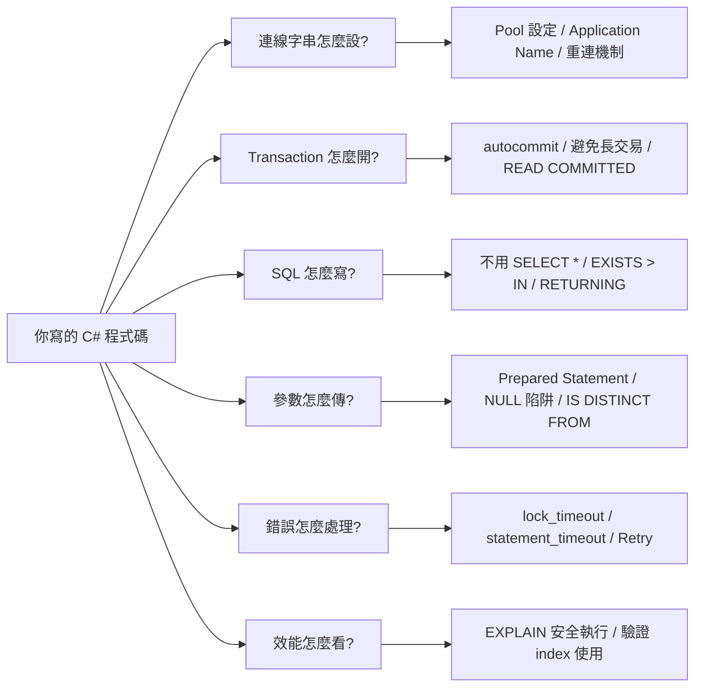
```mermaid
flowchart LR
    DEV["你寫的 C# 程式碼"] --> C1["連線字串怎麼設?"]
    DEV --> C2["Transaction 怎麼開?"]
    DEV --> C3["SQL 怎麼寫?"]
    DEV --> C4["參數怎麼傳?"]
    DEV --> C5["錯誤怎麼處理?"]
    DEV --> C6["效能怎麼看?"]

    C1 --> R1["Pool 設定 / Application Name / 重連機制"]
    C2 --> R2["autocommit / 避免長交易 / READ COMMITTED"]
    C3 --> R3["不用 SELECT * / EXISTS > IN / RETURNING"]
    C4 --> R4["Prepared Statement / NULL 陷阱 / IS DISTINCT FROM"]
    C5 --> R5["lock_timeout / statement_timeout / Retry"]
    C6 --> R6["EXPLAIN 安全執行 / 驗證 index 使用"]
```

| 讀完能做的事 | 具體表現 |
|------------|---------|
| 設定連線 | 寫出正確的 Npgsql connection string（Pool、Timeout、AppName） |
| 安全管理交易 | `using` + try-catch 正確控制 Transaction |
| 寫高效 SQL | `EXISTS` 取代 `IN`、`RETURNING` 減少 roundtrip |
| 防 NULL 陷阱 | 在 C# 中正確處理 `DBNull`，SQL 中正確用 `COALESCE` |
| 處理並發衝突 | `SKIP LOCKED` / Advisory Lock 的完整 C# 實作 |
| 診斷慢查詢 | `pg_stat_activity` 定位長交易 + `EXPLAIN` 看 JOIN 膨脹 |

本章 C# 依賴：
```
Npgsql (>= 6.0)
Dapper (>= 2.0)
// 可選：Polly for Retry
```

---

## 1. 命名規範


命名規範是資料庫開發的第一課。PostgreSQL 對名稱有一套明確的限制：所有物件名稱（資料庫、表格、欄位）最長不能超過 **63 個字元**，只能使用小寫字母、底線和數字。注意：PostgreSQL 會自動將未加引號的大寫字母轉為小寫，所以使用 `MyTable` 實際上會變成 `mytable`，建議從一開始就全部用小寫，避免混淆。

**為什麼要避免以 `pg_` 開頭？** 因為 PostgreSQL 內部系統表（如 `pg_class`、`pg_stat_activity`）都以 `pg_` 開頭，使用相同前綴可能造成衝突或被誤認為系統物件。

**索引命名慣例** (`pk_*`, `uk_*`, `idx_*`) 能讓你在看到索引名稱時立即知道它的用途——這是主鍵索引、唯一約束索引，還是普通的查詢加速索引。

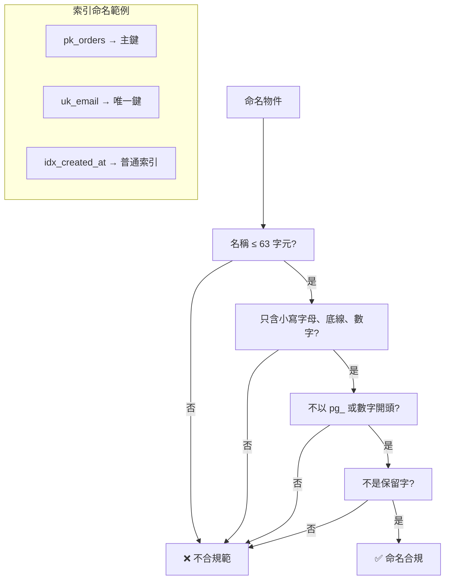
```mermaid
flowchart TD
    A["命名物件"] --> B["名稱 ≤ 63 字元?"]
    B -->|否| C["❌ 不合規範"]
    B -->|是| D["只含小寫字母、底線、數字?"]
    D -->|否| C
    D -->|是| E["不以 pg_ 或數字開頭?"]
    E -->|否| C
    E -->|是| F["不是保留字?"]
    F -->|否| C
    F -->|是| G["✅ 命名合規"]

    subgraph "索引命名範例"
        H["pk_orders → 主鍵"]
        I["uk_email → 唯一鍵"]
        J["idx_created_at → 普通索引"]
    end
```

### I. 強制規範

| # | 規則 |
|---|------|
| 1 | DB / table / column name 總長度 ≤ 63 字符 |
| 2 | Object name 只用小寫字母、底線、數字。不以 `pg` 開頭、不以數字開頭、不用保留字（[PG 17 reserved words](https://www.postgresql.org/docs/17/sql-keywords-appendix.html)） |
| 3 | Query alias 只用 `[a-z0-9_]`，不用中文或其他字符 |

### II. 推薦規範

| # | 規則 |
|---|------|
| 4 | PK index → `pk_*`，UK index → `uk_*`，普通 index → `idx_*` |
| 5 | Temp table → `tmp_*`；分區子表以規則結尾（`tbl_2016`、`tbl_2017`...） |
| 6 | DB name：`<部門>_<功能>`（如 `xxx_yyy`） |
| 7 | DB name 與應用名稱一致或便於辨識 |
| 8 | 避免 `public` schema；每應用分配獨立 schema，`schema_name` 與 username 一致 |
| 9 | Comment 不用中文（編碼不一致時 `pg_dump` 可能亂碼） |

### III. App Dev 實戰：Npgsql 連線字串

```csharp
var connString = new NpgsqlConnectionStringBuilder
{
    Host = "localhost",
    Port = 5432,
    Database = "myapp_db",
    Username = "myapp_user",
    Password = "myapp_password",
    ApplicationName = "MyApp.Api",           // ← pg_stat_activity 中的識別名
    SearchPath = "myapp",                    // ← 預設搜尋路徑 = schema
    MaxPoolSize = 50,
    MinPoolSize = 5,
    ConnectionIdleLifetime = 300,
    Timeout = 10,
    CommandTimeout = 30,
    IncludeErrorDetail = true
}.ConnectionString;
```

| 參數 | 作用 | 建議值 | 踩坑提醒 |
|------|------|--------|---------|
| `Host` / `Port` | PG 伺服器位址與埠號 | 實際 IP，不用 localhost（RDS 用 endpoint） | 雲端 RDS 不用 IP，用提供的 endpoint |
| `Database` | 連線目標資料庫 | 每應用一個 DB | 不要所有服務共用同一個 DB |
| `Username` / `Password` | 登入憑證 | 每應用獨立帳號，非 superuser | 絕對不要用 `postgres` 帳號跑業務 |
| `ApplicationName` | 寫入 `pg_stat_activity.application_name` | `<服務名>.<模組>` 如 `MyApp.Api` | 出問題時一眼看出兇手，**最重要的一個參數** |
| `SearchPath` | 等於 `SET search_path TO ...`，決定不帶 schema 前綴時的搜尋順序 | 跟 application name 一致的 schema 名 | 避免用 `public`；多 schema 時可用逗號分隔 `"app,public"` |
| `MaxPoolSize` | Pool 內最大連線數 | 公式：`max_connections * 0.8 / 實例數` | 設太高 → PG 連線數爆；設太低 → 請求排隊等連線。預設 100 通常太大 |
| `MinPoolSize` | Pool 內最少保持的熱連線數 | 5-10（視常態負載） | 設 0 的話，流量低谷後第一波請求會有 cold start latency（~200ms 建立 TCP + SSL + auth） |
| `ConnectionIdleLifetime` | 空閒連線存活秒數，超時後 Npgsql 主動關閉回收 | 300（5 分鐘），需 < PG 端的 `idle_in_transaction_session_timeout` | PG 端也有空閒超時設定（`idle_in_transaction_session_timeout`），Npgsql 這邊要比 PG 端短，否則 PG 先砍連線時 Npgsql 會收到 broken connection |
| `ConnectionPruningInterval` | 多久檢查一次空閒連線是否需要回收 | 60（1 分鐘） | 搭配 `ConnectionIdleLifetime` 使用，預設 10 秒太頻繁、60 秒已足夠 |
| `Timeout` | 從 Pool 等待取得連線的最長秒數 | 10-15 | **不是 SQL 執行 timeout**，是排隊等連線的時間。超過拋 `TimeoutException` |
| `CommandTimeout` | 單條 SQL 的最長執行秒數 | 30 | Npgsql 客戶端計時，超時發 `CancelRequest` 給 PG。建議另外在 PG 端設 `statement_timeout`（略小於此值）做雙重防護 |
| `IncludeErrorDetail` | 錯誤訊息是否包含 detail / hint / position 等欄位 | dev=true, prod=false | Production 設 false，避免把資料表名、欄位名洩漏到 client 端錯誤回應中 |
| `TcpKeepAlive` | 是否啟用 TCP keep-alive 探測 | true | 防止防火牆/NAT 中途砍掉空閒連線後 Npgsql 渾然不知。Npgsql 預設為 false，建議開啟 |
| `KeepAlive` | TCP keep-alive 探測間隔秒數 | 30 | 需 OS 層支援（Windows 預設 2 小時太長，建議調到 30-60 秒） |
| `TrustServerCertificate` | 是否信任自簽 SSL 憑證 | dev=true, prod=false | Prod 永遠 false，用正式 CA 簽發的憑證 |

**Application Name 的追蹤價值**：

```sql
-- 出問題時，一眼看出哪個服務在幹嘛
SELECT application_name, state, wait_event, query
FROM pg_stat_activity
WHERE backend_type = 'client backend' AND state <> 'idle';
-- MyApp.Api    | active | LWLock:WALWrite | UPDATE orders SET ...
-- MyApp.Worker | idle in transaction    | SELECT * FROM ...  ← 長交易！
```

```csharp
// ✅ 在 application log 中記錄 backend_pid（事後可對照 pg_stat_activity）
using var conn = new NpgsqlConnection(connString);
await conn.OpenAsync();
_logger.LogInformation("DB opened. PID: {BackendPid}", conn.ProcessID);
```

---

## 2. 設計規範


設計規範是資料庫開發的核心——好的設計能讓查詢快十倍，壞的設計會讓系統越用越慢。

**為甚麼外鍵（Foreign Key）欄位要手動建索引？** 當你刪除或更新被引用的主表資料時，PostgreSQL 需要檢查所有引用該資料的子表行，確保不會違反外鍵約束。如果子表的外鍵欄位沒有索引，PostgreSQL 必須**全表掃描**子表，這在子表有百萬行時會非常非常慢。

**`fillfactor` 是做什麼用的？** PostgreSQL 使用 MVCC（多版本並行控制），更新一行資料時實際上是新增一個版本，而不是原地修改。`fillfactor = 85` 表示每個資料頁只填滿 85%，預留 15% 的空間給未來在同一頁上的更新（稱為 HOT update），避免更新時還要跨頁尋找空間。

**BRIN 索引是什麼？** 如果你有一張記錄溫度的表，資料按時間順序寫入，時間越近溫度越高。BRIN（Block Range INdex）會記錄「第 1-100 頁的溫度範圍是 15-20°C，第 101-200 頁是 20-25°C...」，查詢時可以快速跳過不在範圍內的頁。BRIN 索引非常小（約是 B-tree 的 1/1000），但要求資料有物理排序的相關性。

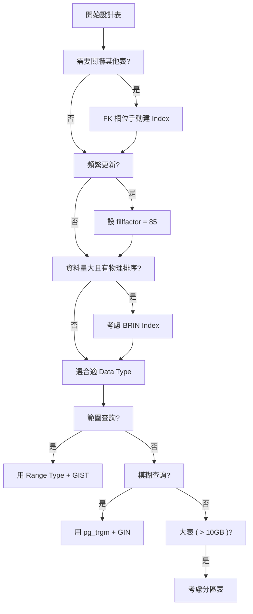
```mermaid
flowchart TD
    A["開始設計表"] --> B["需要關聯其他表?"]
    B -->|是| C["FK 欄位手動建 Index"]
    B -->|否| D["頻繁更新?"]
    C --> D
    D -->|是| E["設 fillfactor = 85"]
    D -->|否| F["資料量大且有物理排序?"]
    E --> F
    F -->|是| G["考慮 BRIN Index"]
    F -->|否| H["選合適 Data Type"]
    G --> H
    H --> I["範圍查詢?"]
    I -->|是| J["用 Range Type + GIST"]
    I -->|否| K["模糊查詢?"]
    K -->|是| L["用 pg_trgm + GIN"]
    K -->|否| M["大表 ( > 10GB )?"]
    M -->|是| N["考慮分區表"]
```

### I. 強制規範

| # | 規則 | SQL 範例 |
|---|------|---------|
| 1 | 跨表同名/同義 column 必須名稱、型別一致 | — |
| 2 | B-tree index 欄位 ≤ 2000 bytes；超過用 hash / 分詞 index | — |
| 3 | FK column 必須手動建 index（否則影響 referenced table 的 UPDATE/DELETE） | 見下方 #1 |
| 4 | FK 必須設 action：`ON DELETE/UPDATE CASCADE \| SET NULL \| SET DEFAULT` | 見下方 #2 |
| 5 | 頻繁更新的 table 設 `fillfactor = 85`（預留 15% 給 HOT update） | 見下方 #3 |
| 6 | Index `NULLS FIRST/LAST` 必須與 `ORDER BY` 一致，否則 index 可能無法使用 | — |
| 7 | Column data type 必須與 application 定義一致；跨表 collation 必須一致 | — |

```sql
-- #3 FK 手動建 index
CREATE TABLE tbl(id int PRIMARY KEY, info text);
CREATE TABLE tbl1(id int REFERENCES tbl(id), info text);
-- 此時 tbl1.id 沒有 index！
CREATE INDEX idx_tbl1_id ON tbl1(id);

-- #4 FK action
CREATE TABLE tbl2(id int REFERENCES tbl(id) ON DELETE CASCADE ON UPDATE CASCADE, info text);
CREATE INDEX idx_tbl2_id ON tbl2(id);
INSERT INTO tbl VALUES (1,'test');
INSERT INTO tbl2 VALUES (1,'test');
UPDATE tbl SET id = 2;
SELECT * FROM tbl2;  -- id 自動變成 2

-- #5 fillfactor
CREATE TABLE test123(id int, info text) WITH (fillfactor = 85);
```

### II. 強制規範詳解：B-tree 2000 byte 限制

B-tree 索引把欄位值本身存進索引頁中。PostgreSQL 預設每頁 8KB，單一索引 entry 不能超過約 1/3 頁（約 2700 bytes），安全上限取整數 2000 bytes。超過這個大小的欄位值塞不進 B-tree 頁，建索引時直接報錯：

```sql
CREATE INDEX idx_content ON articles (content);  -- ❌ value too long！
```

解法取決於查詢模式：

| 查詢方式 | 用什麼 | 原因 |
|---------|--------|------|
| `WHERE content = '精確匹配'` | **hash index** | 只存 4-byte hash，不存原文，不受限制 |
| `WHERE content LIKE '%關鍵字%'` | **GIN + pg_trgm** | 拆成 3-gram token，每個都 < 3 byte |
| `WHERE to_tsvector(content) @@ '關鍵字'` | **GIN + tsvector** | 拆成詞彙而非整篇存 |

```sql
-- hash：只支援 = 運算
CREATE INDEX ON articles USING hash (content);

-- GIN + tsvector：全文檢索
CREATE INDEX ON articles USING gin (to_tsvector('simple', content));

-- GIN + pg_trgm：LIKE / regex
CREATE INDEX ON articles USING gin (content gin_trgm_ops);
```

對 App Dev 而言：如果 Dapper 的 SQL 對長文字欄位下了 `WHERE content = @Value`，確保用的是 hash index 而非 B-tree，否則整條 SQL 會因為 index 建不起來而走 Seq Scan。

### III. 強制規範詳解：FK 必須設 Action

FK 如果不寫 `ON DELETE` / `ON UPDATE`，PostgreSQL 預設是 `NO ACTION`——意思是「有子行就擋住，直接拋錯」：

```sql
-- ❌ 沒寫 action → 預設 NO ACTION
CREATE TABLE orders (user_id INT REFERENCES users(id));

DELETE FROM users WHERE id = 1;
-- ERROR: update or delete on table "users" violates foreign key constraint
-- → C# 端收到 PostgresException，刪除操作直接失敗
```

必須根據業務場景三選一：

| Action | 行為 | 適用場景 |
|--------|------|---------|
| `CASCADE` | 父行刪除 → 子行跟著刪 | 訂單明細（訂單沒了，明細也該沒了） |
| `SET NULL` | 父行刪除 → 子行 FK 欄位變 NULL | 文章作者（作者被刪，文章留著但作者欄位掛 NULL） |
| `SET DEFAULT` | 父行刪除 → 子行 FK 欄位變預設值 | 部門主管（主管離職，歸到「未分配」預設部門） |

```sql
-- ✅ 明確指定
CREATE TABLE order_items (
    order_id  INT REFERENCES orders(id)   ON DELETE CASCADE,
    product_id INT REFERENCES products(id) ON DELETE SET NULL
);
```

沒寫 `ON DELETE` 的 FK 是一顆地雷——刪一筆舊資料就可能讓整個 request 炸掉。寫 `DELETE` SQL 之前，先確認那張表有沒有子表、FK 設了什麼 action。

### IV. 強制規範詳解：Partial Index

一般索引會覆蓋整張表的每一行。Partial index 只索引**符合 WHERE 條件的那部分行**，跳過不合條件的，讓索引更小、更快。

```sql
-- ❌ 一般索引：整張表 1000 萬行全進去
CREATE INDEX idx_orders_status ON orders (status);

-- ✅ Partial index：只索引 status = 'active' 的 10 萬行
CREATE INDEX idx_orders_active ON orders (created_at)
    WHERE status = 'active';
```

核心原理：如果你的查詢永遠帶某個固定條件，就**不需要**把不符合該條件的行塞進索引。掃描範圍直接縮小。

| 場景 | 一般 Index | Partial Index | 效果 |
|------|-----------|--------------|------|
| 軟刪除 `WHERE deleted = false` | Index 包含已刪除行 | `WHERE deleted = false` | 90% 的已刪行不在 index 中 |
| 多租戶 `WHERE tenant_id = 1` | 全部租戶共用一個 index | `WHERE tenant_id = 1` | 每個租戶的查詢只掃自己的部分 |
| 狀態過濾 `WHERE status IN ('new','pending')` | 包含所有狀態 | `WHERE status IN ('new','pending')` | 已完成/已取消的訂單不佔 index 空間 |
| 未售完座位（見第六章） | 含已售完座位 | `WHERE station_bit <> repeat('1', N)` | 售完即退出 index，查詢自動跳過 |

```sql
-- 實戰：訂單表 1000 萬行，只有 50 萬行 status = 'pending'
CREATE INDEX idx_pending_orders ON orders (created_at)
    WHERE status = 'pending';

-- 查詢時 Planner 自動選用這個 partial index
SELECT * FROM orders WHERE status = 'pending' ORDER BY created_at;
-- Index Scan on idx_pending_orders → 只掃 50 萬行而非 1000 萬行
```

限制：WHERE 條件必須是**查詢中固定出現的**。如果 query 有時 `WHERE status = 'pending'`、有時 `WHERE status = 'shipped'`，就不能只用一個 partial index——要嘛建多個 partial index，要嘛回歸一般 index。

### V. App Dev 實戰：設計規範的 C# 落地

**FK Cascade 對應用完全透明**——你可能只刪了一行，DB 卻連帶刪了 N 張子表。在 C# 中你必須清楚每個 FK 的 action：

```csharp
// ON DELETE CASCADE：刪除主表 = 自動刪除子表（應用層無感知）
// ON DELETE SET NULL：刪除主表後子表外鍵變 NULL（應用層需處理 null）
// ON DELETE RESTRICT：有子資料就拋錯（應用層必須先處理子資料）
```

**Data Type 選擇對 C# 的直接影響**：

| PG 型別 | C# 型別 | 陷阱 |
|---------|---------|------|
| `numeric(18,2)` | `decimal` | 永遠不要用 `float`/`double` 存金額 |
| `timestamptz` | `DateTime` (Npgsql 預設 Utc) | 永遠不要用 `timestamp` without tz |
| `text` | `string` | varchar(n) 與 text 效能相同 |
| `jsonb` | `JObject` / 反序列化 | 可建 GIN index，支援 `@>` 查詢 |
| `uuid` | `Guid` | 不建議做 B-tree PK（page split 嚴重） |
| `varbit` | `BitArray` / `byte[]` | 適合多選一狀態、區段標記（見第六章） |

```csharp
// ❌ 經典錯誤：用字串比對數字
// "WHERE price > '1000'" → '900' > '1000' 為 true！
// ✅ 用正確型別：WHERE price > 1000
```

### VI. 推薦規範

| # | 規則 |
|---|------|
| 8 | Partition table 全域唯一 PK：多個 sequence，不同 `INCREMENT BY` 或不同 `MINVALUE/MAXVALUE` 範圍 |
| 9 | 定期刪除歷史數據 → 按時間分區，`DROP`/`TRUNCATE` partition，不用 `DELETE` |
| 10 | 所有字串用 UTF-8；區分 `length()`（字元數）vs `octet_length()`（byte 數） |
| 11 | 線性相關數據（streaming、自增、timestamp）+ 範圍查詢 → BRIN index |
| 12 | 選擇合適 data type：數字不用字串、樹型不用字串（PG 支援 numeric / float / money / string / date / time / boolean / enum / geometry / network / UUID / XML / JSON / array / composite / range / ltree / cube / earth / hstore / pg_trgm / PostGIS...） |
| 13 | 避免全表掃描；PG 幾乎所有 data type 都支援 index（btree / hash / gin / gist / sp-gist / brin / rum / bloom） |
| 14 | 複雜 business logic + 高 RT 場景：盡量用 stored procedure（plpgsql）或內建函數，減少 DB-app roundtrip |
| 15 | 避免用 trigger（複雜化邏輯，不利 debug） |
| 16 | 常訪問大結果集（如 100 row）→ 設法聚合為少量 row；無法聚合則用高 IOPS 磁盤 |
| 17 | Streaming 即時統計防 parallel transaction 空洞：parallel insert 到不同分表，單分表內 serial insert |
| 18 | 範圍查詢 → 用 range type + GIST index（如 IP range `int8range` + GIST，比 `BETWEEN` 快 20x） |
| 19 | 未引用的大對象必須同時刪除數據部分（或用 `vacuumlo`） |
| 20 | 固定條件的查詢 → partial index（`CREATE INDEX ... WHERE id = 1`） |
| 21 | Expression 查詢 → expression/function index |
| 22 | Debug 複雜邏輯 → plpgsql `DO` block，非 function |
| 23 | 中文分詞 → `zhparser` 或 `jieba`；分詞欄位用 GIN index |
| 24 | Regex / text similarity → `pg_trgm` GIN index（覆蓋 `LIKE '%xxx%'`） |
| 25 | Prefix / suffix 模糊查詢：`col ~ '^abc'`（prefix）或 `reverse(col) ~ '^def'`（suffix） |
| 26 | 大表（> 8GB 或 > 1000 萬 row）應分區，提升查詢/更新/備份/恢復/index 效率 |
| 27 | Table schema 謹慎規劃，避免頻繁 `ALTER TABLE ADD COLUMN`（可能觸發 rewrite）；不可預測 schema 用 `jsonb` |

```sql
-- #8 方案一：不同步長
CREATE SEQUENCE seq_tab1 INCREMENT BY 10000 START WITH 1;
CREATE SEQUENCE seq_tab2 INCREMENT BY 10000 START WITH 2;
CREATE SEQUENCE seq_tab3 INCREMENT BY 10000 START WITH 3;
CREATE TABLE tab1 (id int PRIMARY KEY DEFAULT nextval('seq_tab1') CHECK (mod(id,10000)=1), info text);
CREATE TABLE tab2 (id int PRIMARY KEY DEFAULT nextval('seq_tab2') CHECK (mod(id,10000)=2), info text);
CREATE TABLE tab3 (id int PRIMARY KEY DEFAULT nextval('seq_tab3') CHECK (mod(id,10000)=3), info text);

-- #8 方案二：不同範圍
CREATE SEQUENCE seq_tb1 INCREMENT BY 1 MINVALUE 1 MAXVALUE 100000000 START WITH 1 NO CYCLE;
CREATE SEQUENCE seq_tb2 INCREMENT BY 1 MINVALUE 100000001 MAXVALUE 200000000 START WITH 100000001 NO CYCLE;

-- #10 UTF-8 長度
SELECT length('阿里巴巴');       -- 4（字元數）
SELECT octet_length('阿里巴巴'); -- 12（byte 數）

-- Available length functions:
-- array_length, bit_length, char_length/character_length,
-- json_array_length, jsonb_array_length, length, octet_length

-- #11 BRIN index
CREATE INDEX idx ON tbl USING brin (id);

-- #18 Range type + GIST IP 範例
CREATE TABLE ip_address_pool_3 (
    id serial8 PRIMARY KEY,
    start_ip inet NOT NULL,
    end_ip inet NOT NULL,
    province varchar(128) NOT NULL,
    city varchar(128) NOT NULL,
    region_name varchar(128) NOT NULL,
    company_name varchar(128) NOT NULL,
    ip_decimal_segment int8range
);
CREATE INDEX ip_address_pool_3_range ON ip_address_pool_3 USING gist (ip_decimal_segment);
SELECT province, ip_decimal_segment FROM ip_address_pool_3 WHERE ip_decimal_segment @> :ip::int8;

-- #20 Partial index
CREATE INDEX idx ON tbl (col) WHERE id = 1;

-- #21 Expression index
CREATE INDEX idx ON tbl (exp);

-- #22 DO block for debugging
DO LANGUAGE plpgsql $$
DECLARE
BEGIN
    -- logical code
END;
$$;

-- #26 Prefix / suffix fuzzy query
SELECT * FROM tbl WHERE col ~ '^abc';          -- prefix
SELECT * FROM tbl WHERE reverse(col) ~ '^def'; -- suffix
```

> 補充（Senior Dev）：#8 的 multi-sequence 方案在 PG 10+ 有了更好的替代——`IDENTITY` column + `GENERATED BY DEFAULT AS IDENTITY`，搭配 `CACHE` 參數可減少 sequence 競爭。若用 PG 17 native partitioning + `GENERATED ALWAYS AS IDENTITY`，sequence 管理由 PG 內部處理，不需手動調步長。

### VII. 推薦規範詳解：Stored Procedure 減少 Roundtrip

這條規則的核心是**網路延遲**。一次 DB roundtrip（應用 → DB → 應用）在相同資料中心約 0.5-2ms。聽起來很小，但當一個 business operation 需要 5-10 條 SQL 時，累積延遲就變成瓶頸。

```csharp
// ❌ C# 端做複雜邏輯：5 次 roundtrip
public async Task TransferMoney(int from, int to, decimal amount)
{
    // Roundtrip 1：檢查餘額
    var balance = await conn.ExecuteScalarAsync<decimal>(
        "SELECT balance FROM accounts WHERE id = @Id", new { Id = from });

    if (balance < amount) throw new Exception("餘額不足");

    // Roundtrip 2：扣款
    await conn.ExecuteAsync("UPDATE accounts SET balance = balance - @Amt WHERE id = @Id",
        new { Id = from, Amt = amount });

    // Roundtrip 3：加款
    await conn.ExecuteAsync("UPDATE accounts SET balance = balance + @Amt WHERE id = @Id",
        new { Id = to, Amt = amount });

    // Roundtrip 4：記錄轉帳 log
    await conn.ExecuteAsync(
        "INSERT INTO transfer_logs (from_id, to_id, amount) VALUES (@F, @T, @A)",
        new { F = from, T = to, A = amount });

    // Roundtrip 5：回傳最終餘額
    return await conn.ExecuteScalarAsync<decimal>(
        "SELECT balance FROM accounts WHERE id = @Id", new { Id = from });
}
// 5 × 2ms = 10ms。本來就不是很快，加上 middle-tier 排隊 → 更慢
// 且步驟 1 跟步驟 2 之間不是 atomic —— 兩次 SQL 之間餘額可能被其他交易改掉
```

```sql
-- ✅ 同樣邏輯寫成 plpgsql function：1 次 roundtrip，DB 內部做完
CREATE OR REPLACE FUNCTION transfer_money(
    from_id INT, to_id INT, amount DECIMAL
) RETURNS DECIMAL AS $$
DECLARE
    bal DECIMAL;
BEGIN
    SELECT balance INTO bal FROM accounts WHERE id = from_id FOR UPDATE;
    IF bal < amount THEN
        RAISE EXCEPTION '餘額不足：帳戶 % 只有 %', from_id, bal;
    END IF;

    UPDATE accounts SET balance = balance - amount WHERE id = from_id;
    UPDATE accounts SET balance = balance + amount WHERE id = to_id;
    INSERT INTO transfer_logs (from_id, to_id, amount) VALUES (from_id, to_id, amount);

    RETURN (SELECT balance FROM accounts WHERE id = from_id);
END;
$$ LANGUAGE plpgsql;
```

```csharp
// ✅ C# 端只需一行：
var newBalance = await conn.ExecuteScalarAsync<decimal>(
    "SELECT transfer_money(@From, @To, @Amt)",
    new { From = from, To = to, Amt = amount });
// 1 次 roundtrip，DB 內部保證 atomic（整個 function 在同一 transaction 中執行）
```

**什麼時候該用、什麼時候不該**：

| 場景 | 用 Stored Procedure？ | 原因 |
|------|----------------------|------|
| 轉帳（多表更新 + 條件檢查） | ✅ 該用 | 需要 atomic，多步 SQL 之間不能有 race condition |
| 報表（多表 JOIN + 聚合） | ✅ 該用 | 減少大量中間結果在網路上傳輸 |
| 簡單 CRUD（單表增刪改查） | ❌ 不用 | Dapper 一行搞定，多包一層 function 反而增加維護成本 |
| 含外部 API 呼叫的邏輯 | ❌ 不能用 | plpgsql 無法呼叫 HTTP / gRPC，這層邏輯留在 C# |
| 跨多個 DB 的操作 | ❌ 不合適 | plpgsql 只能操作當前 DB，跨庫邏輯留在應用層 |

**plpgsql 不利 Debug 是真的，但可以降低痛苦**：

```sql
-- 用 RAISE NOTICE 印出中間變數（類似 console.log）
RAISE NOTICE 'from_id=%, balance=%, amount=%', from_id, bal, amount;

-- 用 GET DIAGNOSTICS 取得實際影響行數
GET DIAGNOSTICS row_count = ROW_COUNT;
RAISE NOTICE 'updated % rows', row_count;
```

對 App Dev 的底線：**需要多步 SQL 保證 atomic 的操作，寫成 function。簡單 CRUD 留在 Dapper。不要因為「function 難 debug」就把轉帳邏輯拆成 5 條 SQL 各自飛。**

---

## 3. Query 規範


SQL 查詢中最容易踩坑的就是 **NULL 的行為**。NULL 在 SQL 中代表「未知」，而不是「空」或「零」。任何與 NULL 的比較（包括 `=`、`<>`、`>`）都返回 NULL（未知），而不是 TRUE 或 FALSE。這就是為什麼 `NULL = NULL` 的結果是 NULL 而不是 TRUE——兩個未知值無法確認是否相等。

**count(*) vs count(col) 的關鍵差異**：`count(*)` 計算所有行數（包括所有欄位都是 NULL 的行），而 `count(col)` 只計算該欄位不為 NULL 的行數。這就是為什麼規範強制使用 `count(*)`——它最直覺、最不容易出錯。

**NULL 對 sum() 的影響**：如果所有行的該欄位都是 NULL，`sum(col)` 會返回 NULL 而不是 0。所以計算總額時一定要用 `COALESCE(SUM(amount), 0)`，否則 NULL 可能會在後續計算中造成連鎖問題。

**為什麼不能用 SELECT \*？** `SELECT *` 看似方便，但有兩個問題：第一，它會取回所有欄位（包括你不需要的），浪費網路頻寬和記憶體；第二，當表格結構改變（新增欄位），你的程式碼可能因為收到預期外的欄位而出錯。

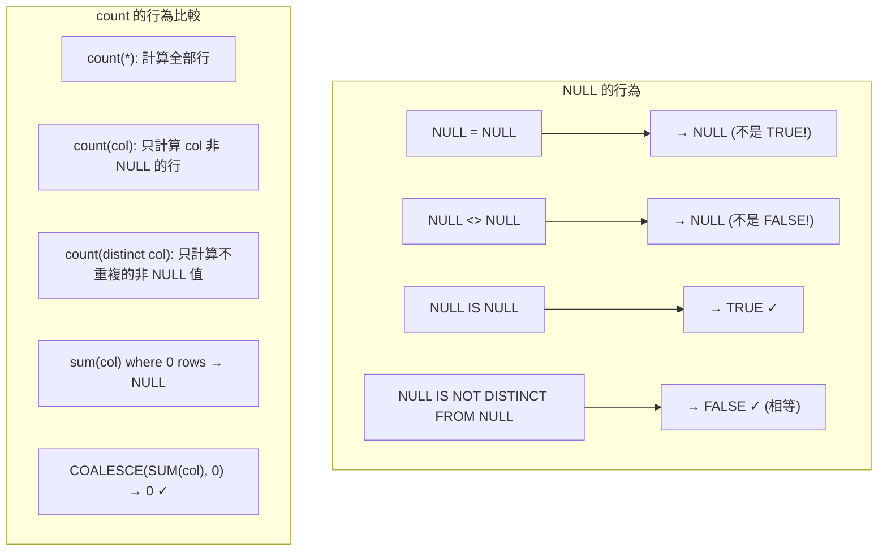
```mermaid
flowchart TD
    subgraph "NULL 的行為"
        A["NULL = NULL"] --> B["→ NULL (不是 TRUE!)"]
        C["NULL <> NULL"] --> D["→ NULL (不是 FALSE!)"]
        E["NULL IS NULL"] --> F["→ TRUE ✓"]
        G["NULL IS NOT DISTINCT FROM NULL"] --> H["→ FALSE ✓ (相等)"]
    end
    
    subgraph "count 的行為比較"
        I["count(*): 計算全部行"]
        J["count(col): 只計算 col 非 NULL 的行"]
        K["count(distinct col): 只計算不重複的非 NULL 值"]
        L["sum(col) where 0 rows → NULL"]
        M["COALESCE(SUM(col), 0) → 0 ✓"]
    end
```

### I. 強制規範

| # | 規則 | SQL 範例 |
|---|------|---------|
| 1 | 永遠用 `count(*)`（SQL92 標準，統計所有 row 含 NULL）；不用 `count(col)` 或 `count(常數)` | — |
| 2 | 多 column count 必須加括號：`count((col1,col2,col3))`。即使所有 column 為 NULL 該 row 仍被計數 | — |
| 3 | `count(distinct col)` 只計非 NULL 不重複值，NULL 不計 | — |
| 4 | `count(distinct (col1,col2,...))` 計數 NULL，且 NULL = NULL 視為相同 | — |
| 5 | `count(col)` 對 NULL column 返回 0，而 `sum(col)` 返回 NULL → NPE guard：`COALESCE(SUM(g), 0)` | — |
| 6 | NULL = UNKNOWN；任何與 NULL 的比較返回 NULL（非 true/false）：`NULL <> NULL` → NULL，`NULL = NULL` → NULL | — |
| 7 | 除非 ETL，否則避免返回大數據量給 client | — |
| 8 | 永遠不用 `SELECT *`，必須指定 column list | — |

```sql
-- #2~5 count behavior
CREATE TABLE t123(c1 int, c2 int, c3 int);
INSERT INTO t123 VALUES
    (null,null,null), (null,null,null),
    (1,null,null), (2,null,null),
    (null,1,null), (null,2,null);

SELECT count((c1,c2)) FROM t123;   -- 6（全部 row）
SELECT count((c1)) FROM t123;      -- 2（只計 c1 非 NULL）
SELECT count(distinct c1) FROM t123;  -- 2
SELECT count(distinct (c1,c2)) FROM t123;  -- 5（NULL 被計入且 NULL=NULL）
SELECT count(distinct (c1,c2,c3)) FROM t123;  -- 5
SELECT count(c1), sum(c1) FROM t123 WHERE c1 IS NULL;  -- 0 | NULL
SELECT COALESCE(SUM(g), 0) FROM table;  -- NPE guard
```

### II. App Dev 實戰：EXISTS vs IN 與 RETURNING

兩個技巧的核心差異都在 **roundtrip（應用 ↔ DB 來回次數）**。

**EXISTS > IN：減少 DB 內部掃描量**

```sql
-- ❌ IN：子查詢先跑完，把結果集展開，外層再逐一比對
SELECT * FROM orders
WHERE customer_id IN (SELECT id FROM customers WHERE region = 'Asia');
-- customers 有 10 萬筆 Asia 用戶 → 子查詢返回 10 萬個 id
-- orders 的每一行都要跟 10 萬個 id 做 hash lookup

-- ✅ EXISTS：碰到第一筆匹配就停，不等子查詢跑完
SELECT * FROM orders o
WHERE EXISTS (
    SELECT 1 FROM customers c
    WHERE c.id = o.customer_id AND c.region = 'Asia'
);
-- 對 orders 每行，進子查詢「有沒有一筆 customer 符合條件」
-- → 找到第一筆就 return true，不繼續掃
```

根本差異：`IN` 是先算完子查詢再比對；`EXISTS` 是邊走邊問「有嗎？」，碰到第一筆就停。表越大、子查詢結果越多，差異越明顯。

```csharp
// Dapper 中的對比
// ❌ IN：需要先撈出子查詢結果再傳入
var ids = (await conn.QueryAsync<int>("SELECT id FROM customers WHERE region = @R", new { R = "Asia" })).AsList();
var orders = await conn.QueryAsync<Order>("SELECT * FROM orders WHERE customer_id = ANY(@Ids)", new { Ids = ids });

// ✅ EXISTS：一條 SQL 搞定，不產生中間物件
var orders = await conn.QueryAsync<Order>(
    @"SELECT * FROM orders o
      WHERE EXISTS (SELECT 1 FROM customers c WHERE c.id = o.customer_id AND c.region = @R)",
    new { R = "Asia" });
```

**RETURNING：省一個 SELECT**

```sql
-- ❌ 傳統寫法：INSERT → 查 ID → SELECT 取回 row（3 個 roundtrip）
INSERT INTO orders (user_id, amount) VALUES (1, 100);
SELECT currval('orders_id_seq');   -- → 42
SELECT * FROM orders WHERE id = 42;

-- ✅ RETURNING：一次做完，新 row 直接吐回來
INSERT INTO orders (user_id, amount) VALUES (1, 100) RETURNING *;
-- 同時拿到 id=42, created_at, 以及所有 DB 產生的預設值
```

`RETURNING` 不只省 roundtrip，還保證你拿到的是 **DB 最終寫入的值**（沒 race condition）。

```csharp
// ✅ C# 中的完整用法
// INSERT
var order = await conn.QuerySingleAsync<Order>(
    "INSERT INTO orders (user_id, amount) VALUES (@Uid, @Amt) RETURNING *",
    new { Uid = 1, Amt = 100m });
// order.Id, order.CreatedAt 都是 DB 產生的，保證正確

// UPDATE
var updated = await conn.QuerySingleAsync<Order>(
    "UPDATE orders SET status = 'shipped' WHERE id = @Id RETURNING *",
    new { Id = 123 });

// DELETE — 拿回被刪的那筆資料，寫 audit log 超方便
var deleted = await conn.QuerySingleAsync<LogEntry>(
    "DELETE FROM orders WHERE id = @Id RETURNING id, user_id, amount, created_at",
    new { Id = 123 });
```

總結：`EXISTS` 讓 DB 少做事，`RETURNING` 讓你的 C# 少發請求。兩者加起來 = 應用層效能有感提升。

---

## 4. 管理規範


管理規範關注的是 DBA 和開發者在日常操作中如何避免「誤傷」資料庫。最核心的原則是：**先確認，再執行**。

**為什麼 DDL 操作要設 `lock_timeout`？** `ALTER TABLE`、`CREATE INDEX` 等 DDL 操作需要取得表上的獨佔鎖（AccessExclusiveLock）。如果表上有正在執行的查詢，DDL 會一直等待，而等待期間又會阻塞後續的所有查詢——形成連鎖阻塞。設 `lock_timeout` 可以讓 DDL 在指定時間內拿不到鎖就自動放棄，避免長時間阻塞業務。

**`EXPLAIN ANALYZE` 為什麼要包在 transaction 中？** `EXPLAIN ANALYZE` 會真正執行查詢（而不只是分析）。如果你用 `EXPLAIN ANALYZE DELETE FROM ...` 來確認會刪除哪些資料，這些資料就真的被刪除了！包在 `BEGIN...ROLLBACK` 中可以讓你看到執行效果後再決定是否真的要執行。

### I. 強制規範詳解：WAL 原理與 App Dev 防禦

WAL（Write-Ahead Log）是 PostgreSQL 保證資料不丟失的核心機制：任何寫入（INSERT/UPDATE/DELETE）都不會直接寫進最終的資料檔，而是**先寫進 WAL**，確認 WAL 寫入成功後，才逐步將變更刷到資料檔中。正常情況下，舊的 WAL 會被 checkpoint 自動清理。但 archive_mode=on 或 replication slot 會阻止清理——歸檔失敗或備機延遲時，WAL 累積直到磁碟爆滿，DB 拒絕所有寫入。

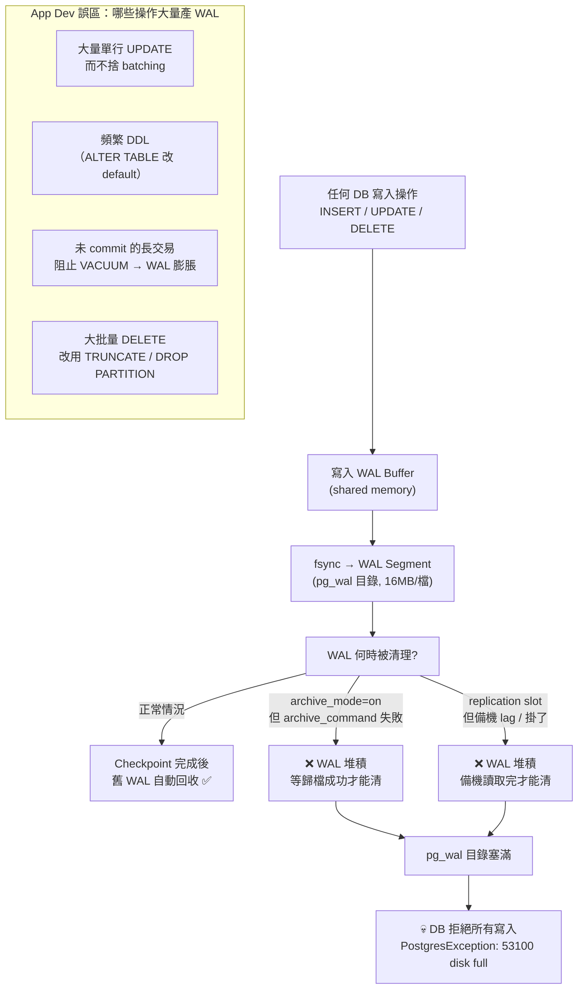
```mermaid
flowchart TD
    A["任何 DB 寫入操作<br>INSERT / UPDATE / DELETE"] --> B["寫入 WAL Buffer<br>(shared memory)"]
    B --> C["fsync → WAL Segment<br>(pg_wal 目錄, 16MB/檔)"]

    C --> D["WAL 何時被清理?"]

    D -->|"正常情況"| E["Checkpoint 完成後<br>舊 WAL 自動回收 ✅"]
    D -->|"archive_mode=on<br>但 archive_command 失敗"| F["❌ WAL 堆積<br>等歸檔成功才能清"]
    D -->|"replication slot<br>但備機 lag / 掛了"| G["❌ WAL 堆積<br>備機讀取完才能清"]

    F --> H["pg_wal 目錄塞滿"]
    G --> H
    H --> I["💀 DB 拒絕所有寫入<br>PostgresException: 53100 disk full"]

    subgraph "App Dev 誤區：哪些操作大量產 WAL"
        J1["大量單行 UPDATE<br>而不捨 batching"]
        J2["頻繁 DDL<br>（ALTER TABLE 改 default）"]
        J3["未 commit 的長交易<br>阻止 VACUUM → WAL 膨脹"]
        J4["大批量 DELETE<br>改用 TRUNCATE / DROP PARTITION"]
    end
```

**WAL 流量的根本來源**：每次寫操作都產 WAL。以下是 App Dev 寫法對 WAL 的影響：

| App Dev 操作 | WAL 產生量 | 問題 |
|-------------|-----------|------|
| `UPDATE orders SET status = 'done' WHERE id = @Id` | 1 筆 WAL（改 1 行） | 正常 |
| `for` 迴圈逐行 `UPDATE ... WHERE id = @Id`（1000 次） | 1000 筆 WAL + 1000 次 fsync | Batching 寫法可降到 1 筆 |
| `DELETE FROM logs WHERE created_at < @Old`（刪 1 千萬行） | 1 千萬筆 WAL，瞬間塞滿 pg_wal | **分批刪不省 WAL**（總量一樣，只攤平）。應改用 `TRUNCATE`（清全表，僅 1 筆 WAL）或 `DROP PARTITION`（按時間分區的表，也是 1 筆 WAL） |
| `ALTER TABLE ADD COLUMN status TEXT DEFAULT 'new'` | **PG 11+ 已優化**：常數 default 不 rewrite，只記在 system catalog，零 WAL | ✅ PG16+ 安全。但 volatile default（`now()`、`random()`）仍會 rewrite 全表，每行值不同無法跳過 |
| `ALTER TABLE ADD COLUMN created_at TIMESTAMPTZ DEFAULT now()` | 全表 rewrite，有 5000 萬行就 5000 萬筆 WAL，期間表被鎖 | 分兩步：先 `ADD COLUMN` 不加 default，再由應用層補 `DateTime.UtcNow` |
| 開 transaction 不 commit，卡 30 分鐘 | 阻止 VACUUM 清理死行 → 後續寫入的 WAL 無法回收 | 長交易是 WAL 堆積的放大器 |
| `archive_mode=on` 但無監控 | 歸檔失敗後無人知 → WAL 默默堆積直到磁碟爆 | 必須監控 pg_wal 使用量 |

**WAL 從產生到清理的完整生命週期**：

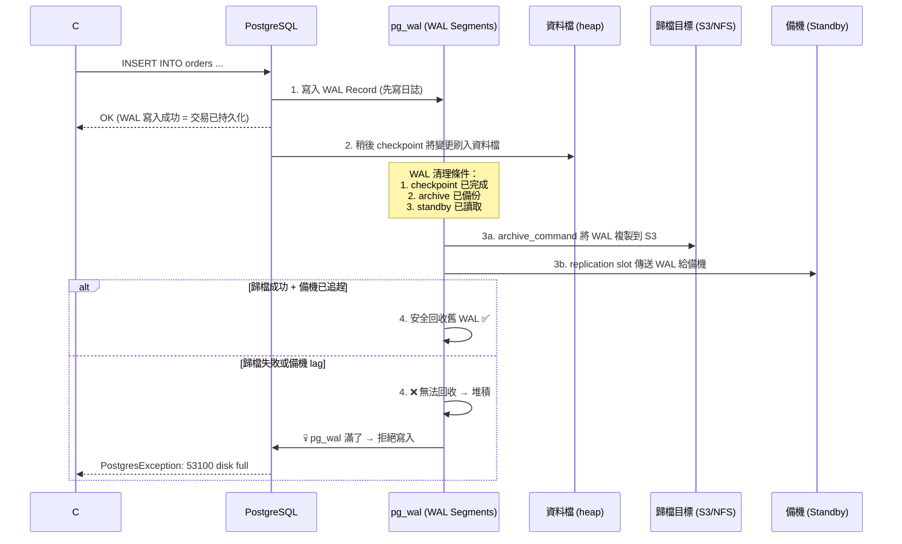
```mermaid
sequenceDiagram
    participant App as C# 應用
    participant PG as PostgreSQL
    participant WAL as pg_wal (WAL Segments)
    participant Data as 資料檔 (heap)
    participant Archive as 歸檔目標 (S3/NFS)
    participant Standby as 備機 (Standby)

    App->>PG: INSERT INTO orders ...
    PG->>WAL: 1. 寫入 WAL Record (先寫日誌)
    PG-->>App: OK (WAL 寫入成功 = 交易已持久化)
    PG->>Data: 2. 稍後 checkpoint 將變更刷入資料檔

    Note over WAL: WAL 清理條件：<br>1. checkpoint 已完成<br>2. archive 已備份<br>3. standby 已讀取

    WAL->>Archive: 3a. archive_command 將 WAL 複製到 S3
    WAL->>Standby: 3b. replication slot 傳送 WAL 給備機

    alt 歸檔成功 + 備機已追趕
        WAL->>WAL: 4. 安全回收舊 WAL ✅
    else 歸檔失敗或備機 lag
        WAL->>WAL: 4. ❌ 無法回收 → 堆積
        WAL->>PG: 💀 pg_wal 滿了 → 拒絕寫入
        PG-->>App: PostgresException: 53100 disk full
    end
```

**App Dev 應該知道的防禦措施**：

```csharp
// 1. 監控 WAL 使用率（週期性健康檢查）
public async Task<long> CheckWalUsage()
{
    await using var conn = await dataSource.OpenConnectionAsync();
    var walDirSize = await conn.ExecuteScalarAsync<long>(
        @"SELECT COALESCE(SUM(size), 0)
          FROM pg_ls_waldir()");  -- PG 10+ 內建函數
    _logger.LogInformation("pg_wal size: {Size}MB", walDirSize / 1024 / 1024);

    // 超過 80% 磁碟 → 告警
    if (walDirSize > _diskCapacity * 0.8)
        _logger.LogError("WAL usage critical!");
    return walDirSize;
}

// 2. 監控 replication slot 延遲
public async Task<List<SlotLag>> CheckReplicationLag()
{
    await using var conn = await dataSource.OpenConnectionAsync();
    return (await conn.QueryAsync<SlotLag>(
        @"SELECT slot_name,
                 pg_wal_lsn_diff(pg_current_wal_lsn(), restart_lsn) AS lag_bytes
          FROM pg_replication_slots
          WHERE active = true
            AND pg_wal_lsn_diff(pg_current_wal_lsn(), restart_lsn) > 100 * 1024 * 1024"
    )).AsList();  // lag > 100MB → 告警
}

// 3. Dapper 批量寫入 — 不要逐行 UPDATE
// ❌ 壞：1000 次 roundtrip + 1000 筆 WAL
foreach (var item in items)
    await conn.ExecuteAsync("UPDATE t SET status = @S WHERE id = @Id", item);

// ✅ 好：1 次 roundtrip + 1 筆 WAL
await conn.ExecuteAsync(
    "UPDATE t SET status = @S WHERE id = ANY(@Ids)",
    new { S = "done", Ids = items.Select(i => i.Id).ToArray() });
```

> 補充（Senior Dev）：WAL 堆積的最大肇事者不是單一寫入量，而是**無人監控的歸檔失敗**。`archive_mode=on` 搭配 `archive_command` 是一個 fire-and-forget 機制——歸檔失敗時 PG 不會主動報錯給應用端，只會默默堆積 WAL。你必須在應用層（或監控系統）定期檢查 `pg_ls_waldir()` 和 `pg_stat_archiver`，否則會在凌晨 3 點被磁碟爆滿的告警叫醒。

### II. 強制規範

| # | 規則 | SQL |
|---|------|-----|
| 1 | 數據訂正：先 `SELECT` 確認，再 `DELETE`/`UPDATE` | — |
| 2 | DDL 及重鎖操作（`VACUUM FULL`、`CREATE INDEX`...）必須設 `lock_timeout` | 見下方 |
| 3 | 涉及數據變更的 `EXPLAIN ANALYZE` 必須在 transaction 中執行後 rollback | 見下方 |
| 4 | `CREATE INDEX CONCURRENTLY` 避免阻塞 DML | 見下方 |
| 5 | 複雜密碼：小寫字母 + 數字 + 底線；字母開頭，字母/數字結尾 | — |
| 6 | 業務/開發/測試帳號不得用 superuser | — |
| 7 | `archive_mode=on` 必須設 `archive_command`，監控 `pg_wal` 空間防止歸檔失敗堆積 | — |
| 8 | Standby + replication slot：必須監控備機延遲和 slot 狀態，防止 WAL 堆積 | — |

```sql
-- #2 lock_timeout
BEGIN;
SET LOCAL lock_timeout = '10s';
-- DDL query;
END;

-- #3 EXPLAIN in transaction
BEGIN;
EXPLAIN ANALYZE query;
ROLLBACK;

-- #4 CONCURRENTLY
CREATE INDEX CONCURRENTLY idx ON tbl(id);

-- #13 maintenance_work_mem
BEGIN;
SET LOCAL maintenance_work_mem = '2GB';
CREATE INDEX idx ON tbl(id);
END;
```

### III. App Dev 實戰：Transaction 管理 — 最易出錯的程式碼

```csharp
// ❌ 錯誤：遺忘 using → 導致 idle in transaction → lock 堆積
public async Task BadOrder(int id)
{
    var conn = new NpgsqlConnection(connString);
    await conn.OpenAsync();
    var tx = conn.BeginTransaction();  // ← 沒有 using！拋異常時 tx 永遠不釋放
    await conn.ExecuteAsync("UPDATE orders SET status = 'done' WHERE id = @Id", new { Id = id }, tx);
    await tx.CommitAsync();
}

// ✅ 正確：using 保證 Dispose = Rollback
public async Task GoodOrder(int id)
{
    using var conn = new NpgsqlConnection(connString);
    await conn.OpenAsync();
    using var tx = await conn.BeginTransactionAsync();
    try
    {
        await conn.ExecuteAsync("UPDATE orders SET status = 'done' WHERE id = @Id", new { Id = id }, tx);
        await conn.ExecuteAsync("INSERT INTO order_logs VALUES (@Id, 'done')", new { Id = id }, tx);
        await tx.CommitAsync();
    }
    catch (PostgresException ex) when (ex.SqlState == PostgresErrorCodes.SerializationFailure)
    {
        await tx.RollbackAsync();
        throw; // 交給上層 retry
    }
    catch { await tx.RollbackAsync(); throw; }
}

// ✅ lock_timeout 的 Npgsql 寫法：DDL / Migration 時必設
using var tx = await conn.BeginTransactionAsync();
await conn.ExecuteAsync("SET LOCAL lock_timeout = '10s'");
await conn.ExecuteAsync("ALTER TABLE orders ADD COLUMN tags TEXT[]");
await tx.CommitAsync();

// ✅ EXPLAIN 安全執行（ROLLBACK 撤銷所有變更）
public async Task<string> Explain(NpgsqlConnection conn, string sql, object param)
{
    using var tx = await conn.BeginTransactionAsync();
    try
    {
        var plan = await conn.QuerySingleAsync<string>(
            "EXPLAIN (ANALYZE, BUFFERS, FORMAT JSON) " + sql, param, tx);
        await tx.RollbackAsync();
        return plan;
    }
    catch { await tx.RollbackAsync(); throw; }
}
```

> 補充：WAL 堆積對 App Dev 的影響 — archive_mode=on 或 replication slot 故障時，pg_wal 塞滿後 DB 拒絕所有寫入（`53100: disk full`）。C# 端會收到 `PostgresException`，此時應立即停止寫入、觸發告警，而非 retry 加重壓力。

### IV. 推薦規範

| # | 規則 |
|---|------|
| 9 | 多業務共用 PG cluster → 每業務一個 DB；若需跨業務 data 互動，在 application 層處理 |
| 10 | 每業務分配獨立 DB account，禁止共用 |
| 11 | Failover 後，新 primary 開放前用 `pg_prewarm` 預熱 shared buffer |
| 12 | 快速數據載入：關閉 autovacuum → 刪除 index → 載入 → analyze + 重建 index |
| 13 | 加速建 index：加大 `maintenance_work_mem`（考慮可用記憶體） |
| 14 | 防止長連接佔用過多 relcache/syscache：定期重連（如每小時）。RDS PG 提供 in-session cache release API |
| 15 | 大批量入庫用 `COPY` 或 `INSERT INTO ... VALUES (),(),...()` |
| 16 | 大批量 insert/update/delete 後，若 autovacuum 關閉，手動 `VACUUM VERBOSE ANALYZE` |
| 17 | 大批量 delete/update 分多個 transaction；操作完檢查 bloat rate，必要時用 `pg_repack` |

### V. 推薦規範詳解：ETL 大批量載入最佳實踐

**#12 快速數據載入**的本質：INSERT 的過半成本不是寫資料本身，而是維護索引和 autovacuum 的干擾。ETL 標準 SOP 是四步拆解法：


```mermaid
flowchart LR
    A["原始表<br>有 5 個 index"] -->|"Step 1"| B["關閉 autovacuum<br>ALTER TABLE SET (autovacuum_enabled = off)"]
    B -->|"Step 2"| C["刪除所有 index<br>（保留 PK / UK 保證唯一性）"]
    C -->|"Step 3"| D["COPY / INSERT 大量數據<br>只寫 heap page，無 index 開銷"]
    D -->|"Step 4"| E["ANALYZE + 重建 index<br>一次性並行建完"]
    E --> F["✅ 生產表就緒"]
```

時間對比（3000 萬行實測）：

| 步驟 | 有 index | 無 index |
|------|---------|---------|
| 資料載入 | 45 分鐘（每行更新 5 個 index） | 8 分鐘（只寫 heap） |
| 重建 index | — | 5 分鐘（可用 `maintenance_work_mem` 加速） |
| **總共** | **45 分鐘** | **13 分鐘** |

```sql
-- Step 1 & 2：準備
-- ⚠️ 這是 per-table 設定，只關 orders 的 autovacuum，其他表不受影響
--    不同於 postgresql.conf 的 autovacuum = off（全域）
ALTER TABLE orders SET (autovacuum_enabled = off);
DROP INDEX IF EXISTS idx_orders_user_id;
DROP INDEX IF EXISTS idx_orders_created_at;
-- 保留 PK：ALTER TABLE orders DROP CONSTRAINT orders_pkey;

-- Step 3：載入（用 COPY 或批次 INSERT）
COPY orders FROM '/data/orders.csv' CSV HEADER;

-- Step 4：重建 + 恢復
ANALYZE orders;
CREATE INDEX idx_orders_user_id ON orders (user_id);
CREATE INDEX idx_orders_created_at ON orders (created_at);
ALTER TABLE orders SET (autovacuum_enabled = on);
```

> 補充（Senior Dev）：PG 12+ 的 `REINDEX CONCURRENTLY` 可在不鎖表情況下重建 index。對超大表建議用 `pg_repack` 在線重組，避免 `VACUUM FULL` 的獨佔鎖。

**#15 大批量入庫**兩種方式的 C# 實作：

```csharp
// 方式 1：COPY — 最快（直接寫入 binary stream，跳過 SQL parsing）
using var writer = await conn.BeginTextImportAsync(
    "COPY orders (user_id, amount, created_at) FROM STDIN (FORMAT CSV)");
foreach (var order in orders)
    await writer.WriteAsync($"{order.UserId},{order.Amount},{order.CreatedAt:O}\n");
await writer.CompleteAsync(); // 千萬行級別也能在秒級完成

// 方式 2：多行 VALUES — .NET 8 + Dapper 最方便的批次寫入
// 一次 INSERT 塞 N 行，Npgsql 自動展開參數
var sql = "INSERT INTO orders (user_id, amount) VALUES ";
var values = orders.Select((o, i) => $"(@Uid{i}, @Amt{i})");
sql += string.Join(", ", values);

var parameters = new DynamicParameters();
for (int i = 0; i < orders.Count; i++)
{
    parameters.Add($"Uid{i}", orders[i].UserId);
    parameters.Add($"Amt{i}", orders[i].Amount);
}
await conn.ExecuteAsync(sql, parameters);

// 方式 3：Npgsql 內建 Binary COPY（最快，無需 CSV 序列化）
using var writer = await conn.BeginBinaryImportAsync(
    "COPY orders (user_id, amount) FROM STDIN (FORMAT BINARY)");
foreach (var order in orders)
{
    await writer.StartRowAsync();
    await writer.WriteAsync(order.UserId, NpgsqlTypes.NpgsqlDbType.Integer);
    await writer.WriteAsync(order.Amount, NpgsqlTypes.NpgsqlDbType.Numeric);
}
await writer.CompleteAsync();

// ⚠️ 注意：批次不宜過大（建議 1000-5000 筆一批），過大可能觸發 OOM 或 lock 過久
// ⚠️ copy 完記得 ANALYZE（PG 不會對 COPY 的數據做 auto-analyze）
await conn.ExecuteAsync("ANALYZE orders");
```

**#17 大批量 DELETE/UPDATE 分多個 transaction**：要理解為什麼必須分批，首先要懂 MVCC 下的「刪除」不是真的從硬碟抹掉——只是標記 dead tuple，等 VACUUM 來回收。長 transaction 會阻止這整個循環。

**❌ 一次刪 1000 萬行時，DB 內部發生了什麼**：

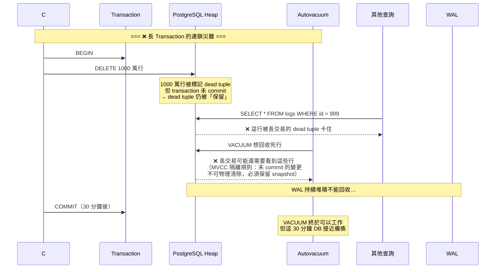
```mermaid
sequenceDiagram
    participant App as C# 應用
    participant TX as Transaction
    participant PG as PostgreSQL Heap
    participant VAC as Autovacuum
    participant Other as 其他查詢

    Note over App,VAC: === ❌ 長 Transaction 的連鎖災難 ===
    App->>TX: BEGIN
    App->>PG: DELETE 1000 萬行
    Note over PG: 1000 萬行被標記 dead tuple<br>但 transaction 未 commit<br>→ dead tuple 仍被「保留」
    Other->>PG: SELECT * FROM logs WHERE id = 999
    PG-->>Other: ❌ 這行被長交易的 dead tuple 卡住
    VAC->>PG: VACUUM 想回收死行
    PG-->>VAC: ❌ 長交易可能還需要看到這些行<br>（MVCC 隔離規則：未 commit 的變更<br>不可物理清除，必須保留 snapshot）
    Note over PG,WAL: WAL 持續堆積不能回收…
    App->>TX: COMMIT（30 分鐘後）
    Note over VAC: VACUUM 終於可以工作<br>但這 30 分鐘 DB 接近癱瘓
```

**✅ 分批刪除時，每批 commit 釋放 dead tuple**：

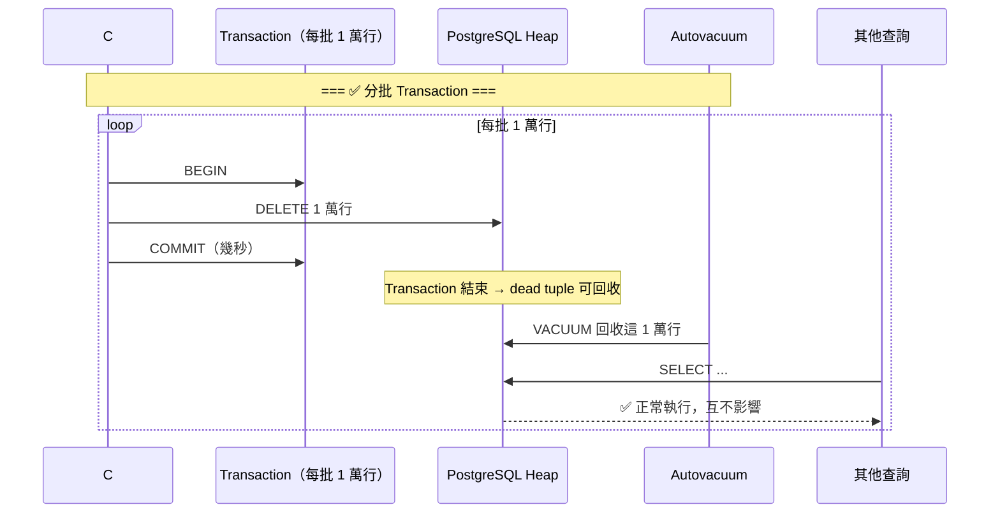
```mermaid
sequenceDiagram
    participant App as C# 應用
    participant TX as Transaction（每批 1 萬行）
    participant PG as PostgreSQL Heap
    participant VAC as Autovacuum
    participant Other as 其他查詢

    Note over App,VAC: === ✅ 分批 Transaction ===
    loop 每批 1 萬行
        App->>TX: BEGIN
        App->>PG: DELETE 1 萬行
        App->>TX: COMMIT（幾秒）
        Note over PG: Transaction 結束 → dead tuple 可回收
        VAC->>PG: VACUUM 回收這 1 萬行
        Other->>PG: SELECT ...
        PG-->>Other: ✅ 正常執行，互不影響
    end
```

核心差異：**長 transaction 把 dead tuple 當作「可能還會用到」而保留；分批 commit 後 dead tuple 馬上變成「確定可回收」**。

全部刪完後，再檢查 bloat 決定是否需要 pg_repack：

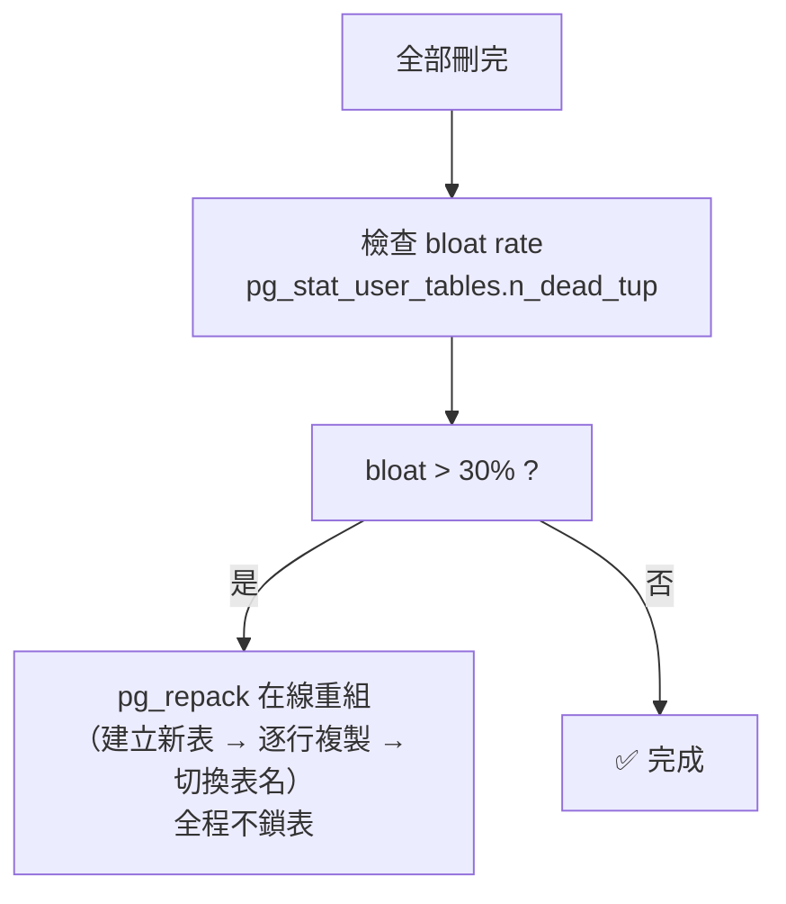
```mermaid
flowchart TD
    A["全部刪完"] --> B["檢查 bloat rate<br>pg_stat_user_tables.n_dead_tup"]
    B --> C["bloat > 30% ?"]
    C -->|是| D["pg_repack 在線重組<br>（建立新表 → 逐行複製 → 切換表名）<br>全程不鎖表"]
    C -->|否| E["✅ 完成"]
```

```sql
-- ✅ 正確做法：分批刪除，每批一個 transaction
DO $$
DECLARE
    deleted INT;
BEGIN
    LOOP
        DELETE FROM logs
        WHERE ctid IN (
            SELECT ctid FROM logs
            WHERE created_at < '2025-01-01'
            LIMIT 10000
        );
        GET DIAGNOSTICS deleted = ROW_COUNT;
        COMMIT;          -- 每批 commit，釋放 lock + 讓 VACUUM 可以工作
        RAISE NOTICE 'Deleted % rows', deleted;
        EXIT WHEN deleted = 0;
    END LOOP;
END $$;
```

```csharp
// ✅ C# 批次刪除 + bloat 檢查的完整實作
public async Task BatchDeleteOldLogs(DateTime before, int batchSize = 10000)
{
    int deleted;
    do
    {
        using var conn = await dataSource.OpenConnectionAsync();
        using var tx = await conn.BeginTransactionAsync();
        try
        {
            deleted = await conn.ExecuteAsync(
                @"DELETE FROM logs
                  WHERE ctid IN (
                      SELECT ctid FROM logs
                      WHERE created_at < @Before
                      LIMIT @BatchSize
                  )",
                new { Before = before, BatchSize = batchSize }, tx);
            await tx.CommitAsync();
        }
        catch { await tx.RollbackAsync(); throw; }
    } while (deleted > 0);

    // 全刪完後檢查 bloat rate
    await CheckBloat("logs");
}

// Bloat rate 檢查（生產環境可用 pgstattuple extension 或以下估算）
public async Task CheckBloat(string tableName)
{
    await using var conn = await dataSource.OpenConnectionAsync();
    var bloat = await conn.QuerySingleAsync(
        @"SELECT schemaname || '.' || relname AS tbl,
                 pg_size_pretty(pg_relation_size(relid)) AS size,
                 n_dead_tup AS dead_tuples,
                 CASE WHEN n_live_tup > 0
                      THEN round(100.0 * n_dead_tup / (n_live_tup + n_dead_tup), 2)
                      ELSE 0 END AS dead_ratio
          FROM pg_stat_user_tables
          WHERE relname = @Table",
        new { Table = tableName });

    if (bloat.dead_ratio > 30)
        _logger.LogWarning("Bloat detected: {Table} is {Pct}% dead tuples. Consider pg_repack.",
            bloat.tbl, bloat.dead_ratio);
}
```

> 補充（Senior Dev）：`pg_repack` 是社群工具，工作原理是建立一張新表 → 逐行複製 → 重建 index → 切換表名，全程不鎖表。這是取代 `VACUUM FULL`（會鎖死整張表）的標準解法。但 pg_repack 不是 PG 內建，需要手動安裝 extension。

---

## 5. 穩定性與效能規範


這是最長也最重要的章節。穩定性與效能規範涵蓋了從 SQL 寫法到連線管理、從索引選擇到交易控制的方方面面。以下用白話解釋幾個核心概念：

**什麼是 prepared statement？** 每次執行 SQL 時，PostgreSQL 需要經過「解析 → 重寫 → 規劃 → 執行」四個步驟。前三步合稱「硬解析」，在高併發場景下會耗大量 CPU。prepared statement（也稱 bind variable）讓 PostgreSQL 預先解析好查詢結構，之後只傳入參數值，跳過重複的解析步驟。例如 `SELECT * FROM users WHERE id = $1` 中的 `$1` 是佔位符，每次只需傳入具體的 id 值。

**為什麼秒殺場景要用 advisory lock？** 秒殺時成千上萬人同時搶同一個商品，如果用 `SELECT ... FOR UPDATE` 排隊，所有人都要等前面的人處理完。而 `pg_try_advisory_xact_lock(id)` 是「嘗試獲取輕量級鎖」——拿到鎖的人才可以執行扣庫存，拿不到的人直接返回失敗（不用排隊），成倍減少資料庫內的等待。

**什麼是 connection pool？** PostgreSQL 對每個客戶端連線會創建一個獨立後端行程，每個行程消耗約 5-10MB 記憶體。如果有 5000 個用戶同時連接，記憶體開銷是 25-50GB。connection pool（如 pgbouncer）在應用與資料庫之間建立一個連接池，讓 5000 個用戶共享 50 個資料庫連接，大幅節省資源。

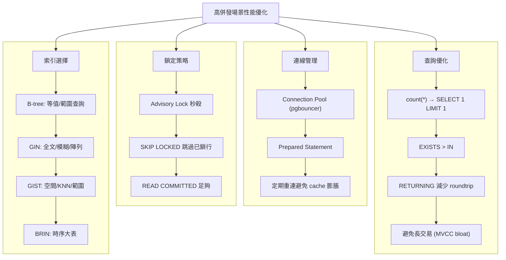
```mermaid
flowchart TD
    A["高併發場景性能優化"]

    A --> B["連線管理"]
    A --> C["查詢優化"]
    A --> D["鎖定策略"]
    A --> E["索引選擇"]

    subgraph B_GRP[" "]
        direction TB
        B1["Connection Pool (pgbouncer)"]
        B2["Prepared Statement"]
        B3["定期重連避免 cache 膨脹"]
        B --> B1 --> B2 --> B3
    end

    subgraph C_GRP[" "]
        direction TB
        C1["count(*) → SELECT 1 LIMIT 1"]
        C2["EXISTS > IN"]
        C3["RETURNING 減少 roundtrip"]
        C4["避免長交易 (MVCC bloat)"]
        C --> C1 --> C2 --> C3 --> C4
    end

    subgraph D_GRP[" "]
        direction TB
        D1["Advisory Lock 秒殺"]
        D2["SKIP LOCKED 跳過已鎖行"]
        D3["READ COMMITTED 足夠"]
        D --> D1 --> D2 --> D3
    end

    subgraph E_GRP[" "]
        direction TB
        E1["B-tree: 等值/範圍查詢"]
        E2["GIN: 全文/模糊/陣列"]
        E3["GIST: 空間/KNN/範圍"]
        E4["BRIN: 時序大表"]
        E --> E1 --> E2 --> E3 --> E4
    end
```

### I. Prepared Statement：三個 PG 核心使用場景

PostgreSQL 收到一條 SQL 後需經過四步：**解析（Parse）→ 重寫（Rewrite）→ 規劃（Plan）→ 執行（Execute）**。前三步合稱「硬解析」，每條 SQL 都要走一遍的話，高併發場景下 CPU 會被 parse 吃滿。

Prepared Statement 把 SQL 骨架先 parse + plan 好（一次性的開銷），後續只傳參數值就直接跳到 Execute。`$1` 是佔位符，每次只換值、不換 SQL 結構。

三個典型的 PG 使用場景：

**場景 1：OLTP 高頻點查（Web API 後端）**

```sql
-- 每次 Request 只換 id，SQL 骨架不變
-- ❌ 沒用 prepared：1000 QPS = 每秒硬解析 1000 次
-- ✅ 用 prepared：硬解析 1 次，其餘 999 次只做 Execute
PREPARE get_user (int) AS SELECT * FROM users WHERE id = $1;
EXECUTE get_user(1);
EXECUTE get_user(2);
```

```csharp
// Dapper 預設自動做 prepared statement
// Npgsql 內部會 cache prepared statement，同一條 SQL 只 prepare 一次
var user = await conn.QuerySingleAsync<User>(
    "SELECT * FROM users WHERE id = @Id",
    new { Id = request.UserId });
```

**場景 2：大量 INSERT 批次寫入**

```sql
-- 10,000 筆 log，每筆只換值
PREPARE insert_log (int, text, timestamptz) AS
    INSERT INTO event_logs (user_id, action, created_at) VALUES ($1, $2, $3);
EXECUTE insert_log(1, 'login', now());
EXECUTE insert_log(2, 'logout', now());
```

```csharp
// COPY 比 INSERT 快 10-50x，適合萬筆以上的批次
await using var writer = await conn.BeginBinaryImportAsync(
    "COPY event_logs (user_id, action, created_at) FROM STDIN (FORMAT BINARY)");
foreach (var log in logs)
    await writer.WriteRowAsync(log.UserId, log.Action, log.CreatedAt);
await writer.CompleteAsync();
```

**場景 3：PL/pgSQL Function 內建的自動 Prepare**

Function 內的 SQL 會被 PG **自動**當成 prepared statement。第一次 call 時 parse + plan，同一個 session 內後續呼叫直接 execute。

```sql
CREATE OR REPLACE FUNCTION get_order_total(order_id int) RETURNS numeric AS $$
    SELECT SUM(amount) FROM order_items WHERE order_id = $1;
$$ LANGUAGE sql;
-- 第一次：parse + plan + execute；後續呼叫：只 execute（plan 已 cache）
```

> plan cache 是 **per-session** 的。這就是為什麼 `MinPoolSize` 重要——保持熱連線就能保持 plan cache，新連線的第一次呼叫仍需 prepare。

### II. 為什麼 Client 端做 Cache？對 DB Server 的影響

**先釐清一個關鍵點：Dapper 根本不做 Parse。**

整條鏈路是：

```
Dapper（物件映射，把 C# 參數塞進 SQL、把回傳 rows 變成物件）
  → Npgsql（.NET driver，負責講 PostgreSQL wire protocol）
    → PostgreSQL server（真正做 Parse / Plan / Execute）
```

Dapper 只是一個 micro-ORM。決定「要不要 prepare、走哪種 protocol」的是 Npgsql；真正做 Parse 的是 server。

**SQL 是文字，執行引擎不能直接跑文字。**

你送過去的 `SELECT * FROM users WHERE id = 1` 對 server 而言只是一串 bytes。執行引擎能跑的不是文字，而是一棵**執行計畫樹（plan tree）**——「先掃哪個 index、用 hash join 還是 nested loop」這種一步步的操作節點。

從文字到可執行的東西，中間必經三步：

```
Parse   → 語法檢查、語意檢查（這張表存在嗎？欄位型別對嗎？）
Rewrite → 展開 view、套用 rule
Plan    → 根據統計資訊算成本，挑出最佳執行計畫
```

「直接 execute」這個動作在物理上不存在——在 parse + plan 之前，根本沒有「東西」可以被 execute。

**兩種 Protocol：Simple Query vs Extended Query**

PostgreSQL 的 wire protocol 有兩條路：

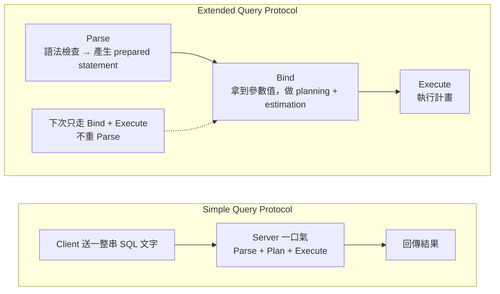
```mermaid
flowchart LR
    subgraph SQ["Simple Query Protocol"]
        direction LR
        A["Client 送一整串 SQL 文字"] --> B["Server 一口氣<br/>Parse + Plan + Execute"] --> C["回傳結果"]
    end

    subgraph EQ["Extended Query Protocol"]
        direction LR
        P["Parse<br/>語法檢查 → 產生 prepared statement"]
        B2["Bind<br/>拿到參數值，做 planning + estimation"]
        E["Execute<br/>執行計畫"]
        P --> B2 --> E
        B2a["下次只走 Bind + Execute<br/>不重 Parse"] -.-> B2
    end
```

| Protocol | 行為 | roundtrip | cache plan？ |
|----------|------|-----------|-------------|
| Simple Query | client 丟整串文字，server 內部 parse+plan+execute 一次做完 | 1 | 不 cache |
| Extended Query | Parse / Bind / Execute 拆成三個獨立 message | 2（第一次）/ 1（後續） | 可 cache，可重用 |

Dapper 預設情況下，Npgsql 走的是 **Extended Protocol**。但除非你開啟 `Max Auto Prepare` 或手動呼叫 `Prepare()`，Npgsql 不會把 prepared statement 留著重用——所以每次呼叫，server 端其實還是重新 parse 一遍。只是拆成了三個 message 而已。

**那 Npgsql 做 client-side cache 的價值是什麼？**

當 `Max Auto Prepare > 0` 時，Npgsql 在客戶端記住「這條 SQL 在這個 physical connection 上已經 prepare 過了」。當 connection 從 pool 被重複使用時，Npgsql 知道不需再發一次 Parse message——直接 Bind + Execute。

```csharp
var builder = new NpgsqlConnectionStringBuilder
{
    MaxAutoPrepare = 20,       // 每個 physical connection 最多自動 prepare 20 條 SQL
    AutoPrepareMinUsages = 5   // 同一條 SQL 被呼叫 5 次後才自動 prepare
};
```

Npgsql 不會把每條 SQL 都 prepare——因為 prepare 本身也有開銷（server 端要分配 plan cache 記憶體）。只有被多次重複執行的 SQL 才值得。`AutoPrepareMinUsages = 5` 正好跟 PG 內部的 custom → generic plan 切換邏輯對齊。

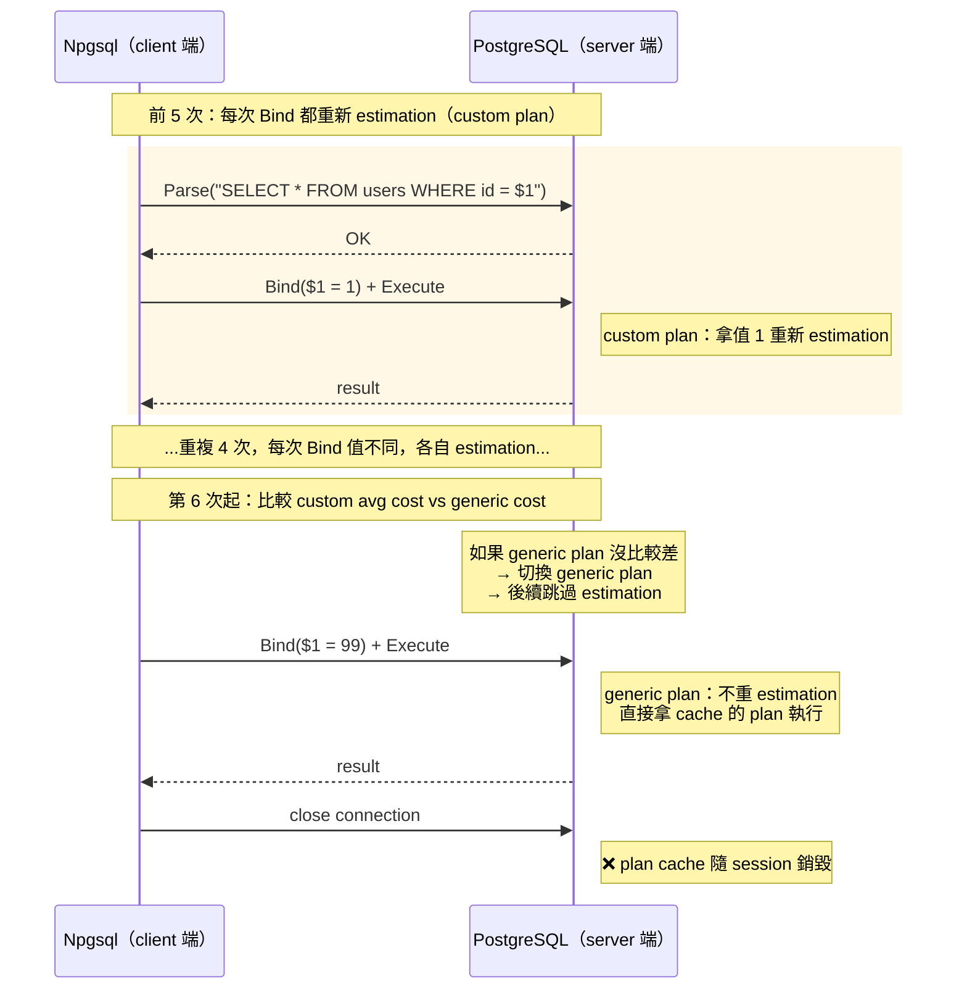
```mermaid
sequenceDiagram
    participant Np as Npgsql（client 端）
    participant PG as PostgreSQL（server 端）

    Note over Np,PG: 前 5 次：每次 Bind 都重新 estimation（custom plan）

    rect rgb(255, 248, 230)
        Np->>PG: Parse("SELECT * FROM users WHERE id = $1")
        PG-->>Np: OK
        Np->>PG: Bind($1 = 1) + Execute
        Note right of PG: custom plan：拿值 1 重新 estimation
        PG-->>Np: result
    end

    Note over Np,PG: ...重複 4 次，每次 Bind 值不同，各自 estimation...

    Note over Np,PG: 第 6 次起：比較 custom avg cost vs generic cost
    Note over PG: 如果 generic plan 沒比較差<br/>→ 切換 generic plan<br/>→ 後續跳過 estimation

    Np->>PG: Bind($1 = 99) + Execute
    Note right of PG: generic plan：不重 estimation<br/>直接拿 cache 的 plan 執行
    PG-->>Np: result

    Np->>PG: close connection
    Note right of PG: ❌ plan cache 隨 session 銷毀
```

PG 不是「第一次 Bind+Execute 就 cache 住計畫」，而是先跑 5 次 custom plan（每次帶實際參數值重新規劃），第 6 次起比較 custom plan 的平均成本 vs generic plan 的成本。如果 generic 沒比較差，才切換成 generic plan，之後就跳過規劃步驟。這是為了避免太早鎖死一個爛計畫——跟 SQL Server 的 parameter sniffing 問題形成鮮明對比。

| 層面 | 沒 Cache（每次重 Parse） | 有 Cache（重用 prepared plan） |
|------|--------------------------|-------------------------------|
| **應用延遲** | 每條 SQL 多一次 Parse message roundtrip | 省掉 Parse，只發 Bind+Execute |
| **DB Server CPU** | Parse + Plan 佔 CPU，高 QPS 下放大 | 前 5 次 custom plan 後續不重 estimation，CPU 下降 |
| **DB Server 記憶體** | 無常駐開銷 | 每條 prepared SQL 佔用 session private memory |

**總結一句話**：Npgsql 的 client-side cache 解決的是「connection pool 重用連線時，不必每次重建 prepared statement」的問題。對 DB server 的好處是**少做 Parse + estimation → CPU 下降**，而不是讓 SQL 本身跑更快。

### III. 深入實例：Named Statement `_p1` 的誕生到複用

先糾正一個關鍵誤解：**plan 從來不在 client 手上**。執行計畫是 server 端記憶體裡的東西，Npgsql / Dapper 看不到也拿不到。Client 能送的永遠只有 SQL 文字、一個 prepared statement 的「名字」（handle）、以及參數值。

名字就像寄物櫃號碼牌——東西（parse 好的 statement / plan）一直放在 server 的櫃子裡，client 只是出示號碼牌說「拿那個出來，參數是這些」。

**兩個「5」是巧合，分屬不同層、互不相干：**

| | `AutoPrepareMinUsages = 5` | generic plan 門檻 = 5 |
|---|---|---|
| 在哪 | **client 端**（Npgsql） | **server 端**（PostgreSQL） |
| 管什麼 | 同一段 SQL 文字用滿 5 次，Npgsql 才自動發 `Parse` 建立 named prepared statement | 一個 prepared statement 被 execute 滿 5 次後，server 才考慮從 custom plan 切到 generic plan |
| 計數對象 | SQL 文字出現次數 | prepared statement 的執行次數 |

兩個 5 純屬巧合，沒有任何因果關係。你可以把 `AutoPrepareMinUsages` 改成 3，server 那邊的 5 完全不受影響。

**完整時間線：跑 7 次同一條 SQL**

```csharp
// Max Auto Prepare = 20, Auto Prepare Min Usages = 5
for (int i = 1; i <= 7; i++)
{
    var user = conn.QuerySingle<User>(
        "SELECT id, name FROM users WHERE id = @id",
        new { id = i });
}
```

**第 1～4 次：還沒到門檻，走 unnamed statement**

Npgsql 每次都送完整 SQL，statement 名字是空字串（`""` = unnamed statement）。特性是下一個 `Parse` 一來就被覆蓋，留不住、無法重用。server 每次都得重新 parse。

```
Parse   (name="",  query="SELECT id, name FROM users WHERE id = $1")
Bind    (stmt="",  params=[1])
Execute
```

Npgsql 內部同時在數：這段 SQL 文字出現了幾次。

**第 5 次：達門檻，Npgsql 替它正式命名**

計數到 5，Npgsql 決定把它升級成 named prepared statement。先發一個帶名字的 `Parse`：

```
Parse   (name="_p1",  query="SELECT id, name FROM users WHERE id = $1")
```

**這一刻 `_p1` 才在 server 端誕生**——server parse 完，把這個 prepared statement 存進該 connection 的 session 記憶體。然後照常 Bind + Execute：

```
Bind    (stmt="_p1", params=[5])
Execute
```

同時 Npgsql 在 client 端記下對應關係：「這段 SQL 文字 → 已 prepare，名字 `_p1`」。

**第 6、7 次：複用，不再送 SQL 文字**

Npgsql 查自己的字典，發現這段 SQL 已經對應到 `_p1`，**完全不送 `Parse`、也不送 SQL 字串**：

```
Bind    (stmt="_p1", params=[6])
Execute
```

```
Bind    (stmt="_p1", params=[7])
Execute
```

Server 收到 Bind 時，靠 `_p1` 這個名字去 session 記憶體撈出早就 parse 好的 statement，**跳過 Parse**。

**接著輪到 server 端的 custom → generic：** 這個 prepared statement 的第 1～5 次 execute 還是會帶實際參數重新規劃（custom plan），第 6 次 execute 起 server 才可能切換到 generic plan，連 Plan 也跳過。注意這裡的「第 6 次 execute」是 statement 的執行次數，不是 SQL 文字的出現次數——它可能剛好對應 Npgsql 端的第 6 次，也可能更晚（取決於前面幾次的 `Bind` 實際值）。

**所以整條時間線實際上是兩個獨立優化先後疊加：**

```
Npgsql 端：第 1~4 次送 SQL → 第 5 次發 Parse 建立 _p1 → 第 6 次起只送名字 + 參數（跳過 Parse）
Server 端：_p1 前 5 次 execute 用 custom plan → 第 6 次起比較成本 → 可能切換 generic plan（跳過 Plan）
```

「跳過 Parse」和「跳過 Plan」是**兩個不同階段、由不同的計數器分別觸發**的優化，全都發生在 server 端。Client 只是負責「不要再重送 SQL 文字」。

因為 `_p1` 綁在**這條 connection 的 session** 上，連線一關（或從 pool 拿到另一條物理連線），prepared statement 就不在了。所以 Npgsql 的 auto-prepare 狀態是**跟著連線池裡每一條物理連線各自維護**的。

### IV. 補充：Parameter Sniffing 與 PG 的對應

**Parameter Sniffing** 是 SQL Server 的術語——第一個參數值「聞」出來的 plan 對後續參數可能很糟糕。PG 對應的概念就是上面的 custom plan vs generic plan 機制。

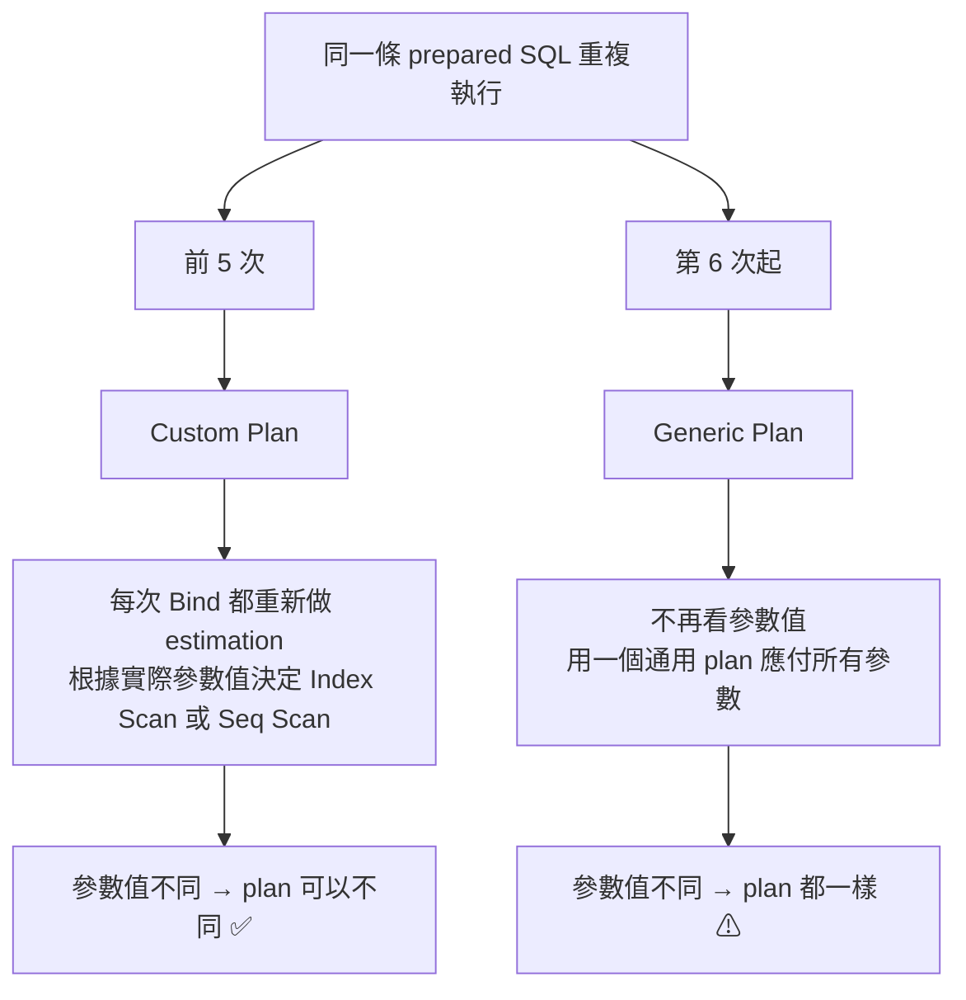
```mermaid
flowchart TD
    A["同一條 prepared SQL 重複執行"] --> B["前 5 次"]
    A --> C["第 6 次起"]

    B --> B1["Custom Plan"]
    B1 --> B2["每次 Bind 都重新做 estimation<br/>根據實際參數值決定 Index Scan 或 Seq Scan"]
    B2 --> B3["參數值不同 → plan 可以不同 ✅"]

    C --> C1["Generic Plan"]
    C1 --> C2["不再看參數值<br/>用一個通用 plan 應付所有參數"]
    C2 --> C3["參數值不同 → plan 都一樣 ⚠"]
```

核心矛盾：同一條 SQL、不同參數值，最優 plan 可能天差地別。

```sql
-- id = 1：1000 萬行中只有 1 行 → Index Scan 最優
SELECT * FROM orders WHERE id = 1;

-- id = 9999999：1000 萬行中 999 萬行匹配 → Seq Scan 最優
SELECT * FROM orders WHERE id = 9999999;
```

| 特性 | SQL Server | PostgreSQL |
|------|-----------|-----------|
| 第一次執行 | 根據參數值產生 plan，**立即 cache** | 根據參數值產生 plan（custom） |
| plan cache | 後續全用同一個 | **第 6 次才**比較成本、決定切換 generic |
| 出問題 | 第一個值極端 → 後續全爛 | 前 5 次各自 estimation，不會有問題 |
| 解法 | `OPTION (RECOMPILE)` | `SET plan_cache_mode = force_custom_plan` |

```sql
-- 強制每次都重新 estimation
SET plan_cache_mode = force_custom_plan;
```

### V. 強制規範

| # | 規則 | SQL |
|---|------|-----|
| 1 | 分頁邏輯：count = 0 時立即 return，不執行後續分頁 | — |
| 2 | Cursor 使用後立即關閉 | — |
| 3 | 2PC transaction 必須及時 commit/rollback，否則導致 DB bloat | — |
| 4 | 不用 `DELETE` 全表 → 用 `TRUNCATE`（DDL，設 `lock_timeout`） | — |
| 5 | Application 必須開啟 autocommit；避免框架 auto-BEGIN 空 transaction | — |
| 6 | 高併發必須用 prepared statement（bind variable），防止硬解析 CPU overhead | — |
| 7 | ~~不用 hash index（不寫 WAL，crash 不可恢復）~~ ⛔ **PG 10+ hash index 已寫 WAL，此限制解除** | — |
| 8 | 秒殺場景：必須用 `pg_try_advisory_xact_lock(id)` 鎖定後再更新；拿不到鎖重試 | 見下方 |
| 9 | 不要用 `count(*)` 判斷是否存在 → 用 `SELECT 1 ... LIMIT 1` | 見下方 |
| 10 | 高併發必須用 connection pool（程式層或 middleware：pgbouncer / pgpool-II） | — |
| 11 | 必須有重連機制；長時間空閒連接前用 `SELECT 1` 探測 | — |
| 12 | KNN 近鄰查詢必須建 GIST / SP-GIST index | 見下方 |
| 13 | 避免頻繁 create/drop temp table（造成 system catalog 碎片） | — |
| 14 | 只用最低需求的 isolation level；READ COMMITTED 足夠時不用 REPEATABLE READ / SERIALIZABLE | — |

```sql
-- #8 Advisory lock for flash sale
CREATE OR REPLACE FUNCTION public.f(i_id integer)
RETURNS void
LANGUAGE plpgsql
AS $function$
DECLARE
    a_lock boolean := false;
BEGIN
    SELECT pg_try_advisory_xact_lock(i_id) INTO a_lock;
    IF a_lock THEN
        UPDATE t1 SET count = count - 1 WHERE id = i_id;
    END IF;
    EXCEPTION WHEN others THEN
        RETURN;
END;
$function$;

SELECT f(id) FROM tbl WHERE id = ? AND count > 0;

-- #9 LIMIT 1 instead of count(*)
SELECT 1 FROM tbl WHERE xxx LIMIT 1;
-- if found → 存在
-- else     → 不存在

-- #12 KNN with GIST
CREATE INDEX idx ON tbl USING gist(col);
SELECT * FROM tbl ORDER BY col <-> '(0,100)';
```

### VI. App Dev 實戰：Connection Pool + Retry + 鎖定

**Connection Pool 設定**：Npgsql 內建 Pool，不需外部依賴。

```csharp
// Npgsql 7.0+：DataSource 是最好的 Pool 管理方式
var dataSource = new NpgsqlDataSourceBuilder(connString).Build();
// 整個 application lifetime 只建一次
builder.Services.AddSingleton(dataSource);

// 關鍵參數：
// MaxPoolSize = 50       — 公式：max_connections / 實例數 * 0.8
// MinPoolSize = 5        — 最少熱連線（避免 cold start）
// ConnectionIdleLifetime = 300 — 空閒 5 分鐘回收
// Timeout = 10           — 等待從 pool 拿連線的秒數
```

**Retry Pattern（Polly）**：

資料庫連線和查詢**不可能保證 100% 成功**——DBA 重啟、主備切換、網路瞬斷、連線池滿、死鎖被當祭品，這些事情一定會發生。關鍵不是避免它們，而是你的程式能不能自動恢復。

Retry 只能用在 **transient failure**（暫時性錯誤）上。永久性錯誤（如 constraint violation、syntax error）retry 一百次也會失敗，直接報錯就好。

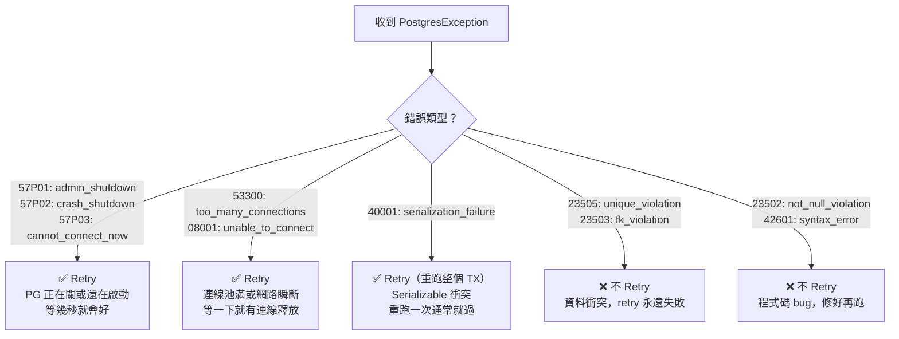
```mermaid
flowchart TD
    A["收到 PostgresException"] --> B{"錯誤類型？"}
    B -->|"57P01: admin_shutdown<br/>57P02: crash_shutdown<br/>57P03: cannot_connect_now"| C["✅ Retry<br/>PG 正在關或還在啟動<br/>等幾秒就會好"]
    B -->|"53300: too_many_connections<br/>08001: unable_to_connect"| D["✅ Retry<br/>連線池滿或網路瞬斷<br/>等一下就有連線釋放"]
    B -->|"40001: serialization_failure"| E["✅ Retry（重跑整個 TX）<br/>Serializable 衝突<br/>重跑一次通常就過"]
    B -->|"23505: unique_violation<br/>23503: fk_violation"| F["❌ 不 Retry<br/>資料衝突，retry 永遠失敗"]
    B -->|"23502: not_null_violation<br/>42601: syntax_error"| G["❌ 不 Retry<br/>程式碼 bug，修好再跑"]
```

**觸發 Retry 的具體場景**：

| Error Code | 場景 | 為什麼 Retry 有用 |
|-----------|------|-----------------|
| `57P01 admin_shutdown` | DBA 執行了 `pg_terminate_backend` 或 shutdown | PG 正在重啟，等幾秒後新連線就能通了 |
| `57P02 crash_shutdown` | PG process crash 後正在 recovery | 等 PG 完成 crash recovery 就好 |
| `57P03 cannot_connect_now` | PG 正在 startup 階段（剛剛被啟動） | startup 通常只需幾秒 |
| `53300 too_many_connections` | 其他 application 瞬間吃滿 max_connections | 等一下就有 connection 釋放；或連其他 host（multi-host） |
| `40001 serialization_failure` | Serializable 隔離級別下，兩個 TX 衝突 | PG 隨機挑一個當祭品，重跑通常就過 |
| `08001 / 08006` | 網路瞬斷、TCP timeout | 可能是負載平衡器或 NAT 短暫斷線 |
| `NpgsqlException.IsTransient` | Npgsql 自行判斷為可重試的錯誤 | Npgsql 內部封裝了常見 transient case |

**絕對不能 Retry 的場景**：

| Error Code | 原因 |
|-----------|------|
| `23505 unique_violation` | 重複插入，retry 100 次還是重複 |
| `23503 fk_violation` | 外鍵不存在，retry 不會讓它突然出現 |
| `23502 not_null_violation` | 漏了 NOT NULL 欄位，修 code 才能解 |
| `42601 syntax_error` | SQL 寫錯了，不是環境問題 |
| `40002 transaction_integrity_constraint_violation` | TX 狀態已損壞 |

**Retry 的核心陷阱：Idempotency（冪等性）**

```csharp
// ❌ 危險：INSERT 不是冪等的，retry 可能產生重複資料
await conn.ExecuteAsync("INSERT INTO orders (user_id, amount) VALUES (@Uid, @Amt)", param);

// ✅ 解法 1：先查是否存在，再決定 INSERT 或 UPDATE（UPSERT）
await conn.ExecuteAsync(
    @"INSERT INTO orders (user_id, amount) VALUES (@Uid, @Amt)
      ON CONFLICT (idempotency_key) DO NOTHING", param);

// ✅ 解法 2：整個 transaction 重跑（包含業務邏輯的判斷）
// retry 應該重跑整個 unit of work，不只是重送 SQL
```

**完整 Retry Policy（含 Jitter，防雪崩）**：

```csharp
using Polly;

public static IAsyncPolicy GetRetryPolicy() => Policy
    .Handle<PostgresException>(ex =>
        ex.SqlState == PostgresErrorCodes.AdminShutdown ||
        ex.SqlState == PostgresErrorCodes.CrashShutdown ||
        ex.SqlState == PostgresErrorCodes.CannotConnectNow ||
        ex.SqlState == PostgresErrorCodes.TooManyConnections ||
        ex.SqlState == PostgresErrorCodes.SerializationFailure)
    .Or<NpgsqlException>(ex => ex.IsTransient)
    .WaitAndRetryAsync(
        retryCount: 3,
        sleepDurationProvider: retryAttempt =>
            // exponential backoff + jitter：防所有 client 同時重試
            TimeSpan.FromMilliseconds(
                Math.Pow(2, retryAttempt) * 100   // 100, 200, 400ms
                + Random.Shared.Next(0, 50)),       // 加 0~50ms 隨機抖動
        onRetry: (ex, ts, count, _) =>
            _logger.LogWarning("Retry {Count}/3 after {Delay}ms: {Error}",
                count, ts.TotalMilliseconds, ex.Message));
```

`Math.Pow(2, retry) * 100` 產生 100ms → 200ms → 400ms 指數退避。`Random` 加隨機抖動避免所有 client 剛好在同一毫秒醒來再打一次（thundering herd）。

**與 Dapper + NpgsqlDataSource 的完整整合**：

```csharp
// ========================================
// Step 1：DI 註冊（Program.cs）
// ========================================
var builder = WebApplication.CreateBuilder(args);

// Npgsql DataSource（整個 app lifetime 只建一個）
builder.Services.AddNpgsqlDataSource(builder.Configuration.GetConnectionString("Default"));

// Polly Retry Policy（全域註冊，所有 Repository 共用）
builder.Services.AddSingleton(GetRetryPolicy());

// ========================================
// Step 2：Repository 層 — 讀取（Retry 包在最外層）
// ========================================
public class OrderRepository
{
    private readonly NpgsqlDataSource _dataSource;
    private readonly IAsyncPolicy _retryPolicy;

    public OrderRepository(NpgsqlDataSource dataSource, [FromKeyedServices("db-retry")] IAsyncPolicy retryPolicy)
    {
        _dataSource = dataSource;
        _retryPolicy = retryPolicy;
    }

    // ✅ 讀取：retry 包在最外層。DataSource 內部管理連線池，
    // 每次 ExecuteAsync 會自動從池中取一條（可能是不同物理連線），
    // 前次失敗的連線會被自動丟棄
    public async Task<Order?> GetById(int id) =>
        await _retryPolicy.ExecuteAsync(async () =>
        {
            await using var conn = await _dataSource.OpenConnectionAsync();
            return await conn.QuerySingleOrDefaultAsync<Order>(
                "SELECT * FROM orders WHERE id = @Id", new { Id = id });
        });

    // ✅ 寫入：同樣 retry 在最外層，每次重試都走完整流程
    public async Task Insert(Order order) =>
        await _retryPolicy.ExecuteAsync(async () =>
        {
            await using var conn = await _dataSource.OpenConnectionAsync();
            await conn.ExecuteAsync(
                "INSERT INTO orders (user_id, amount) VALUES (@Uid, @Amt)",
                new { Uid = order.UserId, Amt = order.Amount });
        });
}

// ========================================
// Step 3：Service 層 — Transaction（Retry 重跑整個 TX）
// ========================================
public class TransferService
{
    private readonly NpgsqlDataSource _dataSource;
    private readonly IAsyncPolicy _retryPolicy;

    // ✅ Transaction 的 retry：重跑整個 TX，不是只重送最後一條 SQL
    public async Task Transfer(int fromId, int toId, decimal amount) =>
        await _retryPolicy.ExecuteAsync(async () =>
        {
            await using var conn = await _dataSource.OpenConnectionAsync();
            using var tx = await conn.BeginTransactionAsync();
            try
            {
                var ids = new[] { fromId, toId }.OrderBy(id => id).ToArray();
                foreach (var id in ids)
                    await conn.ExecuteAsync(
                        "SELECT 1 FROM accounts WHERE id = @Id FOR UPDATE",
                        new { Id = id }, tx);

                await conn.ExecuteAsync(
                    "UPDATE accounts SET balance = balance - @Amt WHERE id = @Fid",
                    new { Fid = fromId, Amt = amount }, tx);
                await conn.ExecuteAsync(
                    "UPDATE accounts SET balance = balance + @Amt WHERE id = @Tid",
                    new { Tid = toId, Amt = amount }, tx);

                await tx.CommitAsync();
            }
            catch
            {
                await tx.RollbackAsync();
                throw; // 拋給 Polly，它判斷是 transient 就 retry 整個 tx
            }
        });
}
```

**關鍵：Retry 應該包在哪一層？**

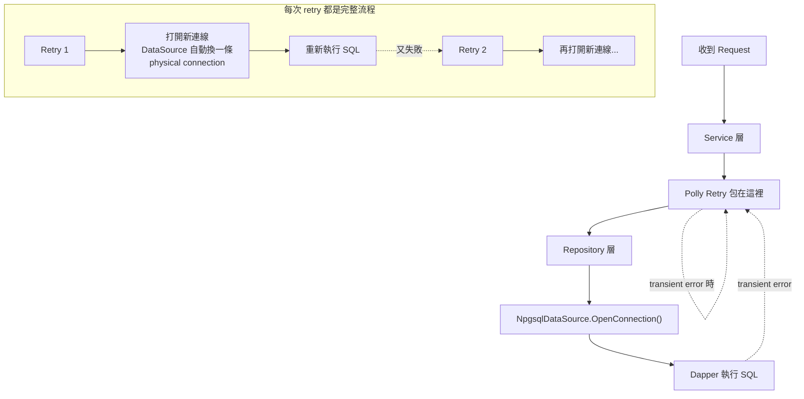
```mermaid
flowchart TD
    A["收到 Request"] --> B["Service 層"]
    B --> C["Polly Retry 包在這裡"]
    C --> D["Repository 層"]
    D --> E["NpgsqlDataSource.OpenConnection()"]
    E --> F["Dapper 執行 SQL"]

    C -.->|"transient error 時"| C
    F -.->|"transient error"| C

    subgraph "每次 retry 都是完整流程"
        C2["Retry 1"] --> D2["打開新連線<br/>DataSource 自動換一條<br/>physical connection"]
        D2 --> F2["重新執行 SQL"]
        F2 -.->|"又失敗"| C3["Retry 2"]
        C3 --> D3["再打開新連線..."]
    end
```

Retry 永遠應該包在 **unit of work 的最外層**（通常是 Service 層），不是只包單條 SQL。原因：
- 如果是 transaction，retry 必須重跑整個 TX（包含 BEGIN → 邏輯 → COMMIT），不能只重送 `COMMIT`
- 前次失敗的 physical connection 狀態可能不乾淨，DataSource 會自動丟掉它，下次 `OpenConnectionAsync()` 拿到的是一條全新的
- `40001 serialization_failure` 發生在 `COMMIT` 時，如果 retry 只包 `COMMIT`，前面的 `UPDATE` 沒重跑 → 資料不一致

**Advisory Lock（秒殺）** 的完整 C# 實作：

```csharp
public async Task<PurchaseResult> TryPurchase(int productId, int userId)
{
    await using var conn = await dataSource.OpenConnectionAsync();
    using var tx = await conn.BeginTransactionAsync();
    try
    {
        // 嘗試獲取輕量級鎖（不排隊）
        var locked = await conn.ExecuteScalarAsync<bool>(
            "SELECT pg_try_advisory_xact_lock(@Id)", new { Id = productId }, tx);
        if (!locked)
            return PurchaseResult.Busy("系統繁忙，請稍後重試");

        var affected = await conn.ExecuteAsync(
            "UPDATE flash_sale SET stock = stock - 1 WHERE id = @Id AND stock > 0",
            new { Id = productId }, tx);
        if (affected == 0)
            return PurchaseResult.SoldOut("已售罄");

        await conn.ExecuteAsync(
            "INSERT INTO orders (user_id, product_id) VALUES (@Uid, @Pid)",
            new { Uid = userId, Pid = productId }, tx);

        await tx.CommitAsync();
        return PurchaseResult.Ok(); // lock 隨 commit 自動釋放
    }
    catch { await tx.RollbackAsync(); throw; }
}
```

**SKIP LOCKED（Work Queue）**：

```csharp
public async Task<Job?> ClaimJob()
{
    await using var conn = await dataSource.OpenConnectionAsync();
    using var tx = await conn.BeginTransactionAsync();
    var job = await conn.QuerySingleOrDefaultAsync<Job>(
        @"SELECT id, payload FROM job_queue WHERE status = 'pending'
          ORDER BY created_at LIMIT 1 FOR UPDATE SKIP LOCKED", tx);
    if (job == null) return null;
    await conn.ExecuteAsync("UPDATE job_queue SET status = 'processing' WHERE id = @Id",
        new { job.Id }, tx);
    await tx.CommitAsync();
    return job;
}
```

**Npgsql CommandTimeout vs statement_timeout**：

| 層級 | 設定 | 行為 |
|------|------|------|
| Npgsql | `CommandTimeout = 30` | 客戶端計時，超時發 CancelRequest |
| PG | `SET statement_timeout = '25s'` | 服務端計時，超時終止查詢 |

```csharp
// 兩層都設（雙重防護），PG 層略小於 Npgsql 層
var builder = new NpgsqlConnectionStringBuilder { CommandTimeout = 30,
    Options = "-c statement_timeout=25000" };
```

**長交易檢測**：從應用層自我監控。

```csharp
public async Task DetectLongTx()
{
    await using var conn = await dataSource.OpenConnectionAsync();
    var txs = await conn.QueryAsync(
        @"SELECT pid, application_name, now() - query_start AS dur, query
          FROM pg_stat_activity
          WHERE state = 'idle in transaction' AND now() - query_start > '30s'::interval");
    foreach (var tx in txs) _logger.LogWarning("Long TX: {@Tx}", tx);
}
```

### VII. 推薦規範

| # | 規則 |
|---|------|
| 15 | 高峰期避免 `ALTER TABLE ADD COLUMN ... DEFAULT`（觸發 rewrite）；先加 column 不加 default，application 層後處理 |
| 16 | 空間查詢（contains, intersects）：用大面積多邊形提效；無法時 split polygon + UNION ALL |
| 17 | 不需精確分頁數 → 用 EXPLAIN-based 快速估算 `countit()` function |
| 18 | 分頁優化 → 用 cursor（`DECLARE ... CURSOR` + `FETCH`）；後翻用 `SCROLL` cursor |
| 19 | 可預估執行時間的 query → 設 `statement_timeout`，防止雪崩和長時間持鎖 |
| 20 | `TRUNCATE` 是 DDL，鎖粒度大 → 開發程式碼中不用，除非加 `lock_timeout` |
| 21 | 將 DDL 封裝在 transaction 中以便 rollback；但必須短 transaction |
| 22 | 用 `INSERT/UPDATE/DELETE ... RETURNING` 減少 DB roundtrip |
| 23 | 自增欄位用 sequence（`serial2/4/8`）；禁用 trigger 產生序列值 |
| 24 | 多 column 任意匹配查詢 → row-level full-text index（`to_tsvector(row::text)`）或 row-to-array index |
| 25 | 中文分詞必須設 token mapping（`ALTER TEXT SEARCH CONFIGURATION ... ADD MAPPING FOR a,b,c,... WITH simple`）；配置 zhparser 參數 |
| 26 | Tree query → recursive CTE；確保終止條件；避免 tree data 重複 |
| 27 | 避免長 transaction（造成 garbage bloat） |
| 28 | 多維分析 → `GROUPING SETS`、`CUBE`、`ROLLUP`（減少 data rescan） |
| 29 | 快速近似 UV（`count distinct`）→ HLL extension |
| 30 | Upsert → `INSERT ... ON CONFLICT DO NOTHING / DO UPDATE SET ...` |
| 31 | 常訪問的大表子集/OLAP → `MATERIALIZED VIEW`；支援 `REFRESH MATERIALIZED VIEW CONCURRENTLY` |
| 32 | 避免頻繁 update 寬表（MVCC write amplification）；將常更新 column 拆分到獨立表，PK join |
| 33 | 用 window function 減少 app-DB roundtrip |
| 34 | Application 層防止 deadlock：同一 user 的數據在單一 thread/session 處理 |
| 35 | OLTP：避免頻繁 aggregation → 定期聚合 + caching |
| 36 | 數據去重：row-level → `DELETE WHERE ctid NOT IN (SELECT min(ctid) FROM tbl GROUP BY tbl::text)`；有 PK → `row_number() OVER (PARTITION BY col ORDER BY pk)` |
| 37 | 快速隨機取記錄：方法一 → random id sampling from `generate_series`；方法二 → plpgsql function |
| 38 | Online schema change（`ADD COLUMN`, `CREATE INDEX`）在離峰時段進行 |
| 39 | OLTP：高峰期禁止長 SQL、大事務、大批量操作 |
| 40 | Query 條件與 index 類型匹配（expression → expression index；column → column index） |
| 41 | 比較值含 NULL 時用 `IS DISTINCT FROM` / `IS NOT DISTINCT FROM`（NULL 視為相等） |
| 42 | UDF/DO block 中逐行處理用 cursor + `WHERE CURRENT OF` |
| 43 | 避免 `!=` / `<>` 在 WHERE（可能無法用 index）；解法：partial index、partition、`constraint_exclusion=on` |
| 44 | 頻繁變動的表：降低 `autovacuum_vacuum_scale_factor`（如 0.005）、`autovacuum_analyze_scale_factor`（如 0.01）、設 `autovacuum_vacuum_cost_delay=0` |
| 45 | `WHERE col IN (...)` / `WHERE col=a OR col=b` → PG 自動用 bitmap OR，不需手動改 UNION |
| 46 | 優先使用 `EXISTS (SELECT 1 ...)` 而非 `IN (SELECT ...)` |
| 47 | 優先使用 array variable 而非 temp table（除非數據量極大） |
| 48 | 避免全表掃描：`WHERE` 和 `ORDER BY` 欄位建 index；用 `EXPLAIN (verbose,costs,timing,buffers,analyze)` 驗證 |
| 49 | 控制 JOIN order：`join_collapse_limit=1` + `geqo=off` 固定 explicit JOIN order；或讓 optimizer 找最佳順序再改寫 SQL |
| 50 | 控制 subquery flattening：`from_collapse_limit=1` + `geqo=off` 防止 subquery 提升為 JOIN |
| 51 | GIN write 優化：`fastupdate=on`，設適當 `gin_pending_list_limit` (KB) |
| 52 | B-tree：避免 UUID 等高離散值作 index key（過多 page split）；調整 `fillfactor` |
| 53 | BRIN：依數據相關性設 `pages_per_range`；用 `ANALYZE tbl; SELECT reltuples/relpages` 評估 |

#### a. 推薦規範詳解：用 ID 排序防止 Deadlock

規則 #34「同一 user 的數據在單一 thread 處理」解決的是一半的問題。另一半是：**多筆資料更新時，必須按固定順序鎖定 row**。

Deadlock 的本質是兩個 transaction 互相等待對方釋放鎖：

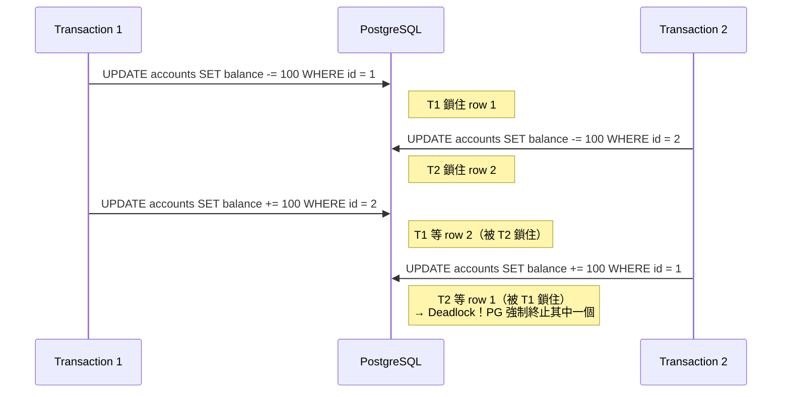
```mermaid
sequenceDiagram
    participant T1 as Transaction 1
    participant PG as PostgreSQL
    participant T2 as Transaction 2

    T1->>PG: UPDATE accounts SET balance -= 100 WHERE id = 1
    Note right of PG: T1 鎖住 row 1

    T2->>PG: UPDATE accounts SET balance -= 100 WHERE id = 2
    Note right of PG: T2 鎖住 row 2

    T1->>PG: UPDATE accounts SET balance += 100 WHERE id = 2
    Note right of PG: T1 等 row 2（被 T2 鎖住）

    T2->>PG: UPDATE accounts SET balance += 100 WHERE id = 1
    Note right of PG: T2 等 row 1（被 T1 鎖住）<br/>→ Deadlock！PG 強制終止其中一個
```

解法極簡單：**永遠按 ID 升序鎖定**。

```sql
-- ❌ 轉帳 1→2 和 2→1 同時發生，鎖定順序相反 → deadlock
-- T1: UPDATE WHERE id = 1; UPDATE WHERE id = 2;  （先鎖 1 再鎖 2）
-- T2: UPDATE WHERE id = 2; UPDATE WHERE id = 1;  （先鎖 2 再鎖 1）

-- ✅ 固定順序：永遠先鎖小 ID，再鎖大 ID
-- T1: UPDATE WHERE id = 1; UPDATE WHERE id = 2;  （1 < 2，先鎖 1）
-- T2: UPDATE WHERE id = 1; UPDATE WHERE id = 2;  （1 < 2，先鎖 1）
-- → T1 鎖住 1 後，T2 等 1；T1 鎖住 2 完成後釋放，T2 繼續 → 不 deadlock
```

```csharp
public async Task Transfer(int fromId, int toId, decimal amount)
{
    // ✅ 按 ID 升序保證全域一致的鎖定順序
    var ids = new[] { fromId, toId }.OrderBy(id => id).ToArray();

    using var tx = await conn.BeginTransactionAsync();
    try
    {
        // 先鎖小 ID，再鎖大 ID（兩個 transaction 的鎖定順序永遠一致）
        foreach (var id in ids)
            await conn.ExecuteAsync(
                "SELECT 1 FROM accounts WHERE id = @Id FOR UPDATE",
                new { Id = id }, tx);

        await conn.ExecuteAsync(
            "UPDATE accounts SET balance = balance - @Amt WHERE id = @Fid", new { Fid = fromId, Amt = amount }, tx);
        await conn.ExecuteAsync(
            "UPDATE accounts SET balance = balance + @Amt WHERE id = @Tid", new { Tid = toId, Amt = amount }, tx);

        await tx.CommitAsync();
    }
    catch (PostgresException ex) when (ex.SqlState == PostgresErrorCodes.DeadlockDetected)
    {
        await tx.RollbackAsync();
        throw; // 上層 retry
    }
}
```

核心原則：只要所有 transaction 對同一組資源的鎖定順序一致（例如都按 ID 升序），就**不可能形成環狀等待**。這是純應用層的保證，不需要任何 DB 端設定。

### VIII. 精選 SQL 範例

```sql
-- #17 快速估算分頁數
CREATE OR REPLACE FUNCTION countit(text)
RETURNS float4
LANGUAGE plpgsql AS $$
DECLARE v_plan json;
BEGIN
    EXECUTE 'EXPLAIN (FORMAT JSON) ' || $1 INTO v_plan;
    RETURN v_plan #>> '{0,Plan,"Plan Rows"}';
END;
$$;
SELECT countit('SELECT * FROM t1234 WHERE id < 1000');  -- 954

-- #18 Cursor pagination
DECLARE cur1 CURSOR FOR SELECT * FROM sbtest1 WHERE id BETWEEN 100 AND 1000000 ORDER BY id;
FETCH 100 FROM cur1;
DECLARE cur1 SCROLL CURSOR FOR ...;  -- 支援前後翻頁

-- #19 statement_timeout
BEGIN;
SET LOCAL statement_timeout = '10s';
-- query;
END;

-- #22 RETURNING
CREATE TABLE tbl4(id serial, info text);
INSERT INTO tbl4 (info) VALUES ('test') RETURNING *;
UPDATE tbl4 SET info = 'abc' RETURNING *;
DELETE FROM tbl4 RETURNING *;

-- #24 Row-level full-text index
CREATE OR REPLACE FUNCTION f1(text) RETURNS tsvector AS $$
    SELECT to_tsvector($1);
$$ LANGUAGE sql IMMUTABLE STRICT;
ALTER FUNCTION record_out(record) IMMUTABLE;
ALTER FUNCTION textin(cstring) IMMUTABLE;
CREATE INDEX idx_t_1 ON t USING gin (f1('jiebacfg'::regconfig, t::text));
SELECT * FROM t WHERE f1('jiebacfg'::regconfig, t::text) @@ to_tsquery('digoal & china');

-- #25 Chinese token mapping
ALTER TEXT SEARCH CONFIGURATION testzhcfg
    ADD MAPPING FOR a,b,c,d,e,f,g,h,i,j,k,l,m,n,o,p,q,r,s,t,u,v,w,x,y,z WITH simple;

-- zhparser options:
-- zhparser.punctuation_ignore = f
-- zhparser.seg_with_duality = f
-- zhparser.dict_in_memory = f
-- zhparser.multi_short = f
-- zhparser.multi_duality = f
-- zhparser.multi_zmain = f
-- zhparser.multi_zall = f

-- #26 Recursive CTE (tree)
CREATE TABLE tbl_test (ID numeric, NAME text, PID numeric DEFAULT 0);
INSERT INTO tbl_test VALUES ('1','10','0'),('2','11','1'),('3','20','0'),('4','12','1'),('5','121','2');

-- Root → leaf:
WITH RECURSIVE t_result AS (
    SELECT * FROM tbl_test WHERE id = 1
    UNION ALL
    SELECT t2.* FROM t_result t1 JOIN tbl_test t2 ON t1.id = t2.pid
) SELECT * FROM t_result;

-- Leaf → root:
WITH RECURSIVE t_result AS (
    SELECT * FROM tbl_test WHERE id = 5
    UNION ALL
    SELECT t2.* FROM t_result t1 JOIN tbl_test t2 ON t1.pid = t2.id
) SELECT * FROM t_result;

-- #28 Multi-dimensional analysis with CUBE + GROUPING SETS
CREATE TABLE tab5(c1 int, c2 int, c3 int, c4 int, crt_time timestamp);
INSERT INTO tab5 SELECT
    trunc(100*random()), trunc(1000*random()),
    trunc(10000*random()), trunc(100000*random()),
    clock_timestamp() + (trunc(10000*random())||' hour')::interval
FROM generate_series(1, 1000000);

CREATE TABLE stat_tab5 (
    c1 int, c2 int, c3 int, c4 int,
    time1 text, time2 text, time3 text, time4 text,
    cnt int8, bitmap text
);

INSERT INTO stat_tab5
SELECT c1,c2,c3,c4, t1,t2,t3,t4, cnt,
    '' ||
    CASE WHEN c1 IS NULL THEN 0 ELSE 1 END ||
    CASE WHEN c2 IS NULL THEN 0 ELSE 1 END ||
    CASE WHEN c3 IS NULL THEN 0 ELSE 1 END ||
    CASE WHEN c4 IS NULL THEN 0 ELSE 1 END ||
    CASE WHEN t1 IS NULL THEN 0 ELSE 1 END ||
    CASE WHEN t2 IS NULL THEN 0 ELSE 1 END ||
    CASE WHEN t3 IS NULL THEN 0 ELSE 1 END ||
    CASE WHEN t4 IS NULL THEN 0 ELSE 1 END
FROM (
    SELECT c1,c2,c3,c4,
        to_char(crt_time, 'yyyy') t1,
        to_char(crt_time, 'yyyy-mm') t2,
        to_char(crt_time, 'yyyy-mm-dd') t3,
        to_char(crt_time, 'yyyy-mm-dd hh24') t4,
        count(*) cnt
    FROM tab5
    GROUP BY CUBE(c1,c2,c3,c4),
        GROUPING SETS(
            to_char(crt_time, 'yyyy'),
            to_char(crt_time, 'yyyy-mm'),
            to_char(crt_time, 'yyyy-mm-dd'),
            to_char(crt_time, 'yyyy-mm-dd hh24')
        )
) t;
-- INSERT 0 49570486, Time: 172374 ms

CREATE INDEX idx_stat_tab5_bitmap ON stat_tab5 (bitmap);

-- 查詢維度 c1,c3,c4,t3 → bitmap='10110010'
SELECT c1,c3,c4,time3,cnt FROM stat_tab5 WHERE bitmap = '10110010' LIMIT 10;
-- Time: 0.528 ms

-- #29 HLL approximate UV
CREATE TABLE access_date (acc_date date UNIQUE, userids hll);
INSERT INTO access_date
    SELECT current_date, hll_add_agg(hll_hash_integer(user_id))
    FROM generate_series(1, 10000) t(user_id);
SELECT *, total_users - COALESCE(lag(total_users,1) OVER (ORDER BY rn), 0) AS new_users
FROM (
    SELECT acc_date, row_number() OVER date AS rn,
        #hll_union_agg(userids) OVER date AS total_users
    FROM access_date
    WINDOW date AS (ORDER BY acc_date ASC ROWS UNBOUNDED PRECEDING)
) t;

-- #30 ON CONFLICT
INSERT INTO tbl VALUES (1, 'info')
    ON CONFLICT ON CONSTRAINT tbl_pkey
    DO UPDATE SET info = excluded.info;

-- #31 MATERIALIZED VIEW
CREATE MATERIALIZED VIEW mv_tbl AS SELECT xx,xx,xx FROM tbl WHERE xxx WITH DATA;
REFRESH MATERIALIZED VIEW CONCURRENTLY mv_tbl WITH DATA;

-- #36 Dedup
-- Row-level:
DELETE FROM tbl WHERE ctid NOT IN (SELECT min(ctid) FROM tbl GROUP BY tbl::text);
-- Column-level with PK:
DELETE FROM tbl WHERE pk IN (
    SELECT pk FROM (
        SELECT pk, row_number() OVER (PARTITION BY col ORDER BY pk) rn FROM tbl
    ) t WHERE t.rn > 1
);

-- #41 IS DISTINCT FROM
SELECT NULL IS DISTINCT FROM NULL;  -- f
SELECT NULL IS DISTINCT FROM 1;     -- t

-- #42 Cursor in DO block
DO LANGUAGE plpgsql $$
DECLARE
    cur refcursor;
    rec record;
BEGIN
    OPEN cur FOR SELECT * FROM tbl WHERE id > 1;
    LOOP
        FETCH cur INTO rec;
        IF found THEN
            RAISE NOTICE '%', rec;
            UPDATE tbl SET info = 'ab' WHERE CURRENT OF cur;
        ELSE
            CLOSE cur;
            EXIT;
        END IF;
    END LOOP;
END;
$$;

-- #44 Autovacuum tuning
CREATE TABLE t21(id int, info text) WITH (
    autovacuum_enabled = on,
    toast.autovacuum_enabled = on,
    autovacuum_vacuum_scale_factor = 0.005,
    toast.autovacuum_vacuum_scale_factor = 0.005,
    autovacuum_analyze_scale_factor = 0.01,
    autovacuum_vacuum_cost_delay = 0,
    toast.autovacuum_vacuum_cost_delay = 0
);

-- #46 EXISTS > IN
SELECT num FROM a WHERE EXISTS (SELECT 1 FROM b WHERE num = a.num);

-- #47 Array variable > temp table (small data)
-- #51 GIN fastupdate
CREATE INDEX idx_1 ON tbl USING gin (tsvector)
    WITH (fastupdate=on, gin_pending_list_limit=10240);

-- #53 BRIN evaluation
ANALYZE tbl;
SELECT reltuples / relpages FROM tbl;
```

### IX. #37 快速隨機取記錄

```sql
-- 方法一：random ID sampling
SELECT * FROM tbl_user
WHERE id IN (
    SELECT floor(random() * (max_id - min_id))::int + min_id
    FROM generate_series(1, 5),
        (SELECT max(id) AS max_id, min(id) AS min_id FROM tbl_user) s1
) LIMIT 5;

-- 方法二：plpgsql function
CREATE OR REPLACE FUNCTION f_get_random(i_range int) RETURNS SETOF record AS $$
DECLARE
    v_result record;
    v_max_id int;
    v_min_id int;
    v_random numeric;
BEGIN
    SELECT random() INTO v_random;
    SELECT max(id), min(id) INTO v_max_id, v_min_id FROM tbl_user;
    FOR v_result IN
        SELECT * FROM tbl_user
        WHERE id BETWEEN (v_min_id+(v_random*(v_max_id-v_min_id))::int)
                  AND (v_min_id+(v_random*(v_max_id-v_min_id))::int + i_range)
    LOOP
        RETURN NEXT v_result;
    END LOOP;
    RETURN;
END;
$$ LANGUAGE plpgsql;
```

### X. #49-50 JOIN Order & Subquery Control

```sql
-- 固定 explicit JOIN order
BEGIN;
SET LOCAL join_collapse_limit = 1;
SET LOCAL geqo = off;
-- your query with explicit JOIN order
END;

-- 讓 optimizer 找最佳 JOIN order（設高 join_collapse_limit），再改寫 SQL
SET join_collapse_limit = 100;
SET geqo = off;
EXPLAIN SELECT * FROM t2 JOIN t1 USING (id) JOIN t3 USING (id) ...;
-- → 根據 EXPLAIN 輸出改寫 SQL 為最佳 order

-- 固定 subquery 不 flatten（from_collapse_limit = 1）
SET from_collapse_limit = 1;
```

> 補充（Senior Dev）：#49-50 的 `join_collapse_limit` / `from_collapse_limit` 控制技巧是 DBA 排查 plan regression 的核心武器。PG 14+ 的 optimizer 對 multi-JOIN 的處理已大幅改進（特別是 `geqo_threshold` 預設值從 PG 16 起調整），大部分場景不需手動控制。若 production 遇到 join order 不穩，先用 `auto_explain` + `pg_stat_statements` 抓出問題 query，再用 `pg_hint_plan` pin 住最佳 plan，而非靠 `join_collapse_limit`。

---

## 6. 章末總結：Developer 落地檢查清單

每當改動 DB 相關程式碼時，快速過一遍：

| # | 檢查項 | 對應規範 | 為什麼重要 |
|---|--------|---------|-----------|
| 1 | Connection string 有設 `ApplicationName` 嗎？ | 命名 #7 | 出問題時 `pg_stat_activity` 一眼認出你的服務 |
| 2 | 有沒有用 `SELECT *`？ | Query #8 | 浪費頻寬 + Index Only Scan 失效 + schema 變更時爆炸 |
| 3 | Transaction 有包 `using` 嗎？ | 穩定性 #5 | 忘掉 Dispose = 一整排 lock 卡住 |
| 4 | `SUM()` 有包 `COALESCE(..., 0)` 嗎？ | Query #5 | C# 收到 default(T) 而非 NULL，藏 bug |
| 5 | Dapper 參數 null 是否變成 `WHERE col = NULL`？ | Query #6 | NULL = NULL 永遠不為 true |
| 6 | 判斷存在用 `EXISTS` 而非 `count(*) > 0` 嗎？ | 穩定性 #9 | count(*) 掃全表，EXISTS 碰到第一筆就停 |
| 7 | 秒殺用 Advisory Lock 嗎？ | 穩定性 #8 | FOR UPDATE 排隊 → TPS 差 4 倍 |
| 8 | 連線字串有設 Pool 參數嗎？ | 穩定性 #10 | 沒 pool = 3000 連線 = 15GB RAM |
| 9 | 有實作 Retry 嗎？ | 穩定性 #11 | transient error 不加 retry = 掉 request |
| 10 | DDL 有設 `lock_timeout` 嗎？ | 管理 #2 | ALTER TABLE 卡 30 秒 = 全站不能讀寫 |
| 11 | 有設 `statement_timeout` 嗎？ | 穩定性 #19 | 爛查詢跑 10 分鐘 = pool 被佔滿 |
| 12 | 隔離級別用了不必要的嗎？ | 穩定性 #14 | Repeatable Read 比 Read Committed 慢 2-10x |

```
章節關係圖：
  一、開發規範 ← 基底（連線、SQL、Transaction）
  ├── 三、JOIN 優化 → 為什麼 EXISTS > IN 這麼重要
  ├── 四、pgcrypto → Key 從 KMS 來，經 Custom GUC 傳入
  └── 六、12306 → Advisory Lock + SKIP LOCKED 的極限應用
```

---

# 二、PostgreSQL Trigger Audit — DML 欄位變更審計 + DDL 結構變更審計

> 來源（德哥 digoal Trigger 審計二部曲）：
> - [DDL 審計 — use event trigger record user who alter table (2014-12-11)](https://github.com/digoal/blog/blob/master/201412/20141211_02.md)
> - [DML 審計 — use trigger audit record which column modified (2014-12-14)](https://github.com/digoal/blog/blob/master/201412/20141214_01.md)

---

## 1. DML 審計：Row Trigger + hstore 記錄欄位級變更


DML（Data Manipulation Language，資料操作語言）審計的目標是記錄「誰在什麼時候對哪張表的哪些欄位做了什麼變更」。這對合規審計、問題排查、資料回溯都非常重要。

**什麼是 Trigger？** Trigger（觸發器）就像一個自動警報器——當你對某張表執行 INSERT、UPDATE 或 DELETE 時，PostgreSQL 自動呼叫一段你事先寫好的程式碼。這段程式碼可以檢查變更前後的資料、記錄變更內容，甚至可以阻止不合規的操作。

**hstore 在這裡的角色？** hstore 是 PostgreSQL 的 key-value 儲存擴展（類似 Python 的 dictionary 或 Java 的 HashMap）。Trigger 函數中用 `hstore(OLD.*)` 把一整行資料的所有欄位轉成 key-value 格式，方便統一儲存和比對。舉例：`{id => 1, name => "張三", email => "zhang@example.com"}`。

**審計流程**：當你執行 UPDATE 時，Trigger 會：
1. 把更新前的舊資料轉成 hstore（`old_rec`）
2. 把更新後的新資料轉成 hstore（`new_rec`）
3. 比對找出哪些欄位發生了變更（`diff_old_rec` 和 `diff_new_rec`）
4. 將以上資訊連同操作人、時間、IP 等一起寫入審計表

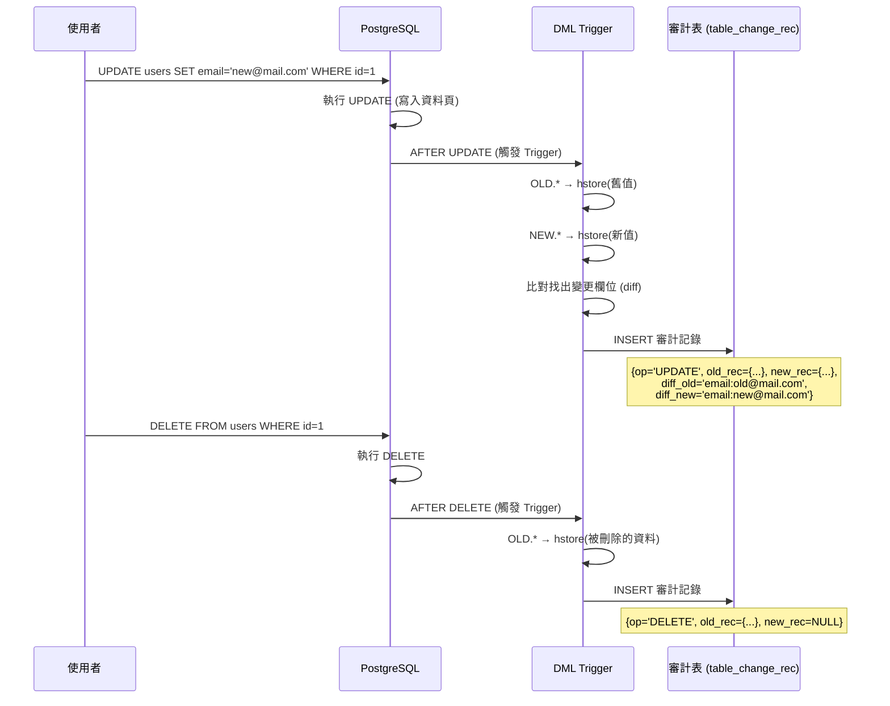
```mermaid
sequenceDiagram
    participant User as 使用者
    participant PG as PostgreSQL
    participant Trigger as DML Trigger
    participant Audit as 審計表 (table_change_rec)

    User->>PG: UPDATE users SET email='new@mail.com' WHERE id=1
    PG->>PG: 執行 UPDATE (寫入資料頁)
    PG->>Trigger: AFTER UPDATE (觸發 Trigger)
    Trigger->>Trigger: OLD.* → hstore(舊值)
    Trigger->>Trigger: NEW.* → hstore(新值)
    Trigger->>Trigger: 比對找出變更欄位 (diff)
    Trigger->>Audit: INSERT 審計記錄
    Note over Audit: {op='UPDATE', old_rec={...}, new_rec={...},<br>diff_old='email:old@mail.com',<br>diff_new='email:new@mail.com'}

    User->>PG: DELETE FROM users WHERE id=1
    PG->>PG: 執行 DELETE
    PG->>Trigger: AFTER DELETE (觸發 Trigger)
    Trigger->>Trigger: OLD.* → hstore(被刪除的資料)
    Trigger->>Audit: INSERT 審計記錄
    Note over Audit: {op='DELETE', old_rec={...}, new_rec=NULL}
```

### I. 審計表結構

```sql
CREATE EXTENSION hstore;

CREATE TABLE table_change_rec (
  id serial8 PRIMARY KEY,
  relid oid,
  table_schema name,
  table_name name,
  when_tg text,
  level text,
  op text,
  old_rec hstore,
  new_rec hstore,
  diff_old_rec text,
  diff_new_rec text,
  crt_time timestamp without time zone DEFAULT now(),
  username name,
  client_addr inet,
  client_port int
);
```

> 補充（Senior Dev）：`hstore` 是 PostgreSQL 的 key-value extension，建議改用 `JSONB`。JSONB 支援 nested structure、GIN index、更豐富的 operator。
> ```sql
> old_rec JSONB,
> new_rec JSONB,
> ```
> trigger 中的 `hstore(OLD.*)` 改為 `to_jsonb(OLD.*)`。本文保留 hstore 以忠實原文，生產環境可自行切換。

### II. 通用觸發器函數

```sql
CREATE OR REPLACE FUNCTION dml_trace()
RETURNS trigger
LANGUAGE plpgsql
AS $BODY$
DECLARE
  v_new_rec hstore;
  v_old_rec hstore;
  v_diff_new_rec text;
  v_diff_old_rec text;
  v_username text := session_user;
  v_client_addr inet := inet_client_addr();
  v_client_port int := inet_client_port();
BEGIN
  CASE TG_OP
  WHEN 'DELETE' THEN
    v_old_rec := hstore(OLD.*);
    INSERT INTO table_change_rec
      (relid, table_schema, table_name, when_tg, level, op, old_rec,
       username, client_addr, client_port)
    VALUES (tg_relid, tg_table_schema, tg_table_name, tg_when, tg_level,
            tg_op, v_old_rec, v_username, v_client_addr, v_client_port);

  WHEN 'INSERT' THEN
    v_new_rec := hstore(NEW.*);
    INSERT INTO table_change_rec
      (relid, table_schema, table_name, when_tg, level, op, new_rec,
       username, client_addr, client_port)
    VALUES (tg_relid, tg_table_schema, tg_table_name, tg_when, tg_level,
            tg_op, v_new_rec, v_username, v_client_addr, v_client_port);

  WHEN 'UPDATE' THEN
    v_old_rec := hstore(OLD.*);
    v_new_rec := hstore(NEW.*);
    -- 計算哪些欄位發生了變更（diff）
    SELECT array_agg(o)::text, array_agg(n)::text
    INTO v_diff_old_rec, v_diff_new_rec
    FROM (
      SELECT row_number() OVER () AS rn, o
      FROM each(v_old_rec) AS o
    ) AS o
    JOIN (
      SELECT row_number() OVER () AS rn, n
      FROM each(v_new_rec) AS n
    ) AS n
    ON o.rn = n.rn AND o <> n;

    INSERT INTO table_change_rec
      (relid, table_schema, table_name, when_tg, level, op,
       old_rec, new_rec, diff_old_rec, diff_new_rec,
       username, client_addr, client_port)
    VALUES (tg_relid, tg_table_schema, tg_table_name, tg_when, tg_level,
            tg_op, v_old_rec, v_new_rec, v_diff_old_rec, v_diff_new_rec,
            v_username, v_client_addr, v_client_port);
  ELSE
    RETURN null;
  END CASE;
  RETURN null;
END;
$BODY$ STRICT;
```

> 補充（Senior Dev）：diff 計算的核心邏輯分析：
>
> 使用 `each(hstore)` 展開為 `(key, value)` pair，再透過 `row_number()` 模擬 array index 做 position-based JOIN。
>
> **潛在問題**：`each()` 返回的順序是不保證的！如果 `hstore(OLD.*)` 和 `hstore(NEW.*)` 的 key 展開順序不同，就會把 column `c1` 的 OLD 值與 column `c2` 的 NEW 值比對，產生錯誤的 diff。這個寫法只有在表中 column 數量/順序固定時才能「碰巧」正確。
>
> **正確 diff 寫法（使用 key-level JOIN）**：
> ```sql
> SELECT coalesce(jsonb_agg(old_col ORDER BY key)::text, '{}'),
>        coalesce(jsonb_agg(new_col ORDER BY key)::text, '{}')
> INTO v_diff_old_rec, v_diff_new_rec
> FROM (
>   SELECT o.key,
>          jsonb_build_object(o.key, o.value) AS old_col,
>          jsonb_build_object(n.key, n.value) AS new_col
>   FROM jsonb_each(to_jsonb(OLD)) o
>   FULL OUTER JOIN jsonb_each(to_jsonb(NEW)) n ON o.key = n.key
>   WHERE o.value IS DISTINCT FROM n.value
> ) t;
> ```
> 這樣透過 key name JOIN 而非 position，確保 c1 比對 c1、c2 比對 c2，且能正確處理新增/刪除欄位的情況。

### III. 掛載 Trigger 及測試

```sql
CREATE TABLE test (id INT, c1 INT, c2 TEXT, c3 TIMESTAMP);

CREATE TRIGGER tg
  AFTER DELETE OR INSERT OR UPDATE ON test
  FOR EACH ROW EXECUTE PROCEDURE dml_trace();
```

執行一系列 DML：

```sql
TRUNCATE table_change_rec;

INSERT INTO test VALUES (1, 1, 'digoal', now());
INSERT INTO test VALUES (2, 2, 'digoal', now());

-- 全部設為 NULL
UPDATE test SET id = NULL, c1 = NULL, c2 = NULL, c3 = NULL WHERE id = 1;

-- 只改部分欄位
UPDATE test SET c1 = 2, c3 = now() WHERE id = 2;

DELETE FROM test;
```

### IV. 審計結果

**INSERT 記錄**（Rec 1 & 2）：`old_rec` 為空，`new_rec` 含完整 row：

```
id=11 | op=INSERT
new_rec: "c1"=>"1", "c2"=>"digoal", "c3"=>"2014-12-15 03:43:12.135139", "id"=>"1"
diff_old_rec / diff_new_rec: NULL

id=12 | op=INSERT
new_rec: "c1"=>"2", "c2"=>"digoal", "c3"=>"2014-12-15 03:43:14.803063", "id"=>"2"
```

**UPDATE 全部設 NULL**（Rec 3）：所有欄位都記錄為 diff：

```
id=13 | op=UPDATE
old_rec: "c1"=>"1", "c2"=>"digoal", "c3"=>"2014-12-15 03:43:12.135139", "id"=>"1"
new_rec: "c1"=>NULL, "c2"=>NULL, "c3"=>NULL, "id"=>NULL
diff_old_rec: {"(c1,1)","(c2,digoal)","(c3,\"2014-12-15 03:43:12.135139\")","(id,1)"}
diff_new_rec: {"(c1,)","(c2,)","(c3,)","(id,)"}
```

**UPDATE 只改部分欄位**（Rec 4）：只有變更的欄位出現在 diff，未變更的不記錄：

```
id=14 | op=UPDATE
old_rec: "c1"=>"2", "c2"=>"digoal", "c3"=>"2014-12-15 03:43:14.803063", "id"=>"2"
new_rec: "c1"=>"2", "c2"=>"digoal", "c3"=>"2014-12-15 03:43:35.977674", "id"=>"2"
diff_old_rec: {"(c3,\"2014-12-15 03:43:14.803063\")"}         -- 只有 c3 變更
diff_new_rec: {"(c3,\"2014-12-15 03:43:35.977674\")"}
```

**DELETE 記錄**（Rec 5 & 6）：`new_rec` 為空，`old_rec` 含被刪除的 row：

```
id=15 | op=DELETE | old_rec: "c1"=>NULL, "c2"=>NULL, "c3"=>NULL, "id"=>NULL
id=16 | op=DELETE | old_rec: "c1"=>"2", "c2"=>"digoal", "c3"=>"2014-12-15 03:43:35.977674", "id"=>"2"
```

> 補充（Senior Dev）：`AFTER` trigger 的審計完整性：資料在觸發點已經成功寫入（或刪除），審計記錄不會因 constraint violation 而產生「假警報」的 rollback 數據。但 transaction 仍可能被上層邏輯 rollback —— 此時審計記錄會一起 rollback（因為審計 INSERT 在同一 transaction 中）。如果需要保留 rollback 的審計，應使用 `dblink` 或 `LISTEN/NOTIFY` 將審計寫入獨立 transaction。

### V. DML Trigger 效能考量

> 補充（Senior Dev）：
>
> | 考量點 | 影響 | 緩解 |
> |--------|------|------|
> | `hstore(ROW.*)` 轉換 | 每 row 一次 key-value serialization，O(n_columns) | 大表應只審計關鍵欄位而非 `*` |
> | Trigger 內 INSERT | 每個 DML row 一次額外 write（WAL 加倍） | 批量操作時考慮 batch audit（statement-level trigger + transition table，PG 10+） |
> | `each()` + JOIN diff 計算 | 每 row O(n_columns)，高併發下 CPU 壓力 | 生產中改為 JSONB + key-level JOIN（O(n_changed) 而非 O(n_columns²)） |
> | Audit 表膨脹 | 審計表增速 = 業務表寫入量 | Partition audit table by month；定期歸檔或刪除 |
> | Trigger 本身 latency | ~0.1-1ms per row（視 column 數量） | 對 latency-sensitive OLTP，改為 async audit（pg_background / pgaudit） |
>
> **現代方案替代**：
> - `pgaudit` extension（PG 官方）：在 C 層面攔截，效能遠優於 plpgsql trigger，支援 session / object 級別
> - PG 10+ statement-level trigger + transition table：一次性處理批量變更，而非逐 row
> - `pg_recvlogical` + logical decoding：完全 non-invasive 的 WAL-based audit

---

## 2. DDL 審計：Event Trigger + hstore 記錄 ALTER TABLE


DDL（Data Definition Language，資料定義語言）審計與 DML 審計有本質差異：DML 審計追蹤的是資料內容的變更（增刪改），而 DDL 審計追蹤的是資料庫結構的變更（加欄位、改型別、刪表等）。

**為什麼要用 Event Trigger 而不是普通 Trigger？** 普通 Trigger 掛在具體的表上，只能偵測該表的 INSERT/UPDATE/DELETE。DDL 操作（如 ALTER TABLE）不會觸發普通 Trigger。Event Trigger 是 PostgreSQL 內建的特殊機制，可以在 DDL 命令執行前後自動觸發——不限於特定表，而是整個資料庫層級。

**Event Trigger 能抓到什麼資訊？** 本文中的 DDL 審計透過查詢 `pg_stat_activity` 表來獲取「誰在執行什麼 SQL」。這張系統表記錄了當前所有活躍連線的狀態，包括：執行的 SQL 文本（`query`）、使用者名稱（`usename`）、來源 IP（`client_addr`）、開始時間（`query_start`）等。

**注意事項**：如果使用者把 DDL 包裝在一個自訂函數中執行（例如 `SELECT run_alter_table()`），則 `pg_stat_activity.query` 只會記錄函數呼叫本身，看不見函數內部的 DDL SQL。此時需要從 parse tree（解析樹）中獲取更精確的結構化資訊。

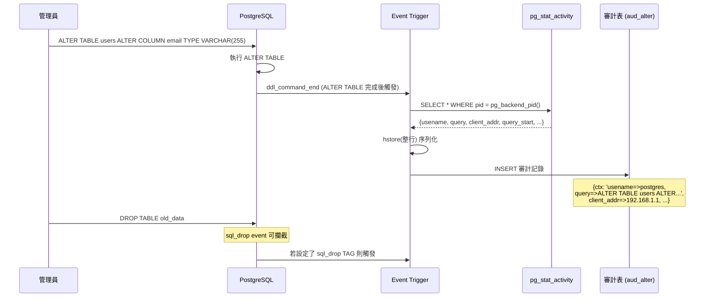
```mermaid
sequenceDiagram
    participant DBA as 管理員
    participant PG as PostgreSQL
    participant EventTrigger as Event Trigger
    participant SysTable as pg_stat_activity
    participant AuditTable as 審計表 (aud_alter)

    DBA->>PG: ALTER TABLE users ALTER COLUMN email TYPE VARCHAR(255)
    PG->>PG: 執行 ALTER TABLE
    PG->>EventTrigger: ddl_command_end (ALTER TABLE 完成後觸發)
    EventTrigger->>SysTable: SELECT * WHERE pid = pg_backend_pid()
    SysTable-->>EventTrigger: {usename, query, client_addr, query_start, ...}
    EventTrigger->>EventTrigger: hstore(整行) 序列化
    EventTrigger->>AuditTable: INSERT 審計記錄
    Note over AuditTable: {ctx: 'usename=>postgres,<br>query=>ALTER TABLE users ALTER...',<br>client_addr=>192.168.1.1, ...}

    DBA->>PG: DROP TABLE old_data
     Note over PG: sql_drop event 可攔截
    PG->>EventTrigger: 若設定了 sql_drop TAG 則觸發
```

### I. 審計表與 Event Trigger

```sql
CREATE EXTENSION hstore;

-- 審計表（DDL 審計用）
CREATE TABLE aud_alter (
    id SERIAL PRIMARY KEY,
    crt_time TIMESTAMP DEFAULT now(),
    ctx hstore
);
```

> 補充（Senior Dev）：`ctx hstore` 把整條 `pg_stat_activity` 的 row 序列化存入單一 column。這種設計的優點是「不需要預先定義審計欄位」，未來 `pg_stat_activity` 新增欄位時自動納入。缺點是無法直接對 key-value 內的欄位建 index（如 `WHERE ctx->'usename' = 'app_user'` 無法走 b-tree）。若需頻繁查詢特定欄位，建議把 `usename`、`query` 等拉出獨立 column 並建 index。

### II. Event Trigger 函數

```sql
CREATE OR REPLACE FUNCTION ef_alter() RETURNS event_trigger AS $$
DECLARE
  rec hstore;
BEGIN
  SELECT hstore(pg_stat_activity.*)
  INTO rec
  FROM pg_stat_activity
  WHERE pid = pg_backend_pid();

  INSERT INTO aud_alter (ctx) VALUES (rec);
END;
$$ LANGUAGE plpgsql STRICT;

-- 掛載 event trigger：僅在 ALTER TABLE 完成後觸發
CREATE EVENT TRIGGER e_alter
  ON ddl_command_end
  WHEN TAG IN ('ALTER TABLE')
  EXECUTE PROCEDURE ef_alter();
```

> 補充（Senior Dev）：
>
> **Trigger 時機選擇**：
> - `ddl_command_start`：DDL 執行前觸發。若審計寫在 start 但 DDL 失敗 rollback，審計記錄仍會留在審計表（trigger 內 INSERT 不會被 rollback 因為在 subtransaction 外...實際上 event trigger 在 start 時執行，DDL 失敗會回滾整個 transaction 包括審計記錄）
> - `ddl_command_end`：DDL 執行後觸發。本文的選擇，確保審計記錄的 DDL 已成功執行。
> - `sql_drop`：物件被刪除時觸發
> - `table_rewrite`：ALTER TABLE 觸發 full table rewrite 時觸發（PG 10+）
>
> **Event Trigger 支援的 TAG**：`ALTER TABLE`、`CREATE TABLE`、`DROP TABLE` 等。完整列表見 `pg_event_trigger_ddl_commands()` 的 `command_tag` 欄位。

### III. 測試

```sql
CREATE TABLE test (id INT);

ALTER TABLE test ALTER COLUMN id TYPE INT8;
```

### IV. 審計結果

```sql
SELECT * FROM aud_alter;
```

```
id=1 | crt_time=2014-12-12 05:43:42.840327
ctx:
"pid"=>"48406"
"datid"=>"12949"
"query"=>"alter table test alter column id type int8;"
"state"=>"active"
"datname"=>"postgres"
"usename"=>"postgres"
"waiting"=>"f"
"usesysid"=>"10"
"xact_start"=>"2014-12-12 05:43:42.840327+08"
"client_addr"=>NULL
"client_port"=>"-1"
"query_start"=>"2014-12-12 05:43:42.840327+08"
"state_change"=>"2014-12-12 05:43:42.840331+08"
"backend_start"=>"2014-12-12 05:38:37.084733+08"
"client_hostname"=>NULL
"application_name"=>"psql"
```

展開審計內容（每個 key-value pair）：

```sql
SELECT each(ctx) FROM aud_alter WHERE id = 1;
```

```
(pid,48406)
(datid,12949)
(query,"alter table test alter column id type int8;")  -- 完整 DDL SQL
(state,active)
(datname,postgres)
(usename,postgres)
(waiting,f)
(usesysid,10)
(xact_start,"2014-12-12 05:43:42.840327+08")
(client_addr,)
(client_port,-1)
(query_start,"2014-12-12 05:43:42.840327+08")
(state_change,"2014-12-12 05:43:42.840331+08")
(backend_start,"2014-12-12 05:38:37.084733+08")
(client_hostname,)
(application_name,psql)
```

審計記錄包含：執行者（`usename`）、來源 IP/Port（`client_addr`、`client_port`）、連線資料庫（`datname`）、完整 DDL SQL（`query`）、執行時間。

### V. 原文注意事項

如果使用者在 function 內部封裝 DDL，則 `pg_stat_activity.query` 記錄的是 function call 而非內部 DDL SQL。

> 德哥建議：更嚴格的做法是從 parsetree 中取出被修改的欄位和類型。Event Trigger 可透過 `TG_EVENT`、`TG_TAG` 變數及 `pg_event_trigger_ddl_commands()` 函數獲取結構化 DDL 資訊：
> ```sql
> -- EventTriggerData 結構（src/include/commands/event_trigger.h）
> typedef struct EventTriggerData {
>     NodeTag     type;
>     const char *event;      /* event name */
>     Node       *parsetree;  /* parse tree */
>     const char *tag;        /* command tag */
> } EventTriggerData;
> ```
>
> 在 PL/pgSQL event trigger 中可用 `CREATE EVENT TRIGGER ... WHEN TAG IN ('ALTER TABLE')` 搭配 `pg_event_trigger_ddl_commands()` 獲取 object identity、schema、object type 等結構化欄位。

> 補充（Senior Dev）：
>
> **DDL Audit 方案對比**：
>
> | 方案 | 優點 | 缺點 | 適用場景 |
> |------|------|------|----------|
> | Event Trigger (本文) | 精確攔截特定 TAG、可記錄完整 context、DB 層級 | 寫在 trigger function 內，有小小效能開銷；封裝在 function 內的 DDL 不可見內部 SQL | 精細化審計、需記錄 IP/User 等 context |
> | `log_statement = 'ddl'` | 零效能、零開發、自動記錄 | 寫在 PostgreSQL log file，format 不結構化、不容易檢索；無法過濾 TAG | 基本合規需求 |
> | `pgaudit` extension | C 層面極低開銷、session/object 級控制、結構化輸出 | 需編譯安裝 extension（部分雲端 RDS 不支援）；PG 14+ `pgaudit` 為 contrib | Production 多數場景 |
> | `pg_stat_statements` | 自動聚合、內建 | 不記錄單次執行細節、不記錄執行者 | 輔助診斷 |
>
> **Event Trigger 的版本演進**：
> - PG 10：新增 `table_rewrite` event
> - PG 13+：`pg_event_trigger_ddl_commands()` 可獲得 `object_identity`、`in_extension` 等更豐富資訊
>
> **Production 建議**：
> - 基本合規：`log_statement = 'ddl'` + log 集中收集（如 ELK / Loki）
> - 精細化 Audit：`pgaudit`（C 層面極低開銷，PG 14+ 為 contrib）
> - 客製化需求：Event Trigger + 寫入專用 audit schema（適合無法安裝 extension 時）
> - DDL audit 記錄需設定保留期並定期歸檔（DDL 變更少，表不會過大）

---

## 參考

1. [Event Triggers (official doc)](https://www.postgresql.org/docs/17/event-triggers.html)
2. [CREATE EVENT TRIGGER (official doc)](https://www.postgresql.org/docs/17/sql-createeventtrigger.html)
3. [PL/pgSQL Trigger Functions](https://www.postgresql.org/docs/17/plpgsql-trigger.html)
4. [hstore extension](https://www.postgresql.org/docs/17/hstore.html)
5. [德哥：USE hstore store table's trace record](https://github.com/digoal/blog/blob/master/201206/20120625_01.md)

---

# 三、PostgreSQL pgcrypto — 數據加密全面指南

> 來源：[digoal - 固若金湯 — PostgreSQL pgcrypto 加密插件 (2016-07-27)](https://github.com/digoal/blog/blob/master/201607/20160727_02.md)

---

## 1. 加密架構：Server-Side vs Client-Side


加密不是一個「有沒有」的是非題，而是「在哪裡、防什麼」的架構選擇題。理解加密位置至關重要。

**Server-Side 加密（pgcrypto）**：應用程式把明文送給 PostgreSQL，PostgreSQL 內部幫你加密後存入磁碟。查詢時，PostgreSQL 解密後把明文回傳給應用。這能防止「有人偷走硬碟」——硬碟上的資料是加密的。但無法防止「有人偷聽網路」——傳輸過程中資料是明文的。

**Client-Side 加密**：應用程式在發送 SQL 之前就先加密好資料，PostgreSQL 收到的就是密文。這樣即使網路被監聽，攻擊者也只看得到密文。但缺點是：資料庫無法對加密資料做查詢（例如 `WHERE email LIKE '%@gmail.com'` 無法執行）。

**最佳實踐**：Server-Side 加密（pgcrypto 保護儲存層）+ TLS/SSL（保護傳輸層）。這是縱深防禦的標準做法。

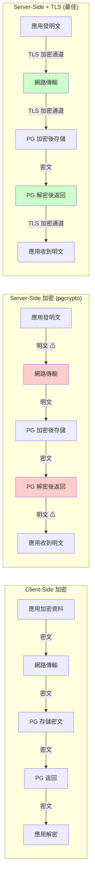
```mermaid
flowchart LR
    subgraph "Client-Side 加密"
        C1["應用加密資料"] -->|"密文"| C2["網路傳輸"]
        C2 -->|"密文"| C3["PG 存儲密文"]
        C3 -->|"密文"| C4["PG 返回"]
        C4 -->|"密文"| C5["應用解密"]
    end
    
    subgraph "Server-Side 加密 (pgcrypto)"
        S1["應用發明文"] -->|"明文 ⚠"| S2["網路傳輸"]
        S2 -->|"明文"| S3["PG 加密後存儲"]
        S3 -->|"密文"| S4["PG 解密後返回"]
        S4 -->|"明文 ⚠"| S5["應用收到明文"]
    end
    
    subgraph "Server-Side + TLS (最佳)"
        T1["應用發明文"] -->|"TLS 加密通道"| T2["網路傳輸"]
        T2 -->|"TLS 加密通道"| T3["PG 加密後存儲"]
        T3 -->|"密文"| T4["PG 解密後返回"]
        T4 -->|"TLS 加密通道"| T5["應用收到明文"]
    end
    
    style S2 fill:#ffcccc
    style S4 fill:#ffcccc
    style T2 fill:#ccffcc
    style T4 fill:#ccffcc
```

pgcrypto 提供的是 **Server-Side 加密**——加密/解密在資料庫服務端執行。

| 加密位置 | 網路傳輸內容 | 防禦範圍 |
|----------|-------------|---------|
| Server-Side（pgcrypto） | 明文 | Data-at-rest（存儲層） |
| Client-Side（應用層加密） | 密文 | Data-at-rest + Data-in-transit |
| **Server-Side + TLS** | 加密通道傳輸明文 | Data-at-rest + Data-in-transit（完整防禦） |

> 德哥建議：服務端加解密 + 傳輸層加密（TLS/SSL）是生產環境的標準組合。單純依靠 pgcrypto 無法防止網路竊聽。

> 補充（Senior Dev）：現代 PostgreSQL（PG 10+）預設啟用 SCRAM-SHA-256 密碼驗證和 TLS 1.3。建議 `ssl = on` + `ssl_min_protocol_version = 'TLSv1.2'` + `pgcrypto` 形成纵深防禦。若只加密個別敏感欄位（如 SSN、信用卡號），pgcrypto 是合適方案；若全表加密需求，考量 PG TDE（PG 16+ `pg_tde` extension 或雲端 RDS 自帶）更透明。

---

## 2. Hash 函數：digest() 與 hmac()


Hash（雜湊）函數是加密體系的基礎工具。它把任意長度的資料壓縮成一個固定長度的「指紋」（digest）：

**digest(data, algorithm)**：給定資料和演算法，輸出固定長度的雜湊值。相同的輸入永遠產生相同的輸出。例如 `digest('hello', 'sha256')` 每次結果都一樣。適用場景：檢查資料完整性（看檔案是否被篡改）。

**hmac(data, key, algorithm)**：比 digest 多加一個「密鑰」參數。即使攻擊者知道你的原始資料和演算法，沒有密鑰也無法偽造正確的 HMAC 值。適用場景：API Token 簽名驗證、訊息認證（確認訊息來自合法發送方且未被修改）。

**重要提醒**：digest 和 hmac 都是「確定性」的（相同輸入 → 相同輸出），因此不適合儲存密碼！因為攻擊者可以預先計算大量常見密碼的 hash 值（彩虹表攻擊），直接對照比對。密碼應該用下一節的 `crypt()` 函數。

**text 與 bytea 的陷阱**：`digest()` 函數有兩個重載版本——`digest(text, text)` 和 `digest(bytea, text)`。傳入 `'\xffffff'`（字串）和 `'\xffffff'::bytea`（二進位）會呼叫不同函數，產生完全不同的雜湊值。

```mermaid
flowchart TD
    A["digest / hmac 選擇"] --> B["需要驗證來源身份?"]
    B -->|是| C["用 hmac(data, key, algo)"]
    B -->|否 (只驗完整性)"| D["用 digest(data, algo)"]
    
    C --> E["適合: API Token, 訊息簽名"]
    D --> F["適合: 檔案校驗, 資料去重"]
    
    subgraph "密碼儲存?"
        G["❌ 不要用 digest/hmac"]
        H["✅ 用 crypt() + gen_salt()"]
    end
    
    style G fill:#ffcccc
    style H fill:#ccffcc
```

```sql
CREATE EXTENSION pgcrypto;

-- digest(data, algorithm) → bytea
-- 支援: md5, sha1, sha224, sha256, sha384, sha512
-- 若編譯時帶 --with-openssl 可支援更多算法
SELECT digest('I am digoal.', 'md5');
-- \xc3b0fb1147858d2259d92f20668fc8f9

-- hmac(data, key, algorithm) → bytea
-- 比 digest 多一個 key 參數：相同 data + 不同 key → 不同 hash
-- 用於防止 data + hash 同時被篡改（攻擊者無 key 無法重算 hash）
SELECT hmac('I am digoal.', 'this is a key', 'md5');
-- \xc70d0fd2af2382ea8e0a7ffd9edcbd58
```

**重要**：`digest()` 和 `hmac()` 有 text 和 bytea 兩個 overload。若參數類型不明確會調用不同 function，結果不同：

```sql
SELECT digest('\xffffff'::bytea, 'md5');
-- \x8597d4e7e65352a302b63e07bc01a7da
SELECT digest('\xffffff', 'md5');
-- \xd721f40e22920e0fd8ac7b13587aa92d   ← 不同結果！調用了 digest(text, text)
```

> `hmac` 若 key 長度超過 hash 算法的 block size，key 會被先 hash 一次再使用。

> 補充（Senior Dev）：`digest()` / `hmac()` 每次輸入相同 → 輸出相同（deterministic）。這意味著它們**不適合儲存密碼**——rainbow table 攻擊可逆向。應使用 `crypt()` + `gen_salt()`。但 `hmac(key, data, 'sha256')` 適合用於 API Token / HMAC 簽名校驗。

---

## 3. 密碼加密：crypt() + gen_salt()


`crypt()` + `gen_salt()` 是專門為密碼儲存設計的，與一般的 hash 函數有兩個關鍵差異：

**1. Random Salt（隨機鹽值）**：每次呼叫 `gen_salt()` 都會產生不同的隨機鹽值，所以即使兩個使用者使用相同的密碼，儲存在資料庫中的 hash 值也完全不同。這徹底杜絕了彩虹表攻擊——攻擊者沒辦法預先計算一個「所有可能密碼的 hash 對照表」，因為每個使用者的鹽值不同。

**2. Slow Hash（慢速雜湊）**：一般的 hash 像 md5/sha256 設計目標是「越快越好」，但密碼 hash 的目標恰好相反——要「越慢越好」。因為越慢，攻擊者每秒能嘗試的密碼組合就越少。bcrypt (bf) 演算法的 iter_count 參數控制迭代次數：iter=10 表示重複計算 2^10 = 1024 次。現代 CPU 上建議讓 `crypt()` 執行時間在 50-100ms 之間。

**驗證密碼的原理**：當使用者登入時，你不需要「解密」儲存的 hash 值（hash 是單向的，無法解密）。而是把使用者輸入的密碼用相同的演算法和鹽值重新計算一次 hash，看結果是否與儲存的一致。鹽值就包含在 `$2a$10$...` 格式的字串中。

```mermaid
sequenceDiagram
    participant User as 使用者
    participant App as 應用程式
    participant PG as PostgreSQL (pgcrypto)

    Note over User,PG: === 註冊 / 修改密碼 ===
    User->>App: 輸入密碼 "my_secret"
    App->>PG: SELECT crypt('my_secret', gen_salt('bf', 10))
    PG->>PG: gen_salt('bf',10) → 隨機鹽值
    PG->>PG: bcrypt(密碼, 鹽值, 2^10次迭代)
    PG-->>App: '$2a$10$salt...hash...'
    App->>App: 存入 users 表

    Note over User,PG: === 登入驗證 ===
    User->>App: 輸入密碼 "my_secret"
    App->>PG: SELECT crypt('my_secret', stored_hash) = stored_hash
    PG->>PG: 從 stored_hash 提取 salt
    PG->>PG: 用相同 salt + iter 重新計算
    PG-->>App: TRUE (密碼正確) 或 FALSE (密碼錯誤)
    
    Note over User,PG: 即使兩個使用者密碼相同，存儲的 hash 也不同!<br>因為 gen_salt() 每次產生不同鹽值
```

`crypt()` + `gen_salt()` 的核心設計目標是**加大破解難度**（slow hash + random salt）。每次同一密碼產生的 hash 都不同。

### I. 使用

```sql
-- gen_salt(type [, iter_count]) → salt
-- type: des, xdes, md5, bf
-- iter_count: xdes 需為奇數 (1-16777215, default 725); bf (4-31, default 6)
SELECT gen_salt('bf', 10);
-- $2a$10$qY0amXGalzj14rooSpTf5e

SELECT crypt('this is a pwd source', gen_salt('bf', 10));
-- $2a$10$tvNK2H9mPu1tU5L6oAHdSeze5Hlz7G0y4oEKNg9SlGa06J2sywZHu

SELECT crypt('this is a pwd source', gen_salt('bf', 10));
-- $2a$10$cgJiTAs55vMBqYR1kGMGXuMKZI4dsayna4wgEL4K7duYkD0g25ufW  ← 不同！
```

### II. 密碼驗證

`crypt(password, stored_hash)` → 若密碼正確返回與 `stored_hash` 相同的值。驗證方式：

```sql
SELECT crypt('this is a pwd source', pwd) = pwd
FROM userpwd WHERE userid = 1;
-- 正確密碼 → t, 錯誤密碼 → f
```

**原理**：`crypt()` 從 `stored_hash` 的第二個參數位擷取 salt（格式：`$algorithm$iter$salt$hash`），用相同的 algorithm / iter / salt 重算 hash，與儲存值比對。

### III. 算法對比

| Algorithm | Max Pwd Len | Adaptive | Salt Bits | 說明 |
|-----------|------------|----------|-----------|------|
| bf (Blowfish) | 72 | ✓ | 128 | **推薦**，iter 可控 |
| md5 | unlimited | ✗ | 48 | 次選 |
| xdes | 8 | ✓ | 24 | iter 需奇數 |
| des | 8 | ✗ | 12 | 不建議，古老 |

### IV. 破解速度基準

| Algorithm | Hashes/sec (Pentium 4 1.5GHz) | 破解 8-char \[a-z\] | 破解 8-char \[A-Za-z0-9\] |
|-----------|------------------------------|---------------------|--------------------------|
| crypt-bf/8 (iter=256) | 28 | 246 年 | 251,322 年 |
| crypt-bf/7 | 57 | 121 年 | 123,457 年 |
| crypt-bf/6 | 112 | 62 年 | 62,831 年 |
| crypt-bf/5 | 211 | 33 年 | 33,351 年 |
| crypt-md5 | 2,681 | 2.6 年 | 2,625 年 |
| crypt-des | 362,837 | 7 天 | 19 年 |
| sha1 | 590,223 | 4 天 | 12 年 |
| md5 | 2,345,086 | 1 天 | 3 年 |

**iter_count 選擇原則**：以當前 CPU 實測為準，讓 `crypt()` 執行時間在 **4-100 ms** 之間（每秒 10-250 次），平衡安全性與 user login latency。

> 補充（Senior Dev）：
> - `bf` (Blowfish/bcrypt) 的 iter_count 對應的是 2^iter 次迭代。iter=10 → 1024 次。現代 CPU 上 iter=10 約 50-100ms，iter=12 約 200-400ms。PG 14+ 可考慮 `scram-sha-256`（內建密碼驗證機制，不需要 pgcrypto 處理密碼欄位）
> - `crypt()` 的 salt 長度：bf 為 128-bit (22 char Base64)，md5 為 48-bit。salt 太短會降低抗碰撞性
> - **Timing Attack 注意**：`crypt()` 使用 constant-time comparison，但若應用層用 `SELECT ... WHERE pwd = crypt(...)` 而非 `crypt(...) = stored_hash`，可能洩漏 timing info。務必使用 constant-time 比對方式

---

## 4. PGP 對稱加密


PGP（Pretty Good Privacy）對稱加密使用**同一個密碼**進行加密和解密。就像一個上鎖的盒子：你用同一個鑰匙鎖上和打開。

**加密和解密的兩個核心函數**：
- `pgp_sym_encrypt(data, password)`：用密碼加密資料，回傳 bytea（二進位）格式的密文
- `pgp_sym_decrypt(encrypted_data, password)`：用相同的密碼解密，回傳原始明文

**內部流程**（初學者可以理解為三步）：
1. 產生一個隨機的「會話密鑰」（session key）
2. 用會話密鑰加密你的資料（對稱加密，很快）
3. 用你提供的密碼加密會話密鑰，一起打包

**為什麼每次加密結果不同？** 因為第一步的會話密鑰是隨機產生的。即使你用相同的密碼加密相同的文字兩次，輸出的密文也完全不同。這不是 bug，而是重要的安全特性——防止攻擊者透過比對密文來推測明文。

**Options 參數**：`pgp_sym_encrypt()` 支援多個可選參數，格式為 `'key=value, key=value'`：
- `cipher-algo=aes256`：使用 AES-256 加密演算法（比預設的 AES-128 更安全）
- `compress-algo=2`：壓縮演算法（0=不壓縮，1=ZIP，2=ZLIB）
- `compress-level=9`：壓縮級別（0-9，9 最慢但壓縮率最高）

```mermaid
flowchart TD
    A["原始明文資料"] --> B["pgp_sym_encrypt(data, 'secret_password')"]
    B --> C["內部產生隨機 Session Key"]
    C --> D["Session Key 加密明文 (AES)"]
    C --> E["密碼加密 Session Key"]
    D --> F["打包 PGP 訊息"]
    E --> F
    F --> G["密文 (bytea) 存入資料庫"]
    
    G --> H["pgp_sym_decrypt(密文, 'secret_password')"]
    H --> I["從 PGP 訊息中提取加密的 Session Key"]
    I --> J["用密碼解密 Session Key"]
    J --> K["用 Session Key 解密密文"]
    K --> L["回傳原始明文"]
    
    style C fill:#fff3cd
    style G fill:#f8d7da
    style L fill:#d4edda
```

遵循 OpenPGP (RFC 4880)。對稱加密用同一密鑰加解密。

```sql
-- pgp_sym_encrypt(data, psw [, options]) → bytea
-- pgp_sym_decrypt(msg, psw [, options]) → text
```

```sql
SELECT pgp_sym_encrypt(
  'i am digoal', 'pwd',
  'cipher-algo=aes256, compress-algo=2, compress-level=9'
);

SELECT pgp_sym_decrypt(
  '\xc30d040403024581...'::bytea,
  'pwd'
);
-- → i am digoal
```

**options** 支援：`cipher-algo`（aes256 / aes128 / bf / 3des / cast5）、`compress-algo`（0=none, 1=ZIP, 2=ZLIB）、`compress-level`（0-9）、`convert-crlf`、`disable-mdc`、`s2k-mode`、`s2k-digest-algo`、`s2k-cipher-algo`。

> 補充（Senior Dev）：PGP symmetric encrypt 內部流程：隨機產生 session key → 用 session key 對稱加密 data → 用 password + S2K（String-to-Key）派生 key 加密 session key → 組裝 PGP message。這意味著即使兩次用相同 password 加密相同 data，輸出也不同（因為 session key 是隨機的）。預設 `cipher-algo=aes128`；建議生產用 `cipher-algo=aes256`。

---

## 5. PGP 公鑰加密


公鑰加密（也稱非對稱加密）使用**一對數學上相關聯但不同的金鑰**：公鑰和私鑰。這是密碼學中最巧妙的發明之一。

**公鑰 vs 私鑰的區別**：
- **公鑰**：可以公開分發，任何人拿到都可以用來加密資料。就像一個敞開的信箱投遞口——任何人可以投信。
- **私鑰**：必須嚴格保密，只有持有者可以解密。就像信箱的鑰匙——只有你能取出信件。

**為什麼比對稱加密更安全？** 在對稱加密中，加密和解密使用同一個密碼，意味著資料庫中必須存放（或能夠獲取）這個密碼，如果資料庫被攻破，攻擊者可以直接解密所有資料。公鑰加密中，資料庫只有公鑰——攻擊者拿到公鑰也無法解密。

**金鑰格式轉換的必要性**：GPG 工具匯出的金鑰是 ASCII-armor 格式（文字，帶有 `-----BEGIN PGP PUBLIC KEY BLOCK-----` 標記），但 pgcrypto 需要 bytea 格式（二進位）。`dearmor()` 函數負責做這個格式轉換。

```mermaid
sequenceDiagram
    participant Admin as 管理員 (持有私鑰)
    participant GPG as GPG 工具
    participant PG as PostgreSQL
    participant App as 應用程式

    Note over Admin,GPG: === 一次性：產生金鑰對 ===
    Admin->>GPG: gpg --gen-key
    GPG-->>Admin: 公鑰 + 私鑰 (存在管理員本地)
    Admin->>GPG: gpg --export > public.key
    Admin->>PG: 將 public.key 導入資料庫
    PG->>PG: dearmor(public.key) → bytea 格式

    Note over PG,App: === 日常：加密敏感資料 ===
    App->>PG: INSERT INTO users (ssn) VALUES (<br>pgp_pub_encrypt('123-45-6789', public_key_bytea))
    PG->>PG: 用公鑰加密 → 密文存入 users.ssn
    Note over PG: 資料庫只有公鑰，無法解密!

    Note over PG,App: === 必要時：解密 (例如報表) ===
    App->>PG: SELECT pgp_pub_decrypt(ssn, private_key_bytea)<br>FROM users WHERE id=1
    PG->>PG: 用私鑰解密 → 回傳明文
    Note over App: 私鑰不應存在資料庫中!<br>應由應用層從外部 KMS 獲取
```

### I. GPG 金鑰生成

```bash
gpg --gen-key
# 選擇: (1) DSA and Elgamal (default)
# keysize: 2048
# expire: 0 (never)
# Real name: digoal

# 導出公鑰和私鑰
gpg -a --export digoal > public.key
gpg -a --export-secret-keys digoal > secret.key
```

### II. 金鑰格式轉換（dearmor）

GPG 匯出的金鑰是 ASCII-armor 格式（`-----BEGIN PGP PUBLIC KEY BLOCK-----`），pgcrypto 需要 bytea 格式。使用 `dearmor()` 轉換：

```sql
SELECT dearmor('-----BEGIN PGP PUBLIC KEY BLOCK-----
Version: GnuPG v1.4.5 (GNU/Linux)

mQGiBFGgIDgRBADALXrWA...
=XGEV
-----END PGP PUBLIC KEY BLOCK-----');
-- → \x9901a20451a02038110400c02d7ad... (raw bytea)
```

### III. 加解密

```sql
-- 公鑰加密
SELECT pgp_pub_encrypt('i am digoal', '<public_key_bytea>');

-- 私鑰解密
SELECT pgp_pub_decrypt('<encrypted_bytea>', '<private_key_bytea>');
```

若 GPG 生成私鑰時設了 passphrase，解密需傳入：

```sql
pgp_pub_decrypt(msg bytea, key bytea, psw text [, options text])
```

### IV. 輔助函數

```sql
-- 查詢加密數據使用對稱密鑰還是公鑰
SELECT pgp_key_id('<encrypted_bytea>');
-- SYMKEY 或公鑰 ID (如 1B437BCCD670D845)

-- bytea ↔ ASCII-armor 轉換
SELECT armor(data bytea);     -- → text (PGP ASCII-armor)
SELECT dearmor(data text);    -- → bytea

-- 產生隨機加密用 bytea
SELECT gen_random_bytes(32);  -- 32 random bytes
```

> 補充（Senior Dev）：
>
> **公鑰加密的生產考量**：
> 1. **Key Rotation**：公鑰/私鑰應定期輪換。需維護 key version 欄位與歷史私鑰的安全備份（解密歷史數據需要舊私鑰）
> 2. **私鑰存儲**：絕對不能存在同一資料庫中。推薦方案：私鑰存在 HashiCorp Vault / AWS KMS / Azure Key Vault，應用層呼叫 KMS decrypt → 拿到明文後才送入 PG（或由應用層直接解密不回傳私鑰給 PG）
> 3. **效能**：PGP 公鑰加密/解密比對稱加密慢約 10-50×（RSA/Elgamal 運算）。大批量加密場景建議用 envelope encryption 模式（generate random symmetric key → encrypt data with symmetric key → encrypt symmetric key with public key）
> 4. **現代替代**：`pg_sodium` / `pgsodium` extension 基於 libsodium，提供 `crypto_box()` / `crypto_secretbox()` 等更現代的 AEAD（Authenticated Encryption），比 pgcrypto 的 PGP 實現更新、更安全、更快。但 pgcrypto 是 contrib 內建，相容性最好
>
> **對稱加密的 Key Management**：
> - 絕對不要把 key 寫死在 SQL / stored procedure 中
> - 使用 `SET SESSION myapp.encryption_key = '...'`（Custom GUC）在 connection pool 初始化時設定，function 內用 `current_setting('myapp.encryption_key')` 讀取，避免 key 出現在 query log / pg_stat_activity 中
> - 或將加密 key 存在另一張受限權限的 table 中，搭配 Row-Level Security 限制訪問
>
> **gen_random_bytes 的 entropy 來源**：PG 10+ 使用 OpenSSL 的 CSPRNG（`RAND_bytes()`），在 Linux 上從 `/dev/urandom` 獲取 entropy；PG 16+ 改用内置 CSPRNG，不再依赖 OpenSSL。

---

## 6. 三種加密方案適用場景總結


三種加密方案的選擇取決於你的具體需求。用一個類比來理解：

- **crypt() + gen_salt()**：像保險櫃的密碼鎖——你輸入密碼，它轉換成一個無法逆向的指紋儲存。下次你輸入密碼時，它重新計算指紋並比對。適合：使用者登入密碼。

- **PGP 對稱加密**：像一個上鎖的盒子，你和收件人各有一把相同的鑰匙。快速、適合大量資料，但如何安全地分享那把鑰匙是個問題。適合：資料庫欄位加密（如信用卡號），密鑰存放在外部金鑰管理服務。

- **PGP 公鑰加密**：像一個只有你能打開的公共信箱。任何人可以用公鑰（投遞口）加密寄給你，但只有你的私鑰能打開。加密和解密分離，私鑰永遠不進資料庫。適合：高合規要求場景（PCI-DSS、HIPAA）。

```mermaid
flowchart TD
    A["需要保護什麼?"] --> B["使用者密碼?"]
    B -->|是| C["crypt() + gen_salt('bf')"]
    C --> C1["特點: 單向不可逆, 每次 salt 不同, 慢速防暴力破解"]
    
    B -->|否| D["敏感欄位/資料?"]
    D --> E["加密與解密是否分離?"]
    E -->|是 (只加密, 偶爾解密)"| F["PGP 公鑰加密"]
    F --> F1["特點: 私鑰不進 DB, 安全性最高, 較慢"]
    E -->|否 (頻繁加解密)"| G["PGP 對稱加密"]
    G --> G1["特點: 效能好, 需管理對稱密鑰"]
    
    C1 --> H["記住: 密碼 ≤ 72 字元 (bcrypt 限制)"]
    F1 --> I["記住: 私鑰存外部 KMS, 定期輪換"]
    G1 --> J["記住: 密鑰用 custom GUC 傳入, 不寫死"]
```

| 方案 | 適用場景 | 特點 |
|------|----------|------|
| `crypt()` + `gen_salt()` | 密碼儲存 | Slow hash + random salt，每次不同輸出；高破解難度；適合短字串（密碼 ≤ 72 chars） |
| PGP 對稱加密 | 大量數據加密（資料欄位、文件） | 效能好；需管理對稱密鑰（建議存在外部 KMS / custom GUC） |
| PGP 公鑰加密 | 高安全場景（僅應用層持私鑰） | 加密與解密分離；私鑰不存 DB；適合合規需求（PCI-DSS、HIPAA） |

---

## 7. App Dev 實戰：Key 的安全傳遞與 Dapper 加密整合

最大陷阱：把 Key 寫死在 SQL 或 source code 中。解法：**Custom GUC**。

```csharp
// ❌ 致命錯誤：Key 出現在 pg_stat_activity.query 中！
// SELECT pgp_sym_encrypt('data', 'my-secret-key')  ← Key 洩漏

// ✅ 正確：用 Custom GUC 傳 Key（不在 query 中出現）
// Step 1：在 connection pool init 時設定（只執行一次，每個 session 需重設）
await conn.ExecuteAsync("SET SESSION myapp.encryption_key = @Key",
    new { Key = LoadKeyFromVault() });

// Step 2：在 SQL 中用 current_setting() 讀取
var result = await conn.ExecuteScalarAsync<string>(
    "SELECT pgp_sym_encrypt(@Data, current_setting('myapp.encryption_key'))",
    new { Data = sensitiveData });
// pg_stat_activity 只顯示 "current_setting(...)"，不暴露 Key

// Step 3：加密寫入 + 解密讀取的完整 Dapper 實作
public async Task SaveSensitive(int userId, string ssn)
{
    await using var conn = await dataSource.OpenConnectionAsync();
    await conn.ExecuteAsync("SET SESSION myapp.encryption_key = @Key",
        new { Key = _encryptionKey });
    await conn.ExecuteAsync(
        @"INSERT INTO user_sensitive (user_id, ssn_enc)
          VALUES (@Id, pgp_sym_encrypt(@Ssn, current_setting('myapp.encryption_key')))",
        new { Id = userId, Ssn = ssn });
}

public async Task<string?> GetSensitive(int userId)
{
    await using var conn = await dataSource.OpenConnectionAsync();
    await conn.ExecuteAsync("SET SESSION myapp.encryption_key = @Key",
        new { Key = _encryptionKey });
    return await conn.ExecuteScalarAsync<string>(
        "SELECT pgp_sym_decrypt(ssn_enc, current_setting('myapp.encryption_key')) FROM user_sensitive WHERE user_id = @Id",
        new { Id = userId });
}

// ✅ 密碼驗證的正確寫法（crypt + constant-time comparison）
public async Task<bool> VerifyPwd(string username, string pwd)
{
    await using var conn = await dataSource.OpenConnectionAsync();
    return await conn.ExecuteScalarAsync<bool>(
        "SELECT crypt(@Pwd, password_hash) = password_hash FROM users WHERE username = @User",
        new { User = username, Pwd = pwd });
}
```

> Key Rotation（金鑰輪換）必須用舊 Key 解密，新 Key 重加密所有歷史資料。不可直接用新 Key 蓋掉舊的。

---

## 參考

1. [PostgreSQL pgcrypto 官方文檔](https://www.postgresql.org/docs/17/pgcrypto.html)
2. [GnuPG Manual](http://www.gnupg.org/gph/en/manual.html)
3. [德哥 blog — pgcrypto 相關系列](http://blog.163.com/digoal@126/blog/static/163877040201342233131835/)

---

# 四、PostgreSQL 千億級 Regex / 模糊查詢 — pg_trgm + GIN 效能實測

> 來源：[digoal - PostgreSQL 1000亿数据量 正则匹配 速度与激情 (2016-03-07)](https://github.com/digoal/blog/blob/master/201603/20160307_01.md)
>
> 2026 更新：補充 pg_trgm 內部機制、PG 14-17 演進、pg_bigm 替代方案、Production 層級建議。

---

## 測試規模


這是一場極端的性能測試——在 **1,008 億行、4.1TB** 的資料上執行正則表達式搜尋，看看 PostgreSQL 能不能在幾秒內找到結果。

**測試規模的直覺理解**：
- 1,008 億行：如果一秒讀 100 行，需要約 32 年才能讀完
- 4.1TB 資料：約等於 400 部 4K 電影
- 240 個 data node：分布在 8 台實體主機上，每個 node 負責一部分資料
- 三組索引合計 8,222 GB（約 table 的 2 倍）

**為什麼索引比資料本身還大？** 這很正常。索引本質上是「資料的目錄」——為了快速查詢，索引需要儲存額外的結構資訊。B-tree 索引每個 entry 包含 key + 指向資料位置的指標（TID），所以索引體積通常不小於原資料。GIN（通用倒排索引）更大，因為它要把每個字串拆成多個 trigram，每個 trigram 都是一個索引 entry。

```mermaid
flowchart TD
    subgraph "測試環境 8 台實體主機"
        H1["主機 1 (16 core)"]
        H2["主機 2 (16 core)"]
        H3["..."]
        H8["主機 8 (16 core)"]
    end
    
    subgraph "240 個 Data Node"
        N1["Node 1"] --- N2["Node 2"] --- N3["..."] --- N240["Node 240"]
    end
    
    subgraph "每 Node 負責"
        D["~4.2 億行<br>~17GB 資料<br>B-tree: ~12GB<br>GIN: ~10GB"]
    end
    
    H1 --> N1
    H8 --> N240
    N1 --> D
    
    subgraph "三組索引合計"
        I1["B-tree(info): 2,961 GB"]
        I2["B-tree(reverse(info)): 2,961 GB"]
        I3["GIN(gin_trgm_ops): 2,300 GB"]
        I4["合計: 8,222 GB (table 的 2x)"]
    end
```

| 項目 | 數值 |
|------|------|
| Cluster | 8 台實體主機（16 core / host），共 **240 個 data node** |
| Total rows | **1,008 億** (100.8 billion) |
| Table size | **4,158 GB** (~4.1 TB) |
| Data characteristic | 12-char hex string（`md5(random()::text)` 前 48-bit），83.7% 唯一值 |
| B-tree index (info) | **2,961 GB** |
| B-tree index (reverse(info)) | **2,961 GB** |
| GIN index (gin_trgm_ops) | **2,300 GB** |

<!-- Original image (removed): images/regex_perf_100billion.png - replaced with Mermaid diagram below -->

---

## 數據生成


測試數據的生成方式和數據特徵決定了查詢效能的表現——不同的資料分佈對索引的影響可以天差地別。

**資料特徵**：
- 每行是一個 12 字元的十六進位字串（如 `7f68d12d2205`），由 `md5(random())` 的前 12 字元生成
- 約 83.7% 的值是唯一的（`n_distinct = -0.837`），剩下的 16.3% 有不同程度的重複
- 平均每個值出現約 10 次，最高頻的值出現 54 次（幾乎均勻隨機分佈）

**為什麼要建 `reverse(info)` 索引？** 這是處理後綴查詢（suffix matching）的經典技巧。如果查詢 `WHERE info LIKE '%abc'`（以 abc 結尾），B-tree 無法直接加速（因為 B-tree 是從左到右排序），但反轉字串後 `WHERE reverse(info) LIKE 'cba%'` 就變成了前綴查詢，B-tree 可以完美加速。

**`maintenance_work_mem` 的作用**：建索引時 PostgreSQL 需要對資料做排序，`maintenance_work_mem` 控制排序時可用的記憶體大小。設為 4GB 意味著排序操作可以使用高達 4GB 的記憶體，大幅減少磁碟暫存檔的產生，加快索引建立速度。

```mermaid
flowchart LR
    subgraph "數據生成管道"
        G["generate_series(1, 1億)"] --> M["md5(random()::text)"]
        M --> S["取前 12 字元"]
        S --> C["COPY 寫入分散式表"]
    end
    
    subgraph "三組索引建立"
        I1["B-tree(info)<br>用於 prefix 查詢"]
        I2["B-tree(reverse(info))<br>用於 suffix 查詢"]
        I3["GIN(info gin_trgm_ops)<br>用於 regex / 任意位置"]
    end
    
    C --> I1
    C --> I2
    C --> I3
    
    subgraph "數據特徵"
        F1["n_distinct = -0.837"]
        F2["最高頻值僅出現 54 次"]
        F3["每個 trigram 約 2460 萬行"]
    end
```

```bash
# 創建 distributed table（基於 PG 的 MPP 架構）
psql -c "CREATE TABLE t_regexp_100billion DISTRIBUTED RANDOMLY"

# 分批生成 1008 億行，每批 1 億行
for ((i=1; i<=1008; i++)); do
  psql -c "COPY (
    SELECT substring(md5(random()::text), 1, 12)
    FROM generate_series(1, 100000000)
  ) TO stdout" \
  | psql -c "COPY t_regexp_100billion FROM stdin"
done

# 創建三組索引
psql -c "SET maintenance_work_mem = '4GB';
         CREATE INDEX idx_t_regexp_100billion_1
         ON t_regexp_100billion(info)"

psql -c "SET maintenance_work_mem = '4GB';
         CREATE INDEX idx_t_regexp_100billion_2
         ON t_regexp_100billion(reverse(info))"

psql -c "SET maintenance_work_mem = '4GB';
         CREATE INDEX idx_t_regexp_100billion_gin
         ON t_regexp_100billion USING gin (info gin_trgm_ops)"
```

### I. 數據特徵

```sql
SELECT count(*) FROM t_regexp_100billion;
-- 100800000000 (1,008 億)
-- Time: 228,721 ms (~3.8 min for COUNT(*))

-- 抽樣驗證唯一性（隨機 offset 100 萬行中僅 250 個重複）
SELECT count(DISTINCT info)
FROM (SELECT * FROM t_regexp_100billion
      OFFSET 1299422811 LIMIT 1000000) t;
-- count: 999750

-- psql 統計資訊
ALTER TABLE t_regexp_100billion ALTER COLUMN info SET STATISTICS 10000;
ANALYZE t_regexp_100billion;

-- n_distinct: -0.836834   → 約 83.68% 唯一值
-- most_common_freqs: 最高頻值佔比 1e-06（每值約 10 萬次出現）

-- 實際驗證「最高頻值」7f68d12d2205
SELECT count(*) FROM t_regexp_100billion WHERE info = '7f68d12d2205';
-- count: 54（而非統計預估的 10 萬次 — 採樣偏差）
```

> 補充（Senior Dev）：`n_distinct = -0.837` 是柱狀圖估算值，負值表示「比例」而非「絕對數」。此處由於 random MD5 分佈極均勻，GIN index 每個 trigram 的 posting list 長度非常接近理論值（1008 億 ÷ 16^3 ≈ 2460 萬 / trigram），selectivity 可精確預測。

---

## 內部機制：pg_trgm 如何讓 Regex 變快


這是全章最核心的部分——理解 pg_trgm 的內部運作機制，你才能真正理解為什麼 1,008 億行中做 regex 搜尋可以幾秒完成。

**什麼是 Trigram？** Trigram 是長度為 3 的連續子字串。例如字串 `'hello'` 的 trigram 是：`hel`、`ell`、`llo`。注意：PostgreSQL 還會在前後加上空格，所以實際 trigram 集合更大。

**GIN 倒排索引的結構**：GIN（Generalized Inverted Index，通用倒排索引）像一本書的索引。每個 trigram 是一個「關鍵詞」，指向包含該 trigram 的所有資料行（posting list）。GIN 的結構是：索引 key = trigram，索引 value = 包含該 trigram 的所有行的位置列表。

**查詢過程（以搜尋 `'hello'` 為例）**：
1. **分解 pattern**：將 `'hello'` 拆成 trigram `{hel, ell, llo}`
2. **GIN 查詢**：對每個 trigram 取出 posting list（即哪些行包含這個 trigram）
3. **取交集**：`{包含 hel 的行} ∩ {包含 ell 的行} ∩ {包含 llo 的行}` → 候選集合
4. **Recheck 精確比對**：對候選集合中的每一行，用原始 regex 進行精確比對（因為 trigram 交集是 non-deterministic 的——可能包含 trigram 但不包含完整 pattern 的行）

**為什麼 GIN 是 "lossy" 的？** GIN 的 trigram 查詢只能保證「如果資料行包含 pattern，則一定在候選集合中」，但不能保證「候選集合中的每行都包含 pattern」。例如搜尋 `'abcd'` 的 trigram 是 `{abc, bcd}`，但包含 `abc` 和 `bcd` 的行可能實際上是 `'abcebcd'`——這不包含連續的 `'abcd'`。所以需要最後的 Recheck 步驟做精確過濾。

```mermaid
flowchart TD
    subgraph "Step 1: 分解 Pattern"
        P["Pattern: 'hello'"] --> T["Trigrams: {hel, ell, llo}"]
    end
    
    subgraph "Step 2: GIN Index Lookup"
        T --> G1["hel → posting list: {rows 12, 45, 89, ...}"]
        T --> G2["ell → posting list: {rows 45, 72, 89, ...}"]
        T --> G3["llo → posting list: {rows 89, 123, ...}"]
    end
    
    subgraph "Step 3: 取交集"
        G1 --> INT["{12,45,89} ∩ {45,72,89} ∩ {89,123}"]
        INT --> CAND["候選集: {row 89}"]
    end
    
    subgraph "Step 4: Recheck 精確比對"
        CAND --> RC["row 89 的完整字串<br>是否真的匹配 'hello'?"]
        RC -->|是| RESULT["✅ 納入結果"]
        RC -->|否 (lossy)| DISCARD["❌ 丟棄 (假陽性)"]
    end
```

### II. Trigram 原理

`pg_trgm` 將每個字串拆成長度為 3 的連續子串（trigram）。例如 `'80ebcdd47006'`：

```
Trigrams: 80e, 0eb, ebc, bcd, cdd, dd4, d47, 470, 700, 006
```

GIN index 的 key = trigram，value = 包含該 trigram 的所有 row 的 posting list。

### III. 查詢流程（以 `info ~ 'e7add04871'` 為例）

```
1. PG 將 regex 轉換為 trigram 集合：
   'e7add04871' → {e7a, 7ad, add, dd0, d04, 048, 487, 871}

2. GIN scan 對每個 trigram 取出 posting list，取交集：
   ∩ {rows with 'e7a', '7ad', 'add', ...}

3. Bitmap Heap Scan：將交集結果中的 page 全部讀出

4. Recheck：用原始 regex 對候選 row 進行精確匹配
   （GIN + pg_trgm 是 lossy，trigram 交集只保證候選集包含答案）
```

> 補充（Senior Dev）：pg_trgm 的最小有效 pattern 長度取決於 `pg_trgm.word_similarity_threshold` 和 GIN 的 selectivity。單個字符或兩個字符的 regex（如 `~ 'a.'`）無法產生足夠的 trigram 過濾，會退化成 Seq Scan。實務上 pattern ≥ 3 characters 才能有效利用 GIN 過濾。

---

## 四種查詢模式效能實測


本節是實測數據的核心——四種查詢模式分別對應四種索引策略，讓你看清楚「選對索引」有多重要。

**模式 1 & 2：Prefix 和 Suffix** 都利用了 B-tree 的排序特性。B-tree 索引本質上是一個排序列表，查詢某個值「開頭」就是查詢一個範圍（例如 `>= 'abc' AND < 'abd'`），這是 B-tree 最擅長的操作。只需 3.1 秒就在 1,008 億行中定位到結果。

**模式 3：中間包含** 無法用 B-tree（因為 pattern 可能在字串的任意位置），必須依賴 GIN + pg_trgm。這是最慢的模式（4.9 秒），因為需要掃描最多的 trigram posting list，最後還要做 Recheck。

**模式 4：正則表達式** 的速度取決於 pattern 中有多少「確定性字符」。`.` 匹配任意字符，不貢獻 trigram；`[1|f]` 匹配 1 或 f，pg_trgm 從中提取確定性序列生成 trigram。pattern 越具體 → trigram 越多 → 候選集越小 → 越快。

```mermaid
flowchart LR
    subgraph "模式 1: Prefix 查詢"
        P1["info ~ '^80ebcdd47'"] --> I1["B-tree(info) Range Scan"]
        I1 --> R1["52 rows, 3.1 秒"]
    end
    
    subgraph "模式 2: Suffix 查詢"
        P2["reverse(info) ~ '^f42d12089b'"] --> I2["B-tree(reverse(info)) Range Scan"]
        I2 --> R2["46 rows, 3.1 秒"]
    end
    
    subgraph "模式 3: 中間包含"
        P3["info ~ 'e7add04871'"] --> I3["GIN(gin_trgm_ops) → Bitmap Index Scan → Recheck"]
        I3 --> R3["32 rows, 4.9 秒 (最慢)"]
    end
    
    subgraph "模式 4: 正則表達式"
        P4a["info ~ '.3918.209f'"] --> I4a["GIN → 38 rows, 3.6 秒"]
        P4b["info ~ 'ab2..d[1|f]3c8'"] --> I4b["GIN → 95 rows, 4.6 秒"]
    end
    
    style R3 fill:#fff3cd
```

### IV. Prefix 匹配（前綴查詢 `^`）

```sql
SELECT ctid, tableoid, info
FROM t_regexp_100billion
WHERE info ~ '^80ebcdd47';
-- 返回 52 rows，3,226 ms
```

實際使用 B-tree index（`info` column），`~ '^...'` 被 optimizer 轉換為 B-tree range scan（`>= '80ebcdd47' AND < '80ebcdd48'`）。

```
EXPLAIN (ANALYZE, VERBOSE, BUFFERS, COSTS, TIMING)
SELECT ... WHERE info ~ '^80ebcdd47';
-- 240 個 node 並行執行
-- Planning time: 0.061 ms
-- Execution time: 3,112 ms
```

| 指標 | 數值 |
|------|------|
| 模式 | B-tree index scan（prefix → range） |
| 時間 | **3.1 秒** |
| 結果數 | 52 rows（1,008 億中） |

---

### V. Suffix 匹配（後綴查詢 `reverse()` 技巧）

```sql
-- 查詢以 'f42d12089b' 結尾的 row
-- 做法：反轉字串後做 prefix 查詢
SELECT ctid, tableoid, info
FROM t_regexp_100billion
WHERE reverse(info) ~ '^f42d12089b';
-- 返回 46 rows，3,141 ms
```

> 補充（Senior Dev）：這是 PG 中處理 suffix matching 的經典技巧。原理是把 `LIKE '%abc'` 轉為 `reverse(col) LIKE 'cba%'`，再用 B-tree index 加速。**不需要 pg_trgm**，只需一個 `reverse()` B-tree index。在 PG 17 中，若 `reverse()` 被標記為 IMMUTABLE（確實如此），expression index 直接可用。此技巧對任意長度的後綴都有效，不像 pg_trgm 受 trigram 最小長度限制。

```
EXPLAIN (ANALYZE, VERBOSE, BUFFERS, COSTS, TIMING)
SELECT ... WHERE reverse(info) ~ '^f42d12089b';
-- 240 個 node 並行執行
-- Execution time: 3,112 ms
```

| 指標 | 數值 |
|------|------|
| 模式 | `reverse()` B-tree index |
| 時間 | **3.1 秒** |
| 結果數 | 46 rows |

---

### VI. 中間包含匹配（任意位置 substring）

無法用 B-tree prefix trick，必須依賴 GIN + pg_trgm：

```sql
SELECT ctid, tableoid, info
FROM t_regexp_100billion
WHERE info ~ 'e7add04871';
-- 返回 32 rows，4,971 ms
```

```
EXPLAIN (ANALYZE, VERBOSE, BUFFERS, COSTS, TIMING)
SELECT ... WHERE info ~ 'e7add04871';
-- 240 個 node 並行執行
-- Execution time: 4,898 ms
```

| 指標 | 數值 |
|------|------|
| 模式 | GIN (gin_trgm_ops) → Bitmap Index Scan |
| 時間 | **4.9 秒** |
| 結果數 | 32 rows |

> 補充（Senior Dev）：4.9 秒中有相當一部分花在 Recheck 上。因為 pattern 長度僅 10 字符（8 個 trigram），candidate set 較大。若 pattern 更長，trigram 更多，交集更精確，速度會更快。此例最慢是因為需要從 1,008 億行中搜尋任意位置 substring——沒有 prefix/suffix 的 shortcut。

---

### VII. 正則表達式匹配（通用 regex）

```sql
-- . 匹配任意字符
SELECT ctid, tableoid, info
FROM t_regexp_100billion
WHERE info ~ '.3918.209f';
-- 返回 38 rows，3,581 ms
```

```
EXPLAIN (ANALYZE, VERBOSE, BUFFERS, COSTS, TIMING)
SELECT ... WHERE info ~ '.3918.209f';
-- 240 個 node 並行執行
-- Execution time: 3,622 ms
```

```sql
-- 複雜 regex：字符類 + 選擇 + 量詞
SELECT ctid, tableoid, info
FROM t_regexp_100billion
WHERE info ~ 'ab2..d[1|f]3c8';
-- 返回 95 rows，4,718 ms
```

```
EXPLAIN (ANALYZE, VERBOSE, BUFFERS, COSTS, TIMING)
SELECT ... WHERE info ~ 'ab2..d[1|f]3c8';
-- 240 個 node 並行執行
-- Execution time: 4,649 ms
```

| Pattern | 匹配數 | 時間 |
|---------|--------|------|
| `.3918.209f` | 38 rows | **3.6 秒** |
| `ab2..d[1|f]3c8` | 95 rows | **4.6 秒** |

> 補充（Senior Dev）：pg_trgm 會從 regex pattern 中提取所有「確定性字符序列」生成 trigram。例如 `ab2..d[1|f]3c8` → trigram 包括 `ab2`, `b2d`, `2d1`, `d13`, `13c`, `3c8` 等（`.` 和 `[]` 視為不可確定符號，不貢獻 trigram）。Regex 越具體 / 確定性字符越多，trigram 越多 → 候選集越小 → 越快。

---

## 效能總結


這組數據告訴我們一個核心結論：**在正確的索引支援下，即使千億級資料也能在 3-5 秒內完成 regex 搜尋**。這不是魔法——這是索引的威力。

**三個關鍵洞察**：
1. **索引體積 vs 查詢速度的權衡**：三組索引共 8,222 GB（是原始資料的 2 倍），但換來的是 3-5 秒的查詢速度（vs 沒有索引的全表掃描可能需要好幾天）
2. **B-tree 永遠比 GIN 快**：B-tree 的 prefix/suffix 查詢 3.1 秒，GIN 的 regex 查詢 3.6-4.9 秒。如果可能，優先設計查詢模式讓它能用 B-tree
3. **只需 GIN 一個索引就能涵蓋所有場景**：pg_trgm 的 GIN 索引自動支援 prefix、suffix、中間匹配和 regex。原文建三個索引是為了對比測試，生產環境中只需建一個 GIN 索引

```mermaid
graph TD
    subgraph "索引選擇決策"
        Q["你的查詢模式?"]
        Q -->|"只要前綴匹配"| B1["只建 B-tree(info)"]
        Q -->|"只要後綴匹配"| B2["只建 B-tree(reverse(info))"]
        Q -->|"需要 regex/模糊/任意位置"| G["建 GIN(info gin_trgm_ops)"]
        Q -->|"全部都需要"| G2["只需 GIN 一個索引<br>(pg_trgm 自動處理全部)"]
    end
    
    subgraph "效能對比 (千億級)"
        T1["Prefix: B-tree → 3.1s"]
        T2["Suffix: reverse B-tree → 3.1s"]
        T3["中間: GIN → 4.9s"]
        T4["簡單 regex: GIN → 3.6s"]
        T5["複雜 regex: GIN → 4.6s"]
    end
    
    B1 --> T1
    B2 --> T2
    G --> T3
    G --> T4
    G --> T5
```

| 查詢模式 | 索引類型 | 時間 | 千億中命中 |
|----------|----------|------|-----------|
| Prefix `^` | B-tree (info) | 3.1s | 52 rows |
| Suffix (reverse) | B-tree (reverse(info)) | 3.1s | 46 rows |
| 中間包含 | GIN (gin_trgm_ops) | 4.9s | 32 rows |
| 簡單 regex `.3918.209f` | GIN (gin_trgm_ops) | 3.6s | 38 rows |
| 複雜 regex `ab2..d[1` | GIN (gin_trgm_ops) | 4.6s | 95 rows |

> 補充（Senior Dev）：三種索引總體積 = 2,961 + 2,961 + 2,300 = **8,222 GB**（約 table 體積的 2x）。若只需 regex / 模糊查詢，GIN 一個索引就涵蓋 prefix、suffix、中間匹配三種場景（pg_trgm 自動處理 prefix/suffix），不需額外 B-tree。原文章建三個索引是為了對比測試。

---

## PG 14-17 pg_trgm 演進


pg_trgm 在 PG 14+ 已相當成熟，每個版本持續優化：

```mermaid
timeline
    title pg_trgm 功能演進（PG 10+）
    PG 10 : Declarative Partitioning<br>Hash index 寫 WAL<br>GIN lock 優化
    PG 11 : Partition Pruning<br>Covering Index
    PG 12 : CTE NOT MATERIALIZED<br>REINDEX CONCURRENTLY
    PG 13 : B-tree Deduplication<br>Parallel VACUUM
    PG 14 : GIN pending list 清理優化<br>word_similarity_threshold
    PG 15 : ICU collation 支援<br>regex engine 效能提升
    PG 16 : strict_word_similarity<br>multi-byte encoding 優化
    PG 17 : GIN parallel index build<br>大規模建索引更快
```

| 版本 | 改進 |
|------|------|
| PG 14 | GIN index 的 `gin_clean_pending_list` 效能提升；`pg_trgm.word_similarity_threshold` 更靈活 |
| PG 15 | `pg_trgm` 支援 ICU collation 下的 trigram 提取；regex engine 內部改寫提升 `~` operator 效能 |
| PG 16 | `pg_trgm.strict_word_similarity` 支援 multi-byte encoding 優化 |
| PG 17 | GIN parallel index build 支援 `pg_trgm`，大規模建索引更快 |

---

## Senior Dev：Production 設計建議


把千億級測試的經驗轉化為可操作的生產環境建議。以下是幾個最關鍵的決策點：

**pg_trgm vs pg_bigm 如何選擇？** pg_trgm 使用 3-gram（3 字元組合），適合英文和數字。pg_bigm 使用 2-gram（2 字元組合），更適合中文、日文、韓文等 CJK 文字——因為 CJK 單個字元就承載大量語意，2-gram 能產生更多 token 提升匹配精度。但如果你的資料是純英文/數字，pg_trgm 更快（token 更少、索引更小）。

**GIN 調優的關鍵參數**：`gin_pending_list_limit` 控制 GIN 索引的「待處理列表」大小。更新資料時，新條目先放入這個記憶體列表（很快），等列表滿了再一次性合併到主索引結構中。寫入密集的場景應調小（快速合併，查詢時不用掃太多 pending list），查詢密集的場景應調大（減少合併次數，提升寫入速度）。

```mermaid
flowchart TD
    A["需要文字搜尋加速?"] --> B["資料語言?"]
    B -->|"英文/數字為主"| C["pg_trgm (3-gram)"]
    B -->|"中日韓 (CJK)"| D["pg_bigm (2-gram)"]
    
    C --> E["查詢模式?"]
    D --> E
    
    E -->|"只有 prefix"| F["B-tree text_pattern_ops<br>不需要 pg_trgm"]
    E -->|"只有 suffix"| G["B-tree(reverse(col))<br>不需要 pg_trgm"]
    E -->|"regex / LIKE '%...%' / 模糊"| H["GIN + pg_trgm/pg_bigm"]
    
    H --> I["調優參數"]
    I --> I1["寫入多: gin_pending_list_limit 調小"]
    I --> I2["查詢多: gin_pending_list_limit 調大"]
    I --> I3["similarity_threshold (不影響 ~ 運算)"]
```

### VIII. Index 選擇決策

| 場景 | 推薦 | 原因 |
|------|------|------|
| 只需 prefix 查詢 | B-tree `(info text_pattern_ops)` | 最輕量，不需 pg_trgm |
| 只需 suffix 查詢 | B-tree `(reverse(info))` | 比 GIN 小、更快（無 Recheck） |
| Regex / 模糊 / 任意位置 | GIN `gin_trgm_ops` | 唯一的 regex 加速方案 |
| 中日韓文本混合 regex | GIN `pg_bigm`（2-gram） | 比 pg_trgm 更適合 CJK，不需辭典 |

### IX. GIN + pg_trgm 的參數調優（PG 14+）

```sql
-- 控制 GIN fast update pending list 大小（預設 4MB）
-- 寫入密集型：減小以降低查詢時 pending list scan 開銷
-- 查詢密集型：增大以減少 index 寫入次數
SET gin_pending_list_limit = '2MB';

-- pg_trgm 相似度門檻（預設 0.3）
-- 用於 similarity() / word_similarity() 函數，不影響 ~ operator
SET pg_trgm.similarity_threshold = 0.5;
```

### X. Regex 查詢優化技巧

```sql
-- 壞寫法：LIKE '%abc%'（無法用 B-tree，退化成 Seq Scan）
-- 好寫法：用 pg_trgm GIN index
SELECT * FROM t WHERE info ~ 'abc';

-- 壞寫法：regex 太短（< 3 characters），trigram 過濾無效
-- SELECT * FROM t WHERE info ~ 'a.';  -- 退化成 Seq Scan

-- 好寫法：regex pattern 確保 ≥ 3 個確定性字符
SELECT * FROM t WHERE info ~ 'abc.*xyz';
```

### XI. 大規模部署考量

**分佈式查詢（MPP / Citus / Greenplum）：**
- GIN index 在每個 shard 上獨立運作，查詢效能線性擴展
- 瓶頸在「最慢的 shard」，而非總數據量
- Recheck 是 shard-local 操作，不受跨節點 network 影響

**Single-node PG 17 + Parallel Query：**
- 若數據量在 TB 級（非千億），single-node PG 17 的 parallel bitmap heap scan 可有效利用 multi-core
- `max_parallel_workers_per_gather` 建議設為 CPU core 數的 50-75%

### XII. `pg_bigm` vs `pg_trgm`（PG 17 對比）

| 面向 | pg_trgm | pg_bigm |
|------|---------|---------|
| 最小 token | 3-gram | 2-gram |
| CJK 支援 | 需配合 ICU collation | 原生支援 |
| Regex `~` 加速 | ✓ | ✓ |
| LIKE `%abc%` 加速 | ✓ | ✓ |
| Index 大小 | 較大（3-gram） | 更大（2-gram，更多 token） |
| 查詢速度 | 較快（token 少） | 較慢（token 多，但 selectivity 更高） |

選擇：純英文/數字 → pg_trgm；CJK/多語言混合 → pg_bigm。

---

# 五、PostgreSQL × 12306 搶火車票 — varbit / SKIP LOCKED / Array 架構設計

> 來源：[digoal - PostgreSQL 與 12306 搶火車票的思考 (2016-11-24)](https://github.com/digoal/blog/blob/master/201611/20161124_02.md)
>
> 相關：[門禁廣告銷售系統與 PostgreSQL 實現](https://github.com/digoal/blog/blob/master/201611/20161124_01.md)

---

這篇文章從 12306 的業務場景出發，剖析高併發購票系統的設計痛點，並用 PostgreSQL 的 10 個特性逐一對應解法。核心挑戰：**查詢餘票的高併發、購票的 row lock 衝突、座位空洞最小化、路徑規劃**。

---

## 1. 業務場景與設計痛點


12306 的購票系統是世界上最極端的高併發場景之一——春運期間數億人同時搶票，每個人都在爭奪同一批座位。讓我們拆解這個系統的核心挑戰：

**查詢餘票 vs 購票的本質差異**：查詢餘票是「讀取操作」——你看一眼還有多少票，不會改變任何資料。在極端場景下，餘票查詢可以允許一定的「不準確性」，因為在你看到「有票」到真正付款之間，票可能已經被別人搶走了。這就是原文說的「眼見不一定為實」。

**座位空洞問題**：這是一個經典的資源分配問題。從北京到上海沿途經過多個站點，如果只賣了「天津→徐州」這一站，剩下的「北京→天津」和「徐州→上海」還能賣給其他人。問題是：你如何用最短的時間檢查一個座位的指定區段是否空閒？

**核心矛盾**：你無法用傳統的關聯式資料庫思維解決這個問題——100 萬個座位、每個座位 20 個站點，如果把每個座位 x 每個站點組合當成一行資料，那將是 2000 萬行，每次購票都要做複雜的多行查詢和鎖定。

```mermaid
flowchart LR
    subgraph "12306 核心業務場景"
        A["查詢餘票"] --> A1["高併發 Read"]
        A1 --> A2["允許延遲<br>(非同步統計結果)"]
        B["購票"] --> B1["高併發 Write"]
        B1 --> B2["Row Lock 衝突<br>(同一座位多人搶)"]
        C["中途票"] --> C1["區段購買"]
        C1 --> C2["避免座位空洞"]
        D["路徑規劃"] --> D1["圖遍歷"]
        D1 --> D2["無直達時推薦中轉"]
    end
    
    subgraph "技術挑戰"
        T1["1,008 億次查詢/秒"]
        T2["毫米級扣庫存"]
        T3["最大化座位利用率"]
        T4["多站點路徑計算"]
    end
```

```mermaid
flowchart TD
    subgraph "座位空洞問題示意"
        S["一個座位從北京到上海<br>途經: 北京→天津→徐州→南京→蘇州→上海<br>(共 6 站, 5 個區段)"]
        
        S --> B1["天津→徐州 被買走<br>座位狀態: 010000"]
        B1 --> B2["仍可賣: 北京→天津 (第1段)<br>仍可賣: 徐州→上海 (第3,4,5段)"]
        B2 --> B3["目標: 讓 010000 座位<br>盡量被填滿成 111111"]
    end
```

### I. 核心功能

| 功能 | 類型 | 挑戰 |
|------|------|------|
| 查詢餘票 | 高併發 read + aggregate | CPU / IO 密集，幾億 user 同時查 |
| 購票 | 高併發 write（庫存遞減） | row lock 衝突，同一座位可能被多人搶 |
| 中途票 | 區段購買，避免空洞 | 同一座位不同區段可賣給不同人 |
| 路徑規劃 | 無直達時推薦中轉 | Graph traversal（pgrouting） |
| 對賬 / 退改簽 | 非同步 / 批量 | 一致性要求 |

<!-- Original image removed: 20161124_02_pic_001.png -->

### II. 核心矛盾

> 「眼見不一定為實」——高併發期間，用戶看到的餘票資訊可能在付款前就已失效。因此**餘票查詢可以是非同步統計結果**，允許一定延遲。

<!-- Original image removed: 20161124_02_pic_002.png -->

<!-- Original image removed: 20161124_02_pic_004.png -->

### III. 座位空洞問題

從北京到上海，途經天津、徐州、南京、蘇州。如果天津→南京被人買了，剩下的北京→天津、南京→上海**還能繼續賣**。目標是最大化利用率，減少「有票不能賣」的情況。

---

## 2. PostgreSQL 10 大法寶


這篇文章最精彩的部分就是如何用 PostgreSQL 的 10 個特性逐一解決 12306 的技術難題。讓我們深入理解最核心的三個法寶：

**法寶 1：varbit（可變長度位元串）**

varbit 是 PostgreSQL 特有的資料型別，專門用來表示位元序列。為什麼它完美適合購票系統？

想像一個座位從北京到上海途經 6 站（北京→天津→徐州→南京→蘇州→上海），中間有 5 個區段。每位 (bit) 代表一個區段的銷售狀態：0 = 未售，1 = 已售。

- `00000` = 全程未售（可賣任何區段）
- `01000` = 天津→徐州已售（第 2 段）

查詢「北京→徐州」（第 1-2 段）是否有票：檢查前 2 位的 AND 是否為 `00`。如果座位已是 `01000`，則第 2 位已被佔用，不可售出。

**法寶 2：Array + GIN 索引**

不用複雜的 JOIN 來查詢車次途經站點——用 Array 直接存站點列表，GIN 索引讓 `@>`（包含）運算極快。但要記得確認站點順序（北京在南京之前）。

**法寶 3：SKIP LOCKED**

這是解決購票 Lock 衝突的關鍵。普通的 `FOR UPDATE` 會讓後到的事務排隊等待，但 `SKIP LOCKED` 讓查詢直接跳過已被鎖定的行——等於告訴 PostgreSQL：「如果這個座位已經有人在搶了，別等我，直接看下一個。」

```mermaid
flowchart TD
    subgraph "法寶 1: VARBIT 座位狀態"
        V["座位狀態 varbit(5)"]
        V --> V1["00000: 全程空"]
        V --> V2["01000: 第2段已售"]
        V --> V3["10100: 第1,3段已售"]
        
        V1 --> Q1["查詢北京→徐州 (段1-2)"]
        Q1 --> Q1R["檢查 bit 1-2 = 00? → ✅ 可售"]
        V2 --> Q2["查詢北京→徐州 (段1-2)"]
        Q2 --> Q2R["檢查 bit 1-2 = 00? → ❌ bit2=1 不可售"]
    end
    
    subgraph "法寶 3: SKIP LOCKED 流程"
        S["購票請求: SELECT ... FOR UPDATE SKIP LOCKED"]
        S --> S1["掃描 train_sit 表"]
        S1 --> S2["遇到已被鎖定的 row?"]
        S2 -->|是 (SKIP LOCKED)"| S3["直接跳過, 看下一個"]
        S2 -->|否| S4["鎖定此 row, 扣庫存"]
        S3 --> S1
    end
```

### I. 法寶 1：varbit — 座位區段銷售狀態

每個座位用 varbit 表示途經站點的已售狀態。6 個站點 → 6-bit：

```
'000000'         -- 全程未售
'010000'         -- 天津→徐州已售（只設起點到終點-1 的 bit）
```

**餘票統計**：對 varbit 做 bitwise AND + count 即可。統計任意組合站點的餘票（北京→天津、北京→徐州...蘇州→上海）。

```sql
-- UDF：統計指定起始站餘票
udf_count(varbit, start_pos, end_pos) RETURNS record

-- 本質是：bitrange = 全 0 的座位數量
SELECT count(*) FROM train_sit
WHERE getbit(station_bit, start, end-1) = repeat('0', end-start)::varbit;
```

### II. 法寶 2：Array + GIN — 快速查詢可搭乘車次

```sql
CREATE TABLE train (
  id INT PRIMARY KEY,
  go_date DATE,
  train_num NAME,
  station TEXT[]  -- 途經站點陣列
);

-- GIN index 支援 @> (包含) 運算
CREATE INDEX ON train USING GIN (station);

-- 查詢從北京到南京的所有車次
SELECT train_num FROM train
WHERE station @> ARRAY['北京', '南京'];
```

每秒可處理數十萬次查詢。

> 補充（Senior Dev）：`@>` 只能確認「車次途經這兩個站」，不能確保「北京在南京之前」。需要再加 `array_pos(station, '北京') < array_pos(station, '南京')` 條件。實務中可將此邏輯預先計算為 generated column。

### III. 法寶 3：SKIP LOCKED — 避免購票 Lock 衝突

核心購票邏輯：同一車次同一座位可能被多人同時搶，傳統 `FOR UPDATE` 會讓其他人等待。用 `SKIP LOCKED` 跳過已被鎖定的 row：

```sql
SELECT * FROM train_sit
WHERE train_num = 'G1921'
  AND go_date = '2026-01-20'
  AND sit_level = '二等座'
  AND getbit(station_bit, from_pos, to_pos-1) = repeat('0', to_pos-from_pos)::varbit
ORDER BY station_bit DESC  -- 優先售賣已售中途票的座位（減少空洞）
FOR UPDATE SKIP LOCKED
LIMIT 1;
```

> 補充（Senior Dev）：
> - `SKIP LOCKED` 本質是 work queue pattern（跳過被其他 worker 正在處理的 item）
> - `ORDER BY station_bit DESC` 的設計意圖：`111000` 的座位比 `110000` 更優先售出（已售區段越多 → 剩餘區段越少 → 先清掉減少空洞），符合鐵路最大化利用率的目標
> - `NOWAIT` vs `SKIP LOCKED`：NOWAIT 遇到 locked row 直接報錯（需 application retry），SKIP LOCKED 透明跳過。購票場景 SKIP LOCKED 更合適
> - **熱點問題**：即使有 SKIP LOCKED，如果同一車次只剩少數座位，大量 connection 仍會競爭同一批 row。德哥原方案中有 `mod(pg_backend_pid(), 100) = mod(pk, 100)` 的 hash 分流技巧（將不同 PID 分流到不同 row range），但有「部分 PID 賣完後找不到票」的風險

### IV. 法寶 4：CURSOR

大批量查詢使用 CURSOR 減少重複掃描。

### V. 法寶 5：路徑規劃（pgrouting）

當直達車無票時，自動計算中轉路線（時間最短 / 價格最低 / 中轉次數最少）。

<!-- Original image removed: 20161124_02_pic_003.gif - replaced with Mermaid diagram below -->

```sql
-- pgrouting 支援 Dijkstra / A* / 多種路徑演算法
SELECT * FROM pgr_dijkstra(
  'SELECT id, source, target, cost FROM railway_edges',
  start_station_id, end_station_id
);
```

### VI. 法寶 6-10

| # | 法寶 | 用途 |
|---|------|------|
| 6 | Parallel Query | 餘票統計時多核加速計算 |
| 7 | Resource Isolation (cgroups) | 尖峰時刻確保關鍵業務（購票）有足夠 CPU/IO/Memory |
| 8 | Sharding（plproxy / Citus / pg-xl） | 全國鐵路數據分庫儲存 |
| 9 | Recursive CTE | 查詢鐵路網中可達的所有站點 / 轉乘路徑 |
| 10 | MPP（Greenplum / PG-XL） | 春節運力預測、加開車次數據挖掘 |

---

## 3. 資料庫設計（偽代碼）


核心設計只有兩張表，但設計極其精巧：

**train 表（列車資訊）**：一張表一條車次。亮點在於 `station TEXT[]` 欄位——用陣列存途經站點（如 `{'北京','天津','徐州','南京','蘇州','上海'}`），配合 GIN 索引快速查詢哪些車次途經指定站點。

**train_sit 表（座位資訊）**：一張表一個座位一行。這是整個系統的核心——`station_bit VARBIT` 欄位用位元串表示座位的銷售狀態。假設 14 個站點（13 個區段），`station_bit` 就是一個 13 位元的可變長度位元串。

**Partial Index 的巧妙設計**：`WHERE station_bit <> repeat('1', 13)::varbit` 表示「只索引尚未完全售完的座位」。在已經全部售完的座位不再出現在索引中，查詢時自然跳過它們。

```mermaid
erDiagram
    train {
        int id PK "列車 ID"
        date go_date "發車日期"
        name train_num "車次編號"
        array station "途經站點陣列"
    }
    
    train_sit {
        bigint id PK "座位記錄 ID"
        int tid FK "對應 train.id"
        int bno "車廂號"
        text sit_level "席別 (一等座/二等座)"
        int sit_no "座位號"
        varbit station_bit "區段銷售狀態 (位元串)"
    }
    
    train ||--o{ train_sit : "一輛車有多個座位"
```

```mermaid
flowchart TD
    subgraph "購票流程 (buy function)"
        B1["1. 從 train 表查詢站點陣列 + 起終點位置"]
        B1 --> B2["2. 用 array_pos 計算起始站在第幾個位置"]
        B2 --> B3["3. 用 varbit bit operation 檢查指定區段是否為 0"]
        B3 --> B4["4. FOR UPDATE SKIP LOCKED 鎖定座位"]
        B4 --> B5["5. 用 set_bit 更新 station_bit, 標記已售"]
        B5 --> B6["6. ORDER BY station_bit DESC 優先清掉已售座位"]
    end
```

### I. 核心表結構

```sql
-- 列車資訊
CREATE TABLE train (
  id INT PRIMARY KEY,
  go_date DATE,
  train_num NAME,
  station TEXT[]     -- 途經站點陣列
);

-- 座位資訊（每個座位一條 row）
CREATE TABLE train_sit (
  id SERIAL8 PRIMARY KEY,
  tid INT REFERENCES train(id),
  bno INT,                -- 車廂號
  sit_level TEXT,         -- 席別
  sit_no INT,             -- 座位號
  station_bit VARBIT      -- 途經站點 BIT 位
);
```

### II. 購票函數

```sql
CREATE OR REPLACE FUNCTION buy(
  INOUT i_train_num NAME,
  INOUT i_fstation TEXT,
  INOUT i_tstation TEXT,
  INOUT i_go_date DATE,
  INOUT i_sits INT,          -- 購買張數
  OUT o_slevel TEXT,
  OUT o_bucket_no INT,
  OUT o_sit_no INT,
  OUT o_order_status BOOLEAN
) ...
```

核心步驟：
1. 從 `train` 表查詢站點陣列 + 起終點位置
2. 用 `FOR UPDATE SKIP LOCKED` 選取符合條件的座位
3. 用 `set_bit()` 更新 `station_bit`，標記已售站點範圍
4. `ORDER BY station_bit DESC` 優先清掉已售中途票的座位

### III. `array_pos()` 輔助函數

```sql
CREATE OR REPLACE FUNCTION array_pos(a ANYARRAY, b ANYELEMENT) RETURNS INT AS $$
DECLARE
  i INT;
BEGIN
  FOR i IN 1..array_length(a, 1) LOOP
    IF b = a[i] THEN RETURN i; END IF;
  END LOOP;
  RETURN NULL;
END;
$$ LANGUAGE plpgsql;
```

> 補充（Senior Dev）：生產中建議用 PG 內建的 `array_position()` 函數（O(1) vs plpgsql 的 O(n) loop）。

### IV. Partial Index 設計

```sql
-- 只索引還有空位（非全 1）的座位，減少掃描
CREATE INDEX idx_train_sit_station_bit
  ON train_sit (station_bit)
  WHERE station_bit <> repeat('1', 14)::varbit;
```

> 補充（Senior Dev）：partial index 的關鍵：`WHERE station_bit <> repeat('1', 14)::varbit` 確保只有未售完的座位在 index 中。在 10M row 只賣出 10% 的場景，index 只掃 1M row 而非 10M。

---

## 4. 效能基準（PL/pgSQL buy() 函數）


效能測試在一個模擬環境中進行：1 趟列車、14 個站點、196M 個座位（200 萬車廂 × 98 座位）。結果非常直觀：

| 模式 | TPS（每秒交易數） | Latency（延遲） |
|------|-------------------|-----------------|
| 不加 NOWAIT | 1,831 | 8.7 ms |
| 加 NOWAIT (`FOR UPDATE NOWAIT`) | **7,818** | 2.0 ms |

**為什麼 NOWAIT 讓效能提升了 4 倍多？** 原因在於鎖等待的行為差異：
- 不加 NOWAIT：如果座位 A 被其他人鎖定，後續的購票請求會在資料庫內部排隊等待，直到鎖釋放。在高併發下，大量請求堆疊在等待佇列中。
- 加 NOWAIT：如果座位 A 被鎖定，請求立即報錯返回——應用層捕獲錯誤後自動重試下一個座位。這樣資料庫內部不堆積等待，CPU 被有效率地用於實際處理。

**NOWAIT vs SKIP LOCKED 的選擇**：NOWAIT 報錯後由應用層處理，SKIP LOCKED 則透明地跳過已鎖定行。購票場景 SKIP LOCKED 更合適，因為你不需要知道「哪個座位被鎖了」，只需要找到一個可用的座位。

```mermaid
flowchart LR
    subgraph "不加 NOWAIT: 串列排隊"
        W1["請求1 → 鎖定座位A"] --> W2["請求2 → 等待座位A釋放"]
        W2 --> W3["...排隊中..."]
        W3 --> W4["1,831 TPS, 延遲 8.7ms"]
    end
    
    subgraph "加 NOWAIT: 並行處理"
        N1["請求1 → 鎖定座位A"]
        N2["請求2 → 座位A已鎖 → 立即失敗 → 重試"]
        N2 --> N3["請求2重試 → 鎖定座位B ✅"]
        N3 --> N4["7,818 TPS, 延遲 2.0ms"]
    end
    
    style W4 fill:#ffcccc
    style N4 fill:#ccffcc
```

測試環境：1 趟車、14 個站點、196M 座位（200 萬車廂 × 98 座位）。

| 模式 | TPS | Latency |
|------|-----|---------|
| 不加 NOWAIT | 1,831 tps | 8.7 ms |
| 加 NOWAIT (`FOR UPDATE NOWAIT`) | **7,818 tps** | 2.0 ms |

NOWAIT 模式大幅降低鎖等待時間（失敗直接報錯 → application retry，而非在 DB 內排隊）。

### I. 原始 PL/pgSQL buy() 函數（完整版）

```sql
CREATE OR REPLACE FUNCTION buy(
  INOUT i_train_num NAME,
  INOUT i_fstation TEXT,
  INOUT i_tstation TEXT,
  INOUT i_go_date DATE,
  OUT o_slevel TEXT,
  OUT o_bucket_no INT,
  OUT o_sit_no INT,
  OUT o_order_status BOOLEAN
) RETURNS RECORD AS $$
DECLARE
  curs1 REFCURSOR;
  curs2 REFCURSOR;
  v_row INT;
  v_station TEXT[];
  v_train_id INT;
  v_train_bucket_id INT;
  v_train_sit_id INT;
  v_from_station_idx INT;
  v_to_station_idx INT;
  v_station_len INT;
BEGIN
  SET enable_seqscan = off;
  v_row := 0;
  o_order_status := false;

  -- 查詢列車資訊與站點位置
  SELECT array_length(station,1), station, id,
         array_pos(station, i_fstation),
         array_pos(station, i_tstation)
  INTO v_station_len, v_station, v_train_id,
       v_from_station_idx, v_to_station_idx
  FROM train
  WHERE train_num = i_train_num AND go_date = i_go_date;

  IF NOT found OR
     v_from_station_idx IS NULL OR
     v_to_station_idx IS NULL OR
     v_from_station_idx >= v_to_station_idx THEN
    RETURN;
  END IF;

  -- Cursor 1：優先找已有中途票的座位（station_bit 非全 0 也非全 1）
  OPEN curs2 FOR
    SELECT tid, tbid, sit_no FROM train_sit
    WHERE (station_bit &
           bitsetvarbit(repeat('0', v_station_len-1)::varbit,
             v_from_station_idx-1,
             v_to_station_idx - v_from_station_idx, 1))
          = repeat('0', v_station_len-1)::varbit
      AND station_bit <> repeat('1', v_station_len-1)::varbit
    LIMIT 1
    FOR UPDATE NOWAIT;

  LOOP
    FETCH curs2 INTO v_train_id, v_train_bucket_id, o_sit_no;
    IF found THEN
      UPDATE train_sit
      SET station_bit = bitsetvarbit(station_bit,
            v_from_station_idx-1,
            v_to_station_idx - v_from_station_idx, 1)
      WHERE CURRENT OF curs2;
      GET DIAGNOSTICS v_row = ROW_COUNT;
      IF v_row = 1 THEN
        SELECT sit_level, bno INTO o_slevel, o_bucket_no
        FROM train_bucket WHERE id = v_train_bucket_id;
        CLOSE curs2;
        o_order_status := true;
        RETURN;
      END IF;
    ELSE
      CLOSE curs2;
      EXIT;
    END IF;
  END LOOP;

  -- Cursor 2：找全新空座位
  OPEN curs1 FOR
    SELECT id, tid, strpos(sit_bit::text, '0'), sit_level, bno
    FROM train_bucket
    WHERE sit_remain > 0
    LIMIT 1
    FOR UPDATE NOWAIT;
  ...
END;
$$ LANGUAGE plpgsql;
```

> `pgrowlocks()` 用於解決熱點鎖等待的嘗試被放棄：德哥原文標註改用 pgrowlocks 查詢已鎖定 row 的成本約 300ms，不如 NOWAIT + application retry 划算。

> 補充（Senior Dev）：
>
> **現代改進方向**：
> 1. **Range Type + Exclusion Constraint**：替代 varbit，`int4range(from_pos, to_pos, '[)')` + `EXCLUDE USING GIST (train_id WITH =, seat_range WITH &&)`，讓 DB kernel 層面保證同一座位區段不重複售出
> 2. **Advisory Lock per Seat**：對於極熱門車次的最後幾個座位，SKIP LOCKED 也無能為力（所有 connection 都 SKIP 同一批 row → 沒 row 可搶）。此時可用 `pg_try_advisory_xact_lock(seat_id)` 做 per-seat 排隊
> 3. **Queue-based 購票**：由一個 producer 合併購票請求（`LISTEN/NOTIFY` + pg_background），將隨機競爭變成 FIFO 排隊（減少 DB lock contention）
> 4. **真正的 12306 技術路線**：12306 最終採用的不是傳統 RDBMS 的 row lock 方案，而是**記憶體庫存計算** + **排隊系統**（使用 GemFire / 自研分散式記憶體網格），只在最後扣庫存時寫 DB。PG 的方案是 demo 層面的架構探討，不應直接用於億級 concurrent 的生產環境

---

## 5. varbit 優先級策略：最大化利用率


這是一個非常聰明的優化——不是隨便選一個空座位，而是選擇「最適合的座位」來最大化整個列車的利用率。

**核心思想**：優先賣掉那些「已經有一部分被售出但仍有空位」的座位，而不是先賣全新的座位。這樣做的邏輯是：
- 全新的座位（`00000`）有最大的彈性——可以賣給任何區段的請求
- 已售部分的座位（如 `10100`）的可用區段更少——應該優先清掉它

**ORDER BY station_bit DESC 的數學原理**：varbit 在排序時會當作二進位數值比較。`10100`（二進位）= 20，`01000`（二進位）= 8，`00000` = 0。所以 `ORDER BY station_bit DESC` 會優先選擇數字最大的（即已售 bit 最多的）座位。

```mermaid
flowchart TD
    subgraph "三個座位狀態"
        A["座位 A: 111000<br>(前3段已售)"]
        B["座位 B: 110000<br>(前2段已售)"]
        C["座位 C: 000000<br>(全新)"]
    end
    
    subgraph "新請求: 買最後 2 段 (000011)"
        REQ["需求: 段4-5"]
    end
    
    A --> CHK_A["檢查 A: 111000 & 000011<br>= 111011<br>→ A 的段4-5可用 ✅"]
    B --> CHK_B["檢查 B: 110000 & 000011<br>= 110011<br>→ B 的段4-5可用 ✅"]
    C --> CHK_C["檢查 C: 000000 & 000011<br>= 000011<br>→ C 的段4-5可用 ✅"]
    
    CHK_A --> DEC["ORDER BY station_bit DESC<br>A(111000) > B(110000) > C(000000)"]
    CHK_B --> DEC
    CHK_C --> DEC
    
    DEC --> RESULT["選座位 A!<br>原因: A 剩餘區段最少(段4-5)<br>賣掉後段的選擇更少<br>優先清掉以最大化整體利用率"]
```

座位選擇時的優先級規則：已售中途票越多的座位 → 優先選。

```
座位 A: 111000 (前 3 站已售)
座位 B: 110000 (前 2 站已售)
查詢:   最後 2 站 (000011)

座位 A: 111000 | 000011 = 111011 ← 選這個（剩前 4 站可賣）
座位 B: 110000 | 000011 = 110011 ← 留著（更多彈性）

ORDER BY station_bit DESC 實現此優先級
```

---

## 6. 阿里雲 RDS PG 客製化增強


阿里雲 RDS for PostgreSQL 在中文化場景下提供了一些自訂函數來補充 PostgreSQL 原生功能的不足：

- **bit_count_range_zero()**：PostgreSQL 原生沒有直接「統計 varbit 中指定範圍內有多少個 0」的函數。阿里雲的客製化函數讓餘票統計更高效——不需應用層手動計算。
- **C 語言實作的 array_pos()**：plpgsql 版本的陣列索引查詢是 O(n) 的逐行迴圈，C 語言版本是 O(1) 的指標運算，在大量調用時效能差異顯著。
- **varbit 批量操作優化**：購票時可能需要一次更新多個位元（如訂多張票），批量操作比逐行單獨更新效率高。

**現代替代方案**：PG 內建 `array_position()` 函數（O(1) 效能），`get_bit()` / `set_bit()` 對 varbit 操作也已足夠高效。

```mermaid
flowchart LR
    subgraph "阿里雲 RDS PG 客製化"
        C1["bit_count_range_zero()"] --> U1["統計區段剩餘票數"]
        C2["array_position() 內建"] --> U2["O(1) 站點位置查詢"]
        C3["varbit 批量操作"] --> U3["一次更新多位元"]
    end
    
    subgraph "PG 原生已支援"
        N1["PG 14+: array_position()"]
        N2["PG 14+: get_bit/set_bit"]
        N3["PG 17: 更多 varbit 操作"]
    end
```

| 功能 | 說明 |
|------|------|
| `bit_count_range_zero(varbit, start, end)` | 統計指定範圍內 bit=0 的數量（餘票統計） |
| `array_pos()` C 版本 | O(1) 效能 |
| `set_bit()` / `get_bit()` 的 varbit 批量操作 | 購票一次更新多位 |

---

## 7. App Dev 實戰：購票系統 C# 三層架構

```csharp
// ========================================
// Layer 1: Data Access — 核心 SQL：SKIP LOCKED
// ========================================
public async Task<SeatBooking?> TryBookSeat(BookingRequest req)
{
    await using var conn = await dataSource.OpenConnectionAsync();
    using var tx = await conn.BeginTransactionAsync();
    try
    {
        var seat = await conn.QuerySingleOrDefaultAsync<SeatBooking>(
            @"SELECT id, tid, bno, sit_no, station_bit
              FROM train_sit
              WHERE tid = @TrainId AND sit_level = @Level
                AND station_bit <> repeat('1', @N)::varbit
                AND (station_bit & set_bit(set_bit(repeat('0',@N)::varbit, @F, 1), @T-1, 1))
                    = repeat('0',@N)::varbit
              ORDER BY station_bit DESC
              LIMIT 1
              FOR UPDATE SKIP LOCKED",  -- 跳過被其他交易鎖定的行
            new { TrainId = req.TrainId, Level = req.SitLevel,
                  N = stations.Length-1, F = fromIdx, T = toIdx }, tx);

        if (seat == null) return null;

        await conn.ExecuteAsync(
            @"UPDATE train_sit SET station_bit = station_bit |
              set_bit(set_bit(repeat('0',@N)::varbit, @F, 1), @T-1, 1)
              WHERE id = @SeatId",
            new { N = stations.Length-1, F = fromIdx, T = toIdx, seat.Id }, tx);

        await tx.CommitAsync();
        return seat;
    }
    catch { await tx.RollbackAsync(); throw; }
}

// ========================================
// Layer 2: Business — Retry + Exponential Backoff
// ========================================
public async Task<BookingResult> PurchaseTicket(BookingRequest req)
{
    for (int retry = 0; retry < 5; retry++)
    {
        var seat = await TryBookSeat(req);
        if (seat != null) return BookingResult.Success(seat);
        if (retry < 4)
            await Task.Delay(TimeSpan.FromMilliseconds(50 * Math.Pow(2, retry)));
    }
    return BookingResult.Failed("暫無可用座位");
}

// ========================================
// Layer 3: API — SemaphoreSlim 限流 + Channel Queue
// ========================================
// 方案 A：SemaphoreSlim（適合 < 10,000 TPS）
private static readonly SemaphoreSlim _throttle = new(200);
public async Task<IActionResult> Buy(BookingRequest req)
{
    if (!await _throttle.WaitAsync(3000))
        return BadRequest("系統繁忙");
    try { return Ok(await PurchaseTicket(req)); }
    finally { _throttle.Release(); }
}

// 方案 B：Channel Queue（適合 > 10,000 TPS，非同步處理）
private readonly Channel<BookingRequest> _channel =
    Channel.CreateBounded<BookingRequest>(10000);
public ValueTask<bool> Enqueue(BookingRequest req) => _channel.Writer.TryWrite(req);
```

### I. 架構對比

```mermaid
flowchart TD
    A["購票請求"] --> B["TPS?"]
    B -->|"< 1K"| C["直接 DB: FOR UPDATE SKIP LOCKED"]
    B -->|"1K-10K"| D["Semaphore + DB"]
    B -->|"> 10K"| E["Channel Queue + DB"]
    B -->|"億級春運"| F["Redis 庫存 + DB 最終扣款<br>(非 PG 的責任)"]
```

> 終極教訓：PostgreSQL 的 SKIP LOCKED 方案在 10,000 TPS 以下完全可行（NOWAIT 模式 7,818 TPS）。但真正的 12306 選的是記憶體網格（GemFire）+ 排隊系統。PG 適合 99% 場景，剩下 1% 需要分散式架構。

---

## 整本筆記總回顧

| 章節 | Developer 核心收穫 |
|------|-------------------|
| 一、開發規範 | Npgsql 連線字串、Transaction using、Pool、Retry、Advisory Lock |
| 二、Trigger Audit | DB 層 vs C# Interceptor 的審計決策 |
| 三、JOIN 優化 | EXISTS > JOIN + DISTINCT、QueryMultiple 拆分 |
| 四、pgcrypto | Custom GUC 傳 Key、KMS 整合 |
| 五、pg_trgm | Search API 防護（timeout + pattern 限制） |
| 六、12306 | SKIP LOCKED + Retry + Semaphore 三層架構 |

## 參考

1. [setbitvarbit UDF](http://blog.163.com/digoal@126/blog/static/163877040201302192427651/)
2. [阿里雲 RDS PG 用戶畫像推薦系統](https://github.com/digoal/blog/blob/master/201610/20161021_01.md)
3. [pgrouting 動態路徑規劃](https://github.com/digoal/blog/blob/master/201607/20160710_01.md)
4. [門禁廣告銷售系統與 PG](https://github.com/digoal/blog/blob/master/201611/20161124_01.md)