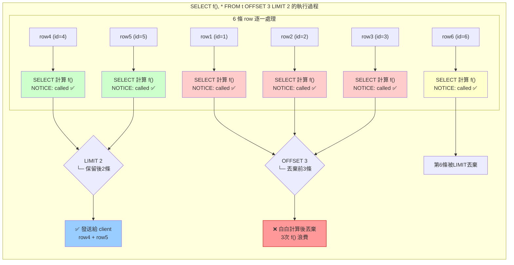
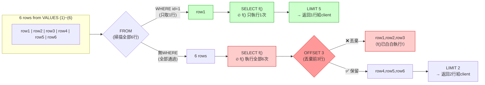
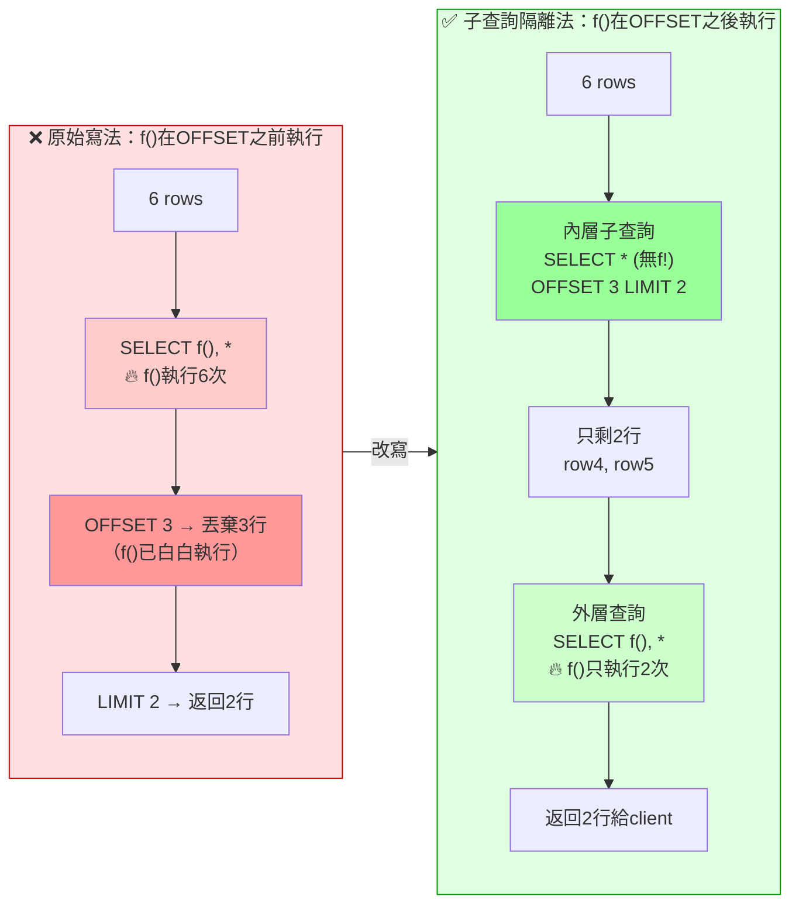
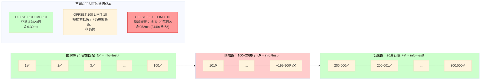
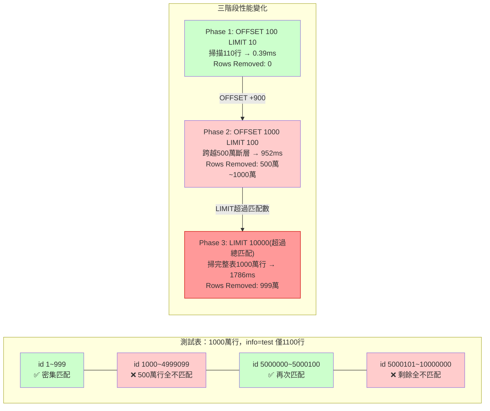
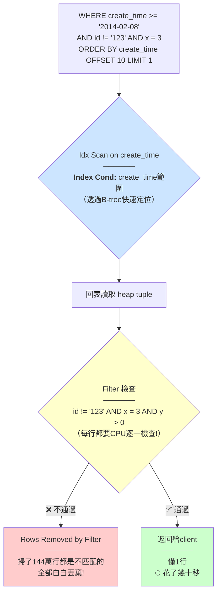
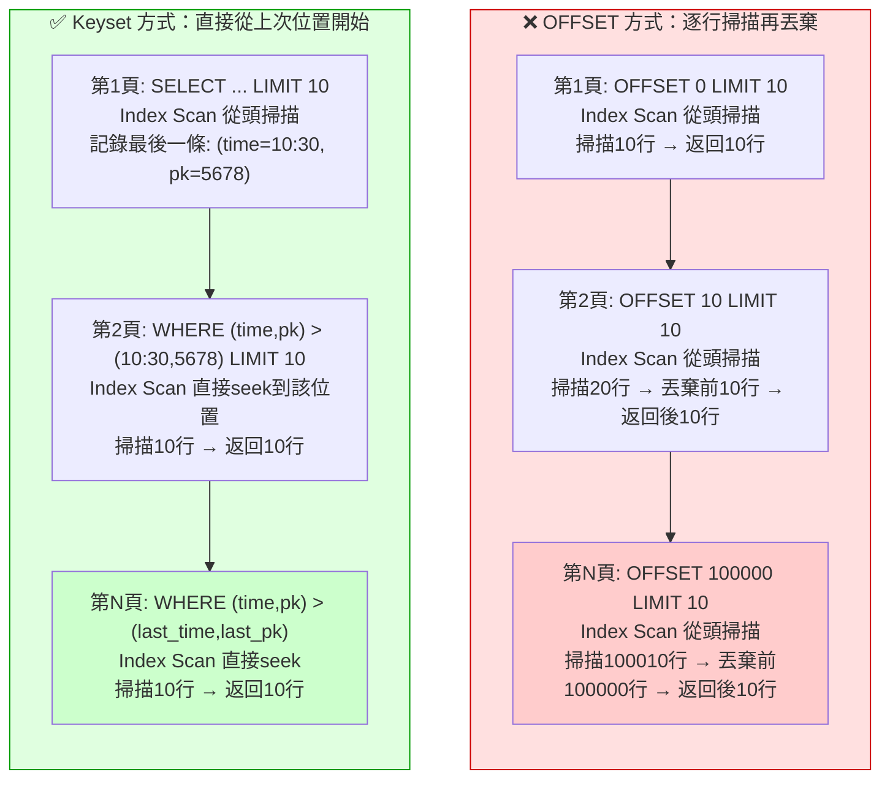
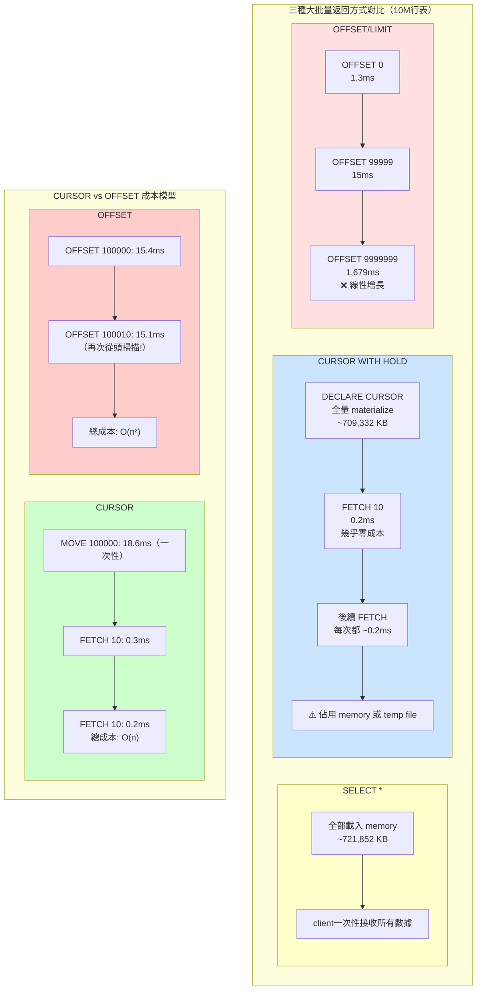
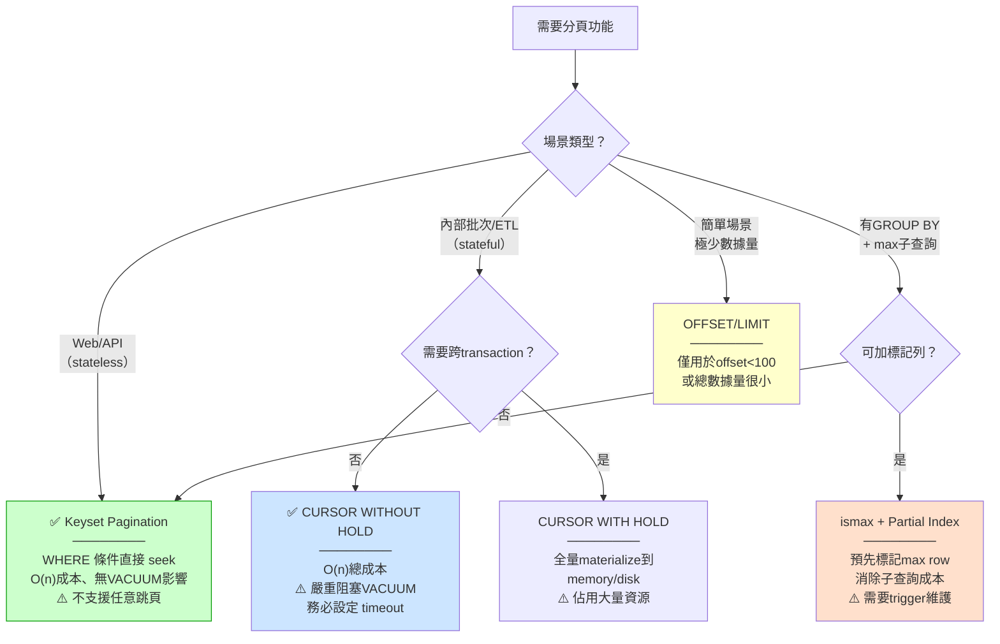

# 一、PostgreSQL 分頁查詢全面解析

> 本文由以下三篇獨立筆記合併整理而成，涵蓋從 OFFSET 底層原理到四種分頁方案的完整知識鏈：
> - PostgreSQL OFFSET 原理與使用注意事項
> - PostgreSQL OFFSET 質變 — 數據分佈斷層引發的掃描放大
> - PostgreSQL 分頁優化 — OFFSET / Cursor / Keyset / 標記列

分頁（Pagination）是 Web 後端和 API 開發中最常見的需求之一：從數十萬、數百萬筆資料中每次只取一小批返回給前端。PostgreSQL 提供了多種分頁方案——`OFFSET/LIMIT`、Keyset（Seek Method）、CURSOR、甚至應用層緩存——但每種方案的效能特性和適用場景截然不同。選錯方案，輕則查詢變慢，重則資料庫 CPU 被打滿。

**閱讀路線**：

| 章節 | 內容 | 適合 |
|------|------|------|
| §1 OFFSET 基本原理 | OFFSET 的實際行為（計算後丟棄而非跳過）、function call 放大、SQL 執行順序 | 所有人 |
| §2 OFFSET 的質變 | 數據斷層導致的掃描量跳升、Production 真實案例、Rows Removed by Filter | 遇到 OFFSET 莫名變慢的人 |
| §3 分頁優化方案 | Keyset / CURSOR / ismax 四種方案對比與選擇指南 | 需要選方案的人 |

本文從 OFFSET 的底層原理出發，逐步深入到數據斷層引發的「質變」現象，最後給出四種分頁方案的全面對比與選擇指南。

---

## 1. OFFSET/LIMIT 的基本原理

### I. OFFSET 不是「跳過」，而是「計算後丟棄」

OFFSET 只過濾最終結果不發送給 client，但跳過的 row 仍然完整經過了 SELECT list 中的所有 expression 計算（包括 function call）。這不是 bug，而是 SQL 執行模型的設計結果。

> 此行為是 SQL 標準定義的邏輯執行順序所決定，非 PostgreSQL 特有。MySQL、SQL Server、Oracle 在 OFFSET 行為上完全一致：OFFSET 發生在 SELECT list 計算之後。Tom Lane 的回覆也確認了這一點。

#### a. VOLATILE function 實驗

創建一個 VOLATILE function，每次呼叫印出 `NOTICE: called`：

```sql
CREATE OR REPLACE FUNCTION f() RETURNS void AS $$
DECLARE
BEGIN
  RAISE NOTICE 'called';
END;
$$ LANGUAGE plpgsql STRICT VOLATILE;
```

```sql
SELECT f(), * FROM (VALUES (1), (2), (3), (4), (5), (6)) t(id) OFFSET 3 LIMIT 2;
-- NOTICE:  called
-- NOTICE:  called
-- NOTICE:  called
-- NOTICE:  called
-- NOTICE:  called
--  f | id
-- ---+----
--    |  4
--    |  5
-- (2 rows)
```

OFFSET 3 跳過了前 3 條 row，但 f() 被呼叫了 **5 次**（等於 OFFSET + LIMIT = 3 + 2），而不是預期的 2 次。連跳過的 row 也執行了 f()。



#### b. STABLE 與 IMMUTABLE 的行為差異

將 function 改為 STABLE，結果不變——`f()` 仍然被呼叫 5 次：

```sql
ALTER FUNCTION f() STABLE;
SELECT f(), * FROM (VALUES (1), (2), (3), (4), (5), (6)) t(id) OFFSET 3 LIMIT 2;
-- NOTICE: called × 5
```

改為 IMMUTABLE 後，optimizer 在生成 execution plan 之前就把 function 常量化（constant folding），因此無論 OFFSET 值多大一律只呼叫 1 次：

```sql
ALTER FUNCTION f() IMMUTABLE;
SELECT f(), * FROM (VALUES (1), (2), (3), (4), (5), (6)) t(id) OFFSET 3 LIMIT 2;
-- NOTICE:  called
-- (only 1 call)
```

> IMMUTABLE 的這種行為是 optimizer 層面的常數折疊（constant folding），前提是 function 輸入參數也為常數。如果 IMMUTABLE function 接受 column 值作為參數，則仍會每 row 計算一次。此外，`STRICT` modifier 表示任一參數為 NULL 則不執行 function body 直接返回 NULL，與 OFFSET 行為無關。

#### c. WHERE 與 OFFSET 的根本差異

```sql
SELECT f(), * FROM (VALUES (1), (2), (3), (4), (5), (6)) t(id) WHERE id = 1 LIMIT 5;
-- NOTICE:  called
-- (only 1 call)
```

f() 只被呼叫 1 次。這是 WHERE 與 OFFSET 的根本差異：

| 機制 | 過濾階段 | 被跳過 row 是否計算 |
|------|----------|-------------------|
| WHERE | 在 SELECT list 計算之前（predicate pushdown） | 否 |
| OFFSET | 在 SELECT list 計算之後，僅不發送給 client | **是** |

> 這反映了 SQL 邏輯執行順序：`FROM → WHERE → SELECT → OFFSET/LIMIT`。WHERE 在 SELECT 之前過濾 row，OFFSET 在 SELECT 之後丟棄結果。所以 OFFSET 節省的是 **網絡傳輸成本**，不是 **計算成本**。這也是為什麼 keyset pagination（`WHERE id > last_id ORDER BY id LIMIT N`）在大偏移量場景遠優於 `OFFSET N`。



### II. 大 OFFSET 的隱性成本

當 OFFSET 值很大時（如 `OFFSET 100000 LIMIT 1`），被跳過的 100,000 條 row 全部會觸發 SELECT list 中的 expression 計算。如果 SELECT 中包含：

- VOLATILE function
- 複雜的 scalar subquery
- `CASE` / `COALESCE` 等 expression
- 其他非 IMMUTABLE 的計算

則這些計算會在 100,000 條 row 上白白執行一次再丟棄，造成極大的 CPU 浪費，也可能讓 performance troubleshooting 誤判瓶頸（因為 EXPLAIN 中的 actual time 包含了這些計算，但最終只返回 1 row，直覺上不該這麼慢）。

Tom Lane（PostgreSQL 核心開發者）的回覆：

> No, it's not a bug. OFFSET only results in the skipped tuples not being delivered to the client; it does not cause them not to be computed.
>
> You could probably do something with a two-level select with the OFFSET in the sub-select and the volatile function in the top level.
>
> — Tom Lane

### III. 解法：子查詢隔離法

把 expensive function 放在外層 SELECT，OFFSET 限制在內層子查詢。內層子查詢只掃描 row（不執行 function），外層才對最終結果執行 function：

```sql
ALTER FUNCTION f() VOLATILE;

SELECT f(), *
FROM (
    SELECT * FROM (VALUES (1), (2), (3), (4), (5), (6)) t(id)
    OFFSET 3 LIMIT 2
) t;
-- NOTICE:  called
-- NOTICE:  called
--  f | id
-- ---+----
--    |  4
--    |  5
-- (2 rows)
```

f() 只被呼叫 **2 次**（等於最終返回的 row 數），OFFSET 3 跳過的 3 條 row 不再觸發 function 計算。

這個方案的關鍵在於：**內層子查詢只投影 column，不含 function call**。OFFSET 在內層執行時只需處理 column 值（幾乎零成本），外層才對篩選後的結果執行 function。



> 在實際應用中，如果 function 接受的是 table column 值（如 `f(col)`），而非 `f()` 無參數，則此解法無效——因為內層必須投影該 column 才能傳給外層。這種情況下應考慮：
> 1. 改用 WHERE-based pagination（keyset / cursor）完全避免 OFFSET
> 2. 若 function 邏輯可用 CASE 改寫為 IMMUTABLE expression，讓 optimizer 處理
> 3. 若 function 為 STABLE 且結果可緩存，考慮 subquery 中先 `DISTINCT` 去重 column 值再 JOIN 回來，減少呼叫次數
>
> **[PG 13+] Incremental Sort**：當查詢包含 `ORDER BY x OFFSET N LIMIT M` 時，PG 13+ 的 Incremental Sort 可以分批排序（而非一次性全量排序），降低大 OFFSET + ORDER BY 場景的排序成本。但注意：這只優化排序階段，OFFSET 跳過的 row 仍然會計算 SELECT list 中的 expression——Incremental Sort 不改變 OFFSET 對計算成本的影響。
>
> **[PG 12+] FETCH FIRST 語法**：PG 12 起支援 SQL 標準語法，行為與 `LIMIT` / `OFFSET` 完全等價：
> ```sql
> SELECT * FROM tab ORDER BY id OFFSET 100 ROWS FETCH FIRST 10 ROWS ONLY;
> -- 等價於
> SELECT * FROM tab ORDER BY id OFFSET 100 LIMIT 10;
> ```

---

## 2. OFFSET 的質變 — 數據斷層引發掃描放大

### I. 什麼是「質變」？

OFFSET 不是「跳過 N 行後再開始讀取」，而是**前面的 N 行仍然需要被完整掃描、過濾、丟棄**。當數據分佈存在斷層時，性能會出現劇烈的「質變」——OFFSET 加 1 可能導致掃描量跳升數萬倍。



> **上圖說明**：一個 30 萬行的表中，只有綠色行滿足查詢條件。前 100 行密集匹配，但 100～20 萬之間全是紅色不匹配行（斷層），之後才再次出現匹配行。OFFSET 值一旦跨越斷層，查詢成本會劇烈跳升。

如上圖：一個 node 有 30 萬 row，前 100 row 滿足條件，100 到 20 萬 row 都不滿足，之後才再次出現滿足條件的 row。

- `OFFSET 10 LIMIT 10`：掃描前 20 row → 極快
- `OFFSET 100 LIMIT 10`：必須掃描 100 到 20 萬之間的 **199,900 row 全部不滿足的 row**，才能找到下一個滿足條件的結果

OFFSET + LIMIT 的成本取決於 **條件匹配的第一條滿足 row 之前的總 row 數**，而非 OFFSET 的數值本身。這就是「質變」的來源。

> 這與前文 §1 討論的「OFFSET 導致 function call 放大」是兩個獨立的性能問題：
>
> | 問題 | 成因 | 放大對象 |
> |------|------|---------|
> | **Function call 放大**（§1） | OFFSET 在 SELECT list 計算之後過濾 | VOLATILE function / expensive expression |
> | **掃描放大**（本文） | OFFSET 需要遍歷所有前置 tuple | Index/Seq Scan 的 row 處理量 |
>
> 兩個問題會疊加：一個查詢中既有 OFFSET 又有 `f()` → 前置 tuple 全都執行 `f()` 再掃描再丟棄。

### II. 模擬實驗：1000 萬行表中的三個階段

#### a. 建立測試表

```sql
CREATE TABLE tbl (id int PRIMARY KEY, info text);
INSERT INTO tbl SELECT generate_series(1, 10000000), '';

-- 將 info='test' 散佈在兩個區間：
--   id < 1000（前 1000 row）
--   和 id BETWEEN 5000000 AND 5000100（中間有 500 萬的空窗）
UPDATE tbl SET info = 'test'
    WHERE id < 1000 OR id BETWEEN 5000000 AND 5000100;
-- 總共 1100 row 被更新
```

#### b. Phase 1：OFFSET 100 LIMIT 10（匹配 row 在附近，極快）

```sql
EXPLAIN (ANALYZE, BUFFERS)
SELECT * FROM tbl WHERE info = 'test' ORDER BY id OFFSET 100 LIMIT 10;
```

```
 Limit  (actual time=0.154..0.343 rows=10 loops=1)
   Buffers: shared hit=603
   ->  Index Scan using tbl_pkey on tbl
         (actual time=0.019..0.293 rows=110 loops=1)
         Filter: (info = 'test')
         Rows Removed by Filter: 0        ← 無浪費
         Buffers: shared hit=603
 Execution time: 0.386 ms                 ← 極快
```

OFFSET 100 只跳過了前面緊湊分佈的匹配 row，Index Scan 總共只處理了 110 row。

#### c. Phase 2：OFFSET 1000 LIMIT 100（跨越斷層，性能崩潰）

```sql
EXPLAIN (ANALYZE, BUFFERS)
SELECT * FROM tbl WHERE info = 'test' ORDER BY id OFFSET 1000 LIMIT 100;
```

**Planner 選擇 Seq Scan 的版本：**

```
 Limit  (actual time=952.266..952.330 rows=100 loops=1)
   Buffers: shared hit=44260
   ->  Sort  (actual time=951.892..952.102 rows=1100 loops=1)
         Sort Key: id
         Sort Method: quicksort  Memory: 100kB
         ->  Seq Scan on tbl
               (actual time=951.167..951.496 rows=1100 loops=1)
               Filter: (info = 'test')
               Rows Removed by Filter: 9998900   ← 幾乎整個表都掃完
               Buffers: shared hit=44260
 Execution time: 952.375 ms              ← 從 0.39ms 暴增到 952ms（2440x）
```

**強制 Index Scan 的版本**（`SET enable_seqscan = off`）：

```
 Limit  (actual time=888.400..888.519 rows=100 loops=1)
   Buffers: shared hit=38991
   ->  Index Scan using tbl_pkey on tbl
         (actual time=0.033..888.267 rows=1100 loops=1)
         Filter: (info = 'test')
         Rows Removed by Filter: 4999000    ← 掃了 500 萬 row 都是不匹配的！
         Buffers: shared hit=38991
 Execution time: 888.632 ms
```

Index Scan 按 `id` 順序掃描。前 1000 row 匹配後，`id` 繼續遞增但 `info` 不再匹配——必須掃過 500 萬 row 才再次找到匹配。

#### d. Phase 3：LIMIT 超過總匹配數（強制掃完全表）

```sql
EXPLAIN (ANALYZE, BUFFERS)
SELECT * FROM tbl WHERE info = 'test' ORDER BY id OFFSET 1000 LIMIT 10000;
```

```
 Limit  (actual time=898.675..1786.476 rows=100 loops=1)
   Buffers: shared hit=74776
   ->  Index Scan using tbl_pkey on tbl
         (actual time=0.030..1786.240 rows=1100 loops=1)
         Filter: (info = 'test')
         Rows Removed by Filter: 9998900    ← 全表 1000 萬 row 都掃了
         Buffers: shared hit=74776
 Execution time: 1786.536 ms
```

因為 LIMIT 10000 但總匹配只有 1100 row，OFFSET 1000 後只剩 100 row。Planner 無法預先知道總匹配數（除非統計資訊極度精準），所以需要掃完整個 index 直到 EOF 才能確認「沒有更多 matching row 了」。

> 三階段的成本數據對比：
>
> | Phase | OFFSET | Buffers | Rows Removed by Filter | Runtime | 放大器 |
> |-------|:------:|--------|:----------------------:|--------:|:------:|
> | 1 | 100 | 603 | 0 | 0.39 ms | 1x |
> | 2 (Seq) | 1000 | 44,260 | 9,998,900 | 952 ms | 2440x |
> | 2 (Idx) | 1000 | 38,991 | 4,999,000 | 889 ms | 2280x |
> | 3 | 1000 | 74,776 | 9,998,900 | 1786 ms | 4580x |
>
> 注意 Phase 2 中 Seq Scan 和 Index Scan 的 buffers 差異（44K vs 39K）。Index Scan 的 buffers 較少因為它只讀 index page + heap page（含 visibility map check），Seq Scan 則必讀完整的 heap pages。但在 I/O 層面，如果 data 不在 cache 中，Index Scan 的 39K random read 可能比 Seq Scan 的 44K sequential read 更慢。



### III. Production 真實案例：OFFSET 10 觸發 144 萬行掃描

一位開發同事的 SQL，只改了 OFFSET 值，查詢速度從毫秒暴增到幾十秒。

**快速版本（OFFSET 0）：**

```sql
SELECT * FROM tbl
WHERE create_time >= '2014-02-08' AND create_time < '2014-02-11'
  AND x = 3
  AND id != '123' AND id != '321'
  AND y > 0
ORDER BY create_time LIMIT 1 OFFSET 0;
-- 100ms
```

**慢速版本（OFFSET 10）：**

```sql
SELECT * FROM tbl
WHERE create_time >= '2014-02-08' AND create_time < '2014-02-11'
  AND x = 3
  AND id != '11622' AND id != '13042'
  AND y > 0
ORDER BY create_time LIMIT 1 OFFSET 10;
-- 幾十秒
```

兩個 SQL 的 execution plan 幾乎一樣（都用 `create_time` index scan + Filter），但後者的 Filter 淘汰率極高。

**量化掃描量**：取到 OFFSET 10 的 `create_time` 值後，可以估算掃描量：

```sql
SELECT COUNT(*) FROM tbl
WHERE create_time <= '2014-02-08 18:38:35.79'
  AND create_time >= '2014-02-08';
-- count: 1,448,081
```

僅僅 OFFSET 10，就需要掃描約 **144 萬 row**，其中絕大多數都被 Filter 丟棄。這就是「質變」的具體數字。

> 根本矛盾：**WHERE 條件中的 `id !=` 和 `x = 3` 等 Filter 無法被 `create_time` 索引加速**，Index Scan 只能在 `create_time` 維度快速定位，但 Filter 淘汰率高 → OFFSET 越大，需要掃描的 row 越多。這是所有 SQL 資料庫的共同問題，不是 PostgreSQL 特有。`OFFSET N` 的複雜度是 O(N) 而非 O(1)。

### IV. Index Scan 中的 Filter 成本：Rows Removed by Filter

當 Index Scan 中包含非 index column 的 Filter 條件時，每個 index entry 指向的 heap row 都要被回表檢查：

```
Index Scan using idx on tbl
   Index Cond: (create_time >= '...' AND create_time < '...')
   Filter: (id != '123' AND id != '321' AND y > 0 AND x = 3)
   Rows Removed by Filter: 1440000   ← 這裡就是質變的量化指標
```

| 指標 | 說明 |
|------|------|
| `Index Cond` | 真正用來縮小 index scan range 的條件（走 index B-tree 結構） |
| `Filter` | index scan 後逐 row 檢查的附加條件（不做 index 定位，只是 heap tuple 回表後的 CPU 過濾） |
| `Rows Removed by Filter` | 被 Filter 篩掉的 row 數 = 白掃的量 |



> **優化方向**：
> 1. **讓 Filter 條件變成 Index Cond**：把 `x` 或 `y` 加入 composite index。但代價是 index 變大、寫入變慢。
> 2. **Partial Index**：如果 `x = 3` 是少數情況，可以 `CREATE INDEX ... WHERE x = 3` 讓 index 只包含這些 row。
> 3. **Covering Index（INCLUDE）**：讓回表變 Index Only Scan，省掉 heap page read。
> 4. **`pg_stat_statements` 監控**：query 中的 `shared_blks_hit + shared_blks_read` 過大但 `rows` 很小 → 幾乎肯定是 OFFSET 掃描放大。

---

## 3. 分頁優化方案

### I. 方案一：Keyset Pagination（推薦）

#### a. 原理與基本 SQL 模板

根本方案是**不使用 OFFSET**。每次查詢記錄「最後一條結果」的排序鍵值 + 唯一鍵，下一頁用 `WHERE` 從該位置之後繼續：

```sql
-- 第 1 頁
SELECT * FROM tbl
WHERE create_time >= '2014-02-08' AND create_time < '2014-02-11'
  AND x = 3 AND id != '123' AND id != '321' AND y > 0
ORDER BY create_time, pk
LIMIT 10;

-- 得到最後一條的 create_time = '2014-02-08 10:30:00', pk = 5678

-- 第 2 頁（代替 OFFSET 10）
SELECT * FROM tbl
WHERE create_time >= '2014-02-08' AND create_time < '2014-02-11'
  AND x = 3 AND id != '123' AND id != '321' AND y > 0
  AND (create_time, pk) > ('2014-02-08 10:30:00', 5678)  -- ← 從這裡開始
ORDER BY create_time, pk
LIMIT 10;
```

**核心思想**：把「跳過前 N 條」轉化為 `WHERE create_time > last_fetched_time`，讓 Index Scan 直接 seek 到上次結束的位置。這是業界稱為 **Keyset Pagination** 或 **Cursor-based Pagination** 的標準做法（如 GraphQL Relay 的 `after`/`before` cursor）。



#### b. Tie-breaker 與 Row Value Comparison

如果 `ORDER BY` 的 column 非 unique（如 `create_time` 可能重複），必須加 PK 作為 tie-breaker：

```sql
-- PostgreSQL 的 row value comparison（推薦）
AND (create_time, pk) > (last_time, last_pk)

-- 等價的傳統寫法（PG 9.4- 無 row comparison）：
AND (
    create_time > last_time
    OR (create_time = last_time AND pk > last_pk)
)
```

> **Row value comparison** `(a, b) > (c, d)` 是 PG 特有的語法糖，Planner 會將它轉換為等價的 AND/OR 條件，**並且可以使用 (a, b) 上的 composite index**。這是 PG 相對於 MySQL 的優勢（MySQL 5.7 前不支援 row value 比較）。
>
> **Tie-breaker 的必要性**：如果 `ORDER BY` 的 column 不是 unique 的，同一個值可能對應多 row。OFFSET 10 可能跳過 10 row，但另一筆同值的 row 可能因為 query plan 的 non-determinism 出現在不同批次的結果中，導致重複或漏頁。`ORDER BY create_time, pk` 保證了 deterministic ordering。

#### c. 雙向分頁 + Web/API 實作

```sql
-- Forward (下一頁)
SELECT * FROM t
WHERE (order_col, pk_col) > (:last_order_val, :last_pk_val)
ORDER BY order_col, pk_col
LIMIT :page_size;

-- Backward (上一頁)
SELECT * FROM (
  SELECT * FROM t
  WHERE (order_col, pk_col) < (:first_order_val, :first_pk_val)
  ORDER BY order_col DESC, pk_col DESC
  LIMIT :page_size
) sub
ORDER BY order_col, pk_col;
```

**Web/API 層的實作**：API response 中回傳 `next_cursor`（base64 encoded last sort keys），client 下次請求帶 `?cursor=xxx`。這在 GraphQL Relay spec、Twitter API、Stripe API 中都是標準 pagination 模式。

**Keyset 的先天限制與應對**：

| 限制 | 應對方案 |
|------|---------|
| 不支援任意跳頁（「跳到第 10 頁」） | 讓 client 緩存前幾頁的 cursor；前幾頁用 OFFSET（成本可控） |
| 需要總頁數顯示 | `count(*)` 結果應緩存（如 Redis，TTL 30-60s），不要每頁都 count |

> **Web 場景最終結論**：
> 1. **第一選擇**：Keyset pagination
> 2. 若需要頁碼導航：小於 ~100 頁用 OFFSET，深頁轉 keyset 或提供搜尋/篩選縮小範圍
> 3. 若需要總頁數顯示，`count(*)` 結果應緩存
> 4. **絕對不要**在 web request handler 中使用 DB CURSOR——HTTP 是 stateless，無法跨 request 保持 cursor

### II. 方案二：CURSOR

#### a. 三種大批量返回方式對比

環境：PostgreSQL 9.0.2，表大小 588,240 KB（約 10M row）。

**方式一：SELECT \*（全部載入 client memory）**

```sql
SELECT * FROM tbl_user;
```

| 階段 | Backend memory 佔用 |
|------|-------------------|
| 連線 idle | 3,512 KB |
| 執行中 | 409,764 KB → 721,852 KB |
| 結果傳完 idle | 721,852 KB |

所有數據載入 backend process memory，適合小結果集。

**方式二：CURSOR WITH HOLD（session-level cursor）**

```sql
BEGIN;
DECLARE cur_test SCROLL CURSOR WITH HOLD FOR SELECT * FROM tbl_user;
FETCH 10 FROM cur_test;
```

| 操作 | Memory 佔用 |
|------|------------|
| 連線 idle | 3,508 KB |
| DECLARE CURSOR 後 | 709,332 KB |
| FETCH 1 | ~5,128 KB |
| FETCH LAST | 703,972 KB |

關鍵觀察：DECLARE CURSOR 時數據已全部 materialize（載入 memory 或 temporary file），memory 佔用接近全表大小。後續 FETCH 操作幾乎零成本（0.2-0.3ms）。

> `WITH HOLD` cursor 的 materialize 行為：當結果集超過 `work_mem` 時，數據寫入 temporary file（`$PGDATA/base/pgsql_tmp/`）。這解釋了為什麼 memory 佔用可能低於表大小——超出 work_mem 的部分在 disk 上。

**方式三：OFFSET/LIMIT**

```sql
SELECT * FROM tbl_user ORDER BY id OFFSET 0 LIMIT 1;       -- 1.354 ms
SELECT * FROM tbl_user ORDER BY id OFFSET 99999 LIMIT 1;    -- 15.248 ms
SELECT * FROM tbl_user ORDER BY id OFFSET 9999999 LIMIT 1;  -- 1,679 ms
```

OFFSET 越大越慢，因為必須從頭掃描到 OFFSET 位置。

#### b. CURSOR 生命週期與 INSENSITIVE 語義

**CURSOR 生命週期**：
- `WITHOUT HOLD`（預設）：transaction 結束時自動釋放
- `WITH HOLD`：session 結束時釋放，或定義 cursor 的 transaction 被 ABORT 時釋放

```sql
BEGIN;
DECLARE cur_test SCROLL CURSOR WITH HOLD FOR SELECT * FROM tbl_user;
ABORT;  -- cursor 被釋放
FETCH LAST FROM cur_test;
-- ERROR: cursor "cur_test" does not exist
```

**INSENSITIVE 語義**：定義後的 DML 對 FETCH 不可見。即使其他 session DELETE 了所有數據，cursor 仍能 FETCH 到定義時的 snapshot。

```sql
-- SESSION A: 定義 cursor WITH HOLD
DECLARE cur_test SCROLL CURSOR WITH HOLD FOR SELECT * FROM tbl_user;

-- SESSION B: DELETE 全部
DELETE FROM tbl_user;

-- SESSION A: 仍然可 FETCH（返回原始數據）
FETCH FIRST FROM cur_test;
```

#### c. MOVE vs OFFSET 成本對比

```sql
-- CURSOR: 一次性 MOVE 成本，後續 FETCH 幾無成本
BEGIN;
DECLARE cur_test NO SCROLL CURSOR WITHOUT HOLD FOR
  SELECT * FROM tbl_user ORDER BY id;
MOVE 100000 FROM cur_test;   -- 18.638 ms（一次性）
FETCH 10 FROM cur_test;      -- 0.317 ms
FETCH 10 FROM cur_test;      -- 0.223 ms

-- OFFSET: 每次都要付成本
SELECT * FROM tbl_user ORDER BY id OFFSET 100000 LIMIT 10;  -- 15.432 ms
SELECT * FROM tbl_user ORDER BY id OFFSET 100010 LIMIT 10;  -- 15.170 ms
```

> CURSOR 的總成本是 O(n)，OFFSET 翻頁的總成本是 O(n²)。但 MOVE 一次的成本 = OFFSET 一次的成本——CURSOR 的優勢在於一次性付出後續零成本。



#### d. CURSOR 生產禁忌

1. CURSOR 用完一定要 `CLOSE` 關掉
2. 盡量避免在 large result set 下使用 `WITH HOLD` cursor——需要將數據預載入 memory 或 temporary file
3. **`WITHOUT HOLD` cursor 的 transaction 會影響 VACUUM 回收空間**——這是非常嚴重的問題

> 第 3 點是生產中 CURSOR 翻頁方案的最大殺手。一個用戶打開了 cursor 然後去吃飯，這個 backend 的 transaction 就一直 open → `xmin` horizon 無法推進 → VACUUM 無法回收該 transaction 開始後產生的 dead tuple → table bloat。解決方案：
> - `idle_in_transaction_session_timeout`（PG 9.6+）：強制殺掉停在 idle in transaction 的 connection
> - 如果必須用 CURSOR，使用 `WITH HOLD` + 在 FETCH 之間 `COMMIT`（但 `WITH HOLD` 本身消耗 memory/temp file）
> - **Web 場景不要用 DB CURSOR**：HTTP request 之間無法保持 DB connection/cursor 狀態。應用層實現 keyset pagination 才是正解

查詢 CURSOR 狀態：

```sql
SELECT * FROM pg_cursors;
-- name | statement | is_holdable | is_binary | is_scrollable | creation_time
```

### III. 方案三：ismax 標記列（特殊場景）

#### a. 原始問題場景

當分頁查詢涉及昂貴的子查詢（如 `GROUP BY` + `max()`），OFFSET 會導致子查詢被反覆執行：

```sql
SELECT t.APP_ID, t.APP_VER, t.CN_NAME, ...
FROM
  (SELECT APP_ID, max(APP_VER) APP_VER
   FROM test1 GROUP BY APP_ID) s
JOIN test1 t
  ON s.APP_ID = t.APP_ID AND s.APP_VER = t.APP_VER AND t.DELETED = 0
LEFT OUTER JOIN test2 at ON t.APP_ID = at.APP_ID
LEFT OUTER JOIN test3 h  ON t.APP_ID = h.APP_ID
LIMIT 24 OFFSET 0;
```

Execution plan：

```
-- OFFSET 0: total 0.565 ms
GroupAggregate → Index Scan (62 rows → 25 groups)
Merge Join → Index Scan on t (60 rows)
Nested Loop → Index Scan on h (1 row × 24 loops)

-- OFFSET 100000: total 1,060.683 ms — 注意 loops=92075
GroupAggregate → Index Scan (110,646 rows → 92,796 groups)
Merge Join → Index Scan on t (109,855 rows)
Nested Loop → Index Scan on h (1 row × 92,075 loops)  -- 91K 次回表！
```

瓶頸是本應 LIMIT 24 才需要的 row，但因為 OFFSET 100000 導致 planner 被迫全量 JOIN 再丟棄 100,000 條。

#### b. ismax + Partial Index 優化方案

```sql
ALTER TABLE test1 ADD COLUMN ismax BOOLEAN;

UPDATE test1 SET ismax = TRUE
WHERE (app_id, app_ver) IN (
    SELECT app_id, max(app_ver) FROM test1 GROUP BY app_id
);

-- Partial Index：只索引 ismax = TRUE 的 row，且對應 deleted = 0
CREATE INDEX idx_test1_1 ON test1(app_id) WHERE ismax IS TRUE AND deleted = 0;
```

重寫查詢，消除子查詢：

```sql
SELECT t.APP_ID, t.APP_VER, t.CN_NAME, ...
FROM test1 t
LEFT OUTER JOIN test2 at
  ON (t.APP_ID = at.APP_ID AND t.DELETED = 0 AND t.ismax IS TRUE)
LEFT OUTER JOIN test3 h
  ON (t.APP_ID = h.APP_ID)
LIMIT 24 OFFSET 0;
```

| 指標 | 原 SQL | ismax 優化 | 改善 |
|------|--------|-----------|------|
| Total runtime (OFFSET 100000) | 1,060 ms | 584 ms | ~1.8× |

性能大約 1 倍提升，但到深頁仍然隨 OFFSET 變慢——ismax 只解決了子查詢成本，沒有解決 OFFSET 本身的掃描放大。

#### c. 生產維護考量

- **Trigger 維護 ismax**：新增 `app_ver` 時需同時更新 ismax，新 row 的 ismax = TRUE，同一 `app_id` 的舊 row 設為 FALSE
- **並發問題**：兩個 transaction 同時插入同一 `app_id` 的不同 `app_ver`，各自都可能認為自己的 row 是 max。解法：使用 `SERIALIZABLE` isolation level、advisory lock、或定期用 cron job 修正
- **Partial Index 的維護**：`WHERE ismax IS TRUE AND deleted = 0` 條件變更時，row 會從 partial index 中被移除，VACUUM 會清理 dead tuple
- **現代替代方案**：PostgreSQL 的 `DISTINCT ON` + `ORDER BY app_id, app_ver DESC` 可以取代 GROUP BY 的 `max(app_ver)`，在某些場景比 ismax 標記列更簡潔，但無法利用 partial index 過濾

### IV. 四種方案全面對比表

| 方案 | 總翻頁成本 | Memory | VACUUM 影響 | 任意跳頁 | 適用場景 |
|------|----------|--------|------------|---------|---------|
| OFFSET/LIMIT | O(n²) | 低 | 無 | 支援 | 極小 offset（<100）/ 總行數少 |
| **Keyset Pagination** | **O(n)** | **低** | **無** | 不支援 | **Web API / app 列表（推薦）** |
| CURSOR WITHOUT HOLD | O(n) | 低（遞增） | **嚴重**（阻塞 VACUUM） | 支援（SCROLL） | 內部批次處理 / ETL |
| CURSOR WITH HOLD | O(n) | **高**（全量 materialize） | 輕微 | 支援（SCROLL） | 需跨 transaction 的內部工具 |
| ismax 標記列 | O(n)（輔助優化） | 低 | 需 VACUUM | 支援 | 含 GROUP BY + max 子查詢的分頁 |



> **一句話總結**：Web 場景用 Keyset，內部批次用 CURSOR，有 GROUP BY 子查詢時考慮 ismax 輔助，OFFSET 只用於淺頁或少數據量。

---

> 來源：
> - [digoal - PostgreSQL offset 原理，及使用注意事项 (2016-04-02)](https://github.com/digoal/blog/blob/master/201604/20160402_02.md)
> - [digoal - PostgreSQL 数据访问 offset 的质变 case (2016-07-15)](https://github.com/digoal/blog/blob/master/201607/20160715_02.md)
> - [digoal - PostgreSQL's Cursor USAGE with SQL MODE — 分頁優化 (2011-02-16)](https://github.com/digoal/blog/blob/master/201102/20110216_02.md)
> - [digoal - 分頁優化 — add max_tag column speedup Query (2012-06-20)](https://github.com/digoal/blog/blob/master/201206/20120620_01.md)
> - [digoal - 分頁優化 — ORDER BY LIMIT x OFFSET y performance tuning (2014-02-11)](https://github.com/digoal/blog/blob/master/201402/20140211_01.md)
