# PostgreSQL 查詢深度解析 — 從生命週期到進階優化

> **閱讀指引**：本文由 `/query/` 目錄下 8 篇獨立筆記合併而成，依 **由淺到深** 排序：
>
> - **第一章** 從一條 SQL 的完整生命週期開始，理解 PostgreSQL 內部到底發生了什麼
> - **第二章** 探討 CBO 的盲區以及何時需要 Hint 介入
> - **第三～五章** 深入常見查詢模式：GROUP BY 策略、IN 寫法、分頁計數
> - **第六～八章** 進入 Recursive CTE 進階技法：Skip Scan 模擬、Top-N 加速、死循環防禦
>
> 每章均附有 **原始碼參考** 和 **Senior Dev 實戰補充**，適合中階以上 PostgreSQL 開發者。
>
> 主要來源：[digoal (德哥) PostgreSQL 部落格](https://github.com/digoal/blog)

---

# 一、查詢生命週期：從 Client Request 到 Result Return

> 來源：[PipelinedB Wiki - Lifecycle of a query](https://github.com/pipelinedb/pipelinedb/wiki/Lifecycle-of-a-query)
> 原出處：[digoal 轉載 (2015-10-16)](https://github.com/digoal/blog/blob/master/201510/20151016_01.md)

## 1. 六階段總覽

一個 query 從 client 發起請求到接收結果，經歷六個階段：

```
Client Request → Parser → Analyzer → Planner → Executor → Client Response
```

每個階段輸出不同的 tree 結構：
- **Parser** → parsed query tree（`parsenodes.h`）
- **Analyzer** → rewritten Query object
- **Planner** → plan tree（`plannodes.h`）
- **Executor** → executor node tree（`execnodes.h`），遞迴執行 plan tree 每個 node，結果返回 client

> 補充（Senior Dev）：這是 PG 最重要的三層 tree 轉換：
> | Tree Type | Header | 目的 |
> |-----------|--------|------|
> | Parse Tree | `parsenodes.h` | 語法結構 —— 「使用者說了什麼」 |
> | Plan Tree | `plannodes.h` | 執行策略 —— 「怎麼最省成本」 |
> | Executor State Tree | `execnodes.h` | 執行狀態 —— 「跑到哪裡了」 |
>
> Parse tree 的 node types（如 `SelectStmt`、`InsertStmt`）直接對應 SQL 語法結構（raw parse tree 不做任何語義校驗，連 column 存在與否都不檢查）。Plan tree 才是真正決定 I/O 策略的關鍵。了解這三層的區別，才能理解 `EXPLAIN` output 的 cost/row estimate 來源、以及為什麼有時 planner 的 estimate 與 actual 差異巨大（通常是 `pg_statistic` 過時或 correlation 不準）。

## 2. Client Request

當你打開應用程式、下了一行 SQL 時，這行 SQL 是怎麼送進 PostgreSQL 的？這個階段就是在處理這件事。

### I. 先認識 Postmaster：PG 的「總機」

PostgreSQL 啟動後，第一個跑起來的 process 叫做 **Postmaster**。你可以把它想像成一個總機或櫃檯接待員：

> Postmaster **自己不處理 SQL**，它的工作只有兩件事：
> 1. 監聽 client 的連線請求（預設 port 5432）
> 2. 幫每個 client **指派（fork）一個專屬的後台 process**（backend process）

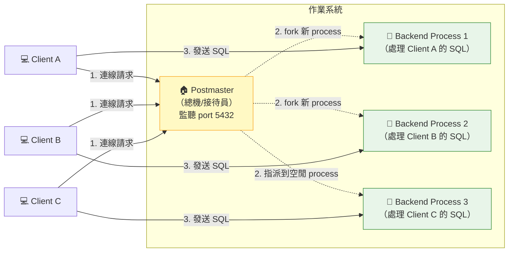

### II. Process-per-Connection：一人一間辦公室

PostgreSQL 的核心設計是 **一個 connection = 一個 OS process**（不是 thread）。

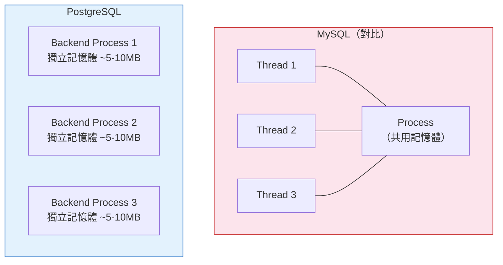

**優點：**
- 穩定性高：一個 process crash 不會拖垮其他 connection
- 不用擔心 thread-safe 問題（每個 process 各自獨立）

**缺點（也是最重要的生產考量）：**
- 每個 connection 至少吃掉 **5~10 MB 記憶體**（視 `work_mem` 設定而定）
- **1000 個 connection = 5~10 GB 記憶體就這樣沒了**
- 這也是為什麼正式環境**一定要用 connection pooler**

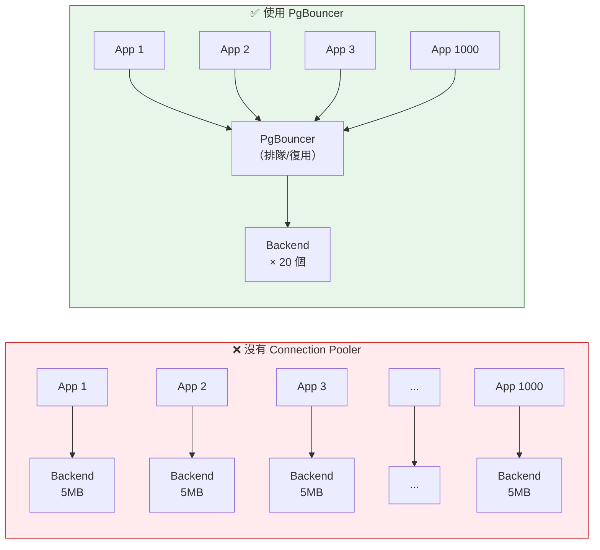

### III. Wire Protocol：Client 跟 PG 怎麼「說話」

Client 不是直接傳 SQL 字串給 PG，而是透過一套**二進位通訊協定（wire protocol）**。

每一條訊息的第一個 byte 是**訊息類型代碼**，接下來 4 bytes 是訊息長度，後面才是實際內容。

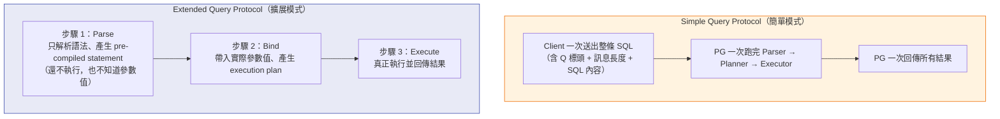

| 模式 | 誰在用 | 一句話解釋 |
|------|--------|-----------|
| **Simple Query** | `psql` 命令行、簡單 scripts | 一句 SQL 丟進去 → 結果出來 |
| **Extended Query** | JDBC、Npgsql、所有正式 Driver | 先編譯 → 再帶參數 → 再執行（安全又快） |

**實際範例 —— 同樣的 SQL，兩種傳法：**

```
Simple Query：
  Client → PG:  [Q][長度][SELECT * FROM users WHERE id = 1]
  PG → Client:  [T][長度][查詢結果 row 1][T][查詢結果 row 2]...

Extended Query：
  Client → PG:  [P][長度][SELECT * FROM users WHERE id = $1]     ← Parse，用 $1 佔位
  PG → Client:  [1]（表示 parse 完成，給你一個 statement ID）
  Client → PG:  [B][長度][statement ID][參數值: 1]              ← Bind，帶入實際值
  PG → Client:  [2]（bind 完成）
  Client → PG:  [E][長度][statement ID]                         ← Execute
  PG → Client:  [T][長度][查詢結果 row 1][T][查詢結果 row 2]...
```

> Extended Query 的關鍵好處：
> - **防止 SQL injection**：參數是分開傳的，不會跟 SQL 語法混在一起
> - **可重複執行**：同一條 SQL 只需要 Parse 一次，之後只要 Bind + Execute（省下 parse 成本）
> - **支援 Cursor**：可以一段一段 fetch 結果，而不是一次全部回傳

### IV. 整個 Client Request 階段總覽

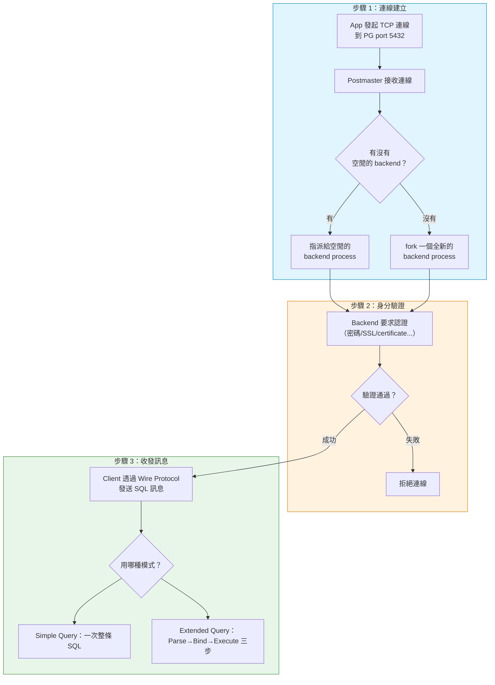

> 補充（Senior Dev）：函數名 `exec_simple_query` **極具誤導性** —— 它處理絕大多數 query，包括極度複雜的查詢。不要被 "simple" 這個字騙了。

## 3. Parser

### I. Parser 在做什麼？一句話：把「字串」變成「樹」

當你寫下一行 SQL：

```sql
SELECT name, age FROM users WHERE id = 1;
```

對電腦來說，這只是一串**文字**。電腦看不懂 "SELECT" 是什麼意思、"FROM" 跟誰是一組的。Parser 的工作就是把這串文字轉換成一個**有結構的樹狀資料**（parse tree）。

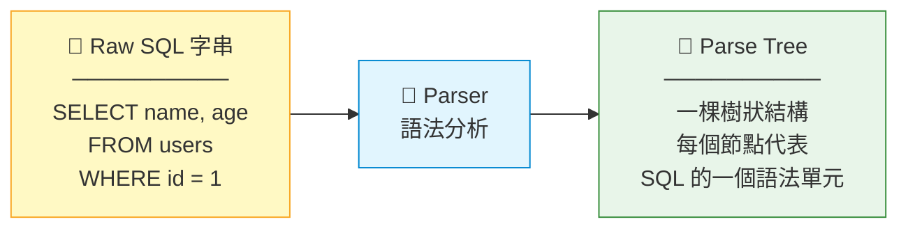

### II. Parse Tree 長什麼樣子？實際拆解一條 SELECT

PG 會把 SQL 的每個關鍵字拆成一個「節點」，然後按照層級關係組成一棵樹。

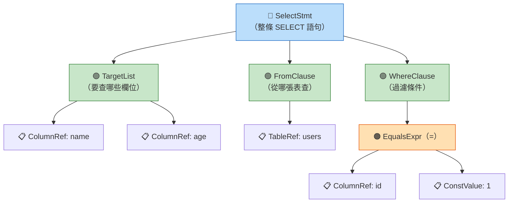

> **白話解釋**：SQL 是一個巢狀層級語言——`WHERE` 裡面包含「條件」，條件裡面又包含「左邊的 column」和「右邊的值」。Parser 的工作就是把這種層級關係用樹的方式「畫」出來，讓後面的階段可以照著這棵樹往下處理。

不同類型的 SQL 會產生不同根節點的 parse tree：

| SQL 類型 | Parse Tree 根節點 | 範例 |
|----------|-------------------|------|
| `SELECT` | `SelectStmt` | `SELECT * FROM t` |
| `INSERT` | `InsertStmt` | `INSERT INTO t VALUES (1)` |
| `UPDATE` | `UpdateStmt` | `UPDATE t SET x = 1` |
| `DELETE` | `DeleteStmt` | `DELETE FROM t` |
| `CREATE TABLE` | `CreateStmt` | `CREATE TABLE t (id INT)` |

### III. Parser 只管語法、不管語義

Parser 的工作範圍很窄——**只檢查你寫的 SQL 符不符合語法規則**，不檢查語義。

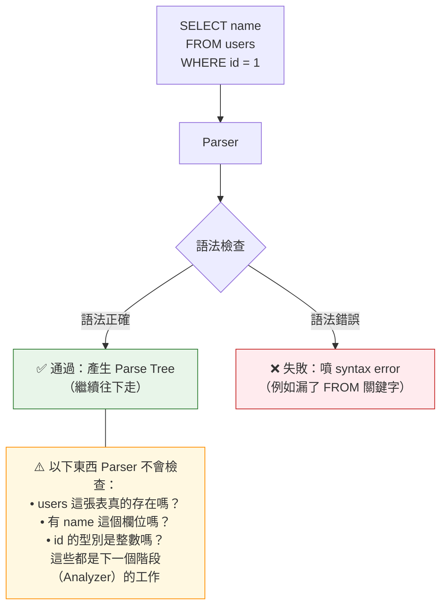

**實際例子：**

```sql
-- ✅ Parser 會過（語法正確），但會在後面的 Analyzer 階段報錯
SELECT abc FROM nonexistent_table;
-- Parser: "OK，這是個合法的 SELECT，往下傳"
-- Analyzer: "等等，根本沒有 nonexistent_table 這張表！→ 報錯"

-- ❌ Parser 直接擋下（語法錯誤，連 parse tree 都生不出來）
SELECT * FROM;
-- Parser: "FROM 後面沒接東西？這不合語法 → syntax error"
```

### IV. Parser 的兩步驟：斷詞 → 建樹

Parser 內部其實分了兩個小步驟，就像人讀句子一樣：

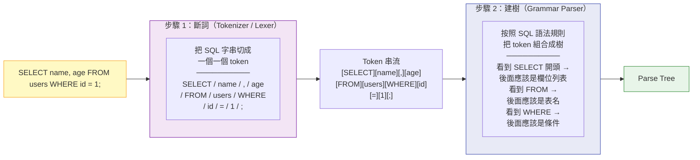

> **補充（Senior Dev）**：Parser 的原始碼使用 `flex`（斷詞）和 `bison`（建樹）這兩個經典工具自動生成。PG 的 SQL 語法規格非常龐大，語法檔案（`gram.y`）有超過 15,000 行。
>
> Debug 技巧：如果你好奇 PG 內部 parse 完長什麼樣，可以在自己的 session 中執行：
> ```sql
> SET debug_print_parse = on;
> SET debug_pretty_print = on;   -- 讓輸出有縮排，比較好讀
> SELECT * FROM users WHERE id = 1;
> -- parse tree 會印在 server log 裡（不是 client 端）
> ```
> 注意這只在開發時用，production 開下去 log 會被灌爆。

## 4. Analyzer（語義分析與改寫）

### I. Analyzer 在做什麼？一句話：把「語法樹」變成「有語義的查詢」

還記得 Parser 產出的 parse tree **完全不檢查語義**嗎？Parser 只確認你寫的 SQL「文法正確」，但不保證「語義合理」。Analyzer 接手 parse tree 後，做的事情就是在回答以下問題：

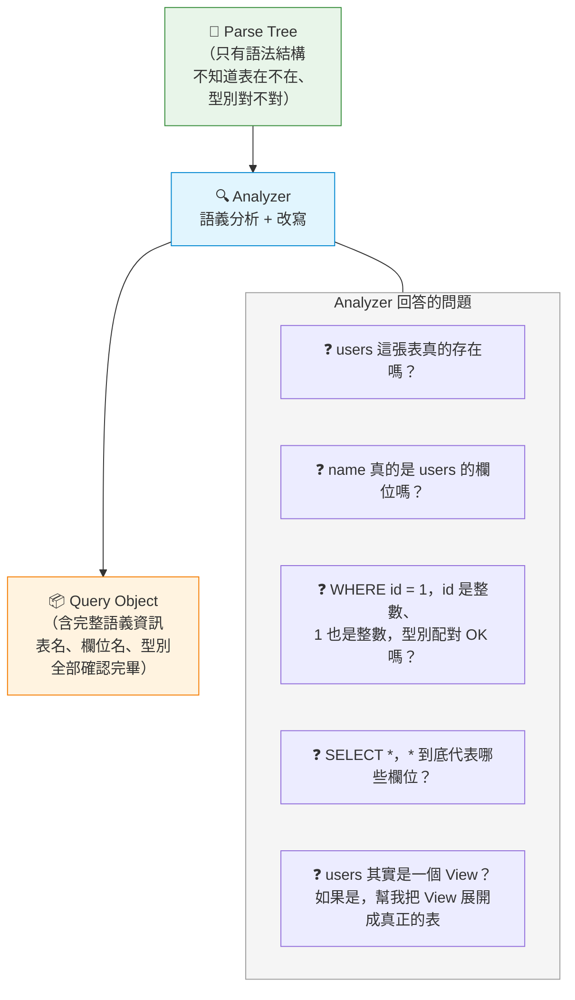

### II. Analyzer 的六大職責

Analyzer 不是只做一件事，而是分六個面向把 parse tree「補完」：

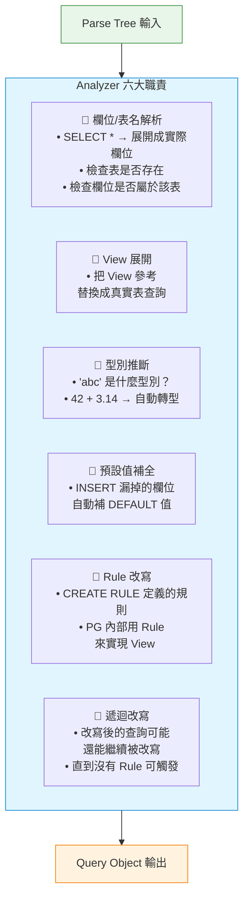

### III. 實際案例 1：View 展開（最經典的改寫）

View 是 SQL 中最常見的「虛擬表」。你寫的時候把它當成表來查，但 Analyzer 會在背後幫你把 View **展開**成真正的查詢：

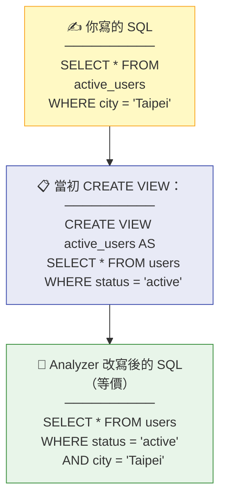

> **白話解釋**：你查 `active_users`，Analyzer 把你當初 `CREATE VIEW` 時寫的 SQL 拿出來「貼回去」，再跟你這次加的 `WHERE city = 'Taipei'` 合併在一起。最終 Planner 看到的是一條直接查 `users` 表的 SQL，View 已經不見了。

### IV. 實際案例 2：`*` 展開與型別推斷

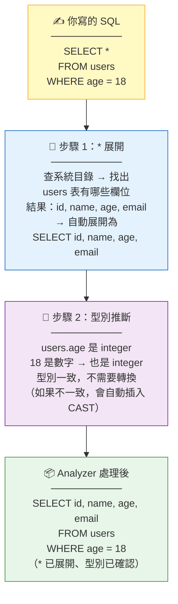

**更具體的例子 —— 型別不匹配時的自動轉換：**

```sql
-- 你寫的 SQL
SELECT * FROM users WHERE name = 123;
--            ^^^^                ^^^
--            text 型別          integer 型別  ← 不匹配！

-- Analyzer 自動處理：
-- → 把 123 轉成文字 '123'
-- → 實際上變成: WHERE name = '123'::text
-- 這個隱式轉換你沒寫，但 Analyzer 幫你加了
```

### V. 實際案例 3：INSERT 預設值補全

```sql
CREATE TABLE users (
    id       SERIAL PRIMARY KEY,
    name     TEXT NOT NULL,
    created  TIMESTAMP DEFAULT now()
);

-- 你只指定了 name
INSERT INTO users (name) VALUES ('Alice');

-- Analyzer 自動補全為：
-- INSERT INTO users (id, name, created)
-- VALUES (nextval('users_id_seq'), 'Alice', now())
--        ^^^^^^^^^^^^^^^^^^^^^^^          ^^^^^^
--        自動補的 SERIAL 值              自動補的 DEFAULT 值
```

### VI. Rule 系統與遞迴改寫

PG 內部用一套叫「Rule 系統」的機制來實現 View 和其他改寫邏輯。改寫可能不只一層：

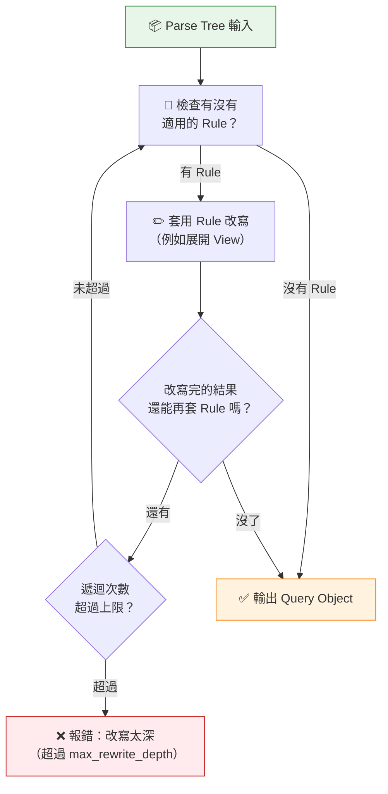

> **例子**：View A 查 View B，View B 查 View C...
> ```sql
> CREATE VIEW v_a AS SELECT * FROM v_b;
> CREATE VIEW v_b AS SELECT * FROM v_c;
> CREATE VIEW v_c AS SELECT * FROM users;
> -- SELECT * FROM v_a
> -- → 展開 v_a → 裡面有 v_b → 展開 v_b → 裡面有 v_c → 展開 v_c → users
> -- 這就是遞迴改寫的典型案例
> ```

> **補充（Senior Dev）**：
> - `EXPLAIN (ANALYZE, VERBOSE)` 中的 `Output` 欄位，顯示的是 Analyzer 處理**之後**的欄位列表（`*` 已展開、型別已轉換），不是你原始 SQL 寫的樣子。
> - 如果你好奇 Analyzer 改寫完長什麼樣，可以用 `SET debug_print_rewritten = on` 輸出到 server log。
> - `CREATE VIEW` 在 PG 內部其實就是建立一條 `_RETURN` Rule。View 不是實體資料，只是一個「查詢模板」。

## 5. Planner (Query Optimization)

前面 Analyzer 已經把 SQL 轉成結構化的 Query 物件了。但 **"怎麼執行"** 還沒決定 —— 這就是 Planner 的工作。

### I. 一句話理解 Planner

> **Planner 就像導航軟體：你告訴它目的地（SQL），它幫你規劃最快路線（執行計畫）。**

假設你要從台北到高雄，導航軟體會比較：
- 走高鐵（快速但貴）vs 開車（慢但靈活）vs 搭客運（便宜但更慢）
- Planner 做的事完全一樣：比較不同的 "怎麼讀資料" 的方法，挑成本最低的那個

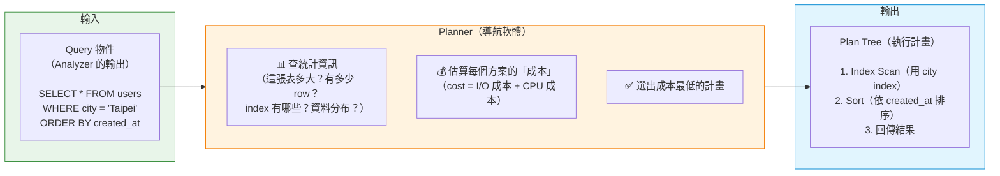

### II. 三種讀資料的方法（Scan Strategies）

一張表有很多 row，你要怎麼從硬碟裡找出符合條件的 row？Planner 有三種選擇：

```mermaid
flowchart TD
    subgraph Seq["Seq Scan（全表掃描）"]
        S1["從硬碟第一頁開始"]
        S2["一頁一頁往後讀"]
        S3["每讀一頁就檢查每一 row"]
        S4["符合條件的留下，其餘丟掉"]
        S1 --> S2 --> S3 --> S4
    end

    subgraph Idx["Index Scan（索引掃描）"]
        I1["先查 B-tree Index\n（找到 key 的位置）"]
        I2["直接跳到對應的 heap page"]
        I3["讀取那一 row 的完整資料"]
        I1 --> I2 --> I3
    end

    subgraph Bmp["Bitmap Scan（點陣圖掃描）"]
        B1["先查 Index\n（標記所有符合的 row 位置）"]
        B2["把位置整理成 bitmap\n（避免重複讀同一頁）"]
        B3["按順序讀取 heap page\n（把 random I/O 變 sequential）"]
        B1 --> B2 --> B3
    end

    style Seq fill:#ffebee,stroke:#c62828
    style Idx fill:#e8f5e9,stroke:#2e7d32
    style Bmp fill:#fff3e0,stroke:#ef6c00
```

**類比幫助理解：**

| 掃描方式 | 日常類比 | 適合情境 |
|----------|---------|---------|
| **Seq Scan** | 從書的第一頁翻到最後一頁找關鍵字 | 你要找的內容遍布全書（或不確定在哪） |
| **Index Scan** | 翻目錄 → 直接跳到第 42 頁 | 你只要找一兩個特定條目 |
| **Bitmap Scan** | 先翻目錄標記所有相關頁碼 → 再一次翻過去 | 要翻很多頁，但不希望來回亂跳傷硬碟 |

**Planner 怎麼選？看一個例子：**

```sql
-- 假設 users 表有 100 萬 row、city 欄位有 index
SELECT * FROM users WHERE city = 'Taipei';
```

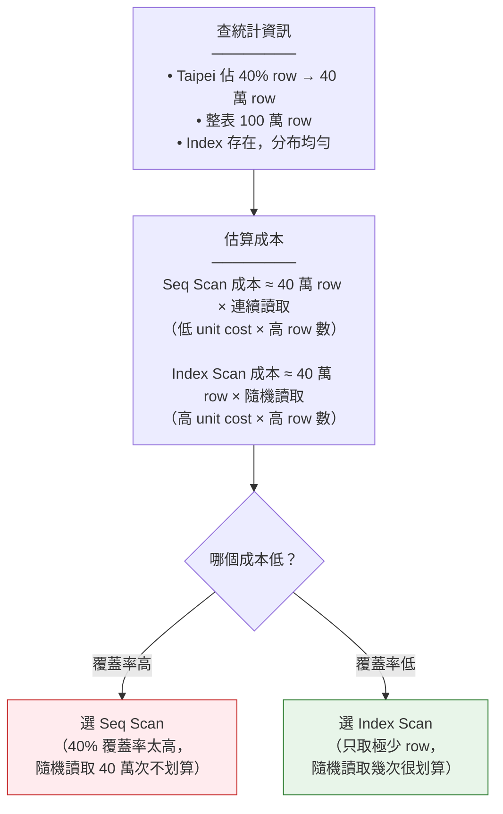

### III. 多張表時：怎麼 Join？

單表查詢很簡單，但真實世界一定有 JOIN。Planner 要決定兩件事：

> 1. **Join 順序**：A JOIN B JOIN C，先 JOIN 誰？
> 2. **Join 方法**：用什麼演算法把兩張表合在一起？

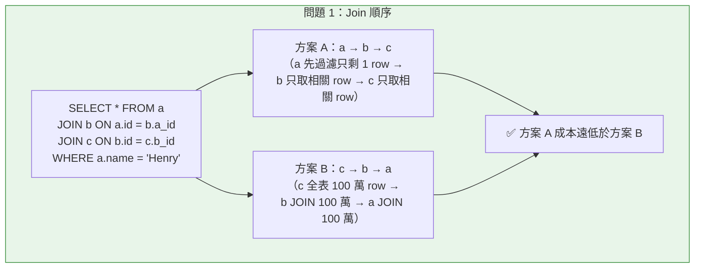

**三種 Join 方法：**

以下三種 Join，指的是 PG **內部怎麼實作** `JOIN ... ON`。不管你的 SQL 寫 `INNER JOIN`、`LEFT JOIN`、`CROSS JOIN`，Planner 都會從這三種演算法中選一種來執行。你不需要在 SQL 裡指定用哪種——Planner 自動選。

**一句話先講完三種的差別：**

| 方法 | 一句話比喻 | SQL 開發者要記的 |
|------|-----------|-----------------|
| **Nested Loop** | 像翻電話簿找人：拿名單上每個人名，去電話簿從頭翻到尾找電話 | 有一邊很小（幾 row）就很快 |
| **Hash Join** | 像查字典：先把小表建成查詢表，大表直接 O(1) 查 | 兩邊都大、沒 index 時的首選 |
| **Merge Join** | 像兩個照字母排好的名單，同步往下對 | 兩邊都照 join key 排好序時最快 |

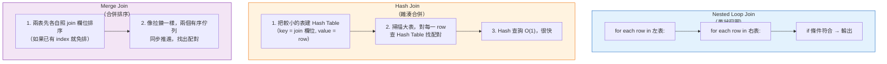

| Join 方法 | 一句話 | 適合情境 | 啟動速度 |
|-----------|--------|---------|---------|
| **Nested Loop** | 雙層 for 迴圈 | 左表很小（如過濾後剩幾 row） | 立刻有輸出 |
| **Hash Join** | 小表建 HashMap → 大表去查 | 無 index，兩表都很大 | 要等 Hash Table 建完 |
| **Merge Join** | 兩個已排序的隊伍同步前進 | 兩邊已依 join key 排好序 | 要等排序完成 |

### IV. Planner 的「成本」到底是什麼？

Planner 不是用 "秒" 來估算，而是用一個**沒有單位的數字**。這個數字大致反映執行所需的 I/O + CPU 資源：

```
total_cost = (讀取頁數 × 每頁成本) + (處理 row 數 × 每 row 成本)
```

**關鍵參數（GUC）—— Planner 對世界的假設：**

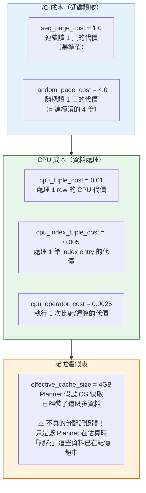

> **為什麼這很重要？** 如果你的 DB 跑在 SSD 上，`random_page_cost = 4.0` 就太悲觀了（SSD 的 random I/O 很快）。不改的話 Planner 會**過度偏好 Seq Scan**，明明用 Index 更快卻不選。SSD 環境建議調成 `1.1 ~ 1.5`。

### V. 當表太多時：從「精算」變「估算」

Planner 的預設策略是**窮舉搜尋所有可能的 Join 順序**（Dynamic Programming），保證找到最優解。但這在太多表時會爆炸：

```
2 張表 → 2 種順序
5 張表 → 120 種順序
10 張表 → 362 萬種順序  ← 還能窮舉
12 張表 → 4.79 億種順序  ← 太慢了！
```

```mermaid
flowchart TD
    Count{"有幾張表要 JOIN？"}
    DP["窮舉搜尋\n（Dynamic Programming）\n保證找到最優解\n但表越多越慢（指數成長）"]
    GEQO["遺傳演算法\n（Genetic Query Optimizer）\n用演化計算「找近似最優」\n不求完美，只求快"]
    Plan1["✅ 最優計畫"]
    Plan2["✅ 接近最優計畫\n（可能是最優，不保證）"]

    Count -->|"< 12 張表（geqo_threshold）"| DP
    Count -->|">= 12 張表"| GEQO
    DP --> Plan1
    GEQO --> Plan2

    style DP fill:#e8f5e9,stroke:#2e7d32
    style GEQO fill:#fff3e0,stroke:#ef6c00
```

> 如果你在跑 OLAP / 資料倉儲查詢（常常 JOIN 很多表），可以調高 `geqo_threshold` 讓 Planner 跑窮舉更久、換取更好的計畫。但注意：Plan Time 會指數級上升。

### VI. Planner 階段總覽

```mermaid
flowchart TD
    Q["Query 物件\n（從 Analyzer 來）"]

    subgraph PlannerFlow["Planner 內部流程"]
        S1["1. 查統計資訊\n（pg_statistic）\n\n- 表有多少 row？\n- Index 有哪些？\n- 每個欄位的值如何分布？"]
        S2["2. 估算每種 Scan 成本\n（Seq / Index / Bitmap）\n\n- 依照 cost 參數計算\n- 比較各方案成本"]
        S3["3. 決定 Join 順序\n\n- N 張表 → N! 種可能\n- ≤12 張：窮舉最優\n- >12 張：遺傳演算法近似"]
        S4["4. 決定 Join 方法\n（NestLoop / Hash / Merge）\n\n- 依表大小、有無 index 選擇"]
        S5["5. 選出總成本最低的 Plan\n\n- 輸出 Plan Tree\n- 每個 node 是一個執行步驟"]
    end

    PT["Plan Tree\n（交給 Executor 執行）"]

    Q --> S1 --> S2 --> S3 --> S4 --> S5 --> PT

    style Q fill:#e8f5e9,stroke:#388e3c
    style PlannerFlow fill:#fff3e0,stroke:#f57c00
    style PT fill:#e1f5fe,stroke:#0288d1
```

> **補充（Senior Dev）**：`effective_cache_size` **不分配任何記憶體**，只是 Planner 用來計算 "有多少 page 可能在 OS cache 中" 的假設。設越大，Planner 越傾向 Index Scan（因為它「認為」大部分 index page 已經在記憶體中，讀取成本低）。實際值應設為 `shared_buffers + OS filesystem cache`，一般建議設為總 RAM 的 50%~75%。
>
> `join_collapse_limit` 和 `from_collapse_limit` 控制 Planner 在 Join Order 搜尋上的自由度。預設 `8` 對大多數場景夠用；如果你有 10+ table JOIN，可以逐步調高，但 Plan Time 會呈指數增長。

## 6. Executor

**一句話講完**：Planner 畫好施工藍圖（Plan Tree），Executor 就是真正「動手施工」的角色。

### I. 先建立直覺：Executor 在做什麼？

假設這條 SQL：

```sql
SELECT id, name FROM users WHERE age > 18 ORDER BY id LIMIT 10;
```

Planner 給的施工藍圖長這樣（從上往下讀）：

```
Limit（只要 10 筆）
  └─ Sort（依 id 排序）
       └─ Filter（age > 18）
            └─ SeqScan（把 users 表每一行都讀出來）
```

Executor 的工作就是把這張藍圖「真的跑一遍」——實實在在去硬碟讀資料、過濾、排序、截斷，最後把 10 行結果交出來。

### II. 核心模型：Volcano Model（Pull-Based 迭代器）

Executor 最核心的設計叫做 **Volcano Model**（也稱 pull-based iterator model）。把它想像成一條「**接力賽 + 反向吸管**」：

- **每個 node 都是一個迭代器**，它只做一件事：**吐出下一筆資料（tuple）**
- **上層 node 找下層 node 要資料**（pull），而不是下層往上推（push）
- 請求一路往下傳到最底層（讀硬碟）→ 資料一路往上傳回最頂層（回傳 client）

```mermaid
flowchart TD
    Root["🔵 Limit Node\n「給我下一筆（要 10 次）」"]
    Sort["🟢 Sort Node\n「我先跟底下全部要完、\n排好序，再依序往上給」"]
    Filter["🟡 Filter Node\n「給我下一筆 → 檢查 age>18？\n是就往上傳、不是就丟掉」"]
    Scan["🔴 SeqScan Node\n「真的去硬碟讀下一行」"]

    Root -->|"1. pull: 給我下一筆"| Sort
    Sort -->|"2. pull: 給我下一筆（很多次）"| Filter
    Filter -->|"3. pull: 給我下一筆"| Scan
    Scan -.->|"4. return: {id=5, name=Bob}"| Filter
    Filter -.->|"5. return: age=22 ✓ 通過"| Sort
    Sort -.->|"6. return: 排序後的第 1 筆"| Root

    style Root fill:#bbdefb,stroke:#1976d2
    style Sort fill:#c8e6c9,stroke:#388e3c
    style Filter fill:#fff9c4,stroke:#f9a825
    style Scan fill:#ffcdd2,stroke:#c62828
```

**三種 node 的行為差異**：

```mermaid
flowchart LR
    subgraph PassThrough["🟢 透傳型（Filter、Limit）"]
        P1["pull child 一筆"]
        P2["處理（過濾/計數）"]
        P3["往上傳（或丟掉）"]
        P1 --> P2 --> P3
    end

    subgraph Blocking["🟡 阻塞型（Sort、HashAgg）"]
        B1["pull child 全部"]
        B2["一口氣處理（排序/建 hash）"]
        B3["再依序往上傳"]
        B1 --> B2 --> B3
    end

    subgraph Leaf["🔴 葉子型（SeqScan、IndexScan）"]
        L1["直接讀硬碟/記憶體"]
        L2["往上傳"]
        L1 --> L2
    end

    style PassThrough fill:#c8e6c9,stroke:#2e7d32
    style Blocking fill:#fff9c4,stroke:#f57f17
    style Leaf fill:#ffcdd2,stroke:#c62828
```

> **關鍵差異**：「阻塞型」node（Sort、HashAgg）必須先把 child 的資料**全部**讀完才能開始輸出——這就是為什麼 `ORDER BY` 在大表上會很慢，因為 Sort node 在輸出第一筆之前，得先把所有資料都拉進來排好。

### III. Plan Node（藍圖）vs Executor State Node（施工現場）

Planner 輸出的是「藍圖」（Plan Tree，寫著「這裡要排序、那裡要過濾」），但藍圖沒有記錄「排到第幾行了」。

Executor 接手後，會為每個藍圖 node 建立對應的「施工現場記錄」（Executor State Node），記錄「跑到哪了」。

```mermaid
flowchart TD
    subgraph Plan["📋 Plan Tree（藍圖）"]
        P_Root["Limit Node\nplan: 只要 10 筆"]
        P_Sort["Sort Node\nplan: 照 id 排序"]
        P_Filter["Filter Node\nplan: age > 18"]
        P_Scan["SeqScan Node\nplan: 掃描 users 表"]
    end

    subgraph Exec["🏗️ Executor State Tree（施工現場）"]
        E_Root["Limit State\n已經輸出: 3 筆\n還要: 7 筆"]
        E_Sort["Sort State\n暫存: 已排好 5000 筆\n下次給第 4 筆"]
        E_Filter["Filter State\n本輪統計: 讀了 8000 筆\n通過了 5000 筆"]
        E_Scan["SeqScan State\n目前讀到: 第 8001 筆\n總共: 100000 筆"]
    end

    P_Root -.->|"對應"| E_Root
    P_Sort -.->|"對應"| E_Sort
    P_Filter -.->|"對應"| E_Filter
    P_Scan -.->|"對應"| E_Scan

    P_Root --> P_Sort --> P_Filter --> P_Scan
    E_Root --> E_Sort --> E_Filter --> E_Scan

    style Plan fill:#e3f2fd,stroke:#1565c0
    style Exec fill:#fff3e0,stroke:#e65100
```

> **一句話區分**：Plan Tree 是「要做什麼」，Executor State Tree 是「做到哪裡了」。

### IV. 每個 Node 的三個生命週期

無論哪種 node，Executor 都用同一套 SOP 來操作它：

```mermaid
flowchart LR
    Init["🔧 初始化\n分配記憶體、開啟檔案\n準備工作環境"]
    Proc["▶️ 執行\n不斷 pull child → 處理 → 往上傳\n（一個迴圈跑到沒資料為止）"]
    End["🧹 清理\n關閉檔案、釋放記憶體\n收拾乾淨"]

    Init --> Proc --> End

    style Init fill:#e8f5e9,stroke:#388e3c
    style Proc fill:#bbdefb,stroke:#1976d2
    style End fill:#f3e5f5,stroke:#7b1fa2
```

這就是為什麼不同 node 可以像積木一樣任意組合——只要每個 node 都遵循這三個步驟，無論你疊 `Sort → HashAgg → SeqScan` 還是 `Limit → IndexScan`，Executor 都照樣運作。

### V. Portal：執行進度的「書籤」

當你查詢還沒跑完但想暫停（例如用 Cursor 一段一段 fetch 結果），PG 需要知道「上次跑到哪裡了」。這個記錄就叫 **Portal**。

```mermaid
flowchart LR
    subgraph Book["📖 Portal = 書籤"]
        B1["記錄目前執行到\nPlan Tree 的哪個位置"]
        B2["記錄每個 node 的\nExecutor State 狀態"]
        B3["下次 fetch 時\n從書籤位置繼續"]
    end

    subgraph Types["兩種 Portal"]
        T1["未命名 Portal\n（一般查詢自動建立）\n一次性跑完就丟"]
        T2["命名 Portal\n（DECLARE CURSOR 建立）\n可以分段 fetch"]
    end

    Book --> Types

    style Book fill:#fff9c4,stroke:#f9a825
```

### VI. 進階特性：平行查詢（Parallel Query）

大查詢可以用多個 worker 同時跑以加速：

```mermaid
flowchart TD
    Gather["🟣 Gather Node（總管）\n從所有 worker 收集結果\n合併後往上傳"]

    W1["🔵 Worker 1\n獨立跑 partial plan\n（處理表的前 1/3）"]
    W2["🔵 Worker 2\n獨立跑 partial plan\n（處理表的中 1/3）"]
    W3["🔵 Worker 3\n獨立跑 partial plan\n（處理表的後 1/3）"]

    Gather -->|"pull 下一筆"| W1
    Gather -->|"pull 下一筆"| W2
    Gather -->|"pull 下一筆"| W3

    style Gather fill:#e1bee7,stroke:#8e24aa
    style W1 fill:#bbdefb,stroke:#1976d2
    style W2 fill:#bbdefb,stroke:#1976d2
    style W3 fill:#bbdefb,stroke:#1976d2
```

> 情境：`SELECT count(*) FROM big_table` → Planner 在 plan tree 頂部放一個 Gather node，底下三個 worker 各自掃 1/3 的表，各自算出 partial count，Gather 再彙總。

### VII. 進階特性：JIT 編譯（Just-In-Time Compilation）

某些查詢的瓶頸是 CPU（例如 `WHERE` 條件裡有複雜的數學運算），每次處理一行都要重新解釋執行。

JIT 把這些「熱點迴圈」在執行期直接編譯成機器碼，跳過解釋執行的 overhead：

```mermaid
flowchart LR
    Without["❌ 無 JIT\n每筆 row 都要：\n讀指令 → 解釋 → 執行\n（像朗讀 vs 默讀）"]
    With["✅ 有 JIT\n熱點迴圈編譯成機器碼\n直接跑 native code\n（快 10-30%）"]

    Without -->|"編譯"| With

    style Without fill:#ffebee,stroke:#c62828
    style With fill:#e8f5e9,stroke:#2e7d32
```

> JIT 不是萬靈丹——它對 **CPU-bound** 的查詢有效（大量數學運算、複雜 WHERE），對 **I/O-bound** 的查詢（瓶頸在讀硬碟）幾乎無感。

### VIII. Executor 完整流程總覽

```mermaid
flowchart TD
    Start["📋 Planner 交付 Plan Tree（藍圖）"]
    Build["🏗️ 建立 Executor State Tree\n（為每個 plan node 建立施工現場記錄）"]
    Init["🔧 依序初始化每個 node\n（分配記憶體、開啟檔案）"]

    Loop["▶️ 進入主迴圈\nRoot node pull 下一筆 →\n請求一路往下傳到最底層 →\n資料一路往上回傳 →\n輸出給 client"]

    End{"沒有更多資料了？"}
    Clean["🧹 依序清理每個 node\n（關檔、釋放記憶體）"]
    Done["✅ 查詢結束"]

    Portal["📖 Portal（書籤）\n記錄目前跑到哪\n讓分段 fetch 變可能"]
    Gather["🟣 Gather Node（平行）\n多 worker 同時跑"]
    JIT["⚡ JIT 編譯\n熱點迴圈 → 機器碼"]

    Start --> Build --> Init --> Loop
    Loop --> End
    End -->|"是"| Clean --> Done
    End -->|"否"| Loop

    Loop -.->|"暫停/分段"| Portal
    Loop -.->|"平行加速"| Gather
    Loop -.->|"CPU 加速"| JIT

    style Start fill:#e3f2fd,stroke:#1565c0
    style Build fill:#fff3e0,stroke:#e65100
    style Init fill:#e8f5e9,stroke:#388e3c
    style Loop fill:#bbdefb,stroke:#1976d2
    style End fill:#fff9c4,stroke:#f9a825
    style Clean fill:#f3e5f5,stroke:#7b1fa2
    style Done fill:#c8e6c9,stroke:#388e3c
    style Portal fill:#fce4ec,stroke:#c62828
    style Gather fill:#e1bee7,stroke:#8e24aa
    style JIT fill:#b2dfdb,stroke:#00695c
```

## 7. Client Response

前面 Executor 已經把所有資料都算出來了 —— 但這些資料要「送去哪裡」？這就是最後一個階段的工作。

### I. 一句話理解

> **Executor 負責「算出結果」，Client Response 階段負責「把結果送出去」。**

聽起來很簡單，但 PG 在這層做了一個重要的設計 —— **結果不一定是送回 client**。結果可以寫入暫存、餵給另一個查詢、匯出成檔案。PG 用一個叫做「**Destination Receiver**」的抽象層來統一處理這些不同去向。

### II. 直覺類比：得來速餐廳

用一個日常場景來理解整條路徑：

```mermaid
flowchart TD
    subgraph Kitchen["👨‍🍳 廚房 = Executor"]
        K1["廚師照食譜做菜\n一道一道做出來"]
        K2["每道菜做完\n放上出餐檯"]
        K1 --> K2
    end

    subgraph Dispatcher["📋 出餐檯 = Destination Receiver"]
        D1{"這道菜\n要送去哪？"}
        D2["🍽️ 內用 → 端到客人桌上\n（= Client Receiver）"]
        D3["📦 外帶 → 裝進餐盒\n（= COPY Receiver）"]
        D4["🥘 備料 → 放冰箱等下再用\n（= Materialize Receiver）"]
        D5["🔪 給另一個廚師 → 傳過去\n（= SPI Receiver）"]
    end

    subgraph Client["💻 Client（你的 App）"]
        C1["收到資料\n顯示在畫面上"]
    end

    K2 --> D1
    D1 --> D2 --> C1
    D1 --> D3
    D1 --> D4
    D1 --> D5

    style Kitchen fill:#fff3e0,stroke:#e65100
    style Dispatcher fill:#e3f2fd,stroke:#1565c0
    style Client fill:#e8f5e9,stroke:#2e7d32
```

### III. 四種 Receiver（結果的不同去向）

每一筆查詢結果都會走其中一條路：

```mermaid
flowchart TD
    Tuple["📦 Executor 算出的一筆結果\n（一行資料）"]

    subgraph R1["🟢 1. Client Receiver（最常見）"]
        direction LR
        R1A["格式化為網路封包\n→ 透過 TCP 送回你的 App"]
        R1B["🎯 場景：你在 psql 或 App 裡\n直接執行 SELECT"]
    end

    subgraph R2["🟡 2. SPI Receiver（內部調用）"]
        direction LR
        R2A["結果存進內部暫存表\n供 PL/pgSQL 函數使用"]
        R2B["🎯 場景：你在一個 Function 裡\n寫 SELECT ... INTO variable"]
    end

    subgraph R3["🟣 3. Materialize Receiver（暫存）"]
        direction LR
        R3A["結果暫存到記憶體/硬碟\n供後續查詢重複使用"]
        R3B["🎯 場景：WITH CTE、\nCursor 的分段讀取"]
    end

    subgraph R4["🔵 4. COPY Receiver（匯出）"]
        direction LR
        R4A["結果直接寫成\nCSV/文字檔"]
        R4B["🎯 場景：COPY ... TO '/tmp/data.csv'"]
    end

    Tuple --> R1
    R1 --> R2 --> R3 --> R4

    style R1 fill:#c8e6c9,stroke:#2e7d32
    style R2 fill:#fff9c4,stroke:#f57f17
    style R3 fill:#e1bee7,stroke:#8e24aa
    style R4 fill:#bbdefb,stroke:#1976d2
```

### IV. 關鍵案例：為什麼 `COUNT(*)` 不回傳全部資料？

這是最能體現 Receiver 設計價值的一個問題。假設：

```sql
SELECT count(*) FROM users WHERE age > 18;
-- users 表有 100 萬筆，符合條件的有 40 萬筆
```

**新手直覺**：PG 先把 40 萬筆讀出來 → 算完總數 → 再丟回 client。

**實際運作**：

```mermaid
flowchart TD
    subgraph ExecutorFlow["Executor 內部"]
        Scan["🔴 SeqScan Node\n讀取 users 表\n→ 輸出 age>18 的 40 萬筆"]
        Agg["🟡 Aggregate Node（Count）\n攔截所有 40 萬筆\n→ 只算出一個數字：400,000"]
    end

    subgraph Response["Client Response 階段"]
        Send["🟢 Client Receiver\n只收到一筆資料\n→ { count: 400000 }\n→ 格式化 → 送回 App"]
    end

    Scan -->|"40 萬筆 row"| Agg
    Agg -->|"只有 1 筆"| Send

    Note["💡 關鍵：中間 40 萬筆\n從來沒離開過 PG 內部！\nAggregate Node 在 Executor 內部\n就把它們消化掉了。\nClient Receiver 只看到\n最後的 1 筆結果。"]

    Agg -.-> Note

    style Scan fill:#ffcdd2,stroke:#c62828
    style Agg fill:#fff9c4,stroke:#f57f17
    style Send fill:#c8e6c9,stroke:#2e7d32
    style Note fill:#f5f5f5,stroke:#9e9e9e
```

> 這就是 Receiver 抽象層的威力：**Executor 不知道、也不在乎結果最後要去哪**。Executor 只管把資料「交出去」，至於這筆資料是被送回 client、存起來、還是被 Aggregate Node 吞掉 —— 那是 Receiver 決定的。

### V. 送回 Client 的最後一步：Wire Protocol 格式化

當 Receiver 是「送回 client」時，最後一步是把 PG 內部的資料結構轉換成**網路可以傳輸的格式**（Wire Protocol）。

```mermaid
flowchart LR
    subgraph Internal["PG 內部格式"]
        I1["Tuple（Row）\n────────\n{id: 1, name: 'Alice',\n age: 25}"]
    end

    subgraph Format["格式化（序列化）"]
        F1["把每個欄位的值\n轉成 binary 或文字"]
        F2["加上 message type\n（告訴 client 這是資料）"]
        F3["加上 message length\n（讓 client 知道封包邊界）"]
    end

    subgraph Wire["網路傳輸"]
        W1["透過 TCP Socket\n送回你的 App"]
    end

    I1 --> F1 --> F2 --> F3 --> W1

    style Internal fill:#e8f5e9,stroke:#388e3c
    style Format fill:#fff3e0,stroke:#f57c00
    style Wire fill:#e1f5fe,stroke:#0288d1
```

**Wire Protocol 訊息格式（簡化）**：

```
┌──────────┬───────────────┬─────────────────────┐
│ 1 byte   │   4 bytes     │     variable        │
│ 訊息類型  │  訊息長度      │     訊息內容          │
│ (T=資料)  │  (含自己的長度) │  (欄位1, 欄位2, ...) │
└──────────┴───────────────┴─────────────────────┘
```

> **類比**：就像寄快遞 —— 訊息類型 =「內容物：資料」、訊息長度 =「箱子大小」、訊息內容 =「箱子裡裝的實際資料」。Client 收到後根據類型判斷「這是資料」、根據長度知道「要讀多少 bytes」、然後解讀內容。

### VI. 完整流程總覽：從 Executor 到你的 App

把 Executor 和 Client Response 串在一起看：

```mermaid
flowchart TD
    subgraph Exec["Executor（算出結果）"]
        E1["Plan Tree 的 Root Node\n不斷 pull child → 得到結果"]
        E2["每得到一筆結果\n就呼叫 Receiver 的 callback\n「這筆給你，看你要送哪去」"]
    end

    subgraph Recv["Receiver（決定去向）"]
        R1{"這筆結果\n該去哪裡？"}
        R2["→ 送回 Client\n（一般 SELECT）"]
        R3["→ 存進 SPI 暫存區\n（Function 內部）"]
        R4["→ 寫入暫存\n（CTE / Cursor）"]
        R5["→ 寫出檔案\n（COPY TO）"]
    end

    subgraph Wire["Wire Protocol（格式化 + 傳輸）"]
        W1["把 PG 內部格式\n→ 轉成網路訊息"]
        W2["塞進 TCP Socket"]
    end

    subgraph App["你的 App"]
        A1["從 TCP Socket 讀取訊息"]
        A2["解析訊息 → 還原成資料"]
        A3["顯示在螢幕上"]
    end

    E1 --> E2 --> R1
    R1 --> R2 --> W1 --> W2 --> A1 --> A2 --> A3
    R1 --> R3
    R1 --> R4
    R1 --> R5

    style Exec fill:#fff3e0,stroke:#e65100
    style Recv fill:#e3f2fd,stroke:#1565c0
    style Wire fill:#f3e5f5,stroke:#7b1fa2
    style App fill:#e8f5e9,stroke:#2e7d32
```

### VII. 兩種查詢模式在回應階段的差異

還記得 Client Request 階段提過的 Simple Query 和 Extended Query 嗎？它們在回應階段的行為也不同：

```mermaid
flowchart TD
    subgraph Simple["Simple Query（一次整條 SQL）"]
        S1["送 SQL → PG 全部跑完"]
        S2["一次把所有結果送回 client"]
        S3["結束"]
        S1 --> S2 --> S3
    end

    subgraph Extended["Extended Query（Parse → Bind → Execute）"]
        E1["Parse：只解析，不執行\n（得到解析後的查詢模板）"]
        E2["Bind：綁定參數值"]
        E3["Execute：執行"]
        E4["可以重複 Bind + Execute\n（同一模板、不同參數）\n每次 Execute 只回傳該次的結果"]
        E1 --> E2 --> E3 --> E4
    end

    style Simple fill:#e8f5e9,stroke:#388e3c
    style Extended fill:#e1f5fe,stroke:#0288d1
```

> **延伸（PG 14+ Pipeline Mode）**：client 可以在同一條連線上連續發出多個查詢，不需要等前一個查詢的結果回來才發下一個。就像在餐廳裡連續點好幾道菜，廚房可以同時準備，不用等一道菜吃完才點下一道。

### VIII. 一句話總結 Client Response

```
Executor 算出結果
      ↓
Receiver 決定結果去哪（送回 client？暫存？匯出？）
      ↓
若要送回 client → Wire Protocol 格式化 → TCP 傳輸
      ↓
你的 App 收到資料 → 顯示在畫面上
```
---

# 二、CBO 與 pg_hint_plan：何時需要 Hint？

> 來源：[digoal - PostgreSQL SQL HINT的使用 (2016-02-03)](https://github.com/digoal/blog/blob/master/201602/20160203_01.md)

## 1. 背景：CBO 是否每次都能產生最優 Plan？

### I. CBO 是什麼？

還記得前一章 Planner 是「導航軟體」嗎？Planner 會比較好幾條路線（execution plan），選成本最低的。這個「成本估算引擎」就叫 **Cost-Based Optimizer（CBO）**。

```mermaid
flowchart LR
    subgraph Input["📊 輸入：資訊來源"]
        I1["表的實體大小\n（幾 GB、幾 row）"]
        I2["成本參數設定\n（SSD 還是 HDD？）"]
        I3["統計資訊\n（每個欄位的值分布）"]
        I4["可用記憶體\n（sort/hash 能用的空間）"]
    end

    subgraph CBO["🧠 CBO（成本估算引擎）"]
        C1["計算每種 Scan 方案的 I/O 成本"]
        C2["計算每種 Join 順序+方法的總成本"]
        C3["比較所有候選方案"]
    end

    subgraph Output["✅ 輸出"]
        O1["選出總成本最低的\n執行計畫（Plan Tree）"]
    end

    I1 --> C1
    I2 --> C1
    I3 --> C2
    I4 --> C2
    C1 --> C3
    C2 --> C3
    C3 --> O1

    style Input fill:#e8f5e9,stroke:#388e3c
    style CBO fill:#fff3e0,stroke:#f57c00
    style Output fill:#e1f5fe,stroke:#0288d1
```

> **白話**：CBO 不是寫死的規則（例如「有 index 就一定用」），而是去**計算**哪個方案最省資源。計算結果準不準，取決於它拿到的「輸入資訊」正不正確。

但當表太多時（≥ 12 張），CBO 也會妥協——從「窮舉保證最優」改成「遺傳演算法求近似」，不保證最優解。

### II. CBO 計算成本時看哪些因子？

CBO 的成本公式綜合了以下七類資訊。你不需要記住每個參數，但要知道**它考慮了哪些面向**：

```mermaid
flowchart TD
    subgraph Physical["🏗️ 物理屬性（表的真實大小）"]
        P1["表佔幾個 data block？"]
        P2["表有多少 row？"]
        P3["→ 直接影響讀取成本"]
    end

    subgraph CostParams["💰 成本參數（單位代價）"]
        P4["連續讀 1 頁要花多少？（seq_page_cost）"]
        P5["隨機讀 1 頁要花多少？（random_page_cost）"]
        P6["處理 1 行資料要花多少？（cpu_tuple_cost）"]
        P7["處理 1 筆 index 要花多少？"]
        P8["執行 1 次運算要花多少？"]
    end

    subgraph Memory["🧠 記憶體限制"]
        P9["work_mem：sort/hash 能用多少記憶體？"]
        P10["不夠就會 spill to disk\n→ 成本暴增"]
    end

    subgraph Stats["📊 統計資訊（值分布）"]
        P11["每個值出現幾次？（n_distinct）"]
        P12["最常出現的值？（MCV）"]
        P13["值的分布長怎樣？（histogram）"]
        P14["空值有多少？（null fraction）"]
        P15["column 寬度"]
        P16["值與實體順序的相關性（correlation）"]
    end

    subgraph Func["🔧 函數屬性"]
        P17["自訂函數有設定 cost 嗎？"]
        P18["→ 影響含 function call 的查詢"]
    end

    Physical --> CostParams --> Memory --> Stats --> Func

    style Physical fill:#e3f2fd,stroke:#1565c0
    style CostParams fill:#fff3e0,stroke:#ef6c00
    style Memory fill:#f3e5f5,stroke:#7b1fa2
    style Stats fill:#e8f5e9,stroke:#2e7d32
    style Func fill:#fce4ec,stroke:#c62828
```

> **新手最常踩的坑**：`random_page_cost` 預設是 **4.0**（假設你的硬碟是傳統 HDD，random I/O 比 sequential I/O 慢 4 倍）。但如果你用的是 SSD 或雲端硬碟，這個值沒調的話，CBO 會「誤以為」random I/O 很慢，**過度偏好 Seq Scan**，即使 Index 更快也不選。

### III. CBO 的盲區：什麼時候估算會失準？

CBO 不是全知全能的。以下三種情況會讓它的成本估算偏離現實：

```mermaid
flowchart TD
    subgraph Blind1["⚠️ 盲區 1：統計資訊過時"]
        B1A["大量 INSERT/DELETE 後"]
        B1B["還沒跑 ANALYZE（或 auto-analyze 還沒觸發）"]
        B1C["→ 表的 row 數、值分布都錯了"]
        B1D["→ CBO 基於錯誤資訊做決策"]
    end

    subgraph Blind2["⚠️ 盲區 2：靜態設定與現實不符"]
        B2A["effective_cache_size 是手動設的\n不會自動追蹤 OS 實際 cache 大小"]
        B2B["random_page_cost 手動設的\n不會自動偵測是 SSD 還是 HDD"]
        B2C["自訂函數的 cost 值是建立時寫死的\n函數內容改了但 cost 沒更新"]
    end

    subgraph Blind3["⚠️ 盲區 3：CBO 根本沒考慮的因素"]
        B3A["硬碟的 read-ahead 機制\n（一次讀 128KB，不是逐頁讀）"]
        B3B["（CBO 假設每頁都是單獨讀取）\n→ 實際 sequential 讀取比 CBO 估算的還快"]
    end

    subgraph Blind4["⚠️ 盲區 4：Plan Cache 陷阱"]
        B4A["前 5 次用 custom plan（每次重新估算）"]
        B4B["第 6 次開始比對：generic plan vs custom plan\n如果 generic plan 成本更低 → 用 cached plan"]
        B4C["但這個比對也是基於統計資訊\n→ 統計不準 → 可能選到慢的 cached plan"]
    end

    Blind1 --> Blind2 --> Blind3 --> Blind4

    style Blind1 fill:#fff3e0,stroke:#ef6c00
    style Blind2 fill:#fce4ec,stroke:#c62828
    style Blind3 fill:#e3f2fd,stroke:#1565c0
    style Blind4 fill:#f3e5f5,stroke:#7b1fa2
```

> **ANALYZE 實例：為什麼統計過時會害 Planner 選錯？**
>
> 假設你有一張 `orders` 表，原本有 10 萬筆訂單，`status` 欄位有 index。某天你一口氣 INSERT 了 90 萬筆新訂單（狀態都是 'pending'），然後立刻查：
> ```sql
> SELECT * FROM orders WHERE status = 'completed';
> ```
>
> ```mermaid
> flowchart LR
>     Before["❌ 沒跑 ANALYZE\n──────────\npg_statistic 記錄：\n• 表只有 10 萬 row\n• 'completed' 佔 80% → 8 萬 row\n\nPlanner 判斷：\n「8 萬 / 10 萬 = 80%\n隨機讀 8 萬次不划算」\n→ 選 Seq Scan"]
>     Reality["🔍 但實際情況是\n──────────\n• 表現在 100 萬 row\n• 'completed' 還是 8 萬 row\n• 比例從 80% 暴跌到 8%"]
>     After["✅ 跑完 ANALYZE 後\n──────────\npg_statistic 更新：\n• 表有 100 萬 row\n• 'completed' 只佔 8%\n\nPlanner 判斷：\n「8% 用 Index Scan OK」\n→ 這次選對了\n（但如果 data 再變\n還是要再跑 ANALYZE）"]
>
>     Before --> Reality --> After
>
>     style Before fill:#ffebee,stroke:#c62828
>     style Reality fill:#fff3e0,stroke:#ef6c00
>     style After fill:#c8e6c9,stroke:#2e7d32
> ```
>
> `ANALYZE` 就是在更新這些統計數字（row 數、每個值的比例、分布等），讓 Planner 基於「最新的現實」做決策，而不是基於「過時的記憶」。PG 有 **auto-analyze**（當表的變動比例超過 `autovacuum_analyze_scale_factor` 時自動觸發），但如果你剛做完大批 INSERT/DELETE，建議手動跑一次：
> ```sql
> ANALYZE orders;
> ```

### IV. 什麼時候才需要 Hint？

大部分情況下，**不需要 Hint**。先試以下三個步驟，Hint 是最後手段：

```mermaid
flowchart TD
    Problem["🤔 查詢效能不好\n懷疑 CBO 選錯 plan"]

    Step1["✅ 步驟 1：檢查基礎配置\n──────────\n• 定期跑 ANALYZE 了嗎？\n• random_page_cost 適合你的硬碟嗎？\n  （SSD → 1.1~1.5，不要用預設 4.0）\n• effective_cache_size 合理嗎？\n  （建議設總 RAM 的 50-75%）"]
    Step1OK{"效能改善了？"}
    Done1["🎉 搞定"]

    Step2["✅ 步驟 2：改善統計資訊\n──────────\n• 提高 default_statistics_target\n  （讓 histogram 更精細）\n• 針對多欄位相關性\n  用 CREATE STATISTICS（PG 10+）"]
    Step2OK{"效能改善了？"}
    Done2["🎉 搞定"]

    Step3["✅ 步驟 3：Session-level GUC 微調\n──────────\n• SET enable_nestloop = off\n• SET enable_seqscan = off\n• 調整 work_mem\n（只影響當前 session，不改 code）"]
    Step3OK{"效能改善了？"}
    Done3["🎉 搞定"]

    Hint["⚠️ 最後手段：pg_hint_plan\n──────────\n• 寫在 SQL 註解裡的 hint\n• Query-level 精細控制\n• 但會隨資料成長過時（plan rot）\n• 優先試 hint table（PG 12+）\n  而非 inline hint"]

    Problem --> Step1 --> Step1OK
    Step1OK -->|"是"| Done1
    Step1OK -->|"否"| Step2 --> Step2OK
    Step2OK -->|"是"| Done2
    Step2OK -->|"否"| Step3 --> Step3OK
    Step3OK -->|"是"| Done3
    Step3OK -->|"否"| Hint

    style Problem fill:#e1f5fe,stroke:#0288d1
    style Done1 fill:#c8e6c9,stroke:#2e7d32
    style Done2 fill:#c8e6c9,stroke:#2e7d32
    style Done3 fill:#c8e6c9,stroke:#2e7d32
    style Hint fill:#ffebee,stroke:#c62828
```

> **補充（Senior Dev）**：Hint 是把雙面刃。寫在 application code 中的 inline hint 會在資料成長後過時（plan rot），導致原本正確的 hint 變成效能殺手。應優先嘗試非侵入式方案（調整 `enable_*` GUC、extended statistics、調整 `random_page_cost`），hint 作為最後手段。
>
> PG 12+ 支援 **hint table**（`hint_plan.hints`），可以在 table 中管理 hint 而無需修改 SQL text，是比 inline hint 更好的選擇。

## 2. pg_hint_plan 簡介

### I. pg_hint_plan 是什麼？

`pg_hint_plan` 是一個 PostgreSQL 擴充套件（extension），讓你能夠**在某一條 SQL 裡直接指定執行計畫**（例如「這條查詢強制用 Hash Join」），而不影響其他查詢。

```mermaid
flowchart TD
    App["📝 你的 SQL\n（裡面寫了 hint 註解）"]
    PG["🐘 PostgreSQL\nParser → Analyzer"]
    Normal["🔄 一般查詢：\nPlanner 自己決定 plan"]
    HPE["🔧 pg_hint_plan 介入\n讀取 hint → 強制改寫 plan"]
    Exec["▶️ Executor 執行"]

    App --> PG
    PG -->|"沒有 hint"| Normal --> Exec
    PG -->|"有 /*+ hint */"| HPE --> Exec

    style App fill:#fff9c4,stroke:#f9a825
    style PG fill:#e1f5fe,stroke:#0288d1
    style Normal fill:#e8f5e9,stroke:#388e3c
    style HPE fill:#fff3e0,stroke:#ef6c00
    style Exec fill:#f3e5f5,stroke:#7b1fa2
```

> **白話**：pg_hint_plan 就像在 SQL 旁邊貼一張便條紙，告訴 Planner「這條照我說的做」。其他沒貼便條紙的查詢，Planner 還是自己決定。

安裝很簡單（啟用 extension + 設定檔加一行 `shared_preload_libraries`），不需要改任何原始碼。PG 12+ 還支援 **hint table**（把 hint 存在資料表裡統一管理，不用改 SQL 文字）。

### II. 兩種調整 Planner 的方式：GUC vs Hint

| | GUC 參數 | pg_hint_plan Hint |
|---|---|---|
| **作用範圍** | 整個 session（所有查詢） | 單一條 SQL |
| **寫在哪** | `SET enable_nestloop = off;` | `/*+ HashJoin(a b) */` 註解裡 |
| **範例** | 「這個 session 全部不准用 Nested Loop」 | 「只有這一行 JOIN 用 Hash Join」 |
| **會影響其他查詢嗎** | ✅ 會 | ❌ 不會 |

```mermaid
flowchart TD
    subgraph GUC["🔧 GUC 參數（Session-Level）"]
        G1["SET enable_nestloop = off;"]
        G2["SELECT * FROM a JOIN b ...\n→ 強制不用 Nested Loop"]
        G3["SELECT * FROM x JOIN y ...\n→ 也被強制不用 Nested Loop"]
        G4["⚠️ 副作用：同一 session 內\n所有查詢都受影響"]
        G1 --> G2
        G1 --> G3
        G2 --> G4
        G3 --> G4
    end

    subgraph Hint["🎯 pg_hint_plan Hint（Query-Level）"]
        H1["/*+ HashJoin(a b) */\nSELECT * FROM a JOIN b ...\n→ 只有這條用 Hash Join"]
        H2["SELECT * FROM x JOIN y ...\n→ Planner 自由選擇\n  可能還是用 Nested Loop"]
        H3["✅ 精準控制：只影響一條 SQL\n其他查詢不受干擾"]
        H1 --> H3
        H2 --> H3
    end

    style GUC fill:#fff3e0,stroke:#ef6c00
    style Hint fill:#e8f5e9,stroke:#2e7d32
```

### III. Hint 可以做什麼？

pg_hint_plan 提供的 hint 分成三大類：

```mermaid
flowchart TD
    subgraph Scan["🔍 控制掃描方式（Scan Hints）"]
        S1["SeqScan(table)\n強制全表掃描"]
        S2["IndexScan(table [index])\n強制用某個 index"]
        S3["IndexOnlyScan(table [index])\n強制 Index Only Scan"]
        S4["BitmapScan(table [index])\n強制 Bitmap Scan"]
        S5["NoSeqScan(table)\n禁止全表掃描"]
    end

    subgraph Join["🔗 控制 Join 方式（Join Hints）"]
        J1["NestLoop(a b)\n強制 Nested Loop"]
        J2["HashJoin(a b)\n強制 Hash Join"]
        J3["MergeJoin(a b)\n強制 Merge Join"]
        J4["Leading(a b c)\n強制 Join 順序\n（先 a→b 再 join c）"]
    end

    subgraph Other["🔧 其他控制"]
        O1["Rows(table #100)\n直接修正 row estimate\n（騙 Planner 這張表只有 100 row）"]
        O2["Set(work_mem '1GB')\n在 Planner 執行期間\n暫時覆蓋某個 GUC 參數"]
    end

    Scan --> Join --> Other

    style Scan fill:#e3f2fd,stroke:#1565c0
    style Join fill:#e8f5e9,stroke:#2e7d32
    style Other fill:#fff3e0,stroke:#ef6c00
```

> **實務中最常用的三個 hint**：
> 1. **`Leading`** — 修復 join order 錯誤（最常見）
> 2. **`Rows`** — 直接修正 row estimate，騙 Planner 選對的 plan
> 3. **`Set`** — 臨時覆蓋 `enable_*` 或 `work_mem`，只影響這一條查詢

## 3. CBO 成本計算的完整鏈路

### I. 從統計資訊到最終計畫的六步驟

CBO 的計算不是一步完成，而是像流水線一樣，從最底層的資訊逐步往上推導：

```mermaid
flowchart TD
    S1["📊 步驟 1：讀取統計資訊\n──────────\n• 這張表有多大？（data block 數、row 數）\n• 每個欄位的值怎麼分布？（histogram、MCV）\n• 有哪些 index 可以用？"]
    S2["💰 步驟 2：套用成本參數\n──────────\n• 連續讀 1 頁的成本（seq_page_cost）\n• 隨機讀 1 頁的成本（random_page_cost）\n• 處理 1 行資料的 CPU 成本\n• 可用記憶體（work_mem）"]
    S3["🔍 步驟 3：估算每種 Scan 成本\n──────────\n• Seq Scan：全表掃描要讀幾頁？\n• Index Scan：走 index 要幾次隨機讀？\n• Bitmap Scan：index + 整理後順序讀"]
    S4["🔗 步驟 4：列舉所有 Join 順序\n──────────\n• ≤12 張表：窮舉所有可能順序\n• >12 張表：用遺傳演算法求近似"]
    S5["🧩 步驟 5：對每個 Join 選方法\n──────────\n• Nested Loop（適合小表）\n• Hash Join（適合無 index 的大表）\n• Merge Join（適合已排序的表）"]
    S6["✅ 步驟 6：選出總成本最低的計畫\n──────────\n• 比較所有候選方案的 total cost\n• 輸出最終的 Plan Tree"]

    S1 --> S2 --> S3 --> S4 --> S5 --> S6

    style S1 fill:#e8f5e9,stroke:#388e3c
    style S2 fill:#fff3e0,stroke:#ef6c00
    style S3 fill:#e3f2fd,stroke:#1565c0
    style S4 fill:#f3e5f5,stroke:#7b1fa2
    style S5 fill:#fce4ec,stroke:#c62828
    style S6 fill:#c8e6c9,stroke:#2e7d32
```

### II. Plan Cache：為什麼同一條 SQL 第二次執行更快？

#### 一句話先講完

> **Custom Plan** = 每次根據「這次的參數值」重新規劃（慢在規劃，但計畫精準）
> **Generic Plan** = 不管參數值是什麼，都用同一個「通用計畫」（省規劃時間，但可能不適合這次的參數）
>
> **前 5 次強制用 custom plan 是 PG 的預設行為**（寫死在原始碼中，不是舉例），第 6 次才開始比對要不要切換到 generic plan。

#### 用日常例子理解

假設你每天早上問導航：「從我家到 ___ 怎麼走？」

```mermaid
flowchart TD
    subgraph Custom["🔧 Custom Plan（每次重新規劃）"]
        C1["Day 1：『到 台北101』\n→ 導航根據現在路況\n→ 規劃最優路線 → 出發"]
        C2["Day 2：『到 淡水』\n→ 導航根據現在路況\n→ 重新規劃最優路線 → 出發"]
        C3["Day 3：『到 台北101』\n→ 導航還是重新規劃\n→ 因為地點跟上上禮拜一樣\n  但路況可能不同"]
        C1 --- C2 --- C3
    end

    subgraph Generic["📦 Generic Plan（通用快取計畫）"]
        G1["前 5 天：每次都重新規劃\n→ PG 在觀察這些行程的\n  『平均成本』"]
        G2["第 6 天：PG 總結出一個\n  『不管去哪都適用』的路線\n→ 例如：先上國道一號再說"]
        G3["之後每一天：直接走國道一號\n→ 不用再問導航\n→ 省下規劃時間\n→ 但可能不是最優路線"]
        G1 --> G2 --> G3
    end

    style Custom fill:#e3f2fd,stroke:#1565c0
    style Generic fill:#fff3e0,stroke:#ef6c00
```

#### 用 SQL 舉一個具體例子

```sql
-- 先定義一個參數化查詢
PREPARE my_query AS
  SELECT * FROM orders WHERE status = $1;

-- 前 5 次：每次都用 Custom Plan
EXECUTE my_query('completed');   -- 第1次：'completed' 佔 80% → 規劃：Seq Scan 最划算
EXECUTE my_query('cancelled');   -- 第2次：'cancelled' 佔 1%  → 規劃：Index Scan 最划算
EXECUTE my_query('pending');     -- 第3次：'pending' 佔 15%  → 規劃：Bitmap Scan 最划算
EXECUTE my_query('completed');   -- 第4次
EXECUTE my_query('cancelled');   -- 第5次
```

第 6 次開始，PG 建立一個 **Generic Plan**，然後做比較：

```mermaid
flowchart TD
    GenericP["📦 Generic Plan\n──────────\nPG 算出一個通用計畫\n（假設 PG 選了 Seq Scan）\n\n把前 5 次 custom plan\n『實際花的成本』平均\nvs\n這個 generic plan 的『估算成本』"]

    Compare{"Generic 成本\n≤ Custom 平均成本？"}

    UseG["✅ 用 Generic Plan\n──────────\n之後不管 $1 傳什麼參數\n一律用 Seq Scan\n\n省規劃時間\n但每次執行可能不是最佳"]

    UseC["❌ 不用 Generic\n──────────\n代表參數值差異太大\n通用計畫不適合\n→ 每次都重新 Custom Plan"]

    Bad["⚠️ 陷阱案例\n──────────\n假設前 5 次\n有 4 次傳 'completed'（多數 row）\n→ custom 平均成本偏 Seq Scan\n→ generic plan = Seq Scan\n\n第 6 次傳 'cancelled'（極少 row）\n→ 仍然用 Seq Scan！\n→ 明明 Index Scan 快 100 倍\n→ 卻被 generic plan 綁死了"]

    GenericP --> Compare
    Compare -->|"是"| UseG
    Compare -->|"否"| UseC
    UseG --> Bad

    style GenericP fill:#fff3e0,stroke:#ef6c00
    style UseG fill:#c8e6c9,stroke:#2e7d32
    style UseC fill:#e3f2fd,stroke:#1565c0
    style Bad fill:#ffebee,stroke:#c62828
```

> **重點**：Custom Plan 和 Generic Plan 的差別不在「對或錯」，而在 **「參數值差異大不大」**。如果每個參數值對應的 row 數量都差不多（例如 `WHERE id = $1`，每個 id 都是 1 row），Generic Plan 就很好用。但如果參數值差異極大（如 `status`：'completed' 有 100 萬 row、'cancelled' 只有 10 row），Generic Plan 就會出事。

> PG 12+ 可以設定 `plan_cache_mode = force_custom_plan`，強制每次都重新規劃，適合參數值分布極端不均的場景。

## 4. 替代方案與最佳實踐

在揮舞 pg_hint_plan 這把刀之前，先走完這個階梯——從最不侵入的方案開始，一步一步往上：

```mermaid
flowchart TD
    L1["🥇 第 1 步：調準成本參數\n──────────\n• 調整 random_page_cost（SSD → 1.1~1.5）\n• 調整 effective_cache_size\n（總 RAM 的 50~75%）\n\n✅ 零風險，影響所有查詢"]
    L2["🥈 第 2 步：改善統計精度\n──────────\n• 提高 default_statistics_target\n（讓 histogram buckets 更多）\n\n✅ 只增加 ANALYZE 時間\n不影響查詢效能"]
    L3["🥉 第 3 步：多欄位相關統計\n──────────\n• CREATE STATISTICS（PG 10+）\n（告訴 Planner：欄位 A 和欄位 B\n的數據有關聯性）\n\n✅ 解決「單欄統計各自準\n但合在一起就不準」的問題"]
    L4["🔧 第 4 步：Session GUC 微調\n──────────\n• SET enable_nestloop = off\n• SET enable_seqscan = off\n• 調整 work_mem\n\n⚠️ 影響同 session 所有查詢\n用完記得恢復"]
    L5["🔗 第 5 步：調整 Join 搜尋範圍\n──────────\n• 調高 join_collapse_limit\n• 調高 from_collapse_limit\n（讓 Planner 有更多\nJoin 順序可以考慮）\n\n⚠️ Plan Time 會指數成長"]
    L6["📋 第 6 步：Hint Table（PG 12+）\n──────────\n• 把 hint 存在資料表\n• 不修改 SQL 文字\n• 集中管理、可審計\n\n⚠️ 比 inline hint 好維護"]
    L7["⚠️ 最後手段：Inline Hint\n──────────\n• 寫在 SQL 註解裡\n• 單條查詢精細控制\n\n❌ 風險最高：plan rot\n資料成長後 hint 可能變毒藥\n且藏在程式碼裡難以發現"]

    L1 --> L2 --> L3 --> L4 --> L5 --> L6 --> L7

    style L1 fill:#c8e6c9,stroke:#2e7d32
    style L2 fill:#e8f5e9,stroke:#388e3c
    style L3 fill:#e3f2fd,stroke:#1565c0
    style L4 fill:#fff3e0,stroke:#ef6c00
    style L5 fill:#fff9c4,stroke:#f9a825
    style L6 fill:#fce4ec,stroke:#c62828
    style L7 fill:#ffebee,stroke:#b71c1c
```

> **一句話記住**：前三步（調參數、改善統計、多欄位統計）解決 90% 的問題。GUC 和 Hint 是針對特定 query 的緊急手段，不是日常標配。

---

# 三、GROUP BY 策略：Sort (GroupAgg) vs Hash (HashAgg)

> 來源：[digoal - PostgreSQL sort or not sort when group by? (2015-08-13)](https://github.com/digoal/blog/blob/master/201508/20150813_02.md)

## 1. 核心問題：GROUP BY 為什麼有時用 Sort？

### I. 兩種聚合策略的直覺比喻

`GROUP BY` 有兩種執行方式，各用不同場景：

```mermaid
flowchart TD
    subgraph GroupAgg["🔵 GroupAgg（先排序再分組）"]
        GA1["1. 先把資料照 GROUP BY 欄位排序\n（如果資料本身就排好序了→跳過）"]
        GA2["2. 依序往下讀\n同一個 group 的值連續出現\n→ 每換一個 group 就輸出上一組的結果"]
        GA3["⚡ 可以邊讀邊輸出\n（第一組算完就能馬上回傳）"]
        GA1 --> GA2 --> GA3
    end

    subgraph HashAgg["🟠 HashAgg（建雜湊表分組）"]
        HA1["1. 把資料全部讀進來\n建一個 Hash Table\n（key = group 值, value = 聚合進度）"]
        HA2["2. 全部讀完後\n一口氣輸出所有 group 的結果"]
        HA3["🐢 必須等所有資料都讀完\n才能開始輸出"]
        HA1 --> HA2 --> HA3
    end

    style GroupAgg fill:#e3f2fd,stroke:#1565c0
    style HashAgg fill:#fff3e0,stroke:#ef6c00
```

> **關鍵差異**：GroupAgg 可以「邊做邊輸出」（startup cost 低），HashAgg 必須「全部做完才輸出」（startup cost 高）。這對 **LIMIT** 查詢影響很大——如果只需要前 10 筆，GroupAgg 可能算到第 3 組就夠了，HashAgg 卻得先讀完整張表。

### II. Planner 怎麼選？

```mermaid
flowchart TD
    Input{"資料進來時\n已經排好序了嗎？\n（例如來自 Index Scan）"}
    Yes["✅ 選 GroupAgg\n（省掉 Sort 步驟\n直接分組 → 超快）"]
    No{"work_mem 夠大嗎？\n（Hash Table 放得下嗎？）"}
    Enough["🟠 選 HashAgg\n（Hash Table 全在記憶體中\nGroup 運算 O(1)）"]
    NotEnough["🔵 選 GroupAgg\n（Hash Table 會 spill 到硬碟\n→ disk I/O 成本暴增\n→ 不如排序 + 分組）"]

    Input -->|"是"| Yes
    Input -->|"否"| No
    No -->|"夠"| Enough
    No -->|"不夠"| NotEnough

    style Yes fill:#c8e6c9,stroke:#2e7d32
    style Enough fill:#fff3e0,stroke:#ef6c00
    style NotEnough fill:#e3f2fd,stroke:#1565c0
```

### III. 實驗：work_mem 真的會影響選擇

同一條查詢，只改 `work_mem`，Planner 的選擇就變了：

```sql
CREATE TABLE t1 (c1 INT, c2 INT, c3 INT, c4 INT);
INSERT INTO t1 SELECT generate_series(1, 100000), 1, 1, 1;
SELECT c1, count(*) FROM t1 GROUP BY c1;
```

```mermaid
flowchart LR
    subgraph Case1["work_mem = 4MB"]
        C1R["🔵 GroupAgg（392ms）\n──────────\nSort Method: external sort\nDisk: 2544kB\n（記憶體不夠排序\n→ spill 到硬碟）"]
    end

    subgraph Case2["work_mem = 1GB"]
        C2R["🟠 HashAgg（104ms）\n──────────\n無 Sort step\nHash Table 全在記憶體中"]
    end

    subgraph Case3["work_mem = 1GB + 強關 HashAgg"]
        C3R["🔵 GroupAgg（68ms）\n──────────\nSort Method: quicksort\nMemory: 7760kB\n（全部在記憶體內排序\n但 Planner 還是選了 HashAgg）"]
    end

    style Case1 fill:#e3f2fd,stroke:#1565c0
    style Case2 fill:#fff3e0,stroke:#ef6c00
    style Case3 fill:#e8f5e9,stroke:#2e7d32
```

> **重點**：case 3 告訴我們——Planner 選的**不一定是實際上最快的**。Quicksort + GroupAgg 只要 68ms，但 CBO 的 cost 模型認為 HashAgg 更划算（104ms）。這是因為 CBO 用「模型估算」而非「實際測量」來做決策。遇到這種情況，可以考慮用 `SET enable_hashagg = off` 或 Hint 來強制走 GroupAgg。

## 2. 兩種策略的成本公式（為什麼 CBO 這樣選）

CBO 不是「覺得」哪個好就選哪個，而是用公式算出一個數字，選數字小的。

```mermaid
flowchart TD
    subgraph GA["🔵 GroupAgg 的成本公式"]
        GA_Startup["startup_cost = \n（來自 child node 的 startup cost）\n\n→ 如果 child 是 Sort：Sort 一開始就能\n   輸出第一筆 → startup 很低\n→ 如果 child 是 Index Scan：資料已排好序\n   → startup 極低甚至為 0"]
        GA_Total["total_cost = startup_cost\n+（每 row 處理成本 × row 數）\n+（group 比對成本 × row 數）\n+（每個 group 最終化成本 × group 數）"]
    end

    subgraph HA["🟠 HashAgg 的成本公式"]
        HA_Startup["startup_cost = \n（child node 的 **total** cost）\n\n→ 必須等 child 把**所有**資料\n   都交出來才能開始建 Hash Table\n→ startup 很高"]
        HA_Total["total_cost = startup_cost\n+（每 row 處理成本 × row 數）\n+（每個 group 最終化成本 × group 數）"]
    end

    Diff["💡 關鍵差異\n──────────\n• GroupAgg 的 startup = child 的 **startup**\n• HashAgg 的 startup = child 的 **total**\n\n→ 這兩個數字可以差幾千倍！\n→ 所以 LIMIT 查詢傾向 GroupAgg"]
    SortBonus["🎁 額外紅利\n──────────\n當 input 已經排好序時\n（如來自 index scan）\nGroupAgg 的 Sort 步驟直接跳過\n→ total_cost 大幅降低\n→ 遠低於 HashAgg"]

    GA --> Diff
    HA --> Diff
    Diff --> SortBonus

    style GA fill:#e3f2fd,stroke:#1565c0
    style HA fill:#fff3e0,stroke:#ef6c00
    style Diff fill:#f3e5f5,stroke:#7b1fa2
    style SortBonus fill:#c8e6c9,stroke:#2e7d32
```

> **一句話記住**：GroupAgg 和 HashAgg 的 total CPU cost 是一樣的，差在 startup cost。如果你只需要前 N 筆（LIMIT），GroupAgg 早早就能開始輸出；HashAgg 得等全部資料讀完。

## 3. Sort 本身也有三種策略

當 GroupAgg 需要先排序時，排序本身也有三種方式，Planner 根據情況自動選擇：

```mermaid
flowchart TD
    Sort{"需要排序的資料量\nvs 可用記憶體？"}

    External["💾 外部排序（External Disk Sort）\n──────────\n• 資料量 > work_mem\n• 分批排序 → 寫入暫存檔\n• 最後合併多個暫存檔\n• ⚠️ 有 disk I/O，慢"]

    Heap["📦 堆排序（Bounded Heap Sort）\n──────────\n• 只需要 LIMIT N 筆\n• 維護一個大小為 N 的 heap\n• 全表掃一遍 → 只保留前 N 筆\n• ✅ 記憶體只需裝 N 筆"]

    Quick["⚡ 快速排序（Quicksort）\n──────────\n• 資料量 ≤ work_mem\n• 全部在記憶體內排序\n• ✅ 無 disk I/O，最快"]

    Sort -->|"資料量 > work_mem"| External
    Sort -->|"只要前 N 筆（LIMIT）"| Heap
    Sort -->|"其他（資料量 ≤ work_mem）"| Quick

    style External fill:#ffebee,stroke:#c62828
    style Heap fill:#fff3e0,stroke:#ef6c00
    style Quick fill:#c8e6c9,stroke:#2e7d32
```

> **白話**：有足夠記憶體 → 全部在記憶體排（最快）。記憶體不夠 → 分批排再合併（有 disk I/O）。只要前 N 筆 → 用 heap 只保留前 N 筆（省記憶體又省時間）。

## 4. GroupAgg vs HashAgg 選擇的實戰考量

```mermaid
flowchart TD
    Q["🤔 我該選哪個？"]

    subgraph GA_When["🔵 選 GroupAgg 的場景"]
        G1["✅ input 已經排好序（Index Scan）\n→ 直接 skip Sort，超快"]
        G2["✅ 查詢有 LIMIT（只要前幾筆）\n→ 可以 early output\n→ 算到第 N 組就停了"]
        G3["✅ work_mem 不夠大\n→ Hash Table 會 spill to disk\n→ 排序反而比較可控"]
    end

    subgraph HA_When["🟠 選 HashAgg 的場景"]
        H1["✅ 大量 distinct groups\n→ GroupAgg 要排很多行\n→ HashAgg 用 hash table O(1) 查"]
        H2["✅ 沒有合適的 index\n→ input 沒排好序\n→ GroupAgg 必須額外 Sort\n→ HashAgg 直接建 hash table"]
        H3["✅ work_mem 夠大\n→ Hash Table 全在記憶體\n→ 不需要 spill to disk"]
    end

    Fallback["⚠️ 如果 HashAgg spill to disk\n──────────\n用 SET enable_hashagg = off\n強制切換 GroupAgg 測試\n對比實際效能後決定"]

    Q --> GA_When
    Q --> HA_When
    HA_When --> Fallback

    style GA_When fill:#e3f2fd,stroke:#1565c0
    style HA_When fill:#fff3e0,stroke:#ef6c00
    style Fallback fill:#fce4ec,stroke:#c62828
```

## 5. 相關參數與版本演進

| 參數 | 預設 | 說明 |
|------|------|------|
| `enable_hashagg` | on | 允許 Planner 選擇 HashAgg（關掉就強制 GroupAgg） |
| `work_mem` | 4MB | sort 與 hash table 共用的記憶體上限 |
| `hash_mem_multiplier` | 2.0 (PG 16+) | Hash 操作可用 `work_mem × 此倍數` 的記憶體 |

```mermaid
timeline
    title GROUP BY 相關功能演進
    PG 11 : parallel hash agg\n多 worker 平行聚合
    PG 13 : disk-based HashAgg\nHash Table 可 spill to disk
    PG 14 : plan-time hash sizing\nPlanner 能估算 hash 記憶體用量
    PG 16 : hash_mem_multiplier\nHash 可用更多記憶體
```

---

# 四、IN / =ANY(ARRAY) / =ANY(VALUES) / JOIN VALUES 效能對決

> 來源：[digoal - PostgreSQL IN/VALUES 優化 (2014-10-16)](https://github.com/digoal/blog/blob/master/201410/20141016_01.md)
> 案例：[Datadog: 100x faster Postgres performance by changing 1 line](https://www.datadoghq.com/2013/08/100x-faster-postgres-performance-by-changing-1-line/)

## 1. 四種寫法與 Execution Plan

查詢「id 在某個清單裡」有四個寫法，但 PG 內部的處理方式完全不同：

```sql
-- 1) IN 列表
SELECT * FROM t2 WHERE id IN (1,2,3,100,1000,0);

-- 2) =ANY(ARRAY)
SELECT * FROM t2 WHERE id = ANY ('{1,2,3,100,1000,0}'::integer[]);

-- 3) =ANY(VALUES)
SELECT * FROM t2 WHERE id = ANY (VALUES (1),(2),(3),(100),(1000),(0));

-- 4) JOIN VALUES
SELECT t2.* FROM t2 JOIN (VALUES (1),(2),(3),(100),(1000),(0)) AS t(id) ON t2.id = t.id;
```

```mermaid
flowchart TD
    subgraph W1["寫法 1：IN (...)"]
        W1P["Planner 把清單當成\n一組常數值\n直接納入 Scan 條件"]
        W1R["🔍 執行：Index Scan\n（少量值）或 Bitmap Scan（大量值）\n\nPG 14+：>9 個值自動改用 hash table"]
    end

    subgraph W2["寫法 2：=ANY(ARRAY[...])"]
        W2P["Planner 視為\n「單一 array 變數」\n不知道裡面有幾個元素"]
        W2R["🔍 執行：Bitmap Heap Scan\n→ 先讀符合任意條件的 page\n→ 再逐行比對 array 內容\n\n⚠️ 大陣列時 Filter 開銷極大"]
    end

    subgraph W3["寫法 3：=ANY(VALUES(...))"]
        W3P["Planner 視為\n「子查詢結果集」\n先對 VALUES 去重"]
        W3R["🔍 執行：HashAgg + Nested Loop\n→ 先把 VALUES 去重（可 hash/sort）\n→ 再逐值精確查 index\n\n✅ 對大清單穩定性最佳"]
    end

    subgraph W4["寫法 4：JOIN VALUES(...)"]
        W4P["與寫法 3 類似\n但不保證去重"]
        W4R["🔍 執行：Nested Loop\n→ 同上，但可能產生重複 row\n\n⚠️ 若 VALUES 有重複值\n結果可能重複"]
    end

    W1 --> W2 --> W3 --> W4

    style W1 fill:#e8f5e9,stroke:#2e7d32
    style W2 fill:#ffebee,stroke:#c62828
    style W3 fill:#e3f2fd,stroke:#1565c0
    style W4 fill:#fff3e0,stroke:#ef6c00
```

## 2. Datadog 實戰案例：22s → 263ms（100x 提速）

```mermaid
flowchart TD
    Problem["🆘 問題\n──────────\n1500 萬 row 的表\n查 11,000 個 primary key\n→ 花了 22 秒"]

    Root["🔍 根因\n──────────\n寫法：=ANY(ARRAY[...])\nPlanner 選了 Bitmap Heap Scan\n→ 把符合「任意 key」的 page 全讀出來\n→ 再逐行比對 key 是否在 array 中\n→ 11,000 個 key × 大量 row\n→ Filter overhead 爆炸"]

    Fix["✅ 解法：只改一行\n──────────\n=ANY(ARRAY[...])\n→ 改成\n=ANY(VALUES(...))\n→ Planner 改選\nNested Loop Index Scan\n→ 逐 key 精確查 index\n→ 不用大量 Filter 比對"]

    Result["🎉 結果\n──────────\n22s → 263ms\n→ 100x 加速\n\n只改了一行程式碼"]

    Problem --> Root --> Fix --> Result

    style Problem fill:#ffebee,stroke:#c62828
    style Root fill:#fff3e0,stroke:#ef6c00
    style Fix fill:#e8f5e9,stroke:#2e7d32
    style Result fill:#c8e6c9,stroke:#388e3c
```

> **教訓**：不是 Index 沒用，而是 Planner 被 `=ANY(ARRAY[...])` 誤導了——它把 array 當成一個「整體變數」，不知道裡面有 11,000 個值。改成 `=ANY(VALUES(...))` 後，Planner 才意識到這是「子查詢」→ 選擇逐 key 查 index。

## 3. PG 14 實測：work_mem 對 VALUES 策略的影響

`=ANY(VALUES(...))` 內部會先對 VALUES 去重（否則重複的值會浪費一次 index 查詢）。去重的方式受 `work_mem` 影響：

```mermaid
flowchart LR
    Values["📋 VALUES 清單\n（可能含重複值）"]

    dedup{"work_mem\n夠大嗎？"}
    Hash["✅ In-Memory HashAgg\n（去重極快）"]
    Sort["💾 External Sort 去重\n（有 disk I/O\n但還是比 BitmapScan 快）"]

    Values --> dedup
    dedup -->|"夠"| Hash
    dedup -->|"不夠"| Sort

    style Hash fill:#c8e6c9,stroke:#2e7d32
    style Sort fill:#fff3e0,stroke:#ef6c00
```

> PG 14 起改善了大陣列的處理：當 `IN` 列表超過 9 個元素時，Planner 自動改用 hash table probe 而非 sequential scan，讓中等大小的 `=ANY(ARRAY[...])` 也不再是地雷。

## 4. 效能矩陣：何時用哪種寫法

```mermaid
flowchart TD
    Q{"清單有幾個元素？"}
    Q1["≤ 9 個\n→ 用 IN (...)\n最簡單、Planner 自動優化"]
    Q2["10~500 個\n→ 用 =ANY(ARRAY[...])\n比 VALUES 簡潔，PG 14+ 會優化"]
    Q3["500~50,000 個\n→ 用 =ANY(VALUES(...))\n穩定性最佳，避免 BitmapScan 陷阱"]
    Q4[">50,000 個\n→ 建 TEMP TABLE\nINSERT + ANALYZE + JOIN\n讓 Planner 有完整統計資訊"]

    Q --> Q1
    Q --> Q2
    Q --> Q3
    Q --> Q4

    style Q1 fill:#c8e6c9,stroke:#2e7d32
    style Q2 fill:#e3f2fd,stroke:#1565c0
    style Q3 fill:#fff3e0,stroke:#ef6c00
    style Q4 fill:#fce4ec,stroke:#c62828
```

## 5. Multi-Column IN 的寫法

多欄位的 `IN` 查詢，**只有** `=ANY(VALUES)` 寫法支援：

```sql
-- 多列 IN：只有 =ANY(VALUES) 可用
WHERE (col_a, col_b) = ANY(VALUES (1,'x'), (2,'y'), (3,'z'))
```

## 6. 版本演進

```mermaid
timeline
    title IN / ANY 相關功能演進
    PG 8.4 : =ANY(VALUES) 基本支援
    PG 12 : plan_cache_mode\nforce_custom_plan
    PG 14 : 大 IN 列表自動 hash\n（MIN_ARRAY_SIZE_FOR_HASHED_SAOP）
    PG 17 : enable_presorted_aggs
```

---

# 五、分頁與計數優化：count(*) 替代 + OFFSET 退化 + Keyset 位點

> 來源：[digoal - 论 count 与 offset 使用不当的罪名 (2016-05-06)](https://github.com/digoal/blog/blob/master/201605/20160506_01.md)

## 1. count(*) 的替代：不用真的數

### I. 問題：典型分頁為什麼慢？

```mermaid
flowchart TD
    Page["📄 你的前端分頁\n需要知道：總共有幾頁？"]
    Count["🐢 count(*)\n→ 掃一遍整張表\n→ 得出總 row 數\n→ 例如：100 萬 row → 花了 2 秒"]
    Select["🐢 SELECT ... LIMIT N OFFSET M\n→ 再掃一遍\n→ 取出當前頁的資料"]
    Result["😭 同一批資料掃了兩遍"]

    Page --> Count --> Select --> Result

    style Count fill:#ffebee,stroke:#c62828
    style Select fill:#ffebee,stroke:#c62828
    style Result fill:#ffcdd2,stroke:#c62828
```

### II. 解法：用 Planner 的估算值代替真實計數

Planner 在產生執行計畫時，**本來就會估算**會有多少 row。你可以直接拿這個估算值來用，完全不用真的掃資料：

```mermaid
flowchart LR
    subgraph Slow["🐢 精確數法（count(*)）"]
        S1["全表掃描"]
        S2["花 2 秒"]
        S3["得到精確數字：99,901"]
        S1 --> S2 --> S3
    end

    subgraph Fast["⚡ 估算法（EXPLAIN）"]
        F1["讀 Planner 的 row estimate"]
        F2["花 0.001 秒"]
        F3["得到近似數字：102,166\n（誤差約 2.3%）"]
        F1 --> F2 --> F3
    end

    style Slow fill:#ffebee,stroke:#c62828
    style Fast fill:#c8e6c9,stroke:#2e7d32
```

### III. 何時估算可靠？何時不可靠？

```mermaid
flowchart TD
    Q{"估算值可靠嗎？"}

    Good["✅ 可靠（誤差 < 5%）\n──────────\n• 有定期跑 ANALYZE\n• 沒有突然大量 INSERT/DELETE\n• WHERE 條件相對簡單\n• 單一欄位過濾"]

    Bad["❌ 不可靠\n──────────\n• 最後一次 ANALYZE 後\n  有大量資料變更\n• WHERE 包含自訂函數\n  （Planner 猜不準選擇率）\n• 剛 TRUNCATE + INSERT\n  還沒跑 ANALYZE\n• 複雜的多欄位聯合過濾"]

    Q --> Good
    Q --> Bad

    style Good fill:#c8e6c9,stroke:#2e7d32
    style Bad fill:#ffebee,stroke:#c62828
```

> **實務建議**：前端頁碼導航的總頁數不需要精確到個位數。用 `EXPLAIN` 的 row estimate 或直接查系統表（`SELECT reltuples FROM pg_class WHERE relname = 'your_table'`，零成本、零延遲），設定 Redis TTL 30~60s 做快取。只有財務報表或合規審計才需要真實 `count(*)`。

## 2. OFFSET 效能退化與三種分頁方案

### I. 為什麼 OFFSET 越大越慢？

```mermaid
flowchart TD
    subgraph Page1["📄 第 1 頁（OFFSET 0）"]
        P1S["Index Scan 只讀 10 row"]
        P1R["→ 0.088ms ✅"]
    end

    subgraph Page2["📄 第 90,001 頁（OFFSET 900,000）"]
        P2S["Index Scan 掃了 900,100 row\n→ 丟掉前 900,000 row\n→ 只留最後 100 row"]
        P2R["→ 462ms ❌（慢 3700 倍）"]
    end

    Why["💡 原因：OFFSET 不是『跳到第 N 筆』\n而是『從頭讀到第 N 筆、全部丟掉』"]

    Page1 --> Why
    Page2 --> Why

    style Page1 fill:#c8e6c9,stroke:#2e7d32
    style Page2 fill:#ffebee,stroke:#c62828
```

### II. 三種分頁方案對比

```mermaid
flowchart TD
    subgraph Offset["1️⃣ OFFSET / LIMIT"]
        OF1["跳頁方式：從頭讀、丟掉、取後段"]
        OF2["深頁效能：線性退化（翻越後面越慢）"]
        OF3["✅ 優點：可任意跳頁\n❌ 缺點：深頁極慢"]
    end

    subgraph Cursor["2️⃣ CURSOR"]
        C1["跳頁方式：MOVE 一次性跳過"]
        C2["深頁效能：MOVE 成本同 OFFSET，但 FETCH 極快"]
        C3["✅ 優點：適合連續往後翻\n❌ 缺點：長 Transaction\nHTTP 之間無法保持\nWeb 場景不可行"]
    end

    subgraph Keyset["3️⃣ Keyset Pagination（位點法）"]
        K1["跳頁方式：WHERE id > 上次最後一筆 id"]
        K2["深頁效能：O(1) 定位\n（Index Seek 直接跳到目標位置）"]
        K3["✅ 優點：任何深度都快\n❌ 缺點：不能直接跳到『第 N 頁』\n只能『上一頁/下一頁』"]
    end

    Offset --> Cursor --> Keyset

    style Offset fill:#ffebee,stroke:#c62828
    style Cursor fill:#fff3e0,stroke:#ef6c00
    style Keyset fill:#c8e6c9,stroke:#2e7d32
```

## 3. 自建位點法：當 ORDER BY 欄位沒有 PK 時

### I. 為什麼位點會錯亂？用具體資料來看

假設有一張訂單表，照 `created_at` 排序分頁：

```sql
CREATE TABLE orders (
    id      INT,
    amount  INT,
    created_at TIMESTAMP
);
INSERT INTO orders VALUES
    (1, 100, '2024-01-01 10:00:00'),
    (2, 200, '2024-01-01 10:00:00'),  -- ← 同一秒！
    (3, 150, '2024-01-01 10:00:00'),  -- ← 同一秒！
    (4, 300, '2024-01-01 10:00:01'),
    (5, 250, '2024-01-01 10:00:01');  -- ← 同一秒！
```

第一頁取 2 筆：

```sql
SELECT * FROM orders ORDER BY created_at LIMIT 2;
-- 結果：id=1 (10:00:00), id=2 (10:00:00)
```

現在要取下一頁。你拿到最後一筆的 `created_at = '2024-01-01 10:00:00'` 當位點：

```sql
-- ❌ 錯誤寫法
SELECT * FROM orders
WHERE created_at > '2024-01-01 10:00:00'
ORDER BY created_at LIMIT 2;
-- 結果：id=4 (10:00:01), id=5 (10:00:01)
--        ^^^^^^ 漏掉了 id=3！
```

```mermaid
flowchart TD
    Data["📊 原始資料（照 created_at 排序）\n──────────\nRow 1: id=1, 10:00:00\nRow 2: id=2, 10:00:00  ← 第 1 頁到這裡\nRow 3: id=3, 10:00:00  ← 同一秒，但被跳過了！\nRow 4: id=4, 10:00:01\nRow 5: id=5, 10:00:01"]

    Why["💡 為什麼？\n──────────\nWHERE created_at > '10:00:00'\n把 Row 3 也排除了\n因為 Row 3 的 created_at\n等於 10:00:00，沒有大於"]

    Fix["✅ 怎麼辦？\n──────────\n需要一個『第二排序關鍵』\n來區分同一秒內的三筆資料\n→ 這就是 tie-breaker"]

    Data --> Why --> Fix

    style Data fill:#e3f2fd,stroke:#1565c0
    style Why fill:#ffebee,stroke:#c62828
    style Fix fill:#c8e6c9,stroke:#2e7d32
```

### II. 解法：用一個唯一且不可變的欄位當 tie-breaker

加上一個自增 PK，改寫成：

```sql
-- 第 1 頁
SELECT * FROM orders ORDER BY created_at, id LIMIT 2;
-- 結果：(1, 10:00:00), (2, 10:00:00)

-- 第 2 頁（正確！）
SELECT * FROM orders
WHERE (created_at, id) > ('2024-01-01 10:00:00', 2)
ORDER BY created_at, id LIMIT 2;
-- 結果：(3, 10:00:00), (4, 10:00:01)  ← id=3 沒漏掉！
```

```mermaid
flowchart TD
    subgraph Order1["📄 第 1 頁"]
        O1["ORDER BY created_at, id LIMIT 2\n→ 拿到 id=1, id=2\n→ 記住最後一筆：(10:00:00, 2)"]
    end

    subgraph Order2["📄 第 2 頁"]
        O2["WHERE (created_at, id) > ('10:00:00', 2)\n          ^^^^^^^^^  ^\n          時間相等  但 id=3 > 2\n          → Row 3 不會被跳過！"]
    end

    Order1 --> Order2

    style Order1 fill:#e3f2fd,stroke:#1565c0
    style Order2 fill:#c8e6c9,stroke:#2e7d32
```

> **關鍵語法**：`(a, b) > (x, y)` 是 PostgreSQL 的**複合比較**（row comparison）。先比第一個欄位，相等才比第二個。所以 `(10:00:00, 3) > (10:00:00, 2)` 是 TRUE（時間相等、id 較大）。

### III. Index 設計原理：為什麼是 (filter_col, order_col, pk)？

這個 index 的順序不是隨便排的，直接決定了查詢能不能用 Index Seek：

```mermaid
flowchart TD
    subgraph GoodIdx["✅ 正確：CREATE INDEX ON orders(filter_col, order_col, pk)"]
        G1["WHERE filter_col = 'X'\n  AND (order_col, pk) > ('2024-01-01', 12345)\nORDER BY order_col, pk LIMIT 10"]
        G2["Index 怎麼跑的：\n──────────\n1. 用 filter_col 定位到 X 的起點\n2. 在 X 的範圍內\n   用 (order_col, pk) 跳到指定位點\n3. 往後掃 10 筆 → 停止\n\n🎯 只讀 10 筆 index entry"]
    end

    subgraph BadIdx["❌ 錯誤：CREATE INDEX ON orders(pk, order_col, filter_col)"]
        B1["WHERE filter_col = 'X' ..."]
        B2["Index 怎麼跑的：\n──────────\n1. filter_col 不是 index 第一欄\n→ Index 完全用不到\n→ 只能全表掃描"]
    end

    GoodIdx --> BadIdx

    style GoodIdx fill:#c8e6c9,stroke:#2e7d32
    style BadIdx fill:#ffebee,stroke:#c62828
```

> **規則**：Index 最左邊的欄位必須是 `WHERE` 中用 `=` 過濾的欄位，然後才是 `ORDER BY` 欄位，最後是 tie-breaker。這樣 B-tree 才能精確跳到目標位置。

### IV. 實務細節

**`>=` 還是 `>`？**

| 寫法 | 行為 | 用哪個 |
|------|------|--------|
| `WHERE crt_time > '10:00:00'` | 排除等於 10:00:00 的所有 row | ❌ 會漏掉同一秒的其他 row |
| `WHERE (crt_time, pk) > ('10:00:00', 12345)` | 時間大於 10:00:00，**或**時間相等但 pk 大於 12345 | ✅ 正確 |

**為什麼 PK 不能 UPDATE？**

```mermaid
flowchart LR
    subgraph Bad["❌ PK 被 UPDATE 了"]
        B1["id=2 被改成 id=99\n→ 位點記錄的是 (10:00:00, 2)\n→ 但 id=2 已經不存在了\n→ 位點漂移 → 漏資料或重複資料"]
    end

    subgraph Good["✅ PK 是 append-only"]
        G1["PK 只增不減、不改\n→ id=2 永遠是 id=2\n→ 位點永遠有效"]
    end

    Bad --> Good

    style Bad fill:#ffebee,stroke:#c62828
    style Good fill:#c8e6c9,stroke:#2e7d32
```

### V. 效能對比

| 指標 | OFFSET | Keyset | 改善 |
|------|--------|--------|------|
| Execution time | 53.4 ms | **0.075 ms** | **712x** |
| 掃描 row 數 | 100,010 | **~10** | 10,000x |

### VI. 設計要點總結

1. `ORDER BY` 必須包含 tie-breaker（PK）以確保順序唯一
2. Index key 順序必須是 `(filter_column, order_column, pk)`
3. PK 必須是 append-only（不可 UPDATE），否則位點會漂移
4. 用複合比較 `(a, b) > (x, y)` 而不是分開寫兩個 `WHERE AND`
5. PG 10+ 建議用 `GENERATED ALWAYS AS IDENTITY` 替代 `SERIAL`
6. 如果業務表已有 business key（如 `order_id + line_item`），優先用它當 tie-breaker

---

# 六、Recursive CTE 優化技法：Index Skip Scan 模擬 + Top-N Per Group

> 來源：[digoal - 递归优化CASE (2012-09-14)](https://github.com/digoal/blog/blob/master/201209/20120914_01.md)
> [digoal - distinct xx和count(distinct xx)的变态递归优化方法 (2016-11-28)](https://github.com/digoal/blog/blob/master/201611/20161128_02.md)

## 1. 問題本質：GROUP BY / DISTINCT 為什麼要掃全表？

### I. 先建立具體場景

```sql
-- 一張 2000 萬 row 的用戶表
CREATE TABLE users (
    id      SERIAL PRIMARY KEY,
    name    TEXT,
    sex     TEXT,      -- 只有 'm' 和 'w' 兩種值
    city    TEXT,
    age     INT
);

-- 幫 sex 建一個 B-tree index
CREATE INDEX idx_users_sex ON users (sex);
```

現在執行一個看起來很簡單的查詢：

```sql
SELECT COUNT(DISTINCT sex) FROM users;
-- sex 只有 'm' 和 'w' 兩種值，2000 萬 row
-- 你的期待：讀到 m 和 w 就停 → 0.01ms
-- 實際結果：掃完 2000 萬 row → 好幾秒
```

### II. 為什麼 B-tree 不能「看到不同值就停」？

`idx_users_sex` 這個 B-tree index 的內部結構長這樣：

```mermaid
flowchart TD
    subgraph BTree["🌳 idx_users_sex 的 B-tree 結構"]
        BR["🔵 Root\n[min='m', max='w']\n指到兩個 leaf page"]
        BL1["Leaf Page 1\n──────────\nindex entry: 'm' → heap ptr\nindex entry: 'm' → heap ptr\nindex entry: 'm' → heap ptr\n...（1000 萬個 'm'）..."]
        BL2["Leaf Page 2\n──────────\nindex entry: 'w' → heap ptr\nindex entry: 'w' → heap ptr\nindex entry: 'w' → heap ptr\n...（1000 萬個 'w'）..."]
        BR --> BL1
        BR --> BL2
    end

    subgraph Scan["🔍 COUNT(DISTINCT sex) 的掃描過程"]
        S1["從最左邊的 leaf 開始"]
        S2["看到 'm' → 還沒見過，記錄"]
        S3["看到 'm' → 見過了，跳過\n看到 'm' → 見過了，跳過\n...（1000 萬次）..."]
        S4["看到 'w' → 還沒見過，記錄"]
        S5["看到 'w' → 見過了，跳過\n...（1000 萬次）..."]
        S6["掃到 leaf 盡頭 → 結束\n\n結果：2 個 distinct 值\n代價：掃了 2000 萬筆 index entry"]
    end

    BTree --> Scan

    style BTree fill:#e3f2fd,stroke:#1565c0
    style Scan fill:#ffebee,stroke:#c62828
```

```mermaid
flowchart LR
    subgraph Wish["🤔 我們想要的（Index Skip Scan）"]
        W1["讀到 'm' → 記錄"]
        W2["直接跳到下一個不同值\n→ 'w' → 記錄"]
        W3["下一個不同值是 NULL\n→ 結束\n→ 只讀 2 筆！"]
        W1 --> W2 --> W3
    end

    subgraph Reality["😭 B-tree 實際能做到的"]
        R1["讀到 'm' → 'm' → 'm' → ...\n（只能一個一個往下讀）\n→ 無法『跳過相同值』"]
    end

    style Wish fill:#c8e6c9,stroke:#2e7d32
    style Reality fill:#ffebee,stroke:#c62828
```

> **核心問題**：B-tree 是「**range scan**」導向的結構——它非常擅長「從某個值開始、照順序往下掃」。但它**沒有指針**可以讓你直接跳到「下一個不同值的起點」。這就像一本字典只有「下一頁」按鈕，沒有「下一個字母」按鈕——你要從 A 開頭的第一個字，一頁一頁翻到 B 開頭。

### III. 不只是 COUNT DISTINCT — 所有需要「跳過相同值」的查詢都受害

```sql
-- 查詢 1：GROUP BY + DISTINCT = 全表跑不掉
SELECT DISTINCT user_id, item_id, event_time
FROM event_log
ORDER BY event_time DESC LIMIT 10;
-- GROUP BY 先處理全表 → 再去重 → 才取 10 筆

-- 查詢 2：COUNT DISTINCT = 全 index 掃完
SELECT COUNT(DISTINCT sex) FROM users;
-- 2000 萬 row 一個都跑不掉

-- 查詢 3：SELECT DISTINCT = 也一樣
SELECT DISTINCT sex FROM users;
-- 即使只有 2 種值，還是掃整條 index
```

### IV. PG 17 原生 Index Skip Scan：終於不用手動 hack 了

如果你用的是 **PG 17+**，簡單的 `SELECT DISTINCT` 查詢可以直接受益於原生 Index Skip Scan，不需要 recursive CTE。

**前提條件**：
- 查詢只取 **一個** distinct 欄位（例如 `SELECT DISTINCT sex`，不是 `DISTINCT a, b, c`）
- 該欄位有 B-tree index
- Index 的第一欄就是該欄位

**啟用方式**：PG 17 預設就開啟了，不需任何設定。用前面的 `users` 表直接測：

```sql
-- 建表 + index（與前面相同）
CREATE TABLE users (
    id   SERIAL PRIMARY KEY,
    name TEXT,
    sex  TEXT,
    city TEXT,
    age  INT
);
CREATE INDEX idx_users_sex ON users (sex);

-- PG 17：原生 Index Skip Scan
EXPLAIN SELECT DISTINCT sex FROM users;
```

```mermaid
flowchart TD
    PG17["🐘 PG 17 的 EXPLAIN 輸出\n──────────\nUnique\n  ->  Index Skip Scan using idx_users_sex on users"]

    How["🔍 PG 17 內部怎麼做的？\n──────────\n1. 從 leaf page 1 開始\n   看到 'm' → 輸出\n2. 跳過所有 'm'\n   找到下一個不同值 'w' → 輸出\n3. 跳過所有 'w'\n   下一個值是 NULL → 停止\n\n🎯 只讀了 2 個 index leaf\n   而不是 2000 萬個"]

    PG17 --> How

    style PG17 fill:#c8e6c9,stroke:#2e7d32
    style How fill:#e3f2fd,stroke:#1565c0
```

> **限制**：PG 17 的 Index Skip Scan 目前只支援**單欄位**的 `SELECT DISTINCT`。多欄位（`DISTINCT a, b`）或 `COUNT(DISTINCT ...)` 暫時還不支援，仍需要本章後續介紹的 recursive CTE 技法。

### V. 本章要做的事：PG < 17 或複雜場景的替代方案

PostgreSQL 直到 PG 17 才加入原生的 Index Skip Scan，且支援有限（只限單欄位 DISTINCT）。對於 PG 17 以前的版本，以及複雜的多欄位 distinct、Top-N per group 等場景，本章介紹的 **recursive CTE 技法**就是用「手動迴圈」來模擬 Skip Scan——對每個 distinct 值只讀一個 index leaf。

## 2. 技法 1：Subquery 縮小 GROUP BY 範圍

用子查詢先縮小資料範圍，再做 GROUP BY：

```mermaid
flowchart LR
    subgraph Before["❌ 原始（97.7ms）"]
        B1["全表 → GROUP BY\n→ 處理所有 row\n→ 再取 Top 10"]
    end

    subgraph After["✅ 優化（2.0ms / 49x）"]
        A1["內層子查詢：Index Scan\n只取最近 1000 筆"]
        A2["外層：只對這 1000 筆\n做 GROUP BY"]
        A1 --> A2
    end

    Before --> After

    style Before fill:#ffebee,stroke:#c62828
    style After fill:#c8e6c9,stroke:#2e7d32
```

```sql
SELECT * FROM (
    SELECT user_id, listid, apkid, get_time
    FROM user_download_log
    ORDER BY get_time DESC LIMIT 1000
) AS t
GROUP BY user_id, listid, apkid, get_time
ORDER BY get_time DESC LIMIT 10;
```

> 弊端：內層 `LIMIT` 的值不好估算——取太多浪費、取太少可能漏掉結果。

## 3. 技法 2：Cursor + Array（PL/pgSQL）

用游標逐行讀取，在記憶體內去重，**取滿目標數量就停止**：

```mermaid
flowchart TD
    Cur["📖 Open Cursor\n依 get_time DESC 排序"]
    Loop["🔄 Loop\nfetch 一筆"]
    Check{"這筆的組合\n出現過了嗎？\n（用 array 記錄）"}
    Add["➕ 加入結果集"]
    Skip["⏭️ 跳過"]
    Done{"結果集滿 LIMIT 了？"}
    Stop["✅ 停止（121x faster）"]

    Cur --> Loop --> Check
    Check -->|"沒出現過"| Add --> Done
    Check -->|"出現過了"| Skip --> Loop
    Done -->|"還沒"| Loop
    Done -->|"滿了"| Stop

    style Cur fill:#e3f2fd,stroke:#1565c0
    style Stop fill:#c8e6c9,stroke:#2e7d32
```

> 如果 distinct 組合數極多（數千以上），可改用 hash-based dedup 替代 `ANY(array)` 的 O(n) 掃描。

## 4. 技法 3：Trigger 維護物化表

```mermaid
flowchart LR
    subgraph Insert["✍️ INSERT 時"]
        I1["Trigger 自動檢查"]
        I2["組合不存在 → 插入物化表\n組合已存在 → 無視"]
    end

    subgraph Query["📖 查詢時"]
        Q1["直接 SELECT FROM 物化表\n（已經去重完畢）"]
    end

    Insert --> Query

    style Insert fill:#fff3e0,stroke:#ef6c00
    style Query fill:#c8e6c9,stroke:#2e7d32
```

| 方法 | Runtime | 提速 | 代價 |
|------|--------|:---:|------|
| Trigger 物化 | 0.36ms | **271x** | Insert 從 ~4s 升到 ~4.9s（+23%） |

> 適合「查詢遠多於寫入」的場景。

## 5. 技法 4：Recursive CTE — 核心 Index Skip Scan 模擬

```mermaid
flowchart TD
    Start["第 0 步：MIN(col)\n→ 找到第一個值\n例：sex = 'm'"]

    Rec1["第 1 步遞迴：\nWHERE col > 'm'\n→ MIN(col) = 'w'"]

    Rec2["第 2 步遞迴：\nWHERE col > 'w'\n→ MIN(col) = NULL\n→ 停止"]

    Done["✅ 結果：['m', 'w']\n只讀了 2 個 index leaf\n而非 2000 萬 row\n→ 36,390x speedup"]

    Start --> Rec1 --> Rec2 --> Done

    style Start fill:#e3f2fd,stroke:#1565c0
    style Done fill:#c8e6c9,stroke:#2e7d32
```

```sql
WITH RECURSIVE skip AS (
    (SELECT MIN(t.sex) AS sex FROM sex t WHERE t.sex IS NOT NULL)
    UNION ALL
    (SELECT (SELECT MIN(t.sex) FROM sex t
             WHERE t.sex > s.sex AND t.sex IS NOT NULL)
     FROM skip s WHERE s.sex IS NOT NULL)
)
SELECT COUNT(DISTINCT sex) FROM skip;
-- 0.173ms（原始 47,254ms）
```

**適用條件**：distinct values < ~500 時效果極佳。若 distinct > 100,000，遞迴 overhead（每層 ~0.01ms）會超過全表掃描成本。

## 6. 技法 5：Recursive CTE 做 Top-N Per Group

```mermaid
flowchart TD
    Step1["📋 步驟 1：遞迴枚舉\n所有 distinct group\n（用 index skip scan）"]
    Step2["📋 步驟 2：對每個 group\n用 Index Seek 取 Top N\n（WHERE group = v ORDER BY col LIMIT N）"]
    Step3["📋 步驟 3：合併所有\ngroup 的 Top N 結果\n→ 5,900x speedup"]

    Step1 --> Step2 --> Step3

    style Step1 fill:#e3f2fd,stroke:#1565c0
    style Step2 fill:#fff3e0,stroke:#ef6c00
    style Step3 fill:#c8e6c9,stroke:#2e7d32
```

> PG 13+ 推薦使用 `LATERAL` 子查詢替代 recursive CTE，可讀性更佳。

## 7. Recursive CTE 的限制與注意事項

- **Aggregate 函數限制**：recursive term 內不能直接使用 `MIN()`、`COUNT()` 等，必須包在子查詢中
- **中止條件**：務必設 `SET max_recursion_depth = 500` 防止無限迴圈
- **適合場景**：低基數欄位（distinct < 500）；高基數欄位請用其他技法

## 8. 技法選擇決策

```mermaid
flowchart TD
    Q["需要 GROUP BY + ORDER BY + LIMIT？"]

    Q1["Order by 欄位有 index？\n→ 技法 1：Subquery 縮小範圍（49x）"]
    Q2["接受 PL/pgSQL 寫 Function？\n→ 技法 2：Cursor + Array（121x）"]
    Q3["查詢 ≫ 寫入？\n→ 技法 3：Trigger 物化表（271x）"]
    Q4["單欄位 + distinct < 500？\n→ 技法 4：Recursive CTE Skip Scan（36,390x）"]
    Q5["Top-N per group？\n→ 技法 5：Recursive CTE 或 LATERAL（5,900x）"]
    Q6["distinct > 100,000？\n→ 接受全表 scan\n或考慮 BRIN / 分區 / covering index"]

    Q --> Q1
    Q --> Q2
    Q --> Q3
    Q --> Q4
    Q --> Q5
    Q --> Q6

    style Q1 fill:#c8e6c9,stroke:#2e7d32
    style Q2 fill:#e3f2fd,stroke:#1565c0
    style Q3 fill:#fff3e0,stroke:#ef6c00
    style Q4 fill:#c8e6c9,stroke:#2e7d32
    style Q5 fill:#e3f2fd,stroke:#1565c0
    style Q6 fill:#fce4ec,stroke:#c62828
```

---

# 七、分組 Top-N：Recursive CTE + Index Loop 替代 Window Function（44x 加速）

> 來源：[digoal - CTE 递归查询分組TOP性能提升44倍 (2016-08-15)](https://github.com/digoal/blog/blob/master/201608/20160815_04.md)

## 1. 問題：Window Function 強制全表掃描

當你需要「每個 group 取 Top N」時，最直覺的寫法是 `ROW_NUMBER()`：

```sql
SELECT * FROM (
  SELECT row_number() OVER (PARTITION BY c1 ORDER BY c2) AS rn, *
  FROM tbl
) t
WHERE t.rn <= 10;
```

```mermaid
flowchart TD
    Problem["😭 問題：10,000 groups / 1000 萬 row\n→ WindowAgg 掃了全部 1000 萬 row\n→ 淘汰 99%（990 萬 row 被丟棄）\n→ 耗時 20.8 秒"]

    Why["💡 原因\n──────────\nWindowAgg 是 blocking operator\n每一個 partition 都必須\n全部讀完才能編 row_number()\n即使 index 有排序也沒用"]

    Problem --> Why

    style Problem fill:#ffebee,stroke:#c62828
    style Why fill:#fff3e0,stroke:#ef6c00
```

## 2. 優化方案：Recursive CTE + Per-Group Index Seek

```mermaid
flowchart TD
    S1["📋 步驟 1：Recursive CTE\n枚舉所有 distinct c1 值\n（index skip scan）"]
    S2["📋 步驟 2：對每個 group\nWHERE c1 = v ORDER BY c2 LIMIT 10\n（Index Seek 只讀 10 row）"]
    S3["📋 步驟 3：合併結果\n→ 每個 group 只讀 10 row\n而非全部 group 的全部 row"]

    S1 --> S2 --> S3

    Result["🎉 結果：20,834ms → 464ms（44x）\n掃描 1000 萬 row → 17 萬 row（98% 減少）"]

    S3 --> Result

    style S1 fill:#e3f2fd,stroke:#1565c0
    style S2 fill:#fff3e0,stroke:#ef6c00
    style S3 fill:#c8e6c9,stroke:#2e7d32
    style Result fill:#c8e6c9,stroke:#388e3c
```

> **前提條件**：
> 1. Group 數量 << 總 row 數（group 少、每個 group 大）
> 2. Index 必須是 `(group_col, order_col)`
> 3. TOP N 遠小於 group 內 row 數

## 3. 現代替代方案

```mermaid
flowchart TD
    subgraph PG93["PG 9.3+：LATERAL + DISTINCT"]
        L1["SELECT DISTINCT c1 → 取得所有 group"]
        L2["LATERAL：對每個 group 取 Top N"]
        L3["✅ 純 SQL，不需寫 Function"]
        L1 --> L2 --> L3
    end

    subgraph PG12["PG 12+：CTE MATERIALIZED + LATERAL"]
        M1["WITH groups AS MATERIALIZED\n（強制把 distinct group 暫存）"]
        M2["LATERAL：對每個 group 取 Top N"]
        M3["✅ Planner 行為可控\n（避免 Planner 改寫成 HashAgg）"]
        M1 --> M2 --> M3
    end

    PG93 --> PG12

    style PG93 fill:#e3f2fd,stroke:#1565c0
    style PG12 fill:#c8e6c9,stroke:#2e7d32
```

| 方案 | PG 版本 | 一句話 |
|------|---------|--------|
| Window Function | 8.4+ | 寫法最簡單，但全表掃描 |
| Recursive CTE + Function | 9.0+ | 效能最好，但要寫 Function |
| LATERAL + DISTINCT | 9.3+ | 純 SQL 的首選 |
| CTE MATERIALIZED + LATERAL | 12+ | Planner 行為最可控 |

> **生產建議**：PG 12+ 優先使用 `CTE MATERIALIZED + LATERAL`。Index 設計黃金組合：`(group_col, order_col)`。

---

# 八、Recursive CTE 死循環防禦：CYCLE 語法與 Production 防禦體系

> 來源：[digoal - PostgreSQL 递归死循环案例及解法 (2016-07-23)](https://github.com/digoal/blog/blob/master/201607/20160723_01.md)

## 1. 問題：Recursive CTE 遇到數據迴圈

`WITH RECURSIVE` 常用於查詢樹狀結構（組織架構、分類階層等），但數據中如果有**循環引用**，會造成無限遞迴：

```mermaid
flowchart TD
    Data["📊 資料範例\n──────────\n9→8→7→6→5→4→3→2→1\n               ↖───↙\n            (1 指向自己！)"]

    CTE["🔄 Recursive CTE\n──────────\n從 9 開始往下追\n追到 1 之後\n1 又指向 1\n→ 1→1→1→1→... 無限循環"]

    Danger["💥 後果\n──────────\n• 不斷產生中間結果\n• 寫入 temp file\n• 89MB → 575MB → 1GB → 2.4GB...\n• 耗盡磁盤空間\n• log_temp_files 在 query 結束才記錄\n  中途完全無警告"]

    Data --> CTE --> Danger

    style Data fill:#e3f2fd,stroke:#1565c0
    style CTE fill:#fff3e0,stroke:#ef6c00
    style Danger fill:#ffebee,stroke:#c62828
```

## 2. 解法 1：temp_file_limit 暴力中斷

設定臨時檔案大小上限，超過就強制報錯：

```mermaid
flowchart LR
    Set["SET temp_file_limit = '10MB'"]
    Run["WITH RECURSIVE t(...)"]
    Error["❌ ERROR：temporary file\nsize exceeds temp_file_limit"]

    Set --> Run --> Error

    style Set fill:#e3f2fd,stroke:#1565c0
    style Error fill:#ffebee,stroke:#c62828
```

> **缺點**：需要猜測 limit 值；設太大會讓死循環跑很久、設太小可能誤殺正常的大遞迴查詢。

## 3. 解法 2：CYCLE Clause（PG 14+ 根本解）

PG 14 引入了 SQL 標準的 `CYCLE` 語法，直接在遞迴引擎內部檢測循環：

```mermaid
flowchart TD
    CTE2["WITH RECURSIVE t(...) AS (...)\nCYCLE c1 SET is_cycle USING path"]

    Internal["🔍 內部機制\n──────────\n• 維護一個 hash table\n• 追蹤已訪問的節點\n• O(1) 查重"]
    Result2["✅ 結果\n──────────\n每行多兩個欄位：\n• is_cycle：是否形成循環\n• path：經過的路徑\n\n有循環的行 is_cycle = true\n沒有循環的行繼續往下追"]

    CTE2 --> Internal --> Result2

    style CTE2 fill:#e8f5e9,stroke:#2e7d32
    style Internal fill:#e3f2fd,stroke:#1565c0
    style Result2 fill:#c8e6c9,stroke:#388e3c
```

> **CYCLE 的優勢**：不需要猜測 limit 值、不會誤殺正常查詢、是「優雅終止」而非「暴力中斷」。

## 4. Production 防禦體系

```mermaid
flowchart TD
    L1["🛡️ SQL 層（根本防禦）\n──────────\n• CYCLE clause（PG 14+）\n• 手動 breadcrumb\n  NOT (c1 = ANY(path))（PG < 14）"]
    L2["🛡️ Session 層（兜底）\n──────────\n• SET LOCAL temp_file_limit = '1GB'\n• 僅影響當前 transaction"]
    L3["🛡️ DB 層（全域保護）\n──────────\n• temp_file_limit in postgresql.conf\n• 預防性全域上限"]

    L1 --> L2 --> L3

    style L1 fill:#c8e6c9,stroke:#2e7d32
    style L2 fill:#fff3e0,stroke:#ef6c00
    style L3 fill:#e3f2fd,stroke:#1565c0
```

> **PG < 14 手動防禦**：在遞迴條件中加 `NOT (c2 = ANY(path))`，用一個 array 記錄走過的路徑。但缺點是每次遞迴都要掃整個 array（O(n)），不像 CYCLE clause 的 hash table（O(1)）。

### 版本演進

```mermaid
timeline
    title Recursive CTE 相關功能演進
    PG 14 : CYCLE clause\nSEARCH clause(BFS/DFS 排序)
    PG 15 : CTE materialization 策略優化
    PG 16 : Recursive CTE hash table\n可 spill to disk
    PG 17 : WORK_MEM 對 recursive CTE\nhash table 精細分配
```

---


# 九、PostgreSQL JOIN 冗餘膨脹導致慢查詢優化 — Early DISTINCT 策略

> 來源：[digoal - 冗餘數據 JOIN 導致的慢 SQL 優化一例 (2016-08-17)](https://github.com/digoal/blog/blob/master/201608/20160817_03.md)

---

## 1. 問題：每表僅數千 row，4 表 JOIN 卻數十秒無結果


這是一個看似違反常理的案例：4 張表各自只有幾千行資料，但把它們 JOIN 起來的查詢卻跑了幾十秒還不出結果。問題的根源在於「JOIN 時的 row 膨脹」。

**什麼是 JOIN 膨脹？** 想像你有兩張表：用戶表（100 個用戶）和訂單表（每個用戶有 100 筆訂單）。當你 JOIN 這兩張表時，結果會是 100 × 100 = 10,000 行。如果再加第三張表（每筆訂單有 50 個商品），結果變成 10,000 × 50 = 500,000 行。這就是膨脹效應——每層 JOIN 都是一個乘法。

**為什麼最後的 DISTINCT 來不及？** 查詢的最外層確實有 `DISTINCT`，它能把 500,000 行收斂到原本需要的 100 行。但問題是：在執行 DISTINCT 之前，PostgreSQL 已經花費大量 CPU 和記憶體去處理那 500,000 行中間結果。這就像把整車的垃圾先搬上車再倒掉一樣——中間的搬運全是浪費。

**如何發現這個問題？** 用 `EXPLAIN (ANALYZE, BUFFERS)` 執行你的查詢，觀察每個 JOIN 節點的 `actual rows` 是否遠大於預估的 `rows`。如果一個本該產生 100 行的 JOIN 實際上產生了 10,000 行，那就是膨脹的信號。

```mermaid
flowchart LR
    subgraph "原寫法：先 JOIN 再 DISTINCT 的浪費"
        A["t0 (100 rows)"] -->|"JOIN key: id"| B["中間結果 1K rows"]
        C["t1 (1000 rows, 重複 key)"] --> B
        B -->|"JOIN key: col3"| D["中間結果 10K rows"]
        E["t2 (50 rows, 重複 key)"] --> D
        D -->|"JOIN key: col4"| F["中間結果 50K rows"]
        G["t3 (10 rows, 重複 key)"] --> F
        F -->|"DISTINCT"| H["最終結果 ~10 rows"]
    end
    
    subgraph "問題"
        I["❌ 中間處理了 50K rows"]
        J["❌ CPU/Memory 大量浪費"]
        K["❌ 最後 DISTINCT 才收斂"]
    end
```

```sql
SELECT DISTINCT abc.pro_col1, abc.col3
FROM t0 p
INNER JOIN t1 abc ON p.id = abc.par_col2
INNER JOIN t2 s   ON s.col3 = abc.col3
INNER JOIN t3 po  ON po.id = s.col4
WHERE p.state = 2 AND po.state = 3
ORDER BY abc.pro_col1, abc.col3;
```

### I. 根因分析

語意上是一條取兩個欄位 distinct 值的簡單查詢。但執行時每一次 JOIN 都因為 JOIN key 的 **cardinality 過低**而產生大量 intermediate row：

```
JOIN 1: t0(p) ⋈ t1(abc) → 可能 1×N 膨脹（單個 p.id 對應多個 abc.par_col2）
JOIN 2: result ⋈ t2(s)   → 再次膨脹（abc.col3 可能對應多個 s.col3）
JOIN 3: result ⋈ t3(po)  → 再次膨脹
```

膨脹效果是乘數關係：若每層 JOIN 膨脹 10×，4 層就是 10³× = 1000×，最後才用 DISTINCT 收斂到幾條結果。中間耗費的 memory / CPU 全屬浪費。

---

## 2. 解法：Early DISTINCT — 每層 JOIN 後立即去重


解法非常直覺但有效：在每一層 JOIN 之後立刻用 `DISTINCT` 把中間結果壓縮到最小，阻止膨脹傳播到下一層。

**理論基礎**：如果後續的 JOIN 不需要重複的資料行（例如只關心某個欄位有哪些不同的值），那麼在 JOIN 之前就先去重是安全的。關鍵判斷條件是：DISTINCT 的欄位集合必須包含後續 JOIN 需要的欄位。

**為什麼 PostgreSQL 不做自動優化？** 因為 DISTINCT 和 JOIN 不滿足數學上的「交換律」。先 JOIN 再去重的結果不一定等於先去重再 JOIN 的結果——如果先去重時丟掉的行恰好是後續 JOIN 需要的，結果就會出錯。因此這個優化必須由開發者根據業務語意手動判斷和改寫。

**Performance 對比**：在本案例中，原寫法需要數十秒甚至跑不出結果，改寫後只需數十毫秒。效能提升的不是幾倍，而是成百上千倍。

```mermaid
flowchart LR
    subgraph "優化寫法：每層 JOIN 後立刻 DISTINCT"
        A2["t0 (100 rows)"] -->|"JOIN"| B2["中間結果 1K rows"]
        C2["t1"] --> B2
        B2 -->|"DISTINCT 壓縮"| B2d["中間結果 ~50 rows ✓"]
        B2d -->|"JOIN"| D2["中間結果 ~100 rows"]
        E2["t2"] --> D2
        D2 -->|"DISTINCT 壓縮"| D2d["中間結果 ~30 rows ✓"]
        D2d -->|"JOIN"| F2["中間結果 ~100 rows"]
        G2["t3"] --> F2
        F2 -->|"DISTINCT"| H2["最終結果 ~10 rows ✓"]
    end
    
    subgraph "效果"
        I2["✅ 每層處理量大幅減少"]
        J2["✅ CPU/Memory 節省"]
        K2["✅ 數十秒 → 數十毫秒"]
    end
```

```sql
SELECT DISTINCT pro_col1, col3
FROM (
    SELECT DISTINCT t1.pro_col1, t1.col3, s.col4
    FROM (
        SELECT DISTINCT abc.pro_col1, abc.col3
        FROM t1 abc
        INNER JOIN t0 p ON (p.id = abc.par_col2 AND p.state = 2)
    ) t1
    INNER JOIN t2 s ON (s.col3 = t1.col3)
) t2
INNER JOIN t3 po ON (po.id = t2.col4 AND po.state = 3)
ORDER BY t2.pro_col1, t2.col3;
```

**核心邏輯**：在每一層 JOIN 之後立刻用子查詢 + `DISTINCT` 把 intermediate result set 降到最小，阻止膨脹效應傳播到下一層 JOIN。

修改後從數十秒降至數十毫秒。

> 補充（Senior Dev）：這與 SQL 執行計劃中的「predicate pushdown」邏輯相同，只是這裡推的是 DISTINCT 而非 WHERE。PostgreSQL 的 planner 不會自動推 DISTINCT 進子查詢（因為 DISTINCT 與 JOIN 不滿足交換律：先去重再 JOIN vs 先 JOIN 再去重，結果可能不同）。只有在 query 的語意等價時才能手動改寫。判斷何時安全：
> 1. DISTINCT 的 column 集合等於或包含後續 JOIN 的 key
> 2. DISTINCT 不改變後續 JOIN 的 cardinality（即去重後 key 值不丟失）

---

## 3. 重現實驗


實驗設計非常巧妙：用最簡單的資料來重現最嚴重的膨脹問題。4 張表都只有 1000 行，但其中 3 張表的 JOIN 欄位全部是相同的值（`id = 1`），這導致每次 JOIN 都變成笛卡爾乘積——1000 × 1000 = 1,000,000 行。

**觀察 EXPLAIN 輸出**：注意原寫法中每層 Hash Join 的 rows 預估都是 1000，但實際執行時因為所有行的 `id` 都相同（全部是 1），實際產生的行數遠超預估（第一層 JOIN 是 1M rows，不是 1000！）。這就是統計資訊無法捕捉的「低基數陷阱」——當 JOIN key 只有少數值時，實際膨脹遠大於統計預估。

```mermaid
flowchart TD
    subgraph "實驗數據設計"
        T1["rt1: id=1~1000 (1000 行)"]
        T2["rt2: 全部 id=1 (1000 行)"]
        T3["rt3: 全部 id=1 (1000 行)"]
        T4["rt4: 全部 id=1 (1000 行)"]
    end
    
    subgraph "原寫法執行過程"
        J1["JOIN1: rt1 ⋈ rt2 → 1×1000=1000 行"]
        J2["JOIN2: result ⋈ rt3 → 1000×1000=1M 行"]
        J3["JOIN3: result ⋈ rt4 → 1M×1000=1B 行"]
        J4["DISTINCT → 壓回 1000 行"]
        J1 --> J2 --> J3 --> J4
    end
    
    subgraph "Early DISTINCT 執行過程"
        E1["JOIN1 ⋈ DISTINCT → ~1000 行"]
        E2["JOIN2 ⋈ DISTINCT → ~1000 行"]
        E3["JOIN3 ⋈ DISTINCT → ~1000 行"]
        E4["DISTINCT → 1000 行"]
        E1 --> E2 --> E3 --> E4
    end
    
    T1 --> J1
    T2 --> J1
    T3 --> J2
    T4 --> J3
    T1 --> E1
    T2 --> E1
    T3 --> E2
    T4 --> E3
```

```sql
CREATE TABLE rt1 (id INT, info TEXT);
CREATE TABLE rt2 (id INT, info TEXT);
CREATE TABLE rt3 (id INT, info TEXT);
CREATE TABLE rt4 (id INT, info TEXT);

-- rt1: 1000 row (id = 1~1000)
INSERT INTO rt1 SELECT generate_series(1, 1000), 'test';

-- rt2/rt3/rt4: 每個 id=1 有 1000 行（全是 id=1）
INSERT INTO rt2 SELECT 1, 'test' FROM generate_series(1, 1000);
INSERT INTO rt3 SELECT 1, 'test' FROM generate_series(1, 1000);
INSERT INTO rt4 SELECT 1, 'test' FROM generate_series(1, 1000);
```

### I. 原寫法（不斷膨脹）

```sql
EXPLAIN SELECT DISTINCT rt1.id
FROM rt1 JOIN rt2 ON rt1.id = rt2.id
         JOIN rt3 ON rt2.id = rt3.id
         JOIN rt4 ON rt3.id = rt4.id;
```

```
HashAggregate (rows=1000)
  -> Hash Join (rows=1000)
       Hash Cond: (rt4.id = rt1.id)
       -> Seq Scan on rt4 (rows=1000)
       -> Hash (rows=1000)
            -> Hash Join (rows=1000)
                 Hash Cond: (rt3.id = rt1.id)
                 -> Seq Scan on rt3 (rows=1000)
                 -> Hash (rows=1000)
                      -> Hash Join (rows=1000)
                           Hash Cond: (rt2.id = rt1.id)
                           -> Seq Scan on rt2 (rows=1000)
                           -> Hash (rows=1000)
                                -> Seq Scan on rt1 (rows=1000)
```

關鍵觀察：每層 Hash Join 的預估 row 數都是 1000，但因為 rt2/rt3/rt4 的 id 全是 1，實際 JOIN 產生的是 **笛卡爾乘積**。最終 intermediate result 遠超 1000 row，但 DISTINCT 壓回 1 row。

### II. Early DISTINCT 改寫

```sql
EXPLAIN SELECT DISTINCT t2.id
FROM (
    SELECT DISTINCT t1.id
    FROM (
        SELECT DISTINCT rt1.id FROM rt1 JOIN rt2 ON rt1.id = rt2.id
    ) t1
    JOIN rt3 ON t1.id = rt3.id
) t2
JOIN rt4 ON t2.id = rt4.id;
```

```
HashAggregate (rows=1000)
  Group Key: rt1.id
  -> Hash Join (rows=1000)
       Hash Cond: (rt4.id = rt1.id)
       -> Seq Scan on rt4 (rows=1000)
       -> Hash (rows=1000)
            -> HashAggregate (rows=1000)       ← Early DISTINCT
                 Group Key: rt1.id
                 -> Hash Join (rows=1000)
                      Hash Cond: (rt3.id = rt1.id)
                      -> Seq Scan on rt3 (rows=1000)
                      -> Hash (rows=1000)
                           -> HashAggregate (rows=1000)  ← Early DISTINCT
                                Group Key: rt1.id
                                -> Hash Join (rows=1000)
                                     Hash Cond: (rt2.id = rt1.id)
                                     -> Seq Scan on rt2 (rows=1000)
                                     -> Hash (rows=1000)
                                          -> Seq Scan on rt1 (rows=1000)
```

每層 JOIN 後都插入 `HashAggregate (Group Key: rt1.id)`，確保向下傳遞的 row 數不膨脹。

```sql
-- 實際執行：2.052 ms，結果 1 row
SELECT DISTINCT t2.id FROM (
    SELECT DISTINCT t1.id FROM (
        SELECT DISTINCT rt1.id FROM rt1 JOIN rt2 ON rt1.id = rt2.id
    ) t1
    JOIN rt3 ON t1.id = rt3.id
) t2
JOIN rt4 ON t2.id = rt4.id;
-- id
-- ----
--   1
-- (1 row)
```

> 補充（Senior Dev）：
>
> **何時應該用 Early DISTINCT vs 其他方案？**
>
> | 場景 | 方案 |
> |------|------|
> | JOIN key cardinality 極低（如 status='active' 佔 80% 表） | Early DISTINCT（本文） |
> | 只需要 EXISTS 而不需要 JOIN 的 column | 改用 `WHERE EXISTS (SELECT 1 FROM t2 WHERE ...)`，徹底避免 row 膨脹 |
> | 外層 DISTINCT + ORDER BY | 考慮複合 index 讓 planner 走 Index Scan 跳過 redundant row（Index Only Scan + DISTINCT 可能直接用 index skip scan，PG 17+ `enable_indexskipscan`） |
> | 子查詢結果需要傳遞 column 到外層 | 本文的 subquery + DISTINCT |
> | PG 12+ | CTE `MATERIALIZED` 可作為 explicit optimization fence，但 planner 不會自動推 DISTINCT |
>
> **生產中如何發現此問題**：
> ```sql
> EXPLAIN (ANALYZE, BUFFERS) <your_query>;
> ```
> 觀察 `actual rows` vs `estimated rows` 的偏差。若某個 Hash Join / Nested Loop 的 `actual rows` 遠大於 `rows` estimate（如估 1000 但實際 10,000,000），就是膨脹信號。進一步檢查該 JOIN key 的 `n_distinct`（`pg_stats.n_distinct`）。
>
> **內核層改進（德哥建議）**：利用 `pg_stats.n_distinct` 統計資訊，planner 可以在 JOIN key cardinality 極低時自動推入 Early DISTINCT rewrite。目前 PostgreSQL 尚未實現，但這是 query optimizer 的合理改進方向（類似於 MySQL 8.0 的 `derived_condition_pushdown` 或 Oracle 的 cost-based query transformation）。
>
> **簡化寫法（可用 `WITH` 結構化）**：
> ```sql
> WITH
> j1 AS (SELECT DISTINCT abc.pro_col1, abc.col3
>        FROM t1 abc JOIN t0 p ON p.id = abc.par_col2 AND p.state = 2),
> j2 AS (SELECT DISTINCT j1.pro_col1, j1.col3, s.col4
>        FROM j1 JOIN t2 s ON s.col3 = j1.col3)
> SELECT DISTINCT j2.pro_col1, j2.col3
> FROM j2 JOIN t3 po ON po.id = j2.col4 AND po.state = 3
> ORDER BY j2.pro_col1, j2.col3;
> ```
> CTE 版本與 subquery 版本在 planner 行為上等價（PG 12 之前 CTE 預設 materialized fence，12+ 預設 `NOT MATERIALIZED` 讓 planner 可推入 CTE 內），但可讀性更好。

---


# 附錄：統合參考文獻

1. [PipelinedB Wiki - Lifecycle of a query](https://github.com/pipelinedb/pipelinedb/wiki/Lifecycle-of-a-query)
2. [pg_hint_plan 官方文件](http://pghintplan.sourceforge.jp/pg_hint_plan-en.html)
3. [Datadog: 100x faster Postgres performance by changing 1 line](https://www.datadoghq.com/2013/08/100x-faster-postgres-performance-by-changing-1-line/)
4. [digoal - 递归优化CASE](https://github.com/digoal/blog/blob/master/201209/20120914_01.md)
5. [digoal - distinct xx和count(distinct xx)的变态递归优化方法](https://github.com/digoal/blog/blob/master/201611/20161128_02.md)
6. [digoal - CTE 递归查询分組TOP性能提升44倍](https://github.com/digoal/blog/blob/master/201608/20160815_04.md)
7. [digoal - PostgreSQL 递归死循环案例及解法](https://github.com/digoal/blog/blob/master/201607/20160723_01.md)
8. [digoal - 论 count 与 offset 使用不当的罪名](https://github.com/digoal/blog/blob/master/201605/20160506_01.md)
9. [digoal - PostgreSQL sort or not sort when group by?](https://github.com/digoal/blog/blob/master/201508/20150813_02.md)
10. [digoal - PostgreSQL IN/VALUES 優化](https://github.com/digoal/blog/blob/master/201410/20141016_01.md)
11. [PostgreSQL Protocol Message Formats](http://www.postgresql.org/docs/9.4/static/protocol-message-formats.html)
