# PostgreSQL 查詢深度解析 — 從生命週期到進階優化

> **閱讀指引**：本文由 `/query/` 目錄下 8 篇獨立筆記合併而成，依 **由淺到深** 排序：
>
> - **第一章** 從一條 SQL 的完整生命週期開始，理解 PostgreSQL 內部到底發生了什麼
> - **第二章** 探討 CBO 的盲區以及何時需要 Hint 介入
> - **第三～五章** 深入常見查詢模式：GROUP BY 策略、IN 寫法、分頁計數
> - **第六～八章** 進入 Recursive CTE 進階技法：Skip Scan 模擬、Top-N 加速、死循環防禦
>
> 每章均附有 **原始碼參考** 和 **Senior Dev 實戰補充**，適合中階以上 PostgreSQL 開發者。
>
> 主要來源：[digoal (德哥) PostgreSQL 部落格](https://github.com/digoal/blog)

---

# 一、查詢生命週期：從 Client Request 到 Result Return

> 來源：[PipelinedB Wiki - Lifecycle of a query](https://github.com/pipelinedb/pipelinedb/wiki/Lifecycle-of-a-query)
> 原出處：[digoal 轉載 (2015-10-16)](https://github.com/digoal/blog/blob/master/201510/20151016_01.md)

## 1. 六階段總覽

一個 query 從 client 發起請求到接收結果，經歷六個階段：

```
Client Request → Parser → Analyzer → Planner → Executor → Client Response
```

每個階段輸出不同的 tree 結構：
- **Parser** → parsed query tree（`parsenodes.h`）
- **Analyzer** → rewritten Query object
- **Planner** → plan tree（`plannodes.h`）
- **Executor** → executor node tree（`execnodes.h`），遞迴執行 plan tree 每個 node，結果返回 client

> 補充（Senior Dev）：這是 PG 最重要的三層 tree 轉換：
> | Tree Type | Header | 目的 |
> |-----------|--------|------|
> | Parse Tree | `parsenodes.h` | 語法結構 —— 「使用者說了什麼」 |
> | Plan Tree | `plannodes.h` | 執行策略 —— 「怎麼最省成本」 |
> | Executor State Tree | `execnodes.h` | 執行狀態 —— 「跑到哪裡了」 |
>
> Parse tree 的 node types（如 `SelectStmt`、`InsertStmt`）直接對應 SQL 語法結構（raw parse tree 不做任何語義校驗，連 column 存在與否都不檢查）。Plan tree 才是真正決定 I/O 策略的關鍵。了解這三層的區別，才能理解 `EXPLAIN` output 的 cost/row estimate 來源、以及為什麼有時 planner 的 estimate 與 actual 差異巨大（通常是 `pg_statistic` 過時或 correlation 不準）。

## 2. Client Request

當你打開應用程式、下了一行 SQL 時，這行 SQL 是怎麼送進 PostgreSQL 的？這個階段就是在處理這件事。

### I. 先認識 Postmaster：PG 的「總機」

PostgreSQL 啟動後，第一個跑起來的 process 叫做 **Postmaster**。你可以把它想像成一個總機或櫃檯接待員：

> Postmaster **自己不處理 SQL**，它的工作只有兩件事：
> 1. 監聽 client 的連線請求（預設 port 5432）
> 2. 幫每個 client **指派（fork）一個專屬的後台 process**（backend process）

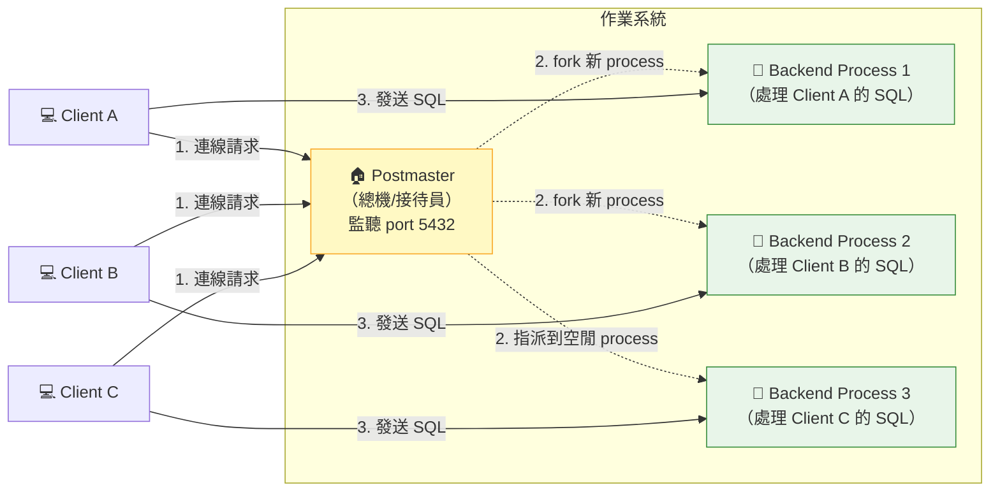

### II. Process-per-Connection：一人一間辦公室

PostgreSQL 的核心設計是 **一個 connection = 一個 OS process**（不是 thread）。

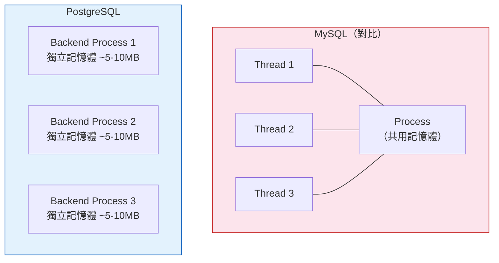

**優點：**
- 穩定性高：一個 process crash 不會拖垮其他 connection
- 不用擔心 thread-safe 問題（每個 process 各自獨立）

**缺點（也是最重要的生產考量）：**
- 每個 connection 至少吃掉 **5~10 MB 記憶體**（視 `work_mem` 設定而定）
- **1000 個 connection = 5~10 GB 記憶體就這樣沒了**
- 這也是為什麼正式環境**一定要用 connection pooler**

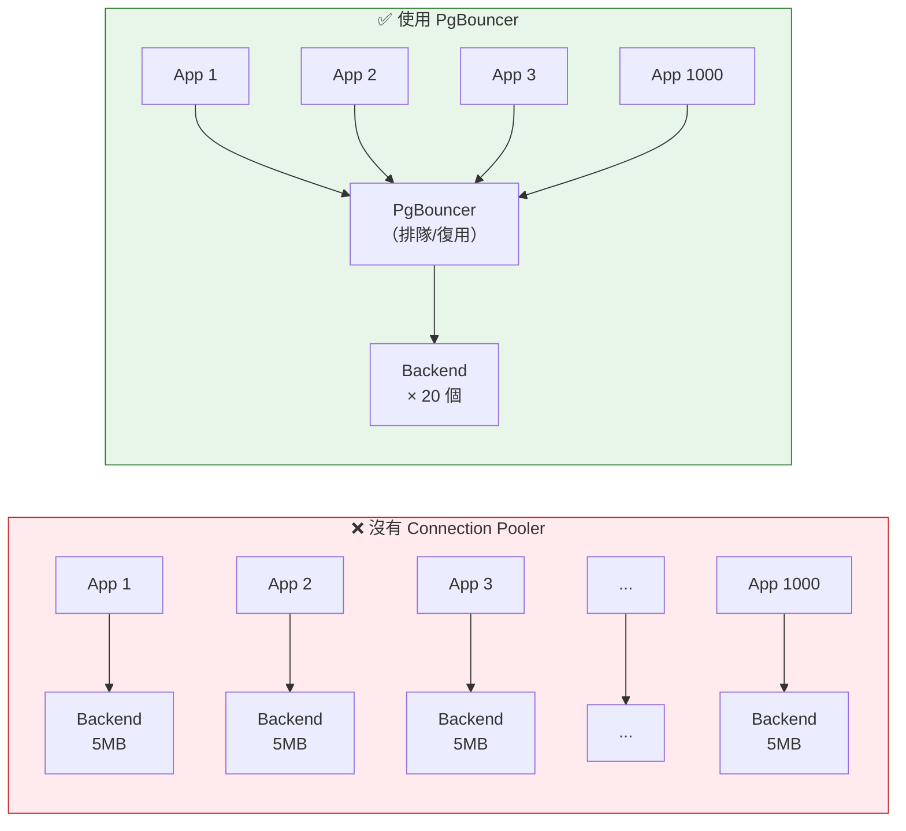

### III. Wire Protocol：Client 跟 PG 怎麼「說話」

Client 不是直接傳 SQL 字串給 PG，而是透過一套**二進位通訊協定（wire protocol）**。

每一條訊息的第一個 byte 是**訊息類型代碼**，接下來 4 bytes 是訊息長度，後面才是實際內容。

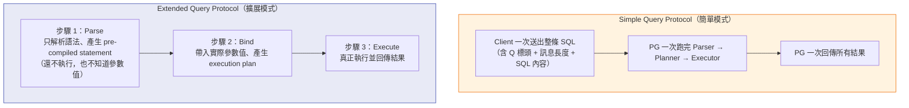

| 模式 | 誰在用 | 一句話解釋 |
|------|--------|-----------|
| **Simple Query** | `psql` 命令行、簡單 scripts | 一句 SQL 丟進去 → 結果出來 |
| **Extended Query** | JDBC、Npgsql、所有正式 Driver | 先編譯 → 再帶參數 → 再執行（安全又快） |

**實際範例 —— 同樣的 SQL，兩種傳法：**

```
Simple Query：
  Client → PG:  [Q][長度][SELECT * FROM users WHERE id = 1]
  PG → Client:  [T][長度][查詢結果 row 1][T][查詢結果 row 2]...

Extended Query：
  Client → PG:  [P][長度][SELECT * FROM users WHERE id = $1]     ← Parse，用 $1 佔位
  PG → Client:  [1]（表示 parse 完成，給你一個 statement ID）
  Client → PG:  [B][長度][statement ID][參數值: 1]              ← Bind，帶入實際值
  PG → Client:  [2]（bind 完成）
  Client → PG:  [E][長度][statement ID]                         ← Execute
  PG → Client:  [T][長度][查詢結果 row 1][T][查詢結果 row 2]...
```

> Extended Query 的關鍵好處：
> - **防止 SQL injection**：參數是分開傳的，不會跟 SQL 語法混在一起
> - **可重複執行**：同一條 SQL 只需要 Parse 一次，之後只要 Bind + Execute（省下 parse 成本）
> - **支援 Cursor**：可以一段一段 fetch 結果，而不是一次全部回傳

### IV. 整個 Client Request 階段總覽

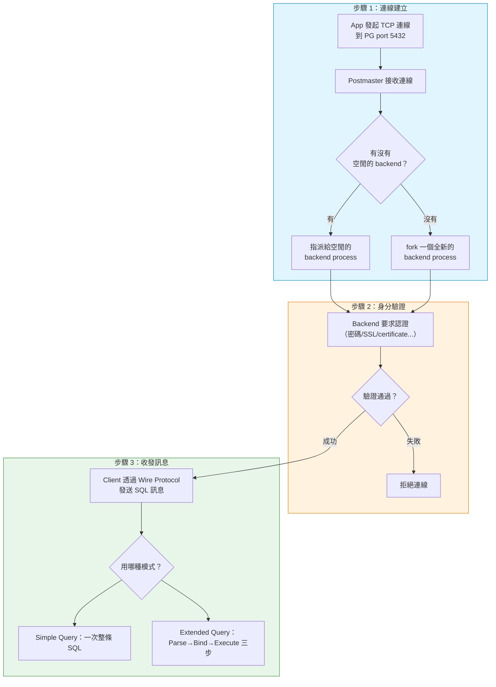

> 補充（Senior Dev）：函數名 `exec_simple_query` **極具誤導性** —— 它處理絕大多數 query，包括極度複雜的查詢。不要被 "simple" 這個字騙了。

## 3. Parser

### I. Parser 在做什麼？一句話：把「字串」變成「樹」

當你寫下一行 SQL：

```sql
SELECT name, age FROM users WHERE id = 1;
```

對電腦來說，這只是一串**文字**。電腦看不懂 "SELECT" 是什麼意思、"FROM" 跟誰是一組的。Parser 的工作就是把這串文字轉換成一個**有結構的樹狀資料**（parse tree）。

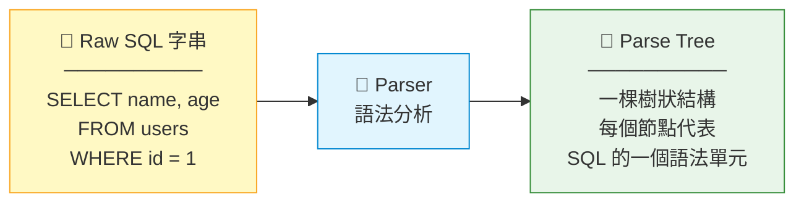

### II. Parse Tree 長什麼樣子？實際拆解一條 SELECT

PG 會把 SQL 的每個關鍵字拆成一個「節點」，然後按照層級關係組成一棵樹。

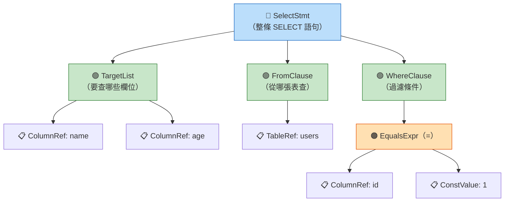

> **白話解釋**：SQL 是一個巢狀層級語言——`WHERE` 裡面包含「條件」，條件裡面又包含「左邊的 column」和「右邊的值」。Parser 的工作就是把這種層級關係用樹的方式「畫」出來，讓後面的階段可以照著這棵樹往下處理。

不同類型的 SQL 會產生不同根節點的 parse tree：

| SQL 類型 | Parse Tree 根節點 | 範例 |
|----------|-------------------|------|
| `SELECT` | `SelectStmt` | `SELECT * FROM t` |
| `INSERT` | `InsertStmt` | `INSERT INTO t VALUES (1)` |
| `UPDATE` | `UpdateStmt` | `UPDATE t SET x = 1` |
| `DELETE` | `DeleteStmt` | `DELETE FROM t` |
| `CREATE TABLE` | `CreateStmt` | `CREATE TABLE t (id INT)` |

### III. Parser 只管語法、不管語義

Parser 的工作範圍很窄——**只檢查你寫的 SQL 符不符合語法規則**，不檢查語義。

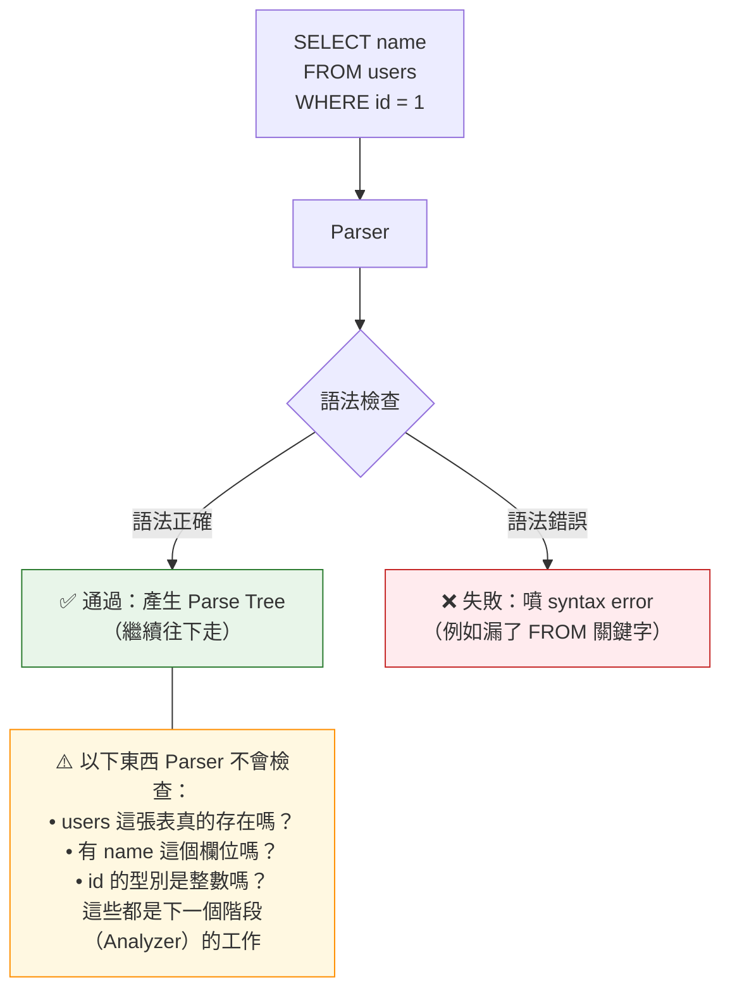

**實際例子：**

```sql
-- ✅ Parser 會過（語法正確），但會在後面的 Analyzer 階段報錯
SELECT abc FROM nonexistent_table;
-- Parser: "OK，這是個合法的 SELECT，往下傳"
-- Analyzer: "等等，根本沒有 nonexistent_table 這張表！→ 報錯"

-- ❌ Parser 直接擋下（語法錯誤，連 parse tree 都生不出來）
SELECT * FROM;
-- Parser: "FROM 後面沒接東西？這不合語法 → syntax error"
```

### IV. Parser 的兩步驟：斷詞 → 建樹

Parser 內部其實分了兩個小步驟，就像人讀句子一樣：

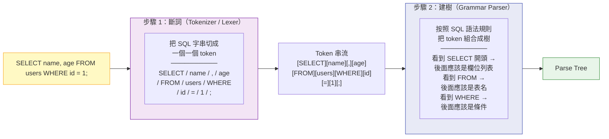

> **補充（Senior Dev）**：Parser 的原始碼使用 `flex`（斷詞）和 `bison`（建樹）這兩個經典工具自動生成。PG 的 SQL 語法規格非常龐大，語法檔案（`gram.y`）有超過 15,000 行。
>
> Debug 技巧：如果你好奇 PG 內部 parse 完長什麼樣，可以在自己的 session 中執行：
> ```sql
> SET debug_print_parse = on;
> SET debug_pretty_print = on;   -- 讓輸出有縮排，比較好讀
> SELECT * FROM users WHERE id = 1;
> -- parse tree 會印在 server log 裡（不是 client 端）
> ```
> 注意這只在開發時用，production 開下去 log 會被灌爆。

## 4. Analyzer（語義分析與改寫）

### I. Analyzer 在做什麼？一句話：把「語法樹」變成「有語義的查詢」

還記得 Parser 產出的 parse tree **完全不檢查語義**嗎？Parser 只確認你寫的 SQL「文法正確」，但不保證「語義合理」。Analyzer 接手 parse tree 後，做的事情就是在回答以下問題：

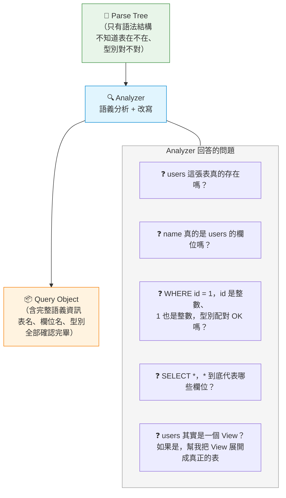

### II. Analyzer 的六大職責

Analyzer 不是只做一件事，而是分六個面向把 parse tree「補完」：

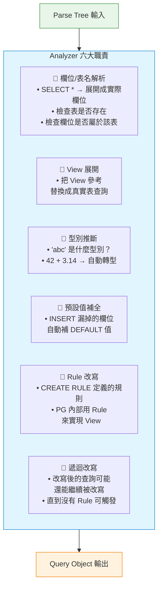

### III. 實際案例 1：View 展開（最經典的改寫）

View 是 SQL 中最常見的「虛擬表」。你寫的時候把它當成表來查，但 Analyzer 會在背後幫你把 View **展開**成真正的查詢：

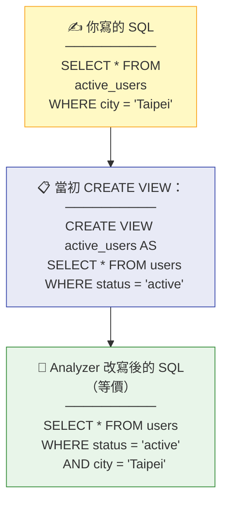

> **白話解釋**：你查 `active_users`，Analyzer 把你當初 `CREATE VIEW` 時寫的 SQL 拿出來「貼回去」，再跟你這次加的 `WHERE city = 'Taipei'` 合併在一起。最終 Planner 看到的是一條直接查 `users` 表的 SQL，View 已經不見了。

### IV. 實際案例 2：`*` 展開與型別推斷

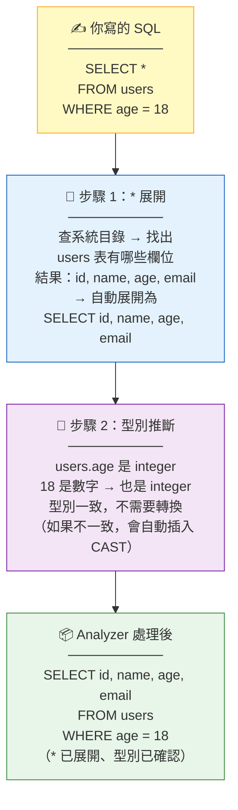

**更具體的例子 —— 型別不匹配時的自動轉換：**

```sql
-- 你寫的 SQL
SELECT * FROM users WHERE name = 123;
--            ^^^^                ^^^
--            text 型別          integer 型別  ← 不匹配！

-- Analyzer 自動處理：
-- → 把 123 轉成文字 '123'
-- → 實際上變成: WHERE name = '123'::text
-- 這個隱式轉換你沒寫，但 Analyzer 幫你加了
```

### V. 實際案例 3：INSERT 預設值補全

```sql
CREATE TABLE users (
    id       SERIAL PRIMARY KEY,
    name     TEXT NOT NULL,
    created  TIMESTAMP DEFAULT now()
);

-- 你只指定了 name
INSERT INTO users (name) VALUES ('Alice');

-- Analyzer 自動補全為：
-- INSERT INTO users (id, name, created)
-- VALUES (nextval('users_id_seq'), 'Alice', now())
--        ^^^^^^^^^^^^^^^^^^^^^^^          ^^^^^^
--        自動補的 SERIAL 值              自動補的 DEFAULT 值
```

### VI. Rule 系統與遞迴改寫

PG 內部用一套叫「Rule 系統」的機制來實現 View 和其他改寫邏輯。改寫可能不只一層：

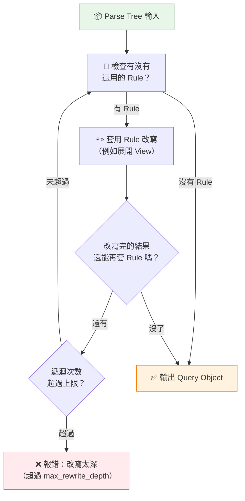

> **例子**：View A 查 View B，View B 查 View C...
> ```sql
> CREATE VIEW v_a AS SELECT * FROM v_b;
> CREATE VIEW v_b AS SELECT * FROM v_c;
> CREATE VIEW v_c AS SELECT * FROM users;
> -- SELECT * FROM v_a
> -- → 展開 v_a → 裡面有 v_b → 展開 v_b → 裡面有 v_c → 展開 v_c → users
> -- 這就是遞迴改寫的典型案例
> ```

> **補充（Senior Dev）**：
> - `EXPLAIN (ANALYZE, VERBOSE)` 中的 `Output` 欄位，顯示的是 Analyzer 處理**之後**的欄位列表（`*` 已展開、型別已轉換），不是你原始 SQL 寫的樣子。
> - 如果你好奇 Analyzer 改寫完長什麼樣，可以用 `SET debug_print_rewritten = on` 輸出到 server log。
> - `CREATE VIEW` 在 PG 內部其實就是建立一條 `_RETURN` Rule。View 不是實體資料，只是一個「查詢模板」。

## 5. Planner (Query Optimization)

前面 Analyzer 已經把 SQL 轉成結構化的 Query 物件了。但 **"怎麼執行"** 還沒決定 —— 這就是 Planner 的工作。

### I. 一句話理解 Planner

> **Planner 就像導航軟體：你告訴它目的地（SQL），它幫你規劃最快路線（執行計畫）。**

假設你要從台北到高雄，導航軟體會比較：
- 走高鐵（快速但貴）vs 開車（慢但靈活）vs 搭客運（便宜但更慢）
- Planner 做的事完全一樣：比較不同的 "怎麼讀資料" 的方法，挑成本最低的那個

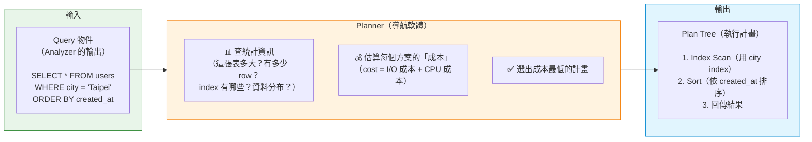

### II. 三種讀資料的方法（Scan Strategies）

一張表有很多 row，你要怎麼從硬碟裡找出符合條件的 row？Planner 有三種選擇：

```mermaid
flowchart TD
    subgraph Seq["Seq Scan（全表掃描）"]
        S1["從硬碟第一頁開始"]
        S2["一頁一頁往後讀"]
        S3["每讀一頁就檢查每一 row"]
        S4["符合條件的留下，其餘丟掉"]
        S1 --> S2 --> S3 --> S4
    end

    subgraph Idx["Index Scan（索引掃描）"]
        I1["先查 B-tree Index\n（找到 key 的位置）"]
        I2["直接跳到對應的 heap page"]
        I3["讀取那一 row 的完整資料"]
        I1 --> I2 --> I3
    end

    subgraph Bmp["Bitmap Scan（點陣圖掃描）"]
        B1["先查 Index\n（標記所有符合的 row 位置）"]
        B2["把位置整理成 bitmap\n（避免重複讀同一頁）"]
        B3["按順序讀取 heap page\n（把 random I/O 變 sequential）"]
        B1 --> B2 --> B3
    end

    style Seq fill:#ffebee,stroke:#c62828
    style Idx fill:#e8f5e9,stroke:#2e7d32
    style Bmp fill:#fff3e0,stroke:#ef6c00
```

**類比幫助理解：**

| 掃描方式 | 日常類比 | 適合情境 |
|----------|---------|---------|
| **Seq Scan** | 從書的第一頁翻到最後一頁找關鍵字 | 你要找的內容遍布全書（或不確定在哪） |
| **Index Scan** | 翻目錄 → 直接跳到第 42 頁 | 你只要找一兩個特定條目 |
| **Bitmap Scan** | 先翻目錄標記所有相關頁碼 → 再一次翻過去 | 要翻很多頁，但不希望來回亂跳傷硬碟 |

**Planner 怎麼選？看一個例子：**

```sql
-- 假設 users 表有 100 萬 row、city 欄位有 index
SELECT * FROM users WHERE city = 'Taipei';
```

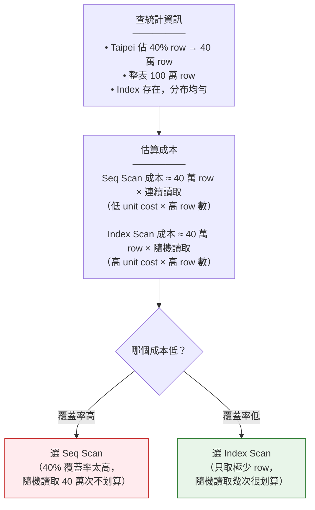

### III. 多張表時：怎麼 Join？

單表查詢很簡單，但真實世界一定有 JOIN。Planner 要決定兩件事：

> 1. **Join 順序**：A JOIN B JOIN C，先 JOIN 誰？
> 2. **Join 方法**：用什麼演算法把兩張表合在一起？

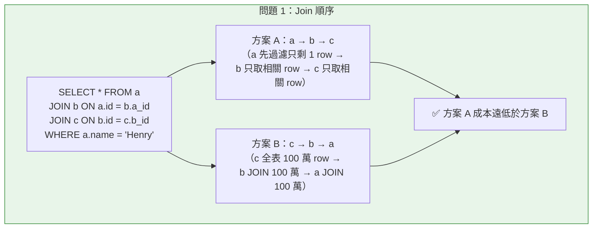

**三種 Join 方法：**

以下三種 Join，指的是 PG **內部怎麼實作** `JOIN ... ON`。不管你的 SQL 寫 `INNER JOIN`、`LEFT JOIN`、`CROSS JOIN`，Planner 都會從這三種演算法中選一種來執行。你不需要在 SQL 裡指定用哪種——Planner 自動選。

**一句話先講完三種的差別：**

| 方法 | 一句話比喻 | SQL 開發者要記的 |
|------|-----------|-----------------|
| **Nested Loop** | 像翻電話簿找人：拿名單上每個人名，去電話簿從頭翻到尾找電話 | 有一邊很小（幾 row）就很快 |
| **Hash Join** | 像查字典：先把小表建成查詢表，大表直接 O(1) 查 | 兩邊都大、沒 index 時的首選 |
| **Merge Join** | 像兩個照字母排好的名單，同步往下對 | 兩邊都照 join key 排好序時最快 |

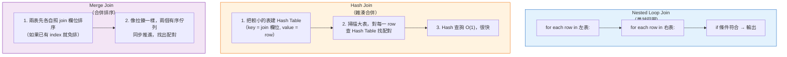

| Join 方法 | 一句話 | 適合情境 | 啟動速度 |
|-----------|--------|---------|---------|
| **Nested Loop** | 雙層 for 迴圈 | 左表很小（如過濾後剩幾 row） | 立刻有輸出 |
| **Hash Join** | 小表建 HashMap → 大表去查 | 無 index，兩表都很大 | 要等 Hash Table 建完 |
| **Merge Join** | 兩個已排序的隊伍同步前進 | 兩邊已依 join key 排好序 | 要等排序完成 |

### IV. Planner 的「成本」到底是什麼？

Planner 不是用 "秒" 來估算，而是用一個**沒有單位的數字**。這個數字大致反映執行所需的 I/O + CPU 資源：

```
total_cost = (讀取頁數 × 每頁成本) + (處理 row 數 × 每 row 成本)
```

**關鍵參數（GUC）—— Planner 對世界的假設：**

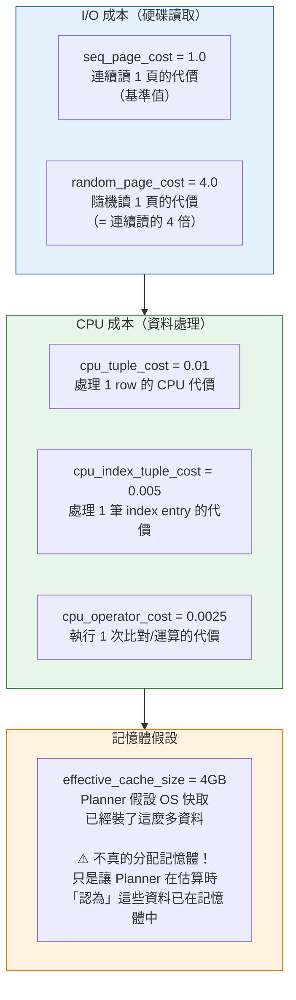

> **為什麼這很重要？** 如果你的 DB 跑在 SSD 上，`random_page_cost = 4.0` 就太悲觀了（SSD 的 random I/O 很快）。不改的話 Planner 會**過度偏好 Seq Scan**，明明用 Index 更快卻不選。SSD 環境建議調成 `1.1 ~ 1.5`。

### V. 當表太多時：從「精算」變「估算」

Planner 的預設策略是**窮舉搜尋所有可能的 Join 順序**（Dynamic Programming），保證找到最優解。但這在太多表時會爆炸：

```
2 張表 → 2 種順序
5 張表 → 120 種順序
10 張表 → 362 萬種順序  ← 還能窮舉
12 張表 → 4.79 億種順序  ← 太慢了！
```

```mermaid
flowchart TD
    Count{"有幾張表要 JOIN？"}
    DP["窮舉搜尋\n（Dynamic Programming）\n保證找到最優解\n但表越多越慢（指數成長）"]
    GEQO["遺傳演算法\n（Genetic Query Optimizer）\n用演化計算「找近似最優」\n不求完美，只求快"]
    Plan1["✅ 最優計畫"]
    Plan2["✅ 接近最優計畫\n（可能是最優，不保證）"]

    Count -->|"< 12 張表（geqo_threshold）"| DP
    Count -->|">= 12 張表"| GEQO
    DP --> Plan1
    GEQO --> Plan2

    style DP fill:#e8f5e9,stroke:#2e7d32
    style GEQO fill:#fff3e0,stroke:#ef6c00
```

> 如果你在跑 OLAP / 資料倉儲查詢（常常 JOIN 很多表），可以調高 `geqo_threshold` 讓 Planner 跑窮舉更久、換取更好的計畫。但注意：Plan Time 會指數級上升。

### VI. Planner 階段總覽

```mermaid
flowchart TD
    Q["Query 物件\n（從 Analyzer 來）"]

    subgraph PlannerFlow["Planner 內部流程"]
        S1["1. 查統計資訊\n（pg_statistic）\n\n- 表有多少 row？\n- Index 有哪些？\n- 每個欄位的值如何分布？"]
        S2["2. 估算每種 Scan 成本\n（Seq / Index / Bitmap）\n\n- 依照 cost 參數計算\n- 比較各方案成本"]
        S3["3. 決定 Join 順序\n\n- N 張表 → N! 種可能\n- ≤12 張：窮舉最優\n- >12 張：遺傳演算法近似"]
        S4["4. 決定 Join 方法\n（NestLoop / Hash / Merge）\n\n- 依表大小、有無 index 選擇"]
        S5["5. 選出總成本最低的 Plan\n\n- 輸出 Plan Tree\n- 每個 node 是一個執行步驟"]
    end

    PT["Plan Tree\n（交給 Executor 執行）"]

    Q --> S1 --> S2 --> S3 --> S4 --> S5 --> PT

    style Q fill:#e8f5e9,stroke:#388e3c
    style PlannerFlow fill:#fff3e0,stroke:#f57c00
    style PT fill:#e1f5fe,stroke:#0288d1
```

> **補充（Senior Dev）**：`effective_cache_size` **不分配任何記憶體**，只是 Planner 用來計算 "有多少 page 可能在 OS cache 中" 的假設。設越大，Planner 越傾向 Index Scan（因為它「認為」大部分 index page 已經在記憶體中，讀取成本低）。實際值應設為 `shared_buffers + OS filesystem cache`，一般建議設為總 RAM 的 50%~75%。
>
> `join_collapse_limit` 和 `from_collapse_limit` 控制 Planner 在 Join Order 搜尋上的自由度。預設 `8` 對大多數場景夠用；如果你有 10+ table JOIN，可以逐步調高，但 Plan Time 會呈指數增長。

## 6. Executor

**一句話講完**：Planner 畫好施工藍圖（Plan Tree），Executor 就是真正「動手施工」的角色。

### I. 先建立直覺：Executor 在做什麼？

假設這條 SQL：

```sql
SELECT id, name FROM users WHERE age > 18 ORDER BY id LIMIT 10;
```

Planner 給的施工藍圖長這樣（從上往下讀）：

```
Limit（只要 10 筆）
  └─ Sort（依 id 排序）
       └─ Filter（age > 18）
            └─ SeqScan（把 users 表每一行都讀出來）
```

Executor 的工作就是把這張藍圖「真的跑一遍」——實實在在去硬碟讀資料、過濾、排序、截斷，最後把 10 行結果交出來。

### II. 核心模型：Volcano Model（Pull-Based 迭代器）

Executor 最核心的設計叫做 **Volcano Model**（也稱 pull-based iterator model）。把它想像成一條「**接力賽 + 反向吸管**」：

- **每個 node 都是一個迭代器**，它只做一件事：**吐出下一筆資料（tuple）**
- **上層 node 找下層 node 要資料**（pull），而不是下層往上推（push）
- 請求一路往下傳到最底層（讀硬碟）→ 資料一路往上傳回最頂層（回傳 client）

```mermaid
flowchart TD
    Root["🔵 Limit Node\n「給我下一筆（要 10 次）」"]
    Sort["🟢 Sort Node\n「我先跟底下全部要完、\n排好序，再依序往上給」"]
    Filter["🟡 Filter Node\n「給我下一筆 → 檢查 age>18？\n是就往上傳、不是就丟掉」"]
    Scan["🔴 SeqScan Node\n「真的去硬碟讀下一行」"]

    Root -->|"1. pull: 給我下一筆"| Sort
    Sort -->|"2. pull: 給我下一筆（很多次）"| Filter
    Filter -->|"3. pull: 給我下一筆"| Scan
    Scan -.->|"4. return: {id=5, name=Bob}"| Filter
    Filter -.->|"5. return: age=22 ✓ 通過"| Sort
    Sort -.->|"6. return: 排序後的第 1 筆"| Root

    style Root fill:#bbdefb,stroke:#1976d2
    style Sort fill:#c8e6c9,stroke:#388e3c
    style Filter fill:#fff9c4,stroke:#f9a825
    style Scan fill:#ffcdd2,stroke:#c62828
```

**三種 node 的行為差異**：

```mermaid
flowchart LR
    subgraph PassThrough["🟢 透傳型（Filter、Limit）"]
        P1["pull child 一筆"]
        P2["處理（過濾/計數）"]
        P3["往上傳（或丟掉）"]
        P1 --> P2 --> P3
    end

    subgraph Blocking["🟡 阻塞型（Sort、HashAgg）"]
        B1["pull child 全部"]
        B2["一口氣處理（排序/建 hash）"]
        B3["再依序往上傳"]
        B1 --> B2 --> B3
    end

    subgraph Leaf["🔴 葉子型（SeqScan、IndexScan）"]
        L1["直接讀硬碟/記憶體"]
        L2["往上傳"]
        L1 --> L2
    end

    style PassThrough fill:#c8e6c9,stroke:#2e7d32
    style Blocking fill:#fff9c4,stroke:#f57f17
    style Leaf fill:#ffcdd2,stroke:#c62828
```

> **關鍵差異**：「阻塞型」node（Sort、HashAgg）必須先把 child 的資料**全部**讀完才能開始輸出——這就是為什麼 `ORDER BY` 在大表上會很慢，因為 Sort node 在輸出第一筆之前，得先把所有資料都拉進來排好。

### III. Plan Node（藍圖）vs Executor State Node（施工現場）

Planner 輸出的是「藍圖」（Plan Tree，寫著「這裡要排序、那裡要過濾」），但藍圖沒有記錄「排到第幾行了」。

Executor 接手後，會為每個藍圖 node 建立對應的「施工現場記錄」（Executor State Node），記錄「跑到哪了」。

```mermaid
flowchart TD
    subgraph Plan["📋 Plan Tree（藍圖）"]
        P_Root["Limit Node\nplan: 只要 10 筆"]
        P_Sort["Sort Node\nplan: 照 id 排序"]
        P_Filter["Filter Node\nplan: age > 18"]
        P_Scan["SeqScan Node\nplan: 掃描 users 表"]
    end

    subgraph Exec["🏗️ Executor State Tree（施工現場）"]
        E_Root["Limit State\n已經輸出: 3 筆\n還要: 7 筆"]
        E_Sort["Sort State\n暫存: 已排好 5000 筆\n下次給第 4 筆"]
        E_Filter["Filter State\n本輪統計: 讀了 8000 筆\n通過了 5000 筆"]
        E_Scan["SeqScan State\n目前讀到: 第 8001 筆\n總共: 100000 筆"]
    end

    P_Root -.->|"對應"| E_Root
    P_Sort -.->|"對應"| E_Sort
    P_Filter -.->|"對應"| E_Filter
    P_Scan -.->|"對應"| E_Scan

    P_Root --> P_Sort --> P_Filter --> P_Scan
    E_Root --> E_Sort --> E_Filter --> E_Scan

    style Plan fill:#e3f2fd,stroke:#1565c0
    style Exec fill:#fff3e0,stroke:#e65100
```

> **一句話區分**：Plan Tree 是「要做什麼」，Executor State Tree 是「做到哪裡了」。

### IV. 每個 Node 的三個生命週期

無論哪種 node，Executor 都用同一套 SOP 來操作它：

```mermaid
flowchart LR
    Init["🔧 初始化\n分配記憶體、開啟檔案\n準備工作環境"]
    Proc["▶️ 執行\n不斷 pull child → 處理 → 往上傳\n（一個迴圈跑到沒資料為止）"]
    End["🧹 清理\n關閉檔案、釋放記憶體\n收拾乾淨"]

    Init --> Proc --> End

    style Init fill:#e8f5e9,stroke:#388e3c
    style Proc fill:#bbdefb,stroke:#1976d2
    style End fill:#f3e5f5,stroke:#7b1fa2
```

這就是為什麼不同 node 可以像積木一樣任意組合——只要每個 node 都遵循這三個步驟，無論你疊 `Sort → HashAgg → SeqScan` 還是 `Limit → IndexScan`，Executor 都照樣運作。

### V. Portal：執行進度的「書籤」

當你查詢還沒跑完但想暫停（例如用 Cursor 一段一段 fetch 結果），PG 需要知道「上次跑到哪裡了」。這個記錄就叫 **Portal**。

```mermaid
flowchart LR
    subgraph Book["📖 Portal = 書籤"]
        B1["記錄目前執行到\nPlan Tree 的哪個位置"]
        B2["記錄每個 node 的\nExecutor State 狀態"]
        B3["下次 fetch 時\n從書籤位置繼續"]
    end

    subgraph Types["兩種 Portal"]
        T1["未命名 Portal\n（一般查詢自動建立）\n一次性跑完就丟"]
        T2["命名 Portal\n（DECLARE CURSOR 建立）\n可以分段 fetch"]
    end

    Book --> Types

    style Book fill:#fff9c4,stroke:#f9a825
```

### VI. 進階特性：平行查詢（Parallel Query）

大查詢可以用多個 worker 同時跑以加速：

```mermaid
flowchart TD
    Gather["🟣 Gather Node（總管）\n從所有 worker 收集結果\n合併後往上傳"]

    W1["🔵 Worker 1\n獨立跑 partial plan\n（處理表的前 1/3）"]
    W2["🔵 Worker 2\n獨立跑 partial plan\n（處理表的中 1/3）"]
    W3["🔵 Worker 3\n獨立跑 partial plan\n（處理表的後 1/3）"]

    Gather -->|"pull 下一筆"| W1
    Gather -->|"pull 下一筆"| W2
    Gather -->|"pull 下一筆"| W3

    style Gather fill:#e1bee7,stroke:#8e24aa
    style W1 fill:#bbdefb,stroke:#1976d2
    style W2 fill:#bbdefb,stroke:#1976d2
    style W3 fill:#bbdefb,stroke:#1976d2
```

> 情境：`SELECT count(*) FROM big_table` → Planner 在 plan tree 頂部放一個 Gather node，底下三個 worker 各自掃 1/3 的表，各自算出 partial count，Gather 再彙總。

### VII. 進階特性：JIT 編譯（Just-In-Time Compilation）

某些查詢的瓶頸是 CPU（例如 `WHERE` 條件裡有複雜的數學運算），每次處理一行都要重新解釋執行。

JIT 把這些「熱點迴圈」在執行期直接編譯成機器碼，跳過解釋執行的 overhead：

```mermaid
flowchart LR
    Without["❌ 無 JIT\n每筆 row 都要：\n讀指令 → 解釋 → 執行\n（像朗讀 vs 默讀）"]
    With["✅ 有 JIT\n熱點迴圈編譯成機器碼\n直接跑 native code\n（快 10-30%）"]

    Without -->|"編譯"| With

    style Without fill:#ffebee,stroke:#c62828
    style With fill:#e8f5e9,stroke:#2e7d32
```

> JIT 不是萬靈丹——它對 **CPU-bound** 的查詢有效（大量數學運算、複雜 WHERE），對 **I/O-bound** 的查詢（瓶頸在讀硬碟）幾乎無感。

### VIII. Executor 完整流程總覽

```mermaid
flowchart TD
    Start["📋 Planner 交付 Plan Tree（藍圖）"]
    Build["🏗️ 建立 Executor State Tree\n（為每個 plan node 建立施工現場記錄）"]
    Init["🔧 依序初始化每個 node\n（分配記憶體、開啟檔案）"]

    Loop["▶️ 進入主迴圈\nRoot node pull 下一筆 →\n請求一路往下傳到最底層 →\n資料一路往上回傳 →\n輸出給 client"]

    End{"沒有更多資料了？"}
    Clean["🧹 依序清理每個 node\n（關檔、釋放記憶體）"]
    Done["✅ 查詢結束"]

    Portal["📖 Portal（書籤）\n記錄目前跑到哪\n讓分段 fetch 變可能"]
    Gather["🟣 Gather Node（平行）\n多 worker 同時跑"]
    JIT["⚡ JIT 編譯\n熱點迴圈 → 機器碼"]

    Start --> Build --> Init --> Loop
    Loop --> End
    End -->|"是"| Clean --> Done
    End -->|"否"| Loop

    Loop -.->|"暫停/分段"| Portal
    Loop -.->|"平行加速"| Gather
    Loop -.->|"CPU 加速"| JIT

    style Start fill:#e3f2fd,stroke:#1565c0
    style Build fill:#fff3e0,stroke:#e65100
    style Init fill:#e8f5e9,stroke:#388e3c
    style Loop fill:#bbdefb,stroke:#1976d2
    style End fill:#fff9c4,stroke:#f9a825
    style Clean fill:#f3e5f5,stroke:#7b1fa2
    style Done fill:#c8e6c9,stroke:#388e3c
    style Portal fill:#fce4ec,stroke:#c62828
    style Gather fill:#e1bee7,stroke:#8e24aa
    style JIT fill:#b2dfdb,stroke:#00695c
```

## 7. Client Response

前面 Executor 已經把所有資料都算出來了 —— 但這些資料要「送去哪裡」？這就是最後一個階段的工作。

### I. 一句話理解

> **Executor 負責「算出結果」，Client Response 階段負責「把結果送出去」。**

聽起來很簡單，但 PG 在這層做了一個重要的設計 —— **結果不一定是送回 client**。結果可以寫入暫存、餵給另一個查詢、匯出成檔案。PG 用一個叫做「**Destination Receiver**」的抽象層來統一處理這些不同去向。

### II. 直覺類比：得來速餐廳

用一個日常場景來理解整條路徑：

```mermaid
flowchart TD
    subgraph Kitchen["👨‍🍳 廚房 = Executor"]
        K1["廚師照食譜做菜\n一道一道做出來"]
        K2["每道菜做完\n放上出餐檯"]
        K1 --> K2
    end

    subgraph Dispatcher["📋 出餐檯 = Destination Receiver"]
        D1{"這道菜\n要送去哪？"}
        D2["🍽️ 內用 → 端到客人桌上\n（= Client Receiver）"]
        D3["📦 外帶 → 裝進餐盒\n（= COPY Receiver）"]
        D4["🥘 備料 → 放冰箱等下再用\n（= Materialize Receiver）"]
        D5["🔪 給另一個廚師 → 傳過去\n（= SPI Receiver）"]
    end

    subgraph Client["💻 Client（你的 App）"]
        C1["收到資料\n顯示在畫面上"]
    end

    K2 --> D1
    D1 --> D2 --> C1
    D1 --> D3
    D1 --> D4
    D1 --> D5

    style Kitchen fill:#fff3e0,stroke:#e65100
    style Dispatcher fill:#e3f2fd,stroke:#1565c0
    style Client fill:#e8f5e9,stroke:#2e7d32
```

### III. 四種 Receiver（結果的不同去向）

每一筆查詢結果都會走其中一條路：

```mermaid
flowchart TD
    Tuple["📦 Executor 算出的一筆結果\n（一行資料）"]

    subgraph R1["🟢 1. Client Receiver（最常見）"]
        direction LR
        R1A["格式化為網路封包\n→ 透過 TCP 送回你的 App"]
        R1B["🎯 場景：你在 psql 或 App 裡\n直接執行 SELECT"]
    end

    subgraph R2["🟡 2. SPI Receiver（內部調用）"]
        direction LR
        R2A["結果存進內部暫存表\n供 PL/pgSQL 函數使用"]
        R2B["🎯 場景：你在一個 Function 裡\n寫 SELECT ... INTO variable"]
    end

    subgraph R3["🟣 3. Materialize Receiver（暫存）"]
        direction LR
        R3A["結果暫存到記憶體/硬碟\n供後續查詢重複使用"]
        R3B["🎯 場景：WITH CTE、\nCursor 的分段讀取"]
    end

    subgraph R4["🔵 4. COPY Receiver（匯出）"]
        direction LR
        R4A["結果直接寫成\nCSV/文字檔"]
        R4B["🎯 場景：COPY ... TO '/tmp/data.csv'"]
    end

    Tuple --> R1
    R1 --> R2 --> R3 --> R4

    style R1 fill:#c8e6c9,stroke:#2e7d32
    style R2 fill:#fff9c4,stroke:#f57f17
    style R3 fill:#e1bee7,stroke:#8e24aa
    style R4 fill:#bbdefb,stroke:#1976d2
```

### IV. 關鍵案例：為什麼 `COUNT(*)` 不回傳全部資料？

這是最能體現 Receiver 設計價值的一個問題。假設：

```sql
SELECT count(*) FROM users WHERE age > 18;
-- users 表有 100 萬筆，符合條件的有 40 萬筆
```

**新手直覺**：PG 先把 40 萬筆讀出來 → 算完總數 → 再丟回 client。

**實際運作**：

```mermaid
flowchart TD
    subgraph ExecutorFlow["Executor 內部"]
        Scan["🔴 SeqScan Node\n讀取 users 表\n→ 輸出 age>18 的 40 萬筆"]
        Agg["🟡 Aggregate Node（Count）\n攔截所有 40 萬筆\n→ 只算出一個數字：400,000"]
    end

    subgraph Response["Client Response 階段"]
        Send["🟢 Client Receiver\n只收到一筆資料\n→ { count: 400000 }\n→ 格式化 → 送回 App"]
    end

    Scan -->|"40 萬筆 row"| Agg
    Agg -->|"只有 1 筆"| Send

    Note["💡 關鍵：中間 40 萬筆\n從來沒離開過 PG 內部！\nAggregate Node 在 Executor 內部\n就把它們消化掉了。\nClient Receiver 只看到\n最後的 1 筆結果。"]

    Agg -.-> Note

    style Scan fill:#ffcdd2,stroke:#c62828
    style Agg fill:#fff9c4,stroke:#f57f17
    style Send fill:#c8e6c9,stroke:#2e7d32
    style Note fill:#f5f5f5,stroke:#9e9e9e
```

> 這就是 Receiver 抽象層的威力：**Executor 不知道、也不在乎結果最後要去哪**。Executor 只管把資料「交出去」，至於這筆資料是被送回 client、存起來、還是被 Aggregate Node 吞掉 —— 那是 Receiver 決定的。

### V. 送回 Client 的最後一步：Wire Protocol 格式化

當 Receiver 是「送回 client」時，最後一步是把 PG 內部的資料結構轉換成**網路可以傳輸的格式**（Wire Protocol）。

```mermaid
flowchart LR
    subgraph Internal["PG 內部格式"]
        I1["Tuple（Row）\n────────\n{id: 1, name: 'Alice',\n age: 25}"]
    end

    subgraph Format["格式化（序列化）"]
        F1["把每個欄位的值\n轉成 binary 或文字"]
        F2["加上 message type\n（告訴 client 這是資料）"]
        F3["加上 message length\n（讓 client 知道封包邊界）"]
    end

    subgraph Wire["網路傳輸"]
        W1["透過 TCP Socket\n送回你的 App"]
    end

    I1 --> F1 --> F2 --> F3 --> W1

    style Internal fill:#e8f5e9,stroke:#388e3c
    style Format fill:#fff3e0,stroke:#f57c00
    style Wire fill:#e1f5fe,stroke:#0288d1
```

**Wire Protocol 訊息格式（簡化）**：

```
┌──────────┬───────────────┬─────────────────────┐
│ 1 byte   │   4 bytes     │     variable        │
│ 訊息類型  │  訊息長度      │     訊息內容          │
│ (T=資料)  │  (含自己的長度) │  (欄位1, 欄位2, ...) │
└──────────┴───────────────┴─────────────────────┘
```

> **類比**：就像寄快遞 —— 訊息類型 =「內容物：資料」、訊息長度 =「箱子大小」、訊息內容 =「箱子裡裝的實際資料」。Client 收到後根據類型判斷「這是資料」、根據長度知道「要讀多少 bytes」、然後解讀內容。

### VI. 完整流程總覽：從 Executor 到你的 App

把 Executor 和 Client Response 串在一起看：

```mermaid
flowchart TD
    subgraph Exec["Executor（算出結果）"]
        E1["Plan Tree 的 Root Node\n不斷 pull child → 得到結果"]
        E2["每得到一筆結果\n就呼叫 Receiver 的 callback\n「這筆給你，看你要送哪去」"]
    end

    subgraph Recv["Receiver（決定去向）"]
        R1{"這筆結果\n該去哪裡？"}
        R2["→ 送回 Client\n（一般 SELECT）"]
        R3["→ 存進 SPI 暫存區\n（Function 內部）"]
        R4["→ 寫入暫存\n（CTE / Cursor）"]
        R5["→ 寫出檔案\n（COPY TO）"]
    end

    subgraph Wire["Wire Protocol（格式化 + 傳輸）"]
        W1["把 PG 內部格式\n→ 轉成網路訊息"]
        W2["塞進 TCP Socket"]
    end

    subgraph App["你的 App"]
        A1["從 TCP Socket 讀取訊息"]
        A2["解析訊息 → 還原成資料"]
        A3["顯示在螢幕上"]
    end

    E1 --> E2 --> R1
    R1 --> R2 --> W1 --> W2 --> A1 --> A2 --> A3
    R1 --> R3
    R1 --> R4
    R1 --> R5

    style Exec fill:#fff3e0,stroke:#e65100
    style Recv fill:#e3f2fd,stroke:#1565c0
    style Wire fill:#f3e5f5,stroke:#7b1fa2
    style App fill:#e8f5e9,stroke:#2e7d32
```

### VII. 兩種查詢模式在回應階段的差異

還記得 Client Request 階段提過的 Simple Query 和 Extended Query 嗎？它們在回應階段的行為也不同：

```mermaid
flowchart TD
    subgraph Simple["Simple Query（一次整條 SQL）"]
        S1["送 SQL → PG 全部跑完"]
        S2["一次把所有結果送回 client"]
        S3["結束"]
        S1 --> S2 --> S3
    end

    subgraph Extended["Extended Query（Parse → Bind → Execute）"]
        E1["Parse：只解析，不執行\n（得到解析後的查詢模板）"]
        E2["Bind：綁定參數值"]
        E3["Execute：執行"]
        E4["可以重複 Bind + Execute\n（同一模板、不同參數）\n每次 Execute 只回傳該次的結果"]
        E1 --> E2 --> E3 --> E4
    end

    style Simple fill:#e8f5e9,stroke:#388e3c
    style Extended fill:#e1f5fe,stroke:#0288d1
```

> **延伸（PG 14+ Pipeline Mode）**：client 可以在同一條連線上連續發出多個查詢，不需要等前一個查詢的結果回來才發下一個。就像在餐廳裡連續點好幾道菜，廚房可以同時準備，不用等一道菜吃完才點下一道。

### VIII. 一句話總結 Client Response

```
Executor 算出結果
      ↓
Receiver 決定結果去哪（送回 client？暫存？匯出？）
      ↓
若要送回 client → Wire Protocol 格式化 → TCP 傳輸
      ↓
你的 App 收到資料 → 顯示在畫面上
```
---

# 二、CBO 與 pg_hint_plan：何時需要 Hint？

> 來源：[digoal - PostgreSQL SQL HINT的使用 (2016-02-03)](https://github.com/digoal/blog/blob/master/201602/20160203_01.md)

## 1. 背景：CBO 是否每次都能產生最優 Plan？

PostgreSQL 使用 Cost-Based Optimizer（CBO）。當關聯表數量超過 `geqo_threshold`（預設 12）時，會改用 Genetic Query Optimizer（GEQO）以避免窮舉帶來的 planning 開銷，但 GEQO 結果不保證最優。

### I. CBO 的成本計算因子

來源：`src/backend/optimizer/path/costsize.c`

| 因子類別 | 具體項目 | 影響 |
|---------|---------|------|
| 物理屬性 | table 的 data block 數量 | 影響 scan block 成本 |
| 物理屬性 | table 的 row 數量 | 影響 CPU 處理 row 成本 |
| 成本因子 | `seq_page_cost` / `random_page_cost` | 連續 vs 隨機讀取單個 block 的成本 |
| 成本因子 | `cpu_tuple_cost` / `cpu_index_tuple_cost` | CPU 處理 heap/index 中一條 row 的成本 |
| 成本因子 | `cpu_operator_cost` | 執行一個 operator 或 function 的成本 |
| Memory | `work_mem` 等 | 影響 Index Scan 的計算成本 |
| 統計資訊 | correlation | 影響 Index Scan 成本估算 |
| 統計資訊 | column width、null fraction、n_distinct、MCV、histogram buckets | 影響選擇性（selectivity） |
| 函數屬性 | 建立 function / operator 時設置的 cost | 影響含 function call 的查詢成本 |

### II. CBO 的盲區

**a. 已考慮但可能滯後的因素（auto-analyze 自動更新）：**

`pg_class.relpages` / `pg_class.reltuples`、`pg_statistic` 統計資訊——自動 analyze 有延遲，bulk INSERT/DELETE 後可能嚴重失準。

**b. 靜態配置因素（不會自動調整）：**

- OS cache 實際可用記憶體（`effective_cache_size` 是靜態設定）
- Function / operator cost（函數內部邏輯變更後不自動更新）

**c. 未考慮的因素：**

- Block device read-ahead（一次讀取預讀 128KB，但 CBO 按逐個 block 計算）
- `seq_page_cost` / `random_page_cost` 可針對 tablespace 設置，但不會動態追蹤 read-ahead 變更

**d. Generic plan cache（`choose_custom_plan`）：**

PostgreSQL 比對 cached plan 的平均成本與 custom plan 的成本：若 cached plan 成本更高，會改用 custom plan。前提是**統計資訊必須準確**。

### III. 何時需要 Hint

大多數情況下，合理配置 `random_page_cost`、定期 `ANALYZE`、調整 `default_statistics_target` 就足夠。需要 Hint 的場景：

- 靜態配置與實際不符（如 function cost 過時）
- 特定查詢的 optimizer 估計與實際偏差巨大
- 除錯：想對比不同 plan 的實際效率
- 緊急情況：production 中某個查詢突然選擇了差的 plan

> 補充（Senior Dev）：Hint 是把雙面刃。寫在 application code 中的 hint 會在資料成長後過時（plan rot），導致原本正確的 hint 變成效能殺手。應優先嘗試非侵入式方案（調整 `enable_*` GUC、extended statistics、調整 `random_page_cost`），hint 作為最後手段。

## 2. pg_hint_plan 簡介

`pg_hint_plan` 是 PostgreSQL extension，利用 PG 開放的 hook 介面實現 Oracle-style SQL hint。

### I. 安裝（PG 9.4 示範）

```bash
wget http://iij.dl.sourceforge.jp/pghintplan/62456/pg_hint_plan94-1.1.3.tar.gz
tar -zxvf pg_hint_plan94-1.1.3.tar.gz
cd pg_hint_plan94-1.1.3
export PATH=/opt/pgsql/bin:$PATH
gmake clean && gmake && gmake install
```

```ini
# postgresql.conf
shared_preload_libraries = 'pg_hint_plan'
pg_hint_plan.enable_hint = on
pg_hint_plan.debug_print = on
pg_hint_plan.message_level = log
```

```sql
CREATE EXTENSION pg_hint_plan;
```

> PG 12+ 支援 **hint table**（`hint_plan.hints`），可在 table 中管理 hint 而無需修改 SQL text：
> ```sql
> INSERT INTO hint_plan.hints (norm_query_string, application_name, hints)
> VALUES ('SELECT * FROM orders WHERE create_time > $1', '', 'IndexScan(orders idx_orders_time)');
> ```

### II. Hint vs GUC Switch 對比

**原生 GUC 開關：**

```sql
SET enable_nestloop = off;
EXPLAIN SELECT a.*, b.* FROM a, b WHERE a.id = b.id AND a.id < 10;
-- 結果：Hash Join（禁用了 Nested Loop）
```

**pg_hint_plan hint：**

```sql
/*+
  HashJoin(a b)
  SeqScan(b)
*/
EXPLAIN SELECT a.*, b.* FROM a, b WHERE a.id = b.id AND a.id < 10;
```

Hint 相較 GUC 的優勢：GUC 是 session-level，hint 是 query-level，粒度更精細。

### III. 完整 Hint 列表

| Hint | 作用 |
|------|------|
| `SeqScan(table)` | 強制 Seq Scan |
| `TidScan(table)` | 強制 TID Scan |
| `IndexScan(table [index...])` | 強制 Index Scan |
| `IndexOnlyScan(table [index...])` | 強制 Index Only Scan |
| `BitmapScan(table [index...])` | 強制 Bitmap Scan |
| `NoSeqScan(table)` / `NoIndexScan(table)` 等 | 禁止某種 scan |
| `NestLoop(table ...)` / `HashJoin(...)` / `MergeJoin(...)` | 強制 join 方式 |
| `Leading(table table [table...])` | 強制 Join Order |
| `Rows(table ... correction)` | 修正 join result 的 row estimate |
| `Set(GUC-param value)` | 在 planner 執行期間設定 GUC 參數 |

> 實務中最常用的三個 hint：
> 1. **`Leading`** — 修復 join order 錯誤
> 2. **`Rows`** — 直接修正 row estimate
> 3. **`Set`** — 臨時覆蓋 `enable_*` 或 `work_mem`

## 3. CBO 成本計算的完整鏈路

```
table statistics (pg_class, pg_statistic)
         ↓
cost factors (seq_page_cost, random_page_cost, cpu_*_cost)
         ↓
scan cost estimation (costsize.c)
         ↓
join order enumeration (dynamic programming / GEQO)
         ↓
join method selection (NestLoop / HashJoin / MergeJoin)
         ↓
final plan selection (lowest total cost)
```

### I. plan cache 的 choose_custom_plan 邏輯

來源：`src/backend/utils/cache/plancache.c`

- **custom plan**：每次重新規劃
- **generic plan**：使用緩存的通用 plan（首次 5 次執行使用 custom，第 6 次開始比較成本）

選擇邏輯：若 `cached_plan_cost > avg_custom_plan_cost`，改用 custom plan。

## 4. 替代方案與最佳實踐

> 在使用 pg_hint_plan 之前，應先嘗試以下方案，由輕到重：

| 優先級 | 方案 | 適用場景 |
|--------|------|---------|
| 1 | 調整 `random_page_cost` / `seq_page_cost` | SSD 環境 cost factor 不準確 |
| 2 | 增加 `default_statistics_target` | 單一 column 統計資訊不足 |
| 3 | CREATE STATISTICS（PG 10+ extended stats） | 多 column 之間有相關性 |
| 4 | `SET enable_nestloop = off` 等 GUC | 臨時性調整，不修改 code |
| 5 | 調整 `join_collapse_limit` / `from_collapse_limit` | 顯式 JOIN 順序被限制時 |
| 6 | pg_hint_plan hint table（PG 12+） | 需長期、可控的 plan 修正 |
| 7 | pg_hint_plan inline hint | 最後手段 |

---

# 三、GROUP BY 策略：Sort (GroupAgg) vs Hash (HashAgg)

> 來源：[digoal - PostgreSQL sort or not sort when group by? (2015-08-13)](https://github.com/digoal/blog/blob/master/201508/20150813_02.md)

## 1. 核心問題：GROUP BY 為什麼有時用 Sort？

Optimizer 選擇 Agg 策略的唯一標準是 cost。`GROUP BY` 有兩種 aggregation strategy：

| Strategy | 說明 |
|----------|------|
| **GroupAgg (AGG_SORTED)** | 先 Sort 再分組聚合。input 已有序時 skip Sort（如來自 index scan） |
| **HashAgg (AGG_HASHED)** | 建 hash table 聚合。需等全部 input 就緒才開始輸出 |

兩者 total CPU cost 在 cost 模型中相同，但 **GroupAgg startup cost 更低**（可 on-the-fly 輸出），HashAgg startup cost = input total cost（必須等所有 input 讀完）。

### I. 實驗：work_mem 影響策略選擇

```sql
CREATE TABLE t1 (c1 INT, c2 INT, c3 INT, c4 INT);
INSERT INTO t1 SELECT generate_series(1, 100000), 1, 1, 1;
```

**work_mem = 4MB → external sort + GroupAgg（392ms）：**

```
Sort Method: external sort  Disk: 2544kB
```

**work_mem = 1GB → HashAggregate（104ms）：**

```
HashAggregate  -- 無 Sort step，total execution 104ms
```

**強制關閉 HashAgg → quicksort + GroupAgg（68ms）：**

```
Sort Method: quicksort  Memory: 7760kB  -- 反而比 HashAgg 快
```

但在正常 GUC 設定下 optimizer 選 HashAgg，因為 cost 估算更低。

## 2. 原始碼分析：cost_agg() — 兩種策略的 Cost 計算

來源：`src/backend/optimizer/path/costsize.c`

**AGG_SORTED（GroupAgg）**：

```c
startup_cost = input_startup_cost;           // Sort 的 startup cost
total_cost   = input_total_cost;             // Sort 的 total cost
total_cost  += aggcosts->transCost.per_tuple * input_tuples;
total_cost  += (cpu_operator_cost * numGroupCols) * input_tuples;
total_cost  += aggcosts->finalCost * numGroups;
```

**AGG_HASHED（HashAgg）**：

```c
startup_cost = input_total_cost;             // 必須等所有 input
startup_cost += aggcosts->transCost.per_tuple * input_tuples;
total_cost   = startup_cost;
total_cost  += aggcosts->finalCost * numGroups;
```

**關鍵差異**：HashAgg 的 startup_cost = `input_total_cost`。GroupAgg 的 startup_cost = `input_startup_cost`（可越早輸出，對 LIMIT 查詢有利）。

原始碼註釋：
```
* AGG_SORTED and AGG_HASHED have exactly the same total CPU cost,
* but AGG_SORTED has lower startup cost. If the input path is
* already sorted appropriately, AGG_SORTED should be preferred.
```

> 當 input 已有序時（如來自 BTREE index scan 或 merge join），AGG_SORTED 可以跳過 Sort step，此時 GroupAgg 的 total cost 會顯著低於 HashAgg。

## 3. cost_sort() — Sort 策略的成本分岔

來源：`src/backend/optimizer/path/costsize.c`

```
1. output_bytes > sort_mem_bytes  →  external disk sort (polyphase merge)
2. tuples > 2 × output_tuples  →  bounded heap sort (LIMIT 場景)
3. 其他 →  quicksort (全部 in-memory)
```

## 4. GroupAgg vs HashAgg 選擇的實戰考量

| 維度 | GroupAgg | HashAgg |
|------|----------|---------|
| requires sort | 是（除非 input 已有序） | 否 |
| startup cost | 低 | 高（=input total cost） |
| memory risk | 取決於 sort 階段 memory | 取決於 #distinct groups |
| LIMIT 友好 | 是（early output） | 否（需建完整 hash table） |
| 大量 distinct groups | 不適合 | 適合（若 hash table fits memory） |
| input 已有序 | **最佳**（skip sort） | 仍需建 hash table |

> 當 `work_mem` 不足造成 HashAgg 的 hash table spill 到 disk 時，成本會急劇上升。可透過 `SET enable_hashagg = off` 強制切換 GroupAgg 對比真實 performance。

## 5. 相關參數與版本演進

| 參數 | 預設 | 說明 |
|------|------|------|
| `enable_hashagg` | on | 允許 optimizer 選擇 HashAgg |
| `work_mem` | 4MB | sort 與 hash table 的 memory 上限 |
| `hash_mem_multiplier` | 2.0 (PG 16+) | Hash 操作的 memory = `work_mem × hash_mem_multiplier` |

| 功能 | 版本 |
|------|------|
| parallel hash join / hashagg | PG 11+ |
| disk-based HashAgg | PG 13+ |
| plan-time hash sizing | PG 14+ |
| hash_mem_multiplier | PG 16 |

---

# 四、IN / =ANY(ARRAY) / =ANY(VALUES) / JOIN VALUES 效能對決

> 來源：[digoal - PostgreSQL IN/VALUES 優化 (2014-10-16)](https://github.com/digoal/blog/blob/master/201410/20141016_01.md)
> 案例：[Datadog: 100x faster Postgres performance by changing 1 line](https://www.datadoghq.com/2013/08/100x-faster-postgres-performance-by-changing-1-line/)

## 1. 四種寫法與 Execution Plan

```sql
-- 1) IN 列表
SELECT * FROM t2 WHERE id IN (1,2,3,100,1000,0);

-- 2) =ANY(ARRAY) → optimizer 內部改寫為 ScalarArrayOpExpr
SELECT * FROM t2 WHERE id = ANY ('{1,2,3,100,1000,0}'::integer[]);

-- 3) =ANY(VALUES) → 產生 HashAggregate + Nested Loop
SELECT * FROM t2 WHERE id = ANY (VALUES (1),(2),(3),(100),(1000),(0));

-- 4) JOIN VALUES → Nested Loop（不產生 HashAggregate）
SELECT t2.* FROM t2 JOIN (VALUES (1),(2),(3),(100),(1000),(0)) AS t(id) ON t2.id = t.id;
```

## 2. Datadog 實戰案例：22s → 263ms（100x 提速）

### I. 原始問題

15 百萬 row 的表，查詢 11,000 個 primary key 時花了 22 秒。執行計劃核心節點是 **Bitmap Heap Scan + Filter**，Filter 逐行檢查 11,000 個 key 的 membership。

### II. 根因

大陣列 `=ANY(ARRAY[...])` 讓 optimizer 選擇 **Bitmap Heap Scan + Filter** 而非 **Index Scan**。Bitmap 將所有符合條件的 page 讀出，然後在 Filter 階段逐行比對 key ∈ array → 產生巨大的 Recheck overhead。

### III. 解法（一行差異）

```sql
-- Before: 22s
WHERE c.key = ANY (ARRAY[15368196, ...])
-- After: 263ms (100x faster)
WHERE c.key = ANY (VALUES (15368196), ...)
```

新計劃使用 **Nested Loop Index Scan**（一次性逐 key 精確查表）。

## 3. PG 14 實測：work_mem 對 VALUES 策略的影響

`=ANY(VALUES(...))` 的效能受 **work_mem** 影響：低 work_mem 時 VALUES 去重用 external sort → disk I/O，高 work_mem 時用 in-memory HashAggregate。但即使 external sort，仍遠快於 Bitmap Heap Scan + Filter 方案。

> PG 14 起引入 `MIN_ARRAY_SIZE_FOR_HASHED_SAOP`（預設 9），當 `IN` 列表超過 9 個元素時，optimizer 自動將 `INDEX = ANY(ARRAY[...])` 從 sequential scan 切換為 hash table probe，大幅改善中等大小 IN 列表的效能。

## 4. 效能矩陣：何時用哪種寫法

| 寫法 | 適合場景 | 注意 |
|------|---------|------|
| `IN (1,2,3)` | ≤ 9 個元素（PG 14+ 自動 hash） | 不適合動態拼接 |
| `=ANY(ARRAY[...])` | ≤ 數百個元素 | 大陣列可能選 Bitmap Scan |
| `=ANY(VALUES(...))` | 數百~數萬個元素 | 大列表穩定性極佳 |
| `JOIN (VALUES(...))` | 需保留排序 | 不保證唯一回傳 |

### I. 選擇決策

```
元素數 ≤ 9     → IN (...)
元素數 10~500  → =ANY(ARRAY[...])
元素數 500~50K → =ANY(VALUES(...))
元素數 > 50K   → TEMPORARY TABLE + JOIN + ANALYZE
```

## 5. Multi-Column IN 的寫法

```sql
-- 多列 IN：只有 =ANY(VALUES) 可用
WHERE (col_a, col_b) = ANY(VALUES (1,'x'), (2,'y'), (3,'z'))
```

## 6. 版本演進

| 功能 | 版本 |
|------|------|
| `=ANY(VALUES)` 基本支援 | PG 8.4+ |
| `plan_cache_mode = force_custom_plan` | PG 12 |
| `MIN_ARRAY_SIZE_FOR_HASHED_SAOP` | PG 14 |
| `enable_presorted_aggs` | PG 17 |

---

# 五、分頁與計數優化：count(*) 替代 + OFFSET 退化 + Keyset 位點

> 來源：[digoal - 论 count 与 offset 使用不当的罪名 (2016-05-06)](https://github.com/digoal/blog/blob/master/201605/20160506_01.md)

## 1. count(\*) 的替代：EXPLAIN Row Estimate

### I. 問題

典型分頁流程：先 `count(*)` 算總數 → 算頁數 → 再 `SELECT ... LIMIT N OFFSET M` 取數據。這等於同一批數據掃了兩遍。

### II. count_estimate() 函數

從 `EXPLAIN` 輸出中擷取 planner 的 row estimate，完全避免實際掃描數據：

```sql
CREATE FUNCTION count_estimate(query text) RETURNS INTEGER AS
$func$
DECLARE
    rec   record;
    ROWS  INTEGER;
BEGIN
    FOR rec IN EXECUTE 'EXPLAIN ' || query LOOP
        ROWS := SUBSTRING(rec."QUERY PLAN" FROM ' rows=([[:digit:]]+)');
        EXIT WHEN ROWS IS NOT NULL;
    END LOOP;
    RETURN ROWS;
END
$func$ LANGUAGE plpgsql;
```

### III. 精度對比

```sql
SELECT count_estimate('SELECT * FROM sbtest1 WHERE id BETWEEN 100 AND 100000');
-- → 102,166

SELECT count(*) FROM sbtest1 WHERE id BETWEEN 100 AND 100000;
-- → 99,901  （誤差 ≈ 2.3%）
```

### IV. 精度依賴

> **何時 count_estimate 不可靠？**
> - 最後一次 `ANALYZE` 後有大規模 INSERT/DELETE
> - 查詢包含複雜的 multi-column filter
> - `WHERE` 中有 function call（planner 使用 default selectivity = 0.005）
> - 剛 `TRUNCATE` + 重新 `INSERT` 但尚未 ANALYZE 的表
>
> **更輕量的近似 count 方案**：
> ```sql
> SELECT reltuples::bigint FROM pg_class WHERE relname = 'your_table';  -- 零成本
> SELECT n_live_tup FROM pg_stat_user_tables WHERE relname = 'your_table';
> ```
>
> **實務建議**：前端頁碼導航的總頁數不需要精確到個位數——用 `reltuples` 或 `count_estimate()`，設定 TTL 緩存（Redis 30-60s）。只有需要精確合規報表才用真實 `count(*)`。

## 2. OFFSET 效能退化與 CURSOR 對比

### I. 問題重現

```sql
-- OFFSET 0：極快 (0.088ms)
-- OFFSET 900000：退化 3700x (462ms)
```

Index Scan 掃了 900,100 row 才能跳過 900,000 → 丟棄 → 再取最後 100 row。

### II. CURSOR 方案

```sql
BEGIN;
DECLARE cur1 CURSOR FOR
  SELECT * FROM sbtest1 WHERE id BETWEEN 100 AND 1000000 ORDER BY id;
FETCH 100 FROM cur1;
```

CURSOR 的一次性 MOVE 成本等同 OFFSET，但後續 FETCH 成本極低。但 CURSOR 綁定在 backend connection 上，HTTP 請求之間無法保持，web 場景基本不可行。

### III. 三種分頁方案對比

| 方案 | 深頁效能 | Memory | 長 Transaction | 任意跳頁 |
|------|---------|--------|---------------|---------|
| OFFSET/LIMIT | 線性退化 | 低 | 無 | 支援 |
| CURSOR | MOVE 一次成本，後續 O(1) | 低 | **嚴重** | 方向可控 |
| Keyset Pagination | O(1) seek | 低 | 無 | **不支援** |

## 3. 自建位點法：當 ORDER BY column 沒有 PK/UK 時

### I. 問題

當排序欄位不是 PK 或 UK 時，同一 `crt_time` 可能對應多條 row，keyset 位點無法唯一指定。

### II. 解法：強制加入自增 PK 作為 tie-breaker

```sql
CREATE TABLE test1 (
    pk SERIAL8 PRIMARY KEY,
    id INT, c1 INT, c2 INT, c3 INT, c4 INT,
    crt_time TIMESTAMP
);
CREATE INDEX idx_test1_1 ON test1(c1, crt_time, pk);

-- keyset pagination
SELECT * FROM test1
WHERE c1 = 1 AND c2 BETWEEN 1 AND 10
  AND crt_time >= '2018-07-25 18:31:14.860328'
  AND pk > 1048412
ORDER BY crt_time, pk LIMIT 10;
```

### III. 效能對比

| 指標 | OFFSET | Keyset | 改善 |
|------|--------|--------|------|
| Execution time | 53.4 ms | **0.075 ms** | **712x** |
| shared_buffers hit | 8,506 | **9** | 945x |
| Row scanned | 100,010 | **~10** | 10,000x |

### IV. 設計要點

1. `ORDER BY` 必須包含 tie-breaker（PK）以確保順序唯一
2. Index key 順序必須是 `(filter_column, order_column, pk)`
3. PK 必須是 append-only（不可 UPDATE），否則位點會漂移

> **自建 PK 的生產考量**：
> - PG 10+ 建議用 `GENERATED ALWAYS AS IDENTITY` 替代 `SERIAL`
> - 大表遷移：`ALTER TABLE ADD COLUMN pk BIGSERIAL PRIMARY KEY` 會鎖全表，需用 `pg_repack` 或建立新表 + 批次遷移
> - 如果原始業務表已有 business key（如 `order_id + line_item`），優先使用 business key 作為 tie-breaker

---

# 六、Recursive CTE 優化技法：Index Skip Scan 模擬 + Top-N Per Group

> 來源：[digoal - 递归优化CASE (2012-09-14)](https://github.com/digoal/blog/blob/master/201209/20120914_01.md)
> [digoal - distinct xx和count(distinct xx)的变态递归优化方法 (2016-11-28)](https://github.com/digoal/blog/blob/master/201611/20161128_02.md)

## 1. 問題本質：全表 GROUP BY / DISTINCT 的掃描浪費

### I. 經典問題 SQL

```sql
SELECT a.skyid, a.giftpackageid, a.giftpackagename, a.intimestamp
FROM tbl_anc_player_win_log a
GROUP BY a.skyid, a.giftpackageid, a.giftpackagename, a.intimestamp
ORDER BY a.intimestamp DESC LIMIT 10;
```

這個查詢看似取 10 row，但 `GROUP BY` 會先對全表做排序/聚合，然後才取 Top 10。

```sql
SELECT COUNT(DISTINCT sex) FROM sex;  -- sex 只有 'm'/'w' 兩個值
```

在 2000 萬 row 的表上，即使建立 index，仍需掃完整個 index 才能做完 GROUP BY / DISTINCT —— PostgreSQL Index Only Scan 不支援「看到 unique value 就停」的 lazy aggregation。

> B-tree index 的本質限制：B-tree 是 **range-scan oriented**，不支援直接跳到「下一個不同值」。Oracle 的 **Index Skip Scan** 能做這件事，PostgreSQL 直到 PG 17（2024）才加入了部分支援。本文介紹的 recursive CTE 技巧本質上是用 **application-level loop** 模擬了 Skip Scan。

## 2. 技法 1：Subquery 縮小 GROUP BY 範圍

```sql
SELECT * FROM (
    SELECT user_id, listid, apkid, get_time
    FROM user_download_log
    ORDER BY get_time DESC LIMIT 1000
) AS t
GROUP BY user_id, listid, apkid, get_time
ORDER BY get_time DESC LIMIT 10;
```

| 方法 | Plan | Runtime | 提速 |
|------|------|--------|:---:|
| 原始 | Seq Scan + Sort + Group | 97.7ms | 1x |
| Subquery 縮小 | Index Scan Backward + HashAgg | 2.0ms | **49x** |

弊端：內層 `LIMIT` 的值不好估算。

## 3. 技法 2：Cursor + Array（PL/pgSQL）

用 cursor 逐行 fetch，用 array 做 in-memory dedup，取滿 LIMIT 後停止。

| 方法 | Runtime | 提速 |
|------|--------|:---:|
| 原始 | 97.7ms | 1x |
| Cursor + array | 0.81ms | **121x** |

> `ANY(array)` 對每條 fetch 做 O(n) 掃描。如果 distinct 組合極多（如數千），可改用 `hstore` 或 `jsonb` key 做 hash-based dedup。

## 4. 技法 3：Trigger 維護物化表

Trigger 在每次 INSERT 時檢查並維護一張去重物化表。

```sql
-- 查詢直接命中物化表
SELECT * FROM user_download_uk ORDER BY get_time DESC LIMIT 10;
-- 0.36ms（271x faster）
```

| 方法 | Runtime | 提速 | 代價 |
|------|--------|:---:|------|
| Trigger 物化 | 0.36ms | **271x** | Insert 從 ~4s 升到 ~4.9s（+23%） |

## 5. 技法 4：Recursive CTE — 核心 Index Skip Scan 模擬

### I. 原理

```
1. Non-recursive term：用 index scan 取 min(column)
2. Recursive term：用 index scan 取 「> 上一個值」的 min(column)
3. 每次遞迴只掃一個 index leaf → O(distinct_values) × O(log N)
4. Stop condition：WHERE column IS NOT NULL 阻斷 NULL
```

### II. Sparse Column 場景（低基數，如 sex / status）

```sql
WITH RECURSIVE skip AS (
    (SELECT MIN(t.sex) AS sex FROM sex t WHERE t.sex IS NOT NULL)
    UNION ALL
    (SELECT (SELECT MIN(t.sex) FROM sex t
             WHERE t.sex > s.sex AND t.sex IS NOT NULL)
     FROM skip s WHERE s.sex IS NOT NULL)
)
SELECT COUNT(DISTINCT sex) FROM skip;
-- 0.173 ms（原始 47254ms 的 1/273,000，36,390x speedup）
```

**關鍵：每次遞迴只掃 1 個 index leaf**。

### III. Dense Column 場景（高基數，不適合）

| Scenario | Distinct Values | Original | Recursive CTE | 適合？ |
|----------|:---:|---------|--------------|:---:|
| sex | 2 | 47,254ms | **0.17ms** | ✓ |
| user_id | 10,000,001 | 4,009ms | **186,909ms** | ✗ |

Recursive CTE 的每一層 overhead 約 0.01-0.02ms。因此 distinct count > ~50,000 時成本就會超過全表掃描。

> 快速評估：`SELECT COUNT(DISTINCT col) FROM pg_stats WHERE tablename = 'your_table' AND attname = 'your_col'`。若 distinct_count < 500 → recursive CTE 極有效；> 100,000 → 不適用。

## 6. 技法 5：Recursive CTE 做 Top-N Per Group

將問題拆成兩步：遞迴枚舉所有 distinct group → 對每個 group 取 Top N。

```sql
WITH RECURSIVE skip AS (
    (SELECT t.username FROM test t ORDER BY t.username LIMIT 1)
    UNION ALL
    (SELECT (SELECT MIN(t2.username) FROM test t2
             WHERE t2.username > s.username)
     FROM skip s WHERE s.username IS NOT NULL)
),
with_data AS (
    SELECT ARRAY(
        SELECT t FROM test t
        WHERE t.username = s.username
        ORDER BY t.some_ts DESC LIMIT 5
    ) AS rows
    FROM skip s WHERE s.username IS NOT NULL
)
SELECT (unnest(rows)).* FROM with_data;
-- 1.924 ms（原始 11,329ms，5,900x）
```

> LATERAL subquery 的等價寫法（PG 13+ 推薦，可讀性更高）：
> ```sql
> SELECT u.username, t.*
> FROM (SELECT DISTINCT username FROM test) u
> JOIN LATERAL (
>     SELECT * FROM test t WHERE t.username = u.username
>     ORDER BY t.some_ts DESC LIMIT 5
> ) t ON true;
> ```

## 7. Recursive CTE 的限制與注意事項

### I. Aggregate Function 不能在 Recursive Term 直接使用

必須將 aggregate 包在 scalar subquery 內。

### II. 中止條件必須明確

每個 recursive CTE 都要有終止保護：`SET max_recursion_depth = 500;`

## 8. 技法選擇決策

```
需要 GROUP BY + ORDER BY + LIMIT？
├─ Order by column 有 index + 數據均勻？
│   → 技法 1：Subquery LIMIT 縮小範圍（49x）
├─ 複雜多列 unique 組合 + 接受 PL/pgSQL？
│   → 技法 2：Cursor + Array（121x）
├─ DQL >> DML + 可接受 DML overhead？
│   → 技法 3：Trigger 物化表（271x）
├─ 單列 sparse column（distinct < 500）+ COUNT/GROUP？
│   → 技法 4：Recursive CTE Skip Scan（36,390x）
├─ Top-N per group（distinct group 少）？
│   → 技法 5：Recursive CTE + ARRAY unnest（5,900x）
│   或 LATERAL subquery（PG 13+ 推薦）
└─ Dense column（distinct > 100K）？
    → 接受全表 scan，或考慮 BRIN / 分區 / covering index
```

---

# 七、分組 Top-N：Recursive CTE + Index Loop 替代 Window Function（44x 加速）

> 來源：[digoal - CTE 递归查询分組TOP性能提升44倍 (2016-08-15)](https://github.com/digoal/blog/blob/master/201608/20160815_04.md)

## 1. 問題：Window Function 全表掃描

業務需求：每個 group 取 TOP N（每位歌手下載量 TOP 10、每個城市納稅前 10 名）。

### I. 傳統寫法

```sql
SELECT * FROM (
  SELECT row_number() OVER (PARTITION BY c1 ORDER BY c2) AS rn, *
  FROM tbl
) t
WHERE t.rn <= 10;
```

### II. 實驗：10,000 groups / 10M rows

```sql
CREATE TABLE tbl (c1 INT, c2 INT, c3 INT);
CREATE INDEX idx1 ON tbl (c1, c2);
INSERT INTO tbl SELECT mod(trunc(random()*10000)::int,10000),
       trunc(random()*10000000) FROM generate_series(1,10000000);
```

**WindowAgg 掃描了全部 10M row**，淘汰 99%（9.9M row 被 `Rows Removed by Filter` 丟棄）。耗時 **20.8 秒**。

> WindowAgg 是 blocking operator——必須把整個 partition 的 row 讀完才能確定 `row_number()` 排序。即使 index 提供排序，`PARTITION BY c1` 的 boundary 跨越讓 planner 無法做 early termination。

## 2. 優化方案：Recursive CTE + Per-Group Index Seek

### I. 核心思路

1. 用 recursive CTE 取出所有 distinct `c1` 值（index skip scan）
2. 對每個 `c1` 執行 `SELECT * FROM tbl WHERE c1 = v ORDER BY c2 LIMIT 10`
3. 每個 group 的查詢只需要讀取 index 中的 10 條 entry（non-blocking）

### II. PL/pgSQL Function 封裝

```sql
CREATE OR REPLACE FUNCTION f() RETURNS SETOF tbl AS $$
DECLARE v INT;
BEGIN
  FOR v IN
    WITH RECURSIVE t1 AS (
      (SELECT min(c1) c1 FROM tbl)
      UNION ALL
      (SELECT (SELECT min(tbl.c1) FROM tbl WHERE tbl.c1 > t.c1)
       FROM t1 t WHERE t.c1 IS NOT NULL)
    )
    SELECT * FROM t1
  LOOP
    RETURN QUERY SELECT * FROM tbl WHERE c1 = v ORDER BY c2 LIMIT 10;
  END LOOP;
END;
$$ LANGUAGE plpgsql STRICT;
```

### III. 效能結果

| 指標 | Window Function | Recursive CTE + Function |
|------|----------------|--------------------------|
| Execution time | 20,834 ms | **464 ms（44x）** |
| shared_buffers hit | 10,035,535 | 170,407 (98% 減少) |

> **此方案成立的前提條件**：
> 1. **Group 數量 << Total row 數**
> 2. **Index 必須是 `(group_col, order_col)`**
> 3. **TOP N 遠小於 group 內 row 數**

## 3. 現代替代方案（PG 9.3+ / PG 11+ / PG 14+）

### I. LATERAL + DISTINCT（PG 9.3+）

```sql
SELECT t.*
FROM (SELECT DISTINCT c1 FROM tbl) groups,
LATERAL (SELECT * FROM tbl WHERE tbl.c1 = groups.c1 ORDER BY c2 LIMIT 10) t;
```

### II. CTE MATERIALIZED 控制（PG 12+）

```sql
WITH groups AS MATERIALIZED (
  SELECT DISTINCT c1 FROM tbl
)
SELECT t.* FROM groups,
LATERAL (SELECT * FROM tbl WHERE tbl.c1 = groups.c1 ORDER BY c2 LIMIT 10) t;
```

### III. 方案對比總結

| 方案 | PG 版本 | 優點 | 劣勢 |
|------|---------|------|------|
| Window Function | 8.4+ | 寫法簡單 | 全表掃描 O(G×R) |
| Recursive CTE + Function | 9.0+ | N << R 時極佳 | 需 function 封裝 |
| LATERAL + DISTINCT | 9.3+ | 純 SQL | Planner 可能選 HashAgg |
| CTE MATERIALIZED + LATERAL | 12+ | Planner 行為可控 | 暫存 distinct group 結果 |

> **實際生產選擇**：9.3+ 用 `LATERAL + DISTINCT`，12+ 加 `MATERIALIZED`。Index 設計的黃金組合：`(c1, c2)`——`c1` 用於 group filter，`c2` 用於 order + limit。

---

# 八、Recursive CTE 死循環防禦：CYCLE 語法與 Production 防禦體系

> 來源：[digoal - PostgreSQL 递归死循环案例及解法 (2016-07-23)](https://github.com/digoal/blog/blob/master/201607/20160723_01.md)

## 1. 問題：Recursive CTE 遇到數據迴圈（Cycle）

WITH RECURSIVE 是處理樹形 / 圖形查詢的標準語法，但如果數據中存在循環引用（例如 `c1 = 1, c2 = 1`，自己指向自己），recursive CTE 會無限迭代，不斷產生中間結果、寫入 temp file，最終耗盡磁盤空間。

### I. 迴圈數據範例

```sql
CREATE TABLE test(c1 int, c2 int, info text);
INSERT INTO test VALUES
    (9,8,'test'), (8,7,'test'), (7,6,'test'),
    (6,5,'test'), (5,4,'test'), (4,3,'test'),
    (3,2,'test'), (2,1,'test'), (1,1,'test');  -- ← loop
```

### II. 死循環觸發

```sql
WITH RECURSIVE t(c1, c2, info) AS (
    SELECT * FROM test WHERE c1 = 9
    UNION ALL
    SELECT t2.* FROM test t2 JOIN t ON (t.c2 = t2.c1)
)
SELECT count(*) FROM t;
-- 永遠不會結束：9→8→7→6→5→4→3→2→1→1→1→1→...
```

### III. Temp File 暴增過程

```
pgsql_tmp8997.5  89M → 575M → 1.0G → 2.4G → ...
```

`log_temp_files` 只在 query 結束時才記錄 log，中途不會有警告。

## 2. 解法 1：`temp_file_limit` 硬限制

```sql
SET temp_file_limit = '10MB';

WITH RECURSIVE t(...) ...
-- ERROR: 53400: temporary file size exceeds temp_file_limit (10240kB)
```

### I. pg_hint_plan 逐 Query 指定限制

```sql
/*+ Set (temp_file_limit '10MB') */
WITH RECURSIVE t(...) SELECT count(*) FROM t;
```

## 3. 解法 2：`CYCLE` Clause — PG 14+ 根本方案

PG 14 引入了 SQL 標準的 `CYCLE` clause，從遞迴引擎內部檢測 cycle：

```sql
WITH RECURSIVE t(c1, c2, info) AS (
    SELECT * FROM test WHERE c1 = 9
    UNION ALL
    SELECT t2.* FROM test t2 JOIN t ON (t.c2 = t2.c1)
)
CYCLE c1 SET is_cycle USING path
SELECT * FROM t;
```

| c1 | c2 | info | is_cycle | path |
|----|----|------|----------|------|
| 9 | 8 | test | f | {(9)} |
| 8 | 7 | test | f | {(9),(8)} |
| ... | ... | ... | ... | ... |
| 1 | 1 | test | **t** | {(9),(8),...,(1),(1)} |

> `CYCLE` clause 內部實作維護一個 hash table 追蹤已訪問節點。相比 `temp_file_limit` 的「暴力中斷」，CYCLE 是「優雅終止」——不需要猜測 limit 值，不會誤殺正常的大遞迴查詢。

## 4. Production 防禦體系

### I. 三層防禦

| 層級 | 機制 | 適用場景 |
|------|------|---------|
| **SQL 層**（根本） | `CYCLE` clause (PG 14+) | 所有 recursive CTE 都應加 |
| **SQL 層**（相容） | 手動 breadcrumb `NOT (c1 = ANY(path))` | PG < 14 |
| **Session 層**（兜底） | `SET LOCAL temp_file_limit = '1GB'` | 防止未知 CTE 炸庫 |
| **DB 層**（全域） | `temp_file_limit` in postgresql.conf | 預防性全域上限 |

### II. PG < 14 的手動 Cycle Detection

```sql
WITH RECURSIVE t(c1, c2, info, path, depth) AS (
    SELECT *, ARRAY[c1], 0 FROM test WHERE c1 = 9
    UNION ALL
    SELECT t2.*, t.path || t2.c1, t.depth + 1
    FROM test t2
    JOIN t ON (t.c2 = t2.c1 AND NOT (t2.c1 = ANY(t.path)))
)
SELECT * FROM t;
```

> breadcrumb mode 的缺點：(a) 每次遞迴都要 scan 整個 `path` array（O(n)）；(b) `path` array 隨遞迴增長。PG 14 的 `CYCLE` clause 內部用 hash table，O(1) 查重。

### III. `SET LOCAL` vs `SET SESSION`

```sql
SET LOCAL temp_file_limit = '1GB';     -- 僅影響當前 transaction
SET SESSION temp_file_limit = '1GB';   -- 影響整個 session
```

建議在 application 層以 `SET LOCAL` 包裹 recursive CTE。

### IV. Temp File 清理機制

- Query 結束時自動清理（無論正常或異常終止）
- DB startup 時，startup process 會清理殘留 temp file
- `pg_cancel_backend()` 會觸發清理；`pg_terminate_backend()` 可能留下孤兒 temp file

### V. Temp File 監控（PG 17）

```sql
SELECT pg_stat_get_temp_files();
SELECT temp_files, temp_bytes FROM pg_stat_database WHERE datname = current_database();
```

### VI. PG 14-17 Recursive CTE 相關改進

| 版本 | 改進 |
|------|------|
| PG 14 | `CYCLE` clause、`SEARCH` clause（BFS/DFS 排序） |
| PG 15 | Recursive CTE materialization 策略優化 |
| PG 16 | Recursive CTE hash table 可 spill to disk |
| PG 17 | `WORK_MEM` 對 recursive CTE hash table 的精細分配 |

### VII. `SEARCH` Clause 搭配 `CYCLE`（PG 14+）

```sql
WITH RECURSIVE t(c1, c2, info) AS (
    SELECT * FROM test WHERE c1 = 9
    UNION ALL
    SELECT t2.* FROM test t2 JOIN t ON (t.c2 = t2.c1)
)
SEARCH DEPTH FIRST BY c1 SET order_col
CYCLE c1 SET is_cycle USING path
SELECT * FROM t ORDER BY order_col;
```

---

# 附錄：統合參考文獻

1. [PipelinedB Wiki - Lifecycle of a query](https://github.com/pipelinedb/pipelinedb/wiki/Lifecycle-of-a-query)
2. [pg_hint_plan 官方文件](http://pghintplan.sourceforge.jp/pg_hint_plan-en.html)
3. [Datadog: 100x faster Postgres performance by changing 1 line](https://www.datadoghq.com/2013/08/100x-faster-postgres-performance-by-changing-1-line/)
4. [digoal - 递归优化CASE](https://github.com/digoal/blog/blob/master/201209/20120914_01.md)
5. [digoal - distinct xx和count(distinct xx)的变态递归优化方法](https://github.com/digoal/blog/blob/master/201611/20161128_02.md)
6. [digoal - CTE 递归查询分組TOP性能提升44倍](https://github.com/digoal/blog/blob/master/201608/20160815_04.md)
7. [digoal - PostgreSQL 递归死循环案例及解法](https://github.com/digoal/blog/blob/master/201607/20160723_01.md)
8. [digoal - 论 count 与 offset 使用不当的罪名](https://github.com/digoal/blog/blob/master/201605/20160506_01.md)
9. [digoal - PostgreSQL sort or not sort when group by?](https://github.com/digoal/blog/blob/master/201508/20150813_02.md)
10. [digoal - PostgreSQL IN/VALUES 優化](https://github.com/digoal/blog/blob/master/201410/20141016_01.md)
11. [PostgreSQL Protocol Message Formats](http://www.postgresql.org/docs/9.4/static/protocol-message-formats.html)
