# PostgreSQL 系統深度剖析：從 DDL 儲存層、查詢效能層到作業系統核心層

> **閱讀順序：由淺入深、由表及裡**
>
> - **第一章（欄位順序與 Byte Alignment）**：從 DBA 日常的 DDL 操作（ADD COLUMN）出發，深入到 PostgreSQL 物理儲存層的頁結構、Byte Alignment、Padding 對 Row Width 及全鏈路 I/O/CPU 效能的影響。
> - **第二章（Bit 位運算查詢效能）**：聚焦查詢引擎層，探討 `bit` 類型在大規模標籤系統中的效能瓶頸、Parallel Query 加速、以及替代索引方案。
> - **第三章（Linux Page Fault）**：下探至作業系統核心層，剖析 MMU 虛擬記憶體機制、Page Fault 類型、以及 shared_buffers 與 huge_pages 對 PostgreSQL 效能的影響。

---

# 一、PostgreSQL 欄位順序：ADD COLUMN 的物理限制、View 虛擬修改與 Byte Alignment 效能影響

> 來源：
> - [digoal - PostgreSQL 將字段加入指定位置 — 表字段位置的"虛擬修改"實現 (2016-02-29)](https://github.com/digoal/blog/blob/master/201602/20160229_01.md)
> - 延伸討論：Byte Alignment 對 Row Width、Page I/O、Recheck Cond 的全鏈路效能影響

---

DBA 問「欄位加在哪裡」表面上是順序問題，實質觸及三個層面：

1. PostgreSQL **物理儲存機制**：ADD COLUMN 永遠加在末尾
2. **虛擬修改方案**：Simple View 重排欄位外觀的 trade-off
3. **更深層的效能問題**：欄位排列順序如何影響 Byte Alignment → Row Width → Page Density → I/O / Memory / CPU

---

## 1. PostgreSQL 的物理現實：ADD COLUMN 永遠在末尾

### 新手入門：什麼是 pg_attribute？

PostgreSQL 將所有表的「元資訊」（meta information）儲存在一系列名為 **system catalog**（系統目錄）的特殊表中。這些表就像「表的表」——它們記錄了你有哪些表、每個表有哪些欄位、每個欄位是什麼型別等資訊。

其中最重要的系統目錄之一是 **`pg_attribute`（屬性目錄）**。它記錄了資料庫中每一個表、每一個欄位的詳細資訊：

| pg_attribute 關鍵欄位 | 含義 |
|---|---|
| `attname` | 欄位名稱 |
| `attnum` | 欄位在表中"物理排列位置"的編號（數字順序） |
| `attisdropped` | 該欄位是否已被刪除（DROP） |
| `atttypid` | 欄位的資料型別 |

PostgreSQL 在讀取一行資料時，**依照 `attnum` 的順序來解釋每個欄位**。`attnum = 1` 就是第一個欄位、`attnum = 2` 是第二個，以此類推。

### 物理儲存：tuple（資料行）的內部結構

在 PostgreSQL 內部，每一行資料被稱為一個 **tuple**（這個詞來自關聯式資料庫理論，你可以理解為"一行記錄"）。一個 tuple 在磁盤（或記憶體）中是連續存放的位元組序列：

1. 先放系統欄位（system columns）的資訊
2. 再依序放你定義的每個欄位

這些系統欄位像「隱藏的附加資訊」，用負數標記（`attnum` < 0），你無法在 `SELECT *` 中看到他們，但 PostgreSQL 會用它們管理 MVCC（多版本並行控制）和定位實體行。

```sql
SELECT attname, attnum, attisdropped
FROM pg_attribute
WHERE attrelid = 'tbl'::regclass;
```

```
 attname  | attnum | attisdropped
----------+--------+--------------
 tableoid |     -7 | f
 cmax     |     -6 | f
 xmax     |     -5 | f
 cmin     |     -4 | f
 xmin     |     -3 | f
 ctid     |     -1 | f
 id       |      1 | f
 info     |      2 | f
 crt_time |      3 | f
 c1       |      4 | f
(10 rows)
```

- 前 6 個是 **系統欄位**（system column：`tableoid`、`cmax`、`xmax`、`cmin`、`xmin`、`ctid`），`attnum` 為負數
- 用戶欄位從 `attnum = 1` 開始遞增
- `ALTER TABLE ... ADD COLUMN` 只會將新欄位設為最大的 `attnum`，即**永遠加在末尾**
- 不支援 MySQL 的 `ALTER TABLE t ADD COLUMN c1 INT AFTER id` 語法

**為什麼不支援中間插入？** 因為這需要 PostgreSQL 重寫整個表的資料檔案——把每一行現有資料的位元組序列「拆開」，在中間插入新欄位的空間。對於有數億行的大表，這種操作會鎖定整個表數小時甚至數天。PostgreSQL 選擇了「追加在末尾」的設計，ADD COLUMN 瞬間完成（僅更新系統目錄的 metadata）。

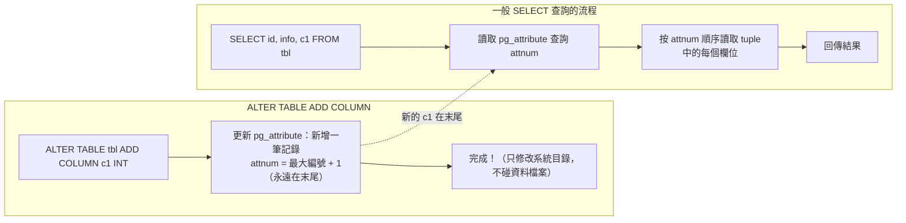

> 補充（Senior Dev）：`pg_attribute.attnum` 是 int16，欄位一旦被 DROP（變為 `attisdropped = t`），其 `attnum` **不會被回收復用**。長期頻繁 ADD/DROP column 的表會因為 `attnum` 耗盡（上限 1600）而需要 `VACUUM FULL` 或重建表。

---

## 2. Simple View 虛擬修改：外觀順序 vs 物理順序

### 新手入門：什麼是 View？

**View（視圖）** 可以理解為「儲存好的查詢語句」——它本身不存資料，只是一個 SQL 查詢的別名。當你 `SELECT * FROM view_name`，PostgreSQL 會自動把這個查詢轉換成 View 定義內的 SQL，然後去真正的表取資料。

PostgreSQL 的 **Simple View** 更特別：如果一個 View 只包含單表的直出查詢（無 JOIN、無 GROUP BY、無 DISTINCT），PostgreSQL 會給這個 View **自動生成 INSERT/UPDATE/DELETE 規則**。這意味你可以像操作真實表一樣對 View 做增刪改操作——PostgreSQL 會自動把操作轉發到底層的表。

當你想改變欄位的"邏輯顯示順序"而不想重建整個表時，Simple View 就是一個輕量的解決方案。

### I. 實作

```sql
CREATE TABLE tbl (id INT, info TEXT, crt_time TIMESTAMP);
ALTER TABLE tbl ADD COLUMN c1 INT;

-- 用 View 重排欄位：c1 被「放到」crt_time 之前
CREATE VIEW v_tbl AS
  SELECT id, info, c1, crt_time FROM tbl;
```

```sql
INSERT INTO v_tbl VALUES (1, 'test', 2, now());

SELECT * FROM v_tbl;
--  id | info | c1 |          crt_time
-- ----+------+----+----------------------------
--   1 | test |  2 | 2016-02-29 14:07:19.171928

SELECT * FROM tbl;
--  id | info |          crt_time          | c1
-- ----+------+----------------------------+----
--   1 | test | 2016-02-29 14:07:19.171928 |  2
```

View 中的 `c1` 在 `crt_time` 之前；基表中 `c1` 仍在末尾。`pg_attribute` 物理順序不變。

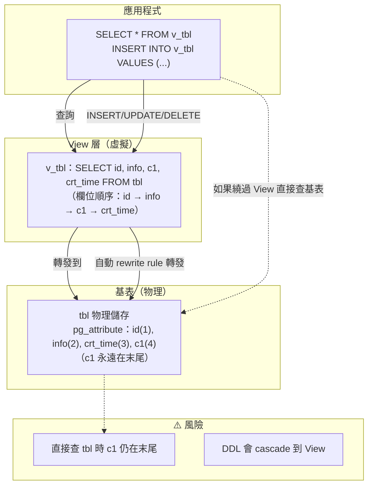

### II. 優點

- 滿足應用層欄位邏輯排列需求，不需改動 SQL
- 避免昂貴的表重寫（`ALTER TABLE ... ALTER COLUMN ... SET DATA TYPE` 或 `VACUUM FULL`），View 創建是瞬間的 metadata 操作

### III. 代價

**僅是 View，非物理真實**：任何繞過 View 直接查詢基表的操作看到的是原始末尾順序。

**DDL 傳染性**：對基表執行 DDL 會 cascade 到 View：

```sql
ALTER TABLE tbl DROP COLUMN info;
-- ERROR: cannot drop table tbl column info because other objects depend on it
-- DETAIL: view v_tbl depends on table tbl column info
```

必須 `DROP ... CASCADE` 後重建 View：

```sql
ALTER TABLE tbl DROP COLUMN info CASCADE;
-- NOTICE: drop cascades to view v_tbl

CREATE VIEW v_tbl AS SELECT id, c1, crt_time FROM tbl;
```

被 DROP 的欄位在 `pg_attribute` 中變為 `attisdropped = t`，`attnum` 仍佔用不釋放：

```
 attname            | attnum | attisdropped
--------------------+--------+--------------
 id                 |      1 | f
 ........pg.dropped.2........ |      2 | t   -- DROP 後仍佔位
 crt_time           |      3 | f
 c1                 |      4 | f
```

**維護成本**：每次基表結構變更都需同步更新 View 定義。德哥原話：「万不得已，也不要这么用。除非业务上不想改SQL。」

> 補充（Senior Dev）：Simple View 的自動 rewrite rule 在 PG 9.3+ 的運作原理：當 View 是 `SELECT * FROM single_table`（無 JOIN、無 DISTINCT、無 GROUP BY、無 LIMIT）時，PG 會將其標記為 auto-updatable，自動生成 INSERT/UPDATE/DELETE rule。這讓 View 行為接近真正的 table，但 rule-based rewrite 在複雜條件下可能產生非直覺行為（如 `RETURNING` clause 在不同 PG 版本的表現不一致）。若需要更可控的 DML 行為，建議用 `INSTEAD OF` trigger on View。

---

## 3. Byte Alignment：欄位順序如何影響 Row Size 與全鏈路效能

DBA 關心「欄位加在哪裡」，表面是順序問題，**深層是物理儲存效率**。

### 新手入門：什麼是 Byte Alignment（位元組對齊）？

**Byte Alignment** 是 CPU 讀取記憶體的「交通規則」。想像一條馬路劃分成固定間距的停車格：

- CPU 讀取一個 8 bytes 的 `bigint` 時，必須從「8 的倍數」的位置開始讀（如位置 0、8、16、24...）
- CPU 讀取一個 4 bytes 的 `integer` 時，必須從「4 的倍數」的位置開始讀（如位置 0、4、8、12...）

如果資料不遵守這個規則（例如把 `bigint` 放在位置 1），現代 CPU 雖然某些架構可以強行讀取（unaligned access），但代價是**比對齊讀取慢數倍**，有些架構甚至直接報錯。為了保證效能，PostgreSQL 在儲存每一行時，自動在欄位之間插入「無用的空白位元組」讓每個欄位都對齊——這些空白稱為 **padding**。

**類比**：就像整理書架時，如果你把一本超寬的精裝書（8 bytes 的 bigint）塞在兩本小冊子之間，書架必須留出大量空隙才能放穩。但如果你把最大的書放在最左邊，依序往右放小書，空隙就很少。

### I. 數據頁（Page）是 I/O 的最小單位

PostgreSQL 讀寫數據以 **8KB page** 為最小單位，不是以 row 為單位。查詢一行，會把包含該行的整個 8KB page 從 disk 讀入 shared_buffers（PostgreSQL 的記憶體快取區）。

**類比**：這就像在圖書館找一本書——你不能只拿書中的一頁，你必須把整本書（page）從書架拿下來。

**Row Width ↑ → Rows per Page ↓ → I/O ↑ → Memory Cache Efficiency ↓**

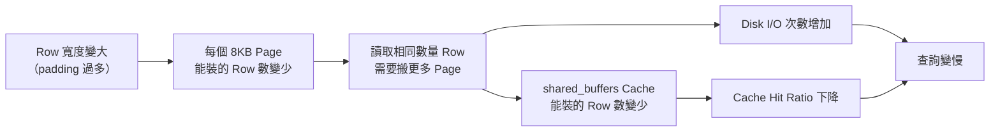

### II. 為什麼 Row Width 受 Column Order 影響？

CPU 存取不同 data type 需要**記憶體對齊（Byte Alignment）**：

| Type | Size | Alignment |
|------|------|-----------|
| `bigint` / `timestamp` / `timestamptz` / `double precision` | 8 bytes | 8-byte boundary |
| `integer` / `real` / `date` | 4 bytes | 4-byte boundary |
| `smallint` | 2 bytes | 2-byte boundary |
| `boolean` / `char` / `"char"` | 1 byte | 1-byte boundary |

如果一個 8-byte 對齊的 column 前面的 column 總長度不是 8 的倍數，PG 會在**中間插入無用的 padding byte** 來對齊。

### III. 具體例子

假設四個 column：`c1 bool` (1B), `c2 bigint` (8B), `c3 bool` (1B), `c4 int` (4B)

**差順序：`bool → bigint → bool → int`**（小→大→小→中）

```
Offset 0:  [c1: 1B]
Offset 1:  [PADDING: 7B]  ← 強制對齊，讓 c2 從 8 的倍數開始
Offset 8:  [c2: 8B]
Offset 16: [c3: 1B]
Offset 17: [PADDING: 3B]  ← 強制對齊，讓 c4 從 4 的倍數 (20) 開始
Offset 20: [c4: 4B]
Offset 24: [PADDING: 0-4B] ← row header alignment (MAXALIGN)
```
**Row Size = 1 + 7 + 8 + 1 + 3 + 4 + alignment ≈ 24~28 bytes，padding 佔 41%**

**好順序：`bigint → int → bool → bool`**（大→中→小→小）

```
Offset 0:  [c2: 8B]   ← 本身就是 8 的倍數
Offset 8:  [c4: 4B]   ← 8 是 4 的倍數
Offset 12: [c1: 1B]
Offset 13: [c3: 1B]
Offset 14: [PADDING: 2B] ← 僅 tail alignment
Offset 16: row end
```
**Row Size = 8 + 4 + 1 + 1 + 2 ≈ 16 bytes，padding 僅佔 12.5%**

```mermaid
block-beta
    columns 16
    block:bad
        columns 16
        c1["c1\nbool\n1B"]:1
        padding1["PAD\n7B"]:7
        c2["c2\nbigint\n8B"]:8
    end
    block:good
        columns 16
        c2g["c2\nbigint\n8B"]:8
        c4g["c4\nint\n4B"]:4
        c1g["c1\nbool"]:1
        c3g["c3\nbool"]:1
        padg["PAD\n2B"]:2
    end

    bad caption: "差順序：24 bytes（41% 浪費）"
    good caption: "好順序：16 bytes（12.5% 浪費）"
```

**同樣的資料，僅欄位順序不同 → 每 row 從 24 bytes 降至 16 bytes，一個 8KB page 多裝 ~50% 的 row。**

### IV. 效能鏈式反應

這個差異不是單一環節的，而是**全鏈路**：

| 環節 | 影響 |
|------|------|
| **Disk I/O** | Page 固定 8KB。Row 越大，讀取相同 row 數需搬更多 page → 物理 disk read 次數增加 |
| **shared_buffers** | Cache 中能存放的 row 數減少 → cache hit ratio 下降 |
| **Page 讀入後的所有操作** | SQL 引擎需要解析 row 內每個 column 的 offset，跳過 padding byte → CPU 指令增加 |
| **Bitmap Heap Scan 的 Recheck Cond** | Lossy bitmap 把整個 page 讀入後逐 row 重新驗證條件。Row 越寬、padding 越多，逐 row 檢查的 CPU 耗費越大 |
| **Seq Scan 的 Filter** | 沒有 Recheck Cond，但仍有 Filter。同樣需要解析 row 結構、跳過 padding |
| **Index Scan** | 從 index 拿到 TID 後回 Heap 取 row 時，同樣要解析該 page 內的 target row |

> 關鍵澄清：Recheck Cond 只是 bitmap scan 這個特定場景下的二次驗證。但 byte alignment 帶來的效能損耗**不只發生在 Recheck Cond**。任何需要讀取、解析、過濾 row 的操作（Filter、JOIN、aggregate）都會因為 row 內部 padding 過多而增加 CPU 成本。

### V. 最佳實踐：Column Order 規則

```
1. Fixed-width, high-alignment columns FIRST
   bigint(8), timestamp(8), double precision(8), integer(4), date(4), real(4)

2. Variable-width columns MIDDLE
   text, varchar, numeric, bytea, jsonb

3. Fixed-width, low-alignment columns LAST
   smallint(2), boolean(1), char(1)

4. NULL-able columns AFTER their NOT NULL counterparts of the same alignment
   (nullable columns may need extra null-bitmap handling)
```

> 補充（Senior Dev）：
>
> **怎麼驗證自己的表有 alignment waste？**
> ```sql
> -- 檢查實際 row width
> SELECT
>   relname,
>   reltuples,
>   relpages,
>   (relpages * 8192) / GREATEST(reltuples, 1) AS avg_row_bytes,
>   pg_size_pretty(pg_relation_size(oid)) AS table_size
> FROM pg_class WHERE relname = 'your_table';
> ```
> 若 `avg_row_bytes` 明顯大於「所有 column 的 data type size 總和」，說明 padding 浪費了可觀空間。
>
> **修正方案**：PG 本身不提供 `ALTER TABLE ... MODIFY COLUMN ... AFTER ...`。修正順序唯一辦法是重建表：
> ```sql
> CREATE TABLE tbl_new AS SELECT col_a, col_b, ... FROM tbl;
> -- 或使用 pg_repack / pg_squeeze 線上重建
> ```
>
> **生產中要不要刻意優化 column order？**：
> - 寬表（>20 columns）且 QPS / latency 敏感的 OLTP 表 → 值得。每 row 省 8-16 bytes，百億行級別 = 省 TB 級儲存
> - 窄表或分析型（少數 column 的查詢） → 收益有限，不優先
> - 最有效的仍是只 SELECT 需要的 column（避免 `SELECT *`）、用 Covering Index 繞過 Heap access
>
> **NULL bitmap 的額外考量**：每個 tuple 有一個 NULL bitmap（每 8 個 column 用 1 byte）。如果表有 9-16 個 column（部分 nullable），NULL bitmap 本身佔 2 bytes。把 NOT NULL column 集中排列可以讓 NULL bitmap 更緊湊，但這個影響遠小於 byte alignment 的 padding。

---

## 4. 總結：DBA 問「加在哪」的三層含義

| 層級 | 問題 | PG 現實 | 方案 |
|------|------|---------|------|
| 邏輯層 | 欄位順序不好看 | ADD COLUMN 永遠在末尾，`pg_attribute` 定義順序不可移動 | Simple View 虛擬重排（短期，代價為 DDL 傳染） |
| 物理層 | 能否真的在中間插 column？ | 不能。唯一方法是 `CREATE TABLE new AS SELECT` 重建整表 | 重建表 OR 接受物理順序（讓應用層按名引用欄位而非 `SELECT *` 靠位置） |
| 效能層 | 現有順序浪費 IO/CPU？ | 差順序 → byte alignment padding → 每 row 膨脹 30-50% | 重建表按 alignment-optimal 順序排列 column |

德哥原結論：「万不得已，也不要这么用。除非业务上不想改SQL。」——對 View 方案的總結。但 DBA 問的根本不只是順序，而是**byte alignment 對全鏈路效能的影響**。

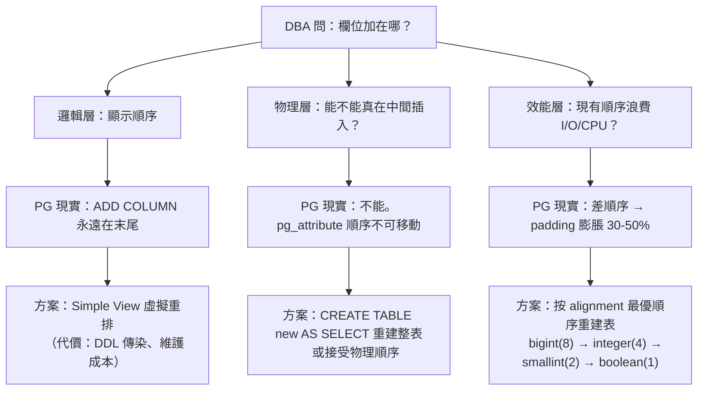

---

## 參考

1. [阿里雲 RDS PostgreSQL 最佳實踐 — 表字段順序](https://yq.aliyun.com/articles/7176)
2. [PostgreSQL Documentation — Simple View / Auto-updatable Views](https://www.postgresql.org/docs/current/sql-createview.html)
3. PostgreSQL 內部實作：tuple 對齊規則由原始碼中的 `MAXALIGN`、`att_align` 巨集定義（位於 src/include/access/tupmacs.h），負責在 tuple 內部為每個欄位計算對齊補齊

---

# 二、PostgreSQL Bit 位運算的標籤系統查詢效能

> 來源：[digoal - PostgreSQL 标签系统 bit 位运算 查询性能 (2016-05-15)](https://github.com/digoal/blog/blob/master/201605/20160515_01.md)

---

## 1. 背景：標籤系統與 Bit 運算

### 新手入門：什麼是標籤系統？

**標籤系統**廣泛應用於廣告定向、推薦引擎、用戶畫像等場景。想像一個電商平台有 200 個用戶屬性（標籤）：

| 標籤 ID | 含義 | 用戶 A | 用戶 B |
|---------|------|--------|--------|
| 1 | 男性 | 1（是） | 0（否） |
| 2 | 女性 | 0 | 1 |
| 3 | 喜歡運動 | 1 | 1 |
| 4 | 喜歡電玩 | 0 | 1 |
| ... | ... | ... | ... |
| 200 | VIP 會員 | 1 | 0 |

每個用戶對每個標籤就是一個 **0 或 1**。如果要找出「喜歡運動 AND 是 VIP 但不喜歡電玩的男性用戶」，用傳統表格需要寫複雜的 JOIN 條件。用「位元運算」（bitwise operations）可以把所有標籤壓縮成一個數字，用 AND / OR 等位元指令一次比較全部標籤，理論上非常高效。

### 什麼是 Bit 位元運算？

位元運算是 CPU 最基本的運算單元。在 C 語言中：
- `&`（bitwise AND）：兩個位元都為 1 才回 1
- `|`（bitwise OR）：任一位元為 1 就回 1
- `~`（bitwise NOT）：反轉每個位元

PostgreSQL 的 `bit(N)` 型別將用戶的標籤壓縮為一個固定長度（N 位元）的字串。例如 `bit(4)` 可儲存 `B'1010'`，表示標籤 1=是、標籤 2=否、標籤 3=是、標籤 4=否。

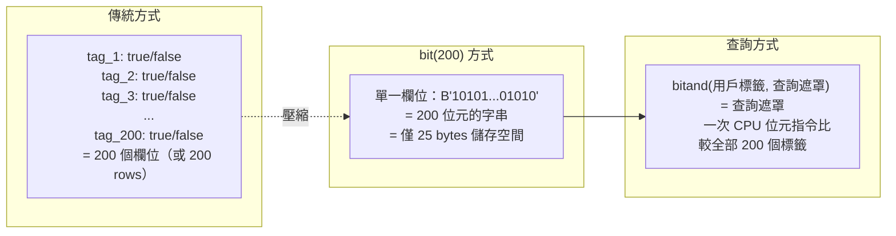

在標籤系統（如廣告定向、推薦系統、用戶畫像）中，常見場景：

- 系統有 N 個標籤（如 200 個屬性）
- 每個用戶對每個標籤為 0（不符）或 1（符合）
- 需要透過位運算快速圈定特定人群（如 `tag_3 = 1 AND tag_7 = 1 AND tag_42 = 0`）

將所有標籤壓縮為一個 `bit(N)` column，查詢時用 `bitand()` 做位元過濾，理論上非常高效——但 PG 的實現到底效能如何？

---

## 2. 實測：5000 萬用戶、200 個標籤

### 新手入門：理解測試場景

在評估一個技術方案的效能時，我們需要做「基準測試」（benchmark）——用接近真實的資料量和查詢模式來測量執行時間。這裡用 5000 萬行（每個用戶一行）、每個用戶 200 個標籤（`bit(200)` 型別）來測試。

### I. PG 9.5（單線程）

```sql
CREATE TABLE t_bit2 (id bit(200));

INSERT INTO t_bit2
SELECT B'1010101010101010101010101010101010101010101010101010101010101
0101010101010101010101010101010101010101010101010101010101010101010101
01010101010101010101010101010101010101010101010101010101010'
FROM generate_series(1, 50000000);
-- INSERT 0 50000000
-- Time: 47203.497 ms (47s)
```

Table size：

```
postgres=# \dt+ t_bit2
                     List of relations
 Schema |  Name  | Type  |  Owner   |  Size   | Description
--------+--------+-------+----------+---------+-------------
 public | t_bit2 | table | postgres | 2873 MB |
(1 row)
```

5000 萬行、200-bit 的 table 約 **2.8 GB**。每 row 佔約 60 bytes（200 bits = 25 bytes + tuple header + MVCC overhead）。

```
SELECT count(*) FROM t_bit2
WHERE bitand(id, '101010101010101010101010101010101010101010101010101010
1010101010101010101010101010101010101010101010101010101010101010101010
10101010101010101010101010101010101010101010101010101010101010101010')
  = B'10101010101010101010101010101010101010101010101010101010101010101
0101010101010101010101010101010101010101010101010101010101010101010101
01010101010101010101010101010101010101010101010101010101010';

--  count
-- ----------
--  50000000
-- (1 row)
-- Time: 14216.286 ms (14.2s)
```

**結論**：5000 萬行的 `bitand()` 條件走 **Parallel Seq Scan 不可用**（PG 9.5 無 parallel query），耗時 14.2 秒。`bit` 類型上無法建 BTREE index 來加速 `bitand()` 過濾（BTREE 只支援等值與範圍，不支援 bitwise 運算），因此只能全表掃描。

### 新手入門：為什麼不能走 Index？

B-tree 索引的工作原理類似字典的目錄——它依賴「大小比較」（>、<、=）來快速定位資料頁。但 `bitand()` 是一個**函數運算**：它對每一行執行「位元 AND 運算」後再比對結果。這就像你要在字典中找所有「第一個字母是母音 AND 最後一個字母是子音」的單字——你無法靠目錄直接定位，只能一個字一個字檢查（全表掃描）。

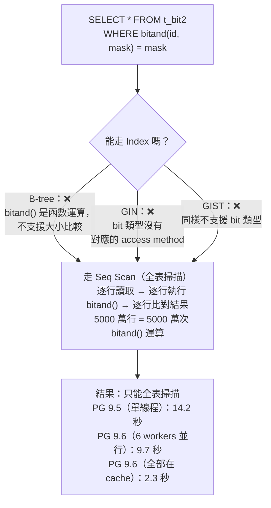

### II. PG 9.6（Parallel Query）

**新手入門：什麼是 Parallel Query（並行查詢）？**

傳統上，一個 SQL 查詢由一個 PostgreSQL process 執行——就像一個工人獨自處理 5000 萬行資料。從 PG 9.6 開始，PostgreSQL 可以啟動多個 **worker process**，將表格「切段」分配給不同 worker 同時掃描——多個工人同時處理，加快速度。

Worker 的數量由 `max_parallel_workers_per_gather` 設定控制（本例設為 6），每個 worker 掃描約 1/6 的資料量。

```sql
CREATE TABLE t_bit2 (id bit(200));
INSERT INTO t_bit2 SELECT ... FROM generate_series(1, 50000000);
-- Time: 51485.962 ms (51s)
```

```sql
EXPLAIN (ANALYZE, VERBOSE, TIMING, COSTS, BUFFERS)
SELECT count(*) FROM t_bit2
WHERE bitand(id, '101010...01010')
    = B'101010...01010';
```

完整 EXPLAIN 輸出：

```
 Finalize Aggregate  (cost=471554.70..471554.71 rows=1 width=8)
                     (actual time=9667.464..9667.465 rows=1 loops=1)
   Output: count(*)
   Buffers: shared hit=368140 dirtied=145199
   ->  Gather  (cost=471554.07..471554.68 rows=6 width=8)
               (actual time=9667.433..9667.454 rows=7 loops=1)
         Output: (PARTIAL count(*))
         Workers Planned: 6
         Workers Launched: 6
         Buffers: shared hit=368140 dirtied=145199
         ->  Partial Aggregate  (cost=470554.07..470554.08 rows=1 width=8)
                                (actual time=9663.423..9663.424 rows=1 loops=7)
               Output: PARTIAL count(*)
               Buffers: shared hit=367648 dirtied=145199
               Worker 0: actual time=9662.545..9662.546 rows=1 loops=1
                 Buffers: shared hit=49944 dirtied=19645
               Worker 1: actual time=9661.922..9661.922 rows=1 loops=1
                 Buffers: shared hit=49405 dirtied=19198
               Worker 2: actual time=9662.924..9662.925 rows=1 loops=1
                 Buffers: shared hit=49968 dirtied=19641
               Worker 3: actual time=9662.483..9662.484 rows=1 loops=1
                 Buffers: shared hit=49301 dirtied=19403
               Worker 4: actual time=9663.341..9663.342 rows=1 loops=1
                 Buffers: shared hit=49825 dirtied=19814
               Worker 5: actual time=9663.605..9663.605 rows=1 loops=1
                 Buffers: shared hit=49791 dirtied=19586
               ->  Parallel Seq Scan on public.t_bit2
                     (cost=0.00..470468.39 rows=34274 width=0)
                     (actual time=0.039..5724.642 rows=7142857 loops=7)
                     Output: id
                     Filter: (bitand(t_bit2.id, B'...') = B'...')
                     Buffers: shared hit=367648 dirtied=145199
 Planning time: 0.100 ms
 Execution time: 9772.925 ms
```

| 版本 | 策略 | Execution Time | 備註 |
|------|------|---------------|------|
| PG 9.5 | Seq Scan | **14,216 ms** | 單線程 |
| PG 9.6 | Parallel Seq Scan（6 workers） | **9,773 ms** | Shared hit（all in buffer） |
| PG 9.6（第二次） | Parallel Seq Scan（cached） | **2,327 ms** | Fully cached in shared_buffers |

6 個 parallel worker 將 scan 從 14.2s 降到 9.7s（~1.5x，受 CPU bound 限制）。第二次查詢因 data 已在 `shared_buffers` 中，降到 2.3s（~6x）。

**為什麼 6 個 worker 只有 ~1.5x 加速？**

理論上 6 個 worker 應該接近 6x 加速。但瓶頸不在資料讀取（data 已在 shared_buffers），而是 **CPU 運算**：每個 worker 仍需對自己負責的 700 萬行逐行執行 `bitand()` 函數運算。6 個 worker 共享 CPU，實際加速受 CPU 核心數限制。

---

## 3. 核心瓶頸分析

| 層級 | 瓶頸 | 說明 |
|------|------|------|
| 執行策略 | **無法用 Index** | `bitand()` 是函數運算，BTREE 不支援。GIN 也不直接支援 `bit` 類型。只能 Seq Scan |
| I/O | 2.8 GB 全表讀取 | 即使 parallel，仍需讀完整張表 |
| CPU | `bitand()` 每 row 計算 | 5000 萬次 bitwise AND + 比對，CPU bound |
| 儲存 | `bit(200)` 每 row 25 bytes | 比 `boolean[200]`（200 bytes）或 `int[]`（~8 bytes/tag）更緊湊，但無法再優化 filtered scan |

> 補充（Senior Dev）：PG 的 `bit` 類型設計初衷是儲存固定長度 bit string（如 IPv6、MAC 的前綴比對），並非為「大量標籤的高選擇性過濾」場景設計。這個場景的命題本質是 **bitmap index scan on 5000 萬行**，但 PG 的 native `bit` 類型沒有對應的 access method。

---

## 4. 替代方案比較

> 補充（Senior Dev）：原文只測試了 native `bit` 類型。在不同場景下，以下替代方案可以提供 index 加速：

### 新手入門：什麼是 Index 的「Access Method」？

Index 不是萬能的魔法。PostgreSQL 的 Index 系統採用「插件式架構」——每種 Index 類型（B-tree、GIN、GiST、BRIN 等）都有自己支援的資料型別和查詢操作：

- **B-tree**：只支援 `=`、`<`、`>`、`BETWEEN` 等比較操作。不能用來加速 `bitand()` 位元運算。
- **GIN（Generalized Inverted Index）**：適合「一個值對應多行」的場景（如陣列、全文搜尋）。可以用來加速 `int[]` 陣列的「包含查詢」。
- **GiST（Generalized Search Tree）**：比 GIN 更靈活，支援更多的自訂運算子。

| 方案 | 儲存格式 | 查詢方式 | Index 支援 | 適用場景 |
|------|---------|---------|-----------|---------|
| `bit(N)` + Seq Scan | 25 bytes/row | `bitand(col, mask) = mask` | 無 | 全量 scan（如每日批次） |
| `boolean[]` + GIN | ~200 bytes/row | `col[3] = true AND col[7] = true` | GIN on array | 少量標籤過濾、高選擇性 |
| `int[]` + `intarray` extension | ~8 bytes/tag | `col @> ARRAY[3,7]` | GiST / GIN | 標籤稀疏（每用戶只有少數標籤為 1） |
| `int[]` + `intarray` with `rdtree` | ~8 bytes/tag | `col @@ '3&7&!42'` | GiST (RD-Tree) | 複雜 boolean 邏輯（AND/OR/NOT） |
| `roaringbitmap` extension | compressed bitmap | `rb_contains(col, ARRAY[3,7])` | 自帶 compressed index | 超大標籤數（1000+） |
| `jsonb` + GIN | ~flexible | `col @> '{"tag3": true, "tag7": true}'` | GIN | 標籤結構動態變化 |
| **Partition by hash(tag)** + Seq Scan | split data | WHERE + partition pruning | 無（靠 partition pruning 替代） | PG 10+ declarative partitioning |

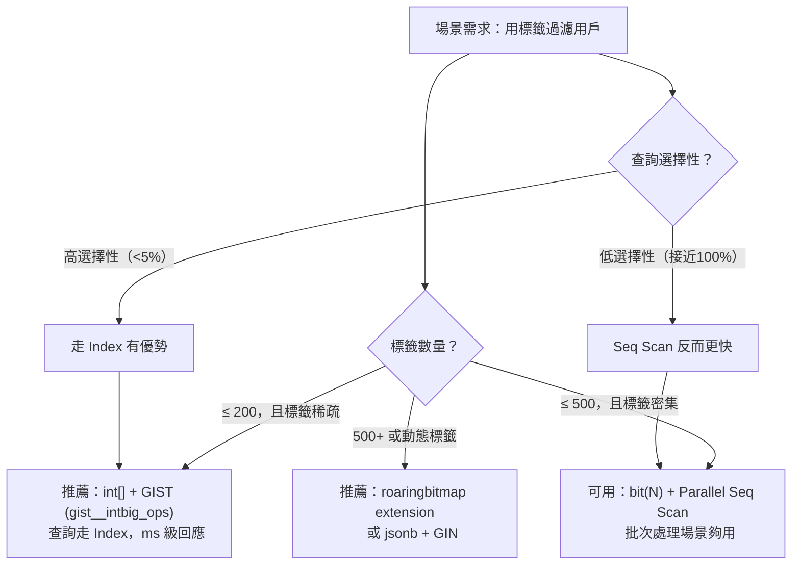

### I. `intarray` + GiST RD-Tree 範例（推薦方案，PG 原生）

```sql
CREATE EXTENSION intarray;

CREATE TABLE user_tags (
    user_id int PRIMARY KEY,
    tags int[]  -- e.g., [3, 7, 15, 42]
);

-- RD-Tree index 支援 boolean query syntax
CREATE INDEX idx_user_tags ON user_tags USING GIST (tags gist__intbig_ops);

-- 查詢：擁有 tag 3 AND 7，但不擁有 tag 42 的用戶
SELECT user_id FROM user_tags
WHERE tags @@ '3 & 7 & !42'::query_int;
```

`gist__intbig_ops` 支援高基數場景（每個 tag value 可達 `int` 範圍），查詢時走 Index Scan 而非 Seq Scan。

> 補充（Senior Dev）：PG 10+ 新增 `gist__int_ops` 與 `gist__intbig_ops` 的效能改進。`gist__intbig_ops` 使用 larger signature（2016 bytes vs 128 bytes），在高 tag 數量時 false positive 更低。

### II. `roaringbitmap` extension 範例（超大規模場景）

```sql
CREATE EXTENSION roaringbitmap;

CREATE TABLE user_tags (
    user_id int PRIMARY KEY,
    tags roaringbitmap
);

-- 內建 compressed index，查詢：
SELECT user_id FROM user_tags WHERE rb_contains(tags, ARRAY[3, 7]);
```

Roaring Bitmap 使用三層壓縮（array / bitmap / run-length），在稀疏 + 大範圍 tag ID（如廣告 campaign ID 可達百萬級）時空間與查詢效率遠優於 native `bit(N)`。

---

## 5. 版本演進與現代建議

| PG 版本 | 相關改進 |
|---------|---------|
| PG 9.6 | Parallel Seq Scan（原文已測試，6 workers → 1.5x） |
| PG 10+ | Declarative Partitioning（可按 `user_id` hash partition 來加速 parallel scan） |
| PG 10+ | `intarray` 的 `gist__intbig_ops` 優化 |
| PG 11+ | Parallel Bitmap Heap Scan（若改用 `int[]` + GIN 可受惠） |
| PG 13+ | Parallel scan 效率進一步提升 |
| PG 14+ | `roaringbitmap` extension 更新、更好的 SIMD 指令利用 |
| PG 16+ | Parallel query 的 leader process 也可以參與 scan（不再閒置） |

> 補充（Senior Dev）：生產環境建議分三種場景處理標籤系統：
>
> 1. **標籤稀疏（每用戶只 5-50 個標籤）、總標籤數 200-500**：`int[]` + `GIST (gist__intbig_ops)`，查詢走 index，ms 級
> 2. **標籤密集（每用戶 80%+ 標籤為 1）、總標籤數 100-500**：`bit(N)` + Parallel Seq Scan，batch 場景夠用
> 3. **超大規模（標籤數 500+ 或動態標籤）**：`roaringbitmap` extension 或 PG 14+ 的 `jsonb` + GIN
>
> 關鍵判斷：若 `(SELECT count(*) FROM table WHERE tag_X = 1) / total_rows` < 5%（選擇性高），走 index 有優勢；若接近 100%（選擇性低），Seq Scan 反而更快。原文範例中所有 row 都滿足條件（選擇性 100%），本身就是極端例子——Seq Scan 是唯一正確的 plan。

---

## 參考

1. PostgreSQL 內部實作：`bit` / `varbit` 類型和 `bitand()` 位元運算函數的實作位於資料型別處理模組中（src/backend/utils/adt/varbit.c）
2. `intarray` extension（位於 contrib/intarray/）：提供 `int[]` 的 GiST/GIN index 與 boolean query parser，支援 `@@` 運算子進行複雜標籤過濾
3. [RoaringBitmap PG Extension](https://github.com/ChenHuajun/pg_roaringbitmap)
4. [PG 9.6 Parallel Query 官方文檔](https://www.postgresql.org/docs/9.6/parallel-query.html)
5. GIN index 的內部實作：PostgreSQL 的 GIN（Generalized Inverted Index）採用倒排索引結構，適合陣列和全文搜尋場景（src/backend/access/gin/）

> [PG 版本註] 原文基於 PG 9.5 / 9.6（2016）。核心發現（`bit` 類型無法走 index 加速 `bitand()`）在最新版本（PG 17+）仍不變。`bit` 類型的 access method 設計未改變。標籤系統的最佳實踐已從原生 `bit` 遷移到 `int[]` + GIST or `roaringbitmap`。

---

# 三、Linux Page Fault 對 PostgreSQL 的性能影響

> 來源：[digoal - page fault带来的性能问题 (2016-07-25)](https://github.com/digoal/blog/blob/master/201607/20160725_06.md)
>
> 更新於 2026-05-17，補充 huge_pages、NUMA、THP 與現代 Kernel 演進

---

## 1. 記憶體定址基礎

### 新手入門：為什麼需要「虛擬記憶體」？

在理解 Page Fault 之前，你需要先理解一個根本設計決定：**為什麼程式不直接使用電腦的實體記憶體地址？**

想像一個場景：

- 你的電腦有 32GB 實體記憶體（RAM）
- PostgreSQL 設定使用 24GB 的 `shared_buffers`（共享記憶體快取）
- 同時有 50 個連線（每個 PostgreSQL worker process 需要自己的 work memory）
- 還有作業系統本身、你的瀏覽器、編輯器在執行

**問題**：每個程序怎麼知道哪些 RAM 區塊是「自己的」？如果所有程序都直接讀寫實體記憶體地址，會發生什麼？

答案是：**會是一場災難**。程序 A 可能會不小心覆蓋程序 B 的資料。記憶體碎片化後，一個需要 4GB 連續記憶體的程序可能找不到足夠大的連續空間，即使總空閒記憶體遠大於 4GB。

### 虛擬記憶體的解決方案

**虛擬記憶體（Virtual Memory）** 在實體記憶體上面加了一層「翻譯層」：

1. 每個程序看到的是自己的**虛擬地址空間**（virtual address space）——一個假想的、從 0 開始的、獨立且連續的地址範圍
2. 作業系統負責把虛擬地址翻譯成實體地址
3. 硬體組件 **MMU（Memory Management Unit，記憶體管理單元）** 負責做這件事情

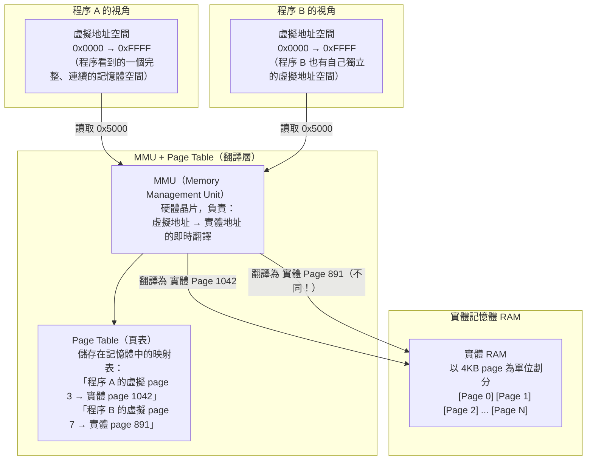

### 頁（Page）與頁表（Page Table）

記憶體以 **page（頁）** 為單位管理，而不是以位元組為單位。這就像地圖上的「街區」而非「門牌號」：

- **頁（Page）**：通常是 4KB（4096 bytes）的固定大小區塊。是虛擬記憶體管理的最小單位。
- **頁表（Page Table）**：作業系統維護的映射表，記錄「哪個程序的哪個虛擬 page 對應到哪個實體 page」。每個程序有自己的頁表。
- **MMU**：CPU 內部（或旁邊）的硬體，在每次記憶體存取時即時查閱頁表進行翻譯。MMU 使用 **TLB（Translation Lookaside Buffer，轉譯後備緩衝區）** 快取最近的翻譯結果以加快速度。

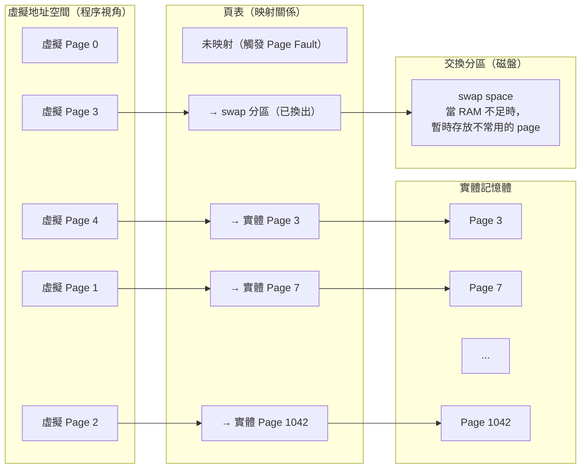

### I. MMU（Memory Management Unit）

Linux 程序不直接存取物理記憶體，而是透過 MMU 管理虛擬地址 → 物理地址的映射。每個程序有獨立的虛擬地址空間。MMU 將物理記憶體分割成 page（通常是 4KB），管理兩者之間的映射關係。

因為是映射，同一虛擬 page 在不同時間點可能出現在物理記憶體中的不同位置（發生 page swap 時）。這種間接層讓 OS 可以：

- 給每個程序獨立的地址空間（隔離、安全）
- 實作 swap（物理記憶體不足時將 page 暫存磁盤）
- 實作 shared memory（多程序共享同一物理 page）

### II. 為什麼需要虛擬地址？

假設程序需要 4MB，但物理記憶體只有 1MB。若直接使用物理地址，程序無法啟動。虛擬地址讓 OS 只需將當前 work set 保留在物理記憶體中，其他 page 可暫時不在物理記憶體。

---

## 2. Page Fault 類型

### 新手入門：什麼是 Page Fault？

當程序存取一個虛擬地址，而該地址對應的 page **不在實體記憶體中**時，CPU 無法完成這次記憶體存取。此時 CPU 觸發一個**中斷（interrupt）**，暫停當前程序的執行，將控制權交給作業系統的 page fault handler（頁錯誤處理程式）。作業系統決定如何處理後，再恢復程序的執行。

**Page Fault 不是錯誤**——它是虛擬記憶體機制的正常運作方式。問題在於 **Page Fault 的頻率和類型**：

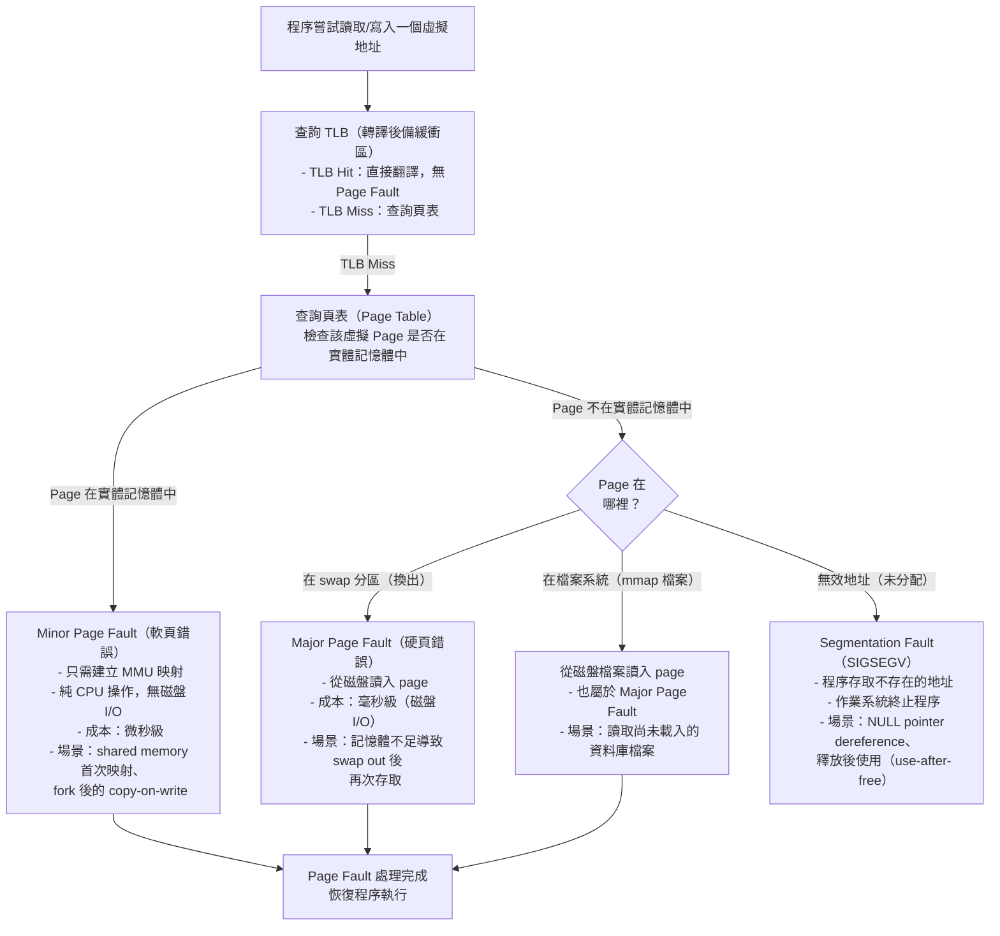

| 類型 | 別名 | 觸發條件 | 處理方式 | 延遲量級 |
|------|------|---------|---------|---------|
| **Minor (Soft)** | Soft Page Fault | page 在物理記憶體中，但程序尚未建立映射 | 只需 MMU 建立映射關係（純 CPU，無 I/O） | ~1-10 微秒 |
| **Major (Hard)** | Hard Page Fault | page 既不在虛擬地址空間，也不在物理記憶體 | 從慢速設備（磁盤/swap）讀入，建立映射 | ~1-10 毫秒（1000x 以上） |
| **Invalid** | Segmentation Fault | 訪問的地址超出程序虛擬地址空間範圍 | `SIGSEGV`，程序 crash | N/A（程序終止） |

常見 Minor Page Fault 場景：多程序訪問同一塊 shared memory（如 PostgreSQL `shared_buffers`），新 fork 的 worker process 尚未建立與該物理 page 的映射。

常見 Major Page Fault 場景：data page 被 swap out 後程序再次訪問（→ 從 swap 讀回物理記憶體）。

---

## 3. Working Set & Swap & OOM

### I. Working Set（工作集）

**Working Set** 是程序當前在物理記憶體中的 page 集合——也就是程序「正在使用的記憶體」。隨系統運行可擴大或縮小：

- **擴大**：程序訪問更多記憶體（例如 PostgreSQL 開始掃描一個大表）
- **縮小**：其他程序需要記憶體且物理記憶體不足 → OS 將 clean page 標記為 free，dirty page swap 到交換分區

Shrink 遵循 LRU（內核 memory aging）演算法——最久沒被使用的 page 優先被回收。

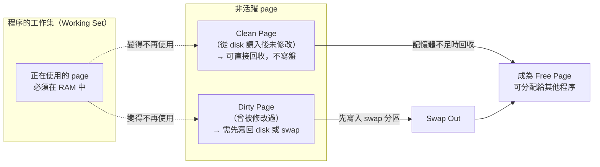

### II. Swap

Clean page（讀入後未修改）直接 free，不寫盤。
Dirty page（修改過）需寫回 disk 或 swap 到交換分區。

```bash
# 查看 swap 使用
sar -S 1
```

### III. 何時需要加 RAM

若 `sar -B` 顯示頻繁 swap in/out（`pgpgin/s` / `pgpgout/s` 持續高 → dirty page 被 swap out，緊接又被程序訪問 → hard page fault），即物理記憶體真的不夠用。

### IV. OOM（Out of Memory）

當所有 page 已 free、所有可 swap 的已 swap out，仍無法滿足記憶體需求時 → Linux OOM Killer 挑選並 kill 程序。

---

## 4. Linux Page 統計指標（sar -B）

| 指標 | 說明 |
|------|------|
| `pgpgin/s` | 每秒從 disk paged in 的 KB |
| `pgpgout/s` | 每秒 paged out 到 disk 的 KB |
| `fault/s` | 每秒 page fault 次數（major + minor） |
| `majflt/s` | 每秒 major fault（需要 disk I/O） |
| `pgfree/s` | 每秒放到 free list 的 page 數 |
| `pgscank/s` | kswapd daemon 每秒掃描的 page 數 |
| `pgscand/s` | 程序直接觸發掃描的 page 數 |
| `pgsteal/s` | 每秒從 cache 回收的 page 數 |
| `%vmeff` | `pgsteal / pgscan` — page reclaim 效率（接近 100% = 良好，<30% = VM 壓力大） |

---

## 5. PostgreSQL 案例：大 shared_buffers 的啟動低潮

### 新手入門：什麼是 shared_buffers？

PostgreSQL 不像某些資料庫依賴作業系統的檔案快取，而是維護自己的記憶體快取區——**shared_buffers**。當 PostgreSQL 需要讀取一個資料頁：

1. 先檢查 shared_buffers 中是否已有
2. 若有（cache hit）→ 直接使用，無磁盤 I/O
3. 若無（cache miss）→ 從磁盤讀入 shared_buffers

`shared_buffers` 通常設定為實體記憶體的 25-40%。所有 worker process 共享這塊記憶體。

### I. 現象：為什麼大 shared_buffers 啟動時會慢？

PostgreSQL `shared_buffers` 設定極大時（如 240GB），剛啟動的高並發 COPY 壓測會有一段性能低谷。

**原因解析**：

1. PostgreSQL 啟動時向作業系統請求一大塊共享記憶體（240GB）
2. 作業系統「**答應**」了這個請求，標記說「這塊虛擬地址空間歸 PostgreSQL」，但**尚未分配實體 page**
3. 這是 Linux 的 **lazy allocation（延遲分配）** 策略——「承諾」不等於「兌現」。只有在程序真正寫入時，Linux 才分配實體 page
4. 當 COPY 命令開始寫入資料到 shared_buffers，大量首次寫入觸發 **Minor Page Fault** 風暴：
   - 每次寫入一個新的虛擬 page，OS 需要為其分配實體 page、更新頁表
   - 這個過程純 CPU 操作（無磁盤 I/O），但頻率極高——每秒數萬次

5. 當 shared_buffers 的所有虛擬 page 都完成了首次映射（page fault 處理完成），之後的寫入不再觸發 page fault——性能恢復

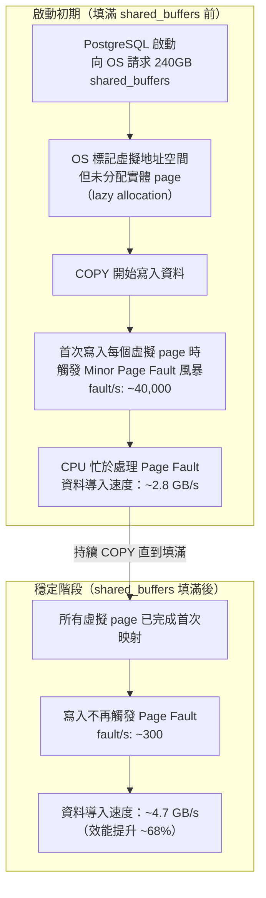

### II. 實測數據

**shared_buffers 填滿前（~2.8 GB/s import）：**

```
fault/s: 40058, majflt/s: 0.00    ← 大量 minor fault
%vmeff: 99.95
pgfree/s: 142064                  ← 大量 page 分配
import speed: 2.8 GB/s
```

**shared_buffers 填滿後（~4.7 GB/s import）：**

```
fault/s: 823 → 743 → 326           ← minor fault 驟降
import speed: 4.7 GB/s             ← 性能提升 ~68%
```

`majflt/s` 始終為 0（因為 shared_buffers 的 page 是 anonymous page，不涉及 disk I/O），瓶頸是 minor fault 的 interrupt 開銷。

---

## 6. 現代化解方

### I. huge_pages（PG 9.4+）

**新手入門：為什麼 Huge Page 能解決問題？**

還記得前面說的「頁（page）預設是 4KB」嗎？對於 240GB 的 shared_buffers：

- 4KB page：需要 **6,290 萬個 page** 需要管理和映射！
- 每個 page 都有一個頁表條目，每次 page fault 都要更新一個頁表條目
- CPU 內的 **TLB（Translation Lookaside Buffer）** 只能快取少量映射（通常幾百到一千條），大多數時候需要去記憶體中查頁表（page table walk），進一步增加延遲

**Huge Page 的思路很簡單：把 page 變大，數量就變少了。**

使用 2MB 或 1GB huge page 取代 4KB 標準 page：

```ini
# postgresql.conf
huge_pages = on          # PG 9.4+，使用 huge page（若 OS 配置了）
# huge_pages = try       # PG 14+ 預設，有則用，無則 fallback 4KB
```

| Page Size | TLB entries for 240GB | TLB Miss Reduction |
|-----------|----------------------|-------------------|
| 4KB | 62,914,560 | baseline（基準） |
| 2MB | 122,880 | 512x fewer entries（少 512 倍） |
| 1GB | 240 | 262,144x fewer entries（少 26 萬倍） |

Huge page 降低 TLB miss + page table walk overhead，等效於減少 page fault count（minor fault 時 MMU 查 page table 的成本更少）。

OS 配置（Linux）：

```bash
# 計算所需 huge page 數（以 2MB huge page 為例）
# shared_buffers(GB) * 1024 / 2  = 240 * 512 = 122,880
sysctl -w vm.nr_hugepages=122880

# 持久化
echo "vm.nr_hugepages=122880" >> /etc/sysctl.conf
```

> 補充（Senior Dev）：**Transparent Huge Pages (THP)** 與 PostgreSQL 是已知的不相容組合。THP 的 compaction 會導致 sudden latency spike，建議關閉：

```bash
echo never > /sys/kernel/mm/transparent_hugepage/enabled
echo never > /sys/kernel/mm/transparent_hugepage/defrag
```

PG 15+ 在啟動時會檢查 THP 狀態並在 log 中提示（若啟用 THP）。

### II. 預熱 shared_buffers（PG 10+）

```sql
-- PG 10+ pg_prewarm extension
CREATE EXTENSION pg_prewarm;
SELECT pg_prewarm('table_name');                    -- 預熱特定表
SELECT pg_prewarm(relation::regclass) FROM pg_class; -- 預熱全部
```

`pg_prewarm` 將 table/index page 載入 shared_buffers（或 OS page cache），避免 startup 時的 page fault 風暴。

### III. NUMA Awareness

**新手入門：什麼是 NUMA？**

在多 CPU 插槽的伺服器上，每個 CPU 有自己的「本地記憶體」。存取本地記憶體很快，但存取另一個 CPU 的「遠端記憶體」比較慢。這種架構叫做 **NUMA（Non-Uniform Memory Access，非均勻記憶體存取）**。

當 shared_buffers 很大時，如果 Linux 把所有 shared_buffers 的 page 都分配在某一個 NUMA node 的本地記憶體上，其他 CPU 存取時就會遇到遠端存取延遲。

大 shared_buffers 在 NUMA 架構上若分配不均衡，部分 CPU 訪問 remote memory node 會導致 latency 上升。

```bash
# 關閉 NUMA zone reclaim（讓 OS 在分配 page 時不過度考量 local node）
sysctl -w vm.zone_reclaim_mode=0

# postgresql.conf：強制 shared_buffers 使用 interleave 分配（分散到各 NUMA node）
# 搭配 numactl --interleave=all 啟動 PostgreSQL
```

> 補充（Senior Dev）：Linux kernel 5.x+ 對 NUMA balancing 有大幅改善。若使用 PG 16+ 搭配 kernel 5.15+，一般不需手動 interleave。監控 `numastat -p <pg_pid>` 確認各 node 分配均勻即可。

### IV. vm.overcommit 設定

```bash
# 允許 overcommit（PG 分配 shared_buffers 時為匿名 page，需 overcommit 空間）
sysctl -w vm.overcommit_memory=2
sysctl -w vm.overcommit_ratio=90    # 90% 物理記憶體為 commit limit
```

---

## 7. 版本演進

| 功能 | 版本 | 說明 |
|------|------|------|
| `huge_pages = on` | PG 9.4 | 靜態 huge page 支援 |
| `pg_prewarm` | PG 10 | 預熱 shared_buffers |
| `huge_pages = try` | PG 14 | 預設自動嘗試 huge page |
| THP 相容性提示 | PG 15 | 啟動時 log THP 狀態 |
| `vm.nr_hugepages` 動態調整 | Kernel 5.x+ | huge page 可在運行時增加 |

## 參考

- [Red Hat: Virtual Memory Details](https://access.redhat.com/documentation/en-US/Red_Hat_Enterprise_Linux/3/html/Introduction_to_System_Administration/s1-memory-virt-details.html)
- [Wikipedia: Page fault](https://en.wikipedia.org/wiki/Page_fault)
- [Wikipedia: MMU](https://en.wikipedia.org/wiki/Memory_management_unit)
- [德哥: 大 shared_buffers COPY 性能 case](https://yq.aliyun.com/articles/8528)
