# PostgreSQL Transaction 隔離級別 — 從 MVCC 到生產環境實戰

> 本文系統性解析 PostgreSQL 四種 Transaction 隔離級別的底層實現、行為差異、生產環境陷阱，以及作為 .NET Application Developer 該如何正確選擇和使用。

---

# 一、Transaction 隔離級別的底層：MVCC 與 Snapshot

## 1. Snapshot 獲取時機 —— 隔離級別的唯一定義方式

### I. 先決知識：Snapshot 結構

#### a. 白話理解：Snapshot 就是「時間定格照片」

想像一個場景——你有一個銀行帳戶，餘額 1000 元：

```text
時間線：
 10:00  你拍了一張資料庫照片（Snapshot）  ← 餘額 1000
 10:01  別人轉走 500 元，COMMIT          ← 餘額變成 500
 10:02  你再次查詢餘額
```

**Read Committed（預設）**：每次查詢都拍一張新照片 → 10:02 看到 500 元（最新已提交的狀態）
**Repeatable Read**：整個交易只用 10:00 那張照片 → 10:02 還是看到 1000 元（10:00 的定格）

Snapshot 就是那張「照片」——它記錄了「我拍照的瞬間，哪些事務已經完成、哪些還在進行中」。PostgreSQL 用這張照片來判斷每一行數據對你能不能看到。

> 對 App Dev 的類比：Snapshot 類似於 `IReadOnlyRepository<T>.GetSnapshot()` 返回的一個不可變視圖。它不是鎖——不阻止別人寫入——但保證你在交易內看到的數據是某個時間點的一致性視圖。

**為什麼需要 Snapshot？** 因為 PostgreSQL 用 MVCC（多版本並發控制）——同一行可能同時存在多個版本（舊版本、新版本、未提交的版本）。Snapshot 就是告訴 PostgreSQL：「這麼多版本中，我能看哪些，該跳過哪些」。

#### b. Snapshot 的內部結構（技術細節）

每個 Snapshot 由四個欄位組成：

```
Snapshot = {
    xmin: 42,           // 最早仍在活躍的事務 XID。所有 < 42 的事務肯定已 COMMIT 或 ABORT
    xmax: 50,           // 下一個將被分配的 XID。所有 ≥ 50 的事務尚未開始
    xip:  [44, 46, 47], // 當前活躍的事務 XID 列表（在 xmin 到 xmax 之間的進行中事務）
    curcid: 0            // 當前事務內的 command ID（用於同一事務內的多條 statement 可見性）
}
```

#### c. Tuple 的可見性判斷

PostgreSQL 的每一行（Tuple）在 header 中都有兩個隱藏欄位，記錄「這個**版本**從哪來、到哪去」：

```text
Tuple header = {
    xmin: 40,     // 這個版本的「出生證明」——哪個事務建立了它（INSERT 或 UPDATE）
    xmax: 45,     // 這個版本的「死亡證明」——哪個事務廢棄了它（DELETE 或 UPDATE）
                  //   0 = 還活著，未被廢棄
    ...
}
```

**關鍵：一個邏輯行可以有多個版本**。每次 UPDATE 不是修改原行，而是「舊版死亡 + 新版出生」：

```text
TX#100 INSERT name='Alice'  →  v1(xmin=100, xmax=0)    ← v1 活著
TX#105 UPDATE name='Bob'    →  v1(xmin=100, xmax=105)   ← v1 死了（被 UPDATE 廢棄）
                                v2(xmin=105, xmax=0)    ← v2 出生（UPDATE 產生的新版）
TX#110 DELETE               →  v2(xmin=105, xmax=110)   ← v2 也死了（被 DELETE 廢棄）
```

所以 `xmin` 不是「這行什麼時候被 INSERT 的」，而是 **「這個版本什麼時候被生出來的」** ——INSERT 會生，UPDATE 也會生。

當你的 SELECT 掃描到一個 Tuple 時，PG 會做**兩階段檢查**——先看「出生證明」（xmin），再看「死亡證明」（xmax）：

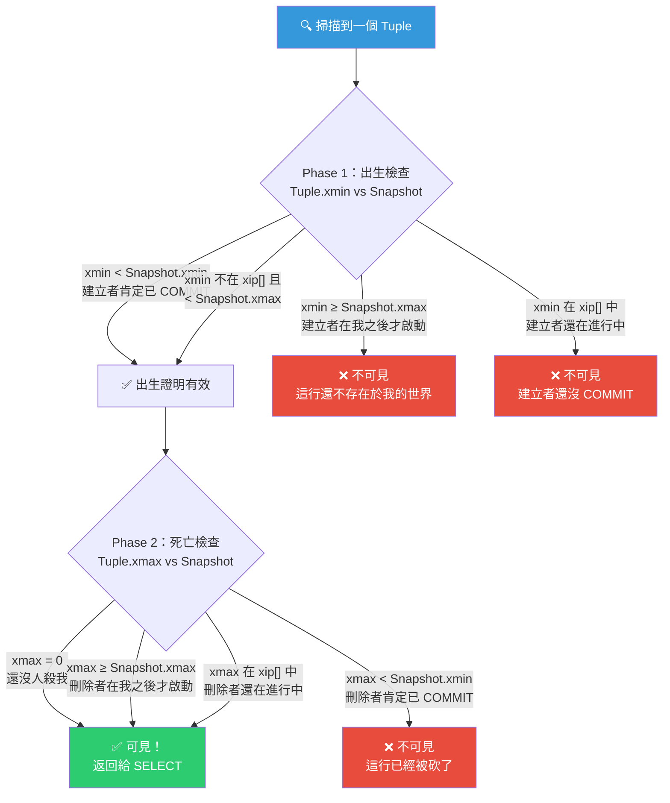
```mermaid
flowchart TD
    START["🔍 掃描到一個 Tuple"]
    START --> P1{"Phase 1：出生檢查<br/>Tuple.xmin vs Snapshot"}
    
    P1 -->|"xmin < Snapshot.xmin<br/>建立者肯定已 COMMIT"| P1_OK["✅ 出生證明有效"]
    P1 -->|"xmin ≥ Snapshot.xmax<br/>建立者在我之後才啟動"| INVIS1["❌ 不可見<br/>這行還不存在於我的世界"]
    P1 -->|"xmin 在 xip[] 中<br/>建立者還在進行中"| INVIS2["❌ 不可見<br/>建立者還沒 COMMIT"]
    P1 -->|"xmin 不在 xip[] 且<br/>< Snapshot.xmax"| P1_OK
    
    P1_OK --> P2{"Phase 2：死亡檢查<br/>Tuple.xmax vs Snapshot"}
    P2 -->|"xmax = 0<br/>還沒人殺我"| VISIBLE["✅ 可見！<br/>返回給 SELECT"]
    P2 -->|"xmax < Snapshot.xmin<br/>刪除者肯定已 COMMIT"| INVIS3["❌ 不可見<br/>這行已經被砍了"]
    P2 -->|"xmax ≥ Snapshot.xmax<br/>刪除者在我之後才啟動"| VISIBLE
    P2 -->|"xmax 在 xip[] 中<br/>刪除者還在進行中"| VISIBLE
    
    style START fill:#3498db,color:#fff
    style VISIBLE fill:#2ecc71,color:#fff
    style INVIS1 fill:#e74c3c,color:#fff
    style INVIS2 fill:#e74c3c,color:#fff
    style INVIS3 fill:#e74c3c,color:#fff
```

**Phase 1 規則**（問 xmin——這行出生了沒）：

| 條件 | 判斷 | 白話 |
|------|:---:|------|
| `Tuple.xmin < Snapshot.xmin` | ✅ | 建立者在你拍照前已結束（COMMIT 或 ABORT） |
| `Tuple.xmin ≥ Snapshot.xmax` | ❌ | 建立者在你拍照後才出生——你看不到未來 |
| `Tuple.xmin` 在 `Snapshot.xip[]` 中 | ❌ | 建立者還在跑——沒 COMMIT 的東西不能看 |
| `Tuple.xmin` 不在 `xip[]` 且 `< Snapshot.xmax` | ✅ | 建立者已結束（不在活躍名單中） |

> **什麼時候會發生 `Tuple.xmin ≥ Snapshot.xmax`？** 最常見：你的事務開始後，別人才 INSERT。
>
> ```text
> XID=100  你 BEGIN（拍照，Snapshot.xmax = 105）
> XID=106  別人 INSERT → Tuple.xmin = 106 → COMMIT
> XID=100  你 SELECT 掃到這行 → 106 ≥ 105 → 不可見
> ```
>
> 這行的建立者（XID=106）在你拍照時的「下一個號碼」（105）之後——對你來說是**未來**。Read Committed 每次 statement 重新拍照（Snapshot.xmax 前進），下次 SELECT 就看到了；Repeatable Read 從頭到尾同一張照片，xmax 定格，所以永遠看不到。

**Phase 2 規則**（問 xmax——這行死了沒，只在 Phase 1 通過後才問）：

| 條件 | 判斷 | 白話 |
|------|:---:|------|
| `Tuple.xmax = 0` | ✅ | 沒人殺過我——活著 |
| `Tuple.xmax < Snapshot.xmin` | ❌ | 刪除者在你拍照前已結束——這行確定死了 |
| 其他（xmax ≥ Snapshot.xmax 或在 xip[] 中） | ✅ | 刪除者未提交或在你之後——**當作還活著** |

> **為什麼第一條規則用 xmin 而不是 xmax？** 因為你得先確定這行「存在過」，才有資格問它「是不是被刪了」。Tuple.xmin 是出生證明，Tuple.xmax 是死亡證明——兩張都要看，但有先後順序。

以下 Mermaid 從 Tuple 和 Snapshot 結構層面重述同一個邏輯：

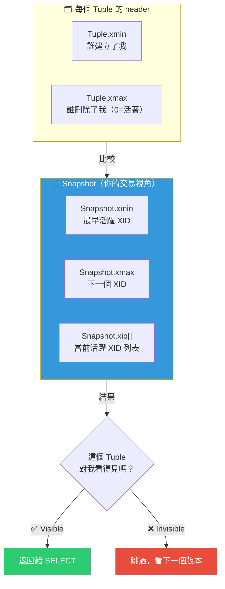
```mermaid
flowchart TD
    subgraph Tuple["🗂️ 每個 Tuple 的 header"]
        T_xmin["Tuple.xmin<br/>誰建立了我"]
        T_xmax["Tuple.xmax<br/>誰刪除了我（0=活著）"]
    end

    subgraph Snap["📸 Snapshot（你的交易視角）"]
        S_xmin["Snapshot.xmin<br/>最早活躍 XID"]
        S_xmax["Snapshot.xmax<br/>下一個 XID"]
        S_xip["Snapshot.xip[]<br/>當前活躍 XID 列表"]
    end

    Tuple -->|"比較"| Snap
    Snap -->|"結果"| Result{"這個 Tuple<br/>對我看得見嗎？"}
    Result -->|"✅ Visible"| Return["返回給 SELECT"]
    Result -->|"❌ Invisible"| Skip["跳過，看下一個版本"]

    style Snap fill:#3498db,color:#fff
    style Return fill:#2ecc71,color:#fff
    style Skip fill:#e74c3c,color:#fff
```

**一句話總結**：Snapshot 是你交易的「時間定格」。每個 Tuple 身上有兩個時間戳（xmin/xmax），你拿定格時間去照——先照出生證明，再照死亡證明——兩個都通過才算看得見。

### II. 隔離級別的唯一定義：Snapshot 何時獲取

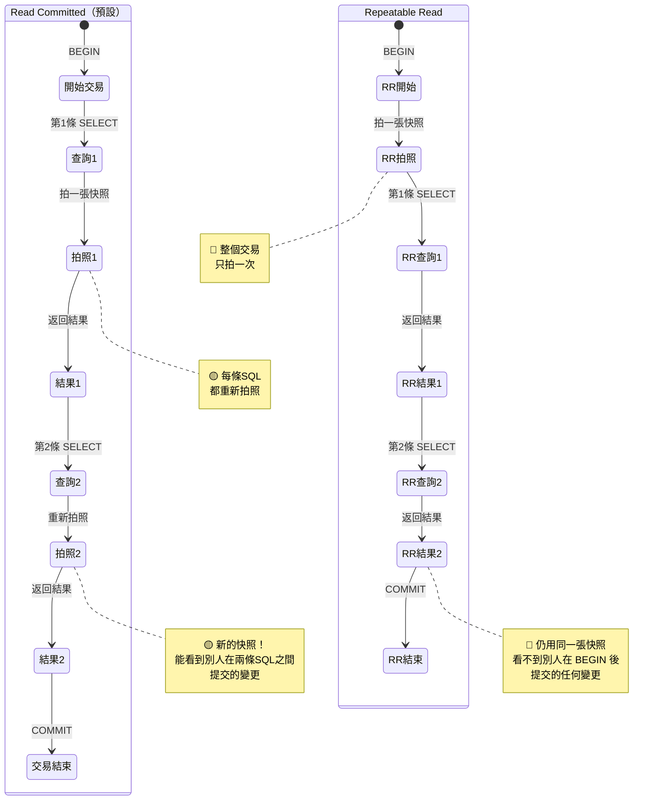
```mermaid
stateDiagram-v2
    state "Read Committed（預設）" as RC {
        [*] --> 開始交易 : BEGIN
        開始交易 --> 查詢1 : 第1條 SELECT
        查詢1 --> 拍照1 : 拍一張快照
        note right of 拍照1 : 🟡 每條SQL<br/>都重新拍照
        拍照1 --> 結果1 : 返回結果
        結果1 --> 查詢2 : 第2條 SELECT
        查詢2 --> 拍照2 : 重新拍照
        note right of 拍照2 : 🟡 新的快照！<br/>能看到別人在兩條SQL之間<br/>提交的變更
        拍照2 --> 結果2 : 返回結果
        結果2 --> 交易結束 : COMMIT
    }

    state "Repeatable Read" as RR {
        [*] --> RR開始 : BEGIN
        RR開始 --> RR拍照 : 拍一張快照
        note right of RR拍照 : 🔵 整個交易<br/>只拍一次
        RR拍照 --> RR查詢1 : 第1條 SELECT
        RR查詢1 --> RR結果1 : 返回結果
        RR結果1 --> RR查詢2 : 第2條 SELECT
        RR查詢2 --> RR結果2 : 返回結果
        note right of RR結果2 : 🔵 仍用同一張快照<br/>看不到別人在 BEGIN 後<br/>提交的任何變更
        RR結果2 --> RR結束 : COMMIT
    }
```

**一句話總結**：Read Committed 和 Repeatable Read 的**唯一差別**在於——Snapshot 是每個 statement 獲取一次，還是整個 transaction 獲取一次。這一個差別，衍生出所有行為差異。

### III. 為什麼 PostgreSQL 用 Snapshot 而非 Lock？

傳統資料庫（如 SQL Server 的預設 READ COMMITTED）使用 **shared lock** 來保證一致性：SELECT 時對讀取的行加 shared lock，防止其他人修改。這會導致「讀者阻塞寫者、寫者阻塞讀者」。

PostgreSQL 選擇了完全不同的路徑——**MVCC + Snapshot**：
- SELECT **永遠不加鎖**（除非 `FOR UPDATE`）
- 每個 row 保留多個版本（舊版本存放於 dead tuple）
- Snapshot 決定你能看到哪個版本

這帶來的好處：
1. **讀不阻塞寫、寫不阻塞讀** — 高並發吞吐量的基礎
2. **不需要 Dirty Read** — 語法接受 `READ UNCOMMITTED`，但 MVCC 讓 SELECT 天生不加鎖，未提交版本物理上不可見，所以底層直接當 Read Committed 跑
3. **Rollback 是即時的** — 不需要 undo log，直接把 tuple 標記為不可見

代價是：
1. **需要 VACUUM** — 清理 dead tuple 的後勤成本
2. **OldestXmin** — 長時間未關閉的 transaction 會阻止 VACUUM

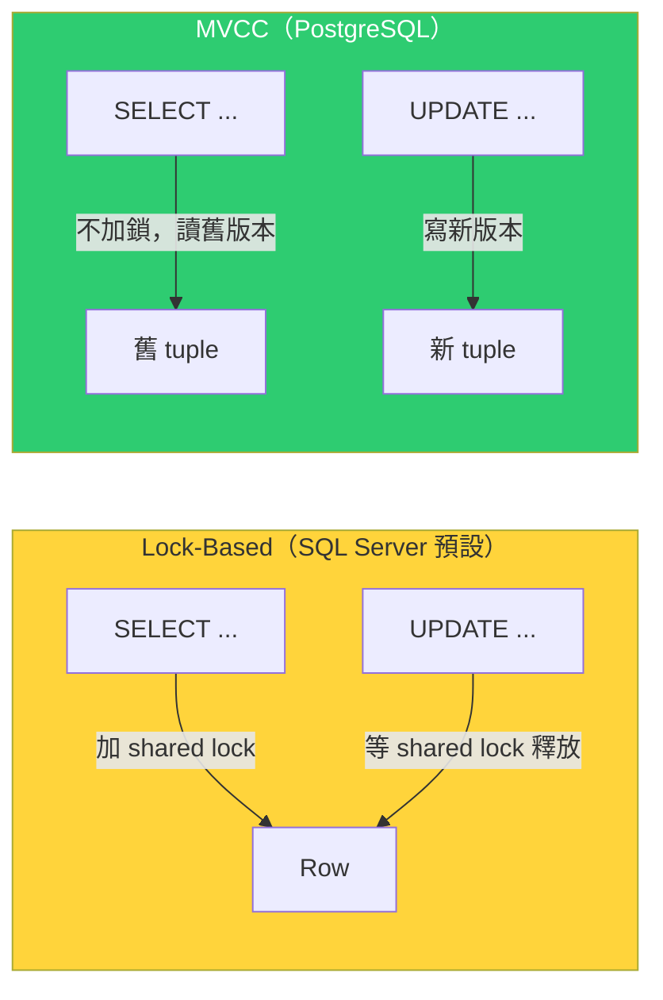
```mermaid
flowchart LR
    subgraph Lock_Based["Lock-Based（SQL Server 預設）"]
        TX1_L["SELECT ..."] --> |"加 shared lock"| ROW_L["Row"]
        TX2_L["UPDATE ..."] --> |"等 shared lock 釋放"| ROW_L
    end

    subgraph MVCC["MVCC（PostgreSQL）"]
        TX1_M["SELECT ..."] --> |"不加鎖，讀舊版本"| OLD["舊 tuple"]
        TX2_M["UPDATE ..."] --> |"寫新版本"| NEW["新 tuple"]
    end

    style Lock_Based fill:#ffd43b
     style MVCC fill:#2ecc71,color:#fff
```

---

## 2. Read Uncommitted（PG 中等於 Read Committed）

### I. 為什麼 PostgreSQL 沒有 Dirty Read？

**原理**：在 lock-based 資料庫中，Read Uncommitted 的用途是「不拿 shared lock 直接讀，即使資料可能被 rollback 掉」。但在 PostgreSQL 的 MVCC 模型中，SELECT **本來就不加鎖**，所以你不需要一個特殊的隔離級別來繞過鎖。PostgreSQL 把 `READ UNCOMMITTED` 映射到 `READ COMMITTED`，因為後者已經提供了你期望的所有行為。

**為什麼 PostgreSQL 連 dirty read 都不允許？** 因為 dirty read 的前提是「讀取未提交事務寫入的資料」，但在 PostgreSQL 中：
- 每個事務的寫入只對**自己**可見（自己的 xmin 寫入的 tuple，對自己永遠可見）
- 其他事務的 snapshot 中的 xip[] 包含了未提交事務的 XID，對應的 tuple 被判定為不可見

所以 PostgreSQL **物理上就無法發生 dirty read**——不是靠鎖禁止，而是 snapshot 機制天生就排除了未提交版本的 visible range。

> 補充（Senior Dev）：SQL Server 的 `NOLOCK` hint 或 `READ UNCOMMITTED` 允許 dirty read（可能讀到 rollback 後的資料，導致邏輯錯誤）。PG 完全沒有這個問題，這是一個被低估的架構優勢。

### II. 與 SQL Server 的對比

| 特性 | PostgreSQL | SQL Server |
|------|-----------|------------|
| Read Uncommitted 的真實行為 | 等同 Read Committed | 允許 dirty read |
| SELECT 是否加鎖 | 永不（除非 FOR UPDATE） | 預設加 shared lock（除非 NOLOCK） |
| 是否可能讀到未提交數據 | ❌ 不可能（MVCC 天生杜絕） | ✅ NOLOCK 下可能 |

### III. 生產環境排查

PostgreSQL 將 `READ UNCOMMITTED` 完全等同 `READ COMMITTED` 處理，因此在資料庫端**無法區分**兩者——`pg_stat_activity` 不會顯示隔離級別字串。排查重點應放在應用層程式碼審查。

```sql
-- 列出所有活躍的 client backend，用於交叉比對應用層是否有誤用 Read Uncommitted
SELECT pid, usename, application_name, state,
       backend_xmin, age(backend_xmin) AS xmin_tx_age,
       now() - xact_start AS xact_duration,
       LEFT(query, 150) AS query
FROM pg_stat_activity
WHERE backend_type = 'client backend'
  AND state = 'active'
ORDER BY xact_start DESC;
```

**應用層排查清單**（從 SQL Server 遷移過來的專案尤為重要）：

| 檢查點 | Npgsql / C# 範例 | 後果 |
|------|------|------|
| Transaction 隔離級別 | `conn.BeginTransaction(IsolationLevel.ReadUncommitted)` | 沒報錯，但實際是 RC（可能讓維護者困惑） |
| Npgsql 連線字串 | `Transaction Mode=ReadUncommitted` | 同上，連線層全域覆蓋 |
| 殘留 SQL Server hint | `WITH(NOLOCK)` | PG 不支援此語法，**SQL 會直接報錯** |

> 補充（Senior Dev）：從 SQL Server 遷移過來的專案，最常見的殘留是 `WITH(NOLOCK)` table hint——PG 會直接報 syntax error，所以這個反而容易被發現。真正隱蔽的是程式碼中的 `IsolationLevel.ReadUncommitted` 或 `SET TRANSACTION ISOLATION LEVEL READ UNCOMMITTED`，PG 靜默接受但當 RC 跑。建議在遷移後全域搜尋 `ReadUncommitted` 關鍵字，統一改用 `ReadCommitted`。

### IV. 如果 PostgreSQL 真的支援 Dirty Read，Tuple 和 Snapshot 會長怎樣？

用一個具體例子來說明 PG 的 xip[] 機制為什麼「物理上杜絕」了 dirty read。

**場景**：一張 `accounts` 表，只有一行 `(id=1, balance=100)`，這行由 XID=40 的事務 INSERT：

```text
現存 Tuple：
  v1: xmin=40, xmax=0, balance=100    ← 活著
```

**事務 A（XID=42）執行 UPDATE，尚未 COMMIT**：

```text
UPDATE accounts SET balance = 200 WHERE id = 1;
-- 尚未 COMMIT，A 還在活躍

MVCC 動作：不修改原行，而是產生新版本
  v1: xmin=40, xmax=42, balance=100   ← 被 A 砍了（xmax = 42）
  v2: xmin=42, xmax=0,  balance=200   ← A 生出的新版
```

**事務 B（XID=48）執行 SELECT，獲取 Snapshot**：

```text
B 的 Snapshot = {
    xmin: 38,           // XID < 38 的事務肯定已結束
    xmax: 50,           // XID ≥ 50 的事務尚未開始
    xip:  [42, 44, 46]  // 正在活躍中的事務 —— A（XID=42）在裡面！
}
```

**B 掃到 v2（balance=200）時的判斷**：

```text
Phase 1：Tuple.xmin vs Snapshot
  Tuple.xmin = 42
  42 在 Snapshot.xip[] = [42, 44, 46] 中
  → ❌ 不可見（A 還在進行中，未 COMMIT）
```

**這就是 PostgreSQL 的結果**：即使你寫了 `READ UNCOMMITTED`，B 也**看不到** balance=200。

**如果 PG 真的支援 Dirty Read（像 SQL Server NOLOCK）**，邏輯會是這樣：

```text
Dirty Read 的規則：跳過 xip[] 檢查
  Tuple.xmin = 42
  不檢查 42 是否在 xip[] 中，直接當作已提交
  → ✅ 可見，返回 balance=200（髒讀！）

但如果 A 後來 ROLLBACK：
  v2: xmin=42, xmax=42  ← A 自己砍掉自己的版本
  但 B 已經讀到 200 了 → 業務邏輯基於假資料做了決策 💀
```

**一句話總結**：PostgreSQL 的 visible range 判斷中，`Snapshot.xip[]` 是一道**硬閘門**——不管隔離級別設什麼，`Tuple.xmin` 只要在 `Snapshot.xip[]` 中就永遠不可見。不存在一個「跳過 xip[] 檢查」的程式路徑，所以 PG **物理上無法**產生 dirty read。`READ UNCOMMITTED` 語法被接受，但跑的是同一套可見性規則，和 `READ COMMITTED` 完全一樣。

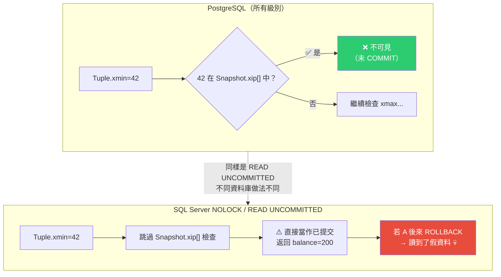
```mermaid
flowchart TD
    subgraph PG_RC["PostgreSQL（所有級別）"]
        P1["Tuple.xmin=42"]
        P1 --> P2{"42 在 Snapshot.xip[] 中？"}
        P2 -->|"✅ 是"| P3["❌ 不可見<br/>（未 COMMIT）"]
        P2 -->|"否"| P4["繼續檢查 xmax..."]
    end

    PG_RC -.->|"同樣是 READ UNCOMMITTED<br/>不同資料庫做法不同"| SQL_RU

    subgraph SQL_RU["SQL Server NOLOCK / READ UNCOMMITTED"]
        S1["Tuple.xmin=42"]
        S1 --> S2["跳過 Snapshot.xip[] 檢查"]
        S2 --> S3["⚠️ 直接當作已提交<br/>返回 balance=200"]
        S3 --> S4["若 A 後來 ROLLBACK<br/>→ 讀到了假資料 💀"]
    end

    style P3 fill:#2ecc71,color:#fff
    style S4 fill:#e74c3c,color:#fff
```

---

## 3. Read Committed — 生產環境最常用的級別

### I. 每個 Statement 拿新 Snapshot

這是 PostgreSQL 的**預設隔離級別**。核心行為：

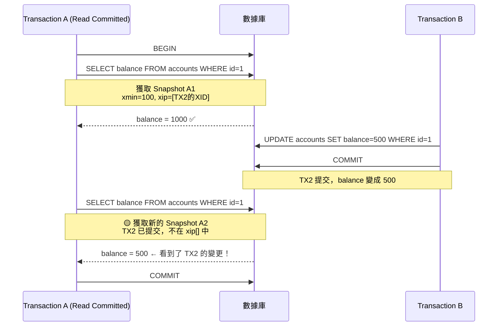
```mermaid
sequenceDiagram
    participant TX1 as Transaction A (Read Committed)
    participant DB as 數據庫
    participant TX2 as Transaction B

    TX1->>DB: BEGIN
    TX1->>DB: SELECT balance FROM accounts WHERE id=1
    Note over TX1,DB: 獲取 Snapshot A1<br/>xmin=100, xip=[TX2的XID]
    DB-->>TX1: balance = 1000 ✅

    TX2->>DB: UPDATE accounts SET balance=500 WHERE id=1
    TX2->>DB: COMMIT
    Note over TX2,DB: TX2 提交，balance 變成 500

    TX1->>DB: SELECT balance FROM accounts WHERE id=1
    Note over TX1,DB: 🟡 獲取新的 Snapshot A2<br/>TX2 已提交，不在 xip[] 中
    DB-->>TX1: balance = 500 ← 看到了 TX2 的變更！

    TX1->>DB: COMMIT
```

關鍵：同一事務內的**兩次 SELECT 會看到不同的數據**——這就是幻讀的根源。

### II. 幻讀 (Phantom Read)

PostgreSQL 的 Read Committed **無法防止幻讀**。但這裡需要澄清一個容易混淆的概念：

- **Non-repeatable Read**：同一行讀兩次，值不同（因為有人 UPDATE 了）→ RC 無法防止
- **Phantom Read**：同一個條件讀兩次，出現新的行（因為有人 INSERT 了）→ RC 也無法防止

兩者在 PG 的 RC 下都會發生，因為都是「兩次 statement 之間有其他事務提交了」。

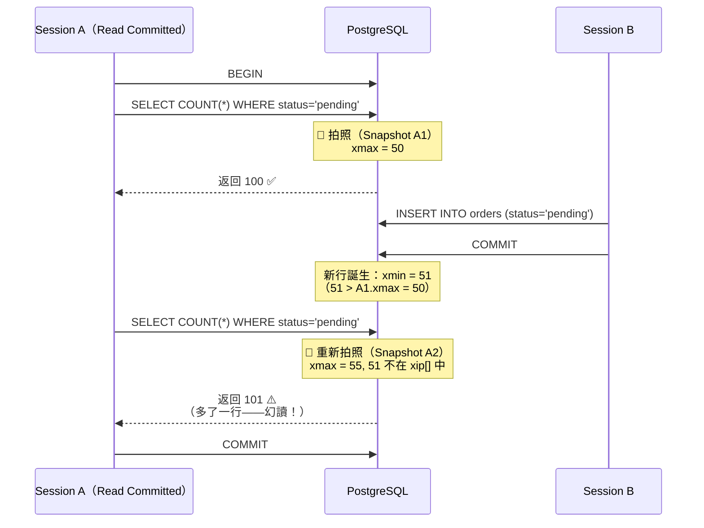
```mermaid
sequenceDiagram
    participant A as Session A（Read Committed）
    participant DB as PostgreSQL
    participant B as Session B

    A->>DB: BEGIN
    A->>DB: SELECT COUNT(*) WHERE status='pending'
    Note over DB: 📸 拍照（Snapshot A1）<br/>xmax = 50
    DB-->>A: 返回 100 ✅

    B->>DB: INSERT INTO orders (status='pending')
    B->>DB: COMMIT
    Note over DB: 新行誕生：xmin = 51<br/>（51 > A1.xmax = 50）

    A->>DB: SELECT COUNT(*) WHERE status='pending'
    Note over DB: 📸 重新拍照（Snapshot A2）<br/>xmax = 55, 51 不在 xip[] 中
    DB-->>A: 返回 101 ⚠️<br/>（多了一行——幻讀！）

    A->>DB: COMMIT
```

**發生了什麼？** B 的 INSERT 在 A 的兩次 SELECT 之間提交。第一次拍照時 B 還不存在（xmax=50，B 的 XID=51 > 50）。第二次拍照時 B 已 COMMIT（xmax 前進到 55，51 不在活躍名單中），所以那行新訂單變成可見——A 在同一個交易內看到了不同的世界。

```sql
-- Session A (Read Committed)
BEGIN;
SELECT COUNT(*) FROM orders WHERE status = 'pending';  -- 100
-- Session B: INSERT + COMMIT（發生在這裡）
SELECT COUNT(*) FROM orders WHERE status = 'pending';  -- 101 ← 幻讀
COMMIT;
```

### III. 為什麼生產環境大多數場景用 RC 就夠了？

| 場景 | 是否適合 RC | 原因 |
|------|:---:|------|
| 使用者登入/查詢 profile | ✅ | 一次 SELECT 就完成，沒有「同一事務多次查詢」的需求 |
| 報表查詢 | ✅ | 報表通常一條 SQL 搞定，不需要跨 statement 的一致性 |
| 簡單的 CRUD | ✅ | 每次操作獨立，不需要看到同一時刻的全局快照 |
| 轉帳（純 SQL 內計算） | ✅ | `UPDATE SET balance = balance - @delta`，EvalPlanQual 自動用最新值重算 |
| 轉帳（先 SELECT 檢查再 UPDATE 扣款） | ⚠️ 需要 `FOR UPDATE` | SELECT 不加鎖，檢查和扣款之間有空窗（見下方 V. Lost Update 陷阱） |
| 複雜報表（多步驟彙總） | ❌ 考慮 RR | 如果中間有人改了資料，多個數字加起來對不上 |

> 補充（Senior Dev）：很多開發者誤以為「交易一定要 Serializable」。實際上，PostgreSQL 的 Read Committed + 正確的 row lock（`SELECT ... FOR UPDATE`）已經能處理絕大多數轉帳、扣庫存場景。關鍵不是隔離級別，而是**你對要修改的行加了適當的鎖**。

### IV. 生產環境排查

#### a. 生產症狀：RC 下 Phantom Read 的業務可觀測跡象

Phantom Read 不會在資料庫日誌中留下任何痕跡（因為它是「合法」的行為），但在業務層有明顯跡象：

| 症狀 | 範例 | 根因 |
|------|------|------|
| 同一報表跑兩次數字不同 | 第一次 COUNT = 100，第二次 = 103 | 兩次 SELECT 之間有 INSERT 提交 |
| 總額校驗對不上 | SUM(balance) 兩次結果差 500 | 兩次掃描之間有 UPDATE 提交 |
| 分頁漏資料或重複資料 | 第一頁有 ID=50，第二頁也有 ID=50 | OFFSET 分頁 + 並發 INSERT（見 pagination 章節） |
| 審計報表不一致 | 月報和日報加總對不起來 | 日報是各天快照（RC），但月報掃了整月資料（也 RC），中間有人修改了過往記錄 |

#### b. RC 資料不一致排查路徑

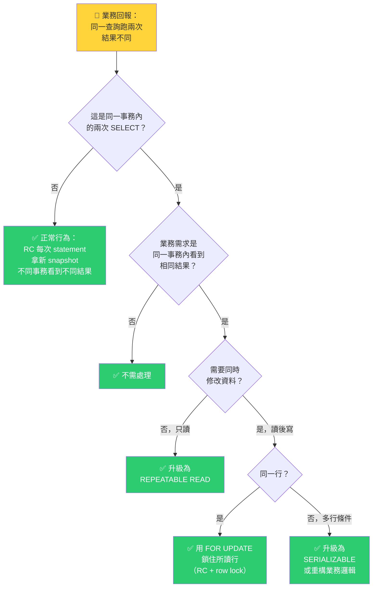
```mermaid
flowchart TD
    START["🚨 業務回報：<br/>同一查詢跑兩次<br/>結果不同"]
    START --> CHECK1{"這是同一事務內<br/>的兩次 SELECT？"}
    CHECK1 -->|"否"| NORMAL["✅ 正常行為：<br/>RC 每次 statement<br/>拿新 snapshot<br/>不同事務看到不同結果"]
    CHECK1 -->|"是"| CHECK2{"業務需求是<br/>同一事務內看到<br/>相同結果？"}
    CHECK2 -->|"否"| OK["✅ 不需處理"]
    CHECK2 -->|"是"| CHECK3{"需要同時<br/>修改資料？"}
    CHECK3 -->|"否，只讀"| SOLUTION1["✅ 升級為<br/>REPEATABLE READ"]
    CHECK3 -->|"是，讀後寫"| CHECK4{"同一行？"}
    CHECK4 -->|"是"| SOLUTION2["✅ 用 FOR UPDATE<br/>鎖住所讀行<br/>（RC + row lock）"]
    CHECK4 -->|"否，多行條件"| SOLUTION3["✅ 升級為<br/>SERIALIZABLE<br/>或重構業務邏輯"]

    style START fill:#ffd43b
    style NORMAL fill:#2ecc71,color:#fff
    style OK fill:#2ecc71,color:#fff
    style SOLUTION1 fill:#2ecc71,color:#fff
    style SOLUTION2 fill:#2ecc71,color:#fff
    style SOLUTION3 fill:#2ecc71,color:#fff
```

> 補充（Senior Dev）：Phantom Read 不一定是 bug，很多時候是**業務可接受的行為**——例如使用者刷新頁面看到新資料是正常的。只有在「同一事務內，業務邏輯依賴前後一致性」的情境下才需要升級隔離級別。升級前先問：「這兩個 SELECT 之間如果有 INSERT，真的會導致業務錯誤嗎？」

### V. MVCC 下的 Lost Update 陷阱 —— 為什麼 `balance = balance + 1` 是安全的

#### a. 直覺上的擔憂

MVCC 讓每個交易讀自己的快照（Snapshot），而不是共享記憶體。這自然引出一個疑問：如果兩個交易同時 `UPDATE` 同一行，會不會各自讀到舊值、各自算出新值，最後其中一個的更新被覆蓋？

```text
直覺擔憂（但不會發生）：
  A 讀到 balance = 30（快照），算出 30 + 1 = 31，寫回
  B 讀到 balance = 30（快照），算出 30 + 2 = 32，寫回
  結果 = 32，A 的更新丟失了 → Lost Update
```

#### b. PostgreSQL 的實際行為：行鎖 + EvalPlanQual

PostgreSQL 對 UPDATE **不是**傻傻地讓你用快照的舊值去寫。實際流程：

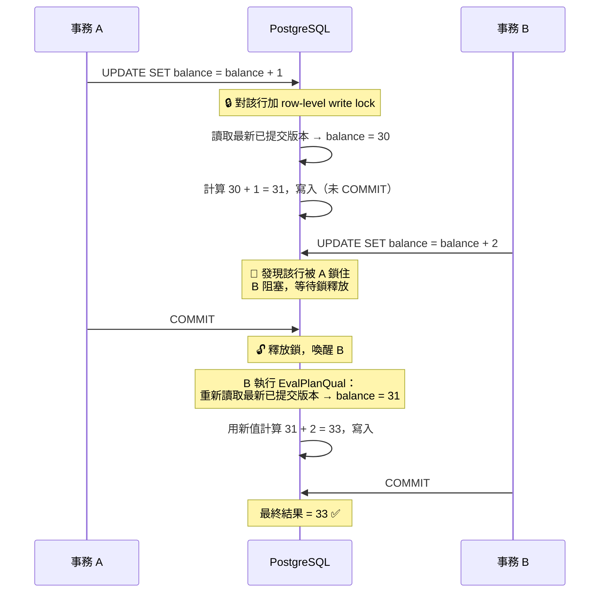
```mermaid
sequenceDiagram
    participant A as 事務 A
    participant PG as PostgreSQL
    participant B as 事務 B

    A->>PG: UPDATE SET balance = balance + 1
    Note over PG: 🔒 對該行加 row-level write lock
    PG->>PG: 讀取最新已提交版本 → balance = 30
    PG->>PG: 計算 30 + 1 = 31，寫入（未 COMMIT）

    B->>PG: UPDATE SET balance = balance + 2
    Note over PG: 🔴 發現該行被 A 鎖住<br/>B 阻塞，等待鎖釋放

    A->>PG: COMMIT
    Note over PG: 🔓 釋放鎖，喚醒 B

    Note over PG: B 執行 EvalPlanQual：<br/>重新讀取最新已提交版本 → balance = 31
    PG->>PG: 用新值計算 31 + 2 = 33，寫入
    B->>PG: COMMIT
    Note over PG: 最終結果 = 33 ✅
```

關鍵機制叫 **EvalPlanQual**：當一個被阻塞的 UPDATE 終於拿到鎖時，PostgreSQL 會**拋棄原本快照中讀到的舊值**，重新讀取該行最新已提交的版本，用新值重新計算。所以你寫 `balance = balance + N` 時，不會基於過時的快照去算。

> **一句話定義**：EvalPlanQual 用於 Read Committed 級別下，當 UPDATE 或 DELETE 目標行被並發事務修改過時，PG 會**重新執行**該操作——用最新已提交的版本取代快照中的舊版本，確保不會基於過時資料做出修改。

#### c. 陷阱：應用層讀-改-寫（App-Level Read-Modify-Write）

上面的保護只對 **SQL 表達式內**的計算有效（`SET balance = balance + 1`）。如果你在應用程式裡這樣做：

```csharp
// ❌ 危險寫法 —— Lost Update 真的會發生
using var tx = conn.BeginTransaction();
var balance = conn.QuerySingle<int>(
    "SELECT balance FROM accounts WHERE id = 1", transaction: tx);
// balance = 30（快照值，SELECT 不加鎖）
balance += 1;  // 在 C# 裡算出 31
conn.Execute(
    "UPDATE accounts SET balance = @newBalance WHERE id = 1",
    new { newBalance = balance }, tx);
// 寫入 31 —— 但如果 B 也讀到 30 並寫入 32，31 就被覆蓋了
tx.Commit();
```

**為什麼出錯？** `SELECT` 不掛鎖，讀到的是快照值（可能已過時）。後面的 `UPDATE` 只寫入你在 C# 算好的數字，PG 不會幫你「重新讀取 + 重算」。

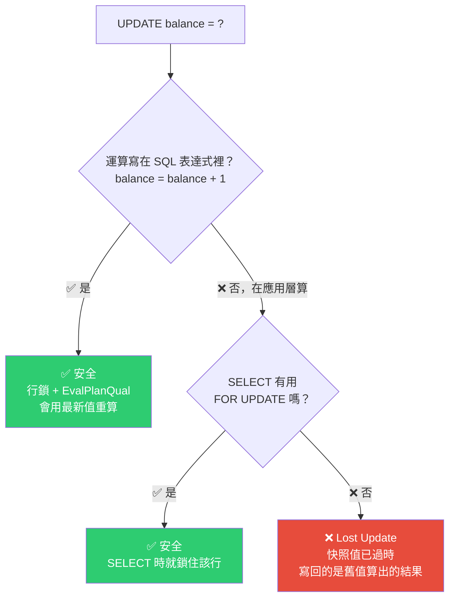
```mermaid
flowchart TD
    START["UPDATE balance = ?"]
    START --> Q1{"運算寫在 SQL 表達式裡？<br/>balance = balance + 1"}
    Q1 -->|"✅ 是"| SAFE["✅ 安全<br/>行鎖 + EvalPlanQual<br/>會用最新值重算"]
    Q1 -->|"❌ 否，在應用層算"| Q2{"SELECT 有用<br/>FOR UPDATE 嗎？"}
    Q2 -->|"✅ 是"| SAFE2["✅ 安全<br/>SELECT 時就鎖住該行"]
    Q2 -->|"❌ 否"| DANGER["❌ Lost Update<br/>快照值已過時<br/>寫回的是舊值算出的結果"]

    style SAFE fill:#2ecc71,color:#fff
    style SAFE2 fill:#2ecc71,color:#fff
    style DANGER fill:#e74c3c,color:#fff
```

#### d. 解法對照

| 寫法 | RC 下是否安全 | 原理 |
|------|:---:|------|
| `UPDATE SET balance = balance + 1` | ✅ | 行鎖 + EvalPlanQual 重讀 |
| `INSERT ... ON CONFLICT DO UPDATE SET balance = balance - @delta` | ✅ | 衝突行等同 UPDATE，同一套 EvalPlanQual |
| `SELECT ... FOR UPDATE` → C# 計算 → `UPDATE` | ✅ | SELECT 就掛鎖，別人無法並發讀 |
| `SELECT`（無鎖）→ C# 計算 → `UPDATE` | ❌ | 讀到快照舊值，寫入時覆蓋別人 |
| `INSERT ... ON CONFLICT DO UPDATE SET balance = @newBalance` | ❌ | `@newBalance` 是 C# 算的舊值 |
| `REPEATABLE READ` + 應用層讀改寫 | ❌（會報錯） | PG 偵測到 concurrent update，拋 40001 |
| `SERIALIZABLE` + 應用層讀改寫 | ⚠️（報錯後 retry） | SSI 偵測到衝突，拋 error 讓你重試 |

> 補充（Senior Dev）：如果在 **REPEATABLE READ** 下兩個事務都做應用層讀改寫，第一個 COMMIT 成功，第二個 COMMIT 時會收到 `ERROR: could not serialize access due to concurrent update`。這是 RR 的保護機制——它不偷偷幫你重算（不像 RC 的 EvalPlanQual），而是直接報錯，逼你在應用層處理。

業務建議：**能寫在 SQL 表達式裡的就寫在 SQL 裡**（`balance = balance + 1`）。必須在應用層算的場合（例如依賴外部 API 回傳值來決定新值），務必用 `SELECT ... FOR UPDATE` 先鎖住。

### VI. 場景：Read Committed 下的轉帳 Phantom

#### a. 原理重現

```sql
-- 準備
CREATE TABLE accounts (id INT PRIMARY KEY, balance INT);
INSERT INTO accounts VALUES (1, 1000), (2, 1000);

-- Session A (Read Committed) — 轉帳驗證
BEGIN;
SELECT SUM(balance) FROM accounts;           -- 返回 2000
SELECT balance FROM accounts WHERE id = 1;    -- 返回 1000
-- 準備扣款...但 Session B 在這個時候插入了

-- Session B (同時)
UPDATE accounts SET balance = 500 WHERE id = 1;
COMMIT;

-- Session A (繼續)
SELECT balance FROM accounts WHERE id = 2;    -- 返回 1000
SELECT SUM(balance) FROM accounts;           -- 返回 1500 ← 總額變了！
-- 基於「總額 2000」做的後續判斷全部失效
COMMIT;
```

#### b. 解法矩陣

| 解法 | 適用場景 | 限制 |
|------|---------|------|
| `SELECT ... FOR UPDATE` | 需要鎖定特定行進行後續修改 | 僅鎖定被 SELECT 的行，不鎖定新插入的行 |
| 改用 Repeatable Read | 需要多個 SELECT 之間的一致性快照 | 長時間事務會卡 VACUUM |
| Serializable | 最嚴格的一致性要求 | 需要 retry logic |
| 應用層重試 | 所有場景 | 增加開發複雜度 |

#### c. 生產環境排查與事後偵測

##### i. 事後偵測：從審計表發現 Phantom Read 痕跡

如果 `accounts` 表有審計欄位（`updated_at`、`audit_log`），可以在事後搜尋疑似 Phantom Read 的異常模式：

```sql
-- 搜尋短時間內對同一帳戶出現「不一致讀取」的嫌疑交易
-- 條件：同一個 transaction 範圍內，SUM(balance) 兩次取值不同
-- 需要審計表記錄每次 SELECT 的時間點

-- 方法 A：檢查是否有 concurrent write 與 SELECT 時間重疊
WITH suspicious_writes AS (
    SELECT id, balance, updated_at,
           lag(updated_at) OVER (PARTITION BY id ORDER BY updated_at) AS prev_updated
    FROM accounts_audit_log
    WHERE action = 'UPDATE'
)
SELECT id, updated_at, prev_updated,
       updated_at - prev_updated AS gap,
       CASE WHEN updated_at - prev_updated < interval '1 second'
            THEN '⚠️ 疑似 Phantom Read 視窗' END AS risk
FROM suspicious_writes
WHERE updated_at - prev_updated < interval '1 second'
ORDER BY gap;

-- 方法 B：計算總額快照一致性（需在應用層記錄每次總額校驗的時間點）
SELECT recorded_at,
       recorded_sum,
       (SELECT SUM(balance) FROM accounts WHERE updated_at <= a.recorded_at) AS actual_at_time,
       recorded_sum - (SELECT SUM(balance) FROM accounts WHERE updated_at <= a.recorded_at) AS drift
FROM account_snapshot_log a
WHERE recorded_at > now() - interval '1 day'
  AND abs(recorded_sum - (SELECT SUM(balance) FROM accounts WHERE updated_at <= a.recorded_at)) > 0;
```

**結果解讀**：
- `gap < 1 second` 表示有兩筆 UPDATE 幾乎同時發生，可能在另一個 session 的兩個 SELECT 之間
- `drift <> 0` 表示應用層記錄的總額與資料庫實際值不同，很可能發生過 Phantom Read

##### ii. 即時排查：找出正在對同一表進行 Concurrent Write 的 Session

```sql
-- 誰正在跟我競爭同一張表？
SELECT pid, usename, application_name, state,
       wait_event_type, wait_event,
       now() - xact_start AS xact_duration,
       now() - query_start AS query_duration,
       LEFT(query, 200) AS query
FROM pg_stat_activity
WHERE state = 'active'
  AND query NOT LIKE '%pg_stat_activity%'
  AND pid <> pg_backend_pid()
ORDER BY xact_start;
```

**結果解讀**：

| Column | 正常時 | 異常時（紅旗） |
|--------|--------|----------------|
| `xact_duration` | < 1 秒 | > 30 秒 → 可能有人忘了 COMMIT |
| `query_duration` | < 100ms | > 5 秒 → 查詢卡住 |
| `wait_event_type = 'Lock'` | 無 | 出現 → 有人持有鎖 |
| `query 中含 UPDATE/DELETE` | 短時間 | 長時間執行 → 可能造成 Phantom Read 視窗 |

##### iii. 排查 Mermaid 流程圖

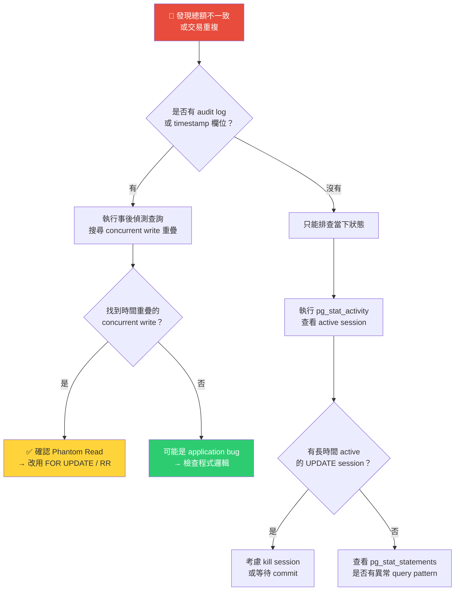
```mermaid
flowchart TD
    START["🚨 發現總額不一致<br/>或交易重複"] --> CHECK_LOG{"是否有 audit log<br/>或 timestamp 欄位？"}
    CHECK_LOG -->|"有"| AUDIT["執行事後偵測查詢<br/>搜尋 concurrent write 重疊"]
    CHECK_LOG -->|"沒有"| LIVE["只能排查當下狀態"]

    AUDIT --> FIND{"找到時間重疊的<br/>concurrent write？"}
    FIND -->|"是"| CONFIRM["✅ 確認 Phantom Read<br/>→ 改用 FOR UPDATE / RR"]
    FIND -->|"否"| BUG["可能是 application bug<br/>→ 檢查程式邏輯"]

    LIVE --> CHECK_ACTIVITY["執行 pg_stat_activity<br/>查看 active session"]
    CHECK_ACTIVITY --> HAS_LONG{"有長時間 active<br/>的 UPDATE session？"}
    HAS_LONG -->|"是"| KILL["考慮 kill session<br/>或等待 commit"]
    HAS_LONG -->|"否"| PATTERN["查看 pg_stat_statements<br/>是否有異常 query pattern"]

    style START fill:#e74c3c,color:#fff
    style CONFIRM fill:#ffd43b
    style BUG fill:#2ecc71,color:#fff
```

##### iv. 生產症狀速查

| 業務症狀 | 底層原因 | 優先查 |
|----------|---------|--------|
| 退款重複（同一筆交易退款兩次） | SELECT 確認金額 → 另一筆退款 UPDATE BETWEEN → 再次 SELECT 仍有錢 | 此場景 |
| 庫存總數與明細加總不符 | SUM() 在 transaction 內被其他 session 的 INSERT 改變 | 此場景 |
| 報表數字每次刷新都不同 | Auto-commit 模式，每條 SELECT 拿到不同 snapshot | 此場景 + Npgsql connection pool |
| 用戶看到餘額跳動 | 同一頁面多條 AJAX 各自獨立 SELECT | Read Committed 預設行為 |

> 補充（Senior Dev）：Phantom Read 是 RC 的設計行為，不是 bug。如果業務邏輯依賴「兩個 SELECT 之間資料不變」，卻使用了 RC，這是應用層設計缺陷。最簡單的解法是在關鍵 SELECT 後加 `FOR UPDATE`（即使不打算 update），利用 row lock 阻止 concurrent write；或用 RR 取得 stable snapshot。要注意 `FOR UPDATE` 會阻塞其他 writer，在高並發場景需評估效能影響。

---

## 4. Repeatable Read — PG 比 SQL Standard 更強

### I. 整個 Transaction 用同一個 Snapshot

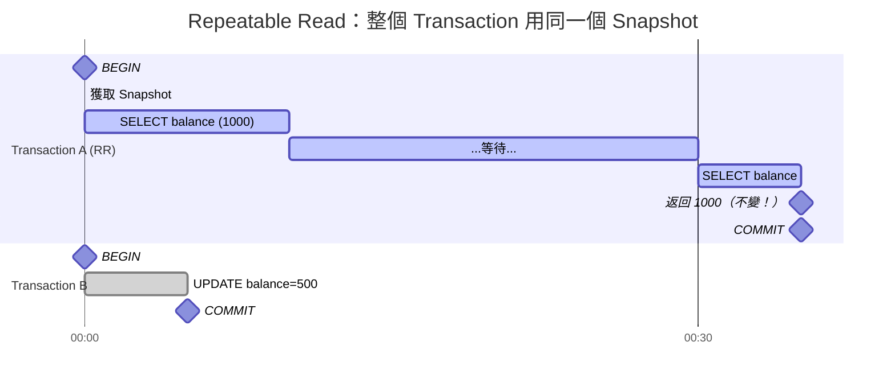
```mermaid
gantt
    title Repeatable Read：整個 Transaction 用同一個 Snapshot
    dateFormat mm:ss
    axisFormat %M:%S
    tickInterval 30second

    section Transaction A (RR)
    BEGIN                   :milestone, tx_begin, 00:00, 0s
    獲取 Snapshot           :done, snap, 00:00, 0s
    SELECT balance (1000)   :active, s1, after snap, 10s
    ...等待...              :active, wait, after s1, 20s
    SELECT balance          :active, s2, after wait, 5s
    返回 1000（不變！）     :milestone, result, after s2, 0s
    COMMIT                  :milestone, commit, after s2, 0s

    section Transaction B
    BEGIN                   :milestone, tx2_begin, after snap, 0s
    UPDATE balance=500      :done, upd, after tx2_begin, 5s
    COMMIT                  :milestone, tx2_commit, after upd, 0s
```

Transaction B 在 Transaction A 開始之後才提交，但 Transaction A 用的是自己開始時的 snapshot，所以**看不到** Transaction B 的變更。即使過了 30 秒再查，`balance` 仍然是 1000。

### II. PostgreSQL 的 RR 比 SQL Standard 更強 —— 也防止 Phantom Read

SQL Standard 定義的 Repeatable Read 只保證 **Non-repeatable Read** 不會發生（同一行讀兩次值不變），但**允許 Phantom Read**。

**為什麼 SQL Standard 允許 Phantom Read？** 因為 SQL Standard 不規定實作方式。傳統鎖式資料庫（如 SQL Server）的 RR 實作是「對讀過的**行**掛 shared lock 直到交易結束」——這能阻止別人 UPDATE 已讀的行，但無法阻止別人 INSERT 新行（新行不存在，無鎖可掛）。Phantom Read 就是在這個鎖式模型下的漏洞。

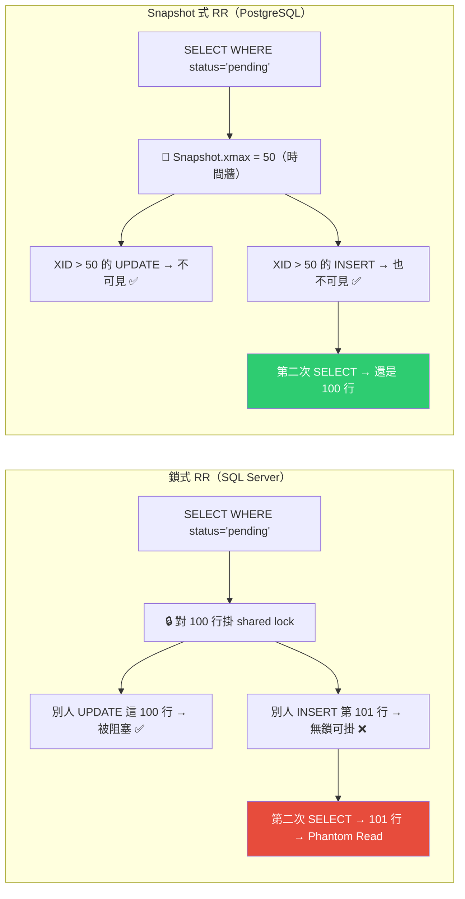
```mermaid
flowchart LR
    subgraph Lock_RR["鎖式 RR（SQL Server）"]
        L1["SELECT WHERE status='pending'"] --> L2["🔒 對 100 行掛 shared lock"]
        L2 --> L3["別人 UPDATE 這 100 行 → 被阻塞 ✅"]
        L2 --> L4["別人 INSERT 第 101 行 → 無鎖可掛 ❌"]
        L4 --> L5["第二次 SELECT → 101 行 → Phantom Read"]
    end

    subgraph Snap_RR["Snapshot 式 RR（PostgreSQL）"]
        S1["SELECT WHERE status='pending'"] --> S2["📸 Snapshot.xmax = 50（時間牆）"]
        S2 --> S3["XID > 50 的 UPDATE → 不可見 ✅"]
        S2 --> S4["XID > 50 的 INSERT → 也不可見 ✅"]
        S4 --> S5["第二次 SELECT → 還是 100 行"]
    end

    style L5 fill:#e74c3c,color:#fff
    style S5 fill:#2ecc71,color:#fff
```

PostgreSQL 的 RR 則更進一步：因為整個 transaction 用同一個 snapshot，這個 snapshot 中的 xip[] 包含了所有在 BEGIN 時活躍的事務。任何後來才開始的事務（XID > snapshot.xmax）寫入的資料，在這個 snapshot 中都不可見——**不管是 UPDATE 還是 INSERT，一律被時間牆擋住**。

因此 PostgreSQL 的 Repeatable Read **也防止了 Phantom Read**：

```sql
-- Session A (Repeatable Read)
BEGIN ISOLATION LEVEL REPEATABLE READ;
SELECT COUNT(*) FROM orders WHERE status = 'pending';
-- 返回 100

-- Session B
INSERT INTO orders (status) VALUES ('pending');
COMMIT;

-- Session A (繼續)
SELECT COUNT(*) FROM orders WHERE status = 'pending';
-- 返回 100 ← 仍然是 100！Phantom Read 被防止了
COMMIT;
```

> 補充（Senior Dev）：PostgreSQL 的 RR 之所以能做到這一點，不是靠 predicate lock，而是**靠 snapshot 的時間邊界**。Session B 的 XID > Session A 的 snapshot.xmax，因此 Session B 寫入的所有 tuple，Session A 都看不到。這比 SQL Server 的 REPEATABLE READ（使用 shared lock 不釋放的方式，但無法防止 phantom）更乾淨。

### III. Write Skew —— RR 仍無法防止的異常

即使 PostgreSQL 的 RR 防止了 Phantom Read，仍存在一個經典的異常——**Write Skew**。

**場景：值班醫生制度**

```sql
-- 規則：任何時刻至少要有一位醫生 on-call

-- Session A (Repeatable Read)
BEGIN ISOLATION LEVEL REPEATABLE READ;
SELECT COUNT(*) FROM doctors WHERE on_call = true;
-- 返回 2 — 至少有兩人值班，我可以請假
UPDATE doctors SET on_call = false WHERE id = 1;
-- 預期：剩下 1 人值班，合法
COMMIT;

-- Session B (同時進行，Repeatable Read)
BEGIN ISOLATION LEVEL REPEATABLE READ;
SELECT COUNT(*) FROM doctors WHERE on_call = true;
-- 返回 2 — 也是看到 2 人（因為看不到 Session A 的未提交變更）
UPDATE doctors SET on_call = false WHERE id = 2;
-- 預期：剩下 1 人值班，合法
COMMIT;
```

兩邊都提交後：`COUNT(*)` = 0，**沒有人值班了**！這就是 Write Skew——兩個事務各自讀了一個「前提條件」，然後基於這個前提做出修改，但雙方的前提都被對方的修改打破了。

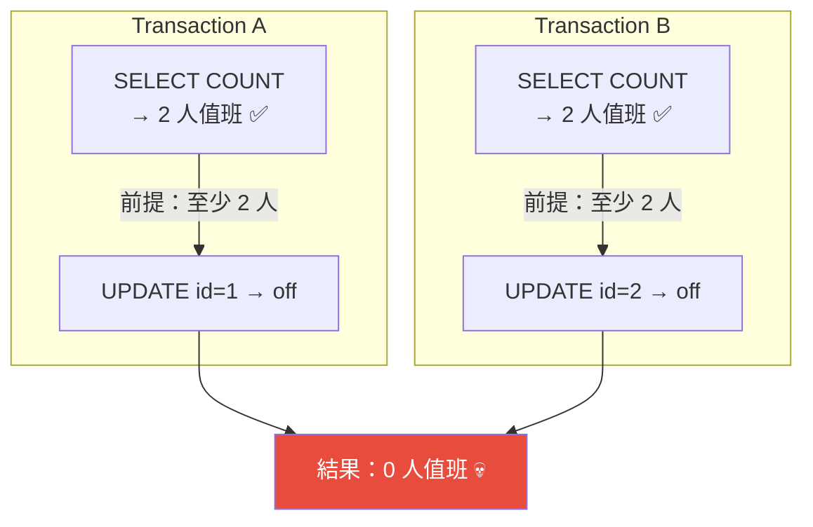
```mermaid
flowchart TD
    subgraph TX_A["Transaction A"]
        A1["SELECT COUNT<br/>→ 2 人值班 ✅"]
        A2["UPDATE id=1 → off"]
    end

    subgraph TX_B["Transaction B"]
        B1["SELECT COUNT<br/>→ 2 人值班 ✅"]
        B2["UPDATE id=2 → off"]
    end

    A1 --> |"前提：至少 2 人"| A2
    B1 --> |"前提：至少 2 人"| B2
    A2 --> RESULT["結果：0 人值班 💀"]
    B2 --> RESULT

    style RESULT fill:#e74c3c,color:#fff
```

**為什麼 RR 無法防止？** 因為 RR 的 snapshot 讓 Session A 看不到 Session B 的修改（反之亦然），但 snapshot **不阻止你基於「過時的數據」做出修改**。兩個事務讀的是各自的 snapshot（都是 2 人），但 UPDATE 實際改變了真實的 row。

**解法**：使用 Serializable，或使用 `SELECT ... FOR UPDATE` 對所有相關行加鎖。

### IV. 生產環境排查

#### a. 找出所有使用 RR 且有風險的 Session

RR 最大的生產風險不是 Write Skew，而是**長時間 idle in transaction 拖住 OldestXmin**：

```sql
-- 找出所有使用 RR 且處於 idle in transaction 的 session（最危險的組合）
SELECT pid, usename, application_name, state,
       backend_xmin, age(backend_xmin) AS xmin_tx_age,
       now() - xact_start AS xact_duration,
       LEFT(query, 150) AS last_query
FROM pg_stat_activity
WHERE backend_xmin IS NOT NULL
  AND state = 'idle in transaction'
ORDER BY xact_duration DESC;
```

**結果解讀**：

| 欄位 | 含義 |
|------|------|
| `state = 'idle in transaction'` | 事務已開啟（BEGIN 已執行），但目前沒有在跑任何 SQL——**client 端卡住了或忘了 COMMIT** |
| `xmin_tx_age` | 此 session 的 snapshot 年齡，所有 < backend_xmin 的 dead tuple 才能被 VACUUM 回收 |
| `xact_duration` | 這個事務開著多久了——超過 5 分鐘就應該警覺 |

🔴 **危險組合**：`state = 'idle in transaction'` + `xact_duration > 5 min` + `backend_xmin IS NOT NULL` = VACUUM 殺手

> 補充（Senior Dev）：`pg_stat_activity` 不直接顯示隔離級別。判斷是否為 RR 的方法是看 `backend_xmin`：在 RC 下，idle in transaction 時 `backend_xmin` 通常為 NULL（因為下一個 statement 會用新 snapshot）；在 RR 下，`backend_xmin` 會一直保留。所以 `state = 'idle in transaction' AND backend_xmin IS NOT NULL` 幾乎可以確定是 RR（或 Serializable）。

#### b. 生產症狀：Write Skew 的事後偵測

Write Skew 不會產生 error log（不像 Serializable 的 serialization failure），因此只能透過 **業務規則審計查詢** 事後發現：

```sql
-- Write Skew 範例：檢查是否發生「值班醫生全部 off」的異常
SELECT on_call, count(*) AS doctor_count
FROM doctors
GROUP BY on_call;
-- 如果 on_call=false 的數量 = 總醫生數 → Write Skew 已經發生

-- 通用範本：檢查業務規則不變量是否被打破
-- 規則「總和必須 = 100」被 Write Skew 打破的案例
SELECT SUM(allocated_pct) AS total_pct
FROM resource_allocation;
-- 如果 total_pct != 100 → Write Skew 導致超分配
```

**Write Skew 高發場景**：

| 場景 | 業務規則 | Write Skew 後果 |
|------|------|------|
| 資源分配 | 分配比例合計 = 100% | 超分配（總和 > 100%） |
| 值班排班 | 任何時刻至少 1 人值班 | 空班（0 人值班） |
| 庫存扣減 | 庫存 ≥ 0 | 超賣（庫存變負數） |
| 預算控管 | 剩餘預算 ≥ 0 | 超支（預算變負數） |

#### c. RR Session Snapshot 年齡分佈查詢

```sql
-- 檢查所有持有 snapshot 的 RR session 的年齡分佈
SELECT
    CASE
        WHEN age(backend_xmin) < 1000 THEN '< 1K tx'
        WHEN age(backend_xmin) BETWEEN 1000 AND 10000 THEN '1K-10K tx'
        WHEN age(backend_xmin) BETWEEN 10001 AND 100000 THEN '10K-100K tx'
        WHEN age(backend_xmin) BETWEEN 100001 AND 1000000 THEN '100K-1M tx'
        ELSE '> 1M tx'
    END AS xmin_age_bucket,
    count(*) AS session_count
FROM pg_stat_activity
WHERE backend_xmin IS NOT NULL
GROUP BY 1
ORDER BY min(age(backend_xmin));
```

**結果解讀**：
- **> 1M tx** 的 bucket 有 session → 立即排查並考慮 kill（`SELECT pg_terminate_backend(pid)`）
- **100K-1M tx** → 警告級別，檢查是否有 RR transaction 可以改為 RC
- 如果所有 session 都在 **< 1K tx** → 健康

> 補充（Senior Dev）：Write Skew 的最佳防禦不是 Serializable（會付出 abort rate 代價），而是**在應用層對不變量涉及的行使用 FOR UPDATE 鎖住**。例如值班醫生場景，`SELECT COUNT(*) FROM doctors WHERE on_call = true FOR UPDATE` 會鎖住所有 on_call=true 的行，阻止並發修改。在 RC 下這樣做就足夠了，不需要升級隔離級別。

---

## 5. Serializable — 最高隔離級別

### I. 傳統做法：2PL / S2PL（兩階段鎖定）

Serializable 的實作方式有兩條路線：**鎖式**（S2PL，如 SQL Server）和**快照式**（SSI，如 PostgreSQL）。純 2PL 因 Cascading Rollback 問題在實務中已被 S2PL 取代——所有鎖式資料庫的 Serializable 都是 S2PL 或其變體。

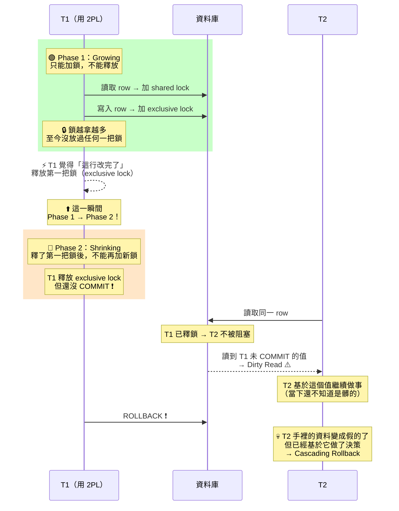
```mermaid
sequenceDiagram
    participant T1 as T1（用 2PL）
    participant DB as 資料庫
    participant T2 as T2

    rect rgb(200, 255, 200)
        Note over T1: 🟢 Phase 1：Growing<br/>只能加鎖，不能釋放
        T1->>DB: 讀取 row → 加 shared lock
        T1->>DB: 寫入 row → 加 exclusive lock
        Note over T1: 🔒 鎖越拿越多<br/>至今沒放過任何一把鎖
    end

    T1-->>T1: ⚡ T1 覺得「這行改完了」<br/>釋放第一把鎖（exclusive lock）
    Note over T1: ⬆️ 這一瞬間<br/>Phase 1 → Phase 2！

    rect rgb(255, 230, 200)
        Note over T1: 🔴 Phase 2：Shrinking<br/>釋了第一把鎖後，不能再加新鎖
        Note over T1: T1 釋放 exclusive lock<br/>但還沒 COMMIT ❗
    end

    T2->>DB: 讀取同一 row
    Note over DB: T1 已釋鎖 → T2 不被阻塞
    DB-->>T2: 讀到 T1 未 COMMIT 的值<br/>→ Dirty Read ⚠️
    Note over T2: T2 基於這個值繼續做事<br/>（當下還不知道是髒的）

    T1->>DB: ROLLBACK ❗
    Note over T2: 💀 T2 手裡的資料變成假的了<br/>但已經基於它做了決策<br/>→ Cascading Rollback
```

> **T1 什麼時候進入 Phase 2？** 釋放**第一把鎖**的瞬間。在 2PL 規則下，一旦放了任何鎖就不能再拿新鎖——所以放鎖那一刻就是 Growing → Shrinking 的分界線。觸發原因通常是 T1 覺得「這行已經處理完了，先放鎖讓別人用」，但實際上整個交易還沒結束（可能還有其他邏輯在跑）。
>
> **Dirty Read 時序**：T2 讀取當下拿到的是「未 COMMIT 的值」——這就是 Dirty Read 的定義，不管 T1 後來是 COMMIT 還是 ROLLBACK。真正的傷害在 T1 ROLLBACK 後才顯現：T2 手裡的資料變成假資料，但 T2 可能已經基於它做了後續操作。

```text
S2PL（Strict 2PL）：2PL 的強化版
  規則：所有 write lock 必須持有到 COMMIT 才釋放
  保證：序列化 + 無連鎖回滾
  問題：寫者會長時間阻塞讀者和寫者 → 並發吞吐量低
```

2PL vs S2PL vs SSI 三種實作的鎖行為對比：

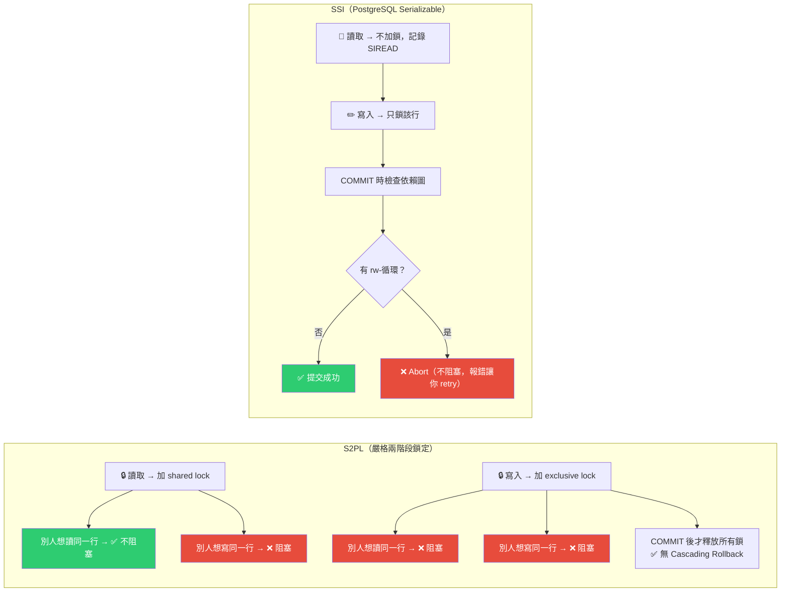
```mermaid
flowchart LR
    subgraph S2PL_Flow["S2PL（嚴格兩階段鎖定）"]
        S2PL_B["🔒 讀取 → 加 shared lock"]
        S2PL_B --> S2PL_R["別人想讀同一行 → ✅ 不阻塞"]
        S2PL_B --> S2PL_W["別人想寫同一行 → ❌ 阻塞"]
        S2PL_W2["🔒 寫入 → 加 exclusive lock"]
        S2PL_W2 --> S2PL_R2["別人想讀同一行 → ❌ 阻塞"]
        S2PL_W2 --> S2PL_W3["別人想寫同一行 → ❌ 阻塞"]
        S2PL_W2 --> S2PL_C["COMMIT 後才釋放所有鎖<br/>✅ 無 Cascading Rollback"]
    end

    subgraph SSI_Flow["SSI（PostgreSQL Serializable）"]
        SSI_R["📸 讀取 → 不加鎖，記錄 SIREAD"] --> SSI_W["✏️ 寫入 → 只鎖該行"]
        SSI_W --> SSI_C["COMMIT 時檢查依賴圖"]
        SSI_C --> SSI_OK{"有 rw-循環？"}
        SSI_OK -->|"否"| SSI_DONE["✅ 提交成功"]
        SSI_OK -->|"是"| SSI_ABORT["❌ Abort（不阻塞，報錯讓你 retry）"]
    end

    style S2PL_R fill:#2ecc71,color:#fff
    style S2PL_W fill:#e74c3c,color:#fff
    style S2PL_R2 fill:#e74c3c,color:#fff
    style S2PL_W3 fill:#e74c3c,color:#fff
    style SSI_DONE fill:#2ecc71,color:#fff
    style SSI_ABORT fill:#e74c3c,color:#fff
```

S2PL 的鎖相容性總結：

| 持有鎖 | 別人想讀 | 別人想寫 |
|--------|:---:|:---:|
| Shared lock（讀鎖） | ✅ 不阻塞 | ❌ 阻塞 |
| Exclusive lock（寫鎖） | ❌ 阻塞 | ❌ 阻塞 |

**一句話對比**：S2PL 用鎖防衝突——讀不阻塞讀，但**讀阻塞寫、寫阻塞讀寫** → 高並發場景下瓶頸明顯。SSI 用事後檢查防衝突——讀寫全部不阻塞 → 高並發友好，但可能 COMMIT 時 abort。

### II. SSI（Serializable Snapshot Isolation）原理

PostgreSQL 從 9.1 開始使用 **SSI（Serializable Snapshot Isolation）** 實現 Serializable，而非傳統的兩階段鎖定（2PL）或嚴格兩階段鎖定（S2PL）。

SSI 的核心思想是：**在不阻塞讀寫的前提下，追蹤事務之間的依賴關係。如果偵測到可能導致序列化異常的依賴循環，就 abort 其中一個事務**。

SSI 追蹤三種依賴：

| 依賴類型 | 符號 | 含義 | 舉例 |
|---------|------|------|------|
| **wr-dependency**（寫-讀） | T1 → T2 | T1 寫了某行，T2 讀了該行 | T1 UPDATE，T2 SELECT 看到 T1 的結果 |
| **ww-dependency**（寫-寫） | T1 → T2 | T1 寫了某行，T2 覆寫了該行 | T1 UPDATE x=1，T2 UPDATE x=2 |
| **rw-antidependency**（讀-寫） | T1 → T2 | T1 讀了某行（的舊版本），T2 後來寫了該行 | **這是 Write Skew 的根源** |

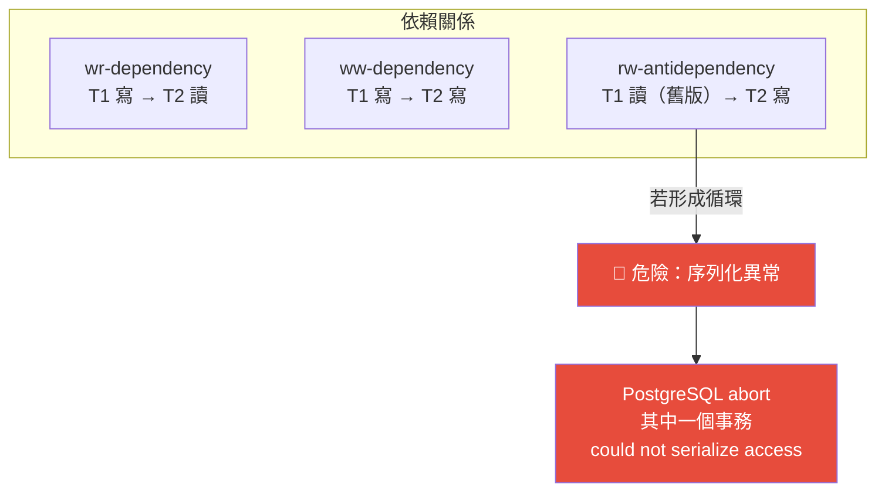
```mermaid
flowchart TD
    subgraph Dependency["依賴關係"]
        WR["wr-dependency<br/>T1 寫 → T2 讀"]
        WW["ww-dependency<br/>T1 寫 → T2 寫"]
        RW["rw-antidependency<br/>T1 讀（舊版）→ T2 寫"]
    end

    RW --> |"若形成循環"| Cycle["🔴 危險：序列化異常"]
    Cycle --> Abort["PostgreSQL abort<br/>其中一個事務<br/>could not serialize access"]

    style Cycle fill:#e74c3c,color:#fff
    style Abort fill:#e74c3c,color:#fff
```

### III. SIREAD Lock — 讀操作的隱形鎖

在 Serializable 級別下，每個 SELECT 都會隱式地獲取 **SIREAD lock**（讀取謂詞鎖）。它不像普通鎖那樣阻塞其他人，而是記錄「我讀了哪些資料」，用於後續的依賴偵測。

```sql
-- Session A (Serializable)
BEGIN ISOLATION LEVEL SERIALIZABLE;
SELECT * FROM doctors WHERE on_call = true;
-- ↑ 獲取 SIREAD lock: 記錄「我讀了 WHERE on_call=true 的所有行」
```

SIREAD lock 的粒度不是 row-level，而是 **page-level**。這意味著：
- 如果你讀了 page 1 中的某行，整個 page 1 被標記為「被讀取」
- 如果其他事務修改了這個 page 中的**任何行**（即使不是你讀的那一行），就可能觸發 rw-antidependency
- 在高並發場景下，page-level granularity 可能導致 **false positive serialization failure**

### IV. Serialization Failure 的觸發條件

SSI 會在你 COMMIT 時檢查依賴圖中是否存在**包含 rw-antidependency 的循環**。如果存在，PostgreSQL 會 abort 其中一個事務並回傳 error：

```
ERROR: could not serialize access due to read/write dependencies among transactions
DETAIL: Reason code: Canceled on identification as a pivot, during commit attempt.
HINT: The transaction might succeed if retried.
```

**關鍵認知**：Serializable 不保證你的事務一定成功，而是保證**要嘛成功（且結果等價於某種序列執行順序）、要嘛報錯讓你重試**。

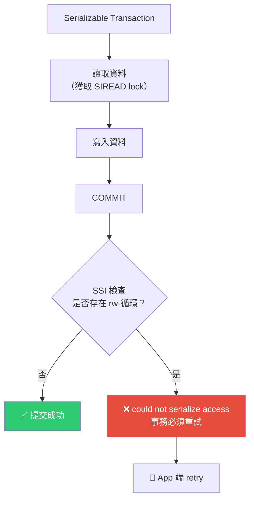
```mermaid
flowchart TD
    TX["Serializable Transaction"]
    TX --> READ["讀取資料<br/>（獲取 SIREAD lock）"]
    READ --> WRITE["寫入資料"]
    WRITE --> COMMIT["COMMIT"]
    COMMIT --> CHECK{"SSI 檢查<br/>是否存在 rw-循環？"}
    CHECK -->|"否"| SUCCESS["✅ 提交成功"]
    CHECK -->|"是"| FAIL["❌ could not serialize access<br/>事務必須重試"]
    FAIL --> RETRY["🔄 App 端 retry"]

    style SUCCESS fill:#2ecc71,color:#fff
    style FAIL fill:#e74c3c,color:#fff
```

### V. 效能 Overhead 與 Production 取捨

| 面向 | Read Committed | Repeatable Read | Serializable |
|------|:---:|:---:|:---:|
| Snapshot 獲取 | 每個 statement 一次 | 整個事務一次 | 整個事務一次 |
| SIREAD lock | ❌ | ❌ | ✅（page-level） |
| 記憶體額外開銷 | 無 | 無 | 每個事務需要 SIREAD lock 追蹤 |
| 衝突偵測 | 無 | 無 | COMMIT 時進行 |
| False positive | 無 | 無 | 可能（page-level granularity） |
| 適合場景 | 90% 的 OLTP | 報表/一致性讀取 | 關鍵金融操作 |

**效能影響的量化理解**：
- SIREAD lock 儲存在 shared memory 中（由 `max_pred_locks_per_transaction` 控制，預設 64）
- 每個 transaction 最多可有 64 個 predicate lock（page 級），超過時會升級為 relation 級別 lock
- relation 級別的 SIREAD lock 會導致大量 false positive，應避免（透過調高 `max_pred_locks_per_transaction`）
- Serializable 的 overhead 主要不是 CPU，而是**abort rate**：高並發下可能頻繁觸發 serialization failure

```sql
-- 查看 predicate lock 使用情況
SELECT mode, count(*) FROM pg_locks
WHERE locktype = 'SIReadLock'
GROUP BY mode;
```

---

## 6. 隔離級別選擇決策矩陣

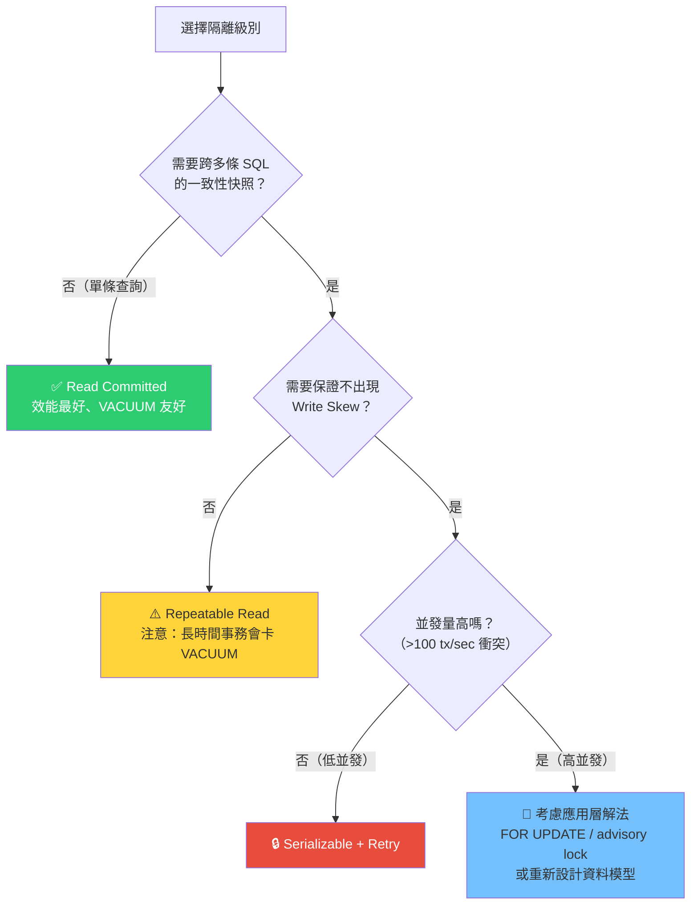
```mermaid
flowchart TD
    START["選擇隔離級別"] --> Q1{"需要跨多條 SQL<br/>的一致性快照？"}
    Q1 -->|"否（單條查詢）"| RC["✅ Read Committed<br/>效能最好、VACUUM 友好"]
    Q1 -->|"是"| Q2{"需要保證不出現<br/>Write Skew？"}
    Q2 -->|"否"| RR["⚠️ Repeatable Read<br/>注意：長時間事務會卡 VACUUM"]
    Q2 -->|"是"| Q3{"並發量高嗎？<br/>（>100 tx/sec 衝突）"}
    Q3 -->|"否（低並發）"| SERIAL["🔒 Serializable + Retry"]
    Q3 -->|"是（高並發）"| ALT["🔄 考慮應用層解法<br/>FOR UPDATE / advisory lock<br/>或重新設計資料模型"]

    style RC fill:#2ecc71,color:#fff
    style RR fill:#ffd43b
    style SERIAL fill:#e74c3c,color:#fff
    style ALT fill:#74c0fc
```

| 級別 | 防止 Dirty Read | 防止 Non-Repeatable Read | 防止 Phantom Read | 防止 Write Skew | VACUUM 友好 |
|------|:---:|:---:|:---:|:---:|:---:|
| Read Committed | ✅ | ❌ | ❌ | ❌ | ✅✅✅ |
| Repeatable Read | ✅ | ✅ | ✅ (PG 獨有) | ❌ | ❌ |
| Serializable | ✅ | ✅ | ✅ | ✅ | ❌ |

### V. 30 秒應急排查卡

生產事故發生時，前 30 秒跑這 3 條 SQL（全部唯讀，不需要 superuser 權限）：

#### a. 第 1 條：誰在幹嘛？（5 秒）

```sql
SELECT pid, usename, application_name, state,
       wait_event_type, wait_event,
       age(now(), xact_start) AS xact_age,
       LEFT(query, 100) AS query
FROM pg_stat_activity
WHERE state <> 'idle'
  AND backend_type = 'client backend'
ORDER BY xact_start;
```

| 看到什麼 | 判斷 | 行動 |
|----------|------|------|
| 所有 `xact_age < 1秒` | 🟢 正常，沒有長事務 | 問題不在 transaction 層 |
| 有 `xact_age > 5分鐘` 的 active session | 🔴 嚴重長事務，可能在等 lock 或用戶斷線 | 第 2 條查 lock wait |
| 有 `state = 'idle in transaction'` 且 `xact_age > 1分鐘` | 🟠 有人忘了 COMMIT/ROLLBACK | 回到 `## 2` 場景（VACUUM 積壓） |
| 有 `state = 'active'` 且 `wait_event_type = 'Lock'` | 🔴 有人卡在等鎖 | 立刻跑第 2 條查詢 |
| 有 `state = 'active'` 且 `query` 為空 | 🟡 可能是 client 發送了 query 但 pending（網路問題） | 檢查 client 端 |

#### b. 第 2 條：有 Lock Wait 嗎？（5 秒）

```sql
SELECT locktype, mode, granted, count(*) AS count
FROM pg_locks
WHERE NOT granted
GROUP BY locktype, mode, granted
ORDER BY count DESC;
```

| 看到什麼 | 判斷 | 行動 |
|----------|------|------|
| 返回 0 行 | 🟢 沒有 lock wait | Lock 不是當前問題 |
| `locktype = 'transactionid'` 且 NOT granted | 🔴 有人在等另一個 transaction COMMIT（最常見的 lock wait） | 查 blocking session → kill |
| `locktype = 'relation'` 且 mode = `AccessExclusiveLock` | 🔴 有人在等 DDL（如 ALTER TABLE），block 了所有讀寫 | 通常是有 migration / 維護作業忘了 COMMIT |
| `locktype = 'tuple'` 且 NOT granted | 🟠 有人在等同一 row 的 lock（`FOR UPDATE` 競爭） | 檢查 application 層是否有 concurrent update 到同一 row |

```sql
-- 補充查詢：誰是阻塞者？（如果上面有結果）
SELECT blocked.pid AS blocked_pid,
       blocked.query AS blocked_query,
       blocking.pid AS blocking_pid,
       blocking.query AS blocking_query,
       age(now(), blocking.xact_start) AS blocking_xact_age
FROM pg_stat_activity blocked
JOIN pg_locks blocked_locks ON blocked.pid = blocked_locks.pid
JOIN pg_locks blocking_locks ON blocked_locks.locktype = blocking_locks.locktype
    AND blocked_locks.database IS NOT DISTINCT FROM blocking_locks.database
    AND blocked_locks.relation IS NOT DISTINCT FROM blocking_locks.relation
    AND blocked_locks.page IS NOT DISTINCT FROM blocking_locks.page
    AND blocked_locks.tuple IS NOT DISTINCT FROM blocking_locks.tuple
    AND blocked_locks.transactionid IS NOT DISTINCT FROM blocking_locks.transactionid
    AND blocked_locks.pid <> blocking_locks.pid
JOIN pg_stat_activity blocking ON blocking.pid = blocking_locks.pid
WHERE NOT blocked_locks.granted
  AND blocking.state <> 'idle';
```

#### c. 第 3 條：有人卡 VACUUM 嗎？（5 秒）

```sql
SELECT pid, usename, application_name, state,
       age(backend_xmin) AS xmin_age,
       age(now(), xact_start) AS xact_age,
       LEFT(query, 80) AS query
FROM pg_stat_activity
WHERE backend_xmin IS NOT NULL
  AND state = 'idle in transaction'
ORDER BY age(backend_xmin) DESC
LIMIT 20;
```

| 看到什麼 | 判斷 | 行動 |
|----------|------|------|
| 返回 0 行 | 🟢 卡 VACUUM 的不是 `idle in transaction` | 回到 `## 2.III` 找其他根因 |
| `xmin_age > 5分鐘` 且 `state = 'idle in transaction'` | 🔴 典型 RR/SERIALIZABLE 忘了 COMMIT | Kill 這個 session 或通知 owner |
| `xmin_age > 1小時` | 💀 極端情況，VACUUM 完全被阻塞 | 立刻 kill；事後設定 `idle_in_transaction_session_timeout` |
| 同一個 application 多個 session | 🟠 Application connection pool 可能有 leak | 通知 App Dev 檢查 pool 設定 |

#### d. 快速對照表：生產症狀 → 根因 → 查詢指引

| 生產症狀 | 最可能根因 | 優先查本文段落 | 第一步 SQL |
|----------|-----------|---------------|-----------|
| 某表查詢越來越慢 | Dead tuple 積壓（VACUUM 被長事務卡住） | `## 2` Repeatable Read VACUUM 積壓 | 30 秒卡第 3 條 → 第 1 條 |
| 交易重複（重複扣款/退款） | Phantom Read（RC 下兩次 SELECT 之間被其他 session 改變） | `## 1` Read Committed Phantom | 30 秒卡第 1 條（看 concurrent write） |
| 報表數字對不上 | 同上，或應用層沒用 transaction | `## 1` + `# 三.1`（Npgsql transaction 管理） | 30 秒卡第 1 條 |
| API 隨機報 40001 error | Serializable Write Skew 衝突 | `## 3` Serializable Write Skew | 30 秒卡第 1 條 + `## 3.IV` 指標 |
| Connection pool 耗盡 | 大量 `idle in transaction` session | `## 2` + 檢查 `idle_in_transaction_session_timeout` 設定 | 30 秒卡第 1 條（看 state） |
| DB 整體變慢但 CPU/IO 正常 | 有人在等 lock（Lock Wait） | `## 1`（ROW SHARE / EXCLUSIVE lock 競爭） | 30 秒卡第 2 條 |
| Disk 使用率急速上升 | Bloat 累積（Dead tuple 未被回收） | `## 2` Repeatable Read VACUUM 積壓 | 30 秒卡第 3 條 + `## 2.IV` bloat 估算 |
| 無法 ALTER TABLE / CREATE INDEX | 有 session 持有該表的 ACCESS SHARE lock 不釋放 | `## 2`（idle in transaction 持有 snapshot） | 30 秒卡第 1 條 + 第 2 條 |

> 補充（Senior Dev）：這 3 條 SQL 的設計原則是「30 秒內鎖定問題方向」，不是「30 秒內解決問題」。實際生產事故中，80% 的情況在這 3 條查詢就能找到根因（長事務、lock wait、或 VACUUM 阻塞）。剩下的 20% 才需要深入 `pg_stat_statements`、`EXPLAIN ANALYZE`、或 application log 交叉比對。

---

# 二、App Dev 視角：.NET / Dapper 實戰

## 1. Npgsql 中的 IsolationLevel 設定

### I. NpgsqlTransaction 的 IsolationLevel Enum

Npgsql 支援以下五個 enum 值：

```csharp
using var tx = conn.BeginTransaction(IsolationLevel.ReadCommitted);
```

| Npgsql Enum | PG 對應 | 注意 |
|-------------|---------|------|
| `ReadUncommitted` | Read Committed | PG 中等同 RC |
| `ReadCommitted` | Read Committed | **預設值** |
| `RepeatableRead` | Repeatable Read | 整個事務同一個 Snapshot |
| `Serializable` | Serializable | 需要 retry logic |
| `Snapshot` | Repeatable Read | PG 中等同 RR |
| `Chaos` | — | PG 不支援，會報錯 |

### II. Dapper 的正確 Transaction 管理

```csharp
// ✅ 正確寫法：明確指定隔離級別
using var conn = new NpgsqlConnection(connectionString);
conn.Open();
using var tx = conn.BeginTransaction(IsolationLevel.ReadCommitted);
try
{
    var balance = conn.QuerySingle<int>(
        "SELECT balance FROM accounts WHERE id = @id FOR UPDATE",
        new { id = 1 }, tx);  // ← 傳入 transaction！

    if (balance >= amount)
    {
        conn.Execute(
            "UPDATE accounts SET balance = balance - @amount WHERE id = @id",
            new { amount, id = 1 }, tx);
        conn.Execute(
            "UPDATE accounts SET balance = balance + @amount WHERE id = @id",
            new { amount, id = 2 }, tx);
    }

    tx.Commit();
}
catch (PostgresException ex) when (ex.SqlState == "40001")
{
    // 40001 = serialization_failure
    // 只有 Serializable 會觸發這個 error
    tx.Rollback();
    throw new TransientException("Serialization failure, retry", ex);
}
catch
{
    tx.Rollback();
    throw;
}
```

```csharp
// ❌ 錯誤寫法 1：沒傳 transaction 給 Dapper
var balance = conn.QuerySingle<int>(
    "SELECT balance FROM accounts WHERE id = 1 FOR UPDATE");
// ← FOR UPDATE 需要 transaction！沒傳 tx 會報錯或行為不正確

// ❌ 錯誤寫法 2：用了 Repeatable Read 但沒意識到 VACUUM 風險
using var tx = conn.BeginTransaction(IsolationLevel.RepeatableRead);
// ...處理業務邏輯（可能含外部 API call，耗時不確定）
await httpClient.PostAsync(...);  // ← 如果 timeout，transaction 卡住
tx.Commit();
// → OldestXmin 被鎖住 5 分鐘，VACUUM 無法清理
```

### III. Dapper 參數化查詢與 pg_stat_statements Query Normalization

```csharp
// Dapper 的參數化會產生 $1, $2 佔位符
var orders = conn.Query<Order>(
    "SELECT * FROM orders WHERE status = @status AND create_time > @since",
    new { status = "active", since = DateTime.UtcNow.AddDays(-7) });

// PG 內部實際執行：
// SELECT * FROM orders WHERE status = $1 AND create_time > $2
// pg_stat_statements 的 query normalization 與此一致
// queryid 對應的是「參數化後的 SQL 模板」
```

> 補充（Senior Dev）：Dapper 的參數化預設使用 positional parameters（`$1, $2`），與 Npgsql 的原生行為一致。確保不要在 SQL 中拼接字串（如 `$"WHERE status = '{status}'"`），否則每種參數值會產生不同的 queryid，導致 pg_stat_statements 無法正確彙總統計。如果有動態 WHERE 條件（如 optional filters），使用 Dapper 的 `DynamicParameters` 或 `SqlBuilder`。

### IV. 生產環境配置與可觀測性

#### a. Npgsql Connection String 最佳實踐

Npgsql 連線字串中的每個參數都直接影響 PG 端的行為和可觀測性。以下為生產環境建議的連線字串建構方式：

```csharp
var connStr = new NpgsqlConnectionStringBuilder
{
    Host = "db.example.com",
    Database = "mydb",
    Username = "app_user",
    Password = "***",
    ApplicationName = "MyApp-OrderService",  // ← 對應 pg_stat_activity.application_name
    MaxPoolSize = 50,
    MinPoolSize = 5,
    ConnectionIdleLifetime = 300,
    ConnectionPruningInterval = 10
}.ToString();
```

| 參數 | 生產環境建議值 | 原理與坑點 |
|------|--------------|-----------|
| `ApplicationName` | `{AppName}-{ServiceName}` | 寫入 `pg_stat_activity.application_name`，是排查問題的第一線索。多個 app instance 用相同 ApplicationName 時無法區分個體，需配合 instance-id 尾綴或依賴 client_addr |
| `MaxPoolSize` | 50（預設）；高並發場景 100-200 | `MaxPoolSize × app instance 數 < PG max_connections − (superuser_reserved + 監控連線)`。池耗盡時 Npgsql 拋 `TimeoutException`（"The connection pool has been exhausted"），不應靠加大 PG `max_connections` 來解——每個 PG backend 約佔 5-10MB，連線數過高造成 memory pressure |
| `MinPoolSize` | 5-10 | 避免冷啟動前幾條 query 因建立實體連線而延遲。設太小無效，設太大浪費 PG backend |
| `ConnectionIdleLifetime` | 300（5 分鐘） | **必須 < PG 端 `idle_in_transaction_session_timeout`**。Npgsql pool 持有 idle connection，PG 端 timeout kill 後 pool 不知情，下次取出即報「connection is broken」 |
| `ConnectionPruningInterval` | 10（10 秒） | Pool 清理閒置連線的檢查頻率。過大可能導致大量 broken connection 集中爆發 |

> 補充（Senior Dev）：Npgsql 6.0+ 支援 `KeepAlive` 與 `TcpKeepAlive` 參數，可偵測已被 PG 或網路中斷的 TCP 連線。在容器環境（K8s + 負載均衡器）尤其重要，因為中間網路層的 idle timeout 通常比 PG 端更短，且不會發送 TCP RST 告知 client。

#### b. 記錄 backend_pid 到 Application Log

**原理**：`pg_stat_activity.pid` 是 PG backend process 的 OS 層 PID，Npgsql 的 `conn.ProcessID` 正是這個值。出事時，app log 中的 PID 是唯一能跨系統還原現場的線索。

```csharp
using var conn = new NpgsqlConnection(connectionString);
conn.Open();
_logger.LogInformation(
    "DB connection established, BackendPID={PID}, ApplicationName={App}",
    conn.ProcessID, conn.ConnectionString);
```

**為什麼這麼做**：

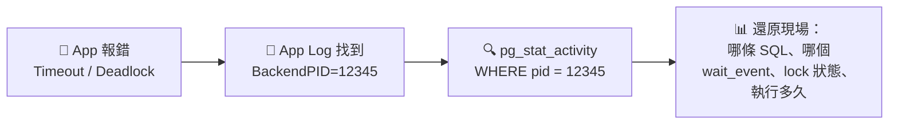
```mermaid
flowchart LR
    A["🔴 App 報錯<br/>Timeout / Deadlock"] --> B["📄 App Log 找到<br/>BackendPID=12345"]
    B --> C["🔍 pg_stat_activity<br/>WHERE pid = 12345"]
    C --> D["📊 還原現場：<br/>哪條 SQL、哪個<br/>wait_event、lock 狀態、<br/>執行多久"]
```

- **Structured Logging 建議**：使用 Serilog / NLog 的 structured logging（`{PID}` 而非字串拼接），方便在 Grafana / ELK 中以 PID 為 key 跨系統查詢
- 建議在 `conn.Open()` 後立刻記錄，確保每次建立實體連線都有 log
- **Connection Pool 下的 PID 重用陷阱**：Npgsql 的 connection pool 會重複使用同一個實體連線——Request A 用完歸還 pool，Request B 再從 pool 拿出**同一條實體連線**。這兩個請求看到的 `conn.ProcessID` 會是相同值，因為底層是同一個 PG backend：

```text
時間 10:00:00  Request A → pool 取出 conn #1（BackendPID=12345）
             App Log: "BackendPID=12345, RequestId=A"
時間 10:00:01  Request A 完成，conn #1 歸還 pool
時間 10:00:05  Request B → pool 取出 conn #1（還是 BackendPID=12345！）
             App Log: "BackendPID=12345, RequestId=B"
```

所以**不能只看 PID**，必須同時對齊時間戳——`pg_stat_activity` 中 PID=12345 在 10:00:00 的 query 屬於 Request A，但在 10:00:05 的 query 屬於 Request B。查問題時的正確做法是：從 app log 找到「出事的時間 + PID」，再到 `pg_stat_activity`（或 PG log）中以**時間窗口**對齊，而非只靠 PID。

#### c. NpgsqlDataSource Connection Pool 的陷阱

Npgsql 7.0+ 推薦使用 `NpgsqlDataSource` 取代手動 `new NpgsqlConnection()`。DataSource 內建 connection pool，是單例（app 生命週期內只建立一次），每次 `CreateConnection()` 或 `OpenConnectionAsync()` 從 pool 中取連線：

```csharp
// Program.cs — 註冊一次，全 app 共用
var dataSourceBuilder = new NpgsqlDataSourceBuilder(connectionString);
dataSourceBuilder.ConnectionStringBuilder.ApplicationName = "MyApp-OrderService";
dataSourceBuilder.ConnectionStringBuilder.MaxPoolSize = 100;
dataSourceBuilder.ConnectionStringBuilder.MinPoolSize = 5;
dataSourceBuilder.ConnectionStringBuilder.ConnectionIdleLifetime = 300;
dataSourceBuilder.ConnectionStringBuilder.ConnectionPruningInterval = 10;
await using var dataSource = dataSourceBuilder.Build();

// DI 註冊
builder.Services.AddNpgsqlDataSource(connectionString);

// 使用——每次呼叫從 pool 取一條連線，用完自動歸還
await using var conn = await dataSource.OpenConnectionAsync();
// ... 執行 SQL ...
// conn.DisposeAsync() 時歸還 pool（不是真正關閉）
```

**為什麼會發生 idle timeout 陷阱**：

```mermaid
sequenceDiagram
    participant Svc as 🖥️ App（DataSource Pool）
    participant PG as 🗄️ PostgreSQL

    Note over Svc: Pool 中有 5 條 idle connection

    rect rgb(255, 230, 200)
        Note over PG: idle_in_transaction_session_timeout = 5min
        PG-->>Svc: 5 分鐘後 PG kill 所有 idle connection
    end

    Note over Svc: DataSource pool 不知道連線已死<br/>（PG kill 時未發 TCP RST，不通知 client）

    Svc->>PG: 取出 conn #3 執行 query
    PG-->>Svc: ❌ NpgsqlException<br/>"server closed the connection unexpectedly"
```

**流程說明**：
1. App 請求結束後，`conn` 被 `Dispose` → 歸還 DataSource pool，實體 TCP 連線保持 open
2. PG 端的 `idle_in_transaction_session_timeout` 倒數 5 分鐘 → kill 該 backend
3. PG kill 時只關閉自己這邊的 socket，**不通知 client**（沒有發 TCP RST 去暴力中斷）
4. DataSource pool 毫不知情，仍認為這條 conn 可用
5. 下一個請求取出這條 conn → 寫入 query → PG 端早已不存在 → `NpgsqlException`

**怎麼查**：

> **注意**：被 PG kill 的連線會從 `pg_stat_activity` 消失，無法直接用 SQL 查到「已死但 pool 不知」的連線。以下查詢的用途是反推：檢查 idle 超過預期時間的連線數——如果 PG 設了 `idle_in_transaction_session_timeout = 5min`，這些連線理論上該被 kill 了卻還活著，表示 timeout 沒設或沒生效。另一個角度是：這些連線處於「隨時可能被 PG kill」的危險狀態，pool 若不及時回收，下一個請求就會踩雷。

```sql
-- 找出 idle 超過 5 分鐘的連線（若 PG timeout=5min，這些要嘛沒被設、要嘛快被 kill 了）
SELECT count(*) AS idle_over_5min,
       array_agg(pid) AS pid_list
FROM pg_stat_activity
WHERE wait_event_type = 'Client'
  AND state = 'idle'
  AND age(now(), state_change) > interval '5 minutes';
```

**App 端偵測才是真正的告警**：因為 PG 端看不到已死的連線，必須從 app log 中搜尋 `server closed the connection unexpectedly` 或 `Exception while reading from stream`，這才是 pool 拿出死連線的證據。

**怎麼解**：

| 解法 | NpgsqlDataSource 設定 | 適用場景 |
|------|----------------------|---------|
| `ConnectionIdleLifetime` < PG timeout | `dataSourceBuilder.ConnectionStringBuilder.ConnectionIdleLifetime = 240`（小於 PG 端 300） | **首選**。Pool 會在連線存活 240 秒後主動關閉重建，永遠不會碰到 PG 端的 300 秒 timeout |
| TCP KeepAlive | `dataSourceBuilder.ConnectionStringBuilder.KeepAlive = 30`（每 30 秒送 keepalive probe） | K8s / 容器環境，中間網路層（LB / Service Mesh）idle timeout 通常比 PG 更短 |
| `ConnectionPruningInterval` | `dataSourceBuilder.ConnectionStringBuilder.ConnectionPruningInterval = 10` | 搭配 IdleLifetime 使用，pool 每 10 秒檢查一次是否有過期連線 |
| PG 端 `idle_session_timeout`（PG14+） | 無需 app 端設定 | 只 kill 非 in-transaction 的 idle 連線，與 `idle_in_transaction_session_timeout` 不同 |

> 補充（Senior Dev）：Data Source 是 Npgsql 7.0 引入的推薦模式。它解決了舊 `NpgsqlConnection` 手動管理 pool 的幾個痛點：(1) 自動處理連線生命週期，不用擔心忘了 `Dispose`；(2) 內建 multiplexing（單一 TCP 連線多工多條 query）；(3) DI 友好，`AddNpgsqlDataSource()` 一行註冊。如果你還在用 `new NpgsqlConnection()` + 手動 `Open()`/`Close()`，強烈建議遷移。

#### d. 生產環境常見問題：Pool 耗盡（"pool has been exhausted"）

**症狀**：App 拋出 `TimeoutException`，訊息包含 `The connection pool has been exhausted`。所有依賴 DB 的 API 全掛。

**為什麼發生**：Npgsql DataSource pool 的大小是固定的（預設 `MaxPoolSize = 100`）。當所有 100 條連線都在使用中，第 101 個請求就會排隊等待，超過 timeout 後報錯。

```mermaid
flowchart TD
    START["🚨 Pool Has Been Exhausted"] --> Q1{"最近有大量<br/>long-running query？"}
    Q1 -->|"是"| CASE1["🟡 場景 A：慢查詢佔用連線<br/>每條 query 跑 10 秒<br/>100 connections = 10 QPS 上限"]
    Q1 -->|"否"| Q2{"pg_stat_activity 中大量<br/>idle in transaction？"}
    Q2 -->|"是"| CASE2["🔴 場景 B：有人忘了 COMMIT<br/>連線被佔著不做事也不釋放<br/>（idle in transaction）"]
    Q2 -->|"否"| Q3{"突然的流量尖峰？"}
    Q3 -->|"是"| CASE3["🟠 場景 C：流量超出 pool 容量<br/>短時間內請求暴增"]
    Q3 -->|"否"| CASE4["⚠️ 場景 D：Connection Leak<br/>conn 沒被 Dispose<br/>連線不歸還 pool"]

    CASE1 --> SOL1["✅ 優化慢查詢 / 加 statement_timeout<br/>暫時調高 MaxPoolSize 止血"]
    CASE2 --> SOL2["✅ Kill idle in transaction session<br/>設定 idle_in_transaction_session_timeout"]
    CASE3 --> SOL3["✅ 調高 MaxPoolSize<br/>或加 PgBouncer 做連線排隊"]
    CASE4 --> SOL4["✅ 檢查 code：確保 using / await using<br/>每個 conn 都有 Dispose"]

    style START fill:#e74c3c,color:#fff
    style CASE2 fill:#e74c3c,color:#fff
```

**30 秒診斷查詢**：

```sql
-- 第 1 條：現在誰佔著連線？
SELECT state, count(*) AS conn_count
FROM pg_stat_activity
WHERE backend_type = 'client backend'
  AND application_name LIKE '%YourApp%'   -- ← 換成你的 ApplicationName
GROUP BY state
ORDER BY count DESC;

-- 正常時：active < 20%, idle > 80%
-- 🔴 idle in transaction > 0 就要注意（有人忘了 COMMIT）
-- 🔴 active 接近 MaxPoolSize → pool 快耗盡
```

```sql
-- 第 2 條：哪條 SQL 佔連線最久？
SELECT pid, usename, state,
       now() - query_start AS query_duration,
       now() - xact_start AS xact_duration,
       LEFT(query, 150) AS query
FROM pg_stat_activity
WHERE backend_type = 'client backend'
  AND application_name LIKE '%YourApp%'
  AND state <> 'idle'
ORDER BY query_start;
-- 紅旗：query_duration > 5s 的 SQL = 慢查詢，佔住連線不釋放
```

**解法矩陣**：

| 場景 | 止血（立刻） | 根治（長期） |
|------|------------|------------|
| A. 慢查詢 | 調高 `MaxPoolSize` 到 200 | `statement_timeout = 30s`；優化 query；加 index |
| B. 忘了 COMMIT | `SELECT pg_terminate_backend(pid)` kill 掉 | `idle_in_transaction_session_timeout = 5min` |
| C. 流量尖峰 | 調高 `MaxPoolSize`；加 PgBouncer | 擴容 / 限流 / 訊息佇列削峰 |
| D. Connection Leak | 重啟 app（連線全部釋放） | 檢查所有 `NpgsqlConnection` 是否都有 `await using` |

> **MaxPoolSize 不是越大越好**：每個 PG backend 佔 5-10MB memory。1000 個 connection = 5-10GB 記憶體只用在連線上。超過 200 建議導入 PgBouncer（transaction mode），把 app 端物理連線控制在 100 以下。

#### e. 生產症狀對照表

以下表格幫助 App Dev 從自己看到的異常，快速定位 PG 層根因與應讀章節：

| App 層異常 | Npgsql Exception | PG 層根因 | 相關章節 |
|-----------|-----------------|----------|---------|
| 交易失敗需重試 | `PostgresException` SqlState=`40001` | SSI serialization_failure | 一.5（SSI 原理）、三.2（Retry Pattern） |
| Connection 逾時 | `TimeoutException`（"pool has been exhausted"） | Pool 耗盡 / long-running query | 此處（Connection Pool 配置） |
| Connection 突然斷線 | `NpgsqlException`（"Exception while reading from stream"） | PG kill idle connection / 網路中斷 | 此處（idle timeout 陷阱） |
| 查詢突然變慢 | —（app 端感知 latency 飆高） | Table / Index Bloat、缺 VACUUM | 一.6（VACUUM 原理）、二.2（Bloat 案例） |
| 資料不一致（帳不平） | — | Phantom Read / Write Skew | 一.4（RR 能阻擋什麼）、二.1（Phantom 案例） |
| Deadlock | `PostgresException` SqlState=`40P01` | 兩個 transaction 互相等待對方 lock | 二.3（Deadlock 診斷） |

## 2. Serializable Retry Pattern

### I. 為什麼 Serializable 需要 Retry？

Serializable 的 serialization failure 不是 bug，是**設計行為**。SSI 在 COMMIT 時才檢查依賴，所以你的 transaction 可能會：
1. 執行所有 SQL 都成功
2. 到 `tx.Commit()` 時才拋 `40001 serialization_failure`
3. 你必須重試整個 transaction

### II. C# Retry Pattern（Polly）

```csharp
using Polly;

var retryPolicy = Policy
    .Handle<PostgresException>(ex => ex.SqlState == "40001")
    .WaitAndRetry(
        retryCount: 3,
        sleepDurationProvider: retryAttempt =>
            TimeSpan.FromMilliseconds(Math.Pow(2, retryAttempt) * 100),
        onRetry: (exception, timeSpan, retryCount, context) =>
        {
            _logger.LogWarning(
                "Serialization failure on retry {RetryCount}, " +
                "waiting {WaitMs}ms before retry",
                retryCount, timeSpan.TotalMilliseconds);
        });

retryPolicy.Execute(() =>
{
    using var conn = new NpgsqlConnection(connectionString);
    conn.Open();
    using var tx = conn.BeginTransaction(IsolationLevel.Serializable);
    try
    {
        // 你的 business logic
        var count = conn.QuerySingle<int>(
            "SELECT COUNT(*) FROM doctors WHERE on_call",
            transaction: tx);
        if (count >= 2)
        {
            conn.Execute(
                "UPDATE doctors SET on_call = false WHERE id = @id",
                new { id = 1 }, tx);
        }
        tx.Commit();
    }
    catch
    {
        tx.Rollback();
        throw;
    }
});
```

### III. 什麼時候該降級而非重試？

| 情況 | 建議 |
|------|------|
| 高並發、高衝突率（>5% abort rate） | 不要用 Serializable，改用 `SELECT FOR UPDATE` + Read Committed |
| 外部 API call 在 transaction 內 | 不要用 Serializable，transaction 時間太長會放大衝突 |
| 偶爾的 write skew 可容忍 | 用 Repeatable Read + 業務邏輯補償（比 retry overhead 小） |
| 金流、庫存扣減 | Serializable + retry（不能容忍一致性錯誤） |

### IV. 生產環境 Retry 監控與告警

#### a. Retry Metrics 建議

Serializable retry 必須有可觀測性，否則你不知道重試是救了你還是蓋住了問題。

**必須埋的 3 個 Metrics**：

| Metric 名稱 | 型別 | 說明 | 告警條件 |
|------------|------|------|---------|
| `db_serialization_retry_total` | Counter | 每次觸發 40001 retry 時 +1 | — |
| `db_serialization_retry_success` | Counter | retry 最終成功 commit | — |
| `db_serialization_retry_exhausted` | Counter | 重試 N 次仍失敗 | rate > 1%（佔總交易比例）觸發告警 |

```csharp
// 使用 System.Diagnostics.Metrics（.NET 6+ 內建，無需外部依賴）
public static class DbMetrics
{
    private static readonly Meter Meter = new("MyApp.Database", "1.0");

    public static readonly Counter<int> SerializationRetryTotal = Meter.CreateCounter<int>(
        "db_serialization_retry_total", description: "Total serialization failure retries");

    public static readonly Counter<int> SerializationRetrySuccess = Meter.CreateCounter<int>(
        "db_serialization_retry_success", description: "Successful retries after 40001");

    public static readonly Counter<int> SerializationRetryExhausted = Meter.CreateCounter<int>(
        "db_serialization_retry_exhausted", description: "Retries exhausted without success");
}
```

> 補充（Senior Dev）：`System.Diagnostics.Metrics` 是 .NET 的 OpenTelemetry-compatible API，可透過 `OpenTelemetry.Exporter.Prometheus` 或 `OpenTelemetry.Exporter.Console` 匯出。如果團隊已有 Prometheus + Grafana stack，建議直接走 OTel pipeline。重點不在於用哪個 library，而在於 **retry_exhausted rate 的告警閾值**——這個數字默默上升代表衝突率已超出 Serializable 能承擔的範圍，需要降級隔離級別或改架構。

#### b. Thundering Herd（驚群效應）問題

**原理**：多個 app instance 同時遇到 serialization failure 時，如果都用相同的固定 backoff 間隔（如 100ms），所有 instance 會在同一瞬間 retry → 再次全部衝突 → 再次同時 retry，形成「永遠無法全部成功」的共振效應。

```mermaid
sequenceDiagram
    participant A1 as 🖥️ Instance 1
    participant A2 as 🖥️ Instance 2
    participant A3 as 🖥️ Instance 3
    participant PG as 🗄️ PostgreSQL

    Note over A1,A3: 同時執行 Serializable tx
    A1->>PG: COMMIT ❌ 40001
    A2->>PG: COMMIT ❌ 40001
    A3->>PG: COMMIT ✅（唯一存活）
    Note over A1,A3: 固定 backoff 100ms → 同時醒來
    A1->>PG: RETRY ❌ 40001（再次衝突！）
    A2->>PG: RETRY ❌ 40001（再次衝突！）
    Note over A1,A3: 加 jitter（隨機抖動）後
    A1->>PG: RETRY（87ms 後） ✅
    A2->>PG: RETRY（231ms 後） ✅
```

**正確做法：Jitter × Exponential Backoff**：

```csharp
var retryPolicy = Policy
    .Handle<PostgresException>(ex => ex.SqlState == "40001")
    .WaitAndRetry(
        retryCount: 3,
        sleepDurationProvider: retryAttempt =>
            TimeSpan.FromMilliseconds(
                Math.Pow(2, retryAttempt) * 100 + Random.Shared.Next(0, 100)),
        onRetry: (exception, timeSpan, retryCount, context) =>
        {
            _logger.LogWarning(
                "Serialization failure retry {Count}/3, wait {Ms}ms",
                retryCount, timeSpan.TotalMilliseconds);
        });
```

| 參數 | 說明 |
|------|------|
| `Math.Pow(2, retryAttempt) * 100` | Exponential backoff：100ms → 200ms → 400ms |
| `Random.Shared.Next(0, 100)` | Jitter：0-99ms 隨機抖動，破壞多 instance 間的同步 |
| `retryCount: 3` | 最多 3 次 retry（共 4 次嘗試）。超過 3 次的場景建議改用 async retry |

> 補充（Senior Dev）：`Random.Shared` 是 .NET 6+ 的 thread-safe 隨機數產生器，適合在 Polly 的 `sleepDurationProvider` 中使用（該 delegate 可能被多個 thread 同時呼叫）。如果使用 Polly v8+，`WaitAndRetry` API 略有不同（改為 `WaitAndRetryAsync` + `RetryStrategyBuilder`），上述範例以 Polly v7 為準，升級時要注意 migration。

#### c. 架構建議：同步 Retry vs Message Queue + Outbox Pattern

並非所有場景都適合在 app 層做同步 retry：

| 維度 | 適合同步 Retry | 適合 Message Queue + Outbox |
|------|-------------|--------------------------|
| 衝突率 | 低（< 1%） | 高（> 5%） |
| Transaction 時間 | 短（< 50ms） | 長（> 500ms，或含外部 API call） |
| 一致性要求 | 強一致（需要 immediate consistency） | 最終一致可接受 |
| 跨服務操作 | 單一服務內 | 涉及多個微服務或第三方 API |
| 失敗代價 | 低（retry 成本小於降級風險） | 高（需要補償機制 + idempotency key） |

```mermaid
flowchart TD
    S["🔴 交易被 40001 中斷"]
    S --> Q1{"衝突率 < 1%<br/>且 tx < 50ms？"}
    Q1 -->|"✅ 是"| R["🔄 同步 Retry<br/>Jitter + Exponential Backoff"]
    Q1 -->|"❌ 否"| Q2{"涉及外部 API<br/>或跨服務操作？"}
    Q2 -->|"✅ 是"| M["📬 Message Queue<br/>+ Outbox Pattern"]
    Q2 -->|"❌ 否"| C{"高衝突率<br/>但非跨服務？"}
    C -->|"是"| D["⬇️ 降級隔離級別<br/>到 Read Committed +<br/>SELECT FOR UPDATE"]
    C -->|"否"| R

    style S fill:#e74c3c,color:#fff
    style R fill:#2ecc71,color:#fff
    style M fill:#3498db,color:#fff
    style D fill:#ffd43b,color:#000
```

**Outbox Pattern 簡介**（for App Dev）：將「要執行的操作」先寫入一個 `outbox` 表（與業務操作在同一個 transaction），再由 background worker 從 outbox 讀取並 async 執行。這樣即使外部操作失敗，也可以獨立 retry，不影響原始 transaction 的 commit。

> 補充（Senior Dev）：Outbox pattern 在 .NET 生態中最常見的實作是 MassTransit + PostgreSQL（或 NServiceBus）。核心原則：「先 persist，再 publish」——確保 event/message 不會因為 transaction rollback 而丟失，也不會因為 message broker 暫時不可用而阻斷業務流程。如果團隊規模小或不需要 full ESB，也可以用 `System.Threading.Channels` + `BackgroundService` 做一個簡化版 in-process outbox。

---

# 附錄、SQL Standard vs PostgreSQL 隔離級別對照

| 異常現象 | SQL Standard 定義 | PG Read Committed | PG Repeatable Read | PG Serializable |
|----------|:---:|:---:|:---:|:---:|
| **Dirty Read** | RC 防止 | ✅ 防止 | ✅ 防止 | ✅ 防止 |
| **Non-Repeatable Read** | RR 防止 | ❌ 不防止 | ✅ 防止 | ✅ 防止 |
| **Phantom Read** | Serializable 防止 | ❌ 不防止 | ✅ 防止 (PG 獨有) | ✅ 防止 |
| **Serialization Anomaly** | Serializable 防止 | ❌ 不防止 | ❌ 不防止 | ✅ 防止 |
| **Write Skew** | （無明確定義） | ❌ | ❌ | ✅ |

> PostgreSQL 的 Repeatable Read 實際上達到了 SQL Standard 中 Serializable 的大部分保證（防止 Phantom Read），但不能防止所有序列化異常（Write Skew 仍可能發生）。真正的 Serializable 使用 SSI 來偵測並拒絕這些異常。

## 生產環境速查卡（One-Page Quick Reference）

### I. Top 5 生產症狀 → 根因 → 查詢對照

| # | 症狀（App Dev 看到的） | DB 層面現象 | 最可能根因 | 優先執行 SQL | 對應章節 |
|---|---------------------|-----------|----------|------------|---------|
| 1 | API response 變慢 | 大量 dead tuple、seq scan 時間增加 | 長時間未 COMMIT 的 RR 事務卡 VACUUM | 30 秒卡 #3 | 一.6、二.2 |
| 2 | 特定 API 一直 timeout | lock wait queue 堆積 | `FOR UPDATE` 未釋放 / 忘了 COMMIT | 30 秒卡 #2 | 一.3、三.1 |
| 3 | 重試率飆高、409/Conflict | 40001 serialization_failure | Serializable 高並發衝突 | rollback rate query | 一.5、三.2 |
| 4 | 餘額/庫存對不上 | 資料不一致但無 error | Phantom Read / Write Skew | 審計查詢 | 一.4、二.1 |
| 5 | 表大小暴增、disk 告警 | bloat > 50% | 大規模 DELETE/UPDATE 後 VACUUM 跟不上 | Bloat 查詢 | 一.6、二.2 |

### II. 30 秒三連查詢

```sql
-- #1 誰在幹嘛？（看 active session）
SELECT pid, usename, application_name, state,
       wait_event_type, wait_event,
       age(now(), xact_start) AS xact_age,
       LEFT(query, 100) AS query
FROM pg_stat_activity
WHERE state <> 'idle'
ORDER BY xact_start;
-- 紅旗：xact_age > 5min 且 state = 'idle in transaction'

-- #2 誰卡住誰？（看 lock wait）
SELECT blocked.pid AS blocked_pid,
       blocked.query AS blocked_query,
       blocking.pid AS blocking_pid,
       blocking.query AS blocking_query,
       age(now(), blocked.query_start) AS wait_time
FROM pg_stat_activity blocked
JOIN pg_locks bl ON blocked.pid = bl.pid AND NOT bl.granted
JOIN pg_locks bk ON bl.locktype = bk.locktype AND bl.relation = bk.relation
                 AND bk.granted
JOIN pg_stat_activity blocking ON bk.pid = blocking.pid;
-- 紅旗：wait_time > 30s

-- #3 誰卡 VACUUM？（看 OldestXmin）
SELECT pid, usename, state,
       age(backend_xmin) AS xmin_tx_age,
       age(now(), xact_start) AS xact_age,
       LEFT(query, 100) AS query
FROM pg_stat_activity
WHERE backend_xmin IS NOT NULL
  AND state = 'idle in transaction'
ORDER BY age(backend_xmin) DESC;
-- 紅旗：xmin_tx_age 很大（百萬以上）
```

### III. GUC 參數速查

| 參數 | 建議值 | 白話解釋 | 為什麼重要 |
|------|--------|---------|----------|
| `idle_in_transaction_session_timeout` | `5min` | 忘了 COMMIT 的事務 5 分鐘後自動 kill | 防止 OldestXmin 卡住 |
| `max_pred_locks_per_transaction` | `128`（高並發 SZ 場景） | Serializable 事務最多能追蹤多少個 page lock | 防止升級為 relation-level 導致大量 false positive |
| `old_snapshot_threshold` | `1h`（如需防長 RR 事務） | RR 事務的 snapshot 最長活多久 | 超過時查詢會報錯，但保護 VACUUM |
| `lock_timeout` | `30s`（或按業務） | 等 lock 最久等多久 | 防止 lock wait 無限期堆積 |
| `statement_timeout` | `30s`（OLTP） | 一條 SQL 最久跑多久 | 防止慢查詢佔用 connection |
| `log_lock_waits` | `on`（建議開啟） | lock wait > `deadlock_timeout` 時寫入 log | 事後排查 lock 問題的關鍵 |

### IV. Log Pattern 速查

| Log 關鍵字 | 含義 | 行動 |
|-----------|------|------|
| `could not serialize access` | Serializable 衝突，事務被 abort | 檢查 retry rate，必要時降級隔離級別 |
| `deadlock detected` | 兩個事務互相等待對方的 lock | 檢查 app code 的 lock 獲取順序 |
| `canceling statement due to lock timeout` | lock_timeout 觸發 | 找出 blocking session |
| `canceling statement due to statement timeout` | statement_timeout 觸發 | 優化慢查詢或調高 timeout |
| `snapshot too old` | RR 事務的 snapshot 超過 old_snapshot_threshold | 縮短事務或調高閾值 |

## 版本演進

| 功能 | 版本 | 說明 |
|------|------|------|
| SSI (Serializable Snapshot Isolation) | PG 9.1 | 取代傳統 S2PL 鎖定，效能大幅提升 |
| `predicate_lock_consistency` | PG 9.2-9.x | 控制 SIREAD lock 的 false positive（PG 10 移除） |
| `old_snapshot_threshold` | PG 9.6 | 限制 RR 事務的 snapshot 壽命 |
| `idle_in_transaction_session_timeout` | PG 10 | 自動 kill 忘了 COMMIT 的 session |
| `default_transaction_isolation` 支援 enum | PG 10+ | 不再需要用字串設定 |
| `pg_stat_activity.backend_xmin` | 內建 | 直接查看每個 session 的 snapshot xmin |
| `log_lock_waits` | PG 8.1+ | 記錄 lock wait 到 log（`deadlock_timeout` 間隔），建議開啟 |

## 參考

- [PostgreSQL Official — Transaction Isolation](https://www.postgresql.org/docs/current/transaction-iso.html)
- [PostgreSQL SSI Paper (Ports & Grittner, 2012)](https://drkp.net/papers/ssi-vldb12.pdf)
- [PostgreSQL Concurrency Control — MVCC Deep Dive](https://www.interdb.jp/pg/pgsql05.html)
- [PostgreSQL Wiki — Lock Monitoring](https://wiki.postgresql.org/wiki/Lock_Monitoring)
- [PostgreSQL Wiki — Serializable Snapshot Isolation](https://wiki.postgresql.org/wiki/Serializable)
