# PostgreSQL Transaction 隔離級別 — 從 MVCC 到生產環境實戰

> 本文系統性解析 PostgreSQL 四種 Transaction 隔離級別的底層實現、行為差異、生產環境陷阱，以及作為 .NET Application Developer 該如何正確選擇和使用。

---

# 一、Transaction 隔離級別的底層：MVCC 與 Snapshot

## 1. Snapshot 獲取時機 —— 隔離級別的唯一定義方式

### I. 先決知識：Snapshot 結構

在深入隔離級別之前，必須理解 PostgreSQL 如何表示「某一時刻的數據庫狀態」。這個機制的核心是 **Snapshot**：

```
Snapshot = {
    xmin: 42,           // 最早仍在活躍的事務 XID。所有 < 42 的事務肯定已 COMMIT 或 ABORT
    xmax: 50,           // 下一個將被分配的 XID。所有 ≥ 50 的事務尚未開始
    xip:  [44, 46, 47], // 當前活躍的事務 XID 列表（在 xmin 到 xmax 之間的進行中事務）
    curcid: 0            // 當前事務內的 command ID（用於同一事務內的多條 statement 可見性）
}
```

Snapshot 決定了**你能看到哪些 row**：
- xmin < snapshot.xmin → **肯定已提交**，可見（除非 xmax 也 < snapshot.xmin，表示被刪除了）
- xmin ≥ snapshot.xmax → **未來的事務**，不可見
- xmin 在 xip[] 中 → **仍在進行中**，不可見
- xmin 不在 xip[] 中且 < snapshot.xmax → 已結束（已提交），可見

> 補充（Senior Dev）：Snapshot 的獲取成本不是免費的。`GetSnapshotData()` 需要掃描 PG 內部的 ProcArray（所有 active backend 的 XID 列表），在數千個 connection 的環境中，這個掃描需要 hold ProcArrayLock（shared lock），高並發下可能成為瓶頸。這就是為什麼 PG 用 snapshot 而非 lock-based concurrency 的代價之一。

### II. 隔離級別的唯一定義：Snapshot 何時獲取

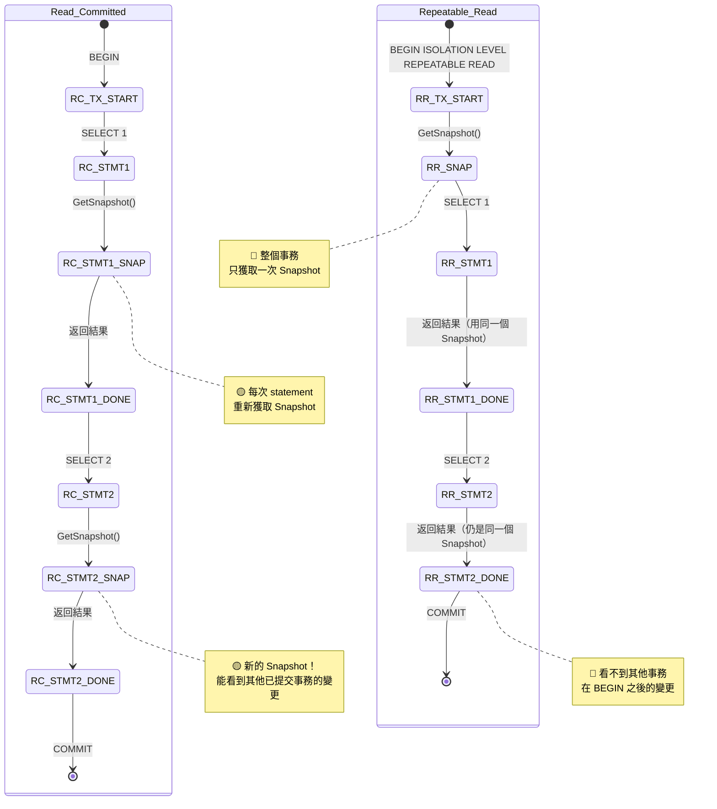
```mermaid
stateDiagram-v2
    state Read_Committed {
        [*] --> RC_TX_START : BEGIN
        RC_TX_START --> RC_STMT1 : SELECT 1
        RC_STMT1 --> RC_STMT1_SNAP : GetSnapshot()
        note right of RC_STMT1_SNAP : 🟡 每次 statement<br/>重新獲取 Snapshot
        RC_STMT1_SNAP --> RC_STMT1_DONE : 返回結果
        RC_STMT1_DONE --> RC_STMT2 : SELECT 2
        RC_STMT2 --> RC_STMT2_SNAP : GetSnapshot()
        note right of RC_STMT2_SNAP : 🟡 新的 Snapshot！<br/>能看到其他已提交事務的變更
        RC_STMT2_SNAP --> RC_STMT2_DONE : 返回結果
        RC_STMT2_DONE --> [*] : COMMIT
    }

    state Repeatable_Read {
        [*] --> RR_TX_START : BEGIN ISOLATION LEVEL REPEATABLE READ
        RR_TX_START --> RR_SNAP : GetSnapshot()
        note right of RR_SNAP : 🔵 整個事務<br/>只獲取一次 Snapshot
        RR_SNAP --> RR_STMT1 : SELECT 1
        RR_STMT1 --> RR_STMT1_DONE : 返回結果（用同一個 Snapshot）
        RR_STMT1_DONE --> RR_STMT2 : SELECT 2
        RR_STMT2 --> RR_STMT2_DONE : 返回結果（仍是同一個 Snapshot）
        note right of RR_STMT2_DONE : 🔵 看不到其他事務<br/>在 BEGIN 之後的變更
        RR_STMT2_DONE --> [*] : COMMIT
    }
```

**一句話總結**：Read Committed 和 Repeatable Read 的**唯一差別**在於——Snapshot 是每個 statement 獲取一次，還是整個 transaction 獲取一次。這一個差別，衍生出所有行為差異。

> 補充（Senior Dev）：PostgreSQL 在內部用 `GetTransactionSnapshot()` 獲取 snapshot。對於 Read Committed，每次 statement 開始時都會呼叫 `GetSnapshotData()` 重新構建 snapshot。對於 Repeatable Read 和 Serializable，snapshot 在 transaction 的第一條 statement 時獲取，之後整個 transaction 重用同一個 snapshot。這也解釋了為什麼「BEGIN 後立刻 COMMIT」的空事務不會觸發任何 snapshot 獲取。

### III. 為什麼 PostgreSQL 用 Snapshot 而非 Lock？

傳統資料庫（如 SQL Server 的預設 READ COMMITTED）使用 **shared lock** 來保證一致性：SELECT 時對讀取的行加 shared lock，防止其他人修改。這會導致「讀者阻塞寫者、寫者阻塞讀者」。

PostgreSQL 選擇了完全不同的路徑——**MVCC + Snapshot**：
- SELECT **永遠不加鎖**（除非 `FOR UPDATE`）
- 每個 row 保留多個版本（舊版本存放於 dead tuple）
- Snapshot 決定你能看到哪個版本

這帶來的好處：
1. **讀不阻塞寫、寫不阻塞讀** — 高並發吞吐量的基礎
2. **不需要 READ UNCOMMITTED** — 因為讀取不會被阻塞，所以不需要 dirty read
3. **Rollback 是即時的** — 不需要 undo log，直接把 tuple 標記為不可見

代價是：
1. **需要 VACUUM** — 清理 dead tuple 的後勤成本
2. **OldestXmin** — 長時間未關閉的 transaction 會阻止 VACUUM

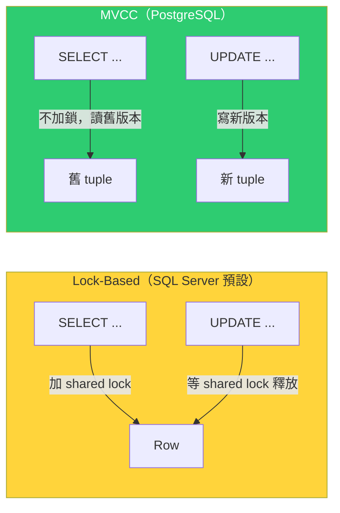
```mermaid
flowchart LR
    subgraph Lock_Based["Lock-Based（SQL Server 預設）"]
        TX1_L["SELECT ..."] --> |"加 shared lock"| ROW_L["Row"]
        TX2_L["UPDATE ..."] --> |"等 shared lock 釋放"| ROW_L
    end

    subgraph MVCC["MVCC（PostgreSQL）"]
        TX1_M["SELECT ..."] --> |"不加鎖，讀舊版本"| OLD["舊 tuple"]
        TX2_M["UPDATE ..."] --> |"寫新版本"| NEW["新 tuple"]
    end

    style Lock_Based fill:#ffd43b
     style MVCC fill:#2ecc71,color:#fff
```

### IV. 生產環境排查：Snapshot 瓶頸

#### a. Snapshot 年齡診斷查詢

Snapshot 的原理決定了：backend_xmin 越老，VACUUM 就越無法清理 dead tuple，同時 `GetSnapshotData()` 掃描 ProcArray 的成本也越高（每個 connection 都要被檢查一次）。

```sql
-- 查詢所有後端的 snapshot 年齡
SELECT pid, usename, application_name, state,
       backend_xmin, age(backend_xmin) AS xmin_tx_age,
       now() - xact_start AS xact_duration,
       LEFT(query, 150) AS query
FROM pg_stat_activity
WHERE backend_xmin IS NOT NULL
ORDER BY age(backend_xmin) DESC;
```

**結果解讀**：

| 欄位 | 含義 | 危險閾值 |
|------|------|------|
| `backend_xmin` | 該後端持有的 snapshot.xmin 值 | — |
| `xmin_tx_age` | 距離 backend_xmin 經過了多少個 transaction | > 5,000,000 → 緊急 |
| `xact_duration` | 事務從 BEGIN 到現在經過的實際時間 | 配合 xmin_tx_age 一起看 |
| `query` | 該事務最後執行的 SQL | 用於判斷是否為應用層遺留 |

**判斷矩陣**：

| xmin_tx_age | xact_duration | 診斷 |
|:-:|:-:|------|
| 高 | 高 | 長時間未關閉的事務（idle in transaction），**立刻處理** |
| 高 | 低 | 寫入量極大（每秒數千筆 UPDATE/INSERT），需考慮 partitioning |
| 低 | 高 | 事務執行中，正常（例如長時間報表查詢） |

> 補充（Senior Dev）：`age(backend_xmin)` 單位是 **transaction 數量**，不是時間。一張每天寫入 100 萬行的表，一個 hold 住 1 小時的 RR transaction，`xmin_tx_age` 可能突破 50 萬。如果同時有多個這樣的 session，VACUUM 徹底停擺。

#### b. 生產症狀：Snapshot 瓶頸的觀測跡象

| 層級 | 症狀 | 對應指標 |
|------|------|------|
| 應用層 | 高 CPU 但低 QPS（throughput 上不去） | APM 中 CPU 使用率 > 80% 但 RPS 持平 |
| 應用層 | P99 latency 明顯高於 P50 | 長尾查詢都在等鎖 |
| 資料庫層 | `LWLock:ProcArrayLock` wait event 大量出現 | `pg_stat_activity` 中 wait_event = 'ProcArrayLock' |
| 資料庫層 | 連接數越多，單條查詢越慢（非線性退化） | 500 connections 下單條查詢比 50 connections 慢 3-5 倍 |

#### c. ProcArrayLock 競爭診斷

```sql
-- 查看 LWLock 等待的分佈
SELECT wait_event_type, wait_event, count(*)
FROM pg_stat_activity
WHERE wait_event_type = 'LWLock'
GROUP BY 1, 2 ORDER BY count DESC;
```

**結果解讀**：
- 如果 `ProcArrayLock` 的 count 顯著高於其他 LWLock 類型（例如佔 LWLock 總數的 40%+），表示 snapshot 獲取正在競爭
- 在 500+ connection 的環境中，若 `ProcArrayLock` 等待 session 超過總數的 10%，需要排查
- 根本解法不是調參數，而是**減少物理 connection**（見下方流程圖）

> 補充（Senior Dev）：PG 使用 process-based model，每個 connection = 一個 OS process。500 個 concurrent connection 意味著每次 `GetSnapshotData()` 要掃描 500 個 ProcArray entry。使用 connection pool（PgBouncer transaction mode）將物理 connection 控制在 50-100，可顯著緩解此問題。

#### d. Snapshot 瓶頸排查路徑圖

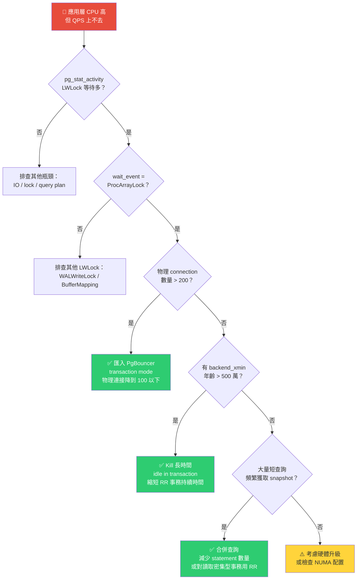
```mermaid
flowchart TD
    START["🚨 應用層 CPU 高<br/>但 QPS 上不去"]
    START --> CHECK1{"pg_stat_activity<br/>LWLock 等待多？"}
    CHECK1 -->|"否"| OTHER["排查其他瓶頸：<br/>IO / lock / query plan"]
    CHECK1 -->|"是"| CHECK2{"wait_event =<br/>ProcArrayLock？"}
    CHECK2 -->|"否"| LW_OTHER["排查其他 LWLock：<br/>WALWriteLock / BufferMapping"]
    CHECK2 -->|"是"| CHECK3{"物理 connection<br/>數量 > 200？"}
    CHECK3 -->|"是"| SOLUTION1["✅ 匯入 PgBouncer<br/>transaction mode<br/>物理連接降到 100 以下"]
    CHECK3 -->|"否"| CHECK4{"有 backend_xmin<br/>年齡 > 500 萬？"}
    CHECK4 -->|"是"| SOLUTION2["✅ Kill 長時間<br/>idle in transaction<br/>縮短 RR 事務持續時間"]
    CHECK4 -->|"否"| CHECK5{"大量短查詢<br/>頻繁獲取 snapshot？"}
    CHECK5 -->|"是"| SOLUTION3["✅ 合併查詢<br/>減少 statement 數量<br/>或對讀取密集型事務用 RR"]
    CHECK5 -->|"否"| HARDWARE["⚠️ 考慮硬體升級<br/>或檢查 NUMA 配置"]

    style START fill:#e74c3c,color:#fff
    style SOLUTION1 fill:#2ecc71,color:#fff
    style SOLUTION2 fill:#2ecc71,color:#fff
    style SOLUTION3 fill:#2ecc71,color:#fff
    style HARDWARE fill:#ffd43b
```

---

## 2. Read Uncommitted（PG 中等於 Read Committed）

### I. 為什麼 PostgreSQL 沒有 Dirty Read？

**原理**：在 lock-based 資料庫中，Read Uncommitted 的用途是「不拿 shared lock 直接讀，即使資料可能被 rollback 掉」。但在 PostgreSQL 的 MVCC 模型中，SELECT **本來就不加鎖**，所以你不需要一個特殊的隔離級別來繞過鎖。PostgreSQL 把 `READ UNCOMMITTED` 映射到 `READ COMMITTED`，因為後者已經提供了你期望的所有行為。

**為什麼 PostgreSQL 連 dirty read 都不允許？** 因為 dirty read 的前提是「讀取未提交事務寫入的資料」，但在 PostgreSQL 中：
- 每個事務的寫入只對**自己**可見（自己的 xmin 寫入的 tuple，對自己永遠可見）
- 其他事務的 snapshot 中的 xip[] 包含了未提交事務的 XID，對應的 tuple 被判定為不可見

所以 PostgreSQL **物理上就無法發生 dirty read**——不是靠鎖禁止，而是 snapshot 機制天生就排除了未提交版本的 visible range。

> 補充（Senior Dev）：SQL Server 的 `NOLOCK` hint 或 `READ UNCOMMITTED` 允許 dirty read（可能讀到 rollback 後的資料，導致邏輯錯誤）。PG 完全沒有這個問題，這是一個被低估的架構優勢。

### II. 與 SQL Server 的對比

| 特性 | PostgreSQL | SQL Server |
|------|-----------|------------|
| Read Uncommitted 的真實行為 | 等同 Read Committed | 允許 dirty read |
| SELECT 是否加鎖 | 永不（除非 FOR UPDATE） | 預設加 shared lock（除非 NOLOCK） |
| 是否可能讀到未提交數據 | ❌ 不可能（MVCC 天生杜絕） | ✅ NOLOCK 下可能 |

### III. 生產環境排查

PostgreSQL 將 `READ UNCOMMITTED` 完全等同 `READ COMMITTED` 處理，因此在資料庫端**無法區分**兩者——`pg_stat_activity` 不會顯示隔離級別字串。排查重點應放在應用層程式碼審查。

```sql
-- 列出所有活躍的 client backend，用於交叉比對應用層是否有誤用 Read Uncommitted
SELECT pid, usename, application_name, state,
       backend_xmin, age(backend_xmin) AS xmin_tx_age,
       now() - xact_start AS xact_duration,
       LEFT(query, 150) AS query
FROM pg_stat_activity
WHERE backend_type = 'client backend'
  AND state = 'active'
ORDER BY xact_start DESC;
```

**應用層排查清單**（從 SQL Server 遷移過來的專案尤為重要）：

| 檢查點 | Npgsql / C# 範例 | 後果 |
|------|------|------|
| Transaction 隔離級別 | `conn.BeginTransaction(IsolationLevel.ReadUncommitted)` | 沒報錯，但實際是 RC（可能讓維護者困惑） |
| Npgsql 連線字串 | `Transaction Mode=ReadUncommitted` | 同上，連線層全域覆蓋 |
| 殘留 SQL Server hint | `WITH(NOLOCK)` | PG 不支援此語法，**SQL 會直接報錯** |

> 補充（Senior Dev）：從 SQL Server 遷移過來的專案，最常見的殘留是 `WITH(NOLOCK)` table hint——PG 會直接報 syntax error，所以這個反而容易被發現。真正隱蔽的是程式碼中的 `IsolationLevel.ReadUncommitted` 或 `SET TRANSACTION ISOLATION LEVEL READ UNCOMMITTED`，PG 靜默接受但當 RC 跑。建議在遷移後全域搜尋 `ReadUncommitted` 關鍵字，統一改用 `ReadCommitted`。

---

## 3. Read Committed — 生產環境最常用的級別

### I. 每個 Statement 拿新 Snapshot

這是 PostgreSQL 的**預設隔離級別**。核心行為：

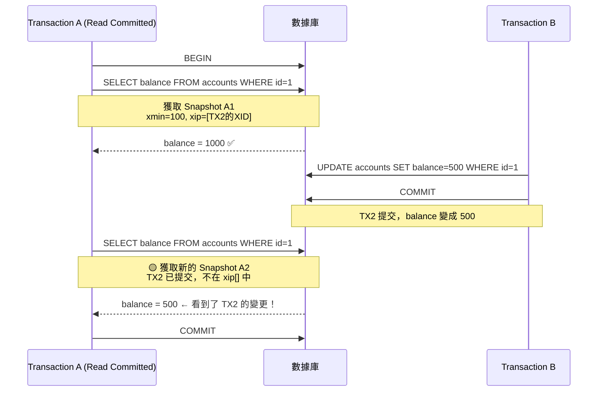
```mermaid
sequenceDiagram
    participant TX1 as Transaction A (Read Committed)
    participant DB as 數據庫
    participant TX2 as Transaction B

    TX1->>DB: BEGIN
    TX1->>DB: SELECT balance FROM accounts WHERE id=1
    Note over TX1,DB: 獲取 Snapshot A1<br/>xmin=100, xip=[TX2的XID]
    DB-->>TX1: balance = 1000 ✅

    TX2->>DB: UPDATE accounts SET balance=500 WHERE id=1
    TX2->>DB: COMMIT
    Note over TX2,DB: TX2 提交，balance 變成 500

    TX1->>DB: SELECT balance FROM accounts WHERE id=1
    Note over TX1,DB: 🟡 獲取新的 Snapshot A2<br/>TX2 已提交，不在 xip[] 中
    DB-->>TX1: balance = 500 ← 看到了 TX2 的變更！

    TX1->>DB: COMMIT
```

關鍵：同一事務內的**兩次 SELECT 會看到不同的數據**——這就是幻讀的根源。

### II. 幻讀 (Phantom Read)

PostgreSQL 的 Read Committed **無法防止幻讀**。但這裡需要澄清一個容易混淆的概念：

- **Non-repeatable Read**：同一行讀兩次，值不同（因為有人 UPDATE 了）→ RC 無法防止
- **Phantom Read**：同一個條件讀兩次，出現新的行（因為有人 INSERT 了）→ RC 也無法防止

兩者在 PG 的 RC 下都會發生，因為都是「兩次 statement 之間有其他事務提交了」。

```sql
-- Session A (Read Committed)
BEGIN;
SELECT COUNT(*) FROM orders WHERE status = 'pending';
-- 返回 100

-- Session B (同時進行)
INSERT INTO orders (status) VALUES ('pending');
COMMIT;

-- Session A (繼續)
SELECT COUNT(*) FROM orders WHERE status = 'pending';
-- 返回 101 ← 幻讀！看到了 Session B 新插入的行
COMMIT;
```

### III. 為什麼生產環境大多數場景用 RC 就夠了？

| 場景 | 是否適合 RC | 原因 |
|------|:---:|------|
| 使用者登入/查詢 profile | ✅ | 一次 SELECT 就完成，沒有「同一事務多次查詢」的需求 |
| 報表查詢 | ✅ | 報表通常一條 SQL 搞定，不需要跨 statement 的一致性 |
| 簡單的 CRUD | ✅ | 每次操作獨立，不需要看到同一時刻的全局快照 |
| 轉帳（扣 A 加 B） | ⚠️ 需要 `FOR UPDATE` | 用 row lock 保證一致性，不依賴 snapshot |
| 複雜報表（多步驟彙總） | ❌ 考慮 RR | 如果中間有人改了資料，多個數字加起來對不上 |

> 補充（Senior Dev）：很多開發者誤以為「交易一定要 Serializable」。實際上，PostgreSQL 的 Read Committed + 正確的 row lock（`SELECT ... FOR UPDATE`）已經能處理絕大多數轉帳、扣庫存場景。關鍵不是隔離級別，而是**你對要修改的行加了適當的鎖**。

### IV. 生產環境排查

#### a. RC 下 Blocking 鏈排查

RC 雖然不會因為 snapshot 而阻塞，但 **explicit row lock**（例如 `SELECT ... FOR UPDATE`）仍可能造成等待。以下查詢找出「誰在鎖誰」：

```sql
-- 找出 RC 下正在等待 row lock 的 session（FOR UPDATE / FOR SHARE 衝突）
SELECT blocked.pid AS blocked_pid,
       blocked.query AS blocked_query,
       blocking.pid AS blocking_pid,
       blocking.query AS blocking_query,
       age(now(), blocked.query_start) AS wait_duration
FROM pg_stat_activity blocked
JOIN pg_locks bl ON blocked.pid = bl.pid AND bl.granted = false
JOIN pg_locks bk ON bl.locktype = bk.locktype
                  AND bl.database = bk.database
                  AND bl.relation = bk.relation
                  AND bl.page = bk.page
                  AND bl.tuple = bk.tuple
                  AND bk.granted = true
JOIN pg_stat_activity blocking ON bk.pid = blocking.pid
WHERE bl.mode = 'ShareLock';
```

**結果解讀**：
- **blocked_pid / blocked_query**：正在排隊等待鎖的 session
- **blocking_pid / blocking_query**：持有鎖的 session（可能是 idle in transaction 忘了 COMMIT）
- **wait_duration**：已經等了多久——超過 5 秒就需要關注，超過 30 秒需要介入
- 此查詢專門針對 `ShareLock` 模式（`FOR SHARE` 被 `FOR UPDATE` 阻塞），如果 `FOR UPDATE` 互相等待，可把 `bl.mode` 改為 `'ExclusiveLock'`

> 補充（Senior Dev）：此查詢利用 `pg_locks` 的 `page` 和 `tuple` 欄位做精確的 row-level 鎖等待匹配，比只看 relation-level 鎖準確得多。但如果等待來自更複雜的鎖模式（例如 MultiXact），可能需要 `EXCEPT` 邏輯進行過濾。

#### b. 生產症狀：RC 下 Phantom Read 的業務可觀測跡象

Phantom Read 不會在資料庫日誌中留下任何痕跡（因為它是「合法」的行為），但在業務層有明顯跡象：

| 症狀 | 範例 | 根因 |
|------|------|------|
| 同一報表跑兩次數字不同 | 第一次 COUNT = 100，第二次 = 103 | 兩次 SELECT 之間有 INSERT 提交 |
| 總額校驗對不上 | SUM(balance) 兩次結果差 500 | 兩次掃描之間有 UPDATE 提交 |
| 分頁漏資料或重複資料 | 第一頁有 ID=50，第二頁也有 ID=50 | OFFSET 分頁 + 並發 INSERT（見 pagination 章節） |
| 審計報表不一致 | 月報和日報加總對不起來 | 日報是各天快照（RC），但月報掃了整月資料（也 RC），中間有人修改了過往記錄 |

#### c. RC 資料不一致排查路徑

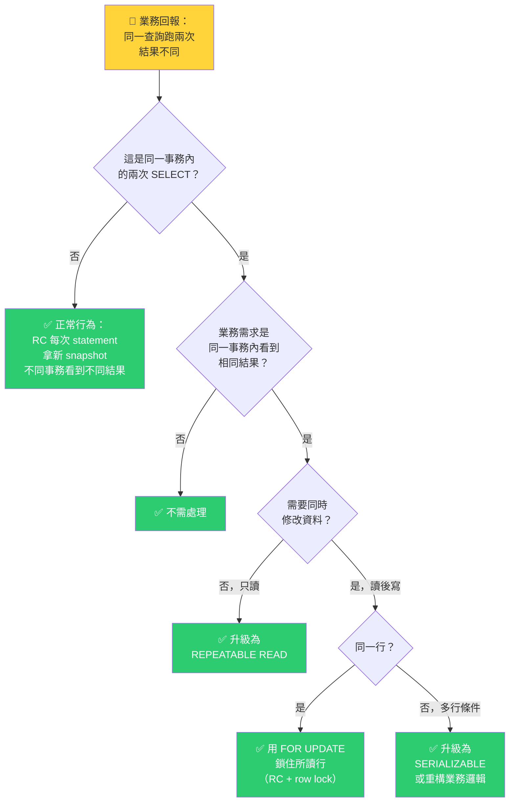
```mermaid
flowchart TD
    START["🚨 業務回報：<br/>同一查詢跑兩次<br/>結果不同"]
    START --> CHECK1{"這是同一事務內<br/>的兩次 SELECT？"}
    CHECK1 -->|"否"| NORMAL["✅ 正常行為：<br/>RC 每次 statement<br/>拿新 snapshot<br/>不同事務看到不同結果"]
    CHECK1 -->|"是"| CHECK2{"業務需求是<br/>同一事務內看到<br/>相同結果？"}
    CHECK2 -->|"否"| OK["✅ 不需處理"]
    CHECK2 -->|"是"| CHECK3{"需要同時<br/>修改資料？"}
    CHECK3 -->|"否，只讀"| SOLUTION1["✅ 升級為<br/>REPEATABLE READ"]
    CHECK3 -->|"是，讀後寫"| CHECK4{"同一行？"}
    CHECK4 -->|"是"| SOLUTION2["✅ 用 FOR UPDATE<br/>鎖住所讀行<br/>（RC + row lock）"]
    CHECK4 -->|"否，多行條件"| SOLUTION3["✅ 升級為<br/>SERIALIZABLE<br/>或重構業務邏輯"]

    style START fill:#ffd43b
    style NORMAL fill:#2ecc71,color:#fff
    style OK fill:#2ecc71,color:#fff
    style SOLUTION1 fill:#2ecc71,color:#fff
    style SOLUTION2 fill:#2ecc71,color:#fff
    style SOLUTION3 fill:#2ecc71,color:#fff
```

> 補充（Senior Dev）：Phantom Read 不一定是 bug，很多時候是**業務可接受的行為**——例如使用者刷新頁面看到新資料是正常的。只有在「同一事務內，業務邏輯依賴前後一致性」的情境下才需要升級隔離級別。升級前先問：「這兩個 SELECT 之間如果有 INSERT，真的會導致業務錯誤嗎？」

---

## 4. Repeatable Read — PG 比 SQL Standard 更強

### I. 整個 Transaction 用同一個 Snapshot

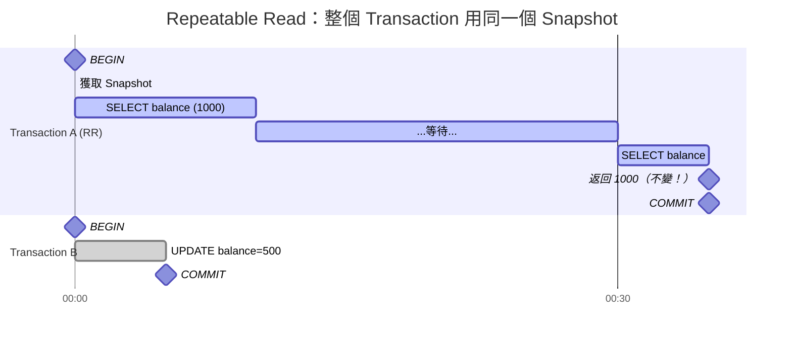
```mermaid
gantt
    title Repeatable Read：整個 Transaction 用同一個 Snapshot
    dateFormat mm:ss
    axisFormat %M:%S
    tickInterval 30second

    section Transaction A (RR)
    BEGIN                   :milestone, tx_begin, 00:00, 0s
    獲取 Snapshot           :done, snap, 00:00, 0s
    SELECT balance (1000)   :active, s1, after snap, 10s
    ...等待...              :active, wait, after s1, 20s
    SELECT balance          :active, s2, after wait, 5s
    返回 1000（不變！）     :milestone, result, after s2, 0s
    COMMIT                  :milestone, commit, after s2, 0s

    section Transaction B
    BEGIN                   :milestone, tx2_begin, after snap, 0s
    UPDATE balance=500      :done, upd, after tx2_begin, 5s
    COMMIT                  :milestone, tx2_commit, after upd, 0s
```

Transaction B 在 Transaction A 開始之後才提交，但 Transaction A 用的是自己開始時的 snapshot，所以**看不到** Transaction B 的變更。即使過了 30 秒再查，`balance` 仍然是 1000。

### II. PostgreSQL 的 RR 比 SQL Standard 更強 —— 也防止 Phantom Read

SQL Standard 定義的 Repeatable Read 只保證 **Non-repeatable Read** 不會發生（同一行讀兩次值不變），但**允許 Phantom Read**。

PostgreSQL 的 RR 則更進一步：因為整個 transaction 用同一個 snapshot，這個 snapshot 中的 xip[] 包含了所有在 BEGIN 時活躍的事務。任何後來才開始的事務（XID > snapshot.xmax）寫入的資料，在這個 snapshot 中都不可見。

因此 PostgreSQL 的 Repeatable Read **也防止了 Phantom Read**：

```sql
-- Session A (Repeatable Read)
BEGIN ISOLATION LEVEL REPEATABLE READ;
SELECT COUNT(*) FROM orders WHERE status = 'pending';
-- 返回 100

-- Session B
INSERT INTO orders (status) VALUES ('pending');
COMMIT;

-- Session A (繼續)
SELECT COUNT(*) FROM orders WHERE status = 'pending';
-- 返回 100 ← 仍然是 100！Phantom Read 被防止了
COMMIT;
```

> 補充（Senior Dev）：PostgreSQL 的 RR 之所以能做到這一點，不是靠 predicate lock，而是**靠 snapshot 的時間邊界**。Session B 的 XID > Session A 的 snapshot.xmax，因此 Session B 寫入的所有 tuple，Session A 都看不到。這比 SQL Server 的 REPEATABLE READ（使用 shared lock 不釋放的方式，但無法防止 phantom）更乾淨。

### III. Write Skew —— RR 仍無法防止的異常

即使 PostgreSQL 的 RR 防止了 Phantom Read，仍存在一個經典的異常——**Write Skew**。

**場景：值班醫生制度**

```sql
-- 規則：任何時刻至少要有一位醫生 on-call

-- Session A (Repeatable Read)
BEGIN ISOLATION LEVEL REPEATABLE READ;
SELECT COUNT(*) FROM doctors WHERE on_call = true;
-- 返回 2 — 至少有兩人值班，我可以請假
UPDATE doctors SET on_call = false WHERE id = 1;
-- 預期：剩下 1 人值班，合法
COMMIT;

-- Session B (同時進行，Repeatable Read)
BEGIN ISOLATION LEVEL REPEATABLE READ;
SELECT COUNT(*) FROM doctors WHERE on_call = true;
-- 返回 2 — 也是看到 2 人（因為看不到 Session A 的未提交變更）
UPDATE doctors SET on_call = false WHERE id = 2;
-- 預期：剩下 1 人值班，合法
COMMIT;
```

兩邊都提交後：`COUNT(*)` = 0，**沒有人值班了**！這就是 Write Skew——兩個事務各自讀了一個「前提條件」，然後基於這個前提做出修改，但雙方的前提都被對方的修改打破了。

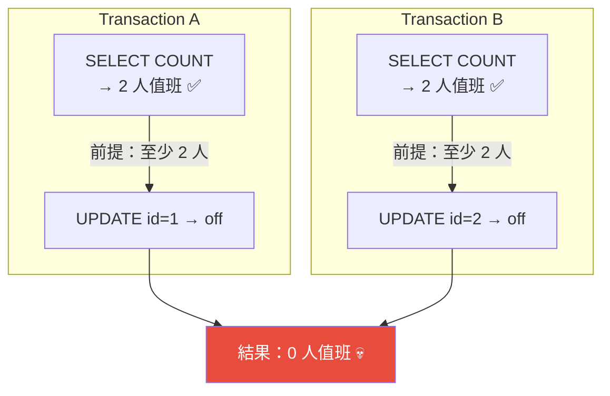
```mermaid
flowchart TD
    subgraph TX_A["Transaction A"]
        A1["SELECT COUNT<br/>→ 2 人值班 ✅"]
        A2["UPDATE id=1 → off"]
    end

    subgraph TX_B["Transaction B"]
        B1["SELECT COUNT<br/>→ 2 人值班 ✅"]
        B2["UPDATE id=2 → off"]
    end

    A1 --> |"前提：至少 2 人"| A2
    B1 --> |"前提：至少 2 人"| B2
    A2 --> RESULT["結果：0 人值班 💀"]
    B2 --> RESULT

    style RESULT fill:#e74c3c,color:#fff
```

**為什麼 RR 無法防止？** 因為 RR 的 snapshot 讓 Session A 看不到 Session B 的修改（反之亦然），但 snapshot **不阻止你基於「過時的數據」做出修改**。兩個事務讀的是各自的 snapshot（都是 2 人），但 UPDATE 實際改變了真實的 row。

**解法**：使用 Serializable，或使用 `SELECT ... FOR UPDATE` 對所有相關行加鎖。

### IV. 生產環境排查

#### a. 找出所有使用 RR 且有風險的 Session

RR 最大的生產風險不是 Write Skew，而是**長時間 idle in transaction 拖住 OldestXmin**：

```sql
-- 找出所有使用 RR 且處於 idle in transaction 的 session（最危險的組合）
SELECT pid, usename, application_name, state,
       backend_xmin, age(backend_xmin) AS xmin_tx_age,
       now() - xact_start AS xact_duration,
       LEFT(query, 150) AS last_query
FROM pg_stat_activity
WHERE backend_xmin IS NOT NULL
  AND state = 'idle in transaction'
ORDER BY xact_duration DESC;
```

**結果解讀**：

| 欄位 | 含義 |
|------|------|
| `state = 'idle in transaction'` | 事務已開啟（BEGIN 已執行），但目前沒有在跑任何 SQL——**client 端卡住了或忘了 COMMIT** |
| `xmin_tx_age` | 此 session 的 snapshot 年齡，所有 < backend_xmin 的 dead tuple 才能被 VACUUM 回收 |
| `xact_duration` | 這個事務開著多久了——超過 5 分鐘就應該警覺 |

🔴 **危險組合**：`state = 'idle in transaction'` + `xact_duration > 5 min` + `backend_xmin IS NOT NULL` = VACUUM 殺手

> 補充（Senior Dev）：`pg_stat_activity` 不直接顯示隔離級別。判斷是否為 RR 的方法是看 `backend_xmin`：在 RC 下，idle in transaction 時 `backend_xmin` 通常為 NULL（因為下一個 statement 會用新 snapshot）；在 RR 下，`backend_xmin` 會一直保留。所以 `state = 'idle in transaction' AND backend_xmin IS NOT NULL` 幾乎可以確定是 RR（或 Serializable）。

#### b. 生產症狀：Write Skew 的事後偵測

Write Skew 不會產生 error log（不像 Serializable 的 serialization failure），因此只能透過 **業務規則審計查詢** 事後發現：

```sql
-- Write Skew 範例：檢查是否發生「值班醫生全部 off」的異常
SELECT on_call, count(*) AS doctor_count
FROM doctors
GROUP BY on_call;
-- 如果 on_call=false 的數量 = 總醫生數 → Write Skew 已經發生

-- 通用範本：檢查業務規則不變量是否被打破
-- 規則「總和必須 = 100」被 Write Skew 打破的案例
SELECT SUM(allocated_pct) AS total_pct
FROM resource_allocation;
-- 如果 total_pct != 100 → Write Skew 導致超分配
```

**Write Skew 高發場景**：

| 場景 | 業務規則 | Write Skew 後果 |
|------|------|------|
| 資源分配 | 分配比例合計 = 100% | 超分配（總和 > 100%） |
| 值班排班 | 任何時刻至少 1 人值班 | 空班（0 人值班） |
| 庫存扣減 | 庫存 ≥ 0 | 超賣（庫存變負數） |
| 預算控管 | 剩餘預算 ≥ 0 | 超支（預算變負數） |

#### c. RR Session Snapshot 年齡分佈查詢

```sql
-- 檢查所有持有 snapshot 的 RR session 的年齡分佈
SELECT
    CASE
        WHEN age(backend_xmin) < 1000 THEN '< 1K tx'
        WHEN age(backend_xmin) BETWEEN 1000 AND 10000 THEN '1K-10K tx'
        WHEN age(backend_xmin) BETWEEN 10001 AND 100000 THEN '10K-100K tx'
        WHEN age(backend_xmin) BETWEEN 100001 AND 1000000 THEN '100K-1M tx'
        ELSE '> 1M tx'
    END AS xmin_age_bucket,
    count(*) AS session_count
FROM pg_stat_activity
WHERE backend_xmin IS NOT NULL
GROUP BY 1
ORDER BY min(age(backend_xmin));
```

**結果解讀**：
- **> 1M tx** 的 bucket 有 session → 立即排查並考慮 kill（`SELECT pg_terminate_backend(pid)`）
- **100K-1M tx** → 警告級別，檢查是否有 RR transaction 可以改為 RC
- 如果所有 session 都在 **< 1K tx** → 健康

> 補充（Senior Dev）：Write Skew 的最佳防禦不是 Serializable（會付出 abort rate 代價），而是**在應用層對不變量涉及的行使用 FOR UPDATE 鎖住**。例如值班醫生場景，`SELECT COUNT(*) FROM doctors WHERE on_call = true FOR UPDATE` 會鎖住所有 on_call=true 的行，阻止並發修改。在 RC 下這樣做就足夠了，不需要升級隔離級別。

---

## 5. Serializable — 最高隔離級別

### I. SSI（Serializable Snapshot Isolation）原理

PostgreSQL 從 9.1 開始使用 **SSI（Serializable Snapshot Isolation）** 實現 Serializable，而非傳統的兩階段鎖定（2PL）或嚴格兩階段鎖定（S2PL）。

SSI 的核心思想是：**在不阻塞讀寫的前提下，追蹤事務之間的依賴關係。如果偵測到可能導致序列化異常的依賴循環，就 abort 其中一個事務**。

SSI 追蹤三種依賴：

| 依賴類型 | 符號 | 含義 | 舉例 |
|---------|------|------|------|
| **wr-dependency**（寫-讀） | T1 → T2 | T1 寫了某行，T2 讀了該行 | T1 UPDATE，T2 SELECT 看到 T1 的結果 |
| **ww-dependency**（寫-寫） | T1 → T2 | T1 寫了某行，T2 覆寫了該行 | T1 UPDATE x=1，T2 UPDATE x=2 |
| **rw-antidependency**（讀-寫） | T1 → T2 | T1 讀了某行（的舊版本），T2 後來寫了該行 | **這是 Write Skew 的根源** |

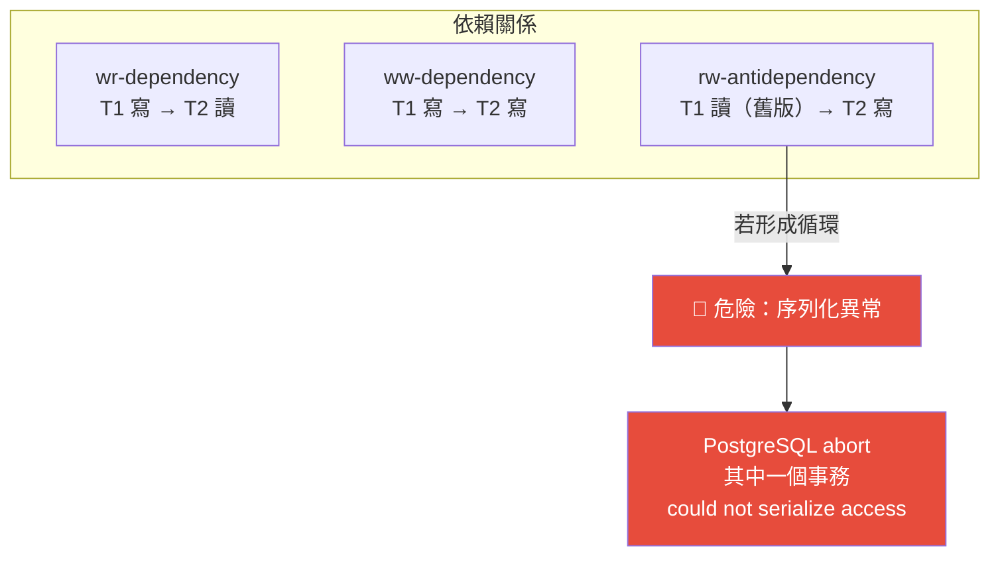
```mermaid
flowchart TD
    subgraph Dependency["依賴關係"]
        WR["wr-dependency<br/>T1 寫 → T2 讀"]
        WW["ww-dependency<br/>T1 寫 → T2 寫"]
        RW["rw-antidependency<br/>T1 讀（舊版）→ T2 寫"]
    end

    RW --> |"若形成循環"| Cycle["🔴 危險：序列化異常"]
    Cycle --> Abort["PostgreSQL abort<br/>其中一個事務<br/>could not serialize access"]

    style Cycle fill:#e74c3c,color:#fff
    style Abort fill:#e74c3c,color:#fff
```

### II. SIREAD Lock — 讀操作的隱形鎖

在 Serializable 級別下，每個 SELECT 都會隱式地獲取 **SIREAD lock**（讀取謂詞鎖）。它不像普通鎖那樣阻塞其他人，而是記錄「我讀了哪些資料」，用於後續的依賴偵測。

```sql
-- Session A (Serializable)
BEGIN ISOLATION LEVEL SERIALIZABLE;
SELECT * FROM doctors WHERE on_call = true;
-- ↑ 獲取 SIREAD lock: 記錄「我讀了 WHERE on_call=true 的所有行」
```

SIREAD lock 的粒度不是 row-level，而是 **page-level**。這意味著：
- 如果你讀了 page 1 中的某行，整個 page 1 被標記為「被讀取」
- 如果其他事務修改了這個 page 中的**任何行**（即使不是你讀的那一行），就可能觸發 rw-antidependency
- 在高並發場景下，page-level granularity 可能導致 **false positive serialization failure**

> 補充（Senior Dev）：page-level SIREAD lock 是 PostgreSQL SSI 的一個已知 trade-off。在某些場景下（例如多個不相關的 row 恰好在同一個 page 中），可能會導致不必要的 serialization failure。PG 9.2 引入了 `predicate_lock_consistency` 參數（PG 10 移除），並持續改進 false positive 率。但核心局限仍存在：SIREAD 是 page 級別，不是 row 級別。

### III. Serialization Failure 的觸發條件

SSI 會在你 COMMIT 時檢查依賴圖中是否存在**包含 rw-antidependency 的循環**。如果存在，PostgreSQL 會 abort 其中一個事務並回傳 error：

```
ERROR: could not serialize access due to read/write dependencies among transactions
DETAIL: Reason code: Canceled on identification as a pivot, during commit attempt.
HINT: The transaction might succeed if retried.
```

**關鍵認知**：Serializable 不保證你的事務一定成功，而是保證**要嘛成功（且結果等價於某種序列執行順序）、要嘛報錯讓你重試**。

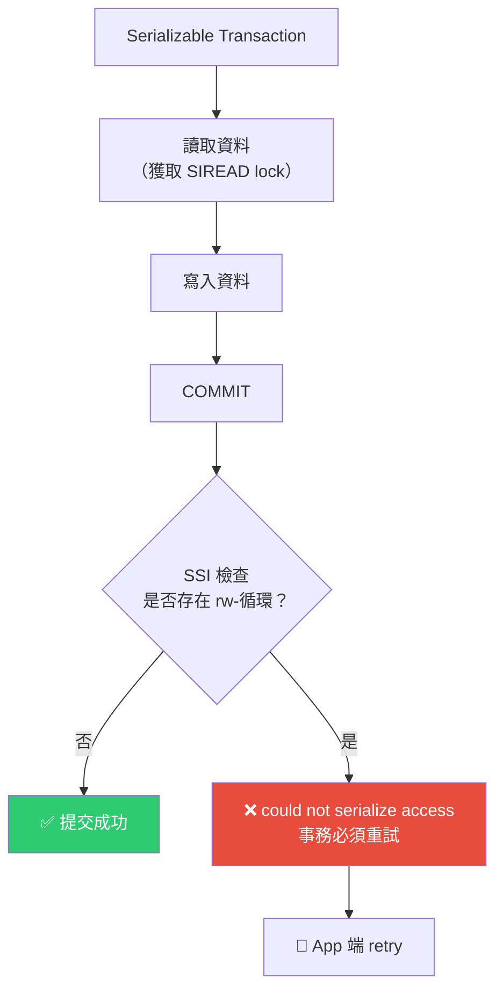
```mermaid
flowchart TD
    TX["Serializable Transaction"]
    TX --> READ["讀取資料<br/>（獲取 SIREAD lock）"]
    READ --> WRITE["寫入資料"]
    WRITE --> COMMIT["COMMIT"]
    COMMIT --> CHECK{"SSI 檢查<br/>是否存在 rw-循環？"}
    CHECK -->|"否"| SUCCESS["✅ 提交成功"]
    CHECK -->|"是"| FAIL["❌ could not serialize access<br/>事務必須重試"]
    FAIL --> RETRY["🔄 App 端 retry"]

    style SUCCESS fill:#2ecc71,color:#fff
    style FAIL fill:#e74c3c,color:#fff
```

### IV. 效能 Overhead 與 Production 取捨

| 面向 | Read Committed | Repeatable Read | Serializable |
|------|:---:|:---:|:---:|
| Snapshot 獲取 | 每個 statement 一次 | 整個事務一次 | 整個事務一次 |
| SIREAD lock | ❌ | ❌ | ✅（page-level） |
| 記憶體額外開銷 | 無 | 無 | 每個事務需要 SIREAD lock 追蹤 |
| 衝突偵測 | 無 | 無 | COMMIT 時進行 |
| False positive | 無 | 無 | 可能（page-level granularity） |
| 適合場景 | 90% 的 OLTP | 報表/一致性讀取 | 關鍵金融操作 |

**效能影響的量化理解**：
- SIREAD lock 儲存在 shared memory 中（由 `max_pred_locks_per_transaction` 控制，預設 64）
- 每個 transaction 最多可有 64 個 predicate lock（page 級），超過時會升級為 relation 級別 lock
- relation 級別的 SIREAD lock 會導致大量 false positive，應避免（透過調高 `max_pred_locks_per_transaction`）
- Serializable 的 overhead 主要不是 CPU，而是**abort rate**：高並發下可能頻繁觸發 serialization failure

```sql
-- 查看 predicate lock 使用情況
SELECT mode, count(*) FROM pg_locks
WHERE locktype = 'SIReadLock'
GROUP BY mode;
```

### V. 生產環境排查

#### a. Serialization Failure Rate 監控

Serializable 的核心代價是 **abort rate**。以下查詢計算當前資料庫的 rollback 比例，作為初始判斷：

```sql
-- 監控 serialization failure rate（需配合應用層 retry 的次數一起看）
SELECT datname, xact_commit, xact_rollback,
       round(100.0 * xact_rollback / NULLIF(xact_commit + xact_rollback, 0), 2) AS rollback_pct
FROM pg_stat_database
WHERE datname = current_database();
```

**結果解讀**：
- `rollback_pct`：所有 rollback（包含業務邏輯主動 ROLLBACK + serialization failure）佔總事務的比例
- 此查詢**無法區分** serialization failure rollback 和業務主動 ROLLBACK，需要配合應用層 metric（retry counter）一起看
- 🔴 **> 5%** 需要關注（前提是已排除業務大量主動 ROLLBACK 的場景）
- 🔴 **> 10%** + `xact_commit` 不高 → Serializable 可能在 thundering herd retry 循環中

> 補充（Senior Dev）：單靠 `pg_stat_database` 無法精確區分 rollback 原因。更精確的做法是在應用層記錄每次 retry 的次數和原因。Npgsql 會在 `PostgresException` 中給出 `SqlState = "40001"`（serialization_failure），可以針對此錯誤碼埋點統計。

#### b. SIREAD Lock 分佈檢查

```sql
-- 當前 SIREAD lock 分佈 —— 檢查是否升級到 relation-level（false positive 風險高）
SELECT locktype, mode, relation::regclass AS table_name,
       page, tuple, granted, count(*)
FROM pg_locks
WHERE locktype = 'SIReadLock'
GROUP BY 1, 2, 3, 4, 5, 6
ORDER BY count DESC;
```

**結果解讀**：
- **page 不為 NULL** → 正常，粒度為 page-level（每個事務預設最多 64 個 page-level SIREAD lock）
- **page 為 NULL 且 relation 不為 NULL** → SIREAD lock 已升級為 **relation-level**，意味著該事務讀取的行橫跨超過 64 個 page。Relation-level lock 會導致大量 false positive——只要有人修改同一張表的**任何行**就可能觸發 abort
- 如果頻繁出現 relation-level SIREAD lock，考慮調高 `max_pred_locks_per_transaction`（從預設 64 調至 256 或更高）

#### c. 從日誌找出被 Abort 的 Serializable 事務

Serialization failure 的 error message 特徵關鍵字：

```sql
-- 無法直接在 SQL 中查詢已發生的 serialization failure，但可以從 PG log 中搜尋
-- （以下為 grep pattern，非 SQL）
-- ERROR:  could not serialize access due to read/write dependencies among transactions
-- DETAIL:  Reason code: Canceled on identification as a pivot, during commit attempt.
-- HINT:  The transaction might succeed if retried.
```

若 PG 已啟用 `log_min_messages = warning` 且 `log_destination` 包含檔案，可在 log 中搜尋 `could not serialize access` 關鍵字，或用以下 SQL 檢查最近的 error log：

```sql
-- PG 16+ 可用 pg_stat_activity 的 wait_event 相關欄位，但歷史 serialization failure 仍需從 log 分析
-- 此查詢只能看到「當前正在等待」的 session
SELECT pid, usename, application_name,
       wait_event_type, wait_event,
       query, now() - query_start AS query_duration
FROM pg_stat_activity
WHERE state = 'active'
  AND wait_event IS NOT NULL
ORDER BY query_start;
```

> 補充（Senior Dev）：生產環境建議啟用 `auto_explain` 擴展並設定 `auto_explain.log_min_duration = 0` 加上 `auto_explain.log_level = 'NOTICE'`，配合 `log_lock_waits = on` 來捕捉鎖等待。Serialization failure 本身是 client-side error（SQLSTATE 40001），不會記錄在 `pg_stat_statements` 的 error count 中。

#### d. Serializable Abort Rate 過高的排查路徑

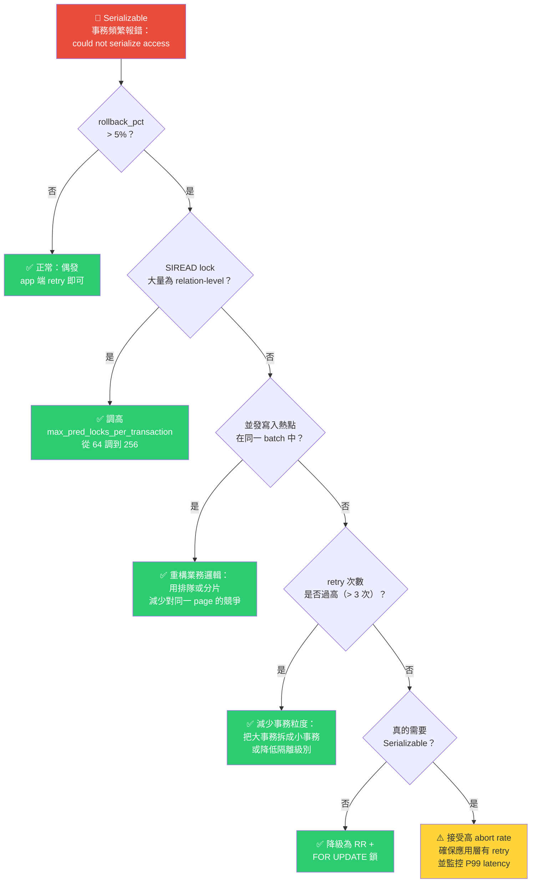
```mermaid
flowchart TD
    START["🚨 Serializable<br/>事務頻繁報錯：<br/>could not serialize access"]
    START --> CHECK1{"rollback_pct<br/>> 5%？"}
    CHECK1 -->|"否"| OK1["✅ 正常：偶發<br/>app 端 retry 即可"]
    CHECK1 -->|"是"| CHECK2{"SIREAD lock<br/>大量為 relation-level？"}
    CHECK2 -->|"是"| SOLUTION1["✅ 調高<br/>max_pred_locks_per_transaction<br/>從 64 調到 256"]
    CHECK2 -->|"否"| CHECK3{"並發寫入熱點<br/>在同一 batch 中？"}
    CHECK3 -->|"是"| SOLUTION2["✅ 重構業務邏輯：<br/>用排隊或分片<br/>減少對同一 page 的競爭"]
    CHECK3 -->|"否"| CHECK4{"retry 次數<br/>是否過高（> 3 次）？"}
    CHECK4 -->|"是"| SOLUTION3["✅ 減少事務粒度：<br/>把大事務拆成小事務<br/>或降低隔離級別"]
    CHECK4 -->|"否"| CHECK5{"真的需要<br/>Serializable？"}
    CHECK5 -->|"否"| SOLUTION4["✅ 降級為 RR +<br/>FOR UPDATE 鎖"]
    CHECK5 -->|"是"| ACCEPT["⚠️ 接受高 abort rate<br/>確保應用層有 retry<br/>並監控 P99 latency"]

    style START fill:#e74c3c,color:#fff
    style SOLUTION1 fill:#2ecc71,color:#fff
    style SOLUTION2 fill:#2ecc71,color:#fff
    style SOLUTION3 fill:#2ecc71,color:#fff
    style SOLUTION4 fill:#2ecc71,color:#fff
    style ACCEPT fill:#ffd43b
    style OK1 fill:#2ecc71,color:#fff
```

#### e. 生產症狀：高並發下的典型失敗模式

| 症狀 | 現象 | 根因 |
|------|------|------|
| **Thundering herd retry** | Abort → 全部重試 → 再次搶同一資源 → 再次 abort，循環 | 多個事務競爭同一 page 上的不同 row，page-level SIREAD 導致 false positive |
| **Retry amplification** | 1 個請求 abort 後重試 3 次，每次都觸發新的事務依賴 | 每次重試是一個新 snapshot，和其他重試的事務形成新的依賴循環 |
| **長事務拖累** | 一個長時間的 Serializable 事務導致大量並行事務 abort | 長時間持有 SIREAD lock，大量後續寫入與之形成 rw-antidependency |
| **Commits 減少但 rollback 暴增** | 系統吞吐量急劇下降 | Serializable 的事務在 COMMIT 階段才檢查——前面所有工作白做 |

> 補充（Senior Dev）：在決定使用 Serializable 前，問自己三個問題：(1) 這真的是 Write Skew 場景嗎？ (2) 能用 `FOR UPDATE` 替代嗎？ (3) Abort rate 在可接受範圍內（< 2%）嗎？大多數「我以為需要 Serializable」的場景，其實用 RR + 精確的 row lock 就能解決，且沒有 retry overhead。

---

## 6. 隔離級別如何影響 VACUUM

### I. OldestXmin 的計算

VACUUM 只能清理「所有活躍事務都不再需要看到」的 dead tuple。這個邊界值就是 **OldestXmin**——資料庫中所有活躍事務的 snapshot.xmin 的最小值。

```
OldestXmin = MIN(所有活躍事務的 backend_xmin)
```

一個 dead tuple 的 `xmax < OldestXmin` 才能被 VACUUM 回收。

### II. Repeatable Read 對 VACUUM 的殺傷力

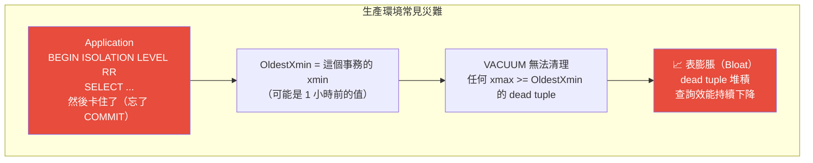
```mermaid
flowchart TD
    subgraph Problem["生產環境常見災難"]
        APP["Application<br/>BEGIN ISOLATION LEVEL RR<br/>SELECT ...<br/>然後卡住了（忘了 COMMIT）"]
        APP --> OLD_XMIN["OldestXmin = 這個事務的 xmin<br/>（可能是 1 小時前的值）"]
        OLD_XMIN --> VAC["VACUUM 無法清理<br/>任何 xmax >= OldestXmin 的 dead tuple"]
        VAC --> BLOAT["📈 表膨脹（Bloat）<br/>dead tuple 堆積<br/>查詢效能持續下降"]
    end

    style APP fill:#e74c3c,color:#fff
    style BLOAT fill:#e74c3c,color:#fff
```

**為什麼 RR 特別危險？** Read Committed 的事務每次 statement 會更新 snapshot，但後續的 statement 可能拿到更新的 snapshot（xmin 前進）。而 RR 從頭到尾持著最老的 snapshot，**OldestXmin 永遠不會前進**。

```sql
-- 找出正在阻止 VACUUM 的事務（通常是 RR 或 idle-in-transaction）
SELECT pid, datname, usename, application_name,
       state, backend_xmin,
       age(backend_xmin) AS xmin_age,
       now() - xact_start AS xact_duration,
       LEFT(query, 200) AS last_query
FROM pg_stat_activity
WHERE backend_xmin IS NOT NULL
  AND state = 'idle in transaction'
ORDER BY age(backend_xmin) DESC;
```

- `age(backend_xmin)` = 這個 transaction 的 snapshot 年資（以 transaction 數計算）
- 如果超過數百萬（大量寫入後），大量 dead tuple 被這個 snapshot 保護，無法回收

**Bloat 可視化查詢** —— 看看哪張表受影響最嚴重：

```sql
-- 即用查詢：各表的 dead tuple 堆積情況
SELECT schemaname, relname, n_live_tup, n_dead_tup,
       round(100.0 * n_dead_tup / NULLIF(n_live_tup + n_dead_tup, 0), 2) AS dead_pct,
       n_tup_del, n_tup_upd, last_autovacuum, last_autoanalyze
FROM pg_stat_user_tables
WHERE n_dead_tup > 0
ORDER BY n_dead_tup DESC
LIMIT 20;
```

**結果解讀**：
- **n_live_tup**：表中的 live tuple 估算數量
- **n_dead_tup**：表中的 dead tuple 估算數量（被 UPDATE/DELETE 產生的舊版本）
- **dead_pct**：dead tuple 佔總 tuple 的百分比。🔴 **> 20%** 建議手動 VACUUM；**> 50%** 表示 autovacuum 可能已停擺
- **n_tup_del / n_tup_upd**：自上次統計重置以來的刪除/更新次數——配合 dead_pct 判斷是「累積很久」還是「最近大量寫入」
- **last_autovacuum**：如果為 NULL 或時間很久遠，表示 autovacuum 從未執行或被阻塞

**Autovacuum 阻塞檢查** —— 確認 autovacuum 是否在運行：

```sql
-- 即用查詢：檢查 autovacuum 是否正在執行或被阻塞
SELECT pid, query, now() - query_start AS duration,
       state, wait_event_type, wait_event
FROM pg_stat_activity
WHERE query LIKE '%autovacuum%'
  AND state = 'active';
```

**結果解讀**：
- 如果回傳 0 行 → autovacuum 可能被長時間未關閉的事務阻塞（autovacuum 也受限於 OldestXmin）
- 如果有行但 `wait_event = 'LWLock'` → autovacuum worker 本身在等待鎖，通常是被另一個 VACUUM 或 ANALYZE 阻塞
- `duration` 很長（> 30 分鐘）且處理大表 → 正常；`duration` 很短（< 10 秒）且頻繁出現 → autovacuum 在不斷被 cancel（可能因 `lock_timeout`）

> 補充（Senior Dev）：生產環境中，**長時間的 Repeatable Read transaction 是 Bloat 的第一大元兇**，排名比大規模 DELETE 更高。一個忘了關閉的 RR transaction 可以讓你一個週末回來發現表膨脹了 3 倍。解法：
> - `idle_in_transaction_session_timeout = '5min'`（PG 10+，直接 kill）
> - `old_snapshot_threshold = '1h'`（PG 9.6+，強制 snapshot 過期，但查詢可能報 "snapshot too old" error）
> - 盡量用 Read Committed，只在需要一致性快照的場景才用 RR

---

# 二、生產環境場景

## 1. 場景：Read Committed 下的轉帳 Phantom

### I. 原理重現

```sql
-- 準備
CREATE TABLE accounts (id INT PRIMARY KEY, balance INT);
INSERT INTO accounts VALUES (1, 1000), (2, 1000);

-- Session A (Read Committed) — 轉帳驗證
BEGIN;
SELECT SUM(balance) FROM accounts;           -- 返回 2000
SELECT balance FROM accounts WHERE id = 1;    -- 返回 1000
-- 準備扣款...但 Session B 在這個時候插入了

-- Session B (同時)
UPDATE accounts SET balance = 500 WHERE id = 1;
COMMIT;

-- Session A (繼續)
SELECT balance FROM accounts WHERE id = 2;    -- 返回 1000
SELECT SUM(balance) FROM accounts;           -- 返回 1500 ← 總額變了！
-- 基於「總額 2000」做的後續判斷全部失效
COMMIT;
```

### II. 解法矩陣

| 解法 | 適用場景 | 限制 |
|------|---------|------|
| `SELECT ... FOR UPDATE` | 需要鎖定特定行進行後續修改 | 僅鎖定被 SELECT 的行，不鎖定新插入的行 |
| 改用 Repeatable Read | 需要多個 SELECT 之間的一致性快照 | 長時間事務會卡 VACUUM |
| Serializable | 最嚴格的一致性要求 | 需要 retry logic |
| 應用層重試 | 所有場景 | 增加開發複雜度 |

### III. 生產環境排查與事後偵測

#### a. 事後偵測：從審計表發現 Phantom Read 痕跡

如果 `accounts` 表有審計欄位（`updated_at`、`audit_log`），可以在事後搜尋疑似 Phantom Read 的異常模式：

```sql
-- 搜尋短時間內對同一帳戶出現「不一致讀取」的嫌疑交易
-- 條件：同一個 transaction 範圍內，SUM(balance) 兩次取值不同
-- 需要審計表記錄每次 SELECT 的時間點

-- 方法 A：檢查是否有 concurrent write 與 SELECT 時間重疊
WITH suspicious_writes AS (
    SELECT id, balance, updated_at,
           lag(updated_at) OVER (PARTITION BY id ORDER BY updated_at) AS prev_updated
    FROM accounts_audit_log
    WHERE action = 'UPDATE'
)
SELECT id, updated_at, prev_updated,
       updated_at - prev_updated AS gap,
       CASE WHEN updated_at - prev_updated < interval '1 second'
            THEN '⚠️ 疑似 Phantom Read 視窗' END AS risk
FROM suspicious_writes
WHERE updated_at - prev_updated < interval '1 second'
ORDER BY gap;

-- 方法 B：計算總額快照一致性（需在應用層記錄每次總額校驗的時間點）
SELECT recorded_at,
       recorded_sum,
       (SELECT SUM(balance) FROM accounts WHERE updated_at <= a.recorded_at) AS actual_at_time,
       recorded_sum - (SELECT SUM(balance) FROM accounts WHERE updated_at <= a.recorded_at) AS drift
FROM account_snapshot_log a
WHERE recorded_at > now() - interval '1 day'
  AND abs(recorded_sum - (SELECT SUM(balance) FROM accounts WHERE updated_at <= a.recorded_at)) > 0;
```

**結果解讀**：
- `gap < 1 second` 表示有兩筆 UPDATE 幾乎同時發生，可能在另一個 session 的兩個 SELECT 之間
- `drift <> 0` 表示應用層記錄的總額與資料庫實際值不同，很可能發生過 Phantom Read

#### b. 即時排查：找出正在對同一表進行 Concurrent Write 的 Session

```sql
-- 誰正在跟我競爭同一張表？
SELECT pid, usename, application_name, state,
       wait_event_type, wait_event,
       now() - xact_start AS xact_duration,
       now() - query_start AS query_duration,
       LEFT(query, 200) AS query
FROM pg_stat_activity
WHERE state = 'active'
  AND query NOT LIKE '%pg_stat_activity%'
  AND pid <> pg_backend_pid()
ORDER BY xact_start;
```

**結果解讀**：

| Column | 正常時 | 異常時（紅旗） |
|--------|--------|----------------|
| `xact_duration` | < 1 秒 | > 30 秒 → 可能有人忘了 COMMIT |
| `query_duration` | < 100ms | > 5 秒 → 查詢卡住 |
| `wait_event_type = 'Lock'` | 無 | 出現 → 有人持有鎖 |
| `query 中含 UPDATE/DELETE` | 短時間 | 長時間執行 → 可能造成 Phantom Read 視窗 |

#### c. 排查 Mermaid 流程圖

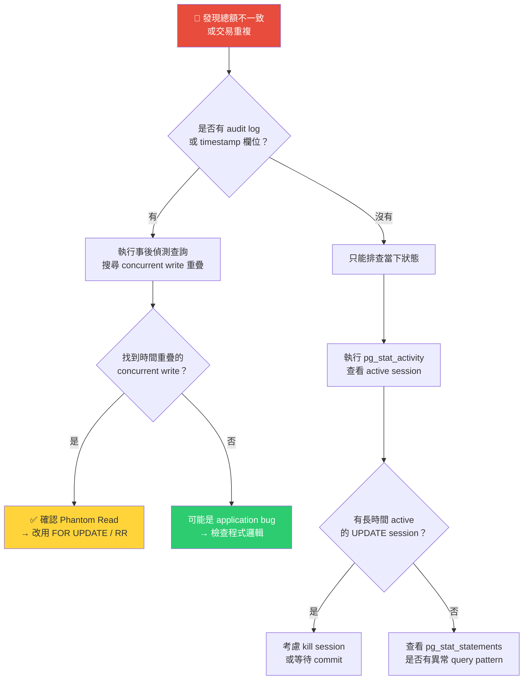
```mermaid
flowchart TD
    START["🚨 發現總額不一致<br/>或交易重複"] --> CHECK_LOG{"是否有 audit log<br/>或 timestamp 欄位？"}
    CHECK_LOG -->|"有"| AUDIT["執行事後偵測查詢<br/>搜尋 concurrent write 重疊"]
    CHECK_LOG -->|"沒有"| LIVE["只能排查當下狀態"]

    AUDIT --> FIND{"找到時間重疊的<br/>concurrent write？"}
    FIND -->|"是"| CONFIRM["✅ 確認 Phantom Read<br/>→ 改用 FOR UPDATE / RR"]
    FIND -->|"否"| BUG["可能是 application bug<br/>→ 檢查程式邏輯"]

    LIVE --> CHECK_ACTIVITY["執行 pg_stat_activity<br/>查看 active session"]
    CHECK_ACTIVITY --> HAS_LONG{"有長時間 active<br/>的 UPDATE session？"}
    HAS_LONG -->|"是"| KILL["考慮 kill session<br/>或等待 commit"]
    HAS_LONG -->|"否"| PATTERN["查看 pg_stat_statements<br/>是否有異常 query pattern"]

    style START fill:#e74c3c,color:#fff
    style CONFIRM fill:#ffd43b
    style BUG fill:#2ecc71,color:#fff
```

#### d. 生產症狀速查

| 業務症狀 | 底層原因 | 優先查 |
|----------|---------|--------|
| 退款重複（同一筆交易退款兩次） | SELECT 確認金額 → 另一筆退款 UPDATE BETWEEN → 再次 SELECT 仍有錢 | `## 1` 場景 |
| 庫存總數與明細加總不符 | SUM() 在 transaction 內被其他 session 的 INSERT 改變 | `## 1` 場景 |
| 報表數字每次刷新都不同 | Auto-commit 模式，每條 SELECT 拿到不同 snapshot | `## 1` + Npgsql connection pool |
| 用戶看到餘額跳動 | 同一頁面多條 AJAX 各自獨立 SELECT | Read Committed 預設行為 |

> 補充（Senior Dev）：Phantom Read 是 RC 的設計行為，不是 bug。如果業務邏輯依賴「兩個 SELECT 之間資料不變」，卻使用了 RC，這是應用層設計缺陷。最簡單的解法是在關鍵 SELECT 後加 `FOR UPDATE`（即使不打算 update），利用 row lock 阻止 concurrent write；或用 RR 取得 stable snapshot。要注意 `FOR UPDATE` 會阻塞其他 writer，在高並發場景需評估效能影響。

## 2. 場景：Repeatable Read 導致 VACUUM 積壓

### I. 原理

前面 6.II 已經說明了 OldestXmin 的影響。這是生產環境最常見的 Bloat 成因——比大規模 DELETE 更難排查，因為**表面上看起來沒有問題**：查詢正常、沒有 error、沒有 lock wait，但表的大小在偷偷增長。

### II. 即用查詢

```sql
-- 找出每個 database 中最老的 xmin（決定 VACUUM 能回收多老的 dead tuple）
SELECT datname,
       age(datfrozenxid) AS frozen_xid_age,
       datfrozenxid,
       (SELECT age(backend_xmin) FROM pg_stat_activity
        WHERE datname = d.datname AND backend_xmin IS NOT NULL
        ORDER BY age(backend_xmin) DESC LIMIT 1) AS oldest_active_xmin
FROM pg_database d
WHERE datname = current_database();
```

### III. 應急解法

| 優先級 | 行動 |
|--------|------|
| 1 | 找出 RR idle-in-transaction session → kill |
| 2 | `SET idle_in_transaction_session_timeout = '5min'` |
| 3 | 改用 Read Committed（90% 場景不需要 RR） |
| 4 | 手動 `VACUUM FREEZE` 標記老 tuple 為 frozen（繞過 xmin 限制） |

### IV. 持續監控

#### a. Bloat 估算查詢（依賴 pg_stat_user_tables，無需 extension）

```sql
-- 計算每個表的 dead tuple 佔比（不需要 pgstattuple extension）
SELECT schemaname, relname,
       n_live_tup, n_dead_tup,
       round(100.0 * n_dead_tup / NULLIF(n_live_tup + n_dead_tup, 0), 2) AS dead_pct,
       pg_size_pretty(pg_total_relation_size(relid)) AS total_size,
       last_vacuum, last_autovacuum,
       now() - last_autovacuum AS since_last_autovac
FROM pg_stat_user_tables
WHERE n_dead_tup > 1000
ORDER BY dead_pct DESC
LIMIT 20;
```

**結果解讀**：

| Column | 意義 | 解讀 |
|--------|------|------|
| `n_dead_tup` | 已標記刪除但尚未被 VACUUM 回收的 row 數量 | > 10 萬 → 嚴重積壓 |
| `dead_pct` | dead tuple 佔總 tuple 比例 | 見下方閾值表 |
| `since_last_autovac` | 距離上次 autovacuum 的時間 | > 1 小時且 dead_pct > 20% → autovacuum 被阻塞 |
| `last_autovacuum IS NULL` | 從未被 autovacuum | 表太小未達閾值，或 autovacuum 被關閉 |

#### b. 警戒閾值與建議動作

| dead_pct | 等級 | 症狀 | 建議動作 |
|----------|------|------|---------|
| < 5% | 🟢 正常 | 無 | 不需處理 |
| 5% – 10% | 🟡 觀察 | 查詢效能微幅下降 | 確認 vacuum frequency，檢查是否有長事務 |
| 10% – 20% | 🟠 分析根因 | Seq Scan 開始變慢、Index Scan 掃到 dead tuple 增加 | 找出 oldest xmin 持有者（`backend_xmin` 最老的 session） |
| 20% – 50% | 🔴 手動介入 | 表掃描時間明顯增加、disk 使用率上升 | `VACUUM (VERBOSE)` 手動清理，必要時 kill 長事務 |
| > 50% | 💀 危急 | 查詢可能 timeout、disk 接近滿載 | 立即 kill 最老的 `idle in transaction` session，手動 `VACUUM FULL`（需停機） |

#### c. 生產症狀列舉

| 應用層症狀 | PG 層原因 | 優先查看 |
|-----------|----------|---------|
| 某張表的 SELECT 越來越慢，但 EXPLAIN 沒變 | dead tuple 暴增，Index/Seq Scan 掃到大量垃圾行 | `dead_pct` > 20% |
| `pg_stat_user_tables.seq_scan` 的累積時間持續增加 | 同上（Seq Scan 最直接受 bloat 影響） | `pg_stat_user_tables` |
| Disk 使用率上升但 `INSERT/UPDATE` 量沒變 | dead tuple 佔據物理空間不被回收 | `pg_total_relation_size` vs 預期大小 |
| Autovacuum log 中頻繁出現 `skipped: old xmin` | 有長事務（通常是 RR idle-in-transaction）鎖住 OldestXmin | `## 2` 場景 + 執行 `backend_xmin` 查詢 |
| 定時 batch job 執行時間逐步拉長 | Bloat 累積效應，查詢成本隨 dead tuple 線性增長 | 設定 autovacuum cost limit 或排程 manual vacuum |

> 補充（Senior Dev）：`pg_stat_user_tables.n_dead_tup` 是估算值，由最後一次 ANALYZE 或 VACUUM 得出。如果很久沒做 ANALYZE，這個數字可能不準確。需要精確值時可以用 `pgstattuple` extension 的 `pgstattuple('table_name')` 函數，但該函數會做全表掃描，在生產環境大表上謹慎使用。

#### d. 自動化告警建議

| Metric | 告警閾值 | 工具 | 說明 |
|--------|---------|------|------|
| `pg_stat_user_tables.n_dead_tup / (n_live_tup + n_dead_tup)` | > 20% | Prometheus `postgres_exporter` / pgwatch2 | Bloat 比例過高 |
| `age(backend_xmin)` | > 5 分鐘 | pgwatch2 / 自訂 cron job | 有長事務卡 VACUUM |
| `pg_database.age(datfrozenxid)` | > 2 億 | Prometheus `postgres_exporter` | 接近 wraparound 風險 |
| `idle in transaction` session count | > 5 | 自訂監控查詢 | 有人忘了 COMMIT/ROLLBACK |
| `pg_stat_user_tables.last_autovacuum` > 1 小時 | 警告 | pgwatch2 內建 | Autovacuum 可能被阻塞或太慢 |

> 補充（Senior Dev）：pgwatch2 內建了多數 PG 監控 metric，包括 dead tuple 比例、xmin age、idle in transaction 數量。如果團隊已有 Prometheus + Grafana stack，`postgres_exporter` 的 `pg_stat_user_tables` metric 可直接對應上述查詢。自訂 cron job 也是輕量替代方案——每 5 分鐘跑一次 bloat 查詢，超過閾值就送 Slack/Telegram 通知。

## 3. 場景：Serializable Write Skew — 實際案例

```sql
-- 值班醫生表
CREATE TABLE doctors (id INT PRIMARY KEY, on_call BOOLEAN);
INSERT INTO doctors VALUES (1, true), (2, true);

-- Session A (Serializable)
BEGIN ISOLATION LEVEL SERIALIZABLE;
SELECT COUNT(*) FROM doctors WHERE on_call;  -- 2
UPDATE doctors SET on_call = false WHERE id = 1;

-- Session B (Serializable，同時）
BEGIN ISOLATION LEVEL SERIALIZABLE;
SELECT COUNT(*) FROM doctors WHERE on_call;  -- 2
UPDATE doctors SET on_call = false WHERE id = 2;

-- Session A COMMIT → 成功
-- Session B COMMIT → ❌ ERROR: could not serialize access
```

SSI 偵測到了 rw-antidependency 循環（A 讀了 B 後來寫的 row，B 讀了 A 後來寫的 row），abort 了 B。

### III. App Dev Retry Pattern

```csharp
// See Section 三 for full retry pattern
```

### IV. 生產環境監控

#### a. 監控 Dashboard 指標

| Metric | 資料來源 | 正常值 | 告警閾值 | 說明 |
|--------|---------|--------|---------|------|
| Serialization failure rate | App log 統計 `40001` error | < 0.1% | > 1% | 超過 1% 表示衝突頻繁，retry overhead 過大 |
| Serialization failure rate（危急） | App log 統計 `40001` error | < 0.1% | > 5% | **立即行動**：考慮降級或重新設計資料模型 |
| `pg_stat_database.xact_rollback / xact_commit` | PG stats | < 1% | > 5% | Rollback 比率高，但不一定全是 serialization failure |
| SIREAD lock count | `pg_locks` | 0–100 | > 10,000 | SIREAD lock 總數過多，記憶體壓力增加 |
| SIREAD lock 升級為 relation-level | `pg_locks WHERE locktype='SIReadLock' AND page IS NULL AND tuple IS NULL` | 0 | > 0 | 升級為 relation-level 表示 page-level 衝突過多，false positive 大增 |
| `pg_stat_database.conflicts` | PG stats | 0 | > 0 | 只有 standby 有值（recovery conflict），primary 上恆為 0 |
| Avg transaction duration (Serializable) | App log 或 pg_stat_statements | < 100ms | > 1 秒 | **Serializable 的衝突機率與 transaction 時長成正比** |

> 補充（Senior Dev）：Serialization failure rate 的最大敵人不是並發量，而是 **transaction 時長**。外部 API call、user think time、大資料量處理在 Serializable transaction 內都是地雷。如果你非得用 Serializable，確保 transaction 內只有「資料庫操作」，其他 I/O 全部放在 transaction 外。

#### b. 高衝突率診斷路徑

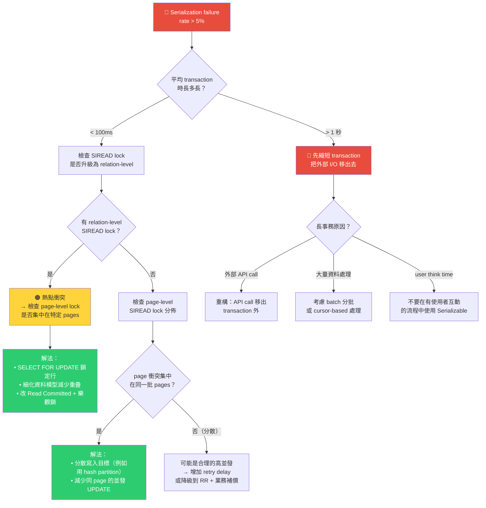
```mermaid
flowchart TD
    START["🚨 Serialization failure<br/>rate > 5%"] --> Q1{"平均 transaction<br/>時長多長？"}
    Q1 -->|"< 100ms"| Q2["檢查 SIREAD lock<br/>是否升級為 relation-level"]
    Q1 -->|"> 1 秒"| LONG["🔴 先縮短 transaction<br/>把外部 I/O 移出去"]

    Q2 --> REL_LOCK{"有 relation-level<br/>SIREAD lock？"}
    REL_LOCK -->|"是"| HOTSPOT["🟠 熱點衝突<br/>→ 檢查 page-level lock<br/>是否集中在特定 pages"]
    REL_LOCK -->|"否"| PAGE_CHECK["檢查 page-level<br/>SIREAD lock 分佈"]

    HOTSPOT --> SOLUTION1["解法：<br/>• SELECT FOR UPDATE 鎖定行<br/>• 細化資料模型減少重疊<br/>• 改 Read Committed + 樂觀鎖"]

    PAGE_CHECK --> CONCENTRATED{"page 衝突集中<br/>在同一批 pages？"}
    CONCENTRATED -->|"是"| SOLUTION2["解法：<br/>• 分散寫入目標（例如<br/>  用 hash partition）<br/>• 減少同 page 的並發 UPDATE"]
    CONCENTRATED -->|"否（分散）"| RETRY_CHECK["可能是合理的高並發<br/>→ 增加 retry delay<br/>或降級到 RR + 業務補償"]

    LONG --> LONG_CHECK{"長事務原因？"}
    LONG_CHECK -->|"外部 API call"| FIX1["重構：API call 移出<br/>transaction 外"]
    LONG_CHECK -->|"大量資料處理"| FIX2["考慮 batch 分批<br/>或 cursor-based 處理"]
    LONG_CHECK -->|"user think time"| FIX3["不要在有使用者互動<br/>的流程中使用 Serializable"]

    style START fill:#e74c3c,color:#fff
    style LONG fill:#e74c3c,color:#fff
    style HOTSPOT fill:#ffd43b
    style SOLUTION1 fill:#2ecc71,color:#fff
    style SOLUTION2 fill:#2ecc71,color:#fff
```

#### c. 即用查詢：檢查 SIREAD Lock 衝突情況

```sql
-- 檢查 page-level SIREAD lock 分佈
SELECT locktype, mode,
       page, tuple,
       count(*) AS lock_count
FROM pg_locks
WHERE locktype = 'SIReadLock'
GROUP BY 1, 2, 3, 4
ORDER BY count(*) DESC
LIMIT 20;
```

**結果解讀**：

| 情況 | 看到什麼 | 含義 |
|------|---------|------|
| SIREAD lock 集中某幾個 page | `page` 欄位重複出現，`lock_count` > 100 | 熱點衝突，多個 transaction 讀寫同一批 page |
| SIREAD lock 出現 `page IS NULL` | relation-level lock | 記憶體中的 page-level lock 過多，PG 自動升級為 relation-level（false positive 大增） |
| SIREAD lock 總數 | `SELECT count(*) FROM pg_locks WHERE locktype='SIReadLock'` | > 10,000 表示系統中有大量 Serializable transaction 同時執行 |

```sql
-- 誰持有的 SIREAD lock 最多？
SELECT p.pid, p.usename, p.application_name,
       p.state,
       age(now(), p.xact_start) AS xact_age,
       count(l.pid) AS siread_locks
FROM pg_locks l
JOIN pg_stat_activity p ON l.pid = p.pid
WHERE l.locktype = 'SIReadLock'
GROUP BY p.pid, p.usename, p.application_name, p.state, p.xact_start
ORDER BY siread_locks DESC
LIMIT 10;
```

#### d. App Dev 視角：為什麼盲目增加 Retry 次數是錯的

當 serialization failure rate 高時，直覺反應是「retry 更多次」。但這會導致 **Thundering Herd 效應**：

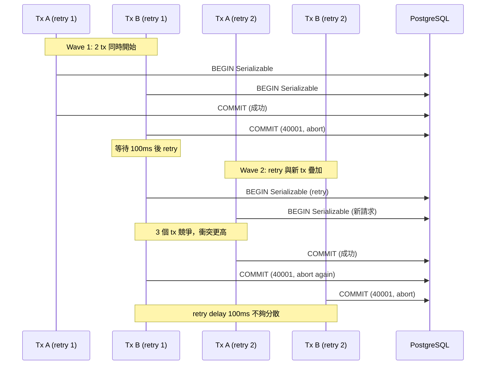
```mermaid
sequenceDiagram
    participant T1 as Tx A (retry 1)
    participant T2 as Tx B (retry 1)
    participant T3 as Tx A (retry 2)
    participant T4 as Tx B (retry 2)
    participant PG as PostgreSQL

    Note over T1,T2: Wave 1: 2 tx 同時開始
    T1->>PG: BEGIN Serializable
    T2->>PG: BEGIN Serializable
    T1->>PG: COMMIT (成功)
    T2->>PG: COMMIT (40001, abort)
    Note over T2: 等待 100ms 後 retry

    Note over T3,T4: Wave 2: retry 與新 tx 疊加
    T2->>PG: BEGIN Serializable (retry)
    T3->>PG: BEGIN Serializable (新請求)
    Note over T2,T3: 3 個 tx 競爭，衝突更高
    T3->>PG: COMMIT (成功)
    T2->>PG: COMMIT (40001, abort again)
    T4->>PG: COMMIT (40001, abort)
    Note over T2,T4: retry delay 100ms 不夠分散
```

**問題本質**：如果你有 N 個請求/sec、retry 3 次，最差情況下實際的並發量會是 N × 3。retry 越多，雪球越大。

**正確策略**：

| 情況 | 策略 | 原因 |
|------|------|------|
| Abort rate < 1% | Retry 3 次，exponential backoff | 正常設計行為 |
| Abort rate 1%–5% | Retry 3 次 + **增加 backoff 上限**（如 max 2 秒） | 讓 retry 分散到更大的時間窗口 |
| Abort rate > 5% | **先降級**，不要盲目增加 retry 次數 | 降級到 `SELECT FOR UPDATE` + RC，或 RR + 業務補償 |

> 補充（Senior Dev）：PG 的 SSI 在設計上就不是給「所有 transaction 都用 Serializable」的場景。它的假設是**只有少數關鍵 transaction 用 Serializable**。如果你的系統中 Serializable transaction 佔比超過 10%–20%，你需要重新審視為什麼需要 Serializable，而不是調 retry policy。

## 4. 隔離級別選擇決策矩陣

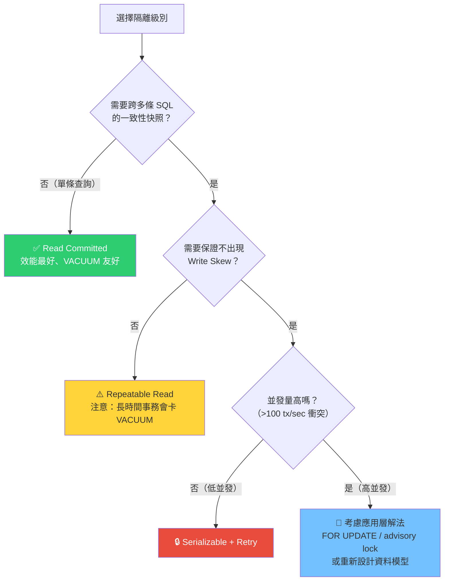
```mermaid
flowchart TD
    START["選擇隔離級別"] --> Q1{"需要跨多條 SQL<br/>的一致性快照？"}
    Q1 -->|"否（單條查詢）"| RC["✅ Read Committed<br/>效能最好、VACUUM 友好"]
    Q1 -->|"是"| Q2{"需要保證不出現<br/>Write Skew？"}
    Q2 -->|"否"| RR["⚠️ Repeatable Read<br/>注意：長時間事務會卡 VACUUM"]
    Q2 -->|"是"| Q3{"並發量高嗎？<br/>（>100 tx/sec 衝突）"}
    Q3 -->|"否（低並發）"| SERIAL["🔒 Serializable + Retry"]
    Q3 -->|"是（高並發）"| ALT["🔄 考慮應用層解法<br/>FOR UPDATE / advisory lock<br/>或重新設計資料模型"]

    style RC fill:#2ecc71,color:#fff
    style RR fill:#ffd43b
    style SERIAL fill:#e74c3c,color:#fff
    style ALT fill:#74c0fc
```

| 級別 | 防止 Dirty Read | 防止 Non-Repeatable Read | 防止 Phantom Read | 防止 Write Skew | VACUUM 友好 |
|------|:---:|:---:|:---:|:---:|:---:|
| Read Committed | ✅ | ❌ | ❌ | ❌ | ✅✅✅ |
| Repeatable Read | ✅ | ✅ | ✅ (PG 獨有) | ❌ | ❌ |
| Serializable | ✅ | ✅ | ✅ | ✅ | ❌ |

### V. 30 秒應急排查卡

生產事故發生時，前 30 秒跑這 3 條 SQL（全部唯讀，不需要 superuser 權限）：

#### a. 第 1 條：誰在幹嘛？（5 秒）

```sql
SELECT pid, usename, application_name, state,
       wait_event_type, wait_event,
       age(now(), xact_start) AS xact_age,
       LEFT(query, 100) AS query
FROM pg_stat_activity
WHERE state <> 'idle'
  AND backend_type = 'client backend'
ORDER BY xact_start;
```

| 看到什麼 | 判斷 | 行動 |
|----------|------|------|
| 所有 `xact_age < 1秒` | 🟢 正常，沒有長事務 | 問題不在 transaction 層 |
| 有 `xact_age > 5分鐘` 的 active session | 🔴 嚴重長事務，可能在等 lock 或用戶斷線 | 第 2 條查 lock wait |
| 有 `state = 'idle in transaction'` 且 `xact_age > 1分鐘` | 🟠 有人忘了 COMMIT/ROLLBACK | 回到 `## 2` 場景（VACUUM 積壓） |
| 有 `state = 'active'` 且 `wait_event_type = 'Lock'` | 🔴 有人卡在等鎖 | 立刻跑第 2 條查詢 |
| 有 `state = 'active'` 且 `query` 為空 | 🟡 可能是 client 發送了 query 但 pending（網路問題） | 檢查 client 端 |

#### b. 第 2 條：有 Lock Wait 嗎？（5 秒）

```sql
SELECT locktype, mode, granted, count(*) AS count
FROM pg_locks
WHERE NOT granted
GROUP BY locktype, mode, granted
ORDER BY count DESC;
```

| 看到什麼 | 判斷 | 行動 |
|----------|------|------|
| 返回 0 行 | 🟢 沒有 lock wait | Lock 不是當前問題 |
| `locktype = 'transactionid'` 且 NOT granted | 🔴 有人在等另一個 transaction COMMIT（最常見的 lock wait） | 查 blocking session → kill |
| `locktype = 'relation'` 且 mode = `AccessExclusiveLock` | 🔴 有人在等 DDL（如 ALTER TABLE），block 了所有讀寫 | 通常是有 migration / 維護作業忘了 COMMIT |
| `locktype = 'tuple'` 且 NOT granted | 🟠 有人在等同一 row 的 lock（`FOR UPDATE` 競爭） | 檢查 application 層是否有 concurrent update 到同一 row |

```sql
-- 補充查詢：誰是阻塞者？（如果上面有結果）
SELECT blocked.pid AS blocked_pid,
       blocked.query AS blocked_query,
       blocking.pid AS blocking_pid,
       blocking.query AS blocking_query,
       age(now(), blocking.xact_start) AS blocking_xact_age
FROM pg_stat_activity blocked
JOIN pg_locks blocked_locks ON blocked.pid = blocked_locks.pid
JOIN pg_locks blocking_locks ON blocked_locks.locktype = blocking_locks.locktype
    AND blocked_locks.database IS NOT DISTINCT FROM blocking_locks.database
    AND blocked_locks.relation IS NOT DISTINCT FROM blocking_locks.relation
    AND blocked_locks.page IS NOT DISTINCT FROM blocking_locks.page
    AND blocked_locks.tuple IS NOT DISTINCT FROM blocking_locks.tuple
    AND blocked_locks.transactionid IS NOT DISTINCT FROM blocking_locks.transactionid
    AND blocked_locks.pid <> blocking_locks.pid
JOIN pg_stat_activity blocking ON blocking.pid = blocking_locks.pid
WHERE NOT blocked_locks.granted
  AND blocking.state <> 'idle';
```

#### c. 第 3 條：有人卡 VACUUM 嗎？（5 秒）

```sql
SELECT pid, usename, application_name, state,
       age(backend_xmin) AS xmin_age,
       age(now(), xact_start) AS xact_age,
       LEFT(query, 80) AS query
FROM pg_stat_activity
WHERE backend_xmin IS NOT NULL
  AND state = 'idle in transaction'
ORDER BY age(backend_xmin) DESC
LIMIT 20;
```

| 看到什麼 | 判斷 | 行動 |
|----------|------|------|
| 返回 0 行 | 🟢 卡 VACUUM 的不是 `idle in transaction` | 回到 `## 2.III` 找其他根因 |
| `xmin_age > 5分鐘` 且 `state = 'idle in transaction'` | 🔴 典型 RR/SERIALIZABLE 忘了 COMMIT | Kill 這個 session 或通知 owner |
| `xmin_age > 1小時` | 💀 極端情況，VACUUM 完全被阻塞 | 立刻 kill；事後設定 `idle_in_transaction_session_timeout` |
| 同一個 application 多個 session | 🟠 Application connection pool 可能有 leak | 通知 App Dev 檢查 pool 設定 |

#### d. 快速對照表：生產症狀 → 根因 → 查詢指引

| 生產症狀 | 最可能根因 | 優先查本文段落 | 第一步 SQL |
|----------|-----------|---------------|-----------|
| 某表查詢越來越慢 | Dead tuple 積壓（VACUUM 被長事務卡住） | `## 2` Repeatable Read VACUUM 積壓 | 30 秒卡第 3 條 → 第 1 條 |
| 交易重複（重複扣款/退款） | Phantom Read（RC 下兩次 SELECT 之間被其他 session 改變） | `## 1` Read Committed Phantom | 30 秒卡第 1 條（看 concurrent write） |
| 報表數字對不上 | 同上，或應用層沒用 transaction | `## 1` + `# 三.1`（Npgsql transaction 管理） | 30 秒卡第 1 條 |
| API 隨機報 40001 error | Serializable Write Skew 衝突 | `## 3` Serializable Write Skew | 30 秒卡第 1 條 + `## 3.IV` 指標 |
| Connection pool 耗盡 | 大量 `idle in transaction` session | `## 2` + 檢查 `idle_in_transaction_session_timeout` 設定 | 30 秒卡第 1 條（看 state） |
| DB 整體變慢但 CPU/IO 正常 | 有人在等 lock（Lock Wait） | `## 1`（ROW SHARE / EXCLUSIVE lock 競爭） | 30 秒卡第 2 條 |
| Disk 使用率急速上升 | Bloat 累積（Dead tuple 未被回收） | `## 2` Repeatable Read VACUUM 積壓 | 30 秒卡第 3 條 + `## 2.IV` bloat 估算 |
| 無法 ALTER TABLE / CREATE INDEX | 有 session 持有該表的 ACCESS SHARE lock 不釋放 | `## 2`（idle in transaction 持有 snapshot） | 30 秒卡第 1 條 + 第 2 條 |

> 補充（Senior Dev）：這 3 條 SQL 的設計原則是「30 秒內鎖定問題方向」，不是「30 秒內解決問題」。實際生產事故中，80% 的情況在這 3 條查詢就能找到根因（長事務、lock wait、或 VACUUM 阻塞）。剩下的 20% 才需要深入 `pg_stat_statements`、`EXPLAIN ANALYZE`、或 application log 交叉比對。

---

# 三、App Dev 視角：.NET / Dapper 實戰

## 1. Npgsql 中的 IsolationLevel 設定

### I. NpgsqlTransaction 的 IsolationLevel Enum

Npgsql 支援以下五個 enum 值：

```csharp
using var tx = conn.BeginTransaction(IsolationLevel.ReadCommitted);
```

| Npgsql Enum | PG 對應 | 注意 |
|-------------|---------|------|
| `ReadUncommitted` | Read Committed | PG 中等同 RC |
| `ReadCommitted` | Read Committed | **預設值** |
| `RepeatableRead` | Repeatable Read | 整個事務同一個 Snapshot |
| `Serializable` | Serializable | 需要 retry logic |
| `Snapshot` | Repeatable Read | PG 中等同 RR |
| `Chaos` | — | PG 不支援，會報錯 |

### II. Dapper 的正確 Transaction 管理

```csharp
// ✅ 正確寫法：明確指定隔離級別
using var conn = new NpgsqlConnection(connectionString);
conn.Open();
using var tx = conn.BeginTransaction(IsolationLevel.ReadCommitted);
try
{
    var balance = conn.QuerySingle<int>(
        "SELECT balance FROM accounts WHERE id = @id FOR UPDATE",
        new { id = 1 }, tx);  // ← 傳入 transaction！

    if (balance >= amount)
    {
        conn.Execute(
            "UPDATE accounts SET balance = balance - @amount WHERE id = @id",
            new { amount, id = 1 }, tx);
        conn.Execute(
            "UPDATE accounts SET balance = balance + @amount WHERE id = @id",
            new { amount, id = 2 }, tx);
    }

    tx.Commit();
}
catch (PostgresException ex) when (ex.SqlState == "40001")
{
    // 40001 = serialization_failure
    // 只有 Serializable 會觸發這個 error
    tx.Rollback();
    throw new TransientException("Serialization failure, retry", ex);
}
catch
{
    tx.Rollback();
    throw;
}
```

```csharp
// ❌ 錯誤寫法 1：沒傳 transaction 給 Dapper
var balance = conn.QuerySingle<int>(
    "SELECT balance FROM accounts WHERE id = 1 FOR UPDATE");
// ← FOR UPDATE 需要 transaction！沒傳 tx 會報錯或行為不正確

// ❌ 錯誤寫法 2：用了 Repeatable Read 但沒意識到 VACUUM 風險
using var tx = conn.BeginTransaction(IsolationLevel.RepeatableRead);
// ...處理業務邏輯（可能含外部 API call，耗時不確定）
await httpClient.PostAsync(...);  // ← 如果 timeout，transaction 卡住
tx.Commit();
// → OldestXmin 被鎖住 5 分鐘，VACUUM 無法清理
```

### III. Dapper 參數化查詢與 pg_stat_statements Query Normalization

```csharp
// Dapper 的參數化會產生 $1, $2 佔位符
var orders = conn.Query<Order>(
    "SELECT * FROM orders WHERE status = @status AND create_time > @since",
    new { status = "active", since = DateTime.UtcNow.AddDays(-7) });

// PG 內部實際執行：
// SELECT * FROM orders WHERE status = $1 AND create_time > $2
// pg_stat_statements 的 query normalization 與此一致
// queryid 對應的是「參數化後的 SQL 模板」
```

> 補充（Senior Dev）：Dapper 的參數化預設使用 positional parameters（`$1, $2`），與 Npgsql 的原生行為一致。確保不要在 SQL 中拼接字串（如 `$"WHERE status = '{status}'"`），否則每種參數值會產生不同的 queryid，導致 pg_stat_statements 無法正確彙總統計。如果有動態 WHERE 條件（如 optional filters），使用 Dapper 的 `DynamicParameters` 或 `SqlBuilder`。

### IV. 生產環境配置與可觀測性

#### a. Npgsql Connection String 最佳實踐

Npgsql 連線字串中的每個參數都直接影響 PG 端的行為和可觀測性。以下為生產環境建議的連線字串建構方式：

```csharp
var connStr = new NpgsqlConnectionStringBuilder
{
    Host = "db.example.com",
    Database = "mydb",
    Username = "app_user",
    Password = "***",
    ApplicationName = "MyApp-OrderService",  // ← 對應 pg_stat_activity.application_name
    MaxPoolSize = 50,
    MinPoolSize = 5,
    ConnectionIdleLifetime = 300,
    ConnectionPruningInterval = 10
}.ToString();
```

| 參數 | 生產環境建議值 | 原理與坑點 |
|------|--------------|-----------|
| `ApplicationName` | `{AppName}-{ServiceName}` | 寫入 `pg_stat_activity.application_name`，是排查問題的第一線索。多個 app instance 用相同 ApplicationName 時無法區分個體，需配合 instance-id 尾綴或依賴 client_addr |
| `MaxPoolSize` | 50（預設）；高並發場景 100-200 | `MaxPoolSize × app instance 數 < PG max_connections − (superuser_reserved + 監控連線)`。池耗盡時 Npgsql 拋 `TimeoutException`（"The connection pool has been exhausted"），不應靠加大 PG `max_connections` 來解——每個 PG backend 約佔 5-10MB，連線數過高造成 memory pressure |
| `MinPoolSize` | 5-10 | 避免冷啟動前幾條 query 因建立實體連線而延遲。設太小無效，設太大浪費 PG backend |
| `ConnectionIdleLifetime` | 300（5 分鐘） | **必須 < PG 端 `idle_in_transaction_session_timeout`**。Npgsql pool 持有 idle connection，PG 端 timeout kill 後 pool 不知情，下次取出即報「connection is broken」 |
| `ConnectionPruningInterval` | 10（10 秒） | Pool 清理閒置連線的檢查頻率。過大可能導致大量 broken connection 集中爆發 |

> 補充（Senior Dev）：Npgsql 6.0+ 支援 `KeepAlive` 與 `TcpKeepAlive` 參數，可偵測已被 PG 或網路中斷的 TCP 連線。在容器環境（K8s + 負載均衡器）尤其重要，因為中間網路層的 idle timeout 通常比 PG 端更短，且不會發送 TCP RST 告知 client。

#### b. 記錄 backend_pid 到 Application Log

**原理**：`pg_stat_activity.pid` 是 PG backend process 的 OS 層 PID，Npgsql 的 `conn.ProcessID` 正是這個值。出事時，app log 中的 PID 是唯一能跨系統還原現場的線索。

```csharp
using var conn = new NpgsqlConnection(connectionString);
conn.Open();
_logger.LogInformation(
    "DB connection established, BackendPID={PID}, ApplicationName={App}",
    conn.ProcessID, conn.ConnectionString);
```

**為什麼這麼做**：

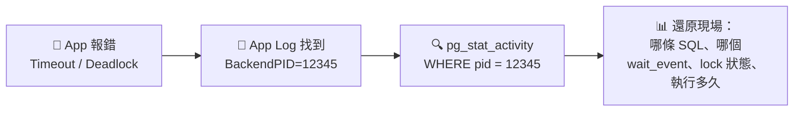
```mermaid
flowchart LR
    A["🔴 App 報錯<br/>Timeout / Deadlock"] --> B["📄 App Log 找到<br/>BackendPID=12345"]
    B --> C["🔍 pg_stat_activity<br/>WHERE pid = 12345"]
    C --> D["📊 還原現場：<br/>哪條 SQL、哪個<br/>wait_event、lock 狀態、<br/>執行多久"]
```

- **Structured Logging 建議**：使用 Serilog / NLog 的 structured logging（`{PID}` 而非字串拼接），方便在 Grafana / ELK 中以 PID 為 key 跨系統查詢
- 建議在 `conn.Open()` 後立刻記錄，確保每次建立實體連線都有 log
- 使用 connection pool 時，`conn.ProcessID` 在 connection 歸還後可能被新的 backend 重用——查問題時要注意時間窗口對齊

> 補充（Senior Dev）：Npgsql 6.0 前 `ProcessID` 屬性名為 `ConnectorID`（內部連線 ID，非 PG pid），6.0+ 才改名對應 PG 的 pid。如果還在用舊版，升級 Npgsql 是最佳解。

#### c. Connection Pool 與 idle_in_transaction_session_timeout 的陷阱

**為什麼發生**：

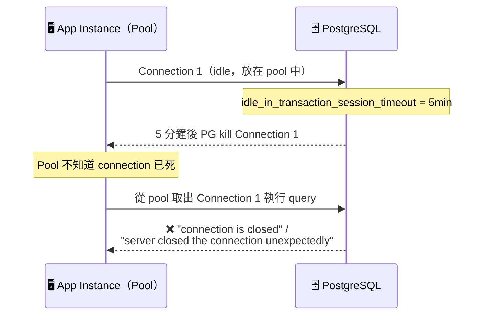
```mermaid
sequenceDiagram
    participant App as 🖥️ App Instance（Pool）
    participant PG as 🗄️ PostgreSQL

    App->>PG: Connection 1（idle，放在 pool 中）
    Note over PG: idle_in_transaction_session_timeout = 5min
    PG-->>App: 5 分鐘後 PG kill Connection 1
    Note over App: Pool 不知道 connection 已死
    App->>PG: 從 pool 取出 Connection 1 執行 query
    PG-->>App: ❌ "connection is closed" /<br/>"server closed the connection unexpectedly"
```

這是最常見的生產環境「偶發性連線錯誤」根因之一——PG kill 連線時 Npgsql pool 不會收到通知，直到下次使用才發現連線已斷。

**怎麼查**：

```sql
-- 偵測已被 PG kill 但 pool 仍持有的 idle 連線數
-- 若 PG 有設 idle_in_transaction_session_timeout = 5min，這些很可能已斷
SELECT count(*) AS suspected_dead_connections
FROM pg_stat_activity
WHERE wait_event_type = 'Client'
  AND state = 'idle'
  AND age(now(), state_change) > interval '5 minutes';
```

| Output Column | 解讀 |
|---------------|------|
| `suspected_dead_connections` | 超過 5 分鐘的 idle 連線數。數值持續 > 0 表示 pool 設定與 PG timeout 不匹配，app 下一次使用這些連線就會報錯 |

**怎麼解**：

| 解法 | 適用場景 | 優缺點 |
|------|---------|--------|
| `ConnectionIdleLifetime` < PG timeout | 固定 pool 大小的 app | 簡單，Npgsql pool 會主動在期限內回收舊連線 |
| Npgsql 6.0+ `KeepAlive` / `TcpKeepAlive` | 容器化 / K8s 環境 | TCP keepalive 可在 OS 層偵測斷線，比 application 層 timeout 更快發現 |
| PG 端 `idle_session_timeout`（PG14+） | DBA 可控 | 僅限 PG14+；與 `idle_in_transaction_session_timeout` 不同，kill 的是非 in-transaction 的 idle 連線 |
| 不用 pool，每次 new connection | 低並發 batch job | 最安全但 connection 建立 overhead 大（SSL handshake + authentication） |

#### d. 生產症狀對照表

以下表格幫助 App Dev 從自己看到的異常，快速定位 PG 層根因與應讀章節：

| App 層異常 | Npgsql Exception | PG 層根因 | 相關章節 |
|-----------|-----------------|----------|---------|
| 交易失敗需重試 | `PostgresException` SqlState=`40001` | SSI serialization_failure | 一.5（SSI 原理）、三.2（Retry Pattern） |
| Connection 逾時 | `TimeoutException`（"pool has been exhausted"） | Pool 耗盡 / long-running query | 此處（Connection Pool 配置） |
| Connection 突然斷線 | `NpgsqlException`（"Exception while reading from stream"） | PG kill idle connection / 網路中斷 | 此處（idle timeout 陷阱） |
| 查詢突然變慢 | —（app 端感知 latency 飆高） | Table / Index Bloat、缺 VACUUM | 一.6（VACUUM 原理）、二.2（Bloat 案例） |
| 資料不一致（帳不平） | — | Phantom Read / Write Skew | 一.4（RR 能阻擋什麼）、二.1（Phantom 案例） |
| Deadlock | `PostgresException` SqlState=`40P01` | 兩個 transaction 互相等待對方 lock | 二.3（Deadlock 診斷） |

## 2. Serializable Retry Pattern

### I. 為什麼 Serializable 需要 Retry？

Serializable 的 serialization failure 不是 bug，是**設計行為**。SSI 在 COMMIT 時才檢查依賴，所以你的 transaction 可能會：
1. 執行所有 SQL 都成功
2. 到 `tx.Commit()` 時才拋 `40001 serialization_failure`
3. 你必須重試整個 transaction

### II. C# Retry Pattern（Polly）

```csharp
using Polly;

var retryPolicy = Policy
    .Handle<PostgresException>(ex => ex.SqlState == "40001")
    .WaitAndRetry(
        retryCount: 3,
        sleepDurationProvider: retryAttempt =>
            TimeSpan.FromMilliseconds(Math.Pow(2, retryAttempt) * 100),
        onRetry: (exception, timeSpan, retryCount, context) =>
        {
            _logger.LogWarning(
                "Serialization failure on retry {RetryCount}, " +
                "waiting {WaitMs}ms before retry",
                retryCount, timeSpan.TotalMilliseconds);
        });

retryPolicy.Execute(() =>
{
    using var conn = new NpgsqlConnection(connectionString);
    conn.Open();
    using var tx = conn.BeginTransaction(IsolationLevel.Serializable);
    try
    {
        // 你的 business logic
        var count = conn.QuerySingle<int>(
            "SELECT COUNT(*) FROM doctors WHERE on_call",
            transaction: tx);
        if (count >= 2)
        {
            conn.Execute(
                "UPDATE doctors SET on_call = false WHERE id = @id",
                new { id = 1 }, tx);
        }
        tx.Commit();
    }
    catch
    {
        tx.Rollback();
        throw;
    }
});
```

### III. 什麼時候該降級而非重試？

| 情況 | 建議 |
|------|------|
| 高並發、高衝突率（>5% abort rate） | 不要用 Serializable，改用 `SELECT FOR UPDATE` + Read Committed |
| 外部 API call 在 transaction 內 | 不要用 Serializable，transaction 時間太長會放大衝突 |
| 偶爾的 write skew 可容忍 | 用 Repeatable Read + 業務邏輯補償（比 retry overhead 小） |
| 金流、庫存扣減 | Serializable + retry（不能容忍一致性錯誤） |

### IV. 生產環境 Retry 監控與告警

#### a. Retry Metrics 建議

Serializable retry 必須有可觀測性，否則你不知道重試是救了你還是蓋住了問題。

**必須埋的 3 個 Metrics**：

| Metric 名稱 | 型別 | 說明 | 告警條件 |
|------------|------|------|---------|
| `db_serialization_retry_total` | Counter | 每次觸發 40001 retry 時 +1 | — |
| `db_serialization_retry_success` | Counter | retry 最終成功 commit | — |
| `db_serialization_retry_exhausted` | Counter | 重試 N 次仍失敗 | rate > 1%（佔總交易比例）觸發告警 |

```csharp
// 使用 System.Diagnostics.Metrics（.NET 6+ 內建，無需外部依賴）
public static class DbMetrics
{
    private static readonly Meter Meter = new("MyApp.Database", "1.0");

    public static readonly Counter<int> SerializationRetryTotal = Meter.CreateCounter<int>(
        "db_serialization_retry_total", description: "Total serialization failure retries");

    public static readonly Counter<int> SerializationRetrySuccess = Meter.CreateCounter<int>(
        "db_serialization_retry_success", description: "Successful retries after 40001");

    public static readonly Counter<int> SerializationRetryExhausted = Meter.CreateCounter<int>(
        "db_serialization_retry_exhausted", description: "Retries exhausted without success");
}
```

> 補充（Senior Dev）：`System.Diagnostics.Metrics` 是 .NET 的 OpenTelemetry-compatible API，可透過 `OpenTelemetry.Exporter.Prometheus` 或 `OpenTelemetry.Exporter.Console` 匯出。如果團隊已有 Prometheus + Grafana stack，建議直接走 OTel pipeline。重點不在於用哪個 library，而在於 **retry_exhausted rate 的告警閾值**——這個數字默默上升代表衝突率已超出 Serializable 能承擔的範圍，需要降級隔離級別或改架構。

#### b. Thundering Herd（驚群效應）問題

**原理**：多個 app instance 同時遇到 serialization failure 時，如果都用相同的固定 backoff 間隔（如 100ms），所有 instance 會在同一瞬間 retry → 再次全部衝突 → 再次同時 retry，形成「永遠無法全部成功」的共振效應。

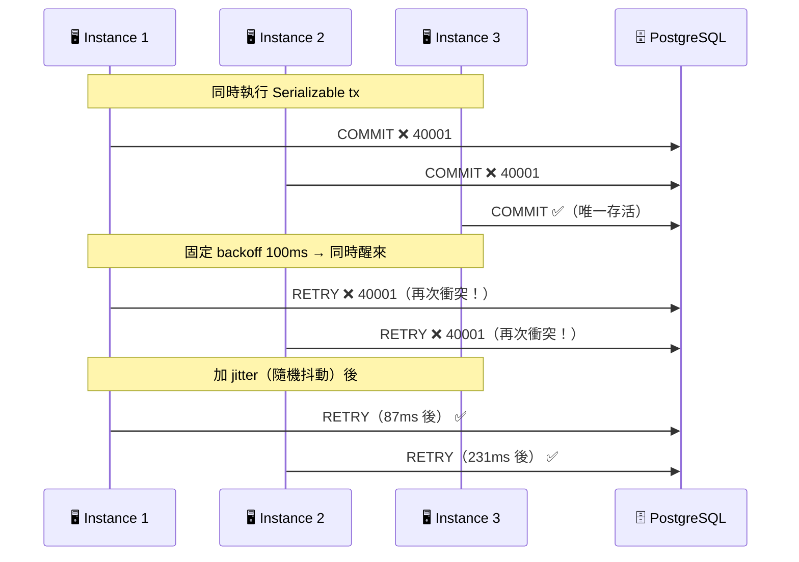
```mermaid
sequenceDiagram
    participant A1 as 🖥️ Instance 1
    participant A2 as 🖥️ Instance 2
    participant A3 as 🖥️ Instance 3
    participant PG as 🗄️ PostgreSQL

    Note over A1,A3: 同時執行 Serializable tx
    A1->>PG: COMMIT ❌ 40001
    A2->>PG: COMMIT ❌ 40001
    A3->>PG: COMMIT ✅（唯一存活）
    Note over A1,A3: 固定 backoff 100ms → 同時醒來
    A1->>PG: RETRY ❌ 40001（再次衝突！）
    A2->>PG: RETRY ❌ 40001（再次衝突！）
    Note over A1,A3: 加 jitter（隨機抖動）後
    A1->>PG: RETRY（87ms 後） ✅
    A2->>PG: RETRY（231ms 後） ✅
```

**正確做法：Jitter × Exponential Backoff**：

```csharp
var retryPolicy = Policy
    .Handle<PostgresException>(ex => ex.SqlState == "40001")
    .WaitAndRetry(
        retryCount: 3,
        sleepDurationProvider: retryAttempt =>
            TimeSpan.FromMilliseconds(
                Math.Pow(2, retryAttempt) * 100 + Random.Shared.Next(0, 100)),
        onRetry: (exception, timeSpan, retryCount, context) =>
        {
            _logger.LogWarning(
                "Serialization failure retry {Count}/3, wait {Ms}ms",
                retryCount, timeSpan.TotalMilliseconds);
        });
```

| 參數 | 說明 |
|------|------|
| `Math.Pow(2, retryAttempt) * 100` | Exponential backoff：100ms → 200ms → 400ms |
| `Random.Shared.Next(0, 100)` | Jitter：0-99ms 隨機抖動，破壞多 instance 間的同步 |
| `retryCount: 3` | 最多 3 次 retry（共 4 次嘗試）。超過 3 次的場景建議改用 async retry |

> 補充（Senior Dev）：`Random.Shared` 是 .NET 6+ 的 thread-safe 隨機數產生器，適合在 Polly 的 `sleepDurationProvider` 中使用（該 delegate 可能被多個 thread 同時呼叫）。如果使用 Polly v8+，`WaitAndRetry` API 略有不同（改為 `WaitAndRetryAsync` + `RetryStrategyBuilder`），上述範例以 Polly v7 為準，升級時要注意 migration。

#### c. 即用查詢：從 PG 端監控 Serialization Failure 趨勢

```sql
-- 查看各資料庫的 rollback 比例（包含所有類型的 rollback）
SELECT datname,
       xact_commit, xact_rollback,
       round(100.0 * xact_rollback / NULLIF(xact_commit + xact_rollback, 0), 2) AS rollback_pct,
       stats_reset
FROM pg_stat_database
ORDER BY rollback_pct DESC;
```

| Output Column | 解讀 |
|---------------|------|
| `datname` | 資料庫名稱 |
| `xact_commit` | 自 stats_reset 以來的 commit 總數 |
| `xact_rollback` | 自 stats_reset 以來的 rollback 總數（**包含所有類型**：業務 rollback + serialization failure + deadlock + statement error 觸發的 implicit rollback） |
| `rollback_pct` | rollback 比例。正常應 < 1%，若 > 5% 需立刻調查 |
| `stats_reset` | 統計歸零時間。若與近期變動（上版、DB 重啟）吻合，資料代表性可能不足 |

> 補充（Senior Dev）：`xact_rollback` 是一個籠統的數字，**無法單獨區分 serialization failure**。要精確統計 40001，需要搭配 app 端 metrics（上述 `db_serialization_retry_exhausted`）或啟用 PG 17+ 的 `pg_stat_session` 進行 per-session 追蹤。實務上，將 app metrics + DB stats 疊在一起看才能完整判斷：`rollback_pct` 突然飆高 + app 端 `retry_exhausted` 沒變 → 可能是業務 bug（不該 rollback 的地方 rollback 了），而非 SSI 問題。

#### d. 架構建議：同步 Retry vs Message Queue + Outbox Pattern

並非所有場景都適合在 app 層做同步 retry：

| 維度 | 適合同步 Retry | 適合 Message Queue + Outbox |
|------|-------------|--------------------------|
| 衝突率 | 低（< 1%） | 高（> 5%） |
| Transaction 時間 | 短（< 50ms） | 長（> 500ms，或含外部 API call） |
| 一致性要求 | 強一致（需要 immediate consistency） | 最終一致可接受 |
| 跨服務操作 | 單一服務內 | 涉及多個微服務或第三方 API |
| 失敗代價 | 低（retry 成本小於降級風險） | 高（需要補償機制 + idempotency key） |

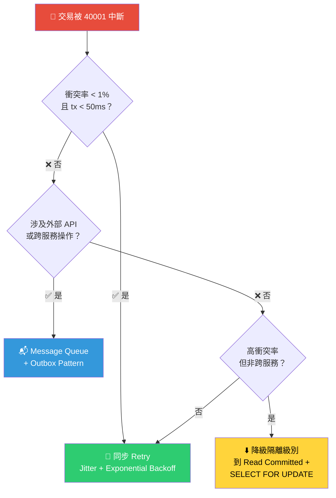
```mermaid
flowchart TD
    S["🔴 交易被 40001 中斷"]
    S --> Q1{"衝突率 < 1%<br/>且 tx < 50ms？"}
    Q1 -->|"✅ 是"| R["🔄 同步 Retry<br/>Jitter + Exponential Backoff"]
    Q1 -->|"❌ 否"| Q2{"涉及外部 API<br/>或跨服務操作？"}
    Q2 -->|"✅ 是"| M["📬 Message Queue<br/>+ Outbox Pattern"]
    Q2 -->|"❌ 否"| C{"高衝突率<br/>但非跨服務？"}
    C -->|"是"| D["⬇️ 降級隔離級別<br/>到 Read Committed +<br/>SELECT FOR UPDATE"]
    C -->|"否"| R

    style S fill:#e74c3c,color:#fff
    style R fill:#2ecc71,color:#fff
    style M fill:#3498db,color:#fff
    style D fill:#ffd43b,color:#000
```

**Outbox Pattern 簡介**（for App Dev）：將「要執行的操作」先寫入一個 `outbox` 表（與業務操作在同一個 transaction），再由 background worker 從 outbox 讀取並 async 執行。這樣即使外部操作失敗，也可以獨立 retry，不影響原始 transaction 的 commit。

> 補充（Senior Dev）：Outbox pattern 在 .NET 生態中最常見的實作是 MassTransit + PostgreSQL（或 NServiceBus）。核心原則：「先 persist，再 publish」——確保 event/message 不會因為 transaction rollback 而丟失，也不會因為 message broker 暫時不可用而阻斷業務流程。如果團隊規模小或不需要 full ESB，也可以用 `System.Threading.Channels` + `BackgroundService` 做一個簡化版 in-process outbox。

---

# 附錄、SQL Standard vs PostgreSQL 隔離級別對照

| 異常現象 | SQL Standard 定義 | PG Read Committed | PG Repeatable Read | PG Serializable |
|----------|:---:|:---:|:---:|:---:|
| **Dirty Read** | RC 防止 | ✅ 防止 | ✅ 防止 | ✅ 防止 |
| **Non-Repeatable Read** | RR 防止 | ❌ 不防止 | ✅ 防止 | ✅ 防止 |
| **Phantom Read** | Serializable 防止 | ❌ 不防止 | ✅ 防止 (PG 獨有) | ✅ 防止 |
| **Serialization Anomaly** | Serializable 防止 | ❌ 不防止 | ❌ 不防止 | ✅ 防止 |
| **Write Skew** | （無明確定義） | ❌ | ❌ | ✅ |

> PostgreSQL 的 Repeatable Read 實際上達到了 SQL Standard 中 Serializable 的大部分保證（防止 Phantom Read），但不能防止所有序列化異常（Write Skew 仍可能發生）。真正的 Serializable 使用 SSI 來偵測並拒絕這些異常。

## 生產環境速查卡（One-Page Quick Reference）

### I. Top 5 生產症狀 → 根因 → 查詢對照

| # | 症狀（App Dev 看到的） | DB 層面現象 | 最可能根因 | 優先執行 SQL | 對應章節 |
|---|---------------------|-----------|----------|------------|---------|
| 1 | API response 變慢 | 大量 dead tuple、seq scan 時間增加 | 長時間未 COMMIT 的 RR 事務卡 VACUUM | 30 秒卡 #3 | 一.6、二.2 |
| 2 | 特定 API 一直 timeout | lock wait queue 堆積 | `FOR UPDATE` 未釋放 / 忘了 COMMIT | 30 秒卡 #2 | 一.3、三.1 |
| 3 | 重試率飆高、409/Conflict | 40001 serialization_failure | Serializable 高並發衝突 | rollback rate query | 一.5、三.2 |
| 4 | 餘額/庫存對不上 | 資料不一致但無 error | Phantom Read / Write Skew | 審計查詢 | 一.4、二.1 |
| 5 | 表大小暴增、disk 告警 | bloat > 50% | 大規模 DELETE/UPDATE 後 VACUUM 跟不上 | Bloat 查詢 | 一.6、二.2 |

### II. 30 秒三連查詢

```sql
-- #1 誰在幹嘛？（看 active session）
SELECT pid, usename, application_name, state,
       wait_event_type, wait_event,
       age(now(), xact_start) AS xact_age,
       LEFT(query, 100) AS query
FROM pg_stat_activity
WHERE state <> 'idle'
ORDER BY xact_start;
-- 紅旗：xact_age > 5min 且 state = 'idle in transaction'

-- #2 誰卡住誰？（看 lock wait）
SELECT blocked.pid AS blocked_pid,
       blocked.query AS blocked_query,
       blocking.pid AS blocking_pid,
       blocking.query AS blocking_query,
       age(now(), blocked.query_start) AS wait_time
FROM pg_stat_activity blocked
JOIN pg_locks bl ON blocked.pid = bl.pid AND NOT bl.granted
JOIN pg_locks bk ON bl.locktype = bk.locktype AND bl.relation = bk.relation
                 AND bk.granted
JOIN pg_stat_activity blocking ON bk.pid = blocking.pid;
-- 紅旗：wait_time > 30s

-- #3 誰卡 VACUUM？（看 OldestXmin）
SELECT pid, usename, state,
       age(backend_xmin) AS xmin_tx_age,
       age(now(), xact_start) AS xact_age,
       LEFT(query, 100) AS query
FROM pg_stat_activity
WHERE backend_xmin IS NOT NULL
  AND state = 'idle in transaction'
ORDER BY age(backend_xmin) DESC;
-- 紅旗：xmin_tx_age 很大（百萬以上）
```

### III. GUC 參數速查

| 參數 | 建議值 | 白話解釋 | 為什麼重要 |
|------|--------|---------|----------|
| `idle_in_transaction_session_timeout` | `5min` | 忘了 COMMIT 的事務 5 分鐘後自動 kill | 防止 OldestXmin 卡住 |
| `max_pred_locks_per_transaction` | `128`（高並發 SZ 場景） | Serializable 事務最多能追蹤多少個 page lock | 防止升級為 relation-level 導致大量 false positive |
| `old_snapshot_threshold` | `1h`（如需防長 RR 事務） | RR 事務的 snapshot 最長活多久 | 超過時查詢會報錯，但保護 VACUUM |
| `lock_timeout` | `30s`（或按業務） | 等 lock 最久等多久 | 防止 lock wait 無限期堆積 |
| `statement_timeout` | `30s`（OLTP） | 一條 SQL 最久跑多久 | 防止慢查詢佔用 connection |
| `log_lock_waits` | `on`（建議開啟） | lock wait > `deadlock_timeout` 時寫入 log | 事後排查 lock 問題的關鍵 |

### IV. Log Pattern 速查

| Log 關鍵字 | 含義 | 行動 |
|-----------|------|------|
| `could not serialize access` | Serializable 衝突，事務被 abort | 檢查 retry rate，必要時降級隔離級別 |
| `deadlock detected` | 兩個事務互相等待對方的 lock | 檢查 app code 的 lock 獲取順序 |
| `canceling statement due to lock timeout` | lock_timeout 觸發 | 找出 blocking session |
| `canceling statement due to statement timeout` | statement_timeout 觸發 | 優化慢查詢或調高 timeout |
| `snapshot too old` | RR 事務的 snapshot 超過 old_snapshot_threshold | 縮短事務或調高閾值 |

## 版本演進

| 功能 | 版本 | 說明 |
|------|------|------|
| SSI (Serializable Snapshot Isolation) | PG 9.1 | 取代傳統 S2PL 鎖定，效能大幅提升 |
| `predicate_lock_consistency` | PG 9.2-9.x | 控制 SIREAD lock 的 false positive（PG 10 移除） |
| `old_snapshot_threshold` | PG 9.6 | 限制 RR 事務的 snapshot 壽命 |
| `idle_in_transaction_session_timeout` | PG 10 | 自動 kill 忘了 COMMIT 的 session |
| `default_transaction_isolation` 支援 enum | PG 10+ | 不再需要用字串設定 |
| `pg_stat_activity.backend_xmin` | 內建 | 直接查看每個 session 的 snapshot xmin |
| `log_lock_waits` | PG 8.1+ | 記錄 lock wait 到 log（`deadlock_timeout` 間隔），建議開啟 |

## 參考

- [PostgreSQL Official — Transaction Isolation](https://www.postgresql.org/docs/current/transaction-iso.html)
- [PostgreSQL SSI Paper (Ports & Grittner, 2012)](https://drkp.net/papers/ssi-vldb12.pdf)
- [PostgreSQL Concurrency Control — MVCC Deep Dive](https://www.interdb.jp/pg/pgsql05.html)
- [PostgreSQL Wiki — Lock Monitoring](https://wiki.postgresql.org/wiki/Lock_Monitoring)
- [PostgreSQL Wiki — Serializable Snapshot Isolation](https://wiki.postgresql.org/wiki/Serializable)
