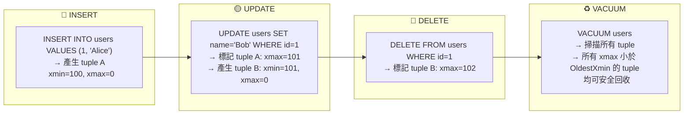
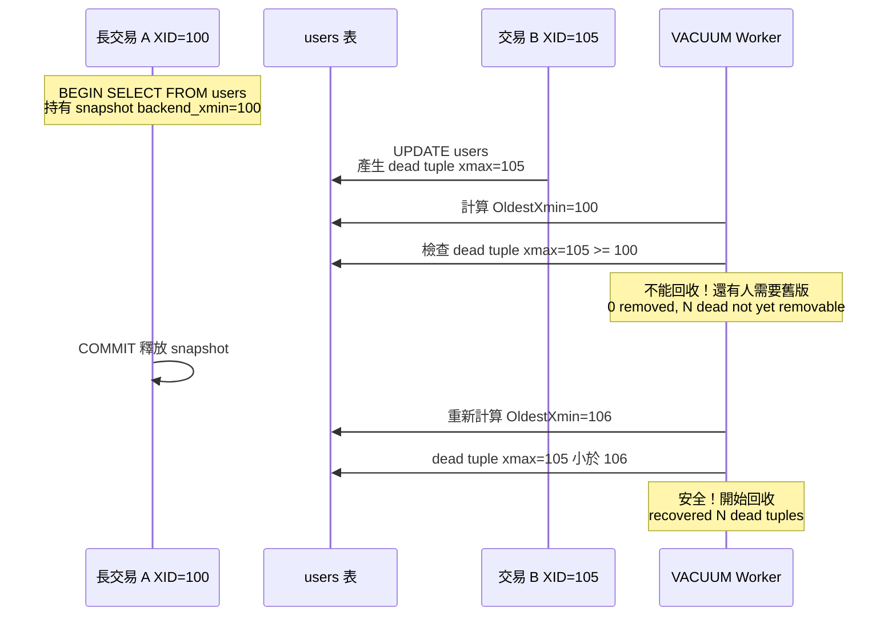
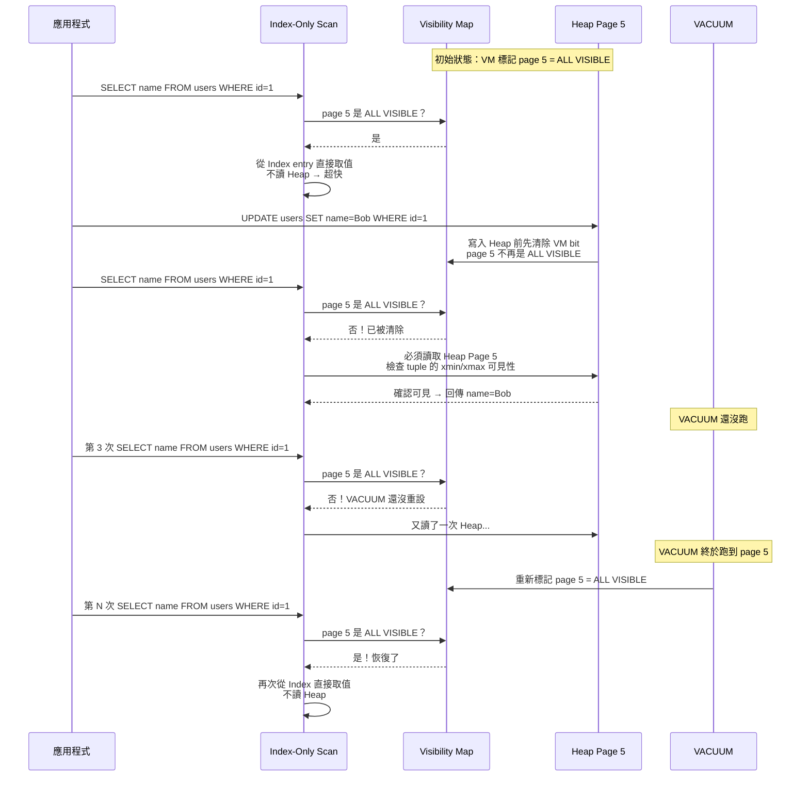
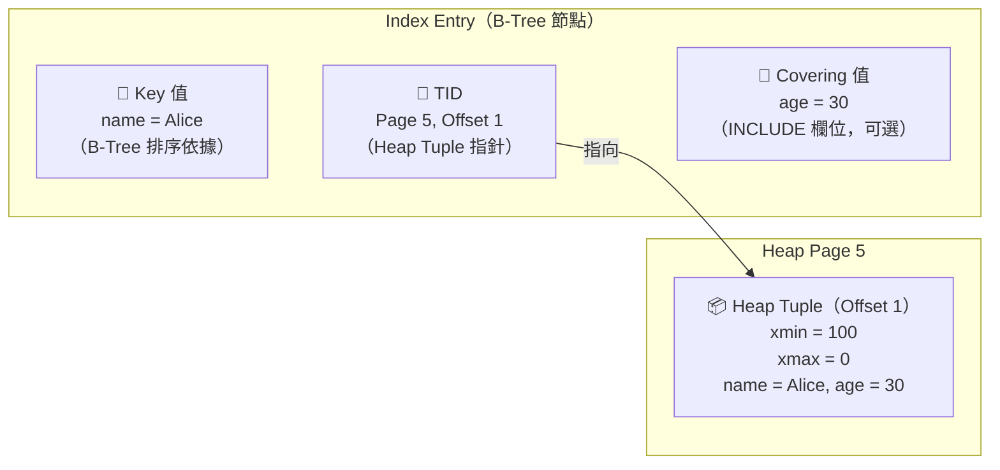
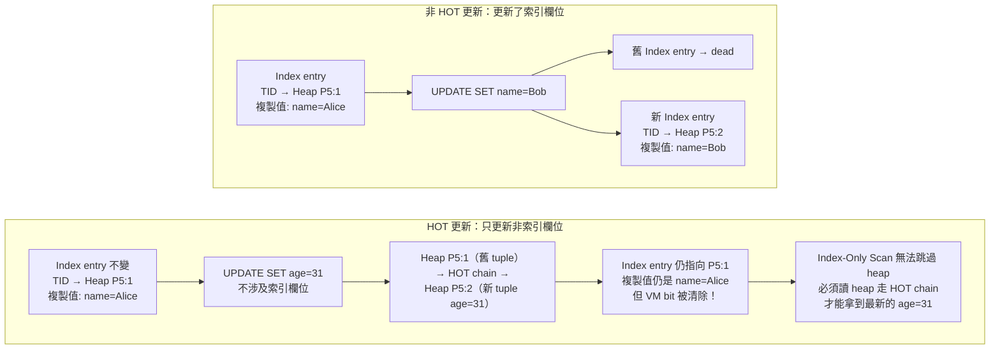
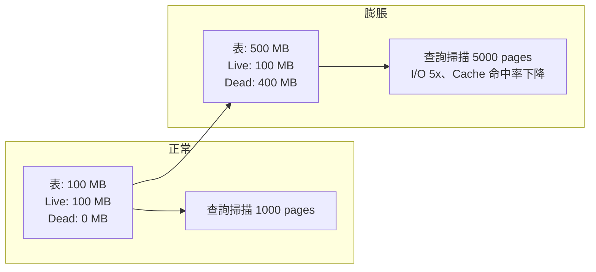
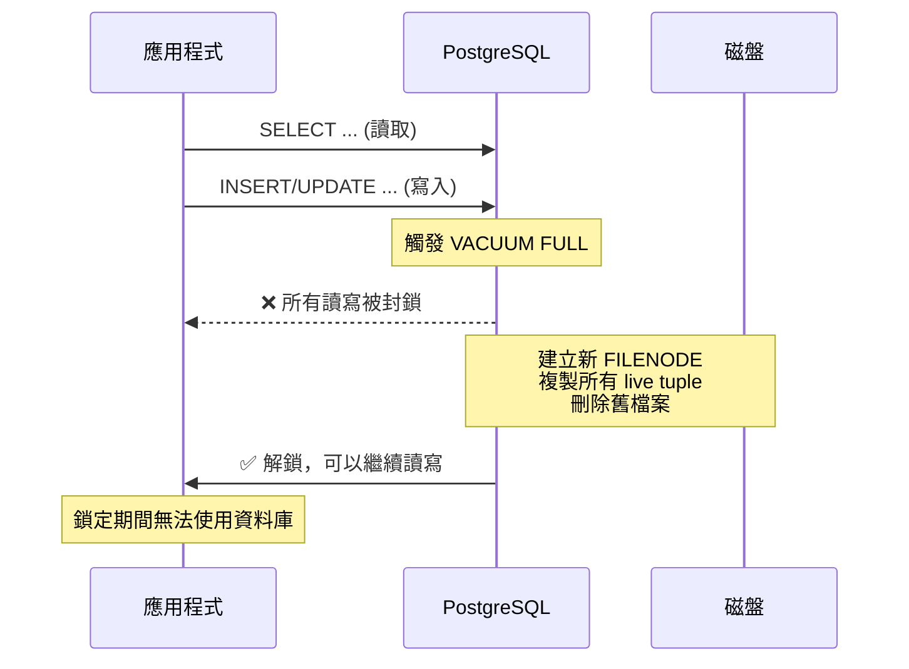
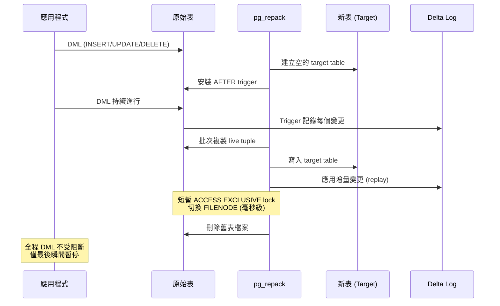
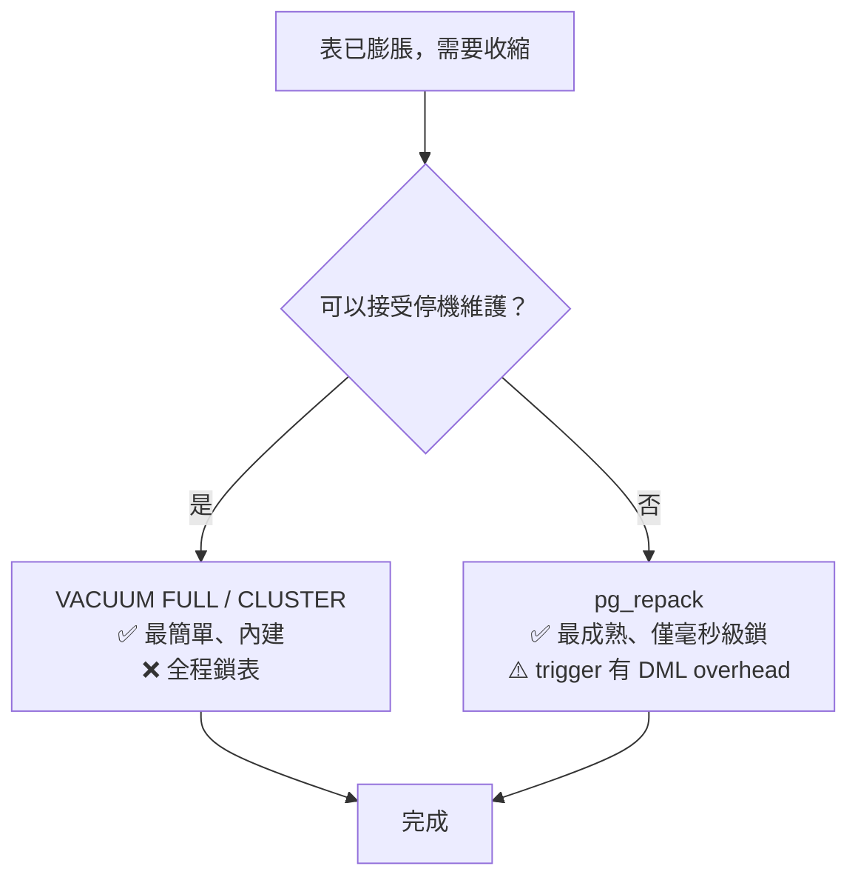
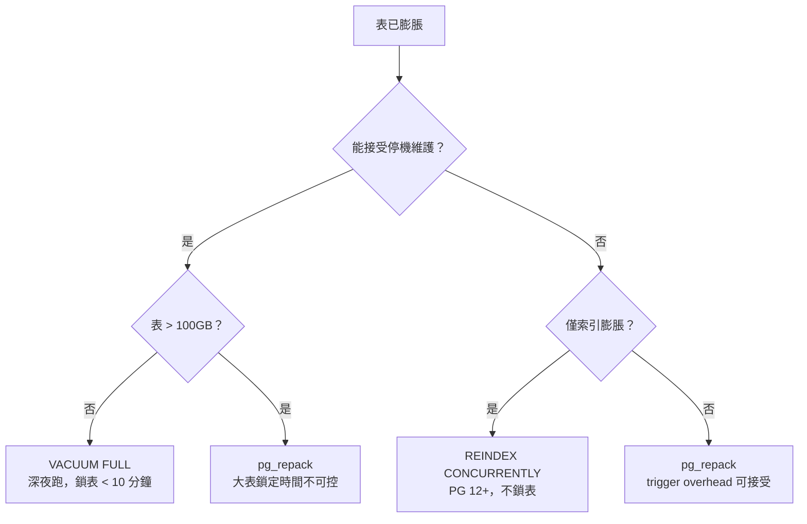

# PostgreSQL Vacuum 深度解析

> 本文件分為兩章，由淺入深理解 PostgreSQL Bloat：
>
> **第一章**（Vacuum 原理與防止 Bloat）：從 MVCC 機制出發，詳細分析 Bloat 的各種根因——Long Transaction、autovacuum 配置、IO、觸發閾值等，並提供完整的測試驗證與預防措施。
>
> **第二章**（收縮膨脹表方案）：當 Bloat 已經發生，對比三種重建方案——VACUUM FULL、pg_repack、pg_squeeze——從鎖定時間、效能影響、自動化能力等維度全面比較，並給出現代最佳實踐建議。

---

# 一、PostgreSQL Vacuum 原理與防止 Bloat

> 來源：[digoal - PostgreSQL 垃圾回收原理以及如何预防膨胀 (2015-04-29)](https://github.com/digoal/blog/blob/master/201504/20150429_02.md)
>
> 更新於 2026-05-24，補充 PG 12~18 新增能力

---

## 0. 核心概念速覽：從生產場景理解 MVCC、Dead Tuple 與 VACUUM

> 本章以 Developer 在生產環境中會遇到的**真實場景**為起點，反向推導核心原理。先知道「生產上會看到什麼訊號」，再學「為什麼會這樣」，最後補上「如何快速診斷」。

### I. 場景一：表變大、資料沒增加 —— 什麼是 Bloat？

你在 Grafana / Datadog 的磁盤監控看到某張表的磁盤用量在過去數小時內從 500 MB 暴增到 2 GB，但 `SELECT count(*)` 的回傳值完全沒變。同時 APP 端開始回報查詢變慢。

這就是 PostgreSQL 最常見的生產問題之一：**Bloat（表膨脹）**。

**Bloat = 磁盤空間被 dead tuple 佔據而未回收，導致表／索引的實際大小遠大於所需大小。** 就像垃圾桶一直沒人倒，垃圾不斷累積，查詢時需要掃描更多 page，I/O 增加。

要理解 Bloat 為什麼發生，必須先理解 PostgreSQL 最核心的設計：**MVCC（多版本並行控制）**。

### II. MVCC 是什麼？為什麼 Bloat 是它的代價？

大多數關聯式資料庫在處理「同時讀取與寫入同一筆資料」時，有兩種策略：

- **悲觀鎖（Pessimistic Locking）**：讀取時加鎖，寫入時等待。讀者阻塞寫者，寫者阻塞讀者。
- **MVCC（Multi-Version Concurrency Control）**：每次更新不直接覆蓋舊資料，而是**建立一個新版本**。讀者永遠讀取「自己交易開始時已提交的版本」——**讀者永不阻塞寫者，寫者永不阻塞讀者**。

PostgreSQL 採用 MVCC。同一行資料在資料庫中可能同時存在多個版本（tuple / row version）。

> **MVCC 的代價**：舊版本不會自動消失，必須靠 VACUUM 清理。清理不夠快或不夠及時 → 舊版本堆積 → Bloat。

### III. Tuple 的生命週期：xmin 與 xmax

PostgreSQL 中的每一行資料（tuple / row version）內部攜帶兩個隱藏系統欄位：

| 欄位 | 含義 |
|------|------|
| `xmin` | 建立這個版本的交易 ID。「我由哪個交易建立」 |
| `xmax` | 刪除/淘汰這個版本的交易 ID。0 表示尚為最新版。「我由哪個交易標記為過時」 |



**關鍵理解**：
- **INSERT**：建立新 tuple，xmin = 當前交易 ID，xmax = 0。
- **UPDATE** = **DELETE + INSERT**：(1) 舊 tuple 的 xmax 設為當前交易 ID，(2) 建立全新 tuple（xmin = 當前交易 ID）。
- **DELETE**：將 tuple 的 xmax 設為當前交易 ID，**不立即從磁盤移除**。

### IV. 什麼是 Dead Tuple？

當一個 tuple 的 `xmax` 不為 0，且**所有需要看到這個舊版本的交易都已結束**，就是 Dead Tuple。Dead tuple 仍佔據磁盤空間——只是被「標記過時」，實體資料還在硬碟上。

### V. 場景二：autovacuum log 一直顯示「dead but not yet removable」

你巡 PostgreSQL log 發現 autovacuum 輸出：

```
tuples: 0 removed, 500001 remain, 500001 are dead but not yet removable
tuples: 0 removed, 760235 remain, 760235 are dead but not yet removable
```

`removed = 0` 表示 VACUUM 在跑，但一個 dead tuple 都沒清掉。為什麼？

### VI. OldestXmin — 決定 Dead Tuple 能不能回收的關鍵水位

PostgreSQL 計算 **OldestXmin**（系統中所有活躍交易中，最老的那個 snapshot），然後：

- **xmax < OldestXmin** → 所有交易都不再需要這個舊版本 → **可回收**
- **xmax >= OldestXmin** → 還有交易可能看得到 → **不可回收**

**生產場景模擬**：

1. 中午 12:00，開發者打開 pgAdmin，執行 `BEGIN; SELECT * FROM users;` 後去吃午飯（XID=100）。
2. 中午 12:05，排程任務開始大量 `UPDATE users`，產生大量 dead tuple（xmax=105）。
3. 此時 OldestXmin = 100（開發者 pgAdmin 的 snapshot 還卡在 XID=100）。
4. autovacuum 檢查 dead tuple：`xmax=105 >= OldestXmin(100)` → **全部不能回收**。

結果：這些 dead tuple 會持續佔據空間，直到那位開發者 COMMIT 或被 timeout kill 掉。



**生產快速排查**：誰在阻塞 VACUUM？

```sql
-- 找出持有最舊 snapshot 的 session（這就是阻塞 VACUUM 的兇手）
SELECT pid, usename, application_name,
       state, now() - xact_start AS xact_age,
       backend_xid, backend_xmin,
       left(query, 80) AS query
FROM pg_stat_activity
WHERE backend_xmin IS NOT NULL
ORDER BY backend_xmin
LIMIT 5;
```

### VII. 場景三：查詢變慢，EXPLAIN 的 Buffer 暴增

業務團隊投訴「同樣的 SELECT 比以前慢 5 倍」。EXPLAIN 分析發現 Buffer 讀取量暴增——不是資料變多了，是 dead tuple 把 page 塞滿了，同樣的查詢需要掃描更多 page。

**快速量化 Bloat 嚴重程度**：

```sql
-- 診斷各表的 dead tuple 佔比
SELECT schemaname, relname,
       n_live_tup,
       n_dead_tup,
       CASE WHEN n_live_tup > 0
            THEN round(100.0 * n_dead_tup / (n_live_tup + n_dead_tup), 1)
            ELSE 0
       END AS dead_ratio_pct,
       pg_size_pretty(pg_total_relation_size(relid)) AS total_size
FROM pg_stat_user_tables
WHERE n_dead_tup > 0
ORDER BY n_dead_tup DESC
LIMIT 20;
```

`dead_ratio_pct > 20%` → 建議安排 vacuum / repack。`> 50%` → 緊急。

```sql
-- 精確版：用 pgstattuple 取得詳細 dead tuple 資訊
CREATE EXTENSION IF NOT EXISTS pgstattuple;
SELECT * FROM pgstattuple('your_table_name');
```

### VIII. VACUUM 做了什麼？

VACUUM 是 PostgreSQL 內建的垃圾回收機制，三個核心任務：

1. **回收 Dead Tuple 空間**：掃描資料頁（page），找出已確認不再被任何交易需要的 dead tuple，將其空間標記為「可重用」（寫入 Free Space Map, FSM）。
2. **凍結舊交易 ID（Freeze）**：防止交易 ID 迴繞（XID Wraparound）。交易 ID 是 32-bit 整數，必須定期將老舊的 xmin 標記為「凍結」。
3. **更新 Visibility Map（VM）**：幫助後續 VACUUM 和 Index-Only Scan 跳過不需要檢查的 page。

#### a. Visibility Map（VM）深度解析

**VM 是什麼？**

每個 relation（表）都有一個對應的 Visibility Map 檔案（`_vm` 後綴），是一張位圖（bitmap），每個 heap page 佔 2 個 bit：

| Bit | 名稱 | 含義 |
|-----|------|------|
| Bit 0 | `VISIBILITYMAP_ALL_VISIBLE` | 這個 page 內的所有 tuple 對所有活躍交易都是可見的（沒有任何 dead tuple，沒有未提交的變更） |
| Bit 1 | `VISIBILITYMAP_ALL_FROZEN` | 這個 page 內所有 tuple 都已被 freeze（防止 XID wraparound，PG 9.6+） |

白話：VM 是 PostgreSQL 的「快速跳過索引」——當一個 page 被標記為 all-visible 時，查詢引擎可以**完全跳過讀取這個 page**。

**VM 如何加速 VACUUM？**

一般 VACUUM 需要掃描**每一頁**來找 dead tuple。但如果 VM 標記某個 page 為 `ALL_VISIBLE` + `ALL_FROZEN`，表示這頁內沒有任何 dead tuple 也不需要 freeze → **直接跳過**，不讀取、不檢查。

這對大表尤其關鍵：一張 1TB 的表如果只有 5% 的 page 有 dead tuple，VM 可以讓 VACUUM 只掃描那 5%。

#### b. VM 失效的實際過程（Index-Only Scan 退化）

VM 的核心價值在於讓 Index-Only Scan 跳過 heap page：Index 找到 tuple 位置後，若 VM 標記該 page 為 `ALL_VISIBLE`，直接從 index 回傳值，不讀 heap。但 DML 一寫入就清除 VM bit — 熱表在高並發寫入下 VM 永遠追不上。

**VM 何時會被重置？**

每次 `INSERT` / `UPDATE` / `DELETE` 寫入一個 page 時，該 page 的 VM bit 會被**清除**（因為 page 不再是 all-visible）。下一次 VACUUM 掃過時會重新設定。

**生產影響：VM 失效的連鎖反應**

| 狀況 | 後果 |
|------|------|
| VACUUM 太久沒跑 | VM 大量 page 未標記 → 下次 VACUUM 需全表掃描，耗時倍增 |
| 頻繁 UPDATE 熱表 | VM 不斷被清除、重設 → Index-Only Scan 一直無法命中，退化為普通 Index Scan |
| `pg_relation_size` vs `pg_table_size` | VM 檔案本身很小（每 8KB page 只需 2 bit），不會造成磁盤問題 |

**快速檢查 VM 狀態**：

```sql
-- 看表有多少 page 被標記為 all-visible
SELECT relname,
       relpages,
       relallvisible,
       round(100.0 * relallvisible / NULLIF(relpages, 0), 1) AS allvisible_pct
FROM pg_class
WHERE relkind = 'r' AND relpages > 0
ORDER BY allvisible_pct;
-- allvisible_pct 高 = Index-Only Scan 效果好
-- allvisible_pct 接近 0 = VM 幾乎無效，VACUUM 需要跑全表
```

#### b. VM 失效的實際過程（Index-Only Scan 退化）

以下用一個具體例子說明 VM 如何在頻繁更新中失效，導致 Index-Only Scan 從「不讀 heap」退化為「每筆都讀 heap」：



> **補充**：「讀 Heap Page」可能是從 shared_buffers（RAM）或硬碟讀取。但即使 page 已在 RAM 中，讀取仍需要 buffer manager lock、檢查 xmin/xmax 等 CPU 成本。Index-Only Scan 跳過 heap 等於省掉這些全部。

**關鍵**：VM 被清除是瞬間的事（任何 DML 寫入 page 就清），但 VM 被重設必須等 VACUUM 跑到該 page。熱表在高並發寫入下，VACUUM 永遠追不上 — VM bit 一直被清、從沒被重設 — Index-Only Scan 永久退化。

**生產訊號**：`pg_stat_user_tables` 中 `idx_scan` 很高但 `idx_tup_fetch` 也很高（表示 index 找到了但還是讀了 heap），同時 `allvisible_pct` 很低。

```sql
-- 找出 Index-Only Scan 退化的熱表
SELECT relname,
       idx_scan,
       idx_tup_read,
       idx_tup_fetch,
       CASE WHEN idx_tup_read > 0
            THEN round(100.0 * idx_tup_fetch / idx_tup_read, 1)
            ELSE 0
       END AS heap_fetch_pct
FROM pg_stat_user_tables
WHERE idx_scan > 100
ORDER BY heap_fetch_pct DESC;
-- heap_fetch_pct 接近 100 = 幾乎每次都讀了 heap → Index-Only Scan 白費
```

#### c. 為什麼 Index-Only Scan 必須依賴 VM？Index Entry 有 MVCC 嗎？

以下 DDL 是後面所有 mermaid 圖的基礎：

```sql
CREATE TABLE users (
    id    INT PRIMARY KEY,     -- PK 自動建 index
    name  TEXT,                -- 會被索引的欄位（Key）
    age   INT                  -- 只放在 INCLUDE 裡（Covering 值）
);

-- Covering Index: 查 name=xxx 時，Index-Only Scan 可直接回傳 age
CREATE INDEX idx_users_name_age ON users (name) INCLUDE (age);

-- 初始資料
INSERT INTO users VALUES (1, 'Alice', 30);
```

這筆資料在磁盤上的布局如下：



> Index entry 本身**沒有 xmin / xmax**，不做可見性判斷。能不能看到這筆資料，由 Heap Tuple 的 `xmin` / `xmax` 決定。

更新後 index entry「可能不是最新」的根本原因在於 PostgreSQL 的 **HOT（Heap-Only Tuple）** 機制：



**關鍵推論**：HOT 更新的存在，正是 Index-Only Scan **不能只看 index** 的根本原因。Index entry 的複製值是建立時的快照，不會隨 HOT 更新而刷新。所以 VM 必須先證明「這個 page 真的 all-visible 且沒有任何 HOT chain 需要追」，Index-Only Scan 才能安全跳過 heap。VM bit 一被清除，Scan 就必須回頭讀 heap 走 HOT chain。

**重要區分 —— 生產上最常被問的問題**：

| | VACUUM（一般/autovacuum） | VACUUM FULL |
|---|---|---|
| **行為** | 只標記空間可重用，**不歸還磁盤空間給 OS** | 重建整張表，歸還所有空間給 OS |
| **鎖** | 不阻塞讀寫 | 全程 AccessExclusiveLock（阻塞所有操作） |
| **用途** | 日常維護 | 緊急收縮 / 維護窗口 |

### IX. 總結：從生產訊號到根因的 Mapping

| 你在生產環境看到 | 對應的核心概念 | 下一步行動 |
|---|---|---|
| 表磁盤暴增但 row count 沒變 | Bloat（Dead Tuple 堆積） | 查 `n_dead_tup`，確認 autovacuum 是否在跑 |
| Log 顯示「dead but not yet removable」| OldestXmin 被壓住 | 查 `backend_xmin` 找出長交易，kill 或等它結束 |
| 查詢掃描 page 數暴增、變慢 | Page density 下降（dead tuple 塞滿 page） | `pgstattuple` 精確診斷，安排 vacuum / repack |
| autovacuum 從不觸發 | 觸發閾值太高 / Worker 不足 | 檢查 `scale_factor`、`naptime`、worker 數量 |

理解了這些基礎概念後，我們來看 Bloat 在生產環境中的具體成因和對策。

---

## 1. Bloat 成因：生產環境診斷指南

> 以下按**生產環境遇到頻率從高到低**排列。每個成因附帶「生產訊號 + 快速診斷」，讓你在 on-call 時能快速定位。

### I. Long Transaction／未關閉游標／隔離級別（生產中最高頻的根因）

**生產訊號**：autovacuum log 持續輸出 `0 removed, N are dead but not yet removable`，`removed` 完全為 0，但 dead tuple 不斷增長。

**快速確認**：

```sql
-- 找出誰的 snapshot 在阻塞 VACUUM（按最舊排序）
SELECT pid, usename, application_name,
       state, now() - xact_start AS xact_age,
       backend_xid, backend_xmin,
       left(query, 80) AS query
FROM pg_stat_activity
WHERE state <> 'idle'
  AND (backend_xid IS NOT NULL OR backend_xmin IS NOT NULL)
ORDER BY xact_start;
```

**根因**：VACUUM 只能回收 xmax < OldestXmin 的 dead tuple。`OldestXmin` = 所有活躍交易中最老的那個 snapshot。只要有人卡住一個舊 snapshot，所有比他新的 dead tuple 都不能回收。

- `backend_xid`：已申請交易 ID（做了寫入操作），從申請持續到 COMMIT。
- `backend_xmin`：查詢的 snapshot 水位（看到的世界停在某個時間點），從 SQL 開始持續到 SQL 結束或游標關閉。

以下四種場景都會導致 `backend_xid` / `backend_xmin` 長期佔用：

| 生產場景 | 實際例子 | 持續到何時 |
|------|----------|-----------|
| 持有 XID 的長事務 | 開發者在 pgAdmin 開一個 `BEGIN; INSERT...;` 後掛著 | 事務 COMMIT / ROLLBACK |
| 未關閉游標 | ORM 或應用忘記 `CLOSE CURSOR` | 游標 CLOSE 或事務結束 |
| 長時間查詢 | `pg_dump` 全庫備份期間（隱式 REPEATABLE READ）、報表查詢 `SELECT * FROM huge_table` 跑很久 | SQL 執行結束 |
| REPEATABLE READ / SERIALIZABLE | Java Spring `@Transactional(isolation=REPEATABLE_READ)` | 事務 COMMIT / ROLLBACK |

> **生產陷阱**：
> - `pg_dump` 使用 REPEATABLE READ，備份一張 500GB 的表可能要數小時 → 期間所有 dead tuple 無法回收。
> - Standby 開啟 `hot_standby_feedback = on` + 有 long query → standby 回報的 OldestXmin 會阻止 primary 的 VACUUM。
> - ORM（Hibernate/Entity Framework）有時會隱式開啟游標卻忘記關閉。

> **PG 版本防禦**：
> - PG 9.6+：`old_snapshot_threshold` 設定 snapshot 生命週期上限，超時報錯 `snapshot too old`（trade-off：可能 kill long query，不適用於 standby）。
> - PG 14+：`vacuum_failsafe_age`（預設 1.6B XID）— 當 table age 逼近 wraparound，VACUUM 會跳過 index cleanup 優先完成 vacuum 以防 shutdown。
> - PG 9.6+：`idle_in_transaction_session_timeout` 自動 kill 掛著不 commit 的 session。

### II. 批量 DELETE／UPDATE 在單一交易中（開發者常見錯誤）

**生產訊號**：執行完一個 database migration script 或 batch job 後，該表的磁盤用量瞬間變成 2-5 倍。

**快速確認**：
```sql
-- 找出 dead tuple 佔比最高的表
SELECT schemaname, relname,
       n_dead_tup, n_live_tup,
       round(100.0 * n_dead_tup / NULLIF(n_live_tup + n_dead_tup, 0), 1) AS dead_pct,
       pg_size_pretty(pg_total_relation_size(relid)) AS size
FROM pg_stat_user_tables
WHERE n_dead_tup > 10000
ORDER BY n_dead_tup DESC
LIMIT 10;
```

**根因**：`DELETE FROM big_table WHERE created_at < '2024-01-01'` 在一個交易中刪除 1 億行 → 1 億行 dead tuple 必須等該交易 COMMIT 後 VACUUM 才能回收。COMMIT 前這些空間無法被釋放也無法被 reuse → 表在交易期間持續膨脹。

**解法**：拆分成小事務，例如每次刪 1000 行 + COMMIT：
```sql
DO $$
DECLARE
  deleted_rows INT;
BEGIN
  LOOP
    DELETE FROM big_table WHERE ctid IN (
      SELECT ctid FROM big_table WHERE created_at < '2024-01-01' LIMIT 1000
    );
    GET DIAGNOSTICS deleted_rows = ROW_COUNT;
    COMMIT;
    EXIT WHEN deleted_rows = 0;
  END LOOP;
END $$;
```

> 更推薦：使用分割表（Partition），用 `DROP PARTITION` 秒殺，完全不需要 DELETE。

### III. autovacuum 觸發閾值太高（配置問題，最容易修）

**生產訊號**：表明明有大量 dead tuple，但 autovacuum 很久才觸發一次，觸發時表已嚴重膨脹。

**根因**：autovacuum 觸發公式：

```
threshold = autovacuum_vacuum_threshold + autovacuum_vacuum_scale_factor × reltuples
```

**預設值在生產的實際影響**：

| 表大小 | 預設觸發門檻 (`thresh=50, scale=0.2`) | 表膨脹程度 |
|--------|--------------------------------------|-----------|
| 1 萬行 | dead tuple ≥ 2050 | ~20% |
| 100 萬行 | dead tuple ≥ 200,050 | ~20% |
| 1 億行 | dead tuple ≥ 20,000,050 | ~20% |
| 10 億行 | dead tuple ≥ 200,000,050 | **~20%，200M dead tuple，膨脹極嚴重** |

**快速診斷是否因閾值卡住**：
```sql
-- 看哪些表 dead tuple 已很多但還沒觸發
SELECT schemaname, relname,
       n_dead_tup,
       n_live_tup,
       round(n_dead_tup - (
         current_setting('autovacuum_vacuum_threshold')::int
         + current_setting('autovacuum_vacuum_scale_factor')::float * n_live_tup
       )) AS gap_to_threshold,
       last_autovacuum
FROM pg_stat_user_tables
WHERE n_dead_tup > 1000
ORDER BY n_dead_tup DESC;
```

> PG 12+：`autovacuum_vacuum_insert_threshold` / `insert_scale_factor` 獨立控制 INSERT-only 表的 vacuum 觸發。預設 `thresh=1000, scale=0.2`。INSERT-only 表雖無 dead tuple，仍需 vacuum 來推進 freeze horizon。
>
> PG 13+：所有 autovacuum 參數支援 **per-table** 設定，可對超大表單獨調低閾值。

### IV. 非 HOT 更新 → Index Bloat

**生產訊號**：表本身尚可，但索引特別大，且 `pg_stat_user_indexes.idx_scan` 不低但 `idx_tup_fetch` 很高。

**快速確認**：
```sql
-- 索引大小 vs 表大小對比
SELECT indexrelname, 
       pg_size_pretty(pg_relation_size(indexrelid)) AS index_size,
       idx_scan, idx_tup_read, idx_tup_fetch
FROM pg_stat_user_indexes
WHERE idx_tup_read > 0
ORDER BY pg_relation_size(indexrelid) DESC
LIMIT 10;
```

**根因**：如果 UPDATE 的欄位包含任一索引欄位，PostgreSQL 無法使用 HOT（Heap-Only Tuple）優化，必須在每個索引都插入新的 index entry → 舊 index entry 變成 dead → 索引也膨脹。

**開發者守則**：
- 頻繁更新的熱表，索引只建在真正用於 WHERE/JOIN 的欄位上
- 避免對頻繁更新的欄位建索引（如 `updated_at`）
- 考慮用 partial index 或 expression index 減少 entries

---


# 二、PostgreSQL 收縮膨脹表/索引 — VACUUM FULL vs pg_repack vs pg_squeeze

> 來源：[digoal - PostgreSQL 收縮膨脹表或索引 — pg_squeeze or pg_repack (2016-10-30)](https://github.com/digoal/blog/blob/master/201610/20161030_02.md)
>
> 相關：
> - [pg_repack](https://github.com/reorg/pg_repack)
> - [pg_squeeze (Cybertec)](http://www.cybertec.at/en/products/pg_squeeze-postgresql-extension-to-auto-rebuild-bloated-tables/)

---

## 1. 表膨脹（Bloat）的成因與後果

### I. 回顧：Bloat 的本質

PostgreSQL 的 UPDATE / DELETE 產生 dead tuple，由 VACUUM 回收。**Bloat = dead tuple 堆積未被回收** 導致表空間遠大於實際資料所需。

### II. 生產決策：何時該「重建」而非等待 VACUUM？

一般 VACUUM 只標記空間可重用、不歸還磁盤給 OS。當以下任一情況出現，應該考慮重建而非等待：

| 指標 | 臨界值 | 工具 |
|------|--------|------|
| `dead_tuple_percent`（pgstattuple） | > 30% | `SELECT * FROM pgstattuple('table');` |
| `n_dead_tup` 持續增長但 `last_autovacuum` 正常 | dead ratio > 20% | `pg_stat_user_tables` |
| 查詢延遲明顯高於 baseline | latency ↑ 3x+ | APM / `auto_explain` |
| Disk 用量 > 預期 × 3 且 `n_live_tup` 沒變 | — | `pg_total_relation_size()` |

```sql
-- 一鍵評估：哪些表該重建了
SELECT relname,
       n_live_tup,
       n_dead_tup,
       round(100.0 * n_dead_tup / NULLIF(n_live_tup + n_dead_tup, 0), 1) AS dead_pct,
       pg_size_pretty(pg_total_relation_size(relid)) AS total_size,
       last_autovacuum,
       CASE WHEN n_dead_tup * 1.0 / NULLIF(n_live_tup, 0) > 0.3 
            THEN '⚠️ 建議 rebuild' ELSE 'OK' END AS action
FROM pg_stat_user_tables
WHERE n_dead_tup > 1000
ORDER BY n_dead_tup DESC;
```

### III. Bloat 對生產的實際影響



| 後果 | 生產表現 |
|------|---------|
| 查詢變慢 | 相同 SQL 延遲從 50ms → 250ms。由 I/O 增加而非資料增加造成，容易被誤判為「資料量成長」 |
| Cache 效率降低 | `shared_buffers` 被 dead tuple 佔據 → `pg_stat_bgwriter.buffers_backend` 飆升 |
| 備份變慢 | `pg_dump` 必須逐 page 掃描，dead page 也必須讀 → 備份時間翻倍 |
| Replication lag 增加 | WAL 量不變但 standby apply 時需處理更多 page → lag 增加 |
| 無法使用 Index-Only Scan | VM 被重置 → engine 被迫 access heap → 查詢從 I/O-free 變 I/O-bound |

---

## 2. 三種重建方案深度對比

當 Bloat 已經發生、一般 VACUUM 無法收縮時（因為一般 VACUUM 只標記空間可重用，不歸還磁盤空間給 OS），需要重建整張表。

> **生產選型速查**：
> - 有維護窗口 → `VACUUM FULL`（最簡單、最徹底）
> - 無維護窗口 + 任何表 → **`pg_repack`**（生產驗證最成熟）
> - 高寫入吞吐 + 有 PK → `pg_squeeze`（需監控 WAL slot）
> - 僅 index bloat → `REINDEX CONCURRENTLY`（PG 12+，最快）

### I. VACUUM FULL / CLUSTER

```sql
VACUUM FULL table_name;
CLUSTER table_name USING index_name;
```

**新手理解**：VACUUM FULL 會建立一個全新的表檔案（新的 FILENODE），把舊表中所有 live tuple 一行一行複製過去，然後刪除舊檔案。因為是全新的檔案，所有 dead tuple 自然都被拋棄，空間完全歸還 OS。

- **鎖**：ACCESS EXCLUSIVE（排他鎖），整個重建期間阻塞所有讀/寫
- **機制**：完整重寫表（new FILENODE），複製 live row → 刪除舊檔案
- **優點**：內建、不需 extension、回收最徹底（包括 index bloat）
- **缺點**：鎖表時間長（取決於表大小），對線上系統不可接受

**生產 Lock 時間估算**（NVMe SSD 環境）：

| 表大小 | 預估鎖定時間 | 建議 |
|--------|------------|------|
| < 10 GB | < 30s | 凌晨維護窗口可接受 |
| 10-100 GB | 1-10 分鐘 | 需評估業務影響 |
| 100 GB - 1 TB | 10 分鐘 - 2 小時 | 不建議，改用 pg_repack |
| > 1 TB | > 2 小時 | 不可行，必須用 pg_repack |



### II. pg_repack（源自 pg_reorg）

```bash
pg_repack -t table_name -d database
```

**新手理解**：pg_repack 的核心思路是「不鎖表，用 trigger 追蹤變更」。它在背景建立一張新的目標表，同時在原始表上裝一個「監視器」（trigger）記錄所有後續的增刪改。等複製完舊資料後，再把監視器記錄的變化補上去，最後瞬間切換。

**什麼是 FILENODE？** PostgreSQL 中每個 relation（表／索引）在 `pg_class` 裡有一個 `relfilenode` 欄位，指向磁盤上的實體檔案：

```
pg_class 記錄:
  relname     = 'users'
  relfilenode = 12345            ← 對應磁盤檔案 PG_DATA/base/{dboid}/12345
  reltablespace = 0              ← 0 = pg_default tablespace
```

「Swap FILENODE」就是：背景建好的新表有一個新的 filenode（如 67890），最後一步把 `pg_class.relfilenode` 從 12345 更新成 67890 — 只改一個數字，所以只需毫秒級鎖。舊檔案 12345 隨後被刪除，磁盤空間歸還 OS。

- **鎖**：只在最終 FILENODE 切換時短暫持有 ACCESS EXCLUSIVE（毫秒級）
- **機制**：
  1. 建立一張新的 target table（複製原始結構）
  2. **建立 AFTER INSERT / UPDATE / DELETE trigger** 在原始表上，記錄增量 delta
  3. 批次複製原始數據到 target table
  4. 在 target table 上應用增量 delta（replay trigger 記錄的變更）
  5. 切換 FILENODE（鎖定極短）
- **優點**：生產驗證最成熟、支援 index 重建/重排
- **缺點**：**trigger 帶來的 DML 效能開銷**（每個 INSERT/UPDATE/DELETE 都要寫入 delta log table）

**生產執行時長參考**（NVMe SSD，低負載環境）：

| 表大小 | pg_repack 耗時 | DML overhead 期間 |
|--------|---------------|-------------------|
| < 10 GB | < 5 分鐘 | 幾乎無感 |
| 10-100 GB | 5-30 分鐘 | DML 延遲 +5~15% |
| 100 GB - 1 TB | 30 分鐘 - 4 小時 | DML 延遲 +10~20% |
| > 1 TB | > 4 小時 | 需評估，可分批 repack index 或 partition |

> **生產技巧**：pg_repack 支援 `--jobs=N` 並行索引重建（PG 12+）。對多索引的大表，`--jobs=4` 可將總耗時縮短 2-3 倍。



---

## 3. 二方案全面對比



| 維度 | VACUUM FULL | pg_repack |
|------|------------|-----------|
| Concurrent DML 支援 | ✗（全程排他鎖）| ✓ |
| Exclusive Lock 時長 | 全程（數分鐘~數小時）| 僅 FILENODE 切換（毫秒）|
| Delta 捕捉機制 | N/A | Trigger |
| 對原表 DML 效能影響 | N/A（鎖住無法 DML）| Trigger overhead（~5-20%）|
| 需要 PK/UK | 不需要 | 不需要 |
| WAL 開銷 | 正常 | 正常 + trigger delta |
| 自動重建 | ✗ | ✗ |
| 支援 index 重排 | CLUSTER 支援 | ✓ |
| PG 版本支援 | All | PG 9.4+ |
| 成熟度 / 社群活躍 | ★★★★★（內建）| ★★★★★（生產驗證）|

---

## 4. 生產環境完整決策流程

### I. 決策樹：我的表膨脹了，該怎麼辦？



### II. 預防 > 治療：避免走到重建這一步

| # | 措施 | 一句話 |
|---|------|--------|
| 1 | `autovacuum_vacuum_scale_factor = 0.01` | 大表不要等 20% 才觸發 |
| 2 | `idle_in_transaction_session_timeout = 10min` | 自動 kill 掛著不 commit 的 session |
| 3 | Partition by time | `DROP PARTITION` 取代 `DELETE`，秒殺 |
| 4 | 只用 READ COMMITTED | RR/Serializable 的 snapshot 會卡到整個事務結束 |
| 5 | 批量操作拆分小事務 | 每次 1k~10k 行就 COMMIT |
| 6 | 監控 dead ratio | `n_dead_tup > n_live_tup × 0.3` → 安排 repack |

### III. 排程建議

```sql
-- 每小時檢查一次的監控 query，搭配 cron / pg_cron
SELECT relname,
       CASE WHEN n_dead_tup * 1.0 / NULLIF(n_live_tup, 0) > 0.5
            THEN 'CRITICAL: 建議立即 rebuild'
            WHEN n_dead_tup * 1.0 / NULLIF(n_live_tup, 0) > 0.3
            THEN 'WARNING: 安排離峰 rebuild'
            ELSE 'OK'
       END AS status
FROM pg_stat_user_tables
WHERE n_live_tup > 0
ORDER BY n_dead_tup DESC
LIMIT 10;
```

### IV. 工具現狀速查（2025）

| 工具 | 狀態 | 推薦度 | 何時用 |
|------|------|--------|--------|
| VACUUM FULL | PG 內建 | ★★★ | 小表 + 有維護窗口 |
| pg_repack | 社群活躍 | ★★★★★ | **生產重建首選** |
| REINDEX CONCURRENTLY | PG 12+ 內建 | ★★★★★ | 僅 index bloat |
| pgcompacttable | 減少 dead tuple 不重建 FILENODE | ★★ | 輕度膨脹過渡方案 |

---

## 參考

1. [pg_repack](https://github.com/reorg/pg_repack)
