# PostgreSQL Vacuum 深度解析

> 本文件分為兩章，由淺入深理解 PostgreSQL Bloat：
>
> **第一章**（Vacuum 原理與防止 Bloat）：從 MVCC 機制出發，詳細分析 Bloat 的各種根因——Long Transaction、autovacuum 配置、IO、觸發閾值等，並提供完整的測試驗證與預防措施。
>
> **第二章**（收縮膨脹表方案）：當 Bloat 已經發生，對比三種重建方案——VACUUM FULL、pg_repack、pg_squeeze——從鎖定時間、效能影響、自動化能力等維度全面比較，並給出現代最佳實踐建議。

---

# 一、PostgreSQL Vacuum 原理與防止 Bloat

> 來源：[digoal - PostgreSQL 垃圾回收原理以及如何预防膨胀 (2015-04-29)](https://github.com/digoal/blog/blob/master/201504/20150429_02.md)
>
> 更新於 2026-05-24，補充 PG 12~18 新增能力

---

## 0. 新手先備知識：MVCC、死元組（Dead Tuple）與 VACUUM 是什麼？

在深入探討 Bloat 之前，我們必須先理解 PostgreSQL 最核心的設計：**多版本並行控制（MVCC, Multi-Version Concurrency Control）**。

### 什麼是 MVCC？

大多數關聯式資料庫在處理「同時讀取與寫入同一筆資料」時，有兩種策略：
- **悲觀鎖（Pessimistic Locking）**：讀取時加鎖，寫入時等待。讀者阻塞寫者，寫者阻塞讀者。
- **樂觀鎖 / MVCC（Optimistic / Multi-Version）**：每次更新不直接覆蓋舊資料，而是**建立一個新版本**。讀者永遠讀取「自己交易開始時已提交的版本」——讀者永遠不阻塞寫者，寫者永遠不阻塞讀者。

PostgreSQL 採用 MVCC。這意味著同一行資料在資料庫中可能同時存在**多個版本（tuple / row version）**。

### Tuple 的生命週期：xmin 與 xmax

PostgreSQL 中的每一行資料（稱為 **tuple** 或 **row version**）在內部都攜帶兩個隱藏的系統欄位：

| 欄位 | 含義 |
|------|------|
| `xmin` | 建立這個 tuple 版本的交易 ID（Transaction ID）。「我由哪個交易建立」 |
| `xmax` | 刪除這個 tuple 版本的交易 ID。0 表示「尚未被刪除」。「我由哪個交易標記為過時」 |

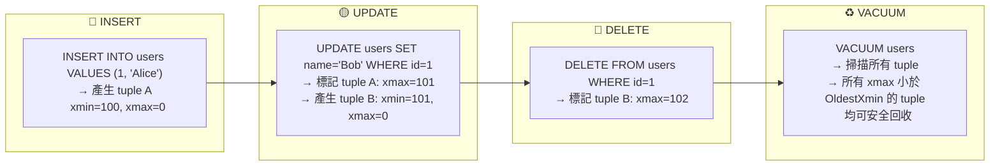

**關鍵理解**：
- **INSERT**：很簡單，建立一個新 tuple，xmin = 當前交易 ID，xmax = 0。
- **UPDATE**：PostgreSQL 的 UPDATE 不是直接修改原 tuple。而是兩步：(1) 將舊 tuple 的 xmax 設為當前交易 ID（標記為「這個版本到此為止」），(2) 建立一個全新的 tuple，xmin = 當前交易 ID。所以 UPDATE 實際上等於 **DELETE + INSERT**。
- **DELETE**：將 tuple 的 xmax 設為當前交易 ID（標記為「已刪除」），不立即從磁盤移除。

### 什麼是死元組（Dead Tuple）？

當一個 tuple 的 xmax 不為 0，且**沒有任何活躍交易還需要看到這個版本**時，這個 tuple 就稱為 **Dead Tuple（死元組）**。

Dead tuple 仍然佔用磁盤空間——它們只是被「標記為過時」，但實體資料還在硬碟上。

### 什麼是 OldestXmin？為什麼它這麼重要？

PostgreSQL 需要一個方法來判斷「某個 tuple 是否還有任何交易可能需要它」。這個方法就是 **OldestXmin**——系統中**所有活躍交易中，最老的那個 snapshot 水位**。

想像一個場景：
1. 交易 A（XID=100）在中午 12:00 開始，執行 `SELECT * FROM users`，它需要看到 12:00 之前已提交的所有資料。
2. 交易 B（XID=105）在 12:05 更新了 `users` 表，產生了 dead tuple（xmax=105）。
3. 此時 OldestXmin = 100（因為交易 A 還在執行，它「看到的世界」停留在 XID=100）。
4. VACUUM 檢查 dead tuple（xmax=105）：105 >= OldestXmin(100) → **不能回收！** 因為交易 A（snapshot=100）可能還需要看到這個被更新的舊版本。

這就是**長交易阻塞 VACUUM 的根源**——只要有一個老交易不結束，所有比它新的 dead tuple 都無法被回收。

```mermaid
sequenceDiagram
    participant TXA as 長交易 A<br/>XID=100
    participant Users as users 表
    participant TXB as 交易 B<br/>XID=105
    participant VAC as VACUUM Worker
    Note over TXA: BEGIN; SELECT * FROM users;<br/>持有 snapshot<br/>backend_xmin = 100
    TXB->>Users: UPDATE users SET name='Bob'<br/>產生 dead tuple (xmax=105)
    VAC->>Users: 計算 OldestXmin = 100
    VAC->>Users: 檢查 dead tuple: xmax=105 >= 100<br/>→ 不能回收！(還有人可能需要看到舊版)
    Note over VAC: log: "0 removed, N are dead<br/>but not yet removable"
    TXA->>TXA: COMMIT（釋放 snapshot）
    VAC->>Users: 重新計算 OldestXmin = 106
    VAC->>Users: dead tuple xmax=105 < 106<br/>→ 安全！開始回收
    Note over VAC: log: "recovered N dead tuples"
```

### VACUUM 做什麼？

VACUUM 是 PostgreSQL 內建的垃圾回收機制。它有三個核心任務：

1. **回收 Dead Tuple 空間**：掃描資料頁（page），找出所有已確認不再被任何交易需要的 dead tuple，將其空間標記為「可重用」（寫入 Free Space Map, FSM）。
2. **凍結舊交易 ID（Freeze）**：防止交易 ID 迴繞（XID Wraparound）。交易 ID 是 32-bit 整數，有限制，需要定期將老舊的 xmin 標記為「凍結」，表示這個 tuple 在所有交易看來都是可見的。
3. **更新統計資訊**：更新 Visibility Map（VM，可見性對應圖），幫助後續的 VACUUM 和 Index-Only Scan 更有效率。

**重要區分**：
- **VACUUM（一般）**：只標記空間可重用，不歸還磁盤空間給作業系統。適合日常維護。
- **VACUUM FULL**：完全重寫整張表，歸還所有空間。但全程鎖表，對線上系統不可用。

### 什麼是 Bloat（膨脹）？

**Bloat = 磁盤空間被 dead tuple 佔據而未回收，導致表／索引的實際大小遠大於所需大小。**

就像一個垃圾桶一直沒人倒——垃圾（dead tuple）不斷累積，可用空間越來越少，查詢時需要掃描更多 page，I/O 增加，效能下降。

理解了這些基礎概念後，我們來看 Bloat 的具體成因。

---

## 1. Bloat 成因總覽

PostgreSQL MVCC 機制下，UPDATE / DELETE 產生 dead tuple，須由 VACUUM 回收空間。回收不及時即產生 bloat。

### I. 未開啟 autovacuum

無 autovacuum 且無自訂 VACUUM 排程 → 必然膨脹。

### II. autovacuum 開啟但回收不及時

#### a. IO 差

大表執行 whole-table vacuum（prevent XID wraparound 或 table age > `vacuum_freeze_table_age` 時觸發全表掃描）產生大量 IO，拖慢回收速度。

#### b. autovacuum 觸發閾值太晚

觸發公式（PG 原始碼）：

```
threshold = vac_base_thresh + vac_scale_factor * reltuples
```

白話解釋：dead tuple 數量需要達到「基礎閾值 + 總行數 × 比例」才會觸發 autovacuum。

預設值：`autovacuum_vac_thresh = 50`，`autovacuum_vac_scale = 0.2`。
→ dead tuple 達 table 的 ~20% 才觸發，回收完表已膨脹超過 20%。

> 補充（Senior Dev）：PG 13+ 針對 INSERT-only 表新增了獨立閾值：

```
insert_threshold = autovacuum_vac_insert_thresh
                  + autovacuum_vac_insert_scale_factor * reltuples
```

預設 `autovacuum_vac_insert_thresh = 1000`，`autovacuum_vac_insert_scale_factor = 0.2`，解決了過去 INSERT 多但 UPDATE/DELETE 少導致從不觸發 autovacuum 的問題——此類表雖無 dead tuple，但仍需 vacuum 來標記 frozen tuples 防止 XID wraparound。

#### c. Worker 全忙

`autovacuum_max_workers` 決定最大 concurrent worker 數。當待 vacuum 的表超過 worker 數，部分表需等待空閒 worker。早前版本一個 database 同一時間只跑一個 worker，現已無此限制（同一 database 可多 worker 並行 vacuum）。

程式碼說明（`src/backend/postmaster/autovacuum.c`）：同一資料庫內可有多個 worker 同時執行。Worker 會將正在 vacuum 的表記錄在共享記憶體（shared memory）中，避免其他 worker 因等待同一張表的 vacuum lock 而阻塞。

每個 worker 記憶體消耗由 `autovacuum_work_mem`（預設 -1 = 沿用 `maintenance_work_mem`）控制，worker 越多記憶體需求越大。

> 補充（Senior Dev）：PG 16+ 新增 `vacuum_buffer_usage_limit`（預設 256 KB），限制每個 VACUUM/ANALYZE 可使用的 shared buffer 量，避免單一 vacuum 操作擠出 hot data。PG 18 進一步將此提升為 VACUUM 命令的 `BUFFER_USAGE_LIMIT` 選項。

#### d. Long Transaction / Long SQL（最核心原因）

`backend_xid` 表示已申請 transaction ID 的事務（增刪改 DDL）。從申請 XID 開始持續到事務結束。白話：這個交易「做了寫入操作」，拿到了一個編號。

`backend_xmin` 表示 SQL 執行時的 snapshot 水位（可見的最大已提交 XID）。從 SQL 開始持續到 SQL 結束／游標關閉。白話：這個交易／查詢「看到的世界」停留在某個時間點。

**關鍵機制**：VACUUM 只能回收 XID < OldestXmin 的事務產生的 dead tuple。只要存在任何持有 `backend_xid` 或 `backend_xmin` 且 XID < 新 dead tuple 的 session，這些 dead tuple 就無法被回收。

簡單說就是：**只要有人還在用望遠鏡看過去（舊 snapshot），過去的「垃圾」就得留著，不能清掉。**

原始碼（`src/backend/utils/time/tqual.c`）中，當 VACUUM 執行時，PostgreSQL 內部會呼叫一個判斷函數來決定每個 tuple 的回收狀態。這個函數以 OldestXmin 作為截止點（cutoff）：所有 xmax < OldestXmin 的 dead tuple 可以安全回收；xmax >= OldestXmin 的 dead tuple 視為「最近死亡」（recently dead），可能仍有活躍交易需要看到舊版本，因此不能移除。這個判斷邏輯是整個 VACUUM 回收機制的核心。

以下四種場景都會導致 `backend_xid` / `backend_xmin` 持續佔用：

| 場景 | 持續到何時 |
|------|-----------|
| 持有 XID 的長事務（增刪改 DDL） | 事務 COMMIT / ROLLBACK |
| 未關閉的游標（DECLARE CURSOR 後未 CLOSE） | 游標 CLOSE 或事務結束 |
| 長時間執行的查詢（`SELECT pg_sleep(1000)`） | SQL 執行結束 |
| REPEATABLE READ / SERIALIZABLE 隔離級別事務 | 事務 COMMIT / ROLLBACK |

監控 SQL：

```sql
SELECT datname, usename, query,
       xact_start, now() - xact_start AS xact_duration,
       state, backend_xid, backend_xmin
FROM pg_stat_activity
WHERE state <> 'idle'
  AND (backend_xid IS NOT NULL OR backend_xmin IS NOT NULL)
ORDER BY 4;
```

> 補充（Senior Dev）：PG 9.6 引入 `old_snapshot_threshold` 解決此問題（原文開頭提到的 "snapshot too old"），允許設定 snapshot 的生命週期上限，超過後會報錯 `snapshot too old` 而非無限阻塞 vacuum。但此參數有其 trade-off：可能導致 long-running query 被 kill，且不適用於 standby。PG 14+ 引入 `vacuum_failsafe_age`（預設 1.6 billion XID），作為 safety net：當 table age 逼近 wraparound 時，VACUUM 會跳過 index cleanup 等操作，優先完成 vacuum 以防止 shutdown，即使有 long transaction。

#### e. autovacuum_vacuum_cost_delay 啟用

基於成本的垃圾回收，當達到 `autovacuum_vacuum_cost_limit` 後 sleep `autovacuum_vacuum_cost_delay` 再繼續。對 IO 充裕的系統反而拖慢回收。

成本計算由三個參數決定：

| 參數 | 值 | 含義 |
|------|-----|------|
| `vacuum_cost_page_hit` | 1 | 從 shared buffer 中找到 page 的成本 |
| `vacuum_cost_page_miss` | 10 | 從磁盤讀取 page 的成本 |
| `vacuum_cost_page_dirty` | 20 | 將 clean page 標記為 dirty 的額外成本 |

cost limit 在 active worker 之間按比例分配。

> 補充（Senior Dev）：PG 13+ 支援 per-table 的 `autovacuum_vacuum_cost_delay` 和 `autovacuum_vacuum_cost_limit` storage parameter，可對不同優先級的表設定不同 cost 策略。PG 14+ 新增 `maintenance_io_concurrency` 參數，控制 VACUUM 和 ANALYZE 的 prefetch 並發數。

#### f. autovacuum launcher naptime 太長

Launcher process 的喚醒間隔由 `autovacuum_naptime` 決定。程式碼硬限制底限為 100 毫秒。

若設太大，launcher 睡過頭 → 有垃圾也沒人通知 fork worker。

#### g. 批量刪除／更新

例如 10GB 表一次 DELETE 9GB → 9GB dead tuple 必須等事務結束後才能回收，期間持續膨脹。

#### h. 非 HOT 更新導致 Index Bloat

非 HOT 更新產生新的 index entry，舊 index entry 需等到整個 index page 無任何引用才能回收。BTREE index 尤其容易膨脹。

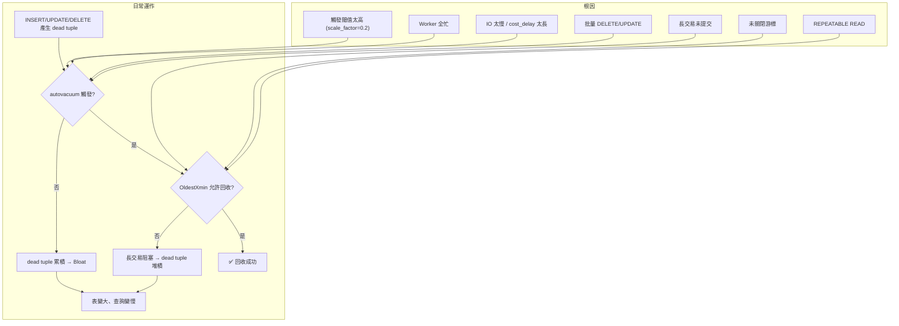

---

## 2. 測試驗證

以下用實際測試驗證上述每種 Bloat 根因。測試環境參數刻意設為極敏感（非常低的觸發閾值、關閉 cost delay），目的是隔離變因，讓每個根因的效果清晰可見。

**新手理解關鍵**：每個測試會觀察兩個數值：
- `removed`：VACUUM 成功回收了多少 dead tuple
- `dead but not yet removable`：dead tuple 存在但因長交易等原因「暫時不能回收」

當 `dead but not yet removable` 不斷增長而 `removed = 0`，就表示有東西卡住了 VACUUM。

測試環境參數：

```
autovacuum = on
log_autovacuum_min_duration = 0
autovacuum_max_workers = 10
autovacuum_naptime = 1
autovacuum_vacuum_threshold = 5
autovacuum_analyze_threshold = 5
autovacuum_vacuum_scale_factor = 0.002
autovacuum_analyze_scale_factor = 0.001
autovacuum_vacuum_cost_delay = 0
```

初始數據（200 萬 row，table 146 MB，index 43 MB）：

```sql
CREATE TABLE tbl (id INT PRIMARY KEY, info TEXT, crt_time TIMESTAMP);
INSERT INTO tbl SELECT generate_series(1,2000000), md5(random()::text), clock_timestamp();
```

測試腳本（一次更新最多 25 萬 row）：

```sql
\setrandom id 1 2000000
UPDATE tbl SET info = md5(random()::text) WHERE id BETWEEN :id-250000 AND :id+250000;
```

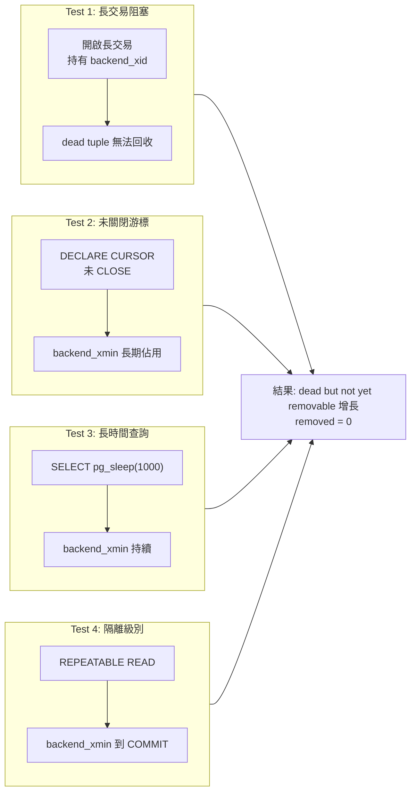

### I. Test 1：持有 XID 的長事務阻塞 Vacuum

正常壓測時 log 顯示 dead tuple 可正常回收：

```
tuples: 500001 removed, 1710872 remain, 0 are dead but not yet removable
tuples: 499647 removed, 1844149 remain, 0 are dead but not yet removable
```

開啟一個持有 transaction ID 的長事務：

```sql
-- Session A
BEGIN;
SELECT txid_current();    -- 例如 314030959
SELECT pg_backend_pid();  -- 例如 6073

-- Session B 查詢
SELECT backend_xid, backend_xmin FROM pg_stat_activity WHERE pid = 6073;
--  backend_xid  | backend_xmin
-- --------------+--------------
--   314030959   |  314030959

-- txid_current_snapshot 顯示該事務未結束
SELECT * FROM txid_current_snapshot();
-- 314030959:314030981:314030959
```

Log 立即顯示 dead tuple 無法回收，數字不斷增長：

```
tuples: 0 removed, 2391797 remain, 500001 are dead but not yet removable
tuples: 0 removed, 2459288 remain, 500001 are dead but not yet removable
tuples: 0 removed, 2713489 remain, 760235 are dead but not yet removable
tuples: 0 removed, 3023757 remain, 760235 are dead but not yet removable
tuples: 0 removed, 3135900 remain, 1137469 are dead but not yet removable
```

表與索引明顯膨脹（146 MB → 781 MB，index 43 MB → 308 MB）：

```sql
\dt+ tbl   -- 781 MB（原來 146 MB）
\di+ tbl_pkey  -- 308 MB（原來 43 MB）
```

結束該事務後，此前無法回收的垃圾全部釋放：

```sql
-- Session A
END;

-- Log 顯示回收恢復
tuples: 13629196 removed, 2515757 remain, 500001 are dead but not yet removable
tuples: 7183691 removed, 11252550 remain, 0 are dead but not yet removable
```

### II. Test 2：未關閉的游標阻塞 Vacuum

`backend_xmin` 在游標關閉前持續有效。游標本身不持有 XID，但只要游標存在，它所屬的 snapshot 就一直有效。

```sql
-- Session A
BEGIN;
DECLARE c1 CURSOR FOR SELECT 1 FROM pg_class;

-- Session B 查詢
SELECT backend_xid, backend_xmin FROM pg_stat_activity WHERE pid = 3823;
--  backend_xid | backend_xmin
-- -------------+--------------
--              |      5517228

-- Session A 取完數據但未關游標
FETCH ALL FROM c1;
-- 此時 backend_xmin 仍為 5517228
```

XID > 5517228 的事務產生的垃圾無法回收：

```sql
INSERT INTO t VALUES (1);
DELETE FROM t;
VACUUM VERBOSE t;
-- INFO:  "t": found 0 removable, 1 nonremovable row versions in 1 out of 1 pages
-- DETAIL:  1 dead row versions cannot be removed yet.
```

關閉游標後 `backend_xmin` 釋放，垃圾可回收：

```sql
CLOSE c1;
-- backend_xid | backend_xmin
-- -------------+--------------
--              |

VACUUM VERBOSE t;
-- INFO:  "t": removed 1 row versions in 1 pages
-- INFO:  "t": found 1 removable, 0 nonremovable row versions
```

### III. Test 3：長時間查詢阻塞 Vacuum

`backend_xmin` 持續到 SQL 執行結束。一個長時間執行的 SELECT（即使不做任何修改）足以阻塞 VACUUM。

```sql
BEGIN;
SELECT pg_sleep(1000);
-- backend_xmin 持續為某值直到 cancel 或執行完
-- Ctrl+C cancel 後 backend_xmin 釋放
```

### IV. Test 4：Repeatable Read / Serializable 隔離級別

`backend_xmin` 持續到整個事務 COMMIT。這是因為 REPEATABLE READ 和 SERIALIZABLE 隔離級別必須保證整個事務期間看到的資料一致（同一個 snapshot）。

```sql
BEGIN ISOLATION LEVEL REPEATABLE READ;
SELECT 1;
-- backend_xmin 持續存在直到 COMMIT
COMMIT;
-- backend_xmin 釋放
```

### V. Test 5：持續並發批量更新導致 Bloat

100 萬 row 的表，10 個 process 各自持續更新 10 萬 row：

```sql
-- t1.sql: UPDATE tbl SET info=info,crt_time=clock_timestamp() WHERE id >= 1 AND id < 100000;
-- t2.sql: WHERE id >= 100001 AND id < 200000;
-- ... t10.sql: WHERE id >= 900001 AND id <= 1000000;

pgbench -M prepared -n -r -f ./t1.sql -c 1 -j 1 -T 500000 &
# ... 10 個同時跑
```

結果：出現大量 `dead but not yet removable`，表從 73 MB 膨脹到 **554 MB**，index 從 21 MB 膨脹到 **114 MB**：

```
tuples: 0 removed, 2049809 remain, 999991 are dead but not yet removable
tuples: 0 removed, 2864735 remain, 1141307 are dead but not yet removable
```

三個並發問題疊加：(1) 垃圾產生速度 > 回收速度 (2) FSM 剩餘空間不足 → extend block (3) vacuum 過程中其他 process 持有排他鎖 → not yet removable。

**解法**：將單個事務的更新粒度大幅降低（改為單 row 隨機更新 + 極短事務）：

```sql
CREATE SEQUENCE seq CACHE 10;
UPDATE tbl SET info = info, crt_time = clock_timestamp()
WHERE id = mod(nextval('seq'), 2000001);

pgbench -M prepared -n -r -f ./test.sql -c 20 -j 10 -T 500000
```

結果：not yet removable 極少（< 1000），半小時後表體積穩定：

```sql
-- tbl: 75 MB（起始 73 MB，未膨脹）
-- tbl_pkey: 21 MB（起始 21 MB，未膨脹）
```

### VI. Test 6：autovacuum_naptime 過長

將 `autovacuum_naptime = 1000` 秒後壓測：

```sql
SELECT * FROM pg_stat_all_tables WHERE relname = 'tbl';
-- n_dead_tup: 7,895,450（接近 800 萬 dead tuple）
-- n_live_tup: 2,328,301
```

表膨脹：73 MB → 393 MB，index 21 MB → 115 MB。

---

## 3. 預防與優化措施

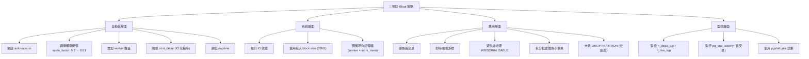

### I. 務必開啟 autovacuum

```
autovacuum = on
```

### II. 提高系統 IO

IO 越好，回收越快。

### III. 調低觸發閾值

讓 dead tuple 少量時就觸發，而非等到 20%。對 1000 萬 row 的表希望 1 萬 dead tuple 就觸發：

```
autovacuum_vacuum_scale_factor = 0.001      # 預設 0.2
autovacuum_analyze_scale_factor = 0.0005    # 預設 0.1
```

白話解釋：將「需等待 dead tuple 佔比」從 20% 降低到 0.1%。以前 1000 萬行的表要累積 200 萬 dead tuple 才觸發 VACUUM，現在 1 萬行就觸發。

> 補充（Senior Dev）：PG 12+ 新增 `autovacuum_vacuum_insert_threshold` 和 `autovacuum_vacuum_insert_scale_factor`，確保 INSERT-only 表（無 dead tuple）也會被 vacuum 來推進 freeze horizon。PG 13+ 所有 autovacuum 參數支援 per-table storage parameter。

### IV. 增加 Worker 數量與記憶體

```
autovacuum_max_workers = <CPU 核數>       # default 3
autovacuum_work_mem = 2GB                  # default -1 = maintenance_work_mem
```

確保系統剩餘記憶體 > `autovacuum_max_workers × autovacuum_work_mem`。

### V. 應用層避免以下場景

| 避免 | 原因 |
|------|------|
| Long SQL（查增刪改 DDL 全部） | `backend_xmin` 長期佔用 |
| 打開游標不關閉 | `backend_xmin` 持續到游標關閉 |
| 非必要的 REPEATABLE READ / SERIALIZABLE | `backend_xmin` 持續到事務結束 |
| 大表 pg_dump（隱式 repeatable read） | 全庫備份期間的 snapshot 阻止 vacuum |
| 長時間不關閉的持有 XID 事務 | `backend_xid` 阻止 vacuum |
| 大批量 DELETE / UPDATE 在單一事務 | 大量 dead tuple 等事務結束才能回收 |

> 注意事項：standby 開啟 `hot_standby_feedback = on` 且有 long query 時，同樣會阻止 primary 的 vacuum。因為 standby 會回報自己的 OldestXmin 給 primary（透過 hot standby feedback），告訴 primary「我這邊還有人在看這個 snapshot，不要回收」。參考：[PostgreSQL物理"备库"的哪些操作或配置，可能影响"主库"的性能、垃圾回收、IO波动](https://github.com/digoal/blog/blob/master/201704/20170410_03.md)

### VI. IO 好的系統關閉 cost delay

```
autovacuum_vacuum_cost_delay = 0
```

### VII. 調低 autovacuum_naptime

```
autovacuum_naptime = 1s
```

若仍太長可在編譯 PG 原始碼時將 autovacuum launcher 的最短睡眠時間底限改為 1ms。

但需注意：若有 long transaction 導致垃圾無法回收，過短的 naptime 會讓 worker 不斷喚醒掃描→無法回收→再喚醒，浪費 IO/CPU。

### VIII. 拆分批處理為小事務

將大範圍 UPDATE / DELETE 拆分為多個小事務，減少單次事務對 FSM 空間的壓力與鎖持有時間。

### IX. 使用較大 Block Size

現代硬體建議 32KB。`fillfactor` 不需調低（預設 100），因為表總有垃圾，每個 block 被更新後都不可能是滿的。

### X. 已膨脹的回收方案

| 方案 | 排他鎖 | 說明 |
|------|--------|------|
| `VACUUM FULL` / `CLUSTER` | 需要 AccessExclusiveLock | table rewrite，全程鎖表 |
| `pg_repack` / `pg_reorg` | 僅最終 swap filenode 時短暫鎖 | 推薦，鎖定時間最短 |

---

## 4. 原始碼參考

以下列出與 VACUUM 相關的核心原始碼檔案及其功能說明（以白話描述取代原始程式碼）：

1. **`src/backend/postmaster/autovacuum.c`** — autovacuum 守護進程（daemon）的排程邏輯。負責定期喚醒、檢查哪些表需要 vacuum、分派任務給可用的 worker。包含 free worker list 的管理。

2. **`src/backend/utils/time/tqual.c`** — 包含 VACUUM 用到的核心判斷邏輯。這個函數以 OldestXmin 為基準：若某 tuple 的 xmax < OldestXmin，則可安全回收；若 xmax >= OldestXmin，則標記為「可能仍有交易需要此版本」，暫時無法回收。這就是為什麼長交易會阻塞 VACUUM 的根本原因——OldestXmin 被長交易壓住不動。

3. **`src/backend/storage/ipc/sinvaladt.c`** — 提供從共享記憶體（shared memory）中查詢某個 backend process 的當前交易 ID（`backend_xid`）和 snapshot XID（`backend_xmin`）的功能。監控查詢（`pg_stat_activity`）就是透過這個機制取得 `backend_xid` 和 `backend_xmin`，用來排查是哪個 session 阻塞了 VACUUM。

---

## 5. 版本變遷速查

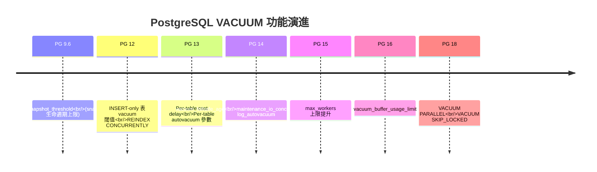

| 功能 | 引入版本 | 說明 |
|------|---------|------|
| `old_snapshot_threshold` | PG 9.6 | snapshot too old，限制 snapshot 生命週期上限 |
| `autovacuum_vacuum_insert_threshold` | PG 12 | INSERT-only 表 vacuum 觸發閾值 |
| `autovacuum_vacuum_insert_scale_factor` | PG 12 | INSERT-only 表 vacuum 觸發比例 |
| `REINDEX CONCURRENTLY` | PG 12 | 線上重建索引，不需鎖表 |
| Per-table `autovacuum_vacuum_cost_delay` | PG 13 | 不同表可設定不同 cost 策略 |
| Per-table autovacuum 參數 | PG 13 | 所有 autovacuum 參數可依表獨立設定 |
| `vacuum_failsafe_age` | PG 14 | 防止 XID wraparound 的 safety net |
| `maintenance_io_concurrency` | PG 14 | VACUUM / ANALYZE 的 prefetch 並發數 |
| `log_autovacuum_min_duration` 支援 per-table | PG 14 | 更精細的 log 控制 |
| `autovacuum_max_workers` 上限提升 | PG 15 | 支援更多 concurrent vacuum worker |
| `vacuum_buffer_usage_limit` | PG 16 | 限制單個 vacuum 的 shared buffer 用量 |
| `VACUUM PARALLEL` | PG 18 | 並行 vacuum 加速索引 cleanup |
| `VACUUM SKIP_LOCKED` | PG 18 | 跳過無法鎖定的 relation |

## 參考

- [PostgreSQL物理"备库"的哪些操作或配置，可能影响"主库"的性能、垃圾回收、IO波动](https://github.com/digoal/blog/blob/master/201704/20170410_03.md)

---

# 二、PostgreSQL 收縮膨脹表/索引 — VACUUM FULL vs pg_repack vs pg_squeeze

> 來源：[digoal - PostgreSQL 收縮膨脹表或索引 — pg_squeeze or pg_repack (2016-10-30)](https://github.com/digoal/blog/blob/master/201610/20161030_02.md)
>
> 相關：
> - [pg_repack](https://github.com/reorg/pg_repack)
> - [pg_squeeze (Cybertec)](http://www.cybertec.at/en/products/pg_squeeze-postgresql-extension-to-auto-rebuild-bloated-tables/)

---

## 1. 表膨脹（Bloat）的成因與後果

### Bloat 是怎麼發生的？（新手複習）

回顧第一章的 MVCC 機制：PostgreSQL 的 UPDATE 和 DELETE 不直接覆蓋或刪除舊資料，而是產生 dead tuple，由 VACUUM 負責回收。

Bloat 的根本原因不是 VACUUM 不存在，而是 **dead tuple 的產生速度超過了 VACUUM 的回收速度**，或是 **VACUUM 被阻塞無法回收**。

### 為什麼 VACUUM 回收不了？

- **長時間未提交的交易**：持有舊 snapshot（`backend_xmin`）→ OldestXmin 被壓住 → 所有比此 snapshot 新的 dead tuple 無法回收
- **閒置的 replication slot**：邏輯複製或物理複製的 slot 如果沒有被消費，WAL 會堆積，同時 VACUUM 也無法推進，因為 slot 需要保留舊版本的 WAL 變更供 standby 或 logical subscriber 使用
- **autovacuum 未及時觸發**：觸發閾值 `autovacuum_vacuum_scale_factor` 預設 20%（0.2）。一張 1 億行的表需要 2000 萬 dead tuple 才觸發 VACUUM。到那時表已經嚴重膨脹，回收也需要很久。超大表上尤其嚴重。
- **HOT update 無法生效**：如果更新的欄位包含索引欄位（indexed column），PostgreSQL 無法使用 HOT（Heap-Only Tuple）優化，必須在每個索引中都插入新的 index entry → 舊 index entry 變成 dead → 索引也膨脹

### Bloat 的後果：不只是浪費空間

| 後果 | 說明 |
|------|------|
| 磁盤空間浪費 | 表佔用空間比實際資料大數倍 |
| 查詢變慢 | Page density（資料密度）下降，相同的 SELECT 需要讀取更多 page → I/O 增加 |
| Cache 效率降低 | 有用的 live tuple 被沒用的 dead tuple 擠出 shared buffer → cache hit ratio 下降 |
| 備份/還原變慢 | pg_dump 和 PITR 需要處理更多 page |
| Index-Only Scan 失效 | Visibility Map 更新不及時，引擎必須額外檢查 heap page |

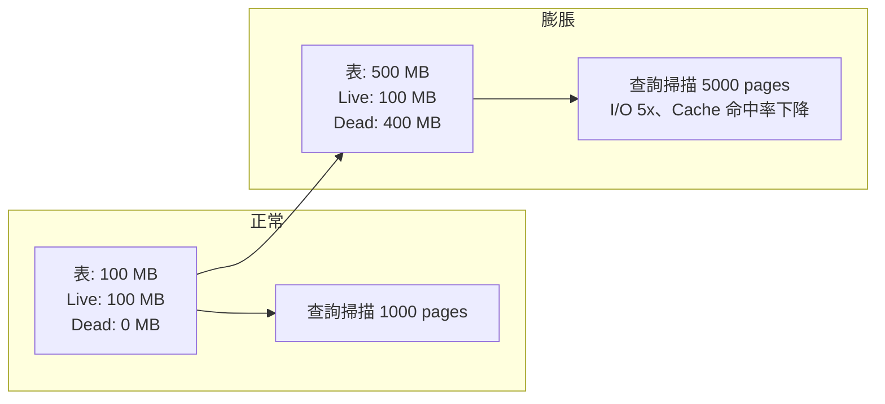

---

## 2. 三種重建方案對比

當 Bloat 已經發生、一般的 VACUUM 無法收縮（因為一般 VACUUM 只標記空間可重用，不歸還磁盤空間給 OS），我們需要重建（rewrite）整張表。以下是三種方案的詳細對比。

### I. VACUUM FULL / CLUSTER

```sql
VACUUM FULL table_name;
CLUSTER table_name USING index_name;
```

**新手理解**：VACUUM FULL 會建立一個全新的表檔案（新的 FILENODE），把舊表中所有 live tuple 一行一行複製過去，然後刪除舊檔案。因為是全新的檔案，所有 dead tuple 自然都被拋棄，空間完全歸還 OS。

- **鎖**：ACCESS EXCLUSIVE（排他鎖），整個重建期間阻塞所有讀/寫
- **機制**：完整重寫表（new FILENODE），複製 live row → 刪除舊檔案
- **優點**：內建、不需 extension、回收最徹底（包括 index bloat）
- **缺點**：鎖表時間長（取決於表大小），對線上系統不可接受

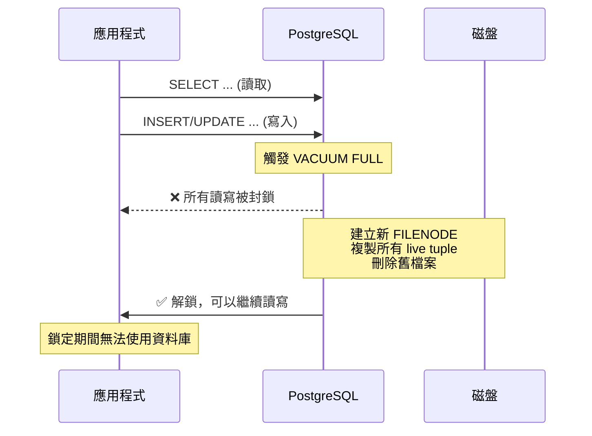

### II. pg_repack（源自 pg_reorg）

```bash
pg_repack -t table_name -d database
```

**新手理解**：pg_repack 的核心思路是「不鎖表，用 trigger 追蹤變更」。它在背景建立一張新的目標表，同時在原始表上裝一個「監視器」（trigger）記錄所有後續的增刪改。等複製完舊資料後，再把監視器記錄的變化補上去，最後瞬間切換。

- **鎖**：只在最終 FILENODE 切換時短暫持有 ACCESS EXCLUSIVE（毫秒級）
- **機制**：
  1. 建立一張新的 target table（複製原始結構）
  2. **建立 AFTER INSERT / UPDATE / DELETE trigger** 在原始表上，記錄增量 delta
  3. 批次複製原始數據到 target table
  4. 在 target table 上應用增量 delta（replay trigger 記錄的變更）
  5. 切換 FILENODE（鎖定極短）
- **優點**：生產驗證最成熟、支援 index 重建/重排
- **缺點**：**trigger 帶來的 DML 效能開銷**（每個 INSERT/UPDATE/DELETE 都要寫入 delta log table）

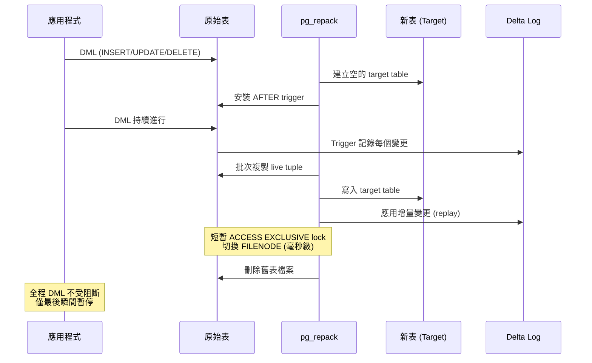

### III. pg_squeeze

**新手理解**：pg_squeeze 用了一個更聰明的方法來追蹤變更——直接讀取 WAL（Write-Ahead Log，預寫日誌）。所有對資料庫的變更都會寫入 WAL，pg_squeeze 透過邏輯解碼（Logical Decoding）從 WAL 中提取重建期間的變化。這樣就不需要在原始表上裝 trigger，對 DML 效能幾乎零影響。

- **鎖**：與 pg_repack 相同，僅 FILENODE 切換時短暫鎖定
- **機制**：
  1. 建立 target table
  2. 建立 **logical replication slot**，通過 logical decoding 從 WAL（XLOG）中讀取重建期間的增量變更
  3. 批次複製原始數據到 target table
  4. 應用 WAL 中解碼的增量（不需 trigger）
  5. 切換 FILENODE
- **必要條件**：表必須有 **PRIMARY KEY 或 UNIQUE KEY**（logical decoding 需要 replica identity 來識別哪一行被修改）
- **優點**：不需 trigger → 重建期間對原表 DML **幾乎無效能影響**；支援**自動觸發**（設定 bloat 閾值，background worker 定時檢查並自動重建）
- **缺點**：消耗 replication slot（需預留足夠 `max_replication_slots`）；WAL 產生量增加（logical decoding 需要 WAL level ≥ `replica`）

> 補充（Senior Dev）：
>
> **pg_squeeze 的 replication slot 風險**：logical decoding 依賴 replication slot 保持 WAL 不被回收。如果 pg_squeeze background worker 故障或重建時間過長，slot 可能堆積大量 WAL → disk 爆滿。務必監控 `pg_replication_slots` 的 `restart_lsn` 與當前 WAL LSN 的差距，設置 alert。
>
> pg_squeeze 原為 Cybertec 開發，但社群活躍度不如 pg_repack（2016 年後更新少）。**生產建議**：
> - 通用場景 → **pg_repack**（最成熟、最廣泛使用）
> - 需要自動化 + trigger overhead 不可接受 → pg_squeeze（但需監控 slot）
> - 僅 index bloat → **REINDEX CONCURRENTLY**（PG 12+），完全不需要重建表

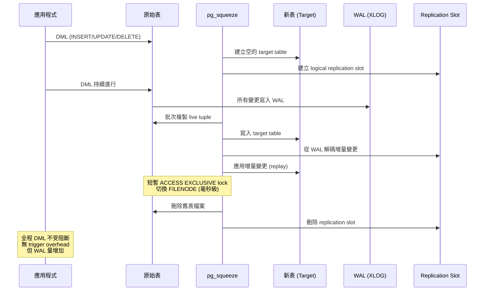

---

## 3. 三方案全面對比

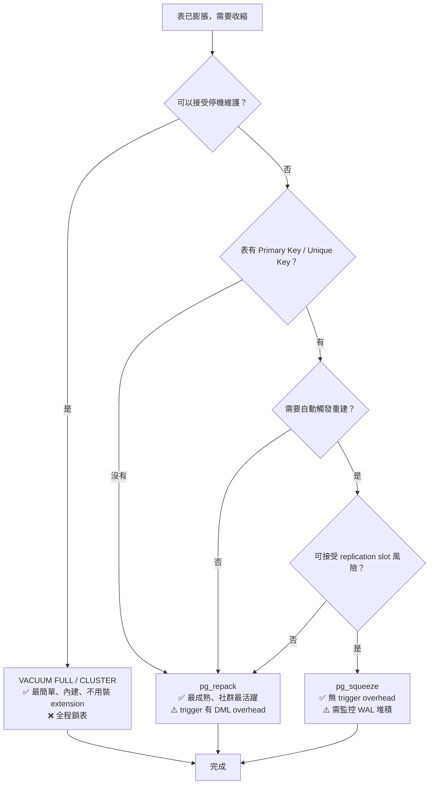

| 維度 | VACUUM FULL | pg_repack | pg_squeeze |
|------|------------|-----------|------------|
| Concurrent DML 支援 | ✗（全程排他鎖） | ✓ | ✓ |
| Exclusive Lock 時長 | 全程（數分鐘~數小時） | 僅 FILENODE 切換（毫秒） | 僅 FILENODE 切換（毫秒） |
| Delta 捕捉機制 | N/A | Trigger | Logical Decoding (WAL) |
| 對原表 DML 效能影響 | N/A（鎖住無法 DML） | Trigger overhead（~5-20%） | 極小（僅 WAL 增加） |
| 需要 PK/UK | 不需要 | 不需要 | **必須** |
| 需要 replication slot | 不需要 | 不需要 | **必須**（max_replication_slots +1） |
| WAL 開銷 | 正常 | 正常 + trigger delta | **較大**（logical decoding 需 WAL ≥ replica） |
| 自動重建 | ✗ | ✗ | ✓（background worker + bloat 閾值） |
| 支援 index 重排 | CLUSTER 支援 | ✓ | ✓ |
| PG 版本支援 | All | PG 9.4+ | PG 9.4+ |
| 成熟度 / 社群活躍 | ★★★★★（內建） | ★★★★★（生產驗證） | ★★★（2016 後更新少） |

---

## 4. 使用 pg_squeeze 的注意事項

1. **Replication Slot 數量**：`max_replication_slots` 需預留足夠數量。每個 pg_squeeze worker 消耗 1 個 slot；若有 streaming replication standby，也需各自的 slot。建議 `max_replication_slots = standby_count + concurrent_squeeze_workers + 5`

2. **高峰期風險**：不建議對繁忙資料庫開啟自動收縮。自動觸發可能在高峰期啟動，帶來額外的 I/O / WAL / CPU 負擔。可設定 `squeeze.schedule` 限制只在離峰時段執行

3. **Bloat 閾值設定**：基於 Free Space Map（FSM）和 `pgstattuple` extension 的 dead tuple ratio 計算。可設定 `squeeze.min_size`（最小表大小）、`squeeze.bloat_threshold`（空間浪費百分比）來忽略小表或輕度膨脹的表

4. **Cybertec 官方說明**（原文節錄）：

> pg_squeeze is implemented as a background worker process that periodically monitors user-defined tables. When it detects that a table exceeded the "bloat threshold", it kicks in and rebuilds that table automatically. Rebuilding happens concurrently in the background with minimal storage and computational overhead due to use of Postgres' built-in replication slots together with logical decoding to extract possible table changes during the rebuild from XLOG.

---

## 5. 現代最佳實踐

> 補充（Senior Dev）：
>
> **2016 年到今天的方案演進**：
>
> | 工具 | 當前狀態 | 建議 |
> |------|---------|------|
> | VACUUM FULL | PG 內建 | 緊急情況、維護窗口可用時 |
> | pg_repack | 社群最活躍的 online rebuild 方案 | **生產第一選擇** |
> | pg_squeeze | 2016 beta，更新停滯 | 僅在需自動 + trigger-free 場景 |
> | REINDEX CONCURRENTLY | PG 12+ 內建 | 僅 index bloat 時用，不需重建表 |
> | pgcompacttable | 減少 dead tuple 但不重建 FILENODE | 輕度膨脹的過渡方案 |
>
> **避免膨脹的預防措施（分層策略）**：

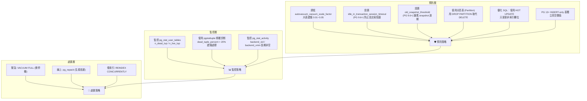

> 1. 調低 `autovacuum_vacuum_scale_factor` → 提高觸發頻率（大表建議 0.01-0.05）
> 2. 設置 `idle_in_transaction_session_timeout`（PG 9.6+）→ 防止長 transaction 阻擋 VACUUM
> 3. 設置 `old_snapshot_threshold`（PG 9.6+）→ 讓長時間 snapshot 過期
> 4. 監控 `pg_stat_user_tables.n_dead_tup` / `n_live_tup` → 計算 bloat ratio
> 5. 使用 `pgstattuple` extension 精確診斷：
> ```sql
> CREATE EXTENSION pgstattuple;
> SELECT * FROM pgstattuple('your_table');
> -- dead_tuple_percent 超過 20-30% 建議處理
> ```
> 6. **Partition**：按時間 partition 的表可以 `DROP PARTITION` 直接釋放空間，完全不需要 VACUUM / repack
> 7. PG 13+ `autovacuum_vacuum_insert_scale_factor` 獨立控制 INSERT-only 表的 VACUUM 觸發
> 8. 使用 **HOT UPDATE**（更新 non-indexed column）減少 index bloat

---

## 參考

1. [pg_repack](https://github.com/reorg/pg_repack)
2. [pg_squeeze Official (Cybertec)](http://www.cybertec.at/en/products/pg_squeeze-postgresql-extension-to-auto-rebuild-bloated-tables/)
3. [pg_squeeze Download](http://www.cybertec.at/download/pg_squeeze-1.0beta1.tar.gz)
