# PostgreSQL Vacuum 深度解析

> 本文件分為兩章，由淺入深理解 PostgreSQL Bloat：
>
> **第一章**（Vacuum 原理與防止 Bloat）：從 MVCC 機制出發，詳細分析 Bloat 的各種根因——Long Transaction、autovacuum 配置、IO、觸發閾值等，並提供完整的測試驗證與預防措施。
>
> **第二章**（收縮膨脹表方案）：當 Bloat 已經發生，對比三種重建方案——VACUUM FULL、pg_repack、pg_squeeze——從鎖定時間、效能影響、自動化能力等維度全面比較，並給出現代最佳實踐建議。

---

# 一、PostgreSQL Vacuum 原理與防止 Bloat

> 來源：[digoal - PostgreSQL 垃圾回收原理以及如何预防膨胀 (2015-04-29)](https://github.com/digoal/blog/blob/master/201504/20150429_02.md)
>
> 更新於 2026-05-24，補充 PG 12~18 新增能力

---

## 0. 核心概念速覽：從生產場景理解 MVCC、Dead Tuple 與 VACUUM

> 本章以 Developer 在生產環境中會遇到的**真實場景**為起點，反向推導核心原理。先知道「生產上會看到什麼訊號」，再學「為什麼會這樣」，最後補上「如何快速診斷」。

### 場景一：表變大、資料沒增加 —— 什麼是 Bloat？

你在 Grafana / Datadog 的磁盤監控看到某張表的磁盤用量在過去數小時內從 500 MB 暴增到 2 GB，但 `SELECT count(*)` 的回傳值完全沒變。同時 APP 端開始回報查詢變慢。

這就是 PostgreSQL 最常見的生產問題之一：**Bloat（表膨脹）**。

**Bloat = 磁盤空間被 dead tuple 佔據而未回收，導致表／索引的實際大小遠大於所需大小。** 就像垃圾桶一直沒人倒，垃圾不斷累積，查詢時需要掃描更多 page，I/O 增加。

要理解 Bloat 為什麼發生，必須先理解 PostgreSQL 最核心的設計：**MVCC（多版本並行控制）**。

### MVCC 是什麼？為什麼 Bloat 是它的代價？

大多數關聯式資料庫在處理「同時讀取與寫入同一筆資料」時，有兩種策略：

- **悲觀鎖（Pessimistic Locking）**：讀取時加鎖，寫入時等待。讀者阻塞寫者，寫者阻塞讀者。
- **MVCC（Multi-Version Concurrency Control）**：每次更新不直接覆蓋舊資料，而是**建立一個新版本**。讀者永遠讀取「自己交易開始時已提交的版本」——**讀者永不阻塞寫者，寫者永不阻塞讀者**。

PostgreSQL 採用 MVCC。同一行資料在資料庫中可能同時存在多個版本（tuple / row version）。

> **MVCC 的代價**：舊版本不會自動消失，必須靠 VACUUM 清理。清理不夠快或不夠及時 → 舊版本堆積 → Bloat。

### Tuple 的生命週期：xmin 與 xmax

PostgreSQL 中的每一行資料（tuple / row version）內部攜帶兩個隱藏系統欄位：

| 欄位 | 含義 |
|------|------|
| `xmin` | 建立這個版本的交易 ID。「我由哪個交易建立」 |
| `xmax` | 刪除/淘汰這個版本的交易 ID。0 表示尚為最新版。「我由哪個交易標記為過時」 |

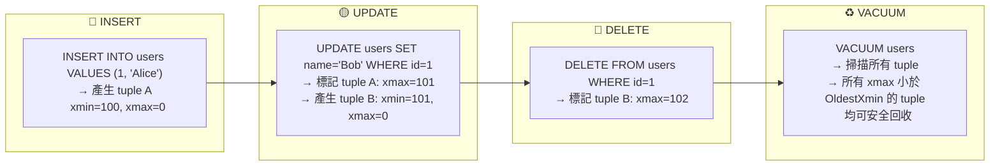

**關鍵理解**：
- **INSERT**：建立新 tuple，xmin = 當前交易 ID，xmax = 0。
- **UPDATE** = **DELETE + INSERT**：(1) 舊 tuple 的 xmax 設為當前交易 ID，(2) 建立全新 tuple（xmin = 當前交易 ID）。
- **DELETE**：將 tuple 的 xmax 設為當前交易 ID，**不立即從磁盤移除**。

### 什麼是 Dead Tuple？

當一個 tuple 的 `xmax` 不為 0，且**所有需要看到這個舊版本的交易都已結束**，就是 Dead Tuple。Dead tuple 仍佔據磁盤空間——只是被「標記過時」，實體資料還在硬碟上。

### 場景二：autovacuum log 一直顯示「dead but not yet removable」

你巡 PostgreSQL log 發現 autovacuum 輸出：

```
tuples: 0 removed, 500001 remain, 500001 are dead but not yet removable
tuples: 0 removed, 760235 remain, 760235 are dead but not yet removable
```

`removed = 0` 表示 VACUUM 在跑，但一個 dead tuple 都沒清掉。為什麼？

### OldestXmin — 決定 Dead Tuple 能不能回收的關鍵水位

PostgreSQL 計算 **OldestXmin**（系統中所有活躍交易中，最老的那個 snapshot），然後：

- **xmax < OldestXmin** → 所有交易都不再需要這個舊版本 → **可回收**
- **xmax >= OldestXmin** → 還有交易可能看得到 → **不可回收**

**生產場景模擬**：

1. 中午 12:00，開發者打開 pgAdmin，執行 `BEGIN; SELECT * FROM users;` 後去吃午飯（XID=100）。
2. 中午 12:05，排程任務開始大量 `UPDATE users`，產生大量 dead tuple（xmax=105）。
3. 此時 OldestXmin = 100（開發者 pgAdmin 的 snapshot 還卡在 XID=100）。
4. autovacuum 檢查 dead tuple：`xmax=105 >= OldestXmin(100)` → **全部不能回收**。

結果：這些 dead tuple 會持續佔據空間，直到那位開發者 COMMIT 或被 timeout kill 掉。

```mermaid
sequenceDiagram
    participant TXA as 長交易 A<br/>XID=100
    participant Users as users 表
    participant TXB as 交易 B<br/>XID=105
    participant VAC as VACUUM Worker
    Note over TXA: BEGIN; SELECT * FROM users;<br/>持有 snapshot<br/>backend_xmin = 100
    TXB->>Users: UPDATE users SET name='Bob'<br/>產生 dead tuple (xmax=105)
    VAC->>Users: 計算 OldestXmin = 100
    VAC->>Users: 檢查 dead tuple: xmax=105 >= 100<br/>→ 不能回收！(還有人可能需要看到舊版)
    Note over VAC: log: "0 removed, N are dead<br/>but not yet removable"
    TXA->>TXA: COMMIT（釋放 snapshot）
    VAC->>Users: 重新計算 OldestXmin = 106
    VAC->>Users: dead tuple xmax=105 < 106<br/>→ 安全！開始回收
    Note over VAC: log: "recovered N dead tuples"
```

**生產快速排查**：誰在阻塞 VACUUM？

```sql
-- 找出持有最舊 snapshot 的 session（這就是阻塞 VACUUM 的兇手）
SELECT pid, usename, application_name,
       state, now() - xact_start AS xact_age,
       backend_xid, backend_xmin,
       left(query, 80) AS query
FROM pg_stat_activity
WHERE backend_xmin IS NOT NULL
ORDER BY backend_xmin
LIMIT 5;
```

### 場景三：查詢變慢，EXPLAIN 的 Buffer 暴增

業務團隊投訴「同樣的 SELECT 比以前慢 5 倍」。EXPLAIN 分析發現 Buffer 讀取量暴增——不是資料變多了，是 dead tuple 把 page 塞滿了，同樣的查詢需要掃描更多 page。

**快速量化 Bloat 嚴重程度**：

```sql
-- 診斷各表的 dead tuple 佔比
SELECT schemaname, relname,
       n_live_tup,
       n_dead_tup,
       CASE WHEN n_live_tup > 0
            THEN round(100.0 * n_dead_tup / (n_live_tup + n_dead_tup), 1)
            ELSE 0
       END AS dead_ratio_pct,
       pg_size_pretty(pg_total_relation_size(relid)) AS total_size
FROM pg_stat_user_tables
WHERE n_dead_tup > 0
ORDER BY n_dead_tup DESC
LIMIT 20;
```

`dead_ratio_pct > 20%` → 建議安排 vacuum / repack。`> 50%` → 緊急。

```sql
-- 精確版：用 pgstattuple 取得詳細 dead tuple 資訊
CREATE EXTENSION IF NOT EXISTS pgstattuple;
SELECT * FROM pgstattuple('your_table_name');
```

### VACUUM 做了什麼？

VACUUM 是 PostgreSQL 內建的垃圾回收機制，三個核心任務：

1. **回收 Dead Tuple 空間**：掃描資料頁（page），找出已確認不再被任何交易需要的 dead tuple，將其空間標記為「可重用」（寫入 Free Space Map, FSM）。
2. **凍結舊交易 ID（Freeze）**：防止交易 ID 迴繞（XID Wraparound）。交易 ID 是 32-bit 整數，必須定期將老舊的 xmin 標記為「凍結」。
3. **更新 Visibility Map（VM）**：幫助後續 VACUUM 和 Index-Only Scan 跳過不需要檢查的 page。

**重要區分 —— 生產上最常被問的問題**：

| | VACUUM（一般/autovacuum） | VACUUM FULL |
|---|---|---|
| **行為** | 只標記空間可重用，**不歸還磁盤空間給 OS** | 重建整張表，歸還所有空間給 OS |
| **鎖** | 不阻塞讀寫 | 全程 AccessExclusiveLock（阻塞所有操作） |
| **用途** | 日常維護 | 緊急收縮 / 維護窗口 |

### 總結：從生產訊號到根因的 Mapping

| 你在生產環境看到 | 對應的核心概念 | 下一步行動 |
|---|---|---|
| 表磁盤暴增但 row count 沒變 | Bloat（Dead Tuple 堆積） | 查 `n_dead_tup`，確認 autovacuum 是否在跑 |
| Log 顯示「dead but not yet removable」| OldestXmin 被壓住 | 查 `backend_xmin` 找出長交易，kill 或等它結束 |
| 查詢掃描 page 數暴增、變慢 | Page density 下降（dead tuple 塞滿 page） | `pgstattuple` 精確診斷，安排 vacuum / repack |
| autovacuum 從不觸發 | 觸發閾值太高 / Worker 不足 | 檢查 `scale_factor`、`naptime`、worker 數量 |

理解了這些基礎概念後，我們來看 Bloat 在生產環境中的具體成因和對策。

---

## 1. Bloat 成因：生產環境診斷指南

> 以下按**生產環境遇到頻率從高到低**排列。每個成因附帶「生產訊號 + 快速診斷」，讓你在 on-call 時能快速定位。

### 1.1 Long Transaction／未關閉游標／隔離級別（生產中最高頻的根因）

**生產訊號**：autovacuum log 持續輸出 `0 removed, N are dead but not yet removable`，`removed` 完全為 0，但 dead tuple 不斷增長。

**快速確認**：

```sql
-- 找出誰的 snapshot 在阻塞 VACUUM（按最舊排序）
SELECT pid, usename, application_name,
       state, now() - xact_start AS xact_age,
       backend_xid, backend_xmin,
       left(query, 80) AS query
FROM pg_stat_activity
WHERE state <> 'idle'
  AND (backend_xid IS NOT NULL OR backend_xmin IS NOT NULL)
ORDER BY xact_start;
```

**根因**：VACUUM 只能回收 xmax < OldestXmin 的 dead tuple。`OldestXmin` = 所有活躍交易中最老的那個 snapshot。只要有人卡住一個舊 snapshot，所有比他新的 dead tuple 都不能回收。

- `backend_xid`：已申請交易 ID（做了寫入操作），從申請持續到 COMMIT。
- `backend_xmin`：查詢的 snapshot 水位（看到的世界停在某個時間點），從 SQL 開始持續到 SQL 結束或游標關閉。

以下四種場景都會導致 `backend_xid` / `backend_xmin` 長期佔用：

| 生產場景 | 實際例子 | 持續到何時 |
|------|----------|-----------|
| 持有 XID 的長事務 | 開發者在 pgAdmin 開一個 `BEGIN; INSERT...;` 後掛著 | 事務 COMMIT / ROLLBACK |
| 未關閉游標 | ORM 或應用忘記 `CLOSE CURSOR` | 游標 CLOSE 或事務結束 |
| 長時間查詢 | `pg_dump` 全庫備份期間（隱式 REPEATABLE READ）、報表查詢 `SELECT * FROM huge_table` 跑很久 | SQL 執行結束 |
| REPEATABLE READ / SERIALIZABLE | Java Spring `@Transactional(isolation=REPEATABLE_READ)` | 事務 COMMIT / ROLLBACK |

> **生產陷阱**：
> - `pg_dump` 使用 REPEATABLE READ，備份一張 500GB 的表可能要數小時 → 期間所有 dead tuple 無法回收。
> - Standby 開啟 `hot_standby_feedback = on` + 有 long query → standby 回報的 OldestXmin 會阻止 primary 的 VACUUM。
> - ORM（Hibernate/Entity Framework）有時會隱式開啟游標卻忘記關閉。

> **PG 版本防禦**：
> - PG 9.6+：`old_snapshot_threshold` 設定 snapshot 生命週期上限，超時報錯 `snapshot too old`（trade-off：可能 kill long query，不適用於 standby）。
> - PG 14+：`vacuum_failsafe_age`（預設 1.6B XID）— 當 table age 逼近 wraparound，VACUUM 會跳過 index cleanup 優先完成 vacuum 以防 shutdown。
> - PG 9.6+：`idle_in_transaction_session_timeout` 自動 kill 掛著不 commit 的 session。

### 1.2 批量 DELETE／UPDATE 在單一交易中（開發者常見錯誤）

**生產訊號**：執行完一個 database migration script 或 batch job 後，該表的磁盤用量瞬間變成 2-5 倍。

**快速確認**：
```sql
-- 找出 dead tuple 佔比最高的表
SELECT schemaname, relname,
       n_dead_tup, n_live_tup,
       round(100.0 * n_dead_tup / NULLIF(n_live_tup + n_dead_tup, 0), 1) AS dead_pct,
       pg_size_pretty(pg_total_relation_size(relid)) AS size
FROM pg_stat_user_tables
WHERE n_dead_tup > 10000
ORDER BY n_dead_tup DESC
LIMIT 10;
```

**根因**：`DELETE FROM big_table WHERE created_at < '2024-01-01'` 在一個交易中刪除 1 億行 → 1 億行 dead tuple 必須等該交易 COMMIT 後 VACUUM 才能回收。COMMIT 前這些空間無法被釋放也無法被 reuse → 表在交易期間持續膨脹。

**解法**：拆分成小事務，例如每次刪 1000 行 + COMMIT：
```sql
DO $$
DECLARE
  deleted_rows INT;
BEGIN
  LOOP
    DELETE FROM big_table WHERE ctid IN (
      SELECT ctid FROM big_table WHERE created_at < '2024-01-01' LIMIT 1000
    );
    GET DIAGNOSTICS deleted_rows = ROW_COUNT;
    COMMIT;
    EXIT WHEN deleted_rows = 0;
  END LOOP;
END $$;
```

> 更推薦：使用分割表（Partition），用 `DROP PARTITION` 秒殺，完全不需要 DELETE。

### 1.3 autovacuum 觸發閾值太高（配置問題，最容易修）

**生產訊號**：表明明有大量 dead tuple，但 autovacuum 很久才觸發一次，觸發時表已嚴重膨脹。

**根因**：autovacuum 觸發公式：

```
threshold = autovacuum_vacuum_threshold + autovacuum_vacuum_scale_factor × reltuples
```

**預設值在生產的實際影響**：

| 表大小 | 預設觸發門檻 (`thresh=50, scale=0.2`) | 表膨脹程度 |
|--------|--------------------------------------|-----------|
| 1 萬行 | dead tuple ≥ 2050 | ~20% |
| 100 萬行 | dead tuple ≥ 200,050 | ~20% |
| 1 億行 | dead tuple ≥ 20,000,050 | ~20% |
| 10 億行 | dead tuple ≥ 200,000,050 | **~20%，200M dead tuple，膨脹極嚴重** |

**快速診斷是否因閾值卡住**：
```sql
-- 看哪些表 dead tuple 已很多但還沒觸發
SELECT schemaname, relname,
       n_dead_tup,
       n_live_tup,
       round(n_dead_tup - (
         current_setting('autovacuum_vacuum_threshold')::int
         + current_setting('autovacuum_vacuum_scale_factor')::float * n_live_tup
       )) AS gap_to_threshold,
       last_autovacuum
FROM pg_stat_user_tables
WHERE n_dead_tup > 1000
ORDER BY n_dead_tup DESC;
```

> PG 12+：`autovacuum_vacuum_insert_threshold` / `insert_scale_factor` 獨立控制 INSERT-only 表的 vacuum 觸發。預設 `thresh=1000, scale=0.2`。INSERT-only 表雖無 dead tuple，仍需 vacuum 來推進 freeze horizon。
>
> PG 13+：所有 autovacuum 參數支援 **per-table** 設定，可對超大表單獨調低閾值。

### 1.4 Worker 全忙 / Naptime 太長

**生產訊號**：多張表同時有 dead tuple，但只有少數正在被 VACUUM，且 `pg_stat_progress_vacuum` 顯示排隊的表數量遠大於正在跑的。

**快速確認**：
```sql
-- 查看當前有哪些 VACUUM 在跑
SELECT pid, datname, relid::regclass AS table_name,
       phase, heap_blks_total, heap_blks_scanned
FROM pg_stat_progress_vacuum;

-- 確認 worker 數量與負載
SELECT count(*) AS active_vacuum_workers
FROM pg_stat_activity
WHERE query LIKE 'autovacuum:%';
```

**根因**：
- `autovacuum_max_workers`（預設 3）不足。現代環境中 DB instance 內常有數十上百張表，3 個 worker 根本不夠。
- `autovacuum_naptime`（預設 60s）太長。Launcher 每 60 秒才檢查一次，有垃圾也無法及時通知。
- 每個 worker 記憶體消耗 = `autovacuum_work_mem`（預設 -1 = `maintenance_work_mem`）。worker 越多，記憶體需求越大。

> PG 16+：`vacuum_buffer_usage_limit`（預設 256KB）限制單個 vacuum 的 shared buffer 佔用，防止擠出 hot data。PG 18 提升為 `BUFFER_USAGE_LIMIT` 選項。

### 1.5 IO 瓶頸 / Cost Delay（IO 充裕環境的反效果）

**生產訊號**：VACUUM 在跑，但速度極慢，`pg_stat_progress_vacuum.heap_blks_scanned` 增長極緩。

**快速確認**：
```sql
-- 檢查 cost delay 設定
SHOW autovacuum_vacuum_cost_delay;
SHOW autovacuum_vacuum_cost_limit;
```

**根因**：autovacuum 的 cost-based throttling 原意是保護慢 IO 系統，但對現代 NVMe SSD / SAN 反而拖慢回收。每次達到 `cost_limit` 就 sleep `cost_delay` 毫秒。

| 參數 | 預設 | 影響 |
|------|------|------|
| `vacuum_cost_page_hit` | 1 | shared buffer hit 成本 |
| `vacuum_cost_page_miss` | 10 | 磁盤讀取 page 成本 |
| `vacuum_cost_page_dirty` | 20 | dirty page 額外成本 |
| `autovacuum_vacuum_cost_limit` | 200（累計） | 達到後 sleep `cost_delay` |
| `autovacuum_vacuum_cost_delay` | 2ms（預設 PG 12 前） | 每次到達 limit 的 sleep 時長 |

**現代硬體建議**：
- NVMe SSD 環境 → `cost_delay = 0`（不做 throttling）
- 混合環境 → PG 13+ 支援 **per-table** 的 `autovacuum_vacuum_cost_delay` / `cost_limit`，對高優先級表設更寬鬆的策略
- PG 14+：`maintenance_io_concurrency` 控制 VACUUM/ANALYZE 的 prefetch 並發數

### 1.6 非 HOT 更新 → Index Bloat

**生產訊號**：表本身尚可，但索引特別大，且 `pg_stat_user_indexes.idx_scan` 不低但 `idx_tup_fetch` 很高。

**快速確認**：
```sql
-- 索引大小 vs 表大小對比
SELECT indexrelname, 
       pg_size_pretty(pg_relation_size(indexrelid)) AS index_size,
       idx_scan, idx_tup_read, idx_tup_fetch
FROM pg_stat_user_indexes
WHERE idx_tup_read > 0
ORDER BY pg_relation_size(indexrelid) DESC
LIMIT 10;
```

**根因**：如果 UPDATE 的欄位包含任一索引欄位，PostgreSQL 無法使用 HOT（Heap-Only Tuple）優化，必須在每個索引都插入新的 index entry → 舊 index entry 變成 dead → 索引也膨脹。

**開發者守則**：
- 頻繁更新的熱表，索引只建在真正用於 WHERE/JOIN 的欄位上
- 避免對頻繁更新的欄位建索引（如 `updated_at`）
- 考慮用 partial index 或 expression index 減少 entries

### 1.7 autovacuum 未開啟（少見但致命）

**生產訊號**：`SHOW autovacuum;` 回傳 `off` → 立即修復。沒有 autovacuum 的 PG instance 最終會因為 XID wraparound 而 shutdown。

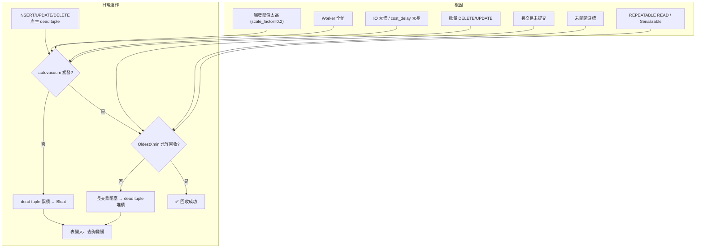

---

## 2. 測試驗證 + 生產對照

以下測試刻意將參數設為極敏感（低觸發閾值、關閉 cost delay），目的是**隔離變因**，讓每個根因的效果清晰可見。測試雖然在 lab 環境進行，但每項結論都能直接對應到生產場景。

**閱讀方式**：每個測試後面的「👉 生產對照」會幫你將 lab 結果對應到生產環境中看到的現象。

**關鍵觀察指標**：
- `removed`：VACUUM 成功回收了多少 dead tuple
- `dead but not yet removable`：dead tuple 存在但因外部因素「暫時不能回收」

當 `dead but not yet removable` 不斷增長而 `removed = 0`，就表示有東西卡住了 VACUUM。在生產環境中對應的就是「表變大但查不到原因」的情況。

測試環境參數：

```
autovacuum = on
log_autovacuum_min_duration = 0
autovacuum_max_workers = 10
autovacuum_naptime = 1
autovacuum_vacuum_threshold = 5
autovacuum_analyze_threshold = 5
autovacuum_vacuum_scale_factor = 0.002
autovacuum_analyze_scale_factor = 0.001
autovacuum_vacuum_cost_delay = 0
```

初始數據（200 萬 row，table 146 MB，index 43 MB）：

```sql
CREATE TABLE tbl (id INT PRIMARY KEY, info TEXT, crt_time TIMESTAMP);
INSERT INTO tbl SELECT generate_series(1,2000000), md5(random()::text), clock_timestamp();
```

測試腳本（一次更新最多 25 萬 row）：

```sql
\setrandom id 1 2000000
UPDATE tbl SET info = md5(random()::text) WHERE id BETWEEN :id-250000 AND :id+250000;
```

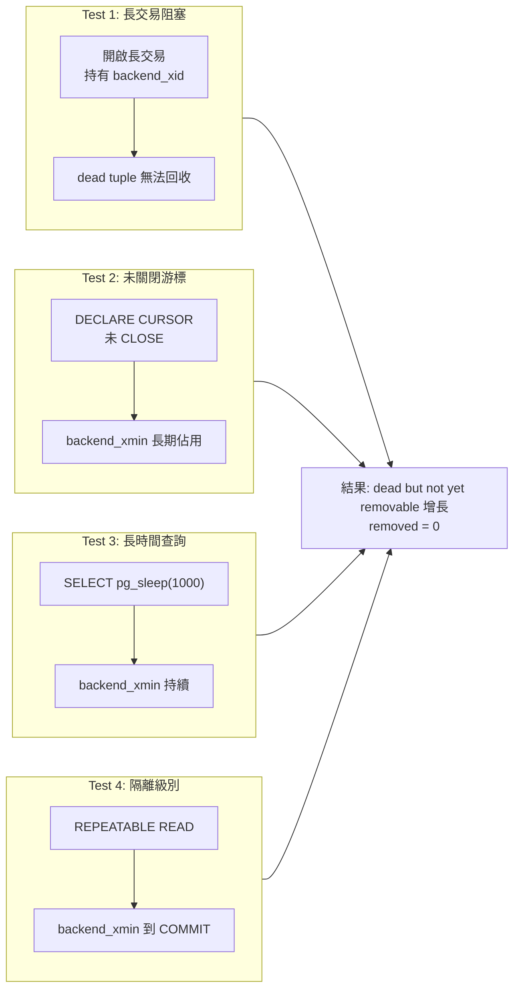

### I. Test 1：持有 XID 的長事務阻塞 Vacuum

正常壓測時 log 顯示 dead tuple 可正常回收：

```
tuples: 500001 removed, 1710872 remain, 0 are dead but not yet removable
tuples: 499647 removed, 1844149 remain, 0 are dead but not yet removable
```

開啟一個持有 transaction ID 的長事務：

```sql
-- Session A
BEGIN;
SELECT txid_current();    -- 例如 314030959
SELECT pg_backend_pid();  -- 例如 6073

-- Session B 查詢
SELECT backend_xid, backend_xmin FROM pg_stat_activity WHERE pid = 6073;
--  backend_xid  | backend_xmin
-- --------------+--------------
--   314030959   |  314030959

-- txid_current_snapshot 顯示該事務未結束
SELECT * FROM txid_current_snapshot();
-- 314030959:314030981:314030959
```

Log 立即顯示 dead tuple 無法回收，數字不斷增長：

```
tuples: 0 removed, 2391797 remain, 500001 are dead but not yet removable
tuples: 0 removed, 2459288 remain, 500001 are dead but not yet removable
tuples: 0 removed, 2713489 remain, 760235 are dead but not yet removable
tuples: 0 removed, 3023757 remain, 760235 are dead but not yet removable
tuples: 0 removed, 3135900 remain, 1137469 are dead but not yet removable
```

表與索引明顯膨脹（146 MB → 781 MB，index 43 MB → 308 MB）：

```sql
\dt+ tbl   -- 781 MB（原來 146 MB）
\di+ tbl_pkey  -- 308 MB（原來 43 MB）
```

結束該事務後，此前無法回收的垃圾全部釋放：

```sql
-- Session A
END;

-- Log 顯示回收恢復
tuples: 13629196 removed, 2515757 remain, 500001 are dead but not yet removable
tuples: 7183691 removed, 11252550 remain, 0 are dead but not yet removable
```

> 👉 **生產對照**：長交易結束後 VACUUM 的回收速度是爆發式的（大量 dead tuple 積壓一次清）。在生產中如果看到某時段突然大量回收，通常表示之前卡住的長交易結束了。這種情況下磁盤用量會先暴增再回落——對應到監控告警：先收到「磁盤用量過高」，幾分鐘後自動恢復。排查時關鍵是找出「誰卡住了」。

### II. Test 2：未關閉的游標阻塞 Vacuum

`backend_xmin` 在游標關閉前持續有效。游標本身不持有 XID，但只要游標存在，它所屬的 snapshot 就一直有效。

```sql
-- Session A
BEGIN;
DECLARE c1 CURSOR FOR SELECT 1 FROM pg_class;

-- Session B 查詢
SELECT backend_xid, backend_xmin FROM pg_stat_activity WHERE pid = 3823;
--  backend_xid | backend_xmin
-- -------------+--------------
--              |      5517228

-- Session A 取完數據但未關游標
FETCH ALL FROM c1;
-- 此時 backend_xmin 仍為 5517228
```

XID > 5517228 的事務產生的垃圾無法回收：

```sql
INSERT INTO t VALUES (1);
DELETE FROM t;
VACUUM VERBOSE t;
-- INFO:  "t": found 0 removable, 1 nonremovable row versions in 1 out of 1 pages
-- DETAIL:  1 dead row versions cannot be removed yet.
```

關閉游標後 `backend_xmin` 釋放，垃圾可回收：

```sql
CLOSE c1;
-- backend_xid | backend_xmin
-- -------------+--------------
--              |

VACUUM VERBOSE t;
-- INFO:  "t": removed 1 row versions in 1 pages
-- INFO:  "t": found 1 removable, 0 nonremovable row versions
```

> 👉 **生產對照**：游標問題在生產中特別隱蔽——ORM（Hibernate、Entity Framework、Django ORM）可能隱式建立 server-side cursor（如 `cursor.execute()` 後不關），開發者完全不會意識到。辨識方法：`pg_stat_activity` 中 `backend_xmin` 不為 NULL 但 `backend_xid` 為 NULL 的 session，通常是游標未關。

### III. Test 3：長時間查詢阻塞 Vacuum

`backend_xmin` 持續到 SQL 執行結束。一個長時間執行的 SELECT（即使不做任何修改）足以阻塞 VACUUM。

```sql
BEGIN;
SELECT pg_sleep(1000);
-- backend_xmin 持續為某值直到 cancel 或執行完
-- Ctrl+C cancel 後 backend_xmin 釋放
```

### IV. Test 4：Repeatable Read / Serializable 隔離級別

`backend_xmin` 持續到整個事務 COMMIT。這是因為 REPEATABLE READ 和 SERIALIZABLE 隔離級別必須保證整個事務期間看到的資料一致（同一個 snapshot）。

```sql
BEGIN ISOLATION LEVEL REPEATABLE READ;
SELECT 1;
-- backend_xmin 持續存在直到 COMMIT
COMMIT;
-- backend_xmin 釋放
```

> 👉 **生產對照**：Test 3（長時間查詢）和 Test 4（隔離級別）在生產中常組合出現：(1) 報表系統用 REPEATABLE READ 跑長查詢 → snapshot 卡住數分鐘；(2) `pg_dump` 隱式使用 REPEATABLE READ → 備份期間 VACUUM 無法回收。解決方案：報表系統用 READ COMMITTED + 必要時 `pg_dump -j` 並行備份加快速度；PG 9.6+ 設定 `idle_in_transaction_session_timeout` 和 `old_snapshot_threshold`。

### V. Test 5：持續並發批量更新導致 Bloat

100 萬 row 的表，10 個 process 各自持續更新 10 萬 row：

```sql
-- t1.sql: UPDATE tbl SET info=info,crt_time=clock_timestamp() WHERE id >= 1 AND id < 100000;
-- t2.sql: WHERE id >= 100001 AND id < 200000;
-- ... t10.sql: WHERE id >= 900001 AND id <= 1000000;

pgbench -M prepared -n -r -f ./t1.sql -c 1 -j 1 -T 500000 &
# ... 10 個同時跑
```

結果：出現大量 `dead but not yet removable`，表從 73 MB 膨脹到 **554 MB**，index 從 21 MB 膨脹到 **114 MB**：

```
tuples: 0 removed, 2049809 remain, 999991 are dead but not yet removable
tuples: 0 removed, 2864735 remain, 1141307 are dead but not yet removable
```

三個並發問題疊加：(1) 垃圾產生速度 > 回收速度 (2) FSM 剩餘空間不足 → extend block (3) vacuum 過程中其他 process 持有排他鎖 → not yet removable。

**解法**：將單個事務的更新粒度大幅降低（改為單 row 隨機更新 + 極短事務）：

```sql
CREATE SEQUENCE seq CACHE 10;
UPDATE tbl SET info = info, crt_time = clock_timestamp()
WHERE id = mod(nextval('seq'), 2000001);

pgbench -M prepared -n -r -f ./test.sql -c 20 -j 10 -T 500000
```

結果：not yet removable 極少（< 1000），半小時後表體積穩定：

```sql
-- tbl: 75 MB（起始 73 MB，未膨脹）
-- tbl_pkey: 21 MB（起始 21 MB，未膨脹）
```

> 👉 **生產對照**：這個測試最接近實際生產場景——電商網站的庫存更新、社交平台的按讚數更新都是這種持續並發小更新的模式。關鍵教訓：(1) 將事務粒度控制到單行而非批量；(2) 使用 `fillfactor` 為熱表預留空間（如設為 80），讓 HOT UPDATE 有更多機會在同 page 完成；(3) 監控 `n_dead_tup` 的增長速率，而非只看絕對值。

### VI. Test 6：autovacuum_naptime 過長

將 `autovacuum_naptime = 1000` 秒後壓測：

```sql
SELECT * FROM pg_stat_all_tables WHERE relname = 'tbl';
-- n_dead_tup: 7,895,450（接近 800 萬 dead tuple）
-- n_live_tup: 2,328,301
```

表膨脹：73 MB → 393 MB，index 21 MB → 115 MB。

> 👉 **生產對照**：naptime 預設 60s 在多數場景下足夠，但在高寫入吞吐的系統（如每秒 10k+ UPDATE）中，60 秒內可以產生數十萬 dead tuple。建議生產環境將 naptime 調為 1-10s。代價是 launcher 更頻繁掃描 `pg_stat_user_tables`，CPU overhead 極小。注意：若已有 long transaction 導致垃圾無法回收，過短的 naptime 會讓 worker 反覆無效掃描，反而浪費 IO。

---

## 3. 預防與優化：生產環境配置 Checklist

> 以下按「生產上線前必做 → 建議 → 監控」的優先級排列。每個項目附帶具體配置值和適用場景。

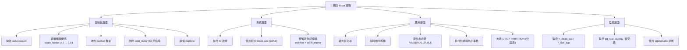

### 第 1 步：基礎配置（任何生產環境必做）

```ini
# postgresql.conf — 生產環境最低配置
autovacuum = on                                # 必須開啟（預設 on，但務必確認）

# 觸發閾值：不要等 dead tuple 達到 20% 才回收
autovacuum_vacuum_scale_factor = 0.01          # 大表建議 0.01~0.05（預設 0.2）
autovacuum_analyze_scale_factor = 0.005        # 預設 0.1
autovacuum_vacuum_threshold = 50               # 基礎閾值保持預設
autovacuum_naptime = 10s                       # 預設 60s，建議降至 1~10s

# PG 12+：INSERT-only 表也要 VACUUM（推進 freeze horizon）
autovacuum_vacuum_insert_scale_factor = 0.1    # 預設 0.2
autovacuum_vacuum_insert_threshold = 500       # 預設 1000
```

> PG 13+：所有 autovacuum 參數支援 **per-table** 設定。對超大表（> 10GB），建議：
> ```sql
> ALTER TABLE huge_table SET (
>   autovacuum_vacuum_scale_factor = 0.005,
>   autovacuum_vacuum_threshold = 1000
> );
> ```

### 第 2 步：資源配置（依據硬體調整）

```ini
# Worker 與記憶體
autovacuum_max_workers = 5                     # 預設 3，建議 = CPU 核數 × 0.3 ~ 0.5
autovacuum_work_mem = 1GB                      # 預設 -1（沿用 maintenance_work_mem 64MB）

# IO 速度控制
autovacuum_vacuum_cost_delay = 0               # NVMe SSD 環境設 0（不做 throttling）
autovacuum_vacuum_cost_limit = 2000            # HDD 環境調高 limit 再設 delay=2ms
```

**資源計算**：`autovacuum_max_workers × autovacuum_work_mem` 不得超過系統可用記憶體的 20%。

> PG 14+：`maintenance_io_concurrency = 10` 控制 VACUUM/ANALYZE 的 prefetch 並發（SSD 環境建議 10~50）。
>
> PG 16+：`vacuum_buffer_usage_limit = '2MB'` 限制單個 vacuum 的 shared buffer 佔用，防止擠出 hot data。

### 第 3 步：防禦性參數（防止長交易永久阻塞）

```ini
# PG 9.6+：自動 kill 掛著不 COMMIT 的 session
idle_in_transaction_session_timeout = 10min    # 超過 10 分鐘的 idle-in-transaction 自動斷開

# PG 9.6+：snapshot 生命週期上限（有取捨，慎用）  
# old_snapshot_threshold = 1h                  # 超時的 snapshot 回報 "snapshot too old" error
```

**Caution**：
- `idle_in_transaction_session_timeout` 會 kill connection → 需確保應用有 retry 機制。
- `old_snapshot_threshold` 會導致 long-running query 報錯 → 不適用報表系統，且 standby 不支援。
- 備庫 `hot_standby_feedback = on` 會將 standby 的 OldestXmin 回報給 primary，阻止 primary VACUUM。如有讀寫分離架構，需額外關注 standby 上的 long query。

### 第 4 步：應用層守則（開發者 Checklist）

| # | 守則 | 為什麼 | 工具/做法 |
|---|------|--------|----------|
| 1 | 事務越短越好 | `backend_xmin` 佔用越短 → VACUUM 回收越快 | 避免在 transaction 內做 HTTP call、file IO |
| 2 | 批量操作拆分小事務 | 單一事務產生大量 dead tuple → 膨脹 | 每次 DELETE/UPDATE 1k~10k 行就 COMMIT |
| 3 | 預設用 READ COMMITTED | RR / Serializable 的 snapshot 卡到 COMMIT | `@Transactional(isolation=READ_COMMITTED)` |
| 4 | 用 Partition 取代 DELETE | `DROP PARTITION` 瞬間釋放空間 | `PARTITION BY RANGE (created_at)` |
| 5 | ORM 游標用完即關 | 未關閉的 server-side cursor 會卡 `backend_xmin` | 檢查 `@QueryHint(cursor=true)` 或 `scrollableCursor` |
| 6 | 大表備份用 parallel | `pg_dump` 隱式 RR，單線程慢 → snapshot 卡更久 | `pg_dump -j 4` |
| 7 | UPDATE 只動非索引欄（HOT） | HOT UPDATE 不產生 index entry → 索引不膨脹 | 避免對高頻更新欄位建 index |
| 8 | `fillfactor` 給熱表留空間 | 讓 HOT UPDATE 在同 page 完成 → 減少 index bloat | 熱表設 `fillfactor = 80` |

> **生產陷阱**：`hot_standby_feedback = on` + standby 上有 long query → standby 的 OldestXmin 回報給 primary → **primary 的 VACUUM 被 standby 阻塞**。常見於讀寫分離架構（primary write + standby read）。排查：檢查 standby 上的 `pg_stat_activity`。

### 第 5 步：監控設置（必須 Alert 的指標）

```sql
-- 1. Dead Tuple Ratio：定時跑、設定 Alert
SELECT relname,
       round(100.0 * n_dead_tup / NULLIF(n_live_tup + n_dead_tup, 0), 1) AS dead_pct
FROM pg_stat_user_tables
WHERE n_dead_tup > 1000
ORDER BY dead_pct DESC;
-- Alert: dead_pct > 30% → Warning, > 50% → Critical

-- 2. 長交易監控（找出阻塞 VACUUM 的 session）
SELECT pid, usename,
       now() - xact_start AS xact_age,
       state, left(query, 100) AS query
FROM pg_stat_activity
WHERE (backend_xid IS NOT NULL OR backend_xmin IS NOT NULL)
  AND state <> 'idle'
ORDER BY xact_start;
-- Alert: xact_age > 5min → Warning

-- 3. Table Age (防止 XID Wraparound)
SELECT relname, age(relfrozenxid) AS table_age
FROM pg_class
WHERE relkind = 'r'
ORDER BY age(relfrozenxid) DESC
LIMIT 10;
-- Alert: age > 200M → Warning, > 1B → Critical

-- 4. 精確診斷（懷疑某表有問題時）
CREATE EXTENSION IF NOT EXISTS pgstattuple;
SELECT * FROM pgstattuple('suspect_table');
-- dead_tuple_percent > 20% → 安排 vacuum/repack
```

### 第 6 步：已膨脹的緊急處置

| 方案 | 鎖定 | 適用場景 |
|------|------|---------|
| `VACUUM FULL` / `CLUSTER` | AccessExclusiveLock（全程鎖表） | 維護窗口可用、內建無需裝 extension |
| `pg_repack` | 僅 FILENODE 切換時毫秒級鎖 | **生產首選**，線上不中斷服務 |
| `REINDEX CONCURRENTLY` | 不需鎖表 | 僅 index bloat，表本身正常時用（PG 12+） |
| DROP PARTITION | 短暫 AccessExclusiveLock | 分區表直接刪除不需要的分區 |

---

## 4. 原始碼參考（生產 Debug 用）

> 以下原始碼檔案在**生產排查時極少需要直接看**，但當 `pg_stat_activity` 和系統表查不到你要的資訊時，原始碼是你理解 PostgreSQL 內部行為的最終參考。

| 檔案 | 做什麼 | 生產場景 |
|------|--------|---------|
| `src/backend/postmaster/autovacuum.c` | autovacuum daemon 排程：定期喚醒 → 檢查哪些表需要 vacuum → 分派 worker | 想知道為什麼某張表一直沒被 vacuum？Launcher 的檢查邏輯在這裡 |
| `src/backend/utils/time/tqual.c` | VACUUM 核心回收判斷：`xmax < OldestXmin` → 可回收；`xmax >= OldestXmin` → 不可回收 | 理解「為什麼 dead but not yet removable」的演算法依據 |
| `src/backend/storage/ipc/sinvaladt.c` | 從 shared memory 查詢 backend 的 `backend_xid` 和 `backend_xmin` | `pg_stat_activity` 的 `backend_xmin` 欄位資料來源。想理解 snapshot 機制如何跨 process 傳遞就看這裡 |

---

## 5. 版本變遷速查

> 以下梳理各 PG 版本中 VACUUM 相關的重大變更。**升級考量**欄幫助你評估從舊版升級時需要改什麼配置、關注什麼風險。

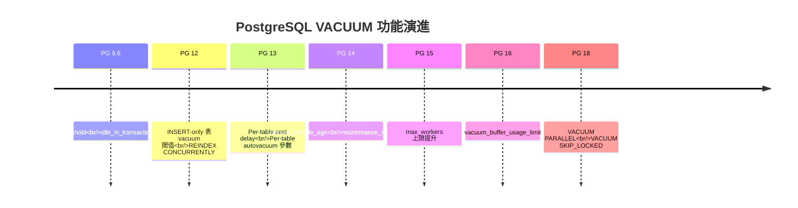

| 功能 | 版本 | 說明 | 升級考量 |
|------|------|------|---------|
| `idle_in_transaction_session_timeout` | 9.6 | 自動 kill 掛著不 COMMIT 的 session | 從 < 9.6 升級後建議立即設定為 `10min`。可能導致舊 APP 連線中斷 — 需確認應用有 retry 機制 |
| `old_snapshot_threshold` | 9.6 | snapshot 生命週期上限，超時報錯 | 慎用：會 kill long query。對報表系統、資料遷移腳本不適用 |
| `autovacuum_vacuum_insert_threshold` / `insert_scale_factor` | 12 | INSERT-only 表獨立真空閾值 | 升級到 12+ 後 INSERT-heavy workload 的 freeze 更主動，WAL 量微幅增加 |
| `REINDEX CONCURRENTLY` | 12 | 不鎖表重建索引 | 升級後 index bloat 處置更簡單，不需 rebuild 整張表 |
| Per-table `autovacuum` 參數 | 13 | 每張表可獨立設定 vacuum 策略 | 升級後建議對超大表單獨調低 `vacuum_scale_factor` |
| `vacuum_failsafe_age` | 14 | 防止 XID wraparound shutdown 的最後防線 | 升級到 14+ 後 wraparound risk 大幅降低，即使長交易存在 |
| `maintenance_io_concurrency` | 14 | VACUUM/ANALYZE 的 prefetch 並發 | SSD 環境建議設 10~50，HDD 保持預設 |
| `autovacuum_max_workers` 上限提升 | 15 | 支援更多 concurrent worker | 升級後可增加 worker 數，但需確保記憶體（worker × work_mem）充足 |
| `vacuum_buffer_usage_limit` | 16 | 限制單個 vacuum 的 shared buffer 佔用 | 防止 vacuum 擠出 hot data。預設 256KB，生產可調高至 `2MB` |
| `VACUUM PARALLEL` | 18 | 索引 cleanup 並行處理 | 大幅加速大表的 index vacuum。升級後 `max_parallel_maintenance_workers` 控制並發度 |
| `VACUUM SKIP_LOCKED` | 18 | 跳過無法鎖定的 relation | 避免因單表被鎖導致整個 vacuum job 卡住 |

## 參考

- [PostgreSQL物理"备库"的哪些操作或配置，可能影响"主库"的性能、垃圾回收、IO波动](https://github.com/digoal/blog/blob/master/201704/20170410_03.md)

---

# 二、PostgreSQL 收縮膨脹表/索引 — VACUUM FULL vs pg_repack vs pg_squeeze

> 來源：[digoal - PostgreSQL 收縮膨脹表或索引 — pg_squeeze or pg_repack (2016-10-30)](https://github.com/digoal/blog/blob/master/201610/20161030_02.md)
>
> 相關：
> - [pg_repack](https://github.com/reorg/pg_repack)
> - [pg_squeeze (Cybertec)](http://www.cybertec.at/en/products/pg_squeeze-postgresql-extension-to-auto-rebuild-bloated-tables/)

---

## 1. 表膨脹（Bloat）的成因與後果

### 回顧：Bloat 的本質

PostgreSQL 的 UPDATE / DELETE 產生 dead tuple，由 VACUUM 回收。**Bloat = dead tuple 堆積未被回收** 導致表空間遠大於實際資料所需。

### 生產決策：何時該「重建」而非等待 VACUUM？

一般 VACUUM 只標記空間可重用、不歸還磁盤給 OS。當以下任一情況出現，應該考慮重建而非等待：

| 指標 | 臨界值 | 工具 |
|------|--------|------|
| `dead_tuple_percent`（pgstattuple） | > 30% | `SELECT * FROM pgstattuple('table');` |
| `n_dead_tup` 持續增長但 `last_autovacuum` 正常 | dead ratio > 20% | `pg_stat_user_tables` |
| 查詢延遲明顯高於 baseline | latency ↑ 3x+ | APM / `auto_explain` |
| Disk 用量 > 預期 × 3 且 `n_live_tup` 沒變 | — | `pg_total_relation_size()` |

```sql
-- 一鍵評估：哪些表該重建了
SELECT relname,
       n_live_tup,
       n_dead_tup,
       round(100.0 * n_dead_tup / NULLIF(n_live_tup + n_dead_tup, 0), 1) AS dead_pct,
       pg_size_pretty(pg_total_relation_size(relid)) AS total_size,
       last_autovacuum,
       CASE WHEN n_dead_tup * 1.0 / NULLIF(n_live_tup, 0) > 0.3 
            THEN '⚠️ 建議 rebuild' ELSE 'OK' END AS action
FROM pg_stat_user_tables
WHERE n_dead_tup > 1000
ORDER BY n_dead_tup DESC;
```

### Bloat 對生產的實際影響

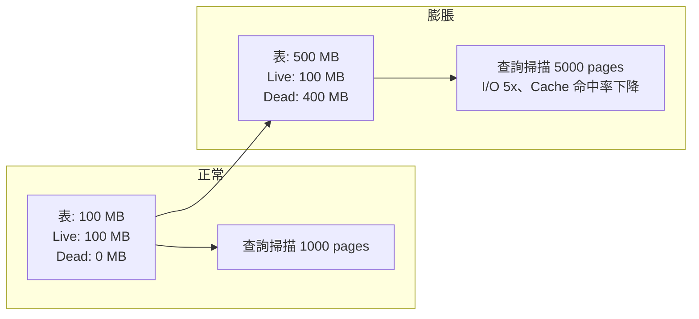

| 後果 | 生產表現 |
|------|---------|
| 查詢變慢 | 相同 SQL 延遲從 50ms → 250ms。由 I/O 增加而非資料增加造成，容易被誤判為「資料量成長」 |
| Cache 效率降低 | `shared_buffers` 被 dead tuple 佔據 → `pg_stat_bgwriter.buffers_backend` 飆升 |
| 備份變慢 | `pg_dump` 必須逐 page 掃描，dead page 也必須讀 → 備份時間翻倍 |
| Replication lag 增加 | WAL 量不變但 standby apply 時需處理更多 page → lag 增加 |
| 無法使用 Index-Only Scan | VM 被重置 → engine 被迫 access heap → 查詢從 I/O-free 變 I/O-bound |

---

## 2. 三種重建方案深度對比

當 Bloat 已經發生、一般 VACUUM 無法收縮時（因為一般 VACUUM 只標記空間可重用，不歸還磁盤空間給 OS），需要重建整張表。

> **生產選型速查**：
> - 有維護窗口 → `VACUUM FULL`（最簡單、最徹底）
> - 無維護窗口 + 任何表 → **`pg_repack`**（生產驗證最成熟）
> - 高寫入吞吐 + 有 PK → `pg_squeeze`（需監控 WAL slot）
> - 僅 index bloat → `REINDEX CONCURRENTLY`（PG 12+，最快）

### I. VACUUM FULL / CLUSTER

```sql
VACUUM FULL table_name;
CLUSTER table_name USING index_name;
```

**新手理解**：VACUUM FULL 會建立一個全新的表檔案（新的 FILENODE），把舊表中所有 live tuple 一行一行複製過去，然後刪除舊檔案。因為是全新的檔案，所有 dead tuple 自然都被拋棄，空間完全歸還 OS。

- **鎖**：ACCESS EXCLUSIVE（排他鎖），整個重建期間阻塞所有讀/寫
- **機制**：完整重寫表（new FILENODE），複製 live row → 刪除舊檔案
- **優點**：內建、不需 extension、回收最徹底（包括 index bloat）
- **缺點**：鎖表時間長（取決於表大小），對線上系統不可接受

**生產 Lock 時間估算**（NVMe SSD 環境）：

| 表大小 | 預估鎖定時間 | 建議 |
|--------|------------|------|
| < 10 GB | < 30s | 凌晨維護窗口可接受 |
| 10-100 GB | 1-10 分鐘 | 需評估業務影響 |
| 100 GB - 1 TB | 10 分鐘 - 2 小時 | 不建議，改用 pg_repack |
| > 1 TB | > 2 小時 | 不可行，必須用 pg_repack |

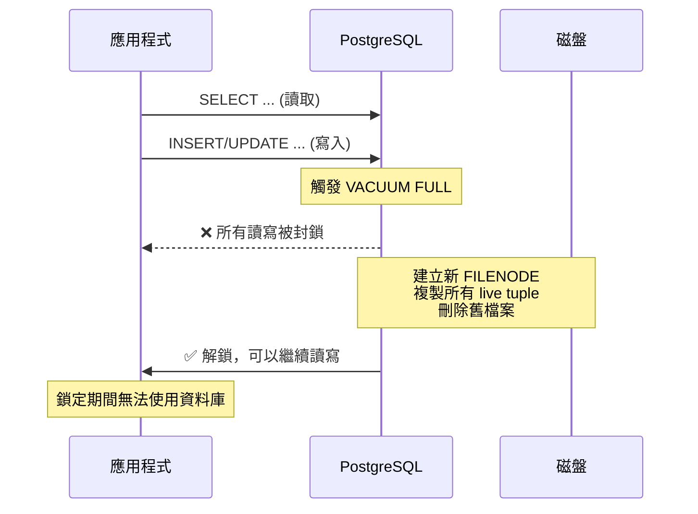

### II. pg_repack（源自 pg_reorg）

```bash
pg_repack -t table_name -d database
```

**新手理解**：pg_repack 的核心思路是「不鎖表，用 trigger 追蹤變更」。它在背景建立一張新的目標表，同時在原始表上裝一個「監視器」（trigger）記錄所有後續的增刪改。等複製完舊資料後，再把監視器記錄的變化補上去，最後瞬間切換。

- **鎖**：只在最終 FILENODE 切換時短暫持有 ACCESS EXCLUSIVE（毫秒級）
- **機制**：
  1. 建立一張新的 target table（複製原始結構）
  2. **建立 AFTER INSERT / UPDATE / DELETE trigger** 在原始表上，記錄增量 delta
  3. 批次複製原始數據到 target table
  4. 在 target table 上應用增量 delta（replay trigger 記錄的變更）
  5. 切換 FILENODE（鎖定極短）
- **優點**：生產驗證最成熟、支援 index 重建/重排
- **缺點**：**trigger 帶來的 DML 效能開銷**（每個 INSERT/UPDATE/DELETE 都要寫入 delta log table）

**生產執行時長參考**（NVMe SSD，低負載環境）：

| 表大小 | pg_repack 耗時 | DML overhead 期間 |
|--------|---------------|-------------------|
| < 10 GB | < 5 分鐘 | 幾乎無感 |
| 10-100 GB | 5-30 分鐘 | DML 延遲 +5~15% |
| 100 GB - 1 TB | 30 分鐘 - 4 小時 | DML 延遲 +10~20% |
| > 1 TB | > 4 小時 | 需評估，可分批 repack index 或 partition |

> **生產技巧**：pg_repack 支援 `--jobs=N` 並行索引重建（PG 12+）。對多索引的大表，`--jobs=4` 可將總耗時縮短 2-3 倍。

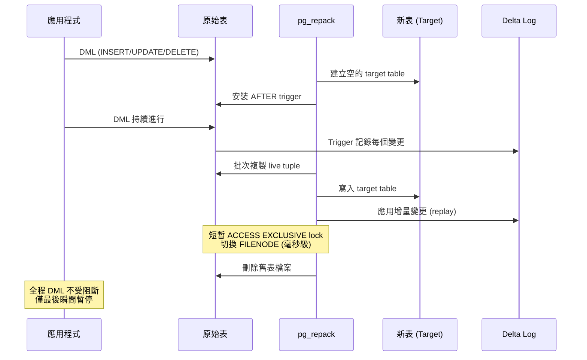

### III. pg_squeeze

**新手理解**：pg_squeeze 用了一個更聰明的方法來追蹤變更——直接讀取 WAL（Write-Ahead Log，預寫日誌）。所有對資料庫的變更都會寫入 WAL，pg_squeeze 透過邏輯解碼（Logical Decoding）從 WAL 中提取重建期間的變化。這樣就不需要在原始表上裝 trigger，對 DML 效能幾乎零影響。

- **鎖**：與 pg_repack 相同，僅 FILENODE 切換時短暫鎖定
- **機制**：
  1. 建立 target table
  2. 建立 **logical replication slot**，通過 logical decoding 從 WAL（XLOG）中讀取重建期間的增量變更
  3. 批次複製原始數據到 target table
  4. 應用 WAL 中解碼的增量（不需 trigger）
  5. 切換 FILENODE
- **必要條件**：表必須有 **PRIMARY KEY 或 UNIQUE KEY**（logical decoding 需要 replica identity 來識別哪一行被修改）
- **優點**：不需 trigger → 重建期間對原表 DML **幾乎無效能影響**；支援**自動觸發**（設定 bloat 閾值，background worker 定時檢查並自動重建）
- **缺點**：消耗 replication slot（需預留足夠 `max_replication_slots`）；WAL 產生量增加（logical decoding 需要 WAL level ≥ `replica`）

> 補充（Senior Dev）：
>
> **pg_squeeze 的 replication slot 風險**：logical decoding 依賴 replication slot 保持 WAL 不被回收。如果 pg_squeeze background worker 故障或重建時間過長，slot 可能堆積大量 WAL → disk 爆滿。務必監控 `pg_replication_slots` 的 `restart_lsn` 與當前 WAL LSN 的差距，設置 alert。
>
> pg_squeeze 原為 Cybertec 開發，但社群活躍度不如 pg_repack（2016 年後更新少）。**生產建議**：
> - 通用場景 → **pg_repack**（最成熟、最廣泛使用）
> - 需要自動化 + trigger overhead 不可接受 → pg_squeeze（但需監控 slot）
> - 僅 index bloat → **REINDEX CONCURRENTLY**（PG 12+），完全不需要重建表

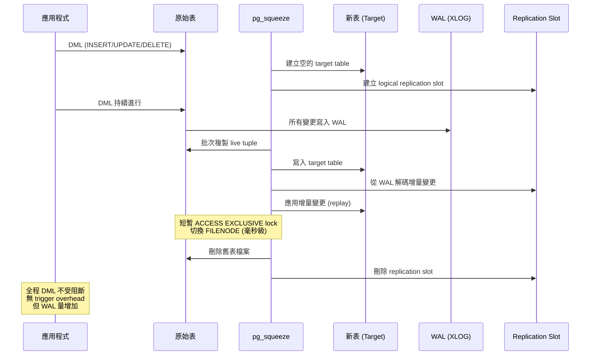

---

## 3. 三方案全面對比

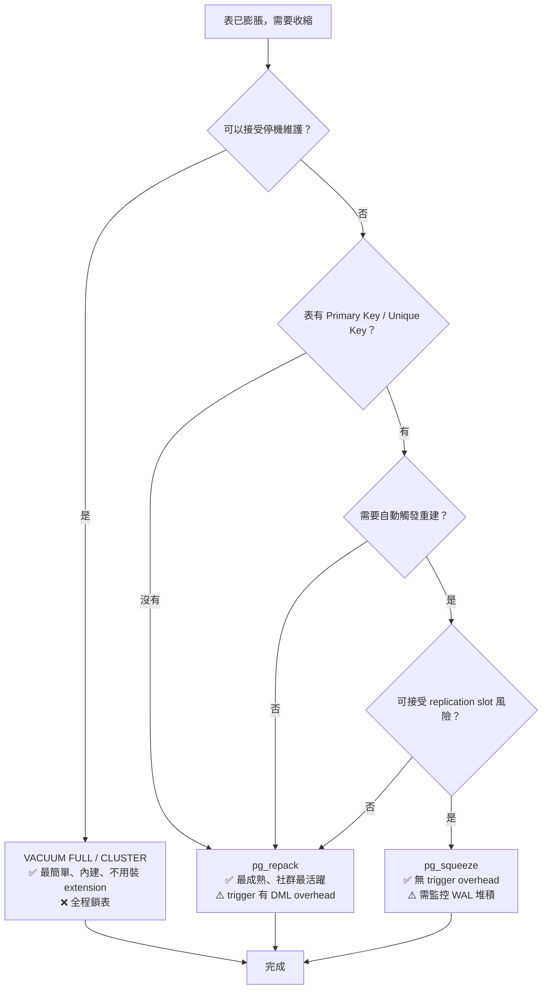

| 維度 | VACUUM FULL | pg_repack | pg_squeeze |
|------|------------|-----------|------------|
| Concurrent DML 支援 | ✗（全程排他鎖） | ✓ | ✓ |
| Exclusive Lock 時長 | 全程（數分鐘~數小時） | 僅 FILENODE 切換（毫秒） | 僅 FILENODE 切換（毫秒） |
| Delta 捕捉機制 | N/A | Trigger | Logical Decoding (WAL) |
| 對原表 DML 效能影響 | N/A（鎖住無法 DML） | Trigger overhead（~5-20%） | 極小（僅 WAL 增加） |
| 需要 PK/UK | 不需要 | 不需要 | **必須** |
| 需要 replication slot | 不需要 | 不需要 | **必須**（max_replication_slots +1） |
| WAL 開銷 | 正常 | 正常 + trigger delta | **較大**（logical decoding 需 WAL ≥ replica） |
| 自動重建 | ✗ | ✗ | ✓（background worker + bloat 閾值） |
| 支援 index 重排 | CLUSTER 支援 | ✓ | ✓ |
| PG 版本支援 | All | PG 9.4+ | PG 9.4+ |
| 成熟度 / 社群活躍 | ★★★★★（內建） | ★★★★★（生產驗證） | ★★★（2016 後更新少） |

---

## 4. 使用 pg_squeeze 的注意事項

### Replication Slot 監控（生產必備）

pg_squeeze 最大的風險是 **replication slot 堆積 WAL**。如果 background worker 故障或重建時間過長，slot 未被消費的 WAL 會無限制累積 → 磁盤爆滿。務必設置以下監控並 Alert：

```sql
-- 監控所有 replication slot 的 WAL 堆積量
SELECT slot_name, database, active,
       pg_size_pretty(pg_wal_lsn_diff(
           pg_current_wal_lsn(), restart_lsn
       )) AS wal_retained,
       restart_lsn
FROM pg_replication_slots
WHERE slot_type = 'logical';
-- Alert: wal_retained > 5 GB → Warning, > 20 GB → Critical
```

### 配置建議

1. **Replication Slot 數量**：`max_replication_slots = standby_slots + concurrent_squeeze_workers + 5` 預留緩衝
2. **高峰期保護**：設定 `squeeze.schedule` 限制只在離峰時段執行，或手動 trigger 而非自動觸發
3. **超時限制**：設定重建的 max duration，超時自動 abort → 不會卡死 slot
4. **WAL level**：必須 ≥ `replica`。檢查 `SHOW wal_level;`

### 現狀評估

pg_squeeze 原為 Cybertec 開發，2016 年後社群活躍度不如 pg_repack。**2025 年生產建議**：

| 場景 | 選擇 |
|------|------|
| 通用、任何情況 | **pg_repack** |
| 極高寫入吞吐 + trigger overhead 不可接受 + 願意承擔 slot 風險 | pg_squeeze |
| 僅 index bloat | **REINDEX CONCURRENTLY** |

---

## 5. 生產環境完整決策流程

### 決策樹：我的表膨脹了，該怎麼辦？

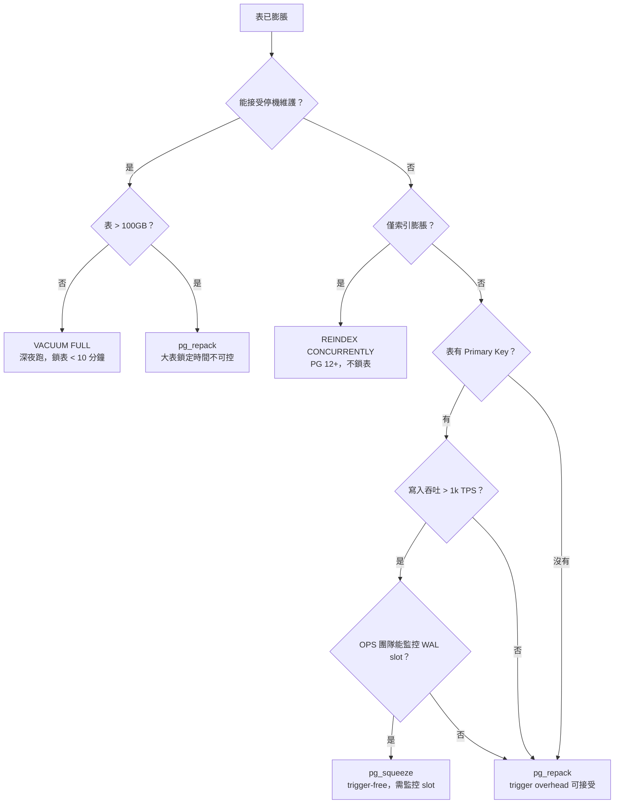

### 預防 > 治療：避免走到重建這一步

| # | 措施 | 一句話 |
|---|------|--------|
| 1 | `autovacuum_vacuum_scale_factor = 0.01` | 大表不要等 20% 才觸發 |
| 2 | `idle_in_transaction_session_timeout = 10min` | 自動 kill 掛著不 commit 的 session |
| 3 | Partition by time | `DROP PARTITION` 取代 `DELETE`，秒殺 |
| 4 | 只用 READ COMMITTED | RR/Serializable 的 snapshot 會卡到整個事務結束 |
| 5 | 批量操作拆分小事務 | 每次 1k~10k 行就 COMMIT |
| 6 | 監控 dead ratio | `n_dead_tup > n_live_tup × 0.3` → 安排 repack |

### 排程建議

```sql
-- 每小時檢查一次的監控 query，搭配 cron / pg_cron
SELECT relname,
       CASE WHEN n_dead_tup * 1.0 / NULLIF(n_live_tup, 0) > 0.5
            THEN 'CRITICAL: 建議立即 rebuild'
            WHEN n_dead_tup * 1.0 / NULLIF(n_live_tup, 0) > 0.3
            THEN 'WARNING: 安排離峰 rebuild'
            ELSE 'OK'
       END AS status
FROM pg_stat_user_tables
WHERE n_live_tup > 0
ORDER BY n_dead_tup DESC
LIMIT 10;
```

### 工具現狀速查（2025）

| 工具 | 狀態 | 推薦度 | 何時用 |
|------|------|--------|--------|
| VACUUM FULL | PG 內建 | ★★★ | 小表 + 有維護窗口 |
| pg_repack | 社群活躍 | ★★★★★ | **生產重建首選** |
| REINDEX CONCURRENTLY | PG 12+ 內建 | ★★★★★ | 僅 index bloat |
| pg_squeeze | 更新停滯 | ★★ | 特定高寫入場景 |
| pgcompacttable | 減少 dead tuple 不重建 FILENODE | ★★ | 輕度膨脹過渡方案 |

---

## 參考

1. [pg_repack](https://github.com/reorg/pg_repack)
2. [pg_squeeze Official (Cybertec)](http://www.cybertec.at/en/products/pg_squeeze-postgresql-extension-to-auto-rebuild-bloated-tables/)
3. [pg_squeeze Download](http://www.cybertec.at/download/pg_squeeze-1.0beta1.tar.gz)
